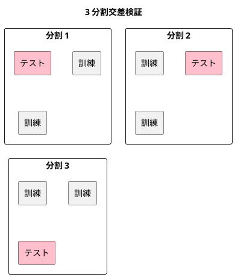

# 第 11 章: 評価指標と交差検証

## 11.1 はじめに

これまでの章では、分類モデルを正解率で、回帰モデルを決定係数や誤差で評価してきました。しかし、1 つの指標と 1 回だけの訓練・テスト分割で「良いモデル」と判断すると、見落としが生まれます。

この章では、次の 2 つを TDD で自作し、Tribuo の評価器と突き合わせます。

- **評価指標**: 分類の混同行列・適合率・再現率・F 値と、回帰の MSE・RMSE・MAE
- **K 分割交差検証**: データを K 個に分け、訓練とテストを K 回入れ替えて評価する方法

あわせて、「どの指標で評価するか」を関数として受け渡す設計を学びます。評価の手順（分割して学習し、予測して採点する）を 1 つのメソッドにまとめ、採点に使う関数だけを差し替えられるようにします。

[Python 版の第 11 章](../python/11-evaluation-metrics-and-cross-validation.md) と同じ題材を、同じ TODO リストで進めます。[Kotlin 版の第 11 章](../kotlin/11-evaluation-metrics-and-cross-validation.md) は、評価関数を `(List<T>, List<T>) -> Double` という関数型で表し、交差検証の結果を `Sequence` で返しました。Java には関数型の構文が無いので、`java.util.function` の **関数型インターフェース** `ToDoubleBiFunction` に名前を付けて使います。交差検証の結果は遅延評価の **`DoubleStream`** で返し、`Sequence` との違い（1 度しか使えない）もテストで確かめます。

## 11.2 正解率だけでは足りない理由

`Survived.csv` はタイタニック号の乗客のデータで、生存（`Survived` が 1）した人は死亡（0）した人より少なくなっています。このように正解ラベルの数が偏っていると、全員を「死亡」と予測するだけのモデルでも、正解率はそれなりに高くなります。このモデルは生存者を 1 人も見つけられないのに、正解率だけを見ると当たっているように見えます（件数は [Python 版の第 11 章](../python/11-evaluation-metrics-and-cross-validation.md) を参照してください）。

そこで、予測の当たり外れを 4 つに分けて数える **混同行列** を使います。ここでは「生存」を正例（見つけたいほう）とします。

| | 正例と予測 | 負例と予測 |
|---|-----------|-----------|
| **実際は正例** | TP（真陽性） | FN（偽陰性） |
| **実際は負例** | FP（偽陽性） | TN（真陰性） |

混同行列から、目的に応じた指標を求めます。

| 指標 | 式 | 意味 |
|------|-----|------|
| 適合率（precision） | TP / (TP + FP) | 正例と予測したうち、本当に正例だった割合 |
| 再現率（recall） | TP / (TP + FN) | 本当の正例のうち、正例と予測できた割合 |
| F 値（F1） | 2 × 適合率 × 再現率 / (適合率 + 再現率) | 適合率と再現率の調和平均 |

回帰では、予測と正解の差（誤差）を集計します。

| 指標 | 意味 |
|------|------|
| MSE（平均二乗誤差） | 誤差の 2 乗の平均 |
| RMSE（平均二乗誤差の平方根） | MSE の平方根。正解と同じ単位になる |
| MAE（平均絶対誤差） | 誤差の絶対値の平均 |

RMSE と MAE は、第 7 章で `RegressionMetrics.rootMeanSquaredError`・`meanAbsoluteError` として作りました。この章ではそれを再利用し、MSE だけを足します。

## 11.3 TODO リストの作成

**TODO リスト**:

- [ ] 混同行列を数える
  - [ ] 正例と負例の当たり外れを数える
  - [ ] どちらのラベルを正例にするかを指定できる
  - [ ] 正解と予測の件数が違えばエラーにする
- [ ] 適合率・再現率・F 値を求める
  - [ ] 分母が 0 のときは 0 にする
- [ ] MSE を求め、第 7 章の RMSE・MAE と並べる
- [ ] K 分割のテストデータを作る
  - [ ] ほぼ均等な件数に分ける
  - [ ] どの行もちょうど一度だけテストデータになる
  - [ ] シードで分け方が決まる
- [ ] 交差検証で分割ごとのスコアを求める
  - [ ] 評価関数を差し替えられる
  - [ ] 必要な分だけ学習する（遅延評価）
- [ ] 混同行列の指標を、正解と予測から求める評価関数に変える
- [ ] Tribuo の評価器と結果を突き合わせる
- [ ] 実データで交差検証の平均を表示する

## 11.4 混同行列を数える

### Red: 最初のテスト

最初のテストは、5 件の正解と予測から混同行列を数えるものです。ラベルは架空の整数 1・0 にし、1 を正例とします。

```java
// src/test/java/chapter11/MetricsTest.java
@Test
@DisplayName("正例と負例の予測の当たり外れを数える")
void confusionMatrix() {
  var actual = List.of(1, 1, 1, 0, 0);
  var predicted = List.of(1, 1, 0, 1, 0);

  assertThat(ConfusionMatrix.of(actual, predicted, 1)).isEqualTo(new ConfusionMatrix(2, 1, 1, 1));
}
```

`ConfusionMatrix` がまだ無いので、コンパイルが最初の Red になります。

```text
/…/apps/java/src/test/java/chapter11/MetricsTest.java:16: エラー: シンボルを見つけられません
    assertThat(ConfusionMatrix.of(actual, predicted, 1)).isEqualTo(new ConfusionMatrix(2, 1, 1, 1));
               ^
  シンボル:   変数 ConfusionMatrix
  場所: クラス MetricsTest
エラー2個

> Task :compileTestJava FAILED
```

### Green: 仮実装

混同行列は 4 つの件数を持つだけの値なので、**record** にします。Kotlin 版の `data class ConfusionMatrix(val tp: Int, …)` と同じく、`equals`・`hashCode`・`toString` が中身で比べる形になります。成分が `int` なので、第 2 章の `Features` や第 7 章の `Matrix` で配列が引き起こした問題（既定の `equals` が参照を比べる）はありません。

正解と予測を受け取る生成用のメソッドは、record の中に `static` で置きます。ラベルの型は分類によって違う（この章の実データでは文字列、テストでは整数）ので、**型引数 `<T>`** を付けます。まずは期待値をそのまま返す仮実装にします。

```java
// src/main/java/chapter11/ConfusionMatrix.java（仮実装）
public record ConfusionMatrix(int tp, int fp, int fn, int tn) {
  public static <T> ConfusionMatrix of(List<T> actual, List<T> predicted, T positive) {
    return new ConfusionMatrix(2, 1, 1, 1);
  }
}
```

### 三角測量

「どちらのラベルを正例とするか」を変えたテストを足して、仮実装を一般化させます。

```java
@Test
@DisplayName("どちらのラベルを正例とするかで数え方が変わる")
void positiveLabel() {
  var actual = List.of(1, 1, 1, 0, 0, 0);
  var predicted = List.of(1, 0, 0, 0, 0, 1);

  assertThat(ConfusionMatrix.of(actual, predicted, 0))
      .isEqualTo(new ConfusionMatrix(2, 2, 1, 1));
}
```

```text
MetricsTest > どちらのラベルを正例とするかで数え方が変わる FAILED
    org.opentest4j.AssertionFailedError: 
    expected: ConfusionMatrix[tp=2, fp=2, fn=1, tn=1]
     but was: ConfusionMatrix[tp=2, fp=1, fn=1, tn=1]

MetricsTest > 正例と負例の予測の当たり外れを数える PASSED
```

record の `toString` が成分名つきで表示するので、どの件数が違うかが失敗メッセージから読めます。1 件ずつ正例かどうかを判定して数える実装にします。

```java
  public static <T> ConfusionMatrix of(List<T> actual, List<T> predicted, T positive) {
    int tp = 0;
    int fp = 0;
    int fn = 0;
    int tn = 0;
    for (int i = 0; i < actual.size(); i++) {
      boolean isPositive = actual.get(i).equals(positive);
      boolean predictedPositive = predicted.get(i).equals(positive);
      if (isPositive && predictedPositive) {
        tp++;
      } else if (predictedPositive) {
        fp++;
      } else if (isPositive) {
        fn++;
      } else {
        tn++;
      }
    }
    return new ConfusionMatrix(tp, fp, fn, tn);
  }
```

Kotlin 版は `actual.zip(predicted)` で組を作り、`count` で 4 回数えました。Java の標準ライブラリには 2 つのリストを組にする `zip` が無いので、添字のループで 1 回だけ走査して 4 つの件数を同時に数えます。ラベルの比較には `==` ではなく `equals` を使います。`List<Integer>` の要素は箱詰めされた `Integer` なので、`==` では参照を比べてしまうからです。

### 件数が違うときは黙って切り詰めない

正解と予測の件数が違うのは、呼び出し側の誤りです。エラーになることをテストで確かめます。

```java
@Test
@DisplayName("正解と予測の件数が違えばエラーになる")
void sizeMismatch() {
  assertThatThrownBy(() -> ConfusionMatrix.of(List.of(1, 0), List.of(1, 0, 1), 1))
      .isInstanceOf(IllegalArgumentException.class)
      .hasMessage("正解と予測の件数が違います（正解 2 件、予測 3 件）");
}
```

```text
MetricsTest > 正解と予測の件数が違えばエラーになる FAILED
    java.lang.AssertionError: 
    Expecting code to raise a throwable.
```

ループは `actual.size()` 回だけ回るので、予測が正解より長いと、余った予測を黙って無視してしまいます（逆に予測が短ければ `IndexOutOfBoundsException` になります）。Kotlin 版で `zip` が短いほうに合わせて切り詰めた問題と、同じ形の落とし穴です。件数を確かめるメソッドを評価指標のクラス `Metrics` に置き、`of` の最初で呼びます。このメソッドは MSE と正解率でも使います。

```java
  /** 正解と予測の件数が同じでなければ例外を投げる。短いほうに合わせて黙って切り詰めない。 */
  static void requireSameSize(List<?> actual, List<?> predicted) {
    if (actual.size() != predicted.size()) {
      throw new IllegalArgumentException(
          "正解と予測の件数が違います（正解 " + actual.size() + " 件、予測 " + predicted.size() + " 件）");
    }
  }
```

引数の型を `List<?>`（**非境界ワイルドカード**）にしたのは、要素の型を問わず件数だけを見るためです。Kotlin 版の `List<*>` と同じ意味です。

## 11.5 適合率・再現率・F 値

### 明白な実装

式が決まっているので、テストを書いてから **明白な実装** で書きます。混同行列は 1 つの値として作れるので、テストでは架空の件数から直接作ります。

```java
@Nested
@DisplayName("適合率・再現率・F 値")
class PrecisionRecallF1Test {
  private final ConfusionMatrix cm = new ConfusionMatrix(3, 1, 2, 4);

  @Test
  @DisplayName("適合率は正例と予測したうち本当に正例だった割合")
  void precision() {
    assertThat(Metrics.precision(cm)).isCloseTo(0.75, within(1e-12));
  }

  @Test
  @DisplayName("再現率は本当の正例のうち正例と予測できた割合")
  void recall() {
    assertThat(Metrics.recall(cm)).isCloseTo(0.6, within(1e-12));
  }

  @Test
  @DisplayName("F 値は適合率と再現率の調和平均")
  void f1Score() {
    assertThat(Metrics.f1Score(cm)).isCloseTo(2 * 0.75 * 0.6 / (0.75 + 0.6), within(1e-12));
  }
}
```

```java
  public static double precision(ConfusionMatrix cm) {
    return ratio(cm.tp(), cm.tp() + cm.fp());
  }

  public static double recall(ConfusionMatrix cm) {
    return ratio(cm.tp(), cm.tp() + cm.fn());
  }

  public static double f1Score(ConfusionMatrix cm) {
    double p = precision(cm);
    double r = recall(cm);
    return ratio(2 * p * r, p + r);
  }
```

### 分母が 0 になる場合

正例と 1 件も予測しなかったモデルでは、適合率の分母 TP + FP が 0 になります。このときは 0 にする、というテストを書きます。

```java
@Test
@DisplayName("正例を 1 件も当てられなければ適合率と再現率と F 値は 0")
void zeroDenominator() {
  var missed = new ConfusionMatrix(0, 0, 3, 5);

  assertThat(
          List.of(Metrics.precision(missed), Metrics.recall(missed), Metrics.f1Score(missed)))
      .containsExactly(0.0, 0.0, 0.0);
}
```

割り算をそのまま書いた実装（`ratio` が `numerator / denominator` を返すだけの状態）で実行すると、次のように失敗します。

```text
MetricsTest > 適合率・再現率・F 値 > 正例を 1 件も当てられなければ適合率と再現率と F 値は 0 FAILED
    org.opentest4j.AssertionFailedError: 
    Expecting actual:
      [NaN, 0.0, NaN]
    to contain exactly (and in same order):
      [0.0, 0.0, 0.0]
    but some elements were not found:
```

Java では、`int` どうしの `0 / 0` は `ArithmeticException` になりますが、`double` の `0.0 / 0.0` は例外にならず `NaN` を返します。`ratio` の引数を `double` にしているので、`int` の件数は呼び出し時に `double` へ広げられ、例外ではなく `NaN` が返りました。Kotlin 版と同じ振る舞いです。`NaN` は後の平均にも伝わってしまうので、分母が 0 なら 0 を返します。

```java
  private static double ratio(double numerator, double denominator) {
    return denominator == 0 ? 0.0 : numerator / denominator;
  }
```

このテストでは、`@Nested` の内側のクラスで関連するテストをまとめています。実行結果は「外側のクラス > `@Nested` の表示名 > テストの表示名」の形で表示されます。

## 11.6 回帰の評価指標

MSE を足し、第 7 章の RMSE・MAE と並べてテストします。

```java
@Test
@DisplayName("誤差の 2 乗の平均と平方根と絶対値の平均を求める")
void errors() {
  var actual = List.of(3.0, 5.0, 8.0);
  var predicted = List.of(2.0, 5.0, 10.0);

  assertThat(Metrics.meanSquaredError(actual, predicted)).isCloseTo(5.0 / 3, within(1e-12));
  assertThat(RegressionMetrics.rootMeanSquaredError(actual, predicted))
      .isCloseTo(Math.sqrt(5.0 / 3), within(1e-12));
  assertThat(RegressionMetrics.meanAbsoluteError(actual, predicted))
      .isCloseTo(1.0, within(1e-12));
}
```

```java
  /** 平均二乗誤差（MSE）。誤差の 2 乗の平均。 */
  public static double meanSquaredError(List<Double> actual, List<Double> predicted) {
    requireSameSize(actual, predicted);
    double sum = 0;
    for (int i = 0; i < actual.size(); i++) {
      double error = predicted.get(i) - actual.get(i);
      sum += error * error;
    }
    return sum / actual.size();
  }
```

MSE でも件数が違えば例外になることを、別のテストで確かめています。

### 学習用テスト: 外れた予測への敏感さ

RMSE と MAE の違いを、学習用テストで確かめます。4 件目の予測だけが 20 外れる例です。

```java
@Test
@DisplayName("大きく外れた予測があると RMSE は MAE より大きく増える")
void outlierSensitivity() {
  var actual = List.of(3.0, 5.0, 8.0, 10.0);
  var predicted = List.of(2.0, 5.0, 10.0, 30.0);

  assertThat(RegressionMetrics.rootMeanSquaredError(actual, predicted))
      .isCloseTo(Math.sqrt(101.25), within(1e-12));
  assertThat(RegressionMetrics.meanAbsoluteError(actual, predicted))
      .isCloseTo(5.75, within(1e-12));
}
```

誤差は 1・0・2・20 です。MAE は誤差の絶対値をそのまま平均するので 5.75 ですが、RMSE は 2 乗してから平均するので、20 の誤差が 400 として効き、約 10.06 になります。大きな外れを重く見たいなら RMSE、外れに引きずられたくないなら MAE を選びます。

## 11.7 K 分割交差検証

### なぜ分割を入れ替えるのか

これまでの章では、データを 1 回だけ訓練データとテストデータに分けて評価しました。この方法では、たまたま易しい行がテストデータに集まると、スコアが実力より高く出ます。

K 分割交差検証では、データを K 個に分け、そのうち 1 個をテストデータ、残りを訓練データにして K 回学習・評価し、スコアの平均を取ります。どの行もちょうど一度だけテストデータになるので、分け方の偶然に左右されにくくなります。



### 分け方を表す record と K 分割

1 回分の分け方を、訓練データとテストデータの **行の位置** の組で表します。行そのものではなく位置を持つので、特徴量と正解ラベルの両方から同じ行を取り出せます。

```java
// src/main/java/chapter11/Fold.java
public record Fold(List<Integer> train, List<Integer> test) {
  public Fold {
    train = List.copyOf(train);
    test = List.copyOf(test);
  }
}
```

**コンパクトコンストラクタ** で `List.copyOf` に写し、作ったあとで中身が変わらないようにしています（第 2 章の `TrainTestSplit` と同じ書き方です）。

件数のテストは「10 件を 3 分割すると、テストデータの件数が 4・3・3 になる」と「7 件を 2 分割すると 4・3 になる」の 2 つです。2 つ目は、Kotlin 版で仮実装を一般化させた三角測量のテストです。

```java
@Test
@DisplayName("データを k 個のテストデータにほぼ均等に分ける")
void evenSizes() {
  assertThat(testSizes(CrossValidation.kFold(10, 3, 0))).containsExactly(4, 3, 3);
}

@Test
@DisplayName("件数と分割数が変わってもほぼ均等に分ける")
void otherSizes() {
  assertThat(testSizes(CrossValidation.kFold(7, 2, 0))).containsExactly(4, 3);
}
```

割り切れない余りは、先頭の分割から 1 件ずつ配ります。並べ替えには、第 2 章の `Preprocessing.splitTrainTest` と同じく `Collections.shuffle` と `new Random(seed)` を使います。

```java
  public static List<Fold> kFold(int nSamples, int nSplits, long seed) {
    List<Integer> positions = new ArrayList<>(IntStream.range(0, nSamples).boxed().toList());
    Collections.shuffle(positions, new Random(seed));
    List<Fold> folds = new ArrayList<>();
    int from = 0;
    for (int i = 0; i < nSplits; i++) {
      int to = from + nSamples / nSplits + (i < nSamples % nSplits ? 1 : 0);
      List<Integer> test = positions.subList(from, to);
      Set<Integer> testSet = new HashSet<>(test);
      List<Integer> train = positions.stream().filter(p -> !testSet.contains(p)).toList();
      folds.add(new Fold(train, test));
      from = to;
    }
    return List.copyOf(folds);
  }
```

Kotlin 版は、件数の累積和を `runningFold` で作り、`zipWithNext` で隣どうしを組にして切り位置を求めました。Java の Stream API にはどちらも無いので、切り始めの位置 `from` を持ち回るループで書きます。`subList` は元のリストの **ビュー**（写しではない）を返しますが、`Fold` のコンストラクタで `List.copyOf` に写すので、後から `positions` が変わる心配はありません。

### 分け方の性質をテストで固定する

件数だけでなく、交差検証として満たすべき性質をテストにします。

```java
@Test
@DisplayName("どの行もちょうど一度だけテストデータになる")
void everyRowOnce() {
  List<Integer> tested =
      CrossValidation.kFold(10, 3, 0).stream().flatMap(fold -> fold.test().stream()).toList();

  assertThat(tested)
      .containsExactlyInAnyOrderElementsOf(IntStream.range(0, 10).boxed().toList());
}

@Test
@DisplayName("各分割の訓練データはテストデータ以外のすべての行")
void trainIsTheRest() {
  for (Fold fold : CrossValidation.kFold(10, 3, 0)) {
    Set<Integer> all = new HashSet<>(fold.train());
    all.addAll(fold.test());

    assertThat(Collections.disjoint(fold.train(), fold.test())).isTrue();
    assertThat(all).hasSize(10);
  }
}

@Test
@DisplayName("同じシードなら同じ分け方になる")
void sameSeed() {
  assertThat(CrossValidation.kFold(10, 3, 42)).isEqualTo(CrossValidation.kFold(10, 3, 42));
}

@Test
@DisplayName("シードが違えば違う分け方になる")
void differentSeed() {
  assertThat(CrossValidation.kFold(10, 3, 0)).isNotEqualTo(CrossValidation.kFold(10, 3, 1));
}
```

- `containsExactlyInAnyOrderElementsOf` は、順序を問わず、同じ要素が同じ回数だけ含まれることを確かめます。重複して 2 回テストデータになった行があれば失敗します
- `Collections.disjoint` は、2 つのコレクションに共通の要素が無ければ `true` を返します
- `Fold` は record なので、`List<Fold>` どうしを `isEqualTo` でそのまま比べられます

## 11.8 評価関数を関数型インターフェースとして渡す

### 交差検証の手順を 1 つのメソッドにする

交差検証の手順は、どのモデルでも、どの指標でも同じです。

1. 分割ごとに新しいモデルを作る
2. 訓練データで学習する
3. テストデータを予測し、評価関数で採点する

変わるのは「どのモデルを作るか」と「どの評価関数で採点するか」だけです。この 2 つを引数で受け取れば、手順を 1 つのメソッドにまとめられます。

まず、学習と予測ができるモデルを表すインターフェースを作ります。第 3 章の `DecisionTree` と第 7 章の `LinearRegression` は形が違う（前者は `fit` で自分自身を返し、後者は `fit` で `LinearModel` を返す）ので、この章で共通の形を決めます。

```java
// src/main/java/chapter11/Model.java
public interface Model<T> {
  /** 訓練データで学習する。 */
  void fit(List<Features> x, List<T> t);

  /** 学習した結果で予測する。 */
  List<T> predict(List<Features> x);
}
```

特徴量の型は第 2 章の `Features` に決め、正解ラベルの型だけを型引数 `T` にしました。分類なら `Model<String>`、回帰なら `Model<Double>` です。

次に、評価関数の型を決めます。Kotlin 版は `typealias Metric<T> = (List<T>, List<T>) -> Double` と、関数型に別名を付けました。Java で「2 つの引数を受け取り `double` を返す関数」を表すのは、`java.util.function` の **`ToDoubleBiFunction<T, U>`** です。これに名前を付けたインターフェースを作ります。

```java
// src/main/java/chapter11/Metric.java
@FunctionalInterface
public interface Metric<T> extends ToDoubleBiFunction<List<T>, List<T>> {}
```

Java には型の別名（`typealias`）が無いので、**継承したインターフェース** で名前を付けます。抽象メソッドは `ToDoubleBiFunction` の `applyAsDouble` 1 つだけなので、`Metric` も関数型インターフェースになり、ラムダ式やメソッド参照をそのまま渡せます。`@FunctionalInterface` は、抽象メソッドが 1 つであることをコンパイラに確かめさせる注釈です。

`ToDoubleBiFunction` を使うのは、戻り値が `double`（プリミティブ）だからです。`BiFunction<List<T>, List<T>, Double>` でも書けますが、戻り値が `Double` に箱詰めされます。`java.util.function` には、このようにプリミティブ用の特殊化（`ToDoubleFunction`、`IntSupplier` など）が用意されています。

モデルを作る関数は、引数なしで値を返す **`Supplier`** で受け取ります。テストは、訓練データの平均値を常に予測するテスト用のモデル `MeanModel` と、2 分割の分け方で書きます。

```java
/** 訓練データの正解の平均値を常に予測するテスト用のモデル */
static final class MeanModel implements Model<Double> {
  private double mean;

  @Override
  public void fit(List<Features> x, List<Double> t) {
    mean = t.stream().mapToDouble(Double::doubleValue).average().orElseThrow();
  }

  @Override
  public List<Double> predict(List<Features> x) {
    return Collections.nCopies(x.size(), mean);
  }
}

@Nested
@DisplayName("交差検証")
class CrossValidateTest {
  private final List<Features> x =
      DoubleStream.of(10, 20, 30, 40)
          .mapToObj(v -> new Features(List.of("feature"), new double[] {v}))
          .toList();
  private final List<Double> t = List.of(1.0, 2.0, 3.0, 4.0);
  private final List<Fold> folds =
      List.of(new Fold(List.of(0, 1), List.of(2, 3)), new Fold(List.of(2, 3), List.of(0, 1)));

  @Test
  @DisplayName("分割ごとに訓練データで学習してテストデータを評価する")
  void scores() {
    DoubleStream scores =
        CrossValidation.crossValidate(
            MeanModel::new, x, t, folds, RegressionMetrics::meanAbsoluteError);

    assertThat(scores.toArray()).containsExactly(2.0, 2.0);
  }
}
```

1 つ目の分割では、訓練データ 1.0・2.0 の平均 1.5 を予測し、テストデータ 3.0・4.0 との誤差の絶対値の平均は 2.0 です。2 つ目の分割も同じく 2.0 になります。

- `MeanModel::new` は **コンストラクタ参照** で、`Supplier<MeanModel>` として渡せます。Kotlin 版の `::MeanModel` にあたります
- `RegressionMetrics::meanAbsoluteError` は第 7 章の `static` メソッドの **メソッド参照** です。第 7 章のメソッドは `Metric` のことを知りませんが、引数と戻り値の形（`List<Double>` を 2 つ受け取り `double` を返す）が合うので、そのまま `Metric<Double>` として渡せます
- `Collections.nCopies` は、同じ値を指定した件数だけ並べた変更できないリストを返します

実装は、分割のリストを Stream にして、分割ごとに学習と採点をします。

```java
  public static <T> DoubleStream crossValidate(
      Supplier<? extends Model<T>> makeModel,
      List<Features> x,
      List<T> t,
      List<Fold> folds,
      Metric<T> metric) {
    return folds.stream()
        .mapToDouble(
            fold -> {
              Model<T> model = makeModel.get();
              model.fit(pick(x, fold.train()), pick(t, fold.train()));
              return metric.applyAsDouble(
                  pick(t, fold.test()), model.predict(pick(x, fold.test())));
            });
  }

  private static <E> List<E> pick(List<E> values, List<Integer> positions) {
    return positions.stream().map(values::get).toList();
  }
```

`Supplier<? extends Model<T>>` の **上限境界ワイルドカード** `? extends` は、「`Model<T>` かそのサブタイプを返す Supplier」を受け付けるという意味です。`Supplier<MeanModel>` は `Supplier<Model<Double>>` のサブタイプではない（Java のジェネリクスは **不変**）ので、`? extends` が無いと、テストの `Supplier<MeanModel>` 型の変数を渡せません。Kotlin では `() -> Model<T>` の戻り値の型が最初から共変なので、この指定は要りませんでした。

分割ごとに `makeModel.get()` で新しいモデルを作るのは、前の分割で学習した状態が次の分割に残らないようにするためです。

### 三角測量: 評価関数を差し替える

評価関数を MSE に差し替えるテストを足します。

```java
@Test
@DisplayName("評価関数を差し替えると別の指標で評価する")
void anotherMetric() {
  DoubleStream scores =
      CrossValidation.crossValidate(MeanModel::new, x, t, folds, Metrics::meanSquaredError);

  assertThat(scores.toArray()).containsExactly(4.25, 4.25);
}
```

予測 1.5 とテストデータ 3.0・4.0 の誤差の 2 乗は 2.25・6.25 で、平均は 4.25 です。`crossValidate` を変えずに、渡す関数だけで指標が変わります。

### 必要な分だけ学習する: DoubleStream

`crossValidate` は、スコアをリストではなく `DoubleStream` で返します。Stream は **遅延評価** なので、`mapToDouble` に渡したラムダ式は、終端操作（`toArray`・`average`・`findFirst` など）が値を取り出すときに、取り出す分だけ実行されます。最初の分割のスコアだけを取り出すと、学習は 1 回で済むことを確かめます。

```java
@Test
@DisplayName("最初の分割のスコアだけを取り出すなら学習は 1 回で済む")
void lazy() {
  var created = new AtomicInteger();
  Supplier<MeanModel> makeModel =
      () -> {
        created.incrementAndGet();
        return new MeanModel();
      };

  OptionalDouble first =
      CrossValidation.crossValidate(
              makeModel, x, t, folds, RegressionMetrics::meanAbsoluteError)
          .findFirst();

  assertThat(first).hasValue(2.0);
  assertThat(created.get()).isEqualTo(1);
}
```

Kotlin 版はラムダ式の中で外側の `var created` を書き換えました。Java のラムダ式は、外側のローカル変数を **実質的に final** なものしか使えないので、`int` の変数を `created++` と書き換えられません。そこで、中身を書き換えられる `AtomicInteger` を 1 つ作り、その参照をラムダ式で使います。

最初、このテストは `findFirst()` の戻り値を捨てる形で書いていました。すると、Error Prone がコンパイルを止めました。

```text
/…/apps/java/src/test/java/chapter11/CrossValidationTest.java:131: エラー: [ReturnValueIgnored] Return value of 'findFirst' must be used
```

Stream の終端操作の戻り値を捨てるのは、多くの場合は誤りだからです。ここでは値も確かめるように書き直しました（`hasValue` は AssertJ の `OptionalDouble` 用のアサーションです）。

Kotlin 版の `Sequence` は、取り出すたびに最初から計算し直しました。Java の Stream は **1 度しか使えません**。2 回目の終端操作は例外になることを、テストで確かめます。

```java
@Test
@DisplayName("ストリームは 1 度しか使えない")
void onlyOnce() {
  DoubleStream scores =
      CrossValidation.crossValidate(
          MeanModel::new, x, t, folds, RegressionMetrics::meanAbsoluteError);
  assertThat(scores.sum()).isEqualTo(4.0);

  assertThatThrownBy(scores::sum)
      .isInstanceOf(IllegalStateException.class)
      .hasMessage("stream has already been operated upon or closed");
}
```

スコアを何度も使いたいときは、呼び出し側で `toArray()` などに集めてから使います。この章の `Experiments.evaluate` は、指標ごとに `crossValidate` を呼び直し、`average()` で 1 度だけ取り出しています。

### 混同行列の指標を評価関数に変える

`precision` などは混同行列を受け取るので、そのままでは `Metric`（正解と予測を受け取る）として渡せません。正例を決めて、混同行列を作ってから指標を求める関数に変換します。**関数を受け取って関数を返す** メソッドです。

```java
@Test
@DisplayName("混同行列から求める指標を正解と予測から求める評価関数に変える")
void classificationMetric() {
  var actual = List.of(1, 1, 1, 0, 0);
  var predicted = List.of(1, 0, 0, 1, 0);

  Metric<Integer> precision = Metrics.classificationMetric(Metrics::precision, 1);
  Metric<Integer> recall = Metrics.classificationMetric(Metrics::recall, 1);

  assertThat(precision.applyAsDouble(actual, predicted)).isCloseTo(0.5, within(1e-12));
  assertThat(recall.applyAsDouble(actual, predicted)).isCloseTo(1.0 / 3, within(1e-12));
}
```

```java
  /** 混同行列から求める指標を、正例を決めて、正解と予測から求める評価関数に変える。 */
  public static <T> Metric<T> classificationMetric(
      ToDoubleFunction<ConfusionMatrix> score, T positive) {
    return (actual, predicted) ->
        score.applyAsDouble(ConfusionMatrix.of(actual, predicted, positive));
  }
```

- 引数の `ToDoubleFunction<ConfusionMatrix>` は「混同行列を受け取り `double` を返す関数」です。`Metrics::precision` をそのまま渡せます
- 戻り値のラムダ式は、戻り値の型 `Metric<T>` から引数の型が推論されます
- Kotlin 版は `precisionMetric(actual, predicted)` と関数のように呼べましたが、Java では関数型インターフェースのメソッド名 `applyAsDouble` を書いて呼びます

### 正解率でも件数を確かめる

正解率は混同行列を経由せずに、一致した件数から求めます。件数の確認は `requireSameSize` を共有します。

```java
  /** 正解率。正解と予測が一致した割合。 */
  public static <T> double accuracy(List<T> actual, List<T> predicted) {
    requireSameSize(actual, predicted);
    long hits = 0;
    for (int i = 0; i < actual.size(); i++) {
      if (actual.get(i).equals(predicted.get(i))) {
        hits++;
      }
    }
    return (double) hits / actual.size();
  }
```

`Metrics::accuracy` は型引数を持つ `static` メソッドですが、`Metric<String>` が期待される場所に渡すと、`T` が `String` と推論されます。

## 11.9 Tribuo の評価器と突き合わせる

自作した指標と分割が、Tribuo の評価器と同じ結果になることを学習用テストで確かめます。予測には、第 3 章の `TribuoTrees.train` で学習した Tribuo の決定木（深さ 1）を使い、その予測から自作の指標と Tribuo の `LabelEvaluator` の両方で採点します。データは架空の 10 件です。

```java
// src/test/java/chapter11/TribuoEvaluationTest.java
class TribuoEvaluationTest {
  private static final Label POSITIVE = new Label("1");

  @Nested
  @DisplayName("LabelEvaluator")
  class LabelEvaluatorTest {
    private final List<Features> x = features(0.1, 0.2, 0.3, 0.4, 0.5, 0.6, 0.7, 0.8, 0.9, 1.0);
    private final List<String> t = List.of("0", "0", "1", "0", "0", "1", "1", "0", "1", "1");
    private final org.tribuo.Model<Label> model = TribuoTrees.train(x, t, 1);
    private final List<String> predicted = TribuoTrees.predict(model, x);
    private final LabelEvaluation evaluation =
        new LabelEvaluator().evaluate(model, TribuoTrees.toDataset(x, t));

    @Test
    @DisplayName("混同行列が Tribuo の評価器と一致する")
    void confusionMatrix() {
      var cm = ConfusionMatrix.of(t, predicted, "1");

      var tribuo = evaluation.getConfusionMatrix();
      assertThat(
              List.of(
                  tribuo.tp(POSITIVE),
                  tribuo.fp(POSITIVE),
                  tribuo.fn(POSITIVE),
                  tribuo.tn(POSITIVE)))
          .containsExactly((double) cm.tp(), (double) cm.fp(), (double) cm.fn(), (double) cm.tn());
    }

    @Test
    @DisplayName("正解率と適合率と再現率と F 値が Tribuo の評価器と一致する")
    void scores() {
      var cm = ConfusionMatrix.of(t, predicted, "1");

      assertThat(Metrics.accuracy(t, predicted)).isCloseTo(evaluation.accuracy(), within(1e-12));
      assertThat(Metrics.precision(cm)).isCloseTo(evaluation.precision(POSITIVE), within(1e-12));
      assertThat(Metrics.recall(cm)).isCloseTo(evaluation.recall(POSITIVE), within(1e-12));
      assertThat(Metrics.f1Score(cm)).isCloseTo(evaluation.f1(POSITIVE), within(1e-12));
    }

    @Test
    @DisplayName("正例を 1 件も予測しなければ Tribuo の評価器も適合率と再現率と F 値を 0 にする")
    void neverPositive() {
      // 深さ 0 の木は、訓練データの多数派の "0" だけを予測する
      List<String> mostlyNegative = new ArrayList<>(Collections.nCopies(9, "0"));
      mostlyNegative.add("1");
      var neverPositive = TribuoTrees.train(x, mostlyNegative, 0);

      var zero = new LabelEvaluator().evaluate(neverPositive, TribuoTrees.toDataset(x, t));

      assertThat(List.of(zero.precision(POSITIVE), zero.recall(POSITIVE), zero.f1(POSITIVE)))
          .containsExactly(0.0, 0.0, 0.0);
    }
  }

  @Test
  @DisplayName("MSE は Tribuo の RegressionEvaluator の RMSE の 2 乗と一致する")
  void meanSquaredError() {
    var x = features(1, 2, 3, 4, 5, 6);
    var t = List.of(1.1, 2.3, 2.8, 4.4, 4.9, 6.2);
    var model = TribuoRegression.train(new SLMTrainer(true), x, t);

    double rmse =
        new RegressionEvaluator()
            .evaluate(model, TribuoRegression.toDataset(x, t))
            .rmse()
            .values()
            .iterator()
            .next();

    assertThat(Metrics.meanSquaredError(t, TribuoRegression.predict(model, x)))
        .isCloseTo(rmse * rmse, within(1e-9));
  }

  private static List<Integer> tribuoTestSizes(int nSamples, int nSplits) {
    var x = IntStream.range(0, nSamples).mapToObj(i -> features(i).getFirst()).toList();
    var t = IntStream.range(0, nSamples).mapToObj(i -> i < nSamples / 2 ? "0" : "1").toList();
    MutableDataset<Label> dataset = TribuoTrees.toDataset(x, t);
    List<Integer> sizes = new ArrayList<>();
    new KFoldSplitter<Label>(nSplits, 0L)
        .split(dataset, true)
        .forEachRemaining(fold -> sizes.add(fold.test.size()));
    return sizes;
  }

  @Test
  @DisplayName("分割ごとのテストデータの件数が Tribuo の KFoldSplitter と一致する")
  void kFoldSizes() {
    for (int[] sizes : new int[][] {{10, 3}, {7, 2}, {11, 4}}) {
      List<Integer> mine =
          CrossValidation.kFold(sizes[0], sizes[1], 0).stream()
              .map(fold -> fold.test().size())
              .toList();

      assertThat(mine)
          .as("%d 件を %d 分割", sizes[0], sizes[1])
          .isEqualTo(tribuoTestSizes(sizes[0], sizes[1]));
    }
  }
}
```

- `features(…)` は、1 列の特徴量のリストを作るテスト用のメソッドです（`ModelsTest` に置き、`import static` で使っています）
- 第 3 章と同じ名前の `Model` がこの章にもあるので、Tribuo のモデルは `org.tribuo.Model<Label>` と **完全修飾名** で書いています。Kotlin 版と同じ理由です
- Tribuo の混同行列の件数は `double` で返るので、自作の `int` をキャストしてそろえています
- `KFoldSplitter.split` は Java の `Iterator` を返すので、`forEachRemaining` で件数を集めています。1 回分の分け方 `TrainTestFold` は、`train`・`test` を **public なフィールド** で持つので、`fold.test.size()` とメソッド呼び出しの括弧なしで読みます。最初は record と同じ感覚で `fold.test()` と書き、コンパイルエラーになりました
- AssertJ の `as` は、失敗したときのメッセージに説明を付けます。ループの中のアサーションで、どの組み合わせで失敗したかが分かるようにしています

同じ分割を渡したときに、交差検証の平均も一致することを確かめます。Tribuo の決定木を、この章の `Model` として使うアダプターを用意します。

```java
/** Tribuo の CART を、この章の Model として使うテスト用のアダプター */
static final class TribuoTree implements Model<String> {
  private final int maxDepth;
  private org.tribuo.Model<Label> model;

  TribuoTree(int maxDepth) {
    this.maxDepth = maxDepth;
  }

  @Override
  public void fit(List<Features> x, List<String> t) {
    model = TribuoTrees.train(x, t, maxDepth);
  }

  @Override
  public List<String> predict(List<Features> x) {
    return TribuoTrees.predict(model, x);
  }
}

@Test
@DisplayName("同じ分割なら Tribuo の評価器で採点した正解率の平均と一致する")
void sameFolds() {
  var x = features(IntStream.rangeClosed(1, 20).mapToDouble(i -> i * 0.05).toArray());
  var t = IntStream.rangeClosed(1, 20).mapToObj(i -> i % 3 == 0 || i > 12 ? "1" : "0").toList();
  var folds = CrossValidation.kFold(20, 4, 0);

  double tribuo =
      folds.stream()
          .mapToDouble(
              fold -> {
                var train = pick(x, fold.train());
                var model = TribuoTrees.train(train, pick(t, fold.train()), 1);
                var test = TribuoTrees.toDataset(pick(x, fold.test()), pick(t, fold.test()));
                return new LabelEvaluator().evaluate(model, test).accuracy();
              })
          .average()
          .orElseThrow();

  double mine =
      CrossValidation.crossValidate(() -> new TribuoTree(1), x, t, folds, Metrics::accuracy)
          .average()
          .orElseThrow();
  assertThat(mine).isCloseTo(tribuo, within(1e-12));
}
```

`TribuoTree` はパッケージプライベートの `static` な入れ子クラスにしました。11.10 節の実データのテストからも使うためです。

```text
TribuoEvaluationTest > 分割ごとのテストデータの件数が Tribuo の KFoldSplitter と一致する PASSED
TribuoEvaluationTest > 同じ分割なら Tribuo の評価器で採点した正解率の平均と一致する PASSED
TribuoEvaluationTest > MSE は Tribuo の RegressionEvaluator の RMSE の 2 乗と一致する PASSED
TribuoEvaluationTest > LabelEvaluator > 正例を 1 件も予測しなければ Tribuo の評価器も適合率と再現率と F 値を 0 にする PASSED
TribuoEvaluationTest > LabelEvaluator > 正解率と適合率と再現率と F 値が Tribuo の評価器と一致する PASSED
TribuoEvaluationTest > LabelEvaluator > 混同行列が Tribuo の評価器と一致する PASSED
```

突き合わせで分かった Tribuo の約束事は、Kotlin 版（ADR 002）で確かめたものと同じでした。

- `LabelEvaluator` の評価結果（`LabelEvaluation`）は、ラベルを指定して `precision(Label)`・`recall(Label)`・`f1(Label)` を返す。どのラベルを正例とするかを呼び出すたびに指定する設計で、自作の `positive` と同じ考え方
- 正例を一度も予測しない場合、Tribuo も適合率・再現率・F 値を 0.0 にする。NaN にはならない
- `RegressionEvaluator` には MSE が無く、RMSE の 2 乗が自作の MSE と一致する（MAE・RMSE・R² が第 7 章の自作と一致することは、第 7 章で確かめた）
- `KFoldSplitter` と自作の `kFold` は、テストデータの件数の配り方（余りを先頭から配る）が、試した 3 通りで一致した。並べ替えの乱数は別の実装なので、同じシードでも行の割り当ては一致しない
- Tribuo の `CrossValidation` は分割を自分で作るので、分割を渡すことはできない。同じ分割で比べるときは、分割ごとに学習して `LabelEvaluator` で採点する

## 11.10 実データで評価する

### 簡略化した前処理

交差検証にかけるには、欠損値や文字列の列を数値にしておく必要があります。前処理パイプラインは第 8 章で詳しく扱うので、この章ではそれを簡略化したものを `Dataset` に置きます。

- `Survived.csv`: 特徴量を客室クラス（`Pclass`）・年齢（`Age`、欠損値を平均値で補完）・男性かどうか（`Sex` を 1・0 に変換した `male`）の 3 列にし、`Survived` を文字列の正解ラベル `"0"`・`"1"` にする
- `cinema.csv`: 特徴量を第 7 章の `Cinema.FEATURES`（`SNS1`・`SNS2`・`actor`・`original`）の 4 列にして欠損値を平均値で補完し、興行収入 `sales` を正解にする

正解ラベルを文字列にしたのは、第 3 章の決定木が `List<String>` のラベルを学習するからです。特徴量と正解ラベルの組は、型引数付きの record にします。

```java
// src/main/java/chapter11/Dataset.java
public record Dataset<T>(List<Features> x, List<T> t) {
  /** Survived.csv の特徴量の列 */
  public static final List<String> SURVIVED_FEATURES = List.of("Pclass", "Age", "male");

  private static final String AGE = "Age";

  public Dataset {
    x = List.copyOf(x);
    t = List.copyOf(t);
  }
  …
}
```

Kotlin 版は `Pair<AnyFrame, List<String>>` を返し、`val (x, t) = prepareSurvived(df)` と分解して受け取りました。Java には `Pair` が無いので、名前付きの成分を持つ record を作ります。`data.x()`・`data.t()` と成分名で読めるので、どちらが特徴量かを取り違えません。

テストは、架空の値で作った第 2 章の `Table` で書きます。

```java
// src/test/java/chapter11/DatasetTest.java
@Test
@DisplayName("客室クラスと年齢と男性かどうかを特徴量にし生存を正解ラベルにする")
void survived() {
  var data =
      Dataset.prepareSurvived(
          table(
              List.of("PassengerId", "Survived", "Pclass", "Sex", "Age", "Fare"),
              List.of(
                  List.of("1", "0", "3", "male", "30", "8"),
                  List.of("2", "1", "1", "female", "40", "60"))));

  assertThat(data.x())
      .containsExactly(
          new Features(List.of("Pclass", "Age", "male"), new double[] {3, 30, 1}),
          new Features(List.of("Pclass", "Age", "male"), new double[] {1, 40, 0}));
  assertThat(data.t()).containsExactly("0", "1");
}

@Test
@DisplayName("年齢の欠損値を年齢の平均値で補完する")
void survivedFillsAge() {
  var data =
      Dataset.prepareSurvived(
          table(
              List.of("Survived", "Pclass", "Sex", "Age"),
              List.of(
                  List.of("0", "3", "male", "20"),
                  List.of("1", "1", "female", ""),
                  List.of("1", "2", "female", "40"))));

  assertThat(data.x().stream().map(f -> f.value("Age")).toList())
      .containsExactly(20.0, 30.0, 40.0);
}
```

`table(…)` は、列名と行の文字列から `Table` を作るテスト用のメソッドです。空文字列のセルが欠損値になります。

```java
  public static Dataset<String> prepareSurvived(Table table) {
    double ageMean = Preprocessing.columnMeans(table.rows(), List.of(AGE)).get(AGE);
    List<Features> x =
        table.rows().stream()
            .map(
                row ->
                    new Features(
                        SURVIVED_FEATURES,
                        new double[] {
                          number(row, "Pclass"),
                          row.number(AGE).orElse(ageMean),
                          "male".equals(row.text("Sex")) ? 1 : 0
                        }))
            .toList();
    List<String> t = table.rows().stream().map(row -> row.text("Survived")).toList();
    return new Dataset<>(x, t);
  }

  public static Dataset<Double> prepareCinema(Table table) {
    Map<String, Double> means = Preprocessing.columnMeans(table.rows(), Cinema.FEATURES);
    List<Features> x = Preprocessing.fillMissing(table.rows(), Cinema.FEATURES, means);
    List<Double> t = table.rows().stream().map(row -> number(row, Cinema.TARGET)).toList();
    return new Dataset<>(x, t);
  }
```

- 年齢の平均値は第 2 章の `Preprocessing.columnMeans` で求め、`Row.number` が返す `OptionalDouble` の `orElse` で欠損値を補います
- `male` の列は元の表に無いので、`Preprocessing.fillMissing` は使わず、`Features` を直接作ります
- `cinema.csv` の前処理は、第 2 章の `columnMeans` と `fillMissing` をそのまま使います。Kotlin 版では、整数の列に平均値（小数）を入れる前に `convertToDouble()` が必要でしたが、セルを文字列で持って `double` で読む Java 版では要りません（第 7 章と同じです）
- 第 7 章の `Cinema.prepare` は外れ値を除いてから分割しましたが、この章は Kotlin 版と同じく外れ値を除かずに全件を交差検証にかけます

ここでは平均値をデータ全体から求めてから交差検証にかけているので、テストデータの情報が補完値に少し混ざります。訓練データだけから補完値を求める正しい手順は、第 8 章の前処理パイプラインで扱います。

### 第 3・7 章のモデルを Model にする

第 3 章の `DecisionTree` と第 7 章の `LinearRegression` は、この章の `Model<T>` を実装していません。包むだけの **アダプター** を作ります。テストは「元のモデルと同じ予測をする」ことを確かめます。

```java
// src/test/java/chapter11/ModelsTest.java
@Test
@DisplayName("DecisionTreeModel は第 3 章の決定木と同じ予測をする")
void decisionTree() {
  var x = features(0.1, 0.2, 0.3, 0.6, 0.7, 0.9);
  var t = List.of("0", "0", "1", "1", "0", "1");
  var newX = features(0.15, 0.35, 0.8);

  var model = new DecisionTreeModel(1);
  model.fit(x, t);

  assertThat(model.predict(newX)).isEqualTo(DecisionTree.withMaxDepth(1).fit(x, t).predict(newX));
}

@Test
@DisplayName("LinearRegressionModel は第 7 章の線形回帰と同じ予測をする")
void linearRegression() {
  var x = features(1, 2, 3, 4);
  var t = List.of(2.1, 3.9, 6.2, 7.8);
  var newX = features(1.5, 5);

  var model = new LinearRegressionModel();
  model.fit(x, t);

  assertThat(model.predict(newX)).isEqualTo(LinearRegression.fit(x, t).predict(newX));
}
```

```java
// src/main/java/chapter11/DecisionTreeModel.java
public final class DecisionTreeModel implements Model<String> {
  private final DecisionTree tree;

  public DecisionTreeModel(int maxDepth) {
    this.tree = DecisionTree.withMaxDepth(maxDepth);
  }

  @Override
  public void fit(List<Features> x, List<String> t) {
    tree.fit(x, t);
  }

  @Override
  public List<String> predict(List<Features> x) {
    return tree.predict(x);
  }
}
```

```java
// src/main/java/chapter11/LinearRegressionModel.java
public final class LinearRegressionModel implements Model<Double> {
  private LinearModel model;

  @Override
  public void fit(List<Features> x, List<Double> t) {
    model = LinearRegression.fit(x, t);
  }

  @Override
  public List<Double> predict(List<Features> x) {
    if (model == null) {
      throw new IllegalStateException("fit で学習してから predict を呼んでください");
    }
    return model.predict(x);
  }
}
```

第 7 章の `LinearRegression.fit` は学習済みの `LinearModel` を返す（学習前と学習後で型が分かれる）設計なので、`Model` の「`fit` してから `predict`」の形に合わせるには、学習結果をフィールドに持つ必要があります。学習前に `predict` を呼んだときは、第 3 章の `DecisionTree` と同じメッセージの `IllegalStateException` にします。

### 交差検証の実験

指標の名前と評価関数を、表示する順に並べた `Map` にします。Survived では `"1"`（生存）を正例にします。

```java
// src/main/java/chapter11/Experiments.java
  /** Survived の評価指標。表示する順に並べる。 */
  public static final Map<String, Metric<String>> SURVIVED_METRICS =
      ordered(
          List.of("正解率", "適合率", "再現率", "F値"),
          List.of(
              Metrics::accuracy,
              Metrics.classificationMetric(Metrics::precision, SURVIVED),
              Metrics.classificationMetric(Metrics::recall, SURVIVED),
              Metrics.classificationMetric(Metrics::f1Score, SURVIVED)));

  /** cinema の評価指標。第 7 章の RMSE・MAE をメソッド参照で渡す。 */
  public static final Map<String, Metric<Double>> CINEMA_METRICS =
      ordered(
          List.of("RMSE", "MAE"),
          List.of(RegressionMetrics::rootMeanSquaredError, RegressionMetrics::meanAbsoluteError));

  private static <V> Map<String, V> ordered(List<String> names, List<V> values) {
    Map<String, V> map = new LinkedHashMap<>();
    for (int i = 0; i < names.size(); i++) {
      map.put(names.get(i), values.get(i));
    }
    return Collections.unmodifiableMap(map);
  }
```

Kotlin 版の `mapOf` は挿入順を保ちますが、Java の `Map.of` は順序を保ちません（第 7 章の係数と同じ問題です）。そこで `LinkedHashMap` に順に入れてから、変更できないように包みます。`List.of(Metrics::accuracy, …)` の要素の型は、`ordered` の戻り値を代入する先の `Map<String, Metric<String>>` から `Metric<String>` と推論されます。

同じ分割で、指標ごとに交差検証のスコアの平均を求めます。

```java
  /** 同じ分割で、評価指標ごとに交差検証のスコアの平均を求める。 */
  public static <T> Map<String, Double> evaluate(
      Supplier<? extends Model<T>> makeModel, Dataset<T> data, Map<String, Metric<T>> metrics) {
    List<Fold> folds = CrossValidation.kFold(data.x().size(), N_SPLITS, SEED);
    Map<String, Double> scores = new LinkedHashMap<>();
    metrics.forEach(
        (name, metric) ->
            scores.put(
                name,
                CrossValidation.crossValidate(makeModel, data.x(), data.t(), folds, metric)
                    .average()
                    .orElseThrow()));
    return Collections.unmodifiableMap(scores);
  }

  /** Survived.csv を深さ 2 の決定木で評価する。 */
  public static Map<String, Double> evaluateSurvived(Path csvFile) throws IOException {
    return evaluate(
        () -> new DecisionTreeModel(TREE_DEPTH),
        Dataset.prepareSurvived(Table.load(csvFile)),
        SURVIVED_METRICS);
  }

  /** cinema.csv を線形回帰で評価する。 */
  public static Map<String, Double> evaluateCinema(Path csvFile) throws IOException {
    return evaluate(
        LinearRegressionModel::new, Dataset.prepareCinema(Table.load(csvFile)), CINEMA_METRICS);
  }
```

- 分割（`folds`）は 1 回だけ作り、すべての指標で同じ分割を使います。指標によって分け方が違うと、指標どうしを比べられないからです
- `DoubleStream.average()` は、要素が 1 つも無いときのために `OptionalDouble` を返します。分割が 1 つ以上あることは `kFold` が保証するので、`orElseThrow()` で取り出します
- 型引数 `T` によって、`Model<String>` と回帰の `Metric<Double>` を組み合わせるような取り違えはコンパイルエラーになります

`Main` は、交差検証の平均を表示するだけです。

```java
// src/main/java/chapter11/Main.java
public final class Main {
  private Main() {}

  public static void main(String[] args) throws IOException {
    Path dataDir = DataDir.dataDir();
    System.out.println("Survived（決定木、" + Experiments.N_SPLITS + " 分割交差検証の平均）");
    print(Experiments.evaluateSurvived(dataDir.resolve("Survived.csv")), "%.4f");
    System.out.println("cinema（線形回帰、" + Experiments.N_SPLITS + " 分割交差検証の平均）");
    print(Experiments.evaluateCinema(dataDir.resolve("cinema.csv")), "%.2f");
  }

  private static void print(Map<String, Double> scores, String pattern) {
    scores.forEach(
        (name, score) ->
            System.out.println("  " + name + ": " + String.format(Locale.ROOT, pattern, score)));
  }
}
```

```console
$ ./gradlew -q runChapter -Pchapter=11
Survived（決定木、5 分割交差検証の平均）
  正解率: 0.7811
  適合率: 0.7759
  再現率: 0.6306
  F値: 0.6833
cinema（線形回帰、5 分割交差検証の平均）
  RMSE: 405.77
  MAE: 321.53
```

Survived の決定木は、正解率 0.7811 に対して再現率が 0.6306 です。生存者のうち 4 割近くを見逃していることが、正解率だけでは見えませんでした。適合率 0.7759 は、「生存」と予測した人の 8 割近くが本当に生存していたことを表します。

Kotlin 版の値（正解率 0.7677 など）とは少し違います。分割の並べ替えに使う乱数が、Kotlin 版は `kotlin.random.Random`、Java 版は `java.util.Random` と別の実装なので、同じシード 0 でも行の割り当てが違うからです。交差検証の平均でも、分け方による違いは残ります。

cinema の RMSE（405.77）は MAE（321.53）より大きく、11.6 節で見たとおり、大きく外れた予測があることを示します。第 7 章では 1 回の分割で RMSE が 376.14 でしたが、この章は外れ値を除かずに 5 回の平均を取っているので、単純には比べられません。

### 実データのテスト

実データのテストは、学習データが無ければスキップします。Survived の交差検証が、同じ分割で Tribuo の決定木と `LabelEvaluator` で採点した平均と一致することと、`Main` の出力を固定します。

```java
// src/test/java/chapter11/EvaluationDataTest.java
@Test
@DisplayName("同じ分割なら Tribuo の評価器で採点した Survived の平均と一致する")
void survivedSameAsTribuo() throws IOException {
  var data = Dataset.prepareSurvived(Table.load(survived));
  var folds = CrossValidation.kFold(data.x().size(), Experiments.N_SPLITS, Experiments.SEED);
  var positive = new Label("1");

  List<LabelEvaluation> evaluations =
      folds.stream()
          .map(
              fold -> {
                var model =
                    TribuoTrees.train(
                        pick(data.x(), fold.train()), pick(data.t(), fold.train()), 2);
                var test =
                    TribuoTrees.toDataset(
                        pick(data.x(), fold.test()), pick(data.t(), fold.test()));
                return new LabelEvaluator().evaluate(model, test);
              })
          .toList();

  var scores =
      Experiments.evaluate(
          () -> new TribuoEvaluationTest.TribuoTree(2), data, Experiments.SURVIVED_METRICS);
  assertScores(
      Map.of(
          "正解率", mean(evaluations, LabelEvaluation::accuracy),
          "適合率", mean(evaluations, e -> e.precision(positive)),
          "再現率", mean(evaluations, e -> e.recall(positive)),
          "F値", mean(evaluations, e -> e.f1(positive))),
      scores,
      1e-12);
}

private static double mean(
    List<LabelEvaluation> evaluations, ToDoubleFunction<LabelEvaluation> score) {
  return evaluations.stream().mapToDouble(score).average().orElseThrow();
}
```

`LabelEvaluation` のどのメソッドで採点するかを `ToDoubleFunction<LabelEvaluation>` で受け取る `mean` を作り、4 つの指標の平均を同じ形で書いています。ここでも、変わる部分だけを関数で渡しています。`Main` の出力は、前の節の実行結果をそのまま期待値にしています（テキストブロックで書いています）。

## 11.11 品質チェック

`./gradlew spotlessApply check` で、整形・コンパイル（Error Prone）・PMD・テストをまとめて実行しました。11.8 節の `ReturnValueIgnored` のほかに、Error Prone と PMD の指摘はありませんでした。

```console
$ ./gradlew spotlessApply check
…
BUILD SUCCESSFUL in 41s
```

第 11 章のテストの実行結果です（学習データを配置した状態）。

```text
CrossValidationTest > 交差検証 > ストリームは 1 度しか使えない PASSED
CrossValidationTest > 交差検証 > 分割ごとに訓練データで学習してテストデータを評価する PASSED
CrossValidationTest > 交差検証 > 最初の分割のスコアだけを取り出すなら学習は 1 回で済む PASSED
CrossValidationTest > 交差検証 > 評価関数を差し替えると別の指標で評価する PASSED
CrossValidationTest > K 分割 > 各分割の訓練データはテストデータ以外のすべての行 PASSED
CrossValidationTest > K 分割 > どの行もちょうど一度だけテストデータになる PASSED
CrossValidationTest > K 分割 > 件数と分割数が変わってもほぼ均等に分ける PASSED
CrossValidationTest > K 分割 > データを k 個のテストデータにほぼ均等に分ける PASSED
CrossValidationTest > K 分割 > シードが違えば違う分け方になる PASSED
CrossValidationTest > K 分割 > 同じシードなら同じ分け方になる PASSED
DatasetTest > 客室クラスと年齢と男性かどうかを特徴量にし生存を正解ラベルにする PASSED
DatasetTest > 興行収入を正解にし特徴量の欠損値を平均値で補完する PASSED
DatasetTest > 年齢の欠損値を年齢の平均値で補完する PASSED
EvaluationDataTest > 同じ分割なら Tribuo の評価器で採点した Survived の平均と一致する PASSED
EvaluationDataTest > 実行すると交差検証の平均を表示する PASSED
MetricsTest > 回帰の評価指標 > 誤差の 2 乗の平均と平方根と絶対値の平均を求める PASSED
MetricsTest > 回帰の評価指標 > 大きく外れた予測があると RMSE は MAE より大きく増える PASSED
MetricsTest > 回帰の評価指標 > MSE も正解と予測の件数が違えばエラーになる PASSED
MetricsTest > 適合率・再現率・F 値 > 適合率は正例と予測したうち本当に正例だった割合 PASSED
MetricsTest > 適合率・再現率・F 値 > 再現率は本当の正例のうち正例と予測できた割合 PASSED
MetricsTest > 適合率・再現率・F 値 > 正例を 1 件も当てられなければ適合率と再現率と F 値は 0 PASSED
MetricsTest > 適合率・再現率・F 値 > F 値は適合率と再現率の調和平均 PASSED
MetricsTest > 混同行列 > どちらのラベルを正例とするかで数え方が変わる PASSED
MetricsTest > 混同行列 > 正例と負例の予測の当たり外れを数える PASSED
MetricsTest > 混同行列 > 正解と予測の件数が違えばエラーになる PASSED
MetricsTest > 評価関数 > 正解率は正解と予測が一致した割合 PASSED
MetricsTest > 評価関数 > 正解率も正解と予測の件数が違えばエラーになる PASSED
MetricsTest > 評価関数 > 混同行列から求める指標を正解と予測から求める評価関数に変える PASSED
ModelsTest > DecisionTreeModel は第 3 章の決定木と同じ予測をする PASSED
ModelsTest > LinearRegressionModel は第 7 章の線形回帰と同じ予測をする PASSED
TribuoEvaluationTest > 分割ごとのテストデータの件数が Tribuo の KFoldSplitter と一致する PASSED
TribuoEvaluationTest > 同じ分割なら Tribuo の評価器で採点した正解率の平均と一致する PASSED
TribuoEvaluationTest > MSE は Tribuo の RegressionEvaluator の RMSE の 2 乗と一致する PASSED
TribuoEvaluationTest > LabelEvaluator > 正例を 1 件も予測しなければ Tribuo の評価器も適合率と再現率と F 値を 0 にする PASSED
TribuoEvaluationTest > LabelEvaluator > 正解率と適合率と再現率と F 値が Tribuo の評価器と一致する PASSED
TribuoEvaluationTest > LabelEvaluator > 混同行列が Tribuo の評価器と一致する PASSED
BUILD SUCCESSFUL in 35s
```

学習データが無い環境（`ML_DATA_DIR=/nonexistent ./gradlew test`）では、`EvaluationDataTest` の 2 件が `SKIPPED` になり、ビルドは成功します。

## 11.12 可視化について

混同行列・ROC 曲線・分割ごとのスコアの可視化は、[Python 版の第 11 章](../python/11-evaluation-metrics-and-cross-validation.md) と [Kotlin 版の第 11 章](../kotlin/11-evaluation-metrics-and-cross-validation.md) の Notebook の節を参照してください。Java 版では Notebook を使わず、数値の確認をテストに固定しています。

## 11.13 まとめ

この章では、モデルを多面的に、偶然に左右されにくく評価する方法を Java の TDD で実装しました。

1. **混同行列と適合率・再現率・F 値** — 混同行列は `int` の成分を持つ record にした。`double` の `0.0 / 0.0` が例外ではなく `NaN` になる振る舞いを、テストで捕まえた
2. **件数の確認** — 添字のループは長いほうの余りを黙って無視するので、`List<?>` を受け取る共通のメソッドで確かめた
3. **K 分割交差検証** — `Collections.shuffle` と `new Random(seed)` で並べ替え、件数の配り方・行の重複のなさ・シードによる再現性を性質のテストで固定した
4. **関数型インターフェースによる評価の設計** — `ToDoubleBiFunction` に名前を付けた `Metric<T>` と、`Supplier<? extends Model<T>>` を受け取る `crossValidate` で、手順と採点を分けた。第 7 章の `RegressionMetrics` はメソッド参照でそのまま評価関数になった。評価関数を返す `classificationMetric` で、混同行列の指標も同じ形にそろえた
5. **DoubleStream による遅延評価** — 取り出した分だけ学習することと、Kotlin の `Sequence` と違って 1 度しか使えないことをテストで確かめた。Error Prone は終端操作の戻り値を捨てるコードを止めた
6. **Tribuo との突き合わせ** — 同じ予測・同じ分割なら、自作の指標と交差検証が Tribuo の `LabelEvaluator`・`RegressionEvaluator` と一致し、分割の件数の配り方が `KFoldSplitter` と一致することを確かめた

Survived の決定木は、5 分割交差検証で正解率 0.7811、適合率 0.7759、再現率 0.6306 でした。正解率だけでは分からなかった「見逃しの多さ」が、再現率で見えるようになりました。

次の章では、正則化によって過学習を抑え、検証データを使ってモデルの設定を選ぶ方法を学びます。
