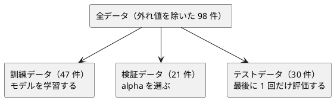

# 第 12 章: 正則化とモデル選択

## 12.1 はじめに

特徴量を増やすと、モデルは訓練データにいくらでも合わせられるようになります。その結果、訓練データでは高い精度が出るのに、未知のデータでは精度が落ちる **過学習** が起こります。

この章では、過学習を抑える **正則化** を学びます。リッジ回帰を、[第 7 章](07-linear-regression.md) で作った `Matrix` を使って自作し、正則化の強さ `alpha` を検証データで選ぶ **モデル選択** を実装します。係数を 0 にして特徴量を絞り込むラッソ回帰は、Tribuo の `ElasticNetCDTrainer` で試します。

[Python 版の第 12 章](../python/12-regularization-and-model-selection.md) と同じ流れで進めます。[Kotlin 版の第 12 章](../kotlin/12-regularization-and-model-selection.md) と比べながら、Java 版では次の 3 点に注目してください。

- 第 7 章の `Matrix` に足りない演算を、元のコードを変えずに **static メソッドのクラス** で足す（Kotlin 版は拡張関数）
- 実験の結果を、書き換えられない **record** と変更できない `List` で記録する
- Tribuo の `ElasticNetCDTrainer` の `alpha` の尺度と `l1Ratio` の下限を、テストで確かめる

## 12.2 過学習と正則化

### 係数が大きくなりすぎる

線形回帰は、予測値と正解の差（誤差）の 2 乗の合計が最小になるように係数を決めます。特徴量が多いと、訓練データの細かな揺れにまで合わせようとして、係数の絶対値が大きくなりがちです。係数が大きいモデルは、入力が少し変わっただけで予測が大きく変わるので、未知のデータに弱くなります。

### 係数の大きさに罰則を加える

正則化は、誤差の 2 乗の合計に「係数の大きさ」への罰則を加えて最小化します。

| 手法 | 最小化するもの | 係数への効果 |
|------|--------------|------------|
| 線形回帰 | 誤差の 2 乗の合計 | 制約なし |
| リッジ回帰 | 誤差の 2 乗の合計 + `alpha` × 係数の 2 乗の合計 | 全体を小さく縮める |
| ラッソ回帰 | 誤差の 2 乗の合計 + `alpha` × 係数の絶対値の合計 | 一部の係数をちょうど 0 にする |

`alpha` は正則化の強さです。0 なら線形回帰と同じで、大きくするほど係数は小さくなります。大きすぎると、今度は訓練データにも合わなくなります（学習不足）。ちょうどよい `alpha` はデータによって違うので、実験して選びます。

### リッジ回帰の解き方

リッジ回帰は、行列の計算で係数を直接求められます（閉形式）。特徴量の行列を `X`、正解を `t` として、それぞれから平均を引いた（中心化した）うえで、次の連立一次方程式を解きます。

```text
(Xᵀ X + alpha × I) w = Xᵀ t
```

`I` は単位行列です。切片は「正解の平均 − 特徴量の平均と係数の内積」で求めます。中心化してから解くのは、切片には罰則をかけないためです。第 7 章の正規方程式に `alpha × I` の項が加わっただけなので、第 7 章の `Matrix` の `times`・`transpose`・`solve` をそのまま使えます。足りないのは、行列の足し算と、数と行列の積と、単位行列です。

## 12.3 題材とデータ

### Boston.csv

この章で使うのは `Boston.csv` です。地区ごとの住宅価格（`PRICE`）と 13 個の特徴量が記録されています。この章ではそのうち、住居の平均部屋数（`RM`）・生徒と教師の比率（`PTRATIO`）・低所得者の割合（`LSTAT`）の 3 つを使います。この 4 列には欠損値がありません。学習データの入手と配置は [第 1 章](01-machine-learning-and-first-test.md) を参照してください。

### 過学習が起きやすい状況を作る

3 つの特徴量をそれぞれ標準化（平均 0・標準偏差 1）したうえで、2 乗の列と、2 つの列の積（交互作用）の列を加えます。3 列が 9 列に増え、少ない件数に対しては過学習が起きやすい状況になります。多項式特徴量と標準化、外れ値の扱いは [第 9 章](09-feature-engineering.md) で詳しく扱いました。第 9 章の `PolynomialFeatures` は多項式の列を作ってから標準化しますが、この章は Kotlin 版と同じく「標準化してから 2 次の項を作る」順なので、章の中に最小限の前処理を用意します。

### 訓練・検証・テストの 3 つに分ける

`alpha` をテストデータの結果で選ぶと、テストデータに合わせてモデルを選んだことになり、テストデータが「未知のデータ」ではなくなります。そこで、データを次の 3 つに分けます。件数は Java 版で実測した値です。



分割には第 2 章の `Preprocessing.splitTrainTest` を 2 回使います。1 回目で全体を訓練用とテスト用に、2 回目で訓練用をさらに訓練データと検証データに分けます。件数は Python 版・Kotlin 版と同じですが、乱数生成器が違うので、それぞれに入る行は一致しません。

## 12.4 TODO リストの作成

**TODO リスト**:

- [ ] リッジ回帰を自作する
  - [ ] `alpha` が 0 なら最小二乗法と同じ係数と切片になる
  - [ ] 特徴量が 2 つでも係数と切片を求める
  - [ ] 行列の足し算・数と行列の積・単位行列を用意する
  - [ ] `alpha` を大きくすると係数が小さくなる
  - [ ] `alpha` が 0 なら第 7 章の線形回帰と同じ係数になる
  - [ ] 係数と切片から予測する
- [ ] 正則化の強さごとの実験結果を、書き換えられない値として記録する
- [ ] 検証データの決定係数が最も高い実験を選ぶ
- [ ] 0 になった係数の特徴量名を返す
- [ ] Tribuo の `ElasticNetCDTrainer` でラッソ回帰とリッジ回帰を表す
- [ ] 標準化してから 2 次の多項式特徴量を作る
- [ ] 外れ値の行を除く
- [ ] 実データを 3 つに分けて、線形回帰・リッジ回帰・ラッソ回帰を比べる

## 12.5 リッジ回帰を自作する

### Red: 最小二乗法と同じになるテスト

最初のテストは、`alpha` が 0 なら最小二乗法と同じになることです。`t = 2x + 1` の直線上の 3 点を使います。

```java
// src/test/java/chapter12/RidgeTest.java（最初の版）
@Test
@DisplayName("alpha が 0 なら最小二乗法と同じ係数と切片になる")
void leastSquares() {
  var x = Matrix.of(new double[][] {{1}, {2}, {3}});
  var t = List.of(3.0, 5.0, 7.0);

  RegularizedModel model = Ridge.fit(x, t, 0.0);

  assertThat(model.coefficients()).singleElement().satisfies(c -> assertThat(c).isCloseTo(2.0, within(1e-12)));
  assertThat(model.intercept()).isCloseTo(1.0, within(1e-12));
}
```

`RegularizedModel` も `Ridge` もまだ無いので、コンパイルが Red になります。

```text
/…/apps/java/src/test/java/chapter12/RidgeTest.java:18: エラー: シンボルを見つけられません
    ^
  シンボル:   クラス RegularizedModel
/…/apps/java/src/test/java/chapter12/RidgeTest.java:18: エラー: シンボルを見つけられません
                             ^
  シンボル:   変数 Ridge
エラー2個
> Task :compileTestJava FAILED
```

学習した結果は「列の順に並んだ係数」と「切片」の組なので、record にします。第 7 章の `LinearModel` は係数を列名つきの `Map` で持ちましたが、この章の特徴量は列名を持たない `Matrix` なので、係数も列の順に並んだ `List<Double>` で持ちます。`double[]` にしないのは、record の成分に配列を使うと `equals` が参照を比べてしまうからです（第 2 章の `Features` で見た Error Prone の `ArrayRecordComponent`）。

### Green: 仮実装

```java
// src/main/java/chapter12/RegularizedModel.java（仮実装）
public record RegularizedModel(List<Double> coefficients, double intercept) {}
```

```java
// src/main/java/chapter12/Ridge.java（仮実装）
public final class Ridge {
  private Ridge() {}

  public static RegularizedModel fit(Matrix x, List<Double> t, double alpha) {
    return new RegularizedModel(List.of(2.0), 1.0);
  }
}
```

### 三角測量

特徴量が 2 つのテストを足します。正解は `3 × x1 − x2 + 4` で作った架空の値です。

```java
@Test
@DisplayName("特徴量が 2 つでも係数と切片を求める")
void twoFeatures() {
  var x = Matrix.of(new double[][] {{1, 0}, {0, 1}, {1, 1}, {2, 1}});
  var t = List.of(7.0, 3.0, 6.0, 9.0);

  RegularizedModel model = Ridge.fit(x, t, 0.0);

  assertThat(model.coefficients())
      .satisfiesExactly(
          c -> assertThat(c).isCloseTo(3.0, within(1e-9)),
          c -> assertThat(c).isCloseTo(-1.0, within(1e-9)));
  assertThat(model.intercept()).isCloseTo(4.0, within(1e-9));
}
```

```text
RidgeTest > alpha が 0 なら最小二乗法と同じ係数と切片になる PASSED

RidgeTest > 特徴量が 2 つでも係数と切片を求める FAILED
    java.lang.AssertionError: 
    Actual and expected should have same size but actual size is:
      1
    while expected size is:
      2
    Actual was:
      [2.0]
    Expected was:
      [chapter12.RidgeTest$$Lambda/0x000000012a1eb630@6ede46f6,
        chapter12.RidgeTest$$Lambda/0x000000012a1eb888@66273da0]
```

仮実装の限界は分かりましたが、`satisfiesExactly` に渡したラムダ式がそのまま「期待値」として表示され、読みにくいメッセージになりました。そこで、Kotlin 版の `assertDoubles` にあたる、要素ごとに許容誤差で比べるテスト用のメソッドを作ります。

```java
// src/test/java/chapter12/Samples.java
  /** 要素ごとに、差が tolerance 以内であることを確かめる。 */
  static void assertDoubles(List<Double> expected, List<Double> actual, double tolerance) {
    assertThat(actual)
        .usingElementComparator(new DoubleComparator(tolerance))
        .containsExactlyElementsOf(expected);
  }
```

AssertJ の `usingElementComparator` は、要素どうしの比較に使う `Comparator` を差し替えます。`DoubleComparator(tolerance)` は差が許容誤差以内なら等しいとみなすので、失敗したときは期待値の数値がそのまま表示されます。以後のテストはこのメソッドで書きます。

### 行列に足りない演算を static メソッドで足す

リッジ回帰の式に必要な、行列の足し算・数と行列の積・単位行列を用意します。第 7 章の `Matrix` は変更しません。Kotlin 版は `operator fun Matrix.plus(other: Matrix)` という **拡張関数** で、元のクラスを変えずに `a + b` と書けるようにしました。Java には拡張関数も演算子オーバーロードも無いので、**static メソッドだけを持つユーティリティクラス** に置き、`MatrixOperations.plus(a, b)` と呼びます。

```java
// src/test/java/chapter12/MatrixOperationsTest.java
package chapter12;

import static org.assertj.core.api.Assertions.assertThat;
import static org.assertj.core.api.Assertions.assertThatThrownBy;

import chapter07.Matrix;
import org.junit.jupiter.api.DisplayName;
import org.junit.jupiter.api.Test;

class MatrixOperationsTest {
  @Test
  @DisplayName("同じ大きさの行列を成分ごとに足す")
  void plus() {
    var a = Matrix.of(new double[][] {{1, 2}, {3, 4}});
    var b = Matrix.of(new double[][] {{10, 20}, {30, 40}});

    assertThat(MatrixOperations.plus(a, b))
        .isEqualTo(Matrix.of(new double[][] {{11, 22}, {33, 44}}));
  }

  @Test
  @DisplayName("大きさが違う行列は足せない")
  void plusMismatch() {
    var a = Matrix.of(new double[][] {{1, 2}});
    var b = Matrix.of(new double[][] {{1}, {2}});

    assertThatThrownBy(() -> MatrixOperations.plus(a, b))
        .isInstanceOf(IllegalArgumentException.class)
        .hasMessage("1 行 2 列の行列と 2 行 1 列の行列は足せません");
  }

  @Test
  @DisplayName("数と行列の積はすべての成分を数倍する")
  void times() {
    var a = Matrix.of(new double[][] {{1, -2}, {0, 3}});

    assertThat(MatrixOperations.times(2.0, a))
        .isEqualTo(Matrix.of(new double[][] {{2, -4}, {0, 6}}));
  }

  @Test
  @DisplayName("単位行列は対角成分が 1 でほかが 0")
  void identity() {
    assertThat(MatrixOperations.identity(3))
        .isEqualTo(Matrix.of(new double[][] {{1, 0, 0}, {0, 1, 0}, {0, 0, 1}}));
  }

  @Test
  @DisplayName("足し算と数倍は元の行列を変えない")
  void immutable() {
    var a = Matrix.of(new double[][] {{1, 2}});

    MatrixOperations.plus(a, a);
    MatrixOperations.times(3.0, a);

    assertThat(a).isEqualTo(Matrix.of(new double[][] {{1, 2}}));
  }
}
```

```java
// src/main/java/chapter12/MatrixOperations.java
package chapter12;

import chapter07.Matrix;

/** 第 7 章の Matrix に無い、足し算・定数倍・単位行列。Matrix を変えずに、この章に static メソッドとして足す。 */
public final class MatrixOperations {
  private MatrixOperations() {}

  /** 同じ大きさの行列の和。 */
  public static Matrix plus(Matrix a, Matrix b) {
    if (a.rowCount() != b.rowCount() || a.columnCount() != b.columnCount()) {
      throw new IllegalArgumentException(
          a.rowCount()
              + " 行 "
              + a.columnCount()
              + " 列の行列と "
              + b.rowCount()
              + " 行 "
              + b.columnCount()
              + " 列の行列は足せません");
    }
    double[][] sum = a.toArray();
    for (int i = 0; i < sum.length; i++) {
      for (int j = 0; j < sum[i].length; j++) {
        sum[i][j] += b.get(i, j);
      }
    }
    return Matrix.of(sum);
  }

  /** すべての成分を scalar 倍した行列。 */
  public static Matrix times(double scalar, Matrix matrix) {
    double[][] product = matrix.toArray();
    for (double[] row : product) {
      for (int j = 0; j < row.length; j++) {
        row[j] *= scalar;
      }
    }
    return Matrix.of(product);
  }

  /** size 行 size 列の単位行列。 */
  public static Matrix identity(int size) {
    double[][] rows = new double[size][size];
    for (int i = 0; i < size; i++) {
      rows[i][i] = 1;
    }
    return Matrix.of(rows);
  }
}
```

`Matrix` の中身の配列は `private` なので、`toArray()` で写しを受け取り、それを書き換えてから `Matrix.of` で新しい行列にします。`toArray()` も `of` も配列を写すので、元の行列は変わりません（最後のテストで確かめています）。第 7 章で「不変にする」手間をかけたことが、ここで安心して使える理由になっています。

### 正則化の効果と第 7 章との突き合わせ

演算がそろったので、閉形式で解く実装にします。

```java
// src/main/java/chapter12/Ridge.java
package chapter12;

import chapter07.Matrix;
import java.util.Arrays;
import java.util.List;

/** リッジ回帰を閉形式（正規方程式に alpha I を足した連立方程式）で解く。 */
public final class Ridge {
  private Ridge() {}

  /**
   * 特徴量と正解から平均を引いてから (Xᵀ X + alpha I) w = Xᵀ t を解いて係数を求め、切片は平均値から求める。
   *
   * <p>平均を引くのは、切片に罰則をかけないため。alpha が 0 なら最小二乗法と同じ解になる。
   */
  public static RegularizedModel fit(Matrix x, List<Double> t, double alpha) {
    if (x.rowCount() != t.size()) {
      throw new IllegalArgumentException("特徴量と正解の件数が違います");
    }
    double[] xMeans = columnMeans(x);
    double tMean = t.stream().mapToDouble(Double::doubleValue).average().orElseThrow();
    double[][] centered = x.toArray();
    for (double[] row : centered) {
      for (int j = 0; j < row.length; j++) {
        row[j] -= xMeans[j];
      }
    }
    Matrix xc = Matrix.of(centered);
    Matrix tc = Matrix.columnVector(t.stream().mapToDouble(v -> v - tMean).toArray());
    Matrix xct = xc.transpose();
    Matrix penalized =
        MatrixOperations.plus(
            xct.times(xc), MatrixOperations.times(alpha, MatrixOperations.identity(xMeans.length)));
    double[] coefficients = penalized.solve(xct.times(tc)).column(0);
    double intercept = tMean;
    for (int j = 0; j < coefficients.length; j++) {
      intercept -= xMeans[j] * coefficients[j];
    }
    return new RegularizedModel(Arrays.stream(coefficients).boxed().toList(), intercept);
  }

  static double[] columnMeans(Matrix x) {
    double[] means = new double[x.columnCount()];
    for (int j = 0; j < means.length; j++) {
      means[j] = Arrays.stream(x.column(j)).average().orElseThrow();
    }
    return means;
  }
}
```

Kotlin 版は `(xc.transpose() * xc + alpha * identity(n)).solve(xc.transpose() * tc)` と、式に近い形で 1 行に書けました。Java 版はメソッド呼び出しの入れ子になるので、`xct`（転置）と `penalized`（罰則を足した行列）に名前を付けて読みやすくしています。`columnMeans` は、12.8 節の Tribuo の切片でも使うのでパッケージプライベートにしました。

続けて、正則化の効果と、第 7 章との一致をテストにします。人工データは、正規分布の 4 列の特徴量 30 件と、その重み付きの和に雑音を足した正解です（`Samples.randomDataset()`）。

```java
@Test
@DisplayName("alpha を大きくすると係数の絶対値の合計が小さくなる")
void shrinks() {
  var data = Samples.randomDataset();

  var weak = Ridge.fit(data.x(), data.t(), 0.1);
  var strong = Ridge.fit(data.x(), data.t(), 100.0);

  assertThat(strong.coefficientAbsSum()).isLessThan(weak.coefficientAbsSum());
}

@Test
@DisplayName("alpha が 0 なら第 7 章の線形回帰と同じ係数と切片になる")
void sameAsChapter07() {
  var data = Samples.randomDataset();
  List<String> names = List.of("x0", "x1", "x2", "x3");
  List<Features> features =
      Arrays.stream(data.x().toArray()).map(row -> new Features(names, row)).toList();

  RegularizedModel model = Ridge.fit(data.x(), data.t(), 0.0);
  LinearModel expected = LinearRegression.fit(features, data.t());

  assertDoubles(new ArrayList<>(expected.coefficients().values()), model.coefficients(), 1e-9);
  assertThat(model.intercept()).isCloseTo(expected.intercept(), within(1e-9));
}
```

第 7 章の `LinearRegression` は、先頭に 1 の列を足した計画行列で切片ごと解きました。この章は中心化してから係数だけを解きます。解き方は違っても、`alpha` が 0 なら同じ解になることを確かめています。第 7 章の係数は列の順を保つ `LinkedHashMap` なので、`values()` を `List` にすれば列の順に並びます。

`Samples.randomDataset()` が返す `Data` は、特徴量の行列と正解の組の record です。Kotlin 版は `Pair<Matrix, List<Double>>` を返し、`val (x, t) = randomDataset()` と分解しました。Java 21 の record には分解の宣言が無いので、`data.x()`・`data.t()` と成分名で読みます。

### 予測する

係数と切片から予測するメソッドと、係数の絶対値の合計を求めるメソッドを、`RegularizedModel` に足します。

```java
// src/main/java/chapter12/RegularizedModel.java
package chapter12;

import chapter07.Matrix;
import java.util.List;
import java.util.stream.IntStream;

/**
 * 正則化した線形回帰のモデル。特徴量の列の順に並んだ係数と、切片を持つ。
 *
 * @param coefficients 列の順に並んだ係数
 * @param intercept 切片
 */
public record RegularizedModel(List<Double> coefficients, double intercept) {
  public RegularizedModel {
    coefficients = List.copyOf(coefficients);
  }

  /** 行ごとの予測値。行列の列数は係数の数と同じでなければならない。 */
  public List<Double> predict(Matrix x) {
    if (x.columnCount() != coefficients.size()) {
      throw new IllegalArgumentException(
          "特徴量の列数 " + x.columnCount() + " と係数の数 " + coefficients.size() + " が違います");
    }
    return IntStream.range(0, x.rowCount())
        .mapToObj(
            i -> {
              double sum = intercept;
              for (int j = 0; j < coefficients.size(); j++) {
                sum += x.get(i, j) * coefficients.get(j);
              }
              return sum;
            })
        .toList();
  }

  /** 係数の絶対値の合計。正則化が強いほど小さくなる。 */
  public double coefficientAbsSum() {
    return coefficients.stream().mapToDouble(Math::abs).sum();
  }
}
```

- コンパクトコンストラクタで `List.copyOf` に写すので、渡したリストを後で変えてもモデルは変わりません
- 列数と係数の数が違う行列を渡したときは、第 7 章の `times` と同じく、件数を示す `IllegalArgumentException` にします（テスト「特徴量の列数と係数の数が違えばエラーになる」）

## 12.6 実験結果を記録して選ぶ

### 書き換えられない実験結果

正則化の強さごとに、訓練データと検証データの決定係数（第 7 章の `RegressionMetrics.r2Score`）と、係数の絶対値の合計を記録します。

```java
// src/main/java/chapter12/Experiment.java
package chapter12;

/**
 * 正則化の強さ 1 つ分の実験結果。作ったあとで変えられない。
 *
 * @param alpha 正則化の強さ
 * @param trainScore 訓練データの決定係数
 * @param validationScore 検証データの決定係数
 * @param coefficientAbsSum 係数の絶対値の合計
 */
public record Experiment(
    double alpha, double trainScore, double validationScore, double coefficientAbsSum) {}
```

record の成分はすべて `final` で、setter はありません。Kotlin 版は `data class` の `copy(alpha = 2.0)` で「一部だけ変えた別の値」を作れることもテストしましたが、Java の record には `copy` がありません。必要になったら `withAlpha` のようなメソッドを自分で書きます。この章では実験結果を書き換える場面が無いので作りません。

```java
// src/main/java/chapter12/ModelSelection.java
package chapter12;

import chapter07.Matrix;
import chapter07.RegressionMetrics;
import java.util.Comparator;
import java.util.List;
import java.util.stream.IntStream;

/** 正則化の強さごとに実験し、検証データでモデルを選ぶ。 */
public final class ModelSelection {
  private ModelSelection() {}

  /** alpha ごとにリッジ回帰を訓練データで学習し、訓練データと検証データの決定係数を記録する。 */
  public static List<Experiment> runRidgeExperiments(
      Matrix xTrain, List<Double> tTrain, Matrix xValid, List<Double> tValid, List<Double> alphas) {
    return alphas.stream()
        .map(
            alpha -> {
              RegularizedModel model = Ridge.fit(xTrain, tTrain, alpha);
              return new Experiment(
                  alpha,
                  RegressionMetrics.r2Score(tTrain, model.predict(xTrain)),
                  RegressionMetrics.r2Score(tValid, model.predict(xValid)),
                  model.coefficientAbsSum());
            })
        .toList();
  }

  /** 検証データの決定係数が最も高い実験。同じ値なら先の実験を選ぶ。 */
  public static Experiment bestExperiment(List<Experiment> experiments) {
    return experiments.stream()
        .max(Comparator.comparingDouble(Experiment::validationScore))
        .orElseThrow(() -> new IllegalArgumentException("実験結果が 1 件もありません"));
  }

  /** 係数がちょうど 0 になった特徴量の名前を、列の順に返す。 */
  public static List<String> zeroCoefficientNames(
      List<Double> coefficients, List<String> featureNames) {
    if (coefficients.size() != featureNames.size()) {
      throw new IllegalArgumentException("係数と特徴量名の数が違います");
    }
    return IntStream.range(0, coefficients.size())
        .filter(i -> coefficients.get(i) == 0.0)
        .mapToObj(featureNames::get)
        .toList();
  }
}
```

`runRidgeExperiments` は `Stream.toList()` で返すので、呼び出し側は結果のリストに要素を足したり入れ替えたりできません。記録した実験結果は、リストも要素も変更できない値になります。

```java
@Test
@DisplayName("正則化の強さごとに 1 件ずつ実験結果を記録する")
void oneExperimentPerAlpha() {
  var data = Samples.randomDataset();

  List<Experiment> experiments =
      ModelSelection.runRidgeExperiments(
          rows(data.x(), 0, 20),
          data.t().subList(0, 20),
          rows(data.x(), 20, 30),
          data.t().subList(20, 30),
          List.of(0.1, 1.0, 10.0));

  assertThat(experiments).extracting(Experiment::alpha).containsExactly(0.1, 1.0, 10.0);
}
```

AssertJ の `extracting` は、要素ごとにメソッド参照の値を取り出してから比べます。

### 検証データで最もよい実験を選ぶ

検証データの決定係数が最も高い実験を選びます。テストは架空の実験結果で書き、「最初が最大」「途中が最大」「同じ値」の 3 通りを確かめます。

```java
private static Experiment experiment(double alpha, double validationScore) {
  return new Experiment(alpha, 0.9, validationScore, 1.0);
}

@Test
@DisplayName("検証データの決定係数が最も高い実験を選ぶ")
void best() {
  var experiments = List.of(experiment(0.1, 0.7), experiment(1.0, 0.6));

  assertThat(ModelSelection.bestExperiment(experiments).alpha()).isEqualTo(0.1);
}

@Test
@DisplayName("最も高い実験が途中にあってもそれを選ぶ")
void bestInTheMiddle() {
  var experiments = List.of(experiment(0.1, 0.5), experiment(1.0, 0.8), experiment(10.0, 0.6));

  assertThat(ModelSelection.bestExperiment(experiments).alpha()).isEqualTo(1.0);
}

@Test
@DisplayName("検証データの決定係数が同じなら先の実験を選ぶ")
void tie() {
  var experiments = List.of(experiment(0.1, 0.8), experiment(1.0, 0.8));

  assertThat(ModelSelection.bestExperiment(experiments).alpha()).isEqualTo(0.1);
}
```

`Stream.max(Comparator.comparingDouble(Experiment::validationScore))` は、同じ値なら先に現れた要素を残しました。同じ決定係数なら、正則化の弱い（先に並べた）`alpha` を選ぶことになります。Kotlin 版の `maxBy` と同じ振る舞いです。空のリストでは `Optional` が空になるので、`orElseThrow` で理由を示す例外にしています。

## 12.7 0 になった係数の特徴量名を返す

ラッソ回帰で係数がちょうど 0 になった特徴量の名前を、列の順に返します。`zeroCoefficientNames` は 12.6 節の `ModelSelection` に置きました。

```java
@Test
@DisplayName("0 になった係数の特徴量名を返す")
void zeroCoefficientNames() {
  assertThat(
          ModelSelection.zeroCoefficientNames(
              List.of(0.0, 1.5, 0.0), List.of("RM", "LSTAT", "RM^2")))
      .containsExactly("RM", "RM^2");
}
```

`coefficients.get(i) == 0.0` は、`List<Double>` から取り出した `Double` が自動でアンボックスされ、`double` どうしの比較になります。`Double` どうしを `==` で比べると参照の比較になるので注意します（ここでは右辺が `double` のリテラルなので、左辺がアンボックスされます）。

## 12.8 Tribuo の ElasticNetCDTrainer で表す

### ElasticNetCDTrainer が最小化するもの

ラッソ回帰は、係数の絶対値に罰則をかけると式が微分できない点を含むため、リッジ回帰のように 1 回の行列計算では解けず、座標降下法などの反復計算が必要になります。Python 版・Kotlin 版と同じく自作はせず、Tribuo の `ElasticNetCDTrainer` を使います。ラッソ回帰とリッジ回帰を混ぜた **エラスティックネット** を学習するトレーナーで、コンストラクタは `ElasticNetCDTrainer(alpha, l1Ratio, tolerance, maxIterations, randomise, seed)` です。`l1Ratio` は罰則のうちラッソ回帰（L1）の割合です。

Kotlin 版（[ADR 002](../../../adr/002-kotlin-ml-libraries.md)）で Tribuo 4.3.2 のソースを読んで確かめたとおり、`ElasticNetCDTrainer` は特徴量を中心化したうえで、次の値を最小化します（`n` は件数）。

```text
(1/2n) × 誤差の 2 乗の合計 + alpha × l1Ratio × 係数の絶対値の合計 + (alpha × (1 − l1Ratio) / 2) × 係数の 2 乗の合計
```

12.2 節のリッジ回帰（`誤差の 2 乗の合計 + λ × 係数の 2 乗の合計`）と比べると全体が `1/2n` 倍なので、リッジ回帰の `λ` は `alpha × (1 − l1Ratio) × n` に当たります。自作と同じ尺度で比べるには、`alpha` を件数 `n` で割って渡します。Java 版でも同じ依存（Tribuo 4.3.2）を使うので、この 2 つの約束事を Java のテストで確かめます。

### Red: ラッソ回帰とリッジ回帰のテスト

ラッソ回帰では、予測に関係しない 2 列を含む人工データで学習させると、その 2 列の係数だけがちょうど 0 になるはずです。リッジ回帰は `l1Ratio` を 0 にすれば純粋なリッジ回帰になるはずですが、Kotlin 版で `ElasticNetCDTrainer` は `l1Ratio = 0` を受け付けず、受け付ける下限は `1e-12` でした。この境界もテストに含めます。

```java
// src/test/java/chapter12/TribuoRegularizationTest.java
package chapter12;

import static chapter12.Samples.assertDoubles;
import static org.assertj.core.api.Assertions.assertThat;
import static org.assertj.core.api.Assertions.assertThatThrownBy;
import static org.assertj.core.api.Assertions.within;

import chapter07.Matrix;
import com.oracle.labs.mlrg.olcut.config.PropertyException;
import java.util.ArrayList;
import java.util.List;
import java.util.Random;
import org.junit.jupiter.api.DisplayName;
import org.junit.jupiter.api.Test;
import org.tribuo.regression.slm.ElasticNetCDTrainer;

class TribuoRegularizationTest {
  /** 4 列のうち、最初の 2 列だけで正解が決まる人工データ */
  private static Samples.Data sparseDataset() {
    var random = new Random(0);
    double[][] rows = new double[50][4];
    List<Double> t = new ArrayList<>();
    for (double[] row : rows) {
      for (int j = 0; j < row.length; j++) {
        row[j] = random.nextGaussian();
      }
      t.add(3.0 * row[0] - 2.0 * row[1] + 0.1 * random.nextGaussian());
    }
    return new Samples.Data(Matrix.of(rows), t);
  }

  @Test
  @DisplayName("ラッソ回帰では予測に役立たない特徴量の係数が 0 になる")
  void lasso() {
    var data = sparseDataset();

    RegularizedModel model = TribuoRegularization.fitLasso(data.x(), data.t(), 0.5);

    assertThat(
            ModelSelection.zeroCoefficientNames(
                model.coefficients(), List.of("x1", "x2", "noise1", "noise2")))
        .containsExactly("noise1", "noise2");
  }

  @Test
  @DisplayName("ElasticNetCDTrainer は l1Ratio が 0 のリッジ回帰を受け付けない")
  void rejectsZeroL1Ratio() {
    assertThatThrownBy(() -> new ElasticNetCDTrainer(0.5, 0.0))
        .isInstanceOf(PropertyException.class)
        .hasMessageEndingWith("L1 Ratio must be between 0 and 1. Found value 0.0");
  }

  @Test
  @DisplayName("ElasticNetCDTrainer は l1Ratio の下限の 1e-12 を受け付け、1e-13 を受け付けない")
  void l1RatioLowerBound() {
    assertThat(new ElasticNetCDTrainer(0.5, TribuoRegularization.MIN_L1_RATIO)).isNotNull();
    assertThatThrownBy(() -> new ElasticNetCDTrainer(0.5, 1e-13))
        .isInstanceOf(PropertyException.class);
  }

  @Test
  @DisplayName("l1Ratio を下限まで小さくし alpha を件数で割ると自作のリッジ回帰と同じ係数と切片になる")
  void ridge() {
    var data = Samples.randomDataset();

    RegularizedModel model = TribuoRegularization.fitRidge(data.x(), data.t(), 10.0);
    RegularizedModel expected = Ridge.fit(data.x(), data.t(), 10.0);

    assertDoubles(expected.coefficients(), model.coefficients(), 1e-6);
    assertThat(model.intercept()).isCloseTo(expected.intercept(), within(1e-6));
  }
}
```

- `PropertyException` は、Tribuo が設定の検査に使っているライブラリ OLCUT の例外です。`l1Ratio` の範囲の検査はコンストラクタの中で行われるので、学習する前に例外になります
- メッセージの先頭には設定項目の名前が付くので、Kotlin 版は `substringAfter(", ")` で後ろだけを取り出して比べました。AssertJ では `hasMessageEndingWith` で末尾だけを比べられます
- `new ElasticNetCDTrainer(0.5, TribuoRegularization.MIN_L1_RATIO)` は、例外にならずに作れることだけを確かめています

`fitLasso`・`fitRidge` がまだ無いので、このテストはコンパイルできません。

### Green: 行列を Tribuo のデータセットに変換する

第 7 章の `TribuoRegression.train` は、`List<Features>` と正解のリストから Tribuo のデータセットを作って学習します。この章の特徴量は行列なので、列に `x0`・`x1`… という名前を付けて `Features` に変換し、第 7 章のメソッドをそのまま使います。

```java
// src/main/java/chapter12/TribuoRegularization.java
package chapter12;

import chapter02.Features;
import chapter07.Matrix;
import chapter07.TribuoRegression;
import java.util.Arrays;
import java.util.List;
import java.util.stream.IntStream;
import org.tribuo.math.la.SparseVector;
import org.tribuo.regression.slm.ElasticNetCDTrainer;
import org.tribuo.regression.slm.SparseLinearModel;

/** Tribuo の ElasticNetCDTrainer で、ラッソ回帰とリッジ回帰を学習する。 */
public final class TribuoRegularization {
  /** ElasticNetCDTrainer が受け付ける l1Ratio の下限の代わりに使う値。0（純粋なリッジ回帰）は受け付けない */
  static final double MIN_L1_RATIO = 1e-12;

  private static final double TOLERANCE = 1e-10;
  private static final int MAX_ITERATIONS = 100_000;
  private static final long SEED = 0;

  private TribuoRegularization() {}

  private static List<String> featureNames(Matrix x) {
    return IntStream.range(0, x.columnCount()).mapToObj(j -> "x" + j).toList();
  }

  private static List<Features> toFeatures(Matrix x) {
    List<String> names = featureNames(x);
    return Arrays.stream(x.toArray()).map(row -> new Features(names, row)).toList();
  }

  /**
   * ElasticNetCDTrainer で学習し、係数と切片を取り出す。
   *
   * <p>Tribuo は特徴量の平均を引いてから学習するので、切片は特徴量と正解の平均値から求める。
   */
  public static RegularizedModel fitElasticNet(
      Matrix x, List<Double> t, double alpha, double l1Ratio) {
    var trainer = new ElasticNetCDTrainer(alpha, l1Ratio, TOLERANCE, MAX_ITERATIONS, false, SEED);
    var model = (SparseLinearModel) TribuoRegression.train(trainer, toFeatures(x), t);
    SparseVector weights = model.getWeights().values().iterator().next();
    List<Double> coefficients =
        featureNames(x).stream()
            .map(name -> weights.get(model.getFeatureIDMap().get(name).getID()))
            .toList();
    double[] xMeans = Ridge.columnMeans(x);
    double intercept = t.stream().mapToDouble(Double::doubleValue).average().orElseThrow();
    for (int j = 0; j < xMeans.length; j++) {
      intercept -= xMeans[j] * coefficients.get(j);
    }
    return new RegularizedModel(coefficients, intercept);
  }

  /** l1Ratio を 1 にしたラッソ回帰。 */
  public static RegularizedModel fitLasso(Matrix x, List<Double> t, double alpha) {
    return fitElasticNet(x, t, alpha, 1.0);
  }

  /**
   * 自作のリッジ回帰と同じ alpha の尺度で、ElasticNetCDTrainer にリッジ回帰を学習させる。
   *
   * <p>ElasticNetCDTrainer は誤差の 2 乗の合計を 2n で割った値に罰則を足すので、alpha を件数 n で割って渡す。
   */
  public static RegularizedModel fitRidge(Matrix x, List<Double> t, double alpha) {
    return fitElasticNet(x, t, alpha / t.size(), MIN_L1_RATIO);
  }
}
```

- `TribuoRegression.train` の戻り値は `Model<Regressor>` なので、線形モデルの重みを読むために `SparseLinearModel` にキャストします。`ElasticNetCDTrainer` が返すのは `SparseLinearModel` です
- `getWeights()` は、出力の名前ごとの重みのベクトル（`SparseVector`）の `Map` を返します。出力は 1 つなので、最初の値を取り出します。Kotlin 版は `model.weights.values.single()` と、Java の getter をプロパティとして読みました
- 重みのベクトルの添字は、特徴量名から `getFeatureIDMap().get(name).getID()` で引きます。Tribuo は特徴量名を並べ替えて番号を振るので、列の順と添字が同じとは限りません
- Tribuo は特徴量の平均を引いてから学習するので、切片は平均値から求めます。第 7 章の `SLMTrainer` の重みは正規化した空間の値でしたが、`ElasticNetCDTrainer` の重みは元の単位の係数として、そのまま自作と比べられます

```text
TribuoRegularizationTest > ElasticNetCDTrainer は l1Ratio が 0 のリッジ回帰を受け付けない PASSED
TribuoRegularizationTest > ラッソ回帰では予測に役立たない特徴量の係数が 0 になる PASSED
TribuoRegularizationTest > l1Ratio を下限まで小さくし alpha を件数で割ると自作のリッジ回帰と同じ係数と切片になる PASSED
TribuoRegularizationTest > ElasticNetCDTrainer は l1Ratio の下限の 1e-12 を受け付け、1e-13 を受け付けない PASSED
```

Kotlin 版（ADR 002）で確かめた `ElasticNetCDTrainer` の約束事は、Java 版でもそのまま成り立ちました。

- `l1Ratio = 0` は `PropertyException`（`L1 Ratio must be between 0 and 1. Found value 0.0`）で拒否される。`1e-12` は受け付け、`1e-13` は拒否される
- `l1Ratio = 1e-12` にし、`alpha` を件数で割って渡すと、自作のリッジ回帰と係数・切片が `1e-6` 以内で一致する
- `l1Ratio = 1` のラッソ回帰では、予測に関係しない列の係数がちょうど `0.0` になる

## 12.9 最小限の前処理

### 標準化と多項式特徴量

列ごとの平均と標準偏差を訓練データから求め、同じ値で訓練・検証・テストの 3 つを変換します。標準化してから、2 乗の列と 2 列の積の列を加えます。

```java
// src/test/java/chapter12/BostonTest.java（多項式特徴量）
@Nested
@DisplayName("多項式特徴量")
class PolynomialScalerTest {
  private final List<Features> x =
      List.of(
          new Features(List.of("a", "b"), new double[] {1, 10}),
          new Features(List.of("a", "b"), new double[] {3, 30}));

  @Test
  @DisplayName("平均と件数 n で割る標準偏差を求める")
  void fit() {
    var scaler = PolynomialScaler.fit(x);

    assertThat(scaler)
        .isEqualTo(
            new PolynomialScaler(List.of("a", "b"), List.of(2.0, 20.0), List.of(1.0, 10.0)));
  }

  @Test
  @DisplayName("元の列・2 乗の列・積の列の順に名前を付ける")
  void featureNames() {
    assertThat(PolynomialScaler.fit(x).featureNames())
        .containsExactly("a", "b", "a^2", "a b", "b^2");
  }

  @Test
  @DisplayName("標準化してから 2 乗と積を作る")
  void transform() {
    var scaler = PolynomialScaler.fit(x);

    var z = scaler.transform(List.of(new Features(List.of("a", "b"), new double[] {4, 10})));

    assertDoubles(
        List.of(2.0, -1.0, 4.0, -2.0, 1.0),
        Arrays.stream(z.toArray()[0]).boxed().toList(),
        1e-12);
  }
}
```

`a` の平均は 2・標準偏差は 1、`b` の平均は 20・標準偏差は 10 なので、`(4, 10)` は標準化すると `(2, −1)` になり、2 次の項は `4`・`−2`・`1` です。

```java
// src/main/java/chapter12/PolynomialScaler.java
package chapter12;

import chapter02.Features;
import chapter07.Matrix;
import java.util.ArrayList;
import java.util.Arrays;
import java.util.List;

/**
 * 列ごとに標準化してから、2 乗の列と 2 列の積の列を加える。訓練データで {@link #fit} し、同じ平均と標準偏差で変換する。
 *
 * @param inputNames 元の特徴量の列名
 * @param means 列ごとの平均
 * @param stds 列ごとの標準偏差（件数 n で割る母標準偏差）
 */
public record PolynomialScaler(List<String> inputNames, List<Double> means, List<Double> stds) {
  public PolynomialScaler {
    inputNames = List.copyOf(inputNames);
    means = List.copyOf(means);
    stds = List.copyOf(stds);
    if (means.size() != inputNames.size() || stds.size() != inputNames.size()) {
      throw new IllegalArgumentException("列名と平均と標準偏差の数が違います");
    }
  }

  /** 訓練データの列ごとの平均と、件数 n で割る標準偏差を求める。列名は先頭の行から取る。 */
  public static PolynomialScaler fit(List<Features> x) {
    List<String> names = x.getFirst().columns();
    List<Double> means = new ArrayList<>();
    List<Double> stds = new ArrayList<>();
    for (String name : names) {
      double[] values = x.stream().mapToDouble(f -> f.value(name)).toArray();
      double mean = Arrays.stream(values).average().orElseThrow();
      double variance =
          Arrays.stream(values).map(v -> (v - mean) * (v - mean)).sum() / values.length;
      means.add(mean);
      stds.add(Math.sqrt(variance));
    }
    return new PolynomialScaler(names, means, stds);
  }

  /** 2 次の項を作る列の組（i <= j）。{0, 0} は 1 列目の 2 乗、{0, 1} は 1 列目と 2 列目の積。 */
  private List<int[]> pairs() {
    List<int[]> pairs = new ArrayList<>();
    for (int i = 0; i < inputNames.size(); i++) {
      for (int j = i; j < inputNames.size(); j++) {
        pairs.add(new int[] {i, j});
      }
    }
    return pairs;
  }

  /** 変換後の列名。元の列、2 乗の列（"RM^2"）、積の列（"RM LSTAT"）の順。 */
  public List<String> featureNames() {
    List<String> names = new ArrayList<>(inputNames);
    for (int[] pair : pairs()) {
      String first = inputNames.get(pair[0]);
      names.add(pair[0] == pair[1] ? first + "^2" : first + " " + inputNames.get(pair[1]));
    }
    return List.copyOf(names);
  }

  /** 標準化した値と、その 2 次の項を並べた行列にする。 */
  public Matrix transform(List<Features> x) {
    List<int[]> pairs = pairs();
    double[][] rows = new double[x.size()][];
    for (int r = 0; r < x.size(); r++) {
      double[] z = new double[inputNames.size()];
      for (int i = 0; i < z.length; i++) {
        z[i] = (x.get(r).value(inputNames.get(i)) - means.get(i)) / stds.get(i);
      }
      double[] row = Arrays.copyOf(z, z.length + pairs.size());
      for (int k = 0; k < pairs.size(); k++) {
        row[z.length + k] = z[pairs.get(k)[0]] * z[pairs.get(k)[1]];
      }
      rows[r] = row;
    }
    return Matrix.of(rows);
  }
}
```

- 平均と標準偏差を持つ値なので record にし、`fit` で作る形にしました。成分は `List<Double>` なので、`isEqualTo` で中身を比べられます
- 列の組は `int[]` の 2 要素で表しました。Kotlin 版の `Pair<Int, Int>` にあたります。外に漏れない `private` なメソッドの中だけで使うので、組のための record は作っていません

### 外れ値を除く

列ごとの z スコアの絶対値が閾値を超える値を 1 つでも持つ行を除きます。標準偏差は、Kotlin 版と同じく件数 `n − 1` で割る標本標準偏差です。テストは、10 行のうち 1 行だけが大きく外れた架空の表で書きます。

```java
@Test
@DisplayName("z スコアの絶対値が閾値を超える値を持つ行を除く")
void removeOutliers() {
  // 10 行のうち 1 行だけ v が大きく外れている
  List<Row> rows =
      IntStream.range(0, 10)
          .mapToObj(i -> new Row(Map.of("id", String.valueOf(i), "v", i == 9 ? "100" : "1")))
          .toList();
  var table = new Table(List.of("id", "v"), rows);

  Table kept = Boston.removeOutliers(table, List.of("v"), 2.0);

  assertThat(kept.rows()).extracting(row -> row.text("id")).doesNotContain("9").hasSize(9);
}
```

### 3 つに分けて特徴量を作る

外れ値を除いてから、全体を訓練用とテスト用に、訓練用をさらに訓練データと検証データに分けます。標準化の平均と標準偏差は訓練データだけから求めます。3 つの行列と正解、特徴量名は、入れ子の record `Boston.Dataset` にまとめました。

```java
// src/main/java/chapter12/Boston.java（抜粋）
  public static Dataset prepare(Path csvFile, double testSize, double validationSize, long seed)
      throws IOException {
    List<String> columns = new ArrayList<>(FEATURES);
    columns.add(TARGET);
    Table table = removeOutliers(Table.load(csvFile), columns, OUTLIER_THRESHOLD);
    List<Features> x =
        table.rows().stream()
            .map(
                row ->
                    new Features(
                        FEATURES,
                        FEATURES.stream().mapToDouble(column -> number(row, column)).toArray()))
            .toList();
    List<Double> t = table.rows().stream().map(row -> number(row, TARGET)).toList();
    TrainTestSplit<Features, Double> outer = Preprocessing.splitTrainTest(x, t, testSize, seed);
    TrainTestSplit<Features, Double> inner =
        Preprocessing.splitTrainTest(outer.xTrain(), outer.tTrain(), validationSize, seed);
    PolynomialScaler scaler = PolynomialScaler.fit(inner.xTrain());
    return new Dataset(
        scaler.transform(inner.xTrain()),
        inner.tTrain(),
        scaler.transform(inner.xTest()),
        inner.tTest(),
        scaler.transform(outer.xTest()),
        outer.tTest(),
        scaler.featureNames());
  }
```

第 2 章の `splitTrainTest` は型引数 `<X, T>` を持つので、`Row` でも `Features` でもそのまま分けられます。第 9 章にも `Boston` クラスがありますが、パッケージが違う（`chapter09.Boston` と `chapter12.Boston`）ので名前はぶつかりません。

## 12.10 実データで比べる

### 結果を表示する

`Main` は、正則化の強さ `0.0`・`0.1`・`1.0`・`10.0`・`100.0` で実験し、検証データで選んだ `alpha` のリッジ回帰と線形回帰（`alpha = 0`）をテストデータで比べ、ラッソ回帰（`alpha = 0.5`）で 0 になった特徴量を表示します。

```java
// src/main/java/chapter12/Main.java
package chapter12;

import chapter02.Table;
import chapter07.RegressionMetrics;
import dataset.DataDir;
import java.io.IOException;
import java.nio.file.Path;
import java.util.ArrayList;
import java.util.List;
import java.util.Locale;
import java.util.logging.Level;
import java.util.logging.Logger;
import org.tribuo.regression.slm.ElasticNetCDTrainer;

/** 正則化の強さごとにリッジ回帰を学習し、検証データで選んだモデルとラッソ回帰の結果を表示する。 */
public final class Main {
  private static final double TEST_SIZE = 0.3;
  private static final double VALIDATION_SIZE = 0.3;
  private static final long SEED = 0;
  private static final List<Double> ALPHAS = List.of(0.0, 0.1, 1.0, 10.0, 100.0);
  private static final double LASSO_ALPHA = 0.5;

  // Tribuo の座標降下法が収束のたびに出す INFO のログを表示しない。
  // Logger は弱い参照で管理されるので、設定した Logger を static で持ち続ける
  private static final Logger TRIBUO_LOGGER = Logger.getLogger(ElasticNetCDTrainer.class.getName());

  private Main() {}

  public static void main(String[] args) throws IOException {
    TRIBUO_LOGGER.setLevel(Level.WARNING);
    Path csvFile = DataDir.dataDir().resolve("Boston.csv");
    Table table = Table.load(csvFile);
    List<String> columns = new ArrayList<>(Boston.FEATURES);
    columns.add(Boston.TARGET);
    int kept = Boston.removeOutliers(table, columns, Boston.OUTLIER_THRESHOLD).rows().size();
    Boston.Dataset data = Boston.prepare(csvFile, TEST_SIZE, VALIDATION_SIZE, SEED);
    System.out.println("データ件数: " + kept + "（外れ値 " + (table.rows().size() - kept) + " 件を除外）");
    System.out.println(
        "訓練データ: "
            + data.tTrain().size()
            + " 件, 検証データ: "
            + data.tValid().size()
            + " 件, テストデータ: "
            + data.tTest().size()
            + " 件");
    System.out.println("特徴量: " + String.join(", ", data.featureNames()));

    List<Experiment> experiments =
        ModelSelection.runRidgeExperiments(
            data.xTrain(), data.tTrain(), data.xValid(), data.tValid(), ALPHAS);
    System.out.println("alpha  訓練 R²  検証 R²  係数の絶対値の合計");
    for (Experiment e : experiments) {
      System.out.println(
          String.format(
              Locale.ROOT,
              "%5.1f  %.4f  %.4f  %.3f",
              e.alpha(),
              e.trainScore(),
              e.validationScore(),
              e.coefficientAbsSum()));
    }
    Experiment best = ModelSelection.bestExperiment(experiments);
    System.out.println("検証データで選んだ alpha: " + best.alpha());

    RegularizedModel linear = Ridge.fit(data.xTrain(), data.tTrain(), 0.0);
    RegularizedModel ridge = Ridge.fit(data.xTrain(), data.tTrain(), best.alpha());
    System.out.println(
        String.format(
            Locale.ROOT,
            "テストデータの決定係数: 線形回帰 %.4f, リッジ回帰 %.4f",
            RegressionMetrics.r2Score(data.tTest(), linear.predict(data.xTest())),
            RegressionMetrics.r2Score(data.tTest(), ridge.predict(data.xTest()))));

    RegularizedModel lasso =
        TribuoRegularization.fitLasso(data.xTrain(), data.tTrain(), LASSO_ALPHA);
    System.out.println(
        "ラッソ回帰（alpha="
            + LASSO_ALPHA
            + "）で係数が 0 になった特徴量: "
            + String.join(
                ", ",
                ModelSelection.zeroCoefficientNames(lasso.coefficients(), data.featureNames())));
  }
}
```

- Tribuo の `ElasticNetCDTrainer` は、学習のたびに `java.util.logging` の INFO のログを出します。Kotlin 版と同じく、その `Logger` の水準を `WARNING` に上げて表示しないようにしました。`Logger.getLogger` が返す `Logger` は弱い参照で管理され、ほかに参照が無いと回収されて設定が消えることがあるので、`static final` のフィールドで持ち続けます
- 表の書式は `String.format` の `%5.1f`（幅 5、小数 1 桁）でそろえます。Kotlin 版は `toString().padStart(5)` で右寄せしました

```console
$ ./gradlew -q runChapter -Pchapter=12
データ件数: 98（外れ値 2 件を除外）
訓練データ: 47 件, 検証データ: 21 件, テストデータ: 30 件
特徴量: RM, PTRATIO, LSTAT, RM^2, RM PTRATIO, RM LSTAT, PTRATIO^2, PTRATIO LSTAT, LSTAT^2
alpha  訓練 R²  検証 R²  係数の絶対値の合計
  0.0  0.8827  0.7272  14.187
  0.1  0.8827  0.7274  14.104
  1.0  0.8823  0.7288  13.594
 10.0  0.8681  0.7349  11.573
100.0  0.6583  0.5985  5.684
検証データで選んだ alpha: 10.0
テストデータの決定係数: 線形回帰 0.5224, リッジ回帰 0.6243
ラッソ回帰（alpha=0.5）で係数が 0 になった特徴量: PTRATIO^2, PTRATIO LSTAT, LSTAT^2
```

### 結果を読む

- `alpha` を大きくするほど、係数の絶対値の合計は 14.187 から 5.684 へ小さくなりました。訓練データの決定係数は下がり続けます
- 検証データの決定係数は `alpha = 10.0` で最も高く（0.7349）、`100.0` では訓練・検証とも大きく下がりました。正則化が強すぎて学習不足になっています
- 検証データで選んだ `alpha = 10.0` のリッジ回帰は、テストデータの決定係数が 0.6243 で、線形回帰の 0.5224 を上回りました。訓練データでは線形回帰のほうが高い（0.8827）のに、未知のデータでは正則化したモデルのほうがよく当たっています
- ラッソ回帰は、9 列のうち `PTRATIO^2`・`PTRATIO LSTAT`・`LSTAT^2` の 3 列の係数をちょうど 0 にしました

Kotlin 版では、同じ手順でも検証データで選んだリッジ回帰のテストの決定係数が線形回帰より低くなりました（Kotlin 版の 12.10 節）。Java 版とは分割の乱数が違い、訓練・検証・テストに入る行が違うからです。100 件ほどのデータでは、分け方によって結論まで変わりうることを示しています。1 回の分け方に頼らない方法として、第 11 章の交差検証を組み合わせられます。

### 実データのテスト

実データのテストは、学習データが無ければスキップします。3 つの件数、実データでの自作のリッジ回帰と Tribuo の一致、`Main` の出力を固定します。

```java
// src/test/java/chapter12/BostonDataTest.java（抜粋）
@Test
@DisplayName("実データでも自作のリッジ回帰は Tribuo の ElasticNetCDTrainer と同じ係数と切片になる")
void sameAsTribuo() throws IOException {
  var data = dataset();

  var model = Ridge.fit(data.xTrain(), data.tTrain(), 10.0);
  var tribuo = TribuoRegularization.fitRidge(data.xTrain(), data.tTrain(), 10.0);

  assertDoubles(model.coefficients(), tribuo.coefficients(), 1e-6);
  assertThat(tribuo.intercept()).isCloseTo(model.intercept(), within(1e-6));
}
```

## 12.11 可視化について

`alpha` と係数・決定係数の変化のグラフや、分け方による結果の違いの探索は、[Python 版の第 12 章](../python/12-regularization-and-model-selection.md) と [Kotlin 版の第 12 章](../kotlin/12-regularization-and-model-selection.md) の Notebook の節を参照してください。Java 版では Notebook を使わず、数値の確認をテストに固定しています。

## 12.12 品質チェック

`./gradlew spotlessApply check` で、整形・コンパイル（Error Prone）・PMD・テストをまとめて実行しました。この章では Error Prone と PMD の指摘はありませんでした。

```console
$ ./gradlew spotlessApply check
…
BUILD SUCCESSFUL in 1m 28s
```

第 12 章のテストの実行結果です（学習データを配置した状態）。

```text
BostonDataTest > 実行すると正則化の実験結果を表示する PASSED
BostonDataTest > 外れ値を除いて訓練データと検証データとテストデータに分ける PASSED
BostonDataTest > 実データでも自作のリッジ回帰は Tribuo の ElasticNetCDTrainer と同じ係数と切片になる PASSED
BostonTest > z スコアの絶対値が閾値を超える値を持つ行を除く PASSED
BostonTest > 多項式特徴量 > 平均と件数 n で割る標準偏差を求める PASSED
BostonTest > 多項式特徴量 > 標準化してから 2 乗と積を作る PASSED
BostonTest > 多項式特徴量 > 元の列・2 乗の列・積の列の順に名前を付ける PASSED
MatrixOperationsTest > 単位行列は対角成分が 1 でほかが 0 PASSED
MatrixOperationsTest > 同じ大きさの行列を成分ごとに足す PASSED
MatrixOperationsTest > 数と行列の積はすべての成分を数倍する PASSED
MatrixOperationsTest > 大きさが違う行列は足せない PASSED
MatrixOperationsTest > 足し算と数倍は元の行列を変えない PASSED
ModelSelectionTest > 正則化の強さごとに 1 件ずつ実験結果を記録する PASSED
ModelSelectionTest > 最も高い実験が途中にあってもそれを選ぶ PASSED
ModelSelectionTest > 検証データの決定係数が同じなら先の実験を選ぶ PASSED
ModelSelectionTest > 検証データの決定係数が最も高い実験を選ぶ PASSED
ModelSelectionTest > 0 になった係数の特徴量名を返す PASSED
RidgeTest > 学習 > alpha が 0 なら第 7 章の線形回帰と同じ係数と切片になる PASSED
RidgeTest > 学習 > alpha が 0 なら最小二乗法と同じ係数と切片になる PASSED
RidgeTest > 学習 > 特徴量と正解の件数が違えばエラーになる PASSED
RidgeTest > 学習 > 特徴量が 2 つでも係数と切片を求める PASSED
RidgeTest > 学習 > alpha を大きくすると係数の絶対値の合計が小さくなる PASSED
RidgeTest > 予測 > 特徴量の列数と係数の数が違えばエラーになる PASSED
RidgeTest > 予測 > 係数と切片から予測値を計算する PASSED
TribuoRegularizationTest > ElasticNetCDTrainer は l1Ratio が 0 のリッジ回帰を受け付けない PASSED
TribuoRegularizationTest > ラッソ回帰では予測に役立たない特徴量の係数が 0 になる PASSED
TribuoRegularizationTest > l1Ratio を下限まで小さくし alpha を件数で割ると自作のリッジ回帰と同じ係数と切片になる PASSED
TribuoRegularizationTest > ElasticNetCDTrainer は l1Ratio の下限の 1e-12 を受け付け、1e-13 を受け付けない PASSED
BUILD SUCCESSFUL in 57s
```

学習データが無い環境（`ML_DATA_DIR=/nonexistent ./gradlew test`）では、`BostonDataTest` の 3 件が `SKIPPED` になり、ビルドは成功します。

## 12.13 まとめ

この章では、正則化で過学習を抑え、検証データでモデルを選ぶ方法を Java の TDD で実装しました。

1. **閉形式のリッジ回帰** — 中心化してから `(Xᵀ X + alpha I) w = Xᵀ t` を第 7 章の `solve` で解いた。`alpha = 0` なら第 7 章の線形回帰と同じ係数になることを確かめた
2. **元のクラスを変えずに演算を足す** — Kotlin の拡張関数の代わりに、static メソッドのクラス `MatrixOperations` に置いた。第 7 章の `Matrix` が不変なので、写しを書き換えても元の行列は変わらない
3. **書き換えられない実験結果** — `Experiment` を record にし、`Stream.toList()` の変更できないリストで記録した。record には Kotlin の `copy` が無い
4. **検証データによるモデル選択** — テストデータを最後の 1 回まで使わずに `alpha` を選んだ。Java 版の分割では、選んだリッジ回帰がテストデータで線形回帰を上回った
5. **Tribuo との突き合わせ** — `ElasticNetCDTrainer` は `l1Ratio = 0` を拒否し下限は `1e-12` であること、`alpha` を件数で割れば自作のリッジ回帰と一致することを、Java 版でも確かめた。ラッソ回帰は予測に関係しない列の係数をちょうど 0 にした

次の章では、正解ラベルを使わない教師なし学習に進み、第 7 章の `Matrix` を使って主成分分析を実装します。
