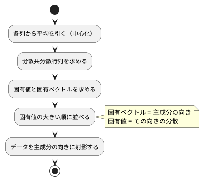

# 第 13 章: 主成分分析による次元削減

## 13.1 はじめに

ここまでの章では、正解ラベルのあるデータで予測をしてきました。この章から扱う **教師なし学習** では、正解ラベルを使わずに、データそのものの構造を調べます。

最初に扱うのは **主成分分析（PCA）** です。住宅価格のデータには 15 個もの列がありますが、列どうしは互いに関係しあっていて、実際にはもっと少ない数の「軸」で大部分を説明できることがあります。主成分分析は、データのばらつきを最もよく説明する新しい軸を探し、たくさんの列を少数の軸に要約します。

[Python 版の第 13 章](../python/13-principal-component-analysis.md) は NumPy の固有値分解で主成分分析を自作し、scikit-learn の `PCA` と突き合わせました。[Kotlin 版の第 13 章](../kotlin/13-principal-component-analysis.md) は第 7 章の行列型と Tribuo の `DenseMatrix` の固有値分解を使いました。Java 版も Kotlin 版と同じ構成です。分散共分散行列は [第 7 章](07-linear-regression.md) で作った `chapter07.Matrix` で求め、固有値分解だけを Tribuo に任せます。

Tribuo には主成分分析のモジュールが無いので、この章にはライブラリへの置き換えの節がありません（理由は 13.13 節）。その代わりに、Tribuo の固有値分解の振る舞いを **学習用テスト** で確かめ、主成分分析が満たすべき数学的な性質をテストにして、自作の実装を検証します。途中で、固有ベクトルの **符号** という、テストをすり抜けやすい落とし穴にも出会います。

## 13.2 主成分分析とは

### ばらつきが最も大きい方向を探す

2 つの列が強く相関しているデータを散布図にすると、点は斜めの帯のように並びます。このとき、帯に沿った方向の 1 本の軸を取れば、2 つの列の情報をほぼ 1 つの数値で表せます。この「ばらつき（分散）が最も大きい方向」が **第 1 主成分** です。第 2 主成分は、第 1 主成分と直交する方向のうち、ばらつきが最も大きい方向です。

### 分散共分散行列の固有ベクトル

主成分は、次の手順で求められます。



**分散共分散行列** は、対角に各列の分散、それ以外に 2 列の共分散を並べた行列です。この行列の **固有ベクトル** が主成分の向き、**固有値** がその向きのデータの分散になります。行列 `A` の固有ベクトル `v` と固有値 `λ` は、`A v = λ v`（`A` を掛けても向きが変わらず、長さだけが `λ` 倍になる）を満たします。

### 寄与率

各主成分の固有値を、固有値の合計で割った値を **寄与率** と呼びます。その主成分が、データ全体のばらつきのうち何割を説明しているかを表します。第 1 主成分から順に寄与率を足したものが **累積寄与率** です。「累積寄与率が 0.8 に届くまでの主成分を使う」のように、残す軸の数を決める目安に使います。

## 13.3 題材とデータ

この章では、[第 9 章](09-feature-engineering.md) と同じ `Boston.csv`（100 件）を、住宅価格 `PRICE` も含めたすべての列で使います。学習データの入手と配置は [第 1 章](01-machine-learning-and-first-test.md) の「題材とデータ」を参照してください。

| 列の種類 | 列 | 注意点 |
|---------|-----|--------|
| 数値 | ZN, INDUS, CHAS, NOX, RM, AGE, DIS, RAD, TAX, PTRATIO, B, LSTAT, PRICE | NOX と RAD に欠損値がある |
| カテゴリ | CRIME | `high`・`low`・`very_low` の 3 種類の文字列 |

主成分分析は数値しか扱えず、欠損値があると計算できません。また、列ごとに単位や桁（TAX は数百、NOX は 1 未満）が違うと、桁の大きい列のばらつきが主成分を支配してしまいます。そこで次の前処理をしてから主成分分析をします。

1. CRIME をダミー変数（`CRIME_low`・`CRIME_very_low` の 2 列）に置き換える
2. 欠損値を列の平均値で補完する
3. すべての列を平均 0・標準偏差 1 に標準化する

Kotlin 版は、第 9 章の前処理とは別に、この章の中に最小限の前処理を書き直しました。Java 版は、第 9 章で作った `Dummies`（ダミー変数）と `Standardizer`（標準化）、第 2 章の `Preprocessing.columnMeans`・`fillMissing`（補完）をそのまま組み合わせます。第 9 章の `Dummies.encode` はダミー変数の列名を「列名_カテゴリ」にするので、列名は Kotlin 版の `low` ではなく `CRIME_low` になります。

この章では訓練データとテストデータに分けません。主成分分析は正解を予測するモデルではなく、手元のデータ全体の構造を要約する手法だからです。そのため、補完の平均値も標準化の平均・標準偏差も、100 件すべてから求めます。

## 13.4 TODO リストの作成

**TODO リスト**:

- [ ] 分散共分散行列を求める
  - [ ] 2 列の分散と共分散を並べる
  - [ ] 3 列でも各列の分散と 2 列ずつの共分散を並べる
- [ ] Tribuo の固有値分解の振る舞いを確かめる
- [ ] 主成分を求める
  - [ ] 完全に相関する 2 列なら第 1 主成分だけで分散をすべて説明する
  - [ ] 寄与率の大きい順に、指定した数だけ並ぶ
  - [ ] 主成分の向き（符号）をそろえる
  - [ ] 主成分が固有ベクトルの性質を満たす
- [ ] データを主成分の向きに射影する
- [ ] 累積寄与率がしきい値に届く主成分の数を求める
- [ ] 主成分への影響が大きい列を求める
- [ ] Boston を前処理する（ダミー変数・欠損値の補完・標準化）
- [ ] 実データで寄与率と主成分の意味を表示する

## 13.5 分散共分散行列を求める

### Red

`[1, 3, 5]` と `[2, 6, 10]` の 2 列は、2 列目がちょうど 1 列目の 2 倍です。分散は n − 1 で割ると 4 と 16、共分散は 8 になります。データは第 7 章の `Matrix` で渡します。

```java
// src/test/java/chapter13/PcaTest.java
package chapter13;

import static org.assertj.core.api.Assertions.assertThat;
import static org.assertj.core.api.Assertions.within;

import chapter07.Matrix;
import org.junit.jupiter.api.DisplayName;
import org.junit.jupiter.api.Test;

class PcaTest {
  private static final double TOLERANCE = 1e-9;

  private static void assertMatrixEquals(double[][] expected, Matrix actual) {
    assertThat(actual.rowCount()).isEqualTo(expected.length);
    for (int i = 0; i < expected.length; i++) {
      assertThat(actual.columnCount()).isEqualTo(expected[i].length);
      for (int j = 0; j < expected[i].length; j++) {
        assertThat(actual.get(i, j)).isCloseTo(expected[i][j], within(TOLERANCE));
      }
    }
  }

  @Test
  @DisplayName("2 列の分散と共分散を並べた行列を返す")
  void covarianceOfTwoColumns() {
    Matrix x = Matrix.of(new double[][] {{1, 2}, {3, 6}, {5, 10}});

    assertMatrixEquals(new double[][] {{4, 8}, {8, 16}}, Pca.covarianceMatrix(x));
  }
}
```

第 7 章の `Matrix` は `equals` を配列の中身で比べるので `isEqualTo` でも比べられますが、計算で求めた小数は誤差を含みます。要素ごとに許容誤差を付けて比べる `assertMatrixEquals` を、テスト用に用意しました。

```text
src/test/java/chapter13/PcaTest.java:28: エラー: シンボルを見つけられません
    assertMatrixEquals(new double[][] {{4, 8}, {8, 16}}, Pca.covarianceMatrix(x));
                                                         ^
  シンボル:   変数 Pca
  場所: クラス PcaTest
エラー1個
```

### Green: 仮実装から三角測量へ

Kotlin 版はトップレベル関数 `covarianceMatrix` を置きましたが、Java 版はメソッドをクラスに置く必要があるので、`Pca` というユーティリティクラスにします。期待する行列をそのまま返す仮実装で Green にします。

```java
// src/main/java/chapter13/Pca.java
package chapter13;

import chapter07.Matrix;

/** 主成分分析。 */
public final class Pca {
  private Pca() {}

  /** 列ごとの分散と、2 列ずつの共分散を並べた行列。 */
  public static Matrix covarianceMatrix(Matrix x) {
    return Matrix.of(new double[][] {{4, 8}, {8, 16}});
  }
}
```

三角測量には、Kotlin 版と同じく手で計算できる 3 列の例を使います。3 列目 `[0, 1, 5]` の平均は 2、平均との差は `[-2, -1, 3]` です。1 列目の差 `[-2, 0, 2]` との積の和は 10 なので共分散は 10 / 2 = 5、2 乗の和は 14 なので分散は 7 になります。

```java
@Test
@DisplayName("3 列でも各列の分散と 2 列ずつの共分散を並べる")
void covarianceOfThreeColumns() {
  Matrix x = Matrix.of(new double[][] {{1, 2, 0}, {3, 6, 1}, {5, 10, 5}});

  assertMatrixEquals(
      new double[][] {{4, 8, 5}, {8, 16, 10}, {5, 10, 7}}, Pca.covarianceMatrix(x));
}
```

```text
PcaTest > 2 列の分散と共分散を並べた行列を返す PASSED
PcaTest > 3 列でも各列の分散と 2 列ずつの共分散を並べる FAILED
    org.opentest4j.AssertionFailedError: 
    expected: 3
     but was: 2
2 tests completed, 1 failed
```

失敗したのは、`assertMatrixEquals` の最初の行数の比較です。

中心化した行列 `Xc` を使うと、分散共分散行列は `Xcᵀ Xc / (n − 1)` と書けます。第 7 章の `Matrix` には、転置（`transpose`）と積（`times`）がすでにあります。

```java
/** 列ごとの平均。 */
public static double[] columnMeans(Matrix x) {
  double[] means = new double[x.columnCount()];
  for (int j = 0; j < means.length; j++) {
    means[j] = Arrays.stream(x.column(j)).average().orElseThrow();
  }
  return means;
}

/** 列ごとの分散と、2 列ずつの共分散を並べた行列。件数から 1 を引いた数で割る。 */
public static Matrix covarianceMatrix(Matrix x) {
  double[] means = columnMeans(x);
  double[][] centered = x.toArray();
  for (double[] row : centered) {
    for (int j = 0; j < row.length; j++) {
      row[j] -= means[j];
    }
  }
  Matrix c = Matrix.of(centered);
  double[][] product = c.transpose().times(c).toArray();
  int n = x.rowCount();
  for (double[] row : product) {
    for (int j = 0; j < row.length; j++) {
      row[j] /= n - 1;
    }
  }
  return Matrix.of(product);
}
```

- 第 7 章の `Matrix` は変更できない行列で、`toArray()` は配列の **写し** を返します。写しを書き換えて `Matrix.of` で新しい行列を作るので、引数の `x` は変わりません
- `Matrix` には要素ごとの引き算やスカラー倍が無いので、配列のループで書いています。第 7 章のコードは変更せず、必要になった処理はこの章の中に書く、という方針です
- Kotlin 版は `row.zip(means) { value, mean -> value - mean }` で 1 行ずつ新しいリストを作りました。Java 版は写した配列をその場で書き換えるので、`for` 文のほうが素直に書けます

```text
PcaTest > 2 列の分散と共分散を並べた行列を返す PASSED
PcaTest > 3 列でも各列の分散と 2 列ずつの共分散を並べる PASSED
BUILD SUCCESSFUL in 19s
```

## 13.6 Tribuo の固有値分解を確かめる

### 学習用テストを書く

固有値分解は、自分で実装すると数値計算の難しい部分に踏み込むことになります。ここでは Tribuo の `DenseMatrix` が持つ `eigenDecomposition` を使います。Kotlin 版では「NumPy の `eigh` と同じく固有値は小さい順だろう」という予想が外れ、学習用テストで大きい順だと分かりました。Java 版でも同じ予想から書き、同じ結果になるかを自分の手で確かめます。対称行列 `[[2, 1], [1, 2]]` の固有値は 1 と 3 です。

```java
// src/test/java/chapter13/TribuoEigenLearningTest.java
class TribuoEigenLearningTest {
  private final DenseMatrix symmetric =
      DenseMatrix.createDenseMatrix(new double[][] {{2, 1}, {1, 2}});

  private static double[] rounded(double[] values) {
    return Arrays.stream(values).map(v -> Math.round(v * 1e9) / 1e9).toArray();
  }

  @Test
  @DisplayName("対称行列の固有値を小さい順に返す")
  void eigenvaluesAscending() {
    var eigen = symmetric.eigenDecomposition().orElseThrow();

    assertThat(rounded(eigen.eigenvalues().toArray())).containsExactly(1.0, 3.0);
  }

  @Test
  @DisplayName("i 番目の固有ベクトルは行列を掛けても向きが変わらず i 番目の固有値倍になる")
  void eigenvectorMatchesEigenvalue() {
    var eigen = symmetric.eigenDecomposition().orElseThrow();

    for (int i = 0; i < 2; i++) {
      double[] v = eigen.getEigenVector(i).toArray();
      double lambda = eigen.eigenvalues().get(i);
      double[][] a = symmetric.toArray();
      for (int row = 0; row < 2; row++) {
        double av = a[row][0] * v[0] + a[row][1] * v[1];
        assertThat(av).isCloseTo(lambda * v[row], within(1e-9));
      }
    }
  }
}
```

- `eigenDecomposition()` の戻り値は `Optional<EigenDecomposition>` です。`orElseThrow()` は、値が無ければ `NoSuchElementException` を投げ、あれば値を取り出します
- 固有値は計算誤差を含むので、小数第 9 位で丸めてから `containsExactly`（並び順も含めて一致）で比べています
- `var` はローカル変数の型推論です。`EigenDecomposition` は `DenseMatrix` の入れ子の型なので、型名を書くと長くなるテストでは `var` を使いました

```text
TribuoEigenLearningTest > 対称行列の固有値を小さい順に返す FAILED
    org.opentest4j.AssertionFailedError: 
    Actual and expected have the same elements but not in the same order, at index 0 actual element was:
      3.0
    whereas expected element was:
      1.0
TribuoEigenLearningTest > i 番目の固有ベクトルは行列を掛けても向きが変わらず i 番目の固有値倍になる PASSED
4 tests completed, 1 failed
```

Java から呼んでも、Tribuo は固有値を **大きい順** に返しました。AssertJ の `containsExactly` は「要素は同じだが順序が違う」と教えてくれるので、何が外れたのかがすぐ分かります。2 つ目のテストは通ったので、「`i` 番目の固有ベクトルは `i` 番目の固有値に対応する」ことは確かめられました。

### ドキュメントの記述をテストに固定する

Kotlin 版で Tribuo 4.3.2 のソースを読んで分かったこと（[ADR 002](../../../adr/002-kotlin-ml-libraries.md)）は、Java 版でも同じ版のライブラリを使うのでそのまま当てはまります。

- `EigenDecomposition.eigenvalues()` のドキュメンテーションコメントには「The vector of eigenvalues, in descending order.」とあり、固有値を大きい順に並べ替えている
- 固有ベクトルは行列の **列** に並べて返す（`getEigenVector(i)` で `i` 列目を取り出せる）
- 対称でない行列は、複素数の固有値を持つことがあるので、空の `Optional` を返す

予想を正し、対角成分の並びが大きい順でない行列でも並べ替えることと、対称でない行列の振る舞いを足しました。

```java
@Test
@DisplayName("対称行列の固有値を大きい順に返す")
void eigenvaluesDescending() {
  var eigen = symmetric.eigenDecomposition().orElseThrow();

  assertThat(rounded(eigen.eigenvalues().toArray())).containsExactly(3.0, 1.0);
}

@Test
@DisplayName("対角成分の並びに関係なく固有値を大きい順に並べ替える")
void sortsEigenvalues() {
  var diagonal =
      DenseMatrix.createDenseMatrix(new double[][] {{1, 0, 0}, {0, 5, 0}, {0, 0, 3}});

  var eigen = diagonal.eigenDecomposition().orElseThrow();

  assertThat(rounded(eigen.eigenvalues().toArray())).containsExactly(5.0, 3.0, 1.0);
}

// i 番目の固有ベクトルのテストは同じ

@Test
@DisplayName("対称でない行列は固有値分解できず空の Optional を返す")
void asymmetricIsEmpty() {
  var asymmetric = DenseMatrix.createDenseMatrix(new double[][] {{2, 1}, {0, 2}});

  assertThat(asymmetric.eigenDecomposition()).isEmpty();
}
```

```text
TribuoEigenLearningTest > 対角成分の並びに関係なく固有値を大きい順に並べ替える PASSED
TribuoEigenLearningTest > i 番目の固有ベクトルは行列を掛けても向きが変わらず i 番目の固有値倍になる PASSED
TribuoEigenLearningTest > 対称でない行列は固有値分解できず空の Optional を返す PASSED
TribuoEigenLearningTest > 対称行列の固有値を大きい順に返す PASSED
```

Kotlin 版はテスト用に `denseMatrixOf(vararg rows: List<Double>)` という変換関数を用意しました。Java 版は `DenseMatrix.createDenseMatrix` が `double[][]` を受け取るので、配列の初期化子 `new double[][] {{2, 1}, {1, 2}}` をそのまま渡せます。Java から Java のライブラリを呼ぶときは、型の橋渡しが要りません。

分散共分散行列は、`(i, j)` 要素と `(j, i)` 要素を同じ掛け算の和で求めるので、計算誤差があっても完全に対称になります。対称でない行列を渡す心配はありません。

## 13.7 主成分を求める

### 完全に相関する 2 列

先ほどの 2 列のデータは、点がすべて `(1, 2)` 方向の直線上にあります。したがって第 1 主成分は長さ 1 の `(1, 2) / √5`、寄与率は第 1 主成分が 1、第 2 主成分が 0 になるはずです。

```java
@Test
@DisplayName("完全に相関する 2 列なら第 1 主成分だけで分散をすべて説明する")
void perfectlyCorrelated() {
  Matrix x = Matrix.of(new double[][] {{1, 2}, {3, 6}, {5, 10}});

  PcaModel model = Pca.fit(x, 2);

  assertMatrixEquals(
      new double[][] {{1 / Math.sqrt(5), 2 / Math.sqrt(5)}},
      Matrix.of(new double[][] {model.components().toArray()[0]}));
  assertThat(model.explainedVarianceRatio())
      .satisfiesExactly(
          r -> assertThat(r).isCloseTo(1.0, within(TOLERANCE)),
          r -> assertThat(r).isCloseTo(0.0, within(TOLERANCE)));
}
```

`satisfiesExactly` は、リストの要素を先頭から順に 1 つずつラムダで検査します。0 との比較を含むので、相対誤差ではなく `within`（絶対誤差）を使います。

```text
src/test/java/chapter13/PcaTest.java:45: エラー: シンボルを見つけられません
    PcaModel model = Pca.fit(x, 2);
    ^
  シンボル:   クラス PcaModel
  場所: クラス PcaTest
src/test/java/chapter13/PcaTest.java:45: エラー: シンボルを見つけられません
    PcaModel model = Pca.fit(x, 2);
                        ^
  シンボル:   メソッド fit(Matrix,int)
  場所: クラス Pca
エラー2個
```

学習したモデルは record にします。第 2 章の `Features` と同じく、record の成分に配列を使うと `equals` が参照の比較になる（Error Prone の `ArrayRecordComponent`）ので、平均・分散・寄与率は `List<Double>` で、主成分は変更できない `Matrix` で持ちます。

```java
// src/main/java/chapter13/PcaModel.java
/**
 * 学習した主成分分析のモデル。
 *
 * @param mean 列ごとの平均
 * @param components 主成分を 1 行に 1 つずつ、寄与率の大きい順に並べた行列
 * @param explainedVariance 主成分ごとの分散（固有値）
 * @param explainedVarianceRatio 主成分ごとの寄与率
 */
public record PcaModel(
    List<Double> mean,
    Matrix components,
    List<Double> explainedVariance,
    List<Double> explainedVarianceRatio) {
  public PcaModel {
    mean = List.copyOf(mean);
    explainedVariance = List.copyOf(explainedVariance);
    explainedVarianceRatio = List.copyOf(explainedVarianceRatio);
  }
}
```

13.2 節の手順をそのまま実装します。Tribuo が固有値を大きい順に並べてくれることは、学習用テストで確かめ済みです。

```java
/** 分散共分散行列を固有値分解し、寄与率の大きい順に nComponents 個の主成分を求める。 */
public static PcaModel fit(Matrix x, int nComponents) {
  DenseMatrix covariance = DenseMatrix.createDenseMatrix(covarianceMatrix(x).toArray());
  EigenDecomposition eigen = covariance.eigenDecomposition().orElseThrow();
  double[] eigenvalues = eigen.eigenvalues().toArray();
  double total = Arrays.stream(eigenvalues).sum();
  double[][] components = new double[nComponents][];
  for (int i = 0; i < nComponents; i++) {
    components[i] = eigen.getEigenVector(i).toArray();
  }
  List<Double> variances = Arrays.stream(eigenvalues).limit(nComponents).boxed().toList();
  return new PcaModel(
      Arrays.stream(columnMeans(x)).boxed().toList(),
      Matrix.of(components),
      variances,
      variances.stream().map(v -> v / total).toList());
}
```

- `Matrix.toArray()` が返す `double[][]` を、そのまま `DenseMatrix.createDenseMatrix` に渡しています。第 7 章の行列と Tribuo の行列は、どちらも `double[][]` で出し入れできます
- `boxed()` は `DoubleStream` の `double` を `Double` に包み、`List<Double>` にするために使います
- 固有ベクトルは列に並んでいるので、`getEigenVector(i)` で 1 本ずつ取り出し、1 行に 1 つの主成分を並べた行列にしています

```text
PcaTest > 完全に相関する 2 列なら第 1 主成分だけで分散をすべて説明する PASSED
PcaTest > 2 列の分散と共分散を並べた行列を返す PASSED
PcaTest > 3 列でも各列の分散と 2 列ずつの共分散を並べる PASSED
BUILD SUCCESSFUL in 24s
```

### 寄与率の順と、すり抜けた符号のテスト

乱数で作った 4 列の人工データで、寄与率が大きい順に並ぶことを確かめます。2 つの隠れた変数を 4 列に混ぜ、小さなノイズを加えたデータです。乱数には、Kotlin 版と同じくシードを指定した `java.util.Random` の `nextGaussian()` を使います。

```java
/** 2 つの隠れた変数を 4 列に混ぜ、小さなノイズを加えた 40 行の架空のデータ。 */
private static Matrix mixedDataset() {
  Random random = new Random(0);
  double[][] mixing = {{2.0, 0.5}, {0.3, 1.0}, {1.0, -1.0}, {0.0, 0.2}};
  double[][] rows = new double[40][];
  for (int i = 0; i < rows.length; i++) {
    double[] base = {random.nextGaussian(), random.nextGaussian()};
    rows[i] = new double[mixing.length];
    for (int j = 0; j < mixing.length; j++) {
      rows[i][j] =
          mixing[j][0] * base[0] + mixing[j][1] * base[1] + random.nextGaussian() * 0.1;
    }
  }
  return Matrix.of(rows);
}

@Test
@DisplayName("主成分は寄与率の大きい順に指定した数だけ並ぶ")
void sortedByRatio() {
  PcaModel model = Pca.fit(mixedDataset(), 3);

  List<Double> ratios = model.explainedVarianceRatio();
  assertThat(ratios).hasSize(3).isSortedAccordingTo(Comparator.reverseOrder());
}
```

固有ベクトル `v` が主成分の向きなら、逆向きの `−v` も同じ直線を表す固有ベクトルです。どちらの符号が返るかに決まった規則はありません（ADR 002）。Python 版・Kotlin 版と同じく、「絶対値が最大の要素が正になる」ように向きをそろえる、という仕様にします。まず、負の相関を持つ 2 列で第 1 主成分の向きを確かめるテストを書きました。

```java
@Test
@DisplayName("主成分の向きは絶対値が最大の要素が正になるようにそろえる")
void normalizesSign() {
  Matrix x = Matrix.of(new double[][] {{1, -2}, {3, -6}, {5, -10}});

  PcaModel model = Pca.fit(x, 1);

  assertMatrixEquals(
      new double[][] {{-1 / Math.sqrt(5), 2 / Math.sqrt(5)}},
      Matrix.of(new double[][] {model.components().toArray()[0]}));
}
```

Kotlin 版では、このテストが Red にならずに通ってしまいました。Java 版でも同じことが起きます。

```text
PcaTest > 完全に相関する 2 列なら第 1 主成分だけで分散をすべて説明する PASSED
PcaTest > 2 列の分散と共分散を並べた行列を返す PASSED
PcaTest > 主成分の向きは絶対値が最大の要素が正になるようにそろえる PASSED
PcaTest > 主成分は寄与率の大きい順に指定した数だけ並ぶ PASSED
PcaTest > 3 列でも各列の分散と 2 列ずつの共分散を並べる PASSED
BUILD SUCCESSFUL in 11s
```

向きをそろえる処理がまだ無いのに通っています。Tribuo がたまたま期待どおりの向きを返しただけで、仕様を守る実装があることをテストが保証していません。Red を確認できないテストは、何も確かめていないのと同じです。

Tribuo が逆向きを返す例を探すため、使い捨てのテストクラスで、向きをそろえる前の主成分を表示しました（確かめたあとで削除しました）。

```text
PROBE pos [[0.4472135954999579, 0.8944271909999159], [-0.8944271909999159, 0.4472135954999579]]
PROBE neg [[-0.4472135954999579, 0.8944271909999159], [-0.8944271909999159, -0.4472135954999579]]
```

Kotlin 版の表示と 1 桁も違わない値です。同じ Tribuo の同じ計算を、同じ `double[][]` で呼んでいるからです。どちらのデータでも、第 2 主成分は絶対値が最大の要素 `−0.894` が負でした。そこで、`(1, 2)` 方向のデータの **第 2 主成分** で向きを確かめるテストに書き直します。

```java
@Test
@DisplayName("主成分の向きは絶対値が最大の要素が正になるようにそろえる")
void normalizesSign() {
  Matrix x = Matrix.of(new double[][] {{1, 2}, {3, 6}, {5, 10}});

  PcaModel model = Pca.fit(x, 2);

  assertMatrixEquals(
      new double[][] {{2 / Math.sqrt(5), -1 / Math.sqrt(5)}},
      Matrix.of(new double[][] {model.components().toArray()[1]}));
}
```

```text
PcaTest > 主成分の向きは絶対値が最大の要素が正になるようにそろえる FAILED
    java.lang.AssertionError: 
    Expecting actual:
      -0.8944271909999159
    to be close to:
      0.8944271909999159
    by less than 1.0E-9 but difference was 1.7888543819998317.
    (a difference of exactly 1.0E-9 being considered valid)
5 tests completed, 1 failed
```

今度は期待どおり Red になりました。各主成分について、絶対値が最大の要素の符号（+1 か −1）を行全体に掛ける `normalizeSigns` を実装し、`fit` から使います。

```java
/** 固有ベクトルは符号が逆でも同じ向きを表すので、絶対値が最大の要素が正になるようにそろえる。 */
public static Matrix normalizeSigns(Matrix components) {
  double[][] rows = components.toArray();
  for (double[] row : rows) {
    double largest = row[0];
    for (double value : row) {
      if (Math.abs(value) > Math.abs(largest)) {
        largest = value;
      }
    }
    double sign = Math.signum(largest);
    for (int j = 0; j < row.length; j++) {
      row[j] *= sign;
    }
  }
  return Matrix.of(rows);
}
```

```java
      normalizeSigns(Matrix.of(components)),
```

- Kotlin 版の `row.maxBy { abs(it) }` は、絶対値が最大の **要素そのもの**（符号付き）を 1 行で返しました。Java の `DoubleStream` には `maxBy` に当たるものが無いので、ループで「絶対値が最大の要素」を探しています
- `Math.signum` は、正なら 1.0、負なら −1.0 を返します（Kotlin の `sign` と同じ）

`normalizeSigns` にも専用のテストを足して振る舞いを固定します。

```java
@Test
@DisplayName("絶対値が最大の要素が正になるように主成分の向きをそろえる")
void normalizeSigns() {
  Matrix components = Matrix.of(new double[][] {{0.6, -0.8}, {-0.8, 0.6}});

  assertMatrixEquals(
      new double[][] {{-0.6, 0.8}, {0.8, -0.6}}, Pca.normalizeSigns(components));
}
```

### 突き合わせる相手が無いときは性質をテストにする

Python 版は scikit-learn の `PCA` と主成分・寄与率を突き合わせましたが、Java 版には突き合わせる相手がありません。Kotlin 版と同じく、主成分分析の結果が満たすべき **性質** をテストにします。

- 主成分は長さ 1 で、互いに直交する。主成分を並べた行列 `C` と転置の積 `C Cᵀ` は単位行列になる
- 主成分 `v` は分散共分散行列 `A` の固有ベクトルで、`A v` は `v` の「その主成分の分散」倍になる

```java
@Test
@DisplayName("主成分は長さ 1 で互いに直交する")
void orthonormal() {
  PcaModel model = Pca.fit(mixedDataset(), 3);

  Matrix gram = model.components().times(model.components().transpose());

  assertMatrixEquals(new double[][] {{1, 0, 0}, {0, 1, 0}, {0, 0, 1}}, gram);
}

@Test
@DisplayName("主成分は分散共分散行列に掛けると分散の倍数になる固有ベクトル")
void eigenvectorsOfCovariance() {
  Matrix x = mixedDataset();

  PcaModel model = Pca.fit(x, 3);

  Matrix covariance = Pca.covarianceMatrix(x);
  double[][] components = model.components().toArray();
  for (int i = 0; i < components.length; i++) {
    double variance = model.explainedVariance().get(i);
    Matrix projected = covariance.times(Matrix.columnVector(components[i]));
    double[] expected = Arrays.stream(components[i]).map(v -> v * variance).toArray();
    assertThat(projected.column(0)).containsExactly(expected, within(TOLERANCE));
  }
}
```

第 7 章の `Matrix.columnVector` は、値を縦に並べた 1 列の行列を作ります。AssertJ の `containsExactly(double[], within(...))` は、配列の要素を順に許容誤差つきで比べます。

どちらのテストも、実装を変えずに通ります。Tribuo の固有値分解をどう使っても満たすべき性質なので、Tribuo の版を上げたときや、自前の計算に差し替えたときの安全網になります。

```text
PcaTest > 主成分は分散共分散行列に掛けると分散の倍数になる固有ベクトル PASSED
PcaTest > 完全に相関する 2 列なら第 1 主成分だけで分散をすべて説明する PASSED
PcaTest > 2 列の分散と共分散を並べた行列を返す PASSED
PcaTest > 絶対値が最大の要素が正になるように主成分の向きをそろえる PASSED
PcaTest > 主成分の向きは絶対値が最大の要素が正になるようにそろえる PASSED
PcaTest > 主成分は寄与率の大きい順に指定した数だけ並ぶ PASSED
PcaTest > 3 列でも各列の分散と 2 列ずつの共分散を並べる PASSED
PcaTest > 主成分は長さ 1 で互いに直交する PASSED
BUILD SUCCESSFUL in 24s
```

## 13.8 データを主成分の向きに射影する

データを主成分の軸で表し直すには、平均を引いてから主成分の向きとの内積を取ります。平均が `(1, 2)`、主成分が `(0.6, 0.8)` のモデルに `(2, 3)` を渡すと、`(1, 1)` と `(0.6, 0.8)` の内積で 1.4 になります。

```java
@Test
@DisplayName("平均を引いてから主成分の向きに射影する")
void transform() {
  var model =
      new PcaModel(
          List.of(1.0, 2.0),
          Matrix.of(new double[][] {{0.6, 0.8}}),
          List.of(1.0),
          List.of(1.0));

  assertMatrixEquals(
      new double[][] {{1.4}, {0.0}},
      Pca.transform(model, Matrix.of(new double[][] {{2, 3}, {1, 2}})));
}
```

テストの `PcaModel` は、学習を経由せずにコンストラクターで直接組み立てています。record にしておいたので、射影だけをテストできます。

## 13.9 必要な主成分の数を求める

寄与率が `[0.5, 0.25, 0.25]` のとき、累積寄与率は `[0.5, 0.75, 1.0]` です。しきい値 0.75 に届くのは 2 つ目です。射影のテストと一緒に書きました。

```java
@Test
@DisplayName("累積寄与率がしきい値に届くまでの主成分の数を返す")
void componentsNeeded() {
  assertThat(Pca.componentsNeeded(List.of(0.5, 0.25, 0.25), 0.75)).isEqualTo(2);
}
```

```text
src/test/java/chapter13/PcaTest.java:145: エラー: シンボルを見つけられません
        Pca.transform(model, Matrix.of(new double[][] {{2, 3}, {1, 2}})));
           ^
  シンボル:   メソッド transform(PcaModel,Matrix)
  場所: クラス Pca
src/test/java/chapter13/PcaTest.java:151: エラー: シンボルを見つけられません
    assertThat(Pca.componentsNeeded(List.of(0.5, 0.25, 0.25), 0.75)).isEqualTo(2);
                  ^
  シンボル:   メソッド componentsNeeded(List<Double>,double)
  場所: クラス Pca
エラー2個
```

`transform` は明白な実装、`componentsNeeded` は 2 を返す仮実装にします。

```java
/** 平均を引いてから、データを主成分の向きに射影する。 */
public static Matrix transform(PcaModel model, Matrix x) {
  double[][] centered = x.toArray();
  for (double[] row : centered) {
    for (int j = 0; j < row.length; j++) {
      row[j] -= model.mean().get(j);
    }
  }
  return Matrix.of(centered).times(model.components().transpose());
}

/** 累積寄与率がしきい値に届くまでの主成分の数。 */
public static int componentsNeeded(List<Double> ratios, double threshold) {
  return 2;
}
```

`components` の 1 行が 1 つの主成分なので、データの行列に `components` の転置を掛けると、1 行のデータが「主成分ごとの座標」の 1 行に変わります。

しきい値を 0.8 に上げると 3 つ必要になる例で三角測量します。

```java
@Test
@DisplayName("しきい値を上げると必要な主成分の数が増える")
void componentsNeededGrows() {
  assertThat(Pca.componentsNeeded(List.of(0.5, 0.25, 0.25), 0.8)).isEqualTo(3);
}
```

```text
PcaTest > しきい値を上げると必要な主成分の数が増える FAILED
    org.opentest4j.AssertionFailedError: 
    expected: 3
     but was: 2
PcaTest > 平均を引いてから主成分の向きに射影する PASSED
PcaTest > 累積寄与率がしきい値に届くまでの主成分の数を返す PASSED
11 tests completed, 1 failed
```

Kotlin 版は `runningReduce`（累積和のリスト）と `indexOfFirst` を組み合わせて 1 行で書きました。Java の Stream API には累積和を並べる操作が無いので、ループで足しながら、しきい値に届いた位置で返します。

```java
/** 累積寄与率がしきい値に届くまでの主成分の数。 */
public static int componentsNeeded(List<Double> ratios, double threshold) {
  double cumulative = 0;
  for (int i = 0; i < ratios.size(); i++) {
    cumulative += ratios.get(i);
    if (cumulative >= threshold) {
      return i + 1;
    }
  }
  return ratios.size();
}
```

寄与率の合計は計算誤差で 1 をわずかに下回ることがあるので、しきい値に最後まで届かなければすべての主成分の数を返します。Kotlin 版は `indexOfFirst` が −1 を返して 0 になる書き方でした。

Green になったところで、`covarianceMatrix` と `transform` に同じ中心化の処理が重複していたので、`private` なメソッドに切り出しました。

```java
/** 各列から平均を引く（中心化）。 */
private static Matrix center(Matrix x, double[] means) {
  double[][] centered = x.toArray();
  for (double[] row : centered) {
    for (int j = 0; j < row.length; j++) {
      row[j] -= means[j];
    }
  }
  return Matrix.of(centered);
}

/** 列ごとの分散と、2 列ずつの共分散を並べた行列。件数から 1 を引いた数で割る。 */
public static Matrix covarianceMatrix(Matrix x) {
  Matrix c = center(x, columnMeans(x));
  double[][] product = c.transpose().times(c).toArray();
  int n = x.rowCount();
  for (double[] row : product) {
    for (int j = 0; j < row.length; j++) {
      row[j] /= n - 1;
    }
  }
  return Matrix.of(product);
}

/** 平均を引いてから、データを主成分の向きに射影する。 */
public static Matrix transform(PcaModel model, Matrix x) {
  double[] means = model.mean().stream().mapToDouble(Double::doubleValue).toArray();
  return center(x, means).times(model.components().transpose());
}
```

## 13.10 主成分への影響が大きい列を求める

主成分の意味を読むには、係数（主成分の向きの各成分）の絶対値が大きい列を見ます。Kotlin 版は列名と係数を `Pair<String, Double>` で返しました。Java には標準の組の型が無いので、第 9 章の `Scores` と同じく名前を付けた record `Loading` を作ります。

```java
@Test
@DisplayName("係数の絶対値が大きい順に列名と係数を返す")
void topLoadings() {
  double[] component = {0.1, -0.7, 0.5};

  assertThat(Pca.topLoadings(component, List.of("ZN", "DIS", "TAX"), 2))
      .containsExactly(new Loading("DIS", -0.7), new Loading("TAX", 0.5));
}
```

```text
src/test/java/chapter13/PcaTest.java:166: エラー: シンボルを見つけられません
        .containsExactly(new Loading("DIS", -0.7), new Loading("TAX", 0.5));
                             ^
  シンボル:   クラス Loading
  場所: クラス PcaTest
```

```java
// src/main/java/chapter13/Loading.java
/**
 * 主成分の向きに対する 1 つの列の係数。
 *
 * @param column 列名
 * @param value 主成分の向きの成分（符号付き）
 */
public record Loading(String column, double value) {}
```

```java
/** 主成分の係数の絶対値が大きい順に、列名と係数を k 個返す。 */
public static List<Loading> topLoadings(double[] component, List<String> columns, int k) {
  return IntStream.range(0, component.length)
      .mapToObj(j -> new Loading(columns.get(j), component[j]))
      .sorted(Comparator.comparingDouble((Loading l) -> Math.abs(l.value())).reversed())
      .limit(k)
      .toList();
}
```

- `Comparator.comparingDouble(...).reversed()` で、絶対値の大きい順に並べます。`reversed()` を続けるとラムダの引数の型を推論できなくなるので、`(Loading l)` と型を書いています
- record の `equals` は成分ごとに比べるので、テストでは `new Loading("DIS", -0.7)` と直接比べられます

## 13.11 Boston を前処理する

前処理は、第 9 章の部品を組み合わせるだけで書けます。架空の 4 件の表で、ダミー変数の列と、標準化の結果を確かめます。

```java
// src/test/java/chapter13/BostonPcaTest.java
private static Row row(String crime, String rm, String price) {
  return new Row(Map.of("CRIME", crime, "RM", rm, "PRICE", price));
}

/** 架空の 4 件。RM の 3 件目が欠損値。 */
private static Table bostonLike() {
  return new Table(
      List.of("CRIME", "RM", "PRICE"),
      List.of(
          row("high", "5", "10"),
          row("low", "6", "20"),
          row("very_low", "", "30"),
          row("low", "7", "40")));
}

@Test
@DisplayName("CRIME をダミー変数の列に置き換える")
void replacesCrimeWithDummies() {
  List<Features> x = BostonPca.standardize(bostonLike());

  assertThat(x.getFirst().columns())
      .containsExactly("RM", "PRICE", "CRIME_low", "CRIME_very_low");
}

@Test
@DisplayName("欠損値を補完してから各列を平均 0 と標準偏差 1 にそろえる")
void fillsAndStandardizes() {
  List<Features> x = BostonPca.standardize(bostonLike());

  for (String column : x.getFirst().columns()) {
    double[] values = x.stream().mapToDouble(f -> f.value(column)).toArray();
    double mean = Arrays.stream(values).average().orElseThrow();
    double variance =
        Arrays.stream(values).map(v -> (v - mean) * (v - mean)).average().orElseThrow();
    assertThat(mean).as(column).isCloseTo(0.0, within(1e-9));
    assertThat(Math.sqrt(variance)).as(column).isCloseTo(1.0, within(1e-9));
  }
}
```

`as(column)` は、失敗したときのメッセージに列名を付けます。どの列で失敗したかが分かります。

```text
src/test/java/chapter13/BostonPcaTest.java:34: エラー: シンボルを見つけられません
    List<Features> x = BostonPca.standardize(bostonLike());
                       ^
  シンボル:   変数 BostonPca
  場所: クラス BostonPcaTest
```

```java
// src/main/java/chapter13/BostonPca.java
/** 主成分分析のために、ボストンの住宅価格（Boston.csv）のすべての列を前処理する。 */
public final class BostonPca {
  /** カテゴリ値の列 */
  public static final String CATEGORY = "CRIME";

  private BostonPca() {}

  /** CRIME をダミー変数にし、欠損値を列の平均値で補完してから、すべての列を標準化する。 */
  public static List<Features> standardize(Table table) {
    List<String> crimes = table.rows().stream().map(row -> row.text(CATEGORY)).toList();
    Table encoded = Dummies.encode(table, CATEGORY, Dummies.categories(crimes));
    List<String> columns = encoded.columns();
    List<Features> filled =
        Preprocessing.fillMissing(
            encoded.rows(), columns, Preprocessing.columnMeans(encoded.rows(), columns));
    return Standardizer.fit(filled).transform(filled);
  }

  /** CSV を読み込んで前処理する。 */
  public static List<Features> load(Path csvFile) throws IOException {
    return standardize(Table.load(csvFile));
  }

  /** 特徴量のリストを、1 件を 1 行とする行列にする。 */
  public static Matrix toMatrix(List<Features> x) {
    return Matrix.of(x.stream().map(Features::values).toArray(double[][]::new));
  }
}
```

```text
BostonPcaTest > 欠損値を補完してから各列を平均 0 と標準偏差 1 にそろえる PASSED
BostonPcaTest > CRIME をダミー変数の列に置き換える PASSED
BUILD SUCCESSFUL in 27s
```

Kotlin 版は、第 9 章の関数が訓練データとテストデータに分ける前提の形だったため、この章で補完・ダミー変数・標準化を書き直しました。Java 版の第 9 章は、`Dummies.encode` が表を、`Standardizer.fit` が特徴量のリストを受け取る小さな部品に分かれていたので、分割しない使い方にもそのまま組み合わせられました。標準化はどちらも件数で割る標準偏差です（第 9 章 9.5 節）。

`Features.values()` は配列の写しを返すので、`toArray(double[][]::new)` で 1 件を 1 行とする配列を作り、第 7 章の `Matrix.of` に渡しています。

## 13.12 実データで要約する

### 表示のテストを書く

実データのテストは、学習データが無い環境では `assumeTrue` でスキップします。Kotlin 版と同じく、実データでも固有ベクトルの性質を満たすことと、寄与率の合計が 1 になることを確かめ、`Main` の出力を固定します。

```java
// src/test/java/chapter13/BostonPcaDataTest.java
class BostonPcaDataTest {
  private final Path csvFile = DataDir.dataDir().resolve("Boston.csv");

  @BeforeEach
  void requireData() {
    assumeTrue(Files.exists(csvFile), "学習データ Boston.csv が配置されていない（gulp data:setup）");
  }

  @Test
  @DisplayName("CRIME をダミー変数にして 15 列の標準化済みデータにする")
  void loads100RowsAnd15Columns() throws IOException {
    List<Features> x = BostonPca.load(csvFile);

    assertThat(x).hasSize(100);
    assertThat(x.getFirst().columns()).hasSize(15);
  }

  @Test
  @DisplayName("実データの主成分も分散共分散行列の固有ベクトルになる")
  void eigenvectorsOfRealData() throws IOException {
    Matrix x = BostonPca.toMatrix(BostonPca.load(csvFile));

    PcaModel model = Pca.fit(x, 15);

    Matrix covariance = Pca.covarianceMatrix(x);
    double[][] components = model.components().toArray();
    for (int i = 0; i < components.length; i++) {
      double variance = model.explainedVariance().get(i);
      Matrix projected = covariance.times(Matrix.columnVector(components[i]));
      double[] expected = Arrays.stream(components[i]).map(v -> v * variance).toArray();
      assertThat(projected.column(0)).containsExactly(expected, within(1e-9));
    }
    double total = model.explainedVarianceRatio().stream().mapToDouble(Double::doubleValue).sum();
    assertThat(total).isCloseTo(1.0, within(1e-9));
  }

  @Test
  @DisplayName("実行すると寄与率と主成分の解釈を表示する")
  void printsSummary() throws Exception {
    String output = StdoutCapture.capture(() -> Main.main(new String[0]));

    assertThat(output)
        .isEqualTo(
            """
            データ件数: 100, 列数: 15
            寄与率: PC1 0.4110, PC2 0.1448, PC3 0.1019, PC4 0.0645, PC5 0.0623, PC6 0.0581
            累積寄与率が 0.8 に届く主成分の数: 6（累積寄与率 0.8427）
            第 1 主成分で影響の大きい列: INDUS 0.359, NOX 0.350, TAX 0.328
            第 2 主成分で影響の大きい列: PRICE 0.444, CRIME_low 0.423, RM 0.405
            """);
  }
}
```

期待する出力には、Kotlin 版の実測値を、列名だけ Java 版の `CRIME_low` に替えて書きました。この章は分割も乱数も使わないので、同じデータを同じ手順で計算すれば同じ値になるはずだ、という予想をテストにしたものです。

### 結果を表示する

```java
// src/main/java/chapter13/Main.java
/** ボストンの住宅価格の 15 列を主成分分析し、寄与率と主成分の意味を表示する。 */
public final class Main {
  private static final double THRESHOLD = 0.8;
  private static final int TOP_K = 3;
  private static final int COMPONENTS_TO_EXPLAIN = 2;

  private Main() {}

  public static void main(String[] args) throws IOException {
    List<Features> features = BostonPca.load(DataDir.dataDir().resolve("Boston.csv"));
    List<String> columns = features.getFirst().columns();
    Matrix x = BostonPca.toMatrix(features);
    PcaModel model = Pca.fit(x, columns.size());
    List<Double> ratios = model.explainedVarianceRatio();
    int needed = Pca.componentsNeeded(ratios, THRESHOLD);
    double cumulative = ratios.stream().limit(needed).mapToDouble(Double::doubleValue).sum();

    System.out.println("データ件数: " + x.rowCount() + ", 列数: " + columns.size());
    System.out.println(
        "寄与率: "
            + IntStream.range(0, needed)
                .mapToObj(i -> "PC" + (i + 1) + " " + format("%.4f", ratios.get(i)))
                .collect(Collectors.joining(", ")));
    System.out.println(
        "累積寄与率が "
            + THRESHOLD
            + " に届く主成分の数: "
            + needed
            + "（累積寄与率 "
            + format("%.4f", cumulative)
            + "）");
    double[][] components = model.components().toArray();
    for (int i = 0; i < COMPONENTS_TO_EXPLAIN; i++) {
      String loadings =
          Pca.topLoadings(components[i], columns, TOP_K).stream()
              .map(l -> l.column() + " " + format("%.3f", l.value()))
              .collect(Collectors.joining(", "));
      System.out.println("第 " + (i + 1) + " 主成分で影響の大きい列: " + loadings);
    }
  }

  private static String format(String pattern, double value) {
    return String.format(Locale.ROOT, pattern, value);
  }
}
```

`String.format` に `Locale.ROOT` を渡すのは、実行環境のロケールによって小数点が `,` になるのを防ぐためです（第 1 章）。

```bash
cd apps/java
./gradlew runChapter -Pchapter=13
```

```text
データ件数: 100, 列数: 15
寄与率: PC1 0.4110, PC2 0.1448, PC3 0.1019, PC4 0.0645, PC5 0.0623, PC6 0.0581
累積寄与率が 0.8 に届く主成分の数: 6（累積寄与率 0.8427）
第 1 主成分で影響の大きい列: INDUS 0.359, NOX 0.350, TAX 0.328
第 2 主成分で影響の大きい列: PRICE 0.444, CRIME_low 0.423, RM 0.405
```

予想どおり、表示のテストも通りました。第 7 章・第 9 章では、分割の乱数が Kotlin の `kotlin.random.Random` と Java の `java.util.Random` で違うため、数値が Kotlin 版と一致しませんでした。この章は分割も乱数も使わないので、Kotlin 版（`CRIME_low` が `low` になる以外）と、Kotlin 版が一致を確かめた Python 版と、同じ寄与率・同じ主成分が得られています。主成分の向きまでそろっているのは、13.7 節の `normalizeSigns` で符号の規則を決めたからです。

### 結果を読む

- **第 1 主成分だけで 4 割を説明する**: 15 列のばらつきのうち 41.1% を、1 本の軸で説明できます
- **15 列を 6 本の軸に要約できる**: 累積寄与率 0.8 を目安にすると、6 つの主成分で全体の 84.3% を説明できます
- **第 1 主成分は「産業化・都市化」の軸と読める**: 非小売業の土地の割合（INDUS）、窒素酸化物の濃度（NOX）、固定資産税率（TAX）が同じ向きに強く効いています
- **第 2 主成分は「住環境のよさ」の軸と読める**: 住宅価格（PRICE）、犯罪率が低い地区（CRIME_low）、部屋数（RM）が同じ向きに効いています

主成分の「意味」は計算で決まるものではなく、係数を見た人間の解釈です。符号の向きも `normalizeSigns` の規則で決めたものなので、「値が大きいほど都市化している」のか「小さいほど」なのかは、係数の符号とあわせて読む必要があります。

## 13.13 ライブラリへの置き換えを省略する理由

他の章では、自作のアルゴリズムを Tribuo のトレーナーに置き換えて結果を突き合わせてきました。この章では、その節を省略します。[ADR 002](../../../adr/002-kotlin-ml-libraries.md) と [ADR 005](../../../adr/005-java-ml-libraries.md) のとおり、Tribuo 4.3.2 には主成分分析のモジュール（学習して射影するトレーナーや変換器）が無いためです。Java 版のために別の機械学習ライブラリを足すことはせず、Kotlin 版と同じく Tribuo の固有値分解を使った自作を最終実装とします。

その代わりに、この章では次の形で Tribuo を使い、検証しました。

| 検証の手段 | 何を確かめたか |
|-----------|--------------|
| 学習用テスト（`TribuoEigenLearningTest`） | Tribuo の固有値分解が、固有値を大きい順に並べ、対称でない行列では空の `Optional` を返すこと |
| 性質のテスト（`PcaTest`） | 主成分が長さ 1 で直交し、分散共分散行列の固有ベクトルになっていること |
| 実データのテスト（`BostonPcaDataTest`） | 実データでも固有ベクトルの性質を満たし、寄与率の合計が 1 になること。表示が Kotlin 版の結果と一致すること |

主成分分析の手順のうち、計算が難しいのは固有値分解だけです。そこだけをライブラリに任せ、前後の中心化・分散共分散行列・並べ替え・符号・射影を自作したことで、この章の実装が最終実装になります。

## 13.14 Notebook による探索と可視化

Java 版では Notebook と可視化の節を設けません。主成分の数と累積寄与率のグラフ、第 1・第 2 主成分の散布図、主成分への影響が大きい列の棒グラフは、[Python 版の第 13 章](../python/13-principal-component-analysis.md) と [Kotlin 版の第 13 章](../kotlin/13-principal-component-analysis.md) の Notebook の節を参照してください。数値は 13.12 節のとおり Kotlin 版と一致しているので、グラフもそのまま読み替えられます。

## 13.15 リファクタリング

TODO リストをすべて終えてから、`./gradlew spotlessApply check` で整形と静的解析（Error Prone・PMD）をかけました。この章では指摘はありませんでした。TDD の途中で済ませたリファクタリングは次の 2 つです。

- **中心化の重複** — `covarianceMatrix` と `transform` の中心化を `center` に切り出した（13.9 節）
- **組に名前を付ける** — 列名と係数の組を `Pair` の代わりに record `Loading` にした（13.10 節）

第 7 章の `Matrix` と第 9 章の `Dummies`・`Standardizer` は変更していません。要素ごとの引き算やスカラー倍のように、この章だけで必要になった処理は `Pca` の中に書きました。

学習データが無い環境（`ML_DATA_DIR=/nonexistent ./gradlew test`）では、`BostonPcaDataTest` の 3 つのテストがスキップされ、残りのテストは通ります。

## 13.16 まとめ

この章では、主成分分析を分散共分散行列と固有値分解から組み立てました。

1. **分散共分散行列** — 第 7 章の `Matrix` の転置と積を再利用し、`Xcᵀ Xc / (n − 1)` で求めた。三角測量の相手には、手で計算できる 3 列の例を用意した
2. **学習用テストで予想を正す** — Tribuo の固有値は小さい順だろうという予想をテストで確かめ、大きい順・対称行列だけ、という振る舞いを固定した
3. **すり抜けたテストを Red にする** — 符号のテストがライブラリの偶然で通っていたことに気づき、逆向きが返る例を探してテストを書き直してから `normalizeSigns` を実装した
4. **突き合わせる相手が無いときは性質をテストにする** — scikit-learn の代わりに、直交性と固有ベクトルの性質で自作の主成分分析を検証した
5. **次元削減と解釈** — Boston の 15 列を累積寄与率 0.8 を目安に 6 本の軸へ要約し、分割も乱数も使わないことで、Kotlin 版と同じ寄与率と主成分が得られることを確かめた

Java 版ならではの学びもありました。

- **Java のライブラリは型の橋渡しが要らない** — `Matrix.toArray()` の `double[][]` を `DenseMatrix.createDenseMatrix` にそのまま渡せた
- **小さな部品は組み合わせ直せる** — 第 9 章の `Dummies`・`Standardizer` と第 2 章の補完を、分割しない前処理にそのまま使えた
- **Stream API に無い操作はループで書く** — `maxBy` や `runningReduce` に当たる操作は、ループのほうが素直に書けた

次の章では、同じく教師なし学習の K-means で、データを似たもの同士のグループに分けます。
