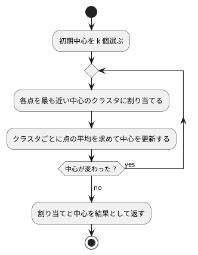

# 第 14 章: K-means によるクラスタリング

## 14.1 はじめに

これまでの章では、正解ラベル（派閥・品種・生存・価格など）が付いたデータから予測のルールを学ばせてきました。このような学習を **教師あり学習** と呼びます。

この章では、正解ラベルの無いデータから、似たもの同士のグループ（クラスタ）を見つける **クラスタリング** を扱います。正解を教えずにデータの構造を見つけるので、**教師なし学習** の一種です。代表的なアルゴリズムである **K-means** を TDD で自作し、Tribuo の `KMeansTrainer` と結果を比べます。

題材は、卸売業者の顧客ごとの商品カテゴリ別の支出額です。「どんな買い方をする顧客のグループがあるか」を、データだけから探します。

[Python 版の第 14 章](../python/14-k-means-clustering.md) と同じ TODO リストで進め、[Kotlin 版の第 14 章](../kotlin/14-k-means-clustering.md) と対比します。Kotlin 版は点を `List<Double>` で表し、`generateSequence` による遅延評価の列で「中心が動かなくなるまで繰り返す」処理を書きました。Java 版は点を `double[]`、点の集まりを `double[][]` で表し、繰り返しは `for` 文で書きます。数値計算の内側のループは、配列と `for` 文で書くのが Java では最も素直だからです。

## 14.2 K-means の仕組み

K-means は、クラスタ数 k を人間が決め、次の 2 つの手順を交互に繰り返してクラスタを作ります。

1. **割り当て**: 各点を、最も近いクラスタの中心に割り当てる
2. **更新**: クラスタごとに、割り当てられた点の平均を新しい中心にする

中心が動かなくなったら（割り当てが変わらなくなったら）終わりです。



クラスタのまとまりの良さは **SSE**（Sum of Squared Errors、誤差平方和）で測ります。各点と、その点が属するクラスタの中心との距離の 2 乗を合計した値で、小さいほど各クラスタの点が中心の近くにまとまっています。

K-means には、最初に選ぶ中心（初期中心）によって結果が変わるという性質があります。この章では、この性質もテストで確かめながら実装します。そのため、初期中心を **引数で受け取る** 設計にします。乱数で選ぶ処理と分けておけば、テストでは決まった初期中心を渡して結果を固定できます。

## 14.3 題材とデータ

この章で使うのは `Wholesale.csv` です。データの入手と配置は [第 1 章](01-machine-learning-and-first-test.md) の「題材とデータ」を参照してください。440 件の顧客について、次の 8 列が記録されています。欠損値はありません。

| 列 | 意味 |
|----|------|
| Channel | 販売チャネルの区分 |
| Region | 地域の区分 |
| Fresh | 生鮮食品の支出額 |
| Milk | 乳製品の支出額 |
| Grocery | 食料雑貨の支出額 |
| Frozen | 冷凍食品の支出額 |
| Detergents_Paper | 洗剤・紙製品の支出額 |
| Delicassen | 惣菜の支出額 |

Channel と Region は区分を表す番号で、大小に意味がありません。この章では支出額の 6 列だけを使って、買い方の似た顧客をまとめます。

支出額の列は、列によって桁が大きく違います。距離で近さを測る K-means では、このままだと値の大きい列が距離をほぼ決めてしまいます。そこで、クラスタリングの前に列ごとに **標準化** します。標準化には [第 9 章](09-feature-engineering.md) の `Standardizer`（件数で割る標準偏差）をそのまま使います。

## 14.4 TODO リストの作成

**TODO リスト**:

- [ ] 支出額の列を読み込む
- [ ] 列ごとに標準化する
- [ ] 各点を最も近い中心のクラスタに割り当てる
- [ ] 割り当てた点の平均で中心を更新する
  - [ ] 点が 1 つも無いクラスタの中心はそのままにする
- [ ] SSE を計算する
- [ ] 中心が変わらなくなるまで割り当てと更新を繰り返す
- [ ] 初期中心をシードで選ぶ
- [ ] クラスタ数ごとの SSE を求める（エルボー法）
- [ ] 初期中心を変えて繰り返し、SSE が最小の結果を選ぶ
- [ ] Tribuo の `KMeansTrainer` と比べる
- [ ] クラスタごとの特徴をまとめる
- [ ] 実データでクラスタリングして結果を表示する

## 14.5 支出額の列を読み込む

テストでは、架空の値を 1 行だけ書いた CSV を一時ディレクトリに作ります。JUnit 5 の `@TempDir` を付けたフィールドには、テストごとに作られて後始末される一時ディレクトリが入ります。

```java
// src/test/java/chapter14/SpendingTest.java
class SpendingTest {
  private static final String HEADER =
      "Channel,Region,Fresh,Milk,Grocery,Frozen,Detergents_Paper,Delicassen\n";

  @TempDir Path directory;

  @Test
  @DisplayName("Channel と Region を除いた支出額の列を読み込む")
  void loadsSpendingColumns() throws IOException {
    Path csv = directory.resolve("wholesale.csv");
    Files.writeString(csv, HEADER + "1,2,100,200,300,400,500,600\n");

    List<Features> x = Spending.load(csv);

    assertThat(x.getFirst().columns())
        .containsExactly("Fresh", "Milk", "Grocery", "Frozen", "Detergents_Paper", "Delicassen");
    assertThat(x.getFirst().values()).containsExactly(100, 200, 300, 400, 500, 600);
  }
}
```

```text
src/test/java/chapter14/SpendingTest.java:26: エラー: シンボルを見つけられません
    List<Features> x = Spending.load(csv);
                       ^
  シンボル:   変数 Spending
  場所: クラス SpendingTest
エラー1個
```

読み込みには第 2 章の `Table.load` を使い、第 2 章の `Features`（欠損値を持てない特徴量）のリストにします。

```java
// src/main/java/chapter14/Spending.java
/** 卸売業者の顧客ごとの支出額（Wholesale.csv）。 */
public final class Spending {
  /** 区分を表す番号で、支出額ではない列 */
  private static final Set<String> CATEGORIES = Set.of("Channel", "Region");

  private Spending() {}

  /** Channel と Region を除いた支出額の列を読み込む。欠損値があれば例外を投げる。 */
  public static List<Features> load(Path csvFile) throws IOException {
    Table table = Table.load(csvFile);
    List<String> columns = table.columns().stream().filter(c -> !CATEGORIES.contains(c)).toList();
    return table.rows().stream()
        .map(
            row ->
                new Features(
                    columns,
                    columns.stream().mapToDouble(c -> row.number(c).orElseThrow()).toArray()))
        .toList();
  }
}
```

Kotlin 版は Kotlin DataFrame の `remove("Channel", "Region")` で列を除きました。Java 版は列名の `Set` で絞り込みます。このデータには欠損値が無いので、補完はせず、`row.number(c)` の `OptionalDouble` を `orElseThrow()` で取り出します。万一空欄があれば、黙って 0 にせず例外で止まります。

```text
SpendingTest > Channel と Region を除いた支出額の列を読み込む PASSED
```

## 14.6 列ごとに標準化する

第 9 章の `Standardizer` は `List<Features>` を受け取って `List<Features>` を返します。K-means の計算は配列で書くので、標準化した特徴量を「1 件を 1 つの点とする `double[][]`」に変えるメソッドを作ります。

```java
@Test
@DisplayName("列ごとに平均 0・標準偏差 1 の点の配列に変換する")
void standardizesToPoints() {
  List<String> columns = List.of("Fresh", "Milk");
  List<Features> x =
      List.of(
          new Features(columns, new double[] {10, 5}),
          new Features(columns, new double[] {20, 5}),
          new Features(columns, new double[] {30, 8}));

  double[][] points = Spending.standardize(x);

  for (int j = 0; j < 2; j++) {
    int column = j;
    double[] values = Arrays.stream(points).mapToDouble(p -> p[column]).toArray();
    double mean = Arrays.stream(values).average().orElseThrow();
    double variance =
        Arrays.stream(values).map(v -> (v - mean) * (v - mean)).average().orElseThrow();
    assertThat(mean).isCloseTo(0.0, within(1e-12));
    assertThat(Math.sqrt(variance)).isCloseTo(1.0, within(1e-12));
  }
}
```

```java
/** 第 9 章の標準化（件数で割る標準偏差）で列ごとにそろえ、1 件を 1 つの点とする配列にする。 */
public static double[][] standardize(List<Features> x) {
  return Standardizer.fit(x).transform(x).stream().map(Features::values).toArray(double[][]::new);
}
```

- ラムダの中から参照するローカル変数は、実質的に final でなければなりません。ループ変数 `j` は書き換わるので、`int column = j;` と別の変数に写してから使っています
- 第 9 章の `Standardizer.fit` と `transform` を組み合わせるだけなので、このテストは実装と一緒に書き、最初から通りました

第 9 章で確かめたとおり、Tribuo の `MeanStdDevTransformation` は件数から 1 を引いて割る不偏標準偏差を使います。距離を使う K-means では標準偏差の定義で結果が変わるので、ここでは Python 版（scikit-learn の `StandardScaler`）と同じ「件数で割る」第 9 章の `Standardizer` を使うことを明示しておきます。

## 14.7 各点を最も近い中心に割り当てる

いよいよ K-means の本体です。まず割り当てから始めます。1 次元の 4 点を、中心 0 と 10 に割り当てます。テストは、JUnit 5 の `@Nested` で手順ごとの入れ子のクラスにまとめます。

```java
// src/test/java/chapter14/KMeansTest.java
class KMeansTest {
  @Nested
  @DisplayName("割り当て")
  class Assign {
    @Test
    @DisplayName("各点を最も近い中心のクラスタに割り当てる")
    void nearestCenter() {
      double[][] points = {{0}, {1}, {9}, {10}};
      double[][] centers = {{0}, {10}};

      assertThat(KMeans.assignClusters(points, centers)).containsExactly(0, 0, 1, 1);
    }

    @Test
    @DisplayName("2 次元の点をユークリッド距離で最も近い中心に割り当てる")
    void euclidean() {
      double[][] points = {{0, 0}, {5, 4}, {1, 0}};
      double[][] centers = {{5, 5}, {0, 0}};

      assertThat(KMeans.assignClusters(points, centers)).containsExactly(1, 0, 1);
    }
  }
}
```

配列の初期化子 `{{0}, {1}, {9}, {10}}` は、宣言と同時に書くときだけ `new double[][]` を省略できます。

```text
src/test/java/chapter14/KMeansTest.java:19: エラー: シンボルを見つけられません
      assertThat(KMeans.assignClusters(points, centers)).containsExactly(0, 0, 1, 1);
                 ^
  シンボル:   変数 KMeans
  場所: クラス KMeansTest.Assign
```

```java
// src/main/java/chapter14/KMeans.java
/** K-means によるクラスタリング。点は double の配列、点の集まりは 2 次元配列で表す。 */
public final class KMeans {
  private KMeans() {}

  /** 2 点間の距離の 2 乗。 */
  public static double squaredDistance(double[] a, double[] b) {
    double sum = 0;
    for (int j = 0; j < a.length; j++) {
      double d = a[j] - b[j];
      sum += d * d;
    }
    return sum;
  }

  /** 各点を、最も近い中心のクラスタ番号に割り当てる。 */
  public static int[] assignClusters(double[][] points, double[][] centers) {
    int[] labels = new int[points.length];
    for (int i = 0; i < points.length; i++) {
      int nearest = 0;
      for (int k = 1; k < centers.length; k++) {
        if (squaredDistance(points[i], centers[k]) < squaredDistance(points[i], centers[nearest])) {
          nearest = k;
        }
      }
      labels[i] = nearest;
    }
    return labels;
  }
}
```

距離の大小を比べるだけなら、平方根を取る必要はありません。距離の 2 乗のまま比べます。Kotlin 版の `centers.indices.minBy { ... }` と同じく、距離が同じなら番号の小さい中心を選びます（`<` で比べ、等しいときは入れ替えないため）。

```text
KMeansTest > 割り当て > 2 次元の点をユークリッド距離で最も近い中心に割り当てる PASSED
KMeansTest > 割り当て > 各点を最も近い中心のクラスタに割り当てる PASSED
```

`@Nested` のクラスの `@DisplayName` が、テスト名の前に「割り当て >」と付いて表示されます。

## 14.8 中心を更新する

クラスタごとに、割り当てられた点の平均を新しい中心にします。

```java
@Nested
@DisplayName("中心の更新")
class Update {
  @Test
  @DisplayName("クラスタごとに割り当てられた点の平均を新しい中心にする")
  void meanOfMembers() {
    double[][] points = {{0, 0}, {2, 0}, {10, 10}, {10, 12}};
    double[][] previous = {{0, 0}, {0, 0}};

    assertThat(KMeans.updateCenters(points, new int[] {0, 0, 1, 1}, previous))
        .isDeepEqualTo(new double[][] {{1, 0}, {10, 11}});
  }
}
```

AssertJ の `isDeepEqualTo` は、2 次元配列を要素ごとに比べます。`isEqualTo` では配列の参照を比べてしまうので使えません。

点を 1 回ずつ見て、クラスタごとの合計と件数を数え、最後に件数で割ります。

```java
/** クラスタごとに、割り当てられた点の平均を新しい中心にする。 */
public static double[][] updateCenters(double[][] points, int[] labels, double[][] previous) {
  double[][] sums = new double[previous.length][previous[0].length];
  int[] counts = new int[previous.length];
  for (int i = 0; i < points.length; i++) {
    counts[labels[i]]++;
    for (int j = 0; j < points[i].length; j++) {
      sums[labels[i]][j] += points[i][j];
    }
  }
  for (int k = 0; k < sums.length; k++) {
    for (int j = 0; j < sums[k].length; j++) {
      sums[k][j] /= counts[k];
    }
  }
  return sums;
}
```

```text
KMeansTest > 中心の更新 > クラスタごとに割り当てられた点の平均を新しい中心にする PASSED
```

`previous`（前の中心）を受け取っているのは、次のテストのためです。初期中心の選び方によっては、どの点にも選ばれないクラスタができます。そのクラスタの中心は、前の位置のままにする仕様にします。

```java
@Test
@DisplayName("点が 1 つも割り当てられなかったクラスタは中心を変えない")
void keepsEmptyCluster() {
  double[][] points = {{0, 0}, {2, 4}};
  double[][] previous = {{0, 0}, {99, 99}};

  assertThat(KMeans.updateCenters(points, new int[] {0, 0}, previous))
      .isDeepEqualTo(new double[][] {{1, 2}, {99, 99}});
}
```

```text
KMeansTest > 中心の更新 > 点が 1 つも割り当てられなかったクラスタは中心を変えない FAILED
    org.opentest4j.AssertionFailedError: 
    actual and expected 2d arrays should be deeply equal but element[1, 0] differ:
    actual[1, 0] was:
      NaN
    while expected[1, 0] was:
      99.0
```

点が 0 件のクラスタでは、合計 0 を件数 0 で割ります。Java の `double` の割り算は、0.0 / 0 で例外を投げずに **NaN**（Not a Number）を返します。Kotlin 版は `members.isEmpty()` を先に確かめる書き方だったので、この失敗には出会いませんでした。NaN の中心はどの点とも距離が NaN になり、比較が常に偽になるので、黙って割り当てを壊します。テストで先に見つけられたのは幸運です。

```java
  for (int k = 0; k < sums.length; k++) {
    if (counts[k] == 0) {
      sums[k] = previous[k].clone();
      continue;
    }
    for (int j = 0; j < sums[k].length; j++) {
      sums[k][j] /= counts[k];
    }
  }
```

`previous[k]` をそのまま入れると、戻り値と引数が同じ配列を共有してしまいます。`clone()` で写してから入れます。

## 14.9 SSE を計算する

各点と、所属するクラスタの中心との距離の 2 乗を合計します。

```java
@Nested
@DisplayName("SSE")
class Sse {
  @Test
  @DisplayName("各点と所属するクラスタの中心との距離の 2 乗を合計する")
  void sumsSquaredDistances() {
    double[][] points = {{0, 0}, {2, 0}, {10, 10}, {10, 12}};
    double[][] centers = {{1, 0}, {10, 11}};

    assertThat(KMeans.sumOfSquaredErrors(points, new int[] {0, 0, 1, 1}, centers))
        .isEqualTo(4.0);
  }

  @Test
  @DisplayName("中心から離れた点ほど誤差が大きくなる")
  void fartherIsLarger() {
    assertThat(
            KMeans.sumOfSquaredErrors(
                new double[][] {{0}, {4}}, new int[] {0, 0}, new double[][] {{1}}))
        .isEqualTo(10.0);
  }
}
```

```text
src/test/java/chapter14/KMeansTest.java:65: エラー: シンボルを見つけられません
      assertThat(KMeans.sumOfSquaredErrors(points, new int[] {0, 0, 1, 1}, centers))
                       ^
  シンボル:   メソッド sumOfSquaredErrors(double[][],int[],double[][])
  場所: クラス KMeans
```

```java
/** 各点と、所属するクラスタの中心との距離の 2 乗の合計（誤差平方和）。 */
public static double sumOfSquaredErrors(double[][] points, int[] labels, double[][] centers) {
  double sum = 0;
  for (int i = 0; i < points.length; i++) {
    sum += squaredDistance(points[i], centers[labels[i]]);
  }
  return sum;
}
```

2 つ目のテストは、中心 1 から 1 離れた点（誤差 1）と 3 離れた点（誤差 9）で、距離ではなく距離の 2 乗を足していることを確かめています。

## 14.10 中心が変わらなくなるまで繰り返す

### 結果を record で返す

割り当て・更新・SSE がそろったので、繰り返しの部分を作ります。結果（割り当て・中心・SSE）は record にまとめます。record の成分に配列を使うと `equals` が参照の比較になる（Error Prone の `ArrayRecordComponent`）ので、割り当ては `List<Integer>`、中心は第 7 章の変更できない `chapter07.Matrix` で持ちます。`Matrix` は `equals` を配列の中身で比べるので、結果全体を `isEqualTo` で比べられます。

```java
// src/main/java/chapter14/KMeansResult.java
public record KMeansResult(List<Integer> labels, Matrix centers, double sse) {
  public KMeansResult {
    labels = List.copyOf(labels);
  }
}
```

2 つのグループに分かれた 4 点で、わざと片方のグループの 2 点を初期中心にします。1 回目の更新で中心の 1 つが右のグループへ移り、2 回目で収束するはずです。

```java
private static double[][] twoGroups() {
  return new double[][] {{0, 0}, {0, 1}, {10, 10}, {10, 11}};
}

@Nested
@DisplayName("繰り返し")
class Fit {
  @Test
  @DisplayName("割り当てが変わらなくなるまで割り当てと中心の更新を繰り返す")
  void untilConverged() {
    KMeansResult result = KMeans.fit(twoGroups(), new double[][] {{0, 0}, {0, 1}});

    assertThat(result)
        .isEqualTo(
            new KMeansResult(
                List.of(0, 0, 1, 1), Matrix.of(new double[][] {{0, 0.5}, {10, 10.5}}), 1.0));
  }
}
```

```text
src/test/java/chapter14/KMeansTest.java:91: エラー: シンボルを見つけられません
      KMeansResult result = KMeans.fit(twoGroups(), new double[][] {{0, 0}, {0, 1}});
                                  ^
  シンボル:   メソッド fit(double[][],double[][])
  場所: クラス KMeans
エラー1個
```

Kotlin 版は `generateSequence` で「中心の列」を遅延評価で作り、`zipWithNext` で隣り合う 2 つを比べました。Java 版は、次の中心を計算して前の中心と比べ、同じなら抜ける `while` 文で書きます。

```java
/** 中心が変わらなくなるまで、割り当てと中心の更新を繰り返す。 */
public static KMeansResult fit(double[][] points, double[][] initialCenters) {
  double[][] centers = initialCenters;
  while (true) {
    double[][] next = updateCenters(points, assignClusters(points, centers), centers);
    if (Arrays.deepEquals(next, centers)) {
      break;
    }
    centers = next;
  }
  int[] labels = assignClusters(points, centers);
  return new KMeansResult(
      Arrays.stream(labels).boxed().toList(),
      Matrix.of(centers),
      sumOfSquaredErrors(points, labels, centers));
}
```

- `Arrays.deepEquals` は 2 次元配列を要素ごとに比べます。`next.equals(centers)` では参照の比較になり、永遠に抜けられません
- 中心が同じなら次の割り当ても同じなので、「中心が変わらない」ことを収束の条件にしています

```text
KMeansTest > 繰り返し > 割り当てが変わらなくなるまで割り当てと中心の更新を繰り返す PASSED
```

中心 `(0, 0.5)` と `(10, 10.5)` のそれぞれから、各点は 0.5 離れているので、SSE は 0.25 × 4 = 1.0 です。小数はすべて 2 進数で正確に表せる値なので、`isEqualTo` の厳密な比較でも通ります。

### 最大反復回数

`while (true)` は、収束しないデータがあると止まりません。K-means は理論上は必ず収束しますが、浮動小数点の誤差で中心がわずかに揺れ続けることもありえます。安全のため、更新の回数に上限を設けます。上限 1 回で打ち切ると、1 回だけ更新した中心が返るはずです。

```java
@Test
@DisplayName("最大反復回数に達したら収束していなくても打ち切る")
void stopsAtMaxIterations() {
  KMeansResult result = KMeans.fit(twoGroups(), new double[][] {{0, 0}, {0, 1}}, 1);

  double[][] centers = result.centers().toArray();
  assertThat(centers[0]).containsExactly(0, 0);
  assertThat(centers[1]).containsExactly(new double[] {20.0 / 3, 22.0 / 3}, within(1e-9));
  assertThat(result.labels()).containsExactly(0, 0, 1, 1);
}
```

1 回目の割り当てでは、`(0, 1)` と右の 2 点が 2 つ目の中心 `(0, 1)` に割り当てられるので、2 つ目の中心は 3 点の平均 `(20/3, 22/3)` になります。

```text
src/test/java/chapter14/KMeansTest.java:103: エラー: クラス KMeansのメソッド fitは指定された型に適用できません。
      KMeansResult result = KMeans.fit(twoGroups(), new double[][] {{0, 0}, {0, 1}}, 1);
                                  ^
  期待値: double[][],double[][]
  検出値:    double[][],double[][],int
```

Kotlin 版は `maxIterations: Int = 300` という既定の引数で書きました。Java には既定の引数が無いので、**オーバーロード** で、上限を省略したメソッドから上限を指定するメソッドを呼びます。上限の既定値 300 は scikit-learn の `KMeans` の `max_iter` と同じで、定数にして名前を付けます。

```java
/** 更新の回数の既定の上限（scikit-learn の KMeans と同じ） */
public static final int DEFAULT_MAX_ITERATIONS = 300;

/** 中心が変わらなくなるまで、割り当てと中心の更新を繰り返す（最大 300 回）。 */
public static KMeansResult fit(double[][] points, double[][] initialCenters) {
  return fit(points, initialCenters, DEFAULT_MAX_ITERATIONS);
}

/** 中心が変わらなくなるか、更新の回数が maxIterations に達するまで、割り当てと中心の更新を繰り返す。 */
public static KMeansResult fit(double[][] points, double[][] initialCenters, int maxIterations) {
  double[][] centers = initialCenters;
  for (int iteration = 0; iteration < maxIterations; iteration++) {
    double[][] next = updateCenters(points, assignClusters(points, centers), centers);
    if (Arrays.deepEquals(next, centers)) {
      break;
    }
    centers = next;
  }
  int[] labels = assignClusters(points, centers);
  return new KMeansResult(
      Arrays.stream(labels).boxed().toList(),
      Matrix.of(centers),
      sumOfSquaredErrors(points, labels, centers));
}
```

`while (true)` を、回数を数える `for` 文に変えただけです。

```text
BUILD SUCCESSFUL in 29s
```

## 14.11 初期中心をシードで選ぶ

実データでは、初期中心を人間が決めるわけにはいきません。データの点から、乱数で k 個選びます。Kotlin 版と同じく「点の番号をシャッフルして先頭から k 個」を初期中心にします。

```java
private static double[][] numberedPoints(int size) {
  double[][] points = new double[size][];
  for (int i = 0; i < size; i++) {
    points[i] = new double[] {i, i * 2.0};
  }
  return points;
}

@Nested
@DisplayName("初期中心の選択")
class ChooseInitialCenters {
  @Test
  @DisplayName("データの中から重複なくクラスタ数だけ点を選ぶ")
  void distinctPointsFromData() {
    double[][] points = numberedPoints(10);

    double[][] centers = KMeans.chooseInitialCenters(points, 3, 0);

    assertThat(Arrays.stream(centers).map(Arrays::toString).distinct()).hasSize(3);
    for (double[] center : centers) {
      assertThat(Arrays.asList(points)).anySatisfy(point -> assertThat(point).isEqualTo(center));
    }
  }

  @Test
  @DisplayName("同じシードなら同じ点を選ぶ")
  void sameSeed() {
    double[][] points = numberedPoints(10);

    assertThat(KMeans.chooseInitialCenters(points, 3, 42))
        .isDeepEqualTo(KMeans.chooseInitialCenters(points, 3, 42));
  }

  @Test
  @DisplayName("シードが違えば違う点を選ぶ")
  void differentSeed() {
    double[][] points = numberedPoints(10);

    assertThat(
            Arrays.deepEquals(
                KMeans.chooseInitialCenters(points, 3, 0),
                KMeans.chooseInitialCenters(points, 3, 1)))
        .isFalse();
  }
}
```

- 配列は中身で重複を判定できないので、`Arrays.toString` で文字列にしてから `distinct()` で数えています
- AssertJ の `assertThat(double[])` の `isEqualTo` は、配列の中身で比べます（`double[]` 用の検証クラスが中身で比べるため）
- 最初は `assertThat(points).anySatisfy(...)` と 2 次元配列に直接書き、`Double2DArrayAssert` に `anySatisfy` が無いというコンパイルエラーになりました。`Arrays.asList` でリストにしてから検査しています

```java
/** シード付きの乱数で点を並べ替え、先頭から nClusters 個を初期中心にする（点は写して返す）。 */
public static double[][] chooseInitialCenters(double[][] points, int nClusters, long seed) {
  List<Integer> indices = new ArrayList<>(IntStream.range(0, points.length).boxed().toList());
  Collections.shuffle(indices, new Random(seed));
  return indices.stream().limit(nClusters).map(i -> points[i].clone()).toArray(double[][]::new);
}
```

- `Collections.shuffle` はリストをその場で並べ替えるので、変更できない `toList()` の結果を `ArrayList` に写してから渡します
- 第 2 章の `Preprocessing.splitTrainTest` と同じく、シードを渡した `java.util.Random` を使います。Kotlin 版は `kotlin.random.Random(seed)` で `shuffled` したので、同じシードでも選ばれる点は違います
- 選んだ点は `clone()` で写して返します。初期中心と元のデータが配列を共有しないようにするためです

## 14.12 エルボー法でクラスタ数を選ぶ

K-means では、クラスタ数 k を人間が決める必要があります。k を増やすほど各点は近い中心を持てるので、SSE は小さくなります。k を点の数と同じにすれば SSE は 0 ですが、それではグループ分けになりません。

**エルボー法** は、k を 1 から順に増やして SSE をグラフにし、減り方が急に緩やかになる k（肘のように曲がる点）を選ぶ方法です。

クラスタ数ごとの SSE を求めるメソッドを作ります。2 グループの例では、k = 1 のときの中心は全 4 点の平均 (5, 5.5) で SSE は 201、k = 2 のときは 1 です。

```java
@Nested
@DisplayName("エルボー法")
class Elbow {
  @Test
  @DisplayName("クラスタ数ごとにクラスタリングしたときの SSE を求める")
  void ssePerClusterCount() {
    assertThat(KMeans.sseByClusterCount(twoGroups(), List.of(1, 2), 0))
        .isEqualTo(Map.of(1, 201.0, 2, 1.0));
  }
}
```

```java
/** クラスタ数ごとに、シードで選んだ初期中心からクラスタリングしたときの SSE。 */
public static Map<Integer, Double> sseByClusterCount(
    double[][] points, List<Integer> clusterCounts, long seed) {
  Map<Integer, Double> sse = new LinkedHashMap<>();
  for (int n : clusterCounts) {
    sse.put(n, fit(points, chooseInitialCenters(points, n, seed)).sse());
  }
  return sse;
}
```

Kotlin 版は `associateWith` で `Map` を作りました。Kotlin の `associateWith` は挿入順を保つ `LinkedHashMap` を返します。Java の `Map.of` や `Collectors.toMap` の既定は順序を保たないので、クラスタ数の順に取り出せるよう `LinkedHashMap` を明示しています。テストの `isEqualTo(Map.of(...))` は、`Map` の `equals` が順序を問わないので通ります。

```text
KMeansTest > エルボー法 > クラスタ数ごとにクラスタリングしたときの SSE を求める PASSED
```

## 14.13 局所解と複数回の試行

### 実データで起きたこと

ここまでのメソッドで、標準化した実データのエルボー法を試してみました。使い捨てのテストクラスで、初期中心 1 通りで k = 1 から 10 までの SSE を求め、シードを 0 から 9 まで変えて表示した結果の一部です（小数第 2 位まで。確かめたあとでテストクラスは削除しました）。

| k | シード 0 | シード 1 | シード 5 |
|---|---------|---------|---------|
| 2 | 2267.09 | 1954.18 | 1956.12 |
| 4 | 1345.47 | 1533.99 | 1345.47 |
| 6 | 993.26 | 947.20 | 1015.81 |
| 7 | 934.29 | 952.13 | 908.79 |
| 9 | 719.53 | 758.35 | 793.95 |
| 10 | 754.63 | 618.17 | 877.40 |

シード 0 では k = 2 の SSE が 2267.09 で、シード 1 の 1954.18 より大きくなりました。シード 0 では k = 9 の 719.53 から k = 10 の 754.63 へ、シード 1 では k = 6 の 947.20 から k = 7 の 952.13 へ、シード 5 では k = 9 の 793.95 から k = 10 の 877.40 へ、k を増やしたのに SSE が増えています。表の値は Kotlin 版と違います（乱数生成器が違うので、同じシードでも選ぶ初期中心が違うため）が、「初期中心 1 通りでは曲線の形がシードで変わり、エルボー法のグラフを正しく読めない」という結論は同じです。

K-means は「今より SSE が下がる方向」にしか中心を動かさないので、初期中心によっては、最もよい分け方にたどり着く前に止まることがあります。これを **局所解** と呼びます。

### 局所解をテストで再現する

1 次元に 3 組の点を並べた例で確かめます。3 つのクラスタに分けるなら、0 と 1、10 と 11、20 と 21 に分けるのが最適で、SSE は 0.5 × 3 = 1.5 です。ところが、左の組から 2 点・中央の組から 1 点を初期中心にすると、0 と 1 が別々のクラスタのまま、残りの 4 点が 1 つのクラスタにまとめられて止まります。

あわせて、初期中心の候補を受け取って SSE が最小の結果を返すメソッドのテストも書きます。

```java
private static double[][] threePairs() {
  return new double[][] {{0}, {1}, {10}, {11}, {20}, {21}};
}

@Nested
@DisplayName("局所解と複数回の試行")
class Restarts {
  @Test
  @DisplayName("初期中心によっては局所解に陥る")
  void stuckInLocalOptimum() {
    KMeansResult stuck = KMeans.fit(threePairs(), new double[][] {{0}, {1}, {10}});

    assertThat(stuck.sse()).isEqualTo(101.0);
  }

  @Test
  @DisplayName("複数の初期中心の候補のうち SSE が最小の結果を返す")
  void bestOfCandidates() {
    List<double[][]> candidates =
        List.of(new double[][] {{0}, {1}, {10}}, new double[][] {{0}, {10}, {20}});

    KMeansResult result = KMeans.best(threePairs(), candidates);

    assertThat(result.sse()).isEqualTo(1.5);
    assertThat(result.centers()).isEqualTo(Matrix.of(new double[][] {{0.5}, {10.5}, {20.5}}));
  }
}
```

```text
src/test/java/chapter14/KMeansTest.java:190: エラー: シンボルを見つけられません
      KMeansResult result = KMeans.best(threePairs(), candidates);
                                  ^
  シンボル:   メソッド best(double[][],List<double[][]>)
  場所: クラス KMeans
エラー1個
```

```java
/** 初期中心の候補ごとにクラスタリングし、SSE が最小の結果を返す。 */
public static KMeansResult best(double[][] points, List<double[][]> initialCenterCandidates) {
  return initialCenterCandidates.stream()
      .map(centers -> fit(points, centers))
      .min(Comparator.comparingDouble(KMeansResult::sse))
      .orElseThrow();
}
```

Kotlin 版の `minBy { it.sse }` に当たるのが、`Stream.min(Comparator)` です。候補が空のときに備えて `Optional` を返すので、`orElseThrow()` で取り出します。1 つ目のテストは、すでにある `fit` の性質を確かめるテストで、実装を足さずに通りました。SSE は最適な分け方の 1.5 に対して 101 です。

### エルボー法でも複数回試す

エルボー法でも、初期中心を何通りか試した最小の SSE で比べるようにします。局所解がある 3 組の点で、試行回数 `nInit` を指定するテストを書きます。

```java
@Test
@DisplayName("初期中心を変えて繰り返し最小の SSE を使う")
void minimumOverRestarts() {
  assertThat(KMeans.sseByClusterCount(threePairs(), List.of(3), 0, 10))
      .isEqualTo(Map.of(3, 1.5));
}
```

```text
src/test/java/chapter14/KMeansTest.java:171: エラー: クラス KMeansのメソッド sseByClusterCountは指定された型に適用できません。
      assertThat(KMeans.sseByClusterCount(threePairs(), List.of(3), 0, 10))
                       ^
  期待値: double[][],List<Integer>,long
  検出値:    double[][],List<Integer>,int,int
```

シードを 1 ずつずらして初期中心の候補を `nInit` 通り作り、`best` に渡すメソッドを追加します。ここでもオーバーロードで既定値（scikit-learn の `n_init` と同じ 10）を与えます。

```java
/** 初期中心を試す回数の既定値（scikit-learn の KMeans の n_init と同じ） */
public static final int DEFAULT_N_INIT = 10;

/** クラスタ数ごとに、初期中心を 10 通り試した最小の SSE。 */
public static Map<Integer, Double> sseByClusterCount(
    double[][] points, List<Integer> clusterCounts, long seed) {
  return sseByClusterCount(points, clusterCounts, seed, DEFAULT_N_INIT);
}

/** クラスタ数ごとに、初期中心を nInit 通り試した最小の SSE。 */
public static Map<Integer, Double> sseByClusterCount(
    double[][] points, List<Integer> clusterCounts, long seed, int nInit) {
  Map<Integer, Double> sse = new LinkedHashMap<>();
  for (int n : clusterCounts) {
    sse.put(n, fitWithRestarts(points, n, seed, nInit).sse());
  }
  return sse;
}

/** シードを 1 ずつずらして初期中心を nInit 通り選び、SSE が最小の結果を返す。 */
public static KMeansResult fitWithRestarts(
    double[][] points, int nClusters, long seed, int nInit) {
  List<double[][]> candidates =
      IntStream.range(0, nInit)
          .mapToObj(i -> chooseInitialCenters(points, nClusters, seed + i))
          .toList();
  return best(points, candidates);
}
```

3 引数の `sseByClusterCount` は 10 通り試すようになったので、最初のエルボー法のテストもそのまま通ります。

```text
KMeansTest > エルボー法 > クラスタ数ごとにクラスタリングしたときの SSE を求める PASSED
KMeansTest > エルボー法 > 初期中心を変えて繰り返し最小の SSE を使う PASSED
KMeansTest > 局所解と複数回の試行 > 複数の初期中心の候補のうち SSE が最小の結果を返す PASSED
KMeansTest > 局所解と複数回の試行 > 初期中心によっては局所解に陥る PASSED
BUILD SUCCESSFUL in 24s
```

## 14.14 Tribuo の KMeansTrainer と比べる

### 初期中心を渡せない

Python 版では、scikit-learn の `KMeans` に同じ初期中心を配列で渡し、クラスタ番号・中心・SSE がすべて一致することを確かめました。Kotlin 版で `javap` で調べたとおり（[ADR 002](../../../adr/002-kotlin-ml-libraries.md)）、Tribuo の `KMeansTrainer` のコンストラクターの引数はクラスタ数・最大反復回数・距離・初期化の方法・スレッド数・シードで、初期中心そのものを受け取る引数はありません。初期化の方法（`Initialisation`）は、ランダムに選ぶ `RANDOM` と、互いに離れた点を選びやすくする **k-means++** の `PLUSPLUS` の 2 つです。

この事実を、Java 版でも学習用テストとして残します。

```java
// src/test/java/chapter14/TribuoKMeansTest.java
@Test
@DisplayName("KMeansTrainer の初期化方法は RANDOM と PLUSPLUS だけで初期中心を渡すコンストラクターは無い")
void cannotPassInitialCenters() {
  assertThat(KMeansTrainer.Initialisation.values())
      .extracting(Enum::name)
      .containsExactly("RANDOM", "PLUSPLUS");
  assertThat(KMeansTrainer.class.getConstructors())
      .noneMatch(
          constructor ->
              Arrays.stream(constructor.getParameterTypes())
                  .anyMatch(t -> t.isArray() || Collection.class.isAssignableFrom(t)));
}
```

- `values()` は列挙型のすべての値を宣言順に返します。`extracting(Enum::name)` で名前の並びにしてから比べています
- `getConstructors()` はリフレクションで公開コンストラクターの一覧を返します。「配列かコレクションを受け取る引数が 1 つも無い」ことを確かめています

同じ初期中心を渡せないので、クラスタ番号や中心の一致は確かめられません。ADR 002 で決めたとおり、同じクラスタ数での **SSE の大きさ** を比べます。

### Tribuo のデータセットに変換する

Tribuo のクラスタリングでは、事例の出力の型が `ClusterID` です。学習するときはクラスタが決まっていないので、未割り当てを表す `ClusteringFactory.UNASSIGNED_CLUSTER_ID` を渡します。まず、はっきり分かれた 2 グループなら SSE が自作と同じ 1.0 になることをテストに書きます。

```java
@Test
@DisplayName("はっきり分かれた 2 グループなら Tribuo の SSE も自作と同じになる")
void sameSseForSeparatedGroups() {
  double[][] points = {{0, 0}, {0, 1}, {10, 10}, {10, 11}};

  assertThat(TribuoKMeans.sse(points, 2, 0L)).isCloseTo(1.0, within(1e-9));
}
```

```text
src/test/java/chapter14/TribuoKMeansTest.java:31: エラー: シンボルを見つけられません
    assertThat(TribuoKMeans.sse(points, 2, 0L)).isCloseTo(1.0, within(1e-9));
               ^
  シンボル:   変数 TribuoKMeans
  場所: クラス TribuoKMeansTest
エラー1個
```

```java
// src/main/java/chapter14/TribuoKMeans.java
/** Tribuo の KMeansTrainer でクラスタリングし、自作と同じ SSE で比べる。 */
public final class TribuoKMeans {
  private static final int MAX_ITERATIONS = KMeans.DEFAULT_MAX_ITERATIONS;
  private static final int THREADS = 1;
  private static final ClusteringFactory FACTORY = new ClusteringFactory();

  private TribuoKMeans() {}

  // Tribuo は特徴量を名前の順に並べるので、列の順と名前の順が一致するように 0 埋めする
  private static String[] featureNames(int dimensions) {
    String[] names = new String[dimensions];
    for (int j = 0; j < dimensions; j++) {
      names[j] = String.format(Locale.ROOT, "x%02d", j);
    }
    return names;
  }

  /** 点の配列を、クラスタ番号の無い Tribuo のデータセットにする。 */
  public static MutableDataset<ClusterID> toDataset(double[][] points) {
    var dataset = new MutableDataset<>(new SimpleDataSourceProvenance("points", FACTORY), FACTORY);
    String[] names = featureNames(points[0].length);
    for (double[] point : points) {
      dataset.add(new ArrayExample<>(ClusteringFactory.UNASSIGNED_CLUSTER_ID, names, point));
    }
    return dataset;
  }

  /** k-means++ で初期中心を選んで学習する。 */
  public static KMeansModel train(double[][] points, int nClusters, long seed) {
    var trainer =
        new KMeansTrainer(
            nClusters,
            MAX_ITERATIONS,
            new L2Distance(),
            KMeansTrainer.Initialisation.PLUSPLUS,
            THREADS,
            seed);
    return trainer.train(toDataset(points));
  }

  /** 学習したモデルの中心を、1 行に 1 つずつ並べた配列にする。 */
  public static double[][] centers(KMeansModel model) {
    return Arrays.stream(model.getCentroidVectors())
        .map(DenseVector::toArray)
        .toArray(double[][]::new);
  }

  /** Tribuo で学習した中心に自作の割り当てをして、自作と同じ定義の SSE を求める。 */
  public static double sse(double[][] points, int nClusters, long seed) {
    double[][] centers = centers(train(points, nClusters, seed));
    return KMeans.sumOfSquaredErrors(points, KMeans.assignClusters(points, centers), centers);
  }
}
```

- 特徴量の名前を `x00`・`x01` のように 0 埋めしているのは、Tribuo が特徴量を名前の辞書順に並べるからです（Kotlin 版と同じ）。`x10` が `x2` より前に並ぶと、中心の列の順が点の列の順とずれます
- `ArrayExample` はクラスタ番号・特徴量の名前の配列・値の配列を受け取ります。Kotlin 版は `List<Double>` を `toDoubleArray()` で変換しましたが、Java 版の点は最初から `double[]` なので、そのまま渡せます
- 最初は Kotlin 版の `model.centroidVectors.map { ... }` をまねて `model.getCentroidVectors().stream()` と書き、`DenseVector[]` に `stream()` が無いというコンパイルエラーになりました。戻り値はリストではなく配列なので、`Arrays.stream` で Stream にします。Kotlin では配列にも `map` があるので、この違いに気づきませんでした
- SSE は Tribuo の中心に自作の `assignClusters` と `sumOfSquaredErrors` を当てて求めます。同じ定義の SSE で比べるためです

```text
TribuoKMeansTest > はっきり分かれた 2 グループなら Tribuo の SSE も自作と同じになる PASSED
TribuoKMeansTest > KMeansTrainer の初期化方法は RANDOM と PLUSPLUS だけで初期中心を渡すコンストラクターは無い PASSED
```

### Tribuo でも複数回試す

自作と条件をそろえるため、Tribuo でもシードを変えて `nInit` 回学習し、最小の SSE を使えるようにします。

```java
@Test
@DisplayName("Tribuo でもシードを変えて繰り返し最小の SSE を使える")
void bestSseOverSeeds() {
  double[][] points = {{0}, {1}, {10}, {11}, {20}, {21}};

  assertThat(TribuoKMeans.bestSse(points, 3, 0L, 10)).isCloseTo(1.5, within(1e-9));
}
```

```java
/** シードを 1 ずつずらして nInit 回学習し、最小の SSE を返す。 */
public static double bestSse(double[][] points, int nClusters, long seed, int nInit) {
  return LongStream.range(0, nInit)
      .mapToDouble(i -> sse(points, nClusters, seed + i))
      .min()
      .orElseThrow();
}
```

`DoubleStream.min()` は最小値を `OptionalDouble` で返します。Kotlin 版の `minOf` と同じく、結果の要素ではなく値そのもの（SSE）の最小値です。

```text
TribuoKMeansTest > Tribuo でもシードを変えて繰り返し最小の SSE を使える PASSED
```

## 14.15 実データでクラスタリングする

### クラスタごとの特徴をまとめる

クラスタができたら、クラスタごとの件数と、**元の単位の** 支出額の平均を並べて特徴を読みます。標準化した値の平均では、どのくらい買っているのかが分かりにくいからです。件数の多い順に並べます。Kotlin 版は `Pair` を使わず data class `ClusterSummary` にしました。Java 版も record にします。

```java
@Test
@DisplayName("クラスタごとの件数と平均を件数の多い順に並べる")
void summarizesClusters() {
  List<String> columns = List.of("Fresh", "Milk");
  List<Features> x =
      List.of(
          new Features(columns, new double[] {100, 20}),
          new Features(columns, new double[] {300, 40}),
          new Features(columns, new double[] {1000, 900}));

  List<ClusterSummary> summary = Spending.summarizeClusters(x, List.of(1, 1, 0));

  assertThat(summary)
      .containsExactly(
          new ClusterSummary(1, 2, Map.of("Fresh", 200.0, "Milk", 30.0)),
          new ClusterSummary(0, 1, Map.of("Fresh", 1000.0, "Milk", 900.0)));
}
```

```text
src/test/java/chapter14/SpendingTest.java:69: エラー: シンボルを見つけられません
    List<ClusterSummary> summary = Spending.summarizeClusters(x, List.of(1, 1, 0));
         ^
  シンボル:   クラス ClusterSummary
  場所: クラス SpendingTest
```

```java
// src/main/java/chapter14/ClusterSummary.java
public record ClusterSummary(int cluster, int count, Map<String, Double> means) {
  public ClusterSummary {
    means = Collections.unmodifiableMap(new LinkedHashMap<>(means));
  }
}
```

```java
/** クラスタごとの件数と、元の単位での列ごとの平均を、件数の多い順に並べる。 */
public static List<ClusterSummary> summarizeClusters(List<Features> x, List<Integer> labels) {
  Map<Integer, List<Features>> members = new TreeMap<>();
  for (int i = 0; i < x.size(); i++) {
    members.computeIfAbsent(labels.get(i), k -> new ArrayList<>()).add(x.get(i));
  }
  return members.entrySet().stream()
      .map(e -> new ClusterSummary(e.getKey(), e.getValue().size(), means(e.getValue())))
      .sorted(Comparator.comparingInt(ClusterSummary::count).reversed())
      .toList();
}

private static Map<String, Double> means(List<Features> rows) {
  return rows.getFirst().columns().stream()
      .collect(
          Collectors.toMap(
              column -> column,
              column -> rows.stream().mapToDouble(f -> f.value(column)).average().orElseThrow(),
              (a, b) -> a,
              LinkedHashMap::new));
}
```

- 点ごとのクラスタ番号と元の特徴量は、同じ位置が同じ顧客を表します。`computeIfAbsent` で、クラスタ番号ごとのリストに元の特徴量を振り分けます
- `Collectors.toMap` の 4 引数版は、キーが重複したときの合わせ方と、作る `Map` の種類を指定できます。列の順を保つため `LinkedHashMap::new` を渡しています（キーは列名で重複しないので、合わせ方は使われません）
- `sorted` は安定なソートなので、件数が同じクラスタは `TreeMap` によるクラスタ番号の順に並びます

### 実データのテスト

実データのテストは、学習データが無い環境では `assumeTrue` でスキップします。

```java
// src/test/java/chapter14/WholesaleDataTest.java
@Test
@DisplayName("実データから 440 件の支出額 6 列を読み込む")
void loads440Rows() throws IOException {
  List<Features> x = Spending.load(csvFile);

  assertThat(x).hasSize(440);
  assertThat(x.getFirst().columns()).hasSize(6);
}

@Test
@DisplayName("標準化したデータのクラスタ数 1 の SSE は件数と列数の積になる")
void sseOfOneClusterIsCountTimesColumns() throws IOException {
  double[][] points = Spending.standardize(Spending.load(csvFile));

  double sse = KMeans.sseByClusterCount(points, List.of(1), 0).get(1);

  assertThat(sse).isCloseTo(440.0 * 6, within(1e-6));
}

@Test
@DisplayName("クラスタ数を増やすほど SSE が小さくなる")
void sseDecreases() throws IOException {
  double[][] points = Spending.standardize(Spending.load(csvFile));

  List<Double> sse =
      new ArrayList<>(
          KMeans.sseByClusterCount(points, IntStream.rangeClosed(1, 10).boxed().toList(), 0)
              .values());

  for (int i = 1; i < sse.size(); i++) {
    assertThat(sse.get(i)).isLessThan(sse.get(i - 1));
  }
}
```

- 標準化した各列は平均 0・分散 1 なので、全点の平均を中心にしたときの SSE は「件数 × 列数」= 440 × 6 = 2640 になります
- 2 つ目のテストは、14.13 節の表のように初期中心 1 通りでは成り立たなかった性質です。初期中心を 10 通り試すようにしたので、k = 1 から 10 まで SSE が単調に減ります

### 実行して結果を表示する

`Main` では、自作と Tribuo の SSE を k = 1 から 10 まで並べ、クラスタ数 5 のクラスタごとの特徴を表示します。

```java
// src/main/java/chapter14/Main.java
/** 卸売業者の顧客を支出額で K-means にかけ、エルボー法の SSE とクラスタごとの特徴を表示する。 */
public final class Main {
  private static final long SEED = 0;
  private static final int N_INIT = KMeans.DEFAULT_N_INIT;
  private static final List<Integer> CLUSTER_COUNTS = IntStream.rangeClosed(1, 10).boxed().toList();
  private static final int N_CLUSTERS = 5;

  // Tribuo が学習の経過を標準エラーに出すので、警告以上だけにする。
  // ロガーはガベージコレクションで設定ごと消えないように、フィールドで持ち続ける
  private static final Logger TRIBUO_LOGGER = Logger.getLogger("org.tribuo");

  private Main() {}

  public static void main(String[] args) throws IOException {
    TRIBUO_LOGGER.setLevel(Level.WARNING);
    List<Features> x = Spending.load(DataDir.dataDir().resolve("Wholesale.csv"));
    List<String> columns = x.getFirst().columns();
    double[][] points = Spending.standardize(x);
    System.out.println("データ件数: " + x.size() + "（支出額 " + columns.size() + " 列）");
    System.out.println("クラスタ数ごとの SSE（初期中心 " + N_INIT + " 通りの最小値）:");
    System.out.println("クラスタ数\t自作\tTribuo（k-means++）");
    for (Map.Entry<Integer, Double> entry :
        KMeans.sseByClusterCount(points, CLUSTER_COUNTS, SEED, N_INIT).entrySet()) {
      int n = entry.getKey();
      double tribuo = TribuoKMeans.bestSse(points, n, SEED, N_INIT);
      System.out.println(
          n + "\t" + format("%.2f", entry.getValue()) + "\t" + format("%.2f", tribuo));
    }

    KMeansResult result = KMeans.fitWithRestarts(points, N_CLUSTERS, SEED, N_INIT);
    System.out.println();
    System.out.println("クラスタ数 " + N_CLUSTERS + " のクラスタごとの件数と平均支出額:");
    List<String> header = new ArrayList<>(List.of("クラスタ", "件数"));
    header.addAll(columns);
    System.out.println(String.join("\t", header));
    for (ClusterSummary summary : Spending.summarizeClusters(x, result.labels())) {
      List<String> cells =
          new ArrayList<>(
              List.of(String.valueOf(summary.cluster()), String.valueOf(summary.count())));
      columns.forEach(c -> cells.add(format("%.0f", summary.means().get(c))));
      System.out.println(String.join("\t", cells));
    }
  }

  private static String format(String pattern, double value) {
    return String.format(Locale.ROOT, pattern, value);
  }
}
```

`java.util.logging` の `Logger.getLogger` は、ロガーを弱い参照で管理しています。取得したロガーを変数に持たずに `setLevel` だけすると、ガベージコレクションでロガーが回収され、設定が失われることがあります。Kotlin 版は `main` の中で 1 回だけ設定しましたが、Java 版は `static final` のフィールドで持ち続けます。

```bash
cd apps/java
./gradlew runChapter -Pchapter=14
```

```text
データ件数: 440（支出額 6 列）
クラスタ数ごとの SSE（初期中心 10 通りの最小値）:
クラスタ数	自作	Tribuo（k-means++）
1	2640.00	2640.00
2	1954.18	1954.78
3	1614.52	1607.67
4	1334.36	1317.90
5	1085.27	1058.77
6	947.20	917.67
7	888.22	839.38
8	775.24	742.02
9	690.81	655.14
10	618.17	606.81

クラスタ数 5 のクラスタごとの件数と平均支出額:
クラスタ	件数	Fresh	Milk	Grocery	Frozen	Detergents_Paper	Delicassen
2	265	8909	2967	3804	2248	989	962
1	96	5509	10556	16478	1420	7199	1659
0	65	31117	4260	5374	7225	849	2286
3	10	15965	34709	48537	3055	24875	2943
4	4	52022	31696	18491	29826	2699	19656
```

この出力を `WholesaleDataTest` の表示のテストで固定しました。

### 結果を読む

**Tribuo の列は Kotlin 版と 1 桁も違いません。** 同じ Tribuo 4.3.2 に、同じ標準化の値と同じシード（0〜9）を渡しているので、k-means++ が選ぶ初期中心も結果も同じになります。一方、自作の列は Kotlin 版（k = 5 で 1134.75 など）と違います。自作は `java.util.Random` で初期中心を選ぶので、Kotlin の `kotlin.random.Random` とは別の点から始まるためです。

**自作と Tribuo の SSE を比べると**、k = 2 だけは自作（1954.18）のほうが Tribuo（1954.78）より小さく、k = 3 から 10 では Tribuo（k-means++ で 10 通り）のほうが小さくなりました。差は k = 7 で最も大きく、自作の 888.22 に対して Tribuo は 839.38 です。どちらも「初期中心を変えて 10 回試し、最小の SSE を使う」点は同じなので、違いは初期中心の選び方にあります。データの点からランダムに選ぶ自作より、互いに離れた点を選びやすい k-means++ のほうが、このデータでは局所解を避けやすかったと読めます。

**エルボー法で読むと**、自作の SSE の減り方は、k = 3 → 4 で 280.16、k = 4 → 5 で 249.09、k = 5 → 6 で 138.07、k = 6 → 7 で 58.98 と小さくなっていきますが、k = 7 → 8 では 112.98 と再び大きくなり、はっきりした肘は見えません。ここでは Python 版・Kotlin 版と同じくクラスタ数を 5 にしました。エルボーが 1 点に決まらないときは、クラスタを解釈できるかどうかも合わせて判断します。

クラスタ数 5 の結果は、次のように読めます。

- **265 件のクラスタ**: どの支出額も少なめの、最も多いグループ
- **96 件のクラスタ**: Grocery・Milk・Detergents_Paper が多めのグループ
- **65 件のクラスタ**: Fresh が突出して多いグループ
- **10 件のクラスタ**: Milk・Grocery・Detergents_Paper が非常に多いグループ
- **4 件のクラスタ**: Fresh・Milk・Frozen・Delicassen がどれも極端に多い顧客。グループというより外れ値に近い存在です

96 件と 10 件のクラスタは、件数も平均支出額も Kotlin 版と同じでした。残りの 3 つのクラスタは、件数（Kotlin 版は 269・61・4）と平均が少し違います。たどり着いた解が違うためで、4 件のクラスタの中身も Kotlin 版とは違う顧客です。K-means は外れ値にも中心を 1 つ割いてしまうことが、どちらの結果からも分かります。外れ値の扱いは [第 9 章](09-feature-engineering.md) で扱います。

第 14 章のテストは、データのある環境で 25 件すべて通ります。データが無い環境（`ML_DATA_DIR=/nonexistent ./gradlew test`）では、実データのテスト 4 件がスキップされ、残りの 21 件が通ります。

```text
WholesaleDataTest > 標準化したデータのクラスタ数 1 の SSE は件数と列数の積になる SKIPPED
WholesaleDataTest > 実行すると SSE とクラスタごとの件数と平均支出額を表示する SKIPPED
WholesaleDataTest > 実データから 440 件の支出額 6 列を読み込む SKIPPED
WholesaleDataTest > クラスタ数を増やすほど SSE が小さくなる SKIPPED
```

## 14.16 Notebook による探索と可視化

Java 版では Notebook と可視化の節を設けません。エルボー法のグラフと、クラスタごとの特徴のグラフは、[Python 版の第 14 章](../python/14-k-means-clustering.md) と [Kotlin 版の第 14 章](../kotlin/14-k-means-clustering.md) の Notebook の節を参照してください。Tribuo の SSE は Kotlin 版と一致しているので、Tribuo の曲線はそのまま読み替えられます。

## 14.17 リファクタリング

TODO リストをすべて終えてから、`./gradlew spotlessApply check` で整形と静的解析（Error Prone・PMD）をかけました。この章では指摘はなく、google-java-format による改行の位置の整形だけが入りました。TDD の途中で済ませた設計の判断は次のとおりです。

- **配列と record の使い分け** — 計算の内側は `double[]`・`double[][]`・`int[]` で書き、外に返す結果（`KMeansResult`・`ClusterSummary`）は record にした。record の成分には配列を置かず、`List` と第 7 章の `Matrix` を使った
- **既定の引数の代わりにオーバーロード** — `fit` と `sseByClusterCount` に、上限や試行回数を省略した版を用意した。既定値は `DEFAULT_MAX_ITERATIONS`・`DEFAULT_N_INIT` の定数にした
- **定義の共有** — Tribuo との比較でも、SSE は自作の `assignClusters` と `sumOfSquaredErrors` で求め、同じ定義で比べた

第 2 章の `Table`・`Features`、第 7 章の `Matrix`、第 9 章の `Standardizer` は変更していません。

## 14.18 まとめ

この章では、K-means を割り当て・更新・SSE の小さな部品から組み立て、Tribuo の `KMeansTrainer` と比べました。

1. **初期中心を引数で受け取る** — 乱数で選ぶ処理と分けたので、テストでは初期中心を固定して結果を確かめられた。局所解もテストで再現できた
2. **空のクラスタは NaN を生む** — 0.0 / 0 が例外ではなく NaN になる Java の `double` の振る舞いを、空のクラスタのテストが見つけた
3. **初期中心 1 通りではエルボー法を読めない** — 実データでシードごとに SSE の曲線が変わり、k を増やして SSE が増えることもあった。10 通り試した最小の SSE で比べた
4. **Tribuo とは SSE の大きさで比べる** — 初期中心を渡せないので、シードを変えた最小の SSE で比べた。k = 3〜10 では k-means++ の Tribuo のほうが小さかった
5. **同じライブラリなら同じ結果** — Tribuo の SSE は Kotlin 版と一致し、自作の違いは乱数生成器の違いだけから来ていることが分かった

Java 版ならではの学びもありました。

- **配列は `equals` で比べられない** — `Arrays.deepEquals`、AssertJ の `isDeepEqualTo`、`Arrays.toString` を使い分けた
- **Kotlin の配列とリストの区別は Java では表に出る** — `getCentroidVectors()` が配列を返すことは、`stream()` が無いというコンパイルエラーで分かった
- **ロガーは持ち続ける** — `java.util.logging` の設定は、ロガーを参照し続けないと失われることがある

次の章では、ここまでに作ったモデルを Web API として公開します。
