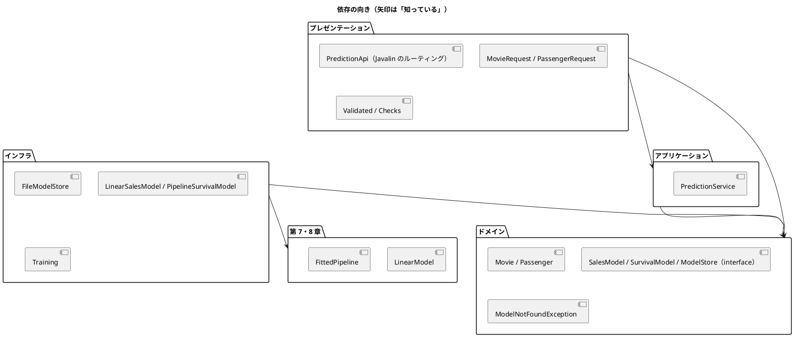

# 第 15 章: 機械学習 API とモジュール設計

## 15.1 はじめに

ここまでの章で、映画の興行収入を予測する線形回帰（第 7 章）と、乗客の生存を予測する前処理パイプライン（第 8 章）を作りました。どちらも学習と評価はできますが、使えるのは Java のコードを書ける人だけです。

最終章では、この 2 つのモデルを **HTTP API** として公開します。API にすれば、Web アプリケーションや別の言語のプログラムから、JSON を送るだけで予測を使えます。

API を作るときに問題になるのは、機械学習そのものより **周辺の設計** です。

- HTTP の処理とモデルの処理が 1 つのメソッドに混ざると、どちらかを変えるたびに全体を壊しやすい
- 学習済みモデルのファイルが無いと、テストが動かない
- 不正な入力やモデルの読み込み失敗を、利用者にどう伝えるか

この章では、[Javalin](https://javalin.io/) 7 と [Jackson](https://github.com/FasterXML/jackson) を使い、処理を **レイヤー（層）** に分けて、これらの問題を TDD で解いていきます。[Python 版の第 15 章](../python/15-machine-learning-api-and-module-design.md) と同じ流れで進めます。[Kotlin 版の第 15 章](../kotlin/15-machine-learning-api-and-module-design.md) と比べながら、Java 版では次の 3 点に注目してください。

- **失敗の表し方**: Kotlin 版は「モデルが無い」を `Result` で返しました。Java 版は **検査例外**（`ModelNotFoundException`）で表し、`throws` によって呼び出し側に失敗の可能性を見せます
- **入力の検証**: sealed interface の `Validated`（`Valid` と `Invalid` の record）と、`switch` のパターンマッチで結果を場合分けします
- **HTTP の層**: Ktor の拡張関数と `StatusPages` に対し、Javalin の `config.routes` と例外ハンドラーで組み立て、`JavalinTest` で統合テストします

## 15.2 レイヤードアーキテクチャ

### 4 つの層と依存の向き

API を次の 4 つの層に分けます。F# 版・Kotlin 版の第 15 章と同じ呼び方です。Java は 1 ファイルに 1 つの公開クラスを置くので、層はファイルではなくクラスの組で表します（パッケージはすべて `chapter15`）。

| 層 | クラス | 責務 | 知っているもの |
|----|-------|------|--------------|
| ドメイン | `Movie`・`Passenger`・`SalesPrediction`・`SurvivalPrediction`・`SalesModel`・`SurvivalModel`・`ModelStore`・`ModelNotFoundException` | 入力（映画・乗客）と予測結果の型、「モデル」と「モデルの置き場」の約束（`interface`）、モデルが無いことを表す例外 | 何も知らない |
| アプリケーション | `PredictionService` | 予測のユースケース（モデルを読み込んで予測する、ヘルスチェック） | ドメイン |
| インフラ | `FileModelStore`・`LinearSalesModel`・`PipelineSurvivalModel`・`Training` | モデルのファイルへの保存・読み込み、第 7・8 章のモデルをドメインの約束に合わせるアダプター、学習 | ドメイン、第 7・8 章 |
| プレゼンテーション | `PredictionApi`・`MovieRequest`・`PassengerRequest`・`Validated`・`Checks` | Javalin のエンドポイント、入力の検証、HTTP ステータスコード | ドメイン、アプリケーション |



ポイントは、**アプリケーション層がインフラ層を知らない** ことです。`PredictionService` は「モデルの置き場（`ModelStore`）から読み込んで予測する」ことしか知らず、それがファイルなのか、テスト用のスタブなのかを気にしません。

Kotlin 版と同じく、プレゼンテーション層の `PredictionApi.create` は、組み立て済みの `PredictionService` を引数で受け取ります。どの置き場を使うかを決めるのは、サーバーを起動する `Main`（15.7 節）です。このため、API の層もインフラ層を知りません。

### インサイドアウトで進める

TDD の進め方には、外側（API）から作る **アウトサイドイン** と、内側（ドメイン・サービス）から作る **インサイドアウト** があります。この章ではインサイドアウトを選びます。

- 予測の中身（第 7・8 章のモデル）はすでにテスト済みで、新しく決めるのは「それをどう包むか」だけ
- 内側の層は外側を知らないので、内側から作ると、各段階でスタブが最小限で済む
- API の形（URL・JSON）は、内側の型が決まってから要求の record に写すだけになる

## 15.3 TODO リストの作成

**TODO リスト**:

- [ ] 予測サービス（アプリケーション層）
  - [ ] 映画の特徴量から興行収入を予測する
  - [ ] 乗客の特徴量から生存・死亡を予測する
  - [ ] モデルが無ければ `ModelNotFoundException` を投げる
  - [ ] ヘルスチェックで各モデルを読み込めるかを返す
- [ ] モデルの保存と読み込み（インフラ層）
  - [ ] 保存した線形回帰モデルを読み込んで興行収入を予測する
  - [ ] 保存したパイプラインを読み込んで生存を判定する
  - [ ] モデルファイルが無ければ `ModelNotFoundException` を投げる（パスは見せない）
- [ ] HTTP API（プレゼンテーション層）
  - [ ] `POST /cinema/sales` で興行収入を返す
  - [ ] `POST /survived` で生存の予測を返す
  - [ ] `GET /health` でモデルの状態を返す
  - [ ] 不正な入力には 422 を返す
  - [ ] モデルが無ければ 503 を返す
- [ ] 実データで学習したモデルで API を動かす

## 15.4 予測サービスを作る

### スタブで置き場を差し替える

最初のテストは「映画の特徴量から興行収入を予測する」です。本物のモデルの代わりに、決まった値を返すだけの **スタブ** を使います。スタブなら学習データもモデルファイルも要らず、期待値も一目で分かります。

```java
// src/test/java/chapter15/PredictionServiceTest.java（抜粋）
  private static final Movie MOVIE = new Movie(100.0, 200.0, 300.0, 1);

  @Test
  @DisplayName("映画の特徴量から興行収入を予測する")
  void predictsSales() throws ModelNotFoundException {
    var service = new PredictionService(Stubs.store(movie -> 1234.5, passenger -> true));

    assertThat(service.predictSales(MOVIE)).isEqualTo(new SalesPrediction(1234.5));
  }
```

`movie -> 1234.5` はラムダ式です。`SalesModel` と `SurvivalModel` をメソッドが 1 つだけの interface（関数型インターフェース）にしたので、スタブのモデルはラムダ式 1 つで書けます。Kotlin 版では `StubSalesModel` のようにクラスを宣言しました。Java では `@FunctionalInterface` を付けた interface なら、クラスを作らずにラムダ式で実装を渡せます。

置き場のスタブは、メソッドが 2 つあるのでラムダ式にはできません。**匿名クラス** で `ModelStore` を実装し、テスト用の `Stubs` にまとめています。

```java
// src/test/java/chapter15/Stubs.java（抜粋）
  static ModelStore store(SalesModel sales, SurvivalModel survival) {
    return new ModelStore() {
      @Override
      public SalesModel loadSalesModel() {
        return sales;
      }

      @Override
      public SurvivalModel loadSurvivalModel() {
        return survival;
      }
    };
  }
```

### interface で「約束」だけを書く

ドメイン層に、入力と予測結果の型、そしてモデルとモデルの置き場の **約束** を書きます。入力と結果は record です。

```java
/** 映画の特徴量。SNS の評判 2 種類・主演の人気・原作の有無（0 か 1）。 */
public record Movie(double sns1, double sns2, double actor, int original) {}

/** 予測した興行収入。 */
public record SalesPrediction(double sales) {}

/** 映画の特徴量から興行収入を予測するモデルの約束。 */
@FunctionalInterface
public interface SalesModel {
  double predictSales(Movie movie);
}
```

record は `equals` を中身で判定するので、テストで `isEqualTo(new SalesPrediction(1234.5))` と比べられます。Kotlin の data class と同じです。

### 検査例外で「モデルが無い」を表す

モデルの読み込みは失敗しうる処理です。Kotlin 版は、置き場の約束が `Result<SalesModel>` を返すことにしました。Java 版は、**検査例外**（checked exception）を使います。

```java
/** 学習済みモデルの置き場の約束。読み込めなければ ModelNotFoundException を投げる。 */
public interface ModelStore {
  SalesModel loadSalesModel() throws ModelNotFoundException;

  SurvivalModel loadSurvivalModel() throws ModelNotFoundException;
}
```

`ModelNotFoundException` は `Exception` を継承しているので検査例外です（`RuntimeException` を継承すると非検査例外になります）。検査例外は、メソッドの宣言に `throws` で書かなければならず、呼び出す側は `catch` するか、自分の宣言にも `throws` を書くかをコンパイラに強制されます。

- **失敗の可能性が型に見える**: `loadSalesModel() throws ModelNotFoundException` という宣言そのものが、「モデルが無いことがある」という約束になります。Kotlin 版の `Result<SalesModel>` と同じく、呼び出す側が失敗を見落とせません
- **Java の標準の道具で書ける**: Java の標準ライブラリには `Result` に当たる型がありません。`Optional` は「値が無い」ことしか表せず、なぜ無いのか（どのモデルが無いのか）を運べません

サービスは、置き場の例外をそのまま `throws` で外に伝えます。

```java
  public SalesPrediction predictSales(Movie movie) throws ModelNotFoundException {
    return new SalesPrediction(store.loadSalesModel().predictSales(movie));
  }
```

Kotlin 版の `store.loadSalesModel().map { ... }` にあたる処理が、例外のおかげで「読み込んで予測する」という普通の式になります。失敗の経路はコードに現れず、宣言の `throws` にだけ現れます。

一方、スタブの `store` は `loadSalesModel()` の宣言から `throws` を外しています。実装側は約束より **少ない** 例外を宣言してよいので、例外を投げないスタブは `throws` を書かずに済みます。モデルが無い状態を表す `emptyStore` だけが `throws ModelNotFoundException` を宣言します（この章の最後の `Stubs.java`）。

### 生存予測・モデルが無い場合・ヘルスチェック

残りのサービスの振る舞いもテストに書きます。

```java
  @Test
  @DisplayName("モデルが無ければ ModelNotFoundException を投げる")
  void missingModel() {
    var service = new PredictionService(Stubs.emptyStore());

    assertThatThrownBy(() -> service.predictSales(MOVIE))
        .isInstanceOf(ModelNotFoundException.class)
        .hasMessage("学習済みモデル cinema が見つかりません");
  }

  @Test
  @DisplayName("モデルが無ければそれぞれ false を返す")
  void unhealthy() {
    assertThat(new PredictionService(Stubs.emptyStore()).health())
        .containsExactly(Map.entry("cinema", false), Map.entry("survived", false));
  }
```

- AssertJ の `assertThatThrownBy` は、ラムダ式が投げた例外を受け取り、型とメッセージを確かめます。検査例外を投げるラムダ式も渡せます
- `containsExactly` は、Map の項目を **並びも含めて** 比べます。ヘルスチェックの JSON で `cinema` が先に並ぶように、`health()` は項目の順を保つ `LinkedHashMap` で返します

乗客は、年齢と乗船港が分からないことがあります。Kotlin 版は `Double?`・`String?` の null 許容型にしました。Java 版のドメインでは、`OptionalDouble` と `Optional<String>` で「無いことがある」を型に出します。

```java
/** 乗客の特徴量。年齢と乗船港は分からないことがある。 */
public record Passenger(
    int pclass,
    String sex,
    OptionalDouble age,
    int sibSp,
    int parch,
    double fare,
    Optional<String> embarked) {}
```

Kotlin 版と同じく、生存モデルの約束は確率ではなく「生存するか」（`boolean`）です。第 8 章の決定木は葉に多数派のラベルだけを持つので、確率を返せないためです。

ヘルスチェックは、読み込みの例外を捕まえて真偽値にします。

```java
  /** モデルごとに、読み込めるかどうかを返す。 */
  public Map<String, Boolean> health() {
    Map<String, Boolean> models = new LinkedHashMap<>();
    models.put("cinema", canLoad(store::loadSalesModel));
    models.put("survived", canLoad(store::loadSurvivalModel));
    return models;
  }

  @FunctionalInterface
  private interface Loader {
    Object load() throws ModelNotFoundException;
  }

  private static boolean canLoad(Loader loader) {
    try {
      loader.load();
      return true;
    } catch (ModelNotFoundException e) {
      return false;
    }
  }
```

ここに検査例外の不便な面が出ています。`java.util.function.Supplier` の `get()` は検査例外を宣言していないので、`store::loadSalesModel` を `Supplier` として渡せません。そこで、`throws ModelNotFoundException` を宣言した関数型インターフェース `Loader` を自分で用意しました。Kotlin 版は `Result` の `isSuccess` を見るだけで済んだところです。

`ModelNotFoundException` のメッセージにはモデル名だけを入れ、ファイルのパスは入れません。Python 版で、実際にサーバーを動かしてから応答にパスが漏れていることに気づいた学び（Python 版の 15.6 節）を、Kotlin 版と同じく最初から取り入れています。

```text
PredictionServiceTest > モデルが無ければそれぞれ false を返す PASSED
PredictionServiceTest > 生存と判定されれば生存と予測する PASSED
PredictionServiceTest > 映画の特徴量から興行収入を予測する PASSED
PredictionServiceTest > モデルが無ければ ModelNotFoundException を投げる PASSED
PredictionServiceTest > 死亡と判定されれば死亡と予測する PASSED
PredictionServiceTest > モデルを読み込めればそれぞれ true を返す PASSED
```

## 15.5 モデルを保存して読み込む

### アダプターで第 7・8 章のモデルを約束に合わせる

インフラ層では、モデルをファイルに保存・読み込みします。第 7 章の `LinearModel` は `predict(Features)`、第 8 章の `FittedPipeline` は `predict(Table)` という形なので、ドメインの `predictSales(Movie)`・`survives(Passenger)` とは合いません。そこで、間を取り持つ **アダプター** を作ります。

テストでは、係数を手で決めた `LinearModel` と、架空の 8 人の乗客で学習したパイプラインを使います。どちらも学習データ無しで動きます。JUnit の `@TempDir` を付けたフィールドには、テストごとに空の一時ディレクトリが入ります。

```java
// src/test/java/chapter15/FileModelStoreTest.java（抜粋）
  @TempDir Path directory;

  @Test
  @DisplayName("保存した線形回帰モデルを読み込んで興行収入を予測する")
  void salesModel() throws Exception {
    var store = new FileModelStore(directory);
    store.saveSalesModel(
        new LinearModel(100.0, Map.of("SNS1", 1.0, "SNS2", 2.0, "actor", 0.5, "original", 10.0)));

    SalesModel model = store.loadSalesModel();

    assertThat(model.predictSales(new Movie(10.0, 20.0, 100.0, 1))).isCloseTo(210.0, within(1e-9));
  }

  @Test
  @DisplayName("モデルファイルが無ければ、パスを含まない ModelNotFoundException を投げる")
  void missingFiles() {
    var store = new FileModelStore(directory);

    assertThatThrownBy(store::loadSalesModel)
        .isInstanceOf(ModelNotFoundException.class)
        .hasMessageNotContaining(directory.toString());
    assertThatThrownBy(store::loadSurvivalModel)
        .isInstanceOfSatisfying(
            ModelNotFoundException.class, e -> assertThat(e.model()).isEqualTo("survived"));
  }
```

アダプターは、ドメインの値を第 7・8 章のモデルが受け取る形に詰め替えます。record で書けば、包むモデルを持つだけのクラスが 1 行の宣言で済みます。

```java
/** 第 7 章の線形回帰モデルを、ドメインの SalesModel の約束に合わせるアダプター。 */
public record LinearSalesModel(LinearModel model) implements SalesModel {
  @Override
  public double predictSales(Movie movie) {
    double[] values = {movie.sns1(), movie.sns2(), movie.actor(), movie.original()};
    return model.predict(new Features(Cinema.FEATURES, values));
  }
}
```

生存モデルのアダプターは、第 2 章の `Row`（セルの文字列）を 1 行だけ作ります。第 8 章のパイプラインは CSV と同じ文字列を受け取るので、分からない年齢・乗船港は空欄にします。空欄は、第 8 章のパイプラインが訓練データの値で補完します。

```java
    Row row =
        new Row(
            Map.of(
                "Pclass", String.valueOf(passenger.pclass()),
                "Sex", passenger.sex(),
                "Age",
                    passenger.age().isPresent()
                        ? String.valueOf(passenger.age().getAsDouble())
                        : "",
                "SibSp", String.valueOf(passenger.sibSp()),
                "Parch", String.valueOf(passenger.parch()),
                "Fare", String.valueOf(passenger.fare()),
                "Embarked", passenger.embarked().orElse("")));
    return pipeline.predict(new Table(SurvivedData.FEATURES, List.of(row))).getFirst() == 1;
```

列の並びは第 7・8 章の `Cinema.FEATURES`・`SurvivedData.FEATURES` に任せ、アダプターは列名と値の対応だけを書きます。Kotlin 版では両方が `FEATURES` という同じ名前だったので `import ... as` で別名を付けました。Java 版はクラス名で修飾するので、別名は要りません。

### 保存の形式

保存の形式は、モデルごとに変えています。

| モデル | ファイル | 形式 | 理由 |
|--------|---------|------|------|
| 第 7 章の `LinearModel` | `cinema.json` | Jackson の JSON | 切片と係数だけの record で、`Serializable` を実装していない。JSON なら中身を人が読める |
| 第 8 章の `FittedPipeline` | `survived.ser` | 第 8 章の `ModelFiles.save`・`load`（Java のシリアライズ） | 第 8 章が保存と、読み込めるクラスを絞った読み込みをすでに用意している |

Kotlin 版は、`@Serializable` を付けた保存専用の `LinearModelFile` をインフラ層に置きました。Java 版では、Jackson が record のコンポーネント（`intercept`・`coefficients`）をそのまま JSON の項目に対応させるので、第 7 章の `LinearModel` を変えずに、保存専用の型も作らずに済みます。Jackson は実行時にリフレクションで record の形を調べます。コンパイル時に変換処理を生成する kotlinx.serialization とは、変換できない型に気づく時期が違います。

### モデルの置き場

```java
  @Override
  public SalesModel loadSalesModel() throws ModelNotFoundException {
    requireFile(SALES_MODEL, salesModelFile());
    try {
      return new LinearSalesModel(MAPPER.readValue(salesModelFile().toFile(), LinearModel.class));
    } catch (IOException e) {
      throw new UncheckedIOException(e);
    }
  }

  private static void requireFile(String model, Path file) throws ModelNotFoundException {
    if (!Files.exists(file)) {
      throw new ModelNotFoundException(model);
    }
  }
```

- ファイルが無いことだけを `ModelNotFoundException`（検査例外）にし、ファイルが壊れていて読めない `IOException` は `UncheckedIOException`（非検査例外）に包んでいます。「モデルがまだ無い」は運用で起こりうる状態なので約束に含め、「ファイルが壊れている」は想定外の障害として約束に含めない、という区別です
- `FileModelStore` の `loadSalesModel` は `LinearSalesModel` を作りますが、戻り値の型は約束どおり `SalesModel` です

モデルはリクエストのたびにファイルから読み込みます。学習し直したモデルをサーバーの再起動なしで使える反面、リクエストごとにファイルを読む分だけ遅くなります。アクセスが多い API では、読み込んだモデルをキャッシュする設計を検討してください。

```text
FileModelStoreTest > モデルファイルが無ければ、パスを含まない ModelNotFoundException を投げる PASSED
FileModelStoreTest > 保存したパイプラインを読み込んで生存を判定する PASSED
FileModelStoreTest > 保存した線形回帰モデルを読み込んで興行収入を予測する PASSED
```

## 15.6 Javalin でエンドポイントを作る

### JavalinTest でサーバーをテストする

Java 版では、Web フレームワークに Javalin 7 を使います。ルーティングを設定のラムダ式の中で組み立てる、軽量なフレームワークです。JSON との変換には Jackson を使い、`JavalinJackson` で Javalin に渡します。

Javalin には、テスト用に `javalin-testtools` の `JavalinTest` があります。`JavalinTest.test(app, (server, client) -> ...)` は、アプリケーションを空いているポートで起動し、そのサーバーに要求を送る `client` を渡して、終わったら止めます。Ktor の `testApplication` はサーバーを起動しませんでしたが、`JavalinTest` は実際にポートを開きます。

```java
// src/test/java/chapter15/PredictionApiTest.java（抜粋）
  private static final ModelStore STUB = Stubs.store(movie -> 1200.0, passenger -> true);

  private static ObjectNode movieJson() {
    return MAPPER
        .createObjectNode()
        .put("sns1", 200.0)
        .put("sns2", 500.0)
        .put("actor", 3000.0)
        .put("original", 1);
  }

  @Nested
  class CinemaSales {
    @Test
    @DisplayName("映画の特徴量を送ると予測した興行収入を返す")
    void predicts() {
      JavalinTest.test(
          PredictionApi.create(new PredictionService(STUB)),
          (server, client) -> {
            Response response = client.post("/cinema/sales", movieJson().toString());

            assertThat(response.code()).isEqualTo(200);
            assertThat(json(response)).isEqualTo(json(Map.of("sales", 1200.0)));
          });
    }
```

- 送る JSON は Jackson の `ObjectNode` で組み立て、返ってきた本文は `JsonNode` に読んで比べます。API の約束は JSON の形なので、Java のクラスではなく JSON どうしで比べています
- `@Nested` の内部クラスで、エンドポイントごとにテストをまとめています。テストの表示が `PredictionApiTest > CinemaSales > …` のように階層になります

API は、`Javalin.create` の設定のラムダ式の中でルーティングを組み立てます。

```java
  public static Javalin create(PredictionService service) {
    return Javalin.create(
        config -> {
          config.jsonMapper(new JavalinJackson(new ObjectMapper(), false));
          ...
          config.routes.get("/health", ctx -> health(ctx, service));
          config.routes.post("/cinema/sales", ctx -> predictSales(ctx, service));
          config.routes.post("/survived", ctx -> predictSurvival(ctx, service));
        });
  }
```

- Javalin 7 では、ルーティングも例外ハンドラーも `config.routes` に登録します（Javalin 6 までは `app.get(...)` のように作ったあとで登録していました）
- `create` は `start` を呼びません。ポートを開くのは、テストでは `JavalinTest`、本番では `Main` です。Kotlin 版の `predictionModule` 拡張関数と同じく、同じ組み立てを本番とテストで使います
- HTTP の形（`MovieRequest`）とドメインの型（`Movie`）を分けているのは、JSON の形とドメインの型を別々に変えられるようにするためです

### 要求の record はボックス化した型で受ける

要求の JSON は `ctx.bodyAsClass(MovieRequest.class)` で record に変換します。

```java
public record MovieRequest(Double sns1, Double sns2, Double actor, Integer original) {
```

コンポーネントを `double`・`int` ではなく **ボックス化した型**（`Double`・`Integer`）にしています。Jackson は JSON に無い項目を、プリミティブ型なら `0`、参照型なら `null` にします。`double` で受けると、`sns2` を送り忘れた要求と `sns2` に 0 を送った要求を区別できません。ボックス化した型なら「無い」が `null` として残るので、検証で必須かどうかを確かめられます。

Kotlin 版は、`val sns2: Double` のように null を許さない型にしておけば、kotlinx.serialization が項目の欠落を変換の時点で弾きました。Java にはコンパイラが検査する null 許容型が無いので、必須の検査も自分で書きます。

### 入力の検証とエラー応答をテストに書く

不正な入力とモデルが無い場合のテストを追加します。不正な値の一覧は、JUnit のパラメーター化テストで並べます。

```java
    @ParameterizedTest(name = "{0}={1}")
    @CsvSource(
        delimiter = '|',
        value = {"sns1|-1.0", "actor|\"多い\"", "original|2", "sns2|null"})
    @DisplayName("特徴量が不正なら 422 を返す")
    void rejectsInvalid(String field, String value) throws Exception {
      ObjectNode body = movieJson();
      body.set(field, MAPPER.readTree(value));
      JavalinTest.test(
          PredictionApi.create(new PredictionService(STUB)),
          (server, client) ->
              assertThat(client.post("/cinema/sales", body.toString()).code()).isEqualTo(422));
    }

    @Test
    @DisplayName("モデルが無ければ 503 を返す")
    void missingModel() {
      JavalinTest.test(
          PredictionApi.create(new PredictionService(Stubs.emptyStore())),
          (server, client) -> {
            Response response = client.post("/cinema/sales", movieJson().toString());

            assertThat(response.code()).isEqualTo(503);
            assertThat(json(response)).isEqualTo(json(Map.of("detail", "学習済みモデル cinema が見つかりません")));
          });
    }
```

- 値は JSON の断片として書き、`MAPPER.readTree(value)` で `JsonNode` にしてから差し替えます。`"多い"` は文字列、`null` は JSON の null になります。Kotlin 版は `for` で回しましたが、Java 版はパラメーター化テストにしたので、どの値で失敗したかがテストの表示名に出ます
- `sns2|null` は、必須の項目が null のときの検査です。Kotlin 版には無い、Java 版で足したケースです

乗客の API（`/survived`）とヘルスチェック（`/health`）のテストも同じ形で書きました（この章の `PredictionApiTest.java`）。

### sealed interface で検証の結果を表す

検証の結果を、「正しい値」か「不正な理由の一覧」のどちらかを表す sealed interface にします。

```java
/** 入力の検証結果。正しければ値を、不正なら理由の一覧を持つ。 */
public sealed interface Validated<T> {
  /** 正しい入力から作った値。 */
  record Valid<T>(T value) implements Validated<T> {}

  /** 不正な入力の理由の一覧。 */
  record Invalid<T>(List<String> errors) implements Validated<T> {
    public Invalid {
      errors = List.copyOf(errors);
    }
  }

  /** 理由（null は問題なし）が 1 つも無ければ値を作り、あれば理由の一覧を返す。 */
  static <T> Validated<T> of(List<String> reasons, Supplier<T> value) {
    List<String> errors = reasons.stream().filter(Objects::nonNull).toList();
    return errors.isEmpty() ? new Valid<>(value.get()) : new Invalid<>(errors);
  }
}
```

- `sealed interface` の中に置いた record は、`permits` を書かなくても許可された実装として扱われます。`Validated` の実装は `Valid` と `Invalid` の 2 つだけだとコンパイラが知っているので、`switch` で場合分けしても `default` が要りません
- Kotlin 版は `Validated<out T>` の共変と `Nothing` を使い、`Invalid` を型引数の無い 1 つの型にしました。Java には宣言側の共変も `Nothing` も無いので、`Invalid<T>` にも型引数を持たせます
- `Invalid` のコンパクトコンストラクタで `List.copyOf` を呼び、渡されたリストを後から変えられても中身が変わらないようにしています
- 値を作る処理は `Supplier<T>` で受け取り、理由が 1 つも無いときだけ呼びます。必須の項目が null のまま `new Movie(...)` を呼ぶと、ボックス化した `Double` を `double` に戻すところで `NullPointerException` になるからです

1 つ 1 つの検査は、「問題が無ければ null、あれば理由」を返す `Checks` のメソッドにしました。

```java
  static String required(String field, Object value) {
    return value == null ? field + " は必須です" : null;
  }

  static String notNegative(String field, Number value) {
    return value != null && value.doubleValue() < 0 ? field + " は 0 以上にしてください" : null;
  }
```

`notNegative` と `oneOf` は、値が null なら問題なしにします。必須かどうかは `required` だけが受け持つので、1 つの項目の欠落が複数の理由として重複して返ることはありません。

`MovieRequest`・`PassengerRequest` に、ドメインの型へ変換する `validate` を持たせます。

```java
  /** 検証して、正しければ映画の特徴量にする。 */
  public Validated<Movie> validate() {
    return Validated.of(
        Arrays.asList(
            Checks.required("sns1", sns1),
            Checks.required("sns2", sns2),
            Checks.required("actor", actor),
            Checks.required("original", original),
            Checks.notNegative("sns1", sns1),
            Checks.notNegative("sns2", sns2),
            Checks.notNegative("actor", actor),
            Checks.oneOf("original", original, ORIGINAL_VALUES)),
        () -> new Movie(sns1, sns2, actor, original));
  }
```

- 理由の一覧は `List.of` ではなく `Arrays.asList` で作っています。`List.of` は null の要素を受け付けず `NullPointerException` を投げるので、「問題なし」を null で表す検査の結果を並べられません
- `PassengerRequest` は、JSON の `sib_sp` と Java の `sibSp` を `@JsonProperty("sib_sp")` で対応させています（Kotlin 版の `@SerialName`）。年齢と乗船港は `required` で検査しないので省略でき、ドメインの `OptionalDouble`・`Optional` に詰め替えます

エンドポイントでは、`switch` のパターンマッチで検証の結果を場合分けします。

```java
  private static void predictSales(Context ctx, PredictionService service)
      throws ModelNotFoundException {
    switch (ctx.bodyAsClass(MovieRequest.class).validate()) {
      case Validated.Invalid<Movie> invalid -> rejected(ctx, invalid.errors());
      case Validated.Valid<Movie> valid ->
          ctx.json(new SalesResponse(service.predictSales(valid.value()).sales()));
    }
  }
```

`case Validated.Valid<Movie> valid ->` は、値が `Valid` なら変数 `valid` に入れてから右辺を実行します。Kotlin 版の `when` と `is` による場合分けと同じ形です。

`predictSales` は `throws ModelNotFoundException` を宣言しています。Javalin のハンドラー（`Handler`）の `handle` は `throws Exception` を宣言しているので、ハンドラーの中から検査例外をそのまま投げられます。投げた例外は、次の例外ハンドラーが受け取ります。

### 例外を HTTP のステータスコードに変換する

残るのは、検証より前に起きる失敗と、モデルが無い場合です。Javalin では、`config.routes.exception` で例外の種類ごとに応答を決めます（Ktor の `StatusPages` にあたります）。

最初は、JSON として読めない本文に対して Javalin が投げる例外を、Javalin の `BadRequestResponse` だと考えて、次のように書きました。

```java
          config.routes.exception(
              BadRequestResponse.class,
              (e, ctx) ->
                  ctx.status(HttpStatus.UNPROCESSABLE_CONTENT)
                      .json(new ValidationErrorResponse(List.of(INVALID_JSON))));
```

テストを実行すると、型の合わない値と壊れた JSON の 2 件が 422 ではなく 500 になりました。

```text
PredictionApiTest > Survived > JSON として読めなければ 422 と、内部の型名を含まない理由を返す FAILED
    org.opentest4j.AssertionFailedError: 
    expected: 422
     but was: 500

PredictionApiTest > CinemaSales > 特徴量が不正なら 422 を返す > "actor"="\"多い\"" FAILED
    org.opentest4j.AssertionFailedError: 
    expected: 422
     but was: 500

16 tests completed, 2 failed
```

500 になったときに投げられていた例外の型を調べると、壊れた JSON（`{`）では `com.fasterxml.jackson.core.io.JsonEOFException`（`JsonParseException` の子）、`actor` に `"多い"` を送ったときは `com.fasterxml.jackson.databind.exc.InvalidFormatException`（`MismatchedInputException` の子）でした。Javalin の `bodyAsClass` は、JSON を読めないときに `BadRequestResponse` に包まず、**Jackson の例外をそのまま投げます**。どちらの例外も Jackson の `JacksonException` の子なので、`JacksonException` に対して 422 を返すように直しました。

```java
          // JSON として読めない・型が合わない入力（bodyAsClass が Jackson の例外を投げる）。例外のメッセージには内部の型名が含まれるので、応答には出さない
          config.routes.exception(
              JacksonException.class,
              (e, ctx) ->
                  ctx.status(HttpStatus.UNPROCESSABLE_CONTENT)
                      .json(new ValidationErrorResponse(List.of(INVALID_JSON))));
          // ドメインの例外を HTTP のステータスコードに変える
          config.routes.exception(
              ModelNotFoundException.class,
              (e, ctx) ->
                  ctx.status(HttpStatus.SERVICE_UNAVAILABLE)
                      .json(new ErrorResponse(e.getMessage())));
```

- 422 にそろえたのは、Kotlin 版と同じく、値の範囲の誤りと同じ「受け付けられない入力」として扱うためです。応答には固定のメッセージだけを返し、Jackson の例外のメッセージ（内部のクラス名を含む）は出しません
- `ModelNotFoundException` はドメインの例外で、HTTP を知りません。HTTP のステータスコード **503 Service Unavailable**（一時的に提供できない）に変換するのはプレゼンテーション層の仕事です。Kotlin 版はサービスが `Result` で返した失敗を `getOrThrow()` で例外に戻してから `StatusPages` に任せました。Java 版は最初から例外なので、サービスからハンドラーまで `throws` で伝わり、そのまま例外ハンドラーに届きます
- Javalin 7 では 422 の定数名が `HttpStatus.UNPROCESSABLE_CONTENT` です（HTTP の仕様の最新の名前に合わせたもの）

```text
PredictionApiTest > Survived > 年齢と乗船港は省略できる PASSED
PredictionApiTest > Survived > JSON として読めなければ 422 と、内部の型名を含まない理由を返す PASSED
PredictionApiTest > Survived > 乗客の特徴量を送ると生存の予測を返す PASSED
PredictionApiTest > Survived > モデルが無ければ 503 を返す PASSED
PredictionApiTest > Survived > 特徴量が不正なら 422 を返す > "pclass"="4" PASSED
PredictionApiTest > Survived > 特徴量が不正なら 422 を返す > "sex"="\"unknown\"" PASSED
PredictionApiTest > Survived > 特徴量が不正なら 422 を返す > "embarked"="\"X\"" PASSED
PredictionApiTest > Survived > 特徴量が不正なら 422 を返す > "fare"="-5.0" PASSED
PredictionApiTest > Health > すべてのモデルを読み込めれば ok を返す PASSED
PredictionApiTest > Health > 読み込めないモデルがあれば degraded を返す PASSED
PredictionApiTest > CinemaSales > 映画の特徴量を送ると予測した興行収入を返す PASSED
PredictionApiTest > CinemaSales > モデルが無ければ 503 を返す PASSED
PredictionApiTest > CinemaSales > 特徴量が不正なら 422 を返す > "sns1"="-1.0" PASSED
PredictionApiTest > CinemaSales > 特徴量が不正なら 422 を返す > "actor"="\"多い\"" PASSED
PredictionApiTest > CinemaSales > 特徴量が不正なら 422 を返す > "original"="2" PASSED
PredictionApiTest > CinemaSales > 特徴量が不正なら 422 を返す > "sns2"="null" PASSED
```

## 15.7 実データで学習したモデルで動かす

### 学習と保存

第 7・8 章と同じ条件（テストデータの割合 0.2、シード 0、決定木の深さ 5、`ClassWeight.BALANCED`）でモデルを学習し、保存する `Training.trainAndSaveModels` を作ります（この章の最後に載せています）。

### 統合テスト

ここまでのテストは、層ごとにスタブを使って切り離していました。**統合テスト** では、実データで学習したモデルをインフラ層で読み込み、本物をつないで確かめます。

```java
// src/test/java/chapter15/TrainedModelsTest.java（抜粋）
  @TempDir Path modelDir;

  @BeforeEach
  void requireData() {
    Path data = DataDir.dataDir();
    assumeTrue(
        Files.exists(data.resolve("cinema.csv")) && Files.exists(data.resolve("Survived.csv")),
        "学習データ cinema.csv・Survived.csv が配置されていない（gulp data:setup）");
  }

  private FileModelStore trainedStore() throws Exception {
    var store = new FileModelStore(modelDir);
    Training.trainAndSaveModels(DataDir.dataDir(), store);
    return store;
  }

  @Test
  @DisplayName("学習したパイプラインで 1 等客室の女性は生存と予測する")
  void firstClassWoman() throws Exception {
    var passenger =
        new Passenger(1, "female", OptionalDouble.of(30.0), 0, 0, 80.0, Optional.of("C"));

    assertThat(trainedStore().loadSurvivalModel().survives(passenger)).isTrue();
  }
```

- データが無い環境では、`@BeforeEach` の `assumeTrue` でテストがスキップされ、学習も行われません
- Kotlin 版は `by lazy` で 1 回だけ学習してテストの間で使い回しました。Java 版はテストごとに `@TempDir` の一時ディレクトリへ学習し直します。学習は数秒で終わるので、テストの独立性を優先しています
- 興行収入のテストは、Kotlin 版のように実測値を固定せず、「正の値になる」ことだけを確かめています。値そのものは、次の `curl` の結果で確かめます

### 学習してサーバーを起動する

`Main` は、学習済みモデルを `apps/java/model/` に保存してから、サーバーを起動します。このディレクトリは `.gitignore` の対象です。

```java
  /** 自分のマシンからだけ接続できるループバックのアドレス（127.0.0.1） */
  private static final String HOST = InetAddress.getLoopbackAddress().getHostAddress();

  public static Javalin startServer(Path modelDir, int port) {
    return PredictionApi.create(new PredictionService(new FileModelStore(modelDir)))
        .start(HOST, port);
  }
```

- 待ち受けるアドレスは、最初は `"127.0.0.1"` と文字列で書きました。すると PMD の `AvoidUsingHardCodedIP`（IP アドレスをコードに直接書かない）の指摘を受けたので、`InetAddress.getLoopbackAddress()` からループバックのアドレスを求める形にしました。値は同じ `127.0.0.1` ですが、「自分のマシンからだけ接続できるアドレス」という意図が名前に出ます
- ここで初めて、ファイルの置き場（`FileModelStore`）とサービスを組み立てます。Javalin の `start` はサーバーを別のスレッドで動かしてすぐに戻るので、Kotlin 版の `wait = true` にあたる引数はありません
- 表示のテストは、サーバーを起動しない `trainAndReport` だけを対象にしています

```bash
./gradlew runChapter -Pchapter=15
```

```text
> Task :runChapter
学習済みモデルを保存しました: cinema.json, survived.ser
API を起動します: http://127.0.0.1:8015
```

別のターミナルから `curl` でリクエストを送ります。

```bash
curl -s http://127.0.0.1:8015/health
```

```text
{"status":"ok","models":{"cinema":true,"survived":true}}
```

```bash
curl -s -X POST http://127.0.0.1:8015/cinema/sales -H "Content-Type: application/json" -d '{"sns1": 200, "sns2": 500, "actor": 3000, "original": 1}'
```

```text
{"sales":7730.457421687023}
```

Kotlin 版の 7830.419903529487、Python 版の 7895.31 と値が違うのは、訓練データに入った行が違うためです。第 2 章の `Preprocessing.splitTrainTest` は `java.util.Random(seed)` で行を並べ替えるので、同じシード 0 でも乱数列が言語ごとに異なります。

```bash
curl -s -X POST http://127.0.0.1:8015/survived -H "Content-Type: application/json" -d '{"pclass": 1, "sex": "female", "sib_sp": 0, "parch": 0, "fare": 50.0}'
```

```text
{"survived":true}
```

```bash
curl -s -X POST http://127.0.0.1:8015/survived -H "Content-Type: application/json" -d '{"pclass": 3, "sex": "male", "sib_sp": 0, "parch": 0, "fare": 8.0, "embarked": "S"}'
```

```text
{"survived":false}
```

`pclass` に 4 を送ると、検証で見つかった理由を返します。

```bash
curl -s -w "\nHTTP %{http_code}\n" -X POST http://127.0.0.1:8015/survived -H "Content-Type: application/json" -d '{"pclass": 4, "sex": "male", "sib_sp": 0, "parch": 0, "fare": 8.0}'
```

```text
{"detail":["pclass は 1、2、3 のどれかにしてください"]}
HTTP 422
```

`pclass` を省き、`fare` を負にすると、2 つの理由をまとめて返します。

```bash
curl -s -w "\nHTTP %{http_code}\n" -X POST http://127.0.0.1:8015/survived -H "Content-Type: application/json" -d '{"sex": "male", "sib_sp": 0, "parch": 0, "fare": -8.0}'
```

```text
{"detail":["pclass は必須です","fare は 0 以上にしてください"]}
HTTP 422
```

`actor` に文字列を送ったときと、JSON が途中で切れているときは、内部のクラス名を含まない固定のメッセージを返します。

```bash
curl -s -w "\nHTTP %{http_code}\n" -X POST http://127.0.0.1:8015/cinema/sales -H "Content-Type: application/json" -d '{"sns1": 200, "sns2": 500, "actor": "多い", "original": 1}'
curl -s -w "\nHTTP %{http_code}\n" -X POST http://127.0.0.1:8015/survived -H "Content-Type: application/json" -d '{'
```

```text
{"detail":["JSON の形式または値の型が正しくありません"]}
HTTP 422
{"detail":["JSON の形式または値の型が正しくありません"]}
HTTP 422
```

`model/cinema.json` を一時的に別名にしてから送ると、ヘルスチェックは `degraded` になり、興行収入の予測は 503 を返します。応答に内部のパスは含まれません。

```text
{"status":"degraded","models":{"cinema":false,"survived":true}}
HTTP 200
```

```text
{"detail":"学習済みモデル cinema が見つかりません"}
HTTP 503
```

確認が終わったら、サーバーを起動したターミナルで Ctrl+C を押して停止します。筆者の環境では確認のあとにサーバーのプロセスを外から止めたので、`runChapter` タスクは `exit value 143`（SIGTERM で止められた）の失敗として終わりました。

### テストの実行結果

```bash
./gradlew test --tests "chapter15.*"
```

第 15 章のテストは 30 件すべて通ります（パラメーター化テストは値ごとに 1 件と数えます）。

```text
TrainedModelsTest > 学習した線形回帰モデルで興行収入を予測する PASSED
TrainedModelsTest > 学習したパイプラインで 1 等客室の女性は生存と予測する PASSED
TrainedModelsTest > 学習したパイプラインで 3 等客室の男性は死亡と予測する PASSED
TrainedModelsTest > 学習したモデルを保存するとヘルスチェックが ok になる PASSED
TrainedModelsTest > 学習するとモデルを保存して起動する URL を表示する PASSED
```

データが無い環境では、`TrainedModelsTest` の 5 件がスキップされます。スタブと架空のデータを使った 25 件は、学習データが無くても動きます。

```text
TrainedModelsTest > 学習した線形回帰モデルで興行収入を予測する SKIPPED
TrainedModelsTest > 学習したパイプラインで 1 等客室の女性は生存と予測する SKIPPED
TrainedModelsTest > 学習したパイプラインで 3 等客室の男性は死亡と予測する SKIPPED
TrainedModelsTest > 学習したモデルを保存するとヘルスチェックが ok になる SKIPPED
TrainedModelsTest > 学習するとモデルを保存して起動する URL を表示する SKIPPED
BUILD SUCCESSFUL in 8s
```

<details>
<summary>この章の完成コード（ドメイン: src/main/java/chapter15/Movie.java）</summary>

```java
package chapter15;

/** 映画の特徴量。SNS の評判 2 種類・主演の人気・原作の有無（0 か 1）。 */
public record Movie(double sns1, double sns2, double actor, int original) {}
```

</details>

<details>
<summary>この章の完成コード（ドメイン: src/main/java/chapter15/Passenger.java）</summary>

```java
package chapter15;

import java.util.Optional;
import java.util.OptionalDouble;

/** 乗客の特徴量。年齢と乗船港は分からないことがある。 */
public record Passenger(
    int pclass,
    String sex,
    OptionalDouble age,
    int sibSp,
    int parch,
    double fare,
    Optional<String> embarked) {}
```

</details>

<details>
<summary>この章の完成コード（ドメイン: src/main/java/chapter15/SalesPrediction.java）</summary>

```java
package chapter15;

/** 予測した興行収入。 */
public record SalesPrediction(double sales) {}
```

</details>

<details>
<summary>この章の完成コード（ドメイン: src/main/java/chapter15/SurvivalPrediction.java）</summary>

```java
package chapter15;

/** 生存するかどうかの予測。 */
public record SurvivalPrediction(boolean survived) {}
```

</details>

<details>
<summary>この章の完成コード（ドメイン: src/main/java/chapter15/SalesModel.java）</summary>

```java
package chapter15;

/** 映画の特徴量から興行収入を予測するモデルの約束。 */
@FunctionalInterface
public interface SalesModel {
  double predictSales(Movie movie);
}
```

</details>

<details>
<summary>この章の完成コード（ドメイン: src/main/java/chapter15/SurvivalModel.java）</summary>

```java
package chapter15;

/** 乗客が生存するかを判定するモデルの約束。 */
@FunctionalInterface
public interface SurvivalModel {
  boolean survives(Passenger passenger);
}
```

</details>

<details>
<summary>この章の完成コード（ドメイン: src/main/java/chapter15/ModelStore.java）</summary>

```java
package chapter15;

/** 学習済みモデルの置き場の約束。読み込めなければ ModelNotFoundException を投げる。 */
public interface ModelStore {
  SalesModel loadSalesModel() throws ModelNotFoundException;

  SurvivalModel loadSurvivalModel() throws ModelNotFoundException;
}
```

</details>

<details>
<summary>この章の完成コード（ドメイン: src/main/java/chapter15/ModelNotFoundException.java）</summary>

```java
package chapter15;

/** 学習済みモデルが見つからないことを表す。メッセージにはファイルのパスを含めない。 */
public final class ModelNotFoundException extends Exception {
  private static final long serialVersionUID = 1L;

  private final String model;

  public ModelNotFoundException(String model) {
    super("学習済みモデル " + model + " が見つかりません");
    this.model = model;
  }

  /** 見つからなかったモデルの名前。 */
  public String model() {
    return model;
  }
}
```

</details>

<details>
<summary>この章の完成コード（アプリケーション: src/main/java/chapter15/PredictionService.java）</summary>

```java
package chapter15;

import java.util.LinkedHashMap;
import java.util.Map;

/** 学習済みモデルを置き場から読み込んで予測する。HTTP には依存しない。 */
public final class PredictionService {
  private final ModelStore store;

  public PredictionService(ModelStore store) {
    this.store = store;
  }

  public SalesPrediction predictSales(Movie movie) throws ModelNotFoundException {
    return new SalesPrediction(store.loadSalesModel().predictSales(movie));
  }

  public SurvivalPrediction predictSurvival(Passenger passenger) throws ModelNotFoundException {
    return new SurvivalPrediction(store.loadSurvivalModel().survives(passenger));
  }

  /** モデルごとに、読み込めるかどうかを返す。 */
  public Map<String, Boolean> health() {
    Map<String, Boolean> models = new LinkedHashMap<>();
    models.put("cinema", canLoad(store::loadSalesModel));
    models.put("survived", canLoad(store::loadSurvivalModel));
    return models;
  }

  @FunctionalInterface
  private interface Loader {
    Object load() throws ModelNotFoundException;
  }

  private static boolean canLoad(Loader loader) {
    try {
      loader.load();
      return true;
    } catch (ModelNotFoundException e) {
      return false;
    }
  }
}
```

</details>

<details>
<summary>この章の完成コード（インフラ: src/main/java/chapter15/FileModelStore.java）</summary>

```java
package chapter15;

import chapter07.LinearModel;
import chapter08.FittedPipeline;
import chapter08.ModelFiles;
import com.fasterxml.jackson.databind.ObjectMapper;
import java.io.IOException;
import java.io.UncheckedIOException;
import java.nio.file.Files;
import java.nio.file.Path;

/** 学習済みモデルをディレクトリのファイルに保存し、読み込む。 */
public final class FileModelStore implements ModelStore {
  public static final String SALES_MODEL = "cinema";
  public static final String SURVIVAL_MODEL = "survived";

  private static final ObjectMapper MAPPER = new ObjectMapper();

  private final Path modelDir;

  public FileModelStore(Path modelDir) {
    this.modelDir = modelDir;
  }

  /** 線形回帰モデルを JSON で保存する。 */
  public void saveSalesModel(LinearModel model) throws IOException {
    Files.createDirectories(modelDir);
    MAPPER.writeValue(salesModelFile().toFile(), model);
  }

  /** 学習済みパイプラインを Java のシリアライズで保存する（第 8 章の ModelFiles）。 */
  public void saveSurvivalModel(FittedPipeline pipeline) throws IOException {
    Files.createDirectories(modelDir);
    ModelFiles.save(pipeline, survivalModelFile());
  }

  @Override
  public SalesModel loadSalesModel() throws ModelNotFoundException {
    requireFile(SALES_MODEL, salesModelFile());
    try {
      return new LinearSalesModel(MAPPER.readValue(salesModelFile().toFile(), LinearModel.class));
    } catch (IOException e) {
      throw new UncheckedIOException(e);
    }
  }

  @Override
  public SurvivalModel loadSurvivalModel() throws ModelNotFoundException {
    requireFile(SURVIVAL_MODEL, survivalModelFile());
    try {
      return new PipelineSurvivalModel(ModelFiles.load(survivalModelFile()));
    } catch (IOException e) {
      throw new UncheckedIOException(e);
    } catch (ClassNotFoundException e) {
      throw new IllegalStateException("モデル " + SURVIVAL_MODEL + " を読み込めません", e);
    }
  }

  private static void requireFile(String model, Path file) throws ModelNotFoundException {
    if (!Files.exists(file)) {
      throw new ModelNotFoundException(model);
    }
  }

  private Path salesModelFile() {
    return modelDir.resolve(SALES_MODEL + ".json");
  }

  private Path survivalModelFile() {
    return modelDir.resolve(SURVIVAL_MODEL + ".ser");
  }
}
```

</details>

<details>
<summary>この章の完成コード（インフラ: src/main/java/chapter15/LinearSalesModel.java）</summary>

```java
package chapter15;

import chapter02.Features;
import chapter07.Cinema;
import chapter07.LinearModel;

/** 第 7 章の線形回帰モデルを、ドメインの SalesModel の約束に合わせるアダプター。 */
public record LinearSalesModel(LinearModel model) implements SalesModel {
  @Override
  public double predictSales(Movie movie) {
    double[] values = {movie.sns1(), movie.sns2(), movie.actor(), movie.original()};
    return model.predict(new Features(Cinema.FEATURES, values));
  }
}
```

</details>

<details>
<summary>この章の完成コード（インフラ: src/main/java/chapter15/PipelineSurvivalModel.java）</summary>

```java
package chapter15;

import chapter02.Row;
import chapter02.Table;
import chapter08.FittedPipeline;
import chapter08.SurvivedData;
import java.util.List;
import java.util.Map;

/** 第 8 章の学習済みパイプラインを、ドメインの SurvivalModel の約束に合わせるアダプター。 */
public record PipelineSurvivalModel(FittedPipeline pipeline) implements SurvivalModel {
  @Override
  public boolean survives(Passenger passenger) {
    // パイプラインは CSV と同じセルの文字列を受け取る。分からない値は空欄にする
    Row row =
        new Row(
            Map.of(
                "Pclass", String.valueOf(passenger.pclass()),
                "Sex", passenger.sex(),
                "Age",
                    passenger.age().isPresent()
                        ? String.valueOf(passenger.age().getAsDouble())
                        : "",
                "SibSp", String.valueOf(passenger.sibSp()),
                "Parch", String.valueOf(passenger.parch()),
                "Fare", String.valueOf(passenger.fare()),
                "Embarked", passenger.embarked().orElse("")));
    return pipeline.predict(new Table(SurvivedData.FEATURES, List.of(row))).getFirst() == 1;
  }
}
```

</details>

<details>
<summary>この章の完成コード（インフラ: src/main/java/chapter15/Training.java）</summary>

```java
package chapter15;

import chapter02.Preprocessing;
import chapter02.Row;
import chapter02.Table;
import chapter02.TrainTestSplit;
import chapter07.Cinema;
import chapter07.LinearRegression;
import chapter08.ClassWeight;
import chapter08.Pipeline;
import chapter08.SurvivedData;
import java.io.IOException;
import java.nio.file.Path;
import java.util.List;

/** 第 7・8 章と同じ条件でモデルを学習し、置き場に保存する。 */
public final class Training {
  private static final double TEST_SIZE = 0.2;
  private static final long SEED = 0;
  private static final int MAX_DEPTH = 5;

  private Training() {}

  public static void trainAndSaveModels(Path dataDir, FileModelStore store) throws IOException {
    var cinema = Cinema.prepare(dataDir.resolve("cinema.csv"), TEST_SIZE, SEED);
    store.saveSalesModel(LinearRegression.fit(cinema.xTrain(), cinema.tTrain()));

    List<Row> rows = Table.load(dataDir.resolve("Survived.csv")).rows();
    TrainTestSplit<Row, Integer> survived =
        Preprocessing.splitTrainTest(rows, SurvivedData.target(rows), TEST_SIZE, SEED);
    store.saveSurvivalModel(
        Pipeline.build(MAX_DEPTH, ClassWeight.BALANCED)
            .fit(SurvivedData.features(survived.xTrain()), survived.tTrain()));
  }
}
```

</details>

<details>
<summary>この章の完成コード（プレゼンテーション: src/main/java/chapter15/PredictionApi.java）</summary>

```java
package chapter15;

import com.fasterxml.jackson.core.JacksonException;
import com.fasterxml.jackson.databind.ObjectMapper;
import io.javalin.Javalin;
import io.javalin.http.Context;
import io.javalin.http.HttpStatus;
import io.javalin.json.JavalinJackson;
import java.util.List;
import java.util.Map;

/** 予測 API。HTTP の要求を検証してサービスに渡し、ドメインの例外を HTTP のステータスコードに変える。 */
public final class PredictionApi {
  private static final String INVALID_JSON = "JSON の形式または値の型が正しくありません";

  private PredictionApi() {}

  /** 応答の本文 */
  record SalesResponse(double sales) {}

  record SurvivalResponse(boolean survived) {}

  record HealthResponse(String status, Map<String, Boolean> models) {}

  record ErrorResponse(String detail) {}

  record ValidationErrorResponse(List<String> detail) {}

  /** サービスを使う API を作る。start はしない。 */
  public static Javalin create(PredictionService service) {
    return Javalin.create(
        config -> {
          config.jsonMapper(new JavalinJackson(new ObjectMapper(), false));
          // JSON として読めない・型が合わない入力（bodyAsClass が Jackson の例外を投げる）。例外のメッセージには内部の型名が含まれるので、応答には出さない
          config.routes.exception(
              JacksonException.class,
              (e, ctx) ->
                  ctx.status(HttpStatus.UNPROCESSABLE_CONTENT)
                      .json(new ValidationErrorResponse(List.of(INVALID_JSON))));
          // ドメインの例外を HTTP のステータスコードに変える
          config.routes.exception(
              ModelNotFoundException.class,
              (e, ctx) ->
                  ctx.status(HttpStatus.SERVICE_UNAVAILABLE)
                      .json(new ErrorResponse(e.getMessage())));
          config.routes.get("/health", ctx -> health(ctx, service));
          config.routes.post("/cinema/sales", ctx -> predictSales(ctx, service));
          config.routes.post("/survived", ctx -> predictSurvival(ctx, service));
        });
  }

  private static void health(Context ctx, PredictionService service) {
    Map<String, Boolean> models = service.health();
    String status = models.values().stream().allMatch(Boolean::booleanValue) ? "ok" : "degraded";
    ctx.json(new HealthResponse(status, models));
  }

  private static void predictSales(Context ctx, PredictionService service)
      throws ModelNotFoundException {
    switch (ctx.bodyAsClass(MovieRequest.class).validate()) {
      case Validated.Invalid<Movie> invalid -> rejected(ctx, invalid.errors());
      case Validated.Valid<Movie> valid ->
          ctx.json(new SalesResponse(service.predictSales(valid.value()).sales()));
    }
  }

  private static void predictSurvival(Context ctx, PredictionService service)
      throws ModelNotFoundException {
    switch (ctx.bodyAsClass(PassengerRequest.class).validate()) {
      case Validated.Invalid<Passenger> invalid -> rejected(ctx, invalid.errors());
      case Validated.Valid<Passenger> valid ->
          ctx.json(new SurvivalResponse(service.predictSurvival(valid.value()).survived()));
    }
  }

  private static void rejected(Context ctx, List<String> errors) {
    ctx.status(HttpStatus.UNPROCESSABLE_CONTENT).json(new ValidationErrorResponse(errors));
  }
}
```

</details>

<details>
<summary>この章の完成コード（プレゼンテーション: src/main/java/chapter15/MovieRequest.java）</summary>

```java
package chapter15;

import java.util.Arrays;
import java.util.Set;

/** 興行収入の予測の要求。JSON に無い値は null になるので、検証で必須かどうかを確かめる。 */
public record MovieRequest(Double sns1, Double sns2, Double actor, Integer original) {
  private static final Set<Integer> ORIGINAL_VALUES = Set.of(0, 1);

  /** 検証して、正しければ映画の特徴量にする。 */
  public Validated<Movie> validate() {
    return Validated.of(
        Arrays.asList(
            Checks.required("sns1", sns1),
            Checks.required("sns2", sns2),
            Checks.required("actor", actor),
            Checks.required("original", original),
            Checks.notNegative("sns1", sns1),
            Checks.notNegative("sns2", sns2),
            Checks.notNegative("actor", actor),
            Checks.oneOf("original", original, ORIGINAL_VALUES)),
        () -> new Movie(sns1, sns2, actor, original));
  }
}
```

</details>

<details>
<summary>この章の完成コード（プレゼンテーション: src/main/java/chapter15/PassengerRequest.java）</summary>

```java
package chapter15;

import com.fasterxml.jackson.annotation.JsonProperty;
import java.util.Arrays;
import java.util.Optional;
import java.util.OptionalDouble;
import java.util.Set;

/** 生存の予測の要求。年齢と乗船港は省略できる。 */
public record PassengerRequest(
    Integer pclass,
    String sex,
    Double age,
    @JsonProperty("sib_sp") Integer sibSp,
    Integer parch,
    Double fare,
    String embarked) {
  private static final Set<Integer> PASSENGER_CLASSES = Set.of(1, 2, 3);
  private static final Set<String> SEXES = Set.of("male", "female");
  private static final Set<String> PORTS = Set.of("C", "Q", "S");

  /** 検証して、正しければ乗客の特徴量にする。 */
  public Validated<Passenger> validate() {
    return Validated.of(
        Arrays.asList(
            Checks.required("pclass", pclass),
            Checks.required("sex", sex),
            Checks.required("sib_sp", sibSp),
            Checks.required("parch", parch),
            Checks.required("fare", fare),
            Checks.oneOf("pclass", pclass, PASSENGER_CLASSES),
            Checks.oneOf("sex", sex, SEXES),
            Checks.notNegative("age", age),
            Checks.notNegative("sib_sp", sibSp),
            Checks.notNegative("parch", parch),
            Checks.notNegative("fare", fare),
            Checks.oneOf("embarked", embarked, PORTS)),
        () ->
            new Passenger(
                pclass,
                sex,
                age == null ? OptionalDouble.empty() : OptionalDouble.of(age),
                sibSp,
                parch,
                fare,
                Optional.ofNullable(embarked)));
  }
}
```

</details>

<details>
<summary>この章の完成コード（プレゼンテーション: src/main/java/chapter15/Validated.java）</summary>

```java
package chapter15;

import java.util.List;
import java.util.Objects;
import java.util.function.Supplier;

/** 入力の検証結果。正しければ値を、不正なら理由の一覧を持つ。 */
public sealed interface Validated<T> {
  /** 正しい入力から作った値。 */
  record Valid<T>(T value) implements Validated<T> {}

  /** 不正な入力の理由の一覧。 */
  record Invalid<T>(List<String> errors) implements Validated<T> {
    public Invalid {
      errors = List.copyOf(errors);
    }
  }

  /** 理由（null は問題なし）が 1 つも無ければ値を作り、あれば理由の一覧を返す。 */
  static <T> Validated<T> of(List<String> reasons, Supplier<T> value) {
    List<String> errors = reasons.stream().filter(Objects::nonNull).toList();
    return errors.isEmpty() ? new Valid<>(value.get()) : new Invalid<>(errors);
  }
}
```

</details>

<details>
<summary>この章の完成コード（プレゼンテーション: src/main/java/chapter15/Checks.java）</summary>

```java
package chapter15;

import java.util.Set;
import java.util.stream.Collectors;

/** 入力の検証に使う規則。問題が無ければ null を返し、あれば理由を返す。 */
final class Checks {
  private Checks() {}

  static String required(String field, Object value) {
    return value == null ? field + " は必須です" : null;
  }

  static String notNegative(String field, Number value) {
    return value != null && value.doubleValue() < 0 ? field + " は 0 以上にしてください" : null;
  }

  static <T> String oneOf(String field, T value, Set<T> allowed) {
    if (value == null || allowed.contains(value)) {
      return null;
    }
    String choices =
        allowed.stream().map(String::valueOf).sorted().collect(Collectors.joining("、"));
    return field + " は " + choices + " のどれかにしてください";
  }
}
```

</details>

<details>
<summary>この章の完成コード（起動: src/main/java/chapter15/Main.java）</summary>

```java
package chapter15;

import dataset.DataDir;
import io.javalin.Javalin;
import java.io.IOException;
import java.net.InetAddress;
import java.nio.file.Path;

/** モデルを学習して保存し、予測 API を起動する。 */
public final class Main {
  /** 学習済みモデルの保存先（apps/java/model/ は .gitignore の対象） */
  public static final Path MODEL_DIR = Path.of("model");

  public static final int PORT = 8015;

  /** 自分のマシンからだけ接続できるループバックのアドレス（127.0.0.1） */
  private static final String HOST = InetAddress.getLoopbackAddress().getHostAddress();

  private Main() {}

  public static void main(String[] args) throws IOException {
    trainAndReport(MODEL_DIR);
    startServer(MODEL_DIR, PORT);
  }

  public static void trainAndReport(Path modelDir) throws IOException {
    Training.trainAndSaveModels(DataDir.dataDir(), new FileModelStore(modelDir));
    System.out.println(
        "学習済みモデルを保存しました: "
            + FileModelStore.SALES_MODEL
            + ".json, "
            + FileModelStore.SURVIVAL_MODEL
            + ".ser");
    System.out.println("API を起動します: http://" + HOST + ":" + PORT);
  }

  public static Javalin startServer(Path modelDir, int port) {
    return PredictionApi.create(new PredictionService(new FileModelStore(modelDir)))
        .start(HOST, port);
  }
}
```

</details>

<details>
<summary>この章のテスト（src/test/java/chapter15/Stubs.java）</summary>

```java
package chapter15;

/** テスト用のモデルの置き場。 */
final class Stubs {
  private Stubs() {}

  /** 渡したモデルを返す置き場。 */
  static ModelStore store(SalesModel sales, SurvivalModel survival) {
    return new ModelStore() {
      @Override
      public SalesModel loadSalesModel() {
        return sales;
      }

      @Override
      public SurvivalModel loadSurvivalModel() {
        return survival;
      }
    };
  }

  /** どのモデルも見つからない置き場。 */
  static ModelStore emptyStore() {
    return new ModelStore() {
      @Override
      public SalesModel loadSalesModel() throws ModelNotFoundException {
        throw new ModelNotFoundException("cinema");
      }

      @Override
      public SurvivalModel loadSurvivalModel() throws ModelNotFoundException {
        throw new ModelNotFoundException("survived");
      }
    };
  }
}
```

</details>

## 15.8 まとめ

この章では、第 7・8 章のモデルを HTTP API として公開し、その周辺の設計を TDD で固めました。

1. **レイヤードアーキテクチャ** — ドメイン・アプリケーション・インフラ・プレゼンテーションに分け、依存の向きを内側に向けた。置き場の組み立ては `Main` に置き、API の層もインフラ層を知らないようにした
2. **interface と検査例外** — モデルと置き場の約束を `interface` で書き、モデルが無いことを検査例外 `ModelNotFoundException` で表した。失敗の可能性は `throws` で宣言に現れ、サービスからハンドラーまで伝わる。検査例外を宣言しない `Supplier` には渡せないので、ヘルスチェックでは自前の関数型インターフェースを用意した
3. **アダプター** — 第 7・8 章のモデルに手を加えず、record のアダプターでドメインの約束に合わせた。線形回帰は Jackson で record をそのまま JSON にし、パイプラインは第 8 章の保存方法を使った
4. **入力の検証とエラーの変換** — 要求の record はボックス化した型で受けて欠落を null として残し、`Checks` の規則と sealed interface の `Validated` で検証した。`switch` のパターンマッチで結果を場合分けし、Javalin の例外ハンドラーで、Jackson の例外を 422、モデルが無いことを 503 に変換した。`bodyAsClass` が投げるのは `BadRequestResponse` ではなく Jackson の例外であることは、テストの失敗（500）で分かった
5. **テストの粒度の使い分け** — `JavalinTest` とスタブで学習データ無しに動くテストと、実データで学習したモデルをつなぐ統合テストを分け、統合テストはデータが無ければスキップした

### シリーズの振り返り

第 1 章の「20 代ならきのこ派」という手書きのルールから始まり、Java 版でも次の順に進んできました。

| 部 | 章 | 学んだこと | Java 版で効いた言語の機能 |
|----|----|-----------|--------------------------|
| 第 1 部 | 第 1〜3 章 | データを読み込み、前処理し、決定木をデータから学ばせる基本サイクル | record、`OptionalDouble`、sealed interface と `switch` のパターンマッチ |
| 第 2 部 | 第 4〜6 章 | その過程を支えるバージョン管理・静的解析・CI | Gradle とバージョンカタログ、Spotless・Error Prone・PMD |
| 第 3 部 | 第 7〜9 章 | 回帰と、現実のデータの前処理 | 行列のクラス、`interface` による前処理の合成 |
| 第 4 部 | 第 10〜12 章 | 複数のモデルの比較と評価 | `interface` による共通化、Stream API |
| 第 5 部 | 第 13〜15 章 | 正解の無いデータの扱いと、モデルを API として届けるまで | 検査例外、Jackson と record、Javalin |

Java 版では、データフレームのライブラリを使わず、record のリストと Stream API でデータを表してきました。アルゴリズムはまずテストで仕様を決めて自作し、次に Tribuo と突き合わせるという進め方は、Python 版・Kotlin 版と同じです。

### 次の言語へ

Java は第 2 波の最初の言語です。第 2 波では、続いて C#・Scala・Rust・Go の各言語で同じ章構成を書き起こす予定です（[執筆計画](../outline.md)）。

Java 版で、Kotlin 版では意識しなかった違いがいくつも見えてきました。コンパイラが null を検査しないので必須の検査を自分で書くこと、失敗を検査例外で表すと宣言に現れる代わりに関数型インターフェースと相性が悪いこと、ライブラリが投げる例外の型は動かしてみないと分からないこと。同じ題材を別の言語で書くと、言語の設計の違いが、そのままプログラムの書き方の違いとして見えてきます。
