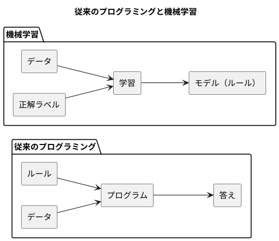
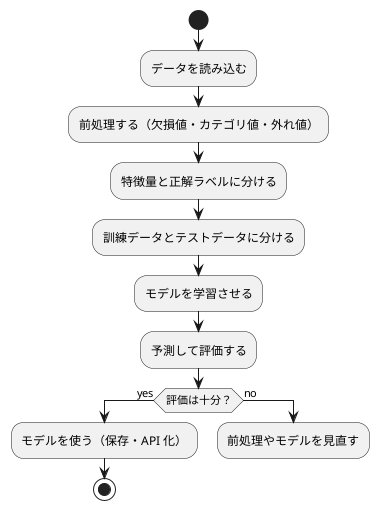

# 第 1 章: 機械学習とはじめてのテスト

## 1.1 はじめに

この章では、機械学習とは何かを確認したうえで、テスト駆動開発（TDD）で最初のプログラムを Kotlin で作ります。題材は「きのこの山派か、たけのこの里派か」を身長・体重・年代から判定する問題です。

この章ではまだ機械学習のアルゴリズムを使いません。人間が考えたルールで判定し、その正解率を測るところまで進みます。「ルールを人間が書く」とはどういうことかを先に体験しておくと、第 3 章で「ルールをデータから学ばせる」ことの意味がはっきりします。

[Python 版の第 1 章](../python/01-machine-learning-and-first-test.md) と同じ題材・同じ TODO リストで進めます。Kotlin 版では、data class・null 安全・関数型の引数といった Kotlin の特徴に注目しながら読んでください。

## 1.2 機械学習とは

### ルールを書くか、データに学ばせるか

従来のプログラミングでは、人間が判定のルールをコードとして書きます。

```kotlin
fun predictByRule(features: Features): String = if (features.ageGroup == 20) "きのこ" else "たけのこ"
```

これはこの章で実際に作る関数です。「20 代ならきのこ派」というルールは、人間がデータを眺めて立てた仮説にすぎません。データが増えたり傾向が変わったりすれば、人間がルールを書き直す必要があります。

機械学習では、ルールそのものをデータから導きます。人間が用意するのは「特徴量（判定の手がかり）」と「正解ラベル（本当の答え）」の組です。学習アルゴリズムがその組からルールを作り、未知のデータに当てはめて予測します。



### 機械学習のワークフロー

機械学習のプログラムは、おおむね次の流れで作ります。本シリーズの各章は、この流れのどこかを深掘りする構成になっています。



この章で扱うのは「データを読み込む」「特徴量と正解ラベルに分ける」「予測して評価する」の 3 つです。「学習させる」の代わりに、人間が書いたルールで予測します。

### 分類と回帰

| 種類 | 予測するもの | 例 |
|------|------------|-----|
| 分類 | どのグループに属するか（離散値） | きのこ派かたけのこ派か、アヤメの品種 |
| 回帰 | どれくらいの量か（連続値） | 映画の興行収入、住宅価格 |

この章の問題は、2 つのグループのどちらかを当てる分類です。

## 1.3 題材とデータ

### データの入手と配置

本シリーズの学習データは、書籍『スッキリわかる Python による機械学習入門』（インプレス, 2020）の配布データを使います。配布データは書籍購入者のみ利用できるため、リポジトリには含まれていません。[書籍サポートページ](https://sukkiri.jp/books/sukkiri_ml) から `sukkiri-ml-codes.zip` を入手し、リポジトリの `tmp/` に置いてから、リポジトリのルートで次を実行してください。

```bash
npx gulp data:setup
npx gulp data:check
```

`apps/data/sukkiri-ml/` に学習データが配置されます。このディレクトリは `.gitignore` の対象なので、誤ってコミットされることはありません。Python 版と Kotlin 版は同じデータを参照します。

### KvsT.csv

この章で使うのは `KvsT.csv` です。19 人分のデータが次の 4 列で記録されています。

| 列 | 意味 | 値 |
|----|------|-----|
| 身長 | 身長（cm） | 整数 |
| 体重 | 体重（kg） | 整数 |
| 年代 | 年代 | 10, 20, 30, 40 のいずれか |
| 派閥 | きのこの山派かたけのこの里派か | `きのこ` または `たけのこ` |

「身長」「体重」「年代」が特徴量、「派閥」が正解ラベルです。列名が日本語であることと、ファイルの先頭に BOM（バイトオーダーマーク）が付いていることに注意してください。

## 1.4 TODO リストの作成

仕様をそのままコードにするには大きすぎるので、まず TODO リストに分解します。

> TODO リスト
>
> 何をテストすべきだろうか——着手する前に、必要になりそうなテストをリストに書き出しておこう。
>
> — テスト駆動開発

**TODO リスト**:

- [ ] CSV を読み込む
  - [ ] BOM 付き CSV の 1 行を人物として読み込む
  - [ ] 複数行を行の順に読み込む
- [ ] 特徴量と正解ラベルに分ける
- [ ] ルールで派閥を判定する
  - [ ] 20 代ならきのこ派と判定する
  - [ ] 20 代以外ならたけのこ派と判定する
- [ ] 正解率を計算する
- [ ] 実データで正解率を表示する

## 1.5 開発環境の準備

### プロジェクトの構成

Kotlin の実装は `apps/kotlin/` にあります。ビルドには Gradle（Gradle Wrapper で版を固定）、テスティングフレームワークには [kotlin.test](https://kotlinlang.org/api/latest/kotlin.test/) を JUnit Platform の上で使います。

```text
apps/kotlin/
├── build.gradle.kts
├── settings.gradle.kts
├── gradle/
│   ├── libs.versions.toml
│   └── wrapper/
├── gradlew
├── gradlew.bat
└── src/
    ├── main/kotlin/
    │   ├── dataset/
    │   │   └── Dataset.kt
    │   └── chapter01/
    │       ├── KinokoTakenoko.kt
    │       └── Main.kt
    └── test/kotlin/
        ├── SetupTest.kt
        ├── dataset/
        │   └── DataDirTest.kt
        └── chapter01/
            └── KinokoTakenokoTest.kt
```

`settings.gradle.kts` では、ビルドに使う JDK 21 が手元に無ければ自動で取得するプラグインを設定しています。

```kotlin
plugins {
    // jvmToolchain で指定した JDK が無ければ自動で取得する
    id("org.gradle.toolchains.foojay-resolver-convention") version "1.0.0"
}

rootProject.name = "getting-started-ml"
```

`build.gradle.kts` のうち、テストに関わる部分は次のとおりです。

```kotlin
plugins {
    alias(libs.plugins.kotlin.jvm)
}

repositories {
    mavenCentral()
}

dependencies {
    testImplementation(kotlin("test"))
}

kotlin {
    jvmToolchain(21)
}

tasks.test {
    useJUnitPlatform()
    testLogging {
        events("passed", "skipped", "failed")
        exceptionFormat = org.gradle.api.tasks.testing.logging.TestExceptionFormat.FULL
        showStackTraces = false
    }
    jvmArgs("-Dfile.encoding=UTF-8", "-Dstdout.encoding=UTF-8")
    // 学習データの場所（未指定なら ../data/sukkiri-ml）。値が変わればテストを再実行する
    val mlDataDir = providers.environmentVariable("ML_DATA_DIR")
    inputs.property("mlDataDir", mlDataDir.orElse(""))
    mlDataDir.orNull?.let { environment("ML_DATA_DIR", it) }
}
```

- `jvmToolchain(21)` は、手元の Java の版に関係なく JDK 21 でコンパイル・テストすることを指定します。手元に JDK 25 しか無くても、Gradle が JDK 21 を用意して使います
- `testLogging` は、テストごとの結果と、失敗したときの期待値・実際の値をコンソールに表示します
- `-Dfile.encoding=UTF-8` は、Windows のコンソールで日本語のテスト名や出力が文字化けしないようにする設定です

ビルドファイル全体とタスクの設定は第 5・6 章で詳しく扱います。

### 環境確認テスト

テスティングフレームワークが動くことを、最小のテストで確認します。

```kotlin
// src/test/kotlin/SetupTest.kt
import kotlin.test.Test
import kotlin.test.assertEquals

class SetupTest {
    @Test
    fun `テスティングフレームワークが動作する`() {
        assertEquals(2, 1 + 1)
    }
}
```

```bash
cd apps/kotlin
./gradlew test
```

Windows の PowerShell では `.\gradlew.bat test` と実行します。

```text
SetupTest > テスティングフレームワークが動作する() PASSED
BUILD SUCCESSFUL in 1s
```

Kotlin では、関数名をバッククォート（`` ` ``）で囲むと、空白や日本語を含む名前を付けられます。テストの一覧がそのまま仕様の一覧として読めるので、本シリーズではテスト名を日本語で書きます。

## 1.6 CSV を読み込む

### テストファースト

TODO リストの最初の項目「BOM 付き CSV の 1 行を人物として読み込む」から始めます。実装より先にテストを書きます。

> テストファースト
>
> いつテストを書くべきだろうか——それはテスト対象のコードを書く前だ。
>
> — テスト駆動開発

テストでは学習データそのものは使いません。一時ディレクトリに、架空の値を 1 行だけ書いた CSV を作ります。

```kotlin
// src/test/kotlin/chapter01/KinokoTakenokoTest.kt
package chapter01

import java.io.File
import java.nio.file.Path
import kotlin.io.path.createTempDirectory
import kotlin.test.Test
import kotlin.test.assertEquals

class LoadPeopleTest {
    private val directory: Path = createTempDirectory()

    @Test
    fun `BOM付きCSVを読み込んで人物のリストを返す`() {
        val csvFile = File(directory.toFile(), "kvst.csv")
        csvFile.writeText("\uFEFF身長,体重,年代,派閥\n165,58,30,きのこ\n")

        val people = loadPeople(csvFile)

        assertEquals(listOf(Person(height = 165, weight = 58, ageGroup = 30, faction = "きのこ")), people)
    }
}
```

`"\uFEFF"` は BOM の文字です。配布データと同じ形式のファイルでテストするために、先頭に付けています。

### Red: 失敗を確認する

```text
e: file:///.../src/test/kotlin/chapter01/KinokoTakenokoTest.kt:17:22 Unresolved reference 'loadPeople'.
e: file:///.../src/test/kotlin/chapter01/KinokoTakenokoTest.kt:19:29 Unresolved reference 'Person'.
```

Kotlin は静的型付けの言語なので、テストの実行より前の **コンパイル** の段階で「`loadPeople` も `Person` も存在しない」と失敗します。Python 版ではテストの実行時に `ModuleNotFoundError` になりましたが、Kotlin ではコンパイラが最初の Red を知らせてくれます。

### Green: 仮実装

> 仮実装を経て本実装へ
>
> 失敗するテストを書いてから、最初に行う実装はどのようなものだろうか——ベタ書きの値を返そう。
>
> — テスト駆動開発

```kotlin
// src/main/kotlin/chapter01/KinokoTakenoko.kt
package chapter01

import java.io.File

data class Person(
    val height: Int,
    val weight: Int,
    val ageGroup: Int,
    val faction: String,
)

fun loadPeople(csvFile: File): List<Person> = listOf(Person(height = 165, weight = 58, ageGroup = 30, faction = "きのこ"))
```

`data class` は、コンストラクタの引数に並べたプロパティから、値による比較（`equals`）・表示（`toString`）・コピー（`copy`）を自動で用意します。`val` で宣言したプロパティは生成後に変更できません。テストの `assertEquals` が値で比較できるのはこのためです。

```text
SetupTest > テスティングフレームワークが動作する() PASSED
LoadPeopleTest > BOM付きCSVを読み込んで人物のリストを返す() PASSED
BUILD SUCCESSFUL in 3s
```

### 三角測量

> 三角測量
>
> テストから最も慎重に一般化を引き出すやり方はどのようなものだろうか——2 つ以上の例があるときだけ、一般化を行うようにしよう。
>
> — テスト駆動開発

```kotlin
    @Test
    fun `複数行のCSVを読み込んで行の順に人物のリストを返す`() {
        val csvFile = File(directory.toFile(), "kvst.csv")
        csvFile.writeText("身長,体重,年代,派閥\n161,52,20,きのこ\n183,74,50,たけのこ\n")

        val people = loadPeople(csvFile)

        assertEquals(
            listOf(
                Person(height = 161, weight = 52, ageGroup = 20, faction = "きのこ"),
                Person(height = 183, weight = 74, ageGroup = 50, faction = "たけのこ"),
            ),
            people,
        )
    }
```

```text
LoadPeopleTest > 複数行のCSVを読み込んで行の順に人物のリストを返す() FAILED
    org.opentest4j.AssertionFailedError: expected: <[Person(height=161, weight=52, ageGroup=20, faction=きのこ), Person(height=183, weight=74, ageGroup=50, faction=たけのこ)]> but was: <[Person(height=165, weight=58, ageGroup=30, faction=きのこ)]>
3 tests completed, 1 failed
```

data class の `toString` のおかげで、期待値と実際の値の違いがそのまま読めます。

ヘッダー行の列名から「何列目か」の対応表を作り、各行を `Person` に変換します。

```kotlin
package chapter01

import java.io.File

private const val BOM = '\uFEFF'

data class Person(
    val height: Int,
    val weight: Int,
    val ageGroup: Int,
    val faction: String,
)

fun loadPeople(csvFile: File): List<Person> {
    val lines = csvFile.readLines(Charsets.UTF_8)
    val header = lines.first().removePrefix(BOM.toString()).split(",")
    val index = header.withIndex().associate { (i, name) -> name to i }
    return lines.drop(1).filter { it.isNotBlank() }.map { line ->
        val values = line.split(",")
        Person(
            height = values[index.getValue("身長")].toInt(),
            weight = values[index.getValue("体重")].toInt(),
            ageGroup = values[index.getValue("年代")].toInt(),
            faction = values[index.getValue("派閥")],
        )
    }
}
```

- `withIndex().associate { (i, name) -> name to i }` は、列名から列番号を引く `Map` を作ります。`name to i` は `Pair` を作る中置関数です
- `lines.drop(1)` でヘッダー行を飛ばし、`map` で各行を `Person` に変換します
- `index.getValue("身長")` は、キーが無ければ例外を送出します。`index["身長"]` は null を返すので、Kotlin の null 安全により `Int?` のまま `values[...]` には使えません。「列が無いのは異常」なので `getValue` を選んでいます

```text
LoadPeopleTest > BOM付きCSVを読み込んで人物のリストを返す() PASSED
LoadPeopleTest > 複数行のCSVを読み込んで行の順に人物のリストを返す() PASSED
SetupTest > テスティングフレームワークが動作する() PASSED
BUILD SUCCESSFUL in 2s
```

### BOM の落とし穴

`removePrefix(BOM.toString())` を外すと、BOM 付きの CSV を読むテストが次のように失敗します。

```text
LoadPeopleTest > BOM付きCSVを読み込んで人物のリストを返す() FAILED
    java.util.NoSuchElementException: Key 身長 is missing in the map.
```

`readLines` は BOM を取り除かないので、先頭の列名に BOM の文字（U+FEFF）が付いたまま残り、`"身長"` という列名で引けなくなります。Python の `csv` モジュールと同じ落とし穴です。BOM 付きのファイルでテストを書いていたおかげで、この問題をテストで捕まえられました。

**TODO リスト**:

- [x] CSV を読み込む
  - [x] BOM 付き CSV の 1 行を人物として読み込む
  - [x] 複数行を行の順に読み込む
- [ ] 特徴量と正解ラベルに分ける
- [ ] ルールで派閥を判定する
  - [ ] 20 代ならきのこ派と判定する
  - [ ] 20 代以外ならたけのこ派と判定する
- [ ] 正解率を計算する
- [ ] 実データで正解率を表示する

## 1.7 特徴量と正解ラベルに分ける

```kotlin
class SplitFeaturesAndLabelsTest {
    @Test
    fun `人物のリストを特徴量と正解ラベルに分ける`() {
        val people =
            listOf(
                Person(height = 161, weight = 52, ageGroup = 20, faction = "きのこ"),
                Person(height = 183, weight = 74, ageGroup = 50, faction = "たけのこ"),
            )

        val (features, labels) = splitFeaturesAndLabels(people)

        assertEquals(
            listOf(
                Features(height = 161, weight = 52, ageGroup = 20),
                Features(height = 183, weight = 74, ageGroup = 50),
            ),
            features,
        )
        assertEquals(listOf("きのこ", "たけのこ"), labels)
    }
}
```

```text
e: file:///.../src/test/kotlin/chapter01/KinokoTakenokoTest.kt:48:34 Unresolved reference 'splitFeaturesAndLabels'.
```

やることが明らかな変換なので、明白な実装で進めます。

> 明白な実装
>
> シンプルな操作を実現するにはどうすればよいだろうか——そのまま実装しよう。
>
> — テスト駆動開発

```kotlin
data class Features(
    val height: Int,
    val weight: Int,
    val ageGroup: Int,
)

fun splitFeaturesAndLabels(people: List<Person>): Pair<List<Features>, List<String>> {
    val features = people.map { Features(it.height, it.weight, it.ageGroup) }
    val labels = people.map { it.faction }
    return features to labels
}
```

戻り値の `Pair` は、テストの `val (features, labels) = ...` のように **分解宣言** で 2 つの変数に分けて受け取れます。

## 1.8 ルールで派閥を判定する

20 代のテストを書き、仮実装で Green にします。

```kotlin
class PredictByRuleTest {
    @Test
    fun `20代ならきのこ派と判定する`() {
        val features = Features(height = 161, weight = 52, ageGroup = 20)

        assertEquals("きのこ", predictByRule(features))
    }
}
```

```kotlin
fun predictByRule(features: Features): String = "きのこ"
```

三角測量として、20 代以外のテストを追加します。

```kotlin
    @Test
    fun `20代以外ならたけのこ派と判定する`() {
        val features = Features(height = 183, weight = 74, ageGroup = 50)

        assertEquals("たけのこ", predictByRule(features))
    }
```

```text
PredictByRuleTest > 20代ならきのこ派と判定する() PASSED
PredictByRuleTest > 20代以外ならたけのこ派と判定する() FAILED
    org.opentest4j.AssertionFailedError: expected: <たけのこ> but was: <きのこ>
6 tests completed, 1 failed
```

Kotlin の `if` は値を返す **式** なので、そのまま関数の戻り値にできます。

```kotlin
fun predictByRule(features: Features): String = if (features.ageGroup == 20) "きのこ" else "たけのこ"
```

## 1.9 正解率を計算する

すべて正解のテストと仮実装から始めます。

```kotlin
class AccuracyTest {
    @Test
    fun `すべての予測が正解なら正解率は1`() {
        assertEquals(1.0, accuracy(listOf("きのこ", "たけのこ"), listOf("きのこ", "たけのこ")))
    }
}
```

```kotlin
fun accuracy(
    predictions: List<String>,
    labels: List<String>,
): Double = 1.0
```

三角測量として、4 件中 3 件が正解の場合と、件数が違う場合を加えます。件数がずれるのは前処理のバグなので、黙って計算せずに例外で知らせることをテストで約束します。

```kotlin
    @Test
    fun `4件中3件の予測が正解なら正解率は075`() {
        val predictions = listOf("きのこ", "きのこ", "たけのこ", "たけのこ")
        val labels = listOf("きのこ", "たけのこ", "たけのこ", "たけのこ")

        assertEquals(0.75, accuracy(predictions, labels))
    }

    @Test
    fun `予測と正解ラベルの件数が違えばエラーになる`() {
        assertFailsWith<IllegalArgumentException> {
            accuracy(listOf("きのこ"), listOf("きのこ", "たけのこ"))
        }
    }
```

```text
AccuracyTest > 4件中3件の予測が正解なら正解率は075() FAILED
    org.opentest4j.AssertionFailedError: expected: <0.75> but was: <1.0>
AccuracyTest > 予測と正解ラベルの件数が違えばエラーになる() FAILED
    org.opentest4j.AssertionFailedError: Expected an exception of class java.lang.IllegalArgumentException to be thrown, but was completed successfully with the result: <1.0>.
AccuracyTest > すべての予測が正解なら正解率は1() PASSED
9 tests completed, 2 failed
```

```kotlin
fun accuracy(
    predictions: List<String>,
    labels: List<String>,
): Double {
    require(predictions.size == labels.size) { "予測と正解ラベルの件数が違います" }
    val correct = predictions.zip(labels).count { (p, t) -> p == t }
    return correct.toDouble() / labels.size
}
```

- `require` は、条件が偽なら `IllegalArgumentException` を送出する標準ライブラリの関数です。Python 版の `zip(..., strict=True)` と同じ役割を、引数の検査として明示的に書いています
- `zip` は 2 つのリストを先頭から組にし、`count { (p, t) -> p == t }` は条件を満たす組の数を数えます
- `correct.toDouble()` で `Double` に変換してから割ります。`Int` どうしの割り算は整数の割り算になり、3 / 4 は 0 になってしまうためです

## 1.10 実データで正解率を表示する

### 学習データの場所を解決する

学習データの場所は、環境変数 `ML_DATA_DIR` で指定でき、指定が無ければ `apps/data/sukkiri-ml/` を使います。環境変数を読む関数を引数で受け取るようにすると、テストでは本物の環境変数を書き換えずに済みます。

```kotlin
// src/test/kotlin/dataset/DataDirTest.kt
package dataset

import java.io.File
import kotlin.test.Test
import kotlin.test.assertEquals

class DataDirTest {
    @Test
    fun `環境変数ML_DATA_DIRが指定されていればそのディレクトリを返す`() {
        val env = mapOf("ML_DATA_DIR" to "/tmp/ml-data")

        assertEquals(File("/tmp/ml-data"), dataDir(env::get))
    }

    @Test
    fun `環境変数が無ければappsのdataディレクトリを返す`() {
        assertEquals(File("../data/sukkiri-ml"), dataDir { null })
    }
}
```

```text
e: file:///.../src/test/kotlin/dataset/DatasetTest.kt:12:44 Unresolved reference 'dataDir'.
```

```kotlin
// src/main/kotlin/dataset/Dataset.kt
package dataset

import java.io.File

/** 学習データのディレクトリ。環境変数 ML_DATA_DIR が無ければ apps/data/sukkiri-ml を使う。 */
fun dataDir(getenv: (String) -> String? = System::getenv): File = getenv("ML_DATA_DIR")?.let(::File) ?: File("../data/sukkiri-ml")
```

- 引数 `getenv` の型 `(String) -> String?` は「文字列を受け取り、文字列か null を返す関数」です。既定値は `System::getenv`（本物の環境変数を読む関数への参照）なので、呼び出し側は `dataDir()` と書けます
- テストでは `env::get`（Map から値を引く関数）や `{ null }`（常に null を返すラムダ）を渡しています
- `?.let(::File)` は「null でなければ `File` に変換する」、`?:` は「null なら右辺を使う」という null 安全の演算子です
- 既定の `../data/sukkiri-ml` は、Gradle がテストを `apps/kotlin/` で実行することを前提にした相対パスです

Python 版は Python の `monkeypatch` で環境変数を差し替えましたが、Kotlin 版は関数を引数で渡す設計にしました。静的型付けの言語では、差し替えたい依存を引数にするほうが、テストの意図が型に表れます。

### データが無ければスキップする

実データを使うテストは、JUnit の `Assumptions.assumeTrue` で、データが配置されていなければスキップします。

```kotlin
class KvsTDataTest {
    private val csvFile = File(dataDir(), "KvsT.csv")

    @BeforeTest
    fun requireData() {
        assumeTrue(csvFile.exists(), "学習データ KvsT.csv が配置されていない（gulp data:setup）")
    }

    @Test
    fun `実データから19人分を読み込む`() {
        assertEquals(19, loadPeople(csvFile).size)
    }

    @Test
    fun `ルールによる判定の正解率を実データで計算する`() {
        val (features, labels) = splitFeaturesAndLabels(loadPeople(csvFile))

        val predictions = features.map(::predictByRule)

        assertEquals(14.0 / 19, accuracy(predictions, labels), absoluteTolerance = 1e-12)
    }

    @Test
    fun `実行するとデータ件数と正解率を表示する`() {
        val output = captureStdout { main() }

        assertEquals("データ件数: 19\nルールによる判定の正解率: 0.7368\n", output)
    }
}
```

- `@BeforeTest` の関数は各テストの前に呼ばれ、`assumeTrue` の条件が偽ならそのテストはスキップ扱いになります
- `features.map(::predictByRule)` は、関数参照を `map` に渡して各特徴量を判定します
- 浮動小数点数の比較には `absoluteTolerance` で許容誤差を指定します

`captureStdout` は、標準出力を一時的に差し替えて `main` の出力を取り出すテスト用の関数です。

```kotlin
private fun captureStdout(block: () -> Unit): String {
    val original = System.out
    val buffer = ByteArrayOutputStream()
    System.setOut(PrintStream(buffer, true, Charsets.UTF_8))
    try {
        block()
    } finally {
        System.setOut(original)
    }
    return buffer.toString(Charsets.UTF_8).replace("\r\n", "\n")
}
```

第 2 章では、このヘルパーを `src/test/kotlin/support/CaptureStdout.kt` に移し、どの章のテストからも使えるようにします。

`main` と表示のテストは、実データで出力を確かめながら書いたので、Red を経ずに通っています。出力を固定し、変更で表示が変わったことに気づけるようにするためのテストです。

### 結果を表示する

```kotlin
// src/main/kotlin/chapter01/Main.kt
package chapter01

import dataset.dataDir
import java.io.File
import java.util.Locale

fun main() {
    val people = loadPeople(File(dataDir(), "KvsT.csv"))
    val (features, labels) = splitFeaturesAndLabels(people)
    val predictions = features.map(::predictByRule)
    println("データ件数: ${people.size}")
    println("ルールによる判定の正解率: ${"%.4f".format(Locale.ROOT, accuracy(predictions, labels))}")
}
```

`"%.4f".format(...)` に `Locale.ROOT` を渡しているのは、実行環境のロケールによっては小数点がカンマ（`0,7368`）で表示されるためです。テストで表示を固定する場合は、ロケールに依存しない書式にしておきます。

章ごとの `main` は、`runChapter` タスクで実行します。

```bash
./gradlew runChapter -Pchapter=01
```

```text
データ件数: 19
ルールによる判定の正解率: 0.7368
```

第 1 章には乱数を使う処理が無いので、Python 版と同じ 19 件・0.7368 になります。

データが無い環境では、実データのテスト 3 件がスキップされます。

```bash
ML_DATA_DIR=/nonexistent ./gradlew test
```

```text
KvsTDataTest > ルールによる判定の正解率を実データで計算する() SKIPPED
KvsTDataTest > 実行するとデータ件数と正解率を表示する() SKIPPED
KvsTDataTest > 実データから19人分を読み込む() SKIPPED
BUILD SUCCESSFUL in 2s
```

**TODO リスト**:

- [x] CSV を読み込む
  - [x] BOM 付き CSV の 1 行を人物として読み込む
  - [x] 複数行を行の順に読み込む
- [x] 特徴量と正解ラベルに分ける
- [x] ルールで派閥を判定する
  - [x] 20 代ならきのこ派と判定する
  - [x] 20 代以外ならたけのこ派と判定する
- [x] 正解率を計算する
- [x] 実データで正解率を表示する

## 1.11 リファクタリング

### テストの重複をまとめる

CSV を読み込むテストでは、ヘッダー行と CSV の書き出しが重複していました。ヘッダーを定数に、書き出しをヘルパー関数にまとめます。

```kotlin
private const val HEADER = "\uFEFF身長,体重,年代,派閥\n"

class LoadPeopleTest {
    private val directory: Path = createTempDirectory()

    private fun writeCsv(rows: String): File = File(directory.toFile(), "kvst.csv").apply { writeText(HEADER + rows) }

    @Test
    fun `BOM付きCSVを読み込んで人物のリストを返す`() {
        val csvFile = writeCsv("165,58,30,きのこ\n")

        val people = loadPeople(csvFile)

        assertEquals(listOf(Person(height = 165, weight = 58, ageGroup = 30, faction = "きのこ")), people)
    }
```

`apply { ... }` は、ブロックの中で対象のオブジェクト（ここでは `File`）を `this` として操作し、そのオブジェクト自身を返すスコープ関数です。「ファイルを作って書き込み、そのファイルを返す」を 1 式で書けます。

### コードスタイルを整える

コードの整形には [ktlint](https://pinterest.github.io/ktlint/) を使います。`ktlintFormat` で整形し、`check` タスクでテストと一緒にスタイルを検査します（設定は第 5 章で扱います）。

```bash
./gradlew ktlintFormat
./gradlew check
```

ktlint は「1 つのクラスだけを持つファイルは、クラス名と同じファイル名にする」というルールも検査します。`DatasetTest.kt` に `DataDirTest` クラスだけを置いていたので、ファイル名を `DataDirTest.kt` に変えました。

```text
BUILD SUCCESSFUL in 3s
```

<details>
<summary>この章の完成コード（src/main/kotlin/chapter01/KinokoTakenoko.kt）</summary>

```kotlin
package chapter01

import java.io.File

private const val BOM = '\uFEFF'

data class Person(
    val height: Int,
    val weight: Int,
    val ageGroup: Int,
    val faction: String,
)

fun loadPeople(csvFile: File): List<Person> {
    val lines = csvFile.readLines(Charsets.UTF_8)
    val header = lines.first().removePrefix(BOM.toString()).split(",")
    val index = header.withIndex().associate { (i, name) -> name to i }
    return lines.drop(1).filter { it.isNotBlank() }.map { line ->
        val values = line.split(",")
        Person(
            height = values[index.getValue("身長")].toInt(),
            weight = values[index.getValue("体重")].toInt(),
            ageGroup = values[index.getValue("年代")].toInt(),
            faction = values[index.getValue("派閥")],
        )
    }
}

data class Features(
    val height: Int,
    val weight: Int,
    val ageGroup: Int,
)

fun splitFeaturesAndLabels(people: List<Person>): Pair<List<Features>, List<String>> {
    val features = people.map { Features(it.height, it.weight, it.ageGroup) }
    val labels = people.map { it.faction }
    return features to labels
}

fun predictByRule(features: Features): String = if (features.ageGroup == 20) "きのこ" else "たけのこ"

fun accuracy(
    predictions: List<String>,
    labels: List<String>,
): Double {
    require(predictions.size == labels.size) { "予測と正解ラベルの件数が違います" }
    val correct = predictions.zip(labels).count { (p, t) -> p == t }
    return correct.toDouble() / labels.size
}
```

</details>

## 1.12 まとめ

この章では、機械学習のワークフローのうち「読み込む」「特徴量と正解ラベルに分ける」「予測して評価する」を、Kotlin の TDD で実装しました。

1. **コンパイルが最初の Red になる** — 存在しない関数やクラスは、テストの実行前にコンパイラが知らせた
2. **data class** — 値による比較と読みやすい `toString` で、テストの期待値と失敗メッセージが簡潔になった
3. **null 安全** — `getValue` と `?.let`・`?:` で、「値が無い場合」をコードの上で明示した
4. **関数を引数で渡す** — 環境変数を読む関数を引数にして、テストで差し替えられるようにした
5. **学習データと切り離したテスト** — 架空の値の CSV で単体テストを書き、実データのテストは `assumeTrue` でスキップした

人間が書いた「20 代ならきのこ派」というルールの正解率は、Python 版と同じ 0.7368 でした。次の章では、Kotlin DataFrame で欠損値を含むアヤメのデータを前処理し、訓練データとテストデータに分けます。
