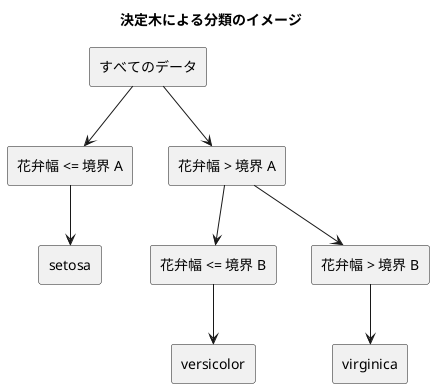

# 第 3 章: 決定木による分類と明白な実装

## 3.1 はじめに

第 1 章では「20 代ならきのこ派」というルールを人間が書き、第 2 章の Notebook では「花弁が小さければ `Iris-setosa` らしい」という傾向を目で見つけました。この章では、こうした「どの特徴量のどこで区切るか」をデータから自動で探すアルゴリズム、**決定木** を自作します。

自作したあとは、JVM の機械学習ライブラリ [Tribuo](https://tribuo.org/) の決定木（CART）に同じデータを学習させ、予測を突き合わせます。[Python 版の第 3 章](../python/03-decision-tree-and-obvious-implementation.md) では scikit-learn と予測がすべて一致しましたが、Kotlin 版では一致しない予測が見つかります。その原因をテストで突き止めることが、この章のもう 1 つのテーマです。

Kotlin 版では、木を sealed interface と data class で表し、`when` で葉と節を場合分けする書き方に注目してください。

## 3.2 決定木の仕組み

### データを 2 つに分けることを繰り返す

決定木は、データを「ある特徴量がある値以下か、より大きいか」で 2 つに分けることを繰り返します。分けた先で同じラベルばかりになったら、そこで分けるのをやめて、そのラベルを予測に使います。



### どこで分けるかをジニ不純度で決める

「よい分け方」とは、分けた後のそれぞれのグループで、ラベルがなるべく 1 種類にそろう分け方です。そろい具合を数値にしたものが **ジニ不純度** です。

ジニ不純度 = 1 − Σ（各ラベルの割合）²

| グループのラベル | 割合 | ジニ不純度 |
|----------------|------|-----------|
| setosa ×3 | setosa 1.0 | 1 − 1.0² = 0 |
| setosa ×1、virginica ×1 | 0.5、0.5 | 1 − (0.5² + 0.5²) = 0.5 |
| 3 品種 ×1 ずつ | 1/3 ずつ | 1 − 3 × (1/3)² = 2/3 |

ラベルが 1 種類にそろうと 0、混ざるほど大きくなります。分け方の候補ごとに、分けた後の左右のジニ不純度を件数で重み付けして平均し、最も小さくなる分け方を選びます。

## 3.3 TODO リストの作成

**TODO リスト**:

- [ ] ジニ不純度を計算する
- [ ] 最良の分割を探す
  - [ ] ラベルを完全に分けられる境界を見つける
  - [ ] 複数の特徴量から最良の特徴量と境界を選ぶ
  - [ ] ラベルが 1 種類なら分割しない
- [ ] 決定木を学習して予測する
  - [ ] 1 種類のラベルだけを学習したらそのラベルを予測する
  - [ ] 境界の左右で異なるラベルを予測する
- [ ] 木の深さを制限する
- [ ] 学習した木を読める形で表示する
- [ ] Tribuo の決定木と突き合わせる
  - [ ] データフレームを Tribuo のデータセットに変換する
  - [ ] 予測が一致しない場合は原因を突き止める
- [ ] 実データで深さと正解率の関係を表示する

## 3.4 ジニ不純度を計算する

### 仮実装から始める

ラベルが 1 種類ならジニ不純度は 0 です。

```kotlin
// src/test/kotlin/chapter03/DecisionTreeTest.kt
package chapter03

import kotlin.test.Test
import kotlin.test.assertEquals

class GiniTest {
    @Test
    fun `1種類のラベルだけならジニ不純度は0`() {
        assertEquals(0.0, gini(listOf("Iris-setosa", "Iris-setosa", "Iris-setosa")))
    }
}
```

```text
e: .../src/test/kotlin/chapter03/DecisionTreeTest.kt:9:27 Unresolved reference 'gini'.
```

関数が無いのでコンパイルエラーになります（Red）。仮実装で 0 を返します。

```kotlin
// src/main/kotlin/chapter03/DecisionTree.kt
package chapter03

fun gini(labels: List<String>): Double = 0.0
```

### 三角測量

```kotlin
    @Test
    fun `2種類のラベルが半分ずつならジニ不純度は05`() {
        assertEquals(0.5, gini(listOf("Iris-setosa", "Iris-virginica")))
    }
```

```text
GiniTest > 2種類のラベルが半分ずつならジニ不純度は05() FAILED
    org.opentest4j.AssertionFailedError: expected: <0.5> but was: <0.0>
GiniTest > 1種類のラベルだけならジニ不純度は0() PASSED
34 tests completed, 1 failed
```

2 つの例が揃ったので、定義どおりに一般化します。

```kotlin
fun gini(labels: List<String>): Double {
    val total = labels.size.toDouble()
    return 1.0 - labels.groupingBy { it }.eachCount().values.sumOf { (it / total) * (it / total) }
}
```

- `groupingBy { it }.eachCount()` は、ラベルごとの出現回数を `Map<String, Int>` で返します。Python 版の `Counter` に相当します
- `total` を `toDouble()` で `Double` にしているのは、`Int` 同士の割り算が切り捨てになるためです。`1 / 2` は `0` ですが、`1 / 2.0` は `0.5` です

3 品種が 1 件ずつの場合も確かめておきます。2/3 は小数で正確に表せないので、`absoluteTolerance` で誤差を許容して比べます。こちらは実装を変えずに通りますが、3 種類以上のラベルでも正しいことを示す仕様として残します。

```kotlin
    @Test
    fun `3種類のラベルが同じ数ならジニ不純度は3分の2`() {
        val labels = listOf("Iris-setosa", "Iris-versicolor", "Iris-virginica")

        assertEquals(2.0 / 3, gini(labels), absoluteTolerance = 1e-12)
    }
```

## 3.5 最良の分割を探す

### 分割を表すデータ

分割は「どの特徴量を」「どの値（境界）で」分けたか、「分けた後の不純度」の 3 つで表します。

```kotlin
data class Split(
    val feature: String,
    val threshold: Double,
    val impurity: Double,
)
```

### 仮実装

花弁幅が 0.2 と 0.7 の間でラベルが入れ替わるデータです。境界は隣り合う値の中点 0.45 にします。

```kotlin
class BestSplitTest {
    @Test
    fun `ラベルを完全に分けられる境界を見つける`() {
        val x = dataFrameOf("花弁幅" to listOf(0.1, 0.2, 0.7, 0.8))
        val t = listOf("setosa", "setosa", "virginica", "virginica")

        assertEquals(Split(feature = "花弁幅", threshold = 0.45, impurity = 0.0), bestSplit(x, t))
    }
}
```

```text
e: .../src/test/kotlin/chapter03/DecisionTreeTest.kt:32:9 Cannot infer type for type parameter 'T'. Specify it explicitly.
e: .../src/test/kotlin/chapter03/DecisionTreeTest.kt:32:22 Unresolved reference 'Split'.
e: .../src/test/kotlin/chapter03/DecisionTreeTest.kt:32:80 Unresolved reference 'bestSplit'.
```

1 行目のエラーは、`Split` と `bestSplit` の型が分からないため、`assertEquals<T>` の `T` も決められないというものです。第 2 章でも見た、型が分からないことによる連鎖的なエラーです。

```kotlin
fun bestSplit(
    x: AnyFrame,
    t: List<String>,
): Split? = Split(feature = "花弁幅", threshold = 0.45, impurity = 0.0)
```

戻り値の型 `Split?` は、「分割できないときは `null` を返す」ことを型で表しています。呼び出し側は null を確かめないと `Split` のプロパティを使えません。

### 三角測量

特徴量が 2 つあり、`花弁長さ` だけが完全に分けられる例と、そもそも分ける必要がない例を加えます。

```kotlin
    @Test
    fun `複数の特徴量から不純度が最も小さくなる特徴量と境界を選ぶ`() {
        val x =
            dataFrameOf(
                "がく片長さ" to listOf(0.1, 0.3, 0.2, 0.4),
                "花弁長さ" to listOf(0.2, 0.1, 0.9, 0.6),
            )
        val t = listOf("setosa", "setosa", "virginica", "virginica")

        assertEquals(Split(feature = "花弁長さ", threshold = 0.4, impurity = 0.0), bestSplit(x, t))
    }

    @Test
    fun `ラベルが1種類なら分割しない`() {
        val x = dataFrameOf("花弁幅" to listOf(0.1, 0.2, 0.7))
        val t = listOf("setosa", "setosa", "setosa")

        assertNull(bestSplit(x, t))
    }
```

```text
BestSplitTest > ラベルを完全に分けられる境界を見つける() PASSED
BestSplitTest > 複数の特徴量から不純度が最も小さくなる特徴量と境界を選ぶ() FAILED
    org.opentest4j.AssertionFailedError: expected: <Split(feature=花弁長さ, threshold=0.4, impurity=0.0)> but was: <Split(feature=花弁幅, threshold=0.45, impurity=0.0)>
BestSplitTest > ラベルが1種類なら分割しない() FAILED
    org.opentest4j.AssertionFailedError: actual value is not null ==> expected: <null> but was: <Split(feature=花弁幅, threshold=0.45, impurity=0.0)>
38 tests completed, 2 failed
```

失敗メッセージに `Split(feature=花弁長さ, ...)` と中身が表示されるのは、data class が `toString` を自動で作るためです。

特徴量ごとに値を並べ替え、隣り合う値の間をすべて境界の候補にして、分けた後の不純度が最小になる候補を選びます。

```kotlin
fun bestSplit(
    x: AnyFrame,
    t: List<String>,
): Split? {
    if (gini(t) == 0.0) return null
    var best: Split? = null
    for (feature in x.columnNames()) {
        val pairs = x[feature].values().map { (it as Number).toDouble() }.zip(t).sortedBy { it.first }
        val values = pairs.map { it.first }
        val labels = pairs.map { it.second }
        for (i in 1 until pairs.size) {
            if (values[i] == values[i - 1]) continue
            val left = labels.subList(0, i)
            val right = labels.subList(i, labels.size)
            val impurity = (left.size * gini(left) + right.size * gini(right)) / pairs.size
            if (best == null || impurity < best.impurity) {
                best = Split(feature = feature, threshold = (values[i - 1] + values[i]) / 2, impurity = impurity)
            }
        }
    }
    return best
}
```

- `AnyFrame` の列は要素の型が決まっていないので、`(it as Number).toDouble()` で数値として取り出します
- `zip(t)` で値とラベルの組（`Pair`）のリストを作り、`sortedBy { it.first }` で値の順に並べ替えます
- `1 until pairs.size` は、1 から `pairs.size - 1` までの範囲です。同じ値が続くところには境界を置けないので飛ばします
- `best == null || impurity < best.impurity` の右側では、`best` が null でないことをコンパイラが分かっているので、`best.impurity` とそのまま書けます（スマートキャスト）
- 不純度が「より小さい」ときだけ更新するので、同じ不純度の候補が複数あれば、先に見つかった（列の順・値の順で前の）候補が残ります。この性質は 3.9 節で重要になります

### 浮動小数点数の落とし穴

ところが、今度は仮実装のときに通っていた最初のテストが失敗しました。

```text
BestSplitTest > ラベルを完全に分けられる境界を見つける() FAILED
    org.opentest4j.AssertionFailedError: expected: <Split(feature=花弁幅, threshold=0.45, impurity=0.0)> but was: <Split(feature=花弁幅, threshold=0.44999999999999996, impurity=0.0)>
BestSplitTest > 複数の特徴量から不純度が最も小さくなる特徴量と境界を選ぶ() PASSED
BestSplitTest > ラベルが1種類なら分割しない() PASSED
38 tests completed, 1 failed
BUILD FAILED in 3s
```

`(0.2 + 0.7) / 2` は、2 進数の浮動小数点数では 0.45 ちょうどにならず 0.44999999999999996 になります。仮実装はテストと同じ `0.45` というリテラルを返していたので、この差に気づけませんでした。Python 版と同じ落とし穴です。

実装は正しいので、テストの比較を変えます。data class の `equals` では誤差を許容できないので、フィールドごとに比べるテスト用の関数を作ります。

```kotlin
private fun assertSplit(
    feature: String,
    threshold: Double,
    impurity: Double,
    actual: Split?,
) {
    val split = assertNotNull(actual)
    assertEquals(feature, split.feature)
    assertEquals(threshold, split.threshold, absoluteTolerance = 1e-12)
    assertEquals(impurity, split.impurity, absoluteTolerance = 1e-12)
}
```

```kotlin
    @Test
    fun `ラベルを完全に分けられる境界を見つける`() {
        val x = dataFrameOf("花弁幅" to listOf(0.1, 0.2, 0.7, 0.8))
        val t = listOf("setosa", "setosa", "virginica", "virginica")

        assertSplit(feature = "花弁幅", threshold = 0.45, impurity = 0.0, actual = bestSplit(x, t))
    }
```

kotlin.test の `assertNotNull` は、null でなければその値を **null 非許容の型で** 返します。`val split = assertNotNull(actual)` の後は `split` が `Split` 型になるので、`split.feature` と書けます。Python 版では mypy に `assert split is not None` で伝えていたことを、Kotlin では関数の戻り値の型が担っています。2 つ目のテストも `assertSplit` で書き直しました。

## 3.6 決定木を学習して予測する

### 仮実装

Python 版と同じく、`fit` で学習し `predict` で予測する形にします。`fit` が自分自身を返すと、`DecisionTree().fit(x, t)` のように作成と学習を 1 行で書けます。

```kotlin
class DecisionTreeTest {
    @Test
    fun `1種類のラベルだけを学習するとそのラベルを予測する`() {
        val x = dataFrameOf("花弁幅" to listOf(0.1, 0.2))
        val t = listOf("setosa", "setosa")

        val model = DecisionTree().fit(x, t)

        assertEquals(listOf("setosa", "setosa"), model.predict(dataFrameOf("花弁幅" to listOf(0.15, 0.9))))
    }
}
```

```text
e: .../src/test/kotlin/chapter03/DecisionTreeTest.kt:76:21 Unresolved reference 'DecisionTree'.
```

```kotlin
class DecisionTree {
    private var label = ""

    fun fit(
        x: AnyFrame,
        t: List<String>,
    ): DecisionTree {
        label = t.first()
        return this
    }

    fun predict(x: AnyFrame): List<String> = List(x.rowsCount()) { label }
}
```

`List(件数) { 値 }` は、指定した件数の要素を関数で作るリストの作り方です。

### 三角測量

```kotlin
    @Test
    fun `境界の左右で異なるラベルを予測する`() {
        val x = dataFrameOf("花弁幅" to listOf(0.1, 0.2, 0.7, 0.8))
        val t = listOf("setosa", "setosa", "virginica", "virginica")

        val model = DecisionTree().fit(x, t)

        assertEquals(listOf("setosa", "virginica"), model.predict(dataFrameOf("花弁幅" to listOf(0.15, 0.75))))
    }
```

```text
DecisionTreeTest > 境界の左右で異なるラベルを予測する() FAILED
    org.opentest4j.AssertionFailedError: expected: <[setosa, virginica]> but was: <[setosa, setosa]>
DecisionTreeTest > 1種類のラベルだけを学習するとそのラベルを予測する() PASSED
40 tests completed, 1 failed
```

### 木を sealed interface で表す

木は「葉」と「節」の 2 種類のデータでできています。

- **葉（`Leaf`）**: 予測するラベルを持つ
- **節（`Node`）**: 分割と、左右の子（葉か節）を持つ

```kotlin
sealed interface Tree

data class Leaf(
    val label: String,
) : Tree

data class Node(
    val split: Split,
    val left: Tree,
    val right: Tree,
) : Tree
```

`sealed interface` は、実装できる型を同じパッケージ・同じモジュールの中に限定するインターフェースです。コンパイラは `Tree` の実装が `Leaf` と `Node` の 2 つだけだと分かるので、`when` で 2 つを場合分けすれば `else` を書かなくて済みます。将来 3 つ目の種類を足すと、場合分けが漏れている `when` がすべてコンパイルエラーになります。Python 版の `Leaf | Node` という型の和を、Kotlin では型の階層で表しています。

木を作る処理と予測する処理は、どちらも **再帰** で書けます。

```kotlin
fun buildTree(
    x: AnyFrame,
    t: List<String>,
): Tree {
    val split = bestSplit(x, t) ?: return Leaf(t.groupingBy { it }.eachCount().maxBy { it.value }.key)
    val goesLeft = x[split.feature].values().map { (it as Number).toDouble() <= split.threshold }
    val left = goesLeft.indices.filter { goesLeft[it] }
    val right = goesLeft.indices.filterNot { goesLeft[it] }
    return Node(
        split = split,
        left = buildTree(x[left], t.slice(left)),
        right = buildTree(x[right], t.slice(right)),
    )
}

fun predictOne(
    tree: Tree,
    row: AnyRow,
): String =
    when (tree) {
        is Leaf -> tree.label
        is Node ->
            if ((row[tree.split.feature] as Number).toDouble() <= tree.split.threshold) {
                predictOne(tree.left, row)
            } else {
                predictOne(tree.right, row)
            }
    }

class DecisionTree {
    var tree: Tree? = null
        private set

    fun fit(
        x: AnyFrame,
        t: List<String>,
    ): DecisionTree {
        tree = buildTree(x, t)
        return this
    }

    fun predict(x: AnyFrame): List<String> {
        val fitted = checkNotNull(tree) { "fit で学習してから predict を呼んでください" }
        return x.rows().map { predictOne(fitted, it) }
    }
}
```

- `bestSplit(x, t) ?: return Leaf(...)` のエルビス演算子 `?:` は、左側が null のときに右側を評価します。右側に `return` を書くと、「分割できなければ葉を返して終わり、できればその `Split` を使って続ける」を 1 行で書けます。この行の後の `split` は `Split` 型です
- `maxBy { it.value }` は、出現回数が最も多いラベルの組を返します
- 第 2 章と同じく、`x[left]` は行の位置のリストで行を取り出し、`t.slice(left)` はリストで同じことをします
- `predictOne` の `when` では、`is Leaf ->` の中で `tree` が `Leaf` 型にスマートキャストされるので、`tree.label` と書けます
- `var tree: Tree? = null` に `private set` を付けると、外からは読めるが書き換えられないプロパティになります
- `checkNotNull(値) { メッセージ }` は、値が null なら `IllegalStateException` を投げ、null でなければ null 非許容の型で値を返します
- `x.rows()` は、データフレームの行（`AnyRow`）を順に返します。拡張関数なので `org.jetbrains.kotlinx.dataframe.api.rows` の import が必要です

## 3.7 木の深さを制限する

分割を止めずに続けると、訓練データを 1 件ずつ分け切るまで木が深くなります。訓練データを丸暗記した状態（**過学習**）になり、未知のデータで当たらなくなります。そこで深さの上限 `maxDepth` を指定できるようにします。

3 品種のうち、境界の右側に versicolor 2 件と virginica 1 件が残るデータを用意します。深さ 1 に制限すると、右側は多数派の versicolor を予測するはずです。

```kotlin
internal fun threeSpecies(): Pair<AnyFrame, List<String>> {
    val x = dataFrameOf("花弁幅" to listOf(0.1, 0.2, 0.3, 0.5, 0.6, 0.9))
    val t = listOf("setosa", "setosa", "setosa", "versicolor", "versicolor", "virginica")
    return x to t
}

class MaxDepthTest {
    @Test
    fun `深さを制限しなければすべての訓練データを分け切る`() {
        val (x, t) = threeSpecies()

        val model = DecisionTree().fit(x, t)

        assertEquals(t, model.predict(x))
    }

    @Test
    fun `深さを1に制限すると境界の先は多数派のラベルを予測する`() {
        val (x, t) = threeSpecies()

        val model = DecisionTree(maxDepth = 1).fit(x, t)

        assertEquals(listOf("setosa", "versicolor"), model.predict(dataFrameOf("花弁幅" to listOf(0.2, 0.95))))
    }

    @Test
    fun `学習する前に予測するとエラーになる`() {
        val error = assertFailsWith<IllegalStateException> { DecisionTree().predict(dataFrameOf("花弁幅" to listOf(0.1))) }

        assertEquals("fit で学習してから predict を呼んでください", error.message)
    }
}
```

`threeSpecies` を `internal` にしているのは、3.9 節の Tribuo のテストファイルからも使うためです。`internal` は同じモジュールの中からだけ見える可視性です。

```text
e: .../src/test/kotlin/chapter03/DecisionTreeTest.kt:114:34 No parameter with name 'maxDepth' found.
```

残りの深さを引数で受け取り、子を作るたびに 1 減らします。0 になったら分割せずに葉にします。`null` は「制限なし」を表します。

```kotlin
fun buildTree(
    x: AnyFrame,
    t: List<String>,
    maxDepth: Int?,
): Tree {
    val split = (if (maxDepth == 0) null else bestSplit(x, t)) ?: return Leaf(t.groupingBy { it }.eachCount().maxBy { it.value }.key)
    val goesLeft = x[split.feature].values().map { (it as Number).toDouble() <= split.threshold }
    val left = goesLeft.indices.filter { goesLeft[it] }
    val right = goesLeft.indices.filterNot { goesLeft[it] }
    val childDepth = maxDepth?.minus(1)
    return Node(
        split = split,
        left = buildTree(x[left], t.slice(left), childDepth),
        right = buildTree(x[right], t.slice(right), childDepth),
    )
}
```

```kotlin
class DecisionTree(
    private val maxDepth: Int? = null,
) {
    var tree: Tree? = null
        private set

    fun fit(
        x: AnyFrame,
        t: List<String>,
    ): DecisionTree {
        tree = buildTree(x, t, maxDepth)
        return this
    }
```

- Kotlin の `if` は式なので、`if (maxDepth == 0) null else bestSplit(x, t)` の結果にそのままエルビス演算子をつなげられます
- `maxDepth?.minus(1)` の `?.` は安全呼び出しです。`maxDepth` が null なら null のまま、そうでなければ 1 を引いた値になります。Python 版の `None if max_depth is None else max_depth - 1` を短く書けます
- コンストラクターの引数に既定値 `= null` を付けたので、`DecisionTree()` と `DecisionTree(maxDepth = 2)` のどちらでも作れます

## 3.8 学習した木を表示する

決定木の長所は、学習した結果を人が読めることです。木をテキストで表示する `formatTree` を作ります。

```kotlin
class FormatTreeTest {
    @Test
    fun `葉だけの木はラベルを表示する`() {
        assertEquals("setosa", formatTree(Leaf(label = "setosa")))
    }

    @Test
    fun `節は条件ごとに字下げして表示する`() {
        val tree =
            Node(
                split = Split(feature = "花弁幅", threshold = 0.4, impurity = 0.0),
                left = Leaf(label = "setosa"),
                right =
                    Node(
                        split = Split(feature = "花弁長さ", threshold = 0.75, impurity = 0.0),
                        left = Leaf(label = "versicolor"),
                        right = Leaf(label = "virginica"),
                    ),
            )

        assertEquals(
            """
            花弁幅 <= 0.4000
              setosa
            花弁幅 > 0.4000
              花弁長さ <= 0.7500
                versicolor
              花弁長さ > 0.7500
                virginica
            """.trimIndent(),
            formatTree(tree),
        )
    }
}
```

`"""` で囲んだ文字列（raw string）は、改行をそのまま書けます。`trimIndent()` は、すべての行に共通する先頭の空白と、最初と最後の空行を取り除きます。期待する表示をそのまま見た目どおりに書けるので、Python 版の文字列の連結より読みやすくなります。

```text
e: .../src/test/kotlin/chapter03/DecisionTreeTest.kt:130:32 Unresolved reference 'formatTree'.
e: .../src/test/kotlin/chapter03/DecisionTreeTest.kt:157:13 Unresolved reference 'formatTree'.
```

```kotlin
fun formatTree(
    tree: Tree,
    indent: String = "",
): String =
    when (tree) {
        is Leaf -> "$indent${tree.label}"
        is Node -> {
            val threshold = "%.4f".format(Locale.ROOT, tree.split.threshold)
            listOf(
                "$indent${tree.split.feature} <= $threshold",
                formatTree(tree.left, "$indent  "),
                "$indent${tree.split.feature} > $threshold",
                formatTree(tree.right, "$indent  "),
            ).joinToString("\n")
        }
    }
```

`"%.4f".format(...)` に `Locale.ROOT` を渡しているのは、実行環境の地域設定によって小数点が `,` になるのを防ぐためです。JVM の書式は既定で実行環境のロケールに従うので、ドイツ語などの環境では `0,4000` と表示され、テストが環境によって失敗します。

## 3.9 Tribuo の決定木と突き合わせる

### データフレームを Tribuo のデータセットに変換する

Tribuo は Kotlin DataFrame を直接受け取れません。Tribuo のデータの単位は、1 件分の特徴量（名前と値の組）と正解ラベルを持つ **事例（`Example`）** で、事例を集めたものが **データセット（`MutableDataset`）** です。データフレームを変換するアダプターを作ります。

まず、変換結果を確かめるテストを書きます。

```kotlin
// src/test/kotlin/chapter03/TribuoAdapterTest.kt
class ToTribuoDatasetTest {
    @Test
    fun `データフレームの行を特徴量名つきの事例に変換する`() {
        val x =
            dataFrameOf(
                "花弁長さ" to listOf(0.1, 0.6),
                "花弁幅" to listOf(0.2, 0.8),
            )

        val dataset = toTribuoDataset(x, listOf("setosa", "virginica"))

        assertEquals(2, dataset.size())
        assertEquals(setOf("花弁長さ", "花弁幅"), dataset.featureIDMap.map { it.name }.toSet())
        assertEquals(
            setOf("setosa", "virginica"),
            dataset.outputInfo.domain
                .map { it.label }
                .toSet(),
        )
    }
}

class TribuoTreeTest {
    @Test
    fun `分割候補や多数決が同じにならなければTribuoのCARTと自作の決定木は同じ予測をする`() {
        val (x, t) = threeSpecies()
        val newX = dataFrameOf("花弁幅" to listOf(0.2, 0.4, 0.55, 0.75, 0.95))

        val model = trainTribuoTree(x, t, maxDepth = null, minChildWeight = 1.0f)

        assertEquals(DecisionTree().fit(x, t).predict(newX), predictWithTribuo(model, newX))
    }
}
```

```text
e: TribuoAdapterTest.kt:16:23 Unresolved reference 'toTribuoDataset'.
e: TribuoAdapterTest.kt:19:71 Unresolved reference 'it'.
e: TribuoAdapterTest.kt:20:84 Unresolved reference 'it'.
e: TribuoAdapterTest.kt:30:21 Unresolved reference 'trainTribuoTree'.
e: TribuoAdapterTest.kt:32:62 Unresolved reference 'predictWithTribuo'.
```

```kotlin
// src/main/kotlin/chapter03/TribuoAdapter.kt
private val labelFactory = LabelFactory()

private fun toExample(
    x: AnyFrame,
    row: Int,
    label: Label,
): Example<Label> {
    val names = x.columnNames().toTypedArray()
    val values = DoubleArray(names.size) { (x[names[it]][row] as Number).toDouble() }
    return ArrayExample(label, names, values)
}

fun toTribuoDataset(
    x: AnyFrame,
    t: List<String>,
): MutableDataset<Label> {
    val dataset = MutableDataset(SimpleDataSourceProvenance("dataframe", labelFactory), labelFactory)
    t.forEachIndexed { row, label -> dataset.add(toExample(x, row, Label(label))) }
    return dataset
}

fun trainTribuoTree(
    x: AnyFrame,
    t: List<String>,
    maxDepth: Int?,
    minChildWeight: Float,
): Model<Label> {
    val trainer = CARTClassificationTrainer(maxDepth ?: Int.MAX_VALUE, minChildWeight, 0.0f, 1.0f, GiniIndex(), 0L)
    return trainer.train(toTribuoDataset(x, t))
}

fun predictWithTribuo(
    model: Model<Label>,
    x: AnyFrame,
): List<String> = (0 until x.rowsCount()).map { row -> model.predict(toExample(x, row, LabelFactory.UNKNOWN_LABEL)).output.label }
```

- `ArrayExample(ラベル, 特徴量名の配列, 値の配列)` で 1 件分の事例を作ります。`DoubleArray(件数) { ... }` は、`List(件数) { ... }` と同じ要領で `double[]` を作ります
- `MutableDataset` の 1 つ目の引数は、データの出どころの記録（provenance）です。Tribuo は、モデルがどのデータとどの設定で学習したかをモデル自身に記録する設計になっています
- Tribuo の事例は必ずラベルを持つので、予測するときは未知を表す `LabelFactory.UNKNOWN_LABEL` を渡します
- 予測の結果（`Prediction`）の `output` が予測したラベルです

`CARTClassificationTrainer` の引数は次のとおりです。

| 引数 | 渡した値 | 意味 |
|------|---------|------|
| maxDepth | `maxDepth ?: Int.MAX_VALUE` | 木の深さの上限。制限なしは最大値で表す |
| minChildWeight | 呼び出し側で指定 | 件数（重み）がこの値に満たない節は分割しない |
| minImpurityDecrease | `0.0f` | 分割に必要な不純度の減少量の下限 |
| fractionFeaturesInSplit | `1.0f` | 分割ごとに調べる特徴量の割合。1.0 ですべて調べる |
| impurity | `GiniIndex()` | ジニ不純度で分割を選ぶ |
| seed | `0L` | 乱数のシード |

`minChildWeight` の既定値は 5 で、件数が 5 未満の節は分割しません。自作の決定木は 1 件になるまで分け切るので、突き合わせでは `1.0f` を渡して条件をそろえます。

### 予測が一致しない原因を突き止める

アダプターができたので、第 2 章の `prepareIris` で前処理した iris で予測を比べてみました。深さ 1 と 2 では 45 件すべて一致しましたが、深さ 3 以上ではどの深さでも 1 件だけ一致しません。

一致を前提にテストを書くのではなく、違う予測について木の中身を調べました。

- **深さ 3**: 2 つの木の形は同じでした。違う予測の行が落ちる葉には、訓練データが versicolor 1 件と virginica 1 件だけ入っていて、多数決が同数でした
- **深さ 4 以上**: 同数だった 2 件の葉がさらに分割されます。2 件を分けるだけなら、どの特徴量で分けても不純度は 0 になります。自作の決定木は `がく片長さ` で、Tribuo は `がく片幅` で分けていました

それぞれの仮説を、架空の小さなデータの学習用テストで確かめます。

```kotlin
    @Test
    fun `葉の多数決が同数のとき自作は先に現れたラベルを選ぶがTribuoは出現順に依存しない`() {
        val x = dataFrameOf("花弁幅" to listOf(0.1, 0.1))

        val mine = listOf(listOf("b", "a"), listOf("a", "b")).map { DecisionTree().fit(x, it).predict(x).first() }
        val tribuo = listOf(listOf("b", "a"), listOf("a", "b")).map { predictWithTribuo(trainTribuoTree(x, it, null, 1.0f), x).first() }

        assertEquals(listOf("b", "a"), mine)
        assertEquals(1, tribuo.toSet().size)
    }

    @Test
    fun `同じ不純度の分割候補が複数あるとき自作は列の順で選ぶがTribuoは特徴量名の順で選ぶ`() {
        val x =
            dataFrameOf(
                "b" to listOf(0.1, 0.9),
                "a" to listOf(0.1, 0.9),
            )
        val t = listOf("left", "right")
        val newX =
            dataFrameOf(
                "b" to listOf(0.2),
                "a" to listOf(0.8),
            )

        assertEquals(listOf("left"), DecisionTree().fit(x, t).predict(newX))
        assertEquals(listOf("right"), predictWithTribuo(trainTribuoTree(x, t, null, 1.0f), newX))
    }
```

- **多数決が同数のとき**: 1 つ目のテストでは、同じ値の 2 件は分割できないので、ラベルが 1 件ずつの葉になります。自作の `maxBy` は同数なら先に現れたラベルを返すので、ラベルの並び順で予測が変わります。Tribuo はどちらの並び順でも同じラベルを予測しました
- **同じ不純度の候補が複数あるとき**: 2 つ目のテストでは、列 `b` と `a` のどちらでも完全に分けられます。自作の決定木は列の順で最初に見つかった `b` で分け、Tribuo は特徴量名の順で先の `a` で分けました。新しいデータは `b` では左、`a` では右に進むので、予測が分かれます

iris の列は CSV の順では `がく片長さ, がく片幅, ...` ですが、名前の順では `がく片幅` が先です。深さ 4 以上の違いは、この選び方の違いで説明できます。

どちらも「どちらを選んでも不純度は同じ」場面での選び方の違いで、どちらかが間違っているわけではありません。ライブラリと突き合わせるときは、一致しない予測を「バグ」と決めつけずに、このような同点の扱いを疑うと原因にたどり着きやすくなります。

ここで確かめたことを、実データのテストとして残します。

```kotlin
class IrisDataTest {
    private val csvFile = File(dataDir(), "iris.csv")

    @BeforeTest
    fun requireData() {
        assumeTrue(csvFile.exists(), "学習データ iris.csv が配置されていない（gulp data:setup）")
    }

    private fun irisSplit(): TrainTestSplit<String> = prepareIris(csvFile, testSize = 0.3, seed = 0)

    private fun countDifferences(
        split: TrainTestSplit<String>,
        maxDepth: Int?,
    ): Int {
        val mine = DecisionTree(maxDepth).fit(split.xTrain, split.tTrain).predict(split.xTest)
        val tribuo = predictWithTribuo(trainTribuoTree(split.xTrain, split.tTrain, maxDepth, 1.0f), split.xTest)
        return mine.zip(tribuo).count { (a, b) -> a != b }
    }

    @Test
    fun `深さ2の決定木はテストデータの45件中42件を正しく分類する`() {
        val split = irisSplit()

        val predictions = DecisionTree(maxDepth = 2).fit(split.xTrain, split.tTrain).predict(split.xTest)

        assertEquals(42.0 / 45, accuracy(predictions, split.tTest), absoluteTolerance = 1e-12)
    }

    @Test
    fun `深さ2までならTribuoのCARTとテストデータの予測が一致する`() {
        val split = irisSplit()

        for (maxDepth in listOf(1, 2)) {
            assertEquals(0, countDifferences(split, maxDepth), "深さ $maxDepth")
        }
    }

    @Test
    fun `深さ3では多数決が同数の葉に落ちる1件だけTribuoと予測が違う`() {
        assertEquals(1, countDifferences(irisSplit(), maxDepth = 3))
    }

    @Test
    fun `深さ4以上でも1件だけTribuoと予測が違う`() {
        val split = irisSplit()

        for (maxDepth in listOf(4, 5, null)) {
            assertEquals(1, countDifferences(split, maxDepth), "深さ $maxDepth")
        }
    }
}
```

- 正解率の計算には、第 1 章の `accuracy` をそのまま再利用しています
- kotlin.test にはパラメータ化テストの仕組みが無いので、深さを `for` で回し、`assertEquals` の 3 つ目の引数に深さを入れて、失敗したときにどの深さかが分かるようにしました
- `mine.zip(tribuo).count { (a, b) -> a != b }` は、2 つのリストを組にして、違う組の数を数えます。`(a, b)` は `Pair` を分解して受け取る書き方です

テストの前半（アダプター）は Red を経て書きましたが、実データのテストは調べた結果を固定するもので、Red を経ていません。

## 3.10 実データで深さと正解率を表示する

### 深さと正解率

`./gradlew runChapter -Pchapter=03` で、深さごとの正解率と、深さ 2 の木を表示します。表示のテストを先に書き、`main` が無いことを確かめてから実装しました。

```kotlin
    @Test
    fun `実行すると深さごとの正解率と深さ2の決定木を表示する`() {
        val output = captureStdout { main() }

        assertEquals(
            "深さ\t訓練データ\tテストデータ\n" +
                "1\t0.6762\t0.6444\n" +
                "2\t0.9429\t0.9333\n" +
                "3\t0.9619\t0.9333\n" +
                "4\t0.9810\t0.8889\n" +
                "5\t0.9810\t0.8889\n" +
                "制限なし\t1.0000\t0.8444\n" +
                "\n" +
                "深さ 2 の決定木:\n" +
                "花弁幅 <= 0.2750\n" +
                "  Iris-setosa\n" +
                "花弁幅 > 0.2750\n" +
                "  花弁幅 <= 0.6900\n" +
                "    Iris-versicolor\n" +
                "  花弁幅 > 0.6900\n" +
                "    Iris-virginica\n",
            output,
        )
    }
```

```text
e: DecisionTreeTest.kt:215:38 Unresolved reference 'main'.
```

```kotlin
// src/main/kotlin/chapter03/Main.kt
package chapter03

import chapter01.accuracy
import chapter02.prepareIris
import dataset.dataDir
import java.io.File
import java.util.Locale

private const val TEST_SIZE = 0.3
private const val SEED = 0
private val MAX_DEPTHS = listOf(1, 2, 3, 4, 5, null)
private const val TREE_DEPTH_TO_SHOW = 2

private fun format(value: Double): String = "%.4f".format(Locale.ROOT, value)

fun main() {
    val split = prepareIris(File(dataDir(), "iris.csv"), testSize = TEST_SIZE, seed = SEED)
    println("深さ\t訓練データ\tテストデータ")
    for (maxDepth in MAX_DEPTHS) {
        val model = DecisionTree(maxDepth).fit(split.xTrain, split.tTrain)
        val train = accuracy(model.predict(split.xTrain), split.tTrain)
        val test = accuracy(model.predict(split.xTest), split.tTest)
        println("${maxDepth ?: "制限なし"}\t${format(train)}\t${format(test)}")
    }

    val shallow = DecisionTree(TREE_DEPTH_TO_SHOW).fit(split.xTrain, split.tTrain)
    shallow.tree?.let {
        println("\n深さ $TREE_DEPTH_TO_SHOW の決定木:")
        println(formatTree(it))
    }
}
```

- `MAX_DEPTHS` の型は `List<Int?>` です。`const val` にできるのは基本型と文字列だけなので、リストは `val` にしています
- `${maxDepth ?: "制限なし"}` は、深さが null なら「制限なし」を表示します
- `shallow.tree?.let { ... }` は、`tree` が null でないときだけブロックを実行し、ブロックの中では `it` が `Tree` 型になります

```bash
./gradlew runChapter -Pchapter=03
```

```text
深さ	訓練データ	テストデータ
1	0.6762	0.6444
2	0.9429	0.9333
3	0.9619	0.9333
4	0.9810	0.8889
5	0.9810	0.8889
制限なし	1.0000	0.8444

深さ 2 の決定木:
花弁幅 <= 0.2750
  Iris-setosa
花弁幅 > 0.2750
  花弁幅 <= 0.6900
    Iris-versicolor
  花弁幅 > 0.6900
    Iris-virginica
```

この結果から 2 つのことが読み取れます。

- **木が深くなるほど訓練データの正解率は上がり、制限なしでは 1.0 になる**。訓練データを分け切っているからです
- **テストデータの正解率は深さ 2 と 3 の 0.9333 が最も高く、それより深くすると 0.8889、制限なしでは 0.8444 に下がる**。深い木は訓練データの細かな違いまで覚えてしまい、未知のデータでは外れやすくなります。これが過学習です

深さ 2 の木は「花弁幅が 0.275 以下なら setosa、0.69 以下なら versicolor、それより大きければ virginica」と読めます。Python 版の境界（0.295 と 0.65）と値が違うのは、第 2 章で説明したとおり、訓練データに入った行が違うためです。値は違っても、花弁幅だけで 3 品種を分けるという木の形は同じです。

テストの実行結果です。

```bash
./gradlew test --tests "chapter03.*"
```

第 3 章のテストは 22 件すべて通ります。データが無い環境では、実データのテスト 5 件がスキップされ、残りの 17 件が通ります。

```text
IrisDataTest > 深さ3では多数決が同数の葉に落ちる1件だけTribuoと予測が違う() SKIPPED
IrisDataTest > 深さ2までならTribuoのCARTとテストデータの予測が一致する() SKIPPED
IrisDataTest > 深さ2の決定木はテストデータの45件中42件を正しく分類する() SKIPPED
IrisDataTest > 実行すると深さごとの正解率と深さ2の決定木を表示する() SKIPPED
IrisDataTest > 深さ4以上でも1件だけTribuoと予測が違う() SKIPPED
BUILD SUCCESSFUL in 2s
```

## 3.11 Notebook で探索する

Notebook は `apps/kotlin/notebooks/chapter03_decision_tree_exploration.ipynb` にあります。

### Tribuo を Notebook に読み込む

プロジェクトの JAR には、プロジェクト自身のクラスだけが入っていて、Tribuo は入っていません。Tribuo を使う関数を Notebook から呼ぶには、Tribuo も読み込みます。

```kotlin
%use dataframe(0.15.0), kandy(0.8.0)
@file:DependsOn("org.tribuo:tribuo-classification-tree:4.3.2")
```

```kotlin
@file:DependsOn("../build/libs/getting-started-ml.jar")
```

Tribuo とプロジェクトの JAR を **別のセル** に分けているのは、同じセルに書くと、JAR のクラスから Tribuo のクラスが見つからない（`NoClassDefFoundError: org/tribuo/classification/LabelFactory`）ことがあったためです。先のセルで Tribuo を読み込んでから JAR を読み込むと、実行できました。

```kotlin
import chapter01.accuracy
import chapter02.prepareIris
import chapter03.DecisionTree
import chapter03.formatTree
import chapter03.predictWithTribuo
import chapter03.trainTribuoTree
import org.tribuo.classification.Label
import org.tribuo.common.tree.TreeModel
import java.io.File

// Notebook は notebooks/ で実行されるので、学習データの既定の場所を 1 つ上にずらす
val irisCsv = File(dataset.dataDir { name -> System.getenv(name) ?: "../../data/sukkiri-ml" }, "iris.csv")
val split = prepareIris(irisCsv, testSize = 0.3, seed = 0)
```

### 深さと正解率のグラフ

```kotlin
val depths = (1..7).toList()
val models = depths.map { DecisionTree(it).fit(split.xTrain, split.tTrain) }
val scores =
    dataFrameOf(
        "深さ" to depths + depths,
        "データ" to depths.map { "訓練データ" } + depths.map { "テストデータ" },
        "正解率" to models.map { accuracy(it.predict(split.xTrain), split.tTrain) } +
            models.map { accuracy(it.predict(split.xTest), split.tTest) },
    )
scores.plot {
    line {
        x("深さ")
        y("正解率")
        color("データ")
    }
    points {
        x("深さ")
        y("正解率")
        color("データ")
    }
    layout.title = "決定木の深さと正解率"
}
```

Kandy で 2 本の線を描くには、「深さ・データの種類・正解率」の 3 列の縦長のデータにして、`color("データ")` で線を分けます。Python 版の pandas の `plot` は列ごとに線を描くので、データの形が異なります。

| 深さ | 訓練データ | テストデータ |
|------|-----------|-------------|
| 1 | 0.6762 | 0.6444 |
| 2 | 0.9429 | 0.9333 |
| 3 | 0.9619 | 0.9333 |
| 4 | 0.9810 | 0.8889 |
| 5 | 0.9810 | 0.8889 |
| 6 | 0.9905 | 0.8222 |
| 7 | 1.0000 | 0.8444 |

表は、Notebook の出力を小数第 4 位に丸めて横に並べ直したものです。折れ線グラフにすると、訓練データの線が深さとともに上がり続ける一方、テストデータの線は深さ 2〜3 で頂点になり、その後は下がります。2 本の線の開きが、過学習の度合いを表しています。

### Tribuo との予測の違い

```kotlin
dataFrameOf(
    "深さ" to depths,
    "予測が違う件数" to depths.map { depth ->
        val mine = DecisionTree(depth).fit(split.xTrain, split.tTrain).predict(split.xTest)
        val tribuo = predictWithTribuo(trainTribuoTree(split.xTrain, split.tTrain, depth, 1.0f), split.xTest)
        mine.zip(tribuo).count { (a, b) -> a != b }
    },
)
```

深さ 1 と 2 では 0 件、深さ 3〜7 では 1 件で、3.9 節のテストと同じ結果です。

### 特徴量の重要度

scikit-learn の `feature_importances_` にあたるものとして、Tribuo のモデルには `getTopFeatures` があります。

```kotlin
val tribuoTree = trainTribuoTree(split.xTrain, split.tTrain, 3, 1.0f) as TreeModel<Label>
tribuoTree.getTopFeatures(-1)
```

```text
{ALL_OUTPUTS=[Pair{a=花弁幅, b=2.0}, Pair{a=がく片長さ, b=1.0}, Pair{a=花弁長さ, b=1.0}]}
```

```kotlin
println(formatTree(checkNotNull(DecisionTree(3).fit(split.xTrain, split.tTrain).tree)))
```

```text
花弁幅 <= 0.2750
  Iris-setosa
花弁幅 > 0.2750
  花弁幅 <= 0.6900
    がく片長さ <= 0.7650
      Iris-versicolor
    がく片長さ > 0.7650
      Iris-virginica
  花弁幅 > 0.6900
    花弁長さ <= 0.4450
      Iris-virginica
    花弁長さ > 0.4450
      Iris-virginica
```

深さ 3 の木と見比べると、花弁幅は 2 回、がく片長さと花弁長さは 1 回ずつ分割に使われていて、`getTopFeatures` の値と一致します。Tribuo の決定木の `getTopFeatures` は、特徴量が分割に使われた回数を返します。scikit-learn の重要度（不純度の減少量の割合）とは別の尺度なので、ライブラリをまたいで数値を比べないようにします。重要度を自作する方法は、第 10 章のランダムフォレストで扱います。

グラフの画像は、第 2 章と同じ理由で記事に載せていません。

<details>
<summary>この章の完成コード（src/main/kotlin/chapter03/DecisionTree.kt）</summary>

ktlint で整形した後のコードです。本文のコードとは、長い式の折り返しだけが違います。

```kotlin
package chapter03

import org.jetbrains.kotlinx.dataframe.AnyFrame
import org.jetbrains.kotlinx.dataframe.AnyRow
import org.jetbrains.kotlinx.dataframe.api.rows
import java.util.Locale

fun gini(labels: List<String>): Double {
    val total = labels.size.toDouble()
    return 1.0 -
        labels
            .groupingBy { it }
            .eachCount()
            .values
            .sumOf { (it / total) * (it / total) }
}

data class Split(
    val feature: String,
    val threshold: Double,
    val impurity: Double,
)

fun bestSplit(
    x: AnyFrame,
    t: List<String>,
): Split? {
    if (gini(t) == 0.0) return null
    var best: Split? = null
    for (feature in x.columnNames()) {
        val pairs =
            x[feature]
                .values()
                .map { (it as Number).toDouble() }
                .zip(t)
                .sortedBy { it.first }
        val values = pairs.map { it.first }
        val labels = pairs.map { it.second }
        for (i in 1 until pairs.size) {
            if (values[i] == values[i - 1]) continue
            val left = labels.subList(0, i)
            val right = labels.subList(i, labels.size)
            val impurity = (left.size * gini(left) + right.size * gini(right)) / pairs.size
            if (best == null || impurity < best.impurity) {
                best = Split(feature = feature, threshold = (values[i - 1] + values[i]) / 2, impurity = impurity)
            }
        }
    }
    return best
}

sealed interface Tree

data class Leaf(
    val label: String,
) : Tree

data class Node(
    val split: Split,
    val left: Tree,
    val right: Tree,
) : Tree

fun buildTree(
    x: AnyFrame,
    t: List<String>,
    maxDepth: Int?,
): Tree {
    val split =
        (if (maxDepth == 0) null else bestSplit(x, t)) ?: return Leaf(
            t
                .groupingBy { it }
                .eachCount()
                .maxBy { it.value }
                .key,
        )
    val goesLeft = x[split.feature].values().map { (it as Number).toDouble() <= split.threshold }
    val left = goesLeft.indices.filter { goesLeft[it] }
    val right = goesLeft.indices.filterNot { goesLeft[it] }
    val childDepth = maxDepth?.minus(1)
    return Node(
        split = split,
        left = buildTree(x[left], t.slice(left), childDepth),
        right = buildTree(x[right], t.slice(right), childDepth),
    )
}

fun predictOne(
    tree: Tree,
    row: AnyRow,
): String =
    when (tree) {
        is Leaf -> {
            tree.label
        }

        is Node -> {
            if ((row[tree.split.feature] as Number).toDouble() <= tree.split.threshold) {
                predictOne(tree.left, row)
            } else {
                predictOne(tree.right, row)
            }
        }
    }

class DecisionTree(
    private val maxDepth: Int? = null,
) {
    var tree: Tree? = null
        private set

    fun fit(
        x: AnyFrame,
        t: List<String>,
    ): DecisionTree {
        tree = buildTree(x, t, maxDepth)
        return this
    }

    fun predict(x: AnyFrame): List<String> {
        val fitted = checkNotNull(tree) { "fit で学習してから predict を呼んでください" }
        return x.rows().map { predictOne(fitted, it) }
    }
}

fun formatTree(
    tree: Tree,
    indent: String = "",
): String =
    when (tree) {
        is Leaf -> {
            "$indent${tree.label}"
        }

        is Node -> {
            val threshold = "%.4f".format(Locale.ROOT, tree.split.threshold)
            listOf(
                "$indent${tree.split.feature} <= $threshold",
                formatTree(tree.left, "$indent  "),
                "$indent${tree.split.feature} > $threshold",
                formatTree(tree.right, "$indent  "),
            ).joinToString("\n")
        }
    }
```

</details>

<details>
<summary>この章の完成コード（src/main/kotlin/chapter03/TribuoAdapter.kt）</summary>

```kotlin
package chapter03

import org.jetbrains.kotlinx.dataframe.AnyFrame
import org.tribuo.Example
import org.tribuo.Model
import org.tribuo.MutableDataset
import org.tribuo.classification.Label
import org.tribuo.classification.LabelFactory
import org.tribuo.classification.dtree.CARTClassificationTrainer
import org.tribuo.classification.dtree.impurity.GiniIndex
import org.tribuo.impl.ArrayExample
import org.tribuo.provenance.SimpleDataSourceProvenance

private val labelFactory = LabelFactory()

private fun toExample(
    x: AnyFrame,
    row: Int,
    label: Label,
): Example<Label> {
    val names = x.columnNames().toTypedArray()
    val values = DoubleArray(names.size) { (x[names[it]][row] as Number).toDouble() }
    return ArrayExample(label, names, values)
}

fun toTribuoDataset(
    x: AnyFrame,
    t: List<String>,
): MutableDataset<Label> {
    val dataset = MutableDataset(SimpleDataSourceProvenance("dataframe", labelFactory), labelFactory)
    t.forEachIndexed { row, label -> dataset.add(toExample(x, row, Label(label))) }
    return dataset
}

fun trainTribuoTree(
    x: AnyFrame,
    t: List<String>,
    maxDepth: Int?,
    minChildWeight: Float,
): Model<Label> {
    val trainer = CARTClassificationTrainer(maxDepth ?: Int.MAX_VALUE, minChildWeight, 0.0f, 1.0f, GiniIndex(), 0L)
    return trainer.train(toTribuoDataset(x, t))
}

fun predictWithTribuo(
    model: Model<Label>,
    x: AnyFrame,
): List<String> = (0 until x.rowsCount()).map { row -> model.predict(toExample(x, row, LabelFactory.UNKNOWN_LABEL)).output.label }
```

</details>

## 3.12 まとめ

この章では、決定木を TDD で自作し、Tribuo の決定木と予測を突き合わせました。

1. **明白な実装と三角測量の使い分け** — ジニ不純度は定義がはっきりしているので 2 例目で一般化し、分割の探索は複数の特徴量と分割不要の例で三角測量した
2. **浮動小数点数の誤差** — 中点の計算で 0.45 が 0.44999999999999996 になることを、テストが見つけた。data class の比較では誤差を許容できないので、フィールドごとに比べる関数を作った
3. **sealed interface と再帰** — 木を `Leaf` と `Node` で表し、`when` の場合分けで学習・予測・表示を再帰で書いた。エルビス演算子と安全呼び出しで、null の扱いを短く書いた
4. **ライブラリとの突き合わせ** — Tribuo と予測が一致しない原因を、一致を前提にせず木の中身から調べ、「同数の多数決」と「同じ不純度の分割候補」の選び方の違いを学習用テストで確かめた
5. **過学習** — 深さを増やすと訓練データの正解率は上がるが、テストデータの正解率は深さ 2〜3 を境に下がった

第 1 部では、データの読み込みから前処理、学習、評価までの基本サイクルを一通り体験しました。第 2 部では、ここまで使ってきたバージョン管理・パッケージ管理・静的解析・タスクランナー・CI を、それぞれ掘り下げます。
