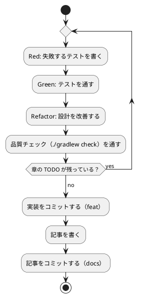

# 第 4 章: バージョン管理とデータ管理

## 4.1 はじめに

第 1 部では、TDD でデータを読み込み、前処理し、決定木で分類するプログラムを作りました。第 2 部では、そのプログラムを「変更を楽に安全にできる」状態に保つための道具立てを、バージョン管理（第 4 章）、パッケージ管理と静的解析（第 5 章）、タスクランナーと CI/CD（第 6 章）の順に整えます。

この章ではバージョン管理を扱います。機械学習のプロジェクトでは、コードに加えて **学習データ** と **学習済みモデル** というファイルが登場します。これらをコードと同じようにコミットしてよいとは限りません。この章では、Git で何を管理し、何を管理しないか、そして実験の結果を再現できるようにするには何を固定すればよいかを学びます。

Git の使い方は言語に依存しないので、[Python 版の第 4 章](../python/04-version-control-and-data-management.md) と同じ構成で進めます。Kotlin 版では、Gradle が作るファイルの除外と、シード付きの乱数が Kotlin のバージョンに依存することに注目してください。

## 4.2 コミットメッセージの重要性

コミット履歴は「なぜこの変更をしたのか」の記録です。機械学習のプロジェクトでは、「前処理を変えたら正解率が変わった」「ライブラリと予測が一致しない原因をテストに残した」といった変化の理由を、あとから追跡できることが特に重要になります。

コミットは次の 2 つを守ると追いやすくなります。

- **1 コミット 1 目的** — 機能追加と設定変更、実装と記事を 1 つのコミットに混ぜない
- **形式をそろえる** — 種類と対象がひと目で分かる書式でメッセージを書く

## 4.3 Conventional Commits

### フォーマット

本シリーズでは [Conventional Commits](https://www.conventionalcommits.org/ja/) の形式でコミットメッセージを書きます。

```text
<type>(<scope>): <subject>

<body>

<footer>
```

`scope` には変更の対象を書きます。本リポジトリでは、言語別の実装なら `kotlin`、記事シリーズなら `getting-start-ml`、Nix の環境定義なら `nix` のように書きます。

### コミットタイプ

| type | 用途 |
|------|------|
| `feat` | 新機能（章の実装など） |
| `fix` | バグ修正 |
| `test` | テストの追加・修正 |
| `refactor` | 振る舞いを変えないコードの変更 |
| `docs` | ドキュメントだけの変更（記事など） |
| `chore` | ビルドやツール、依存関係の変更 |
| `ci` | CI の設定の変更 |

### 実践例

本リポジトリの実際のコミット履歴から、Kotlin 版の計画から第 1 章の CI までを抜き出します（古い順）。

```text
163620d docs(getting-start-ml): Kotlin 版執筆計画を追加
4a88371 chore(nix): Kotlin の開発環境（JDK 21・Kotlin・Gradle）を追加
21f1edd chore(kotlin): Gradle Wrapper 9.7.1 と Kotlin 2.4.20 のプロジェクト雛形を追加
a4b3e11 docs(adr): 002 Kotlin 版の機械学習・データ・可視化・API ライブラリの選定を追加
a8e19f9 chore(kotlin): ktlint のタスクとテスト出力・文字コード・学習データの入力を設定
ac5f2ca feat(kotlin): 第 1 章 きのこ派・たけのこ派をルールで判定する処理を追加
a4b7342 docs(getting-start-ml): Kotlin 版トップと第 1 章を追加
c9c982a docs: Kotlin 版をナビゲーション・シリーズ目次・進捗表に追加
ca88166 ci(kotlin): Nix と Gradle Wrapper で Kotlin のテストと ktlint を実行する
```

`git log --oneline` で見ると、どのコミットが何のための変更かを type と scope だけで区別できます。環境（`chore(nix)`）、ビルドの設定（`chore(kotlin)`）、実装（`feat(kotlin)`）、記事（`docs`）、CI（`ci(kotlin)`）を分けてあるので、たとえば「Gradle の設定だけを追いたい」ときは `chore(kotlin)` のコミットだけを見れば済みます。

## 4.4 何をコミットし、何をコミットしないか

機械学習のプロジェクトには、コミットしてはいけないファイルが増えます。理由は大きく 3 つあります。

| 分類 | 例 | コミットしない理由 |
|------|-----|------------------|
| 再配布できないもの | 学習データ | ライセンスで利用者が限られている |
| 再生成できるもの | ビルド成果物、Gradle のキャッシュ、学習済みモデル、Notebook の出力 | 大きく、差分が読めず、コードとデータから作り直せる |
| 秘匿すべきもの | `.env` の認証情報 | 漏洩すると取り返しがつかない |

### 学習データ

本シリーズの学習データは、書籍『スッキリわかる Python による機械学習入門』の配布データです。配布データの利用は書籍購入者に限られており、本リポジトリは公開されているので、データはコミットしません。ルートの `.gitignore` で、データの置き場所 `apps/data/` をまるごと除外しています。この設定は Python 版・Kotlin 版で共通です。

```text
# 依存関係
node_modules/

# 環境変数（暗号化済みの .env.vault とテンプレートの .env.example は管理対象）
.env

# 学習データ（書籍購入者のみ利用可のため再配布しない。docs/article/getting-start-ml/outline.md を参照）
apps/data/

# ビルド成果物・一時ファイル
site/
tmp/

# IDE・エディタの個人設定
.idea/workspace.xml
.vscode/

# Claude Code の個人設定
.claude/settings.local.json

# OS
.DS_Store
Thumbs.db
```

### Kotlin プロジェクト固有のファイル

`apps/kotlin/.gitignore` では、Gradle と Kotlin が作るディレクトリに加えて、Notebook のチェックポイントと、学習済みモデルの保存先 `model/` を除外しています。

```text
.gradle/
build/
.kotlin/
.ipynb_checkpoints/
model/
```

| パス | 中身 |
|------|------|
| `.gradle/` | Gradle がプロジェクトごとに持つキャッシュ（タスクの実行履歴など） |
| `build/` | コンパイル結果・JAR・テストレポート・Notebook の実行結果（`build/notebooks/`） |
| `.kotlin/` | Kotlin コンパイラのデーモンやセッションの作業ファイル |
| `.ipynb_checkpoints/` | Notebook の自動保存 |
| `model/` | 学習済みモデルの保存先（第 8 章で使う） |

一方で、**Gradle Wrapper のファイルはコミットします**。`gradlew`・`gradlew.bat`・`gradle/wrapper/gradle-wrapper.jar`・`gradle/wrapper/gradle-wrapper.properties` があれば、Gradle を入れていない環境でも、決まった版の Gradle で同じビルドができます。Wrapper は第 5 章で詳しく扱います。

学習済みモデルは、コードと学習データがあれば作り直せます。モデルのファイルをコミットするより、「どのコードとどのデータから、どの設定で作ったか」をコミットで追えるようにするほうが、再現性の面でも役に立ちます。

Notebook の出力セルも同じ理由でコミットしません。出力には学習データの行やグラフが含まれることがあり、データをコミットしない方針に反するからです。出力セルを消す仕組みは第 6 章で扱います。

### 除外されていることを確かめる

`.gitignore` が意図どおりに効いているかは、`git check-ignore -v` で確認できます。どのファイルの何行目の規則で除外されたかが表示されます。

```bash
git check-ignore -v apps/data/sukkiri-ml/iris.csv apps/kotlin/build/ apps/kotlin/.gradle/ apps/kotlin/.kotlin/ apps/kotlin/notebooks/.ipynb_checkpoints/ apps/kotlin/model/ tmp/sukkiri-ml-codes.zip
```

```text
.gitignore:8:apps/data/	apps/data/sukkiri-ml/iris.csv
apps/kotlin/.gitignore:2:build/	apps/kotlin/build/
apps/kotlin/.gitignore:1:.gradle/	apps/kotlin/.gradle/
apps/kotlin/.gitignore:3:.kotlin/	apps/kotlin/.kotlin/
apps/kotlin/.gitignore:4:.ipynb_checkpoints/	apps/kotlin/notebooks/.ipynb_checkpoints/
apps/kotlin/.gitignore:5:model/	apps/kotlin/model/
.gitignore:12:tmp/	tmp/sukkiri-ml-codes.zip
```

ディレクトリのパスは末尾に `/` を付けて指定しています。`.ipynb_checkpoints/` のように末尾が `/` の規則はディレクトリだけに当てはまるので、まだ存在しないパスを `/` なしで調べると、除外されていないように見えます。

データを配置したあとに `git status --short` を実行し、`apps/data/` 以下のファイルが一覧に出てこないことも確かめておきます。

## 4.5 データの入手手順をコードにする

データをコミットしない代わりに、**データの入手と配置の手順** をリポジトリに残します。手順が文章だけだと、人によって置き場所がずれたり、ファイルが足りないまま実行して分かりにくいエラーになったりします。

本リポジトリでは、配置と確認を Gulp のタスクにしています（`ops/scripts/data.js`）。このタスクは言語に依存しないので、Python 版と Kotlin 版で同じものを使います。

```bash
npx gulp data:help
```

```text
学習データ（スッキリわかる Python による機械学習入門 配布データ）

  gulp data:setup   配布 ZIP を展開し、apps\data\sukkiri-ml に学習データを配置する
  gulp data:check   apps\data\sukkiri-ml に学習データが揃っているか確認する
  gulp data:help    このヘルプを表示する

環境変数:
  ML_DATA_ZIP       配布 ZIP のパス（既定 tmp/sukkiri-ml-codes.zip）

配布 ZIP は書籍購入者のみ利用できます。入手先: https://sukkiri.jp/books/sukkiri_ml
学習データはリポジトリにコミットしないでください（apps/data/ は .gitignore 対象）。
```

配布 ZIP を `tmp/` に置いてから `data:setup` を実行し、`data:check` で揃っているかを確かめます。失敗したときの表示は [Python 版の 4.5 節](../python/04-version-control-and-data-management.md) を参照してください。

```bash
npx gulp data:setup
npx gulp data:check
```

### プログラムからデータの場所を知る

Kotlin の実装は、第 1 章で作った `dataset.dataDir` でデータの場所を解決します。環境変数 `ML_DATA_DIR` があればその場所を、無ければ `apps/data/sukkiri-ml/` を使います。

```kotlin
// src/main/kotlin/dataset/Dataset.kt
package dataset

import java.io.File

/** 学習データのディレクトリ。環境変数 ML_DATA_DIR が無ければ apps/data/sukkiri-ml を使う。 */
fun dataDir(getenv: (String) -> String? = System::getenv): File = getenv("ML_DATA_DIR")?.let(::File) ?: File("../data/sukkiri-ml")
```

データの場所をコードに直接書かず、1 か所で解決するようにしておくと、CI や読者の環境など置き場所が違う場合にも環境変数だけで切り替えられます。環境変数を読む関数を引数で受け取る設計にしたので、第 2 章の Notebook からは既定の場所だけを差し替えて使えました。

環境変数を Gradle のテストに渡すところにも注意が必要です。Gradle はタスクの入力が変わらなければテストを再実行しないので、`ML_DATA_DIR` を変えても、前回の結果がそのまま使われてしまいます。`build.gradle.kts` では、環境変数をテストタスクの入力として宣言しています。

```kotlin
tasks.test {
    // ...
    // 学習データの場所（未指定なら ../data/sukkiri-ml）。値が変わればテストを再実行する
    val mlDataDir = providers.environmentVariable("ML_DATA_DIR")
    inputs.property("mlDataDir", mlDataDir.orElse(""))
    mlDataDir.orNull?.let { environment("ML_DATA_DIR", it) }
}
```

### データが無い環境でもテストを通す

コミットしないデータに依存するテストは、データの無い環境（CI や、データをまだ入手していない読者の環境）では失敗してしまいます。Kotlin 版では、JUnit の `Assumptions.assumeTrue` で、データが無ければテストをスキップします。

```kotlin
class IrisDataTest {
    private val csvFile = File(dataDir(), "iris.csv")

    @BeforeTest
    fun requireData() {
        assumeTrue(csvFile.exists(), "学習データ iris.csv が配置されていない（gulp data:setup）")
    }

    // ...
}
```

データの無い場所を `ML_DATA_DIR` に指定すると、スキップされることを確かめられます。

```bash
ML_DATA_DIR=/nonexistent ./gradlew test --tests "chapter03.*"
```

```text
IrisDataTest > 深さ3では多数決が同数の葉に落ちる1件だけTribuoと予測が違う() SKIPPED
IrisDataTest > 深さ2までならTribuoのCARTとテストデータの予測が一致する() SKIPPED
IrisDataTest > 深さ2の決定木はテストデータの45件中42件を正しく分類する() SKIPPED
IrisDataTest > 実行すると深さごとの正解率と深さ2の決定木を表示する() SKIPPED
IrisDataTest > 深さ4以上でも1件だけTribuoと予測が違う() SKIPPED
BUILD SUCCESSFUL in 2s
```

単体テストは架空の値で作ったデータで書き、実データのテストは `assumeTrue` で守る、という 2 段構えにすると、CI ではデータ無しでも品質チェックが回り、手元ではデータを使った確認もできます。単体テストのデータに配布データの行をそのまま写さないことも大切です。テストのコードはコミットされるので、写した行はデータの再配布になってしまいます。

## 4.6 実験を再現できるようにする

機械学習の結果は、コードとデータが同じでも、次のものが違うと変わります。

| 変わる原因 | 固定する方法 | 本リポジトリでの置き場所 |
|-----------|------------|----------------------|
| 乱数（データの分割、モデルの初期値） | シードを指定する | 各章のコード（第 2 章の `seed`、Tribuo のトレーナーの `seed`） |
| ライブラリのバージョン | 版を 1 か所に固定する | `apps/kotlin/gradle/libs.versions.toml`（第 5 章） |
| Kotlin のバージョン | Kotlin の Gradle プラグインの版を固定する | 同上（`kotlin = "2.4.20"`） |
| JDK と Gradle のバージョン | ツールチェーンと Wrapper で固定する | `build.gradle.kts` の `jvmToolchain(21)`、`gradle/wrapper/gradle-wrapper.properties`（第 5 章） |

### 乱数のシード

第 2 章の `splitTrainTest` は、`kotlin.random.Random(seed)` で作った乱数生成器でデータを並べ替えていました。同じシード 0 で 2 回、シード 1 で 1 回、シードを指定せずに 1 回、0〜9 の並べ替えを実行してみます。

```kotlin
import kotlin.random.Random

fun main() {
    println((0 until 10).shuffled(Random(0)))
    println((0 until 10).shuffled(Random(0)))
    println((0 until 10).shuffled(Random(1)))
    println((0 until 10).shuffled())
}
```

2 回実行した結果です。

```text
[9, 7, 1, 5, 2, 8, 3, 6, 0, 4]
[9, 7, 1, 5, 2, 8, 3, 6, 0, 4]
[1, 4, 0, 6, 2, 8, 9, 7, 3, 5]
[8, 0, 4, 2, 5, 7, 9, 3, 6, 1]
```

```text
[9, 7, 1, 5, 2, 8, 3, 6, 0, 4]
[9, 7, 1, 5, 2, 8, 3, 6, 0, 4]
[1, 4, 0, 6, 2, 8, 9, 7, 3, 5]
[4, 2, 5, 7, 9, 3, 0, 6, 8, 1]
```

シードを指定した 3 行は、実行を繰り返しても同じ並びになり、シードを変えると並びが変わります。シードを指定しない最後の行だけが、実行のたびに変わりました。

第 2 章では、この性質を次の 2 つのテストで固定しました。テストがあるので、うっかりシードを使わない実装に変えてしまっても気付けます。

```kotlin
    @Test
    fun `同じシードなら同じ分け方になる`() {
        val (x, t) = numberedDataset(10)

        val first = splitTrainTest(x, t, testSize = 0.3, seed = 42)
        val second = splitTrainTest(x, t, testSize = 0.3, seed = 42)

        assertEquals(first.tTest, second.tTest)
    }

    @Test
    fun `シードが違えば違う分け方になる`() {
        val (x, t) = numberedDataset(10)

        val first = splitTrainTest(x, t, testSize = 0.3, seed = 0)
        val second = splitTrainTest(x, t, testSize = 0.3, seed = 1)

        assertNotEquals(first.tTest, second.tTest)
    }
```

### シードだけでは再現できないもの

シードを固定しても、乱数を作るアルゴリズムが変われば結果は変わります。Kotlin の標準ライブラリのドキュメントは、`Random(seed)` について次のように注意しています。

> Two generators with the same seed produce the same sequence of values within the same version of Kotlin runtime. Note: Future versions of Kotlin may change the algorithm of this seeded number generator so that it will return a sequence of values different from the current one for a given seed.
>
> — [Kotlin API reference: Random](https://kotlinlang.org/api/core/kotlin-stdlib/kotlin.random/-random.html)

同じシードで同じ乱数列になるのは、**同じバージョンの Kotlin の実行時ライブラリ** の間だけです。第 3 章の IrisDataTest が「45 件中 42 件」という数値を固定できているのは、シードに加えて、Kotlin の版をバージョンカタログで 2.4.20 に固定しているからです。Kotlin を上げて数値のテストが失敗したら、まず乱数列が変わっていないかを疑います。

同じ理由で、Python 版と Kotlin 版では、同じシード 0 でもテストデータに入る行が違います。乱数を作るアルゴリズムが NumPy と Kotlin で違うためです。記事に載せる正解率などの数値は、シードと版を固定した実装を実データで動かした結果です。数値をテストで固定するときは、どのシードで得た値かを必ずコードに残します。

## 4.7 TDD とコミットのタイミング

TDD のサイクルとコミットは、次のように対応させると履歴が読みやすくなります。



- テストが通らない状態ではコミットしない
- 実装と記事は別のコミットにする
- 設定や依存関係の変更（`chore`）、CI の変更（`ci`）も、それぞれ別のコミットにする
- 学習データ・モデル・Notebook の出力がステージングされていないことを、コミットの前に `git status` で確かめる

第 3 章の実際の履歴です。実装のあとに、テストの整理（`test`）と、振る舞いを変えない改善（`refactor`）を別のコミットにしてから、記事をコミットしています。

```text
fc90aef feat(kotlin): 第 3 章 決定木の自作と Tribuo の CART との突き合わせを追加
a59f89c feat(kotlin): 第 3 章 決定木を探索する Kotlin Notebook を追加
2e5907b test(kotlin): 第 3 章 Tribuo と予測が違う原因を深さごとにテストで分けて記録する
f511de8 refactor(kotlin): 第 3 章 予測用の事例に Tribuo の未知ラベルを使う
501f233 docs(getting-start-ml): Kotlin 第 3 章 決定木による分類と明白な実装を追加
```

`2e5907b` は、記事を書く準備で実データを調べ直したときに、Tribuo と予測が違う原因が深さによって 2 種類あると分かり、テストを分けたコミットです。実装とテストの修正が別のコミットになっているので、「最初の実装ではどう考えていたか」「何が分かって直したか」を履歴から読み取れます。

## 4.8 まとめ

この章では、機械学習のプロジェクトでのバージョン管理を学びました。

1. **Conventional Commits** — type と scope で、変更の種類と対象が分かるコミットメッセージを書く
2. **コミットしないものを決める** — 再配布できない学習データ、再生成できるビルド成果物・モデル・Notebook の出力、秘匿すべき認証情報を `.gitignore` で除外する。Gradle Wrapper はコミットする
3. **入手手順をコードにする** — データを置く場所と確認方法を Gulp タスクにし、プログラムからは `dataDir` で場所を解決する。環境変数は Gradle のテストの入力として宣言する
4. **データが無くてもテストを通す** — 実データのテストは `assumeTrue` でスキップする
5. **再現性** — 乱数のシードに加えて、Kotlin・ライブラリ・JDK・Gradle の版を固定する。`Random(seed)` の乱数列は Kotlin の版が同じ間だけ再現される

次の章では、ライブラリ・Kotlin・JDK・Gradle の版を固定する Gradle の仕組みと、コードの品質を機械的に確かめる静的解析ツールを扱います。
