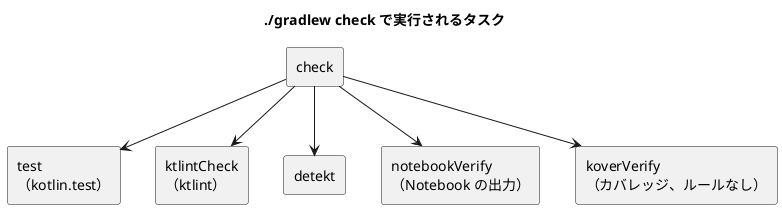
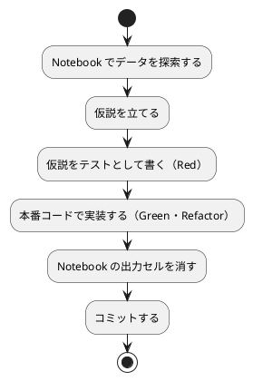
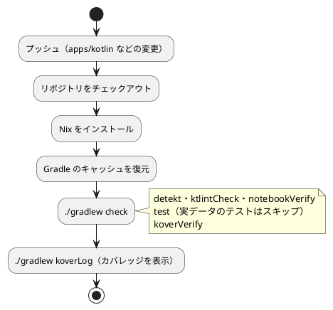

# 第 6 章: タスクランナーと CI/CD

## 6.1 はじめに

第 5 章までで、テスト（kotlin.test）、コードスタイル（ktlint）、静的解析（detekt）、カバレッジ（Kover）がそろいました。ただ、コマンドを覚えて毎回正しい順番で実行するのは手間で、実行し忘れも起きます。

この章では、次の 3 つを整えます。

1. **タスクランナー** — Gradle のタスクで品質チェックに名前を付け、`./gradlew check` の 1 つのコマンドで実行できるようにする
2. **Notebook の運用** — Kotlin Notebook の出力セルを消してからコミットする仕組みを、Gradle のタスクとして作る
3. **CI/CD** — GitHub Actions で、プッシュのたびに同じ品質チェックを自動実行する

最後に、CI に載せる前に手元で起きた問題と、その調べ方を紹介します。

[Python 版の第 6 章](../python/06-task-runner-and-ci-cd.md) では tox をタスクランナーにしました。Kotlin 版では、ビルドツールの Gradle がタスクランナーを兼ねます。

## 6.2 タスクランナー — Gradle

### タスクと check への集約

Gradle では、ビルドの手順を **タスク** として定義します。プラグインが用意するタスク（`test`・`detekt` など）と、`build.gradle.kts` に自分で書いたタスク（`ktlintCheck`・`notebookVerify` など）を、`check` タスクにまとめています。

```kotlin
tasks.named("check") {
    dependsOn("ktlintCheck")
}

// ...

tasks.named("check") {
    dependsOn("notebookVerify")
}
```

`dependsOn` で、「`check` を実行する前に `ktlintCheck` を実行する」という依存関係を宣言します。`test` は Kotlin のプラグインが、`detekt` は detekt のプラグインが、`koverVerify` は Kover のプラグインが、それぞれ自動で `check` に加えます。



検査のタスクの一覧は、`tasks` タスクで表示できます。自分で書いたタスクには `group` と `description` を付けているので、一覧に説明が表示されます。

```bash
./gradlew tasks --group verification
```

```text
Verification tasks
------------------
check - Runs all checks.
...
detekt
...
koverLog - Task to print coverage to log for all code.
...
ktlintCheck - ktlint でコードスタイルを検査する
notebookExecute - kotlin-jupyter-kernel で Notebook を実行する（出力は build/notebooks に書き出す）
notebookVerify - Notebook に出力セルが残っていれば失敗する
test - Runs the test suite.
```

### 章の main を実行する

各章の `main` 関数は、`runChapter` タスクで実行します。

```kotlin
// 章ごとの main を実行する: ./gradlew runChapter -Pchapter=01
tasks.register<JavaExec>("runChapter") {
    group = "application"
    description = "章の main 関数を実行する"
    val chapter = providers.gradleProperty("chapter").orElse("01")
    mainClass.set(chapter.map { "chapter$it.MainKt" })
    classpath = sourceSets["main"].runtimeClasspath
    jvmArgs("-Dfile.encoding=UTF-8", "-Dstdout.encoding=UTF-8")
}
```

- `tasks.register<JavaExec>` は、Java のプログラムを実行するタスクを登録します
- `-Pchapter=03` で渡した値を `providers.gradleProperty("chapter")` で受け取り、`chapter03.MainKt`（`chapter03/Main.kt` の `main` 関数を持つクラス）を実行します
- Kotlin のファイル `Main.kt` のトップレベル関数は、JVM では `MainKt` というクラスの静的メソッドになります

### タスクの実行

```bash
# 品質チェックをまとめて実行する（テスト・ktlint・detekt・Notebook の出力）
./gradlew check

# 個別に実行する
./gradlew test
./gradlew ktlintCheck
./gradlew detekt
./gradlew koverLog

# 整形する（コードと Notebook の出力セル）
./gradlew ktlintFormat
./gradlew notebookStrip

# 章の main を実行する（学習データが必要）
./gradlew runChapter -Pchapter=03

# Notebook を実行して動作を確認する（uv と学習データが必要）
./gradlew notebookExecute
```

Gradle は、入力と出力が前回から変わっていないタスクを実行しません（`UP-TO-DATE`）。2 回目の `./gradlew check` がすぐ終わるのはこのためです。一方で、入力を正しく宣言していないと、変わったはずのタスクまで飛ばされます。この落とし穴は 6.5 節で紹介します。

### 環境変数を Gradle に渡す

Python 版の tox は、既定では環境変数をテストに渡さないので、`passenv` で `ML_DATA_DIR` を渡しました。Gradle のテストタスクには環境変数がそのまま引き継がれますが、第 4 章で見たとおり、テストの **入力** として宣言しないと、値を変えてもテストが再実行されません。

```kotlin
    // 学習データの場所（未指定なら ../data/sukkiri-ml）。値が変わればテストを再実行する
    val mlDataDir = providers.environmentVariable("ML_DATA_DIR")
    inputs.property("mlDataDir", mlDataDir.orElse(""))
    mlDataDir.orNull?.let { environment("ML_DATA_DIR", it) }
```

## 6.3 Notebook による探索と出力セルの削除

### Kotlin Notebook でデータを探索する

Notebook は `apps/kotlin/notebooks/` に置いています。IntelliJ IDEA で開くと、Kotlin Notebook として実行できます。Notebook からは、`./gradlew jar` で作ったプロジェクトの JAR を読み込み、テスト済みの関数を呼びます。

```kotlin
%use dataframe(0.15.0), kandy(0.8.0)
@file:DependsOn("../build/libs/getting-started-ml.jar")
```

Notebook の中で前処理や学習の処理を書き直すと、テストで守られたコードと Notebook のコードが別々に育ってしまいます。Notebook は、テスト済みのコードを使ってデータを **見る** 場所にします。

### Notebook で分かったことをテストに移す

Notebook は探索の場所であり、そこで分かったことは Notebook に残しただけでは守られません。次の流れで、分かったことをテストと本番コードに移します。



第 3 章では、Notebook で深さごとに Tribuo と予測が違う件数を表にしました。深さ 3〜7 で 1 件ずつ違うという結果は、Notebook だけに残さず、「深さ 3 では多数決が同数の葉に落ちる 1 件だけ違う」「深さ 4 以上でも 1 件だけ違う」という実データのテストにしています。

### 出力セルを消してからコミットする

Notebook のファイル（`.ipynb`）には、コードに加えて実行結果（表・グラフ）が保存されます。出力を残したままコミットすると、次の問題が起きます。

- 出力に学習データの行が含まれ、データをコミットしない方針（第 4 章）に反する
- グラフのデータでファイルが大きくなり、差分が読めなくなる

Python 版では nbstripout を使いましたが、Kotlin 版では Python のツールに頼らず、Gradle のタスクで出力セルを検査・削除します。`.ipynb` の中身は JSON なので、Gradle に同梱されている Groovy の JSON ライブラリで読み書きできます。

```kotlin
// Notebook の出力セルには学習データが含まれうるので、出力を消してからコミットする
val notebooks = fileTree("notebooks") { include("*.ipynb") }

fun codeCells(notebook: Map<*, *>): List<MutableMap<String, Any?>> =
    (notebook["cells"] as List<*>)
        .map {
            @Suppress("UNCHECKED_CAST")
            it as MutableMap<String, Any?>
        }.filter { it["cell_type"] == "code" }

fun hasOutputs(cell: Map<String, Any?>): Boolean = (cell["outputs"] as? List<*>).orEmpty().isNotEmpty() || cell["execution_count"] != null
```

- `fileTree("notebooks") { include("*.ipynb") }` は、`notebooks/` 以下の Notebook のファイルの集まりです
- `codeCells` は、セルのうちコードのセルだけを取り出します。JSON を読んだ結果は型の決まっていない `Map` と `List` なので、`as` で型を指定しています
- `hasOutputs` は、出力（`outputs`）があるか、実行番号（`execution_count`）が残っていれば、そのセルは実行済みだと判定します。実行番号だけでも、差分が生まれる原因になります

検査のタスクは、出力セルが残っている Notebook があれば失敗します。

```kotlin
tasks.register("notebookVerify") {
    group = "verification"
    description = "Notebook に出力セルが残っていれば失敗する"
    inputs.files(notebooks)
    doLast {
        val dirty =
            notebooks.files.filter { file ->
                codeCells(groovy.json.JsonSlurper().parse(file) as Map<*, *>).any(::hasOutputs)
            }
        if (dirty.isNotEmpty()) {
            throw GradleException("出力セルが残っている Notebook: ${dirty.joinToString { it.name }}（./gradlew notebookStrip で消す）")
        }
    }
}
```

失敗のメッセージには、消し方（`./gradlew notebookStrip`）も書いています。CI で失敗したときに、次に何をすればよいかが分かるようにするためです。

削除のタスクは、出力が残っている Notebook だけを書き直します。

```kotlin
tasks.register("notebookStrip") {
    group = "formatting"
    description = "Notebook の出力セルを消す"
    doLast {
        notebooks.files.forEach { file ->
            @Suppress("UNCHECKED_CAST")
            val notebook = groovy.json.JsonSlurper().parse(file) as MutableMap<String, Any?>
            val cells = codeCells(notebook)
            if (cells.any(::hasOutputs)) {
                cells.forEach { cell ->
                    cell["outputs"] = emptyList<Any>()
                    cell["execution_count"] = null
                }
                val json =
                    groovy.json.JsonGenerator
                        .Options()
                        .disableUnicodeEscaping()
                        .build()
                        .toJson(notebook)
                file.writeText(groovy.json.JsonOutput.prettyPrint(json, true) + "\n", Charsets.UTF_8)
                println("出力セルを消した: ${file.name}")
            }
        }
    }
}
```

- `disableUnicodeEscaping()` を指定しないと、日本語が `第` のようなエスケープで書き出され、Notebook の差分が読めなくなります
- `prettyPrint` で字下げして書き出し、1 行が長い JSON にならないようにしています
- 出力の無い Notebook は書き直さないので、書式だけの差分が生まれません

```bash
./gradlew notebookStrip
./gradlew notebookVerify
```

### IDE なしで Notebook を実行する

Notebook がテスト済みのコードの変更で動かなくなっていないかは、IntelliJ IDEA を使わずに確かめられます。[uv](https://docs.astral.sh/uv/) で Kotlin の Jupyter カーネル（kotlin-jupyter-kernel）と nbconvert を一時的に取得し、Notebook を実行します。

```kotlin
// Notebook を IDE なしで実行して動作を確認する（手元専用。uv と学習データが必要）
tasks.register("notebookExecute") {
    group = "verification"
    description = "kotlin-jupyter-kernel で Notebook を実行する（出力は build/notebooks に書き出す）"
    dependsOn("jar")
    doLast {
        notebooks.files.sortedBy { it.name }.forEach { file ->
            println("実行: ${file.name}")
            providers
                .exec {
                    workingDir = file.parentFile
                    commandLine(
                        "uvx",
                        "--python",
                        "3.12",
                        "--from",
                        "nbconvert",
                        "--with",
                        "kotlin-jupyter-kernel",
                        "--with",
                        "ipykernel",
                        "jupyter-nbconvert",
                        "--to",
                        "notebook",
                        "--execute",
                        "--output-dir",
                        layout.buildDirectory
                            .dir("notebooks")
                            .get()
                            .asFile.absolutePath,
                        file.name,
                    )
                }.result
                .get()
                .assertNormalExitValue()
        }
    }
}
```

- `dependsOn("jar")` で、Notebook が読み込む JAR を先に作ります
- 実行結果は `build/notebooks/` に書き出し、`notebooks/` の元のファイルは変えません。出力セルの付いたファイルがコミットされる心配がありません
- 学習データと uv が必要なので、CI では実行しません。`check` にも含めていません

```bash
./gradlew notebookExecute
```

```text
実行: chapter02_iris_exploration.ipynb
実行: chapter03_decision_tree_exploration.ipynb
BUILD SUCCESSFUL in 39s
```

## 6.4 GitHub Actions による CI

### ワークフロー設定

プッシュのたびに品質チェックを自動実行するため、`.github/workflows/kotlin-ci.yml` を用意しています。

```yaml
name: Kotlin CI

on:
  push:
    branches: [main, develop]
    paths:
      - "apps/kotlin/**"
      - ".github/workflows/kotlin-ci.yml"
      - "ops/nix/environments/kotlin/**"
      - "flake.nix"
      - "flake.lock"
  pull_request:
    branches: [main]
    paths:
      - "apps/kotlin/**"
      - ".github/workflows/kotlin-ci.yml"
      - "ops/nix/environments/kotlin/**"
      - "flake.nix"
      - "flake.lock"

permissions:
  contents: read

jobs:
  test:
    runs-on: ubuntu-latest

    steps:
      - name: Checkout the repository
        uses: actions/checkout@v4

      - name: Install Nix
        uses: cachix/install-nix-action@v30
        with:
          nix_path: nixpkgs=channel:nixos-unstable

      - name: Cache Gradle
        uses: actions/cache@v4
        with:
          path: |
            ~/.gradle/caches
            ~/.gradle/wrapper
          key: ${{ runner.os }}-gradle-kotlin-${{ hashFiles('apps/kotlin/**/*.gradle.kts', 'apps/kotlin/gradle/libs.versions.toml', 'apps/kotlin/gradle/wrapper/gradle-wrapper.properties') }}
          restore-keys: |
            ${{ runner.os }}-gradle-kotlin-

      # 学習データは再配布できないため CI には配置しない。実データのテストはスキップされる
      - name: Run tests, ktlint, detekt and Notebook output check
        run: nix develop .#kotlin --command bash -c "cd apps/kotlin && ./gradlew check --console=plain"

      # 実データのテストがスキップされるので、手元より低い値になる。下限は設けず表示だけする
      - name: Show coverage
        run: nix develop .#kotlin --command bash -c "cd apps/kotlin && ./gradlew koverLog --console=plain"
```

### ワークフローのポイント

- **`paths` で対象を絞る** — Kotlin の実装・このワークフロー・Nix の環境定義が変わったときだけ実行します。記事だけの変更や、ほかの言語の変更では実行されません
- **Nix で環境をそろえる** — `nix develop .#kotlin` で、`ops/nix/environments/kotlin/shell.nix` に定義した環境（JDK 21・Kotlin・Gradle）に入ってからコマンドを実行します
- **Gradle は Wrapper を使う** — Nix の環境にも Gradle（執筆時点では 8.14.3）が入っていますが、CI では `./gradlew` を使い、Wrapper で固定した Gradle 9.7.1 でビルドします。Wrapper は第 5 章で設定したチェックサムでダウンロードした Gradle を検証します
- **Gradle のキャッシュを使う** — ダウンロードした Gradle と依存ライブラリ（`~/.gradle/caches`・`~/.gradle/wrapper`）を保存します。キャッシュのキーには、依存ライブラリの版を決めるファイル（`*.gradle.kts`・`libs.versions.toml`・Wrapper の設定）のハッシュを使い、版を変えたら新しいキャッシュになるようにしています
- **手元と同じコマンドを使う** — 各ステップは手元と同じ `./gradlew check` と `./gradlew koverLog` を実行します
- **学習データは置かない** — 学習データは再配布できないので CI には置きません。実データのテストは `assumeTrue` でスキップされます

Gradle デーモンの JDK（第 5 章）は、Nix の環境の JDK 21 が条件を満たすので、CI で JDK がダウンロードされることはありませんでした。

### CI パイプラインの流れ



第 5 章の設定を入れた時点で、CI が成功したときのログの一部です。

```text
Kotlin development environment activated
  - JDK: javac 21.0.9
Welcome to Gradle 9.7.1!
Starting a Gradle Daemon (subsequent builds will be faster)
> Task :detekt
> Task :ktlintCheck
> Task :notebookVerify
> Task :compileKotlin
> Task :jar
> Task :compileTestKotlin
> Task :test
> Task :koverVerify
> Task :check
BUILD SUCCESSFUL in 28s
```

```text
> Task :koverPrintCoverage
application line coverage: 82.3529%
```

CI には学習データが無いので、テストは 43 件が成功し、実データのテスト 11 件がスキップされました。カバレッジは、第 5 章で手元のデータなしの環境で計測した値と同じ 82.3529% です。

## 6.5 CI に載せる前に起きた問題を調べる

Python 版では、CI だけで起きた問題を紹介しました。Kotlin CI は、執筆時点まで一度も失敗していません。その代わりに、手元でビルドを整える間に 3 つの問題が起きています。そのうち 2 つは、同じ見た目のエラーでした。

### 1 つ目: Wrapper の生成が「25.0.2」とだけ表示して失敗する

Kotlin のプロジェクトを作り始めたとき、手元にあった Gradle 8.11.1 で Wrapper を生成しようとしました。

```bash
gradle wrapper --gradle-version 9.7.1 --distribution-type bin
```

```text
FAILURE: Build failed with an exception.

* What went wrong:
25.0.2
```

エラーメッセージは `25.0.2` だけです。これは手元の JDK のバージョン番号（`java -version` の結果は `openjdk version "25.0.2"`）と一致していました。そこで「Gradle 8.11.1 が JDK 25 を扱えない」と仮説を立て、Gradle の互換性表を確認しました。表によると、Gradle を JDK 25 で動かせるのは Gradle 9.1.0 以降です。

手元にあった JDK 21 を `JAVA_HOME` に指定して同じコマンドを実行すると、Wrapper を生成できました。生成した Wrapper は Gradle 9.7.1 を使うので、それ以降は JDK 25 のままでも `./gradlew` が動きました。

### 2 つ目: 学習データの場所を変えてもテストがスキップされない

第 1 章で、実データのテストを `assumeTrue` でスキップできるようにしたあと、データの無い場所を指定してスキップされるかを確かめました。

```bash
ML_DATA_DIR=/nope ./gradlew test --console=plain
```

```text
> Task :checkKotlinGradlePluginConfigurationErrors SKIPPED
BUILD SUCCESSFUL in 1s
```

`SKIPPED` と表示されたのはタスクで、テストの結果は 1 件も表示されていません。テストのタスクそのものが実行されていなかったのです。直前にデータのある状態でテストを実行していたので、Gradle は「入力（ソースコードとクラスパス）が変わっていない」と判断し、`test` タスクを `UP-TO-DATE` として飛ばしていました。環境変数の値は、テストの入力として宣言しない限り、Gradle の判断に使われません。

6.2 節のとおり、`ML_DATA_DIR` を `inputs.property` でテストの入力として宣言すると、値を変えたときにテストが再実行され、実データのテストがスキップされることを確かめられました。この問題は、CI では起きません。CI は毎回まっさらな環境で、データの無い状態でしかテストを実行しないからです。手元でだけ起き、しかも「失敗しない」という形で現れるので、見逃しやすい問題でした。

### 3 つ目: detekt が「25.0.2」とだけ表示して失敗する

第 5 章で detekt を追加したとき、1 つ目と同じ `25.0.2` だけのエラーが出ました。

```text
* What went wrong:
Execution failed for task ':detekt' (registered by plugin 'io.gitlab.arturbosch.detekt').
> 25.0.2
```

1 つ目の経験から、「JDK 25 で動いている何かが、JDK のバージョン番号を解釈できていない」と見当を付けられました。今回は Gradle 9.7.1 自体は JDK 25 に対応しているので、疑うべきは Gradle デーモンの中で動く detekt 1.23.8 です。JDK 21 で Gradle を起動すると detekt が解析まで進んだので、仮説が確かめられました。

1 つ目は手元でだけ `JAVA_HOME` を切り替えれば済みましたが、detekt は `./gradlew check` のたびに動くので、読者の環境でも同じ問題が起きます。そこで、第 5 章のとおり `gradle/gradle-daemon-jvm.properties` で Gradle デーモンの JDK を 21 に固定し、手元の設定に頼らずに済むようにしました。

### 問題を起こさないための準備

CI に載せる前に、手元の Windows では起きないが CI（Linux）では起きる問題を 2 つ、先回りして防いでいます。

- **`gradlew` の実行権限** — Windows のファイルシステムには実行権限が無いので、そのままコミットすると Git には実行権限の無いファイルとして記録され、Linux の CI で `./gradlew` を実行できません。最初のコミットで `git update-index --chmod=+x apps/kotlin/gradlew` を実行し、実行権限付き（`100755`）で記録しました
- **`gradlew` の改行コード** — `.gitattributes` で LF に固定しました（第 5 章）

```bash
git ls-files -s apps/kotlin/gradlew
```

```text
100755 249efbb032ce46a80c687c0723eb172e85f6a136 0	apps/kotlin/gradlew
```

### この経緯から学べること

- **短すぎるエラーメッセージは、周りの事実と突き合わせる** — `25.0.2` だけでは原因が分かりませんが、手元の JDK の版と一致することに気づくと、仮説を立てられました
- **一度調べた症状は、次に速く解ける** — 3 つ目は 1 つ目と同じ症状だったので、すぐに JDK の版を疑えました。問題と対処をコミットメッセージや記事に残しておくと、次の自分やチームの助けになります
- **「失敗しない」も疑う** — 2 つ目は、期待したスキップが表示されないという形で現れました。テストの結果が表示されないときは、テストが実行されたかどうかから確かめます
- **その場しのぎと恒久対策を分ける** — 1 つ目は一度きりの作業なので `JAVA_HOME` の切り替えで済ませ、3 つ目は毎回のビルドに関わるので設定ファイルで固定しました

## 6.6 三種の神器と CI

第 4〜6 章で整えたものを、ソフトウェア開発の「三種の神器」（バージョン管理・テスティング・自動化）に当てはめると次のようになります。

| 三種の神器 | 道具 | 本シリーズでの使い方 |
|-----------|------|------------------|
| バージョン管理 | Git、Conventional Commits、`.gitignore`、`.gitattributes` | 学習データ・ビルド成果物・Notebook の出力をコミットしない。Gradle Wrapper はコミットする |
| テスティング | kotlin.test、JUnit Platform、Kover | 単体テストは架空の値、実データのテストは `assumeTrue` でスキップ可能にする |
| 自動化 | Gradle（Wrapper・バージョンカタログ・タスク）、ktlint、detekt、GitHub Actions、Nix、Gulp | 環境の再現、品質チェックの一括実行、Notebook の出力の検査、データの配置、CI |

### 利用可能なコマンド一覧

| コマンド | 内容 | 実行する場所 |
|---------|------|------------|
| `npx gulp data:setup` | 学習データを配置する | リポジトリのルート |
| `npx gulp data:check` | 学習データの配置を確認する | リポジトリのルート |
| `./gradlew check` | テスト・ktlint・detekt・Notebook の出力検査をまとめて実行する | `apps/kotlin` |
| `./gradlew ktlintFormat` | コードを整形する | `apps/kotlin` |
| `./gradlew notebookStrip` | Notebook の出力セルを消す | `apps/kotlin` |
| `./gradlew koverLog` | カバレッジを表示する | `apps/kotlin` |
| `./gradlew runChapter -Pchapter=03` | 章の `main` を実行する | `apps/kotlin` |
| `./gradlew notebookExecute` | Notebook を実行して動作を確認する | `apps/kotlin` |

Windows の PowerShell では、`./gradlew` の代わりに `.\gradlew.bat` を使います。

## 6.7 まとめ

この章では、品質チェックを自動化し、どの環境でも同じ手順で実行できるようにしました。

1. **Gradle のタスク** — 品質チェックを `check` にまとめ、自分で書いたタスクには `group` と `description` を付ける。環境変数はテストの入力として宣言する
2. **Notebook の運用** — テスト済みのコードを JAR で読み込み、分かったことはテストに移す。出力セルは `notebookStrip` で消し、`notebookVerify` を `check` と CI で検査する
3. **GitHub Actions** — Nix で環境をそろえ、手元と同じ `./gradlew check` を実行する。学習データの無い CI では実データのテストがスキップされ、カバレッジは表示だけにする
4. **問題の調べ方** — 短いエラーメッセージは周りの事実と突き合わせ、同じ症状の経験を生かし、「失敗しない」ことも疑う

第 2 部で、TDD を回し続けるための道具立てがそろいました。次の第 3 部では、回帰問題と、欠損値・カテゴリ値・外れ値を含む現実的なデータの前処理に取り組みます。
