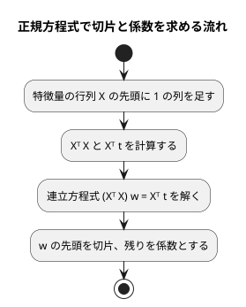

# 第 7 章: 線形回帰による数値予測

## 7.1 はじめに

第 1〜3 章では「きのこ派かたけのこ派か」「アヤメのどの品種か」という、グループを当てる **分類** を扱いました。この章からは、数値そのものを当てる **回帰** に進みます。題材は、映画の SNS での反響や主演俳優の露出度から、興行収入を予測する問題です。

この章では、最も基本的な回帰モデルである **線形回帰** を自作します。Python 版は NumPy の行列演算を使いましたが、Kotlin 版では行列の型そのものを TDD で作ります。**演算子オーバーロード** で `a * b` と書ける行列の積を用意し、連立方程式を解く処理まで実装したうえで、正規方程式で切片と係数を求めます。

次に、Tribuo の線形回帰に置き換えて結果を突き合わせます。[Python 版の第 7 章](../python/07-linear-regression.md) と同じく、外れ値の除去と回帰の評価指標（MAE・RMSE・決定係数 R²）も実装します。

## 7.2 線形回帰とは

### 特徴量の重み付きの和で予測する

線形回帰は、予測値を「切片」と「特徴量ごとの係数 × 特徴量」の和で表すモデルです。この章のデータに当てはめると次の式になります。

```text
予測値 = 切片 + 係数1 × SNS1 + 係数2 × SNS2 + 係数3 × actor + 係数4 × original
```

学習とは、訓練データに対して予測値と実測値のずれが最も小さくなるように、切片と係数を決めることです。ずれの大きさには「誤差の 2 乗の合計」を使います。これを最小にする方法を **最小二乗法** と呼びます。

### 正規方程式

最小二乗法の解は、行列を使うと 1 つの式で求められます。特徴量を行列 `X`、実測値をベクトル `t`、切片と係数をまとめたベクトルを `w` とすると、誤差の 2 乗の合計を最小にする `w` は次の **正規方程式** を満たします。

```text
(Xᵀ X) w = Xᵀ t
```

`X` の先頭には、すべての値が 1 の列を足しておきます。この列にかかる係数が切片になります。



この流れに必要な行列の操作は、**積**・**転置**・**連立方程式を解く** の 3 つです。Kotlin の標準ライブラリには行列の型が無いので、この 3 つを持つ小さな行列型を自作します。逆行列を作らずに連立方程式として解くのは、Python 版と同じく、そのほうが数値計算の誤差が小さくなるためです。

## 7.3 題材とデータ

この章で使うのは `cinema.csv` です。100 本の映画について、次の 6 列が記録されています。

| 列 | 内容 | 値の範囲 | 欠損値 | Kotlin DataFrame での型 |
|----|------|---------|-------|-----------------------|
| cinema_id | 映画の ID | 1000〜1989 | なし | `Int` |
| SNS1 | SNS での反響の数（1 つ目の指標） | 0〜1000 | 1 件 | `Int?` |
| SNS2 | SNS での反響の数（2 つ目の指標） | 0〜1500 | なし | `Int` |
| actor | 主演俳優のメディア露出の指標 | 約 5703〜約 12665 | 1 件 | `Double?` |
| original | 原作の有無 | 0 または 1 | なし | `Int` |
| sales | 興行収入 | 7869〜11405 | なし | `Int` |

「SNS1」「SNS2」「actor」「original」が特徴量、「sales」が正解ラベル（予測したい数値）です。`cinema_id` は映画を区別するための番号なので、特徴量には使いません。

型の列に注目してください。SNS1 は整数の列に欠損値が混ざっているので `Int?` になります。この型が、7.11 節で思わぬ問題を起こします。

このデータには、SNS2 の値が大きいのに興行収入が低い、傾向から外れた映画が 1 本含まれています。このような **外れ値** は、最小二乗法の結果を大きく引っ張ります。誤差を 2 乗して足し合わせるので、大きく外れた 1 点の影響が大きくなるためです。

## 7.4 TODO リストの作成

**TODO リスト**:

- [ ] cinema.csv を読み込む
- [ ] 外れ値を取り除く
  - [ ] SNS2 が 1000 を超え、興行収入が 8500 未満の行を取り除く
  - [ ] 条件の片方だけを満たす行は残す
- [ ] 行列型を作る
  - [ ] 行列の積を求める
  - [ ] 転置行列を求める
  - [ ] 連立方程式を解く
- [ ] 正規方程式で線形回帰を学習する
  - [ ] 直線上の点から切片と係数を求める
  - [ ] 複数の特徴量から切片と係数を求める
- [ ] 学習したモデルで予測する
- [ ] 評価指標を計算する（MAE・RMSE・R²）
- [ ] Tribuo と結果が一致することを確かめる
- [ ] 外れ値の除去・分割・補完をまとめる
- [ ] 実データで学習・評価して表示する

外れ値の条件「SNS2 が 1000 を超え、興行収入が 8500 未満」は、書籍『スッキリわかる Python による機械学習入門』の同じデータでの分析手順に合わせたものです。散布図で外れ値を確かめる手順は、7.13 節の Notebook で扱います。

## 7.5 データを読み込み外れ値を取り除く

### 読み込み

テストでは、架空の値を書いた CSV を一時ディレクトリに作ります。外れ値のテストもあわせて書き、まとめて Red を確認します。

```kotlin
// src/test/kotlin/chapter07/CinemaRegressionTest.kt
private const val HEADER = "cinema_id,SNS1,SNS2,actor,original,sales\n"

class LoadCinemaTest {
    private val directory: Path = createTempDirectory()

    @Test
    fun `CSVを読み込み空欄を欠損値にする`() {
        val csvFile = File(directory.toFile(), "cinema.csv").apply { writeText(HEADER + "1,,500,9000.5,1,9500\n") }

        val df = loadCinema(csvFile)

        assertEquals(listOf("cinema_id", "SNS1", "SNS2", "actor", "original", "sales"), df.columnNames())
        assertNull(df["SNS1"][0])
    }
}

class RemoveOutliersTest {
    @Test
    fun `SNS2が1000を超え売上が8500未満の行を取り除く`() {
        val df = dataFrameOf("SNS2" to listOf(1200, 600), "sales" to listOf(8000, 9500))

        assertEquals(listOf(600), removeOutliers(df)["SNS2"].toList())
    }
}
```

```text
e: .../src/test/kotlin/chapter07/CinemaRegressionTest.kt:20:18 Unresolved reference 'loadCinema'.
e: .../src/test/kotlin/chapter07/CinemaRegressionTest.kt:23:30 No 'get' operator method providing array access.
e: .../src/test/kotlin/chapter07/CinemaRegressionTest.kt:32:35 Unresolved reference 'removeOutliers'.
e: .../src/test/kotlin/chapter07/CinemaRegressionTest.kt:32:62 Unresolved reference 'toList' on receiver of type 'MatchGroup?'.
```

4 行目には、この章と関係の無い `MatchGroup?` という型名が出ています。関数が無いと、後ろに続く式の型も決まらないので、エラーが連鎖して見当違いの型名が表示されることがあります。まず最初のエラーから読みます。

### Green: まず片方の条件だけで取り除く

読み込みは第 2 章と同じく `DataFrame.readCSV` で足ります。外れ値の除去は、まず最初のテストが通る最小の実装として、SNS2 の条件だけで絞り込みます。

```kotlin
// src/main/kotlin/chapter07/CinemaRegression.kt
fun loadCinema(csvFile: File): AnyFrame = DataFrame.readCSV(csvFile)

fun removeOutliers(df: AnyFrame): AnyFrame = df.filter { (it["SNS2"] as Number).toDouble() <= 1000 }
```

`filter` は、ラムダが `true` を返した行だけを残した **新しい** データフレームを返します。ラムダの `it` は 1 行分のデータ（`DataRow`）です。

### 三角測量: 条件の片方だけを満たす行は残す

SNS2 が大きくても、興行収入も高ければ傾向どおりのデータです。2 つ目の例でこれを確かめます。

```kotlin
    @Test
    fun `条件の片方だけを満たす行は残す`() {
        val df = dataFrameOf("SNS2" to listOf(1200, 600), "sales" to listOf(9800, 8000))

        assertEquals(listOf(1200, 600), removeOutliers(df)["SNS2"].toList())
    }
```

```text
LoadCinemaTest > CSVを読み込み空欄を欠損値にする() PASSED
RemoveOutliersTest > SNS2が1000を超え売上が8500未満の行を取り除く() PASSED
RemoveOutliersTest > 条件の片方だけを満たす行は残す() FAILED
    org.opentest4j.AssertionFailedError: expected: <[1200, 600]> but was: <[600]>
3 tests completed, 1 failed
BUILD FAILED in 6s
```

外れ値の判定を、行の型 `AnyRow` の **拡張関数** として名前を付けます。

```kotlin
private fun AnyRow.isOutlier(): Boolean = (this["SNS2"] as Number).toDouble() > 1000 && (this["sales"] as Number).toDouble() < 8500

fun removeOutliers(df: AnyFrame): AnyFrame = df.filter { !it.isOutlier() }
```

`df.filter { !it.isOutlier() }` が「外れ値ではない行を残す」と読めるようになりました。Python 版の `is_outlier` という変数名と同じ役割を、Kotlin では拡張関数の名前が担っています。`private` なので、このファイルの外からは見えません。

## 7.6 行列型を作る

### 行列の積: 仮実装

行列は、行のリストのリスト `List<List<Double>>` を持つ data class で表します。data class にすると `equals` が自動で作られるので、テストで行列同士をそのまま比べられます。

```kotlin
// src/test/kotlin/chapter07/MatrixTest.kt
class MatrixTimesTest {
    @Test
    fun `行列の積を求める`() {
        val a = Matrix(listOf(listOf(1.0, 2.0), listOf(3.0, 4.0)))
        val b = Matrix(listOf(listOf(5.0, 6.0), listOf(7.0, 8.0)))

        assertEquals(Matrix(listOf(listOf(19.0, 22.0), listOf(43.0, 50.0))), a * b)
    }
}
```

```text
e: .../src/test/kotlin/chapter07/MatrixTest.kt:9:17 Unresolved reference 'Matrix'.
e: .../src/test/kotlin/chapter07/MatrixTest.kt:10:17 Unresolved reference 'Matrix'.
e: .../src/test/kotlin/chapter07/MatrixTest.kt:12:9 Cannot infer type for type parameter 'T'. Specify it explicitly.
e: .../src/test/kotlin/chapter07/MatrixTest.kt:12:22 Unresolved reference 'Matrix'.
```

`a * b` と書くために、`operator` 修飾子を付けた `times` 関数を定義します。仮実装では期待値をそのまま返します。

```kotlin
// src/main/kotlin/chapter07/Matrix.kt
data class Matrix(
    val rows: List<List<Double>>,
) {
    operator fun times(other: Matrix): Matrix = Matrix(listOf(listOf(19.0, 22.0), listOf(43.0, 50.0)))
}
```

Kotlin では、決められた名前の関数に `operator` を付けると、対応する演算子で呼び出せます（**演算子オーバーロード**）。`a * b` は `a.times(b)` と同じ意味です。

| 演算子 | 関数名 |
|-------|-------|
| `a + b` | `plus` |
| `a - b` | `minus` |
| `a * b` | `times` |
| `a[i]` | `get` |

### 三角測量: 行数と列数が違う行列

2 行 3 列の行列と 3 行 1 列の行列の積は、2 行 1 列になります。

```kotlin
    @Test
    fun `行数と列数が違う行列の積を求める`() {
        val a = Matrix(listOf(listOf(1.0, 2.0, 3.0), listOf(4.0, 5.0, 6.0)))
        val b = Matrix(listOf(listOf(1.0), listOf(0.0), listOf(2.0)))

        assertEquals(Matrix(listOf(listOf(7.0), listOf(16.0))), a * b)
    }
```

```text
MatrixTimesTest > 行数と列数が違う行列の積を求める() FAILED
    org.opentest4j.AssertionFailedError: expected: <Matrix(rows=[[7.0], [16.0]])> but was: <Matrix(rows=[[19.0, 22.0], [43.0, 50.0]])>
MatrixTimesTest > 行列の積を求める() PASSED
5 tests completed, 1 failed
BUILD FAILED in 12s
```

積の i 行 j 列は、「左の行列の i 行目」と「右の行列の j 列目」の対応する要素を掛けて足したものです。列を取り出すプロパティ `columns` を用意すると、定義どおりに書けます。

```kotlin
data class Matrix(
    val rows: List<List<Double>>,
) {
    val columns: List<List<Double>>
        get() = rows.first().indices.map { j -> rows.map { it[j] } }

    operator fun times(other: Matrix): Matrix =
        Matrix(rows.map { row -> other.columns.map { column -> row.zip(column).sumOf { (a, b) -> a * b } } })
}
```

- `val columns` の `get()` は、読むたびに計算するプロパティ（カスタムゲッター）です
- `row.zip(column)` で行と列の要素を組にし、`sumOf { (a, b) -> a * b }` で掛けて足します

### 積を求められない場合と転置

左の列数と右の行数が違う行列は掛けられません。このときは例外にします。あわせて、行と列を入れ替える転置のテストも書きます。

```kotlin
    @Test
    fun `左の列数と右の行数が違えば積を求められない`() {
        val a = Matrix(listOf(listOf(1.0, 2.0)))

        val error = assertFailsWith<IllegalArgumentException> { a * a }

        assertEquals("左の行列の列数 2 と右の行列の行数 1 が違います", error.message)
    }
```

```kotlin
class MatrixTransposeTest {
    @Test
    fun `行と列を入れ替える`() {
        val a = Matrix(listOf(listOf(1.0, 2.0, 3.0), listOf(4.0, 5.0, 6.0)))

        assertEquals(Matrix(listOf(listOf(1.0, 4.0), listOf(2.0, 5.0), listOf(3.0, 6.0))), a.transpose())
    }
}
```

```text
e: .../src/test/kotlin/chapter07/MatrixTest.kt:39:94 Unresolved reference 'transpose' on receiver of type 'Matrix'.
```

```kotlin
    operator fun times(other: Matrix): Matrix {
        require(columns.size == other.rows.size) { "左の行列の列数 ${columns.size} と右の行列の行数 ${other.rows.size} が違います" }
        return Matrix(rows.map { row -> other.columns.map { column -> row.zip(column).sumOf { (a, b) -> a * b } } })
    }

    fun transpose(): Matrix = Matrix(columns)
```

転置行列は「列を行として並べた行列」なので、`columns` をそのまま行にするだけです。

### 連立方程式を解く: 仮実装と三角測量

`2x + y = 3`、`x + 3y = 5` の解は `x = 0.8`、`y = 1.4` です。行列で書くと `A w = b` の形になります。計算誤差を許して比べるため、要素ごとに `absoluteTolerance` で比べるテスト用の関数を用意します。

```kotlin
private fun assertMatrixEquals(
    expected: Matrix,
    actual: Matrix,
) {
    assertEquals(expected.rows.size, actual.rows.size)
    expected.rows
        .flatten()
        .zip(actual.rows.flatten())
        .forEach { (e, a) -> assertEquals(e, a, absoluteTolerance = 1e-9) }
}

class MatrixSolveTest {
    @Test
    fun `連立方程式の解を求める`() {
        val a = Matrix(listOf(listOf(2.0, 1.0), listOf(1.0, 3.0)))
        val b = Matrix(listOf(listOf(3.0), listOf(5.0)))

        assertMatrixEquals(Matrix(listOf(listOf(0.8), listOf(1.4))), a.solve(b))
    }
}
```

```text
e: .../src/test/kotlin/chapter07/MatrixTest.kt:57:72 Unresolved reference 'solve' on receiver of type 'Matrix'.
```

仮実装で Green にします。

```kotlin
    fun solve(b: Matrix): Matrix = Matrix(listOf(listOf(0.8), listOf(1.4)))
```

三角測量として、3 元の連立方程式を加えます。解 `(1, -2, 3)` から右辺を行列の積で作るので、期待値を手計算する必要がありません。

```kotlin
    @Test
    fun `3元の連立方程式の解を求める`() {
        val a = Matrix(listOf(listOf(4.0, 1.0, 2.0), listOf(1.0, 3.0, 0.0), listOf(2.0, 0.0, 5.0)))
        val b = a * Matrix(listOf(listOf(1.0), listOf(-2.0), listOf(3.0)))

        assertMatrixEquals(Matrix(listOf(listOf(1.0), listOf(-2.0), listOf(3.0))), a.solve(b))
    }
```

```text
MatrixSolveTest > 3元の連立方程式の解を求める() FAILED
    org.opentest4j.AssertionFailedError: expected: <3> but was: <2>
MatrixSolveTest > 連立方程式の解を求める() PASSED
9 tests completed, 1 failed
BUILD FAILED in 9s
```

`expected: <3> but was: <2>` は、解の行数（3 行のはずが 2 行）が違うという `assertMatrixEquals` の 1 行目の失敗です。

### ガウスの消去法

連立方程式は **ガウスの消去法** で解きます。右辺 `b` を右に並べた行列（拡大係数行列）を作り、上から順に「対角成分より下を 0 にする」操作（前進消去）を行ったあと、下の行から解を 1 つずつ決めていきます（後退代入）。

```kotlin
    fun solve(b: Matrix): Matrix {
        val n = rows.size
        val augmented = rows.mapIndexed { i, row -> (row + b.rows[i]).toMutableList() }
        for (pivot in 0 until n) {
            for (i in pivot + 1 until n) {
                val factor = augmented[i][pivot] / augmented[pivot][pivot]
                for (j in pivot..n) augmented[i][j] -= factor * augmented[pivot][j]
            }
        }
        val x = DoubleArray(n)
        for (i in n - 1 downTo 0) {
            val known = (i + 1 until n).sumOf { j -> augmented[i][j] * x[j] }
            x[i] = (augmented[i][n] - known) / augmented[i][i]
        }
        return Matrix(x.map { listOf(it) })
    }
```

- `row + b.rows[i]` は、リスト同士をつなげた新しいリストです。`toMutableList()` で書き換えられるリストにしてから消去します
- `pivot..n` は `pivot` から `n` まで（`n` を含む）、`0 until n` は `n` を含まない範囲です
- `n - 1 downTo 0` は、下の行から逆順にたどる範囲です

```text
MatrixSolveTest > 3元の連立方程式の解を求める() PASSED
MatrixSolveTest > 連立方程式の解を求める() PASSED
BUILD SUCCESSFUL in 7s
```

### 対角成分が 0 の場合

この実装には弱点があります。`augmented[pivot][pivot]` で割っているので、対角成分が 0 になると解けません。`y = 2`、`x = 3` を表す連立方程式で確かめます。

```kotlin
    @Test
    fun `対角成分が0でも行を入れ替えて解を求める`() {
        val a = Matrix(listOf(listOf(0.0, 1.0), listOf(1.0, 0.0)))
        val b = Matrix(listOf(listOf(2.0), listOf(3.0)))

        assertMatrixEquals(Matrix(listOf(listOf(3.0), listOf(2.0))), a.solve(b))
    }
```

```text
MatrixSolveTest > 3元の連立方程式の解を求める() PASSED
MatrixSolveTest > 対角成分が0でも行を入れ替えて解を求める() FAILED
    org.opentest4j.AssertionFailedError: Expected <3.0> with absolute tolerance <1.0E-9>, actual <NaN>.
MatrixSolveTest > 連立方程式の解を求める() PASSED
10 tests completed, 1 failed
BUILD FAILED in 6s
```

`0.0 / 0.0` は例外にならず、`NaN`（非数）になります。浮動小数点数の計算は失敗しても黙って `NaN` や `Infinity` を返すので、テストで値を確かめることが大切です。

消去の前に、その列で絶対値が最も大きい行を対角の位置に入れ替えます（**部分ピボット選択**）。0 で割ることを避けられるうえ、小さな値で割ることによる誤差の拡大も抑えられます。

```kotlin
        val augmented = rows.mapIndexed { i, row -> (row + b.rows[i]).toMutableList() }.toMutableList()
        for (pivot in 0 until n) {
            val largest = (pivot until n).maxBy { abs(augmented[it][pivot]) }
            augmented[pivot] = augmented[largest].also { augmented[largest] = augmented[pivot] }
            for (i in pivot + 1 until n) {
```

`a = b.also { b = a }` は、Kotlin で 2 つの値を入れ替えるときの書き方です。`also` のブロックは `b` の値を返す前に実行されるので、先に取り出した `b` の値が `a` に入り、ブロックの中で `b` に `a` の値が入ります。

```text
MatrixSolveTest > 3元の連立方程式の解を求める() PASSED
MatrixSolveTest > 対角成分が0でも行を入れ替えて解を求める() PASSED
MatrixSolveTest > 連立方程式の解を求める() PASSED
BUILD SUCCESSFUL in 7s
```

## 7.7 正規方程式で線形回帰を学習する

### 仮実装

学習結果は、切片と、列名ごとの係数の組として表します。最初のテストは、`t = 2x + 1` の直線上にある 4 点です。

```kotlin
private fun assertModel(
    intercept: Double,
    coefficients: Map<String, Double>,
    actual: LinearModel,
) {
    assertEquals(intercept, actual.intercept, absoluteTolerance = 1e-9)
    assertEquals(coefficients.keys.toList(), actual.coefficients.keys.toList())
    coefficients.forEach { (name, value) -> assertEquals(value, actual.coefficients.getValue(name), absoluteTolerance = 1e-9) }
}

class FitLinearRegressionTest {
    @Test
    fun `直線上の点から切片と係数を求める`() {
        val x = dataFrameOf("x" to listOf(0.0, 1.0, 2.0, 3.0))
        val t = listOf(1.0, 3.0, 5.0, 7.0)

        val model = fitLinearRegression(x, t)

        assertModel(intercept = 1.0, coefficients = mapOf("x" to 2.0), actual = model)
    }
}
```

```text
e: .../src/test/kotlin/chapter07/CinemaRegressionTest.kt:46:13 Unresolved reference 'LinearModel'.
e: .../src/test/kotlin/chapter07/CinemaRegressionTest.kt:48:36 Unresolved reference 'intercept'.
e: .../src/test/kotlin/chapter07/CinemaRegressionTest.kt:49:53 Unresolved reference 'coefficients'.
e: .../src/test/kotlin/chapter07/CinemaRegressionTest.kt:50:72 Unresolved reference 'coefficients'.
e: .../src/test/kotlin/chapter07/CinemaRegressionTest.kt:59:21 Unresolved reference 'fitLinearRegression'.
```

```kotlin
data class LinearModel(
    val intercept: Double,
    val coefficients: Map<String, Double>,
)

fun fitLinearRegression(
    x: AnyFrame,
    t: List<Double>,
): LinearModel = LinearModel(intercept = 1.0, coefficients = mapOf("x" to 2.0))
```

係数を `Map<String, Double>` にしたので、係数と列名の対応が型に表れます。`mapOf` や `toMap` が作る `Map` はキーを追加した順を保つので、係数は特徴量の列の順に並びます。

### 三角測量: 複数の特徴量

2 つ目の例は、特徴量が 2 つあり、係数に負の値を含むデータにします。`t = 3a - 2b + 5` を満たす 5 点から、切片 5、係数 3 と -2 が求まるはずです。

```kotlin
    @Test
    fun `複数の特徴量から切片と係数を求める`() {
        val a = listOf(0.0, 1.0, 0.0, 2.0, 1.0)
        val b = listOf(0.0, 0.0, 1.0, 1.0, 3.0)
        val x = dataFrameOf("a" to a, "b" to b)
        val t = a.zip(b) { ai, bi -> 3.0 * ai - 2.0 * bi + 5.0 }

        val model = fitLinearRegression(x, t)

        assertModel(intercept = 5.0, coefficients = mapOf("a" to 3.0, "b" to -2.0), actual = model)
    }
```

```text
FitLinearRegressionTest > 直線上の点から切片と係数を求める() PASSED
FitLinearRegressionTest > 複数の特徴量から切片と係数を求める() FAILED
    org.opentest4j.AssertionFailedError: Expected <5.0> with absolute tolerance <1.0E-9>, actual <1.0>.
12 tests completed, 1 failed
BUILD FAILED in 5s
```

データフレームの列を行列に変換する拡張関数を用意し、正規方程式を実装します。

```kotlin
fun AnyFrame.toMatrix(columns: List<String>): Matrix = Matrix(rows().map { row -> columns.map { (row[it] as Number).toDouble() } })

fun fitLinearRegression(
    x: AnyFrame,
    t: List<Double>,
): LinearModel {
    val features = x.columnNames()
    val design = Matrix(x.toMatrix(features).rows.map { listOf(1.0) + it })
    val target = Matrix(t.map { listOf(it) })
    val weights = (design.transpose() * design).solve(design.transpose() * target).columns.first()
    return LinearModel(intercept = weights.first(), coefficients = features.zip(weights.drop(1)).toMap())
}
```

| コード | 意味 |
|-------|------|
| `listOf(1.0) + it` | 各行の先頭に 1 を足す（計画行列） |
| `Matrix(t.map { listOf(it) })` | 実測値を 1 列の行列（列ベクトル）にする |
| `design.transpose() * design` | `Xᵀ X` |
| `.solve(design.transpose() * target)` | `(Xᵀ X) w = Xᵀ t` を解く |
| `weights.first()` / `weights.drop(1)` | 先頭が切片、残りが特徴量の列の順の係数 |
| `features.zip(...).toMap()` | 列名と係数の組を `Map` にする |

`(design.transpose() * design).solve(design.transpose() * target)` は、正規方程式 `(Xᵀ X) w = Xᵀ t` をほぼそのまま写した形です。演算子オーバーロードのおかげで、数式とコードの距離が近くなりました。

```text
FitLinearRegressionTest > 直線上の点から切片と係数を求める() PASSED
FitLinearRegressionTest > 複数の特徴量から切片と係数を求める() PASSED
BUILD SUCCESSFUL in 9s
```

## 7.8 学習したモデルで予測する

予測は `LinearModel` のメソッドにします。列名で係数を対応させることも、テストで確かめておきます。

```kotlin
internal fun assertDoubles(
    expected: List<Double>,
    actual: List<Double>,
) {
    assertEquals(expected.size, actual.size)
    expected.zip(actual).forEach { (e, a) -> assertEquals(e, a, absoluteTolerance = 1e-9) }
}

class PredictTest {
    private val model = LinearModel(intercept = 1.0, coefficients = mapOf("a" to 2.0, "b" to -1.0))

    @Test
    fun `切片と係数から予測値を計算する`() {
        val x = dataFrameOf("a" to listOf(1.0, 3.0), "b" to listOf(4.0, 0.5))

        assertDoubles(listOf(-1.0, 6.5), model.predict(x))
    }

    @Test
    fun `列の並び順が違っても列名で係数を対応させる`() {
        val x = dataFrameOf("b" to listOf(4.0, 0.5), "a" to listOf(1.0, 3.0))

        assertDoubles(listOf(-1.0, 6.5), model.predict(x))
    }
}
```

`assertDoubles` を `internal` にしているのは、7.10 節の Tribuo のテストファイルからも使うためです。

```text
e: .../src/test/kotlin/chapter07/CinemaRegressionTest.kt:92:48 Unresolved reference 'predict' on receiver of type 'LinearModel'.
e: .../src/test/kotlin/chapter07/CinemaRegressionTest.kt:99:48 Unresolved reference 'predict' on receiver of type 'LinearModel'.
```

計算式ははっきりしているので、明白な実装で進めます。`coefficients.keys` の順に列を取り出してから、行列の積を取ります。

```kotlin
data class LinearModel(
    val intercept: Double,
    val coefficients: Map<String, Double>,
) {
    fun predict(x: AnyFrame): List<Double> {
        val features = x.toMatrix(coefficients.keys.toList())
        val weights = Matrix(coefficients.values.map { listOf(it) })
        return (features * weights).columns.first().map { intercept + it }
    }
}
```

`features * weights` は、行ごとに「特徴量 × 係数」の和を 1 列の行列として返します。その列を取り出し、切片を足します。

```text
PredictTest > 切片と係数から予測値を計算する() PASSED
PredictTest > 列の並び順が違っても列名で係数を対応させる() PASSED
BUILD SUCCESSFUL in 9s
```

## 7.9 評価指標を計算する

分類では「正解率」で評価しました。回帰の予測値はぴったり一致することがほとんどないため、「どれくらい外れたか」を数値にします。

| 指標 | 計算 | 読み方 |
|------|------|-------|
| MAE（平均絶対誤差） | 誤差の絶対値の平均 | 平均して実測値からどれだけ外れるか。単位は予測する値と同じ |
| RMSE（平均二乗誤差の平方根） | 誤差の 2 乗の平均の平方根 | 大きな誤差をより重く数える。単位は予測する値と同じ |
| R²（決定係数） | 1 - 誤差の 2 乗の合計 / 実測値と平均値の差の 2 乗の合計 | 1 に近いほど良い。「常に平均値を予測する」だけのモデルなら 0 |

### MAE: 仮実装と三角測量

実測値 3, 5, 7 に対して 2, 5, 9 と予測すると、誤差の絶対値は 1, 0, 2 なので MAE は 1 です。

```kotlin
// src/test/kotlin/chapter07/RegressionMetricsTest.kt
class MeanAbsoluteErrorTest {
    private val t = listOf(3.0, 5.0, 7.0)

    @Test
    fun `誤差の絶対値の平均を求める`() {
        assertEquals(1.0, meanAbsoluteError(t, listOf(2.0, 5.0, 9.0)), absoluteTolerance = 1e-12)
    }
}
```

```text
e: .../src/test/kotlin/chapter07/RegressionMetricsTest.kt:11:27 Unresolved reference 'meanAbsoluteError'.
```

仮実装で Green にします。

```kotlin
// src/main/kotlin/chapter07/RegressionMetrics.kt
fun meanAbsoluteError(
    t: List<Double>,
    y: List<Double>,
): Double = 1.0
```

三角測量として、誤差が 2, 3, 0（平均 5/3）になる例を追加します。

```kotlin
    @Test
    fun `予測が大きく外れるほど値が大きくなる`() {
        assertEquals(5.0 / 3, meanAbsoluteError(t, listOf(1.0, 8.0, 7.0)), absoluteTolerance = 1e-12)
    }
```

```text
MeanAbsoluteErrorTest > 予測が大きく外れるほど値が大きくなる() FAILED
    org.opentest4j.AssertionFailedError: Expected <1.6666666666666667> with absolute tolerance <1.0E-12>, actual <1.0>.
MeanAbsoluteErrorTest > 誤差の絶対値の平均を求める() PASSED
16 tests completed, 1 failed
BUILD FAILED in 7s
```

3 つの指標はどれも「実測値 - 予測値」（残差）から計算します。残差を求める処理を、`List<Double>` の拡張関数として名前を付けます。

```kotlin
private fun List<Double>.residuals(y: List<Double>): List<Double> {
    require(size == y.size) { "実測値と予測値の件数が違います" }
    return zip(y) { actual, predicted -> actual - predicted }
}

fun meanAbsoluteError(
    t: List<Double>,
    y: List<Double>,
): Double = t.residuals(y).map { abs(it) }.average()
```

- 拡張関数の中では、`size` や `zip` のように、レシーバー（`t`）のメンバーを `this.` なしで呼べます
- `zip(y) { actual, predicted -> actual - predicted }` は、2 つのリストの要素を組にしながら、組ごとの計算結果のリストを作ります
- `zip` は、2 つのリストの長さが違うと短いほうに合わせて黙って切り詰めます。そのため `require` で件数がそろっていることを確かめます

件数の確認も仕様としてテストに残します。

```kotlin
    @Test
    fun `実測値と予測値の件数が違えばエラーになる`() {
        val error = assertFailsWith<IllegalArgumentException> { meanAbsoluteError(t, listOf(1.0)) }

        assertEquals("実測値と予測値の件数が違います", error.message)
    }
```

### RMSE と R²: 明白な実装

MAE と同じ形なので、RMSE と R² はテストを書いてから明白な実装で進めます。R² のテストでは、「すべて正解なら 1」と「誤差の 2 乗の合計 5、実測値と平均値の差の 2 乗の合計 8 なら 1 - 5/8」の 2 つを確かめます。

```kotlin
class RootMeanSquaredErrorTest {
    @Test
    fun `誤差の2乗の平均の平方根を求める`() {
        assertEquals(sqrt(5.0 / 3), rootMeanSquaredError(listOf(3.0, 5.0, 7.0), listOf(2.0, 5.0, 9.0)), absoluteTolerance = 1e-12)
    }
}

class R2ScoreTest {
    private val t = listOf(3.0, 5.0, 7.0)

    @Test
    fun `予測がすべて正解なら1になる`() {
        assertEquals(1.0, r2Score(t, listOf(3.0, 5.0, 7.0)), absoluteTolerance = 1e-12)
    }

    @Test
    fun `平均値を予測し続けるモデルより良い分だけ1に近づく`() {
        assertEquals(1 - 5.0 / 8, r2Score(t, listOf(2.0, 5.0, 9.0)), absoluteTolerance = 1e-12)
    }
}
```

```text
e: .../src/test/kotlin/chapter07/RegressionMetricsTest.kt:32:37 Unresolved reference 'rootMeanSquaredError'.
e: .../src/test/kotlin/chapter07/RegressionMetricsTest.kt:41:27 Unresolved reference 'r2Score'.
e: .../src/test/kotlin/chapter07/RegressionMetricsTest.kt:46:35 Unresolved reference 'r2Score'.
```

```kotlin
fun rootMeanSquaredError(
    t: List<Double>,
    y: List<Double>,
): Double = sqrt(t.residuals(y).map { it * it }.average())

fun r2Score(
    t: List<Double>,
    y: List<Double>,
): Double {
    val residual = t.residuals(y).sumOf { it * it }
    val mean = t.average()
    val total = t.sumOf { (it - mean) * (it - mean) }
    return 1 - residual / total
}
```

```text
MeanAbsoluteErrorTest > 予測が大きく外れるほど値が大きくなる() PASSED
MeanAbsoluteErrorTest > 誤差の絶対値の平均を求める() PASSED
MeanAbsoluteErrorTest > 実測値と予測値の件数が違えばエラーになる() PASSED
R2ScoreTest > 平均値を予測し続けるモデルより良い分だけ1に近づく() PASSED
R2ScoreTest > 予測がすべて正解なら1になる() PASSED
RootMeanSquaredErrorTest > 誤差の2乗の平均の平方根を求める() PASSED
BUILD SUCCESSFUL in 11s
```

R² の分母 `total` は「常に平均値を予測した場合の誤差」です。R² は、モデルがその単純な予測よりどれだけ誤差を減らせたかの割合と読めます。

## 7.10 Tribuo に置き換える

### どのトレーナーが最小二乗解になるかを確かめる

Tribuo には線形回帰のトレーナーが複数あります。どれが自作と同じ最小二乗解を出すのかは、名前だけでは分かりません。そこで、乱数で作った特徴量 3 列にノイズを加えたデータ（`t = 4 + 1.5a - 0.5b + 2c + ノイズ`、30 件）で、使い捨てのテストを書いて調べました。最初の 1 件の予測値は次のとおりです。

| 学習方法 | 最初の 1 件の予測値 |
|---------|-------------------|
| 自作（正規方程式） | 28.884235137468828 |
| `SLMTrainer(true)` | 28.884235137468863 |
| `LARSTrainer()` | 28.884235137468863 |
| `SLMTrainer(false)` | 31.118855730190532 |
| `LinearSGDTrainer`（二乗誤差、AdaGrad 学習率 0.1、100 エポック） | 30.270267223728762 |

- `SLMTrainer(true)` と `LARSTrainer()` の予測値は、自作と小数第 13 位まで一致しました。`SLMTrainer` は、特徴量を 1 つずつ加えながら最小二乗解を求めるトレーナーで、特徴量の数を制限しなければ、すべての特徴量を使った最小二乗解になります
- `SLMTrainer(false)` は一致しませんでした。引数の `normalize` について、Tribuo のドキュメントには「データを先に正規化する（つまりバイアス項を取り除く）」と書かれています
- `LinearSGDTrainer` は勾配降下法で少しずつ係数を近づけるトレーナーなので、この設定では最小二乗解に届いていません。勾配降下法は第 10 章で扱います

このうち、`SLMTrainer(true)` を置き換えの対象にします。

### データフレームを Tribuo のデータセットに変換する

第 3 章の分類と同じく、事例（`Example`）とデータセット（`MutableDataset`）に変換するアダプターを作ります。回帰では、正解ラベルが `Label` ではなく数値を持つ `Regressor` になります。

まずテストを書きます。

```kotlin
// src/test/kotlin/chapter07/TribuoRegressionTest.kt
private fun noisyDataset(): Pair<AnyFrame, List<Double>> {
    val random = java.util.Random(0)
    val a = List(30) { random.nextDouble() * 10 }
    val b = List(30) { random.nextDouble() * 10 }
    val c = List(30) { random.nextDouble() * 10 }
    val t = List(30) { 4.0 + 1.5 * a[it] - 0.5 * b[it] + 2.0 * c[it] + random.nextGaussian() }
    return dataFrameOf("a" to a, "b" to b, "c" to c) to t
}

class ToRegressionDatasetTest {
    @Test
    fun `データフレームの行を数値の正解ラベル付きの事例に変換する`() {
        val x = dataFrameOf("SNS1" to listOf(100.0, 200.0), "actor" to listOf(9000.0, 9500.0))

        val dataset = toRegressionDataset(x, listOf(9200.0, 9800.0))

        assertEquals(2, dataset.size())
        assertEquals(setOf("SNS1", "actor"), dataset.featureIDMap.map { it.name }.toSet())
        assertEquals(listOf(9200.0, 9800.0), dataset.map { it.output.values.single() })
    }
}

class TribuoLinearRegressionTest {
    @Test
    fun `SLMTrainerの予測は自作の線形回帰の予測と一致する`() {
        val (x, t) = noisyDataset()

        val model = trainTribuoLinearRegression(x, t)

        assertDoubles(fitLinearRegression(x, t).predict(x), predictWithTribuo(model, x))
    }
}
```

`noisyDataset` の乱数には、正規分布の乱数（`nextGaussian`）を持つ `java.util.Random` を使っています。Kotlin の `kotlin.random.Random` には正規分布の乱数が無いためです。Kotlin から Java の標準ライブラリをそのまま呼べるのは、JVM の言語の強みです。

```text
e: .../src/test/kotlin/chapter07/TribuoRegressionTest.kt:25:23 Unresolved reference 'toRegressionDataset'.
e: .../src/test/kotlin/chapter07/TribuoRegressionTest.kt:28:73 Unresolved reference 'it'.
e: .../src/test/kotlin/chapter07/TribuoRegressionTest.kt:29:60 Unresolved reference 'it'.
e: .../src/test/kotlin/chapter07/TribuoRegressionTest.kt:38:21 Unresolved reference 'trainTribuoLinearRegression'.
e: .../src/test/kotlin/chapter07/TribuoRegressionTest.kt:40:61 Unresolved reference 'predictWithTribuo'.
```

```kotlin
// src/main/kotlin/chapter07/TribuoRegression.kt
private val regressionFactory = RegressionFactory()

private fun toExample(
    x: AnyFrame,
    row: Int,
    output: Regressor,
): Example<Regressor> {
    val names = x.columnNames().toTypedArray()
    val values = DoubleArray(names.size) { (x[names[it]][row] as Number).toDouble() }
    return ArrayExample(output, names, values)
}

fun toRegressionDataset(
    x: AnyFrame,
    t: List<Double>,
): MutableDataset<Regressor> {
    val dataset = MutableDataset(SimpleDataSourceProvenance("dataframe", regressionFactory), regressionFactory)
    t.forEachIndexed { row, value -> dataset.add(toExample(x, row, Regressor(TARGET, value))) }
    return dataset
}

fun trainTribuoLinearRegression(
    x: AnyFrame,
    t: List<Double>,
): Model<Regressor> = SLMTrainer(true).train(toRegressionDataset(x, t))

fun predictWithTribuo(
    model: Model<Regressor>,
    x: AnyFrame,
): List<Double> =
    (0 until x.rowsCount()).map { row ->
        model
            .predict(toExample(x, row, RegressionFactory.UNKNOWN_REGRESSOR))
            .output.values
            .single()
    }
```

- `Regressor(TARGET, value)` は、名前（`"sales"`）と数値を持つ正解ラベルです。Tribuo の回帰は複数の数値を同時に予測できるので、`values` は配列になっています。この章では 1 つだけなので `single()` で取り出します
- 予測するときは、第 3 章の `LabelFactory.UNKNOWN_LABEL` と同じく、未知を表す `RegressionFactory.UNKNOWN_REGRESSOR` を渡します

### 係数を突き合わせる

予測値が一致したので、係数も一致するはずです。ところが、学習したモデル（`SparseLinearModel`）の `weights` を取り出すと、自作の係数とは違う値でした。Tribuo のソースコードを読むと、`SLMTrainer(true)` は学習の前に、特徴量と正解ラベルをそれぞれ「平均を引き、平均との差の 2 乗の合計の平方根で割る」形に変換していました。`weights` は、この変換後の空間での重みです。

そこで、重みに「正解ラベルの変換の大きさ ÷ 特徴量の変換の大きさ」を掛けて元の単位に戻せば、自作の係数と一致するはずだ、という仮説を学習用テストにしました。

```kotlin
    @Test
    fun `Tribuoの重みは正規化した空間の値で元の単位に戻すと自作の係数と一致する`() {
        val (x, t) = noisyDataset()
        val weights = (trainTribuoLinearRegression(x, t) as SparseLinearModel).weights.values.single()

        val coefficients = fitLinearRegression(x, t).coefficients

        x.columnNames().forEachIndexed { i, name ->
            val restored = weights.get(i) * centeredNorm(t) / centeredNorm(x[name].values().map { (it as Number).toDouble() })
            assertEquals(coefficients.getValue(name), restored, absoluteTolerance = 1e-9)
        }
    }
```

```kotlin
private fun centeredNorm(values: List<Double>): Double {
    val mean = values.average()
    return sqrt(values.sumOf { (it - mean) * (it - mean) })
}
```

`as SparseLinearModel` は、`Model<Regressor>` として受け取ったモデルを、重みを取り出せる具体的な型として扱う型変換です。

### 評価指標を突き合わせる

Tribuo の `RegressionEvaluator` は、MAE・RMSE・R² をまとめて計算します。自作の評価指標と一致することも確かめます。

```kotlin
    @Test
    fun `Tribuoの評価器のMAEとRMSEとR2は自作の評価指標と一致する`() {
        val (x, t) = noisyDataset()
        val model = trainTribuoLinearRegression(x, t)
        val y = predictWithTribuo(model, x)

        val evaluation = RegressionEvaluator().evaluate(model, toRegressionDataset(x, t))

        assertEquals(meanAbsoluteError(t, y), evaluation.mae().values.single(), absoluteTolerance = 1e-9)
        assertEquals(rootMeanSquaredError(t, y), evaluation.rmse().values.single(), absoluteTolerance = 1e-9)
        assertEquals(r2Score(t, y), evaluation.r2().values.single(), absoluteTolerance = 1e-9)
    }
```

```text
ToRegressionDatasetTest > データフレームの行を数値の正解ラベル付きの事例に変換する() PASSED
TribuoLinearRegressionTest > SLMTrainerの予測は自作の線形回帰の予測と一致する() PASSED
TribuoLinearRegressionTest > Tribuoの重みは正規化した空間の値で元の単位に戻すと自作の係数と一致する() PASSED
TribuoLinearRegressionTest > Tribuoの評価器のMAEとRMSEとR2は自作の評価指標と一致する() PASSED
BUILD SUCCESSFUL in 9s
```

自作版と Tribuo の違いをまとめます。

| 観点 | 自作版 | Tribuo |
|------|-------|--------|
| 学習の呼び出し | `fitLinearRegression(x, t)` が新しい `LinearModel` を返す | `SLMTrainer(true).train(dataset)` がモデルを返す |
| 入力 | データフレームと `List<Double>` | 事例を集めた `MutableDataset<Regressor>` |
| 係数 | 元の単位の係数を列名つきの `Map` で持つ | 正規化した空間の重みを `SparseVector` で持つ |
| 評価指標 | 関数ごと（`r2Score(t, y)`） | `RegressionEvaluator` がまとめて計算する |

## 7.11 外れ値の除去・分割・補完をまとめる

### 前処理を 1 つの関数にする

実データに対する前処理を 1 つの関数にまとめます。分割と補完には、第 2 章の `splitTrainTest`・`columnMeans`・`fillMissing` を使います。第 2 章で分割に型引数を持たせたので、正解ラベルが `Double` の `TrainTestSplit<Double>` として受け取れます。

外れ値の除去は、分割より前にデータ全体に対して行います。今回の条件はデータの取り違えのような「明らかにおかしい行」を除くためのもので、訓練データの統計量から決める値ではないからです。

```kotlin
class PrepareCinemaTest {
    private val directory: Path = createTempDirectory()

    @Test
    fun `外れ値を除き特徴量を選んで分割し欠損値を補完する`() {
        val csvFile =
            File(directory.toFile(), "cinema.csv").apply {
                writeText(
                    HEADER +
                        "1,100,300,9000.0,0,9200\n" +
                        "2,,400,9500.0,1,9800\n" +
                        "3,300,500,,1,10100\n" +
                        "4,150,1200,8800.0,0,8100\n" +
                        "5,250,700,9900.0,1,10300\n" +
                        "6,120,650,9100.0,0,9400\n",
                )
            }

        val split = prepareCinema(csvFile, testSize = 0.4, seed = 0)

        assertEquals(listOf("SNS1", "SNS2", "actor", "original"), split.xTrain.columnNames())
        assertEquals(3 to 2, split.xTrain.rowsCount() to split.xTest.rowsCount())
        assertFalse(8100.0 in split.tTrain + split.tTest)
        assertEquals(0, countMissing(split.xTrain).values.sum() + countMissing(split.xTest).values.sum())
    }
}
```

4 行目（SNS2 が 1200、興行収入が 8100）が外れ値です。残りの 5 行を 4:6 に分けると、テストデータは 5 × 0.4 = 2 行になります。`8100.0 in ...` は、リストに値が含まれるかを調べる `contains` の演算子の書き方です。

```text
e: .../src/test/kotlin/chapter07/CinemaRegressionTest.kt:47:21 Unresolved reference 'prepareCinema'.
e: .../src/test/kotlin/chapter07/CinemaRegressionTest.kt:50:9 Cannot infer type for type parameter 'T'. Specify it explicitly.
```

### 整数の列に小数は入らない

Python 版と同じ手順で実装しました。

```kotlin
val FEATURES = listOf("SNS1", "SNS2", "actor", "original")
const val TARGET = "sales"

fun prepareCinema(
    csvFile: File,
    testSize: Double,
    seed: Int,
): TrainTestSplit<Double> {
    val df = removeOutliers(loadCinema(csvFile))
    val t = df[TARGET].values().map { (it as Number).toDouble() }
    val split = splitTrainTest(df.select(*FEATURES.toTypedArray()), t, testSize, seed)
    val means = columnMeans(split.xTrain, FEATURES)
    return split.copy(
        xTrain = fillMissing(split.xTrain, means),
        xTest = fillMissing(split.xTest, means),
    )
}
```

ところが、テストは実行時の例外で失敗しました。

```text
PrepareCinemaTest > 外れ値を除き特徴量を選んで分割し欠損値を補完する() FAILED
    java.lang.IllegalArgumentException: Can not add value of class kotlin.Double to column of type kotlin.Int?. Value = 216.66666666666666
```

7.3 節で見たとおり、SNS1 は整数に欠損値が混ざった列なので、Kotlin DataFrame は `Int?` の列として読み込みます。その欠損値を平均値 `216.66666666666666`（`Double`）で埋めようとして、「`Int?` の列に `Double` は入らない」と拒否されたのです。

pandas は、欠損値を含む整数の列を読み込んだ時点で浮動小数点数の列にするので、Python 版ではこの問題は起きませんでした。Kotlin DataFrame は列の型を守るので、型の合わない値を黙って入れずに、例外で知らせてくれます。

そこで、特徴量の列を先に `Double` に変換してから分割します。

```kotlin
    val columns = FEATURES.toTypedArray()
    val x = df.select(*columns).convert(*columns).toDouble()
```

- `select` で特徴量の列を選び、`convert(...).toDouble()` で選んだ列を `Double` に変換します
- `*columns` の `*` は **スプレッド演算子** で、配列の要素を可変長引数としてばらして渡します

```text
PrepareCinemaTest > 外れ値を除き特徴量を選んで分割し欠損値を補完する() PASSED
BUILD SUCCESSFUL in 7s
```

この書き方は、7.14 節で detekt に指摘されて書き直します。

## 7.12 実データで学習・評価する

### 結果を表示する

訓練データとテストデータを 8:2 に分け（シード 0）、自作の線形回帰で学習して、テストデータで評価します。

```kotlin
// src/main/kotlin/chapter07/Main.kt
package chapter07

import dataset.dataDir
import java.io.File
import java.util.Locale

private const val TEST_SIZE = 0.2
private const val SEED = 0

private fun fourDecimals(value: Double): String = "%.4f".format(Locale.ROOT, value)

private fun twoDecimals(value: Double): String = "%.2f".format(Locale.ROOT, value)

fun main() {
    val csvFile = File(dataDir(), "cinema.csv")
    val df = loadCinema(csvFile)
    val split = prepareCinema(csvFile, testSize = TEST_SIZE, seed = SEED)
    val model = fitLinearRegression(split.xTrain, split.tTrain)
    val y = model.predict(split.xTest)
    val coefficients = model.coefficients.entries.joinToString(", ") { (name, value) -> "$name=${fourDecimals(value)}" }
    println("データ件数: ${df.rowsCount()}")
    println("外れ値を除いた件数: ${removeOutliers(df).rowsCount()}")
    println("訓練データ: ${split.xTrain.rowsCount()} 件, テストデータ: ${split.xTest.rowsCount()} 件")
    println("切片: ${twoDecimals(model.intercept)}")
    println("係数: $coefficients")
    println(
        "テストデータの評価: R2=${fourDecimals(r2Score(split.tTest, y))}, " +
            "MAE=${twoDecimals(meanAbsoluteError(split.tTest, y))}, " +
            "RMSE=${twoDecimals(rootMeanSquaredError(split.tTest, y))}",
    )
}
```

```bash
./gradlew runChapter -Pchapter=07
```

```text
データ件数: 100
外れ値を除いた件数: 99
訓練データ: 79 件, テストデータ: 20 件
切片: 6281.64
係数: SNS1=1.0947, SNS2=0.4886, actor=0.2831, original=236.3234
テストデータの評価: R2=0.8469, MAE=244.44, RMSE=285.37
```

実データのテストでは、外れ値の件数、実データでも Tribuo と R² が一致すること、表示内容を確かめます。

```kotlin
// src/test/kotlin/chapter07/CinemaDataTest.kt
class CinemaDataTest {
    private val csvFile = File(dataDir(), "cinema.csv")

    @BeforeTest
    fun requireData() {
        assumeTrue(csvFile.exists(), "学習データ cinema.csv が配置されていない（gulp data:setup）")
    }

    @Test
    fun `実データから外れ値を1件取り除く`() {
        val df = loadCinema(csvFile)

        assertEquals(100 to 99, df.rowsCount() to removeOutliers(df).rowsCount())
    }

    @Test
    fun `実データで自作のモデルとTribuoのSLMTrainerのR2が一致する`() {
        val split = prepareCinema(csvFile, testSize = 0.2, seed = 0)

        val mine = fitLinearRegression(split.xTrain, split.tTrain).predict(split.xTest)
        val tribuo = predictWithTribuo(trainTribuoLinearRegression(split.xTrain, split.tTrain), split.xTest)

        assertEquals(r2Score(split.tTest, mine), r2Score(split.tTest, tribuo), absoluteTolerance = 1e-9)
    }

    @Test
    fun `実行すると学習した係数と評価指標を表示する`() {
        val output = captureStdout { main() }

        assertEquals(
            "データ件数: 100\n" +
                "外れ値を除いた件数: 99\n" +
                "訓練データ: 79 件, テストデータ: 20 件\n" +
                "切片: 6281.64\n" +
                "係数: SNS1=1.0947, SNS2=0.4886, actor=0.2831, original=236.3234\n" +
                "テストデータの評価: R2=0.8469, MAE=244.44, RMSE=285.37\n",
            output,
        )
    }
}
```

表示のテストは、先に `main` を書いてから実行結果をテストに固定したものです。Red を経ていないので、振る舞いを記録して後の変更から守るためのテストとして扱います。

### 係数を読む

係数は「ほかの特徴量を変えずに、その特徴量だけを 1 増やしたときの予測値の増え方」です。

- `original=236.3234` は、原作があると予測値が約 236 高くなることを表します
- `SNS1=1.0947` は、SNS1 が 100 増えると予測値が約 109 高くなることを表します

ただし、係数の大きさをそのまま特徴量の重要さとして比べることはできません。actor は約 5703〜約 12665、original は 0 か 1 というように、特徴量ごとに値の範囲が大きく違うからです。actor の係数 0.2831 は小さく見えますが、actor の値の幅は約 7000 あるので、予測値への影響は小さくありません。特徴量の範囲をそろえてから比べる **標準化** は、第 9 章で扱います。7.10 節で見た Tribuo の重みは、まさにこの「範囲をそろえた空間」での値でした。

### 評価指標を読む

テストデータ 20 件での MAE は 244.44、RMSE は 285.37 でした。興行収入は 7869〜11405 の範囲にあるので、平均して 250 前後外れる予測です。RMSE が MAE より大きいのは、大きく外れた予測が一部にあり、それを 2 乗で重く数えているためです。R² の 0.8469 は、常に平均値を予測する場合と比べて、誤差の 2 乗の合計を約 85% 減らせたことを表します。

Python 版の R² は 0.6811 でした。第 2 章で説明したとおり、乱数生成器が違うのでテストデータに入る映画が違い、評価の値も変わります。どれくらい変わりうるのかは、次の節の Notebook で確かめます。

## 7.13 Notebook で探索する

Notebook は `apps/kotlin/notebooks/chapter07_cinema_exploration.ipynb` にあります。グラフの画像は記事には載せません（配布データの点をそのまま描いた図になるため）。手元で Notebook を実行して確かめてください。事前に `./gradlew jar` でプロジェクトの JAR を作っておきます。

### 準備

```kotlin
%use dataframe(0.15.0), kandy(0.8.0)
```

```kotlin
@file:DependsOn("../build/libs/getting-started-ml.jar")
```

```kotlin
import chapter02.columnMeans
import chapter02.countMissing
import chapter02.fillMissing
import chapter02.splitTrainTest
import chapter07.FEATURES
import chapter07.TARGET
import chapter07.fitLinearRegression
import chapter07.loadCinema
import chapter07.prepareCinema
import chapter07.r2Score
import chapter07.removeOutliers
import java.io.File

// Notebook は notebooks/ で実行されるので、学習データの既定の場所を 1 つ上にずらす
val cinemaCsv = File(dataset.dataDir { name -> System.getenv(name) ?: "../../data/sukkiri-ml" }, "cinema.csv")
val df = loadCinema(cinemaCsv)
countMissing(df)
```

```text
{cinema_id=0, SNS1=1, SNS2=0, actor=1, original=0, sales=0}
```

### 相関を見る

特徴量と興行収入の **相関係数**（-1〜1 の値で、1 に近いほど「一方が大きいともう一方も大きい」関係が強い）を求めます。

```kotlin
val numeric = dataFrameOf((FEATURES + TARGET).map { df[it].convertToDouble() })
// 欠損値を含む列は corr の対象にならないので、欠損値のある行を除いてから相関係数を求める
val corr = numeric.dropNulls().corr()
corr
```

```kotlin
corr.filter { it["column"] != TARGET }.sortByDesc(TARGET).select("column", TARGET)
```

最初は `numeric.corr()` と書きましたが、結果の表には SNS1 と actor が現れませんでした。どちらも欠損値を含む列です。そこで `dropNulls()` で欠損値のある行を除いてから計算すると、4 つの特徴量がすべて表に現れました。pandas の `corr` は、列の組ごとに欠損値の無い行を使って計算するので、Python 版とは計算に使う行が少し違います。

| 特徴量 | sales との相関係数（小数第 3 位で四捨五入） |
|-------|--------------------------------------|
| actor | 0.779 |
| SNS1 | 0.647 |
| SNS2 | 0.477 |
| original | 0.391 |

4 つの特徴量はいずれも興行収入と正の相関があり、actor が最も強い関係にあります。表の全体を見ると、特徴量同士にも 0.08〜0.45 の相関があります。特徴量同士に相関があると、係数は「ほかの特徴量では説明できない分」だけを表すようになります。そのため、相関係数の大きさの順と係数の大きさの順は一致しません。

### 散布図で外れ値を確かめる

SNS2 と興行収入の散布図で、`removeOutliers` が取り除く行を色分けします。

```kotlin
val kept = removeOutliers(df)["cinema_id"].toList().toSet()
val marked = df.add("外れ値") { if (it["cinema_id"] in kept) "いいえ" else "はい" }
marked.plot {
    points {
        x("SNS2")
        y(TARGET)
        color("外れ値")
    }
    layout.title = "SNS2 と興行収入"
}
```

`removeOutliers` が残した映画の ID を集合にし、含まれない映画を外れ値として新しい列に印を付けています。`isOutlier` は `private` なので Notebook からは呼べませんが、公開している `removeOutliers` の結果から同じことが分かります。

散布図では、SNS2 が大きいほど興行収入も高い右上がりの傾向があります。その中で外れ値の点だけが、SNS2 が 1000 を超えているのに興行収入が低い位置にあり、傾向から大きく外れています。

### 実測値と予測値、残差

```kotlin
val split = prepareCinema(cinemaCsv, testSize = 0.2, seed = 0)
val model = fitLinearRegression(split.xTrain, split.tTrain)
val y = model.predict(split.xTest)
val results =
    dataFrameOf(
        "実測値" to split.tTest,
        "予測値" to y,
        "残差" to split.tTest.zip(y) { actual, predicted -> actual - predicted },
    )
results.plot {
    points {
        x("実測値")
        y("予測値")
    }
    layout.title = "テストデータの実測値と予測値"
}
```

```kotlin
results.plot {
    points {
        x("予測値")
        y("残差")
    }
    layout.title = "予測値と残差（実測値 - 予測値）"
}
```

```kotlin
results["残差"].convertToDouble().let { mapOf("最小" to it.min(), "最大" to it.max()) }
```

```text
{最小=-646.0815889934584, 最大=459.9710527322659}
```

実測値と予測値の点は右上がりに並び、残差の点は 0 の上下にばらついています。線形のモデルで大きな傾向は捉えられていますが、残差の幅はおよそ -646〜+460 あり、1 本ずつの予測にはまだ数百のずれが残ります。

### 外れ値を除く効果を、同じテストデータで比べる

外れ値を除くと本当に予測が良くなるのでしょうか。これを比べるときは、テストデータを同じにする必要があります。`prepareCinema` のように分割の前に行を除くと、行数が変わってシャッフルの結果も変わり、別のテストデータで比べることになってしまうからです。

そこで、データ全体を先に分割し、訓練データからだけ外れ値を除いて、同じテストデータで評価します。

```kotlin
fun features(frame: AnyFrame): AnyFrame = dataFrameOf(FEATURES.map { frame[it].convertToDouble() })

fun target(frame: AnyFrame): List<Double> = frame[TARGET].values().map { (it as Number).toDouble() }

fun evaluate(
    train: AnyFrame,
    test: AnyFrame,
): Map<String, Double> {
    val means = columnMeans(features(train), FEATURES)
    val fitted = fitLinearRegression(fillMissing(features(train), means), target(train))
    val predicted = fitted.predict(fillMissing(features(test), means))
    return mapOf("SNS2 の係数" to fitted.coefficients.getValue("SNS2"), "テストデータの R2" to r2Score(target(test), predicted))
}

val sameSplit = splitTrainTest(df, target(df), testSize = 0.2, seed = 0)
mapOf(
    "外れ値を残して学習" to evaluate(sameSplit.xTrain, sameSplit.xTest),
    "外れ値を除いて学習" to evaluate(removeOutliers(sameSplit.xTrain), sameSplit.xTest),
)
```

```text
{外れ値を残して学習={SNS2 の係数=0.3959622239226337, テストデータの R2=0.8740720740153978}, 外れ値を除いて学習={SNS2 の係数=0.5487094903977537, テストデータの R2=0.8729303778679943}}
```

79 件中の 1 件を除いただけで、SNS2 の係数は約 0.396 から約 0.549 に変わりました。外れ値が「SNS2 が大きいのに興行収入が低い」点だったため、SNS2 の係数を小さい方へ引っ張っていたのです。最小二乗法が外れ値に引っ張られやすいことが、係数の変化として確かめられます。

一方で、テストデータの R² は 0.8741 から 0.8729 へと、わずかに **下がりました**。Python 版ではわずかに上がっていたので、向きが逆です。係数が「傾向どおり」に近づいても、このテストデータ 20 件での当てはまりが良くなるとは限りません。

### 分け方によって R² が変わる

最後に、シードだけを変えて `prepareCinema` で分割し、テストデータの R² を比べます。

```kotlin
(0 until 5).associateWith { seed ->
    val s = prepareCinema(cinemaCsv, testSize = 0.2, seed = seed)
    r2Score(s.tTest, fitLinearRegression(s.xTrain, s.tTrain).predict(s.xTest))
}
```

```text
{0=0.8468880184505071, 1=0.7522331255482083, 2=0.6878925822575508, 3=0.7692716109619382, 4=0.7170800601946318}
```

`associateWith` は、各要素（シード）をキーに、ラムダの結果を値にした `Map` を作ります。

同じデータ・同じ手順でも、テストデータの R² は 0.69〜0.85 の幅で変わりました。テストデータが 20 件と少ないので、どの映画がテストデータに入るかで評価が大きく揺れるのです。7.12 節で見た Python 版との R² の違いも、テストデータに入る映画の違いによるものです。前の節の比較で出た 0.001 程度の差は、この揺れよりずっと小さい値です。1 回の分割の結果だけで「外れ値を除くと予測が良くなる（悪くなる）」とは言えません。

このことから、分け方による揺れを抑えて評価する方法が必要だと分かります。これが第 11 章で扱う **交差検証** です。

## 7.14 品質チェック

### detekt の指摘

第 7 章のコードに `./gradlew check` を実行すると、detekt が次の指摘を出しました（パスは `apps/kotlin/` からの相対パスに直しています）。

```text
src/main/kotlin/chapter07/CinemaRegression.kt:47:22: In most cases using a spread operator causes a full copy of the array to be created before calling a method. This may result in a performance penalty. [SpreadOperator]
src/main/kotlin/chapter07/CinemaRegression.kt:47:40: In most cases using a spread operator causes a full copy of the array to be created before calling a method. This may result in a performance penalty. [SpreadOperator]
src/main/kotlin/chapter07/CinemaRegression.kt:36:81: This expression contains a magic number. Consider defining it to a well named constant. [MagicNumber]
src/main/kotlin/chapter07/CinemaRegression.kt:36:127: This expression contains a magic number. Consider defining it to a well named constant. [MagicNumber]
src/main/kotlin/chapter07/Main.kt:21:112: This expression contains a magic number. Consider defining it to a well named constant. [MagicNumber]
src/main/kotlin/chapter07/Main.kt:28:58: This expression contains a magic number. Consider defining it to a well named constant. [MagicNumber]
```

第 5 章の方針どおり、指摘ごとにコードを直しました。

**SpreadOperator**: スプレッド演算子は、配列をコピーしてから可変長引数に渡します。4 列程度では性能の問題になりませんが、そもそも配列に変換してからばらす必要はありません。列ごとに `Double` に変換した列のリストから、データフレームを作り直す形にしました。

```kotlin
    val x = dataFrameOf(FEATURES.map { df[it].convertToDouble() })
```

`convertToDouble()` は 1 つの列を `Double`（欠損値があれば `Double?`）の列に変換し、`dataFrameOf` は列のリストからデータフレームを作ります。

**MagicNumber（外れ値の条件）**: `1000` と `8500` は、外れ値の条件の値です。名前付きの定数にし、条件の意味をドキュメンテーションコメントに書きました。

```kotlin
/** SNS2 がこの値を超え、かつ興行収入が OUTLIER_SALES 未満の映画を外れ値とする */
private const val OUTLIER_SNS2 = 1000
private const val OUTLIER_SALES = 8500
```

```kotlin
private fun AnyRow.isOutlier(): Boolean =
    (this["SNS2"] as Number).toDouble() > OUTLIER_SNS2 && (this[TARGET] as Number).toDouble() < OUTLIER_SALES
```

**MagicNumber（表示の桁数）**: 最初の `main` は `format(value, 4)` のように桁数を引数で渡していました。桁数に名前の付いた定数を用意するより、「小数第 4 位まで」「小数第 2 位まで」という使い分けそのものに名前を付けるほうが読みやすいので、7.12 節の `fourDecimals`・`twoDecimals` の 2 つの関数に分けました。

### テストの実行結果

```bash
./gradlew test --tests "chapter07.*"
```

第 7 章のテストは 28 件すべて通ります。データが無い環境では、実データのテスト 3 件がスキップされ、残りの 25 件が通ります。

```text
CinemaDataTest > 実データで自作のモデルとTribuoのSLMTrainerのR2が一致する() SKIPPED
CinemaDataTest > 実データから外れ値を1件取り除く() SKIPPED
CinemaDataTest > 実行すると学習した係数と評価指標を表示する() SKIPPED
BUILD SUCCESSFUL in 10s
```

```bash
./gradlew check
```

```text
BUILD SUCCESSFUL in 10s
```

<details>
<summary>この章の完成コード（src/main/kotlin/chapter07/Matrix.kt）</summary>

```kotlin
package chapter07

import kotlin.math.abs

data class Matrix(
    val rows: List<List<Double>>,
) {
    val columns: List<List<Double>>
        get() = rows.first().indices.map { j -> rows.map { it[j] } }

    operator fun times(other: Matrix): Matrix {
        require(columns.size == other.rows.size) { "左の行列の列数 ${columns.size} と右の行列の行数 ${other.rows.size} が違います" }
        return Matrix(rows.map { row -> other.columns.map { column -> row.zip(column).sumOf { (a, b) -> a * b } } })
    }

    fun transpose(): Matrix = Matrix(columns)

    fun solve(b: Matrix): Matrix {
        val n = rows.size
        val augmented = rows.mapIndexed { i, row -> (row + b.rows[i]).toMutableList() }.toMutableList()
        for (pivot in 0 until n) {
            val largest = (pivot until n).maxBy { abs(augmented[it][pivot]) }
            augmented[pivot] = augmented[largest].also { augmented[largest] = augmented[pivot] }
            for (i in pivot + 1 until n) {
                val factor = augmented[i][pivot] / augmented[pivot][pivot]
                for (j in pivot..n) augmented[i][j] -= factor * augmented[pivot][j]
            }
        }
        val x = DoubleArray(n)
        for (i in n - 1 downTo 0) {
            val known = (i + 1 until n).sumOf { j -> augmented[i][j] * x[j] }
            x[i] = (augmented[i][n] - known) / augmented[i][i]
        }
        return Matrix(x.map { listOf(it) })
    }
}
```

</details>

<details>
<summary>この章の完成コード（src/main/kotlin/chapter07/CinemaRegression.kt）</summary>

```kotlin
package chapter07

import chapter02.TrainTestSplit
import chapter02.columnMeans
import chapter02.fillMissing
import chapter02.splitTrainTest
import org.jetbrains.kotlinx.dataframe.AnyFrame
import org.jetbrains.kotlinx.dataframe.AnyRow
import org.jetbrains.kotlinx.dataframe.DataFrame
import org.jetbrains.kotlinx.dataframe.api.convertToDouble
import org.jetbrains.kotlinx.dataframe.api.dataFrameOf
import org.jetbrains.kotlinx.dataframe.api.filter
import org.jetbrains.kotlinx.dataframe.api.rows
import org.jetbrains.kotlinx.dataframe.io.readCSV
import java.io.File

val FEATURES = listOf("SNS1", "SNS2", "actor", "original")
const val TARGET = "sales"

/** SNS2 がこの値を超え、かつ興行収入が OUTLIER_SALES 未満の映画を外れ値とする */
private const val OUTLIER_SNS2 = 1000
private const val OUTLIER_SALES = 8500

data class LinearModel(
    val intercept: Double,
    val coefficients: Map<String, Double>,
) {
    fun predict(x: AnyFrame): List<Double> {
        val features = x.toMatrix(coefficients.keys.toList())
        val weights = Matrix(coefficients.values.map { listOf(it) })
        return (features * weights).columns.first().map { intercept + it }
    }
}

fun AnyFrame.toMatrix(columns: List<String>): Matrix = Matrix(rows().map { row -> columns.map { (row[it] as Number).toDouble() } })

fun loadCinema(csvFile: File): AnyFrame = DataFrame.readCSV(csvFile)

private fun AnyRow.isOutlier(): Boolean =
    (this["SNS2"] as Number).toDouble() > OUTLIER_SNS2 && (this[TARGET] as Number).toDouble() < OUTLIER_SALES

fun removeOutliers(df: AnyFrame): AnyFrame = df.filter { !it.isOutlier() }

fun prepareCinema(
    csvFile: File,
    testSize: Double,
    seed: Int,
): TrainTestSplit<Double> {
    val df = removeOutliers(loadCinema(csvFile))
    val x = dataFrameOf(FEATURES.map { df[it].convertToDouble() })
    val t = df[TARGET].values().map { (it as Number).toDouble() }
    val split = splitTrainTest(x, t, testSize, seed)
    val means = columnMeans(split.xTrain, FEATURES)
    return split.copy(
        xTrain = fillMissing(split.xTrain, means),
        xTest = fillMissing(split.xTest, means),
    )
}

fun fitLinearRegression(
    x: AnyFrame,
    t: List<Double>,
): LinearModel {
    val features = x.columnNames()
    val design = Matrix(x.toMatrix(features).rows.map { listOf(1.0) + it })
    val target = Matrix(t.map { listOf(it) })
    val weights = (design.transpose() * design).solve(design.transpose() * target).columns.first()
    return LinearModel(intercept = weights.first(), coefficients = features.zip(weights.drop(1)).toMap())
}
```

</details>

<details>
<summary>この章の完成コード（src/main/kotlin/chapter07/RegressionMetrics.kt）</summary>

```kotlin
package chapter07

import kotlin.math.abs
import kotlin.math.sqrt

private fun List<Double>.residuals(y: List<Double>): List<Double> {
    require(size == y.size) { "実測値と予測値の件数が違います" }
    return zip(y) { actual, predicted -> actual - predicted }
}

fun meanAbsoluteError(
    t: List<Double>,
    y: List<Double>,
): Double = t.residuals(y).map { abs(it) }.average()

fun rootMeanSquaredError(
    t: List<Double>,
    y: List<Double>,
): Double = sqrt(t.residuals(y).map { it * it }.average())

fun r2Score(
    t: List<Double>,
    y: List<Double>,
): Double {
    val residual = t.residuals(y).sumOf { it * it }
    val mean = t.average()
    val total = t.sumOf { (it - mean) * (it - mean) }
    return 1 - residual / total
}
```

</details>

<details>
<summary>この章の完成コード（src/main/kotlin/chapter07/TribuoRegression.kt）</summary>

```kotlin
package chapter07

import org.jetbrains.kotlinx.dataframe.AnyFrame
import org.tribuo.Example
import org.tribuo.Model
import org.tribuo.MutableDataset
import org.tribuo.impl.ArrayExample
import org.tribuo.provenance.SimpleDataSourceProvenance
import org.tribuo.regression.RegressionFactory
import org.tribuo.regression.Regressor
import org.tribuo.regression.slm.SLMTrainer

private val regressionFactory = RegressionFactory()

private fun toExample(
    x: AnyFrame,
    row: Int,
    output: Regressor,
): Example<Regressor> {
    val names = x.columnNames().toTypedArray()
    val values = DoubleArray(names.size) { (x[names[it]][row] as Number).toDouble() }
    return ArrayExample(output, names, values)
}

fun toRegressionDataset(
    x: AnyFrame,
    t: List<Double>,
): MutableDataset<Regressor> {
    val dataset = MutableDataset(SimpleDataSourceProvenance("dataframe", regressionFactory), regressionFactory)
    t.forEachIndexed { row, value -> dataset.add(toExample(x, row, Regressor(TARGET, value))) }
    return dataset
}

fun trainTribuoLinearRegression(
    x: AnyFrame,
    t: List<Double>,
): Model<Regressor> = SLMTrainer(true).train(toRegressionDataset(x, t))

fun predictWithTribuo(
    model: Model<Regressor>,
    x: AnyFrame,
): List<Double> =
    (0 until x.rowsCount()).map { row ->
        model
            .predict(toExample(x, row, RegressionFactory.UNKNOWN_REGRESSOR))
            .output.values
            .single()
    }
```

</details>

## 7.15 まとめ

この章では、回帰問題の基本となる線形回帰を、行列型から自作し、Tribuo と突き合わせました。

1. **演算子オーバーロード** — `operator fun times` で行列の積を `a * b` と書けるようにし、正規方程式 `(Xᵀ X) w = Xᵀ t` を数式に近い形でコードにした
2. **連立方程式と部分ピボット選択** — ガウスの消去法を三角測量で固め、対角成分が 0 のときに黙って `NaN` になる問題をテストで見つけて直した
3. **拡張関数** — 外れ値の判定（`AnyRow.isOutlier`）や残差（`List<Double>.residuals`）に名前を付け、評価指標を読みやすくした
4. **ライブラリとの突き合わせ** — Tribuo のトレーナーを実際に動かして `SLMTrainer(true)` が最小二乗解になることを確かめ、正規化した空間の重みを元の単位に戻して係数も一致させた
5. **型を守るデータフレーム** — `Int?` の列に平均値（`Double`）が入らないことを例外で知り、特徴量を先に `Double` に変換した

実データでは、テストデータの R² が 0.8469 になりました。同時に、テストデータの分け方だけで R² が 0.69〜0.85 の幅で揺れることも分かりました。

次の章では、欠損値や文字列の列が多いタイタニック号の乗客データを使い、より実践的な分類と前処理パイプラインを作ります。
