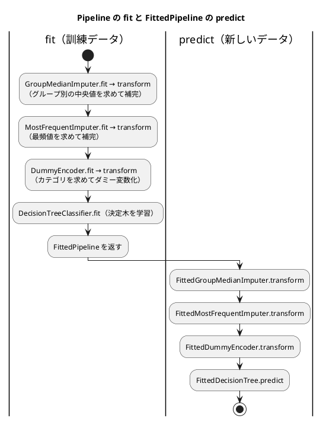

# 第 8 章: 実践的な分類と前処理パイプライン

## 8.1 はじめに

これまでの章のデータは、欠損値が少なく、特徴量もすべて数値でした。現実のデータはそうはいきません。この章で扱うタイタニック号の乗客データには、次の 3 つの難しさがあります。

- **欠損値が多い** — 年齢が 2 割近く欠けている
- **カテゴリ値がある** — 性別や乗船した港が文字列で記録されている
- **クラスが偏っている** — 生存者より死亡者のほうが多い

この章では、これらを 1 つずつ小さな部品として TDD で実装し、前処理からモデルまでを 1 つの **パイプライン** につなぎます。最後にそのパイプラインをファイルに保存し、読み込んで予測できるようにします。保存したモデルは、第 15 章で作る機械学習 API から使います。

[Python 版の第 8 章](../python/08-classification-and-preprocessing-pipeline.md) は、scikit-learn の変換器・`Pipeline`・`DecisionTreeClassifier` の `class_weight` を使いました。Kotlin 版には、次の 3 つの違いがあります。

- **変換器の約束を型で表す** — 前処理の部品を `interface Transformer` として自分で定義し、「`fit` する前は `transform` できない」ことを型で保証する
- **クラスの重みを付けた決定木を自作する** — Tribuo の決定木にはクラスの重み付けが無い（[ADR 002](../../../adr/002-kotlin-ml-libraries.md)）ので、第 3 章の決定木を重み付きに書き直す。Tribuo とは重み付けなしで突き合わせる
- **Java のシリアライズで保存する** — 読み込むクラスを許可リストで絞り、信頼できないファイルから任意のクラスが復元されるのを防ぐ

Kotlin DataFrame の型の推定が、欠損値やカテゴリ値でどう振る舞うかにも注目してください。この章の Red の多くは、その振る舞いから生まれています。

## 8.2 題材とデータ

### Survived.csv

`Survived.csv` には、乗客 891 人の情報が記録されています。

| 列 | 意味 | 値 | 欠損値 |
|----|------|-----|------|
| PassengerId | 乗客の番号 | 整数 | 0 件 |
| Survived | 生存したか（正解ラベル） | 1（生存）または 0（死亡） | 0 件 |
| Pclass | 客室クラス | 1, 2, 3 | 0 件 |
| Sex | 性別 | `male` または `female` | 0 件 |
| Age | 年齢 | 小数 | 177 件 |
| SibSp | 同乗した兄弟・配偶者の数 | 整数 | 0 件 |
| Parch | 同乗した親・子の数 | 整数 | 0 件 |
| Ticket | チケット番号 | 文字列 | 0 件 |
| Fare | 運賃 | 小数 | 0 件 |
| Cabin | 客室番号 | 文字列 | 687 件 |
| Embarked | 乗船した港 | `C`・`Q`・`S` | 2 件 |

正解ラベルは生存 342 人、死亡 549 人で、死亡のほうが 1.6 倍ほど多くなっています。

### 使う特徴量と、使わない列

特徴量には `Pclass`・`Sex`・`Age`・`SibSp`・`Parch`・`Fare`・`Embarked` の 7 列を使います。`PassengerId` と `Ticket` は乗客を区別するための値で、生存との関係は期待できません。`Cabin` は 891 件中 687 件が欠けているので、今回は使いません。

### 年齢はグループごとの中央値で補完する

年齢の欠損値を全体の平均値で補完すると、1 等客室の年配の乗客も、3 等客室の若い乗客も、同じ年齢で埋まってしまいます。そこで、客室クラスと性別の組み合わせ（グループ）ごとの中央値で補完します。平均値でなく中央値を使うのは、一部の高齢の乗客に値が引っ張られにくいからです。

グループ分けに正解ラベル（`Survived`）を使ってはいけません。予測するときには、その乗客が生存したかは分からないからです。グループ分けに使えるのは、予測の時点で分かっている特徴量だけです。

## 8.3 TODO リストの作成

**TODO リスト**:

- [ ] CSV を読み込む
- [ ] 年齢の欠損値を補完する
  - [ ] 同じグループの中央値で補完する
  - [ ] グループごとに異なる中央値で補完する
  - [ ] 訓練データで求めた中央値を、別のデータの補完に使う
  - [ ] 訓練データに無いグループは、全体の中央値で補完する
- [ ] 乗船した港の欠損値を、最も多い値で補完する
- [ ] カテゴリ値を 0 と 1 の列（ダミー変数）にする
  - [ ] 訓練データと別のデータで、同じ列を作る
- [ ] クラスの重みを付けた決定木を作る
- [ ] 前処理とモデルを 1 つのパイプラインにつなぐ
- [ ] モデルを保存して読み込む
- [ ] 正解率と、見つけた生存者の数で評価する
- [ ] 実データでクラスの重みの効果を確かめる

## 8.4 CSV を読み込む

### Red → Green: 明白な実装

テストのデータは、架空の乗客 1 人分の CSV です。年齢と客室番号を空欄にしておきます。

```kotlin
// src/test/kotlin/chapter08/SurvivedClassifierTest.kt
private const val HEADER = "\uFEFFPassengerId,Survived,Pclass,Sex,Age,SibSp,Parch,Ticket,Fare,Cabin,Embarked\n"

class LoadSurvivedTest {
    private val directory: Path = createTempDirectory()

    private fun writeCsv(rows: String): File = File(directory.toFile(), "survived.csv").apply { writeText(HEADER + rows) }

    @Test
    fun `BOM付きCSVを読み込み空欄を欠損値にする`() {
        val df = loadSurvived(writeCsv("1,0,3,male,,0,0,X-1,8.5,,S\n"))

        assertEquals("male", df["Sex"][0])
        assertNull(df["Age"][0])
        assertNull(df["Cabin"][0])
    }
}
```

```text
e: .../src/test/kotlin/chapter08/SurvivedClassifierTest.kt:19:18 Unresolved reference 'loadSurvived'.
e: .../src/test/kotlin/chapter08/SurvivedClassifierTest.kt:21:39 No 'get' operator method providing array access.
e: .../src/test/kotlin/chapter08/SurvivedClassifierTest.kt:22:29 No 'get' operator method providing array access.
e: .../src/test/kotlin/chapter08/SurvivedClassifierTest.kt:23:31 No 'get' operator method providing array access.
```

第 2 章で確かめたとおり、`readCSV` は BOM を取り除き、空欄を null として読むので、呼ぶだけで通ります。

```kotlin
// src/main/kotlin/chapter08/SurvivedData.kt
fun loadSurvived(csvFile: File): AnyFrame = DataFrame.readCSV(csvFile)
```

### 三角測量: 1 文字の値の列

乗船した港 `Embarked` は `C`・`Q`・`S` の 1 文字です。後でカテゴリ値として扱うので、文字列として読めていることを確かめます。

```kotlin
    @Test
    fun `1文字の値の列も文字列として読み込む`() {
        val df = loadSurvived(writeCsv("1,0,3,male,,0,0,X-1,8.5,,S\n"))

        assertEquals("S", df["Embarked"][0])
    }
```

```text
LoadSurvivedTest > 1文字の値の列も文字列として読み込む() FAILED
    org.opentest4j.AssertionFailedError: expected: java.lang.String@480462e<S> but was: java.lang.Character@1c2f12b0<S>
LoadSurvivedTest > BOM付きCSVを読み込み空欄を欠損値にする() PASSED
2 tests completed, 1 failed
```

どちらも `S` と表示されているのに失敗しました。期待値は `java.lang.String`、実際は `java.lang.Character` です。Kotlin DataFrame は、値が 1 文字だけの列を `Char` 型として読み込みます。実データの `Survived.csv` でも、`Embarked` 列の型は `Char?` になりました。`Char` の `'S'` と `String` の `"S"` は等しくないので、このままでは `"S"` のような文字列と比べる処理が一致しません。

`readCSV` の `colTypes` で、`Embarked` 列を文字列として読むように指定します。

```kotlin
fun loadSurvived(csvFile: File): AnyFrame = DataFrame.readCSV(csvFile, colTypes = mapOf("Embarked" to ColType.String))
```

```text
LoadSurvivedTest > 1文字の値の列も文字列として読み込む() PASSED
LoadSurvivedTest > BOM付きCSVを読み込み空欄を欠損値にする() PASSED
```

型を推定してくれるライブラリは便利ですが、推定の結果が思ったとおりとは限りません。値の型を前提にする処理の前に、テストで型を確かめておくと、このように早い段階で気づけます。

## 8.5 年齢をグループごとの中央値で補完する

### 前処理の部品を interface で定義する

Python 版は、scikit-learn の変換器の約束（`fit` で値を求めて属性に覚え、`transform` で使う）に合わせて部品を作りました。Kotlin 版では、この約束を 2 つの interface で表します。

```kotlin
// src/main/kotlin/chapter08/Transformers.kt
/** 訓練データから変換に必要な値を求める前処理 */
interface Transformer {
    fun fit(x: AnyFrame): FittedTransformer
}

/** fit で求めた値を使ってデータを変換する前処理 */
fun interface FittedTransformer {
    fun transform(x: AnyFrame): AnyFrame
}
```

`fit` は自分自身を返すのではなく、求めた値を持つ **別の型** `FittedTransformer` を返します。`transform` を持つのは `FittedTransformer` だけなので、`fit` する前に `transform` を呼ぶコードはコンパイルできません。scikit-learn では `fit` の前に `transform` を呼ぶと実行時にエラーになりますが、Kotlin 版では型が取り違えを防ぎます。

`fit` と `transform` を分けておくと、**訓練データで `fit` し、テストデータには `transform` だけを使う** という、データリークを防ぐ使い方が自然に書けます。

`fun interface` は、抽象メソッドが 1 つだけの interface です。ラムダ式で実装を作れます。

### Red: 最初のテスト

同じグループ（1 等客室の女性）の中に、年齢 20・30・70 の乗客と、年齢が欠けた乗客がいるデータで試します。中央値は 30 です。

```kotlin
class GroupMedianImputerTest {
    @Test
    fun `同じグループの中央値で欠損値を補完する`() {
        val df =
            dataFrameOf(
                "Pclass" to listOf(1, 1, 1, 1),
                "Sex" to listOf("female", "female", "female", "female"),
                "Age" to listOf(20.0, 30.0, 70.0, null),
            )
        val imputer = GroupMedianImputer(column = "Age", by = listOf("Pclass", "Sex"))

        val filled = imputer.fit(df).transform(df)

        assertEquals(listOf(20.0, 30.0, 70.0, 30.0), filled["Age"].toList())
    }
}
```

```text
e: .../src/test/kotlin/chapter08/SurvivedClassifierTest.kt:44:23 Unresolved reference 'GroupMedianImputer'.
e: .../src/test/kotlin/chapter08/SurvivedClassifierTest.kt:48:68 Unresolved reference 'toList' on receiver of type 'MatchGroup?'.
```

### Green: 仮実装

`fit` は、欠損値を 30 で埋めるだけの `FittedTransformer` をラムダ式で返します。

```kotlin
class GroupMedianImputer(
    private val column: String,
    private val by: List<String>,
) : Transformer {
    override fun fit(x: AnyFrame): FittedTransformer = FittedTransformer { it.fillNulls(column).with { 30.0 } }
}
```

`FittedTransformer { ... }` は、`fun interface` をラムダ式で実装する書き方（SAM 変換）です。

### 三角測量: グループごとに異なる中央値

1 等客室の女性（40・50 → 中央値 45）と、3 等客室の男性（10・20 → 中央値 15）の 2 グループで試します。

```kotlin
    @Test
    fun `グループごとに異なる中央値で補完する`() {
        val df =
            dataFrameOf(
                "Pclass" to listOf(1, 1, 1, 3, 3, 3),
                "Sex" to listOf("female", "female", "female", "male", "male", "male"),
                "Age" to listOf(40.0, 50.0, null, 10.0, 20.0, null),
            )
        val imputer = GroupMedianImputer(column = "Age", by = listOf("Pclass", "Sex"))

        val filled = imputer.fit(df).transform(df)

        assertEquals(listOf(40.0, 50.0, 45.0, 10.0, 20.0, 15.0), filled["Age"].toList())
    }
```

```text
GroupMedianImputerTest > 同じグループの中央値で欠損値を補完する() PASSED
GroupMedianImputerTest > グループごとに異なる中央値で補完する() FAILED
    org.opentest4j.AssertionFailedError: expected: <[40.0, 50.0, 45.0, 10.0, 20.0, 15.0]> but was: <[40.0, 50.0, 30.0, 10.0, 20.0, 30.0]>
4 tests completed, 1 failed
```

`fit` で `groupBy` を使い、グループごとの中央値を求めます。求めた値は、data class `FittedGroupMedianImputer` に持たせます。

```kotlin
class GroupMedianImputer(
    private val column: String,
    private val by: List<String>,
) : Transformer {
    override fun fit(x: AnyFrame): FittedTransformer {
        val medians =
            x
                .groupBy(*by.toTypedArray())
                .median(column)
                .rows()
                .associate { row -> by.map { row[it] } to (row[column] as Number).toDouble() }
        return FittedGroupMedianImputer(column, by, medians)
    }
}

data class FittedGroupMedianImputer(
    val column: String,
    val by: List<String>,
    val medians: Map<List<Any?>, Double>,
) : FittedTransformer {
    override fun transform(x: AnyFrame): AnyFrame = x.fillNulls(column).with { medians[by.map { name -> this[name] }] }
}
```

| 式 | 意味 |
|----|------|
| `x.groupBy("Pclass", "Sex").median("Age")` | （客室クラス, 性別）の組ごとに 1 行の、中央値のデータフレーム |
| `.rows().associate { ... }` | 各行の `[客室クラス, 性別]` のリストをキーにした `Map` にする |
| `fillNulls(column).with { ... }` | null の値だけを、ブロックの結果で置き換えた **新しい** データフレームを返す |
| `this[name]` | `with` のブロックの中の `this` は、置き換える値がある行。同じ行の別の列を読める |

Kotlin DataFrame の `median` は、欠損値を除き、件数が偶数なら中央の 2 つの平均を返します（40 と 50 なら 45）。キーをリスト `listOf(1, "female")` にしたのは、リストが要素の値で等しいかを比べるので、`Map` のキーにそのまま使えるからです。

```text
GroupMedianImputerTest > 同じグループの中央値で欠損値を補完する() PASSED
GroupMedianImputerTest > グループごとに異なる中央値で補完する() PASSED
```

### 訓練データで求めた値を別のデータに使う

データリークを防ぐための、この部品の一番大事な仕様です。訓練データ（2 等客室の男性 30・34 → 中央値 32）で `fit` し、別のデータを `transform` します。あわせて、訓練データに 1 人もいなかったグループの乗客を、全体の中央値で補完する仕様も書きます（訓練データの年齢 30・40・20 の中央値は 30）。

```kotlin
    @Test
    fun `訓練データで求めた中央値を別のデータの補完に使う`() {
        val train = dataFrameOf("Pclass" to listOf(2, 2), "Sex" to listOf("male", "male"), "Age" to listOf(30.0, 34.0))
        val other = dataFrameOf("Pclass" to listOf(2), "Sex" to listOf("male"), "Age" to listOf(null))
        val imputer = GroupMedianImputer(column = "Age", by = listOf("Pclass", "Sex"))

        val filled = imputer.fit(train).transform(other)

        assertEquals(listOf(32.0), filled["Age"].toList())
    }

    @Test
    fun `訓練データに無いグループは全体の中央値で補完する`() {
        val train =
            dataFrameOf(
                "Pclass" to listOf(1, 1, 3),
                "Sex" to listOf("female", "female", "male"),
                "Age" to listOf(30.0, 40.0, 20.0),
            )
        val other = dataFrameOf("Pclass" to listOf(2), "Sex" to listOf("female"), "Age" to listOf(null))
        val imputer = GroupMedianImputer(column = "Age", by = listOf("Pclass", "Sex"))

        val filled = imputer.fit(train).transform(other)

        assertEquals(listOf(30.0), filled["Age"].toList())
    }
```

Python 版では、1 つ目のテストは追加した時点で通りました。Kotlin 版では、2 つとも失敗しました。

```text
GroupMedianImputerTest > 同じグループの中央値で欠損値を補完する() PASSED
GroupMedianImputerTest > グループごとに異なる中央値で補完する() PASSED
GroupMedianImputerTest > 訓練データに無いグループは全体の中央値で補完する() FAILED
    org.opentest4j.AssertionFailedError: expected: <[30.0]> but was: <[null]>
GroupMedianImputerTest > 訓練データで求めた中央値を別のデータの補完に使う() FAILED
    java.lang.IllegalArgumentException: Can not add value of class kotlin.Double to column of type kotlin.Nothing?. Value = 32.0
6 tests completed, 2 failed
```

2 つ目の失敗は予想どおりで、`medians` に無いキーを引くと null が返ります。

1 つ目の失敗は、Kotlin DataFrame の型の推定によるものです。`"Age" to listOf(null)` のように **null だけ** の列は、`Nothing?`（null しか入らない型）の列として作られます。そこに `Double` の値を入れようとして失敗しました。第 15 章の API では、年齢が分からない乗客 1 人分のデータを受け取るので、同じことが実際に起きます。

`transform` で、列をまず `Double?` の列に変換してから補完します。全体の中央値は `fit` で求めておき、グループの中央値が無ければ `?:` で全体の中央値を使います。

```kotlin
    override fun fit(x: AnyFrame): FittedTransformer {
        val medians =
            x
                .groupBy(*by.toTypedArray())
                .median(column)
                .rows()
                .associate { row -> by.map { row[it] } to (row[column] as Number).toDouble() }
        val overallMedian = x.convert(column).to<Double?>()[column].cast<Double?>().median()
        return FittedGroupMedianImputer(column, by, medians, overallMedian)
    }
}

data class FittedGroupMedianImputer(
    val column: String,
    val by: List<String>,
    val medians: Map<List<Any?>, Double>,
    val overallMedian: Double,
) : FittedTransformer {
    override fun transform(x: AnyFrame): AnyFrame =
        x
            .convert(column)
            .to<Double?>()
            .fillNulls(column)
            .with { medians[by.map { name -> this[name] }] ?: overallMedian }
}
```

- `convert(column).to<Double?>()` は、列の型を `Double?` に変えた新しいデータフレームを返します。`Nothing?` の列も、`Int` の列も `Double?` になります
- `[column].cast<Double?>()` は、型の決まっていない列を `Double?` の列として扱うと宣言します。`median()` はその列の中央値です

```text
GroupMedianImputerTest > 同じグループの中央値で欠損値を補完する() PASSED
GroupMedianImputerTest > グループごとに異なる中央値で補完する() PASSED
GroupMedianImputerTest > 訓練データに無いグループは全体の中央値で補完する() PASSED
GroupMedianImputerTest > 訓練データで求めた中央値を別のデータの補完に使う() PASSED
```

元のデータフレームを変更しないことも、テストで固定しておきます。Kotlin DataFrame の操作は新しいデータフレームを返すので、このテストは追加した時点で通ります。

```kotlin
    @Test
    fun `元のデータフレームは変更しない`() {
        val df = dataFrameOf("Pclass" to listOf(1, 1), "Sex" to listOf("male", "male"), "Age" to listOf(30.0, null))
        val imputer = GroupMedianImputer(column = "Age", by = listOf("Pclass", "Sex"))

        imputer.fit(df).transform(df)

        assertNull(df["Age"][1])
    }
```

## 8.6 乗船した港を最頻値で補完する

`Embarked` は文字列なので、中央値は使えません。訓練データで最も多い値（最頻値）で補完します。仕組みは `GroupMedianImputer` と同じなので、明白な実装で進めます。

```kotlin
class MostFrequentImputerTest {
    @Test
    fun `訓練データで最も多い値で欠損値を補完する`() {
        val train = dataFrameOf("Embarked" to listOf("S", "C", "S", null))
        val other = dataFrameOf("Embarked" to listOf(null, "Q"))
        val imputer = MostFrequentImputer(column = "Embarked")

        val filled = imputer.fit(train).transform(other)

        assertEquals(listOf("S", "Q"), filled["Embarked"].toList())
    }
}
```

```text
e: .../src/test/kotlin/chapter08/SurvivedClassifierTest.kt:109:23 Unresolved reference 'MostFrequentImputer'.
e: .../src/test/kotlin/chapter08/SurvivedClassifierTest.kt:113:59 Unresolved reference 'toList' on receiver of type 'MatchGroup?'.
```

```kotlin
class MostFrequentImputer(
    private val column: String,
) : Transformer {
    override fun fit(x: AnyFrame): FittedTransformer {
        val mostFrequent =
            x[column]
                .values()
                .filterNotNull()
                .groupingBy { it }
                .eachCount()
                .maxBy { it.value }
                .key
        return FittedMostFrequentImputer(column, mostFrequent)
    }
}

data class FittedMostFrequentImputer(
    val column: String,
    val mostFrequent: Any,
) : FittedTransformer {
    override fun transform(x: AnyFrame): AnyFrame = x.fillNulls(column).with { mostFrequent }
}
```

`groupingBy { it }.eachCount()` で値ごとの件数を数え、`maxBy` で最も多い値を選びます。同数の値が複数あれば、`maxBy` は先に現れた値を返します。pandas の `mode()` は同数の値を並べ替えて返すので、Python 版の `mode()[0]` とは、同数のときに選ぶ値が違うことがあります。

年齢の補完で見た `Nothing?` の列は、港の補完でも起きるはずです。港だけが欠けた 1 人分のデータで確かめます。

```kotlin
    @Test
    fun `欠損値だけの列も補完する`() {
        val train = dataFrameOf("Embarked" to listOf("S", "C", "S"))
        val other = dataFrameOf("Embarked" to listOf(null))
        val imputer = MostFrequentImputer(column = "Embarked")

        val filled = imputer.fit(train).transform(other)

        assertEquals(listOf("S"), filled["Embarked"].toList())
    }
```

```text
MostFrequentImputerTest > 欠損値だけの列も補完する() FAILED
    java.lang.IllegalArgumentException: Can not add value of class kotlin.String to column of type kotlin.Nothing?. Value = S
MostFrequentImputerTest > 訓練データで最も多い値で欠損値を補完する() PASSED
9 tests completed, 1 failed
```

最頻値を文字列として覚え、`transform` では列を `String?` に変換してから補完します。

```kotlin
        val mostFrequent =
            x[column]
                .values()
                .filterNotNull()
                .map { it.toString() }
                .groupingBy { it }
                .eachCount()
                .maxBy { it.value }
                .key
```

```kotlin
data class FittedMostFrequentImputer(
    val column: String,
    val mostFrequent: String,
) : FittedTransformer {
    override fun transform(x: AnyFrame): AnyFrame =
        x
            .convert(column)
            .to<String?>()
            .fillNulls(column)
            .with { mostFrequent }
}
```

## 8.7 カテゴリ値をダミー変数にする

### 学習用テスト: `pivotMatches` の振る舞い

決定木は、`male` のような文字列を直接扱えません。カテゴリごとに 0 と 1 の列を作る **ダミー変数** に変換します。pandas の `get_dummies` に近いものとして、Kotlin DataFrame には、値ごとに一致するかを表す列を作る `pivotMatches` があります。学習用テストで振る舞いを確かめます。

```kotlin
class PivotMatchesLearningTest {
    @Test
    fun `pivotMatchesはデータに含まれるカテゴリの列しか作らない`() {
        val train = dataFrameOf("PassengerId" to listOf(1, 2, 3), "Embarked" to listOf("C", "Q", "S"))
        val other = dataFrameOf("PassengerId" to listOf(4), "Embarked" to listOf("S"))

        assertEquals(listOf("C", "Q", "S"), train.pivotMatches("Embarked")["Embarked"].asColumnGroup().columnNames())
        assertEquals(listOf("S"), other.pivotMatches("Embarked")["Embarked"].asColumnGroup().columnNames())
    }
}
```

```text
PivotMatchesLearningTest > pivotMatchesはデータに含まれるカテゴリの列しか作らない() PASSED
```

`pivotMatches` は、`Embarked` の下に `C`・`Q`・`S` の真偽値の列を束ねた **列グループ** を作ります。そしてパンダスの `get_dummies` と同じく、そのデータに含まれるカテゴリの列しか作りません。訓練データとテストデータ（や、API に届いた 1 人分のデータ）で別々に変換すると、列の数が変わり、モデルに渡せなくなります。加えて、真偽値の列グループは決定木の数値の特徴量としてそのままは使えないので、ダミー変数化は自分で実装します。

### Red → Green: 素直な実装

まず、性別を `Sex_male` の 1 列にするテストを書きます。`male` と `female` の 2 列を作ると、片方がもう片方の裏返しになり情報が重複するので、最初のカテゴリの列を落とします。

```kotlin
class DummyEncoderTest {
    @Test
    fun `2値のカテゴリを最初のカテゴリを除いた0と1の列にする`() {
        val df = dataFrameOf("Pclass" to listOf(1, 3, 2), "Sex" to listOf("female", "male", "male"))
        val encoder = DummyEncoder(columns = listOf("Sex"))

        val encoded = encoder.fit(df).transform(df)

        assertEquals(mapOf("Pclass" to listOf(1, 3, 2), "Sex_male" to listOf(0, 1, 1)), encoded.toMap())
    }
}
```

```text
e: .../src/test/kotlin/chapter08/SurvivedClassifierTest.kt:146:23 Unresolved reference 'DummyEncoder'.
```

`transform` するデータ自身からカテゴリを求める、素直な実装にします。

```kotlin
class DummyEncoder(
    private val columns: List<String>,
) : Transformer {
    override fun fit(x: AnyFrame): FittedTransformer =
        FittedTransformer { data -> encode(data, columns.associateWith { column -> categoriesOf(data, column).drop(1) }) }
}

private fun categoriesOf(
    x: AnyFrame,
    column: String,
): List<String> =
    x[column]
        .values()
        .filterNotNull()
        .map { it.toString() }
        .distinct()
        .sorted()

private fun encode(
    x: AnyFrame,
    dummies: Map<String, List<String>>,
): AnyFrame =
    dummies.entries.fold(x) { df, (column, categories) ->
        categories
            .fold(df) { acc, category -> acc.add("${column}_$category") { if (this[column]?.toString() == category) 1 else 0 } }
            .remove(column)
    }
```

- `categoriesOf` は、列の値を重複なく並べ替えます。`drop(1)` で最初のカテゴリを落とします
- `encode` は、`fold` でカテゴリの列を 1 つずつ `add` し、最後に元の列を `remove` します。`add` のブロックの `this` は追加する行で、`this[column]` で元の列の値を読めます
- `dummies.entries.fold(x) { df, (column, categories) -> ... }` のように、ラムダ式の引数の `Map.Entry` を `(column, categories)` と分解して受け取れます

```text
DummyEncoderTest > 2値のカテゴリを最初のカテゴリを除いた0と1の列にする() PASSED
```

### 三角測量: 別のデータにも同じ列を作る

学習用テストで見た落とし穴を、仕様としてテストにします。

```kotlin
    @Test
    fun `別のデータにも訓練データと同じ列を作る`() {
        val train = dataFrameOf("Embarked" to listOf("C", "Q", "S"))
        val other = dataFrameOf("Embarked" to listOf("S", "S"))
        val encoder = DummyEncoder(columns = listOf("Embarked"))

        val encoded = encoder.fit(train).transform(other)

        assertEquals(mapOf("Embarked_Q" to listOf(0, 0), "Embarked_S" to listOf(1, 1)), encoded.toMap())
    }
```

```text
DummyEncoderTest > 別のデータにも訓練データと同じ列を作る() FAILED
    org.opentest4j.AssertionFailedError: expected: <{Embarked_Q=[0, 0], Embarked_S=[1, 1]}> but was: <{}>
DummyEncoderTest > 2値のカテゴリを最初のカテゴリを除いた0と1の列にする() PASSED
12 tests completed, 1 failed
```

結果は空でした。Python 版と同じく、`S` しか無いデータでは、唯一のカテゴリである `S` まで「最初のカテゴリ」として落とされてしまいます。

`fit` で訓練データのカテゴリを覚え、`transform` では覚えたカテゴリの列を作ります。仮実装のラムダ式は、覚えた値を持つ data class に置き換えます。

```kotlin
class DummyEncoder(
    private val columns: List<String>,
) : Transformer {
    override fun fit(x: AnyFrame): FittedTransformer = FittedDummyEncoder(columns.associateWith { categoriesOf(x, it).drop(1) })
}

data class FittedDummyEncoder(
    val dummies: Map<String, List<String>>,
) : FittedTransformer {
    override fun transform(x: AnyFrame): AnyFrame = encode(x, dummies)
}
```

```text
DummyEncoderTest > 別のデータにも訓練データと同じ列を作る() PASSED
DummyEncoderTest > 2値のカテゴリを最初のカテゴリを除いた0と1の列にする() PASSED
```

`transform` するデータに無いカテゴリ（`Q`）も、覚えた列として 0 で作られます。`associateWith` は元のリストの順を保つ `Map` を作るので、`Sex` → `Embarked` の順にダミー変数の列が末尾に並びます。

## 8.8 クラスの重みを付けた決定木を作る

### なぜ自作するのか

死亡者のほうが多いデータで決定木を学習すると、死亡者を正しく分けることが優先され、生存者の見落としが増えがちです。scikit-learn では `class_weight="balanced"` を指定すると、少ないクラスの 1 件を重く数えて分割を選べます。

ところが、Tribuo の決定木（`CARTClassificationTrainer`）は、クラスの重み付けに対応していません（[ADR 002](../../../adr/002-kotlin-ml-libraries.md) で、`WeightedLabels` を実装していないことを確認しました）。第 3 章の自作の決定木にも重みはありません。そこで、第 3 章の決定木を、1 件ごとの重みを受け取る形に書き直します。第 3 章のコードは変えず、この章の中に作ります。

### 重み付きのジニ不純度

重み付きのジニ不純度は、ラベルの **件数** の代わりに **重みの合計** で割合を求めます。

重み付きジニ不純度 = 1 − Σ（そのラベルの重みの合計 / 全体の重みの合計）²

重みがすべて 1 なら、第 3 章のジニ不純度と同じ値になるはずです。これを最初のテストにします。

```kotlin
class WeightedGiniTest {
    @Test
    fun `重みがすべて1なら第3章のジニ不純度と同じ値になる`() {
        val labels = listOf(0, 1, 1)

        assertEquals(gini(labels.map { it.toString() }), weightedGini(labels, weights = listOf(1.0, 1.0, 1.0)))
    }
}
```

```text
e: .../src/test/kotlin/chapter08/SurvivedClassifierTest.kt:171:58 Unresolved reference 'weightedGini'.
```

仮実装は、重みを無視して第 3 章の `gini` を呼ぶだけです。

```kotlin
// src/main/kotlin/chapter08/DecisionTreeClassifier.kt
fun weightedGini(
    labels: List<Int>,
    weights: List<Double>,
): Double = gini(labels.map { it.toString() })
```

重みに差がある例で三角測量します。ラベル 0 の重みが 1、ラベル 1 の重みが 3 なら、割合は 0.25 と 0.75 で、不純度は 1 − (0.25² + 0.75²) = 0.375 です。

```kotlin
    @Test
    fun `重みの大きいラベルほど多いものとして不純度を計算する`() {
        val impurity = weightedGini(listOf(0, 1), weights = listOf(1.0, 3.0))

        assertEquals(0.375, impurity, absoluteTolerance = 1e-12)
    }
```

```text
WeightedGiniTest > 重みがすべて1なら第3章のジニ不純度と同じ値になる() PASSED
WeightedGiniTest > 重みの大きいラベルほど多いものとして不純度を計算する() FAILED
    org.opentest4j.AssertionFailedError: Expected <0.375> with absolute tolerance <1.0E-12>, actual <0.5>.
2 tests completed, 1 failed
```

```kotlin
fun weightedGini(
    labels: List<Int>,
    weights: List<Double>,
): Double {
    val total = weights.sum()
    return 1.0 -
        labels.indices
            .groupBy({ labels[it] }, { weights[it] })
            .values
            .sumOf { (it.sum() / total) * (it.sum() / total) }
}
```

`groupBy({ キー }, { 値 })` は、キーごとに値のリストを集めます。ここでは、ラベルごとに重みのリストを作り、その合計で割合を求めています。計算の形を第 3 章の `gini` とそろえてあるので、重みがすべて 1 なら浮動小数点数の計算も同じ順に行われ、1 つ目のテストは誤差を許容しない `assertEquals` のまま通ります。

### balanced の重み

scikit-learn の `balanced` と同じく、1 件の重みを「件数 / (クラスの数 × そのクラスの件数)」にします。ラベル 0 が 3 件、ラベル 1 が 1 件なら、0 の重みは 4 / (2 × 3)、1 の重みは 4 / (2 × 1) = 2 です。クラスごとの重みの合計は、どちらも 2 にそろいます。

```kotlin
class BalancedWeightsTest {
    @Test
    fun `少ないクラスほど1件の重みを大きくしクラスごとの重みの合計をそろえる`() {
        val weights = balancedWeights(listOf(0, 0, 0, 1))

        assertEquals(listOf(4.0 / 6, 4.0 / 6, 4.0 / 6, 2.0), weights)
        assertEquals(weights.take(3).sum(), weights[3], absoluteTolerance = 1e-12)
    }
}
```

```text
e: .../src/test/kotlin/chapter08/SurvivedClassifierTest.kt:185:23 Unresolved reference 'balancedWeights'.
e: .../src/test/kotlin/chapter08/SurvivedClassifierTest.kt:188:45 Argument type mismatch: actual type is 'V? (of fun <K, V> Map<out K, V>.get)', but 'Double' was expected.
e: .../src/test/kotlin/chapter08/SurvivedClassifierTest.kt:188:45 Cannot infer type for type parameter 'V'. Specify it explicitly.
```

定義どおりの明白な実装です。

```kotlin
/** クラスの件数に反比例する重み（件数 / (クラスの数 × そのクラスの件数)）を 1 件ごとに求める */
fun balancedWeights(t: List<Int>): List<Double> {
    val counts = t.groupingBy { it }.eachCount()
    return t.map { t.size.toDouble() / (counts.size * counts.getValue(it)) }
}
```

### 重み付けなしなら第 3 章の決定木と同じ

木を作る処理は、第 3 章の `bestSplit`・`buildTree`・`predictOne` と同じ手順に、1 件ごとの重みを通すだけです。そこで、「重み付けなしなら第 3 章の決定木と同じ予測をする」ことを仕様にします。数値の特徴量 2 つと 0・1 のラベルを持つ架空のデータで、深さを 3 通りに変えて比べます。

```kotlin
class DecisionTreeClassifierTest {
    private val x =
        dataFrameOf(
            "Fare" to listOf(8.0, 9.0, 13.0, 20.0, 60.0, 80.0),
            "Age" to listOf(30.0, 22.0, 18.0, 45.0, 25.0, 33.0),
        )
    private val t = listOf(0, 0, 1, 0, 1, 1)

    @Test
    fun `重み付けなしなら第3章の決定木と同じ予測をする`() {
        for (maxDepth in listOf(1, 2, null)) {
            val expected = DecisionTree(maxDepth).fit(x, t.map { it.toString() }).predict(x)

            val predictions = DecisionTreeClassifier(maxDepth, ClassWeight.NONE).fit(x, t).predict(x)

            assertEquals(expected, predictions.map { it.toString() }, "深さ $maxDepth")
        }
    }
}
```

```text
e: .../src/test/kotlin/chapter08/SurvivedClassifierTest.kt:206:31 Unresolved reference 'DecisionTreeClassifier'.
e: .../src/test/kotlin/chapter08/SurvivedClassifierTest.kt:206:64 Unresolved reference 'ClassWeight'.
e: .../src/test/kotlin/chapter08/SurvivedClassifierTest.kt:208:26 Argument type mismatch: actual type is 'List<String>', but 'Double' was expected.
e: .../src/test/kotlin/chapter08/SurvivedClassifierTest.kt:208:54 Unresolved reference 'it'.
e: .../src/test/kotlin/chapter08/SurvivedClassifierTest.kt:208:71 Argument type mismatch: actual type is 'String', but 'Double' was expected.
```

第 3 章で作った手順をなぞる明白な実装です。クラスの重みの指定は、まず `NONE` だけを持つ enum にします。

```kotlin
enum class ClassWeight {
    NONE,
}

sealed interface TreeNode

data class LeafNode(
    val label: Int,
) : TreeNode

data class SplitNode(
    val feature: String,
    val threshold: Double,
    val left: TreeNode,
    val right: TreeNode,
) : TreeNode

private data class Candidate(
    val feature: String,
    val threshold: Double,
    val impurity: Double,
)

private fun bestSplit(
    x: AnyFrame,
    t: List<Int>,
    w: List<Double>,
): Candidate? {
    if (weightedGini(t, w) == 0.0) return null
    var best: Candidate? = null
    for (feature in x.columnNames()) {
        val order = x[feature].values().map { (it as Number).toDouble() }.withIndex().sortedBy { it.value }
        val values = order.map { it.value }
        val labels = order.map { t[it.index] }
        val weights = order.map { w[it.index] }
        for (i in 1 until order.size) {
            if (values[i] == values[i - 1]) continue
            val left = weights.subList(0, i)
            val right = weights.subList(i, weights.size)
            val impurity =
                (left.sum() * weightedGini(labels.subList(0, i), left) + right.sum() * weightedGini(labels.subList(i, labels.size), right)) /
                    weights.sum()
            if (best == null || impurity < best.impurity) {
                best = Candidate(feature = feature, threshold = (values[i - 1] + values[i]) / 2, impurity = impurity)
            }
        }
    }
    return best
}

private fun weightedMajority(
    t: List<Int>,
    w: List<Double>,
): Int =
    t.indices
        .groupBy({ t[it] }, { w[it] })
        .mapValues { it.value.sum() }
        .maxBy { it.value }
        .key

private fun buildNode(
    x: AnyFrame,
    t: List<Int>,
    w: List<Double>,
    maxDepth: Int?,
): TreeNode {
    val split = (if (maxDepth == 0) null else bestSplit(x, t, w)) ?: return LeafNode(weightedMajority(t, w))
    val goesLeft = x[split.feature].values().map { (it as Number).toDouble() <= split.threshold }
    val left = goesLeft.indices.filter { goesLeft[it] }
    val right = goesLeft.indices.filterNot { goesLeft[it] }
    val childDepth = maxDepth?.minus(1)
    return SplitNode(
        feature = split.feature,
        threshold = split.threshold,
        left = buildNode(x[left], t.slice(left), w.slice(left), childDepth),
        right = buildNode(x[right], t.slice(right), w.slice(right), childDepth),
    )
}

private fun predictOne(
    node: TreeNode,
    row: AnyRow,
): Int =
    when (node) {
        is LeafNode -> node.label
        is SplitNode ->
            if ((row[node.feature] as Number).toDouble() <= node.threshold) predictOne(node.left, row) else predictOne(node.right, row)
    }

data class DecisionTreeClassifier(
    val maxDepth: Int?,
    val classWeight: ClassWeight,
) {
    fun fit(
        x: AnyFrame,
        t: List<Int>,
    ): FittedDecisionTree = FittedDecisionTree(buildNode(x, t, t.map { 1.0 }, maxDepth))
}

data class FittedDecisionTree(
    val root: TreeNode,
) {
    fun predict(x: AnyFrame): List<Int> = x.rows().map { predictOne(root, it) }
}
```

第 3 章との違いは次の 3 点です。

- `withIndex().sortedBy { it.value }` で、値と元の位置の組を値の順に並べ、同じ順でラベルと重みを取り出します。`sortedBy` は安定な並べ替えなので、同じ値の並び順は第 3 章の `zip(t).sortedBy { it.first }` と同じです
- 不純度を件数でなく重みの合計で重み付けし、葉のラベルを件数でなく重みの合計の多数決（`weightedMajority`）で決めます
- `DecisionTree` と同じく「学習すると木ができる」形ですが、`fit` は学習済みの木 `FittedDecisionTree` を返します。前処理の部品と同じく、学習前に予測を呼べない形です

```text
DecisionTreeClassifierTest > 重み付けなしなら第3章の決定木と同じ予測をする() PASSED
```

### balanced で予測が変わる

`balanced` にすると予測が変わる例を作ります。運賃が 1.0 の乗客 4 人（全員死亡）と、2.0 の乗客 3 人（死亡 2 人・生存 1 人）です。分けられる境界は 1.5 しかないので、深さ 1 の木の右の葉には、死亡 2 人と生存 1 人が入ります。

- 重み付けなし: 死亡 2 件 対 生存 1 件で、右の葉は死亡（0）
- balanced: 死亡 6 件・生存 1 件なので、死亡の重みは 7 / 12、生存の重みは 7 / 2。右の葉は死亡 2 × 7/12 ≒ 1.17 対 生存 3.5 で、生存（1）

```kotlin
    @Test
    fun `balancedにすると少ないクラスが混ざった葉でも少ないクラスを予測する`() {
        val fare = dataFrameOf("Fare" to listOf(1.0, 1.0, 1.0, 1.0, 2.0, 2.0, 2.0))
        val survived = listOf(0, 0, 0, 0, 0, 0, 1)
        val newX = dataFrameOf("Fare" to listOf(1.0, 2.0))

        val none = DecisionTreeClassifier(maxDepth = 1, classWeight = ClassWeight.NONE).fit(fare, survived)
        val balanced = DecisionTreeClassifier(maxDepth = 1, classWeight = ClassWeight.BALANCED).fit(fare, survived)

        assertEquals(listOf(0, 0), none.predict(newX))
        assertEquals(listOf(0, 1), balanced.predict(newX))
    }
```

```text
e: .../src/test/kotlin/chapter08/SurvivedClassifierTest.kt:219:87 Unresolved reference 'BALANCED'.
```

enum に `BALANCED` を足すと、コンパイルは通り、テストが失敗します。`fit` がまだ重みを使っていないからです。

```text
DecisionTreeClassifierTest > 重み付けなしなら第3章の決定木と同じ予測をする() PASSED
DecisionTreeClassifierTest > balancedにすると少ないクラスが混ざった葉でも少ないクラスを予測する() FAILED
    org.opentest4j.AssertionFailedError: expected: <[0, 1]> but was: <[0, 0]>
2 tests completed, 1 failed
```

`fit` で、クラスの重みの指定に応じて 1 件ごとの重みを作ります。

```kotlin
enum class ClassWeight {
    NONE,
    BALANCED,
}
```

```kotlin
    fun fit(
        x: AnyFrame,
        t: List<Int>,
    ): FittedDecisionTree {
        val weights =
            when (classWeight) {
                ClassWeight.NONE -> t.map { 1.0 }
                ClassWeight.BALANCED -> balancedWeights(t)
            }
        return FittedDecisionTree(buildNode(x, t, weights, maxDepth))
    }
```

`when` に `else` を書いていないので、将来 `ClassWeight` に 3 つ目の値を足すと、ここがコンパイルエラーになり、重みの作り方を書き忘れることがありません。Python 版の `class_weight: str | None` では、`"balanse"` のような打ち間違いを実行するまで気づけませんが、enum にすると指定できる値そのものが型で決まります。

## 8.9 前処理とモデルをパイプラインにつなぐ

### 特徴量と正解ラベルに分ける

使う特徴量の列を `FEATURES` にまとめ、特徴量と `Survived` 列に分ける関数を作ります。テスト用に、特徴量の列を並べた乗客のデータを作るヘルパーと、架空の乗客 8 人の訓練データ、予測に使う 2 人のデータも用意します。女性が生存、男性が死亡という単純な規則にしておくと、欠損値を含む新しい乗客の予測結果を期待値として書けます。

```kotlin
class SplitFeaturesAndTargetTest {
    @Test
    fun `特徴量の列とSurvived列に分ける`() {
        val df =
            dataFrameOf(
                "PassengerId" to listOf(1),
                "Survived" to listOf(1),
                "Pclass" to listOf(2),
                "Sex" to listOf("female"),
                "Age" to listOf(28.0),
                "SibSp" to listOf(0),
                "Parch" to listOf(1),
                "Ticket" to listOf("X-2"),
                "Fare" to listOf(15.0),
                "Cabin" to listOf(null),
                "Embarked" to listOf("C"),
            )

        val (x, t) = splitFeaturesAndTarget(df)

        assertEquals(listOf("Pclass", "Sex", "Age", "SibSp", "Parch", "Fare", "Embarked"), x.columnNames())
        assertEquals(listOf(1), t)
    }
}

private fun passengers(vararg rows: List<Any?>): AnyFrame =
    dataFrameOf(FEATURES.mapIndexed { i, name -> rows.map { it[i] }.toColumn(name, Infer.Type) })

private fun trainingData(): Pair<AnyFrame, List<Int>> {
    val x =
        passengers(
            listOf(1, "female", 30.0, 0, 0, 80.0, "C"),
            listOf(2, "female", null, 1, 0, 20.0, "S"),
            listOf(3, "female", 22.0, 0, 1, 9.0, null),
            listOf(3, "female", 18.0, 0, 0, 8.0, "Q"),
            listOf(1, "male", 45.0, 0, 0, 60.0, "S"),
            listOf(2, "male", null, 0, 0, 13.0, "S"),
            listOf(3, "male", 25.0, 1, 0, 7.0, "S"),
            listOf(3, "male", 33.0, 0, 0, 8.0, null),
        )
    val t = listOf(1, 1, 1, 1, 0, 0, 0, 0)
    return x to t
}

private fun newPassengers(): AnyFrame =
    passengers(
        listOf(2, "female", null, 0, 0, 12.0, null),
        listOf(1, "male", null, 1, 1, 70.0, "C"),
    )
```

- `vararg rows: List<Any?>` は、乗客 1 人分の値のリストを可変個受け取ります
- `toColumn(name, Infer.Type)` は、値のリストから列を作り、値を見て列の型（`Int`・`String`・`Double?` など）を推定します
- `newPassengers` の 2 人は年齢がどちらも欠けているので、`Age` 列は null だけの列になります。8.5 節で `Nothing?` の列を扱えるようにしたことが、ここで効きます

```kotlin
class BuildPipelineTest {
    @Test
    fun `欠損値を含むデータで学習して予測できる`() {
        val (x, t) = trainingData()
        val pipeline = buildPipeline(maxDepth = 3, classWeight = ClassWeight.NONE)

        val fitted = pipeline.fit(x, t)

        assertEquals(listOf(1, 0), fitted.predict(newPassengers()))
    }

    @Test
    fun `クラスの重みと深さをモデルに渡す`() {
        val pipeline = buildPipeline(maxDepth = 5, classWeight = ClassWeight.BALANCED)

        assertEquals(DecisionTreeClassifier(maxDepth = 5, classWeight = ClassWeight.BALANCED), pipeline.model)
    }
}
```

2 つ目のテストは、data class の `equals` が値で比べることを使って、モデルの設定をまとめて確かめています。

```text
e: .../src/test/kotlin/chapter08/SurvivedClassifierTest.kt:245:22 Unresolved reference 'splitFeaturesAndTarget'.
...
e: .../src/test/kotlin/chapter08/SurvivedClassifierTest.kt:252:74 Unresolved reference 'FEATURES'.
...
e: .../src/test/kotlin/chapter08/SurvivedClassifierTest.kt:280:24 Unresolved reference 'buildPipeline'.
e: .../src/test/kotlin/chapter08/SurvivedClassifierTest.kt:289:24 Unresolved reference 'buildPipeline'.
```

### パイプラインで学習して予測する

```kotlin
// src/main/kotlin/chapter08/SurvivedData.kt
val FEATURES = listOf("Pclass", "Sex", "Age", "SibSp", "Parch", "Fare", "Embarked")
const val TARGET = "Survived"

fun splitFeaturesAndTarget(df: AnyFrame): Pair<AnyFrame, List<Int>> =
    df.select(*FEATURES.toTypedArray()) to df[TARGET].values().map { (it as Number).toInt() }
```

```kotlin
// src/main/kotlin/chapter08/Pipeline.kt
/** 前処理を順に fit・transform してから、モデルを学習する */
data class Pipeline(
    val transformers: List<Transformer>,
    val model: DecisionTreeClassifier,
) {
    fun fit(
        x: AnyFrame,
        t: List<Int>,
    ): FittedPipeline {
        val (fitted, prepared) =
            transformers.fold(emptyList<FittedTransformer>() to x) { (done, data), transformer ->
                val fittedTransformer = transformer.fit(data)
                (done + fittedTransformer) to fittedTransformer.transform(data)
            }
        return FittedPipeline(fitted, model.fit(prepared, t))
    }
}

/** 学習済みの前処理とモデル。予測するときは前処理の transform だけを使う */
data class FittedPipeline(
    val transformers: List<FittedTransformer>,
    val model: FittedDecisionTree,
) {
    fun transform(x: AnyFrame): AnyFrame = transformers.fold(x) { data, transformer -> transformer.transform(data) }

    fun predict(x: AnyFrame): List<Int> = model.predict(transform(x))
}

fun buildPipeline(
    maxDepth: Int,
    classWeight: ClassWeight,
): Pipeline =
    Pipeline(
        transformers =
            listOf(
                GroupMedianImputer(column = "Age", by = listOf("Pclass", "Sex")),
                MostFrequentImputer(column = "Embarked"),
                DummyEncoder(columns = listOf("Sex", "Embarked")),
            ),
        model = DecisionTreeClassifier(maxDepth, classWeight),
    )
```

`Pipeline.fit` は、「学習済みの部品のリスト」と「変換済みのデータ」の組（`Pair`）を初期値に `fold` し、部品ごとに `fit` と `transform` を進めます。`{ (done, data), transformer -> ... }` は、組を分解して受け取る書き方です。途中の状態を `var` で書き換えずに、学習済みの部品を集められます。

### パイプラインのテストが見つけた穴

実行すると、補完の単体テストでは見つからなかった問題が出ました。

```text
BuildPipelineTest > クラスの重みと深さをモデルに渡す() PASSED
BuildPipelineTest > 欠損値を含むデータで学習して予測できる() FAILED
    java.lang.NullPointerException: null cannot be cast to non-null type kotlin.Number
2 tests completed, 1 failed
```

訓練データの 2 等客室の女性は 1 人だけで、その年齢が欠けています。このグループの中央値は求められないので、`median` の結果は null になり、`(row[column] as Number)` で失敗しました。8.5 節のテストには、**年齢がすべて欠けたグループ** がありませんでした。

パイプラインのテストで見つけた仕様を、補完の単体テストにも書きます。

```kotlin
    @Test
    fun `年齢がすべて欠けたグループは全体の中央値で補完する`() {
        val df =
            dataFrameOf(
                "Pclass" to listOf(1, 1, 2),
                "Sex" to listOf("female", "female", "female"),
                "Age" to listOf(30.0, 40.0, null),
            )
        val imputer = GroupMedianImputer(column = "Age", by = listOf("Pclass", "Sex"))

        val filled = imputer.fit(df).transform(df)

        assertEquals(listOf(30.0, 40.0, 35.0), filled["Age"].toList())
    }
```

```text
GroupMedianImputerTest > 年齢がすべて欠けたグループは全体の中央値で補完する() FAILED
    java.lang.NullPointerException: null cannot be cast to non-null type kotlin.Number
...
6 tests completed, 1 failed
```

中央値が null のグループを `Map` に入れなければ、`transform` では「訓練データに無いグループ」と同じく全体の中央値が使われます。

```kotlin
                .rows()
                .filter { it[column] != null }
                .associate { row -> by.map { row[it] } to (row[column] as Number).toDouble() }
```

```text
BUILD SUCCESSFUL in 9s
```

`Pipeline` の `fit` と `predict` は、次のように各部品を順に呼び出します。



`fit` のときだけ各部品が値を求め、`predict` のときは求めた値を使うだけです。学習前（`Pipeline`）と学習後（`FittedPipeline`）が別の型なので、テストデータで `fit` し直すような取り違えも起きにくくなります。

## 8.10 モデルを保存して読み込む

### Java のシリアライズで保存する

学習済みのパイプラインをファイルに保存しておけば、学習をやり直さずに予測だけを行えます。保存するのはモデル単体ではなく **パイプライン全体** です。前処理で求めた中央値やカテゴリも一緒に保存しないと、読み込んだ側で同じ前処理を再現できないからです。

```kotlin
class SaveAndLoadModelTest {
    private val directory: Path = createTempDirectory()

    @Test
    fun `保存したパイプラインを読み込むと同じ予測をする`() {
        val (x, t) = trainingData()
        val pipeline = buildPipeline(maxDepth = 3, classWeight = ClassWeight.NONE).fit(x, t)
        val modelFile = File(directory.toFile(), "model/survived.ser")

        saveModel(pipeline, modelFile)
        val loaded = loadModel(modelFile)

        assertEquals(listOf(1, 0), loaded.predict(newPassengers()))
    }
}
```

```text
e: .../src/test/kotlin/chapter08/SurvivedClassifierTest.kt:319:9 Unresolved reference 'saveModel'.
e: .../src/test/kotlin/chapter08/SurvivedClassifierTest.kt:320:22 Unresolved reference 'loadModel'.
```

JVM 標準の `ObjectOutputStream` と `ObjectInputStream` で、オブジェクトをそのままファイルに書き出し、読み戻します。

```kotlin
fun saveModel(
    pipeline: FittedPipeline,
    modelFile: File,
) {
    modelFile.parentFile?.mkdirs()
    ObjectOutputStream(modelFile.outputStream()).use { it.writeObject(pipeline) }
}

fun loadModel(modelFile: File): FittedPipeline = ObjectInputStream(modelFile.inputStream()).use { it.readObject() as FittedPipeline }
```

`use` は、ブロックを抜けるときにストリームを必ず閉じるスコープ関数です（Java の try-with-resources に当たります）。

```text
SaveAndLoadModelTest > 保存したパイプラインを読み込むと同じ予測をする() FAILED
    java.io.NotSerializableException: chapter08.FittedPipeline
```

JVM のシリアライズは、`java.io.Serializable` を実装したクラスのオブジェクトしか書き出せません。保存するのは学習済みの型だけなので、`FittedPipeline`・`FittedTransformer`・`FittedDecisionTree`・`TreeNode` に `Serializable` を付けます。学習前の `Pipeline` や `Transformer` には付けません。

```kotlin
interface FittedTransformer : Serializable {
    fun transform(x: AnyFrame): AnyFrame
}
```

```kotlin
sealed interface TreeNode : Serializable
```

```kotlin
data class FittedDecisionTree(
    val root: TreeNode,
) : Serializable {
```

```kotlin
data class FittedPipeline(
    val transformers: List<FittedTransformer>,
    val model: FittedDecisionTree,
) : Serializable {
```

`FittedTransformer` は、仮実装のラムダ式をすべて data class に置き換えたので、`fun interface` をやめて通常の interface にしました。interface に `Serializable` を付けると、それを実装した data class（`FittedGroupMedianImputer` など）もシリアライズできるようになります。data class が持つ `List`・`Map`・`String`・`Double` も、JVM の標準のクラスはシリアライズできます。

```text
SaveAndLoadModelTest > 保存したパイプラインを読み込むと同じ予測をする() PASSED
BUILD SUCCESSFUL in 14s
```

### 読み込むクラスを制限する

Python 版では「信頼できないところから受け取ったモデルファイルは読み込まない」と注意しました。JVM のシリアライズにも同じ危険があります。`readObject` は、ファイルに書かれたクラスのオブジェクトを **何でも** 作ってから返します。キャストで型を確かめるのは、オブジェクトを作った後です。

モデルとは無関係のクラス（`java.awt.Point`）を書き込んだファイルで確かめます。

```kotlin
    @Test
    fun `許可していないクラスを含むファイルは読み込まない`() {
        val modelFile = File(directory.toFile(), "unknown.ser")
        ObjectOutputStream(modelFile.outputStream()).use { it.writeObject(java.awt.Point(1, 2)) }

        assertFailsWith<InvalidClassException> { loadModel(modelFile) }
    }
```

```text
SaveAndLoadModelTest > 保存したパイプラインを読み込むと同じ予測をする() PASSED
SaveAndLoadModelTest > 許可していないクラスを含むファイルは読み込まない() FAILED
    org.opentest4j.AssertionFailedError: Expected an exception of class java.io.InvalidClassException to be thrown, but was java.lang.ClassCastException: class java.awt.Point cannot be cast to class chapter08.FittedPipeline (java.awt.Point is in module java.desktop of loader 'bootstrap'; chapter08.FittedPipeline is in unnamed module of loader 'app')
```

`ClassCastException` になったということは、`Point` のオブジェクトが **作られてから** キャストで失敗したということです。作られる途中で処理を実行するクラスが含まれていれば、読み込んだだけでその処理が動いてしまいます。

JDK 9 以降の `ObjectInputFilter` で、読み込めるクラスを許可リストで絞ります。

```kotlin
/** 保存したパイプラインの復元に必要なクラスだけを読み込み、それ以外のクラスが含まれていたら読み込みを止める */
private val MODEL_CLASSES: ObjectInputFilter = ObjectInputFilter.Config.createFilter("chapter08.*;java.lang.*;java.util.*;kotlin.collections.*;!*")

fun loadModel(modelFile: File): FittedPipeline =
    ObjectInputStream(modelFile.inputStream()).use {
        it.setObjectInputFilter(MODEL_CLASSES)
        it.readObject() as FittedPipeline
    }
```

フィルタの文字列は `;` で区切ったパターンを先頭から順に調べ、最初に当てはまったもので決まります。`chapter08.*` は `chapter08` パッケージのクラス、`java.lang.*` と `java.util.*` は `Double`・`ArrayList`・`LinkedHashMap` など、`kotlin.collections.*` は Kotlin の空のリスト（`EmptyList`）などを許可します。最後の `!*` で、それ以外のクラスをすべて拒否します。

```text
SaveAndLoadModelTest > 保存したパイプラインを読み込むと同じ予測をする() PASSED
SaveAndLoadModelTest > 許可していないクラスを含むファイルは読み込まない() PASSED
BUILD SUCCESSFUL in 9s
```

### detekt の指摘に対応する

この時点で `./gradlew check` を実行すると、detekt が 2 種類の指摘をしました。

- **SerialVersionUIDInSerializableClass** — `Serializable` を実装したクラスに `serialVersionUID` が無い
- **SpreadOperator** — `*by.toTypedArray()` のような配列の展開は、配列をまるごとコピーする

`serialVersionUID` は、シリアライズしたときのクラスの版の番号です。書かないと、クラスの形から自動で計算した値が使われ、コンパイラの違いなどでも値が変わりえます。本リポジトリでは、シリアライズする data class すべてに `1` を明示し、「クラスのプロパティを変えたら値を上げ、古いモデルファイルは読み込まずに学習し直す」ことにします。Kotlin では、`companion object` の `const val` として書きます。

```kotlin
data class FittedPipeline(
    val transformers: List<FittedTransformer>,
    val model: FittedDecisionTree,
) : Serializable {
    private companion object {
        private const val serialVersionUID: Long = 1
    }
```

配列の展開は、Kotlin DataFrame 0.15.0 に列の名前のリストをそのまま受け取る関数が無いために書いていました。列の選択は `dataFrameOf(FEATURES.map { df[it] })` で列のリストからデータフレームを作り直し、グループ分けは名前で列を絞り込む `groupBy { cols { it.name() in by } }` にしました。どちらも、テストが通ったまま書き換えられます。

## 8.11 評価する

クラスの重みの効果を比べるために、正解率に加えて「実際の生存者のうち、何人を生存と予測できたか」を数えます。死亡者が多いデータでは、全員を死亡と予測しても正解率は 6 割を超えます。正解率だけを見ていると、生存者を見落とすモデルに気付けません（評価指標は第 11 章で詳しく扱います）。

```kotlin
class EvaluateTest {
    @Test
    fun `正解率と見つけた生存者の数を求める`() {
        val (x, t) = trainingData()
        val split = TrainTestSplit(xTrain = x, xTest = newPassengers(), tTrain = t, tTest = listOf(1, 1))
        val pipeline = buildPipeline(maxDepth = 3, classWeight = ClassWeight.NONE).fit(x, t)

        val evaluation = evaluate(pipeline, split)

        assertEquals(Evaluation(trainAccuracy = 1.0, testAccuracy = 0.5, foundSurvivors = 1, survivors = 2), evaluation)
    }
}
```

訓練データとテストデータの組には、第 2 章の `TrainTestSplit` を再利用します。正解ラベルが `Int` なので、型は `TrainTestSplit<Int>` です。

```text
e: .../src/test/kotlin/chapter08/SurvivedClassifierTest.kt:345:26 Unresolved reference 'evaluate'.
e: .../src/test/kotlin/chapter08/SurvivedClassifierTest.kt:347:9 Cannot infer type for type parameter 'T'. Specify it explicitly.
e: .../src/test/kotlin/chapter08/SurvivedClassifierTest.kt:347:22 Unresolved reference 'Evaluation'.
```

```kotlin
// src/main/kotlin/chapter08/Evaluation.kt
data class Evaluation(
    val trainAccuracy: Double,
    val testAccuracy: Double,
    val foundSurvivors: Int,
    val survivors: Int,
)

private fun accuracy(
    predictions: List<Int>,
    labels: List<Int>,
): Double = predictions.zip(labels).count { (p, t) -> p == t }.toDouble() / labels.size

fun evaluate(
    pipeline: FittedPipeline,
    split: TrainTestSplit<Int>,
): Evaluation {
    val predictions = pipeline.predict(split.xTest)
    return Evaluation(
        trainAccuracy = accuracy(pipeline.predict(split.xTrain), split.tTrain),
        testAccuracy = accuracy(predictions, split.tTest),
        foundSurvivors = predictions.zip(split.tTest).count { (p, t) -> p == 1 && t == 1 },
        survivors = split.tTest.count { it == 1 },
    )
}
```

第 1 章の `accuracy` は `List<String>` を受け取るので、`Int` の正解ラベル用に、同じ計算の関数をこのファイルの中に `private` で置いています。`predictions.zip(split.tTest).count { (p, t) -> p == 1 && t == 1 }` は、「生存と予測し、実際に生存した」組の数です。

```text
EvaluateTest > 正解率と見つけた生存者の数を求める() PASSED
BUILD SUCCESSFUL in 28s
```

**TODO リスト**:

- [x] CSV を読み込む
- [x] 年齢の欠損値を補完する
  - [x] 同じグループの中央値で補完する
  - [x] グループごとに異なる中央値で補完する
  - [x] 訓練データで求めた中央値を、別のデータの補完に使う
  - [x] 訓練データに無いグループは、全体の中央値で補完する
- [x] 乗船した港の欠損値を、最も多い値で補完する
- [x] カテゴリ値を 0 と 1 の列（ダミー変数）にする
  - [x] 訓練データと別のデータで、同じ列を作る
- [x] クラスの重みを付けた決定木を作る
- [x] 前処理とモデルを 1 つのパイプラインにつなぐ
- [x] モデルを保存して読み込む
- [x] 正解率と、見つけた生存者の数で評価する
- [ ] 実データでクラスの重みの効果を確かめる

## 8.12 実データでクラスの重みの効果を確かめる

### 実行する

Python 版と同じく、テストデータの割合 0.2・シード 0 で分け、深さ 5 の決定木でクラスの重みなし（`NONE`）と `BALANCED` を比べます。`BALANCED` のパイプラインを `apps/kotlin/model/survived.ser` に保存し、読み込んで架空の乗客 2 人を予測します。`model/` ディレクトリは `.gitignore` の対象です。

```kotlin
// src/main/kotlin/chapter08/Main.kt
private const val TEST_SIZE = 0.2
private const val SEED = 0
private const val MAX_DEPTH = 5

/** 学習済みのパイプラインの保存先（apps/kotlin/model/ は .gitignore の対象） */
val MODEL_FILE = File("model/survived.ser")

private val NEW_PASSENGERS: AnyFrame =
    dataFrameOf(
        "Pclass" to listOf(1, 3),
        "Sex" to listOf("female", "male"),
        "Age" to listOf(null, null),
        "SibSp" to listOf(0, 0),
        "Parch" to listOf(0, 0),
        "Fare" to listOf(50.0, 8.0),
        "Embarked" to listOf("C", "S"),
    )

private fun format(value: Double): String = "%.3f".format(Locale.ROOT, value)

fun main() = main(MODEL_FILE)

fun main(modelFile: File) {
    val df = loadSurvived(File(dataDir(), "Survived.csv"))
    val (x, t) = splitFeaturesAndTarget(df)
    val split = splitTrainTest(x, t, testSize = TEST_SIZE, seed = SEED)
    val counts = t.groupingBy { it }.eachCount()
    println("データ件数: ${df.rowsCount()}（生存 ${counts[1]}, 死亡 ${counts[0]}）")
    println("訓練データ: ${split.xTrain.rowsCount()} 件, テストデータ: ${split.xTest.rowsCount()} 件")

    val pipelines =
        ClassWeight.entries.associateWith { classWeight ->
            buildPipeline(maxDepth = MAX_DEPTH, classWeight = classWeight).fit(split.xTrain, split.tTrain)
        }
    for ((classWeight, pipeline) in pipelines) {
        val result = evaluate(pipeline, split)
        println(
            "classWeight=$classWeight: 訓練 ${format(result.trainAccuracy)}, テスト ${format(result.testAccuracy)}, " +
                "生存者 ${result.survivors} 人中 ${result.foundSurvivors} 人を発見",
        )
    }

    saveModel(pipelines.getValue(ClassWeight.BALANCED), modelFile)
    val predictions = loadModel(modelFile).predict(NEW_PASSENGERS)
    println("保存したモデル: ${modelFile.name}")
    println("架空の乗客の予測: $predictions")
}
```

- 引数の無い `fun main()` が、`runChapter` から実行される入口です。テストからは保存先を渡せるように、`main(modelFile: File)` を別に用意しています（同じ名前で引数の違う関数を定義する **オーバーロード**）
- `ClassWeight.entries` は、enum のすべての値のリストです。`associateWith` で、クラスの重みごとの学習済みパイプラインの `Map` を作ります
- `MODEL_FILE` の相対パスは、Gradle が `apps/kotlin/` で実行することを前提にしています

```bash
./gradlew runChapter -Pchapter=08
```

```text
データ件数: 891（生存 342, 死亡 549）
訓練データ: 712 件, テストデータ: 179 件
classWeight=NONE: 訓練 0.851, テスト 0.832, 生存者 68 人中 46 人を発見
classWeight=BALANCED: 訓練 0.850, テスト 0.832, 生存者 68 人中 45 人を発見
保存したモデル: survived.ser
架空の乗客の予測: [1, 0]
```

Python 版では、`balanced` にするとテストデータの生存者 69 人のうち見つけられた人数が 45 人から 51 人に増えました。Kotlin 版の分割（第 2 章のとおり、Python 版とはテストデータに入る行が違う）では、深さ 5 の結果は **逆** で、68 人のうち 46 人から 45 人に 1 人減り、正解率は 0.832 で変わりませんでした。

読み込んだモデルは、年齢が欠けた架空の乗客 2 人（1 等客室の女性、3 等客室の男性）を、それぞれ生存（1）・死亡（0）と予測しました。欠損値の補完からダミー変数化まで、保存したパイプラインの中で行われています。

### 効果は深さによって変わる

クラスの重みは本当に効かないのでしょうか。8.13 節の Notebook で深さを 1 から 10 まで変えると、見つけた生存者の数は次のようになりました（テストデータの生存者は 68 人）。

| 深さ | NONE | BALANCED |
|------|------|----------|
| 1 | 51 | 51 |
| 2 | 33 | 51 |
| 3 | 49 | 49 |
| 4 | 47 | 45 |
| 5 | 46 | 45 |
| 6 | 48 | 53 |
| 7 | 45 | 47 |
| 8 | 49 | 47 |
| 9 | 47 | 47 |
| 10 | 46 | 49 |

深さ 2 では、重みを付けると見つけた生存者が 33 人から 51 人に増え、テストデータの正解率も 0.765 から 0.810 に上がりました。一方、深さ 4・5・8 では減っています。重みは分割の選び方を変えるので、どの深さでどちらに効くかは、データの分け方しだいです。

「`balanced` にすれば生存者の見落としが減る」は、Python 版の 1 つの分割で観察した結果で、いつでも成り立つ法則ではありません。テストデータの結果を見て深さや重みを選び直すと、そのテストデータに合わせすぎた評価になってしまいます。本章では深さを Python 版と同じ 5 のままにし、選び方の正しい手順（交差検証）は第 11 章で扱います。

### 実データのテスト

実測した値と、Tribuo・第 3 章の決定木との突き合わせを、テストで固定します。

```kotlin
class SurvivedDataTest {
    private val csvFile = File(dataDir(), "Survived.csv")

    @BeforeTest
    fun requireData() {
        assumeTrue(csvFile.exists(), "学習データ Survived.csv が配置されていない（gulp data:setup）")
    }

    private fun survivedSplit(): TrainTestSplit<Int> {
        val (x, t) = splitFeaturesAndTarget(loadSurvived(csvFile))
        return splitTrainTest(x, t, testSize = 0.2, seed = 0)
    }

    private fun evaluateWith(
        split: TrainTestSplit<Int>,
        maxDepth: Int,
        classWeight: ClassWeight,
    ): Evaluation = evaluate(buildPipeline(maxDepth, classWeight).fit(split.xTrain, split.tTrain), split)

    @Test
    fun `実データの件数と欠損値の数を確認する`() {
        val df = loadSurvived(csvFile)

        val missing = listOf("Age", "Cabin", "Embarked").associateWith { name -> df[name].values().count { it == null } }

        assertEquals(891, df.rowsCount())
        assertEquals(mapOf("Age" to 177, "Cabin" to 687, "Embarked" to 2), missing)
    }

    @Test
    fun `深さ2ではbalancedにすると見つけられる生存者が増える`() {
        val split = survivedSplit()

        assertEquals(33, evaluateWith(split, maxDepth = 2, classWeight = ClassWeight.NONE).foundSurvivors)
        assertEquals(51, evaluateWith(split, maxDepth = 2, classWeight = ClassWeight.BALANCED).foundSurvivors)
    }

    @Test
    fun `深さ5ではbalancedにしても見つけられる生存者は増えない`() {
        val split = survivedSplit()

        val none = evaluateWith(split, maxDepth = 5, classWeight = ClassWeight.NONE)
        val balanced = evaluateWith(split, maxDepth = 5, classWeight = ClassWeight.BALANCED)

        assertEquals(46 to 45, none.foundSurvivors to balanced.foundSurvivors)
        assertEquals(0.832, balanced.testAccuracy, absoluteTolerance = 1e-3)
    }

    @Test
    fun `深さ5までならTribuoの決定木と前処理後のテストデータの予測が一致する`() {
        val split = survivedSplit()

        for (maxDepth in 1..5) {
            val pipeline = buildPipeline(maxDepth, ClassWeight.NONE).fit(split.xTrain, split.tTrain)
            val xTrain = pipeline.transform(split.xTrain)
            val xTest = pipeline.transform(split.xTest)
            val tribuo = predictWithTribuo(trainTribuoTree(xTrain, split.tTrain.map { it.toString() }, maxDepth, 1.0f), xTest)

            assertEquals(pipeline.predict(split.xTest).map { it.toString() }, tribuo, "深さ $maxDepth")
        }
    }

    @Test
    fun `実行すると評価結果を表示してモデルを保存する`() {
        val modelFile = File(createTempDirectory().toFile(), "survived.ser")

        val output = captureStdout { main(modelFile) }

        assertTrue(modelFile.exists())
        assertEquals(
            "データ件数: 891（生存 342, 死亡 549）\n" +
                "訓練データ: 712 件, テストデータ: 179 件\n" +
                "classWeight=NONE: 訓練 0.851, テスト 0.832, 生存者 68 人中 46 人を発見\n" +
                "classWeight=BALANCED: 訓練 0.850, テスト 0.832, 生存者 68 人中 45 人を発見\n" +
                "保存したモデル: survived.ser\n" +
                "架空の乗客の予測: [1, 0]\n",
            output,
        )
    }

    @Test
    fun `重み付けなしなら深さ10まで第3章の決定木と前処理後のテストデータの予測が一致する`() {
        val split = survivedSplit()

        for (maxDepth in 1..10) {
            val pipeline = buildPipeline(maxDepth, ClassWeight.NONE).fit(split.xTrain, split.tTrain)
            val xTrain = pipeline.transform(split.xTrain)
            val xTest = pipeline.transform(split.xTest)
            val chapter03 = DecisionTree(maxDepth).fit(xTrain, split.tTrain.map { it.toString() }).predict(xTest)

            assertEquals(pipeline.predict(split.xTest).map { it.toString() }, chapter03, "深さ $maxDepth")
        }
    }
}
```

実データのテストは、実装を書いてから実データで値を確かめ、固定したものです。Red を経ていません。

- **Tribuo との突き合わせ** — 前処理した訓練データで、第 3 章の `trainTribuoTree`（ジニ不純度、`minChildWeight` 1）と重み付けなしの自作の木を学習させ、テストデータの予測を比べました。深さ 1〜5 は 179 件すべて一致しました。深さ 6 も一致し、深さ 7〜10 では 1・7・2・2 件の予測が違いました。第 3 章では、違いの原因が同数の多数決と同じ不純度の分割候補の選び方にあると確かめましたが、この章のデータで同じ原因かは確かめていません
- **第 3 章の決定木との突き合わせ** — 重み付けなしの自作の木は、深さ 1〜10 のすべてで第 3 章の `DecisionTree` と予測が一致しました。重み付きに書き直しても、重みがすべて 1 なら第 3 章の木と同じ木になることを、実データでも確かめています

```bash
./gradlew test --tests "chapter08.*"
```

第 8 章のテストは 30 件すべて通ります。データが無い環境では、実データのテスト 6 件がスキップされ、残りの 24 件が通ります。

```text
SurvivedDataTest > 深さ5までならTribuoの決定木と前処理後のテストデータの予測が一致する() SKIPPED
SurvivedDataTest > 実データの件数と欠損値の数を確認する() SKIPPED
SurvivedDataTest > 深さ2ではbalancedにすると見つけられる生存者が増える() SKIPPED
SurvivedDataTest > 実行すると評価結果を表示してモデルを保存する() SKIPPED
SurvivedDataTest > 深さ5ではbalancedにしても見つけられる生存者は増えない() SKIPPED
SurvivedDataTest > 重み付けなしなら深さ10まで第3章の決定木と前処理後のテストデータの予測が一致する() SKIPPED
BUILD SUCCESSFUL in 10s
```

### リファクタリング

`./gradlew ktlintFormat` で整形すると、`bestSplit` の不純度の式とテストの `passengers` が細かく折り返され、読みにくくなりました。左右のラベルを変数に切り出して 1 行に収め、テストの乗客データは `toColumn` で列を作る形にしています（完成コードを参照）。

**TODO リスト**:

- [x] 実データでクラスの重みの効果を確かめる

## 8.13 Notebook で探索する

Notebook は `apps/kotlin/notebooks/chapter08_survived_exploration.ipynb` にあります。事前に `./gradlew jar` でプロジェクトの JAR を作っておきます。

### 準備

```kotlin
%use dataframe(0.15.0), kandy(0.8.0)
@file:DependsOn("org.tribuo:tribuo-classification-tree:4.3.2")
```

```kotlin
@file:DependsOn("../build/libs/getting-started-ml.jar")
```

第 3 章と同じく、Tribuo とプロジェクトの JAR は別のセルで読み込みます。

```kotlin
import chapter02.splitTrainTest
import chapter03.trainTribuoTree
import chapter08.ClassWeight
import chapter08.buildPipeline
import chapter08.evaluate
import chapter08.loadSurvived
import chapter08.splitFeaturesAndTarget
import org.tribuo.classification.Label
import org.tribuo.common.tree.TreeModel
import java.io.File

// Notebook は notebooks/ で実行されるので、学習データの既定の場所を 1 つ上にずらす
val survivedCsv = File(dataset.dataDir { name -> System.getenv(name) ?: "../../data/sukkiri-ml" }, "Survived.csv")
val df = loadSurvived(survivedCsv)
val (x, t) = splitFeaturesAndTarget(df)
val split = splitTrainTest(x, t, testSize = 0.2, seed = 0)
```

### クラス分布

```kotlin
val classCounts = df.groupBy("Survived").count()
classCounts.plot {
    bars {
        x("Survived")
        y("count")
    }
    layout.title = "生存（1）と死亡（0）の人数"
}
```

棒グラフでは、死亡（549 人）が生存（342 人）の 1.6 倍ほどの高さになります。この偏りが、8.8 節でクラスの重みを付けた理由です。

### 性別・客室クラス別の生存率

`Survived` は 0 と 1 なので、平均値がそのまま生存率になります。客室クラスと性別でグループ分けして平均を求めます。

```kotlin
val survivalRate = df.groupBy("Pclass", "Sex").mean("Survived").sortBy("Pclass", "Sex")
survivalRate.plot {
    bars {
        x("Pclass")
        y("Survived")
        fillColor("Sex")
    }
    layout.title = "客室クラス・性別ごとの生存率"
}
```

生存率（小数第 3 位で四捨五入）は次のとおりです。

| Pclass | female | male |
|--------|--------|------|
| 1 | 0.968 | 0.369 |
| 2 | 0.921 | 0.157 |
| 3 | 0.500 | 0.135 |

どの客室クラスでも、女性の生存率が男性を大きく上回ります。また、同じ性別でも客室クラスが上がるほど生存率が高くなります。性別と客室クラスが生存に強く関わるので、年齢の補完でもこの 2 つでグループを作りました。この表はデータ全体の集計なので、Python 版と同じ値です。

### 木の深さとクラスの重み

`maxDepth` を 1 から 10 まで変え、クラスの重みの有無で、訓練データ・テストデータの正解率と見つけた生存者の数を並べます。

```kotlin
val scores =
    ClassWeight.entries
        .flatMap { classWeight ->
            (1..10).map { depth ->
                val evaluation = evaluate(buildPipeline(depth, classWeight).fit(split.xTrain, split.tTrain), split)
                listOf(classWeight.name, depth, evaluation.trainAccuracy, evaluation.testAccuracy, evaluation.foundSurvivors)
            }
        }.let { rows ->
            dataFrameOf("classWeight", "depth", "train", "test", "foundSurvivors")(*rows.flatten().toTypedArray())
        }
scores.plot {
    line {
        x("depth")
        y("test")
        color("classWeight")
    }
    points {
        x("depth")
        y("test")
        color("classWeight")
    }
    layout.title = "木の深さとテストデータの正解率"
}
```

正解率を小数第 3 位で四捨五入して、横に並べ直しました（見つけた生存者の数は 8.12 節の表のとおりです）。

| 深さ | 訓練（NONE） | 訓練（BALANCED） | テスト（NONE） | テスト（BALANCED） |
|------|------------|----------------|--------------|------------------|
| 1 | 0.774 | 0.774 | 0.838 | 0.838 |
| 2 | 0.801 | 0.788 | 0.765 | 0.810 |
| 3 | 0.827 | 0.829 | 0.832 | 0.832 |
| 4 | 0.844 | 0.847 | 0.832 | 0.832 |
| 5 | 0.851 | 0.850 | 0.832 | 0.832 |
| 6 | 0.868 | 0.833 | 0.821 | 0.771 |
| 7 | 0.885 | 0.881 | 0.816 | 0.788 |
| 8 | 0.910 | 0.906 | 0.777 | 0.799 |
| 9 | 0.930 | 0.916 | 0.777 | 0.799 |
| 10 | 0.944 | 0.927 | 0.816 | 0.804 |

木を深くするほど訓練データの正解率は上がり続けますが、テストデータの正解率は深さ 3〜5 の 0.832 から、深さ 6 以降は下がる傾向です。訓練データに合わせすぎる **過学習** です。ただし、深さ 1 のテストデータの正解率 0.838 が最も高いことからも分かるとおり、テストデータ 179 件の 1 回の分割では、数件の違いで順位が入れ替わります。深さを選ぶ手順は、第 11 章の交差検証で改めて扱います。

### 混同行列

深さ 5・`BALANCED` のパイプラインで、テストデータの予測と実際を突き合わせた表（混同行列）を作ります。

```kotlin
val balanced = buildPipeline(maxDepth = 5, classWeight = ClassWeight.BALANCED).fit(split.xTrain, split.tTrain)
val pairs = balanced.predict(split.xTest).zip(split.tTest)
dataFrameOf("実際", "死亡と予測", "生存と予測")(
    "死亡", pairs.count { it == 0 to 0 }, pairs.count { it == 1 to 0 },
    "生存", pairs.count { it == 0 to 1 }, pairs.count { it == 1 to 1 },
)
```

テストデータ 179 人の内訳は次のとおりです。

| | 死亡と予測 | 生存と予測 |
|---|---|---|
| 実際は死亡（111 人） | 104 | 7 |
| 実際は生存（68 人） | 23 | 45 |

生存者 68 人のうち 45 人を見つけ、23 人を見落としています。死亡者を生存と誤ったのは 7 人です。`it == 0 to 0` は、組（`Pair`）どうしを値で比べています。

### 分割に使われた特徴量

Python 版では scikit-learn の `feature_importances_`（不純度の減少量の割合）を見ました。自作の木には重要度を計算する機能が無いので、前処理した訓練データで Tribuo の決定木（深さ 5、重み付けなし）を学習し、`getTopFeatures` を見ます。8.12 節で確かめたとおり、深さ 5 までなら Tribuo の木は自作の木と同じ予測をします。

```kotlin
val none = buildPipeline(maxDepth = 5, classWeight = ClassWeight.NONE).fit(split.xTrain, split.tTrain)
val tribuoTree =
    trainTribuoTree(none.transform(split.xTrain), split.tTrain.map { it.toString() }, 5, 1.0f) as TreeModel<Label>
tribuoTree.getTopFeatures(-1)
```

```text
{ALL_OUTPUTS=[Pair{a=Age, b=8.0}, Pair{a=Fare, b=6.0}, Pair{a=SibSp, b=3.0}, Pair{a=Pclass, b=2.0}, Pair{a=Embarked_S, b=1.0}, Pair{a=Sex_male, b=1.0}, Pair{a=Parch, b=1.0}]}
```

第 3 章で確かめたとおり、Tribuo の決定木の `getTopFeatures` は、特徴量が **分割に使われた回数** です。年齢が 8 回、運賃が 6 回と多く、性別は 1 回だけです。Python 版では性別の重要度が 0.518 と最も大きかったので、一見食い違って見えます。しかし回数は、1 回の分割でどれだけ不純度が下がったかを表しません。生存率の集計で見たとおり性別は生存を大きく分けるので、1 回の分割で大きく不純度を下げ、その先で年齢や運賃による細かな分割が何度も行われた、と読めます。重要度の尺度が違うことを知らずに数値を比べると、読み違えます。

グラフの画像は記事に載せていません。配布データの点をそのまま描いたグラフは、データの再配布に当たるおそれがあるためです。学習データを配置して、手元の Notebook で確認してください。コミットの前には `./gradlew notebookStrip` で出力セルを消します。

<details>
<summary>この章の完成コード（src/main/kotlin/chapter08/SurvivedData.kt・Transformers.kt）</summary>

```kotlin
package chapter08

import org.jetbrains.kotlinx.dataframe.AnyFrame
import org.jetbrains.kotlinx.dataframe.DataFrame
import org.jetbrains.kotlinx.dataframe.api.dataFrameOf
import org.jetbrains.kotlinx.dataframe.io.ColType
import org.jetbrains.kotlinx.dataframe.io.readCSV
import java.io.File

val FEATURES = listOf("Pclass", "Sex", "Age", "SibSp", "Parch", "Fare", "Embarked")
const val TARGET = "Survived"

fun loadSurvived(csvFile: File): AnyFrame = DataFrame.readCSV(csvFile, colTypes = mapOf("Embarked" to ColType.String))

fun splitFeaturesAndTarget(df: AnyFrame): Pair<AnyFrame, List<Int>> =
    dataFrameOf(FEATURES.map { df[it] }) to df[TARGET].values().map { (it as Number).toInt() }
```

```kotlin
package chapter08

import org.jetbrains.kotlinx.dataframe.AnyFrame
import org.jetbrains.kotlinx.dataframe.api.add
import org.jetbrains.kotlinx.dataframe.api.cast
import org.jetbrains.kotlinx.dataframe.api.convert
import org.jetbrains.kotlinx.dataframe.api.fillNulls
import org.jetbrains.kotlinx.dataframe.api.groupBy
import org.jetbrains.kotlinx.dataframe.api.median
import org.jetbrains.kotlinx.dataframe.api.remove
import org.jetbrains.kotlinx.dataframe.api.rows
import org.jetbrains.kotlinx.dataframe.api.to
import org.jetbrains.kotlinx.dataframe.api.with
import java.io.Serializable

/** 訓練データから変換に必要な値を求める前処理 */
interface Transformer {
    fun fit(x: AnyFrame): FittedTransformer
}

/** fit で求めた値を使ってデータを変換する前処理 */
interface FittedTransformer : Serializable {
    fun transform(x: AnyFrame): AnyFrame
}

class GroupMedianImputer(
    private val column: String,
    private val by: List<String>,
) : Transformer {
    override fun fit(x: AnyFrame): FittedTransformer {
        val medians =
            x
                .groupBy { cols { it.name() in by } }
                .median(column)
                .rows()
                .filter { it[column] != null }
                .associate { row -> by.map { row[it] } to (row[column] as Number).toDouble() }
        val overallMedian =
            x
                .convert(column)
                .to<Double?>()[column]
                .cast<Double?>()
                .median()
        return FittedGroupMedianImputer(column, by, medians, overallMedian)
    }
}

data class FittedGroupMedianImputer(
    val column: String,
    val by: List<String>,
    val medians: Map<List<Any?>, Double>,
    val overallMedian: Double,
) : FittedTransformer {
    private companion object {
        private const val serialVersionUID: Long = 1
    }

    override fun transform(x: AnyFrame): AnyFrame =
        x
            .convert(column)
            .to<Double?>()
            .fillNulls(column)
            .with { medians[by.map { name -> this[name] }] ?: overallMedian }
}

class MostFrequentImputer(
    private val column: String,
) : Transformer {
    override fun fit(x: AnyFrame): FittedTransformer {
        val mostFrequent =
            x[column]
                .values()
                .filterNotNull()
                .map { it.toString() }
                .groupingBy { it }
                .eachCount()
                .maxBy { it.value }
                .key
        return FittedMostFrequentImputer(column, mostFrequent)
    }
}

data class FittedMostFrequentImputer(
    val column: String,
    val mostFrequent: String,
) : FittedTransformer {
    private companion object {
        private const val serialVersionUID: Long = 1
    }

    override fun transform(x: AnyFrame): AnyFrame =
        x
            .convert(column)
            .to<String?>()
            .fillNulls(column)
            .with { mostFrequent }
}

class DummyEncoder(
    private val columns: List<String>,
) : Transformer {
    override fun fit(x: AnyFrame): FittedTransformer = FittedDummyEncoder(columns.associateWith { categoriesOf(x, it).drop(1) })
}

data class FittedDummyEncoder(
    val dummies: Map<String, List<String>>,
) : FittedTransformer {
    private companion object {
        private const val serialVersionUID: Long = 1
    }

    override fun transform(x: AnyFrame): AnyFrame = encode(x, dummies)
}

private fun categoriesOf(
    x: AnyFrame,
    column: String,
): List<String> =
    x[column]
        .values()
        .filterNotNull()
        .map { it.toString() }
        .distinct()
        .sorted()

private fun encode(
    x: AnyFrame,
    dummies: Map<String, List<String>>,
): AnyFrame =
    dummies.entries.fold(x) { df, (column, categories) ->
        categories
            .fold(df) { acc, category -> acc.add("${column}_$category") { if (this[column]?.toString() == category) 1 else 0 } }
            .remove(column)
    }
```

</details>

<details>
<summary>この章の完成コード（src/main/kotlin/chapter08/DecisionTreeClassifier.kt）</summary>

```kotlin
package chapter08

import org.jetbrains.kotlinx.dataframe.AnyFrame
import org.jetbrains.kotlinx.dataframe.AnyRow
import org.jetbrains.kotlinx.dataframe.api.rows
import java.io.Serializable

fun weightedGini(
    labels: List<Int>,
    weights: List<Double>,
): Double {
    val total = weights.sum()
    return 1.0 -
        labels.indices
            .groupBy({ labels[it] }, { weights[it] })
            .values
            .sumOf { (it.sum() / total) * (it.sum() / total) }
}

/** クラスの件数に反比例する重み（件数 / (クラスの数 × そのクラスの件数)）を 1 件ごとに求める */
fun balancedWeights(t: List<Int>): List<Double> {
    val counts = t.groupingBy { it }.eachCount()
    return t.map { t.size.toDouble() / (counts.size * counts.getValue(it)) }
}

enum class ClassWeight {
    NONE,
    BALANCED,
}

sealed interface TreeNode : Serializable

data class LeafNode(
    val label: Int,
) : TreeNode {
    private companion object {
        private const val serialVersionUID: Long = 1
    }
}

data class SplitNode(
    val feature: String,
    val threshold: Double,
    val left: TreeNode,
    val right: TreeNode,
) : TreeNode {
    private companion object {
        private const val serialVersionUID: Long = 1
    }
}

private data class Candidate(
    val feature: String,
    val threshold: Double,
    val impurity: Double,
)

private fun bestSplit(
    x: AnyFrame,
    t: List<Int>,
    w: List<Double>,
): Candidate? {
    if (weightedGini(t, w) == 0.0) return null
    var best: Candidate? = null
    for (feature in x.columnNames()) {
        val order =
            x[feature]
                .values()
                .map { (it as Number).toDouble() }
                .withIndex()
                .sortedBy { it.value }
        val values = order.map { it.value }
        val labels = order.map { t[it.index] }
        val weights = order.map { w[it.index] }
        for (i in 1 until order.size) {
            if (values[i] == values[i - 1]) continue
            val leftLabels = labels.subList(0, i)
            val rightLabels = labels.subList(i, labels.size)
            val left = weights.subList(0, i)
            val right = weights.subList(i, weights.size)
            val impurity = (left.sum() * weightedGini(leftLabels, left) + right.sum() * weightedGini(rightLabels, right)) / weights.sum()
            if (best == null || impurity < best.impurity) {
                best = Candidate(feature = feature, threshold = (values[i - 1] + values[i]) / 2, impurity = impurity)
            }
        }
    }
    return best
}

private fun weightedMajority(
    t: List<Int>,
    w: List<Double>,
): Int =
    t.indices
        .groupBy({ t[it] }, { w[it] })
        .mapValues { it.value.sum() }
        .maxBy { it.value }
        .key

private fun buildNode(
    x: AnyFrame,
    t: List<Int>,
    w: List<Double>,
    maxDepth: Int?,
): TreeNode {
    val split = (if (maxDepth == 0) null else bestSplit(x, t, w)) ?: return LeafNode(weightedMajority(t, w))
    val goesLeft = x[split.feature].values().map { (it as Number).toDouble() <= split.threshold }
    val left = goesLeft.indices.filter { goesLeft[it] }
    val right = goesLeft.indices.filterNot { goesLeft[it] }
    val childDepth = maxDepth?.minus(1)
    return SplitNode(
        feature = split.feature,
        threshold = split.threshold,
        left = buildNode(x[left], t.slice(left), w.slice(left), childDepth),
        right = buildNode(x[right], t.slice(right), w.slice(right), childDepth),
    )
}

private fun predictOne(
    node: TreeNode,
    row: AnyRow,
): Int =
    when (node) {
        is LeafNode -> {
            node.label
        }

        is SplitNode -> {
            if ((row[node.feature] as Number).toDouble() <= node.threshold) predictOne(node.left, row) else predictOne(node.right, row)
        }
    }

data class DecisionTreeClassifier(
    val maxDepth: Int?,
    val classWeight: ClassWeight,
) {
    fun fit(
        x: AnyFrame,
        t: List<Int>,
    ): FittedDecisionTree {
        val weights =
            when (classWeight) {
                ClassWeight.NONE -> t.map { 1.0 }
                ClassWeight.BALANCED -> balancedWeights(t)
            }
        return FittedDecisionTree(buildNode(x, t, weights, maxDepth))
    }
}

data class FittedDecisionTree(
    val root: TreeNode,
) : Serializable {
    private companion object {
        private const val serialVersionUID: Long = 1
    }

    fun predict(x: AnyFrame): List<Int> = x.rows().map { predictOne(root, it) }
}
```

</details>

<details>
<summary>この章の完成コード（src/main/kotlin/chapter08/Pipeline.kt）</summary>

```kotlin
package chapter08

import org.jetbrains.kotlinx.dataframe.AnyFrame
import java.io.File
import java.io.ObjectInputFilter
import java.io.ObjectInputStream
import java.io.ObjectOutputStream
import java.io.Serializable

/** 前処理を順に fit・transform してから、モデルを学習する */
data class Pipeline(
    val transformers: List<Transformer>,
    val model: DecisionTreeClassifier,
) {
    fun fit(
        x: AnyFrame,
        t: List<Int>,
    ): FittedPipeline {
        val (fitted, prepared) =
            transformers.fold(emptyList<FittedTransformer>() to x) { (done, data), transformer ->
                val fittedTransformer = transformer.fit(data)
                (done + fittedTransformer) to fittedTransformer.transform(data)
            }
        return FittedPipeline(fitted, model.fit(prepared, t))
    }
}

/** 学習済みの前処理とモデル。予測するときは前処理の transform だけを使う */
data class FittedPipeline(
    val transformers: List<FittedTransformer>,
    val model: FittedDecisionTree,
) : Serializable {
    private companion object {
        private const val serialVersionUID: Long = 1
    }

    fun transform(x: AnyFrame): AnyFrame = transformers.fold(x) { data, transformer -> transformer.transform(data) }

    fun predict(x: AnyFrame): List<Int> = model.predict(transform(x))
}

fun buildPipeline(
    maxDepth: Int,
    classWeight: ClassWeight,
): Pipeline =
    Pipeline(
        transformers =
            listOf(
                GroupMedianImputer(column = "Age", by = listOf("Pclass", "Sex")),
                MostFrequentImputer(column = "Embarked"),
                DummyEncoder(columns = listOf("Sex", "Embarked")),
            ),
        model = DecisionTreeClassifier(maxDepth, classWeight),
    )

fun saveModel(
    pipeline: FittedPipeline,
    modelFile: File,
) {
    modelFile.parentFile?.mkdirs()
    ObjectOutputStream(modelFile.outputStream()).use { it.writeObject(pipeline) }
}

/** 保存したパイプラインの復元に必要なクラスだけを読み込み、それ以外のクラスが含まれていたら読み込みを止める */
private val MODEL_CLASSES: ObjectInputFilter =
    ObjectInputFilter.Config.createFilter(
        "chapter08.*;java.lang.*;java.util.*;kotlin.collections.*;!*",
    )

fun loadModel(modelFile: File): FittedPipeline =
    ObjectInputStream(modelFile.inputStream()).use {
        it.setObjectInputFilter(MODEL_CLASSES)
        it.readObject() as FittedPipeline
    }
```

</details>

## 8.14 まとめ

この章では、欠損値・カテゴリ値・クラスの偏りを含む現実的なデータで、前処理からモデルの保存までを TDD で実装しました。

1. **前処理を小さな部品に分け、約束を型で表す** — 補完とダミー変数化を `Transformer` にし、`fit` が学習済みの `FittedTransformer` を返す形にして、学習前に `transform` できないようにした
2. **型の推定をテストで確かめる** — 1 文字の列が `Char` に、null だけの列が `Nothing?` になることを Red から見つけ、`colTypes` と `convert` で型を決めた
3. **ライブラリに無い機能は、既存の実装を広げて自作する** — Tribuo の決定木に無いクラスの重みを、第 3 章の決定木に重みを通す形で実装し、重みがすべて 1 なら第 3 章の木と同じ予測になることを、架空のデータと実データの両方で確かめた
4. **保存と読み込みを安全にする** — Java のシリアライズでパイプライン全体を保存し、`ObjectInputFilter` で読み込めるクラスを許可リストに絞った
5. **1 回の分割の結果を一般化しない** — Python 版で見えた `balanced` の効果は、Kotlin 版の分割の深さ 5 では見えず、深さ 2 では大きく見えた。効果が深さとデータの分け方に左右されることを実測した

次の章では、住宅価格のデータを使い、標準化や多項式特徴量など、特徴量そのものを作り変える方法を学びます。
