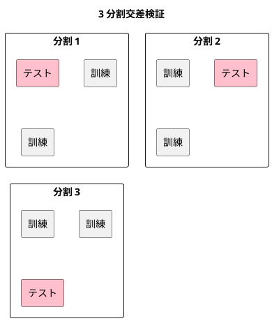

# 第 11 章: 評価指標と交差検証

## 11.1 はじめに

これまでの章では、分類モデルを正解率で、回帰モデルを決定係数や誤差で評価してきました。しかし、1 つの指標と 1 回だけの訓練・テスト分割で「良いモデル」と判断すると、見落としが生まれます。

この章では、次の 2 つを TDD で自作し、Tribuo の評価器と突き合わせます。

- **評価指標**: 分類の混同行列・適合率・再現率・F 値と、回帰の MSE・RMSE・MAE
- **K 分割交差検証**: データを K 個に分け、訓練とテストを K 回入れ替えて評価する方法

あわせて、「どの指標で評価するか」を関数として受け渡す設計を学びます。評価の手順（分割して学習し、予測して採点する）を 1 つの関数にまとめ、採点に使う関数だけを差し替えられるようにします。

[Python 版の第 11 章](../python/11-evaluation-metrics-and-cross-validation.md) と同じ題材を、同じ TODO リストで進めます。Kotlin 版では、評価関数を `(List<T>, List<T>) -> Double` という **関数型** で表し、型引数 `T` で分類（文字列のラベル）と回帰（数値）の両方に使えるようにします。交差検証の結果は **`Sequence`** で返し、遅延評価の性質もテストで確かめます。

## 11.2 正解率だけでは足りない理由

`Survived.csv` は 891 人分の乗客データで、生存（`Survived` が 1）が 342 人、死亡（0）が 549 人です。全員を「死亡」と予測するだけのモデルでも、正解率は 549 / 891 = 0.6162 になります。このモデルは生存者を 1 人も見つけられないのに、正解率だけを見ると 6 割当たっているように見えます。

そこで、予測の当たり外れを 4 つに分けて数える **混同行列** を使います。ここでは「生存」を正例（見つけたいほう）とします。

| | 正例と予測 | 負例と予測 |
|---|-----------|-----------|
| **実際は正例** | TP（真陽性） | FN（偽陰性） |
| **実際は負例** | FP（偽陽性） | TN（真陰性） |

混同行列から、目的に応じた指標を求めます。

| 指標 | 式 | 意味 |
|------|-----|------|
| 適合率（precision） | TP / (TP + FP) | 正例と予測したうち、本当に正例だった割合 |
| 再現率（recall） | TP / (TP + FN) | 本当の正例のうち、正例と予測できた割合 |
| F 値（F1） | 2 × 適合率 × 再現率 / (適合率 + 再現率) | 適合率と再現率の調和平均 |

回帰では、予測と正解の差（誤差）を集計します。

| 指標 | 意味 |
|------|------|
| MSE（平均二乗誤差） | 誤差の 2 乗の平均 |
| RMSE（平均二乗誤差の平方根） | MSE の平方根。正解と同じ単位になる |
| MAE（平均絶対誤差） | 誤差の絶対値の平均 |

RMSE と MAE は、第 7 章で `rootMeanSquaredError`・`meanAbsoluteError` として作りました。この章ではそれを再利用し、MSE だけを足します。

## 11.3 TODO リストの作成

**TODO リスト**:

- [ ] 混同行列を数える
  - [ ] 正例と負例の当たり外れを数える
  - [ ] どちらのラベルを正例にするかを指定できる
  - [ ] 正解と予測の件数が違えばエラーにする
- [ ] 適合率・再現率・F 値を求める
  - [ ] 分母が 0 のときは 0 にする
- [ ] MSE を求め、第 7 章の RMSE・MAE と並べる
- [ ] K 分割のテストデータを作る
  - [ ] ほぼ均等な件数に分ける
  - [ ] どの行もちょうど一度だけテストデータになる
  - [ ] シードで分け方が決まる
- [ ] 交差検証で分割ごとのスコアを求める
  - [ ] 評価関数を差し替えられる
  - [ ] 必要な分だけ学習する（遅延評価）
- [ ] 混同行列の指標を、正解と予測から求める評価関数に変える
- [ ] Tribuo の評価器と結果を突き合わせる
- [ ] 実データで交差検証の平均を表示する

## 11.4 混同行列を数える

### Red: 最初のテスト

評価指標のテストは、`src/test/kotlin/chapter11/` に置きます。正解と予測のリストから、正例 `1` についての混同行列を数えるテストを書きます（テストファイルは 11.11 節で `MetricsTest.kt` と `CrossValidationTest.kt` に分けます。それまでの Red の出力は、分ける前のファイル名 `EvaluationTest.kt` のまま載せます）。

```kotlin
// src/test/kotlin/chapter11/EvaluationTest.kt
package chapter11

import kotlin.test.Test
import kotlin.test.assertEquals

class ConfusionMatrixTest {
    @Test
    fun `正例と負例の予測の当たり外れを数える`() {
        val actual = listOf(1, 1, 1, 0, 0)
        val predicted = listOf(1, 1, 0, 1, 0)

        assertEquals(ConfusionMatrix(tp = 2, fp = 1, fn = 1, tn = 1), confusionMatrix(actual, predicted, positive = 1))
    }
}
```

```bash
./gradlew test --tests "chapter11.*"
```

```text
> Task :compileTestKotlin FAILED
e: .../src/test/kotlin/chapter11/EvaluationTest.kt:12:9 Cannot infer type for type parameter 'T'. Specify it explicitly.
e: .../src/test/kotlin/chapter11/EvaluationTest.kt:12:22 Unresolved reference 'ConfusionMatrix'.
e: .../src/test/kotlin/chapter11/EvaluationTest.kt:12:71 Unresolved reference 'confusionMatrix'.
BUILD FAILED in 9s
```

### Green: 仮実装

混同行列を表す data class `ConfusionMatrix` を定義し、期待値をそのまま返します。

```kotlin
// src/main/kotlin/chapter11/Evaluation.kt
package chapter11

data class ConfusionMatrix(
    val tp: Int,
    val fp: Int,
    val fn: Int,
    val tn: Int,
)

fun confusionMatrix(
    actual: List<Int>,
    predicted: List<Int>,
    positive: Int,
): ConfusionMatrix = ConfusionMatrix(tp = 2, fp = 1, fn = 1, tn = 1)
```

```text
ConfusionMatrixTest > 正例と負例の予測の当たり外れを数える() PASSED
BUILD SUCCESSFUL in 26s
```

### 三角測量

どちらのラベルを正例とみなすかで、数え方は変わります。`positive = 0` を指定する 2 つ目のテストで一般化を促します。

```kotlin
    @Test
    fun `どちらのラベルを正例とするかで数え方が変わる`() {
        val actual = listOf(1, 1, 1, 0, 0, 0)
        val predicted = listOf(1, 0, 0, 0, 0, 1)

        assertEquals(ConfusionMatrix(tp = 2, fp = 2, fn = 1, tn = 1), confusionMatrix(actual, predicted, positive = 0))
    }
```

```text
ConfusionMatrixTest > 正例と負例の予測の当たり外れを数える() PASSED
ConfusionMatrixTest > どちらのラベルを正例とするかで数え方が変わる() FAILED
    org.opentest4j.AssertionFailedError: expected: <ConfusionMatrix(tp=2, fp=2, fn=1, tn=1)> but was: <ConfusionMatrix(tp=2, fp=1, fn=1, tn=1)>
2 tests completed, 1 failed
```

正解と予測を組にし、それぞれが正例かどうかの組 `(実際は正例か, 正例と予測したか)` に変換してから数えます。`(true to true)` が TP、`(false to true)` が FP です。

ラベルは整数に限らず、Survived のように文字列で扱うこともあります。そこで、ラベルの型を **型引数** `T` にします。`fun <T> confusionMatrix(...)` と書くと、呼び出すときの引数から `T` が決まり、`List<Int>` と `positive = 1` なら `T` は `Int`、`List<String>` と `positive = "1"` なら `String` になります。Python 版の `object` と違い、正解・予測・正例のラベルが同じ型であることをコンパイラが確かめます。

```kotlin
fun <T> confusionMatrix(
    actual: List<T>,
    predicted: List<T>,
    positive: T,
): ConfusionMatrix {
    val pairs = actual.zip(predicted) { a, p -> (a == positive) to (p == positive) }
    return ConfusionMatrix(
        tp = pairs.count { it == (true to true) },
        fp = pairs.count { it == (false to true) },
        fn = pairs.count { it == (true to false) },
        tn = pairs.count { it == (false to false) },
    )
}
```

`zip` に関数を渡すと、2 つのリストの同じ位置の要素からその関数で新しい要素を作ります。`a to b` は `Pair(a, b)` を作る中置関数で、`Pair` は data class なので `==` で中身を比べられます。

### 件数が違うときは黙って切り詰めない

Python 版では `zip(actual, predicted, strict=True)` で、件数が違えば例外にしていました。Kotlin の `zip` は、短いほうのリストに合わせて **黙って切り詰めます**。件数の違いを見逃さないことをテストで約束します。

```kotlin
    @Test
    fun `正解と予測の件数が違えばエラーになる`() {
        assertFailsWith<IllegalArgumentException> { confusionMatrix(listOf(1, 0, 1), listOf(1, 0), positive = 1) }
    }
```

```text
ConfusionMatrixTest > 正解と予測の件数が違えばエラーになる() FAILED
    org.opentest4j.AssertionFailedError: Expected an exception of class java.lang.IllegalArgumentException to be thrown, but was completed successfully with the result: <ConfusionMatrix(tp=1, fp=0, fn=0, tn=1)>.
ConfusionMatrixTest > 正例と負例の予測の当たり外れを数える() PASSED
ConfusionMatrixTest > どちらのラベルを正例とするかで数え方が変わる() PASSED
3 tests completed, 1 failed
```

失敗メッセージから、3 件目の正解が捨てられ、2 件分の混同行列が返っていたことが分かります。`require` で件数を確かめます。`require` は条件が偽なら `IllegalArgumentException` を投げます。

```kotlin
): ConfusionMatrix {
    require(actual.size == predicted.size) { "正解と予測の件数が違います" }
    val pairs = actual.zip(predicted) { a, p -> (a == positive) to (p == positive) }
```

## 11.5 適合率・再現率・F 値

### 明白な実装

3 つの指標は定義どおりの式なので、テストをまとめて書き、明白な実装で進めます。同じ混同行列を使うので、テストクラスのプロパティにしました。

```kotlin
class PrecisionRecallF1Test {
    private val cm = ConfusionMatrix(tp = 3, fp = 1, fn = 2, tn = 4)

    @Test
    fun `適合率は正例と予測したうち本当に正例だった割合`() {
        assertEquals(0.75, precision(cm), absoluteTolerance = 1e-12)
    }

    @Test
    fun `再現率は本当の正例のうち正例と予測できた割合`() {
        assertEquals(0.6, recall(cm), absoluteTolerance = 1e-12)
    }

    @Test
    fun `F値は適合率と再現率の調和平均`() {
        assertEquals(2 * 0.75 * 0.6 / (0.75 + 0.6), f1Score(cm), absoluteTolerance = 1e-12)
    }
}
```

```text
> Task :compileTestKotlin FAILED
e: .../src/test/kotlin/chapter11/EvaluationTest.kt:35:28 Unresolved reference 'precision'.
e: .../src/test/kotlin/chapter11/EvaluationTest.kt:40:27 Unresolved reference 'recall'.
e: .../src/test/kotlin/chapter11/EvaluationTest.kt:45:53 Unresolved reference 'f1Score'.
BUILD FAILED in 2s
```

```kotlin
fun precision(cm: ConfusionMatrix): Double = cm.tp.toDouble() / (cm.tp + cm.fp)

fun recall(cm: ConfusionMatrix): Double = cm.tp.toDouble() / (cm.tp + cm.fn)

fun f1Score(cm: ConfusionMatrix): Double {
    val p = precision(cm)
    val r = recall(cm)
    return 2 * p * r / (p + r)
}
```

`cm.tp` は `Int` なので、`toDouble()` で `Double` にしてから割ります。`Int` 同士の割り算は切り捨てになるからです（第 3 章）。

### 分母が 0 になる場合

モデルが正例を 1 件も予測しなければ、適合率の分母 TP + FP は 0 になります。このときの振る舞いをテストで決めます。Python 版と同じく 0 にします。

```kotlin
    @Test
    fun `正例を一件も当てられなければ適合率と再現率とF値は0`() {
        val missed = ConfusionMatrix(tp = 0, fp = 0, fn = 3, tn = 5)

        assertEquals(Triple(0.0, 0.0, 0.0), Triple(precision(missed), recall(missed), f1Score(missed)))
    }
```

```text
PrecisionRecallF1Test > 正例を一件も当てられなければ適合率と再現率とF値は0() FAILED
    org.opentest4j.AssertionFailedError: expected: <(0.0, 0.0, 0.0)> but was: <(NaN, 0.0, NaN)>
7 tests completed, 1 failed
```

Python 版では `ZeroDivisionError` の例外になりましたが、Kotlin では例外になりません。`0.0 / 0` は、浮動小数点数の規格（IEEE 754）どおり **NaN**（非数）になるからです。NaN は計算を進めても NaN のまま広がり、平均を取るとスコア全体が NaN になります。例外より気づきにくいので、テストで捕まえられたのは幸いです。

再現率は分母 TP + FN が 3 なので 0.0 になり、F 値は適合率の NaN を引き継いでいます。分母が 0 なら 0 を返す `ratio` を用意し、3 つの指標から使います。

```kotlin
private fun ratio(
    numerator: Double,
    denominator: Double,
): Double = if (denominator == 0.0) 0.0 else numerator / denominator

fun precision(cm: ConfusionMatrix): Double = ratio(cm.tp.toDouble(), (cm.tp + cm.fp).toDouble())

fun recall(cm: ConfusionMatrix): Double = ratio(cm.tp.toDouble(), (cm.tp + cm.fn).toDouble())

fun f1Score(cm: ConfusionMatrix): Double {
    val p = precision(cm)
    val r = recall(cm)
    return ratio(2 * p * r, p + r)
}
```

**TODO リスト**:

- [x] 混同行列を数える
  - [x] 正例と負例の当たり外れを数える
  - [x] どちらのラベルを正例にするかを指定できる
  - [x] 正解と予測の件数が違えばエラーにする
- [x] 適合率・再現率・F 値を求める
  - [x] 分母が 0 のときは 0 にする
- [ ] MSE を求め、第 7 章の RMSE・MAE と並べる
- [ ] K 分割のテストデータを作る
- [ ] 交差検証で分割ごとのスコアを求める
- [ ] 混同行列の指標を、正解と予測から求める評価関数に変える
- [ ] Tribuo の評価器と結果を突き合わせる
- [ ] 実データで交差検証の平均を表示する

## 11.6 回帰の評価指標

誤差 -1・0・2 の 3 件について、MSE は (1 + 0 + 4) / 3、MAE は (1 + 0 + 2) / 3 = 1 です。RMSE と MAE は第 7 章の関数を import して使い、MSE だけを新しく作ります。

```kotlin
import chapter07.meanAbsoluteError
import chapter07.rootMeanSquaredError
import kotlin.math.sqrt

class RegressionMetricsTest {
    @Test
    fun `誤差の2乗の平均と平方根と絶対値の平均を求める`() {
        val actual = listOf(3.0, 5.0, 8.0)
        val predicted = listOf(2.0, 5.0, 10.0)

        assertEquals(5.0 / 3, meanSquaredError(actual, predicted), absoluteTolerance = 1e-12)
        assertEquals(sqrt(5.0 / 3), rootMeanSquaredError(actual, predicted), absoluteTolerance = 1e-12)
        assertEquals(1.0, meanAbsoluteError(actual, predicted), absoluteTolerance = 1e-12)
    }
}
```

```text
e: .../src/test/kotlin/chapter11/EvaluationTest.kt:65:31 Unresolved reference 'meanSquaredError'.
> Task :compileTestKotlin FAILED
BUILD FAILED in 22s
```

```kotlin
fun meanSquaredError(
    actual: List<Double>,
    predicted: List<Double>,
): Double = actual.zip(predicted) { a, p -> (p - a) * (p - a) }.average()
```

第 7 章の関数の引数は `(t: List<Double>, y: List<Double>)`、つまり（正解, 予測）の順です。MSE も同じ順にそろえたので、この 3 つは 11.8 節で同じ **関数型** の値として扱えます。

### 学習用テスト: 外れた予測への敏感さ

RMSE と MAE の違いを、学習用テストで確かめておきます。あわせて、MSE にも混同行列と同じ件数の確認を求めるテストを足します。

```kotlin
    @Test
    fun `大きく外れた予測があるとRMSEはMAEより大きく増える`() {
        val actual = listOf(3.0, 5.0, 8.0, 10.0)
        val predicted = listOf(2.0, 5.0, 10.0, 30.0)

        assertEquals(sqrt(101.25), rootMeanSquaredError(actual, predicted), absoluteTolerance = 1e-12)
        assertEquals(5.75, meanAbsoluteError(actual, predicted), absoluteTolerance = 1e-12)
    }

    @Test
    fun `MSEも正解と予測の件数が違えばエラーになる`() {
        assertFailsWith<IllegalArgumentException> { meanSquaredError(listOf(1.0, 2.0), listOf(1.0)) }
    }
```

```text
RegressionMetricsTest > MSEも正解と予測の件数が違えばエラーになる() FAILED
    org.opentest4j.AssertionFailedError: Expected an exception of class java.lang.IllegalArgumentException to be thrown, but was completed successfully with the result: <0.0>.
RegressionMetricsTest > 大きく外れた予測があるとRMSEはMAEより大きく増える() PASSED
RegressionMetricsTest > 誤差の2乗の平均と平方根と絶対値の平均を求める() PASSED
10 tests completed, 1 failed
```

4 件目だけ大きく外した予測（誤差 20）を加えると、MAE は 5.75 なのに対し、RMSE は誤差を 2 乗してから平均するので約 10.06 まで増えます。大きな外れを重く見たいなら RMSE、外れに引きずられずに典型的な誤差を知りたいなら MAE を使います。

MSE は、件数が違っても 1 件目どうしだけで計算して 0.0 を返していました。混同行列と同じく `require` を足します。

```kotlin
): Double {
    require(actual.size == predicted.size) { "正解と予測の件数が違います" }
    return actual.zip(predicted) { a, p -> (p - a) * (p - a) }.average()
}
```

## 11.7 K 分割交差検証

### なぜ分割を入れ替えるのか

第 2 章では、データを 1 回だけ訓練データとテストデータに分けました。この方法では、たまたま予測しやすい行がテストデータに集まると、評価が実力より良く出ます。K 分割交差検証では、データを K 個のグループに分け、1 つをテストデータ、残りを訓練データにして K 回評価し、その平均を見ます。どの行も一度だけテストデータになるので、分け方の偶然に左右されにくくなります。



### 仮実装と三角測量

10 件を 3 つに分けると、テストデータの件数は 4・3・3 になります（余りは先頭の分割に 1 件ずつ足します）。

```kotlin
class KFoldTest {
    @Test
    fun `データをk個のテストデータにほぼ均等に分ける`() {
        val folds = kFold(nSamples = 10, nSplits = 3, seed = 0)

        assertEquals(listOf(4, 3, 3), folds.map { it.test.size })
    }
}
```

```text
> Task :compileTestKotlin FAILED
e: .../src/test/kotlin/chapter11/EvaluationTest.kt:88:21 Unresolved reference 'kFold'.
e: .../src/test/kotlin/chapter11/EvaluationTest.kt:90:51 Unresolved reference 'it'.
BUILD FAILED in 2s
```

分割を表す data class `Fold` を定義し、行番号を 4 と 7 の位置で切る仮実装にします。

```kotlin
data class Fold(
    val train: List<Int>,
    val test: List<Int>,
)

fun kFold(
    nSamples: Int,
    nSplits: Int,
    seed: Int,
): List<Fold> {
    val positions = (0 until nSamples).toList()
    val tests = listOf(positions.subList(0, 4), positions.subList(4, 7), positions.subList(7, 10))
    return tests.map { test -> Fold(train = positions - test.toSet(), test = test) }
}
```

`positions - test.toSet()` は、リストから集合に含まれる要素を除いた新しいリストを返します。訓練データは「テストデータ以外の行」です。

件数と分割数を変えたテストで、ベタ書きの切り位置を崩します。

```kotlin
    @Test
    fun `件数と分割数が変わってもほぼ均等に分ける`() {
        val folds = kFold(nSamples = 7, nSplits = 2, seed = 0)

        assertEquals(listOf(4, 3), folds.map { it.test.size })
    }
```

```text
KFoldTest > データをk個のテストデータにほぼ均等に分ける() PASSED
KFoldTest > 件数と分割数が変わってもほぼ均等に分ける() FAILED
    java.lang.IndexOutOfBoundsException: toIndex = 10
12 tests completed, 1 failed
```

Python 版は NumPy の `np.array_split` に任せましたが、Kotlin の標準ライブラリには同じ関数が無いので、分け方を自分で書きます。

```kotlin
    val positions = (0 until nSamples).toList()
    val sizes = List(nSplits) { i -> nSamples / nSplits + if (i < nSamples % nSplits) 1 else 0 }
    val tests = sizes.runningFold(0, Int::plus).zipWithNext { from, to -> positions.subList(from, to) }
    return tests.map { test -> Fold(train = positions - test.toSet(), test = test) }
```

- `sizes` は分割ごとの件数です。10 件を 3 分割なら、商 3 に、余り 1 を先頭から配って `[4, 3, 3]` になります
- `runningFold(0, Int::plus)` は、0 から始めて件数を足していった途中経過をすべて並べます。`[4, 3, 3]` なら `[0, 4, 7, 10]` で、これが切り位置です
- `zipWithNext` は隣り合う 2 つを組にします。`(0, 4)`・`(4, 7)`・`(7, 10)` の組から、`subList(from, to)` でテストデータを切り出します

```text
KFoldTest > データをk個のテストデータにほぼ均等に分ける() PASSED
KFoldTest > 件数と分割数が変わってもほぼ均等に分ける() PASSED
BUILD SUCCESSFUL in 9s
```

### 分け方の性質をテストで固定する

交差検証として正しく使えることを、性質のテストで確かめます。

```kotlin
    @Test
    fun `どの行もちょうど一度だけテストデータになる`() {
        val folds = kFold(nSamples = 10, nSplits = 3, seed = 0)

        assertEquals((0 until 10).toList(), folds.flatMap { it.test }.sorted())
    }

    @Test
    fun `各分割の訓練データはテストデータ以外のすべての行`() {
        val folds = kFold(nSamples = 10, nSplits = 3, seed = 0)

        for (fold in folds) {
            assertEquals(emptySet(), fold.train.toSet() intersect fold.test.toSet())
            assertEquals((0 until 10).toSet(), fold.train.toSet() + fold.test)
        }
    }

    @Test
    fun `同じシードなら同じ分け方になる`() {
        val first = kFold(nSamples = 10, nSplits = 3, seed = 42)
        val second = kFold(nSamples = 10, nSplits = 3, seed = 42)

        assertEquals(first.map { it.test }, second.map { it.test })
    }

    @Test
    fun `シードが違えば違う分け方になる`() {
        val first = kFold(nSamples = 10, nSplits = 3, seed = 0)
        val second = kFold(nSamples = 10, nSplits = 3, seed = 1)

        assertNotEquals(first.map { it.test }, second.map { it.test })
    }
```

最後のテストだけが失敗します。いまの実装は先頭から順に分けているだけで、シードを使っていないからです。

```text
KFoldTest > シードが違えば違う分け方になる() FAILED
    org.opentest4j.AssertionFailedError: expected: not equal but was: <[[0, 1, 2, 3], [4, 5, 6], [7, 8, 9]]>
KFoldTest > データをk個のテストデータにほぼ均等に分ける() PASSED
KFoldTest > 各分割の訓練データはテストデータ以外のすべての行() PASSED
KFoldTest > 同じシードなら同じ分け方になる() PASSED
KFoldTest > 件数と分割数が変わってもほぼ均等に分ける() PASSED
KFoldTest > どの行もちょうど一度だけテストデータになる() PASSED
16 tests completed, 1 failed
```

第 2 章の `splitTrainTest` と同じく、シード付きの乱数生成器で行番号を並べ替えてから分けます。変えるのは 1 行だけです。

```kotlin
    val positions = (0 until nSamples).shuffled(Random(seed))
```

```text
BUILD SUCCESSFUL in 9s
```

データが元の並び（たとえば生存者が先頭に集まっている）のまま分けると、分割ごとに正例の割合が偏ります。並べ替えはそれを避けるためにも必要です。

## 11.8 評価関数を関数型として渡す

### 交差検証の手順を 1 つの関数にする

交差検証の手順は、どのモデル・どの指標でも同じです。

1. 分割ごとに新しいモデルを作る
2. 訓練データで学習する
3. テストデータを予測し、評価関数で採点する

変わるのは「どのモデルを作るか」と「どう採点するか」だけなので、この 2 つを **関数として引数で受け取る** 高階関数 `crossValidate` にします。テストでは、訓練データの正解の平均を常に予測するだけのテスト用モデル `MeanModel` を使い、手で計算できる小さな例にします。

```kotlin
/** 訓練データの正解の平均値を常に予測するテスト用のモデル */
private class MeanModel : Model<Double> {
    private var mean = 0.0

    override fun fit(
        x: AnyFrame,
        t: List<Double>,
    ) {
        mean = t.average()
    }

    override fun predict(x: AnyFrame): List<Double> = List(x.rowsCount()) { mean }
}

class CrossValidateTest {
    private val x = dataFrameOf("feature" to listOf(10, 20, 30, 40))
    private val t = listOf(1.0, 2.0, 3.0, 4.0)
    private val folds =
        listOf(
            Fold(train = listOf(0, 1), test = listOf(2, 3)),
            Fold(train = listOf(2, 3), test = listOf(0, 1)),
        )

    @Test
    fun `分割ごとに訓練データで学習してテストデータを評価する`() {
        val scores = crossValidate(::MeanModel, x, t, folds, ::meanAbsoluteError)

        assertEquals(listOf(2.0, 2.0), scores)
    }
}
```

1 つ目の分割は、正解 1・2 で学習して平均 1.5 を予測し、正解 3・4 との MAE が 2.0 になります。2 つ目の分割も同様に 2.0 です。

- `::MeanModel` は **コンストラクター参照** です。「呼び出すと `MeanModel` を作る関数」として渡せます。Python 版でクラスそのものを渡したことに相当します
- `::meanAbsoluteError` は第 7 章の関数への **関数参照** です

```text
> Task :compileTestKotlin FAILED
e: .../src/test/kotlin/chapter11/EvaluationTest.kt:138:27 Unresolved reference 'Model'.
e: .../src/test/kotlin/chapter11/EvaluationTest.kt:162:22 Unresolved reference 'crossValidate'.
BUILD FAILED in 4s
```

モデルに求めるのは `fit` と `predict` を持つことだけです。これを interface `Model<T>` で表します。第 10 章の `Classifier` は文字列のラベル専用でしたが、交差検証は回帰にも使うので、正解ラベルの型を型引数 `T` にしました。評価関数の型には `typealias` で `Metric<T>` という別名を付けます。まず仮実装です。

```kotlin
interface Model<T> {
    fun fit(
        x: AnyFrame,
        t: List<T>,
    )

    fun predict(x: AnyFrame): List<T>
}

typealias Metric<T> = (List<T>, List<T>) -> Double

fun <T> crossValidate(
    makeModel: () -> Model<T>,
    x: AnyFrame,
    t: List<T>,
    folds: List<Fold>,
    metric: Metric<T>,
): List<Double> = listOf(2.0, 2.0)
```

- `() -> Model<T>` は「引数を取らず、`Model<T>` を返す関数」の型です
- `(List<T>, List<T>) -> Double` は「正解と予測のリストを受け取り、数値を返す関数」の型です。第 7 章の `meanAbsoluteError` の型は `(List<Double>, List<Double>) -> Double` なので、`Metric<Double>` としてそのまま渡せます
- `typealias` は新しい型を作るのではなく、長い型に名前を付けるだけです

### 三角測量: 評価関数を差し替える

同じ分割に MSE を渡すテストを追加します。誤差は 1.5 と 2.5 なので、MSE は (2.25 + 6.25) / 2 = 4.25 です。

```kotlin
    @Test
    fun `評価関数を差し替えると別の指標で評価する`() {
        val scores = crossValidate(::MeanModel, x, t, folds, ::meanSquaredError)

        assertEquals(listOf(4.25, 4.25), scores)
    }
```

```text
CrossValidateTest > 評価関数を差し替えると別の指標で評価する() FAILED
    org.opentest4j.AssertionFailedError: expected: <[4.25, 4.25]> but was: <[2.0, 2.0]>
CrossValidateTest > 分割ごとに訓練データで学習してテストデータを評価する() PASSED
18 tests completed, 1 failed
```

受け取った `makeModel` で分割ごとに新しいモデルを作り、受け取った `metric` で採点します。

```kotlin
): List<Double> =
    folds.map { fold ->
        val model = makeModel()
        model.fit(x[fold.train], t.slice(fold.train))
        metric(t.slice(fold.test), model.predict(x[fold.test]))
    }
```

`x[fold.train]` は行番号のリストでデータフレームの行を取り出し、`t.slice(fold.train)` はリストで同じことをします（第 2 章）。分割ごとに新しいモデルを作るのは、前の分割で学習した状態を次の分割に持ち込まないためです。

### 必要な分だけ学習する: Sequence

交差検証は、分割の数だけ学習を繰り返すので時間がかかります。Notebook で「まず最初の分割のスコアだけ見たい」というときに、全分割を学習するのは無駄です。そこで、取り出したスコアの分だけ学習する、という振る舞いをテストで求めます。作ったモデルの数を数えるため、`makeModel` をラムダで包みます。

```kotlin
    @Test
    fun `最初の分割のスコアだけを取り出すなら学習は1回で済む`() {
        var created = 0
        val makeModel = {
            created++
            MeanModel()
        }

        crossValidate(makeModel, x, t, folds, ::meanAbsoluteError).first()

        assertEquals(1, created)
    }
```

```text
CrossValidateTest > 最初の分割のスコアだけを取り出すなら学習は1回で済む() FAILED
    org.opentest4j.AssertionFailedError: expected: <1> but was: <2>
CrossValidateTest > 評価関数を差し替えると別の指標で評価する() PASSED
CrossValidateTest > 分割ごとに訓練データで学習してテストデータを評価する() PASSED
19 tests completed, 1 failed
```

ラムダは外側の変数 `created` を書き換えられます（クロージャ）。`List` の `map` は、呼んだ時点ですべての要素を計算するので、`first()` しか使わなくても 2 つの分割を学習していました。

戻り値を `Sequence<Double>` に変え、`folds.asSequence().map { ... }` にします。`Sequence` の `map` は、要素を取り出すときに初めて関数を呼ぶ **遅延評価** です。

```kotlin
): Sequence<Double> =
    folds.asSequence().map { fold ->
        val model = makeModel()
        model.fit(x[fold.train], t.slice(fold.train))
        metric(t.slice(fold.test), model.predict(x[fold.test]))
    }
```

最初の 2 つのテストは、`Sequence` とリストを比べることになるので、`scores.toList()` で取り出して比べる形に直しました。

```text
CrossValidateTest > 最初の分割のスコアだけを取り出すなら学習は1回で済む() PASSED
CrossValidateTest > 評価関数を差し替えると別の指標で評価する() PASSED
CrossValidateTest > 分割ごとに訓練データで学習してテストデータを評価する() PASSED
BUILD SUCCESSFUL in 9s
```

遅延評価には注意点もあります。`Sequence` は計算結果を覚えていないので、**取り出すたびに計算し直します**。この性質を学習用テストで確かめておきます。

```kotlin
    @Test
    fun `シーケンスからスコアを取り出すたびに学習し直す`() {
        var created = 0
        val makeModel = {
            created++
            MeanModel()
        }
        val scores = crossValidate(makeModel, x, t, folds, ::meanAbsoluteError)

        scores.toList()
        scores.toList()

        assertEquals(4, created)
    }
```

2 回取り出すと、2 分割 × 2 回で 4 回学習します。同じスコアを何度も使うなら、一度 `toList()` でリストにしてから使います。

### 混同行列の指標を評価関数に変える

`crossValidate` が受け取る評価関数は「正解と予測から数値を返す関数」です。一方、`precision` などは混同行列を受け取ります。そこで、混同行列の指標と正例のラベルを受け取り、評価関数を **返す** 高階関数 `classificationMetric` を作ります。あわせて正解率 `accuracy` も評価関数として用意します。

```kotlin
class ClassificationMetricTest {
    @Test
    fun `正解率は正解と予測が一致した割合`() {
        assertEquals(0.75, accuracy(listOf(1, 0, 1, 0), listOf(1, 1, 1, 0)), absoluteTolerance = 1e-12)
    }

    @Test
    fun `混同行列から求める指標を正解と予測から求める評価関数に変える`() {
        val actual = listOf(1, 1, 1, 0, 0)
        val predicted = listOf(1, 0, 0, 1, 0)

        val precisionMetric = classificationMetric(::precision, positive = 1)
        val recallMetric = classificationMetric(::recall, positive = 1)

        assertEquals(0.5, precisionMetric(actual, predicted), absoluteTolerance = 1e-12)
        assertEquals(1.0 / 3, recallMetric(actual, predicted), absoluteTolerance = 1e-12)
    }
}
```

```text
> Task :compileTestKotlin FAILED
e: .../src/test/kotlin/chapter11/EvaluationTest.kt:206:28 Unresolved reference 'accuracy'.
e: .../src/test/kotlin/chapter11/EvaluationTest.kt:214:31 Unresolved reference 'classificationMetric'.
e: .../src/test/kotlin/chapter11/EvaluationTest.kt:215:28 Unresolved reference 'classificationMetric'.
e: .../src/test/kotlin/chapter11/EvaluationTest.kt:217:27 Unresolved reference 'precisionMetric'.
e: .../src/test/kotlin/chapter11/EvaluationTest.kt:218:31 Unresolved reference 'recallMetric'.
BUILD FAILED in 4s
```

```kotlin
fun <T> accuracy(
    actual: List<T>,
    predicted: List<T>,
): Double = actual.zip(predicted).count { (a, p) -> a == p }.toDouble() / actual.size

fun <T> classificationMetric(
    score: (ConfusionMatrix) -> Double,
    positive: T,
): Metric<T> = { actual, predicted -> score(confusionMatrix(actual, predicted, positive)) }
```

- `classificationMetric` は、ラムダ `{ actual, predicted -> ... }` を返します。ラムダは外側の引数 `score` と `positive` を覚えたまま返されます（クロージャ）
- 戻り値の型が `Metric<T>` と決まっているので、ラムダの引数 `actual`・`predicted` の型は書かなくてもコンパイラが `List<T>` だと分かります
- 第 1 章にも `accuracy` がありますが、引数が（予測, 正解）の順で文字列専用です。この章では（正解, 予測）の順にそろえた型引数付きの `accuracy` を `chapter11` パッケージに作りました。パッケージが違うので名前は衝突しません

### 正解率でも件数を確かめる

正解率にも、件数が違う場合のテストを足します。

```kotlin
    @Test
    fun `正解率も正解と予測の件数が違えばエラーになる`() {
        assertFailsWith<IllegalArgumentException> { accuracy(listOf(1, 0, 1), listOf(1, 0)) }
    }
```

```text
ClassificationMetricTest > 正解率も正解と予測の件数が違えばエラーになる() FAILED
    org.opentest4j.AssertionFailedError: Expected an exception of class java.lang.IllegalArgumentException to be thrown, but was completed successfully with the result: <0.6666666666666666>.
```

`zip` が 2 件に切り詰めて 2 件とも一致したのに、割る数は正解の件数 3 のままなので、0.6667 というもっともらしい値が返っていました。例外にも NaN にもならない、いちばん気づきにくい誤りです。

`require` による件数の確認が 3 か所になったので、関数に取り出して共通にします。メッセージには件数も入れました。

```kotlin
private fun requireSameSize(
    actual: List<*>,
    predicted: List<*>,
) = require(actual.size == predicted.size) { "正解と予測の件数が違います（正解 ${actual.size} 件、予測 ${predicted.size} 件）" }
```

```kotlin
fun <T> accuracy(
    actual: List<T>,
    predicted: List<T>,
): Double {
    requireSameSize(actual, predicted)
    return actual.zip(predicted).count { (a, p) -> a == p }.toDouble() / actual.size
}
```

`List<*>` は「要素の型を問わないリスト」（スター投影）です。件数しか見ないので、`List<Int>` でも `List<Double>` でも受け取れます。

```text
BUILD SUCCESSFUL in 18s
```

これで、指標を「正解と予測から数値を返す関数」という 1 つの形にそろえられました。交差検証の側は、渡された関数がどの指標なのかを知る必要がありません。

## 11.9 Tribuo の評価器と突き合わせる

自作した指標と分割が、Tribuo の評価器と同じ結果になることを学習用テストで確かめます。予測には、第 3 章の `trainTribuoTree` で学習した Tribuo の決定木（深さ 1）を使い、その予測から自作の指標と Tribuo の `LabelEvaluator` の両方で採点します。データは架空の 10 件です。

```kotlin
// src/test/kotlin/chapter11/TribuoEvaluationTest.kt
import chapter03.predictWithTribuo
import chapter03.toTribuoDataset
import chapter03.trainTribuoTree
import org.jetbrains.kotlinx.dataframe.AnyFrame
import org.jetbrains.kotlinx.dataframe.api.dataFrameOf
import org.tribuo.classification.Label
import org.tribuo.classification.evaluation.LabelEvaluator
import org.tribuo.evaluation.KFoldSplitter
import org.tribuo.regression.evaluation.RegressionEvaluator
import kotlin.test.Test
import kotlin.test.assertEquals
import chapter07.predictWithTribuo as predictRegressionWithTribuo
import chapter07.toRegressionDataset as toTribuoRegressionDataset
import chapter07.trainTribuoLinearRegression as trainTribuoRegression

class TribuoLabelEvaluatorTest {
    private val x = dataFrameOf("feature" to listOf(0.1, 0.2, 0.3, 0.4, 0.5, 0.6, 0.7, 0.8, 0.9, 1.0))
    private val t = listOf("0", "0", "1", "0", "0", "1", "1", "0", "1", "1")
    private val model = trainTribuoTree(x, t, maxDepth = 1, minChildWeight = 1.0f)
    private val predicted = predictWithTribuo(model, x)
    private val evaluation = LabelEvaluator().evaluate(model, toTribuoDataset(x, t))
    private val positive = Label("1")

    @Test
    fun `混同行列がTribuoの評価器と一致する`() {
        val cm = confusionMatrix(t, predicted, positive = "1")

        val tribuo = evaluation.confusionMatrix
        assertEquals(
            listOf(tribuo.tp(positive), tribuo.fp(positive), tribuo.fn(positive), tribuo.tn(positive)),
            listOf(cm.tp, cm.fp, cm.fn, cm.tn).map { it.toDouble() },
        )
    }

    @Test
    fun `正解率と適合率と再現率とF値がTribuoの評価器と一致する`() {
        val cm = confusionMatrix(t, predicted, positive = "1")

        assertEquals(evaluation.accuracy(), accuracy(t, predicted), absoluteTolerance = 1e-12)
        assertEquals(evaluation.precision(positive), precision(cm), absoluteTolerance = 1e-12)
        assertEquals(evaluation.recall(positive), recall(cm), absoluteTolerance = 1e-12)
        assertEquals(evaluation.f1(positive), f1Score(cm), absoluteTolerance = 1e-12)
    }

    @Test
    fun `正例を一件も予測しなければTribuoの評価器も適合率と再現率とF値を0にする`() {
        // 深さ 0 の木は、訓練データの多数派の "0" だけを予測する
        val neverPositive = trainTribuoTree(x, List(10) { if (it == 9) "1" else "0" }, maxDepth = 0, minChildWeight = 1.0f)

        val zero = LabelEvaluator().evaluate(neverPositive, toTribuoDataset(x, t))

        assertEquals(listOf(0.0, 0.0, 0.0), listOf(zero.precision(positive), zero.recall(positive), zero.f1(positive)))
    }
}

class TribuoRegressionEvaluatorTest {
    @Test
    fun `MSEはTribuoの評価器のRMSEの2乗と一致する`() {
        val x = dataFrameOf("feature" to listOf(1.0, 2.0, 3.0, 4.0, 5.0, 6.0))
        val t = listOf(1.1, 2.3, 2.8, 4.4, 4.9, 6.2)
        val model = trainTribuoRegression(x, t)

        val rmse =
            RegressionEvaluator()
                .evaluate(model, toTribuoRegressionDataset(x, t))
                .rmse()
                .values
                .single()

        assertEquals(rmse * rmse, meanSquaredError(t, predictRegressionWithTribuo(model, x)), absoluteTolerance = 1e-9)
    }
}

class TribuoKFoldSplitterTest {
    private fun tribuoTestSizes(
        nSamples: Int,
        nSplits: Int,
    ): List<Int> {
        val x = dataFrameOf("feature" to (0 until nSamples).map { it.toDouble() })
        val dataset = toTribuoDataset(x, List(nSamples) { if (it < nSamples / 2) "0" else "1" })
        return KFoldSplitter<Label>(nSplits, 0L)
            .split(dataset, true)
            .asSequence()
            .map { it.test.size() }
            .toList()
    }

    @Test
    fun `分割ごとのテストデータの件数がTribuoのKFoldSplitterと一致する`() {
        for ((nSamples, nSplits) in listOf(10 to 3, 7 to 2, 11 to 4)) {
            assertEquals(
                tribuoTestSizes(nSamples, nSplits),
                kFold(nSamples, nSplits, seed = 0).map { it.test.size },
                "$nSamples 件を $nSplits 分割",
            )
        }
    }
}
```

- `import chapter07.predictWithTribuo as predictRegressionWithTribuo` は、**別名を付けて import** する書き方です。第 3 章と第 7 章に同じ名前の `predictWithTribuo` があるので、回帰のほうに別名を付けて区別しています
- `evaluation.confusionMatrix` は、Java の `getConfusionMatrix()` をプロパティとして呼ぶ書き方です
- Tribuo の混同行列の件数は `Double` で返るので、自作の `Int` を `toDouble()` にそろえて比べています
- `KFoldSplitter.split` は Java の `Iterator` を返します。`asSequence()` で `Sequence` にしてから件数を取り出しています

同じ分割を渡したときに、交差検証の平均も一致することを確かめます。Tribuo の決定木を、この章の `Model` として使うアダプターを用意します。

```kotlin
/** Tribuo の CART を第 11 章の Model として使うテスト用のアダプター */
internal class TribuoTree(
    private val maxDepth: Int,
) : Model<String> {
    private var model: org.tribuo.Model<Label>? = null

    override fun fit(
        x: AnyFrame,
        t: List<String>,
    ) {
        model = trainTribuoTree(x, t, maxDepth, minChildWeight = 1.0f)
    }

    override fun predict(x: AnyFrame): List<String> = predictWithTribuo(checkNotNull(model), x)
}

class TribuoCrossValidateTest {
    @Test
    fun `同じ分割ならTribuoの評価器で採点した正解率の平均と一致する`() {
        val x = dataFrameOf("feature" to (1..20).map { it * 0.05 })
        val t = (1..20).map { if (it % 3 == 0 || it > 12) "1" else "0" }
        val folds = kFold(nSamples = 20, nSplits = 4, seed = 0)

        val tribuoScores =
            folds.map { fold ->
                val model = trainTribuoTree(x[fold.train], t.slice(fold.train), maxDepth = 1, minChildWeight = 1.0f)
                LabelEvaluator().evaluate(model, toTribuoDataset(x[fold.test], t.slice(fold.test))).accuracy()
            }

        val scores = crossValidate({ TribuoTree(maxDepth = 1) }, x, t, folds, ::accuracy)
        assertEquals(tribuoScores.average(), scores.average(), absoluteTolerance = 1e-12)
    }
}
```

`private var model: org.tribuo.Model<Label>?` のように完全修飾名で書いているのは、同じパッケージの `chapter11.Model` と名前が重なるためです。`internal` にしたのは、11.10 節の実データのテストからも使うためです。

```text
TribuoCrossValidateTest > 同じ分割ならTribuoの評価器で採点した正解率の平均と一致する() PASSED
TribuoKFoldSplitterTest > 分割ごとのテストデータの件数がTribuoのKFoldSplitterと一致する() PASSED
TribuoLabelEvaluatorTest > 混同行列がTribuoの評価器と一致する() PASSED
TribuoLabelEvaluatorTest > 正例を一件も予測しなければTribuoの評価器も適合率と再現率とF値を0にする() PASSED
TribuoLabelEvaluatorTest > 正解率と適合率と再現率とF値がTribuoの評価器と一致する() PASSED
TribuoRegressionEvaluatorTest > MSEはTribuoの評価器のRMSEの2乗と一致する() PASSED
BUILD SUCCESSFUL in 23s
```

突き合わせで分かった Tribuo の約束事をまとめます。

- `LabelEvaluator` の評価結果（`LabelEvaluation`）は、ラベルを指定して `precision(Label)`・`recall(Label)`・`f1(Label)` を返す。どのラベルを正例とするかを呼び出すたびに指定する設計で、自作の `positive` と同じ考え方
- 正例を一度も予測しない場合、Tribuo も適合率・再現率・F 値を 0.0 にする。NaN にはならない
- `RegressionEvaluator` には MSE が無く、RMSE の 2 乗が自作の MSE と一致する（MAE・RMSE・R² が第 7 章の自作と一致することは、第 7 章で確かめた）
- `KFoldSplitter` と自作の `kFold` は、テストデータの件数の配り方（余りを先頭から配る）が、試した 3 通りで一致した。並べ替えの乱数は別の実装なので、同じシードでも行の割り当ては一致しない
- Tribuo の `CrossValidation` は分割を自分で作るので、分割を渡すことはできない。同じ分割で比べるときは、分割ごとに学習して `LabelEvaluator` で採点する

## 11.10 実データで評価する

### 簡略化した前処理

交差検証にかけるには、欠損値や文字列の列を数値にしておく必要があります。前処理パイプラインは第 8 章で詳しく扱うので、この章ではそれを簡略化したものを `src/main/kotlin/chapter11/Datasets.kt` に置きます。

- `Survived.csv`: 特徴量を客室クラス（`Pclass`）・年齢（`Age`、177 件の欠損を平均値で補完）・男性かどうか（`Sex` を 0/1 に変換した `male`）の 3 列にし、`Survived` を文字列の正解ラベル `"0"`・`"1"` にする
- `cinema.csv`（100 件）: 特徴量を `SNS1`・`SNS2`・`actor`・`original` の 4 列にして欠損値（`SNS1` と `actor` に 1 件ずつ）を平均値で補完し、興行収入 `sales` を正解ラベルにする

正解ラベルを文字列にしたのは、第 3 章の決定木が `List<String>` のラベルを学習するからです。テストは架空の値の小さなデータフレームで書きます。

```kotlin
class PrepareSurvivedTest {
    @Test
    fun `客室クラスと年齢と男性かどうかを特徴量にし生存を正解ラベルにする`() {
        val df =
            dataFrameOf(
                "PassengerId" to listOf(1, 2),
                "Survived" to listOf(0, 1),
                "Pclass" to listOf(3, 1),
                "Sex" to listOf("male", "female"),
                "Age" to listOf(30.0, 40.0),
                "Fare" to listOf(8.0, 60.0),
            )

        val (x, t) = prepareSurvived(df)

        assertEquals(listOf("Pclass", "Age", "male"), x.columnNames())
        assertEquals(listOf(listOf<Any?>(3, 1), listOf<Any?>(30.0, 40.0), listOf<Any?>(1, 0)), x.columns().map { it.toList() })
        assertEquals(listOf("0", "1"), t)
    }
}
```

```text
> Task :compileTestKotlin FAILED
e: .../src/test/kotlin/chapter11/DatasetsTest.kt:20:22 Unresolved reference 'prepareSurvived'.
e: .../src/test/kotlin/chapter11/DatasetsTest.kt:20:22 Operator call 'component1()' is ambiguous for destructuring of type '??? (Unresolved name: prepareSurvived)'. Applicable candidates:
e: .../src/test/kotlin/chapter11/DatasetsTest.kt:20:22 Operator call 'component2()' is ambiguous for destructuring of type '??? (Unresolved name: prepareSurvived)'. Applicable candidates:
e: .../src/test/kotlin/chapter11/DatasetsTest.kt:22:57 Unresolved reference 'columnNames'.
e: .../src/test/kotlin/chapter11/DatasetsTest.kt:23:98 Unresolved reference 'columns'.
e: .../src/test/kotlin/chapter11/DatasetsTest.kt:23:114 Unresolved reference 'it'.
BUILD FAILED in 7s
```

年齢の欠損値を補完するテストを追加した時点では、年齢をそのまま使っていたので失敗しました。

```kotlin
    @Test
    fun `年齢の欠損値を年齢の平均値で補完する`() {
        val df =
            dataFrameOf(
                "Survived" to listOf(0, 1, 1),
                "Pclass" to listOf(3, 1, 2),
                "Sex" to listOf("male", "female", "female"),
                "Age" to listOf(20.0, null, 40.0),
            )

        val (x, _) = prepareSurvived(df)

        assertEquals(listOf(20.0, 30.0, 40.0), x["Age"].toList())
    }
```

```text
PrepareSurvivedTest > 年齢の欠損値を年齢の平均値で補完する() FAILED
    org.opentest4j.AssertionFailedError: expected: <[20.0, 30.0, 40.0]> but was: <[20.0, null, 40.0]>
```

補完には、第 2 章の `columnMeans` と `fillMissing` をそのまま使います。`cinema.csv` の前処理も、テストを先に書いてから作りました（テストは完成コードを参照してください）。第 7 章で分かったとおり、Kotlin DataFrame は `SNS1` のような整数の列を `Int?` として読むので、平均値（小数）を入れる前に `convertToDouble()` で `Double` の列に変換します。テストのデータでも `SNS1` を整数と `null` で作り、この落とし穴を再現しています。

```kotlin
fun prepareSurvived(df: AnyFrame): Pair<AnyFrame, List<String>> {
    val features =
        dataFrameOf(
            "Pclass" to df["Pclass"].toList(),
            "Age" to df["Age"].toList(),
            "male" to df["Sex"].values().map { if (it == "male") 1 else 0 },
        )
    val x = fillMissing(features, columnMeans(features, listOf("Age")))
    return x to df["Survived"].values().map { it.toString() }
}

fun prepareCinema(df: AnyFrame): Pair<AnyFrame, List<Double>> {
    val features = dataFrameOf(FEATURES.map { df[it].convertToDouble() })
    val x = fillMissing(features, columnMeans(features, FEATURES))
    return x to df[TARGET].values().map { (it as Number).toDouble() }
}
```

ここでは平均値をデータ全体から求めてから交差検証にかけているので、テストデータの情報が補完値に少し混ざります。訓練データだけから補完値を求める正しい手順は、第 8 章の前処理パイプラインで扱います。

### 第 3・7 章のモデルを Model にする

第 3 章の `DecisionTree` と第 7 章の `fitLinearRegression` は、この章の `Model<T>` を実装していません。第 10 章と同じく、包むだけのアダプターを作ります。テストは「元のモデルと同じ予測をする」ことを確かめます。

```kotlin
class DecisionTreeModelTest {
    @Test
    fun `第3章の決定木と同じ予測をする`() {
        val x = dataFrameOf("feature" to listOf(0.1, 0.2, 0.3, 0.6, 0.7, 0.9))
        val t = listOf("0", "0", "1", "1", "0", "1")
        val newX = dataFrameOf("feature" to listOf(0.15, 0.35, 0.8))

        val model = DecisionTreeModel(maxDepth = 1)
        model.fit(x, t)

        assertEquals(DecisionTree(maxDepth = 1).fit(x, t).predict(newX), model.predict(newX))
    }
}
```

```text
> Task :compileTestKotlin FAILED
e: .../src/test/kotlin/chapter11/ModelsTest.kt:16:21 Unresolved reference 'DecisionTreeModel'.
e: .../src/test/kotlin/chapter11/ModelsTest.kt:30:21 Unresolved reference 'LinearRegressionModel'.
BUILD FAILED in 3s
```

```kotlin
class DecisionTreeModel(
    maxDepth: Int?,
) : Model<String> {
    private val tree = DecisionTree(maxDepth)

    override fun fit(
        x: AnyFrame,
        t: List<String>,
    ) {
        tree.fit(x, t)
    }

    override fun predict(x: AnyFrame): List<String> = tree.predict(x)
}

class LinearRegressionModel : Model<Double> {
    private var model: LinearModel? = null

    override fun fit(
        x: AnyFrame,
        t: List<Double>,
    ) {
        model = fitLinearRegression(x, t)
    }

    override fun predict(x: AnyFrame): List<Double> {
        val fitted = checkNotNull(model) { "fit で学習してから predict を呼んでください" }
        return fitted.predict(x)
    }
}
```

`DecisionTreeModel` は `Model<String>`、`LinearRegressionModel` は `Model<Double>` を実装します。`crossValidate` に渡すと、`T` がそれぞれ `String` と `Double` に決まり、渡せる評価関数の型も `Metric<String>`・`Metric<Double>` に絞られます。回帰のモデルに適合率を渡すような取り違えは、コンパイルエラーになります。

### 交差検証の実験

`src/main/kotlin/chapter11/Experiments.kt` で、Survived には深さ 2 の決定木、cinema には線形回帰を使い、5 分割交差検証の平均を求めます。評価指標は「名前 → 評価関数」の `Map` で渡すので、指標を増やすときは `Map` に 1 行足すだけです。

```kotlin
const val N_SPLITS = 5
const val SEED = 0
private const val TREE_DEPTH = 2
private const val SURVIVED = "1"

val SURVIVED_METRICS: Map<String, Metric<String>> =
    mapOf(
        "正解率" to ::accuracy,
        "適合率" to classificationMetric(::precision, positive = SURVIVED),
        "再現率" to classificationMetric(::recall, positive = SURVIVED),
        "F値" to classificationMetric(::f1Score, positive = SURVIVED),
    )

val CINEMA_METRICS: Map<String, Metric<Double>> =
    mapOf(
        "RMSE" to ::rootMeanSquaredError,
        "MAE" to ::meanAbsoluteError,
    )

fun <T> evaluate(
    makeModel: () -> Model<T>,
    x: AnyFrame,
    t: List<T>,
    metrics: Map<String, Metric<T>>,
): Map<String, Double> {
    val folds = kFold(nSamples = x.rowsCount(), nSplits = N_SPLITS, seed = SEED)
    return metrics.mapValues { (_, metric) -> crossValidate(makeModel, x, t, folds, metric).average() }
}

fun evaluateSurvived(csvFile: File): Map<String, Double> {
    val (x, t) = prepareSurvived(DataFrame.readCSV(csvFile))
    return evaluate({ DecisionTreeModel(maxDepth = TREE_DEPTH) }, x, t, SURVIVED_METRICS)
}

fun evaluateCinema(csvFile: File): Map<String, Double> {
    val (x, t) = prepareCinema(DataFrame.readCSV(csvFile))
    return evaluate(::LinearRegressionModel, x, t, CINEMA_METRICS)
}
```

- `"正解率" to ::accuracy` の `::accuracy` は、型引数を持つ関数の参照です。代入先の型が `Metric<String>` なので、コンパイラが `T` を `String` に決めます
- `mapValues` は、`Map` のキーをそのままに値だけを変換した新しい `Map` を返します。`mapOf` で作った `Map` は、書いた順に要素を並べるので、表示の順も書いた順になります
- `{ DecisionTreeModel(maxDepth = TREE_DEPTH) }` は、引数付きのコンストラクターを「引数なしで呼べる関数」にするためのラムダです。引数の無い `LinearRegressionModel` は、コンストラクター参照 `::LinearRegressionModel` で渡せます
- `crossValidate(...).average()` は、`Sequence` の要素を順に取り出しながら平均を求めます。評価関数ごとに 1 回ずつ取り出すので、学習は「分割数 × 指標の数」だけ行われます

`main` では、指標ごとに桁数をそろえて表示します。

```kotlin
// src/main/kotlin/chapter11/Main.kt
package chapter11

import dataset.dataDir
import java.io.File
import java.util.Locale

private fun fourDecimals(value: Double): String = "%.4f".format(Locale.ROOT, value)

private fun twoDecimals(value: Double): String = "%.2f".format(Locale.ROOT, value)

fun main() {
    println("Survived（決定木、$N_SPLITS 分割交差検証の平均）")
    for ((name, score) in evaluateSurvived(File(dataDir(), "Survived.csv"))) {
        println("  $name: ${fourDecimals(score)}")
    }
    println("cinema（線形回帰、$N_SPLITS 分割交差検証の平均）")
    for ((name, score) in evaluateCinema(File(dataDir(), "cinema.csv"))) {
        println("  $name: ${twoDecimals(score)}")
    }
}
```

`for ((name, score) in map)` は、`Map` の要素（`Map.Entry`）をキーと値に分解しながら繰り返します。

```bash
./gradlew runChapter -Pchapter=11
```

```text
Survived（決定木、5 分割交差検証の平均）
  正解率: 0.7677
  適合率: 0.7716
  再現率: 0.5900
  F値: 0.6573
cinema（線形回帰、5 分割交差検証の平均）
  RMSE: 406.75
  MAE: 327.68
```

Survived の決定木は、正解率 0.7677 で「全員死亡」の 0.6162 を上回ります。ただし再現率は 0.5900 で、実際の生存者の 4 割を見逃しています。適合率 0.7716 は、「生存」と予測したときの当たりやすさを示します。このモデルは見逃しが多いことが、正解率だけでは見えなかった性質です。

cinema の線形回帰は RMSE が 406.75、MAE が 327.68（どちらも興行収入と同じ単位）です。RMSE が MAE より大きいのは、11.6 節で見たとおり、大きく外した予測がいくつか含まれているためです。

交差検証の分け方が Python 版と違うので（第 4 章）、値は Python 版と一致しませんが、「正解率より再現率が低い」「RMSE が MAE より大きい」という読み取れる傾向は同じです。

### 実データのテスト

実データのテストでは、この値を固定するとともに、同じ分割で Tribuo の決定木を学習し、`LabelEvaluator` で採点した平均と、自作の交差検証の平均が一致することも確かめます。

```kotlin
private fun assertScores(
    expected: Map<String, Double>,
    actual: Map<String, Double>,
    tolerance: Double,
) {
    assertEquals(expected.keys, actual.keys)
    for ((name, value) in expected) {
        assertEquals(value, actual.getValue(name), absoluteTolerance = tolerance, name)
    }
}

class SurvivedDataTest {
    private val csvFile = File(dataDir(), "Survived.csv")

    @BeforeTest
    fun requireData() {
        assumeTrue(csvFile.exists(), "学習データ Survived.csv が配置されていない（gulp data:setup）")
    }

    @Test
    fun `決定木を5分割交差検証で評価する`() {
        val scores = evaluateSurvived(csvFile)

        assertScores(mapOf("正解率" to 0.7677, "適合率" to 0.7716, "再現率" to 0.5900, "F値" to 0.6573), scores, tolerance = 1e-4)
    }

    @Test
    fun `同じ分割ならTribuoの評価器で採点した平均と一致する`() {
        val (x, t) = prepareSurvived(DataFrame.readCSV(csvFile))
        val folds = kFold(nSamples = x.rowsCount(), nSplits = N_SPLITS, seed = SEED)
        val positive = Label("1")

        val evaluations =
            folds.map { fold ->
                val model = trainTribuoTree(x[fold.train], t.slice(fold.train), maxDepth = 2, minChildWeight = 1.0f)
                LabelEvaluator().evaluate(model, toTribuoDataset(x[fold.test], t.slice(fold.test)))
            }

        val scores = evaluate({ TribuoTree(maxDepth = 2) }, x, t, SURVIVED_METRICS)
        val tribuo =
            mapOf(
                "正解率" to evaluations.map { it.accuracy() }.average(),
                "適合率" to evaluations.map { it.precision(positive) }.average(),
                "再現率" to evaluations.map { it.recall(positive) }.average(),
                "F値" to evaluations.map { it.f1(positive) }.average(),
            )
        assertScores(tribuo, scores, tolerance = 1e-12)
    }
}
```

Python 版は、自作の交差検証（中のモデルは scikit-learn の決定木）の平均が、同じ分割を渡した scikit-learn の `cross_validate` の平均と一致することを確かめました。Kotlin 版で Tribuo の決定木と比べているのは、第 3 章で見たとおり、自作の決定木と Tribuo の決定木は「同点」の扱いが違い、予測が一致しないことがあるからです。実際、Tribuo の決定木（深さ 2）の 5 分割交差検証の平均は、正解率 0.7677・適合率 0.8112・再現率 0.5484・F 値 0.6382 でした。正解率は自作と同じですが、適合率と再現率は違います。どの行を生存と予測したかが違えば、正解の件数が同じでも混同行列の内訳は変わる、ということです。

`main` の表示のテストは、実データで出力を確かめてから固定したので、Red を経ていません。

データが無い環境では、実データのテスト 4 件がスキップされます。

```bash
ML_DATA_DIR=/nonexistent ./gradlew test --tests "chapter11.*"
```

```text
CinemaDataTest > 線形回帰を5分割交差検証で評価する() SKIPPED
MainTest > 実行すると交差検証の平均を表示する() SKIPPED
SurvivedDataTest > 同じ分割ならTribuoの評価器で採点した平均と一致する() SKIPPED
SurvivedDataTest > 決定木を5分割交差検証で評価する() SKIPPED
BUILD SUCCESSFUL in 10s
```

## 11.11 リファクタリング

### detekt の指摘でファイルを分ける

ここまでの評価指標と交差検証は、すべて `Evaluation.kt` に書いていました。`./gradlew check` を実行すると、detekt が次の指摘を出しました（パスは `apps/kotlin/` からの相対パスに直しています）。

```text
> Task :detekt FAILED
src/main/kotlin/chapter11/Evaluation.kt:1:1: File 'src/main/kotlin/chapter11/Evaluation.kt' with '11' functions detected. Defined threshold inside files is set to '11' [TooManyFunctions]
> Analysis failed with 1 weighted issues.
BUILD FAILED in 6s
```

TooManyFunctions は、1 つのファイルに関数が多すぎることを指摘するルールです。関数の数そのものより、「1 つのファイルに複数の関心事が同居していないか」を見直すきっかけとして扱います。見直すと、このファイルには 2 つの関心事がありました。

| ファイル | 中身 |
|---------|------|
| `Metrics.kt` | 正解と予測から数値を求める評価指標（混同行列・適合率・再現率・F 値・MSE・正解率・`Metric`・`classificationMetric`） |
| `CrossValidation.kt` | データの分け方と、分割ごとに学習・採点する手順（`Fold`・`kFold`・`Model`・`crossValidate`） |

`CrossValidation.kt` は `Metric` を使いますが、`Metrics.kt` は交差検証を知りません。依存の向きが一方向なので、きれいに分けられます。テストも同じ区切りで `MetricsTest.kt` と `CrossValidationTest.kt` に分けました。Kotlin では、同じパッケージの関数はファイルが違っても import なしで呼べるので、分けても呼び出し側は変わりません。

最後に、すべての品質チェックを実行します。

```bash
./gradlew test --tests "chapter11.*"
```

第 11 章のテストは 38 件すべて通ります。データが無い環境では、実データのテスト 4 件がスキップされ、残りの 34 件が通ります。

```bash
./gradlew check
```

```text
BUILD SUCCESSFUL in 26s
```

<details>
<summary>この章の完成コード（src/main/kotlin/chapter11/Metrics.kt）</summary>

```kotlin
package chapter11

private fun requireSameSize(
    actual: List<*>,
    predicted: List<*>,
) = require(actual.size == predicted.size) { "正解と予測の件数が違います（正解 ${actual.size} 件、予測 ${predicted.size} 件）" }

data class ConfusionMatrix(
    val tp: Int,
    val fp: Int,
    val fn: Int,
    val tn: Int,
)

fun <T> confusionMatrix(
    actual: List<T>,
    predicted: List<T>,
    positive: T,
): ConfusionMatrix {
    requireSameSize(actual, predicted)
    val pairs = actual.zip(predicted) { a, p -> (a == positive) to (p == positive) }
    return ConfusionMatrix(
        tp = pairs.count { it == (true to true) },
        fp = pairs.count { it == (false to true) },
        fn = pairs.count { it == (true to false) },
        tn = pairs.count { it == (false to false) },
    )
}

private fun ratio(
    numerator: Double,
    denominator: Double,
): Double = if (denominator == 0.0) 0.0 else numerator / denominator

fun precision(cm: ConfusionMatrix): Double = ratio(cm.tp.toDouble(), (cm.tp + cm.fp).toDouble())

fun recall(cm: ConfusionMatrix): Double = ratio(cm.tp.toDouble(), (cm.tp + cm.fn).toDouble())

fun f1Score(cm: ConfusionMatrix): Double {
    val p = precision(cm)
    val r = recall(cm)
    return ratio(2 * p * r, p + r)
}

fun meanSquaredError(
    actual: List<Double>,
    predicted: List<Double>,
): Double {
    requireSameSize(actual, predicted)
    return actual.zip(predicted) { a, p -> (p - a) * (p - a) }.average()
}

typealias Metric<T> = (List<T>, List<T>) -> Double

fun <T> accuracy(
    actual: List<T>,
    predicted: List<T>,
): Double {
    requireSameSize(actual, predicted)
    return actual.zip(predicted).count { (a, p) -> a == p }.toDouble() / actual.size
}

fun <T> classificationMetric(
    score: (ConfusionMatrix) -> Double,
    positive: T,
): Metric<T> = { actual, predicted -> score(confusionMatrix(actual, predicted, positive)) }
```

</details>

<details>
<summary>この章の完成コード（src/main/kotlin/chapter11/CrossValidation.kt）</summary>

```kotlin
package chapter11

import org.jetbrains.kotlinx.dataframe.AnyFrame
import kotlin.random.Random

data class Fold(
    val train: List<Int>,
    val test: List<Int>,
)

fun kFold(
    nSamples: Int,
    nSplits: Int,
    seed: Int,
): List<Fold> {
    val positions = (0 until nSamples).shuffled(Random(seed))
    val sizes = List(nSplits) { i -> nSamples / nSplits + if (i < nSamples % nSplits) 1 else 0 }
    val tests = sizes.runningFold(0, Int::plus).zipWithNext { from, to -> positions.subList(from, to) }
    return tests.map { test -> Fold(train = positions - test.toSet(), test = test) }
}

interface Model<T> {
    fun fit(
        x: AnyFrame,
        t: List<T>,
    )

    fun predict(x: AnyFrame): List<T>
}

fun <T> crossValidate(
    makeModel: () -> Model<T>,
    x: AnyFrame,
    t: List<T>,
    folds: List<Fold>,
    metric: Metric<T>,
): Sequence<Double> =
    folds.asSequence().map { fold ->
        val model = makeModel()
        model.fit(x[fold.train], t.slice(fold.train))
        metric(t.slice(fold.test), model.predict(x[fold.test]))
    }
```

</details>

<details>
<summary>この章の完成コード（src/main/kotlin/chapter11/Datasets.kt）</summary>

```kotlin
package chapter11

import chapter02.columnMeans
import chapter02.fillMissing
import chapter07.FEATURES
import chapter07.TARGET
import org.jetbrains.kotlinx.dataframe.AnyFrame
import org.jetbrains.kotlinx.dataframe.api.convertToDouble
import org.jetbrains.kotlinx.dataframe.api.dataFrameOf

fun prepareSurvived(df: AnyFrame): Pair<AnyFrame, List<String>> {
    val features =
        dataFrameOf(
            "Pclass" to df["Pclass"].toList(),
            "Age" to df["Age"].toList(),
            "male" to df["Sex"].values().map { if (it == "male") 1 else 0 },
        )
    val x = fillMissing(features, columnMeans(features, listOf("Age")))
    return x to df["Survived"].values().map { it.toString() }
}

fun prepareCinema(df: AnyFrame): Pair<AnyFrame, List<Double>> {
    val features = dataFrameOf(FEATURES.map { df[it].convertToDouble() })
    val x = fillMissing(features, columnMeans(features, FEATURES))
    return x to df[TARGET].values().map { (it as Number).toDouble() }
}
```

</details>

<details>
<summary>この章の完成コード（src/test/kotlin/chapter11/DatasetsTest.kt の cinema の部分）</summary>

```kotlin
class PrepareCinemaTest {
    @Test
    fun `興行収入を正解ラベルにし特徴量の欠損値を平均値で補完する`() {
        val df =
            dataFrameOf(
                "cinema_id" to listOf(101, 102, 103),
                "SNS1" to listOf(100, null, 300),
                "SNS2" to listOf(500, 600, 700),
                "actor" to listOf(null, 20.0, 40.0),
                "original" to listOf(0, 1, 0),
                "sales" to listOf(9000, 9500, 10000),
            )

        val (x, t) = prepareCinema(df)

        assertEquals(listOf("SNS1", "SNS2", "actor", "original"), x.columnNames())
        assertEquals(
            listOf(listOf(100.0, 200.0, 300.0), listOf(500.0, 600.0, 700.0), listOf(30.0, 20.0, 40.0), listOf(0.0, 1.0, 0.0)),
            x.columns().map { it.toList() },
        )
        assertEquals(listOf(9000.0, 9500.0, 10000.0), t)
    }
}
```

</details>

## 11.12 Notebook による探索と可視化

混同行列と ROC 曲線を Notebook で描き、Survived の決定木の当たり方を目で確認します。Notebook は `apps/kotlin/notebooks/chapter11_evaluation_exploration.ipynb` です。グラフは各自の環境で Notebook を実行して確認してください（記事には学習データから描いたグラフを載せません）。

### 準備

ROC 曲線で Tribuo を使うので、Tribuo とプロジェクトの JAR を別のセルで読み込みます（第 3 章）。

```kotlin
%use dataframe(0.15.0), kandy(0.8.0)
```

```kotlin
@file:DependsOn("org.tribuo:tribuo-classification-tree:4.3.2")
```

```kotlin
@file:DependsOn("../build/libs/getting-started-ml.jar")
```

```kotlin
import chapter02.splitTrainTest
import chapter03.toTribuoDataset
import chapter03.trainTribuoTree
import chapter11.DecisionTreeModel
import chapter11.N_SPLITS
import chapter11.SEED
import chapter11.SURVIVED_METRICS
import chapter11.confusionMatrix
import chapter11.crossValidate
import chapter11.f1Score
import chapter11.kFold
import chapter11.precision
import chapter11.prepareSurvived
import chapter11.recall
import org.tribuo.classification.evaluation.LabelEvaluationUtil
import java.io.File

// Notebook は notebooks/ で実行されるので、学習データの既定の場所を 1 つ上にずらす
val survivedCsv = File(dataset.dataDir { name -> System.getenv(name) ?: "../../data/sukkiri-ml" }, "Survived.csv")
val (x, t) = prepareSurvived(DataFrame.readCSV(survivedCsv))
```

### 混同行列

第 2 章の `splitTrainTest` で 7 : 3 に分け、テストデータ 268 件について混同行列を数えます。第 2 章の分割は型引数付きなので、文字列の正解ラベルもそのまま分けられます。

```kotlin
val split = splitTrainTest(x, t, testSize = 0.3, seed = 0)
val model = DecisionTreeModel(maxDepth = 2)
model.fit(split.xTrain, split.tTrain)
val predicted = model.predict(split.xTest)
val cm = confusionMatrix(split.tTest, predicted, positive = "1")
cm
```

```text
ConfusionMatrix(tp=52, fp=8, fn=49, tn=159)
```

Kandy の `tiles` で、件数を色の濃さにした 2 × 2 のタイルを描き、`text` で件数を重ねます。

```kotlin
val cells =
    dataFrameOf(
        "予測" to listOf("死亡と予測", "生存と予測", "死亡と予測", "生存と予測"),
        "実際" to listOf("実際は死亡", "実際は死亡", "実際は生存", "実際は生存"),
        "件数" to listOf(cm.tn, cm.fp, cm.fn, cm.tp),
    )
cells.plot {
    tiles {
        x("予測")
        y("実際")
        fillColor("件数")
    }
    text {
        x("予測")
        y("実際")
        label("件数")
    }
    layout.title = "混同行列（テストデータ）"
}
```

```kotlin
mapOf("適合率" to precision(cm), "再現率" to recall(cm), "F値" to f1Score(cm))
```

```text
{適合率=0.8666666666666667, 再現率=0.5148514851485149, F値=0.6459627329192547}
```

FP（死亡した人を生存と予測）が 8 件と少ない一方、FN（生存した人を死亡と予測）が 49 件と目立ちます。交差検証の結果と同じく、「生存者を見逃しやすい」モデルだと分かります。

### ROC 曲線

決定木の葉には、訓練データのラベルの割合があります。この割合を「生存である確率」として使い、確率がいくつ以上なら生存と判定するか（しきい値）を動かすと、再現率（真陽性率）と、死亡した人を生存と誤る割合（偽陽性率）が一緒に変わります。その関係を描いたのが ROC 曲線です。

第 3 章の自作の決定木はラベルしか返さないので、ROC 曲線は確率（スコア）を返す Tribuo の決定木で描きます。Tribuo の予測（`Prediction`）の `outputScores` に、ラベルごとのスコアが入っています。ROC 曲線の点と曲線の下の面積（AUC）は、Tribuo の `LabelEvaluationUtil` で求めます。

```kotlin
val testDataset = toTribuoDataset(split.xTest, split.tTest)

fun survivalScores(maxDepth: Int): DoubleArray {
    val tree = trainTribuoTree(split.xTrain, split.tTrain, maxDepth, minChildWeight = 1.0f)
    return tree.predict(testDataset).map { it.outputScores.getValue("1").score }.toDoubleArray()
}

val isSurvived = split.tTest.map { it == "1" }.toBooleanArray()
val roc = LabelEvaluationUtil.generateROCCurve(isSurvived, survivalScores(maxDepth = 2))
dataFrameOf(
    "偽陽性率" to roc.fpr.toList(),
    "真陽性率" to roc.tpr.toList(),
).plot {
    line {
        x("偽陽性率")
        y("真陽性率")
    }
    layout.title = "ROC 曲線（Tribuo の決定木、深さ 2）"
}
```

`generateROCCurve` は Java の `boolean[]` と `double[]` を受け取るので、Kotlin のリストを `toBooleanArray()`・`toDoubleArray()` で変換して渡します。

曲線は左上にふくらみます。左上に近いほど、誤りを増やさずに生存者を見つけられる良いモデルです。深さ 2 の決定木は葉が最大 4 つしかないので、スコアも 4 種類以下です。そのため曲線はなめらかにならず、角が数か所ある折れ線になります。

AUC を、木の深さを変えて比べます。

```kotlin
listOf(1, 2, 4, 8).associateWith { depth -> LabelEvaluationUtil.binaryAUCROC(isSurvived, survivalScores(depth)) }
```

```text
{1=0.7866544139443884, 2=0.8103693602893223, 4=0.8387383648544494, 8=0.8124740617774353}
```

深さ 4 までは AUC が上がり、深さ 8 では下がりました。木を深くしすぎると訓練データに合わせすぎ（過学習）、テストデータでの判別力が落ちることを示しています。1 回の分割だけで深さを決めると分け方の偶然に左右されるので、このような比較は、この章で作った交差検証で行うのが確実です。深さなどの設定の選び方は、第 12 章で扱います。

### 交差検証の分割ごとのスコア

Python 版の Notebook には無い節です。交差検証の平均の裏で、分割ごとのスコアがどれくらいばらついているかを確かめます。指標ごとに `crossValidate` を呼び、`toList()` で取り出します（11.8 節のとおり、`Sequence` は取り出すたびに学習し直すので、一度リストにします）。

```kotlin
val folds = kFold(nSamples = x.rowsCount(), nSplits = N_SPLITS, seed = SEED)
val foldScores =
    SURVIVED_METRICS.map { (name, metric) ->
        name to crossValidate({ DecisionTreeModel(maxDepth = 2) }, x, t, folds, metric).toList()
    }
val scores =
    dataFrameOf(
        "分割" to foldScores.flatMap { (_, values) -> values.indices.map { it + 1 } },
        "指標" to foldScores.flatMap { (name, values) -> values.map { name } },
        "スコア" to foldScores.flatMap { (_, values) -> values },
    )
scores.plot {
    points {
        x("分割")
        y("スコア")
        color("指標")
    }
    layout.title = "分割ごとのスコア（決定木、深さ 2）"
}
```

```kotlin
scores.groupBy("指標").aggregate {
    min("スコア") into "最小"
    max("スコア") into "最大"
}
```

Notebook の出力を小数第 4 位に丸めると、次のとおりです。

| 指標 | 最小 | 最大 |
|------|------|------|
| 正解率 | 0.7303 | 0.7877 |
| 適合率 | 0.7000 | 0.9143 |
| 再現率 | 0.4776 | 0.7101 |
| F 値 | 0.6038 | 0.7050 |

正解率は分割によって 0.73〜0.79 の幅に収まっていますが、適合率と再現率は 0.2 以上も揺れます。テストデータ 178〜179 件のうち生存者は 1 分割に 60〜80 人ほどしかいないので、数人の当たり外れで割合が大きく変わるからです。1 回の分割の適合率・再現率だけで判断すると危うく、交差検証で平均を見る意味がここにあります。

## 11.13 まとめ

この章では、モデルを多面的に、偶然に左右されにくく評価する方法を TDD で実装しました。

1. **混同行列と適合率・再現率・F 値** — 正解率だけでは見えない、見逃しと誤検出のバランスを数値にした。分母が 0 のときに例外ではなく NaN になる Kotlin の振る舞いを、テストで捕まえた
2. **件数の確認** — Kotlin の `zip` は件数の違いを黙って切り詰めるので、`require` で確かめ、共通の関数に取り出した
3. **K 分割交差検証** — `runningFold` と `zipWithNext` で切り位置を作り、件数の配り方・行の重複のなさ・シードによる再現性を性質のテストで固定した
4. **関数型と型引数による評価の設計** — `() -> Model<T>` と `Metric<T>` を受け取る `crossValidate` と、評価関数を返す `classificationMetric` で、手順と採点を分けた。型引数で分類と回帰の取り違えをコンパイル時に防いだ
5. **Sequence による遅延評価** — 取り出した分だけ学習し、取り出すたびに計算し直す性質をテストで確かめた
6. **Tribuo との突き合わせ** — 同じ予測・同じ分割なら、自作の指標と交差検証が Tribuo の評価器と一致することを確かめた

Survived の決定木は、5 分割交差検証で正解率 0.7677、適合率 0.7716、再現率 0.5900 でした。正解率だけでは分からなかった「見逃しの多さ」が、再現率と混同行列で見えるようになりました。

次の章では、正則化によって過学習を抑え、交差検証を使ってモデルの設定を選ぶ方法を学びます。
