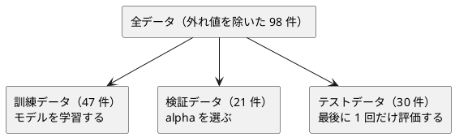

# 第 12 章: 正則化とモデル選択

## 12.1 はじめに

特徴量を増やすと、モデルは訓練データにいくらでも合わせられるようになります。その結果、訓練データでは高い精度が出るのに、未知のデータでは精度が落ちる **過学習** が起こります。

この章では、過学習を抑える **正則化** を学びます。リッジ回帰を、[第 7 章](07-linear-regression.md) で作った行列型を使って自作し、正則化の強さ `alpha` を検証データで選ぶ **モデル選択** を実装します。係数を 0 にして特徴量を絞り込むラッソ回帰は、Tribuo の `ElasticNetCDTrainer` で試します。

[Python 版の第 12 章](../python/12-regularization-and-model-selection.md) と同じ流れで進めます。Kotlin 版では、次の 3 点に注目してください。

- 第 7 章の行列型に足りない演算を、元のコードを変えずに **拡張関数** で足す
- 実験の結果を、書き換えられない `data class` と読み取り専用の `List` で記録する
- Tribuo の `ElasticNetCDTrainer` の `alpha` が何を意味するかをソースで確かめ、自作のリッジ回帰と突き合わせる

## 12.2 過学習と正則化

### 係数が大きくなりすぎる

線形回帰は、予測値と正解の差（誤差）の二乗和が最小になるように係数を決めます。特徴量が多いと、訓練データの細かな揺れにまで合わせようとして、係数の絶対値が大きくなりがちです。係数が大きいモデルは、入力が少し変わっただけで予測が大きく変わるので、未知のデータに弱くなります。

### 係数の大きさに罰則を加える

正則化は、誤差の二乗和に「係数の大きさ」への罰則を加えて最小化します。

| 手法 | 最小化するもの | 係数への効果 |
|------|--------------|------------|
| 線形回帰 | 誤差の二乗和 | 制約なし |
| リッジ回帰 | 誤差の二乗和 + `alpha` × 係数の二乗和 | 全体を小さく縮める |
| ラッソ回帰 | 誤差の二乗和 + `alpha` × 係数の絶対値の和 | 一部の係数をちょうど 0 にする |

`alpha` は正則化の強さです。0 なら線形回帰と同じで、大きくするほど係数は小さくなります。大きすぎると、今度は訓練データにも合わなくなります（学習不足）。ちょうどよい `alpha` はデータによって違うので、実験して選びます。

### リッジ回帰の解き方

リッジ回帰は式を変形すると、行列の計算で係数を直接求められます。特徴量の行列を `X`、正解を `t` として、それぞれから平均を引いた（中心化した）うえで、次の連立一次方程式を解きます。

```text
(Xᵀ X + alpha × I) w = Xᵀ t
```

`I` は単位行列です。切片は「正解の平均 − 特徴量の平均と係数の内積」で求めます。中心化してから解くのは、切片には罰則をかけないためです。第 7 章の正規方程式に `alpha × I` の項が加わっただけなので、第 7 章の行列型（積・転置・連立方程式の解法）をそのまま使えます。足りないのは、行列の足し算と、数と行列の積と、単位行列です。

## 12.3 題材とデータ

### Boston.csv

この章で使うのは `Boston.csv` です。100 件の地区について、住宅価格（`PRICE`）と 13 個の特徴量が記録されています。この章ではそのうち次の 3 つを使います。

| 列 | 意味 | Kotlin DataFrame での型 |
|----|------|-----------------------|
| RM | 住居の平均部屋数 | `Double` |
| PTRATIO | 生徒と教師の比率 | `Double` |
| LSTAT | 低所得者の割合（%） | `Double` |
| PRICE | 住宅価格（正解ラベル） | `Double` |

この 4 列には欠損値がありません。学習データの入手と配置は [第 1 章](01-machine-learning-and-first-test.md) の「題材とデータ」を参照してください。

### 過学習が起きやすい状況を作る

3 つの特徴量をそれぞれ標準化（平均 0・標準偏差 1）したうえで、2 乗の列と、2 つの列の積（交互作用）の列を加えます。3 列が 9 列に増え、100 件のデータに対しては過学習が起きやすい状況になります。多項式特徴量と標準化、外れ値の扱いは [第 9 章](09-feature-engineering.md) で詳しく扱います。この章では、正則化の効果を確かめるのに必要な最小限の前処理だけを章の中に用意します。

### 訓練・検証・テストの 3 つに分ける

`alpha` をテストデータの結果で選ぶと、テストデータに合わせてモデルを選んだことになり、テストデータが「未知のデータ」ではなくなります。そこで、データを次の 3 つに分けます。



分割には [第 2 章](02-data-preprocessing-and-triangulation.md) で作った `splitTrainTest` を 2 回使います。1 回目で全体を訓練用とテスト用に、2 回目で訓練用をさらに訓練データと検証データに分けます。正解ラベルが数値なので、分割の結果は `TrainTestSplit<Double>` になります。件数は Python 版と同じですが、乱数生成器が違うので、それぞれに入る行は Python 版と一致しません。

## 12.4 TODO リストの作成

**TODO リスト**:

- [ ] リッジ回帰を自作する
  - [ ] `alpha` が 0 なら最小二乗法と同じ係数と切片になる
  - [ ] 特徴量が 2 つでも係数と切片を求める
  - [ ] 行列の足し算・数と行列の積・単位行列を用意する
  - [ ] `alpha` を大きくすると係数が小さくなる
  - [ ] `alpha` が 0 なら第 7 章の線形回帰と同じ係数になる
  - [ ] 係数と切片から予測する
- [ ] 正則化の強さごとの実験結果を、書き換えられない値として記録する
- [ ] 検証データの決定係数が最も高い実験を選ぶ
- [ ] 0 になった係数の特徴量名を返す
- [ ] Tribuo の `ElasticNetCDTrainer` でラッソ回帰とリッジ回帰を表す
- [ ] 標準化してから 2 次の多項式特徴量を作る
- [ ] 外れ値の行を除く
- [ ] 実データを 3 つに分けて、線形回帰・リッジ回帰・ラッソ回帰を比べる

## 12.5 リッジ回帰を自作する

### Red: 最小二乗法と同じになるテスト

`alpha` が 0 のリッジ回帰は線形回帰と同じです。`t = 2x + 1` の上に並ぶ 3 点なら、係数は 2、切片は 1 になるはずです。特徴量は第 7 章の `Matrix`（1 行が 1 件）で渡します。

```kotlin
// src/test/kotlin/chapter12/RegularizationTest.kt
package chapter12

import chapter07.Matrix
import kotlin.test.Test
import kotlin.test.assertEquals

class FitRidgeTest {
    @Test
    fun `alphaが0なら最小二乗法と同じ係数と切片になる`() {
        val x = Matrix(listOf(listOf(1.0), listOf(2.0), listOf(3.0)))
        val t = listOf(3.0, 5.0, 7.0)

        val model = fitRidge(x, t, alpha = 0.0)

        assertEquals(2.0, model.coefficients.single(), absoluteTolerance = 1e-12)
        assertEquals(1.0, model.intercept, absoluteTolerance = 1e-12)
    }
}
```

```bash
./gradlew test --tests "chapter12.*"
```

```text
e: .../src/test/kotlin/chapter12/RegularizationTest.kt:13:21 Unresolved reference 'fitRidge'.
```

`import chapter07.Matrix` のように、ほかの章のパッケージの公開された型や関数は、import すればそのまま使えます。

### Green: 仮実装

学習結果を表す `RegularizedModel` を定義し、期待値をそのまま返します。Python 版は `RidgeModel` という名前でしたが、Kotlin 版では 12.8 節のラッソ回帰の結果にも同じ型を使うので、`RegularizedModel`（正則化したモデル）と名付けました。

```kotlin
// src/main/kotlin/chapter12/Regularization.kt
package chapter12

import chapter07.Matrix

data class RegularizedModel(
    val coefficients: List<Double>,
    val intercept: Double,
)

fun fitRidge(
    x: Matrix,
    t: List<Double>,
    alpha: Double,
): RegularizedModel = RegularizedModel(coefficients = listOf(2.0), intercept = 1.0)
```

```text
FitRidgeTest > alphaが0なら最小二乗法と同じ係数と切片になる() PASSED
```

### 三角測量

特徴量が 2 つのデータで、`t = 3x₁ − x₂ + 4` を当てさせます。係数のリストを許容誤差つきで比べるヘルパー `assertDoubles` も用意します。

```kotlin
    @Test
    fun `特徴量が2つでも係数と切片を求める`() {
        val x = Matrix(listOf(listOf(1.0, 0.0), listOf(0.0, 1.0), listOf(1.0, 1.0), listOf(2.0, 1.0)))
        val t = x.rows.map { (x1, x2) -> 3.0 * x1 - 1.0 * x2 + 4.0 }

        val model = fitRidge(x, t, alpha = 0.0)

        assertDoubles(listOf(3.0, -1.0), model.coefficients)
        assertEquals(4.0, model.intercept, absoluteTolerance = 1e-9)
    }
}

internal fun assertDoubles(
    expected: List<Double>,
    actual: List<Double>,
    tolerance: Double = 1e-9,
) {
    assertEquals(expected.size, actual.size, "要素の数")
    expected.zip(actual).forEachIndexed { i, (e, a) -> assertEquals(e, a, absoluteTolerance = tolerance, "${i}番目の要素") }
}
```

- `x.rows.map { (x1, x2) -> ... }` は、各行の `List<Double>` を分解して受け取る書き方です。`List` は先頭の 5 要素まで `component1()`〜`component5()` を持つので、分解宣言が使えます
- `assertDoubles` を `internal` にしたのは、同じ章のほかのテストファイルからも使うためです

```text
FitRidgeTest > alphaが0なら最小二乗法と同じ係数と切片になる() PASSED
FitRidgeTest > 特徴量が2つでも係数と切片を求める() FAILED
    org.opentest4j.AssertionFailedError: 要素の数 ==> expected: <2> but was: <1>
116 tests completed, 1 failed
```

### 行列型に足りない演算を拡張関数で足す

12.2 節の式を実装するには、`Xᵀ X + alpha × I` の計算が必要です。第 7 章の `Matrix` には積（`times`）と転置と連立方程式の解法はありますが、足し算と、数と行列の積と、単位行列がありません。

`Matrix` は第 7 章のコードで、この章から書き換えるものではありません。そこで、`chapter12` パッケージの **拡張関数** として演算を足します。まずテストです。

```kotlin
// src/test/kotlin/chapter12/MatrixOperationsTest.kt
package chapter12

import chapter07.Matrix
import kotlin.test.Test
import kotlin.test.assertEquals
import kotlin.test.assertFailsWith

class MatrixOperationsTest {
    @Test
    fun `同じ形の行列を要素ごとに足す`() {
        val a = Matrix(listOf(listOf(1.0, 2.0), listOf(3.0, 4.0)))
        val b = Matrix(listOf(listOf(10.0, 20.0), listOf(30.0, 40.0)))

        assertEquals(Matrix(listOf(listOf(11.0, 22.0), listOf(33.0, 44.0))), a + b)
    }

    @Test
    fun `形が違う行列は足せない`() {
        val a = Matrix(listOf(listOf(1.0, 2.0)))
        val b = Matrix(listOf(listOf(1.0), listOf(2.0)))

        val error = assertFailsWith<IllegalArgumentException> { a + b }

        assertEquals("1 行 2 列の行列と 2 行 1 列の行列は足せません", error.message)
    }

    @Test
    fun `数と行列の積は各要素に数を掛ける`() {
        val a = Matrix(listOf(listOf(1.0, -2.0), listOf(0.5, 4.0)))

        assertEquals(Matrix(listOf(listOf(2.0, -4.0), listOf(1.0, 8.0))), 2.0 * a)
    }

    @Test
    fun `単位行列は対角成分が1でそれ以外が0の正方行列`() {
        assertEquals(Matrix(listOf(listOf(1.0, 0.0, 0.0), listOf(0.0, 1.0, 0.0), listOf(0.0, 0.0, 1.0))), identity(3))
    }
}
```

```text
e: .../src/test/kotlin/chapter12/MatrixOperationsTest.kt:14:80 Unresolved reference 'plus' for operator '+' on receiver of type 'Matrix'.
e: .../src/test/kotlin/chapter12/MatrixOperationsTest.kt:22:67 Unresolved reference 'plus' for operator '+' on receiver of type 'Matrix'.
e: .../src/test/kotlin/chapter12/MatrixOperationsTest.kt:31:79 None of the following candidates is applicable:
e: .../src/test/kotlin/chapter12/MatrixOperationsTest.kt:36:107 Unresolved reference 'identity'.
```

エラーメッセージの「`Matrix` に対する演算子 `+` の `plus` が見つからない」が示すとおり、Kotlin の `a + b` は `a.plus(b)` の呼び出しです。`2.0 * a` は `2.0.times(a)` ですが、`Double` の `times` には `Matrix` を受け取るものが無いので、候補が見つからないというエラーになっています。

```kotlin
// src/main/kotlin/chapter12/MatrixOperations.kt
package chapter12

import chapter07.Matrix

operator fun Matrix.plus(other: Matrix): Matrix {
    require(rows.size == other.rows.size && columns.size == other.columns.size) {
        "${rows.size} 行 ${columns.size} 列の行列と ${other.rows.size} 行 ${other.columns.size} 列の行列は足せません"
    }
    return Matrix(rows.zip(other.rows) { a, b -> a.zip(b) { x, y -> x + y } })
}

operator fun Double.times(matrix: Matrix): Matrix = Matrix(matrix.rows.map { row -> row.map { this * it } })

fun identity(size: Int): Matrix = Matrix(List(size) { i -> List(size) { j -> if (i == j) 1.0 else 0.0 } })
```

- `operator fun Matrix.plus(...)` は、`Matrix` を **受け取る側**（レシーバー）とする拡張関数に `operator` を付けたものです。`Matrix` のクラス定義を変えずに、`a + b` と書けるようになります。関数の中の `rows` や `columns` は、レシーバーの `Matrix` のプロパティです
- `operator fun Double.times(matrix: Matrix)` は、レシーバーが `Double` です。左側が数、右側が行列の `2.0 * a` を書けるようにします
- 拡張関数は、そのパッケージを import したところからだけ使えます。第 7 章のコードやテストの振る舞いには影響しません
- 拡張関数からは、クラスの公開されたメンバーにしかアクセスできません。`Matrix` の `rows` と `columns` は公開されているので、行列の中身を読めます

```text
MatrixOperationsTest > 形が違う行列は足せない() PASSED
MatrixOperationsTest > 同じ形の行列を要素ごとに足す() PASSED
MatrixOperationsTest > 単位行列は対角成分が1でそれ以外が0の正方行列() PASSED
MatrixOperationsTest > 数と行列の積は各要素に数を掛ける() PASSED
```

これで 12.2 節の式を、ほぼそのまま書けます。

```kotlin
fun fitRidge(
    x: Matrix,
    t: List<Double>,
    alpha: Double,
): RegularizedModel {
    val xMeans = x.columns.map { it.average() }
    val tMean = t.average()
    val xc = Matrix(x.rows.map { row -> row.zip(xMeans) { value, mean -> value - mean } })
    val tc = Matrix(t.map { listOf(it - tMean) })
    val coefficients = (xc.transpose() * xc + alpha * identity(xMeans.size)).solve(xc.transpose() * tc).columns.first()
    val intercept = tMean - xMeans.zip(coefficients).sumOf { (mean, coefficient) -> mean * coefficient }
    return RegularizedModel(coefficients = coefficients, intercept = intercept)
}
```

- `xc.transpose() * xc + alpha * identity(xMeans.size)` は、Kotlin の演算子の優先順位どおり `*` が `+` より先に計算されます。`Xᵀ X + alpha × I` とそのまま読めます
- `solve` は第 7 章の連立方程式の解法で、結果は 1 列の行列です。`.columns.first()` で係数のリストとして取り出します
- `zip(xMeans) { value, mean -> value - mean }` は、2 つのリストを要素ごとに組にしながら、組を変換した値のリストを作ります

```text
FitRidgeTest > alphaが0なら最小二乗法と同じ係数と切片になる() PASSED
FitRidgeTest > 特徴量が2つでも係数と切片を求める() PASSED
```

### 正則化の効果と第 7 章との突き合わせ

乱数で作った人工データ（特徴量 4 列、30 件）で、正則化の性質を確かめます。1 つ目は「`alpha` を大きくすると係数の絶対値の合計が小さくなる」こと、2 つ目は「`alpha` が 0 なら第 7 章の線形回帰と同じ係数と切片になる」ことです。Python 版は 2 つ目を scikit-learn の `Ridge` と突き合わせましたが、Kotlin 版では同じプロジェクトにある第 7 章の実装を相手にします。Tribuo との突き合わせは 12.8 節で行います。

```kotlin
    @Test
    fun `alphaを大きくすると係数の絶対値の合計が小さくなる`() {
        val (x, t) = randomDataset()

        val weak = fitRidge(x, t, alpha = 0.1)
        val strong = fitRidge(x, t, alpha = 100.0)

        assertTrue(strong.coefficients.sumOf { abs(it) } < weak.coefficients.sumOf { abs(it) })
    }

    @Test
    fun `alphaが0なら第7章の線形回帰と同じ係数と切片になる`() {
        val (x, t) = randomDataset()
        val frame = dataFrameOf(x.columns.mapIndexed { i, column -> column.toColumn("x$i") })

        val model = fitRidge(x, t, alpha = 0.0)
        val expected = fitLinearRegression(frame, t)

        assertDoubles(expected.coefficients.values.toList(), model.coefficients)
        assertEquals(expected.intercept, model.intercept, absoluteTolerance = 1e-9)
    }
```

```kotlin
internal fun randomDataset(): Pair<Matrix, List<Double>> {
    val random = Random(0)
    val weights = listOf(1.5, -2.0, 0.5, 3.0)
    val x = Matrix(List(30) { List(weights.size) { random.nextGaussian() } })
    val t = x.rows.map { row -> row.zip(weights).sumOf { (value, weight) -> value * weight } + 0.5 * random.nextGaussian() }
    return x to t
}
```

- `java.util.Random(0)` の `nextGaussian()` は、平均 0・標準偏差 1 の正規分布に従う乱数を返します。シードを固定しているので、毎回同じデータになります
- 第 7 章の `fitLinearRegression` はデータフレームを受け取るので、`toColumn("x$i")` で行列の列をデータフレームの列に変換して渡しています

```text
FitRidgeTest > alphaが0なら第7章の線形回帰と同じ係数と切片になる() PASSED
FitRidgeTest > alphaを大きくすると係数の絶対値の合計が小さくなる() PASSED
```

2 つとも実装を変えずに通りました。どちらも仕様を示すテストとして残します。

### 予測する

予測は「特徴量と係数の内積 + 切片」です。第 7 章の `LinearModel` と同じく、モデルのメソッドにします。

```kotlin
class PredictTest {
    @Test
    fun `係数と切片から予測値を計算する`() {
        val model = RegularizedModel(coefficients = listOf(3.0, -1.0), intercept = 4.0)

        val y = model.predict(Matrix(listOf(listOf(1.0, 2.0), listOf(0.0, 0.0))))

        assertDoubles(listOf(5.0, 4.0), y)
    }
}
```

```text
e: .../src/test/kotlin/chapter12/RegularizationTest.kt:64:23 Unresolved reference 'predict' on receiver of type 'RegularizedModel'.
```

```kotlin
data class RegularizedModel(
    val coefficients: List<Double>,
    val intercept: Double,
) {
    fun predict(x: Matrix): List<Double> =
        x.rows.map { row ->
            intercept +
                row.zip(coefficients).sumOf { (value, coefficient) -> value * coefficient }
        }
}
```

```text
PredictTest > 係数と切片から予測値を計算する() PASSED
```

## 12.6 実験結果を記録して選ぶ

### 書き換えられない実験結果

`alpha` ごとに学習し、訓練データと検証データの決定係数（R²）、係数の絶対値の合計を記録します。決定係数には第 7 章の `r2Score` を再利用します。

Python 版は `frozen=True` のデータクラスで「書き換えられない」ことを実行時に確かめましたが、Kotlin では書き換えようとするコード自体がコンパイルできません。そこで Kotlin 版では、代わりに `copy` の性質をテストにします。

```kotlin
private fun Matrix.slice(indices: IntRange): Matrix = Matrix(rows.slice(indices))

class RunRidgeExperimentsTest {
    @Test
    fun `正則化の強さごとに1件ずつ実験結果を記録する`() {
        val (x, t) = randomDataset()

        val experiments =
            runRidgeExperiments(x.slice(0..19), t.slice(0..19), x.slice(20..29), t.slice(20..29), alphas = listOf(0.1, 1.0, 10.0))

        assertEquals(listOf(0.1, 1.0, 10.0), experiments.map { it.alpha })
    }

    @Test
    fun `copyで一部を変えた実験結果を作っても元の実験結果は変わらない`() {
        val (x, t) = randomDataset()
        val original = runRidgeExperiments(x.slice(0..19), t.slice(0..19), x.slice(20..29), t.slice(20..29), listOf(1.0)).single()

        val changed = original.copy(alpha = 2.0)

        assertEquals(1.0, original.alpha)
        assertEquals(2.0, changed.alpha)
        assertEquals(original.validationScore, changed.validationScore)
    }
}
```

- `private fun Matrix.slice(...)` は、テストの中だけで使う拡張関数です。先頭の 20 件を訓練用、残りの 10 件を検証用にします
- `copy(alpha = 2.0)` は、`alpha` だけを変えた **新しい** 実験結果を作ります。元の実験結果は変わりません

```text
e: .../src/test/kotlin/chapter12/RegularizationTest.kt:77:27 Unresolved reference 'runRidgeExperiments'.
e: .../src/test/kotlin/chapter12/RegularizationTest.kt:79:64 Unresolved reference 'it'.
e: .../src/test/kotlin/chapter12/RegularizationTest.kt:85:24 Unresolved reference 'runRidgeExperiments'.
```

実験結果を `Experiment` として定義し、`alpha` ごとに 1 件ずつ作ります。

```kotlin
data class Experiment(
    val alpha: Double,
    val trainScore: Double,
    val validationScore: Double,
    val coefficientAbsSum: Double,
)

fun runRidgeExperiments(
    xTrain: Matrix,
    tTrain: List<Double>,
    xValid: Matrix,
    tValid: List<Double>,
    alphas: List<Double>,
): List<Experiment> =
    alphas.map { alpha ->
        val model = fitRidge(xTrain, tTrain, alpha)
        Experiment(
            alpha = alpha,
            trainScore = r2Score(tTrain, model.predict(xTrain)),
            validationScore = r2Score(tValid, model.predict(xValid)),
            coefficientAbsSum = model.coefficients.sumOf { abs(it) },
        )
    }
```

```text
RunRidgeExperimentsTest > 正則化の強さごとに1件ずつ実験結果を記録する() PASSED
RunRidgeExperimentsTest > copyで一部を変えた実験結果を作っても元の実験結果は変わらない() PASSED
```

`Experiment` のプロパティはすべて `val` なので、代入できません。戻り値の型 `List<Experiment>` は **読み取り専用** のリストのインターフェースで、要素を追加・削除するメソッドを持ちません。確かめるために、次のコードを一時的に書いてコンパイルしてみました（確かめた後に削除しています）。

```kotlin
fun probeImmutability(experiments: List<Experiment>) {
    experiments[0].alpha = 2.0
    experiments.add(experiments[0])
}
```

```text
e: .../src/test/kotlin/chapter12/ImmutabilityProbe.kt:4:20 'val' cannot be reassigned.
e: .../src/test/kotlin/chapter12/ImmutabilityProbe.kt:5:17 Unresolved reference 'add' on receiver of type 'List<Experiment>'.
```

Python 版が実行時の例外と、mypy の型チェックで守っていたことを、Kotlin ではコンパイラが守ります。書き換えを「テストで見つける」のではなく「書けなくする」ので、Python 版のような「書き換えると例外になる」テストは要りません。

### 検証データで最もよい実験を選ぶ

テストでは、実験結果を直接作る小さなヘルパーを用意します。

```kotlin
private fun experiment(
    alpha: Double,
    validationScore: Double,
): Experiment = Experiment(alpha = alpha, trainScore = 0.9, validationScore = validationScore, coefficientAbsSum = 1.0)

class BestExperimentTest {
    @Test
    fun `検証データの決定係数が最も高い実験を選ぶ`() {
        val experiments = listOf(experiment(0.1, 0.7), experiment(1.0, 0.6))

        assertEquals(0.1, bestExperiment(experiments).alpha)
    }
}
```

```text
e: .../src/test/kotlin/chapter12/RegularizationTest.kt:105:27 Unresolved reference 'bestExperiment'.
```

先頭を返す仮実装で Green にします。

```kotlin
fun bestExperiment(experiments: List<Experiment>): Experiment = experiments.first()
```

最もよい実験が途中にある例で三角測量します。

```kotlin
    @Test
    fun `最も高い実験が途中にあってもそれを選ぶ`() {
        val experiments = listOf(experiment(0.1, 0.5), experiment(1.0, 0.8), experiment(10.0, 0.6))

        assertEquals(1.0, bestExperiment(experiments).alpha)
    }
```

```text
BestExperimentTest > 最も高い実験が途中にあってもそれを選ぶ() FAILED
    org.opentest4j.AssertionFailedError: expected: <1.0> but was: <0.1>
BestExperimentTest > 検証データの決定係数が最も高い実験を選ぶ() PASSED
127 tests completed, 1 failed
```

`maxBy` に「何で比べるか」をラムダで渡します。Python 版の `max(..., key=...)` に相当します。空のリストに対しては `NoSuchElementException` を投げます。

```kotlin
fun bestExperiment(experiments: List<Experiment>): Experiment = experiments.maxBy { it.validationScore }
```

```text
BestExperimentTest > 最も高い実験が途中にあってもそれを選ぶ() PASSED
BestExperimentTest > 検証データの決定係数が最も高い実験を選ぶ() PASSED
```

## 12.7 0 になった係数の特徴量名を返す

ラッソ回帰の結果を読み取るために、「係数が 0 になった特徴量名を返す」関数を作ります。

```kotlin
class ZeroCoefficientNamesTest {
    @Test
    fun `0になった係数の特徴量名を返す`() {
        assertEquals(listOf("RM", "RM^2"), zeroCoefficientNames(listOf(0.0, 1.5, 0.0), listOf("RM", "LSTAT", "RM^2")))
    }
}
```

```text
e: .../src/test/kotlin/chapter12/RegularizationTest.kt:119:44 Unresolved reference 'zeroCoefficientNames'.
```

```kotlin
fun zeroCoefficientNames(
    coefficients: List<Double>,
    featureNames: List<String>,
): List<String> = featureNames.zip(coefficients).filter { (_, coefficient) -> coefficient == 0.0 }.map { (name, _) -> name }
```

分解宣言の `_` は「この要素は使わない」という意味です。`filter` では名前を、`map` では係数を使わないので、使わない側を `_` にしています。

浮動小数点数を `== 0.0` で比べていますが、ラッソ回帰の係数は計算の結果「ほぼ 0」になるのではなく、ちょうど 0 に設定されるので、この比較で問題ありません。これは次の節の学習用テストで確かめます。

```text
ZeroCoefficientNamesTest > 0になった係数の特徴量名を返す() PASSED
```

## 12.8 Tribuo の ElasticNetCDTrainer で表す

### ElasticNetCDTrainer が最小化するもの

ラッソ回帰は、係数の絶対値に罰則をかけると式が微分できない点を含むため、リッジ回帰のように 1 回の行列計算では解けず、座標降下法などの反復計算が必要になります。Python 版と同じく自作はせず、ライブラリを使います。

[ADR 002](../../../adr/002-kotlin-ml-libraries.md) で確かめたとおり、Tribuo の `LARSLassoTrainer` は正則化の強さ `alpha` を引数に取りません。そこで、ラッソ回帰とリッジ回帰を混ぜた **エラスティックネット** を学習する `ElasticNetCDTrainer` を使います。コンストラクタは `ElasticNetCDTrainer(alpha, l1Ratio, ...)` で、`l1Ratio` は罰則のうちラッソ回帰（L1）の割合です。

`alpha` が 12.2 節の `alpha` と同じ意味かは、名前だけでは分かりません。Tribuo 4.3.2 のソース（`ElasticNetCDTrainer.java`）を読むと、罰則を次のように計算していました。

```java
        double l1Penalty = alpha * l1Ratio * numExamples;
        double l2Penalty = alpha * (1.0 - l1Ratio) * numExamples;
```

係数の更新式と合わせて読むと、特徴量を中心化したうえで、次の値を最小化しています（`n` は件数）。

```text
(1/2n) × 誤差の二乗和 + alpha × l1Ratio × 係数の絶対値の和 + (alpha × (1 − l1Ratio) / 2) × 係数の二乗和
```

これは scikit-learn の `ElasticNet` と同じ形で、`l1Ratio = 1` なら scikit-learn の `Lasso(alpha)` と同じです。使い捨てのプローブで、同じ人工データを Tribuo の `ElasticNetCDTrainer(0.5, 1.0)` と scikit-learn の `Lasso(alpha=0.5)` に学習させたところ、係数は小数第 5 位まで一致しました。

一方で、リッジ回帰の `誤差の二乗和 + λ × 係数の二乗和` と比べると、全体を `1/2n` 倍した形になっています。両辺を比べると、リッジ回帰の `λ` は `alpha × (1 − l1Ratio) × n` に当たります。

### Red: ラッソ回帰とリッジ回帰のテスト

ラッソ回帰では、予測に関係しない 2 列（`noise1`・`noise2`）を含む人工データで学習させると、その 2 列の係数だけがちょうど 0 になるはずです。リッジ回帰は、`l1Ratio` を 0 にすれば純粋なリッジ回帰になるはずですが、プローブで試すと `ElasticNetCDTrainer` は `l1Ratio = 0` を受け付けませんでした。受け付ける下限は `1e-12` で、`1e-13` も拒否されました。

そこで、`l1Ratio` を下限の `1e-12` にし、`alpha` を件数で割って渡せば、L1 の罰則は無視できるほど小さくなり、自作のリッジ回帰とほぼ同じ係数になるはずです。この 2 つの仮説をテストにします。

```kotlin
// src/test/kotlin/chapter12/TribuoRegularizationTest.kt
package chapter12

import chapter07.Matrix
import com.oracle.labs.mlrg.olcut.config.PropertyException
import org.tribuo.regression.slm.ElasticNetCDTrainer
import java.util.Random
import kotlin.test.Test
import kotlin.test.assertEquals
import kotlin.test.assertFailsWith

private fun sparseDataset(): Pair<Matrix, List<Double>> {
    val random = Random(0)
    val x = Matrix(List(50) { List(4) { random.nextGaussian() } })
    val t = x.rows.map { row -> 3.0 * row[0] - 2.0 * row[1] + 0.1 * random.nextGaussian() }
    return x to t
}

class TribuoLassoTest {
    @Test
    fun `ラッソ回帰では予測に役立たない特徴量の係数が0になる`() {
        val (x, t) = sparseDataset()

        val model = fitLasso(x, t, alpha = 0.5)

        assertEquals(listOf("noise1", "noise2"), zeroCoefficientNames(model.coefficients, listOf("x1", "x2", "noise1", "noise2")))
    }
}

class TribuoRidgeTest {
    @Test
    fun `ElasticNetCDTrainerはl1Ratioが0のリッジ回帰を受け付けない`() {
        val error = assertFailsWith<PropertyException> { ElasticNetCDTrainer(0.5, 0.0) }

        assertEquals("L1 Ratio must be between 0 and 1. Found value 0.0", error.message?.substringAfter(", "))
    }

    @Test
    fun `l1Ratioを下限まで小さくしalphaを件数で割ると自作のリッジ回帰と同じ係数と切片になる`() {
        val (x, t) = randomDataset()

        val model = fitRidgeWithTribuo(x, t, alpha = 10.0)
        val expected = fitRidge(x, t, alpha = 10.0)

        assertDoubles(expected.coefficients, model.coefficients, tolerance = 1e-6)
        assertEquals(expected.intercept, model.intercept, absoluteTolerance = 1e-6)
    }
}
```

- `PropertyException` は、Tribuo が設定の検査に使っているライブラリ OLCUT の例外です。`l1Ratio` の範囲の検査はコンストラクタの中で行われるので、学習する前に例外になります
- `error.message?.substringAfter(", ")` の `?.` は、メッセージが null なら null のまま、そうでなければ `substringAfter` を呼ぶ安全呼び出しです。メッセージの先頭には `Component: l1Ratio, ` が付くので、その後ろだけを比べています

```text
e: .../src/test/kotlin/chapter12/TribuoRegularizationTest.kt:23:21 Unresolved reference 'fitLasso'.
e: .../src/test/kotlin/chapter12/TribuoRegularizationTest.kt:41:21 Unresolved reference 'fitRidgeWithTribuo'.
```

### Green: 行列を Tribuo のデータセットに変換する

第 7 章と同じく、事例（`ArrayExample`）とデータセット（`MutableDataset`）に変換してから学習させます。この章の特徴量は行列なので、列に `x0`・`x1`… という名前を付けて渡します。

```kotlin
// src/main/kotlin/chapter12/TribuoRegularization.kt
/** ElasticNetCDTrainer が受け付ける l1Ratio の下限。0（純粋なリッジ回帰）は受け付けない */
private const val MIN_L1_RATIO = 1e-12
private const val TOLERANCE = 1e-10
private const val MAX_ITERATIONS = 100_000
private const val SEED = 0L

private val regressionFactory = RegressionFactory()

private fun featureNames(x: Matrix): List<String> = x.columns.indices.map { "x$it" }

private fun toRegressionDataset(
    x: Matrix,
    t: List<Double>,
): MutableDataset<Regressor> {
    val names = featureNames(x).toTypedArray()
    val dataset = MutableDataset(SimpleDataSourceProvenance("matrix", regressionFactory), regressionFactory)
    x.rows.zip(t).forEach { (row, value) -> dataset.add(ArrayExample(Regressor("t", value), names, row.toDoubleArray())) }
    return dataset
}

fun fitElasticNet(
    x: Matrix,
    t: List<Double>,
    alpha: Double,
    l1Ratio: Double,
): RegularizedModel {
    val trainer = ElasticNetCDTrainer(alpha, l1Ratio, TOLERANCE, MAX_ITERATIONS, false, SEED)
    val model = trainer.train(toRegressionDataset(x, t)) as SparseLinearModel
    val weights = model.weights.values.single()
    val coefficients = featureNames(x).map { weights.get(model.featureIDMap.get(it).id) }
    // Tribuo は特徴量の平均を引いてから学習するので、切片は平均値から求める
    val intercept =
        t.average() -
            x.columns
                .map { it.average() }
                .zip(coefficients)
                .sumOf { (mean, coefficient) -> mean * coefficient }
    return RegularizedModel(coefficients = coefficients, intercept = intercept)
}

fun fitLasso(
    x: Matrix,
    t: List<Double>,
    alpha: Double,
): RegularizedModel = fitElasticNet(x, t, alpha, l1Ratio = 1.0)

fun fitRidgeWithTribuo(
    x: Matrix,
    t: List<Double>,
    alpha: Double,
): RegularizedModel = fitElasticNet(x, t, alpha / t.size, MIN_L1_RATIO)
```

- `ElasticNetCDTrainer(alpha, l1Ratio)` の 2 引数のコンストラクタは、収束の判定値（tolerance）が `1e-4`、反復の上限が 500 回です。自作との突き合わせでは、判定値を `1e-10`、上限を 10 万回にし、ほぼ完全に収束させています。5 つ目の引数 `false` は、特徴量を調べる順番をランダムにしない指定です
- `trainer.train(...)` の戻り値は `Model<Regressor>` なので、係数（`weights`）を読むために `as SparseLinearModel` でキャストしています
- Tribuo は特徴量に名前の順で番号を振ります（第 3 章）。`x10` は `x2` より先に並ぶので、係数は `featureIDMap.get(名前).id` で名前から番号を引いて取り出し、元の列の順に並べ直しています
- 切片は、ソースで確かめた「特徴量の平均を引いて学習し、正解の平均を足して予測する」仕組みに合わせて、自作のリッジ回帰と同じ式で求めています。特徴量の平均が 0 でない人工データで、この切片を使った予測値と Tribuo 自身の `predict` の差が 1e-15 程度であることをプローブで確かめました

```text
TribuoLassoTest > ラッソ回帰では予測に役立たない特徴量の係数が0になる() PASSED
TribuoRidgeTest > ElasticNetCDTrainerはl1Ratioが0のリッジ回帰を受け付けない() PASSED
TribuoRidgeTest > l1Ratioを下限まで小さくしalphaを件数で割ると自作のリッジ回帰と同じ係数と切片になる() PASSED
```

3 つとも通りました。ラッソ回帰では `noise1`・`noise2` の係数がちょうど 0 になり、12.7 節の `== 0.0` の比較で読み取れます。リッジ回帰は、`alpha` の定義の違い（件数 `n` の分）を補えば、Tribuo でも表せることが分かりました。ただし `l1Ratio` を 0 にできないので、厳密には「L1 の罰則がごく小さいエラスティックネット」です。

**TODO リスト**:

- [x] リッジ回帰を自作する
- [x] 正則化の強さごとの実験結果を、書き換えられない値として記録する
- [x] 検証データの決定係数が最も高い実験を選ぶ
- [x] 0 になった係数の特徴量名を返す
- [x] Tribuo の `ElasticNetCDTrainer` でラッソ回帰とリッジ回帰を表す
- [ ] 標準化してから 2 次の多項式特徴量を作る
- [ ] 外れ値の行を除く
- [ ] 実データを 3 つに分けて、線形回帰・リッジ回帰・ラッソ回帰を比べる

## 12.9 最小限の前処理

### 標準化と多項式特徴量

前処理は `src/main/kotlin/chapter12/BostonFeatures.kt` に分けます。訓練データの平均値と標準偏差で標準化し、2 次の項を加えます。1 列 `[1, 2, 3]` を標準化すると `[-1.2247…, 0, 1.2247…]` になり、その 2 乗の列が加わります。

```kotlin
// src/test/kotlin/chapter12/BostonFeaturesTest.kt
class PolynomialScalerTest {
    @Test
    fun `訓練データで標準化してから2乗の列を加える`() {
        val x = dataFrameOf("RM" to listOf(1.0, 2.0, 3.0))

        val scaler = fitPolynomialScaler(x)

        val z = 1.224744871391589
        val rows = scaler.transform(x).rows
        assertDoubles(listOf(-z, z * z), rows[0])
        assertDoubles(listOf(0.0, 0.0), rows[1])
        assertDoubles(listOf(z, z * z), rows[2])
    }
}
```

```text
e: .../src/test/kotlin/chapter12/BostonFeaturesTest.kt:11:22 Unresolved reference 'fitPolynomialScaler'.
```

Python 版は scikit-learn の `PolynomialFeatures` を使いましたが、Kotlin 版では標準化と 2 次の項を作る処理を自作します。学習（`fitPolynomialScaler`）と変換（`transform`）を分けるのは、テストデータを「訓練データの平均値と標準偏差」で標準化するためです。

```kotlin
data class PolynomialScaler(
    val inputNames: List<String>,
    val means: List<Double>,
    val stds: List<Double>,
) {
    fun transform(x: AnyFrame): Matrix =
        Matrix(
            x.toMatrix(inputNames).rows.map { row ->
                val z = row.indices.map { (row[it] - means[it]) / stds[it] }
                z + z.indices.flatMap { i -> (i until z.size).map { j -> z[i] * z[j] } }
            },
        )
}

/** 平均値と、件数 n で割る標準偏差（母標準偏差）を訓練データから求める */
fun fitPolynomialScaler(x: AnyFrame): PolynomialScaler {
    val names = x.columnNames()
    val columns = x.toMatrix(names).columns
    val means = columns.map { it.average() }
    val stds = columns.zip(means) { column, mean -> sqrt(column.sumOf { (it - mean) * (it - mean) } / column.size) }
    return PolynomialScaler(inputNames = names, means = means, stds = stds)
}
```

- `x.toMatrix(inputNames)` は、第 7 章で作ったデータフレームの拡張関数です。指定した列を行列に変換します
- 標準偏差は件数 `n` で割ります（母標準偏差）。Python 版で `std(ddof=0)` と明示していたのと同じです
- 2 次の項は、`i <= j` の列の組ごとに `z[i] * z[j]` を作ります。`i == j` なら 2 乗、`i < j` なら交互作用です

```text
PolynomialScalerTest > 訓練データで標準化してから2乗の列を加える() PASSED
```

テストデータを訓練データの値で標準化することと、特徴量名を返すことをテストで固定します。

```kotlin
    @Test
    fun `テストデータも訓練データの平均値と標準偏差で標準化する`() {
        val train = dataFrameOf("RM" to listOf(1.0, 2.0, 3.0))
        val test = dataFrameOf("RM" to listOf(2.0))

        val scaler = fitPolynomialScaler(train)

        assertDoubles(listOf(0.0, 0.0), scaler.transform(test).rows.single())
    }

    @Test
    fun `2つの特徴量から2乗と交互作用の列を作り名前を付ける`() {
        val x =
            dataFrameOf(
                "RM" to listOf(1.0, 2.0, 3.0),
                "LSTAT" to listOf(3.0, 1.0, 2.0),
            )

        val scaler = fitPolynomialScaler(x)

        assertEquals(listOf("RM", "LSTAT", "RM^2", "RM LSTAT", "LSTAT^2"), scaler.featureNames)
        assertEquals(3 to 5, scaler.transform(x).let { it.rows.size to it.columns.size })
    }
```

```text
e: .../src/test/kotlin/chapter12/BostonFeaturesTest.kt:41:83 Unresolved reference 'featureNames' on receiver of type 'PolynomialScaler'.
```

特徴量名と変換で同じ「列の組」を使うので、組の一覧をプロパティに取り出し、両方から使います。

```kotlin
data class PolynomialScaler(
    val inputNames: List<String>,
    val means: List<Double>,
    val stds: List<Double>,
) {
    /** 2 次の項を作る列の組（i <= j）。(0, 0) は 1 列目の 2 乗、(0, 1) は 1 列目と 2 列目の積 */
    private val pairs: List<Pair<Int, Int>> = inputNames.indices.flatMap { i -> (i until inputNames.size).map { j -> i to j } }

    val featureNames: List<String> =
        inputNames + pairs.map { (i, j) -> if (i == j) "${inputNames[i]}^2" else "${inputNames[i]} ${inputNames[j]}" }

    fun transform(x: AnyFrame): Matrix =
        Matrix(
            x.toMatrix(inputNames).rows.map { row ->
                val z = row.indices.map { (row[it] - means[it]) / stds[it] }
                z + pairs.map { (i, j) -> z[i] * z[j] }
            },
        )
}
```

- data class の本体に書いた `private val pairs` は、コンストラクタの引数ではないので、`equals`・`copy` の対象になりません。インスタンスを作るときに 1 回だけ計算されます
- 特徴量名は scikit-learn の `PolynomialFeatures` と同じく `RM^2`・`RM LSTAT` の形にしました

```text
PolynomialScalerTest > 訓練データで標準化してから2乗の列を加える() PASSED
PolynomialScalerTest > 2つの特徴量から2乗と交互作用の列を作り名前を付ける() PASSED
PolynomialScalerTest > テストデータも訓練データの平均値と標準偏差で標準化する() PASSED
```

### 外れ値を除く

Python 版と同じく、`RM`・`PTRATIO`・`LSTAT`・`PRICE` のどれかで、平均から標準偏差の 3 倍より離れた値（**z スコア** の絶対値が 3 を超える値）を持つ行を除きます。実データでは 2 件が該当します。値が 11 個の 1.0 と 1 個の 100.0 なら、100.0 の z スコアは 3 を超えます。

```kotlin
class RemoveOutliersTest {
    @Test
    fun `平均から標準偏差の3倍より離れた値を持つ行を除く`() {
        val df = dataFrameOf("RM" to List(11) { 1.0 } + 100.0)

        assertEquals(List(11) { 1.0 }, removeOutliers(df, listOf("RM"), threshold = 3.0)["RM"].toList())
    }
}
```

`List(11) { 1.0 } + 100.0` は、1.0 が 11 個のリストの末尾に 100.0 を加えた新しいリストです。リストの `+` は、要素 1 つもリストも受け取れます。

```text
e: .../src/test/kotlin/chapter12/BostonFeaturesTest.kt:51:40 Unresolved reference 'removeOutliers'.
```

最後の行を除く仮実装で Green にします。

```kotlin
fun removeOutliers(
    df: AnyFrame,
    columns: List<String>,
    threshold: Double,
): AnyFrame = df.dropLast(1)
```

2 つの例で三角測量します。

```kotlin
    @Test
    fun `外れ値が無ければすべての行を残す`() {
        val df = dataFrameOf("RM" to listOf(5.0, 6.0, 7.0))

        assertEquals(3, removeOutliers(df, listOf("RM"), threshold = 3.0).rowsCount())
    }

    @Test
    fun `指定した列の値だけで外れ値を判定する`() {
        val df =
            dataFrameOf(
                "RM" to List(12) { 1.0 },
                "ZN" to List(11) { 0.0 } + 100.0,
            )

        assertEquals(12, removeOutliers(df, listOf("RM"), threshold = 3.0).rowsCount())
    }
```

```text
RemoveOutliersTest > 平均から標準偏差の3倍より離れた値を持つ行を除く() PASSED
RemoveOutliersTest > 外れ値が無ければすべての行を残す() FAILED
    org.opentest4j.AssertionFailedError: expected: <3> but was: <2>
RemoveOutliersTest > 指定した列の値だけで外れ値を判定する() FAILED
    org.opentest4j.AssertionFailedError: expected: <12> but was: <11>
137 tests completed, 2 failed
```

列ごとの z スコアを計算し、どれか 1 列でもしきい値を超えた行を除きます。

```kotlin
/** 列ごとの z スコア（標準偏差は件数 n - 1 で割る標本標準偏差）の絶対値が threshold を超える値を 1 つでも持つ行を除く */
fun removeOutliers(
    df: AnyFrame,
    columns: List<String>,
    threshold: Double,
): AnyFrame {
    val values = df.toMatrix(columns)
    val means = values.columns.map { it.average() }
    val stds = values.columns.zip(means) { column, mean -> sqrt(column.sumOf { (it - mean) * (it - mean) } / (column.size - 1)) }

    fun isOutlier(row: List<Double>): Boolean = row.indices.any { abs((row[it] - means[it]) / stds[it]) > threshold }

    return df[values.rows.indices.filterNot { isOutlier(values.rows[it]) }]
}
```

- 外れ値の判定には、pandas の `std` の既定と同じ、件数 `n - 1` で割る標本標準偏差を使います。多項式特徴量の標準化（`n` で割る）とは違うので、ドキュメンテーションコメントに書いています
- `fun isOutlier(...)` は、関数の中に書いた **局所関数** です。外側の `means`・`stds`・`threshold` をそのまま使えます
- `df[行の位置のリスト]` は、第 2 章で使った行の取り出し方です
- 3 つ目のテストの `RM` はすべて 1.0 なので、標準偏差が 0 になり、z スコアは `0.0 / 0.0` で `NaN` です。`NaN > 3.0` は `false` なので、行は除かれません

```text
RemoveOutliersTest > 平均から標準偏差の3倍より離れた値を持つ行を除く() PASSED
RemoveOutliersTest > 外れ値が無ければすべての行を残す() PASSED
RemoveOutliersTest > 指定した列の値だけで外れ値を判定する() PASSED
```

z スコアによる判定は、外れ値そのものが平均と標準偏差を引っ張るため、外れ値が多いデータでは見逃しが起きます。より頑健な方法は第 9 章で扱います。

### 3 つに分けて特徴量を作る

ここまでの部品を `prepareBoston` にまとめます。テストでは 10 行の架空の CSV を使い、件数と列数を確かめます。10 件をテストの割合 0.3 で分けると訓練用 7 件・テスト 3 件、訓練用 7 件を検証の割合 0.3 で分けると訓練 4 件・検証 3 件です。

```kotlin
class PrepareBostonTest {
    private val directory: Path = createTempDirectory()

    @Test
    fun `訓練データと検証データとテストデータに分けて多項式特徴量を作る`() {
        val rows = (0 until 10).joinToString("\n") { i -> "low,6.$i,1$i.5,${i + 3}.2,2$i.0" }
        val csvFile = File(directory.toFile(), "boston.csv").apply { writeText("CRIME,RM,PTRATIO,LSTAT,PRICE\n$rows\n") }

        val dataset = prepareBoston(csvFile, testSize = 0.3, validationSize = 0.3, seed = 0)

        val shapes = listOf(dataset.xTrain, dataset.xValid, dataset.xTest).map { it.rows.size to it.columns.size }
        assertEquals(listOf(4 to 9, 3 to 9, 3 to 9), shapes)
        assertEquals(listOf(4, 3, 3), listOf(dataset.tTrain, dataset.tValid, dataset.tTest).map { it.size })
        assertEquals(listOf("RM", "PTRATIO", "LSTAT"), dataset.featureNames.take(3))
    }
}
```

```text
e: .../src/test/kotlin/chapter12/BostonFeaturesTest.kt:84:23 Unresolved reference 'prepareBoston'.
```

標準化の平均値と標準偏差は、訓練データ（4 件のほう）だけから求めます。

```kotlin
val FEATURES = listOf("RM", "PTRATIO", "LSTAT")
const val TARGET = "PRICE"
const val OUTLIER_THRESHOLD = 3.0

data class BostonDataset(
    val xTrain: Matrix,
    val tTrain: List<Double>,
    val xValid: Matrix,
    val tValid: List<Double>,
    val xTest: Matrix,
    val tTest: List<Double>,
    val featureNames: List<String>,
)

fun loadBoston(csvFile: File): AnyFrame = DataFrame.readCSV(csvFile)

fun prepareBoston(
    csvFile: File,
    testSize: Double,
    validationSize: Double,
    seed: Int,
): BostonDataset {
    val df = removeOutliers(loadBoston(csvFile), FEATURES + TARGET, OUTLIER_THRESHOLD)
    val x = dataFrameOf(FEATURES.map { df[it].convertToDouble() })
    val t = df[TARGET].values().map { (it as Number).toDouble() }
    val outer = splitTrainTest(x, t, testSize, seed)
    val inner = splitTrainTest(outer.xTrain, outer.tTrain, validationSize, seed)
    val scaler = fitPolynomialScaler(inner.xTrain)
    return BostonDataset(
        xTrain = scaler.transform(inner.xTrain),
        tTrain = inner.tTrain,
        xValid = scaler.transform(inner.xTest),
        tValid = inner.tTest,
        xTest = scaler.transform(outer.xTest),
        tTest = outer.tTest,
        featureNames = scaler.featureNames,
    )
}
```

- `FEATURES` は `const val` にできません。`const` にできるのは基本型と文字列だけだからです（第 3 章）
- `FEATURES` と `TARGET` は第 7 章にも同じ名前がありますが、パッケージが違うので衝突しません
- `splitTrainTest` の 2 回目には、1 回目の訓練用（`outer.xTrain`・`outer.tTrain`）を渡します。正解ラベルが `List<Double>` なので、型引数 `T` は `Double` と推論されます

```text
PrepareBostonTest > 訓練データと検証データとテストデータに分けて多項式特徴量を作る() PASSED
```

## 12.10 実データで比べる

### 結果を表示する

`./gradlew runChapter -Pchapter=12` で、次の順に結果を表示します。

1. `alpha` ごとの実験を訓練データと検証データで行う
2. 検証データで `alpha` を選ぶ
3. 線形回帰（`alpha=0`）と選んだリッジ回帰を、テストデータで 1 回だけ評価する
4. Tribuo のラッソ回帰で 0 になった係数を表示する

表示のテストを先に書きます。値は、実装を実データで動かして確かめたものです。

```kotlin
// src/test/kotlin/chapter12/BostonDataTest.kt
class BostonDataTest {
    private val csvFile = File(dataDir(), "Boston.csv")

    @BeforeTest
    fun requireData() {
        assumeTrue(csvFile.exists(), "学習データ Boston.csv が配置されていない（gulp data:setup）")
    }

    private fun dataset(): BostonDataset = prepareBoston(csvFile, testSize = 0.3, validationSize = 0.3, seed = 0)

    @Test
    fun `外れ値を除いて訓練データと検証データとテストデータに分ける`() {
        val dataset = dataset()

        assertEquals(listOf(47, 21, 30), listOf(dataset.tTrain, dataset.tValid, dataset.tTest).map { it.size })
    }

    @Test
    fun `実データでも自作のリッジ回帰はTribuoのElasticNetCDTrainerと同じ係数と切片になる`() {
        val dataset = dataset()

        val model = fitRidge(dataset.xTrain, dataset.tTrain, alpha = 10.0)
        val tribuo = fitRidgeWithTribuo(dataset.xTrain, dataset.tTrain, alpha = 10.0)

        assertDoubles(model.coefficients, tribuo.coefficients, tolerance = 1e-6)
        assertEquals(model.intercept, tribuo.intercept, absoluteTolerance = 1e-6)
    }

    @Test
    fun `実行すると正則化の実験結果を表示する`() {
        val output = captureStdout { main() }

        assertEquals(
            "データ件数: 98（外れ値 2 件を除外）\n" +
                "訓練データ: 47 件, 検証データ: 21 件, テストデータ: 30 件\n" +
                "特徴量: RM, PTRATIO, LSTAT, RM^2, RM PTRATIO, RM LSTAT, PTRATIO^2, PTRATIO LSTAT, LSTAT^2\n" +
                "alpha  訓練 R²  検証 R²  係数の絶対値の合計\n" +
                "  0.0  0.9044  0.1214  13.981\n" +
                "  0.1  0.9044  0.1371  13.895\n" +
                "  1.0  0.9039  0.2367  13.271\n" +
                " 10.0  0.8931  0.4271  10.926\n" +
                "100.0  0.7650  0.4191  6.971\n" +
                "検証データで選んだ alpha: 10.0\n" +
                "テストデータの決定係数: 線形回帰 0.8123, リッジ回帰 0.7498\n" +
                "ラッソ回帰（alpha=0.5）で係数が 0 になった特徴量: RM LSTAT, PTRATIO^2, PTRATIO LSTAT\n",
            output,
        )
    }
}
```

```text
e: .../src/test/kotlin/chapter12/BostonDataTest.kt:41:38 Unresolved reference 'main'.
```

```kotlin
// src/main/kotlin/chapter12/Main.kt
package chapter12

import chapter07.r2Score
import dataset.dataDir
import org.tribuo.regression.slm.ElasticNetCDTrainer
import java.io.File
import java.util.Locale
import java.util.logging.Level
import java.util.logging.Logger

private const val TEST_SIZE = 0.3
private const val VALIDATION_SIZE = 0.3
private const val SEED = 0
private val ALPHAS = listOf(0.0, 0.1, 1.0, 10.0, 100.0)
private const val LASSO_ALPHA = 0.5

/** 表の alpha の列の幅（100.0 が収まる文字数） */
private const val ALPHA_WIDTH = 5

private fun format(
    pattern: String,
    value: Double,
): String = pattern.format(Locale.ROOT, value)

fun main() {
    // Tribuo の座標降下法が収束のたびに出す INFO のログを表示しない
    Logger.getLogger(ElasticNetCDTrainer::class.java.name).level = Level.WARNING
    val csvFile = File(dataDir(), "Boston.csv")
    val df = loadBoston(csvFile)
    val kept = removeOutliers(df, FEATURES + TARGET, OUTLIER_THRESHOLD)
    val dataset = prepareBoston(csvFile, TEST_SIZE, VALIDATION_SIZE, SEED)
    println("データ件数: ${kept.rowsCount()}（外れ値 ${df.rowsCount() - kept.rowsCount()} 件を除外）")
    println("訓練データ: ${dataset.tTrain.size} 件, 検証データ: ${dataset.tValid.size} 件, テストデータ: ${dataset.tTest.size} 件")
    println("特徴量: ${dataset.featureNames.joinToString(", ")}")

    val experiments = runRidgeExperiments(dataset.xTrain, dataset.tTrain, dataset.xValid, dataset.tValid, ALPHAS)
    println("alpha  訓練 R²  検証 R²  係数の絶対値の合計")
    for (e in experiments) {
        println(
            "${e.alpha.toString().padStart(ALPHA_WIDTH)}  ${format("%.4f", e.trainScore)}  " +
                "${format("%.4f", e.validationScore)}  ${format("%.3f", e.coefficientAbsSum)}",
        )
    }
    val best = bestExperiment(experiments)
    println("検証データで選んだ alpha: ${best.alpha}")

    val linear = fitRidge(dataset.xTrain, dataset.tTrain, alpha = 0.0)
    val ridge = fitRidge(dataset.xTrain, dataset.tTrain, alpha = best.alpha)
    val linearScore = r2Score(dataset.tTest, linear.predict(dataset.xTest))
    val ridgeScore = r2Score(dataset.tTest, ridge.predict(dataset.xTest))
    println("テストデータの決定係数: 線形回帰 ${format("%.4f", linearScore)}, リッジ回帰 ${format("%.4f", ridgeScore)}")

    val lasso = fitLasso(dataset.xTrain, dataset.tTrain, alpha = LASSO_ALPHA)
    val zeros = zeroCoefficientNames(lasso.coefficients, dataset.featureNames).joinToString(", ")
    println("ラッソ回帰（alpha=$LASSO_ALPHA）で係数が 0 になった特徴量: $zeros")
}
```

- Tribuo は、座標降下法が収束するたびに `java.util.logging` の INFO のログを標準エラーに出します。表示を読みやすくするため、`main` の先頭で `ElasticNetCDTrainer` のロガーの水準を WARNING に上げています。ログの設定はプログラム全体に効くので、ライブラリとして呼ばれる `fitElasticNet` の中ではなく、プログラムの入口の `main` で行います
- `e.alpha.toString().padStart(ALPHA_WIDTH)` は、Python 版の `f"{e.alpha:>5}"` と同じく、`alpha` を 5 文字の幅に右寄せします

```bash
./gradlew runChapter -Pchapter=12
```

```text
データ件数: 98（外れ値 2 件を除外）
訓練データ: 47 件, 検証データ: 21 件, テストデータ: 30 件
特徴量: RM, PTRATIO, LSTAT, RM^2, RM PTRATIO, RM LSTAT, PTRATIO^2, PTRATIO LSTAT, LSTAT^2
alpha  訓練 R²  検証 R²  係数の絶対値の合計
  0.0  0.9044  0.1214  13.981
  0.1  0.9044  0.1371  13.895
  1.0  0.9039  0.2367  13.271
 10.0  0.8931  0.4271  10.926
100.0  0.7650  0.4191  6.971
検証データで選んだ alpha: 10.0
テストデータの決定係数: 線形回帰 0.8123, リッジ回帰 0.7498
ラッソ回帰（alpha=0.5）で係数が 0 になった特徴量: RM LSTAT, PTRATIO^2, PTRATIO LSTAT
```

### 結果を読む

- **過学習している**: 線形回帰（`alpha=0.0`）は訓練データの R² が 0.9044 なのに、検証データでは 0.1214 です
- **正則化で検証データの精度が上がる**: `alpha` を大きくすると係数の絶対値の合計が小さくなり、訓練データの R² は少しずつ下がる一方、検証データの R² は `alpha=10.0` で 0.4271 まで上がります
- **強すぎると学習不足になる**: `alpha=100.0` では訓練データの R² が 0.7650 まで下がり、検証データの R² も 0.4191 に下がります
- **テストデータでは改善しなかった**: 検証データで選んだ `alpha=10.0` のリッジ回帰は、テストデータの R² が 0.7498 で、線形回帰の 0.8123 を **下回りました**
- **ラッソ回帰は特徴量を絞る**: `RM LSTAT`・`PTRATIO^2`・`PTRATIO LSTAT` の係数が 0 になり、9 列のうち 6 列だけで予測するモデルになりました

4 つ目は Python 版と逆の結果です。Python 版では、同じ手順で選んだリッジ回帰がテストデータでも線形回帰を上回りました。Kotlin 版では、乱数生成器の違いで訓練・検証・テストに入る行が変わり、検証データ 21 件で選んだ `alpha` が、テストデータ 30 件ではかえって悪い選択になりました。

これは実装の誤りではありません。12.8 節で自作のリッジ回帰と Tribuo の係数が一致することを確かめており、線形回帰とリッジ回帰の評価は同じ訓練データ・同じテストデータで行っています。データが 100 件と少ないと、検証データが少なすぎて、`alpha` の選び方そのものが分け方の運に左右されるということです。12.11 節で、シードを変えるとどうなるかを確かめます。1 回の分け方の結果だけで判断しない方法として、[第 11 章](11-evaluation-metrics-and-cross-validation.md) の交差検証があります。

### 実データのテスト

データが無い環境では、実データのテスト 3 件がスキップされます。

```bash
./gradlew test --tests "chapter12.*"
```

```text
BostonDataTest > 外れ値を除いて訓練データと検証データとテストデータに分ける() SKIPPED
BostonDataTest > 実行すると正則化の実験結果を表示する() SKIPPED
BostonDataTest > 実データでも自作のリッジ回帰はTribuoのElasticNetCDTrainerと同じ係数と切片になる() SKIPPED
BUILD SUCCESSFUL in 7s
```

第 12 章のテストは、データのある環境で 27 件すべて通ります。データが無い環境では 24 件が通り、3 件がスキップされます。

## 12.11 Notebook で探索する

Notebook は `apps/kotlin/notebooks/chapter12_regularization_exploration.ipynb` にあります。グラフの画像は記事には載せません。手元で Notebook を実行して確かめてください。事前に `./gradlew jar` でプロジェクトの JAR を作っておきます。

### 準備

Tribuo を使う関数を呼ぶので、第 3 章と同じく、Tribuo とプロジェクトの JAR を別のセルで読み込みます。

```kotlin
%use dataframe(0.15.0), kandy(0.8.0)
@file:DependsOn("org.tribuo:tribuo-regression-slm:4.3.2")
```

```kotlin
@file:DependsOn("../build/libs/getting-started-ml.jar")
```

```kotlin
import chapter07.r2Score
import chapter12.bestExperiment
import chapter12.fitLasso
import chapter12.fitRidge
import chapter12.prepareBoston
import chapter12.runRidgeExperiments
import chapter12.zeroCoefficientNames
import org.tribuo.regression.slm.ElasticNetCDTrainer
import java.io.File
import java.util.logging.Level
import java.util.logging.Logger
import kotlin.math.log10
import kotlin.math.pow

// Tribuo の座標降下法が収束のたびに出す INFO のログを表示しない
Logger.getLogger(ElasticNetCDTrainer::class.java.name).level = Level.WARNING

// Notebook は notebooks/ で実行されるので、学習データの既定の場所を 1 つ上にずらす
val bostonCsv = File(dataset.dataDir { name -> System.getenv(name) ?: "../../data/sukkiri-ml" }, "Boston.csv")
val boston = prepareBoston(bostonCsv, testSize = 0.3, validationSize = 0.3, seed = 0)
// 0.01 から 1000 までを対数の目盛りで等間隔に 30 個並べる
val alphas = (0 until 30).map { 10.0.pow(-2.0 + 5.0 * it / 29) }
```

`10.0.pow(-2.0 + 5.0 * it / 29)` は、指数を -2 から 3 まで 29 等分して並べます。Python 版の `np.logspace(-2, 3, 30)` と同じ 30 個の値です。`alpha` の効果は桁が変わるごとに現れるので、対数の目盛りで調べます。

### alpha と係数の変化

```kotlin
val paths =
    alphas.flatMap { alpha ->
        val model = fitRidge(boston.xTrain, boston.tTrain, alpha)
        boston.featureNames.zip(model.coefficients) { name, coefficient -> Triple(log10(alpha), name, coefficient) }
    }
val coefficientPaths =
    dataFrameOf(
        "log10(alpha)" to paths.map { it.first },
        "特徴量" to paths.map { it.second },
        "係数" to paths.map { it.third },
    )
coefficientPaths.plot {
    line {
        x("log10(alpha)")
        y("係数")
        color("特徴量")
    }
    layout.title = "alpha と係数の変化"
}
```

Kandy で 9 本の線を描くには、「横軸・特徴量・係数」の 3 列の縦長のデータにして、`color("特徴量")` で線を分けます。横軸は `log10(alpha)` の列にし、対数の目盛りの代わりにしています。`Triple` は 3 つの値の組で、`first`・`second`・`third` で取り出します。

自作のリッジ回帰で `alpha` を 0.01・10・1000 にしたときの係数を、数値で見ます。

```kotlin
val sampleAlphas = listOf(0.01, 10.0, 1000.0)
val sampleModels = sampleAlphas.map { fitRidge(boston.xTrain, boston.tTrain, it) }
dataFrameOf(
    listOf(boston.featureNames.toColumn("特徴量")) +
        sampleAlphas.zip(sampleModels) { alpha, model -> model.coefficients.map { "%.2f".format(java.util.Locale.ROOT, it) }.toColumn("alpha=$alpha") },
)
```

| 特徴量 | alpha=0.01 | alpha=10.0 | alpha=1000.0 |
|--------|-----------|------------|--------------|
| RM | 4.20 | 2.76 | 0.31 |
| PTRATIO | -1.55 | -1.62 | -0.19 |
| LSTAT | -2.20 | -2.36 | -0.27 |
| RM^2 | 0.20 | 1.29 | 0.41 |
| RM PTRATIO | -1.12 | -0.75 | -0.19 |
| RM LSTAT | -2.50 | -0.95 | -0.11 |
| PTRATIO^2 | -0.06 | 0.00 | 0.09 |
| PTRATIO LSTAT | -0.86 | -0.32 | 0.07 |
| LSTAT^2 | -1.29 | -0.88 | -0.18 |

`alpha=10` では `RM` や `RM LSTAT` の係数が小さくなる一方、`RM^2` の係数は 0.20 から 1.29 に大きくなっています。リッジ回帰が縮めるのは係数の二乗和の全体で、個々の係数が一様に小さくなるわけではありません。`alpha=1000` では、すべての係数の絶対値が 0.5 未満まで縮みます。`PTRATIO^2` の係数は 0.00 と表示されていますが、小数第 2 位で丸めた値で、ちょうど 0 ではありません。リッジ回帰は係数を縮めますが、ラッソ回帰のようにちょうど 0 にはしません。

### alpha と決定係数

```kotlin
val experiments = runRidgeExperiments(boston.xTrain, boston.tTrain, boston.xValid, boston.tValid, alphas)
val scores =
    dataFrameOf(
        "log10(alpha)" to experiments.map { log10(it.alpha) } + experiments.map { log10(it.alpha) },
        "データ" to experiments.map { "訓練 R²" } + experiments.map { "検証 R²" },
        "決定係数" to experiments.map { it.trainScore } + experiments.map { it.validationScore },
    )
scores.plot {
    line {
        x("log10(alpha)")
        y("決定係数")
        color("データ")
    }
    layout.title = "alpha と決定係数"
}
```

訓練 R² は `alpha` を大きくするほど下がり続けますが、検証 R² は山の形になります。山の頂上は次のセルで確かめます。

```kotlin
bestExperiment(experiments).let { it.alpha to it.validationScore }
```

```text
(28.072162039411758, 0.4573640468785559)
```

5 つの候補で選んだ `alpha=10.0`（検証 R² 0.4271）より少し大きい `alpha` に、検証 R² が最も高い点がありました。候補を細かくしても検証 R² は 0.03 ほどしか変わらないので、本番コードの候補（`ALPHAS`）はそのままにします。

### ラッソ回帰で 0 になる係数

`alpha` を変えて、Tribuo のラッソ回帰で 0 になる係数の数と、テストデータの決定係数を見ます。

```kotlin
val lassoAlphas = listOf(0.01, 0.1, 0.5, 1.0, 2.0)
dataFrameOf(
    "alpha" to lassoAlphas,
    "0 になった係数の数" to lassoAlphas.map { zeroCoefficientNames(fitLasso(boston.xTrain, boston.tTrain, it).coefficients, boston.featureNames).size },
    "テスト R²" to lassoAlphas.map { r2Score(boston.tTest, fitLasso(boston.xTrain, boston.tTrain, it).predict(boston.xTest)) },
)
```

| alpha | 0 になった係数の数 | テスト R² |
|-------|------------------|----------|
| 0.01 | 0 | 0.8113 |
| 0.1 | 1 | 0.8043 |
| 0.5 | 3 | 0.7718 |
| 1.0 | 5 | 0.7515 |
| 2.0 | 5 | 0.6718 |

表の R² は、Notebook の出力を小数第 4 位に丸めたものです。`alpha` を大きくするほど 0 になる係数が増え、9 列のうち使う列が減っていきます。この分け方では、列を減らすほどテストデータの R² も下がりました。

### 分け方による結果の違い

12.10 節の「リッジ回帰がテストデータで線形回帰を下回った」結果が、分け方によってどう変わるかを、シード 0〜4 で確かめます。

```kotlin
val candidates = listOf(0.0, 0.1, 1.0, 10.0, 100.0)
val bySeed =
    (0 until 5).map { seed ->
        val d = prepareBoston(bostonCsv, testSize = 0.3, validationSize = 0.3, seed = seed)
        val best = bestExperiment(runRidgeExperiments(d.xTrain, d.tTrain, d.xValid, d.tValid, candidates))
        val linear = fitRidge(d.xTrain, d.tTrain, 0.0)
        val ridge = fitRidge(d.xTrain, d.tTrain, best.alpha)
        listOf(seed.toDouble(), best.alpha, r2Score(d.tTest, linear.predict(d.xTest)), r2Score(d.tTest, ridge.predict(d.xTest)))
    }
dataFrameOf(
    "シード" to bySeed.map { it[0].toInt() },
    "選んだ alpha" to bySeed.map { it[1] },
    "線形回帰のテスト R²" to bySeed.map { it[2] },
    "リッジ回帰のテスト R²" to bySeed.map { it[3] },
)
```

| シード | 選んだ alpha | 線形回帰のテスト R² | リッジ回帰のテスト R² |
|-------|-------------|-------------------|--------------------|
| 0 | 10.0 | 0.8123 | 0.7498 |
| 1 | 0.0 | 0.5272 | 0.5272 |
| 2 | 10.0 | 0.6824 | 0.5835 |
| 3 | 10.0 | 0.9481 | 0.9234 |
| 4 | 10.0 | 0.5951 | 0.7055 |

- 線形回帰のテスト R² は、分け方だけで 0.53〜0.95 まで変わりました
- シード 1 では、検証データで `alpha=0.0`（正則化なし）が選ばれ、2 つのモデルは同じになりました
- リッジ回帰がテストデータで線形回帰を上回ったのは、シード 4 だけでした

この 5 回の結果からは、「検証データ 21 件で選んだ `alpha` のリッジ回帰は、テストデータでも線形回帰より良い」とは言えません。データが少ないときは、1 回の分け方で選んだ設定をそのまま信じず、交差検証で複数の分け方の平均を見る必要があることが、数値で確かめられました。

## 12.12 品質チェック

### ktlint の整形

`./gradlew ktlintFormat` で整形すると、最初に書いた `removeOutliers` は、`filter` の中に `none` を入れ子にした 1 つの式が、次のように折り返されました。

```kotlin
    val kept =
        values.rows.indices.filter { r ->
            values.rows[r].indices.none { c ->
                abs((values.rows[r][c] - means[c]) / stds[c]) >
                    threshold
            }
        }
    return df[kept]
```

比較演算子の途中で改行が入り、「どの行を残すのか」が読み取りにくくなっています。第 5 章の方針どおり、整形の結果が読みにくいのはコードの形を見直すサインとして、「行が外れ値かどうか」を局所関数 `isOutlier` に名前付けし、12.9 節の形に直しました。テストの `prepareBoston` の形の確認も、同じ理由で `shapes` という変数に取り出しています。

### detekt の指摘

`./gradlew check` を実行すると、detekt が次の指摘を出しました（パスは `apps/kotlin/` からの相対パスに直しています）。

```text
src/main/kotlin/chapter12/Main.kt:37:44: This expression contains a magic number. Consider defining it to a well named constant. [MagicNumber]
```

表の `alpha` の列を右寄せする `padStart(5)` の `5` です。表の列の幅という意味を名前にし、なぜ 5 なのかをドキュメンテーションコメントに書きました。

```kotlin
/** 表の alpha の列の幅（100.0 が収まる文字数） */
private const val ALPHA_WIDTH = 5
```

テストの中の `0.9` や `1e-6` などの数値は指摘されません。detekt の MagicNumber は、既定でテストのコードを対象にしていないためです（第 5 章）。

```bash
./gradlew check
```

```text
BUILD SUCCESSFUL in 22s
```

<details>
<summary>この章の完成コード（src/main/kotlin/chapter12/Regularization.kt）</summary>

```kotlin
package chapter12

import chapter07.Matrix
import chapter07.r2Score
import kotlin.math.abs

data class RegularizedModel(
    val coefficients: List<Double>,
    val intercept: Double,
) {
    fun predict(x: Matrix): List<Double> =
        x.rows.map { row ->
            intercept +
                row.zip(coefficients).sumOf { (value, coefficient) -> value * coefficient }
        }
}

fun fitRidge(
    x: Matrix,
    t: List<Double>,
    alpha: Double,
): RegularizedModel {
    val xMeans = x.columns.map { it.average() }
    val tMean = t.average()
    val xc = Matrix(x.rows.map { row -> row.zip(xMeans) { value, mean -> value - mean } })
    val tc = Matrix(t.map { listOf(it - tMean) })
    val coefficients = (xc.transpose() * xc + alpha * identity(xMeans.size)).solve(xc.transpose() * tc).columns.first()
    val intercept = tMean - xMeans.zip(coefficients).sumOf { (mean, coefficient) -> mean * coefficient }
    return RegularizedModel(coefficients = coefficients, intercept = intercept)
}

data class Experiment(
    val alpha: Double,
    val trainScore: Double,
    val validationScore: Double,
    val coefficientAbsSum: Double,
)

fun runRidgeExperiments(
    xTrain: Matrix,
    tTrain: List<Double>,
    xValid: Matrix,
    tValid: List<Double>,
    alphas: List<Double>,
): List<Experiment> =
    alphas.map { alpha ->
        val model = fitRidge(xTrain, tTrain, alpha)
        Experiment(
            alpha = alpha,
            trainScore = r2Score(tTrain, model.predict(xTrain)),
            validationScore = r2Score(tValid, model.predict(xValid)),
            coefficientAbsSum = model.coefficients.sumOf { abs(it) },
        )
    }

fun bestExperiment(experiments: List<Experiment>): Experiment = experiments.maxBy { it.validationScore }

fun zeroCoefficientNames(
    coefficients: List<Double>,
    featureNames: List<String>,
): List<String> = featureNames.zip(coefficients).filter { (_, coefficient) -> coefficient == 0.0 }.map { (name, _) -> name }
```

</details>

<details>
<summary>この章の完成コード（src/main/kotlin/chapter12/MatrixOperations.kt）</summary>

```kotlin
package chapter12

import chapter07.Matrix

operator fun Matrix.plus(other: Matrix): Matrix {
    require(rows.size == other.rows.size && columns.size == other.columns.size) {
        "${rows.size} 行 ${columns.size} 列の行列と ${other.rows.size} 行 ${other.columns.size} 列の行列は足せません"
    }
    return Matrix(rows.zip(other.rows) { a, b -> a.zip(b) { x, y -> x + y } })
}

operator fun Double.times(matrix: Matrix): Matrix = Matrix(matrix.rows.map { row -> row.map { this * it } })

fun identity(size: Int): Matrix = Matrix(List(size) { i -> List(size) { j -> if (i == j) 1.0 else 0.0 } })
```

</details>

<details>
<summary>この章の完成コード（src/main/kotlin/chapter12/BostonFeatures.kt）</summary>

```kotlin
package chapter12

import chapter02.splitTrainTest
import chapter07.Matrix
import chapter07.toMatrix
import org.jetbrains.kotlinx.dataframe.AnyFrame
import org.jetbrains.kotlinx.dataframe.DataFrame
import org.jetbrains.kotlinx.dataframe.api.convertToDouble
import org.jetbrains.kotlinx.dataframe.api.dataFrameOf
import org.jetbrains.kotlinx.dataframe.io.readCSV
import java.io.File
import kotlin.math.abs
import kotlin.math.sqrt

data class PolynomialScaler(
    val inputNames: List<String>,
    val means: List<Double>,
    val stds: List<Double>,
) {
    /** 2 次の項を作る列の組（i <= j）。(0, 0) は 1 列目の 2 乗、(0, 1) は 1 列目と 2 列目の積 */
    private val pairs: List<Pair<Int, Int>> = inputNames.indices.flatMap { i -> (i until inputNames.size).map { j -> i to j } }

    val featureNames: List<String> =
        inputNames + pairs.map { (i, j) -> if (i == j) "${inputNames[i]}^2" else "${inputNames[i]} ${inputNames[j]}" }

    fun transform(x: AnyFrame): Matrix =
        Matrix(
            x.toMatrix(inputNames).rows.map { row ->
                val z = row.indices.map { (row[it] - means[it]) / stds[it] }
                z + pairs.map { (i, j) -> z[i] * z[j] }
            },
        )
}

/** 列ごとの z スコア（標準偏差は件数 n - 1 で割る標本標準偏差）の絶対値が threshold を超える値を 1 つでも持つ行を除く */
fun removeOutliers(
    df: AnyFrame,
    columns: List<String>,
    threshold: Double,
): AnyFrame {
    val values = df.toMatrix(columns)
    val means = values.columns.map { it.average() }
    val stds = values.columns.zip(means) { column, mean -> sqrt(column.sumOf { (it - mean) * (it - mean) } / (column.size - 1)) }

    fun isOutlier(row: List<Double>): Boolean = row.indices.any { abs((row[it] - means[it]) / stds[it]) > threshold }

    return df[values.rows.indices.filterNot { isOutlier(values.rows[it]) }]
}

/** 平均値と、件数 n で割る標準偏差（母標準偏差）を訓練データから求める */
fun fitPolynomialScaler(x: AnyFrame): PolynomialScaler {
    val names = x.columnNames()
    val columns = x.toMatrix(names).columns
    val means = columns.map { it.average() }
    val stds = columns.zip(means) { column, mean -> sqrt(column.sumOf { (it - mean) * (it - mean) } / column.size) }
    return PolynomialScaler(inputNames = names, means = means, stds = stds)
}

val FEATURES = listOf("RM", "PTRATIO", "LSTAT")
const val TARGET = "PRICE"
const val OUTLIER_THRESHOLD = 3.0

data class BostonDataset(
    val xTrain: Matrix,
    val tTrain: List<Double>,
    val xValid: Matrix,
    val tValid: List<Double>,
    val xTest: Matrix,
    val tTest: List<Double>,
    val featureNames: List<String>,
)

fun loadBoston(csvFile: File): AnyFrame = DataFrame.readCSV(csvFile)

fun prepareBoston(
    csvFile: File,
    testSize: Double,
    validationSize: Double,
    seed: Int,
): BostonDataset {
    val df = removeOutliers(loadBoston(csvFile), FEATURES + TARGET, OUTLIER_THRESHOLD)
    val x = dataFrameOf(FEATURES.map { df[it].convertToDouble() })
    val t = df[TARGET].values().map { (it as Number).toDouble() }
    val outer = splitTrainTest(x, t, testSize, seed)
    val inner = splitTrainTest(outer.xTrain, outer.tTrain, validationSize, seed)
    val scaler = fitPolynomialScaler(inner.xTrain)
    return BostonDataset(
        xTrain = scaler.transform(inner.xTrain),
        tTrain = inner.tTrain,
        xValid = scaler.transform(inner.xTest),
        tValid = inner.tTest,
        xTest = scaler.transform(outer.xTest),
        tTest = outer.tTest,
        featureNames = scaler.featureNames,
    )
}
```

</details>

<details>
<summary>この章の完成コード（src/main/kotlin/chapter12/TribuoRegularization.kt）</summary>

```kotlin
package chapter12

import chapter07.Matrix
import org.tribuo.MutableDataset
import org.tribuo.impl.ArrayExample
import org.tribuo.provenance.SimpleDataSourceProvenance
import org.tribuo.regression.RegressionFactory
import org.tribuo.regression.Regressor
import org.tribuo.regression.slm.ElasticNetCDTrainer
import org.tribuo.regression.slm.SparseLinearModel

/** ElasticNetCDTrainer が受け付ける l1Ratio の下限。0（純粋なリッジ回帰）は受け付けない */
private const val MIN_L1_RATIO = 1e-12
private const val TOLERANCE = 1e-10
private const val MAX_ITERATIONS = 100_000
private const val SEED = 0L

private val regressionFactory = RegressionFactory()

private fun featureNames(x: Matrix): List<String> = x.columns.indices.map { "x$it" }

private fun toRegressionDataset(
    x: Matrix,
    t: List<Double>,
): MutableDataset<Regressor> {
    val names = featureNames(x).toTypedArray()
    val dataset = MutableDataset(SimpleDataSourceProvenance("matrix", regressionFactory), regressionFactory)
    x.rows.zip(t).forEach { (row, value) -> dataset.add(ArrayExample(Regressor("t", value), names, row.toDoubleArray())) }
    return dataset
}

fun fitElasticNet(
    x: Matrix,
    t: List<Double>,
    alpha: Double,
    l1Ratio: Double,
): RegularizedModel {
    val trainer = ElasticNetCDTrainer(alpha, l1Ratio, TOLERANCE, MAX_ITERATIONS, false, SEED)
    val model = trainer.train(toRegressionDataset(x, t)) as SparseLinearModel
    val weights = model.weights.values.single()
    val coefficients = featureNames(x).map { weights.get(model.featureIDMap.get(it).id) }
    // Tribuo は特徴量の平均を引いてから学習するので、切片は平均値から求める
    val intercept =
        t.average() -
            x.columns
                .map { it.average() }
                .zip(coefficients)
                .sumOf { (mean, coefficient) -> mean * coefficient }
    return RegularizedModel(coefficients = coefficients, intercept = intercept)
}

fun fitLasso(
    x: Matrix,
    t: List<Double>,
    alpha: Double,
): RegularizedModel = fitElasticNet(x, t, alpha, l1Ratio = 1.0)

fun fitRidgeWithTribuo(
    x: Matrix,
    t: List<Double>,
    alpha: Double,
): RegularizedModel = fitElasticNet(x, t, alpha / t.size, MIN_L1_RATIO)
```

</details>

## 12.13 まとめ

この章では、過学習を正則化で抑え、正則化の強さをデータで選ぶ流れを実装しました。

1. **リッジ回帰の自作** — 第 7 章の行列型に足し算・数と行列の積・単位行列を **拡張関数** で補い、`(XᵀX + alpha × I) w = Xᵀt` をほぼ式のとおりに書いた。`alpha` が 0 なら第 7 章の線形回帰と一致することをテストで確かめた
2. **3 つへの分割** — 訓練データで学習し、検証データで `alpha` を選び、テストデータでは最後に 1 回だけ評価した
3. **書き換えられない実験結果** — `val` だけの `data class` と読み取り専用の `List` で記録し、書き換えようとするコードはコンパイルエラーになることを確かめた。変えた結果が欲しいときは `copy` で新しい値を作る
4. **ライブラリの `alpha` を確かめる** — Tribuo の `ElasticNetCDTrainer` の `alpha` は件数で割った形の定義で、`l1Ratio=1` でラッソ回帰になる。`l1Ratio=0` は受け付けないが、下限まで小さくし `alpha` を件数で割れば、自作のリッジ回帰と同じ係数になった
5. **前処理の情報漏れを防ぐ** — 標準化の平均値と標準偏差を訓練データだけから求めた

実データでは、検証データで `alpha=10.0` を選んだリッジ回帰が、テストデータでは線形回帰を下回りました（0.7498 と 0.8123）。シードを 5 通りに変えると、リッジ回帰が上回ったのは 1 回だけでした。データが少ないと、1 回の分け方で選んだ設定は信頼できません。

次の章では、たくさんの列を少数の軸に要約する主成分分析を学びます。
