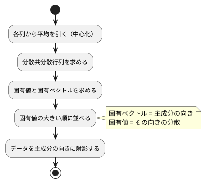

# 第 13 章: 主成分分析による次元削減

## 13.1 はじめに

ここまでの章では、正解ラベルのあるデータで予測をしてきました。この章から扱う **教師なし学習** では、正解ラベルを使わずに、データそのものの構造を調べます。

最初に扱うのは **主成分分析（PCA）** です。住宅価格のデータには 15 個もの列がありますが、列どうしは互いに関係しあっていて、実際にはもっと少ない数の「軸」で大部分を説明できることがあります。主成分分析は、データのばらつきを最もよく説明する新しい軸を探し、たくさんの列を少数の軸に要約します。

[Python 版の第 13 章](../python/13-principal-component-analysis.md) では、NumPy の固有値分解で主成分分析を自作し、scikit-learn の `PCA` と突き合わせました。Kotlin 版では、[第 7 章](07-linear-regression.md) で作った行列型 `Matrix` で分散共分散行列を求め、固有値分解には Tribuo の `DenseMatrix` を使います。

Tribuo には主成分分析のモジュールが無いので、この章は他の章と違い、ライブラリへの置き換えの節がありません（理由は 13.13 節）。その代わりに、Tribuo の固有値分解の振る舞いを **学習用テスト** で確かめ、主成分分析が満たすべき数学的な性質をテストにして、自作の実装を検証します。途中で、固有ベクトルの **符号** という、テストをすり抜けやすい落とし穴にも出会います。

## 13.2 主成分分析とは

### ばらつきが最も大きい方向を探す

2 つの列が強く相関しているデータを散布図にすると、点は斜めの帯のように並びます。このとき、帯に沿った方向の 1 本の軸を取れば、2 つの列の情報をほぼ 1 つの数値で表せます。この「ばらつき（分散）が最も大きい方向」が **第 1 主成分** です。第 2 主成分は、第 1 主成分と直交する方向のうち、ばらつきが最も大きい方向です。

### 分散共分散行列の固有ベクトル

主成分は、次の手順で求められます。



**分散共分散行列** は、対角に各列の分散、それ以外に 2 列の共分散を並べた行列です。この行列の **固有ベクトル** が主成分の向き、**固有値** がその向きのデータの分散になります。行列 `A` の固有ベクトル `v` と固有値 `λ` は、`A v = λ v`（`A` を掛けても向きが変わらず、長さだけが `λ` 倍になる）を満たします。

### 寄与率

各主成分の固有値を、固有値の合計で割った値を **寄与率** と呼びます。その主成分が、データ全体のばらつきのうち何割を説明しているかを表します。第 1 主成分から順に寄与率を足したものが **累積寄与率** です。「累積寄与率が 0.8 に届くまでの主成分を使う」のように、残す軸の数を決める目安に使います。

## 13.3 題材とデータ

この章では、[第 9 章](09-feature-engineering.md) と同じ `Boston.csv`（100 件）を、住宅価格 `PRICE` も含めたすべての列で使います。

| 列の種類 | 列 | 注意点 |
|---------|-----|--------|
| 数値 | ZN, INDUS, CHAS, NOX, RM, AGE, DIS, RAD, TAX, PTRATIO, B, LSTAT, PRICE | NOX と RAD に欠損値が 1 件ずつある。CHAS・RAD・TAX は整数だけの列 |
| カテゴリ | CRIME | `high`・`low`・`very_low` の 3 種類の文字列 |

Kotlin DataFrame の `readCSV` で読むと、CHAS と TAX は `Int`、欠損値のある RAD は `Int?`、NOX は `Double?`、ほかの数値の列は `Double` になりました。RAD の平均値は整数とは限らないので、補完する前に `Double` にそろえる必要があります。

主成分分析は数値しか扱えず、欠損値があると計算できません。また、列ごとに単位や桁（TAX は数百、NOX は 1 未満）が違うと、桁の大きい列のばらつきが主成分を支配してしまいます。そこで次の前処理をしてから主成分分析をします。

1. 欠損値を列の平均値で補完する
2. CRIME をダミー変数（`low`・`very_low` の 2 列）に置き換える
3. すべての列を平均 0・標準偏差 1 に標準化する

欠損値の補完・ダミー変数・標準化は第 9 章で詳しく扱います。この章では、主成分分析に必要な最小限の前処理だけを章の中に用意します。

## 13.4 TODO リストの作成

**TODO リスト**:

- [ ] 分散共分散行列を求める
  - [ ] 2 列の分散と共分散を並べる
  - [ ] 3 列でも各列の分散と 2 列ずつの共分散を並べる
- [ ] Tribuo の固有値分解の振る舞いを確かめる
- [ ] 主成分を求める
  - [ ] 完全に相関する 2 列なら第 1 主成分だけで分散をすべて説明する
  - [ ] 寄与率の大きい順に、指定した数だけ並ぶ
  - [ ] 主成分の向き（符号）をそろえる
  - [ ] 主成分が固有ベクトルの性質を満たす
- [ ] データを主成分の向きに射影する
- [ ] 累積寄与率がしきい値に届く主成分の数を求める
- [ ] 主成分への影響が大きい列を求める
- [ ] Boston を前処理する（欠損値の補完・ダミー変数・標準化）
- [ ] 実データで寄与率と主成分の意味を表示する

## 13.5 分散共分散行列を求める

### Red

`[1, 3, 5]` と `[2, 6, 10]` の 2 列は、2 列目がちょうど 1 列目の 2 倍です。分散は n − 1 で割ると 4 と 16、共分散は 8 になります。データは第 7 章の `Matrix`（1 行を `List<Double>` で表す行列型）で渡します。

```kotlin
// src/test/kotlin/chapter13/PcaTest.kt
package chapter13

import chapter07.Matrix
import kotlin.test.Test
import kotlin.test.assertEquals

private fun assertMatrixEquals(
    expected: List<List<Double>>,
    actual: Matrix,
) {
    assertEquals(expected.size, actual.rows.size)
    expected.zip(actual.rows).forEach { (expectedRow, actualRow) ->
        assertEquals(expectedRow.size, actualRow.size)
        expectedRow.zip(actualRow).forEach { (e, a) -> assertEquals(e, a, absoluteTolerance = 1e-9) }
    }
}

class CovarianceMatrixTest {
    @Test
    fun `2列の分散と共分散を並べた行列を返す`() {
        val x = Matrix(listOf(listOf(1.0, 2.0), listOf(3.0, 6.0), listOf(5.0, 10.0)))

        assertMatrixEquals(listOf(listOf(4.0, 8.0), listOf(8.0, 16.0)), covarianceMatrix(x))
    }
}
```

`Matrix` は data class なので `assertEquals` でも比べられますが、計算で求めた小数は誤差を含みます。要素ごとに許容誤差を付けて比べる `assertMatrixEquals` を、テスト用に用意しました。

```text
e: .../src/test/kotlin/chapter13/PcaTest.kt:23:73 Unresolved reference 'covarianceMatrix'.
```

### Green: 仮実装から三角測量へ

期待する行列をそのまま返す仮実装で Green にします。

```kotlin
// src/main/kotlin/chapter13/Pca.kt
package chapter13

import chapter07.Matrix

fun covarianceMatrix(x: Matrix): Matrix = Matrix(listOf(listOf(4.0, 8.0), listOf(8.0, 16.0)))
```

Python 版は、三角測量の相手に NumPy の `np.cov` を使いました。Kotlin には同じ役割の関数が手元に無いので、手で計算できる 3 列の例を用意します。3 列目 `[0, 1, 5]` の平均は 2、平均との差は `[-2, -1, 3]` です。1 列目の差 `[-2, 0, 2]` との積の和は 10 なので共分散は 10 / 2 = 5、2 乗の和は 14 なので分散は 7 になります。

```kotlin
    @Test
    fun `3列でも各列の分散と2列ずつの共分散を並べる`() {
        val x = Matrix(listOf(listOf(1.0, 2.0, 0.0), listOf(3.0, 6.0, 1.0), listOf(5.0, 10.0, 5.0)))

        assertMatrixEquals(
            listOf(listOf(4.0, 8.0, 5.0), listOf(8.0, 16.0, 10.0), listOf(5.0, 10.0, 7.0)),
            covarianceMatrix(x),
        )
    }
```

```text
CovarianceMatrixTest > 2列の分散と共分散を並べた行列を返す() PASSED
CovarianceMatrixTest > 3列でも各列の分散と2列ずつの共分散を並べる() FAILED
    org.opentest4j.AssertionFailedError: expected: <3> but was: <2>
2 tests completed, 1 failed
```

失敗したのは、`assertMatrixEquals` の最初の行数の比較です。

中心化した行列 `Xc` を使うと、分散共分散行列は `Xcᵀ Xc / (n − 1)` と書けます。第 7 章の `Matrix` には、転置（`transpose`）と積（`*`）がすでにあります。

```kotlin
fun columnMeans(x: Matrix): List<Double> = x.columns.map { it.average() }

fun covarianceMatrix(x: Matrix): Matrix {
    val means = columnMeans(x)
    val centered = Matrix(x.rows.map { row -> row.zip(means) { value, mean -> value - mean } })
    val n = x.rows.size
    return Matrix((centered.transpose() * centered).rows.map { row -> row.map { it / (n - 1) } })
}
```

- `row.zip(means) { value, mean -> value - mean }` は、2 つのリストを先頭から組にし、組ごとにラムダの結果を並べます。1 行の各要素から、その列の平均を引いています
- `Matrix` にはスカラー倍の演算子が無いので、要素ごとに `n - 1` で割っています。必要になっていない演算子は、第 7 章と同じく作りません

```text
CovarianceMatrixTest > 2列の分散と共分散を並べた行列を返す() PASSED
CovarianceMatrixTest > 3列でも各列の分散と2列ずつの共分散を並べる() PASSED
BUILD SUCCESSFUL in 7s
```

## 13.6 Tribuo の固有値分解を確かめる

### 学習用テストを書く

固有値分解は、自分で実装すると数値計算の難しい部分に踏み込むことになります。ここでは Tribuo の `DenseMatrix` が持つ `eigenDecomposition` を使います。初めて使うライブラリの振る舞いは、使う前に学習用テストで確かめます。

固有値の並び順は、Python 版で使った NumPy の `eigh` と同じ「小さい順」だろうと予想してテストを書きました。対称行列 `[[2, 1], [1, 2]]` の固有値は 1 と 3 です。

```kotlin
// src/test/kotlin/chapter13/TribuoEigenLearningTest.kt
class TribuoEigenLearningTest {
    private val symmetric = DenseMatrix.createDenseMatrix(arrayOf(doubleArrayOf(2.0, 1.0), doubleArrayOf(1.0, 2.0)))

    @Test
    fun `対称行列の固有値を小さい順に返す`() {
        val eigen = symmetric.eigenDecomposition().orElseThrow()

        assertEquals(listOf(1.0, 3.0), eigen.eigenvalues().toArray().map { Math.round(it * 1e9) / 1e9 })
    }

    @Test
    fun `i番目の固有ベクトルは行列を掛けても向きが変わらずi番目の固有値倍になる`() {
        val eigen = symmetric.eigenDecomposition().orElseThrow()

        for (i in 0 until 2) {
            val v = eigen.getEigenVector(i).toArray()
            val av = symmetric.toArray().map { row -> row.zip(v.toList()).sumOf { (a, b) -> a * b } }
            val lambda = eigen.eigenvalues().get(i)
            av.zip(v.toList()).forEach { (left, right) -> assertEquals(lambda * right, left, absoluteTolerance = 1e-9) }
        }
    }
}
```

- `eigenDecomposition()` の戻り値は Java の `Optional` です。`orElseThrow()` は、値が無ければ例外を投げ、あれば値を取り出します
- 固有値は計算誤差を含むので、小数第 9 位で丸めてからリストとして比べています

```text
TribuoEigenLearningTest > 対称行列の固有値を小さい順に返す() FAILED
    org.opentest4j.AssertionFailedError: expected: <[1.0, 3.0]> but was: <[3.0, 1.0]>
TribuoEigenLearningTest > i番目の固有ベクトルは行列を掛けても向きが変わらずi番目の固有値倍になる() PASSED
4 tests completed, 1 failed
BUILD FAILED in 8s
```

予想は外れ、Tribuo は固有値を **大きい順** に返しました。2 つ目のテストは通ったので、「`i` 番目の固有ベクトルは `i` 番目の固有値に対応する」ことは確かめられました。

### 予想が外れたらドキュメントとソースを読む

1 つの例でたまたま大きい順になった可能性もあるので、Tribuo 4.3.2 のソースを確認しました。`EigenDecomposition.eigenvalues()` のドキュメンテーションコメントには「The vector of eigenvalues, in descending order.」とあり、`eigenDecomposition()` の中で固有値を大きい順に並べ替えています。あわせて、次のことも分かりました。

- 固有ベクトルは、行列の **列** に並べて返す（`getEigenVector(i)` で `i` 列目を取り出せる）
- 対称でない行列（`isSymmetric()` が偽）は、複素数の固有値を持つことがあるので、空の `Optional` を返す。対称かどうかは、`get(i, j)` と `get(j, i)` が完全に一致するかで判定する

分かったことを、学習用テストに書き直します。対角成分の並びが大きい順でない行列でも並べ替えることと、対称でない行列を渡したときの振る舞いも足しました。

```kotlin
private fun denseMatrixOf(vararg rows: List<Double>): DenseMatrix =
    DenseMatrix.createDenseMatrix(
        rows
            .map {
                it.toDoubleArray()
            }.toTypedArray(),
    )

class TribuoEigenLearningTest {
    private val symmetric = denseMatrixOf(listOf(2.0, 1.0), listOf(1.0, 2.0))

    @Test
    fun `対称行列の固有値を大きい順に返す`() {
        val eigen = symmetric.eigenDecomposition().orElseThrow()

        assertEquals(listOf(3.0, 1.0), eigen.eigenvalues().toArray().map { Math.round(it * 1e9) / 1e9 })
    }

    @Test
    fun `対角成分の並びに関係なく固有値を大きい順に並べ替える`() {
        val diagonal = denseMatrixOf(listOf(1.0, 0.0, 0.0), listOf(0.0, 5.0, 0.0), listOf(0.0, 0.0, 3.0))

        val eigen = diagonal.eigenDecomposition().orElseThrow()

        assertEquals(listOf(5.0, 3.0, 1.0), eigen.eigenvalues().toArray().map { Math.round(it * 1e9) / 1e9 })
    }

    // i番目の固有ベクトルのテストは同じ

    @Test
    fun `対称でない行列は固有値分解できず空のOptionalを返す`() {
        val asymmetric = denseMatrixOf(listOf(2.0, 1.0), listOf(0.0, 2.0))

        assertFalse(asymmetric.eigenDecomposition().isPresent)
    }
}
```

`denseMatrixOf` は、`vararg`（可変長引数）で行を受け取り、Tribuo が求める `Array<DoubleArray>`（Java の `double[][]`）に変換するテスト用の関数です。`vararg rows: List<Double>` と書くと、関数の中では `rows` が `Array<List<Double>>` になります。

分散共分散行列は、`(i, j)` 要素と `(j, i)` 要素を同じ掛け算の和で求めるので、計算誤差があっても完全に対称になります。対称でない行列を渡す心配はありません。

## 13.7 主成分を求める

### 完全に相関する 2 列

先ほどの 2 列のデータは、点がすべて `(1, 2)` 方向の直線上にあります。したがって第 1 主成分は長さ 1 の `(1, 2) / √5`、寄与率は第 1 主成分が 1、第 2 主成分が 0 になるはずです。

```kotlin
private fun assertListEquals(
    expected: List<Double>,
    actual: List<Double>,
) {
    assertEquals(expected.size, actual.size)
    expected.zip(actual).forEach { (e, a) -> assertEquals(e, a, absoluteTolerance = 1e-9) }
}

class FitPcaTest {
    @Test
    fun `完全に相関する2列なら第1主成分だけで分散をすべて説明する`() {
        val x = Matrix(listOf(listOf(1.0, 2.0), listOf(3.0, 6.0), listOf(5.0, 10.0)))

        val model = fitPca(x, nComponents = 2)

        assertListEquals(listOf(1 / sqrt(5.0), 2 / sqrt(5.0)), model.components.rows[0])
        assertListEquals(listOf(1.0, 0.0), model.explainedVarianceRatio)
    }
}
```

期待値に 0 を含む比較では、「期待値の何倍までずれてよいか」という相対誤差は役に立ちません。kotlin.test の `absoluteTolerance` は絶対誤差なので、計算でごく小さな値が出ても 0 との比較が成り立ちます。

```text
e: .../src/test/kotlin/chapter13/PcaTest.kt:51:21 Unresolved reference 'fitPca'.
e: .../src/test/kotlin/chapter13/PcaTest.kt:53:64 Argument type mismatch: actual type is 'V? (of fun <K, V> Map<out K, V>.get)', but 'List<Double>' was expected.
e: .../src/test/kotlin/chapter13/PcaTest.kt:53:64 Cannot infer type for type parameter 'V'. Specify it explicitly.
```

2 行目以降のエラーは、`fitPca` の戻り値の型が分からないため、`model.components.rows[0]` の `[0]` をコンパイラが `Map` の `get` の候補と照らし合わせて失敗したものです。関数が無いことによる連鎖的なエラーです。

13.2 節の手順をそのまま実装します。Tribuo が固有値を大きい順に並べてくれることは、学習用テストで確かめ済みです。

```kotlin
data class PcaModel(
    val mean: List<Double>,
    val components: Matrix,
    val explainedVariance: List<Double>,
    val explainedVarianceRatio: List<Double>,
)

fun fitPca(
    x: Matrix,
    nComponents: Int,
): PcaModel {
    val covariance = DenseMatrix.createDenseMatrix(covarianceMatrix(x).rows.map { it.toDoubleArray() }.toTypedArray())
    val eigen = covariance.eigenDecomposition().orElseThrow()
    val eigenvalues = eigen.eigenvalues().toArray().toList()
    val components = (0 until nComponents).map { eigen.getEigenVector(it).toArray().toList() }
    return PcaModel(
        mean = columnMeans(x),
        components = Matrix(components),
        explainedVariance = eigenvalues.take(nComponents),
        explainedVarianceRatio = eigenvalues.take(nComponents).map { it / eigenvalues.sum() },
    )
}
```

- 第 7 章の `Matrix` を Tribuo の `DenseMatrix` に変換するには、行ごとに `toDoubleArray()` で `DoubleArray` にし、`toTypedArray()` で配列の配列にします
- 固有ベクトルは列に並んでいるので、`getEigenVector(i)` で 1 本ずつ取り出し、`components` の 1 行を 1 つの主成分にしています

```text
FitPcaTest > 完全に相関する2列なら第1主成分だけで分散をすべて説明する() PASSED
BUILD SUCCESSFUL in 6s
```

### 寄与率の順と、すり抜けた符号のテスト

乱数で作った 4 列の人工データで、寄与率が大きい順に並ぶことを確かめます。2 つの隠れた変数を 4 列に混ぜ、小さなノイズを加えたデータです。乱数には、シードを指定した `java.util.Random` の `nextGaussian()`（平均 0・標準偏差 1 の正規分布の乱数）を使います。

```kotlin
/** 2 つの隠れた変数を 4 列に混ぜ、小さなノイズを加えた 40 行の架空のデータ */
private fun mixedDataset(): Matrix {
    val random = Random(0)
    val mixing = listOf(listOf(2.0, 0.5), listOf(0.3, 1.0), listOf(1.0, -1.0), listOf(0.0, 0.2))
    return Matrix(
        List(40) {
            val base = listOf(random.nextGaussian(), random.nextGaussian())
            mixing.map { weights -> weights.zip(base).sumOf { (w, b) -> w * b } + random.nextGaussian() * 0.1 }
        },
    )
}
```

```kotlin
    @Test
    fun `主成分は寄与率の大きい順に指定した数だけ並ぶ`() {
        val model = fitPca(mixedDataset(), nComponents = 3)

        val ratios = model.explainedVarianceRatio
        assertEquals(3, ratios.size)
        assertEquals(ratios.sortedDescending(), ratios)
    }
```

固有ベクトル `v` が主成分の向きなら、逆向きの `−v` も同じ直線を表す固有ベクトルです。どちらの符号が返るかは計算方法によって決まり、決まった規則はありません。Python 版と同じく、「絶対値が最大の要素が正になる」ように向きをそろえる、という仕様にします。まず、負の相関を持つ 2 列で第 1 主成分の向きを確かめるテストを書きました。

```kotlin
    @Test
    fun `主成分の向きは絶対値が最大の要素が正になるようにそろえる`() {
        val x = Matrix(listOf(listOf(1.0, -2.0), listOf(3.0, -6.0), listOf(5.0, -10.0)))

        val model = fitPca(x, nComponents = 1)

        assertListEquals(listOf(-1 / sqrt(5.0), 2 / sqrt(5.0)), model.components.rows[0])
    }
```

Red になるはずでしたが、実際には次のように **2 つとも通ってしまいました**。

```text
FitPcaTest > 主成分の向きは絶対値が最大の要素が正になるようにそろえる() PASSED
FitPcaTest > 主成分は寄与率の大きい順に指定した数だけ並ぶ() PASSED
FitPcaTest > 完全に相関する2列なら第1主成分だけで分散をすべて説明する() PASSED
BUILD SUCCESSFUL in 6s
```

寄与率の順は Tribuo が並べ替えるので通って当然ですが、符号のテストは、向きをそろえる処理がまだ無いのに通っています。Tribuo がたまたま期待どおりの向きを返しただけです。これでは、仕様を守る実装があることをテストが保証しません。

Red を確認できないテストは、何も確かめていないのと同じです。Tribuo が逆向きを返す例を探すため、いくつかのデータで、向きをそろえる前の主成分を一時的に表示しました。

```text
PROBE pos [[0.4472135954999579, 0.8944271909999159], [-0.8944271909999159, 0.4472135954999579]]
PROBE neg [[-0.4472135954999579, 0.8944271909999159], [-0.8944271909999159, -0.4472135954999579]]
```

`pos` は `(1, 2)` 方向の直線上のデータ、`neg` は `(1, −2)` 方向の直線上のデータです。どちらも第 2 主成分は、絶対値が最大の要素 `−0.894` が負でした。そこで、`(1, 2)` 方向のデータの **第 2 主成分** で向きを確かめるテストに書き直します。

```kotlin
    @Test
    fun `主成分の向きは絶対値が最大の要素が正になるようにそろえる`() {
        val x = Matrix(listOf(listOf(1.0, 2.0), listOf(3.0, 6.0), listOf(5.0, 10.0)))

        val model = fitPca(x, nComponents = 2)

        assertListEquals(listOf(2 / sqrt(5.0), -1 / sqrt(5.0)), model.components.rows[1])
    }
```

```text
FitPcaTest > 主成分の向きは絶対値が最大の要素が正になるようにそろえる() FAILED
    org.opentest4j.AssertionFailedError: Expected <0.8944271909999159> with absolute tolerance <1.0E-9>, actual <-0.8944271909999159>.
FitPcaTest > 主成分は寄与率の大きい順に指定した数だけ並ぶ() PASSED
FitPcaTest > 完全に相関する2列なら第1主成分だけで分散をすべて説明する() PASSED
9 tests completed, 1 failed
BUILD FAILED in 5s
```

今度は期待どおり Red になりました。各主成分について、絶対値が最大の要素の符号（+1 か −1）を行全体に掛ける `normalizeSigns` を実装し、`fitPca` から使います。

```kotlin
/** 固有ベクトルは符号が逆でも同じ向きを表すので、絶対値が最大の要素が正になるようにそろえる */
fun normalizeSigns(components: Matrix): Matrix =
    Matrix(
        components.rows.map { row ->
            val largest = row.maxBy { abs(it) }
            row.map { it * sign(largest) }
        },
    )
```

```kotlin
        components = normalizeSigns(Matrix(components)),
```

- `maxBy { abs(it) }` は、絶対値が最大の **要素そのもの**（符号付き）を返します
- `kotlin.math.sign` は、正なら 1.0、負なら −1.0 を返します

```text
BUILD SUCCESSFUL in 37s
```

`normalizeSigns` にも、Python 版と同じ専用のテストを足して振る舞いを固定します。

```kotlin
class NormalizeSignsTest {
    @Test
    fun `絶対値が最大の要素が正になるように主成分の向きをそろえる`() {
        val components = Matrix(listOf(listOf(0.6, -0.8), listOf(-0.8, 0.6)))

        assertMatrixEquals(listOf(listOf(-0.6, 0.8), listOf(0.8, -0.6)), normalizeSigns(components))
    }
}
```

### 突き合わせる相手が無いときは性質をテストにする

Python 版は、scikit-learn の `PCA` と主成分・寄与率を突き合わせて、自作の実装が正しい計算をしていることを確かめました。Kotlin 版には突き合わせる相手がありません。そこで、主成分分析の結果が満たすべき **性質** をテストにします。

- 主成分は長さ 1 で、互いに直交する。主成分を並べた行列 `C` と転置の積 `C Cᵀ` は単位行列になる
- 主成分 `v` は分散共分散行列 `A` の固有ベクトルで、`A v` は `v` の「その主成分の分散」倍になる

```kotlin
    @Test
    fun `主成分は長さ1で互いに直交する`() {
        val model = fitPca(mixedDataset(), nComponents = 3)

        val gram = model.components * model.components.transpose()

        assertMatrixEquals(List(3) { i -> List(3) { j -> if (i == j) 1.0 else 0.0 } }, gram)
    }

    @Test
    fun `主成分は分散共分散行列に掛けると分散の倍数になる固有ベクトル`() {
        val x = mixedDataset()

        val model = fitPca(x, nComponents = 3)

        val covariance = covarianceMatrix(x)
        model.components.rows.zip(model.explainedVariance).forEach { (component, variance) ->
            val projected = covariance * Matrix(component.map { listOf(it) })
            assertListEquals(component.map { it * variance }, projected.columns.first())
        }
    }
```

`Matrix(component.map { listOf(it) })` は、主成分を 1 列の行列（列ベクトル）にしています。`List(3) { i -> List(3) { j -> ... } }` は、インデックスから要素を作って 3 × 3 の単位行列を組み立てています。

どちらのテストも、実装を変えずに通ります。Tribuo の固有値分解をどう使っても満たすべき性質なので、Tribuo の版を上げたときや、自前の計算に差し替えたときの安全網になります。

## 13.8 データを主成分の向きに射影する

データを主成分の軸で表し直すには、平均を引いてから主成分の向きとの内積を取ります。平均が `(1, 2)`、主成分が `(0.6, 0.8)` のモデルに `(2, 3)` を渡すと、`(1, 1)` と `(0.6, 0.8)` の内積で 1.4 になります。

```kotlin
class TransformTest {
    @Test
    fun `平均を引いてから主成分の向きに射影する`() {
        val model =
            PcaModel(
                mean = listOf(1.0, 2.0),
                components = Matrix(listOf(listOf(0.6, 0.8))),
                explainedVariance = listOf(1.0),
                explainedVarianceRatio = listOf(1.0),
            )

        assertMatrixEquals(listOf(listOf(1.4), listOf(0.0)), transform(model, Matrix(listOf(listOf(2.0, 3.0), listOf(1.0, 2.0)))))
    }
}
```

テストの `PcaModel` は、学習を経由せずにコンストラクターで直接組み立てています。data class にしておいたので、射影だけをテストできます。

## 13.9 必要な主成分の数を求める

寄与率が `[0.5, 0.25, 0.25]` のとき、累積寄与率は `[0.5, 0.75, 1.0]` です。しきい値 0.75 に届くのは 2 つ目です。射影のテストと一緒に書きました。

```kotlin
class ComponentsNeededTest {
    @Test
    fun `累積寄与率がしきい値に届くまでの主成分の数を返す`() {
        assertEquals(2, componentsNeeded(listOf(0.5, 0.25, 0.25), threshold = 0.75))
    }
}
```

```text
e: .../src/test/kotlin/chapter13/PcaTest.kt:131:62 Unresolved reference 'transform'.
e: .../src/test/kotlin/chapter13/PcaTest.kt:138:25 Unresolved reference 'componentsNeeded'.
```

`transform` は明白な実装、`componentsNeeded` は 2 を返す仮実装で Green にします。

```kotlin
fun transform(
    model: PcaModel,
    x: Matrix,
): Matrix {
    val centered = Matrix(x.rows.map { row -> row.zip(model.mean) { value, mean -> value - mean } })
    return centered * model.components.transpose()
}

fun componentsNeeded(
    ratios: List<Double>,
    threshold: Double,
): Int = 2
```

`components` の 1 行が 1 つの主成分なので、データの行列に `components` の転置を掛けると、1 行のデータが「主成分ごとの座標」の 1 行に変わります。

```text
ComponentsNeededTest > 累積寄与率がしきい値に届くまでの主成分の数を返す() PASSED
TransformTest > 平均を引いてから主成分の向きに射影する() PASSED
BUILD SUCCESSFUL in 36s
```

しきい値を 0.8 に上げると 3 つ必要になる例で三角測量します。

```kotlin
    @Test
    fun `しきい値を上げると必要な主成分の数が増える`() {
        assertEquals(3, componentsNeeded(listOf(0.5, 0.25, 0.25), threshold = 0.8))
    }
```

```text
ComponentsNeededTest > 累積寄与率がしきい値に届くまでの主成分の数を返す() PASSED
ComponentsNeededTest > しきい値を上げると必要な主成分の数が増える() FAILED
    org.opentest4j.AssertionFailedError: expected: <3> but was: <2>
15 tests completed, 1 failed
```

`runningReduce` で累積和を取り、しきい値に届く最初の位置を `indexOfFirst` で求めます。位置は 0 から数えるので、個数にするには 1 を足します。

```kotlin
fun componentsNeeded(
    ratios: List<Double>,
    threshold: Double,
): Int = ratios.runningReduce(Double::plus).indexOfFirst { it >= threshold } + 1
```

`runningReduce` は、`reduce` の途中経過をすべて並べたリストを返します。`[0.5, 0.25, 0.25]` なら `[0.5, 0.75, 1.0]` です。`Double::plus` は、`Double` の足し算を関数として渡す関数参照です。

あわせて、`covarianceMatrix` と `transform` に同じ中心化の処理が重複していたので、`private` な関数に切り出しました。

```kotlin
private fun center(
    x: Matrix,
    means: List<Double>,
): Matrix = Matrix(x.rows.map { row -> row.zip(means) { value, mean -> value - mean } })

fun covarianceMatrix(x: Matrix): Matrix {
    val centered = center(x, columnMeans(x))
    val n = x.rows.size
    return Matrix((centered.transpose() * centered).rows.map { row -> row.map { it / (n - 1) } })
}
```

```kotlin
fun transform(
    model: PcaModel,
    x: Matrix,
): Matrix = center(x, model.mean) * model.components.transpose()
```

```text
BUILD SUCCESSFUL in 6s
```

テストの寄与率に `[0.5, 0.25, 0.25]` を選んだのは、2 進数で誤差なく表せる値だからです。`[0.6, 0.3, 0.1]` でしきい値 0.9 を試すと、次のようになりました。

```kotlin
println(listOf(0.6, 0.3, 0.1).runningReduce(Double::plus))
println(componentsNeeded(listOf(0.6, 0.3, 0.1), threshold = 0.9))
```

```text
[0.6, 0.8999999999999999, 0.9999999999999999]
3
```

0.6 + 0.3 は浮動小数点数では 0.8999999999999999 になり、0.9 に届かないので、結果は 2 ではなく 3 です。Python 版の NumPy の `cumsum` は表示を丸めて `0.9` と見せていましたが、Kotlin の `List<Double>` の `toString` は丸めずに表示するので、誤差がそのまま見えます。テストの例を選ぶときは、このような誤差が入り込まない値を使うか、許容誤差を明示します。

## 13.10 主成分への影響が大きい列を求める

主成分の各要素は、元の列がその主成分にどれだけ強く関わるかを表します。絶対値の大きい順に列名を並べると、主成分の意味を読み取る手がかりになります。

```kotlin
class TopLoadingsTest {
    @Test
    fun `係数の絶対値が大きい順に列名と係数を返す`() {
        val component = listOf(0.1, -0.7, 0.5)

        assertEquals(listOf("DIS" to -0.7, "TAX" to 0.5), topLoadings(component, listOf("ZN", "DIS", "TAX"), k = 2))
    }
}
```

```text
e: .../src/test/kotlin/chapter13/PcaTest.kt:152:59 Unresolved reference 'topLoadings'.
```

```kotlin
fun topLoadings(
    component: List<Double>,
    columns: List<String>,
    k: Int,
): List<Pair<String, Double>> = columns.zip(component).sortedByDescending { (_, value) -> abs(value) }.take(k)
```

`columns.zip(component)` で列名と係数の `Pair` を作り、`sortedByDescending` で係数の絶対値が大きい順に並べます。ラムダの引数 `(_, value)` は `Pair` を分解し、使わない列名を `_` で読み飛ばしています。

```text
TopLoadingsTest > 係数の絶対値が大きい順に列名と係数を返す() PASSED
BUILD SUCCESSFUL in 11s
```

## 13.11 Boston を前処理する

### ダミー変数

前処理は `src/main/kotlin/chapter13/BostonStandardized.kt` に分けます。テストには、CRIME の 3 種類と欠損値を含む 4 行の架空のデータを使います。

```kotlin
private fun bostonLike(): AnyFrame =
    dataFrameOf(
        "CRIME" to listOf("high", "low", "very_low", "low"),
        "RM" to listOf(5.0, 6.0, null, 7.0),
        "PRICE" to listOf(10.0, 20.0, 30.0, 40.0),
    )

class StandardizeBostonTest {
    @Test
    fun `CRIMEをダミー変数の列に置き換える`() {
        val df = standardizeBoston(bostonLike())

        assertEquals(listOf("RM", "PRICE", "low", "very_low"), df.columnNames())
    }
}
```

```text
e: .../src/test/kotlin/chapter13/BostonStandardizedTest.kt:18:18 Unresolved reference 'standardizeBoston'.
```

（テストファイルの名前は、13.15 節で ktlint の指摘を受けて `StandardizeBostonTest.kt` に変えます。）

まずダミー変数だけを実装します。カテゴリを名前の順に並べて最初の `high` を除き、残りの `low`・`very_low` の列を足します。`low` も `very_low` も 0 なら `high` だと分かるので、3 列目は情報として重複するからです。

```kotlin
private const val CRIME = "CRIME"

fun standardizeBoston(df: AnyFrame): AnyFrame {
    val crime = df[CRIME].values().map { it.toString() }
    val categories = crime.distinct().sorted().drop(1)
    return categories.fold(df.remove(CRIME)) { frame, category ->
        frame.add(category) { if (crime[index()] == category) 1.0 else 0.0 }
    }
}
```

- `fold` は、CRIME を除いたデータフレームを初期値にして、カテゴリごとに列を 1 つずつ足していきます
- `add(列名) { ... }` のブロックでは、`index()` で今の行の位置を取れます。CRIME の列は取り除いた後なので、先に取り出しておいた `crime` のリストを位置で引いています

```text
StandardizeBostonTest > CRIMEをダミー変数の列に置き換える() PASSED
BUILD SUCCESSFUL in 10s
```

### 補完と標準化

次に、欠損値の補完と標準化を求めるテストを足します。標準偏差は、Python 版の `std(ddof=0)` と同じく件数 n で割ります。

```kotlin
    @Test
    fun `欠損値を補完してから各列を平均0と標準偏差1にそろえる`() {
        val df = standardizeBoston(bostonLike())

        df.columns().forEach { column ->
            val values = column.values().map { (it as Number).toDouble() }
            val mean = values.average()
            val std = sqrt(values.sumOf { (it - mean) * (it - mean) } / values.size)
            assertEquals(0.0, mean, absoluteTolerance = 1e-9, message = column.name())
            assertEquals(1.0, std, absoluteTolerance = 1e-9, message = column.name())
        }
    }
```

```text
StandardizeBostonTest > 欠損値を補完してから各列を平均0と標準偏差1にそろえる() FAILED
    java.lang.NullPointerException: null cannot be cast to non-null type kotlin.Number
StandardizeBostonTest > CRIMEをダミー変数の列に置き換える() PASSED
18 tests completed, 1 failed
```

RM の欠損値（`null`）を `Number` に変換しようとして、例外で失敗しました。pandas では欠損値は `NaN` という浮動小数点数の値なので、型の変換では例外になりません。Kotlin では、`null` を null 非許容の `Number` として扱おうとした時点で失敗します。

ダミー変数を `add` で足していく書き方では、数値の列を 1 列ずつ変換しにくくなります。「列名と値のリストの組」を並べてから、最後にまとめてデータフレームにする形に書き直しました。

```kotlin
/** 数値の列を Double に変換し、欠損値を列の平均値で補完する */
private fun AnyCol.toFilledDoubles(): List<Double> {
    val numbers = values().map { (it as Number?)?.toDouble() }
    val mean = numbers.filterNotNull().average()
    return numbers.map { it ?: mean }
}

/** 平均 0・標準偏差 1 にそろえる（標準偏差は件数 n で割る） */
private fun standardize(values: List<Double>): List<Double> {
    val mean = values.average()
    val std = sqrt(values.sumOf { (it - mean) * (it - mean) } / values.size)
    return values.map { (it - mean) / std }
}

fun standardizeBoston(df: AnyFrame): AnyFrame {
    val crime = df[CRIME].values().map { it.toString() }
    val numeric = df.remove(CRIME).columns().map { it.name() to it.toFilledDoubles() }
    val dummies =
        crime.distinct().sorted().drop(1).map { category ->
            category to crime.map { if (it == category) 1.0 else 0.0 }
        }
    return (numeric + dummies).map { (name, values) -> standardize(values).toColumn(name) }.toDataFrame()
}
```

- `(it as Number?)?.toDouble()` は、`null` なら `null` のまま、数値なら `Double` にします。13.3 節で見たとおり、実データの RAD は `Int?` の列なので、`Int` も `Double` も `Number` として受け取ってから変換します
- `it ?: mean` で、`null` だけを平均値に置き換えます
- `toColumn(name)` はリストを名前付きの列に、`List` の列の並びに対する `toDataFrame()` は列をまとめてデータフレームにします

```text
StandardizeBostonTest > 欠損値を補完してから各列を平均0と標準偏差1にそろえる() PASSED
StandardizeBostonTest > CRIMEをダミー変数の列に置き換える() PASSED
BUILD SUCCESSFUL in 50s
```

**TODO リスト**:

- [x] 分散共分散行列を求める
  - [x] 2 列の分散と共分散を並べる
  - [x] 3 列でも各列の分散と 2 列ずつの共分散を並べる
- [x] Tribuo の固有値分解の振る舞いを確かめる
- [x] 主成分を求める
  - [x] 完全に相関する 2 列なら第 1 主成分だけで分散をすべて説明する
  - [x] 寄与率の大きい順に、指定した数だけ並ぶ
  - [x] 主成分の向き（符号）をそろえる
  - [x] 主成分が固有ベクトルの性質を満たす
- [x] データを主成分の向きに射影する
- [x] 累積寄与率がしきい値に届く主成分の数を求める
- [x] 主成分への影響が大きい列を求める
- [x] Boston を前処理する（欠損値の補完・ダミー変数・標準化）
- [ ] 実データで寄与率と主成分の意味を表示する

## 13.12 実データで要約する

### 表示のテストを先に書く

この章は、訓練データとテストデータに分けず、乱数も使いません。前処理と固有値分解が Python 版と同じなら、表示される値も Python 版と一致するはずです。そこで、Python 版の出力を期待値にして、表示のテストを先に書きました。

```kotlin
class BostonPcaDataTest {
    private val csvFile = File(dataDir(), "Boston.csv")

    @BeforeTest
    fun requireData() {
        assumeTrue(csvFile.exists(), "学習データ Boston.csv が配置されていない（gulp data:setup）")
    }

    @Test
    fun `CRIMEをダミー変数にして15列の標準化済みデータにする`() {
        val df = loadStandardizedBoston(csvFile)

        assertEquals(100 to 15, df.rowsCount() to df.columnsCount())
    }

    @Test
    fun `実データの主成分も分散共分散行列の固有ベクトルになる`() {
        val df = loadStandardizedBoston(csvFile)
        val x = df.toMatrix(df.columnNames())

        val model = fitPca(x, nComponents = 15)

        val covariance = covarianceMatrix(x)
        model.components.rows.zip(model.explainedVariance).forEach { (component, variance) ->
            val projected = covariance * Matrix(component.map { listOf(it) })
            component.zip(projected.columns.first()).forEach { (v, av) -> assertEquals(v * variance, av, absoluteTolerance = 1e-9) }
        }
        assertEquals(1.0, model.explainedVarianceRatio.sum(), absoluteTolerance = 1e-9)
    }

    @Test
    fun `実行すると寄与率と主成分の解釈を表示する`() {
        val output = captureStdout { main() }

        assertEquals(
            "データ件数: 100, 列数: 15\n" +
                "寄与率: PC1 0.4110, PC2 0.1448, PC3 0.1019, PC4 0.0645, PC5 0.0623, PC6 0.0581\n" +
                "累積寄与率が 0.8 に届く主成分の数: 6（累積寄与率 0.8427）\n" +
                "第 1 主成分で影響の大きい列: INDUS 0.359, NOX 0.350, TAX 0.328\n" +
                "第 2 主成分で影響の大きい列: PRICE 0.444, low 0.423, RM 0.405\n",
            output,
        )
    }
}
```

`df.toMatrix(...)` は、第 7 章で作ったデータフレームを `Matrix` に変換する拡張関数です。

```text
e: .../src/test/kotlin/chapter13/BostonPcaDataTest.kt:22:18 Unresolved reference 'loadStandardizedBoston'.
e: .../src/test/kotlin/chapter13/BostonPcaDataTest.kt:24:9 Cannot infer type for type parameter 'T'. Specify it explicitly.
e: .../src/test/kotlin/chapter13/BostonPcaDataTest.kt:24:9 Inapplicable candidate(s): fun <T> assertEquals(expected: T, actual: T, message: String? = ...): Unit
e: .../src/test/kotlin/chapter13/BostonPcaDataTest.kt:24:48 Cannot infer type for type parameter 'A'. Specify it explicitly.
e: .../src/test/kotlin/chapter13/BostonPcaDataTest.kt:24:48 Cannot infer type for type parameter 'B'. Specify it explicitly.
e: .../src/test/kotlin/chapter13/BostonPcaDataTest.kt:29:18 Unresolved reference 'loadStandardizedBoston'.
e: .../src/test/kotlin/chapter13/BostonPcaDataTest.kt:44:38 Unresolved reference 'main'.
```

### 結果を表示する

```kotlin
fun loadStandardizedBoston(csvFile: File): AnyFrame = standardizeBoston(DataFrame.readCSV(csvFile))
```

```kotlin
// src/main/kotlin/chapter13/Main.kt
package chapter13

import chapter07.toMatrix
import dataset.dataDir
import java.io.File
import java.util.Locale

private const val THRESHOLD = 0.8
private const val TOP_K = 3
private const val COMPONENTS_TO_EXPLAIN = 2

private fun formatLoadings(loadings: List<Pair<String, Double>>): String =
    loadings.joinToString(", ") { (column, value) -> "$column ${"%.3f".format(Locale.ROOT, value)}" }

fun main() {
    val df = loadStandardizedBoston(File(dataDir(), "Boston.csv"))
    val columns = df.columnNames()
    val model = fitPca(df.toMatrix(columns), nComponents = columns.size)
    val ratios = model.explainedVarianceRatio
    val needed = componentsNeeded(ratios, THRESHOLD)
    println("データ件数: ${df.rowsCount()}, 列数: ${columns.size}")
    println("寄与率: " + ratios.take(needed).withIndex().joinToString(", ") { (i, r) -> "PC${i + 1} ${"%.4f".format(Locale.ROOT, r)}" })
    val cumulative = ratios.take(needed).sum()
    println("累積寄与率が $THRESHOLD に届く主成分の数: $needed（累積寄与率 ${"%.4f".format(Locale.ROOT, cumulative)}）")
    for (i in 0 until COMPONENTS_TO_EXPLAIN) {
        val loadings = topLoadings(model.components.rows[i], columns, k = TOP_K)
        println("第 ${i + 1} 主成分で影響の大きい列: ${formatLoadings(loadings)}")
    }
}
```

- `withIndex()` は、要素を「位置と値の組」（`IndexedValue`）にします。`(i, r)` で分解して、`PC1`・`PC2` の番号を作っています
- 表示する主成分の数 `2` にも、何の数かが分かるように `COMPONENTS_TO_EXPLAIN` という名前を付けました

```text
BostonPcaDataTest > 実行すると寄与率と主成分の解釈を表示する() PASSED
BostonPcaDataTest > CRIMEをダミー変数にして15列の標準化済みデータにする() PASSED
BostonPcaDataTest > 実データの主成分も分散共分散行列の固有ベクトルになる() PASSED
BUILD SUCCESSFUL in 11s
```

3 件とも一度で通りました。表示は Python 版と小数第 4 位（係数は第 3 位）まで一致しています。

```bash
./gradlew runChapter -Pchapter=13
```

```text
データ件数: 100, 列数: 15
寄与率: PC1 0.4110, PC2 0.1448, PC3 0.1019, PC4 0.0645, PC5 0.0623, PC6 0.0581
累積寄与率が 0.8 に届く主成分の数: 6（累積寄与率 0.8427）
第 1 主成分で影響の大きい列: INDUS 0.359, NOX 0.350, TAX 0.328
第 2 主成分で影響の大きい列: PRICE 0.444, low 0.423, RM 0.405
```

これまでの章では、分割の乱数が NumPy と Kotlin で違うため、数値が Python 版と一致しませんでした。この章では、同じデータを同じ手順で計算しているので、NumPy の `eigh` と Tribuo の固有値分解という別々の実装から、同じ主成分と寄与率が得られています。主成分の向きがそろっているのは、13.7 節の `normalizeSigns` で符号の規則を決めたからです。

### 結果を読む

- **第 1 主成分だけで 4 割を説明する**: 15 列のばらつきのうち 41.1% を、1 本の軸で説明できます
- **15 列を 6 本の軸に要約できる**: 累積寄与率 0.8 を目安にすると、6 つの主成分で全体の 84.3% を説明できます
- **第 1 主成分は「産業化・都市化」の軸と読める**: 非小売業の土地の割合（INDUS）、窒素酸化物の濃度（NOX）、固定資産税率（TAX）が同じ向きに強く効いています
- **第 2 主成分は「住環境のよさ」の軸と読める**: 住宅価格（PRICE）、部屋数（RM）、犯罪率が低い地区（low）が同じ向きに効いています

主成分の「意味」は計算で決まるものではなく、係数を見た人間の解釈です。符号の向きも `normalizeSigns` の規則で決めたものなので、「値が大きいほど都市化している」のか「小さいほど」なのかは、係数の符号とあわせて読む必要があります。

## 13.13 ライブラリへの置き換えを省略する理由

他の章では、自作のアルゴリズムを Tribuo のトレーナーに置き換えて結果を突き合わせてきました。この章では、その節を省略します。[ADR 002](../../../adr/002-kotlin-ml-libraries.md) で確かめたとおり、Tribuo 4.3.2 には主成分分析のモジュール（学習して射影するトレーナーや変換器）が無いためです。

その代わりに、この章では次の形で Tribuo を使い、検証しました。

| 検証の手段 | 何を確かめたか |
|-----------|--------------|
| 学習用テスト（`TribuoEigenLearningTest`） | Tribuo の固有値分解が、固有値を大きい順に並べ、固有ベクトルを列に置き、対称でない行列では空の `Optional` を返すこと |
| 性質のテスト（`FitPcaTest`） | 主成分が長さ 1 で直交し、分散共分散行列の固有ベクトルになっていること |
| 実データのテスト（`BostonPcaDataTest`） | 実データでも固有ベクトルの性質を満たし、寄与率の合計が 1 になること。表示が Python 版の結果と一致すること |

主成分分析の手順のうち、計算が難しいのは固有値分解だけです。そこだけをライブラリに任せ、前後の中心化・分散共分散行列・並べ替え・符号・射影を自作したことで、この章の実装が最終実装になります。

## 13.14 Notebook で探索する

Notebook は `apps/kotlin/notebooks/chapter13_pca_exploration.ipynb` にあります。グラフの画像は記事には載せません（配布データの点をそのまま描いた図になるため）。事前に `./gradlew jar` でプロジェクトの JAR を作っておきます。

### 準備

`fitPca` は Tribuo の `DenseMatrix` を使うので、プロジェクトの JAR より先のセルで Tribuo の行列のモジュールを読み込みます。第 3 章と同じく、同じセルに書くと JAR のクラスから Tribuo のクラスが見つからないことがあるためです。

```kotlin
%use dataframe(0.15.0), kandy(0.8.0)
```

```kotlin
@file:DependsOn("org.tribuo:tribuo-math:4.3.2")
```

```kotlin
@file:DependsOn("../build/libs/getting-started-ml.jar")
```

```kotlin
import chapter07.toMatrix
import chapter13.fitPca
import chapter13.standardizeBoston
import chapter13.topLoadings
import chapter13.transform
import java.io.File

// Notebook は notebooks/ で実行されるので、学習データの既定の場所を 1 つ上にずらす
val bostonCsv = File(dataset.dataDir { name -> System.getenv(name) ?: "../../data/sukkiri-ml" }, "Boston.csv")
// 散布図の色分けに CRIME を使うので、標準化の前のデータも残しておく
val raw = DataFrame.readCSV(bostonCsv)
val df = standardizeBoston(raw)
val x = df.toMatrix(df.columnNames())
val model = fitPca(x, nComponents = df.columnsCount())
```

### 主成分の数と累積寄与率

```kotlin
val cumulative =
    dataFrameOf(
        "主成分の数" to (1..df.columnsCount()).toList(),
        "累積寄与率" to model.explainedVarianceRatio.runningReduce(Double::plus),
    )
cumulative.plot {
    line {
        x("主成分の数")
        y("累積寄与率")
    }
    points {
        x("主成分の数")
        y("累積寄与率")
    }
    hLine {
        yIntercept.constant(0.8)
    }
    layout.title = "主成分の数と累積寄与率"
}
```

Kandy の `hLine` は水平線を描くレイヤーで、`yIntercept.constant(0.8)` で目安の 0.8 に線を引きます。累積寄与率は 1 本目で 0.411、2 本目で 0.556、3 本目で 0.658 と増え、増え方は本数が増えるほど小さくなります。0.8 の線を超えるのは 6 本目（0.843）です。

### 第 1・第 2 主成分の散布図

```kotlin
val projected = transform(model, x)
val scores =
    dataFrameOf(
        "PC1" to projected.rows.map { it[0] },
        "PC2" to projected.rows.map { it[1] },
        "CRIME" to raw["CRIME"].values().map { it.toString() },
    )
scores.plot {
    points {
        x("PC1")
        y("PC2")
        color("CRIME")
    }
    layout.title = "第 1・第 2 主成分で見た地区"
}
```

15 列のデータを 2 本の軸に写した散布図を、CRIME で色分けします。色ごとの位置の違いを数値で確かめます。

```kotlin
scores.groupBy("CRIME").mean()
```

CRIME ごとの平均（小数第 3 位で四捨五入）は次のとおりです。

| CRIME | PC1 | PC2 |
|-------|-----|-----|
| high | 3.474 | -0.386 |
| low | 0.409 | 1.590 |
| very_low | -1.942 | -0.602 |

犯罪率が `high` の地区は第 1 主成分（産業化・都市化）の値が大きく、`low` の地区は第 2 主成分（住環境のよさ）の値が大きくなっています。CRIME そのものも主成分の計算に含めているので、この分かれ方は予想どおりです。一方で、2 本の軸だけで 3 種類の地区がおおまかに分かれることは、15 列の情報の多くが 2 本の軸に集約されていることを示しています。

### 主成分への影響が大きい列

```kotlin
(0 until 2).associate { i ->
    "第 ${i + 1} 主成分" to topLoadings(model.components.rows[i], df.columnNames(), k = 5)
}
```

上位 5 列まで広げると、第 1 主成分には `very_low`（−0.315）と RAD（0.307）、第 2 主成分には PTRATIO（−0.340）と DIS（−0.293）が続きます。犯罪率がとても低い地区であることは、産業化・都市化の軸とは逆向きに効いています。

## 13.15 品質チェック

### ktlint と detekt の指摘

`./gradlew ktlintFormat` と `./gradlew check` を実行すると、ファイル名について 2 つの指摘が出ました（パスは短く直しています）。

```text
BostonStandardizedTest.kt:1:1: File 'BostonStandardizedTest.kt' contains a single class, and possibly related top level declarations for that class. The file should be named after the class, 'StandardizeBostonTest.kt' (cannot be auto-corrected) (standard:filename)
```

```text
src/main/kotlin/chapter13/Pca.kt:8:12: The file name 'Pca' does not match the name of the single top-level declaration 'PcaModel'. [MatchingDeclarationName]
```

**ktlint（standard:filename）**: テストのファイルに `StandardizeBostonTest` クラスだけを置いていたので、ファイル名を `StandardizeBostonTest.kt` に変えました。第 1 章の `DataDirTest.kt` と同じ規則です。

**detekt（MatchingDeclarationName）**: `Pca.kt` の先頭に、ファイルで唯一のクラス `PcaModel` を置いていました。detekt のこの規則は、ファイルの **先頭** にある唯一のクラスとファイル名が一致するかを見ます。第 7 章の `CinemaRegression.kt` に `LinearModel` があっても指摘されなかったのは、クラスより前に `val FEATURES` があったからです。宣言の順番を入れ替えて指摘を消すのは規則の意図に反するので、`PcaModel` を `PcaModel.kt` に分け、`Pca.kt` には主成分分析の関数だけを残しました。

```kotlin
// src/main/kotlin/chapter13/PcaModel.kt
package chapter13

import chapter07.Matrix

/** 学習した主成分分析のモデル。components の 1 行が 1 つの主成分を表す */
data class PcaModel(
    val mean: List<Double>,
    val components: Matrix,
    val explainedVariance: List<Double>,
    val explainedVarianceRatio: List<Double>,
)
```

### テストの実行結果

```bash
./gradlew test --tests "chapter13.*"
```

第 13 章のテストは 21 件すべて通ります。データが無い環境では、実データのテスト 3 件がスキップされ、残りの 18 件が通ります。

```text
BostonPcaDataTest > 実行すると寄与率と主成分の解釈を表示する() SKIPPED
BostonPcaDataTest > CRIMEをダミー変数にして15列の標準化済みデータにする() SKIPPED
BostonPcaDataTest > 実データの主成分も分散共分散行列の固有ベクトルになる() SKIPPED
BUILD SUCCESSFUL in 33s
```

```bash
./gradlew check
```

```text
BUILD SUCCESSFUL in 23s
```

<details>
<summary>この章の完成コード（src/main/kotlin/chapter13/Pca.kt）</summary>

```kotlin
package chapter13

import chapter07.Matrix
import org.tribuo.math.la.DenseMatrix
import kotlin.math.abs
import kotlin.math.sign

fun columnMeans(x: Matrix): List<Double> = x.columns.map { it.average() }

private fun center(
    x: Matrix,
    means: List<Double>,
): Matrix = Matrix(x.rows.map { row -> row.zip(means) { value, mean -> value - mean } })

fun covarianceMatrix(x: Matrix): Matrix {
    val centered = center(x, columnMeans(x))
    val n = x.rows.size
    return Matrix((centered.transpose() * centered).rows.map { row -> row.map { it / (n - 1) } })
}

/** 固有ベクトルは符号が逆でも同じ向きを表すので、絶対値が最大の要素が正になるようにそろえる */
fun normalizeSigns(components: Matrix): Matrix =
    Matrix(
        components.rows.map { row ->
            val largest = row.maxBy { abs(it) }
            row.map { it * sign(largest) }
        },
    )

fun fitPca(
    x: Matrix,
    nComponents: Int,
): PcaModel {
    val covariance = DenseMatrix.createDenseMatrix(covarianceMatrix(x).rows.map { it.toDoubleArray() }.toTypedArray())
    val eigen = covariance.eigenDecomposition().orElseThrow()
    val eigenvalues = eigen.eigenvalues().toArray().toList()
    val components = (0 until nComponents).map { eigen.getEigenVector(it).toArray().toList() }
    return PcaModel(
        mean = columnMeans(x),
        components = normalizeSigns(Matrix(components)),
        explainedVariance = eigenvalues.take(nComponents),
        explainedVarianceRatio = eigenvalues.take(nComponents).map { it / eigenvalues.sum() },
    )
}

fun transform(
    model: PcaModel,
    x: Matrix,
): Matrix = center(x, model.mean) * model.components.transpose()

fun componentsNeeded(
    ratios: List<Double>,
    threshold: Double,
): Int = ratios.runningReduce(Double::plus).indexOfFirst { it >= threshold } + 1

fun topLoadings(
    component: List<Double>,
    columns: List<String>,
    k: Int,
): List<Pair<String, Double>> = columns.zip(component).sortedByDescending { (_, value) -> abs(value) }.take(k)
```

</details>

<details>
<summary>この章の完成コード（src/main/kotlin/chapter13/BostonStandardized.kt）</summary>

```kotlin
package chapter13

import org.jetbrains.kotlinx.dataframe.AnyCol
import org.jetbrains.kotlinx.dataframe.AnyFrame
import org.jetbrains.kotlinx.dataframe.DataFrame
import org.jetbrains.kotlinx.dataframe.api.remove
import org.jetbrains.kotlinx.dataframe.api.toColumn
import org.jetbrains.kotlinx.dataframe.api.toDataFrame
import org.jetbrains.kotlinx.dataframe.io.readCSV
import java.io.File
import kotlin.math.sqrt

private const val CRIME = "CRIME"

/** 数値の列を Double に変換し、欠損値を列の平均値で補完する */
private fun AnyCol.toFilledDoubles(): List<Double> {
    val numbers = values().map { (it as Number?)?.toDouble() }
    val mean = numbers.filterNotNull().average()
    return numbers.map { it ?: mean }
}

/** 平均 0・標準偏差 1 にそろえる（標準偏差は件数 n で割る） */
private fun standardize(values: List<Double>): List<Double> {
    val mean = values.average()
    val std = sqrt(values.sumOf { (it - mean) * (it - mean) } / values.size)
    return values.map { (it - mean) / std }
}

fun standardizeBoston(df: AnyFrame): AnyFrame {
    val crime = df[CRIME].values().map { it.toString() }
    val numeric = df.remove(CRIME).columns().map { it.name() to it.toFilledDoubles() }
    val dummies =
        crime.distinct().sorted().drop(1).map { category ->
            category to crime.map { if (it == category) 1.0 else 0.0 }
        }
    return (numeric + dummies).map { (name, values) -> standardize(values).toColumn(name) }.toDataFrame()
}

fun loadStandardizedBoston(csvFile: File): AnyFrame = standardizeBoston(DataFrame.readCSV(csvFile))
```

</details>

## 13.16 まとめ

この章では、主成分分析を分散共分散行列と固有値分解から組み立てました。

1. **分散共分散行列** — 第 7 章の `Matrix` の転置と積を再利用し、`Xcᵀ Xc / (n − 1)` で求めた。三角測量の相手には、手で計算できる 3 列の例を用意した
2. **学習用テストで予想を正す** — Tribuo の固有値は小さい順だろうという予想をテストで確かめ、外れたことからドキュメントとソースを読んで、大きい順・列に並ぶ・対称行列だけ、という振る舞いを固定した
3. **すり抜けたテストを Red にする** — 符号のテストがライブラリの偶然で通っていたことに気づき、逆向きが返る例を探してテストを書き直してから `normalizeSigns` を実装した
4. **突き合わせる相手が無いときは性質をテストにする** — scikit-learn の代わりに、直交性と固有ベクトルの性質で自作の主成分分析を検証した
5. **次元削減と解釈** — Boston の 15 列を累積寄与率 0.8 を目安に 6 本の軸へ要約し、分割も乱数も使わないことで、Python 版と同じ寄与率と主成分が得られることを確かめた

次の章では、同じく教師なし学習の K-means で、データを似たもの同士のグループに分けます。
