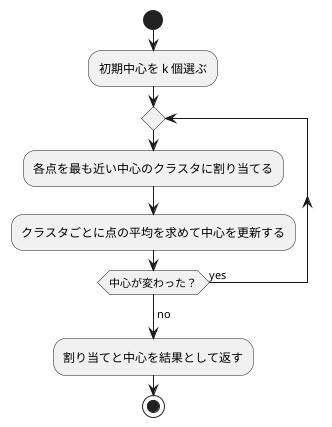

# 第 14 章: K-means によるクラスタリング

## 14.1 はじめに

これまでの章では、正解ラベル（派閥・品種・生存・価格など）が付いたデータから予測のルールを学ばせてきました。このような学習を **教師あり学習** と呼びます。

この章では、正解ラベルの無いデータから、似たもの同士のグループ（クラスタ）を見つける **クラスタリング** を扱います。正解を教えずにデータの構造を見つけるので、**教師なし学習** の一種です。代表的なアルゴリズムである **K-means** を TDD で自作し、Tribuo の `KMeansTrainer` と結果を比べます。

題材は、卸売業者の顧客ごとの商品カテゴリ別の支出額です。「どんな買い方をする顧客のグループがあるか」を、データだけから探します。

[Python 版の第 14 章](../python/14-k-means-clustering.md) と同じ TODO リストで進めます。Python 版は NumPy のブロードキャストで点と中心を配列のまま計算しましたが、Kotlin 版では点を `List<Double>` で表し、コレクションの関数を組み合わせて書きます。「中心が動かなくなるまで繰り返す」処理は、`generateSequence` による遅延評価の列で表します。

## 14.2 K-means の仕組み

K-means は、クラスタ数 k を人間が決め、次の 2 つの手順を交互に繰り返してクラスタを作ります。

1. **割り当て**: 各点を、最も近いクラスタの中心に割り当てる
2. **更新**: クラスタごとに、割り当てられた点の平均を新しい中心にする

中心が動かなくなったら（割り当てが変わらなくなったら）終わりです。



クラスタのまとまりの良さは **SSE**（Sum of Squared Errors、誤差平方和）で測ります。各点と、その点が属するクラスタの中心との距離の 2 乗を合計した値で、小さいほど各クラスタの点が中心の近くにまとまっています。

K-means には、最初に選ぶ中心（初期中心）によって結果が変わるという性質があります。この章では、この性質もテストで確かめながら実装します。そのため、初期中心を **引数で受け取る** 設計にします。乱数で選ぶ処理と分けておけば、テストでは決まった初期中心を渡して結果を固定できます。

## 14.3 題材とデータ

この章で使うのは `Wholesale.csv` です。データの入手と配置は [第 1 章](01-machine-learning-and-first-test.md) の「題材とデータ」を参照してください。440 件の顧客について、次の 8 列が記録されています。欠損値はありません。

| 列 | 意味 | Kotlin DataFrame での型 |
|----|------|-----------------------|
| Channel | 販売チャネルの区分 | `Int` |
| Region | 地域の区分 | `Int` |
| Fresh | 生鮮食品の支出額 | `Int` |
| Milk | 乳製品の支出額 | `Int` |
| Grocery | 食料雑貨の支出額 | `Int` |
| Frozen | 冷凍食品の支出額 | `Int` |
| Detergents_Paper | 洗剤・紙製品の支出額 | `Int` |
| Delicassen | 惣菜の支出額 | `Int` |

Channel と Region は区分を表す番号で、大小に意味がありません。この章では支出額の 6 列だけを使って、買い方の似た顧客をまとめます。

支出額の列は、列によって桁が大きく違います。距離で近さを測る K-means では、このままだと値の大きい列が距離をほぼ決めてしまいます。そこで、クラスタリングの前に列ごとに **標準化** します。

## 14.4 TODO リストの作成

**TODO リスト**:

- [ ] 支出額の列を読み込む
- [ ] 列ごとに標準化する
- [ ] 各点を最も近い中心のクラスタに割り当てる
- [ ] 割り当てた点の平均で中心を更新する
  - [ ] 点が 1 つも無いクラスタの中心はそのままにする
- [ ] SSE を計算する
- [ ] 中心が変わらなくなるまで割り当てと更新を繰り返す
- [ ] 初期中心をシードで選ぶ
- [ ] クラスタ数ごとの SSE を求める（エルボー法）
- [ ] 初期中心を変えて繰り返し、SSE が最小の結果を選ぶ
- [ ] Tribuo の `KMeansTrainer` と比べる
- [ ] クラスタごとの特徴をまとめる
- [ ] 実データでクラスタリングして結果を表示する

## 14.5 支出額の列を読み込む

テストでは、架空の値を 1 行だけ書いた CSV を作ります。

```kotlin
// src/test/kotlin/chapter14/KMeansTest.kt
package chapter14

import java.io.File
import java.nio.file.Path
import kotlin.io.path.createTempDirectory
import kotlin.test.Test
import kotlin.test.assertEquals

private const val HEADER = "Channel,Region,Fresh,Milk,Grocery,Frozen,Detergents_Paper,Delicassen\n"

class LoadSpendingTest {
    private val directory: Path = createTempDirectory()

    private fun writeCsv(rows: String): File = File(directory.toFile(), "wholesale.csv").apply { writeText(HEADER + rows) }

    @Test
    fun `ChannelとRegionを除いた支出額の列を読み込む`() {
        val df = loadSpending(writeCsv("1,2,100,200,300,400,500,600\n"))

        assertEquals(listOf("Fresh", "Milk", "Grocery", "Frozen", "Detergents_Paper", "Delicassen"), df.columnNames())
        assertEquals(listOf(100, 200, 300, 400, 500, 600), df.columnNames().map { df[it][0] })
    }
}
```

```text
e: .../src/test/kotlin/chapter14/KMeansTest.kt:18:18 Unresolved reference 'loadSpending'.
e: .../src/test/kotlin/chapter14/KMeansTest.kt:21:86 Unresolved reference 'it'.
e: .../src/test/kotlin/chapter14/KMeansTest.kt:21:89 No 'get' operator method providing array access.
```

`loadSpending` の型が分からないので、`df[it][0]` の添字アクセスまで連鎖してエラーになっています。

```kotlin
// src/main/kotlin/chapter14/KMeans.kt
fun loadSpending(csvFile: File): AnyFrame = DataFrame.readCSV(csvFile).remove("Channel", "Region")
```

`remove` は列名を可変長引数で受け取り、指定した列を除いた **新しい** データフレームを返します。支出額の列は整数だけなので、Kotlin DataFrame は `Int` として読み込みます。テストの期待値も `100`（`Int`）で書いています。

```text
LoadSpendingTest > ChannelとRegionを除いた支出額の列を読み込む() PASSED
```

## 14.6 列ごとに標準化する

標準化は、各列から平均を引き、標準偏差で割る変換です。変換後の各列は平均 0、標準偏差 1 になり、列の桁の違いが距離に影響しなくなります。

標準化は、[第 9 章](09-feature-engineering.md) で `Standardizer` として作ってあります。第 9 章で確かめたとおり、標準偏差は件数で割る `ddof = 0` で求めます。この章ではそれを再利用し、K-means で扱いやすい「点のリスト」に変換する関数を作ります。

```kotlin
class StandardizeTest {
    @Test
    fun `列ごとに平均0標準偏差1の点のリストに変換する`() {
        val df = dataFrameOf("Fresh" to listOf(10.0, 20.0, 30.0), "Milk" to listOf(5.0, 5.0, 8.0))

        val points = standardize(df)

        for (column in 0..1) {
            val values = points.map { it[column] }
            val mean = values.average()
            assertEquals(0.0, mean, absoluteTolerance = 1e-12)
            assertEquals(1.0, sqrt(values.sumOf { (it - mean) * (it - mean) } / values.size), absoluteTolerance = 1e-12)
        }
    }
}
```

テストでは、標準化した値の平均と標準偏差を、`Standardizer` を使わずに素朴な式で求め直して確かめています。

```text
e: .../src/test/kotlin/chapter14/KMeansTest.kt:32:22 Unresolved reference 'standardize'.
e: .../src/test/kotlin/chapter14/KMeansTest.kt:35:39 Unresolved reference 'it'.
e: .../src/test/kotlin/chapter14/KMeansTest.kt:35:39 Cannot infer type for type parameter 'V'. Specify it explicitly.
e: .../src/test/kotlin/chapter14/KMeansTest.kt:38:52 Unresolved reference 'it'.
e: .../src/test/kotlin/chapter14/KMeansTest.kt:38:66 Unresolved reference 'it'.
e: .../src/test/kotlin/chapter14/KMeansTest.kt:38:88 Unresolved reference 'size'.
```

```kotlin
typealias Point = List<Double>

fun standardize(df: AnyFrame): List<Point> {
    val standardized = Standardizer.fit(df).transform(df)
    return standardized.rows().map { row -> df.columnNames().map { (row[it] as Number).toDouble() } }
}
```

- `typealias Point = List<Double>` は、`List<Double>` に `Point` という別名を付けます。新しい型を作るわけではないので、`listOf(0.0, 1.0)` をそのまま `Point` として渡せます。関数の引数に `List<Point>` と書けば「点のリスト」だと読めます
- 1 行を 1 つの点、1 列を 1 つの特徴量とする形は、Python 版の NumPy の 2 次元配列（行が点、列が特徴量）と同じです

```text
StandardizeTest > 列ごとに平均0標準偏差1の点のリストに変換する() PASSED
```

## 14.7 各点を最も近い中心に割り当てる

ここからは K-means の本体です。まず 1 次元の例でテストを書きます。0 と 1 は中心 0 に近く、9 と 10 は中心 10 に近いので、クラスタ番号は `[0, 0, 1, 1]` です。

```kotlin
class AssignClustersTest {
    @Test
    fun `各点を最も近い中心のクラスタに割り当てる`() {
        val points = listOf(listOf(0.0), listOf(1.0), listOf(9.0), listOf(10.0))
        val centers = listOf(listOf(0.0), listOf(10.0))

        assertEquals(listOf(0, 0, 1, 1), assignClusters(points, centers))
    }
}
```

```text
e: .../src/test/kotlin/chapter14/KMeansTest.kt:49:42 Unresolved reference 'assignClusters'.
```

仮実装で Green にします。

```kotlin
fun assignClusters(
    points: List<Point>,
    centers: List<Point>,
): List<Int> = listOf(0, 0, 1, 1)
```

三角測量として、2 次元で、中心の並び順も変えた例を追加します。

```kotlin
    @Test
    fun `2次元の点をユークリッド距離で最も近い中心に割り当てる`() {
        val points = listOf(listOf(0.0, 0.0), listOf(5.0, 4.0), listOf(1.0, 0.0))
        val centers = listOf(listOf(5.0, 5.0), listOf(0.0, 0.0))

        assertEquals(listOf(1, 0, 1), assignClusters(points, centers))
    }
```

```text
AssignClustersTest > 各点を最も近い中心のクラスタに割り当てる() PASSED
AssignClustersTest > 2次元の点をユークリッド距離で最も近い中心に割り当てる() FAILED
    org.opentest4j.AssertionFailedError: expected: <[1, 0, 1]> but was: <[0, 0, 1, 1]>
4 tests completed, 1 failed
```

点と中心の距離の 2 乗を求める関数を用意し、各点について距離が最小になる中心の番号を選びます。

```kotlin
fun squaredDistance(
    a: Point,
    b: Point,
): Double = a.zip(b).sumOf { (x, y) -> (x - y) * (x - y) }

fun assignClusters(
    points: List<Point>,
    centers: List<Point>,
): List<Int> = points.map { point -> centers.indices.minBy { squaredDistance(point, centers[it]) } }
```

- `a.zip(b)` で 2 つの点の座標を組にし、差の 2 乗を `sumOf` で合計します
- `centers.indices` は中心の番号の範囲（`0 until centers.size`）です。`minBy` は、渡した関数の値が最小になる **要素そのもの**（ここでは番号）を返します。距離が同じ中心が複数あれば、先に現れた番号を返します。Python 版の `argmin` と同じ振る舞いです
- 最も近い中心を選ぶだけなら、平方根を取る必要はありません。距離の大小関係は 2 乗しても変わらないからです

Python 版はブロードキャストで「全点 × 全中心」の距離の表を一度に作りましたが、Kotlin 版は点ごとに中心を調べる素直な二重の繰り返しを、`map` と `minBy` で書いています。

## 14.8 中心を更新する

割り当てた点の平均を、新しい中心にします。

```kotlin
class UpdateCentersTest {
    @Test
    fun `クラスタごとに割り当てられた点の平均を新しい中心にする`() {
        val points = listOf(listOf(0.0, 0.0), listOf(2.0, 0.0), listOf(10.0, 10.0), listOf(10.0, 12.0))
        val previous = listOf(listOf(0.0, 0.0), listOf(0.0, 0.0))

        assertEquals(listOf(listOf(1.0, 0.0), listOf(10.0, 11.0)), updateCenters(points, listOf(0, 0, 1, 1), previous))
    }

    @Test
    fun `点が1つも割り当てられなかったクラスタは中心を変えない`() {
        val points = listOf(listOf(0.0, 0.0), listOf(2.0, 4.0))
        val previous = listOf(listOf(0.0, 0.0), listOf(99.0, 99.0))

        assertEquals(listOf(listOf(1.0, 2.0), listOf(99.0, 99.0)), updateCenters(points, listOf(0, 0), previous))
    }
}
```

2 つ目のテストは、どの点も割り当てられなかったクラスタの扱いです。初期中心の選び方によっては、実際に起こります。`updateCenters` に前回の中心を渡しているのは、このときに中心をそのまま残すためです。

```text
e: .../src/test/kotlin/chapter14/KMeansTest.kt:67:68 Unresolved reference 'updateCenters'.
e: .../src/test/kotlin/chapter14/KMeansTest.kt:75:68 Unresolved reference 'updateCenters'.
```

まず、クラスタごとに平均を取るだけの実装を書いてみます。

```kotlin
fun updateCenters(
    points: List<Point>,
    labels: List<Int>,
    previousCenters: List<Point>,
): List<Point> =
    previousCenters.indices.map { k ->
        val members = points.filterIndexed { i, _ -> labels[i] == k }
        members.first().indices.map { j -> members.map { it[j] }.average() }
    }
```

`filterIndexed` は、要素と番号の両方を見て絞り込みます。クラスタ番号が `k` の点だけを取り出し、列ごとに `average` で平均を求めます。

```text
UpdateCentersTest > 点が1つも割り当てられなかったクラスタは中心を変えない() FAILED
    java.util.NoSuchElementException: List is empty.
UpdateCentersTest > クラスタごとに割り当てられた点の平均を新しい中心にする() PASSED
6 tests completed, 1 failed
BUILD FAILED in 7s
```

1 つ目のテストは通りましたが、空のクラスタで `members.first()` が例外を投げました。Python 版では、NumPy が空の配列の平均を警告付きの `nan` にして、そのまま処理が続きました。Kotlin では空のリストの `first()` が例外になるので、問題がその場で表に出ます。点があるクラスタだけ中心を更新するように直します。

```kotlin
fun updateCenters(
    points: List<Point>,
    labels: List<Int>,
    previousCenters: List<Point>,
): List<Point> =
    previousCenters.mapIndexed { k, previous ->
        val members = points.filterIndexed { i, _ -> labels[i] == k }
        if (members.isEmpty()) previous else previous.indices.map { j -> members.map { it[j] }.average() }
    }
```

`mapIndexed` で番号と前回の中心を一緒に受け取り、点が無ければ前回の中心をそのまま返します。Kotlin の `List` は読み取り専用なので、Python 版のように `copy()` してから書き換える必要はありません。いつも新しいリストを作って返します。

```text
UpdateCentersTest > 点が1つも割り当てられなかったクラスタは中心を変えない() PASSED
UpdateCentersTest > クラスタごとに割り当てられた点の平均を新しい中心にする() PASSED
```

## 14.9 SSE を計算する

```kotlin
class SumOfSquaredErrorsTest {
    @Test
    fun `各点と所属するクラスタの中心との距離の2乗を合計する`() {
        val points = listOf(listOf(0.0, 0.0), listOf(2.0, 0.0), listOf(10.0, 10.0), listOf(10.0, 12.0))
        val centers = listOf(listOf(1.0, 0.0), listOf(10.0, 11.0))

        assertEquals(4.0, sumOfSquaredErrors(points, listOf(0, 0, 1, 1), centers))
    }
}
```

4 点とも中心からの距離が 1 なので、SSE は 1 × 4 = 4 です。

```text
e: .../src/test/kotlin/chapter14/KMeansTest.kt:85:27 Unresolved reference 'sumOfSquaredErrors'.
```

仮実装です。

```kotlin
fun sumOfSquaredErrors(
    points: List<Point>,
    labels: List<Int>,
    centers: List<Point>,
): Double = 4.0
```

三角測量として、中心から遠い点を含む例を追加します。距離の 2 乗は 1 と 9 なので、SSE は 10 です。

```kotlin
    @Test
    fun `中心から離れた点ほど誤差が大きくなる`() {
        assertEquals(10.0, sumOfSquaredErrors(listOf(listOf(0.0), listOf(4.0)), listOf(0, 0), listOf(listOf(1.0))))
    }
```

```text
SumOfSquaredErrorsTest > 各点と所属するクラスタの中心との距離の2乗を合計する() PASSED
SumOfSquaredErrorsTest > 中心から離れた点ほど誤差が大きくなる() FAILED
    org.opentest4j.AssertionFailedError: expected: <10.0> but was: <4.0>
8 tests completed, 1 failed
```

14.7 節の `squaredDistance` を再利用します。

```kotlin
fun sumOfSquaredErrors(
    points: List<Point>,
    labels: List<Int>,
    centers: List<Point>,
): Double = points.indices.sumOf { squaredDistance(points[it], centers[labels[it]]) }
```

`centers[labels[it]]` は、`it` 番目の点が属するクラスタの中心です。

## 14.10 中心が変わらなくなるまで繰り返す

### generateSequence で繰り返しを表す

割り当てと更新を組み合わせて、K-means の全体を作ります。結果はクラスタ番号・中心・SSE をまとめた `KMeansResult` で返します。

2 つのグループがはっきり分かれた 4 点を用意し、あえて同じグループの 2 点を初期中心にします。

```kotlin
private fun twoGroups(): List<Point> = listOf(listOf(0.0, 0.0), listOf(0.0, 1.0), listOf(10.0, 10.0), listOf(10.0, 11.0))

class KMeansTest {
    @Test
    fun `割り当てが変わらなくなるまで割り当てと中心の更新を繰り返す`() {
        val result = kmeans(twoGroups(), initialCenters = listOf(listOf(0.0, 0.0), listOf(0.0, 1.0)))

        assertEquals(KMeansResult(labels = listOf(0, 0, 1, 1), centers = listOf(listOf(0.0, 0.5), listOf(10.0, 10.5)), sse = 1.0), result)
    }
}
```

1 回目の割り当ては `[0, 1, 1, 1]` になりますが、中心を更新して割り当て直すと `[0, 0, 1, 1]` に落ち着きます。結果を data class にしたので、クラスタ番号・中心・SSE を 1 回の `assertEquals` でまとめて比べられます。

```text
e: .../src/test/kotlin/chapter14/KMeansTest.kt:99:22 Unresolved reference 'kmeans'.
e: .../src/test/kotlin/chapter14/KMeansTest.kt:101:9 Cannot infer type for type parameter 'T'. Specify it explicitly.
e: .../src/test/kotlin/chapter14/KMeansTest.kt:101:22 Unresolved reference 'KMeansResult'.
```

```kotlin
data class KMeansResult(
    val labels: List<Int>,
    val centers: List<Point>,
    val sse: Double,
)

fun kmeans(
    points: List<Point>,
    initialCenters: List<Point>,
): KMeansResult {
    val centers =
        generateSequence(initialCenters) { centers -> updateCenters(points, assignClusters(points, centers), centers) }
            .zipWithNext()
            .first { (before, after) -> before == after }
            .first
    val labels = assignClusters(points, centers)
    return KMeansResult(labels = labels, centers = centers, sse = sumOfSquaredErrors(points, labels, centers))
}
```

- `generateSequence(初期値) { 前の値 -> 次の値 }` は、初期中心、1 回更新した中心、2 回更新した中心…と続く **無限の列** を作ります。`Sequence` は遅延評価なので、要素は必要になったときに 1 つずつ計算されます
- `zipWithNext()` は、隣り合う要素を「更新前・更新後」の組にした列にします
- `first { (before, after) -> before == after }` は、更新前後の中心が一致した最初の組で列の計算を止めます。中心が変わらなければ、次の割り当ても変わりません
- `List<Double>` どうしの `==` は要素ごとの比較です。同じ点の集合から同じ順で平均を計算すれば同じ浮動小数点数になるので、ここでは許容誤差を設けずに比べられます

Python 版の `while True` と `break` を、「中心の列」と「止める条件」に分けて書いた形です。

```text
KMeansTest > 割り当てが変わらなくなるまで割り当てと中心の更新を繰り返す() PASSED
```

### 最大反復回数

無限の列の `first` は、万一収束しなかったときに止まりません。最大反復回数を指定できるようにします。反復を 1 回で打ち切った場合、中心は 1 回だけ更新された位置になり、クラスタ番号はその中心に合わせて割り当て直したものになるはずです。浮動小数点数の中心を比べるので、許容誤差付きで比べる関数を用意します。

```kotlin
private fun assertPointsEquals(
    expected: List<Point>,
    actual: List<Point>,
) {
    assertEquals(expected.size, actual.size)
    expected.zip(actual).forEach { (e, a) -> e.zip(a).forEach { (x, y) -> assertEquals(x, y, absoluteTolerance = 1e-9) } }
}
```

```kotlin
    @Test
    fun `最大反復回数に達したら収束していなくても打ち切る`() {
        val result = kmeans(twoGroups(), initialCenters = listOf(listOf(0.0, 0.0), listOf(0.0, 1.0)), maxIterations = 1)

        assertPointsEquals(listOf(listOf(0.0, 0.0), listOf(20.0 / 3, 22.0 / 3)), result.centers)
        assertEquals(listOf(0, 0, 1, 1), result.labels)
    }
```

```text
e: .../src/test/kotlin/chapter14/KMeansTest.kt:114:103 No parameter with name 'maxIterations' found.
```

```kotlin
fun kmeans(
    points: List<Point>,
    initialCenters: List<Point>,
    maxIterations: Int = 300,
): KMeansResult {
    val centers =
        generateSequence(initialCenters) { centers -> updateCenters(points, assignClusters(points, centers), centers) }
            .zipWithNext()
            .withIndex()
            .first { (iteration, step) -> step.first == step.second || iteration + 1 == maxIterations }
            .value
            .second
    val labels = assignClusters(points, centers)
    return KMeansResult(labels = labels, centers = centers, sse = sumOfSquaredErrors(points, labels, centers))
}
```

- `withIndex()` で、何回目の更新か（0 から数える `iteration`）を組に付けます
- 「中心が変わらなかった」か「最大反復回数に達した」最初の更新で止め、更新後の中心（`step.second`）を使います。収束したときは更新前と更新後が同じなので、どちらを使っても変わりません
- ループを抜けたあとで、最終的な中心に対してもう一度割り当てます。打ち切ったときでも、返すクラスタ番号と中心が食い違わないようにするためです

`maxIterations` の既定値を 300 にしたので、最初のテストはそのまま通ります。

```text
KMeansTest > 割り当てが変わらなくなるまで割り当てと中心の更新を繰り返す() PASSED
KMeansTest > 最大反復回数に達したら収束していなくても打ち切る() PASSED
```

## 14.11 初期中心をシードで選ぶ

初期中心は、データの中から重複なく k 点を選ぶことにします。第 2 章の訓練データとテストデータの分割と同じく、シードで乱数を固定して再現できるようにします。

```kotlin
private fun numberedPoints(size: Int): List<Point> = (0 until size).map { listOf(it.toDouble(), it * 2.0) }

class ChooseInitialCentersTest {
    @Test
    fun `データの中から重複なくクラスタ数だけ点を選ぶ`() {
        val points = numberedPoints(10)

        val centers = chooseInitialCenters(points, nClusters = 3, seed = 0)

        assertEquals(3, centers.toSet().size)
        assertTrue(points.containsAll(centers))
    }
}
```

```text
e: .../src/test/kotlin/chapter14/KMeansTest.kt:130:23 Unresolved reference 'chooseInitialCenters'.
e: .../src/test/kotlin/chapter14/KMeansTest.kt:132:41 Unresolved reference 'size'.
```

仮実装として、先頭の k 点を返します。

```kotlin
fun chooseInitialCenters(
    points: List<Point>,
    nClusters: Int,
    seed: Int,
): List<Point> = points.take(nClusters)
```

シードについてのテストを 2 つ追加します。

```kotlin
    @Test
    fun `同じシードなら同じ点を選ぶ`() {
        val points = numberedPoints(10)

        assertEquals(chooseInitialCenters(points, nClusters = 3, seed = 42), chooseInitialCenters(points, nClusters = 3, seed = 42))
    }

    @Test
    fun `シードが違えば違う点を選ぶ`() {
        val points = numberedPoints(10)

        assertNotEquals(chooseInitialCenters(points, nClusters = 3, seed = 0), chooseInitialCenters(points, nClusters = 3, seed = 1))
    }
```

```text
ChooseInitialCentersTest > シードが違えば違う点を選ぶ() FAILED
    org.opentest4j.AssertionFailedError: expected: not equal but was: <[[0.0, 0.0], [1.0, 2.0], [2.0, 4.0]]>
ChooseInitialCentersTest > データの中から重複なくクラスタ数だけ点を選ぶ() PASSED
ChooseInitialCentersTest > 同じシードなら同じ点を選ぶ() PASSED
13 tests completed, 1 failed
```

先頭から選ぶ仮実装は、シードを変えても同じ点を返してしまいます。第 2 章の分割と同じ書き方で、番号をシード付きの乱数で並べ替えて先頭の k 個を選びます。

```kotlin
): List<Point> = points.indices.shuffled(Random(seed)).take(nClusters).map { points[it] }
```

```text
ChooseInitialCentersTest > シードが違えば違う点を選ぶ() PASSED
ChooseInitialCentersTest > データの中から重複なくクラスタ数だけ点を選ぶ() PASSED
ChooseInitialCentersTest > 同じシードなら同じ点を選ぶ() PASSED
```

## 14.12 エルボー法でクラスタ数を選ぶ

K-means では、クラスタ数 k を人間が決める必要があります。k を増やすほど各点は近い中心を持てるので、SSE は小さくなります。k を点の数と同じにすれば SSE は 0 ですが、それではグループ分けになりません。

**エルボー法** は、k を 1 から順に増やして SSE をグラフにし、減り方が急に緩やかになる k（肘のように曲がる点）を選ぶ方法です。

クラスタ数ごとの SSE を求める関数を作ります。前節までの 2 グループの例では、k = 1 のときの中心は全 4 点の平均 (5, 5.5) で SSE は 201、k = 2 のときは 1 です。

```kotlin
class SseByClusterCountTest {
    @Test
    fun `クラスタ数ごとにクラスタリングしたときのSSEを求める`() {
        assertEquals(mapOf(1 to 201.0, 2 to 1.0), sseByClusterCount(twoGroups(), clusterCounts = listOf(1, 2), seed = 0))
    }
}
```

```text
e: .../src/test/kotlin/chapter14/KMeansTest.kt:154:51 Unresolved reference 'sseByClusterCount'.
```

```kotlin
fun sseByClusterCount(
    points: List<Point>,
    clusterCounts: List<Int>,
    seed: Int,
): Map<Int, Double> = clusterCounts.associateWith { n -> kmeans(points, chooseInitialCenters(points, n, seed)).sse }
```

`associateWith` は、リストの各要素をキーにし、関数の値を値にした `Map` を作ります。Kotlin の `mapOf` や `associateWith` で作った `Map` は、キーを追加した順を保つので、クラスタ数の順に SSE を取り出せます。

```text
SseByClusterCountTest > クラスタ数ごとにクラスタリングしたときのSSEを求める() PASSED
```

## 14.13 局所解と複数回の試行

### 実データで起きたこと

ここまでの関数で、標準化した実データのエルボー法を試してみました。初期中心 1 通りで k = 1 から 10 までの SSE を求め、シードを 0 から 9 まで変えて比べた結果の一部です（小数第 2 位まで）。

| k | シード 0 | シード 1 | シード 9 |
|---|---------|---------|---------|
| 3 | 1614.22 | 1610.17 | 1621.31 |
| 4 | 1528.42 | 1352.73 | 1359.13 |
| 5 | 1243.37 | 1252.68 | 1231.17 |
| 6 | 1163.22 | 990.36 | 1005.58 |
| 7 | 952.21 | 932.01 | 1126.38 |

シード 0 では k = 4 の SSE が 1528.42 で、シード 1 の 1352.73 より大きくなりました。シード 9 では、k = 6 の 1005.58 から k = 7 の 1126.38 へ、k を増やしたのに SSE が増えています。初期中心 1 通りでは、選んだシードによって曲線の形が変わり、エルボー法のグラフの曲がり方を正しく読めません。

K-means は「今より SSE が下がる方向」にしか中心を動かさないので、初期中心によっては、最もよい分け方にたどり着く前に止まることがあります。これを **局所解** と呼びます。

### 局所解をテストで再現する

1 次元に 3 組の点を並べた例で確かめます。3 つのクラスタに分けるなら、0 と 1、10 と 11、20 と 21 に分けるのが最適で、SSE は 0.5 × 3 = 1.5 です。ところが、左の組から 2 点・中央の組から 1 点を初期中心にすると、0 と 1 が別々のクラスタのまま、残りの 4 点が 1 つのクラスタにまとめられて止まります。

あわせて、初期中心の候補を受け取って SSE が最小の結果を返す関数のテストも書きます。

```kotlin
private fun threePairs(): List<Point> = listOf(0.0, 1.0, 10.0, 11.0, 20.0, 21.0).map { listOf(it) }

class BestKMeansTest {
    @Test
    fun `初期中心によっては局所解に陥る`() {
        val stuck = kmeans(threePairs(), initialCenters = listOf(listOf(0.0), listOf(1.0), listOf(10.0)))

        assertEquals(101.0, stuck.sse)
    }

    @Test
    fun `複数の初期中心の候補のうちSSEが最小の結果を返す`() {
        val candidates =
            listOf(
                listOf(listOf(0.0), listOf(1.0), listOf(10.0)),
                listOf(listOf(0.0), listOf(10.0), listOf(20.0)),
            )

        val result = bestKMeans(threePairs(), candidates)

        assertEquals(1.5, result.sse)
        assertEquals(listOf(listOf(0.5), listOf(10.5), listOf(20.5)), result.centers)
    }
}
```

```text
e: .../src/test/kotlin/chapter14/KMeansTest.kt:176:22 Unresolved reference 'bestKMeans'.
```

```kotlin
fun bestKMeans(
    points: List<Point>,
    initialCenterCandidates: List<List<Point>>,
): KMeansResult = initialCenterCandidates.map { kmeans(points, it) }.minBy { it.sse }
```

`minBy { it.sse }` は、SSE が最小の `KMeansResult` を返します。1 つ目のテストは、すでにある `kmeans` の性質を確かめるテストで、実装を足さずに通りました。SSE は最適な分け方の 1.5 に対して 101 です。

### エルボー法でも複数回試す

エルボー法でも、初期中心を何通りか試した最小の SSE で比べるようにします。局所解がある 3 組の点で、試行回数 `nInit` を指定するテストを書きます。

```kotlin
    @Test
    fun `初期中心を変えて繰り返し最小のSSEを使う`() {
        assertEquals(mapOf(3 to 1.5), sseByClusterCount(threePairs(), clusterCounts = listOf(3), seed = 0, nInit = 10))
    }
```

```text
e: .../src/test/kotlin/chapter14/KMeansTest.kt:159:108 No parameter with name 'nInit' found.
```

シードを 1 ずつずらして初期中心の候補を `nInit` 通り作り、`bestKMeans` に渡す関数を追加します。

```kotlin
fun kmeansWithRestarts(
    points: List<Point>,
    nClusters: Int,
    seed: Int,
    nInit: Int = 10,
): KMeansResult = bestKMeans(points, (0 until nInit).map { chooseInitialCenters(points, nClusters, seed + it) })

fun sseByClusterCount(
    points: List<Point>,
    clusterCounts: List<Int>,
    seed: Int,
    nInit: Int = 10,
): Map<Int, Double> = clusterCounts.associateWith { n -> kmeansWithRestarts(points, n, seed, nInit).sse }
```

`nInit` の既定値を 10 にしたので、最初のエルボー法のテストはそのまま通ります。

```text
BestKMeansTest > 初期中心によっては局所解に陥る() PASSED
BestKMeansTest > 複数の初期中心の候補のうちSSEが最小の結果を返す() PASSED
SseByClusterCountTest > 初期中心を変えて繰り返し最小のSSEを使う() PASSED
SseByClusterCountTest > クラスタ数ごとにクラスタリングしたときのSSEを求める() PASSED
```

## 14.14 Tribuo の KMeansTrainer と比べる

### 初期中心を渡せない

Python 版では、scikit-learn の `KMeans` に同じ初期中心を配列で渡し、クラスタ番号・中心・SSE がすべて一致することを確かめました。Tribuo の `KMeansTrainer` で同じことができるかを、コンストラクターの一覧から確かめます。

```text
public org.tribuo.clustering.kmeans.KMeansTrainer(int, int, org.tribuo.clustering.kmeans.KMeansTrainer$Distance, int, long);
public org.tribuo.clustering.kmeans.KMeansTrainer(int, int, org.tribuo.math.distance.Distance, int, long);
public org.tribuo.clustering.kmeans.KMeansTrainer(int, int, org.tribuo.clustering.kmeans.KMeansTrainer$Distance, org.tribuo.clustering.kmeans.KMeansTrainer$Initialisation, int, long);
public org.tribuo.clustering.kmeans.KMeansTrainer(int, int, org.tribuo.math.distance.Distance, org.tribuo.clustering.kmeans.KMeansTrainer$Initialisation, int, long);
```

これは JDK の `javap` で表示したクラスの情報から、コンストラクターの行だけを抜き出したものです。引数はクラスタ数・最大反復回数・距離・初期化の方法・スレッド数・シードで、初期中心そのものを受け取る引数はありません。初期化の方法（`Initialisation`）は、ランダムに選ぶ `RANDOM` と、互いに離れた点を選びやすくする **k-means++** の `PLUSPLUS` の 2 つです。

この事実を、学習用テストとして残します。

```kotlin
// src/test/kotlin/chapter14/TribuoKMeansTest.kt
class TribuoKMeansTest {
    @Test
    fun `KMeansTrainerの初期化方法はRANDOMとPLUSPLUSだけで初期中心を渡すコンストラクタは無い`() {
        assertEquals(listOf("RANDOM", "PLUSPLUS"), KMeansTrainer.Initialisation.entries.map { it.name })
        assertTrue(
            KMeansTrainer::class.java.constructors.none { constructor ->
                constructor.parameterTypes.any { it.isArray || Collection::class.java.isAssignableFrom(it) }
            },
        )
    }
}
```

- `KMeansTrainer.Initialisation.entries` は、Java の列挙型のすべての値です
- `KMeansTrainer::class.java.constructors` で、リフレクションを使ってコンストラクターの一覧を取り出し、「配列かコレクションを受け取る引数が 1 つも無い」ことを確かめています

同じ初期中心を渡せないので、クラスタ番号や中心の一致は確かめられません。そこで、ADR 002 で決めたとおり、同じクラスタ数での **SSE の大きさ** を比べます。

### Tribuo のデータセットに変換する

Tribuo のクラスタリングでは、事例の出力の型が `ClusterID` です。学習するときはクラスタが決まっていないので、未割り当てを表す `ClusteringFactory.UNASSIGNED_CLUSTER_ID` を渡します。まず、はっきり分かれた 2 グループなら SSE が自作と同じ 1.0 になることをテストに書きます。

```kotlin
    @Test
    fun `はっきり分かれた2グループならTribuoのSSEも自作と同じになる`() {
        val points = listOf(listOf(0.0, 0.0), listOf(0.0, 1.0), listOf(10.0, 10.0), listOf(10.0, 11.0))

        val sse = tribuoKMeansSse(points, nClusters = 2, seed = 0L)

        assertEquals(1.0, sse, absoluteTolerance = 1e-9)
    }
```

```text
e: .../src/test/kotlin/chapter14/TribuoKMeansTest.kt:23:19 Unresolved reference 'tribuoKMeansSse'.
```

```kotlin
// src/main/kotlin/chapter14/TribuoKMeans.kt
private const val MAX_ITERATIONS = 300
private val clusteringFactory = ClusteringFactory()

// Tribuo は特徴量を名前の順に並べるので、列の順と名前の順が一致する名前にする
private fun featureNames(dimensions: Int): Array<String> = Array(dimensions) { "x" + it.toString().padStart(2, '0') }

fun toTribuoDataset(points: List<Point>): MutableDataset<ClusterID> {
    val dataset = MutableDataset(SimpleDataSourceProvenance("points", clusteringFactory), clusteringFactory)
    val names = featureNames(points.first().size)
    points.forEach { dataset.add(ArrayExample(ClusteringFactory.UNASSIGNED_CLUSTER_ID, names, it.toDoubleArray())) }
    return dataset
}

fun trainTribuoKMeans(
    points: List<Point>,
    nClusters: Int,
    seed: Long,
    initialisation: KMeansTrainer.Initialisation = KMeansTrainer.Initialisation.PLUSPLUS,
): KMeansModel {
    val trainer = KMeansTrainer(nClusters, MAX_ITERATIONS, L2Distance(), initialisation, 1, seed)
    return trainer.train(toTribuoDataset(points))
}

fun tribuoCenters(model: KMeansModel): List<Point> = model.centroidVectors.map { vector -> List(vector.size()) { vector.get(it) } }

fun tribuoKMeansSse(
    points: List<Point>,
    nClusters: Int,
    seed: Long,
    initialisation: KMeansTrainer.Initialisation = KMeansTrainer.Initialisation.PLUSPLUS,
): Double {
    val centers = tribuoCenters(trainTribuoKMeans(points, nClusters, seed, initialisation))
    return sumOfSquaredErrors(points, assignClusters(points, centers), centers)
}
```

- 距離はユークリッド距離（`L2Distance`）、スレッド数は 1（並列に計算しない）にしています
- 学習したモデルの `centroidVectors`（Java の `getCentroidVectors()`）から中心を取り出し、自作の `assignClusters` と `sumOfSquaredErrors` で SSE を計算します。SSE の定義を自作と共通にしておけば、比べているのが「中心の見つけ方」だけになります
- 特徴量の名前を `x00`・`x01`…にしているのは、第 3 章で確かめたとおり、Tribuo が特徴量を名前の順に並べるからです。名前の順が列の順と違うと、中心の座標の並びが点と食い違います。テストの 2 グループの点は x 座標と y 座標の並びが対称でないので、並びが食い違えば SSE は 1.0 になりません

```text
TribuoKMeansTest > KMeansTrainerの初期化方法はRANDOMとPLUSPLUSだけで初期中心を渡すコンストラクタは無い() PASSED
TribuoKMeansTest > はっきり分かれた2グループならTribuoのSSEも自作と同じになる() PASSED
```

### Tribuo でも複数回試す

自作と条件をそろえるため、Tribuo でもシードを変えて `nInit` 回学習し、最小の SSE を使えるようにします。

```kotlin
    @Test
    fun `Tribuoでもシードを変えて繰り返し最小のSSEを使える`() {
        val points = listOf(0.0, 1.0, 10.0, 11.0, 20.0, 21.0).map { listOf(it) }

        assertEquals(1.5, tribuoBestSse(points, nClusters = 3, seed = 0L, nInit = 10), absoluteTolerance = 1e-9)
    }
```

```text
e: .../src/test/kotlin/chapter14/TribuoKMeansTest.kt:32:27 Unresolved reference 'tribuoBestSse'.
```

```kotlin
fun tribuoBestSse(
    points: List<Point>,
    nClusters: Int,
    seed: Long,
    nInit: Int = 10,
): Double = (0 until nInit).minOf { tribuoKMeansSse(points, nClusters, seed + it) }
```

`minOf` は、関数の値の最小値そのもの（ここでは SSE）を返します。結果の要素を返す `minBy` との違いに注意してください。

```text
TribuoKMeansTest > Tribuoでもシードを変えて繰り返し最小のSSEを使える() PASSED
```

## 14.15 実データでクラスタリングする

### クラスタごとの特徴をまとめる

クラスタに分けただけでは、それぞれがどんなグループかは分かりません。クラスタごとの件数と、元の単位での平均支出額を並べる関数を作ります。クラスタの番号自体には意味がないので、件数の多い順に並べます。

```kotlin
class SummarizeClustersTest {
    @Test
    fun `クラスタごとの件数と平均を件数の多い順に並べる`() {
        val df = dataFrameOf("Fresh" to listOf(100, 300, 1000), "Milk" to listOf(20, 40, 900))

        val summary = summarizeClusters(df, labels = listOf(1, 1, 0))

        assertEquals(
            listOf(
                ClusterSummary(cluster = 1, count = 2, means = mapOf("Fresh" to 200.0, "Milk" to 30.0)),
                ClusterSummary(cluster = 0, count = 1, means = mapOf("Fresh" to 1000.0, "Milk" to 900.0)),
            ),
            summary,
        )
    }
}
```

```text
e: .../src/test/kotlin/chapter14/KMeansTest.kt:193:23 Unresolved reference 'summarizeClusters'.
e: .../src/test/kotlin/chapter14/KMeansTest.kt:195:9 Cannot infer type for type parameter 'T'. Specify it explicitly.
e: .../src/test/kotlin/chapter14/KMeansTest.kt:196:13 Cannot infer type for type parameter 'T'. Specify it explicitly.
e: .../src/test/kotlin/chapter14/KMeansTest.kt:197:17 Unresolved reference 'ClusterSummary'.
e: .../src/test/kotlin/chapter14/KMeansTest.kt:198:17 Unresolved reference 'ClusterSummary'.
```

```kotlin
data class ClusterSummary(
    val cluster: Int,
    val count: Int,
    val means: Map<String, Double>,
)

fun summarizeClusters(
    df: AnyFrame,
    labels: List<Int>,
): List<ClusterSummary> =
    labels.indices
        .groupBy { labels[it] }
        .map { (cluster, rows) ->
            val means = df.columnNames().associateWith { column -> rows.map { (df[column][it] as Number).toDouble() }.average() }
            ClusterSummary(cluster = cluster, count = rows.size, means = means)
        }.sortedByDescending { it.count }
```

- `labels.indices.groupBy { labels[it] }` は、行の番号をクラスタ番号ごとにまとめた `Map<Int, List<Int>>` を作ります
- Python 版はクラスタごとの要約をデータフレームで返しましたが、Kotlin 版は `ClusterSummary` の data class のリストで返します。`means` の型が `Map<String, Double>` と決まっているので、表示する側で値の型を変換せずに使えます
- `sortedByDescending` は安定な並べ替えなので、件数が同じクラスタは元の順のまま並びます

```text
SummarizeClustersTest > クラスタごとの件数と平均を件数の多い順に並べる() PASSED
```

### 実データのテスト

実データで確かめることも、データが無ければスキップするテストとして書きます。表示を固定するテストは、`main` を書く前に書き、Red を確かめました。数値は、ここまでの関数で実データを計算して確かめた値です。

```kotlin
class WholesaleDataTest {
    private val csvFile = File(dataDir(), "Wholesale.csv")

    @BeforeTest
    fun requireData() {
        assumeTrue(csvFile.exists(), "学習データ Wholesale.csv が配置されていない（gulp data:setup）")
    }

    @Test
    fun `実データから440件の支出額6列を読み込む`() {
        val df = loadSpending(csvFile)

        assertEquals(440 to 6, df.rowsCount() to df.columnsCount())
    }

    @Test
    fun `標準化したデータのクラスタ数1のSSEは件数と列数の積になる`() {
        val sse = sseByClusterCount(standardize(loadSpending(csvFile)), clusterCounts = listOf(1), seed = 0)

        assertEquals(440.0 * 6, sse.getValue(1), absoluteTolerance = 1e-6)
    }

    @Test
    fun `クラスタ数を増やすほどSSEが小さくなる`() {
        val sse = sseByClusterCount(standardize(loadSpending(csvFile)), clusterCounts = (1..10).toList(), seed = 0)

        assertTrue(sse.values.zipWithNext().all { (before, after) -> before > after })
    }

    @Test
    fun `実行するとSSEとクラスタごとの件数と平均支出額を表示する`() {
        val output = captureStdout { main() }

        assertEquals(
            "データ件数: 440（支出額 6 列）\n" +
                "クラスタ数ごとの SSE（初期中心 10 通りの最小値）:\n" +
                "クラスタ数\t自作\tTribuo（k-means++）\n" +
                "1\t2640.00\t2640.00\n" +
                "2\t1954.65\t1954.78\n" +
                "3\t1610.17\t1607.67\n" +
                "4\t1352.73\t1317.90\n" +
                "5\t1134.75\t1058.77\n" +
                "6\t990.36\t917.67\n" +
                "7\t890.82\t839.38\n" +
                "8\t754.00\t742.02\n" +
                "9\t714.67\t655.14\n" +
                "10\t610.66\t606.81\n" +
                "\n" +
                "クラスタ数 5 のクラスタごとの件数と平均支出額:\n" +
                "クラスタ\t件数\tFresh\tMilk\tGrocery\tFrozen\tDetergents_Paper\tDelicassen\n" +
                "0\t269\t9115\t2954\t3786\t2277\t979\t976\n" +
                "4\t96\t5509\t10556\t16478\t1420\t7199\t1659\n" +
                "2\t61\t33029\t5058\t5600\t8507\t892\t2071\n" +
                "3\t10\t15965\t34709\t48537\t3055\t24875\t2943\n" +
                "1\t4\t31194\t21666\t17837\t13343\t2582\t23322\n",
            output,
        )
    }
}
```

`zipWithNext().all { (before, after) -> before > after }` は、14.10 節でも使った `zipWithNext` で隣り合う SSE を組にし、すべての組で減っていることを確かめます。

```text
e: .../src/test/kotlin/chapter14/KMeansTest.kt:240:38 Unresolved reference 'main'.
```

### 実行して結果を表示する

エルボー法の SSE を自作と Tribuo で並べ、クラスタ数 5 でのクラスタごとの特徴を表示します。

```kotlin
// src/main/kotlin/chapter14/Main.kt
package chapter14

import dataset.dataDir
import java.io.File
import java.util.Locale
import java.util.logging.Level
import java.util.logging.Logger

private const val SEED = 0
private const val N_INIT = 10
private val CLUSTER_COUNTS = (1..10).toList()
private const val N_CLUSTERS = 5

private fun format(
    pattern: String,
    value: Double,
): String = pattern.format(Locale.ROOT, value)

fun main() {
    // Tribuo が学習の経過を標準エラーに出すので、警告以上だけにする
    Logger.getLogger("org.tribuo").level = Level.WARNING
    val df = loadSpending(File(dataDir(), "Wholesale.csv"))
    val points = standardize(df)
    println("データ件数: ${df.rowsCount()}（支出額 ${df.columnsCount()} 列）")
    println("クラスタ数ごとの SSE（初期中心 $N_INIT 通りの最小値）:")
    println("クラスタ数\t自作\tTribuo（k-means++）")
    for ((n, sse) in sseByClusterCount(points, CLUSTER_COUNTS, SEED, N_INIT)) {
        val tribuo = tribuoBestSse(points, n, SEED.toLong(), N_INIT)
        println("$n\t${format("%.2f", sse)}\t${format("%.2f", tribuo)}")
    }

    val result = kmeansWithRestarts(points, N_CLUSTERS, SEED, N_INIT)
    println("\nクラスタ数 $N_CLUSTERS のクラスタごとの件数と平均支出額:")
    println((listOf("クラスタ", "件数") + df.columnNames()).joinToString("\t"))
    for (summary in summarizeClusters(df, result.labels)) {
        val means = df.columnNames().map { format("%.0f", summary.means.getValue(it)) }
        println((listOf(summary.cluster.toString(), summary.count.toString()) + means).joinToString("\t"))
    }
}
```

- `for ((n, sse) in map)` は、`Map` の各エントリーをキーと値に分解して受け取ります
- 平均支出額は `%.0f` で整数に丸めて表示します

```bash
./gradlew runChapter -Pchapter=14
```

```text
データ件数: 440（支出額 6 列）
クラスタ数ごとの SSE（初期中心 10 通りの最小値）:
クラスタ数	自作	Tribuo（k-means++）
1	2640.00	2640.00
2	1954.65	1954.78
3	1610.17	1607.67
4	1352.73	1317.90
5	1134.75	1058.77
6	990.36	917.67
7	890.82	839.38
8	754.00	742.02
9	714.67	655.14
10	610.66	606.81

クラスタ数 5 のクラスタごとの件数と平均支出額:
クラスタ	件数	Fresh	Milk	Grocery	Frozen	Detergents_Paper	Delicassen
0	269	9115	2954	3786	2277	979	976
4	96	5509	10556	16478	1420	7199	1659
2	61	33029	5058	5600	8507	892	2071
3	10	15965	34709	48537	3055	24875	2943
1	4	31194	21666	17837	13343	2582	23322
```

### 結果を読む

k = 1 の SSE がちょうど 2640.00 になっているのは偶然ではありません。標準化した各列は平均 0・分散 1 なので、全点の平均を中心にしたときの SSE は「件数 × 列数」= 440 × 6 = 2640 になります。自作と Tribuo のどちらでも同じ値です。

**自作と Tribuo の SSE を比べると**、k = 2 を除くすべての k で、Tribuo（k-means++ で 10 通り）の SSE のほうが小さいか同じでした。差は k = 5 で最も大きく、自作の 1134.75 に対して Tribuo は 1058.77 です。どちらも「初期中心を変えて 10 回試し、最小の SSE を使う」点は同じなので、違いは初期中心の選び方にあります。互いに離れた点を初期中心に選びやすい k-means++ のほうが、このデータでは局所解を避けやすかったと読めます。なお、Python 版で scikit-learn の `KMeans`（k-means++、10 通り）が k = 5 で出した SSE も 1058.77 でした。一方で k = 3 は scikit-learn が 1620.30、Tribuo が 1607.67 で、値がいつも一致するわけではありません。

**エルボー法で読むと**、自作の SSE の減り方は、k = 4 → 5 で 217.98、k = 5 → 6 で 144.40、k = 6 → 7 で 99.54 と小さくなっていきますが、k = 7 → 8 では 136.81 と再び大きくなり、はっきりした肘は見えません。ここでは Python 版と同じくクラスタ数を 5 にしました。エルボーが 1 点に決まらないときは、クラスタを解釈できるかどうかも合わせて判断します。

クラスタ数 5 の結果は、次のように読めます。

- **269 件のクラスタ**: どの支出額も少なめの、最も多いグループ
- **96 件のクラスタ**: Grocery・Milk・Detergents_Paper が多めのグループ
- **61 件のクラスタ**: Fresh が突出して多いグループ
- **10 件のクラスタ**: Milk・Grocery・Detergents_Paper が非常に多いグループ
- **4 件のクラスタ**: Delicassen が極端に多く、Fresh・Milk・Frozen も多い顧客。グループというより外れ値に近い存在です

Python 版とは、件数（277・96・54・11・2）と平均の値が少し違います。Kotlin 版と Python 版は乱数生成器が違うので、同じシードでも選ぶ初期中心が違い、たどり着いた解が違うためです。96 件のクラスタは、件数も平均支出額も Python 版と同じでした。4 件のクラスタができたように、K-means は外れ値にも中心を 1 つ割いてしまいます。外れ値の扱いは [第 9 章](09-feature-engineering.md) で扱います。

テストの実行結果です。第 14 章のテストは、データのある環境で 25 件すべて通ります。データが無い環境では、実データのテスト 4 件がスキップされ、残りの 21 件が通ります。

```text
WholesaleDataTest > 標準化したデータのクラスタ数1のSSEは件数と列数の積になる() SKIPPED
WholesaleDataTest > クラスタ数を増やすほどSSEが小さくなる() SKIPPED
WholesaleDataTest > 実データから440件の支出額6列を読み込む() SKIPPED
WholesaleDataTest > 実行するとSSEとクラスタごとの件数と平均支出額を表示する() SKIPPED
```

## 14.16 Notebook で探索する

Notebook は `apps/kotlin/notebooks/chapter14_kmeans_exploration.ipynb` にあります。Tribuo の K-means のモジュールを、JAR とは別のセルで読み込みます（第 3 章と同じ理由です）。

```kotlin
%use dataframe(0.15.0), kandy(0.8.0)
@file:DependsOn("org.tribuo:tribuo-clustering-kmeans:4.3.2")
```

```kotlin
@file:DependsOn("../build/libs/getting-started-ml.jar")
```

```kotlin
import chapter14.kmeansWithRestarts
import chapter14.loadSpending
import chapter14.sseByClusterCount
import chapter14.standardize
import chapter14.summarizeClusters
import chapter14.tribuoBestSse
import java.io.File
import java.util.logging.Level
import java.util.logging.Logger

// Tribuo が学習の経過を標準エラーに出すので、警告以上だけにする
Logger.getLogger("org.tribuo").level = Level.WARNING

// Notebook は notebooks/ で実行されるので、学習データの既定の場所を 1 つ上にずらす
val wholesaleCsv = File(dataset.dataDir { name -> System.getenv(name) ?: "../../data/sukkiri-ml" }, "Wholesale.csv")
val df = loadSpending(wholesaleCsv)
val points = standardize(df)
df.rowsCount() to df.columnsCount()
```

```text
(440, 6)
```

### エルボー法のグラフ

```kotlin
val counts = (1..10).toList()
val mine = sseByClusterCount(points, counts, seed = 0)
val tribuo = counts.associateWith { tribuoBestSse(points, it, seed = 0L) }
val elbow =
    dataFrameOf(
        "クラスタ数" to counts + counts,
        "実装" to counts.map { "自作" } + counts.map { "Tribuo（k-means++）" },
        "SSE" to counts.map { mine.getValue(it) } + counts.map { tribuo.getValue(it) },
    )
elbow.plot {
    line {
        x("クラスタ数")
        y("SSE")
        color("実装")
    }
    points {
        x("クラスタ数")
        y("SSE")
        color("実装")
    }
    layout.title = "エルボー法"
}
```

横軸にクラスタ数、縦軸に SSE の折れ線グラフが、自作と Tribuo の 2 本描かれます。2 本の線は k = 1 で重なり、k = 2 を除いて Tribuo の線が自作の線と同じか、やや下を通ります。

次のセルでは、同じ値と自作の SSE の減少量を表にしています。

```kotlin
dataFrameOf(
    "クラスタ数" to counts,
    "自作" to counts.map { mine.getValue(it) },
    "Tribuo（k-means++）" to counts.map { tribuo.getValue(it) },
    "自作の減少量" to counts.map { k -> if (k == 1) null else mine.getValue(k - 1) - mine.getValue(k) },
)
```

減少量の列から、14.15 節で読んだ「k = 7 → 8 で減少量が再び大きくなる」様子を数値で確かめられます。

### クラスタごとの特徴

```kotlin
val result = kmeansWithRestarts(points, nClusters = 5, seed = 0)
val summary = summarizeClusters(df, result.labels)
dataFrameOf(
    listOf(
        summary.map { it.cluster }.toColumn("クラスタ"),
        summary.map { it.count }.toColumn("件数"),
    ) + df.columnNames().map { column -> summary.map { Math.round(it.means.getValue(column)) }.toColumn(column) },
)
```

`toColumn("名前")` は、リストを名前付きの列にします。列のリストを `dataFrameOf` に渡すと、列を並べたデータフレームになります。表の値は `main` の表示と同じです。

```kotlin
val centers =
    dataFrameOf(
        "クラスタ" to result.centers.indices.flatMap { k -> df.columnNames().map { k.toString() } },
        "列" to result.centers.indices.flatMap { df.columnNames() },
        "中心（標準化後）" to result.centers.flatMap { it },
    )
centers.plot {
    bars {
        x("列")
        y("中心（標準化後）")
        fillColor("クラスタ")
    }
    layout.title = "クラスタごとの中心（標準化後）"
}
```

標準化した中心を棒グラフにすると、各クラスタが「全体の平均から何標準偏差離れているか」を列ごとに比べられます。Kandy で棒を色分けするには、エルボー法の折れ線グラフと同じく「クラスタ・列・値」の縦長のデータにして、`fillColor("クラスタ")` を指定します。

```kotlin
val clustered = df.add("クラスタ") { result.labels[index()].toString() }
clustered.plot {
    points {
        x("Grocery")
        y("Fresh")
        color("クラスタ")
    }
    layout.title = "Grocery と Fresh の支出額（クラスタ別）"
}
```

クラスタ番号は `toString()` で文字列にして、色分けに使っています。6 列を使って分けたクラスタを 2 列だけで描いているので、重なって見えるクラスタもあります。すべての列を 2 次元に要約して描く方法は、[第 13 章](13-principal-component-analysis.md) の主成分分析で扱います。

グラフの画像は、第 2 章と同じ理由で記事に載せていません。Notebook は、コミットする前に出力セルを消します。

```bash
./gradlew notebookStrip
./gradlew notebookVerify
```

## 14.17 リファクタリング

最後に `./gradlew check` で、テスト・ktlint・detekt・Notebook の出力セルを検査しました。detekt が次の指摘を出しました（パスは `apps/kotlin/` からの相対パスに直しています）。

```text
src/main/kotlin/chapter14/KMeans.kt:1:1: File 'src/main/kotlin/chapter14/KMeans.kt' with '12' functions detected. Defined threshold inside files is set to '11' [TooManyFunctions]
```

`KMeans.kt` に、CSV の読み込み・標準化・K-means 本体・クラスタの要約までを並べたので、1 つのファイルの関数が 12 個になっていました。関数の数そのものより、「データを準備して結果をまとめる処理」と「K-means のアルゴリズム」という、変わる理由の違う処理が 1 つのファイルに混ざっていることが問題です。そこで、読み込み・標準化・要約を `Spending.kt` に移し、`KMeans.kt` には点のリストだけを扱うアルゴリズムを残しました。同じパッケージなので、呼び出し側とテストは変わりません。

```text
BUILD SUCCESSFUL in 32s
```

<details>
<summary>この章の完成コード（src/main/kotlin/chapter14/KMeans.kt）</summary>

ktlint で整形した後のコードです。本文のコードとは、長い式の折り返しだけが違います。

```kotlin
package chapter14

import kotlin.random.Random

typealias Point = List<Double>

fun squaredDistance(
    a: Point,
    b: Point,
): Double = a.zip(b).sumOf { (x, y) -> (x - y) * (x - y) }

fun assignClusters(
    points: List<Point>,
    centers: List<Point>,
): List<Int> = points.map { point -> centers.indices.minBy { squaredDistance(point, centers[it]) } }

fun updateCenters(
    points: List<Point>,
    labels: List<Int>,
    previousCenters: List<Point>,
): List<Point> =
    previousCenters.mapIndexed { k, previous ->
        val members = points.filterIndexed { i, _ -> labels[i] == k }
        if (members.isEmpty()) previous else previous.indices.map { j -> members.map { it[j] }.average() }
    }

fun sumOfSquaredErrors(
    points: List<Point>,
    labels: List<Int>,
    centers: List<Point>,
): Double = points.indices.sumOf { squaredDistance(points[it], centers[labels[it]]) }

data class KMeansResult(
    val labels: List<Int>,
    val centers: List<Point>,
    val sse: Double,
)

fun kmeans(
    points: List<Point>,
    initialCenters: List<Point>,
    maxIterations: Int = 300,
): KMeansResult {
    val centers =
        generateSequence(initialCenters) { centers -> updateCenters(points, assignClusters(points, centers), centers) }
            .zipWithNext()
            .withIndex()
            .first { (iteration, step) -> step.first == step.second || iteration + 1 == maxIterations }
            .value
            .second
    val labels = assignClusters(points, centers)
    return KMeansResult(labels = labels, centers = centers, sse = sumOfSquaredErrors(points, labels, centers))
}

fun chooseInitialCenters(
    points: List<Point>,
    nClusters: Int,
    seed: Int,
): List<Point> =
    points.indices
        .shuffled(Random(seed))
        .take(nClusters)
        .map { points[it] }

fun bestKMeans(
    points: List<Point>,
    initialCenterCandidates: List<List<Point>>,
): KMeansResult = initialCenterCandidates.map { kmeans(points, it) }.minBy { it.sse }

fun kmeansWithRestarts(
    points: List<Point>,
    nClusters: Int,
    seed: Int,
    nInit: Int = 10,
): KMeansResult = bestKMeans(points, (0 until nInit).map { chooseInitialCenters(points, nClusters, seed + it) })

fun sseByClusterCount(
    points: List<Point>,
    clusterCounts: List<Int>,
    seed: Int,
    nInit: Int = 10,
): Map<Int, Double> = clusterCounts.associateWith { n -> kmeansWithRestarts(points, n, seed, nInit).sse }
```

</details>

<details>
<summary>この章の完成コード（src/main/kotlin/chapter14/Spending.kt）</summary>

```kotlin
package chapter14

import chapter09.Standardizer
import org.jetbrains.kotlinx.dataframe.AnyFrame
import org.jetbrains.kotlinx.dataframe.DataFrame
import org.jetbrains.kotlinx.dataframe.api.remove
import org.jetbrains.kotlinx.dataframe.api.rows
import org.jetbrains.kotlinx.dataframe.io.readCSV
import java.io.File

fun loadSpending(csvFile: File): AnyFrame = DataFrame.readCSV(csvFile).remove("Channel", "Region")

fun standardize(df: AnyFrame): List<Point> {
    val standardized = Standardizer.fit(df).transform(df)
    return standardized.rows().map { row -> df.columnNames().map { (row[it] as Number).toDouble() } }
}

data class ClusterSummary(
    val cluster: Int,
    val count: Int,
    val means: Map<String, Double>,
)

fun summarizeClusters(
    df: AnyFrame,
    labels: List<Int>,
): List<ClusterSummary> =
    labels.indices
        .groupBy { labels[it] }
        .map { (cluster, rows) ->
            val means = df.columnNames().associateWith { column -> rows.map { (df[column][it] as Number).toDouble() }.average() }
            ClusterSummary(cluster = cluster, count = rows.size, means = means)
        }.sortedByDescending { it.count }
```

</details>

<details>
<summary>この章の完成コード（src/main/kotlin/chapter14/TribuoKMeans.kt）</summary>

```kotlin
package chapter14

import org.tribuo.MutableDataset
import org.tribuo.clustering.ClusterID
import org.tribuo.clustering.ClusteringFactory
import org.tribuo.clustering.kmeans.KMeansModel
import org.tribuo.clustering.kmeans.KMeansTrainer
import org.tribuo.impl.ArrayExample
import org.tribuo.math.distance.L2Distance
import org.tribuo.provenance.SimpleDataSourceProvenance

private const val MAX_ITERATIONS = 300
private val clusteringFactory = ClusteringFactory()

// Tribuo は特徴量を名前の順に並べるので、列の順と名前の順が一致する名前にする
private fun featureNames(dimensions: Int): Array<String> = Array(dimensions) { "x" + it.toString().padStart(2, '0') }

fun toTribuoDataset(points: List<Point>): MutableDataset<ClusterID> {
    val dataset = MutableDataset(SimpleDataSourceProvenance("points", clusteringFactory), clusteringFactory)
    val names = featureNames(points.first().size)
    points.forEach { dataset.add(ArrayExample(ClusteringFactory.UNASSIGNED_CLUSTER_ID, names, it.toDoubleArray())) }
    return dataset
}

fun trainTribuoKMeans(
    points: List<Point>,
    nClusters: Int,
    seed: Long,
    initialisation: KMeansTrainer.Initialisation = KMeansTrainer.Initialisation.PLUSPLUS,
): KMeansModel {
    val trainer = KMeansTrainer(nClusters, MAX_ITERATIONS, L2Distance(), initialisation, 1, seed)
    return trainer.train(toTribuoDataset(points))
}

fun tribuoCenters(model: KMeansModel): List<Point> = model.centroidVectors.map { vector -> List(vector.size()) { vector.get(it) } }

fun tribuoKMeansSse(
    points: List<Point>,
    nClusters: Int,
    seed: Long,
    initialisation: KMeansTrainer.Initialisation = KMeansTrainer.Initialisation.PLUSPLUS,
): Double {
    val centers = tribuoCenters(trainTribuoKMeans(points, nClusters, seed, initialisation))
    return sumOfSquaredErrors(points, assignClusters(points, centers), centers)
}

fun tribuoBestSse(
    points: List<Point>,
    nClusters: Int,
    seed: Long,
    nInit: Int = 10,
): Double = (0 until nInit).minOf { tribuoKMeansSse(points, nClusters, seed + it) }
```

</details>

## 14.18 まとめ

この章では、K-means を TDD で自作し、エルボー法でクラスタ数を選び、Tribuo の `KMeansTrainer` と SSE を比べました。

1. **教師なし学習** — 正解ラベルの無いデータから、SSE が小さくなるようにクラスタを見つけた。距離で近さを測るので、第 9 章の `Standardizer` を再利用して標準化した
2. **コレクションの関数で書く K-means** — 点を `typealias Point = List<Double>` で表し、`minBy`・`filterIndexed`・`sumOf` で割り当て・更新・SSE を書いた。空のクラスタは Kotlin では例外として表に出た
3. **generateSequence** — 「中心の無限の列」と「止める条件」を分け、`zipWithNext` と `withIndex` で収束と最大反復回数を表した
4. **初期中心を引数で受け取る設計** — 決まった初期中心で局所解をテストで再現し、初期中心を変えた複数回の試行で最小の SSE を選んだ
5. **ライブラリとの比較** — Tribuo は初期中心を渡せないことを学習用テストで確かめ、同じクラスタ数の SSE を比べた。k-means++ の Tribuo は、k = 2 を除いて自作以下の SSE になった

次の章では、第 7 章と第 8 章で作ったモデルを、Ktor で機械学習の API として届けます。
