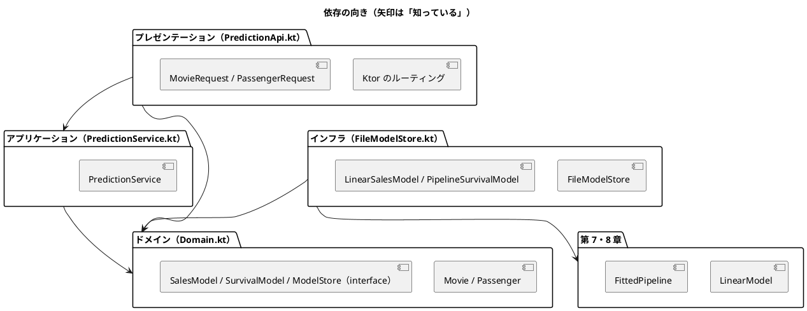

# 第 15 章: 機械学習 API とモジュール設計

## 15.1 はじめに

ここまでの章で、映画の興行収入を予測する線形回帰（第 7 章）と、乗客の生存を予測する前処理パイプライン（第 8 章）を作りました。どちらも学習と評価はできますが、使えるのは Kotlin のコードを書ける人だけです。

最終章では、この 2 つのモデルを **HTTP API** として公開します。API にすれば、Web アプリケーションや別の言語のプログラムから、JSON を送るだけで予測を使えます。

API を作るときに問題になるのは、機械学習そのものより **周辺の設計** です。

- HTTP の処理とモデルの処理が 1 つの関数に混ざると、どちらかを変えるたびに全体を壊しやすい
- 学習済みモデルのファイルが無いと、テストが動かない
- 不正な入力やモデルの読み込み失敗を、利用者にどう伝えるか

この章では、[Ktor](https://ktor.io/) と [kotlinx.serialization](https://github.com/Kotlin/kotlinx.serialization) を使い、処理を **レイヤー（層）** に分けて、これらの問題を TDD で解いていきます。[Python 版の第 15 章](../python/15-machine-learning-api-and-module-design.md) と同じ構成で進めます。Kotlin 版では、`interface` による約束、`Result` と sealed interface によるエラーの表し方、`testApplication` による API のテストに注目してください。

## 15.2 レイヤードアーキテクチャ

### 4 つの層と依存の向き

API を次の 4 つの層に分けます。

| 層 | ファイル | 責務 | 知っているもの |
|----|---------|------|--------------|
| ドメイン | `Domain.kt` | 入力（映画・乗客）と予測結果の型、「モデル」と「モデルの置き場」の約束（`interface`） | 何も知らない |
| アプリケーション | `PredictionService.kt` | 予測のユースケース（モデルを読み込んで予測する、ヘルスチェック） | ドメイン |
| インフラ | `FileModelStore.kt` | モデルのファイルへの保存・読み込みと、第 7・8 章のモデルをドメインの約束に合わせるアダプター | ドメイン、第 7・8 章 |
| プレゼンテーション | `PredictionApi.kt` | Ktor のエンドポイント、入力の検証、HTTP ステータスコード | ドメイン、アプリケーション |



ポイントは、**アプリケーション層がインフラ層を知らない** ことです。`PredictionService` は「モデルの置き場（`ModelStore`）から読み込んで予測する」ことしか知らず、それがファイルなのか、テスト用のスタブなのかを気にしません。

Python 版と違い、プレゼンテーション層の `predictionModule` は、組み立て済みの `PredictionService` を引数で受け取ります。どの置き場を使うかを決めるのは、サーバーを起動する `main`（15.7 節）です。このため、API の層もインフラ層を知りません。

### インサイドアウトで進める

TDD の進め方には、外側（API）から作る **アウトサイドイン** と、内側（ドメイン・サービス）から作る **インサイドアウト** があります。この章ではインサイドアウトを選びます。

- 予測の中身（第 7・8 章のモデル）はすでにテスト済みで、新しく決めるのは「それをどう包むか」だけ
- 内側の層は外側を知らないので、内側から作ると、各段階でスタブが最小限で済む
- API の形（URL・JSON）は、内側の型が決まってから `@Serializable` のクラスに写すだけになる

## 15.3 TODO リストの作成

**TODO リスト**:

- [ ] 予測サービス（アプリケーション層）
  - [ ] 映画の特徴量から興行収入を予測する
  - [ ] 乗客の特徴量から生存・死亡を予測する
  - [ ] モデルが無ければ `ModelNotFoundException` の失敗を返す
  - [ ] ヘルスチェックで各モデルを読み込めるかを返す
- [ ] モデルの保存と読み込み（インフラ層）
  - [ ] 保存した線形回帰モデルを読み込んで興行収入を予測する
  - [ ] 保存したパイプラインを読み込んで生存を判定する
  - [ ] モデルファイルが無ければ `ModelNotFoundException` の失敗を返す（パスは見せない）
- [ ] HTTP API（プレゼンテーション層）
  - [ ] `POST /cinema/sales` で興行収入を返す
  - [ ] `POST /survived` で生存の予測を返す
  - [ ] `GET /health` でモデルの状態を返す
  - [ ] 不正な入力には 422 を返す
  - [ ] モデルが無ければ 503 を返す
- [ ] 実データで学習したモデルで API を動かす

## 15.4 予測サービスを作る

### スタブで置き場を差し替える

最初のテストは「映画の特徴量から興行収入を予測する」です。本物のモデルの代わりに、`sns1` に 1000 を足すだけの **スタブ** を使います。スタブなら学習データもモデルファイルも要らず、期待値も一目で分かります。

```kotlin
// src/test/kotlin/chapter15/PredictionServiceTest.kt
package chapter15

import kotlin.test.Test
import kotlin.test.assertEquals

class StubSalesModel : SalesModel {
    override fun predictSales(movie: Movie): Double = 1000.0 + movie.sns1
}

class StubModelStore : ModelStore {
    override fun loadSalesModel(): Result<SalesModel> = Result.success(StubSalesModel())
}

class PredictSalesTest {
    @Test
    fun `映画の特徴量から興行収入を予測する`() {
        val service = PredictionService(StubModelStore())

        val prediction = service.predictSales(Movie(sns1 = 200.0, sns2 = 500.0, actor = 3000.0, original = 1))

        assertEquals(Result.success(SalesPrediction(sales = 1200.0)), prediction)
    }
}
```

```bash
./gradlew test --tests "chapter15.*"
```

```text
e: .../src/test/kotlin/chapter15/PredictionServiceTest.kt:6:24 Unresolved reference 'SalesModel'.
e: .../src/test/kotlin/chapter15/PredictionServiceTest.kt:7:38 Unresolved reference 'Movie'.
e: .../src/test/kotlin/chapter15/PredictionServiceTest.kt:7:70 Unresolved reference 'sns1'.
e: .../src/test/kotlin/chapter15/PredictionServiceTest.kt:10:24 Unresolved reference 'ModelStore'.
...
e: .../src/test/kotlin/chapter15/PredictionServiceTest.kt:21:37 Unresolved reference 'SalesPrediction'.
```

モデルの読み込みは失敗しうる処理なので、置き場の約束は `SalesModel` ではなく `Result<SalesModel>` を返すことにしました。`Result` は Kotlin の標準ライブラリの型で、「成功した値」か「失敗の原因の例外」のどちらかを持ちます。`assertEquals` で `Result.success(...)` どうしを比べられるのは、`Result` が中身で等しさを判定するためです。

### interface で「約束」だけを書く

ドメイン層に、入力と予測結果の型、そしてモデルとモデルの置き場の **約束** を書きます。

```kotlin
// src/main/kotlin/chapter15/Domain.kt
package chapter15

data class Movie(
    val sns1: Double,
    val sns2: Double,
    val actor: Double,
    val original: Int,
)

data class SalesPrediction(
    val sales: Double,
)

/** 映画の特徴量から興行収入を予測するモデルの約束 */
interface SalesModel {
    fun predictSales(movie: Movie): Double
}

/** 学習済みモデルの置き場の約束 */
interface ModelStore {
    fun loadSalesModel(): Result<SalesModel>
}
```

```kotlin
// src/main/kotlin/chapter15/PredictionService.kt
package chapter15

class PredictionService(
    private val store: ModelStore,
) {
    fun predictSales(movie: Movie): Result<SalesPrediction> = store.loadSalesModel().map { SalesPrediction(sales = it.predictSales(movie)) }
}
```

```text
PredictSalesTest > 映画の特徴量から興行収入を予測する() PASSED
BUILD SUCCESSFUL in 14s
```

`Result.map` は、成功していれば中身を変換し、失敗していれば失敗をそのまま返します。読み込みの失敗を `if` や `try` で分けなくても、「読み込めたら予測する」を 1 行で書けます。

Python 版の `Protocol` は、メソッドを持っていれば約束を満たしたとみなす **構造的部分型** でした。Kotlin の `interface` は、`class StubSalesModel : SalesModel` のように **明示的に実装を宣言した型だけ** が約束を満たします（名前による部分型）。宣言を書く手間は増えますが、約束を満たしていないクラスを渡すとコンパイルの時点で分かり、IDE で「この約束を実装しているクラス」を一覧できます。

### 生存予測・モデルが無い場合・ヘルスチェック

残りのサービスの振る舞いをテストに書きます。モデルが無い状態を表す `EmptyModelStore` も用意します。

```kotlin
class StubSurvivalModel : SurvivalModel {
    override fun survives(passenger: Passenger): Boolean = passenger.sex == "female"
}

class StubModelStore : ModelStore {
    override fun loadSalesModel(): Result<SalesModel> = Result.success(StubSalesModel())

    override fun loadSurvivalModel(): Result<SurvivalModel> = Result.success(StubSurvivalModel())
}

class EmptyModelStore : ModelStore {
    override fun loadSalesModel(): Result<SalesModel> = Result.failure(ModelNotFoundException("cinema"))

    override fun loadSurvivalModel(): Result<SurvivalModel> = Result.failure(ModelNotFoundException("survived"))
}

val MOVIE = Movie(sns1 = 200.0, sns2 = 500.0, actor = 3000.0, original = 1)
val PASSENGER = Passenger(pclass = 1, sex = "female", age = null, sibSp = 0, parch = 0, fare = 50.0, embarked = "C")
```

```kotlin
    @Test
    fun `モデルが無ければModelNotFoundExceptionの失敗を返す`() {
        val service = PredictionService(EmptyModelStore())

        val error = assertIs<ModelNotFoundException>(service.predictSales(MOVIE).exceptionOrNull())

        assertEquals("cinema", error.model)
        assertEquals("学習済みモデル cinema が見つかりません", error.message)
    }
}

class PredictSurvivalTest {
    @Test
    fun `生存と判定されれば生存と予測する`() {
        val service = PredictionService(StubModelStore())

        assertEquals(Result.success(SurvivalPrediction(survived = true)), service.predictSurvival(PASSENGER))
    }

    @Test
    fun `死亡と判定されれば死亡と予測する`() {
        val service = PredictionService(StubModelStore())

        val prediction = service.predictSurvival(PASSENGER.copy(pclass = 3, sex = "male", age = 30.0, fare = 8.0, embarked = "S"))

        assertEquals(Result.success(SurvivalPrediction(survived = false)), prediction)
    }
}

class HealthTest {
    @Test
    fun `モデルを読み込めればそれぞれtrueを返す`() {
        val service = PredictionService(StubModelStore())

        assertEquals(mapOf("cinema" to true, "survived" to true), service.health())
    }

    @Test
    fun `モデルが無ければそれぞれfalseを返す`() {
        val service = PredictionService(EmptyModelStore())

        assertEquals(mapOf("cinema" to false, "survived" to false), service.health())
    }
}
```

- `exceptionOrNull()` は、失敗していれば原因の例外を、成功していれば null を返します。`assertIs<ModelNotFoundException>` は型を確かめたうえで、値をその型として返すので、続けて `error.model` と書けます
- `PASSENGER.copy(...)` は、data class の `copy` で一部のプロパティだけを変えた乗客を作ります

```text
e: .../src/test/kotlin/chapter15/PredictionServiceTest.kt:11:27 Unresolved reference 'SurvivalModel'.
e: .../src/test/kotlin/chapter15/PredictionServiceTest.kt:12:38 Unresolved reference 'Passenger'.
...
e: .../src/test/kotlin/chapter15/PredictionServiceTest.kt:56:83 Unresolved reference 'predictSurvival' on receiver of type 'PredictionService'.
```

ここで Python 版との大きな違いが 1 つあります。Python 版の生存予測は、モデルに **生存確率** を返させ、「0.5 以上なら生存」という判定をドメインに置きました。Kotlin 版の第 8 章の決定木は、葉に多数派のラベルだけを持ち、ラベルごとの件数を持っていません。そのため確率を返せず、生存モデルの約束は「生存するか」（`Boolean`）にしました。確率を返すには第 8 章の葉に件数を持たせる変更が必要で、それはこの章の範囲を超えます。

```kotlin
data class Passenger(
    val pclass: Int,
    val sex: String,
    val age: Double?,
    val sibSp: Int,
    val parch: Int,
    val fare: Double,
    val embarked: String?,
)

data class SurvivalPrediction(
    val survived: Boolean,
)

/** 学習済みモデルが見つからないことを表す。メッセージにはファイルのパスを含めない */
class ModelNotFoundException(
    val model: String,
) : Exception("学習済みモデル $model が見つかりません")

/** 乗客が生存するかを判定するモデルの約束 */
interface SurvivalModel {
    fun survives(passenger: Passenger): Boolean
}

/** 学習済みモデルの置き場の約束。読み込めなければ失敗の Result を返す */
interface ModelStore {
    fun loadSalesModel(): Result<SalesModel>

    fun loadSurvivalModel(): Result<SurvivalModel>
}
```

```kotlin
class PredictionService(
    private val store: ModelStore,
) {
    fun predictSales(movie: Movie): Result<SalesPrediction> = store.loadSalesModel().map { SalesPrediction(sales = it.predictSales(movie)) }

    fun predictSurvival(passenger: Passenger): Result<SurvivalPrediction> =
        store.loadSurvivalModel().map { SurvivalPrediction(survived = it.survives(passenger)) }

    fun health(): Map<String, Boolean> =
        mapOf(
            "cinema" to store.loadSalesModel().isSuccess,
            "survived" to store.loadSurvivalModel().isSuccess,
        )
}
```

- 年齢（`age`）と乗船港（`embarked`）は欠損しうるので、`Double?`・`String?` の null 許容型にしています
- Python 版の `_can_load` は、読み込みの例外を `try` で捕まえて真偽値にしていました。Kotlin 版は読み込みの結果が `Result` なので、`isSuccess` を見るだけで済みます
- `ModelNotFoundException` のメッセージにはモデル名だけを入れ、ファイルのパスは入れません。Python 版では、実際にサーバーを動かしてから応答にパスが漏れていることに気づき、あとから直しました（Python 版の 15.6 節）。Kotlin 版はその学びを先に取り入れ、最初からパスを含めない形にしています

```text
HealthTest > モデルを読み込めればそれぞれtrueを返す() PASSED
HealthTest > モデルが無ければそれぞれfalseを返す() PASSED
PredictSalesTest > モデルが無ければModelNotFoundExceptionの失敗を返す() PASSED
PredictSalesTest > 映画の特徴量から興行収入を予測する() PASSED
PredictSurvivalTest > 生存と判定されれば生存と予測する() PASSED
PredictSurvivalTest > 死亡と判定されれば死亡と予測する() PASSED
BUILD SUCCESSFUL in 31s
```

## 15.5 モデルを保存して読み込む

### アダプターで第 7・8 章のモデルを約束に合わせる

インフラ層では、モデルをファイルに保存・読み込みします。第 7 章の `LinearModel` は `predict(AnyFrame)`、第 8 章の `FittedPipeline` も `predict(AnyFrame)` という形なので、ドメインの `predictSales(Movie)`・`survives(Passenger)` とは合いません。そこで、間を取り持つ **アダプター** を作ります。

テストでは、係数を手で決めた `LinearModel` と、架空の 8 人の乗客で学習したパイプラインを使います。どちらも学習データ無しで動きます。

```kotlin
// src/test/kotlin/chapter15/FileModelStoreTest.kt
private fun passenger(sex: String) = Passenger(pclass = 2, sex = sex, age = null, sibSp = 0, parch = 0, fare = 20.0, embarked = null)

private fun fictionalPassengers(): Pair<AnyFrame, List<Int>> {
    val x =
        dataFrameOf(
            "Pclass" to listOf(1, 2, 3, 3, 1, 2, 3, 3),
            "Sex" to listOf("female", "female", "female", "female", "male", "male", "male", "male"),
            "Age" to listOf(25.0, 35.0, 18.0, null, 40.0, 28.0, 22.0, null),
            "SibSp" to listOf(0, 1, 0, 0, 1, 0, 0, 0),
            "Parch" to listOf(0, 0, 1, 0, 0, 0, 0, 0),
            "Fare" to listOf(60.0, 30.0, 10.0, 9.0, 55.0, 15.0, 8.0, 7.0),
            "Embarked" to listOf("C", "S", "Q", "S", "C", "S", null, "S"),
        )
    return x to listOf(1, 1, 1, 1, 0, 0, 0, 0)
}

class SalesModelStoreTest {
    private val directory: File = createTempDirectory().toFile()

    @Test
    fun `保存した線形回帰モデルを読み込んで興行収入を予測する`() {
        val store = FileModelStore(directory)
        store.saveSalesModel(
            LinearModel(intercept = 100.0, coefficients = mapOf("SNS1" to 1.0, "SNS2" to 2.0, "actor" to 0.5, "original" to 10.0)),
        )

        val model = store.loadSalesModel().getOrThrow()

        assertEquals(210.0, model.predictSales(Movie(sns1 = 10.0, sns2 = 20.0, actor = 100.0, original = 1)), absoluteTolerance = 1e-9)
    }

    @Test
    fun `モデルファイルが無ければModelNotFoundExceptionの失敗を返す`() {
        val store = FileModelStore(directory)

        val error = assertIs<ModelNotFoundException>(store.loadSalesModel().exceptionOrNull())

        assertEquals("cinema", error.model)
        assertFalse(error.message.orEmpty().contains(directory.path))
    }
}

class SurvivalModelStoreTest {
    private val directory: File = createTempDirectory().toFile()

    @Test
    fun `保存したパイプラインを読み込んで生存を判定する`() {
        val store = FileModelStore(directory)
        val (x, t) = fictionalPassengers()
        store.saveSurvivalModel(buildPipeline(maxDepth = 2, classWeight = ClassWeight.NONE).fit(x, t))

        val model = store.loadSurvivalModel().getOrThrow()

        assertTrue(model.survives(passenger("female")))
        assertFalse(model.survives(passenger("male")))
    }

    @Test
    fun `モデルファイルが無ければModelNotFoundExceptionの失敗を返す`() {
        val store = FileModelStore(directory)

        val error = assertIs<ModelNotFoundException>(store.loadSurvivalModel().exceptionOrNull())

        assertEquals("survived", error.model)
        assertFalse(error.message.orEmpty().contains(directory.path))
    }
}
```

`getOrThrow()` は、成功していれば中身を返し、失敗していれば原因の例外を投げます。テストでは、読み込めなければ例外でテストが失敗すればよいので、このように使います。

```text
e: .../src/test/kotlin/chapter15/FileModelStoreTest.kt:37:21 Unresolved reference 'FileModelStore'.
e: .../src/test/kotlin/chapter15/FileModelStoreTest.kt:42:44 Cannot infer type for type parameter 'T'. Specify it explicitly.
e: .../src/test/kotlin/chapter15/FileModelStoreTest.kt:44:35 Unresolved reference 'predictSales'.
...
e: .../src/test/kotlin/chapter15/FileModelStoreTest.kt:75:21 Unresolved reference 'FileModelStore'.
```

アダプターは、ドメインの値から 1 行だけのデータフレームを作り、第 7・8 章のモデルに渡します。

```kotlin
import chapter07.FEATURES as CINEMA_FEATURES
import chapter08.FEATURES as SURVIVED_FEATURES

/** 第 7 章の線形回帰モデルを、ドメインの SalesModel の約束に合わせるアダプター */
class LinearSalesModel(
    private val model: LinearModel,
) : SalesModel {
    override fun predictSales(movie: Movie): Double {
        val values = mapOf("SNS1" to movie.sns1, "SNS2" to movie.sns2, "actor" to movie.actor, "original" to movie.original.toDouble())
        return model.predict(oneRow(CINEMA_FEATURES, values)).first()
    }
}

/** 第 8 章の学習済みパイプラインを、ドメインの SurvivalModel の約束に合わせるアダプター */
class PipelineSurvivalModel(
    private val pipeline: FittedPipeline,
) : SurvivalModel {
    override fun survives(passenger: Passenger): Boolean {
        val values =
            mapOf(
                "Pclass" to passenger.pclass,
                "Sex" to passenger.sex,
                "Age" to passenger.age,
                "SibSp" to passenger.sibSp,
                "Parch" to passenger.parch,
                "Fare" to passenger.fare,
                "Embarked" to passenger.embarked,
            )
        return pipeline.predict(oneRow(SURVIVED_FEATURES, values)).first() == 1
    }
}

private fun oneRow(
    columns: List<String>,
    values: Map<String, Any?>,
): AnyFrame = dataFrameOf(columns.map { listOf(values.getValue(it)).toColumn(it) })
```

- 第 7 章と第 8 章は、どちらも特徴量の列名を `FEATURES` という名前で公開しています。`import ... as CINEMA_FEATURES` のように **別名を付けて import** すると、同じ名前を 1 つのファイルで区別して使えます
- 列の並びは第 7・8 章の `FEATURES` に任せ、アダプターは列名と値の対応だけを書きます。列の並びを二重に管理しないためです
- 乗客の年齢・乗船港が null のときは、第 8 章のパイプラインが訓練データの値で補完します

### 保存の形式

保存の形式は、モデルごとに変えています。

| モデル | ファイル | 形式 | 理由 |
|--------|---------|------|------|
| 第 7 章の `LinearModel` | `cinema.json` | kotlinx.serialization の JSON | 切片と係数だけの data class で、`Serializable` を実装していない。JSON なら中身を人が読める |
| 第 8 章の `FittedPipeline` | `survived.ser` | 第 8 章の `saveModel`・`loadModel`（Java のシリアライズ） | 第 8 章が保存と、読み込めるクラスを絞った読み込みをすでに用意している |

第 7 章の `LinearModel` を変更して `@Serializable` を付けることもできますが、第 7 章の型が保存の方法を知ることになります。インフラ層に保存専用の形（`LinearModelFile`）を置けば、第 7 章には手を加えずに済みます。

```kotlin
/** 線形回帰モデルを JSON で保存するための形 */
@Serializable
private data class LinearModelFile(
    val intercept: Double,
    val coefficients: Map<String, Double>,
)
```

`@Serializable` を付けると、kotlinx.serialization の **コンパイラプラグイン** が、コンパイル時に JSON との変換処理を生成します。実行時にリフレクションでプロパティを調べないので、変換できない型を持つクラスはコンパイルの時点でエラーになります。このプラグインは、ビルドファイルの `plugins` に `kotlin-serialization`（`org.jetbrains.kotlin.plugin.serialization`）として追加しています。

### モデルの置き場

モデルの保存と読み込みをまとめた `FileModelStore` です。

```kotlin
const val SALES_MODEL = "cinema"
const val SURVIVAL_MODEL = "survived"

/** 学習済みモデルをディレクトリのファイルに保存し、読み込む */
class FileModelStore(
    private val modelDir: File,
) : ModelStore {
    fun saveSalesModel(model: LinearModel) {
        modelDir.mkdirs()
        salesModelFile().writeText(Json.encodeToString(LinearModelFile(model.intercept, model.coefficients)))
    }

    fun saveSurvivalModel(pipeline: FittedPipeline) = saveModel(pipeline, survivalModelFile())

    override fun loadSalesModel(): Result<SalesModel> =
        load(SALES_MODEL, salesModelFile()) { file ->
            val saved = Json.decodeFromString<LinearModelFile>(file.readText())
            LinearSalesModel(LinearModel(saved.intercept, saved.coefficients))
        }

    override fun loadSurvivalModel(): Result<SurvivalModel> =
        load(SURVIVAL_MODEL, survivalModelFile()) { file -> PipelineSurvivalModel(loadModel(file)) }

    private fun salesModelFile() = File(modelDir, "$SALES_MODEL.json")

    private fun survivalModelFile() = File(modelDir, "$SURVIVAL_MODEL.ser")

    private fun <T> load(
        model: String,
        file: File,
        read: (File) -> T,
    ): Result<T> = if (file.exists()) runCatching { read(file) } else Result.failure(ModelNotFoundException(model))
}
```

- `load` は、ファイルが無ければ `ModelNotFoundException` の失敗を、あれば `runCatching` で読み込んだ結果を返します。`runCatching { ... }` は、ブロックが例外を投げれば失敗の `Result`、投げなければ成功の `Result` を返す関数です。ファイルが壊れていて読み込めない場合も、例外が外に飛び出さずに失敗の `Result` になります
- 読み込む処理を関数型の引数 `read: (File) -> T` で受け取り、「ファイルが無いときの扱い」を 2 つのモデルで共通にしています
- `FileModelStore` の `loadSalesModel` は `LinearSalesModel` を作りますが、戻り値の型は約束どおり `Result<SalesModel>` です

モデルはリクエストのたびにファイルから読み込みます。学習し直したモデルをサーバーの再起動なしで使える反面、リクエストごとにファイルを読む分だけ遅くなります。アクセスが多い API では、読み込んだモデルをキャッシュする設計を検討してください。

```text
SalesModelStoreTest > モデルファイルが無ければModelNotFoundExceptionの失敗を返す() PASSED
SalesModelStoreTest > 保存した線形回帰モデルを読み込んで興行収入を予測する() PASSED
SurvivalModelStoreTest > 保存したパイプラインを読み込んで生存を判定する() PASSED
SurvivalModelStoreTest > モデルファイルが無ければModelNotFoundExceptionの失敗を返す() PASSED
BUILD SUCCESSFUL in 1m 4s
```

## 15.6 Ktor でエンドポイントを作る

### testApplication でサーバーを起動せずにテストする

Ktor には、サーバーを起動せずにアプリケーションへ HTTP リクエストを送れる `testApplication` があります（`ktor-server-test-host`）。テストごとに置き場（スタブ）を選んでサービスを組み立て、API に渡します。

```kotlin
// src/test/kotlin/chapter15/PredictionApiTest.kt
private val MOVIE_JSON =
    buildJsonObject {
        put("sns1", 200.0)
        put("sns2", 500.0)
        put("actor", 3000.0)
        put("original", 1)
    }

/** スタブの置き場を使うサービスで API を起動し、JSON を送受信するクライアントでテストする */
private fun apiTest(
    store: ModelStore,
    block: suspend ApplicationTestBuilder.(client: HttpClient) -> Unit,
) = testApplication {
    application { predictionModule(PredictionService(store)) }
    val client = createClient { install(ContentNegotiation) { json() } }
    block(client)
}

class CinemaSalesApiTest {
    @Test
    fun `映画の特徴量を送ると予測した興行収入を返す`() =
        apiTest(StubModelStore()) { client ->
            val response =
                client.post("/cinema/sales") {
                    contentType(ContentType.Application.Json)
                    setBody(MOVIE_JSON)
                }

            assertEquals(HttpStatusCode.OK, response.status)
            assertEquals(buildJsonObject { put("sales", 1200.0) }, response.body<JsonElement>())
        }
}
```

- `application { ... }` の中で、テスト対象のモジュール（`predictionModule`）を組み込みます
- `createClient { install(ContentNegotiation) { json() } }` で、JSON の本文を送受信できるクライアントを作ります（`ktor-client-content-negotiation`）
- 送る JSON は `buildJsonObject` で組み立て、返ってきた本文は `JsonElement` として受け取って比べます。API の約束は JSON の形なので、Kotlin のクラスではなく JSON どうしで比べています
- `block` の型 `suspend ApplicationTestBuilder.(client: HttpClient) -> Unit` は、`suspend` な **レシーバー付きの関数型** です。`client.post` は中断する関数（コルーチン）なので、ブロックも `suspend` にする必要があります

サービスのテストで使ったスタブを API のテストでも使うので、リファクタリングとして `src/test/kotlin/chapter15/Stubs.kt` に移しました（この章の最後に載せています）。

```text
e: .../src/test/kotlin/chapter15/PredictionApiTest.kt:32:19 Unresolved reference 'predictionModule'.
```

最小限の実装です。

```kotlin
@Serializable
data class MovieRequest(
    val sns1: Double,
    val sns2: Double,
    val actor: Double,
    val original: Int,
)

@Serializable
data class SalesResponse(
    val sales: Double,
)

fun Application.predictionModule(service: PredictionService) {
    install(ContentNegotiation) { json() }
    routing {
        post("/cinema/sales") {
            val request = call.receive<MovieRequest>()
            val prediction = service.predictSales(Movie(request.sns1, request.sns2, request.actor, request.original)).getOrThrow()
            call.respond(SalesResponse(prediction.sales))
        }
    }
}
```

- `fun Application.predictionModule(...)` は `Application` の **拡張関数** です。Ktor では、アプリケーションの設定（プラグインとルーティング）を拡張関数にまとめ、本番の起動とテストで同じものを組み込みます
- `install(ContentNegotiation) { json() }` で、`@Serializable` のクラスと JSON を自動で変換します。`call.receive<MovieRequest>()` が本文を読み、`call.respond(...)` が JSON で返します
- HTTP の形（`MovieRequest`）とドメインの型（`Movie`）を分けているのは、JSON の形とドメインの型を別々に変えられるようにするためです

```text
CinemaSalesApiTest > 映画の特徴量を送ると予測した興行収入を返す() PASSED
```

### 入力の検証とエラー応答をテストに書く

残りのエンドポイントと、不正な入力・モデルが無い場合のテストを追加します。

```kotlin
private val PASSENGER_JSON =
    buildJsonObject {
        put("pclass", 1)
        put("sex", "female")
        put("age", null)
        put("sib_sp", 0)
        put("parch", 0)
        put("fare", 50.0)
        put("embarked", "C")
    }

private fun JsonObject.with(
    field: String,
    value: JsonElement,
) = JsonObject(this + (field to value))

private suspend fun HttpClient.postJson(
    path: String,
    body: JsonObject,
): HttpResponse =
    post(path) {
        contentType(ContentType.Application.Json)
        setBody(body)
    }
```

```kotlin
    @Test
    fun `特徴量が不正なら422を返す`() =
        apiTest(StubModelStore()) { client ->
            for ((field, value) in listOf("sns1" to JsonPrimitive(-1.0), "actor" to JsonPrimitive("多い"), "original" to JsonPrimitive(2))) {
                val response = client.postJson("/cinema/sales", MOVIE_JSON.with(field, value))

                assertEquals(HttpStatusCode.UnprocessableEntity, response.status, "$field=$value")
            }
        }

    @Test
    fun `モデルが無ければ503を返す`() =
        apiTest(EmptyModelStore()) { client ->
            val response = client.postJson("/cinema/sales", MOVIE_JSON)

            assertEquals(HttpStatusCode.ServiceUnavailable, response.status)
            assertEquals(buildJsonObject { put("detail", "学習済みモデル cinema が見つかりません") }, response.body<JsonElement>())
        }
```

- `JsonObject` は `Map<String, JsonElement>` を実装しているので、`this + (field to value)` で 1 つの項目だけを差し替えた JSON を作れます
- Python 版の `@pytest.mark.parametrize` の代わりに、不正な値の一覧を `for` で回し、`assertEquals` の 3 つ目の引数に「どの値で失敗したか」を入れています

乗客の API（`/survived`）とヘルスチェック（`/health`）のテストも同じ形で書きました（`src/test/kotlin/chapter15/PredictionApiTest.kt`）。実行すると、8 件が失敗しました。

```text
CinemaSalesApiTest > 特徴量が不正なら422を返す() FAILED
    org.opentest4j.AssertionFailedError: sns1=-1.0 ==> expected: <422 Unprocessable Entity> but was: <200 OK>
CinemaSalesApiTest > 映画の特徴量を送ると予測した興行収入を返す() PASSED
CinemaSalesApiTest > モデルが無ければ503を返す() FAILED
    org.opentest4j.AssertionFailedError: expected: <503 Service Unavailable> but was: <500 Internal Server Error>
HealthApiTest > 読み込めないモデルがあればdegradedを返す() FAILED
    org.opentest4j.AssertionFailedError: expected: <200 OK> but was: <404 Not Found>
HealthApiTest > すべてのモデルを読み込めればokを返す() FAILED
    org.opentest4j.AssertionFailedError: expected: <200 OK> but was: <404 Not Found>
SurvivedApiTest > 年齢と乗船港は省略できる() FAILED
    org.opentest4j.AssertionFailedError: expected: <200 OK> but was: <404 Not Found>
SurvivedApiTest > 特徴量が不正なら422を返す() FAILED
    org.opentest4j.AssertionFailedError: pclass=4 ==> expected: <422 Unprocessable Entity> but was: <404 Not Found>
SurvivedApiTest > モデルが無ければ503を返す() FAILED
    org.opentest4j.AssertionFailedError: expected: <503 Service Unavailable> but was: <404 Not Found>
SurvivedApiTest > 乗客の特徴量を送ると生存の予測を返す() FAILED
    org.opentest4j.AssertionFailedError: expected: <200 OK> but was: <404 Not Found>
19 tests completed, 8 failed
BUILD FAILED in 17s
```

失敗の内容から、次のことが分かります。

- **負の値（`sns1` が −1）は 200 で通ってしまう**。kotlinx.serialization は型を検査しますが、値の範囲までは検査しません
- **モデルが無いと、`getOrThrow()` が投げた例外がそのまま 500 になる**
- **まだ作っていないエンドポイントは 404**

Python 版の Pydantic は、`Field(ge=0)` や `Literal` で値の範囲まで宣言できました。Kotlin 版では、範囲の検証を自分で書きます。

### sealed interface で検証の結果を表す

検証の結果を、「正しい値」か「不正な理由の一覧」のどちらかを表す sealed interface にします。

```kotlin
/** 入力の検証結果。正しければ値を、不正なら理由の一覧を持つ */
sealed interface Validated<out T> {
    data class Valid<T>(
        val value: T,
    ) : Validated<T>

    data class Invalid(
        val errors: List<String>,
    ) : Validated<Nothing>
}

private fun <T> validated(
    errors: List<String?>,
    value: () -> T,
): Validated<T> = errors.filterNotNull().let { if (it.isEmpty()) Validated.Valid(value()) else Validated.Invalid(it) }

private fun notNegative(
    field: String,
    value: Double?,
): String? = if (value != null && value < 0) "$field は 0 以上にしてください" else null

private fun <T> oneOf(
    field: String,
    value: T?,
    allowed: Set<T>,
): String? = if (value != null && value !in allowed) "$field は ${allowed.joinToString("、")} のどれかにしてください" else null
```

- `Validated<out T>` の `out` は、`Validated<Movie>` を `Validated<Any>` として扱える（共変）という宣言です。`Invalid` は値を持たないので `Validated<Nothing>` とし、`Nothing` はすべての型の部分型なので、`Validated<Movie>` が求められる場所でも `Invalid` を返せます
- 1 つ 1 つの検査は「問題があれば理由、無ければ null」を返す関数にして、`filterNotNull()` で理由だけを集めます。1 回のリクエストで、不正な項目をまとめて返せます

`MovieRequest`・`PassengerRequest` に、ドメインの型へ変換する `validate` を持たせます。

```kotlin
private val ORIGINAL_VALUES = setOf(0, 1)
private val PASSENGER_CLASSES = setOf(1, 2, 3)
private val SEXES = setOf("male", "female")
private val PORTS = setOf("C", "Q", "S")

@Serializable
data class MovieRequest(
    val sns1: Double,
    val sns2: Double,
    val actor: Double,
    val original: Int,
) {
    fun validate(): Validated<Movie> =
        validated(
            listOf(
                notNegative("sns1", sns1),
                notNegative("sns2", sns2),
                notNegative("actor", actor),
                oneOf("original", original, ORIGINAL_VALUES),
            ),
        ) { Movie(sns1, sns2, actor, original) }
}

@Serializable
data class PassengerRequest(
    val pclass: Int,
    val sex: String,
    val age: Double? = null,
    @SerialName("sib_sp") val sibSp: Int,
    val parch: Int,
    val fare: Double,
    val embarked: String? = null,
) {
    fun validate(): Validated<Passenger> =
        validated(
            listOf(
                oneOf("pclass", pclass, PASSENGER_CLASSES),
                oneOf("sex", sex, SEXES),
                notNegative("age", age),
                notNegative("sib_sp", sibSp.toDouble()),
                notNegative("parch", parch.toDouble()),
                notNegative("fare", fare),
                oneOf("embarked", embarked, PORTS),
            ),
        ) { Passenger(pclass, sex, age, sibSp, parch, fare, embarked) }
}
```

- `age` と `embarked` は既定値を `null` にしたので、JSON で省略できます。欠損値の補完は第 8 章のパイプラインに任せます
- `@SerialName("sib_sp")` で、Kotlin のプロパティ名 `sibSp` と JSON の項目名 `sib_sp` を対応させています。JSON の形は Python 版の API と同じです
- 許される値の一覧は、関数の中に数値を並べず、名前の付いたプロパティ（`PASSENGER_CLASSES` など）にまとめています（第 5 章の MagicNumber の方針）

エンドポイントでは、`when` で検証の結果を場合分けします。`Validated` は sealed interface なので、`Valid` と `Invalid` の 2 つを書けば `else` は要りません。

```kotlin
        post("/cinema/sales") {
            when (val movie = call.receive<MovieRequest>().validate()) {
                is Validated.Invalid -> call.respond(HttpStatusCode.UnprocessableEntity, ValidationErrorResponse(movie.errors))
                is Validated.Valid -> call.respond(SalesResponse(service.predictSales(movie.value).getOrThrow().sales))
            }
        }
```

### 例外を HTTP のステータスコードに変換する

残るのは、検証より前に起きる失敗と、モデルが無い場合です。Ktor の `StatusPages` プラグインで、例外の種類ごとに応答を決めます。

```kotlin
fun Application.predictionModule(service: PredictionService) {
    install(ContentNegotiation) { json() }
    install(StatusPages) {
        // JSON として読めない・型が合わない入力。例外のメッセージには内部の型名が含まれるので、応答には出さない
        exception<BadRequestException> { call, _ ->
            call.respond(HttpStatusCode.UnprocessableEntity, ValidationErrorResponse(listOf("JSON の形式または値の型が正しくありません")))
        }
        // ドメインの例外を HTTP のステータスコードに変換する
        exception<ModelNotFoundException> { call, cause ->
            call.respond(HttpStatusCode.ServiceUnavailable, ErrorResponse(cause.message.orEmpty()))
        }
    }
```

- `ModelNotFoundException` はドメインの例外で、HTTP を知りません。HTTP のステータスコード **503 Service Unavailable**（一時的に提供できない）に変換するのはプレゼンテーション層の仕事です。サービスは失敗を `Result` で返し、エンドポイントの `getOrThrow()` で例外に戻してから、`StatusPages` に変換を任せています
- `actor` に `"多い"` のような型の合わない値を送ると、`call.receive` が `BadRequestException` を投げます。`StatusPages` を入れる前に確かめると、Ktor は **400 Bad Request** を返し、本文は `Failed to convert request body to class chapter15.MovieRequest` でした。本文に内部のクラス名が含まれるので、固定のメッセージの 422 に置き換えています。422 にそろえたのは、値の範囲の誤りと同じく「形は読めたが中身が受け付けられない入力」として扱うためです

```text
CinemaSalesApiTest > 特徴量が不正なら422を返す() PASSED
CinemaSalesApiTest > 映画の特徴量を送ると予測した興行収入を返す() PASSED
CinemaSalesApiTest > モデルが無ければ503を返す() PASSED
HealthApiTest > 読み込めないモデルがあればdegradedを返す() PASSED
HealthApiTest > すべてのモデルを読み込めればokを返す() PASSED
SurvivedApiTest > 年齢と乗船港は省略できる() PASSED
SurvivedApiTest > 特徴量が不正なら422を返す() PASSED
SurvivedApiTest > モデルが無ければ503を返す() PASSED
SurvivedApiTest > 乗客の特徴量を送ると生存の予測を返す() PASSED
BUILD SUCCESSFUL in 28s
```

## 15.7 実データで学習したモデルで動かす

### 学習と保存

第 7・8 章と同じ条件（テストデータの割合 0.2、シード 0、決定木の深さ 5、`ClassWeight.BALANCED`）でモデルを学習し、保存する処理を作ります。

```kotlin
// src/main/kotlin/chapter15/Training.kt
private const val TEST_SIZE = 0.2
private const val SEED = 0
private const val MAX_DEPTH = 5

/** 第 7・8 章と同じ条件でモデルを学習し、置き場に保存する */
fun trainAndSaveModels(
    dataDirectory: File,
    store: FileModelStore,
) {
    val cinema = prepareCinema(File(dataDirectory, "cinema.csv"), testSize = TEST_SIZE, seed = SEED)
    store.saveSalesModel(fitLinearRegression(cinema.xTrain, cinema.tTrain))

    val (x, t) = splitFeaturesAndTarget(loadSurvived(File(dataDirectory, "Survived.csv")))
    val survived = splitTrainTest(x, t, testSize = TEST_SIZE, seed = SEED)
    val pipeline = buildPipeline(maxDepth = MAX_DEPTH, classWeight = ClassWeight.BALANCED)
    store.saveSurvivalModel(pipeline.fit(survived.xTrain, survived.tTrain))
}
```

### 統合テスト

ここまでのテストは、層ごとにスタブを使って切り離していました。**統合テスト** では、実データで学習したモデルをインフラ層で読み込み、サービス・API まで本物をつないで確かめます。学習は時間がかかるので、`by lazy` で最初に使われたときに 1 回だけ行います。

```kotlin
/** 実データで 1 回だけ学習し、テストの間で使い回すモデルの置き場 */
private val trainedModelDir: File by lazy {
    createTempDirectory("model").toFile().also { trainAndSaveModels(dataDir(), FileModelStore(it)) }
}

private fun requireTrainingData() {
    assumeTrue(
        File(dataDir(), "cinema.csv").exists() && File(dataDir(), "Survived.csv").exists(),
        "学習データ cinema.csv・Survived.csv が配置されていない（gulp data:setup）",
    )
}

class TrainedModelsTest {
    @BeforeTest
    fun requireData() = requireTrainingData()

    private fun trainedApiTest(block: suspend (client: HttpClient) -> Unit) =
        testApplication {
            application { predictionModule(PredictionService(FileModelStore(trainedModelDir))) }
            block(createClient { install(ContentNegotiation) { json() } })
        }

    @Test
    fun `学習した線形回帰モデルで興行収入を予測する`() =
        trainedApiTest { client ->
            val response =
                client.post("/cinema/sales") {
                    contentType(ContentType.Application.Json)
                    setBody(MovieRequest(sns1 = 200.0, sns2 = 500.0, actor = 3000.0, original = 1))
                }

            assertEquals(HttpStatusCode.OK, response.status)
            assertEquals(7830.42, response.body<SalesResponse>().sales, absoluteTolerance = 0.01)
        }
```

- `by lazy` のプロパティは、最初に読まれたときに初期化され、以後は同じ値を返します。データが無い環境では `@BeforeTest` の `assumeTrue` でテストがスキップされ、`trainedModelDir` が一度も読まれないので、学習も行われません
- 統合テストでは、送る本文を JSON の組み立てではなく `MovieRequest` で書いています。クライアントの `ContentNegotiation` が `@Serializable` のクラスを JSON に変換します

期待値の 7830.42 は、最初に仮の値を書いてテストを失敗させ、その失敗で表示された実測値から決めました。

```text
TrainedModelsTest > 学習した線形回帰モデルで興行収入を予測する() FAILED
    org.opentest4j.AssertionFailedError: Expected <0.0> with absolute tolerance <0.01>, actual <7830.419903529487>.
24 tests completed, 1 failed
```

仮の値のままでは意味が無いので、実測値が妥当かを第 7 章の係数（切片 6281.64、SNS1 1.0947、SNS2 0.4886、actor 0.2831、original 236.3234）で手計算して確かめました。6281.64 + 1.0947 × 200 + 0.4886 × 500 + 0.2831 × 3000 + 236.3234 × 1 ≈ 7830.50 となり、係数の丸めの範囲で一致します。このように、実装が先にある値を固定するテストは **特性テスト** と呼ばれ、以後の変更で結果が変わっていないことを守ります。Python 版の 7895.31 と値が違うのは、訓練データに入った行が違うためです（第 2 章）。

生存予測の統合テストでは、1 等客室の女性が生存、3 等客室の男性が死亡と予測されることを確かめています（`src/test/kotlin/chapter15/TrainedModelsTest.kt`）。

### 学習してサーバーを起動する

`main` は、学習済みモデルを `apps/kotlin/model/` に保存してから、Netty でサーバーを起動します。このディレクトリは `.gitignore` の対象です。

```kotlin
// src/main/kotlin/chapter15/Main.kt
/** 学習済みモデルの保存先（apps/kotlin/model/ は .gitignore の対象） */
val MODEL_DIR = File("model")
const val PORT = 8015

fun main() {
    trainAndReport(MODEL_DIR)
    startServer(MODEL_DIR, PORT, wait = true)
}

fun trainAndReport(modelDir: File) {
    trainAndSaveModels(dataDir(), FileModelStore(modelDir))
    println("学習済みモデルを保存しました: $SALES_MODEL.json, $SURVIVAL_MODEL.ser")
    println("API を起動します: http://127.0.0.1:$PORT")
}

fun startServer(
    modelDir: File,
    port: Int,
    wait: Boolean,
): EmbeddedServer<NettyApplicationEngine, NettyApplicationEngine.Configuration> =
    embeddedServer(Netty, port = port, host = "127.0.0.1") {
        predictionModule(PredictionService(FileModelStore(modelDir)))
    }.start(wait = wait)
```

- `embeddedServer(Netty, ...) { predictionModule(...) }` は、テストで使ったのと同じ `predictionModule` を本物のサーバーに組み込みます。ここで初めて、ファイルの置き場（`FileModelStore`）とサービスを組み立てます
- `start(wait = true)` は、サーバーが止まるまで戻りません。表示のテスト（`TrainAndReportTest`）はサーバーを起動しない `trainAndReport` だけを対象にし、`main` の実装より先に書いて、関数が無いことによる失敗を確認してから実装しました

```text
e: .../src/test/kotlin/chapter15/TrainedModelsTest.kt:25:50 Unresolved reference 'trainAndSaveModels'.
e: .../src/test/kotlin/chapter15/TrainedModelsTest.kt:99:38 Unresolved reference 'trainAndReport'.
```

```bash
./gradlew runChapter -Pchapter=15
```

```text
> Task :runChapter
学習済みモデルを保存しました: cinema.json, survived.ser
API を起動します: http://127.0.0.1:8015
2026-09-17T06:20:41.856324100Z main ERROR Log4j2 could not find a logging implementation. Please add log4j-core to the classpath. Using SimpleLogger to log to the console...
```

3 行目の `Log4j2` のメッセージは、Kotlin DataFrame の Excel 読み込み（`dataframe-excel`）が依存する Apache POI が使うログのライブラリ（`log4j-api`）が出しているもので、この章のコードとは関係ありません。依存関係は `./gradlew dependencyInsight --dependency org.apache.logging.log4j:log4j-api --configuration runtimeClasspath` で確かめられます。

別のターミナルから `curl` でリクエストを送ります。

```bash
curl -s http://127.0.0.1:8015/health
```

```text
{"status":"ok","models":{"cinema":true,"survived":true}}
```

```bash
curl -s -X POST http://127.0.0.1:8015/cinema/sales -H "Content-Type: application/json" -d '{"sns1": 200, "sns2": 500, "actor": 3000, "original": 1}'
```

```text
{"sales":7830.419903529487}
```

```bash
curl -s -X POST http://127.0.0.1:8015/survived -H "Content-Type: application/json" -d '{"pclass": 1, "sex": "female", "sib_sp": 0, "parch": 0, "fare": 50.0}'
```

```text
{"survived":true}
```

```bash
curl -s -X POST http://127.0.0.1:8015/survived -H "Content-Type: application/json" -d '{"pclass": 3, "sex": "male", "sib_sp": 0, "parch": 0, "fare": 8.0, "embarked": "S"}'
```

```text
{"survived":false}
```

`pclass` に 4 を送ると、検証で見つかった理由を返します。

```bash
curl -s -w "\nHTTP %{http_code}\n" -X POST http://127.0.0.1:8015/survived -H "Content-Type: application/json" -d '{"pclass": 4, "sex": "male", "sib_sp": 0, "parch": 0, "fare": 8.0}'
```

```text
{"detail":["pclass は 1、2、3 のどれかにしてください"]}
HTTP 422
```

`actor` に文字列を送ると、内部のクラス名を含まない固定のメッセージを返します。

```bash
curl -s -w "\nHTTP %{http_code}\n" -X POST http://127.0.0.1:8015/cinema/sales -H "Content-Type: application/json" -d '{"sns1": 200, "sns2": 500, "actor": "多い", "original": 1}'
```

```text
{"detail":["JSON の形式または値の型が正しくありません"]}
HTTP 422
```

`model/cinema.json` を一時的に別名にしてから送ると、ヘルスチェックは `degraded` になり、興行収入の予測は 503 を返します。応答に内部のパスは含まれません。

```text
{"status":"degraded","models":{"cinema":false,"survived":true}}
```

```text
{"detail":"学習済みモデル cinema が見つかりません"}
HTTP 503
```

確認が終わったら、サーバーを起動したターミナルで Ctrl+C を押して停止します。筆者の環境では確認のあとにサーバーのプロセスを外から止めたので、`runChapter` タスクは失敗として終わりました。

### テストの実行結果

```bash
./gradlew test --tests "chapter15.*"
```

第 15 章のテストは 24 件すべて通ります。

```text
TrainedModelsTest > 学習した線形回帰モデルで興行収入を予測する() PASSED
TrainedModelsTest > 学習したパイプラインで1等客室の女性は生存と予測する() PASSED
BUILD SUCCESSFUL in 10s
```

データが無い環境では、統合テストと表示のテストの 5 件がスキップされます。スタブと架空のデータを使った 19 件は、学習データが無くても動きます。

```text
TrainAndReportTest > 学習するとモデルを保存して起動するURLを表示する() SKIPPED
TrainedModelsTest > 学習したモデルを保存するとヘルスチェックがokになる() SKIPPED
TrainedModelsTest > 学習したパイプラインで3等客室の男性は死亡と予測する() SKIPPED
TrainedModelsTest > 学習した線形回帰モデルで興行収入を予測する() SKIPPED
TrainedModelsTest > 学習したパイプラインで1等客室の女性は生存と予測する() SKIPPED
BUILD SUCCESSFUL in 9s
```

<details>
<summary>この章の完成コード（src/main/kotlin/chapter15/Domain.kt）</summary>

```kotlin
package chapter15

data class Movie(
    val sns1: Double,
    val sns2: Double,
    val actor: Double,
    val original: Int,
)

data class Passenger(
    val pclass: Int,
    val sex: String,
    val age: Double?,
    val sibSp: Int,
    val parch: Int,
    val fare: Double,
    val embarked: String?,
)

data class SalesPrediction(
    val sales: Double,
)

data class SurvivalPrediction(
    val survived: Boolean,
)

/** 学習済みモデルが見つからないことを表す。メッセージにはファイルのパスを含めない */
class ModelNotFoundException(
    val model: String,
) : Exception("学習済みモデル $model が見つかりません")

/** 映画の特徴量から興行収入を予測するモデルの約束 */
interface SalesModel {
    fun predictSales(movie: Movie): Double
}

/** 乗客が生存するかを判定するモデルの約束 */
interface SurvivalModel {
    fun survives(passenger: Passenger): Boolean
}

/** 学習済みモデルの置き場の約束。読み込めなければ失敗の Result を返す */
interface ModelStore {
    fun loadSalesModel(): Result<SalesModel>

    fun loadSurvivalModel(): Result<SurvivalModel>
}
```

</details>

<details>
<summary>この章の完成コード（src/main/kotlin/chapter15/PredictionService.kt）</summary>

```kotlin
package chapter15

class PredictionService(
    private val store: ModelStore,
) {
    fun predictSales(movie: Movie): Result<SalesPrediction> = store.loadSalesModel().map { SalesPrediction(sales = it.predictSales(movie)) }

    fun predictSurvival(passenger: Passenger): Result<SurvivalPrediction> =
        store.loadSurvivalModel().map { SurvivalPrediction(survived = it.survives(passenger)) }

    fun health(): Map<String, Boolean> =
        mapOf(
            "cinema" to store.loadSalesModel().isSuccess,
            "survived" to store.loadSurvivalModel().isSuccess,
        )
}
```

</details>

<details>
<summary>この章の完成コード（src/main/kotlin/chapter15/FileModelStore.kt）</summary>

```kotlin
package chapter15

import chapter07.LinearModel
import chapter08.FittedPipeline
import chapter08.loadModel
import chapter08.saveModel
import kotlinx.serialization.Serializable
import kotlinx.serialization.json.Json
import org.jetbrains.kotlinx.dataframe.AnyFrame
import org.jetbrains.kotlinx.dataframe.api.dataFrameOf
import org.jetbrains.kotlinx.dataframe.api.toColumn
import java.io.File
import chapter07.FEATURES as CINEMA_FEATURES
import chapter08.FEATURES as SURVIVED_FEATURES

const val SALES_MODEL = "cinema"
const val SURVIVAL_MODEL = "survived"

/** 第 7 章の線形回帰モデルを、ドメインの SalesModel の約束に合わせるアダプター */
class LinearSalesModel(
    private val model: LinearModel,
) : SalesModel {
    override fun predictSales(movie: Movie): Double {
        val values = mapOf("SNS1" to movie.sns1, "SNS2" to movie.sns2, "actor" to movie.actor, "original" to movie.original.toDouble())
        return model.predict(oneRow(CINEMA_FEATURES, values)).first()
    }
}

/** 第 8 章の学習済みパイプラインを、ドメインの SurvivalModel の約束に合わせるアダプター */
class PipelineSurvivalModel(
    private val pipeline: FittedPipeline,
) : SurvivalModel {
    override fun survives(passenger: Passenger): Boolean {
        val values =
            mapOf(
                "Pclass" to passenger.pclass,
                "Sex" to passenger.sex,
                "Age" to passenger.age,
                "SibSp" to passenger.sibSp,
                "Parch" to passenger.parch,
                "Fare" to passenger.fare,
                "Embarked" to passenger.embarked,
            )
        return pipeline.predict(oneRow(SURVIVED_FEATURES, values)).first() == 1
    }
}

private fun oneRow(
    columns: List<String>,
    values: Map<String, Any?>,
): AnyFrame = dataFrameOf(columns.map { listOf(values.getValue(it)).toColumn(it) })

/** 線形回帰モデルを JSON で保存するための形 */
@Serializable
private data class LinearModelFile(
    val intercept: Double,
    val coefficients: Map<String, Double>,
)

/** 学習済みモデルをディレクトリのファイルに保存し、読み込む */
class FileModelStore(
    private val modelDir: File,
) : ModelStore {
    fun saveSalesModel(model: LinearModel) {
        modelDir.mkdirs()
        salesModelFile().writeText(Json.encodeToString(LinearModelFile(model.intercept, model.coefficients)))
    }

    fun saveSurvivalModel(pipeline: FittedPipeline) = saveModel(pipeline, survivalModelFile())

    override fun loadSalesModel(): Result<SalesModel> =
        load(SALES_MODEL, salesModelFile()) { file ->
            val saved = Json.decodeFromString<LinearModelFile>(file.readText())
            LinearSalesModel(LinearModel(saved.intercept, saved.coefficients))
        }

    override fun loadSurvivalModel(): Result<SurvivalModel> =
        load(SURVIVAL_MODEL, survivalModelFile()) { file -> PipelineSurvivalModel(loadModel(file)) }

    private fun salesModelFile() = File(modelDir, "$SALES_MODEL.json")

    private fun survivalModelFile() = File(modelDir, "$SURVIVAL_MODEL.ser")

    private fun <T> load(
        model: String,
        file: File,
        read: (File) -> T,
    ): Result<T> = if (file.exists()) runCatching { read(file) } else Result.failure(ModelNotFoundException(model))
}
```

</details>

<details>
<summary>この章の完成コード（src/main/kotlin/chapter15/PredictionApi.kt）</summary>

```kotlin
package chapter15

import io.ktor.http.HttpStatusCode
import io.ktor.serialization.kotlinx.json.json
import io.ktor.server.application.Application
import io.ktor.server.application.install
import io.ktor.server.plugins.BadRequestException
import io.ktor.server.plugins.contentnegotiation.ContentNegotiation
import io.ktor.server.plugins.statuspages.StatusPages
import io.ktor.server.request.receive
import io.ktor.server.response.respond
import io.ktor.server.routing.get
import io.ktor.server.routing.post
import io.ktor.server.routing.routing
import kotlinx.serialization.SerialName
import kotlinx.serialization.Serializable

private val ORIGINAL_VALUES = setOf(0, 1)
private val PASSENGER_CLASSES = setOf(1, 2, 3)
private val SEXES = setOf("male", "female")
private val PORTS = setOf("C", "Q", "S")

/** 入力の検証結果。正しければ値を、不正なら理由の一覧を持つ */
sealed interface Validated<out T> {
    data class Valid<T>(
        val value: T,
    ) : Validated<T>

    data class Invalid(
        val errors: List<String>,
    ) : Validated<Nothing>
}

private fun <T> validated(
    errors: List<String?>,
    value: () -> T,
): Validated<T> = errors.filterNotNull().let { if (it.isEmpty()) Validated.Valid(value()) else Validated.Invalid(it) }

private fun notNegative(
    field: String,
    value: Double?,
): String? = if (value != null && value < 0) "$field は 0 以上にしてください" else null

private fun <T> oneOf(
    field: String,
    value: T?,
    allowed: Set<T>,
): String? = if (value != null && value !in allowed) "$field は ${allowed.joinToString("、")} のどれかにしてください" else null

@Serializable
data class MovieRequest(
    val sns1: Double,
    val sns2: Double,
    val actor: Double,
    val original: Int,
) {
    fun validate(): Validated<Movie> =
        validated(
            listOf(
                notNegative("sns1", sns1),
                notNegative("sns2", sns2),
                notNegative("actor", actor),
                oneOf("original", original, ORIGINAL_VALUES),
            ),
        ) { Movie(sns1, sns2, actor, original) }
}

@Serializable
data class PassengerRequest(
    val pclass: Int,
    val sex: String,
    val age: Double? = null,
    @SerialName("sib_sp") val sibSp: Int,
    val parch: Int,
    val fare: Double,
    val embarked: String? = null,
) {
    fun validate(): Validated<Passenger> =
        validated(
            listOf(
                oneOf("pclass", pclass, PASSENGER_CLASSES),
                oneOf("sex", sex, SEXES),
                notNegative("age", age),
                notNegative("sib_sp", sibSp.toDouble()),
                notNegative("parch", parch.toDouble()),
                notNegative("fare", fare),
                oneOf("embarked", embarked, PORTS),
            ),
        ) { Passenger(pclass, sex, age, sibSp, parch, fare, embarked) }
}

@Serializable
data class SalesResponse(
    val sales: Double,
)

@Serializable
data class SurvivalResponse(
    val survived: Boolean,
)

@Serializable
data class HealthResponse(
    val status: String,
    val models: Map<String, Boolean>,
)

@Serializable
data class ErrorResponse(
    val detail: String,
)

@Serializable
data class ValidationErrorResponse(
    val detail: List<String>,
)

fun Application.predictionModule(service: PredictionService) {
    install(ContentNegotiation) { json() }
    install(StatusPages) {
        // JSON として読めない・型が合わない入力。例外のメッセージには内部の型名が含まれるので、応答には出さない
        exception<BadRequestException> { call, _ ->
            call.respond(HttpStatusCode.UnprocessableEntity, ValidationErrorResponse(listOf("JSON の形式または値の型が正しくありません")))
        }
        // ドメインの例外を HTTP のステータスコードに変換する
        exception<ModelNotFoundException> { call, cause ->
            call.respond(HttpStatusCode.ServiceUnavailable, ErrorResponse(cause.message.orEmpty()))
        }
    }
    routing {
        get("/health") {
            val models = service.health()
            call.respond(HealthResponse(status = if (models.values.all { it }) "ok" else "degraded", models = models))
        }
        post("/cinema/sales") {
            when (val movie = call.receive<MovieRequest>().validate()) {
                is Validated.Invalid -> call.respond(HttpStatusCode.UnprocessableEntity, ValidationErrorResponse(movie.errors))
                is Validated.Valid -> call.respond(SalesResponse(service.predictSales(movie.value).getOrThrow().sales))
            }
        }
        post("/survived") {
            when (val passenger = call.receive<PassengerRequest>().validate()) {
                is Validated.Invalid -> call.respond(HttpStatusCode.UnprocessableEntity, ValidationErrorResponse(passenger.errors))
                is Validated.Valid -> call.respond(SurvivalResponse(service.predictSurvival(passenger.value).getOrThrow().survived))
            }
        }
    }
}
```

</details>

<details>
<summary>この章の完成コード（src/main/kotlin/chapter15/Training.kt・Main.kt）</summary>

```kotlin
package chapter15

import chapter02.splitTrainTest
import chapter07.fitLinearRegression
import chapter07.prepareCinema
import chapter08.ClassWeight
import chapter08.buildPipeline
import chapter08.loadSurvived
import chapter08.splitFeaturesAndTarget
import java.io.File

private const val TEST_SIZE = 0.2
private const val SEED = 0
private const val MAX_DEPTH = 5

/** 第 7・8 章と同じ条件でモデルを学習し、置き場に保存する */
fun trainAndSaveModels(
    dataDirectory: File,
    store: FileModelStore,
) {
    val cinema = prepareCinema(File(dataDirectory, "cinema.csv"), testSize = TEST_SIZE, seed = SEED)
    store.saveSalesModel(fitLinearRegression(cinema.xTrain, cinema.tTrain))

    val (x, t) = splitFeaturesAndTarget(loadSurvived(File(dataDirectory, "Survived.csv")))
    val survived = splitTrainTest(x, t, testSize = TEST_SIZE, seed = SEED)
    val pipeline = buildPipeline(maxDepth = MAX_DEPTH, classWeight = ClassWeight.BALANCED)
    store.saveSurvivalModel(pipeline.fit(survived.xTrain, survived.tTrain))
}
```

```kotlin
package chapter15

import dataset.dataDir
import io.ktor.server.engine.EmbeddedServer
import io.ktor.server.engine.embeddedServer
import io.ktor.server.netty.Netty
import io.ktor.server.netty.NettyApplicationEngine
import java.io.File

/** 学習済みモデルの保存先（apps/kotlin/model/ は .gitignore の対象） */
val MODEL_DIR = File("model")
const val PORT = 8015

fun main() {
    trainAndReport(MODEL_DIR)
    startServer(MODEL_DIR, PORT, wait = true)
}

fun trainAndReport(modelDir: File) {
    trainAndSaveModels(dataDir(), FileModelStore(modelDir))
    println("学習済みモデルを保存しました: $SALES_MODEL.json, $SURVIVAL_MODEL.ser")
    println("API を起動します: http://127.0.0.1:$PORT")
}

fun startServer(
    modelDir: File,
    port: Int,
    wait: Boolean,
): EmbeddedServer<NettyApplicationEngine, NettyApplicationEngine.Configuration> =
    embeddedServer(Netty, port = port, host = "127.0.0.1") {
        predictionModule(PredictionService(FileModelStore(modelDir)))
    }.start(wait = wait)
```

</details>

<details>
<summary>この章のテスト（src/test/kotlin/chapter15/Stubs.kt）</summary>

```kotlin
package chapter15

/** sns1 に 1000 を足すだけの興行収入のモデル */
class StubSalesModel : SalesModel {
    override fun predictSales(movie: Movie): Double = 1000.0 + movie.sns1
}

/** 女性なら生存と判定するだけのモデル */
class StubSurvivalModel : SurvivalModel {
    override fun survives(passenger: Passenger): Boolean = passenger.sex == "female"
}

/** 常にスタブのモデルを返す置き場 */
class StubModelStore : ModelStore {
    override fun loadSalesModel(): Result<SalesModel> = Result.success(StubSalesModel())

    override fun loadSurvivalModel(): Result<SurvivalModel> = Result.success(StubSurvivalModel())
}

/** モデルが 1 つも無い置き場 */
class EmptyModelStore : ModelStore {
    override fun loadSalesModel(): Result<SalesModel> = Result.failure(ModelNotFoundException("cinema"))

    override fun loadSurvivalModel(): Result<SurvivalModel> = Result.failure(ModelNotFoundException("survived"))
}

val MOVIE = Movie(sns1 = 200.0, sns2 = 500.0, actor = 3000.0, original = 1)
val PASSENGER = Passenger(pclass = 1, sex = "female", age = null, sibSp = 0, parch = 0, fare = 50.0, embarked = "C")
```

</details>

## 15.8 まとめ

この章では、第 7・8 章のモデルを HTTP API として公開し、その周辺の設計を TDD で固めました。

1. **レイヤードアーキテクチャ** — ドメイン・アプリケーション・インフラ・プレゼンテーションに分け、依存の向きを内側に向けた。置き場の組み立ては `main` に置き、API の層もインフラ層を知らないようにした
2. **interface と Result** — モデルと置き場の約束を `interface` で書き、読み込みの失敗を `Result` で表した。サービスは `map` と `isSuccess` だけで、失敗の分岐を書かずに済んだ
3. **アダプター** — 第 7・8 章のモデルに手を加えず、ドメインの約束に合わせた。保存の形はインフラ層に置き、線形回帰は JSON、パイプラインは第 8 章の保存方法を使った
4. **入力の検証とエラーの変換** — kotlinx.serialization の型の検査に加えて、値の範囲の検証を sealed interface の `Validated` で表した。`StatusPages` で、型の合わない入力を 422、モデルが無いことを 503 に変換し、内部のクラス名やパスを応答に出さないようにした
5. **テストの粒度の使い分け** — `testApplication` とスタブで学習データ無しに動く単体テストと、実データで学習したモデルをつなぐ統合テストを分け、統合テストはデータが無ければスキップした

### シリーズの振り返り

第 1 章の「20 代ならきのこ派」という手書きのルールから始まり、Kotlin 版でも次の順に進んできました。

| 部 | 章 | 学んだこと | Kotlin 版で効いた言語の機能 |
|----|----|-----------|--------------------------|
| 第 1 部 | 第 1〜3 章 | データを読み込み、前処理し、決定木をデータから学ばせる基本サイクル | data class、null 許容型、sealed interface と `when` |
| 第 2 部 | 第 4〜6 章 | その過程を支えるバージョン管理・静的解析・CI | Gradle Kotlin DSL、バージョンカタログ、ktlint・detekt |
| 第 3 部 | 第 7〜9 章 | 回帰と、現実のデータの前処理 | 演算子オーバーロードによる行列、`interface` による前処理の合成 |
| 第 4 部 | 第 10〜12 章 | 複数のモデルの比較と評価 | `interface` による共通化 |
| 第 5 部 | 第 13〜15 章 | 正解の無いデータの扱いと、モデルを API として届けるまで | `Result`、kotlinx.serialization、Ktor の拡張関数 |

どの章でも、アルゴリズムはまずテストで仕様を決めて自作し、次に Tribuo などのライブラリと突き合わせました。Python 版では scikit-learn と予測が一致した場面でも、Kotlin 版では同点の扱いや既定値の違いで結果がずれることがあり、その原因をテストで記録してきました。自作で原理を、突き合わせでライブラリの振る舞いを確かめるという進め方は、言語が変わっても同じです。

### 次の言語へ

本シリーズの第 1 波は、Python・Kotlin に続いて TypeScript で同じ章構成を書き起こす予定です（[執筆計画](../outline.md)）。TypeScript 版では、機械学習ライブラリが限られる環境での自作と、型による列スキーマの表現を扱います。

Kotlin 版で、Python 版では意識しなかった違いがいくつも見えてきました。欠損値が型に現れること、約束を満たすには明示的な宣言が要ること、同じシードでも乱数列は言語やバージョンで変わること。同じ題材を別の言語で書くと、言語の設計の違いが、そのままプログラムの書き方の違いとして見えてきます。
