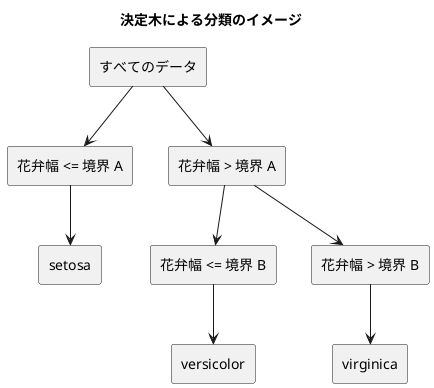

# 第 3 章: 決定木による分類と明白な実装

## 3.1 はじめに

第 1 章では「20 代ならきのこ派」というルールを人間が書き、第 2 章では欠損値を補完した特徴量を用意しました。この章では、「どの特徴量のどこで区切るか」をデータから自動で探すアルゴリズム、**決定木** を自作します。

ほかの言語版の多くは、ここで自作したあとに機械学習ライブラリの決定木と突き合わせます。**なでしこ3 版には突き合わせる相手がいません。** 機械学習のライブラリも行列の命令も無いからです（[ADR 015](../../../adr/015-nadesiko3-toolchain.md)）。[Haskell 版](../haskell/03-decision-tree-and-obvious-implementation.md)と同じく、**この章で作る木がそのまま最終実装になります**。

突き合わせる相手がいないぶん、数値の正しさは自分で保証します。第 2 章で乱数をそろえたので、Java 版・Elixir 版・PHP 版・Haskell 版の正解率と木の境界が、そのまま期待値として使えます。加えて第 2 章と同じく、**自作のアヤメ風データと Python の参照実装**でも突き合わせます。

なでしこ3 版では、次の 3 点に注目してください。

- 木を **「種別」を持つ辞書** で表す。[Haskell 版](../haskell/03-decision-tree-and-obvious-implementation.md)は `data Tree = Leaf Text | Branch Split Tree Tree` と型に書き、場合分けの漏れをコンパイラが止めました。なでしこ3 には型が無いので、`木["種別"]` を見て場合分けし、漏れはテストで捕まえます
- **同点のときにどちらを選ぶか**を、自分で決めて書く。辞書がキーを入れた順を保つこと、`表数値ソート` が安定であることを確かめてから使います
- **プログラムが黙って終わる落とし穴**。引数を `終了` と名付けたら、エラーも出さず終了コード 0 で止まりました。テストが「通った」ように見えるので、検査の仕組みで塞ぎます

## 3.2 決定木の仕組み

### データを 2 つに分けることを繰り返す

決定木は、データを「ある特徴量がある値以下か、より大きいか」で 2 つに分けることを繰り返します。分けた先で同じラベルばかりになったら、そこで分けるのをやめて、そのラベルを予測に使います。



### どこで分けるかをジニ不純度で決める

「よい分け方」とは、分けた後のそれぞれのグループで、ラベルがなるべく 1 種類にそろう分け方です。そろい具合を数値にしたものが **ジニ不純度** です。

ジニ不純度 = 1 − Σ（各ラベルの割合）²

| グループのラベル | 割合 | ジニ不純度 |
|----------------|------|-----------|
| setosa ×3 | setosa 1.0 | 1 − 1.0² = 0 |
| setosa ×1、virginica ×1 | 0.5、0.5 | 1 − (0.5² + 0.5²) = 0.5 |
| 3 品種 ×1 ずつ | 1/3 ずつ | 1 − 3 × (1/3)² = 2/3 |

ラベルが 1 種類にそろうと 0、混ざるほど大きくなります。分け方の候補ごとに、分けた後の左右のジニ不純度を件数で重み付けして平均し、最も小さくなる分け方を選びます。

## 3.3 TODO リストの作成

**TODO リスト**:

- [ ] ジニ不純度を計算する
- [ ] いちばん多いラベルを返す
  - [ ] 同数なら先に現れたラベルを返す
- [ ] 最良の分割を探す
  - [ ] ラベルを完全に分けられる境界を見つける
  - [ ] 複数の特徴量から最良の特徴量と境界を選ぶ
  - [ ] ラベルが 1 種類なら分割しない
- [ ] 決定木を学習して予測する
- [ ] 木の深さを制限する
- [ ] 学習した木を読める形で表示する
- [ ] 実データで深さと正解率の関係を表示する

ほかの言語版の TODO リストにあった「ライブラリの決定木と突き合わせる」が、なでしこ3 版にはありません。**代わりに、ほかの言語版の数値と、自作データでの参照実装と突き合わせます。**

## 3.4 ジニ不純度を計算する

テストから書きます。

```nako3
「ラベルが一種類なら零になる」で([「a」, 「a」, 「a」]のジニ不純度)と0が一致確認
「二種類が半々なら零点五になる」で([「a」, 「a」, 「b」, 「b」]のジニ不純度)と0.5が一致確認
「空なら零になる」で([]のジニ不純度)と0が一致確認
三種類差 = ([「a」, 「b」, 「c」]のジニ不純度) - 2 ÷ 3
「三種類が均等なら三分の二になる」で((三種類差の絶対値) < 0.000000000001)と真が一致確認
```

3 種類が均等な場合は、浮動小数点数の誤差があるので差の絶対値で比べます。テスト補助に許容誤差付きの比較をまだ作っていないので、「差が十分小さい」が真になることを確かめる形にしました。

ラベルの件数は、ラベルから件数への辞書で数えます。

```nako3
●(ラベル一覧の)ジニ不純度とは
    総数 = ラベル一覧の要素数
    もし、総数 = 0ならば
        0で戻る
    ここまで
    件数一覧 = ラベル一覧のラベル計数
    キー一覧 = 件数一覧のハッシュキー列挙
    二乗和 = 0
    Iを 0から (キー一覧の要素数) - 1まで繰り返す
        割合 = 件数一覧[キー一覧[I]] ÷ 総数
        二乗和 = 二乗和 + 割合 × 割合
    ここまで
    1 - 二乗和で戻る
ここまで
```

## 3.5 いちばん多いラベルを返す

```nako3
「多数派のラベルを返す」で([「a」, 「b」, 「a」]の多数決)と「a」が一致確認
「同数なら先に現れたほうを返す」で([「b」, 「a」, 「a」, 「b」]の多数決)と「b」が一致確認
```

「同数なら先に現れたほう」を選ぶには、**ラベルが最初に現れた順にたどる**必要があります。[Haskell 版](../haskell/03-decision-tree-and-obvious-implementation.md)では `Map` がキーの順に並ぶので、`nub` で現れた順を別に作りました。

なでしこ3 の辞書は第 2 章で確かめたとおり**キーを入れた順を保ちます**。`ハッシュキー列挙` もその順で返します。件数の辞書を作った時点で「最初に現れた順」になっているので、そのままたどり、**より多いときだけ入れ替えます**。

```nako3
●(ラベル一覧の)多数決とは
    もし、(ラベル一覧の要素数) = 0ならば
        「正解ラベルがありません」のエラー発生
    ここまで
    件数一覧 = ラベル一覧のラベル計数
    キー一覧 = 件数一覧のハッシュキー列挙
    最多 = キー一覧[0]
    Iを 1から (キー一覧の要素数) - 1まで繰り返す
        もし、件数一覧[キー一覧[I]] > 件数一覧[最多]ならば
            最多 = キー一覧[I]
        ここまで
    ここまで
    最多で戻る
ここまで
```

`>` を `≧` にすると、同数のときに後ろのラベルに入れ替わります。Haskell の `maximumBy` が同値で後ろを返したのと同じ誤りになるので、テストの「同数なら先に現れたほうを返す」が守ります。

## 3.6 最良の分割を探す

### 分割の候補を列挙する

1 つの列の値を小さい順に並べ、隣り合う値が違うところの中点を境界の候補にします。ここで示すのは最初に書いた素朴な形で、あとで命令数の上限に備えて数え上げに書き直しました（3.11 節）。

```nako3
●(特徴量一覧と正解一覧の列名で)分割候補列挙とは
    組一覧 = []
    Iを 0から (特徴量一覧の要素数) - 1まで繰り返す
        組一覧に[(特徴量一覧[I]の列名を特徴量値取得), 正解一覧[I]]を配列追加
    ここまで
    組一覧の0を表数値ソート
    ラベル順 = []
    Iを 0から (組一覧の要素数) - 1まで繰り返す
        ラベル順に組一覧[I][1]を配列追加
    ここまで
    候補一覧 = []
    Iを 1から (組一覧の要素数) - 1まで繰り返す
        前値 = 組一覧[I - 1][0]
        後値 = 組一覧[I][0]
        もし、前値 ≠ 後値ならば
            左側 = ラベル順の0からIまで部分配列取得
            右側 = ラベル順のIから(ラベル順の要素数)まで部分配列取得
            候補一覧に{"特徴量": 列名, "境界": (前値 + 後値) ÷ 2, "不純度": 左側と右側の重み付き不純度}を配列追加
        ここまで
    ここまで
    候補一覧で戻る
ここまで
```

並べ替えには `表数値ソート` を使います。使う前に処理系のソースで 2 つを確かめました。

| 確かめたこと | 結果 |
|------------|------|
| 同じ値の並びを保つか（安定か） | **保つ**（Go の `sort.SliceStable`）。同じ値のラベルが元の順のまま並ぶので、ジニ不純度で足し合わせる順も元の順になる |
| 元の表を書き換えるか | **書き換える**。ここでは関数の中で新しく作った `組一覧` を並べ替えているので問題ない |

### Red: 部分配列を取り出す関数で、プログラムが黙って終わる

ラベルの配列の一部を取り出す関数を、最初はこう書きました。

```nako3
●(配列の開始から終了まで)部分配列取得とは
    結果 = []
    Iを 開始から 終了 - 1まで繰り返す
        結果に配列[I]を配列追加
    ここまで
    結果で戻る
ここまで
```

テストを走らせると、**何も表示されず、終了コード 0 で終わりました。** テスト補助の「検査 N 件…」の行すら出ません。

```bash
./bin/gonako test/chapter03_test.nako3; echo "exit=$?"
```

```text
exit=0
```

テストファイルの行を前から順に削って走らせ、`最良分割探索` を呼んだところで止まることを突き止めました。さらに中の関数を 1 つずつ呼ぶと、`部分配列取得` を呼んだ瞬間に止まります。

原因は**引数の名前 `終了`** でした。なでしこ3 には**プロセスを終わらせる `終了` という命令**があり、`終了 - 1` と書いたところでその命令が実行されていました。エラーでも失敗でもなく「正常に終わった」ので、終了コードは 0 です。

引数の名前を `始点`・`終点` に変えると通ります。

```text
検査 28 件、失敗 0 件、保留 1 件
```

### 検査の仕組みで塞ぐ

これは名前を 1 つ直せば済む話ではありません。**テストファイルが途中で黙って終わると、`tools/check.sh` は終了コード 0 を見て「通った」と判定してしまいます。** 今回は出力が 1 行も無かったので気づけましたが、テストファイルの後半で起きれば、前半の「検査 N 件」の行が無いことに気づかないかもしれません。

そこで `check.sh` を、**各テストファイルが最後の `検査結果報告` の行まで届いたか**も確かめるように直しました。

```bash
  output="$("${GONAKO}" "${file}" 2>&1)"
  status=$?
  echo "${output}"
  if [ "${status}" -ne 0 ]; then
    failed=1
  # 終了コードが 0 でも、最後の「検査結果報告」まで届いていなければ失敗にする。
  elif ! grep -qE '^検査 [0-9]+ 件、失敗 0 件、保留 [0-9]+ 件$' <<< "${output}"; then
    echo "検査結果報告まで届かずに終わりました: ${file}" >&2
    failed=1
  fi
```

途中に `終了` を書いたテストファイルを置き、`check.sh` が終了コード 1 で落ちることを確かめました。

```text
検査結果報告まで届かずに終わりました: test/zz_early_exit_test.nako3
検査が失敗しました
```

[Haskell 版](../haskell/03-decision-tree-and-obvious-implementation.md)では、`Test.Hspec` の `fit` と自分の `fit` が名前でぶつかり、コンパイルが止まりました。なでしこ3 では同じ「名前の衝突」が、**止まらずに、しかも成功として**現れます。型の検査も名前の検査も無い言語では、「テストが最後まで走ったこと」自体を確かめる必要があります。

### 候補から最良を選ぶ

```nako3
●(特徴量一覧と正解一覧を列名一覧で)最良分割探索とは
    もし、(特徴量一覧の要素数) = 0ならば
        NULLで戻る
    ここまで
    もし、(正解一覧のジニ不純度) = 0ならば
        NULLで戻る
    ここまで
    最良 = NULL
    Iを 0から (列名一覧の要素数) - 1まで繰り返す
        候補一覧 = 特徴量一覧と正解一覧の(列名一覧[I])で分割候補列挙
        Jを 0から (候補一覧の要素数) - 1まで繰り返す
            候補 = 候補一覧[J]
            もし、最良 === NULLならば
                最良 = 候補
            違えば、もし、候補["不純度"] < 最良["不純度"]ならば
                最良 = 候補
            ここまで
        ここまで
    ここまで
    最良で戻る
ここまで
```

**`<` で比べるので、同じ不純度なら先に見つけた分割が残ります。** 列の順で前、同じ列なら境界の小さいほうです。「同じ不純度なら列の順で前の分割を選ぶ」を、列の順を入れ替えた 2 つのテストで確かめています。分けられないときは `NULL` を返し、比べるときは第 2 章で学んだ `===` を使います。

## 3.7 決定木を学習して予測する

### 木を辞書で表す

葉と節を、`種別` を持つ辞書で表します。

```nako3
葉 = {"種別": 「葉」, "ラベル": 「setosa」}
節 = {"種別": 「節」, "分割": {"特徴量": 「花弁幅」, "境界": 0.295, "不純度": 0}, "左": 葉, "右": 葉}
```

[Haskell 版](../haskell/03-decision-tree-and-obvious-implementation.md)の `data Tree = Leaf Text | Branch Split Tree Tree` と同じ形ですが、**「木は葉か節のどちらかである」ことはどこにも強制されていません。** `種別` を打ち間違えても、`左` を書き忘れても、動かすまで分かりません。[Elixir 版](../elixir/03-decision-tree-and-obvious-implementation.md)がマップの鍵で見分けたのと同じ立場で、守りはテストだけです。

### 学習

```nako3
●(特徴量一覧と正解一覧を列名一覧と深さ上限で)決定木学習とは
    …
    分割 = NULL
    もし、深さ上限 ≠ 0ならば
        分割 = 特徴量一覧と正解一覧を列名一覧で最良分割探索
    ここまで
    もし、分割 === NULLならば
        {"種別": 「葉」, "ラベル": 正解一覧の多数決}で戻る
    ここまで
    …（境界以下を左、より大きいものを右に分ける）
    次深さ = NULL
    もし、深さ上限 !== NULLならば
        次深さ = 深さ上限 - 1
    ここまで
    左木 = 左特徴量と左正解を列名一覧と次深さで決定木学習
    右木 = 右特徴量と右正解を列名一覧と次深さで決定木学習
    {"種別": 「節」, "分割": 分割, "左": 左木, "右": 右木}で戻る
ここまで
```

深さの上限が無いことは `NULL` で表します。[Haskell 版](../haskell/03-decision-tree-and-obvious-implementation.md)の `Maybe Int` の `Nothing` にあたります。

### 予測——`の間` の条件はかっこで囲む

予測は、葉に着くまで木をたどります。

```nako3
●(木で特徴量を)一件予測とは
    節 = 木
    (節["種別"] = 「節」)の間
        分割 = 節["分割"]
        もし、(特徴量の(分割["特徴量"])を特徴量値取得) ≦ 分割["境界"]ならば
            節 = 節["左"]
        違えば
            節 = 節["右"]
        ここまで
    ここまで
    節["ラベル"]で戻る
ここまで
```

繰り返しの条件を最初はかっこ無しで `節["種別"] = 「節」の間` と書き、**実行したときに「『while』はまだ実行に対応していません。」というエラーになりました**。文法の検査は通るのに、実行で初めて分かる形です。条件をかっこで囲むと動きます。

### 深さの制限

```nako3
四値 = 「幅」と[0.1, 0.4, 0.6, 0.9]の単列特徴量作成
「深さを制限すると分割の回数が減る」で((四値と[「a」, 「b」, 「c」, 「d」]を[「幅」]と1で決定木学習)の木深さ計測)と1が一致確認
「深さを制限しなければ分けきるまで分割する」で((四値と[「a」, 「b」, 「c」, 「d」]を[「幅」]とNULLで決定木学習)の木深さ計測)と3が一致確認
```

## 3.8 学習した木を表示する

```nako3
●(木を字下げで)決定木字下げ表示とは
    もし、木["種別"] = 「葉」ならば
        「{字下げ}{木["ラベル"]}{改行}」で戻る
    ここまで
    分割 = 木["分割"]
    列名 = 分割["特徴量"]
    境界表示 = (分割["境界"])を4で小数表示
    次字下げ = 字下げ & 「  」
    左表示 = (木["左"])を次字下げで決定木字下げ表示
    右表示 = (木["右"])を次字下げで決定木字下げ表示
    「{字下げ}{列名} <= {境界表示}{改行}{左表示}{字下げ}{列名} > {境界表示}{改行}{右表示}」で戻る
ここまで
```

境界の表示には第 1 章で自作した `小数表示` を使います。`0.295` が `0.2950` になります。

## 3.9 実データで深さと正解率を表示する

### 自作のデータと参照実装で突き合わせる

第 2 章と同じ自作のアヤメ風データで、Python で書いた参照実装（ジニ不純度・同点の扱い・境界の取り方を Haskell 版と同じ規則にしたもの）と、報告の文字列を比べました。

```text
深さ	訓練データ	テストデータ
1	0.6762	0.6000
2	0.9714	0.8667
3	1.0000	0.8667
4	1.0000	0.8667
5	1.0000	0.8667
制限なし	1.0000	0.8667

深さ 2 の決定木:
がく片幅 <= 0.3815
  花弁長さ <= 0.5425
    Iris-setosa
  花弁長さ > 0.5425
    Iris-versicolor
がく片幅 > 0.3815
  花弁幅 <= 0.6105
    Iris-versicolor
  花弁幅 > 0.6105
    Iris-virginica
```

**なでしこ3 版の出力と Python の参照実装の出力は、1 文字も違いませんでした。** これは自作のデータでの値で、実データの値ではありません。深さ 6 通りの学習と予測を含めて、実行は 0.45 秒でした。

### データが無ければ保留にする

実データのテストは、Java 版・Elixir 版・PHP 版・Haskell 版と同じ期待値で書き、データが無ければ保留にします。

```bash
./bin/gonako main.nako3 chapter03
```

期待する出力は次のとおりです。

```text
深さ	訓練データ	テストデータ
1	0.6762	0.6444
2	0.9333	0.9556
3	0.9524	0.9556
4	0.9619	0.9556
5	0.9810	0.9333
制限なし	1.0000	0.9333

深さ 2 の決定木:
花弁幅 <= 0.2950
  Iris-setosa
花弁幅 > 0.2950
  花弁幅 <= 0.6500
    Iris-versicolor
  花弁幅 > 0.6500
    Iris-virginica
```

!!! note "実データでの実測について"

    この章は学習データの無い環境で書いたため、上の表と木は**まだなでしこ3 版の実装で実測していません**。学習データを配置した環境で `npx gulp apps:check:nadesiko3` を実行し、保留が消えて通ることを確かめてから、この注記を外します。自作のアヤメ風データでは、Python の参照実装と報告が 1 文字も違わないことを確かめています。

深さ 2 までは訓練データ・テストデータの正解率がともに上がり、深さ 5 以降はテストデータの正解率が下がります。訓練データに合わせすぎる**過学習**です。

## 3.10 自作が最終実装になるということ

なでしこ3 版では、この章の決定木が第 8 章・第 10 章でもそのまま使われます。ライブラリと比べて「だいたい合っている」を確かめる道は最初からありません。代わりに次の 3 つで支えています。

| 支え | 確かめられること |
|------|----------------|
| 小さなテスト（28 件。3.11 節の書き直しのあとは、素朴な書き方との比較を足して 48 件） | 1 つ 1 つの関数の振る舞い（同点の扱い・境界の向き・深さ・エラー） |
| 自作データと参照実装 | 150 件規模で、報告の文字列が最後の桁まで一致すること |
| ほかの言語版の数値 | 実データでの正解率と木（データのある環境で確かめる） |

## 3.11 命令数の上限に備えて数え上げに書き直す

### 素朴な書き方の命令の数

第 10 章のランダムフォレストは、この章の決定木を 100 本作ります。そこで、**gonako が 1 回の実行で 2 億命令を超えると止まる**ことが分かりました（「実行した命令が多すぎます。終わらない繰り返しになっていませんか。」。処理系のソースの `MaxInstructions: 200_000_000` で、変えられません。詳しくは [第 10 章の 10.8 節](10-logistic-regression-and-ensemble.md)）。

処理系のソースの写しの上限を外し、実行した命令の数を表示するようにして数えると、自作のアヤメ風データ（150 行、訓練データ 105 行）で次のとおりでした。

| 実行 | 命令の数 |
|------|---------|
| `第3章実行`（深さ 6 通りの木と深さ 2 の木） | 約 858 万 |
| 第 10 章の森 100 本（深さの上限なし） | 約 5300 万 |

命令の大半は `分割候補列挙` でした。3.6 節の書き方は、**候補ごとに左右の部分配列を作り直し、ジニ不純度をはじめから数え直します。** 候補は値の種類の数だけあり、1 つの候補で全件をたどるので、命令の数が件数の 2 乗で増えます。

### 数え上げに書き直す

境界を左から右へ 1 つずつずらすと、左右の間を移るのは 1 件だけです。そこで、左右それぞれのラベルの件数を配列で持ち、1 件ずつ移しながら数え上げます。件数は整数なので、数え直しても数え上げても同じ値になります。

気をつけるのは **二乗を足す順** です。`ジニ不純度` は、ラベルを「その部分で最初に現れた順」に足します（3.4 節）。足す順が違うと最後の桁が変わり、同点だった分割の選び方が変わります（[第 10 章の 10.6 節](10-logistic-regression-and-ensemble.md)で、実際に選ばれる分割が変わる例を示しました）。

- **左の順**は、ラベルが左に初めて入った順です。初めて入ったときに `左順` の後ろに足します
- **右の順**は、右の部分で最初に現れた順です。右から左へ移るのはいつも右の先頭の 1 件なので、そのラベルは `右順` の先頭にあります。先頭から外し、そのラベルが次に現れる位置（先に後ろからたどって求めておく）の順に差し込み直します。もう現れなければ外したままにします

```nako3
    Iを 1から 件数 - 1まで繰り返す
        # I - 1 番目を右から左へ移す。
        番号 = 番号列[I - 1]
        もし、左件数[番号] = 0ならば
            左順に番号を配列追加
        ここまで
        左件数[番号] = 左件数[番号] + 1
        右件数[番号] = 右件数[番号] - 1
        # 移した要素は右側の先頭だったので、そのラベルは右の順の先頭にある。
        # 次に現れる位置へ並べ直す（もう現れなければ右の順から外す）。
        右順の0を配列削除
        次先頭 = 次位置[I - 1]
        右先頭[番号] = 次先頭
        もし、次先頭 < 件数ならば
            …（右先頭 が 次先頭 より大きい最初の位置に 番号 を 配列挿入）
        ここまで
        前値 = 組一覧[I - 1][0]
        後値 = 組一覧[I][0]
        もし、前値 ≠ 後値ならば
            右総数 = 件数 - I
            左不純度 = 左件数と左順とIの件数集計ジニ不純度
            右不純度 = 右件数と右順と右総数の件数集計ジニ不純度
            不純度 = (I × 左不純度 + 右総数 × 右不純度) ÷ (I + 右総数)
            候補一覧に{"特徴量": 列名, "境界": (前値 + 後値) ÷ 2, "不純度": 不純度}を配列追加
        ここまで
    ここまで
```

`件数集計ジニ不純度` は、件数の配列と足す順の番号を受け取り、`ジニ不純度` と同じ式（件数 ÷ 総数 の二乗を 0 から順に足し、1 から引く）で計算します。重み付き平均の式も `重み付き不純度` と同じ形のままです。

変数の名前を最初は `次` にしたら、「『ここまで』がありません」という文法エラーになりました。**`次` は変数の名前に使えません。** `次 = 1` の 1 行だけでも「『次』の使い方が間違っています」という文法エラーになり、構文の単語として読まれるようです。`次先頭` にしました。

### 素朴な書き方と丸ごと一致させる

3.6 節の書き方は、テストの中に `比較用素朴分割候補列挙`（とそれを使う `比較用素朴最良分割探索`・`比較用素朴決定木学習`）として残し、書き直した後と比べます。自作の乱数で、値の種類が少なく（同点が多く）ラベルが 4 種類のデータを 4 つ作り（20〜80 件）、列ごとの候補（境界と不純度）と、学習した木を丸ごと `一致確認` で比べます。

```nako3
「同点の多いデータ {S} で学習した木が素朴な書き方と丸ごと一致する」で(同点特徴量と同点正解を同点列とNULLで決定木学習)と(同点特徴量と同点正解を同点列とNULLで比較用素朴決定木学習)が一致確認
```

このテストが最後の桁の違いまで捕まえることを、**右の順を並べ直さない**（いつも全体で最初に現れた順に足す）ようにわざと崩して確かめました。件数は正しいので不純度は数学的には同じ値ですが、4 件の検査が落ちます。

### 書き直しの前と後

| 実行（自作のアヤメ風データ） | 書き直す前 | 書き直した後 |
|--------------------------|-----------|-------------|
| `第3章実行` | 約 858 万 | 約 179 万 |
| 第 10 章の森 100 本（深さの上限なし） | 約 5300 万 | 約 1500 万 |
| 第 10 章の森 100 本（深さ 2） | 約 4400 万 | 約 1050 万 |

報告の文字列は、書き直しの前後で 1 文字も変わらないことを、自作のアヤメ風データ 6 つ（重要度が参照実装の足す順で分かれるものを含む）で確かめました。

## 3.12 可視化について

Notebook による探索と可視化の節は設けません。[Python 版](../python/03-decision-tree-and-obvious-implementation.md) と [Kotlin 版](../kotlin/03-decision-tree-and-obvious-implementation.md) の可視化の節を参照してください。

## 3.13 まとめ

この章では、決定木を自作し、深さと正解率の関係を表示しました。なでしこ3 に固有の論点は次のとおりです。

1. **自作が最終実装になる** — ライブラリが無いので突き合わせる相手がいない。ほかの言語版の数値と、自作データでの参照実装で支える
2. **木を辞書で表す** — 「種別」で場合分けする。型が無いので、漏れはテストで捕まえる
3. **辞書はキーを入れた順を保つ** — 件数の辞書がそのまま「最初に現れた順」になり、多数決の同点の扱いを素直に書ける
4. **`表数値ソート` は安定で、元の表を書き換える** — ソースで確かめてから使った
5. **名前に `終了` を使うとプログラムが黙って終わる** — エラーも出ず終了コード 0。`check.sh` で「検査結果報告まで届いたか」を確かめるようにした
6. **`の間` の条件はかっこで囲む** — かっこが無いと、文法の検査は通るのに実行で「まだ実行に対応していません」になる
7. **上限なしを `NULL` で表す** — 比べるときは `===`・`!==` を使う
8. **命令数の上限（1 回の実行で 2 億）がある** — 候補ごとに数え直す書き方を、足す順を保ったまま数え上げに書き直し、命令を約 5 分の 1 にした。素朴な書き方はテストに残して、学習した木が丸ごと一致することを確かめ続ける

**TODO リスト（この章の完了時点）**:

- [x] ジニ不純度を計算する
- [x] いちばん多いラベルを返す
- [x] 最良の分割を探す
- [x] 決定木を学習して予測する
- [x] 木の深さを制限する
- [x] 学習した木を読める形で表示する
- [x] 実データで深さと正解率の関係を表示する（実データでの実測は未確認。3.9 の注記を参照）

次の章では、バージョン管理とデータ管理を扱います。

なでしこ3 版のほかの章は [なでしこ3 版のトップ](index.md) から辿れます。
