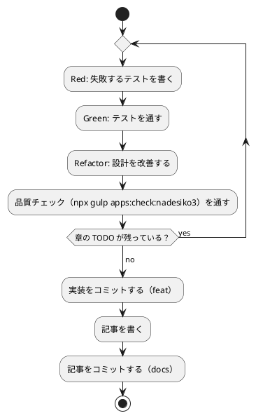

# 第 4 章: バージョン管理とデータ管理

## 4.1 はじめに

第 1 部では、TDD でデータを読み込み、前処理し、決定木で分類するプログラムをなでしこ3 で作りました。第 2 部では、そのプログラムを「変更を楽に安全にできる」状態に保つための道具立てを、バージョン管理（第 4 章）、パッケージ管理と静的解析（第 5 章）、タスクランナーと CI/CD（第 6 章）の順に整えます。

この章ではバージョン管理を扱います。機械学習のプロジェクトでは、コードに加えて **学習データ** と **学習済みモデル** というファイルが登場します。これらをコードと同じようにコミットしてよいとは限りません。

Git の使い方は言語に依存しないので、[Python 版の第 4 章](../python/04-version-control-and-data-management.md)・[Haskell 版の第 4 章](../haskell/04-version-control-and-data-management.md) と同じ構成で進めます。なでしこ3 版で注目するのは次の 3 点です。

- **処理系そのものを `bin/` に入れる**。ほかの言語版では処理系は Nix の環境が用意しましたが、なでしこ3 版は `gonako` を `go install` で `apps/nadesiko3/bin/` に入れます。これもコミットしません
- **改行を守る道具が 1 つもない**。`gonako` は CRLF のファイルをそのまま動かし、lint も通し、整形も CRLF のまま出力します。守りは `.gitattributes` だけです
- **再現性を守るテストが本当に効いているかを確かめる**。「偽と一致する」を確かめるテストは、式の読まれ方を間違えていても通ってしまうことがあります

## 4.2 コミットメッセージの重要性

コミット履歴は「なぜこの変更をしたのか」の記録です。機械学習のプロジェクトでは、「前処理を変えたら正解率が変わった」「ほかの言語版と数値が合わない原因をテストに残した」といった変化の理由を、あとから追跡できることが特に重要になります。

コミットは次の 2 つを守ると追いやすくなります。

- **1 コミット 1 目的** — 機能追加と設定変更、実装と記事を 1 つのコミットに混ぜない
- **なぜを書く** — 何をしたかは差分を見れば分かります。差分に残らないのは「なぜそうしたか」です

なでしこ3 版では、コードに残らない判断がいくつもありました。「処理系は Go 版の nadesiko3go を使う」「Nix の Go は 1.25.5 なので、`GOTOOLCHAIN` で 1.26 に切り替える」「テスティングフレームワークが無いのでテスト補助を自作する」。これらは [ADR 015](../../../adr/015-nadesiko3-toolchain.md) にまとめ、実装より先にコミットしています。

## 4.3 Conventional Commits

### フォーマット

```text
<type>(<scope>): <subject>

<body>

<footer>
```

- **type** — 変更の種類（`feat`・`fix`・`docs`・`refactor`・`test`・`build`・`ci`・`chore`）
- **scope** — 変更の対象（`nadesiko3`・`getting-start-ml` など）
- **subject** — 何をしたかを一行で

### コミットタイプ

| type | 使う場面 | なでしこ3 版での例 |
|------|---------|----------------|
| `feat` | 機能の追加 | 章の実装を足す |
| `fix` | 不具合の修正 | `0 = 「」` が真になり、値が 0 のセルを欠損値と数えていたのを直す |
| `docs` | ドキュメント | 記事を書く、ADR を足す |
| `refactor` | 振る舞いを変えない改善 | 重複した関数をまとめる |
| `test` | テストだけの変更 | 再現性のテストを足す |
| `build` | ビルドの設定・依存 | `tools/install-gonako.sh` の版を上げる |
| `ci` | CI の設定 | `.github/workflows/nadesiko3-ci.yml` を直す |

なでしこ3 版には外部のライブラリが 1 つも無いので、`build` の出番はほとんどありません。変わるとすれば処理系（`gonako`）の版だけです。

### 実践例

```text
feat(nadesiko3): 第 2〜3 章の乱数・前処理・決定木を実装する（B77）

- java.util.Random と同じ線形合同法を、状態と乗数を 24 ビットずつに分けて float64 の範囲で実装
- 0 = 「」 が真になるゆるい比較を避け、空欄の判定を === にする
- 名前を「終了」にすると黙って終わるため、check.sh で検査結果報告まで届いたかを確かめる
```

body に書いたのは、差分を見ても分からないことだけです。「なぜ 24 ビットに分けるのか」「なぜ `=` ではなく `===` なのか」「なぜ check.sh が出力を読むのか」。

## 4.4 何をコミットし、何をコミットしないか

Git に入れるのは、**人が書いたもの** と **再生成できないもの** です。

| 分類 | 例 | コミットするか |
|------|----|-------------|
| ソースコード | `src/`・`test/`・`tools/` の `.nako3`、`main.nako3` | する |
| 検査と導入のスクリプト | `tools/check.sh`・`tools/install-gonako.sh` | する |
| 記事・ADR | `docs/` の Markdown | する |
| 処理系 | `bin/gonako` | **しない**（`install-gonako.sh` で再生成できる） |
| 学習データ | `apps/data/` | **しない**（再配布できない） |
| 学習済みモデル | `model/` | しない（再生成できる） |

### 学習データ

本シリーズが使う学習データは書籍の購入者だけが使えるもので、**再配布できません**。リポジトリのルートの `.gitignore` で `apps/data/` を除外しています。

### なでしこ3 版に固有のファイル

`apps/nadesiko3/.gitignore` は 2 行だけです。

```text
# 処理系 gonako の入れ先（tools/install-gonako.sh）
bin/

# 学習済みモデルの保存先（第 15 章）
model/
```

**ビルドの成果物がありません。** なでしこ3 のプログラムはバイトコードの VM で直接動くので、Haskell 版の `dist-newstyle/`・Rust 版の `target/` にあたるものができません。カバレッジの計測結果（Haskell 版の `*.tix`）も、仕組みが無いのでできません。

代わりに除外するのが **`bin/` の処理系そのもの**です。32 MB ほどの実行ファイルで、`tools/install-gonako.sh` を実行すれば同じ版がいつでも作り直せます。

### 除外されていることを確かめる

`git check-ignore -v` で、どのファイルの何行目の規則で除外されたかが分かります。

```bash
git check-ignore -v apps/data/sukkiri-ml/KvsT.csv apps/nadesiko3/bin/ apps/nadesiko3/bin/gonako apps/nadesiko3/model/ tmp/sukkiri-ml-codes.zip
```

```text
.gitignore:8:apps/data/	apps/data/sukkiri-ml/KvsT.csv
apps/nadesiko3/.gitignore:2:bin/	apps/nadesiko3/bin/
apps/nadesiko3/.gitignore:2:bin/	apps/nadesiko3/bin/gonako
apps/nadesiko3/.gitignore:5:model/	apps/nadesiko3/model/
.gitignore:12:tmp/	tmp/sukkiri-ml-codes.zip
```

コミットするファイルは除外されていないことも確かめます。除外されていなければ何も表示されず、終了コードが 1 になります。

```bash
git check-ignore -v apps/nadesiko3/src/chapter01.nako3 apps/nadesiko3/tools/check.sh; echo "exit=$?"
```

```text
exit=1
```

### 改行を守るのは `.gitattributes` だけ

Windows で作業した人のコミットに CRLF が混ざると、差分が全行に出て読めなくなります。[Haskell 版](../haskell/04-version-control-and-data-management.md)では fourmolu が CRLF を指摘しました。`gonako` はどうかを確かめます。

```bash
printf 'A = 1\r\nもし、A = 1ならば\r\n    「x」を表示\r\nここまで\r\n' > crlf.nako3
./bin/gonako crlf.nako3; echo "run=$?"
./bin/gonako lint crlf.nako3; echo "lint=$?"
./bin/gonako format crlf.nako3 | diff -q crlf.nako3 - > /dev/null; echo "format差分=$?"
```

```text
x
run=0
crlf.nako3: 文法エラーはありません
lint=0
format差分=0
```

**3 つとも何も言いません。** 実行もでき、lint も通り、整形の結果も CRLF のまま（元のファイルと差分なし）です。`check.sh` の整形の検査は「`gonako format` の出力と元のファイルの差分」を見るので、CRLF のファイルはそのまま通ります。

| ファイル | なでしこ3 の道具が見るか | `.gitattributes` が守るか |
|---------|-----------------|------------------------|
| `src/`・`test/`・`tools/` の `.nako3` | **見ない**（CRLF のまま通す） | 守る |
| `tools/*.sh` | 見ない | 守る（`*.sh text eol=lf` でも守られる） |
| `.github/workflows/nadesiko3-ci.yml` | 見ない | `apps/nadesiko3/**` の外。YAML は別途 |

**改行については、道具の守りが 1 層もありません。** リポジトリのルートの `.gitattributes` に足した 1 行がすべてです。

```text
apps/nadesiko3/** text=auto eol=lf
```

`git ls-files --eol` で、いま入っているファイルがすべて LF であることを確かめられます。

```bash
git ls-files --eol apps/nadesiko3 | awk '{print $1, $2}' | sort | uniq -c
```

```text
     22 i/lf w/lf
```

## 4.5 データの入手手順をコードにする

データをコミットしない代わりに、**データの入手と配置の手順** をリポジトリに残します。配置と確認は Gulp のタスク（`ops/scripts/data.js`）で、全言語で同じものを使います。

```bash
npx gulp data:setup
npx gulp data:check
```

### プログラムからデータの場所を知る

なでしこ3 版では、`src/dataset.nako3` が学習データの場所を決めます。

```nako3
データ環境変数名 = 「ML_DATA_DIR」
既定データ場所 = 「../data/sukkiri-ml」

●(設定値の)データ場所決定とは
    もし、設定値 = 「」ならば
        既定データ場所で戻る
    ここまで
    設定値で戻る
ここまで

●(ファイル名の)データパス取得とは
    設定値 = データ環境変数名の環境変数取得
    (設定値のデータ場所決定)とファイル名のデータパス組立で戻る
ここまで
```

**環境変数を読むところ（`データパス取得`）と、値から場所を決めるところ（`データ場所決定`）を分けています。** 後者は文字列を受け取って文字列を返すだけなので、環境変数を書き換えずにテストできます。

```nako3
「環境変数が空なら既定の場所を使う」で(「」のデータ場所決定)と「../data/sukkiri-ml」が一致確認
「環境変数があればその場所を使う」で(「/tmp/ml」のデータ場所決定)と「/tmp/ml」が一致確認
```

なでしこ3 の `環境変数取得` は、設定されていない環境変数に対して**空文字列**を返します。[Haskell 版](../haskell/04-version-control-and-data-management.md)の `lookupEnv` が `Maybe String` で「無い」と「空」を区別したのに対し、なでしこ3 では区別できません。どちらも既定の場所を使うことにしています。

`設定値 = 「」` の比較は、第 2 章で見た「ゆるい比較」です。環境変数は必ず文字列なので、ここでは `0 = 「」` のような取り違えは起きません。

## 4.6 データが無い環境でもテストを通す

学習データはリポジトリに無いので、CI でも、データを持っていない読者の手元でも、データを使うテストはそのままでは落ちます。**データが無いときは「落ちる」のではなく「外す」**のが正しい振る舞いです。

なでしこ3 版では、テスト補助の `保留` を使います。

```nako3
もし、(「KvsT.csv」のデータ存在確認)ならば
    「ルールによる判定の正解率がほかの言語版と一致する」で(第1章実行)と「データ件数: 19{改行}ルールによる判定の正解率: 0.7368{改行}」が一致確認
違えば
    「ルールによる判定の正解率がほかの言語版と一致する」を「学習データがありません」で保留
ここまで
```

データが無い状態で走らせると、こう出ます。

```text
保留: ルールによる判定の正解率がほかの言語版と一致する（学習データがありません）
検査 14 件、失敗 0 件、保留 1 件
```

**保留の数が最後の行に出ます。** 外したことが黙って消えず、理由まで表示されます。これはテスト補助を自作したときに（第 1 章）、Hspec の `3 pending` にならって入れた仕組みです。

### スキップの仕組みは一段しかない

| 言語版 | 外す仕組み | 段数 |
|-------|----------|------|
| PHP 版 | `#[Group('data')]`（実行前に外す）＋ `markTestSkipped`（実行時に外す） | 2 |
| Haskell 版 | `pendingWith`（実行時に外す） | 1 |
| **なでしこ3 版** | **`もし` で分けて `保留`（実行時に外す）** | **1** |

Haskell 版と同じく一段です。そして、なでしこ3 版には一段であることの**別の弱さ**があります。

### 外した分岐は一度も実行されない

`違えば` の側に回った分岐の中身は、データの無い環境では**一度も実行されません**。第 1 章で見たとおり、なでしこ3 の lint はかっこの中の未定義の名前を素通りさせるので、**書き間違いが残っていても気づけません**。

そこで第 2 章からは、実データと同じ形の自作のデータを `ML_DATA_DIR` で指して走らせ、**落ちるのが「値の不一致」だけで、書き間違いによるエラーではないこと**を確かめています。

```bash
ML_DATA_DIR=/path/to/自作データ ./tools/check.sh
```

```text
失敗: 補完後の訓練データの平均がほかの言語版と一致する
  期待: 0.4215384615384616
  実際: 0.5052884615384615
```

期待値と違うのは、自作のデータだからです。大事なのは、`[文法エラー]` や `[実行時エラー]` で途中が止まらず、最後まで比べられていることです。

[Haskell 版](../haskell/04-version-control-and-data-management.md)は「外したぶんがカバレッジの数字に出る」ことを利点にしました。なでしこ3 版にはカバレッジの仕組みが無いので、この差は数字に出ません。第 5 章で作る「関数の網羅」の検査でも、**名前が現れるかを静的に見るだけ**なので、外した分岐の中の関数も「届く」と数えてしまいます。そのため、学習データが無くても報告を組み立てる関数を確かめられるよう、**自作の小さなデータで報告の関数を直接呼ぶテスト**を第 5 章で足しました。

## 4.7 実験を再現できるようにする

機械学習では「同じコードを動かしたのに結果が違う」ことが起きます。原因のほとんどは乱数です。

### 乱数のシード

[第 2 章](02-data-preprocessing-and-triangulation.md)で見たとおり、なでしこ3 版は `java.util.Random` と同じ 48 ビットの線形合同法を、24 ビットずつに分けて自作しています。なでしこ3 の `乱数` はシードを受け取らないので、**組み込みの乱数を使う限り、実験は再現できません**。

### 生成器は辞書で、書き換えて進む

なでしこ3 版の生成器は `{"上位": …, "下位": …}` の辞書で、`次整数` を呼ぶたびに辞書を書き換えて進みます。

```nako3
生成器 = 0の乱数生成器作成
A = 生成器と100の次整数
B = 生成器と100の次整数
```

[Haskell 版](../haskell/04-version-control-and-data-management.md)は状態を引数と戻り値で受け渡したので、「シードを設定し忘れると型が合わない」という守りがありました。なでしこ3 版には型がありませんが、**生成器はシードからしか作れない**ので、「シードを設定し忘れる」ことは起きません。一方で、**同じ生成器を別々の処理で共有すると、呼んだ順で並びが変わります**。並べ替えの関数（`並べ替え`）は呼ばれるたびにシードから生成器を作り直すので、ほかの処理の影響を受けません。

### テストで固定する

第 2 章の「ほかの言語版と同じ並び」のテストに加えて、この章で 3 本足しました。

```nako3
シード一並び = 100と1で20を整数列取得
シード二並び = 100と2で20を整数列取得
「シードが違えば並びが変わる」で((シード一並びをJSONエンコード) = (シード二並びをJSONエンコード))と偽が一致確認
```

```nako3
一回目分割 = 十件と十件ラベルを0.3と42で訓練テスト分割
二回目分割 = 十件と十件ラベルを0.3と42で訓練テスト分割
「同じシードなら何度分けても同じ分割になる」で一回目分割と二回目分割が一致確認
別シード分割 = 十件と十件ラベルを0.3と7で訓練テスト分割
「シードが違えば分割が変わる」で((一回目分割["訓練特徴量"])をJSONエンコード = ((別シード分割["訓練特徴量"])をJSONエンコード))と偽が一致確認
```

### 空振りしていないことを確かめる

この 3 本は、書いたときから通りました。すでにある振る舞いを守るテストなので当然です。ただし、**「偽と一致する」を確かめるテストは空振りしやすい**ものです。式の読まれ方を間違えて、比べたいものとは別の何かが偽になっていても、テストは通ってしまいます。第 1 章で見たとおり、なでしこ3 は助詞とかっこの位置で式の読まれ方が変わります。

そこで、**わざとシードを同じにしたら落ちること**を確かめました。

```text
失敗: シードが違えば分割が変わる
  期待: false
  実際: true
失敗: シードが違えば並びが変わる
  期待: false
  実際: true
```

シードを同じにすれば比較が真になり、テストが落ちます。つまり、このテストはちゃんと 2 つの並びを比べています。**通るテストを書いたら、それが落ちうることも一度は確かめる**——TDD の Red を飛ばしたテストには、この一手間が要ります。

### 仕様で決まっていること、決まっていないこと

| 事柄 | 根拠 | 確かさ |
|------|------|-------|
| 同じシードで同じ並びを返す | 生成器はシードからしか作らず、ほかに入力が無い | テストで確かめた |
| Java 版・Haskell 版などと同じ並びになる | ほかの言語版のテストの値、Python の参照実装と比べた | 手順を写し取ってそろえた結果 |
| 24 ビットに分けた計算が正確である | どの積も 2^53 未満に収まる（float64 で正確に表せる） | **IEEE 754 の倍精度という仕様に頼っている**。なでしこ3 の数値が float64 であることは `docs/differences.md` に書かれている |
| `XOR` が 32 ビットの符号付き整数で計算する | 実測（`2147483648と1のXOR` が負になる） | 実装に頼っている。初期化の XOR を 24 ビットずつにしたので、幅が変わっても 32 ビット以上なら影響しない |

## 4.8 TDD とコミットのタイミング



- テストが通らない状態ではコミットしない
- 実装と記事は別のコミットにする
- 学習データ・モデル・`bin/` がステージングされていないことを、コミットの前に `git status` で確かめる

なでしこ3 版では、CI の定義（`.github/workflows/nadesiko3-ci.yml`）と `apps:check:nadesiko3` タスクを、ウォーキングスケルトン（B76）のうちに入れています。品質チェックの仕組みは、守るコードが少ないうちに入れるほうが楽です。

## 4.9 まとめ

1. **Conventional Commits** — type と scope で、変更の種類と対象が分かるコミットメッセージを書く。コードに残らない判断（Go 版の処理系を使う、`GOTOOLCHAIN` で切り替える、テスト補助を自作する）は ADR にして、実装より前にコミットする。外部のライブラリが無いので `build` の出番は処理系の版を上げるときだけ
2. **コミットしないものを決める** — 再配布できない学習データと、再生成できる `bin/`（処理系）・`model/` を除外する。**ビルドの成果物もカバレッジの計測結果も無い**ので、`.gitignore` は 2 行で済む
3. **改行は `.gitattributes` だけが守る** — `gonako` は CRLF のファイルをそのまま実行し、lint も通し、整形も CRLF のまま出力する。道具の守りが 1 層も無い
4. **入手手順をコードにする** — データの場所は `ML_DATA_DIR` で差し替える。環境変数を読むところと、値から場所を決めるところを分け、後者をテストする。`環境変数取得` は設定が無いと空文字列を返し、「無い」と「空」を区別できない
5. **データが無くてもテストを通す** — `もし` で分けて `保留` にする一段構え。**外した分岐は一度も実行されず、lint も書き間違いを捕まえない**ので、自作のデータを `ML_DATA_DIR` で指して最後まで走ることを確かめる
6. **再現性** — 組み込みの `乱数` はシードを受け取らないので、自作の生成器を使う。生成器はシードからしか作れないのでシードの設定し忘れは起きないが、共有すると呼んだ順で並びが変わる
7. **通るテストが落ちうることを確かめる** — 「偽と一致する」テストは空振りしやすい。わざとシードを同じにして落ちることを確かめた

次の章では、依存と版の管理、`gonako lint` と `gonako format` の守備範囲、そして**カバレッジの仕組みが無い言語で、その代わりを自作する**ことを扱います。

なでしこ3 版のほかの章は [なでしこ3 版のトップ](index.md) から辿れます。
