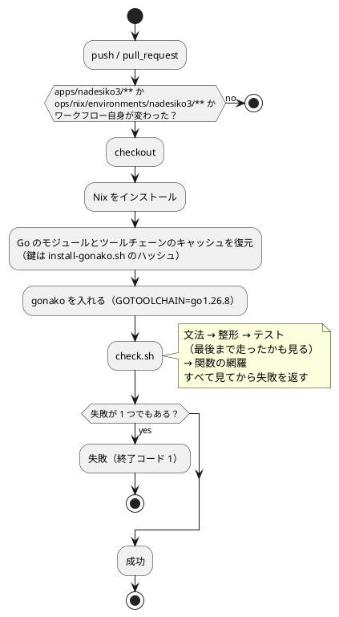

# 第 6 章: タスクランナーと CI/CD

## 6.1 はじめに

前の章で、文法・整形・テスト・テストが最後まで走ったか・関数の網羅という 5 つの検査を用意しました。この章では、それらを **いつでも・誰でも・同じように実行できる** 状態にします。

道具は 3 段に分かれます。

| 段 | 道具 | 受け持ち |
|----|------|---------|
| 言語の中 | `gonako` と `tools/check.sh` | 実行・文法・整形、5 つの検査のまとめ |
| リポジトリ | Gulp（`ops/scripts/`） | 言語をまたいだ作業、Nix への切り替え、学習データの配置 |
| 自動 | GitHub Actions | push のたびに同じ検査を走らせる |

なでしこ3 版の見どころは 3 つです。

- **まとめ役を自分で書いた**。`gonako` には検査をまとめる仕組みが無いので、`tools/check.sh` を書きました。その結果、[Haskell 版](../haskell/06-task-runner-and-ci-cd.md)と違って**検査の並びを書く場所が 1 箇所で済みます**
- **章の実行の終了コードは信用できる——ただし 1 つを除いて**。実行時エラーは終了コード 1 になります。Haskell 版の `cabal repl` のように例外で 0 になることはありません。ただし第 3 章で見た `終了` の落とし穴だけは 0 になります
- **Nix の環境だけでは閉じていない**。Go 1.26 のツールチェーンを、導入のたびにネットワークから取ってきます

## 6.2 タスクランナー — gonako と check.sh

### 使うコマンド

| コマンド | 内容 |
|---------|------|
| `./tools/install-gonako.sh` | 処理系を `bin/` に入れる |
| `./bin/gonako ファイル.nako3` | プログラムを実行する |
| `./bin/gonako lint ファイル.nako3` | 文法を検査する（1 ファイルずつ） |
| `./bin/gonako format ファイル.nako3 -f` | 整形して書き戻す |
| `./bin/gonako doc キーワード` | 命令を検索する（書式・説明・ソースの場所） |
| `./bin/gonako main.nako3 chapter01` | 章の処理を実行する |
| `./tools/check.sh` | 5 つの検査をまとめて行う |

`gonako doc` は、この版で最もよく使った命令です。命令の名前・書式（どの助詞で引数を受けるか）・説明に加えて、Go の実装のファイルと行まで表示します。

```bash
./bin/gonako doc 表数値ソート
```

```text
■ 表数値ソート (plugin_system / 二次元配列処理)
  書式: 【A】の【B】を表数値ソート
  …
  ソース: internal/stdlib/array.go:…
```

第 3 章で `表数値ソート` が安定かどうかを確かめたときも、第 5 章で `文字検索` の引数の数を確かめたときも、ここから辿りました。**書式の助詞が、そのまま引数の数と順番の説明になっています。**

### まとめ役を自分で書いた

`gonako` には、複数の検査に名前を付けてまとめる仕組みがありません。lint は 1 ファイルずつ、整形には検査のモードが無く、テストもファイルごとに実行して終了コードを見ます。そこで `tools/check.sh` にまとめました（第 5 章）。

その結果、**検査の並びを書く場所が 1 箇所になりました**。

| 言語版 | まとめ役 | 検査の並びを書く場所 |
|-------|--------|------------------|
| PHP 版 | `composer check` | `composer.json` だけ |
| Haskell 版 | 無し | Gulp と CI に二重 |
| **なでしこ3 版** | **`tools/check.sh`（自作）** | **`check.sh` だけ** |

Gulp も CI も `check.sh` を呼ぶだけです。検査を 1 つ足したとき（この Bolt の関数の網羅）も、書き換えたのは `check.sh` だけでした。

### 引き換えに失うもの

[Haskell 版](../haskell/06-task-runner-and-ci-cd.md)は、重複を受け入れる代わりに **CI の検査をステップに分けて**、GitHub の画面で「どこで落ちたか」が一目で分かるようにしました。なでしこ3 版の CI は `check.sh` を 1 ステップで呼ぶので、画面では「Lint, format and test」の 1 行が赤くなるだけです。

どこで落ちたかは、**出力の見出し**で読みます。

```text
== 文法（gonako lint）
== 整形（gonako format との差分）
整形されていません: src/number_format.nako3（./bin/gonako format src/number_format.nako3 -f で直せます）
== テスト
…
検査が失敗しました
```

`check.sh` は 1 つの検査が落ちても最後まで続け、すべての失敗を出してから終了コード 1 で終わります。**1 回の実行で、落ちたものを全部見られます。** `&&` でつないだ 1 行（Haskell 版）は最初の失敗で止まるので、整形を直したら次はテストが落ちていた、ということが起きます。

### 章の処理を実行する

章の処理は `main.nako3` から実行します。

```bash
./bin/gonako main.nako3 chapter03
```

`main.nako3` の中身は 1 行だけで、章の選び方はテストのある関数（`章選択実行`）に任せています（第 1 章）。

```nako3
!「./src/chapters.nako3」を取り込む

コマンドラインを章選択実行して継続表示
```

### 終了コードは信用できる——ただし 1 つを除いて

学習データの無い状態で章を実行します。

```bash
./bin/gonako main.nako3 chapter01; echo "exit=$?"
```

```text
[実行時エラー]main.nako3(…行目): ファイル『../data/sukkiri-ml/KvsT.csv』が見つかりません。
exit=1
```

**実行時エラーは終了コード 1 です。** [Haskell 版](../haskell/06-task-runner-and-ci-cd.md)では、`cabal repl` に式を流し込む実行が、例外で止まっても終了コード 0 になりました。なでしこ3 版は章の実行をそのままスクリプトや CI に書けます。

ただし、第 3 章で見たとおり、**名前を `終了` にするとプロセスが終了コード 0 で終わります**。エラーでも失敗でもなく「正常に終わった」扱いです。`check.sh` がテストの出力の最後の行（`検査 N 件、失敗 0 件、保留 N 件`）を読んで「最後まで走ったか」を確かめているのは、このためです。**終了コードだけでは足りない場面が 1 つある**ので、出力も見ます。

### 環境変数を渡す

学習データの置き場は `ML_DATA_DIR` で差し替えられます（第 4 章）。

```bash
ML_DATA_DIR=/path/to/data ./tools/check.sh
ML_DATA_DIR=/path/to/data ./bin/gonako main.nako3 chapter02
```

## 6.3 Notebook について

本シリーズのなでしこ3 版では Notebook を扱いません。探索と可視化は [Python 版](../python/index.md) と [Kotlin 版](../kotlin/index.md) を参照してください。なでしこ3 には `gonako-gui` という画面つきの開発用エディタがあり、プログラムを書いてその場で実行できますが、この版では使っていません。記事とコードを同期させるには、コマンドラインで実行して結果を写すほうが確かめやすいからです。

## 6.4 Nix の環境定義

`ops/nix/environments/nadesiko3/shell.nix` です。

```nix
{ packages ? import <nixpkgs> { } }:
let
  baseShell = import ../../shells/shell.nix { inherit packages; };
in
packages.mkShell {
  inputsFrom = [ baseShell ];
  buildInputs = with packages; [
    # なでしこ3 の処理系 gonako（nadesiko3go）は Go で書かれ、go install で入れる。
    # nadesiko3go は go 1.26.0 を要求するが、固定中の nixpkgs の go は 1.25.5
    # （go_1_26 は 1.26rc1）なので、apps/nadesiko3/tools/install-gonako.sh が
    # GOTOOLCHAIN で 1.26 系のツールチェーンに切り替える（ADR 015）。
    go
  ];

  shellHook = baseShell.shellHook + ''
    echo "Welcome to the nadesiko3 (gonako) development environment!"
    go version
  '';
}
```

**中身は `go` の 1 つだけです。** 整形も lint も処理系の中にあるので、[Haskell 版](../haskell/06-task-runner-and-ci-cd.md)のように整形と静的解析の道具を足す必要がありませんでした。

### 環境だけでは閉じていない

その代わり、この環境は **Nix だけでは閉じていません**。Nix が用意するのは Go 1.25.5 で、`install-gonako.sh` が `GOTOOLCHAIN=go1.26.8` で 1.26.8 のツールチェーンを**ネットワークから**取ってきます。nadesiko3go のソースも Go のモジュールのプロキシから取ります。

| 何を | どこから | 固定しているもの |
|------|--------|--------------|
| Go 1.25.5 | Nix（flake.lock） | nixpkgs のコミット |
| Go 1.26.8 のツールチェーン | Go のツールチェーンの配布 | `GOTOOLCHAIN=go1.26.8` |
| nadesiko3go のソース | Go のモジュールのプロキシ | 疑似版（コミットのハッシュ） |

どれも版は固定しているので、同じ手順なら同じものが入ります。ただし、**ネットワークに出られない環境では入れられません**。flake.lock を上げて Nix の Go を 1.26 にすれば閉じられますが、ほかの 14 言語版の環境まで一緒に変わるので、選びませんでした（[ADR 015](../../../adr/015-nadesiko3-toolchain.md)）。

## 6.5 check.sh と Gulp の分担

リポジトリ全体の作業を受け持つ Gulp のタスクに、なでしこ3 版を足してあります（`ops/scripts/apps.js`）。

```javascript
  {
    name: 'nadesiko3',
    nix: 'nadesiko3',
    dir: path.join('apps', 'nadesiko3'),
    // gonako は Go で入れる。Go 1.26 のツールチェーンへの切り替えはスクリプトの中で行う（ADR 015）
    tools: [{ cmd: 'go', version: 'go version' }],
    setup: './tools/install-gonako.sh',
    // CI（.github/workflows/nadesiko3-ci.yml）と同じ順に、文法・整形・テスト・関数の網羅を検査する
    check: './tools/check.sh',
  },
```

```bash
npx gulp apps:setup:nadesiko3
npx gulp apps:check:nadesiko3
```

手元に Go があれば手元で、無ければ `nix develop .#nadesiko3` の中で実行します。

| 役割 | `check.sh`（`apps/nadesiko3`） | Gulp（リポジトリのルート） |
|------|---------------------|------------------------|
| 何を知っているか | 検査の並び、ソースとテストの場所 | 言語ごとのアプリの場所・前提ツール・学習データの場所 |
| 品質チェックの中身 | **持つ** | 持たない（`check.sh` を呼ぶだけ） |
| 前提ツールが無いとき | `gonako` が無ければ導入を促して止まる | Nix の環境に切り替える |

[PHP 版](../php/06-task-runner-and-ci-cd.md)で `composer.json` が検査の中身を持ったのと同じ形です。**言語の道具にまとめ役が無ければ、自分で書けばよい**——ただし、そのスクリプト自体が検査されないコードになる点には注意が要ります。`check.sh` はシェルスクリプトなので、なでしこ3 の lint も整形も通りません。この章で、`check.sh` の 5 つの判定がそれぞれ本当に落ちるかを 1 つずつ確かめたのはそのためです。

## 6.6 5 つの検査が本当に効いていることを確かめる

設定を書いただけでは、本当に検査されているか分かりません。5 つを 1 つずつ壊し、`check.sh` が落ちることを確かめてから元に戻しました。

| 壊したもの | `check.sh` の出力 | 終了コード |
|-----------|-----------------|----------|
| `main.nako3` の関数名を打ち間違える（`章選択実効して`） | `[文法エラー]main.nako3(5行目): 未解決の単語があります: [単語『章選択実効』して]` | 1 |
| 関数定義のかっこを全角にする | `整形されていません: src/number_format.nako3` | 1 |
| テストの期待値を変える（`0.7500` → `0.75`） | `1 件の検査が失敗しました` | 1 |
| テストファイルの途中に `終了` を書く | `検査結果報告まで届かずに終わりました: test/number_format_test.nako3` | 1 |
| テストの無い関数を足す | `テストから届かない関数が 1 件あります` | 1 |

**終了コードはすべて 1 です。** [Haskell 版](../haskell/06-task-runner-and-ci-cd.md)の 100・1・1・3 のように「1 とは限らない」ことを気にする必要はありません。代わりに、**どの検査が落ちたかは終了コードからは分からない**ので、出力を読みます。

4 つめの「途中に `終了`」は、ほかの 4 つと性質が違います。テストファイルそのものは**終了コード 0 で終わっています**。`check.sh` が出力を読まなければ、この失敗は見えません。

## 6.7 GitHub Actions による CI

### ワークフロー設定

`.github/workflows/nadesiko3-ci.yml` です。

```yaml
name: Nadesiko3 CI

on:
  push:
    branches: [main, develop]
    paths:
      - "apps/nadesiko3/**"
      - ".github/workflows/nadesiko3-ci.yml"
      - "ops/nix/environments/nadesiko3/**"
      - "flake.nix"
      - "flake.lock"
  pull_request:
    branches: [main]
    paths:
      - "apps/nadesiko3/**"
      - ".github/workflows/nadesiko3-ci.yml"
      - "ops/nix/environments/nadesiko3/**"
      - "flake.nix"
      - "flake.lock"

permissions:
  contents: read

jobs:
  test:
    runs-on: ubuntu-latest

    steps:
      - name: Checkout the repository
        uses: actions/checkout@v4

      - name: Install Nix
        uses: cachix/install-nix-action@v30
        with:
          nix_path: nixpkgs=channel:nixos-unstable

      # gonako のソースと、GOTOOLCHAIN で取得する Go 1.26 のツールチェーンを保存する
      - name: Cache Go modules and toolchain
        uses: actions/cache@v4
        with:
          path: |
            ~/go/pkg/mod
            ~/.cache/go-build
          key: ${{ runner.os }}-nadesiko3-${{ hashFiles('apps/nadesiko3/tools/install-gonako.sh') }}
          restore-keys: |
            ${{ runner.os }}-nadesiko3-

      # タグ 3.8.8 の疑似版を、Go 1.26 のツールチェーンに切り替えて入れる（ADR 015）
      - name: Install gonako
        run: nix develop .#nadesiko3 --command bash -c "cd apps/nadesiko3 && ./tools/install-gonako.sh"

      # 学習データは再配布できないため CI には配置しない。実データのテストは保留になる
      - name: Lint, format and test
        run: nix develop .#nadesiko3 --command bash -c "cd apps/nadesiko3 && ./tools/check.sh"
```

### ワークフローのポイント

**キャッシュの鍵は `install-gonako.sh` のハッシュです。** 版を固定しているのはこのスクリプトの 2 行（疑似版と `GOTOOLCHAIN`）なので、版を上げればスクリプトが変わり、キャッシュが作り直されます。Go のツールチェーンもモジュールと同じ場所（`~/go/pkg/mod`）に置かれるので、1 つのキャッシュで両方を保存できます。

**依存が無いので、キャッシュの落とし穴が小さい。** [Haskell 版](../haskell/06-task-runner-and-ci-cd.md)では、ロックファイルが無いために「`*.cabal` が変わらないまま Hackage の側の版が動く」ことが弱点になりました。なでしこ3 版で動きうるのは処理系だけで、それは疑似版で固定しています。

**検査は 1 ステップです。** 6.2 節で見たとおり、どこで落ちたかは出力の見出しで読みます。

### まだ一度も走っていない

**この CI は、まだ一度も GitHub Actions の上で走っていません。** トリガーが `main`・`develop` への push と `main` への pull request なので、作業用のブランチに push しただけでは動かないからです。

手元では、同じ版の Go（1.25.5）から `GOTOOLCHAIN=go1.26.8` で `gonako` を入れられることと、`check.sh` がすべて通ることを確かめています。確かめていないのは、`nix develop .#nadesiko3` の中（Nix の Go は `GOTOOLCHAIN=local` が既定）でスクリプトの `GOTOOLCHAIN` が効くことと、GitHub Actions のランナーから Go のツールチェーンを取ってこられることです。**main への pull request を作ったときに、初めてこの 2 つが確かめられます。**

### CI パイプラインの流れ



## 6.8 三種の神器と CI

| 三種の神器 | 道具 | 本シリーズでの使い方 |
|-----------|------|------------------|
| バージョン管理 | Git、Conventional Commits、`.gitignore`、`.gitattributes` | 学習データ・`bin/`（処理系）・モデルをコミットしない。**改行は `.gitattributes` だけが守る** |
| テスティング | 自作のテスト補助、自作の関数の網羅 | 単体テストは自作の値、実データのテストは `データ存在確認` と `保留`。テストが最後まで走ったことも確かめる |
| 自動化 | `check.sh`、Gulp、GitHub Actions、Nix | 処理系の版の固定、品質チェックの一括実行、データの配置、CI |

### 利用可能なコマンド一覧

| コマンド | 内容 | 実行する場所 |
|---------|------|------------|
| `npx gulp data:setup` | 学習データを配置する | リポジトリのルート |
| `npx gulp data:check` | 学習データの配置を確認する | リポジトリのルート |
| `npx gulp apps:setup:nadesiko3` | 処理系を入れる | リポジトリのルート |
| `npx gulp apps:check:nadesiko3` | 品質チェックを実行する | リポジトリのルート |
| `nix develop .#nadesiko3` | なでしこ3 版の環境に入る | リポジトリのルート |
| `./tools/install-gonako.sh` | 処理系を `bin/` に入れる | `apps/nadesiko3` |
| `./tools/check.sh` | 5 つの検査をまとめて行う | `apps/nadesiko3` |
| `./bin/gonako test/chapter01_test.nako3` | テストを 1 ファイルだけ実行する | `apps/nadesiko3` |
| `./bin/gonako tools/function_coverage.nako3` | 関数の網羅だけを確かめる | `apps/nadesiko3` |
| `./bin/gonako format ファイル -f` | 整形して書き戻す | `apps/nadesiko3` |
| `./bin/gonako main.nako3 chapter01` | 章の処理を実行する（学習データが必要） | `apps/nadesiko3` |
| `./bin/gonako doc キーワード` | 命令の書式と説明を調べる | どこでも |

## 6.9 まとめ

1. **まとめ役を自分で書いた** — `gonako` に検査をまとめる仕組みが無いので `tools/check.sh` を書いた。Gulp と CI はそれを呼ぶだけで、**検査の並びを書く場所は 1 箇所**。検査を足しても書き換えるのは `check.sh` だけ
2. **1 回の実行で全部の失敗を見る** — `check.sh` は最後まで続けてから失敗を返す。その代わり CI は 1 ステップで、どこで落ちたかは出力の見出しで読む
3. **章の実行の終了コードは信用できる** — 実行時エラーは 1。Haskell 版の `cabal repl` と違って、章の実行をそのままスクリプトに書ける。**ただし `終了` だけは 0** なので、テストは出力の最後の行まで見る
4. **`gonako doc` が書式を教えてくれる** — 助詞がそのまま引数の数と順番の説明になる。命令の振る舞いを確かめるときは、ソースの場所まで辿れる
5. **Nix の環境は `go` の 1 つだけ** — 整形も lint も処理系の中にある。その代わり Go 1.26 のツールチェーンと処理系のソースをネットワークから取るので、**Nix だけでは閉じていない**
6. **5 つとも壊して確かめた** — 終了コードはすべて 1。4 つめ（途中の `終了`）だけは、テストファイルそのものが 0 で終わっていて、出力を読まなければ見えない
7. **CI はまだ一度も走っていない** — トリガーが main への push と pull request なので、作業用のブランチでは動かない。Nix の中で `GOTOOLCHAIN` が効くことと、ランナーからツールチェーンを取れることは、pull request を作って初めて確かめられる

第 2 部で、TDD を回し続けるための道具立てがそろいました。次の第 3 部では、回帰問題と、欠損値・カテゴリ値・外れ値を含む現実的なデータの前処理に取り組みます。第 7 章では、**正規方程式を解く連立一次方程式を自作します**。なでしこ3 版には行列の命令が無いので、シリーズで初めて線形代数から自作する章になります。

なでしこ3 版のほかの章は [なでしこ3 版のトップ](index.md) から辿れます。
