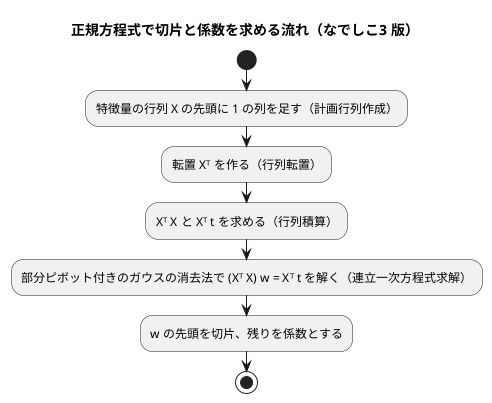

# 第 7 章: 線形回帰による数値予測

## 7.1 はじめに

第 1〜3 章では、グループを当てる **分類** を扱いました。この章からは、数値そのものを当てる **回帰** に進みます。題材は、映画の SNS での反響や主演俳優の露出度から、興行収入を予測する問題です。

この章では、最も基本的な回帰モデルである **線形回帰** を自作します。ほかの言語版でも、この章で初めて行列を扱いました。[Haskell 版](../haskell/07-linear-regression.md)はリストのリストで行列を表して連立方程式を自作し、突き合わせる相手として hmatrix を使いました。

**なでしこ3 には行列の命令がありません。** 二次元配列の行と列を入れ替える `表行列交換` はありますが、行列の積も、連立一次方程式を解く命令もありません（[ADR 015](../../../adr/015-nadesiko3-toolchain.md)）。そのため、**シリーズで初めて、線形代数そのものから自作する章**になります。

なでしこ3 版では、次の 3 点に注目してください。

- **行列の命令が無い言語で、正規方程式をどう組み立てて解くか。** 転置・積・連立一次方程式の 3 つを `src/linear_algebra.nako3` に自作し、第 9・12・13 章でも使えるようにします
- **float64 の計算で、ほかの言語版とどの桁まで一致するか。** 実データが手元に無いので、自作の映画風データと Python の参照実装で、どの桁まで一致するかを確かめます
- **「の」で呼ぶ命令が、直前の式全体にかかる。** 平均絶対誤差の計算で踏み、自作データの報告のテストで初めて表に出ました

Notebook による探索と可視化の節は設けません。散布図で外れ値を確かめる手順は [Python 版](../python/07-linear-regression.md) と [Kotlin 版](../kotlin/07-linear-regression.md) を参照してください。

## 7.2 線形回帰とは

### 特徴量の重み付きの和で予測する

線形回帰は、予測値を「切片」と「特徴量ごとの係数 × 特徴量」の和で表すモデルです。この章のデータに当てはめると次の式になります。

```text
予測値 = 切片 + 係数1 × SNS1 + 係数2 × SNS2 + 係数3 × actor + 係数4 × original
```

学習とは、訓練データに対して予測値と実測値のずれが最も小さくなるように、切片と係数を決めることです。ずれの大きさには「誤差の 2 乗の合計」を使います。これを最小にする方法を **最小二乗法** と呼びます。

### 正規方程式

特徴量を行列 `X`、実測値をベクトル `t`、切片と係数をまとめたベクトルを `w` とすると、誤差の 2 乗の合計を最小にする `w` は次の **正規方程式** を満たします。

```text
(Xᵀ X) w = Xᵀ t
```

`X` の先頭には、すべての値が 1 の列を足しておきます。この列にかかる係数が切片になります。



逆行列を作らずに連立方程式として解くのは、Python 版・Java 版・Clojure 版・Haskell 版と同じく、そのほうが数値計算の誤差が小さくなるためです。

## 7.3 題材とデータ

この章で使うのは `cinema.csv` です。100 本の映画について、次の 6 列が記録されています。

| 列 | 内容 | 欠損値 |
|----|------|-------|
| cinema_id | 映画の ID | なし |
| SNS1 | SNS での反響の数（1 つ目の指標） | 1 件 |
| SNS2 | SNS での反響の数（2 つ目の指標） | なし |
| actor | 主演俳優のメディア露出の指標 | 1 件 |
| original | 原作の有無（0 または 1） | なし |
| sales | 興行収入 | なし |

「SNS1」「SNS2」「actor」「original」が特徴量、「sales」が正解ラベル（予測したい数値）です。

```nako3
# 映画のデータの特徴量の列。cinema_id は映画を区別する番号なので使わない。
映画特徴量列 = [「SNS1」, 「SNS2」, 「actor」, 「original」]

# 映画のデータの正解ラベル（予測したい数値）の列。
映画目的列 = 「sales」
```

名前の頭に「映画」を付けているのは、第 7〜14 章を並行して書いているためです。取り込んだファイルの関数や変数は、ファイルをまたいで一意でなければならず、`特徴量列` のような一般的な名前はほかの章とぶつかります（[第 1 章](01-machine-learning-and-first-test.md)）。

## 7.4 TODO リストの作成

```text
TODO リスト（第 7 章）

- [ ] 残差・MAE・RMSE・決定係数を計算する
- [ ] 切片と係数を持つモデルを表す
- [ ] 行列を転置する
- [ ] 行列の積を求める
- [ ] 部分ピボット付きのガウスの消去法で連立一次方程式を解く
- [ ] 計画行列（先頭が 1 の列）を作る
- [ ] 正規方程式を解いて学習する
- [ ] 外れ値を取り除く
- [ ] 外れ値の除去・分割・補完を 1 つの手順にまとめる
- [ ] ほかの言語版の数値と、自作データでの参照実装と突き合わせる
- [ ] 実データで学習し、係数と評価指標を表示する
```

[Haskell 版](../haskell/07-linear-regression.md)の TODO リストに比べて、「行列を転置する」「行列の積を求める」が増え、「hmatrix の最小二乗解と突き合わせる」が「ほかの言語版の数値と、参照実装と突き合わせる」に置き換わっています。Haskell 版は `Data.List.transpose` と内包表記で行列の積を 1 行で書けましたが、なでしこ3 版ではどちらも繰り返しで書きます。

## 7.5 評価指標を計算する

### Red: 残差から始める

回帰の評価指標は、すべて「実測値と予測値の差（残差）」から作れます。まず残差から書きます。

```nako3
「残差は実測値から予測値を引いた値」で(([3, 5])と([1, 2])の回帰残差算出)と[2, 3]が一致確認
件数違い残差 = 関数()
    ([1])と([1, 2])の回帰残差算出
ここまで
「件数が違えば残差を求められない」で件数違い残差を「実測値と予測値の件数が違います: 1 と 2」でエラー確認
```

### Green

```nako3
●(実測一覧と予測一覧の)回帰残差算出とは
    もし、(実測一覧の要素数) ≠ (予測一覧の要素数)ならば
        「実測値と予測値の件数が違います: {実測一覧の要素数} と {予測一覧の要素数}」のエラー発生
    ここまで
    もし、(実測一覧の要素数) = 0ならば
        「実測値がありません」のエラー発生
    ここまで
    結果 = []
    Iを 0から (実測一覧の要素数) - 1まで繰り返す
        結果に(実測一覧[I] - 予測一覧[I])を配列追加
    ここまで
    結果で戻る
ここまで
```

RMSE は、二乗和を件数で割った値の平方根です。

```nako3
●(実測一覧と予測一覧の)二乗平均平方根誤差算出とは
    残差一覧 = 実測一覧と予測一覧の回帰残差算出
    ((残差一覧の二乗和算出) ÷ (残差一覧の要素数))の平方根で戻る
ここまで
```

### 決定係数は、割る前に確かめる

```nako3
「完全に当たれば決定係数は一」で(([1, 2, 3])と([1, 2, 3])の決定係数算出)と1が一致確認
「平均を答え続ければ決定係数は零」で(([1, 2, 3])と([2, 2, 2])の決定係数算出)と0が一致確認
同値決定係数 = 関数()
    ([2, 2])と([2, 2])の決定係数算出
ここまで
「実測値がすべて同じなら決定係数を求められない」で同値決定係数を「実測値がすべて同じ値なので決定係数を求められません」でエラー確認
```

決定係数は「平均との差の 2 乗の合計」で割るので、実測値がすべて同じだと 0 で割ることになります。**なでしこ3 は 0 で割っても止まりません。** `0 ÷ 0` は `NaN`、`1 ÷ 0` は `Infinity` になり、そのまま計算が進みます。[Haskell 版](../haskell/07-linear-regression.md)の `Double` と同じ性質なので、同じく割る前に確かめてエラーにします。

```nako3
    もし、偏差平方和 = 0ならば
        「実測値がすべて同じ値なので決定係数を求められません」のエラー発生
    ここまで
    1 - (残差一覧の二乗和算出) ÷ 偏差平方和で戻る
```

### 「の」で呼ぶ命令は、直前の式全体にかかる

平均絶対誤差は、残差の絶対値を足して件数で割ります。最初はこう書きました。

```nako3
    Iを 0から (残差一覧の要素数) - 1まで繰り返す
        総和 = 総和 + (残差一覧[I])の絶対値
    ここまで
```

小さなテスト（`[1, 2]` と `[3, 2]` で 1、同じ値なら 0）はすべて通りました。ところが、後で書いた自作の映画データの報告のテストで、**MAE だけが参照実装と合いません**でした。

```text
失敗: 自作のデータで係数と評価指標を報告する
  期待: "…テストデータの評価: R2=0.9426, MAE=152.39, RMSE=217.74\n"
  実際: "…テストデータの評価: R2=0.9426, MAE=95.74, RMSE=217.74\n"
```

原因は、`総和 + (残差一覧[I])の絶対値` の読まれ方です。**「の絶対値」は直前のかっこだけでなく、`総和 + (…)` という式全体にかかっていました。** つまり毎回 `(総和 + 残差)の絶対値` を計算していたのです。使い捨てのスクリプトで確かめると、次のようになりました。

| 書いた式 | 結果 | 読まれ方 |
|---------|------|---------|
| `1 + (0 - 3)の絶対値` | 2 | `(1 + (0 - 3))の絶対値` |
| `1 + ((0 - 3)の絶対値)` | 4 | 意図どおり |
| `10 - (4)の平方根` | 2.449489742783178 | `(10 - 4)の平方根` |
| `2 × (0 - 3)の絶対値` | 6 | `(2 × (0 - 3))の絶対値` |

小さなテストで気づかなかったのは、**残差がすべて 0 以上だったから**です。0 以上の値だけなら、足してから絶対値を取っても、絶対値を取ってから足しても同じです。そこで、符号の違う残差を含むテストを先に足して、落ちることを確かめてから直しました。

```nako3
「符号の違う誤差もそれぞれの絶対値で足す」で(([1, 0])と([0, 3])の平均絶対誤差算出)と2が一致確認
```

```text
失敗: 符号の違う誤差もそれぞれの絶対値で足す
  期待: 2
  実際: 1
```

直し方は、命令の呼び出しをかっこで囲むことです。

```nako3
        # 「総和 + (X)の絶対値」と書くと「(総和 + X)の絶対値」と読まれるので、かっこで囲む。
        総和 = 総和 + ((残差一覧[I])の絶対値)
```

第 1〜3 章で「`もし` の条件や繰り返しの範囲に命令を書くときはかっこで囲む」と学びましたが、**式の途中でも同じ**でした。文法の検査も通り、エラーも出ず、値だけが静かに違います。**数行のテストデータでは出ない誤りが、実データに近い量と形のデータで初めて表に出た**のは、第 2 章で `0 = 「」` を踏んだときと同じ構図です。

## 7.6 モデルを表す

### 列名と係数を別々の配列で持つ

モデルは辞書で表します。

```nako3
{"切片": 切片, "列名一覧": 列名複製, "係数一覧": 係数複製}
```

係数を `{"SNS1": 1.38, …}` という列名の辞書にもできますが、[Haskell 版](../haskell/07-linear-regression.md)と同じく、列名の配列と係数の配列を分けて持ちます。なでしこ3 の辞書はキーを入れた順を保つので、辞書でも表示の順は崩れません。それでも分けるのは、**「表示の順は列の順」という約束を、配列の順として見える形にしておきたい**からです。

作るときに数がそろっていることを確かめ、配列は複製します。配列は参照で渡るので、呼び出し元の配列を後から書き換えると、モデルの中身まで変わってしまいます。

```nako3
●(切片と列名一覧を係数一覧で)線形回帰モデル作成とは
    もし、(列名一覧の要素数) ≠ (係数一覧の要素数)ならば
        「列名と係数の数が違います: {列名一覧の要素数} と {係数一覧の要素数}」のエラー発生
    ここまで
    列名複製 = []
    係数複製 = []
    Iを 0から (列名一覧の要素数) - 1まで繰り返す
        列名複製に(列名一覧[I])を配列追加
        係数複製に(係数一覧[I])を配列追加
    ここまで
    {"切片": 切片, "列名一覧": 列名複製, "係数一覧": 係数複製}で戻る
ここまで
```

引数は `(切片と列名一覧を係数一覧で)` にしました。3 つの引数を `と` だけでつなぐ形は確かめていないので、助詞を変えて役割が読める形にしています。

### 列名で特徴量を読んで予測する

```nako3
「予測値は切片と係数の重み付きの和」で(二列モデルで([{"a": 10, "b": 100}])を線形回帰予測)と[321]が一致確認
「係数と特徴量は列名で対応させる」で(二列モデルで({"b": 100, "a": 10})を線形回帰一件予測)と321が一致確認
```

```nako3
●(モデルで特徴量を)線形回帰一件予測とは
    予測値 = モデル["切片"]
    列名一覧 = モデル["列名一覧"]
    Iを 0から (列名一覧の要素数) - 1まで繰り返す
        予測値 = 予測値 + モデル["係数一覧"][I] × (特徴量の(列名一覧[I])を回帰特徴量取得)
    ここまで
    予測値で戻る
ここまで
```

ここでも、`回帰特徴量取得` の呼び出しをかっこで囲んでいます。囲まなければ、7.5 節と同じく `予測値 + 係数 × 特徴量` 全体が引数に渡ってしまいます。

## 7.7 行列の命令が無い言語で連立一次方程式を解く

ここがこの章の中心です。正規方程式を解くには、転置・積・連立一次方程式の 3 つが要ります。第 9 章（多項式特徴量）・第 12 章（リッジ回帰）・第 13 章（主成分分析）でも使うので、章のファイルではなく `src/linear_algebra.nako3` にまとめます。

行列は「行の配列」の配列で表します。`[[1, 2, 3], [4, 5, 6]]` は 2 行 3 列です。

### 転置: `表行列交換` を使わない理由

なでしこ3 には転置の命令 `表行列交換` があります。使う前に、行の長さがそろっていない配列を渡してみました。

```text
[[1, 2], [3]] を表行列交換 → [[1,3],[2,""]]
[[1], [2, 3]] を表行列交換 → [[1,2],["",3]]
```

**足りないところを空文字列で埋めて、エラーにしません。** 行列の計算で空文字列が紛れ込むと、掛け算で `0` として扱われるのか `NaN` になるのか、使う場所ごとに確かめなければなりません。行列として扱う以上、行の長さがそろっていないのは誤りなので、確かめてからエラーにする転置を自作しました。

```nako3
「行と列を入れ替える」で(([[1, 2, 3], [4, 5, 6]])を行列転置)と[[1, 4], [2, 5], [3, 6]]が一致確認
長さ違い転置 = 関数()
    ([[1, 2], [3]])を行列転置
ここまで
「行の長さがそろわなければ転置できない」で長さ違い転置を「行列の行の長さがそろっていません」でエラー確認
```

### 積: 足す順を決めておく

```nako3
「行列の積を求める」で(([[1, 2], [3, 4]])と([[5, 6], [7, 8]])の行列積算)と[[19, 22], [43, 50]]が一致確認
大きさ違い積 = 関数()
    ([[1, 2], [3, 4]])と([[1], [2], [3]])の行列積算
ここまで
「左の列数と右の行数が違えば掛けられない」で大きさ違い積を「行列の大きさが合いません: 2×2 と 3×1」でエラー確認
```

```nako3
    結果 = []
    Iを 0から 左行数 - 1まで繰り返す
        新行 = []
        Jを 0から 右列数 - 1まで繰り返す
            総和 = 0
            Kを 0から 左列数 - 1まで繰り返す
                総和 = 総和 + 左行列[I][K] × 右転置[J][K]
            ここまで
            新行に総和を配列追加
        ここまで
        結果に新行を配列追加
    ここまで
```

右の行列を先に転置しておき、「左の行」と「右の列（転置した右の行）」を添字の小さいほうから順に掛けて足します。浮動小数点数の足し算は順番で最後の桁が変わるので、**足す順を決めておくことが、参照実装と最後の桁まで一致させる前提**になります（7.9 節）。

### 連立一次方程式: 部分ピボット付きのガウスの消去法

先にテストを書きます。

```nako3
「連立一次方程式を解く」で(([[2, 1], [1, 3]])と([5, 10])を連立一次方程式求解)と[1, 3]が一致確認
「左上が零でも行を入れ替えて解く」で(([[0, 1], [1, 0]])と([3, 2])を連立一次方程式求解)と[2, 3]が一致確認
「途中で軸が零になっても行を入れ替えて解く」で(([[1, 1, 1], [2, 2, 5], [4, 6, 8]])と([6, 21, 40])を連立一次方程式求解)と[1, 2, 3]が一致確認
「絶対値の最も大きい行を軸に選ぶ」で(([[0.00000000000000000001, 1], [1, 1]])と([1, 2])を連立一次方程式求解)と[1, 1]が一致確認
特異 = 関数()
    ([[1, 2], [2, 4]])と([1, 2])を連立一次方程式求解
ここまで
「特異行列は解けない」で特異を「解けません。特異行列です」でエラー確認
```

2〜4 つめが **部分ピボット選択** のテストです。

- 2 つめは、左上がちょうど 0 の場合です
- 3 つめは、1 列目を消した後に 2 行目の 2 列目が 0 になる場合です。最初の行だけ見ていると気づけません
- 4 つめは、左上が 0 ではないが極端に小さい場合です。そのまま軸にすると `1 - 10²⁰` のような桁落ちが起き、答えが `[0, 1]` になります

4 つのテストの答えは、どれも 2 のべき乗の分数だけで計算が進むように選んだので、`近似確認` ではなく `一致確認` で比べています。この理由は後で述べます。

実装は、**前進消去で上三角にしてから、後退代入で下の行から解を求める**形です。[Haskell 版](../haskell/07-linear-regression.md)は不変のリストで書くためにガウス・ジョルダン法（上も下も消す）を選びましたが、なでしこ3 の配列は書き換えられるので、Java 版・Clojure 版と同じガウスの消去法にしました。

```nako3
    # 前進消去。
    Kを 0から 件数 - 1まで繰り返す
        軸行 = K
        軸絶対値 = (拡大行列[K][K])の絶対値
        Iを K + 1から 件数 - 1まで繰り返す
            もし、((拡大行列[I][K])の絶対値) > 軸絶対値ならば
                軸行 = I
                軸絶対値 = (拡大行列[I][K])の絶対値
            ここまで
        ここまで
        もし、軸絶対値 < 特異判定閾値ならば
            「解けません。特異行列です」のエラー発生
        ここまで
        退避 = 拡大行列[K]
        拡大行列[K] = 拡大行列[軸行]
        拡大行列[軸行] = 退避
        Iを K + 1から 件数 - 1まで繰り返す
            倍率 = 拡大行列[I][K] ÷ 拡大行列[K][K]
            Jを Kから 件数まで繰り返す
                拡大行列[I][J] = 拡大行列[I][J] - 倍率 × 拡大行列[K][J]
            ここまで
        ここまで
    ここまで
    # 後退代入。
    解一覧 = []
    件数回
        解一覧に0を配列追加
    ここまで
    I = 件数 - 1
    (I ≧ 0)の間
        総和 = 拡大行列[I][件数]
        Jを I + 1から 件数 - 1まで繰り返す
            総和 = 総和 - 拡大行列[I][J] × 解一覧[J]
        ここまで
        解一覧[I] = 総和 ÷ 拡大行列[I][I]
        I = I - 1
    ここまで
    解一覧で戻る
```

なでしこ3 で書くうえで確かめたことが 4 つあります。

| 確かめたこと | 結果 | 書き方への影響 |
|------------|------|--------------|
| `Iを K + 1から 件数 - 1まで繰り返す` で、始めが終わりより大きいとき | **1 回も回らない**（逆向きには数えない） | 最後の段（`K = 件数 - 1`）の消去を場合分けせずに書ける |
| 逆向きの繰り返し | 上のとおり `繰り返す` では書けない | 後退代入は `(I ≧ 0)の間` で書く（条件はかっこで囲む） |
| 引数の行列を書き換えないか | 配列は参照で渡るので、そのまま消去すると呼び出し元が壊れる | 拡大係数行列を要素ごとに複製してから消去する。「解いても係数行列と定数は変わらない」のテストで守る |
| `最大値` という名前 | **組み込みの命令と衝突する**（「関数『最大値』に代入できません」） | `軸絶対値` にした |

`退避` を使った行の入れ替えは、行（内側の配列）への参照を入れ替えているだけで、要素は写していません。

特異行列の判定は、選んだ軸の絶対値が `0.000000000001`（10⁻¹²）より小さいときにしています。Haskell 版と同じ値です。

### テストが空振りしていないかを、壊して確かめる

部分ピボット選択のテストが本当に守っているかを確かめるため、軸の行を選ぶところを `軸行 = K`（入れ替えない）に書き換えて走らせました。

```text
失敗: 左上が零でも行を入れ替えて解く
  期待: [2,3]
  実際: [null,null]
失敗: 途中で軸が零になっても行を入れ替えて解く
  期待: [1,2,3]
  実際: [null,null,null]
失敗: 絶対値の最も大きい行を軸に選ぶ
  期待: [1,1]
  実際: [0,1]
検査 17 件、失敗 3 件、保留 0 件
```

3 つとも落ちます。`null` は、0 で割って `NaN` や `Infinity` になった値を JSON にしたものです。

### `近似確認` は NaN を通してしまう

実は最初、3 つめの「途中で軸が零になっても」のテストは `近似確認`（許容誤差つきの比較）で書いていました。そして上の書き換えで**落ちませんでした**。

テスト補助の `近似確認` は、「差の絶対値が誤差より大きければ失敗」と判定します。**`NaN` との比較はいつも偽になる**ので、差が `NaN` のときは「誤差より大きい」が偽になり、合格してしまいます。使い捨てのスクリプトで確かめました。

```nako3
非数 = 0 ÷ 0
「非数は近似しない」で非数と1を0.001で近似確認
「非数配列」で[非数, 非数]と[1, 2]を0.001で近似確認
検査結果報告
```

```text
検査 2 件、失敗 0 件、保留 0 件
```

2 件とも「合格」です。**0 で割っても止まらない言語で、許容誤差つきの比較を「大きければ失敗」と書くと、壊れた計算ほど通ってしまいます。** 判定を「差が誤差以下なら合格」に反転すれば `NaN` は不合格になりますが、テスト補助はほかの章と共有しているので、この章では直さず、答えが正確に表せるテストを `一致確認` で書くことにしました。浮動小数点数の誤差が避けられない学習のテストでは、`近似確認` のあとに参照実装の値との `一致確認` を並べています（7.8 節）。

## 7.8 正規方程式を解いて学習する

### 計画行列

```nako3
「先頭に一の列を足す」で(([{"a": 2, "b": 3}])と([「a」, 「b」])の計画行列作成)と[[1, 2, 3]]が一致確認
```

### Red: 答えの分かっているデータ

切片 1、係数 2 と -3 になるデータで確かめます。

```nako3
四角特徴量 = [{"a": 1, "b": 0}, {"a": 0, "b": 1}, {"a": 1, "b": 1}]
四角実測 = [3, -2, 0]
四角モデル = 四角特徴量と四角実測を[「a」, 「b」]で線形回帰学習
「答えの分かっているデータで切片と係数を求める」で([四角モデル["切片"], 四角モデル["係数一覧"][0], 四角モデル["係数一覧"][1]])と[1, 2, -3]を0.000000001で近似確認
「参照実装と最後の桁まで一致する」で([四角モデル["切片"], 四角モデル["係数一覧"][0], 四角モデル["係数一覧"][1]])と[0.9999999999999991, 2.0000000000000004, -2.999999999999999]が一致確認
```

1 つめは「答えに近い」ことを、2 つめは「Python の参照実装と最後の桁まで同じ」ことを確かめます。答えは `[1, 2, -3]` なのに、計算結果は `0.9999999999999991` のように最後の桁がずれます。Haskell 版の同じテストでも係数が `2.000000000000001` になったと記録されています。2 つめがあるので、1 つめが `NaN` を通してしまっても誤りは見逃しません。

列が一次従属（`b` が `a` のちょうど 2 倍）なら、正規方程式の行列が特異になり、学習できません。

```nako3
共線学習 = 関数()
    [{"a": 1, "b": 2}, {"a": 2, "b": 4}, {"a": 3, "b": 6}]と[1, 2, 3]を[「a」, 「b」]で線形回帰学習
ここまで
「列が一次従属なら学習できない」で共線学習を「解けません。特異行列です」でエラー確認
```

### Green: 学習

```nako3
●(特徴量一覧と実測一覧を列名一覧で)線形回帰学習とは
    もし、(特徴量一覧の要素数) = 0ならば
        「訓練データが空です」のエラー発生
    ここまで
    もし、(特徴量一覧の要素数) ≠ (実測一覧の要素数)ならば
        「特徴量と実測値の件数が違います: {特徴量一覧の要素数} と {実測一覧の要素数}」のエラー発生
    ここまで
    計画行列 = 特徴量一覧と列名一覧の計画行列作成
    転置行列 = 計画行列を行列転置
    正規行列 = 転置行列と計画行列の行列積算
    # Xᵀ t は、t を 1 列の行列にして掛ける。
    実測列 = []
    Iを 0から (実測一覧の要素数) - 1まで繰り返す
        実測列に[実測一覧[I]]を配列追加
    ここまで
    右辺行列 = 転置行列と実測列の行列積算
    右辺一覧 = []
    Iを 0から (右辺行列の要素数) - 1まで繰り返す
        右辺一覧に(右辺行列[I][0])を配列追加
    ここまで
    重み一覧 = 正規行列と右辺一覧を連立一次方程式求解
    係数一覧 = []
    Iを 1から (重み一覧の要素数) - 1まで繰り返す
        係数一覧に(重み一覧[I])を配列追加
    ここまで
    (重み一覧[0])と列名一覧を係数一覧で線形回帰モデル作成して戻る
ここまで
```

**正規方程式の組み立てが、そのまま 3 行の文になっています。** `計画行列を行列転置`、`転置行列と計画行列の行列積算`、`正規行列と右辺一覧を連立一次方程式求解` です。[Haskell 版](../haskell/07-linear-regression.md)の `[[sum (zipWith (*) r c) | c <- transpose design] | r <- transposed]` は 1 行で行列の積を書いていましたが、なでしこ3 版は積の中身を `linear_algebra.nako3` に押し込み、章のコードには「何を掛けるか」だけを残しました。

`Xᵀ t` のために行列とベクトルの積を別に作らず、`t` を 1 列の行列にして `行列積算` に渡しています。関数を 3 つに絞ると、第 9・12・13 章で名前がぶつかる心配も減ります。

## 7.9 ほかの言語版の数値と突き合わせる

ほかの言語版では、この節で自作の実装とライブラリ（NumPy・hmatrix・MathPHP など）を突き合わせました。**なでしこ3 版には突き合わせるライブラリがありません。** 代わりに、次の 3 つで数値を支えます。

1. 実データでの、ほかの言語版の数値（データのある環境で確かめる）
2. 実データと同じ形の自作データでの、Python の参照実装との一致
3. 同じ自作データでの、有理数で解いた厳密解との差

### 自作の映画風データと参照実装

学習データはこの環境に無いので、実データと同じ形の「映画風」のデータを作りました。列名・行数（100 行）・欠損の数（SNS1 と actor に 1 か所ずつ）・外れ値（SNS2 が 1000 を超え、興行収入が 8500 未満の行が 1 行）・値の範囲をそろえた架空のデータで、配布データではありません。

参照実装は Python で書きました。Haskell 版と同じ規則（外れ値の条件、分割の割合とシード、訓練データの平均での補完）に、`java.util.Random` と同じ 48 ビットの線形合同法、**なでしこ3 版と同じ演算の順**（行列の積を添字の小さいほうから足す、ガウスの消去法と後退代入、予測値は切片に列の順に足す）をそろえたものです。小数の表示も、なでしこ3 の `小数点四捨五入`（処理系のソースで `floor(x × 10^桁 + 0.5) ÷ 10^桁` と確かめた）と同じ丸め方にしました。

結果は次のとおりです。

```text
データ件数: 100
外れ値を除いた件数: 99
訓練データ: 79 件, テストデータ: 20 件
切片: 6001.96
係数: SNS1=1.0300, SNS2=0.5306, actor=0.2685, original=218.6013
テストデータの評価: R2=0.7262, MAE=309.97, RMSE=389.71
```

**なでしこ3 版と参照実装の報告は 1 文字も違いませんでした。** 表示の桁だけでなく、完全な精度でも一致しています。

| 項目 | なでしこ3 版 | Python の参照実装 |
|------|------------|-----------------|
| 切片 | 6001.956737839474 | 6001.956737839474 |
| SNS1 | 1.0299812412149052 | 1.0299812412149052 |
| SNS2 | 0.5305602012895705 | 0.5305602012895705 |
| actor | 0.2684855754352902 | 0.2684855754352902 |
| original | 218.60130867888526 | 218.60130867888526 |
| R² | 0.7262304950633853 | 0.7262304950633853 |
| MAE | 309.9744687291935 | 309.9744687291935 |
| RMSE | 389.71048114123073 | 389.71048114123073 |

なでしこ3 の数値は float64 で、四則演算は IEEE 754 のとおりに丸められます。同じ値に同じ順で同じ演算をすれば、言語が違っても同じビット列になります。**最後の桁まで一致したのは、演算の順をそろえたから**です。なでしこ3 の数値を文字列にすると、Python の `repr` と同じく「元の値に戻せる最も短い表記」になるので、表示された桁を比べれば完全な精度の比較になります。

学習・予測・報告まで含めて、実行は 0.23 秒でした。

### 解き方が違うと、どの桁まで一致するか

では、ほかの言語版とはどの桁まで一致するでしょうか。Haskell 版はガウス・ジョルダン法、PHP 版は LU 分解と、**言語版ごとに解き方が違います**。同じ自作データで、解き方だけを変えて比べました。基準には、訓練データの値（float64 で読んだ値）から正規方程式を**有理数で正確に**組み立てて解いた厳密解を使います。

| 解き方 | 切片 | 厳密解との相対誤差 |
|-------|------|-----------------|
| 厳密解（有理数） | 6001.956737839486 | — |
| ガウスの消去法（なでしこ3 版） | 6001.956737839474 | 2.0e-15 |
| ガウス・ジョルダン法（Haskell 版と同じ手順） | 6001.956737839441 | 7.4e-15 |

| 列 | ガウスの消去法（なでしこ3 版） | ガウス・ジョルダン法 | 厳密解 |
|----|--------------------------|------------------|-------|
| SNS1 | 1.0299812412149052（8.6e-15） | 1.029981241214903（1.1e-14） | 1.029981241214914 |
| SNS2 | 0.5305602012895705（8.9e-15） | 0.5305602012895718（7.5e-15） | 0.5305602012895794 |
| actor | 0.2684855754352902（2.2e-15） | 0.2684855754352936（5.6e-15） | 0.268485575435288 |
| original | 218.60130867888526（9.2e-15） | 218.601308678888（3.3e-15） | 218.60130867888728 |

かっこの中は厳密解との相対誤差です。読み取れることが 2 つあります。

1. **解き方が違えば、最後の 2〜3 桁は違う。** ガウスの消去法とガウス・ジョルダン法は、同じ正規方程式を解いているのに、切片の 14 桁目から先が違います。**「ほかの言語版と一致した」と書くときは、何桁までの一致かを書く必要がある**ということです
2. **どちらが厳密解に近いかは、列によって違う。** 切片・SNS1・actor はガウスの消去法、SNS2・original はガウス・ジョルダン法のほうが近い。どちらかが常に正確というわけではありません

[Haskell 版](../haskell/07-linear-regression.md)は実データで、自作のガウス・ジョルダン法と hmatrix の最小二乗解（DGELSS・DGELS）が 12 桁まで一致したと記録しています。自作データでの 2 つの消去法の差（13〜14 桁目から）は、それと矛盾しません。そこで実データのテストでは、Haskell 版の完全な精度の値（切片 6114.5955056944080 など）と **差が 10⁻⁸ 以内**であることを確かめます。切片なら 12 桁、`original` の係数なら 10 桁ほどの一致にあたります。

```nako3
    「切片と係数が Haskell 版の完全な精度の値と 1e-8 以内で一致する」で([実モデル["切片"], 実モデル["係数一覧"][0], 実モデル["係数一覧"][1], 実モデル["係数一覧"][2], 実モデル["係数一覧"][3]])と[6114.595505694408, 1.3803702543274192, 0.521779747645556, 0.290005103272041, 208.88268148822988]を0.00000001で近似確認
```

## 7.10 外れ値の除去・分割・補完をまとめる

### 外れ値を取り除く

```nako3
●(行の)映画外れ値判定とは
    反響 = 行の「SNS2」を欠損許容数値取得
    収入 = 行の映画目的列を欠損許容数値取得
    もし、(反響 === NULL)または(収入 === NULL)ならば
        偽で戻る
    ここまで
    もし、(反響 > 映画外れ値反響下限)かつ(収入 < 映画外れ値収入上限)ならば
        真で戻る
    ここまで
    偽で戻る
ここまで
```

空欄は `欠損許容数値取得`（[第 2 章](02-data-preprocessing-and-triangulation.md)）が `NULL` にします。**`NULL` と数を `>` で比べたときにどうなるかに頼らず、先に `===` で分けて「値が無ければ外れ値ではない」と書きました。** [Haskell 版](../haskell/07-linear-regression.md)が `maybe False` で決めたことを、なでしこ3 版では場合分けで書いています。

```nako3
「境界の値は外れ値ではない」で(({"SNS2": 1000, "sales": 100})の映画外れ値判定)と偽が一致確認
「SNS2 が空欄なら外れ値ではない」で(({"SNS2": 「」, "sales": 100})の映画外れ値判定)と偽が一致確認
```

### 前処理を 1 つの関数にまとめる

```nako3
●(CSV文字列を割合とシードで)映画前処理とは
    読込表 = CSV文字列を表読込
    除去表 = 読込表の映画外れ値除去
    分離結果 = 除去表と映画目的列の目的列分離
    分割結果 = (分離結果["行一覧"])と(分離結果["正解ラベル"])を割合とシードで訓練テスト分割
    平均一覧 = (分割結果["訓練特徴量"])と映画特徴量列の列平均算出
    分割結果["訓練特徴量"] = (分割結果["訓練特徴量"])と映画特徴量列を平均一覧で欠損補完
    分割結果["テスト特徴量"] = (分割結果["テスト特徴量"])と映画特徴量列を平均一覧で欠損補完
    分割結果で戻る
ここまで
```

順番が重要です。**外れ値を除いてから分割し、訓練データだけから平均を求めて、両方を補完します。** テストデータの平均を補完に混ぜると、テストデータの情報が訓練に漏れます。`表読込`・`目的列分離`・`訓練テスト分割`・`列平均算出`・`欠損補完` は、[第 2 章](02-data-preprocessing-and-triangulation.md)で作ったものを書き換えずに取り込んでいます。

`訓練テスト分割` は正解ラベルを受け取るだけで、ラベルが文字列か数かは問いません。`表読込` は数字だけのセルを数にするので、sales の列は数のまま分割されます。学習の前に `映画目的値変換` で、数として読めることを確かめてから使います。

## 7.11 実データで学習・評価する

### 結果を表示する

```bash
./bin/gonako main.nako3 chapter07
```

期待する出力は次のとおりです。[Haskell 版](../haskell/07-linear-regression.md)の報告から hmatrix の行を除いたもので、数値は Java 版・Scala 版・Clojure 版・Elixir 版・PHP 版・Haskell 版の第 7 章と同じです。

```text
データ件数: 100
外れ値を除いた件数: 99
訓練データ: 79 件, テストデータ: 20 件
切片: 6114.60
係数: SNS1=1.3804, SNS2=0.5218, actor=0.2900, original=208.8827
テストデータの評価: R2=0.6184, MAE=302.20, RMSE=376.14
```

!!! note "実データでの実測について"

    この章は学習データの無い環境で書いたため、上の出力は**まだなでしこ3 版の実装で実測していません**。学習データを配置した環境で `npx gulp apps:check:nadesiko3` を実行し、保留が消えて通ることを確かめてから、この注記を外します。実データと同じ形の自作の映画風データでは、報告の文字列と、完全な精度の切片・係数・評価指標が Python の参照実装と最後の桁まで一致することを確かめています（7.9 節）。また、自作データを `ML_DATA_DIR` で指して検査を走らせ、実データの分岐が書き間違いのエラーで止まらず、値の不一致だけで落ちることを確かめました（分割の件数 79 件・20 件の検査は通ります）。

一致する見込みの理由は 2 つです。

1. **分割が同じ** — [第 2 章](02-data-preprocessing-and-triangulation.md)で `java.util.Random` と同じ線形合同法を自作し、同じシードなら同じ行が同じ側に入ることを、Java 版・Elixir 版・PHP 版・Haskell 版と同じ並びで確かめています
2. **float64 で計算している** — なでしこ3 の数値は float64 だけです。表示の桁（小数第 2 位・第 4 位）は、7.9 節で見た解き方による差（13〜14 桁目から）よりずっと上にあります

### 係数を読む

係数は「その特徴量が 1 増えたとき、ほかの特徴量が同じなら、予測値がどれだけ増えるか」を表します。

- `original=208.8827`: 原作がある映画は、ない映画より興行収入の予測が約 209 大きい
- `SNS1=1.3804`・`SNS2=0.5218`: SNS での反響が 1 増えるごとに、予測が約 1.38・約 0.52 大きくなる
- `actor=0.2900`: 主演俳優の露出の指標が 1 増えるごとに、予測が約 0.29 大きくなる

係数の大きさは、特徴量の単位に左右されます。この 4 列は桁が大きく違うので、係数の大小をそのまま「影響の大きさ」と読むことはできません。影響の大きさを比べるには、標準化してから学習します。標準化は第 9 章で扱います。

### 評価指標を読む

テストデータの決定係数 0.6184 は、興行収入のばらつきのうち約 62% をこのモデルで説明できているという意味です。MAE 302.20 は、平均すると約 302 の誤差で当たっていることを表します。RMSE 376.14 が MAE より大きいのは、2 乗するぶん大きな誤差の影響が強く出るためで、**大きく外した予測がいくつかある**ことを示します。

## 7.12 品質チェック

```bash
./tools/check.sh
```

文法（`gonako lint`）・整形の差分・テスト・テストが最後まで走ったか・関数の網羅の 5 つをまとめて実行します（[第 6 章](06-task-runner-and-ci-cd.md)）。

| 項目 | 結果 |
|------|------|
| 第 7 章のテスト | 36 件（保留 1 件） |
| 線形代数のテスト | 17 件 |
| 関数の網羅 | 70 件中 70 件（直接 59 件、間接 11 件） |

関数の網羅は、テストから名前が届くかを数えるだけで、「通る」ことまでは確かめません。報告を組み立てる `映画回帰報告作成` は、実データのあるときだけ走る分岐からも呼ばれますが、自作の 12 行のデータで直接呼ぶテストを置いています。7.5 節の MAE の誤りを捕まえたのは、このテストでした。

### 検査に止められたところ

1. **`最大値` が組み込みの命令だった** — 軸の絶対値を入れる変数に付けたら、「関数『最大値』に代入できません」で止まりました
2. **`空の積` が「空」「の」「積」に割られた** — テストの関数を入れる変数の名前です。`空行列積` にしました。助詞を名前に入れない約束（[第 1 章](01-machine-learning-and-first-test.md)）を、また踏みました
3. **引数の助詞を間違えた** — `●(対象表を)映画外れ値除去とは` と定義して `読込表の映画外れ値除去` と呼び、「未解決の単語があります」で止まりました。定義の助詞を `の` にそろえました

止められなかったところのほうが重要です。**MAE の式（7.5 節）は、文法の検査も整形も通り、エラーも出さずに違う値を返しました。** 捕まえたのは、参照実装と突き合わせたテストです。

## 7.13 まとめ

この章では、行列の命令が無いなでしこ3 で、線形代数から自作して線形回帰を書きました。

1. **行列の転置・積・連立一次方程式を自作した** — `src/linear_algebra.nako3` にまとめ、第 9・12・13 章でも使う。`表行列交換` は行の長さがそろわないと空文字列で埋めるので、確かめてからエラーにする転置を書いた
2. **部分ピボット付きのガウスの消去法** — 左上が 0、途中で 0、極端に小さい、の 3 通りをテストにした。軸の選び方を壊すと 3 つとも落ちることを確かめた
3. **正規方程式の組み立てが 3 つの文になった** — `計画行列を行列転置`、`転置行列と計画行列の行列積算`、`正規行列と右辺一覧を連立一次方程式求解`
4. **「の」で呼ぶ命令は直前の式全体にかかる** — `総和 + (X)の絶対値` は `(総和 + X)の絶対値`。条件や範囲だけでなく、式の途中の呼び出しもかっこで囲む
5. **0 で割っても止まらない** — `NaN` や `Infinity` になって進む。決定係数は割る前に確かめる
6. **許容誤差つきの比較が NaN を通す** — 「差が誤差より大きければ失敗」は、差が `NaN` だと合格になる。答えが正確に表せるテストは `一致確認` で書き、浮動小数点数の誤差が出る学習のテストには参照実装の値との `一致確認` を並べた
7. **演算の順をそろえれば、言語が違っても最後の桁まで一致する** — 自作の映画風データで、切片・係数・評価指標が Python の参照実装と完全に一致した
8. **解き方が違えば 13〜14 桁目から違う** — ガウスの消去法とガウス・ジョルダン法はどちらも厳密解と相対誤差 1e-14 程度で合うが、互いには最後の桁が違う。ほかの言語版との一致は、何桁までかを添えて書く

**TODO リスト（この章の完了時点）**:

- [x] 残差・MAE・RMSE・決定係数を計算する
- [x] 切片と係数を持つモデルを表す
- [x] 行列を転置する
- [x] 行列の積を求める
- [x] 部分ピボット付きのガウスの消去法で連立一次方程式を解く
- [x] 計画行列（先頭が 1 の列）を作る
- [x] 正規方程式を解いて学習する
- [x] 外れ値を取り除く
- [x] 外れ値の除去・分割・補完を 1 つの手順にまとめる
- [x] ほかの言語版の数値と、自作データでの参照実装と突き合わせる
- [x] 実データで学習し、係数と評価指標を表示する（実データでの実測は未確認。7.11 の注記を参照）

次の章では、欠損値や文字列の列が多いタイタニック号の乗客データを使い、より実践的な分類と前処理パイプラインを作ります。

なでしこ3 版のほかの章は [なでしこ3 版のトップ](index.md) から辿れます。
