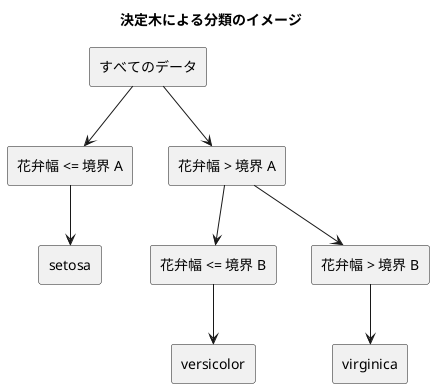

# 第 3 章: 決定木による分類と明白な実装

## 3.1 はじめに

第 1 章では「20 代ならきのこ派」というルールを人間が書き、第 2 章では欠損値を補完した特徴量を用意しました。この章では、「どの特徴量のどこで区切るか」をデータから自動で探すアルゴリズム、**決定木** を自作します。

そして自作した木を、**Rubix ML の `ClassificationTree` と突き合わせます**。

ここが PHP 版の性格がはっきり出るところです。直前に書いた [Elixir 版の第 3 章](../elixir/03-decision-tree-and-obvious-implementation.md) には、**突き合わせる相手がいませんでした**。Scholar には決定木がなく、自作した木がそのまま最終実装になりました。PHP 版はその正反対で、Rubix ML は決定木もランダムフォレストも持っています（[ADR 013](../../../adr/013-php-ml-libraries.md)）。第 3 波の 2 つの言語版が、ライブラリの成熟度という一点で鏡写しになっています。

ただし、**「ライブラリがある」ことは「そのまま比べられる」ことではありません**。この章でいちばん時間を使ったのは決定木の実装ではなく、`ClassificationTree` の既定値を読んで、自作の木と同じ条件にそろえる作業でした。既定のままでは、**実行するたびに違う正解率が出ます**。ライブラリがある側にはある側の仕事があります。

PHP 版では、次の 4 点に注目してください。

- 木を **共用型（union type）`Leaf|Node`** で表す。PHP には判別共用体（代数的データ型）はありませんが、共用型はあります。Elixir 版・Ruby 版がマップや `Data` で表して網羅性の検査を諦めたところを、**型として書けます**
- **PHP 8.0 から `usort` は安定**。Ruby 版が `sort_by` の不安定さのために元の位置を第 2 の鍵に入れたところが、素直に書けます
- **PHP 8.0 から `sprintf` はロケールに依りません**。Clojure 版がロケール依存で悩んだところが、何も明示せずに済みます
- **PHP の配列は「数字だけの文字列」の鍵を整数に変えます**。ラベルを数える箇所で、この言語の癖に正面からぶつかります

## 3.2 決定木の仕組み

### データを 2 つに分けることを繰り返す

決定木は、データを「ある特徴量がある値以下か、より大きいか」で 2 つに分けることを繰り返します。分けた先で同じラベルばかりになったら、そこで分けるのをやめて、そのラベルを予測に使います。



### どこで分けるかをジニ不純度で決める

「よい分け方」とは、分けた後のそれぞれのグループで、ラベルがなるべく 1 種類にそろう分け方です。そろい具合を数値にしたものが **ジニ不純度** です。

ジニ不純度 = 1 − Σ（各ラベルの割合）²

| グループのラベル | 割合 | ジニ不純度 |
|----------------|------|-----------|
| setosa ×3 | setosa 1.0 | 1 − 1.0² = 0 |
| setosa ×1、virginica ×1 | 0.5、0.5 | 1 − (0.5² + 0.5²) = 0.5 |
| 3 品種 ×1 ずつ | 1/3 ずつ | 1 − 3 × (1/3)² = 2/3 |

ラベルが 1 種類にそろうと 0、混ざるほど大きくなります。分け方の候補ごとに、分けた後の左右のジニ不純度を件数で重み付けして平均し、最も小さくなる分け方を選びます。

## 3.3 TODO リストの作成

**TODO リスト**:

- [ ] ジニ不純度を計算する
- [ ] いちばん多いラベルを返す
  - [ ] 同数なら先に現れたラベルを返す
- [ ] 最良の分割を探す
  - [ ] ラベルを完全に分けられる境界を見つける
  - [ ] 複数の特徴量から最良の特徴量と境界を選ぶ
  - [ ] ラベルが 1 種類なら分割しない
- [ ] 決定木を学習して予測する
- [ ] 木の深さを制限する
- [ ] 学習した木を読める形で表示する
- [ ] Rubix ML の決定木と突き合わせる
- [ ] 実データで深さと正解率の関係を表示する

この章のファイルは次のとおりです。

```text
apps/php/
├── src/
│   ├── Chapter03.php                  # 章の実行（深さごとの正解率と木の表示）
│   └── Chapter03/
│       ├── Split.php                  # 分割（列・境界・不純度）
│       ├── Leaf.php                   # 葉
│       ├── Node.php                   # 節
│       ├── DecisionTree.php           # 自作の決定木
│       └── RubixTree.php              # Rubix ML の決定木の包み
└── tests/
    └── Chapter03Test.php
```

## 3.4 ジニ不純度を計算する

### 仮実装から始める

ラベルが 1 種類ならジニ不純度は 0 です。

```php
#[TestDox('ラベルが 1 種類ならジニ不純度は 0')]
public function testラベルが1種類ならジニ不純度は0(): void
{
    $this->assertSame(0.0, DecisionTree::gini(['きのこ', 'きのこ']));
}
```

赤を確かめます。

```text
Error: Class "GettingStartedMl\Chapter03\DecisionTree" not found
```

クラスが無い、という失敗です。**仮実装**で通します。

```php
public static function gini(array $labels): float
{
    return 0.0;
}
```

### 三角測量

0 を返すだけの実装は、次のテストで壊れます。

```php
#[TestDox('半々に分かれていればジニ不純度は 0.5')]
public function test半々に分かれていればジニ不純度は0_5(): void
{
    $this->assertSame(0.5, DecisionTree::gini(['きのこ', 'たけのこ']));
}
```

```text
Failed asserting that 0.0 is identical to 0.5.
```

2 つめの例が来たところで、定数を返す実装は成り立たなくなりました。**明白な実装**に進みます。

### Green: 明白な実装

```php
/**
 * ジニ不純度。ラベルが 1 種類なら 0 で、種類が多く均等なほど大きい。
 *
 * @param list<string> $labels
 */
public static function gini(array $labels): float
{
    $counts = self::countLabels($labels);

    if ($counts === []) {
        return 0.0;
    }

    $total = count($labels);
    $sum = 0.0;

    foreach ($counts as $count) {
        $sum += ($count / $total) ** 2;
    }

    return 1.0 - $sum;
}
```

`assertSame(0.5, ...)` が通ることに気づいたでしょうか。`1.0 - (0.25 + 0.25)` は IEEE 754 でもぴったり 0.5 になるので、浮動小数点の比較でも `assertSame` が使えます。3 種類が均等なときの 2/3 はそうはいかないので、そちらは `assertEqualsWithDelta` で書きました。

```php
#[TestDox('3 種類が均等ならジニ不純度は 2/3')]
public function test三種類が均等ならジニ不純度は三分の二(): void
{
    $this->assertEqualsWithDelta(2 / 3, DecisionTree::gini(['あか', 'あお', 'きいろ']), 1e-12);
}
```

`$labels` は `list<string>` と宣言していますが、これは PHPStan だけが見る型です。実行時に効くのは `array $labels` の部分だけで、中身が文字列かどうかは検査されません。第 1 章で書いた「実行時の型と静的解析の型が二層になっている」という PHP の姿が、ここでも同じ形で出てきます。

## 3.5 いちばん多いラベルを返す

葉になったとき、そこに残ったラベルのうち**いちばん多いもの**を予測に使います。同数のときは**先に現れたほう**を選びます。ほかの言語版とそろえるための約束です。

```php
#[TestDox('同数なら先に現れたラベルを返す')]
public function test同数なら先に現れたラベルを返す(): void
{
    $this->assertSame('あか', DecisionTree::majority(['あか', 'あお']));
}
```

### PHP の配列は数字の鍵を整数に変える

数える処理には `array_count_values` という標準の関数があります。使いたくなりますが、ここでは使いませんでした。理由は戻り値の鍵の型です。

**PHP の配列は「数字だけの文字列」を鍵にすると、勝手に整数に変換します。** `$counts['1']` と書いても、実際に入る鍵は `int(1)` です。`array_count_values` を使っても自分で数えても同じことが起きるので、型を偽らずに受け止め、使う側で文字列に戻すことにしました。

```php
/**
 * ラベルごとの件数を、最初に現れた順で返す。
 *
 * PHP の配列は「数字だけの文字列」の鍵を勝手に整数に変えるので、戻り値の鍵は
 * string とは限らない。array_count_values を使っても同じことが起きるため、
 * 型を偽らずに array-key で受け、使う側で文字列に戻す。
 *
 * @param list<string> $labels
 *
 * @return array<array-key, int>
 */
private static function countLabels(array $labels): array
{
    $counts = [];

    foreach ($labels as $label) {
        $counts[$label] = ($counts[$label] ?? 0) + 1;
    }

    return $counts;
}
```

この章のアヤメのラベルは `Iris-setosa` のような文字列なので、実害はありません。しかし「ラベルが `"1"`・`"2"` のデータ」は現実にはいくらでもあり、そのとき `majority` が `int` を返してしまうと、呼び出し側の `===` による比較が静かに外れます。テストで固定しておきます。

```php
#[TestDox('数字だけのラベルでも文字列として返す')]
public function test数字だけのラベルでも文字列として返す(): void
{
    // PHP の配列は「1」のような鍵を整数に変えてしまうので、戻り値の型を確かめる。
    $this->assertSame('2', DecisionTree::majority(['1', '2', '2']));
}
```

PHPStan は `@return array<string, int>` と書いても文句を言いません。**この間違いを見つけたのは静的解析ではなくテストです。** 型の道具を最高レベルまで使っていても、言語そのものの癖は型では守れない、という例になりました。

### Green: 最初に現れた順にたどる

```php
public static function majority(array $labels): string
{
    if ($labels === []) {
        throw new InvalidArgumentException('正解ラベルがありません');
    }

    $best = $labels[0];
    $bestCount = 0;

    // countLabels は最初に現れた順を保つので、先頭からたどれば同数のとき先が残る。
    // 数字だけのラベルは鍵が int になっているので、文字列に戻してから返す。
    foreach (self::countLabels($labels) as $label => $count) {
        if ($count > $bestCount) {
            $best = (string) $label;
            $bestCount = $count;
        }
    }

    return $best;
}
```

PHP の配列は**挿入順を保ちます**。`countLabels` は最初に現れた順で鍵を並べるので、先頭からたどって `>` （`>=` ではない）で更新すれば、同数のとき先のものが残ります。Ruby の `max_by`・Elixir の `Enum.max_by/2` が同じ動きをするので、そろえるために特別なことは要りません。Clojure の `max-key` が同値のとき後ろを返すのとは逆です。

## 3.6 最良の分割を探す

### 分割を `readonly class` で表す

分割は「どの列を」「どこで」区切るかと、その結果の不純度の 3 つ組です。第 1 章の `Person` と同じく `readonly class` にします。

```php
final readonly class Split
{
    public function __construct(
        public string $feature,
        public float $threshold,
        public float $impurity,
    ) {
    }

    /** 特徴量がこの分割で左へ進むかを返す。 */
    public function goesLeft(float $value): bool
    {
        return $value <= $this->threshold;
    }
}
```

`goesLeft` をここに置いたのは、**「境界以下なら左」という約束を 1 か所にまとめる**ためです。学習のとき（左右に振り分ける）と予測のとき（木をたどる）の両方で同じ判定が要り、片方だけ `<` に変えてしまう間違いが起きやすいところです。Elixir 版は `goes_left?/2` という private な関数で同じことをしています。データに振る舞いを持たせられる PHP では、分割そのものに聞くのが自然でした。

### テスト

架空の三色のデータを作ります。**実データの行はテストに書きません。** 「たて」だけで 3 色に分かれ、「よこ」は色と関係がない、という形にします。

```php
private function threeColors(): array
{
    return [
        [
            ['たて' => 1.0, 'よこ' => 1.0],
            ['たて' => 1.0, 'よこ' => 2.0],
            ['たて' => 5.0, 'よこ' => 1.0],
            ['たて' => 5.0, 'よこ' => 2.0],
            ['たて' => 9.0, 'よこ' => 1.0],
            ['たて' => 9.0, 'よこ' => 2.0],
        ],
        ['あか', 'あか', 'あお', 'あお', 'きいろ', 'きいろ'],
    ];
}
```

期待する分割は「たて <= 3.0」です。1.0 と 5.0 の**中点**が境界になります。

```php
#[TestDox('最良の分割は隣り合う値の中点を境界にする')]
public function test最良の分割は中点を境界にする(): void
{
    [$x, $t] = $this->threeColors();

    $split = DecisionTree::bestSplit($x, $t, self::COLUMNS);

    $this->assertNotNull($split);
    $this->assertSame('たて', $split->feature);
    $this->assertSame(3.0, $split->threshold);
    $this->assertEqualsWithDelta(1 / 3, $split->impurity, 1e-12);
}
```

分けられない場合も決めておきます。ラベルが 1 種類のとき、値がすべて同じとき、データが無いときは `null` を返します。

### Green: 候補を列挙して選ぶ

```php
private static function candidates(array $x, array $t, string $feature): array
{
    $pairs = [];

    foreach ($x as $i => $features) {
        $pairs[] = [self::feature($features, $feature), $t[$i]];
    }

    // PHP 8.0 以降の usort は安定なので、同じ値の並びは元の順のまま。
    usort($pairs, static fn (array $a, array $b): int => $a[0] <=> $b[0]);

    $values = array_column($pairs, 0);
    $labels = array_column($pairs, 1);
    $splits = [];

    for ($i = 1, $n = count($pairs); $i < $n; ++$i) {
        if ($values[$i - 1] === $values[$i]) {
            continue;
        }

        $splits[] = new Split(
            $feature,
            ($values[$i - 1] + $values[$i]) / 2.0,
            self::weightedGini(array_slice($labels, 0, $i), array_slice($labels, $i)),
        );
    }

    return $splits;
}
```

**PHP 8.0 から `usort` は安定です。** 同じ値どうしの順が、並べ替えの前後で変わりません。[Ruby 版](../ruby/03-decision-tree-and-obvious-implementation.md) の `sort_by` は安定ではないので、元の位置を第 2 の鍵に入れて `sort_by { |(value, _label), index| [value, index] }` と書く必要がありました。PHP では `$a[0] <=> $b[0]` だけで、「同じ値なら元の順」がそのまま手に入ります。これはこの章の「同点なら先に現れたほう」という約束と噛み合っています。

`<=>` は宇宙船演算子で、`usort` が求める「負・0・正」をそのまま返します。

最良の分割は、候補を列の順にたどって `<`（`<=` ではない）で更新するだけです。

```php
public static function bestSplit(array $x, array $t, array $columns): ?Split
{
    if ($x === [] || self::gini($t) === 0.0) {
        return null;
    }

    $best = null;

    foreach ($columns as $column) {
        foreach (self::candidates($x, $t, $column) as $candidate) {
            if ($best === null || $candidate->impurity < $best->impurity) {
                $best = $candidate;
            }
        }
    }

    return $best;
}
```

`$best === null ||` の短絡が、PHPStan には「この後の `$best->impurity` は null ではない」と伝わります。共用型・null 許容型の絞り込みが型検査に組み込まれているので、`assert` や `@var` を足さずに済みました。

## 3.7 決定木を学習して予測する

### 木をどう表すか — PHP には共用型がある

木は葉か節のどちらかです。この「どちらか」をどう表すかで、言語の性格が出ます。

| 言語版 | 木の表し方 | 網羅性の検査 |
|-------|----------|------------|
| Scala 版・Rust 版 | `enum`（判別共用体） | ある |
| Elixir 版 | マップ（`%{label: ...}` と `%{split: ...}`） | ない |
| Ruby 版 | `Data.define` を 2 つ | ない |
| **PHP 版** | **共用型 `Leaf\|Node`** | **絞り込みはある（網羅性の強制はない）** |

PHP には判別共用体（代数的データ型）はありません。しかし **共用型はあります**。しかも型宣言として書けば、**実行時にも検査されます**。

```php
final readonly class Leaf
{
    public function __construct(public string $label)
    {
    }
}

final readonly class Node
{
    public function __construct(
        public Split $split,
        public Leaf|Node $left,
        public Leaf|Node $right,
    ) {
    }
}
```

`public Leaf|Node $left` と書いた瞬間、「部分木は葉か節のどちらかである」という事実が、**実行時の型検査と静的解析の両方に伝わります**。Elixir 版がマップで表して「鍵があるかどうかで見分ける」と書いたところ、Ruby 版が `Data` を 2 つ作って「網羅しているかは検査されない」と書いたところが、PHP では型で表せます。動的型付けの言語の中で、この章がいちばん型の恩恵を受けた場所でした。

ただし、**網羅性そのものは強制されません**。Scala 3 の `enum` に対する `match` なら、節を書き忘れるとコンパイラが警告します。PHP の `instanceof` による分岐で `else` を書き忘れても、「戻り値の型が合わない」という別の形でしか指摘されません。「網羅性の検査がある」と言い切れないのはそのためです。

### 学習

```php
private static function build(array $x, array $t, array $columns, ?int $maxDepth): Leaf|Node
{
    $split = $maxDepth === 0 ? null : self::bestSplit($x, $t, $columns);

    if ($split === null) {
        return new Leaf(self::majority($t));
    }

    $leftX = $rightX = $leftT = $rightT = [];

    foreach ($x as $i => $features) {
        if ($split->goesLeft(self::feature($features, $split->feature))) {
            $leftX[] = $features;
            $leftT[] = $t[$i];
        } else {
            $rightX[] = $features;
            $rightT[] = $t[$i];
        }
    }

    $nextDepth = $maxDepth === null ? null : $maxDepth - 1;

    return new Node(
        $split,
        self::build($leftX, $leftT, $columns, $nextDepth),
        self::build($rightX, $rightT, $columns, $nextDepth),
    );
}
```

戻り値の型が `Leaf|Node` なので、「木を返す」という約束がシグネチャに書けています。

深さの上限は `?int` で表しました。`null` が「上限なし」です。Elixir 版・Ruby 版と同じ扱いで、Rust 版が `Option<usize>` を使ったのと同じ意味を、PHP では null 許容型で書きます。`$maxDepth === 0` の比較を `===` にしているのは、`$maxDepth == 0` だと `null == 0` が偽になるとはいえ、`"0"` のような値が来たときに意図がぶれるからです。第 1 章で決めた「比較は `===` で書く」をそのまま守っています。

深さ 1 なら 2 つの葉になり、深さ 0 なら葉だけになります。

```php
#[TestDox('深さ 1 なら 2 つの葉になる')]
public function test深さ1なら2つの葉になる(): void
{
    [$x, $t] = $this->threeColors();

    $tree = DecisionTree::fit($x, $t, self::COLUMNS, 1)->tree;

    $this->assertInstanceOf(Node::class, $tree);
    $this->assertInstanceOf(Leaf::class, $tree->left);
    $this->assertInstanceOf(Leaf::class, $tree->right);
    $this->assertSame('あか', $tree->left->label);
    // 右には「あお」2 件と「きいろ」2 件が残る。同数なので先に現れた「あお」を選ぶ。
    $this->assertSame('あお', $tree->right->label);
}
```

`assertInstanceOf` の後に `$tree->left->label` と書けているのは、PHPUnit の表明が PHPStan にとっての絞り込みにもなっているからです。`assertInstanceOf(Leaf::class, $tree->left)` を書かずに `$tree->left->label` と書くと、レベル 9 は「`Node` に `label` は無い」と指摘します。**テストの表明と静的解析の絞り込みが同じ方向を向いている**のが、この書き方の気持ちのよいところです。

### 予測

```php
public static function predictOne(Leaf|Node $tree, array $features): string
{
    // 共用型なので、葉でなければ節であることが静的解析にも伝わる。
    if ($tree instanceof Leaf) {
        return $tree->label;
    }

    $value = self::feature($features, $tree->split->feature);

    return self::predictOne($tree->split->goesLeft($value) ? $tree->left : $tree->right, $features);
}
```

`if ($tree instanceof Leaf)` で早期に返すと、その後の `$tree` は `Node` に絞り込まれます。`$tree->split` と書いてもレベル 9 が通るのはそのためです。Elixir 版はこれをパターンマッチの関数節 2 つで書き、Ruby 版は `case/in` で書きました。PHP では `instanceof` による早期リターンがいちばん素直でした。

```php
// Elixir 版: パターンで分かれる
def predict_one(%{label: label}, _features), do: label

def predict_one(%{split: split, left: left, right: right}, features) do
  ...
end
```

```php
// PHP 版: 型で絞り込む
if ($tree instanceof Leaf) {
    return $tree->label;
}
// ここから先の $tree は Node
```

書き味は Elixir 版のほうが簡潔ですが、**PHP 版は「葉でも節でもない値が渡る」ことを実行時に防げます**。`Leaf|Node` 以外を渡すと `TypeError` になります。Elixir 版のマップは、鍵が足りなければ `FunctionClauseError` になるまで分かりません。どちらも実行時に落ちますが、落ちる理由の明確さが違います。

## 3.8 学習した木を表示する

木を読める形にします。

```php
public static function formatTree(Leaf|Node $tree, string $indent = ''): string
{
    if ($tree instanceof Leaf) {
        return "{$indent}{$tree->label}\n";
    }

    // PHP 8.0 以降の sprintf はロケールに依らないので、小数点は常に「.」になる。
    $border = sprintf('%.4f', $tree->split->threshold);
    $feature = $tree->split->feature;

    return "{$indent}{$feature} <= {$border}\n"
        . self::formatTree($tree->left, $indent . '  ')
        . "{$indent}{$feature} > {$border}\n"
        . self::formatTree($tree->right, $indent . '  ');
}
```

### `sprintf` はロケールに依らない

**PHP 8.0 から、浮動小数点数から文字列への変換はロケールに依存しなくなりました。** 小数点は常に `.` です。Clojure 版の `clojure.core/format` がロケール依存で、ドイツ語ロケールの環境では `0,2950` になりうるという既知の制限を抱えていたのとは対照的です。Elixir 版は `:io_lib.format` を選ぶことで同じ安全を得ましたが、PHP では何も明示しなくても保たれます。

期待値はヒアドキュメントで書きました。

```php
$expected = <<<'TREE'
    たて <= 3.0000
      あか
    たて > 3.0000
      たて <= 7.0000
        あお
      たて > 7.0000
        きいろ

    TREE;
```

`<<<'TREE'`（引用符つき）は **Nowdoc** で、中の `$` が変数として展開されません。木の文字列に `$` は出てきませんが、期待値を「書いたとおりに読ませる」意図を型で示せます。PHP 7.3 からは終端の字下げが許されるので、テストのメソッドの中でも段を崩さずに書けます。終端の行の字下げ分が、各行から自動的に取り除かれます。

## 3.9 Rubix ML の決定木と突き合わせる

ここからが PHP 版の本番です。

### 既定値のままでは比べられない

`Rubix\ML\Classifiers\ClassificationTree` の引数は 5 つあります。

```php
public function __construct(
    int $maxHeight = PHP_INT_MAX,
    int $maxLeafSize = 3,
    float $minPurityIncrease = 1e-7,
    ?int $maxFeatures = null,
    ?int $maxBins = null,
)
```

既定値のまま学習させて、同じデータで 5 回続けて正解率を測りました。

```text
0.8889 0.8889 0.8889 0.8889 0.8222
```

**同じデータ・同じコードなのに、値が変わります。** 原因はライブラリの実装を読んで初めて分かりました。`Rubix\ML\Graph\Trees\CART::split()` には次の 3 つの仕掛けがあります。

1. **使う列を毎回くじ引きで選ぶ** — `$maxFeatures` の既定は `round(sqrt($n))` で、4 列なら 2 列。その 2 列を `array_rand` で選びます。**シードを渡す口がありません。** ランダムフォレストの部品として書かれた実装がそのまま単体の決定木として露出している形です
2. **連続値の候補を分位点で丸める** — `$maxBins` の既定は `1 + round(log2($m))` で、訓練データ 105 件なら 8。値の候補を 8 個の分位点に丸めてから探します
3. **純粋になる前に分割をやめる** — 葉の最小件数 3、不純度の最小の改善 1e-7

自作の木はこのどれもしていません。そこで、4 つの引数をすべて明示して条件をそろえます。

```php
$tree = new ClassificationTree(
    $maxDepth ?? PHP_INT_MAX,
    maxLeafSize: 1,
    minPurityIncrease: 0.0,
    maxFeatures: count($columns),
    maxBins: self::MAX_BINS,
);
```

`maxFeatures` を列数と同じにするとくじ引きが全列を返すので、結果が決まります。`maxBins` を件数より大きくすると丸めが起きません。**この 4 行が、この章でいちばん調べるのに時間がかかった部分です。**

`maxLeafSize: 1` のように名前付き引数を使ったのは、5 つの引数のうち何を変えているのかを読める形にするためです。`new ClassificationTree(PHP_INT_MAX, 1, 0.0, 4, 1000000)` では、どの数字が何なのか分かりません。

### 列の名前と位置

Rubix ML のデータセットは、列を**位置**で扱います。第 2 章の前処理は列を**名前**で持っているので、境界で並べ替えます。

```php
public static function samples(array $x, array $columns): array
{
    return array_map(
        static fn (array $features): array => array_map(
            static function (string $column) use ($features): float {
                if (!array_key_exists($column, $features)) {
                    throw new InvalidArgumentException("列がありません: {$column}");
                }

                return $features[$column];
            },
            $columns,
        ),
        $x,
    );
}
```

`$features[$column] ?? 0.0` と書けば短くなりますが、**列の綴りを間違えたときに 0.0 が静かに混ざります**。第 2 章の `??` と `||` の落とし穴（0.0 は偽である）と同じ性質の問題なので、無い列は例外にしました。

### 架空のデータで一致を確かめる

条件をそろえたら、まず架空のデータで予測が一致することを確かめます。

```php
#[TestDox('架空のデータでは Rubix ML と自作の予測が一致する')]
public function test架空のデータではRubixMLと一致する(): void
{
    [$x, $t] = $this->threeColors();
    $model = DecisionTree::fit($x, $t, self::COLUMNS);

    $this->assertSame($model->predict($x), RubixTree::predict($x, $t, $x, self::COLUMNS));
}
```

深さを制限したときも Rubix ML 側で効くことを確かめます。深さ 1 なら 2 つの葉しか作れないので、3 色のうち 1 色は当てられません。

```php
$this->assertSame(
    ['あか', 'あか', 'あお', 'あお', 'あお', 'あお'],
    RubixTree::predict($x, $t, $x, self::COLUMNS, 1),
);
```

`maxHeight` は「木の高さ」で、自作の `maxDepth`（分割の回数）と 1 ずれるように見えますが、実測では同じでした。`maxHeight: 1` の木は `height()` が 2 を返し、分割は 1 回です。名前は違っても、指定する数は同じです。

## 3.10 実データで深さと正解率を表示する

深さを変えながら、自作の木の訓練データ・テストデータの正解率と、Rubix ML のテストデータの正解率を並べます。

```php
public static function accuracyRow(?int $maxDepth, array $split, array $columns): string
{
    $model = DecisionTree::fit($split['xTrain'], $split['tTrain'], $columns, $maxDepth);
    $rubix = RubixTree::predict($split['xTrain'], $split['tTrain'], $split['xTest'], $columns, $maxDepth);

    return implode("\t", [
        $maxDepth === null ? '制限なし' : (string) $maxDepth,
        self::score($model->predict($split['xTrain']), $split['tTrain']),
        self::score($model->predict($split['xTest']), $split['tTest']),
        self::score($rubix, $split['tTest']),
    ]);
}
```

深さの一覧は定数にしました。PHP 8.3 から**クラス定数にも型が書けます**。

```php
/**
 * 正解率を比べる深さ。null は制限なし。
 *
 * @var list<int|null>
 */
public const array MAX_DEPTHS = [1, 2, 3, 4, 5, null];
```

`public const array` の `array` が、PHP 8.3 で入ったクラス定数の型宣言です。中身の `int|null` までは実行時には見えないので、`@var list<int|null>` を添えて PHPStan に伝えます。ここでも「実行時に効く型」と「静的解析だけが見る型」の二層構造が出ています。Ruby 版が `.freeze` を書いた理由（定数の中身が書き換えられる）は PHP の `const` には当てはまりません。配列定数は書き換えられません。

実行します。

```text
$ php -r 'require "vendor/autoload.php"; echo GettingStartedMl\Chapter03::run();'
深さ	訓練データ	テストデータ	Rubix ML
1	0.6762	0.6444	0.6444
2	0.9333	0.9556	0.9556
3	0.9524	0.9556	0.9556
4	0.9619	0.9556	0.9556
5	0.9810	0.9333	0.9333
制限なし	1.0000	0.9333	0.9111

深さ 2 の決定木:
花弁幅 <= 0.2950
  Iris-setosa
花弁幅 > 0.2950
  花弁幅 <= 0.6500
    Iris-versicolor
  花弁幅 > 0.6500
    Iris-virginica
```

読み取れることが 4 つあります。

1. **深さ 1 では足りない。** 2 つの葉しか作れないので、3 種類は分けられません。テストデータ 0.6444 は、3 種類のうち 2 種類しか当てていない値です
2. **深さ 2 で 0.9556 に届く。** 花弁幅だけで 3 品種がほぼ分かれます。木の中身がそれを示しています
3. **訓練データの正解率は深さとともに上がり続け、制限なしで 1.0000。** 訓練データを完全に覚えました
4. **テストデータの正解率は深さ 5 から下がる（0.9556 → 0.9333）。** これが **過学習** です

**自作の木は [Elixir 版](../elixir/03-decision-tree-and-obvious-implementation.md) の数値と完全に一致しました。** 深さごとの正解率も、深さ 2 の木の境界（0.2950・0.6500）も同じです。Elixir 版の記事によれば、これは Java 版・Scala 版・Clojure 版とも同じ値です。第 2 章で乱数をそろえた効果が、そのまま第 3 章の数値の一致になって現れています。

### Rubix ML と食い違った 1 行

Rubix ML の列は、**深さ 1〜5 では自作の木と完全に一致し、深さを制限しないときだけ 0.9333 対 0.9111 で食い違いました**。

食い違いはテストデータ 45 件のうち 1 件です。調べると、原因は **境界の取り方** でした。

| | 境界の候補 | 深さ 2 の第 1 分割 | 深さ 2 の第 2 分割 |
|---|---|---|---|
| 自作 | 隣り合う値の**中点** | 花弁幅 <= 0.2950 | 花弁幅 <= 0.6500 |
| Rubix ML | データに**実在する値** | 花弁幅 <= 0.21 | 花弁幅 <= 0.63 |

Rubix ML の `splitByFeature` は「その列に実際に現れた値」を境界にします（`exportGraphviz` で木を書き出すと確認できます）。自作の木は隣り合う 2 つの値の中点を取ります。訓練データに対してはどちらも同じ分け方になりますが、**訓練データに無い値が来たとき、0.21 と 0.2950 の間に落ちる点の行き先が変わります**。深さが浅いうちは境界が大きく離れているので差が出ず、深くなって境界が細かくなると 1 件だけ食い違いました。

どちらが正しいというものではありません。scikit-learn は中点を取り、Rubix ML は実在する値を取ります。**「ライブラリと突き合わせて一致した」という言い方をするときは、どこまで一致したのかを言えるようにしておくべきだ**、というのがこの 1 行の教えです。突き合わせは合格・不合格の判定ではなく、差がどこから来るかを説明できるかどうかの作業です。

## 3.11 ライブラリがあるということ

[Elixir 版の第 3 章](../elixir/03-decision-tree-and-obvious-implementation.md) は、「Scholar に決定木が無いので、自作が最終実装になる」という話でした。PHP 版はその正反対の立場にあります。この 2 つを並べて分かったことを書いておきます。

**ライブラリがあると、自作のコードの役目が変わります。** Elixir 版の決定木は捨てられない本番の実装でした。PHP 版の決定木は、第 8 章以降で Rubix ML に置き換えられる可能性のあるコードです。しかし、置き換えられるとしても、**この章で書いたコードには「ライブラリの答え合わせをする第 2 の実装」という役目が残ります**。深さ 1〜5 の一致は、自作の木が正しいことの証拠であると同時に、`ClassificationTree` の引数を正しく設定できたことの証拠でもあります。

**そして、ライブラリがある側にも固有の仕事があります。** この章でいちばん時間を使ったのは決定木の実装ではなく、`ClassificationTree` の既定値を読むことでした。既定のまま使えば、正解率は実行のたびに変わり、0.8889 と 0.8222 の間を揺れます。**ライブラリが「間違った答え」を返したわけではありません。** ランダムフォレストの部品としては正しい既定値です。単体の分類器として使う人が、その前提を知らないだけです。

ライブラリの有無は、仕事の量を変えるのではなく、仕事の**種類**を変えます。無いほうはアルゴリズムを書く仕事になり、あるほうはライブラリの前提を読む仕事になります。そしてどちらの場合も、**自分で書いた第 2 の実装が、答えの正しさを支えています**。

## 3.12 可視化について

PHP 版には Notebook の節を設けません。深さと正解率の折れ線グラフは [Kotlin 版の第 3 章](../kotlin/03-decision-tree-and-obvious-implementation.md) の「Notebook で探索する」の節を、scikit-learn による木の図は [Python 版の第 3 章](../python/03-decision-tree-and-obvious-implementation.md) を参照してください。PHP で木の形を見たいときは、3.10 節の `format()` の出力のほか、Rubix ML の `exportGraphviz()` が Graphviz の DOT 形式を返します。

## 3.13 まとめ

この章では、決定木を自作し、Rubix ML の `ClassificationTree` と突き合わせました。PHP に固有の論点は次のとおりです。

1. **共用型 `Leaf|Node` で木を表せる** — PHP に判別共用体はないが、共用型はあり、しかも**実行時にも検査される**。Elixir 版がマップ、Ruby 版が `Data` 2 つで表して網羅性を諦めたところを型で書ける。`instanceof` による早期リターンで絞り込みも効く。ただし**網羅性そのものは強制されない**
2. **PHP 8.0 から `usort` は安定** — 「同じ値なら元の順」がそのまま手に入る。[Ruby 版](../ruby/03-decision-tree-and-obvious-implementation.md) が `sort_by` の不安定さのために元の位置を第 2 の鍵に入れたのと対照的
3. **PHP 8.0 から `sprintf` はロケールに依らない** — 小数点は常に `.`。Clojure 版の `format` がロケール依存の既知の制限を抱えているのとは違い、何も明示せずに移植性が保たれる
4. **配列は「数字だけの文字列」の鍵を整数に変える** — `array_count_values` でも自分で数えても同じ。`@return array<string, int>` と書いても PHPStan は通してしまい、**この間違いを見つけたのはテストだった**。型の道具を最高レベルまで使っても、言語そのものの癖は型では守れない
5. **クラス定数に型が書ける（PHP 8.3）** — `public const array MAX_DEPTHS`。中身の `int|null` は `@var` で補う。ここでも実行時の型と静的解析の型が二層になる。配列定数は書き換えられないので、Ruby 版の `.freeze` に相当するものは要らない
6. **Nowdoc で木の期待値を書ける** — `<<<'TREE'` は `$` を展開せず、PHP 7.3 以降は終端の字下げが許されるのでテストの中でも段が崩れない
7. **`ClassificationTree` は既定値のままでは決定的ではない** — 使う列を `array_rand` で選び、シードを渡す口が無い。同じデータで 0.8889 と 0.8222 が出た。`maxFeatures`・`maxBins`・`maxLeafSize`・`minPurityIncrease` の 4 つを明示して初めて比べられる
8. **境界の取り方が違う** — 自作は中点、Rubix ML は実在する値。深さ 1〜5 は完全に一致し、制限なしのときだけテストデータ 45 件のうち 1 件が食い違った（0.9333 対 0.9111）。**「一致した」と言うときは、どこまで一致したのかを言えるようにしておく**
9. **自作の木はほかの言語版と完全に一致した** — 深さごとの正解率も、境界の 0.2950・0.6500 も [Elixir 版](../elixir/03-decision-tree-and-obvious-implementation.md)・Java 版・Scala 版・Clojure 版と同じ。第 2 章で乱数をそろえた効果がここで効いている

**TODO リスト（この章の完了時点）**:

- [x] ジニ不純度を計算する
- [x] いちばん多いラベルを返す
  - [x] 同数なら先に現れたラベルを返す
- [x] 最良の分割を探す
  - [x] ラベルを完全に分けられる境界を見つける
  - [x] 複数の特徴量から最良の特徴量と境界を選ぶ
  - [x] ラベルが 1 種類なら分割しない
- [x] 決定木を学習して予測する
- [x] 木の深さを制限する
- [x] 学習した木を読める形で表示する
- [x] Rubix ML の決定木と突き合わせる
- [x] 実データで深さと正解率の関係を表示する

深さ 2 の決定木のテストデータの正解率は 0.9556 で、テストデータの正解率は深さ 5 から下がり始めました。次の章では、ここまでのコードとデータをどう管理するか（バージョン管理とデータ管理）を扱います。

PHP 版のほかの章は [PHP 版のトップ](index.md) から辿れます。
