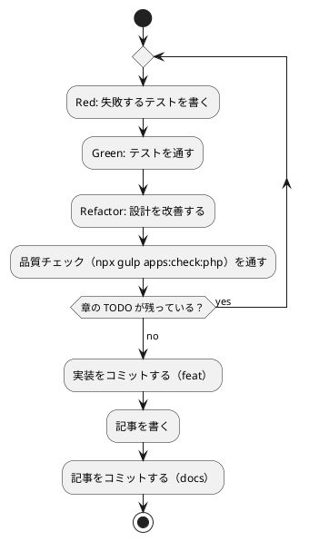

# 第 4 章: バージョン管理とデータ管理

## 4.1 はじめに

第 1 部では、TDD でデータを読み込み、前処理し、決定木で分類するプログラムを PHP で作りました。第 2 部では、そのプログラムを「変更を楽に安全にできる」状態に保つための道具立てを、バージョン管理（第 4 章）、パッケージ管理と静的解析（第 5 章）、タスクランナーと CI/CD（第 6 章）の順に整えます。

この章ではバージョン管理を扱います。機械学習のプロジェクトでは、コードに加えて **学習データ** と **学習済みモデル** というファイルが登場します。これらをコードと同じようにコミットしてよいとは限りません。この章では、Git で何を管理し、何を管理しないか、そして実験の結果を再現できるようにするには何を固定すればよいかを学びます。

Git の使い方は言語に依存しないので、[Python 版の第 4 章](../python/04-version-control-and-data-management.md)・[Elixir 版の第 4 章](../elixir/04-version-control-and-data-management.md) と同じ構成で進めます。PHP 版で注目するのは次の 3 点です。

- **Composer が作るファイル** を除外する。`vendor/` が、Node の `node_modules/`・Elixir の `deps/` に当たります。加えて検査の道具が置くキャッシュ（`.php-cs-fixer.cache`）と、カバレッジの出力先が増えます
- **`composer.lock` はコミットする**。`composer.json` には `^2.5` のような **範囲** しか書かないので、これが無いと版が決まりません。Ruby の `Gemfile.lock`・Elixir の `mix.lock` と同じ立ち位置です
- **スキップの仕組みが二段ある**。PHPUnit には `#[Group('data')]` によるグループ分けと、`markTestSkipped` による実行時のスキップの両方があります。この 2 つを **同時に使う** のが PHP 版の書き方で、それぞれ守っているものが違います

## 4.2 コミットメッセージの重要性

コミット履歴は「なぜこの変更をしたのか」の記録です。機械学習のプロジェクトでは、「前処理を変えたら正解率が変わった」「ライブラリと予測が一致しない原因をテストに残した」といった変化の理由を、あとから追跡できることが特に重要になります。

コミットは次の 2 つを守ると追いやすくなります。

- **1 コミット 1 目的** — 機能追加と設定変更、実装と記事を 1 つのコミットに混ぜない
- **形式をそろえる** — 種類と対象がひと目で分かる書式でメッセージを書く

## 4.3 Conventional Commits

### フォーマット

本シリーズでは [Conventional Commits](https://www.conventionalcommits.org/ja/) の形式でコミットメッセージを書きます。

```text
<type>(<scope>): <subject>

<body>

<footer>
```

`scope` には変更の対象を書きます。本リポジトリでは、言語別の実装なら `php`、記事シリーズなら `getting-start-ml`、ADR なら `adr`、CI の定義なら `ci` のように書きます。

### コミットタイプ

| type | 用途 |
|------|------|
| `feat` | 機能追加 |
| `fix` | バグ修正 |
| `docs` | ドキュメント・記事 |
| `test` | テストの追加・修正 |
| `refactor` | 振る舞いを変えないコードの改善 |
| `build` | ビルド・依存関係の変更（`composer.json`・`composer.lock`） |
| `ci` | CI の設定変更 |
| `chore` | その他（設定ファイルなど） |

### 実践例

PHP 版の実際の履歴から取ると、次のような並びになります。

```text
feat(php): PHP 版のウォーキングスケルトンと第 1 章を追加する
feat(php): 第 2 章の前処理と自作の乱数を追加する
```

コードに残らない判断は、実装より前に ADR としてコミットします。PHP 版では、Rubix ML を採ったこと、**素の線形回帰とラッソが無いこと**、型を使い切ると決めたこと（Ruby 版が型の道具を使わないと決めたのと正反対にしたこと）を [ADR 013](../../../adr/013-php-ml-libraries.md) に書いてから実装に入りました。選択の理由はコードを読んでも分かりません。「なぜ `LinearRegression` ではなく `Ridge(0.0)` なのか」を第 7 章のコードから読み取るのは無理です。

## 4.4 何をコミットし、何をコミットしないか

機械学習のプロジェクトには、コミットしてはいけないファイルが増えます。理由は大きく 3 つあります。

| 分類 | 例 | コミットしない理由 |
|------|-----|------------------|
| 再配布できないもの | 学習データ | ライセンスで利用者が限られている |
| 再生成できるもの | 依存の展開先、カバレッジの出力、検査の道具のキャッシュ、学習済みモデル | 大きく、差分が読めず、コードとデータから作り直せる |
| 秘匿すべきもの | `.env` の認証情報 | 漏洩すると取り返しがつかない |

### 学習データ

本シリーズの学習データは、書籍『スッキリわかる Python による機械学習入門』の配布データです。配布データの利用は書籍購入者に限られており、本リポジトリは公開されているので、データはコミットしません。ルートの `.gitignore` で、データの置き場所 `apps/data/` をまるごと除外しています。この設定は全言語で共通です。

```text
# 依存関係
node_modules/

# 環境変数（暗号化済みの .env.vault とテンプレートの .env.example は管理対象）
.env

# 学習データ（書籍購入者のみ利用可のため再配布しない。docs/article/getting-start-ml/outline.md を参照）
apps/data/

# ビルド成果物・一時ファイル
site/
tmp/
```

### PHP プロジェクト固有のファイル

`apps/php/.gitignore` では、Composer が展開する依存、カバレッジとビルドの出力先、検査の道具のキャッシュ、学習済みモデルの保存先を除外しています。

```text
# Composer の依存の置き場
vendor/

# カバレッジとビルドの結果
build/

# PHP-CS-Fixer・PHPStan のキャッシュ
.php-cs-fixer.cache
.phpunit.result.cache

# 学習済みモデルの保存先（第 15 章）
model/
```

| パス | 中身 | ほかの言語版で対応するもの |
|------|------|------------------------|
| `vendor/` | 依存ライブラリの **ソースそのもの** と、Composer が生成するオートローダー | Node の `node_modules/`、Elixir の `deps/`、Ruby の `vendor/bundle` |
| `build/` | `clover.xml`（カバレッジ）と `.phpunit.cache/`（PHPUnit の結果キャッシュ） | Ruby の `coverage/`、Elixir の `cover/` |
| `.php-cs-fixer.cache` | 整形の検査を前回から変わっていないファイルで省くためのキャッシュ | （ほかの言語版には無い） |
| `model/` | 学習済みモデルの保存先（第 15 章で使う） | ほかの言語版と同じ |

`vendor/` に注目してください。Composer はライブラリを **プロジェクトの中に展開します**。しかも中身は JAR のような固めたものではなく、ソースのままです。`vendor/rubix/ml/src/Classifiers/ClassificationTree.php` を開けば Rubix ML の実装がそのまま読めるので、第 3 章以降で「自作した決定木とライブラリの答えが合わない」ときに中身を確かめられます。ただし当然コミットの対象ではありません。実測では **80 個のパッケージ** が展開されます（5.2 節）。

`.php-cs-fixer.cache` は、ほかの言語版にあまり出てこないものです。PHP-CS-Fixer は、前回検査したときのファイルのハッシュを記録しておき、変わっていないファイルを飛ばします。これは **手元の速度のためのもの** であって、共有する価値がありません。むしろ、別の版の PHP-CS-Fixer で作られたキャッシュが混ざると、検査が意図どおり走らないおそれがあります。

### `composer.lock` はコミットする

`composer.lock` は、`composer install`・`composer update` が解決した依存の版と取得元とハッシュを記録するファイルです。これは **コミットします**。

```json
{
    "_readme": [
        "This file locks the dependencies of your project to a known state",
        "Read more about it at https://getcomposer.org/doc/01-basic-usage.md#installing-dependencies",
        "This file is @generated automatically"
    ],
    "content-hash": "844de5756e16e229f6b144a6985fbfb2",
    "packages": [
        {
            "name": "amphp/amp",
            "version": "v2.6.5",
            "source": {
                "type": "git",
                "url": "https://github.com/amphp/amp.git",
                "reference": "d7dda98dae26e56f3f6fcfbf1c1f819c9a993207"
            },
```

本シリーズの `composer.lock` は 5761 行あります。`composer.json` に直接書いたパッケージは 5 つ（実行時 2 つ・開発時 3 つ。ほかに PHP 本体と mbstring の要求）ですが、ロックファイルには推移的に入ってくるものまで含めて 80 個のパッケージが記録されます。

コミットする理由は Ruby 版の `Gemfile.lock`、Elixir 版の `mix.lock` と同じです。`composer.json` には `"rubix/ml": "^2.5"` のような **範囲** を書くので、`composer.json` だけでは版が決まりません。`composer.lock` があれば、誰がいつ `composer install` を走らせても同じ版が入ります。CI でも同じです。しかも `source.reference` に Git のコミットのハッシュまで記録されているので、取ってきたものがすり替わっていないことを確かめられます。

先頭の `content-hash` は、`composer.json` の依存の記述から計算したハッシュです。`composer.json` だけを書き換えて `composer update` を忘れると、`composer install` が「ロックが `composer.json` と食い違っている」と警告します。**2 つのファイルがずれたことを Composer 自身が教えてくれる** わけで、これは `mix.lock` にも `Gemfile.lock` にも無い仕掛けです。

第 5 章で `composer.json` と `composer.lock` の役割分担をもう少し詳しく見ます。

### 除外されていることを確かめる

`.gitignore` が意図どおりに効いているかは、`git check-ignore -v` で確認できます。どのファイルの何行目の規則で除外されたかが表示されます。

```bash
git check-ignore -v apps/data/sukkiri-ml/iris.csv apps/php/vendor/ apps/php/build/ apps/php/model/ apps/php/.php-cs-fixer.cache tmp/sukkiri-ml-codes.zip
```

```text
.gitignore:8:apps/data/	apps/data/sukkiri-ml/iris.csv
apps/php/.gitignore:2:vendor/	apps/php/vendor/
apps/php/.gitignore:5:build/	apps/php/build/
apps/php/.gitignore:12:model/	apps/php/model/
apps/php/.gitignore:8:.php-cs-fixer.cache	apps/php/.php-cs-fixer.cache
.gitignore:12:tmp/	tmp/sukkiri-ml-codes.zip
```

ディレクトリのパスは末尾に `/` を付けて指定しています。`model/` のように末尾が `/` の規則はディレクトリだけに当てはまるので、まだ存在しないパスを `/` なしで調べると、除外されていないように見えます。`.php-cs-fixer.cache` はファイルなので `/` を付けません。

データを配置したあとに `git status --short` を実行し、`apps/data/` 以下のファイルが一覧に出てこないことも確かめておきます。

### 改行を `.gitattributes` でそろえる

Git が管理するのはファイルの中身なので、改行コードも管理の対象です。Windows で作業した人のコミットに CRLF が混ざると、差分が全行に出て読めなくなります。

Elixir 版では `mix format` が CRLF を指摘してくれることを実測で確かめました。PHP ではどうなのかを確かめるため、CRLF のファイルを置いて整形の検査にかけてみます。

```bash
printf '<?php\r\n\r\ndeclare(strict_types=1);\r\n\r\nnamespace GettingStartedMl;\r\n\r\nfinal class Crlf\r\n{\r\n    public static function f(int $x): int\r\n    {\r\n        return $x + 1;\r\n    }\r\n}\r\n' > src/Crlf.php
php vendor/bin/php-cs-fixer check --diff
echo "EXIT=$?"
```

```text
   1) src/Crlf.php
      ---------- begin diff ----------
-<?php
-
-declare(strict_types=1);
-
-namespace GettingStartedMl;
-
-final class Crlf
-{
-    public static function f(int $x): int
-    {
-        return $x + 1;
-    }
-}
+<?php
+
+declare(strict_types=1);
+
+namespace GettingStartedMl;
+
+final class Crlf
+{
+    public static function f(int $x): int
+    {
+        return $x + 1;
+    }
+}

      ----------- end diff -----------


Found 1 of 55 files that can be fixed in 0.811 seconds, 38.00 MB memory used
EXIT=8
```

**PHP-CS-Fixer は CRLF を指摘します。** PSR-12 が改行を LF と定めているからです。ただし表示に注目してください。**ファイルの全行が削除と追加の両方に並んでいます。** 見た目はまったく同じ行が左右に対になって出ていて、何が違うのかは表示から読み取れません。Elixir の `mix format` が `↵` という記号で余分な文字を見せてくれたのとは対照的で、PHP-CS-Fixer の差分は「全行が変わった」とだけ伝えます。

これは不親切に見えますが、**CRLF が混ざったときに Git の差分がどう見えるかの予行演習** でもあります。1 文字も中身を変えていないのに全行が差分に出る、という困り方がそのまま現れています。

それでもリポジトリのルートの `.gitattributes` には 1 行足してあります。

```text
apps/php/** text=auto eol=lf
```

`text=auto` は「テキストと判断したファイルを正規化する」、`eol=lf` は「作業ツリーに取り出すときも LF にする」という指定です。PHP-CS-Fixer があるのになぜ要るのか。答えは **守備範囲** です。PHP-CS-Fixer が見るファイルは `.php-cs-fixer.dist.php` の `Finder` に書いたものだけです。

```php
$finder = PhpCsFixer\Finder::create()
    ->in([__DIR__ . '/src', __DIR__ . '/tests', __DIR__ . '/tools']);
```

つまり `src/`・`tests/`・`tools/` の PHP のソースだけです。`composer.json`・`composer.lock`・`phpunit.xml`・`phpstan.neon`・記事の Markdown・CI の YAML は含まれません。`composer.lock` に CRLF が混ざると、依存を 1 つ足しただけで **5761 行全部** が差分に出ます。道具が守れるのはコードだけで、**プロジェクトを構成するファイルの大半は道具の外にあります**。2 層で守る理由はここにあります。

## 4.5 データの入手手順をコードにする

データをコミットしない代わりに、**データの入手と配置の手順** をリポジトリに残します。手順が文章だけだと、人によって置き場所がずれたり、ファイルが足りないまま実行して分かりにくいエラーになったりします。

本リポジトリでは、配置と確認を Gulp のタスクにしています（`ops/scripts/data.js`）。このタスクは言語に依存しないので、全言語で同じものを使います。

```bash
npx gulp data:setup
npx gulp data:check
```

配布 ZIP を `tmp/` に置いてから `data:setup` を実行し、`data:check` で揃っているかを確かめます。`data:help` の表示と、失敗したときの表示は [Python 版の 4.5 節](../python/04-version-control-and-data-management.md) と [Kotlin 版の 4.5 節](../kotlin/04-version-control-and-data-management.md) を参照してください。

### プログラムからデータの場所を知る

PHP の実装は、第 1 章で作った `GettingStartedMl\Dataset` でデータの場所を解決します。環境変数 `ML_DATA_DIR` があればその場所を、無ければ `../data/sukkiri-ml` を使います。

```php
final class Dataset
{
    /** 実データの置き場をテストや CI から差し替えるための環境変数の名前。 */
    public const string ENV_NAME = 'ML_DATA_DIR';

    /** 既定の置き場。テストは apps/php で走るので、相対パスで apps/data に届く。 */
    public const string DEFAULT_DIR = '../data/sukkiri-ml';

    /**
     * 学習データのディレクトリを返す。
     *
     * 環境変数はテストで差し替えられるように引数で受け取る。
     *
     * @param array<string, string>|null $env
     */
    public static function dir(?array $env = null): string
    {
        $env ??= getenv();
        $value = $env[self::ENV_NAME] ?? '';

        return $value === '' ? self::DEFAULT_DIR : $value;
    }

    /** 学習データのファイルへの道を返す。 */
    public static function path(string $name): string
    {
        return self::dir() . '/' . $name;
    }

    /** 学習データがあるかを返す。実データのテストはこれで外す。 */
    public static function exists(string $name): bool
    {
        return is_file(self::path($name));
    }
}
```

Elixir 版・Clojure 版と同じく、**環境変数の連想配列そのもの** を引数で受け取ります。`getenv()` は引数無しで呼ぶと全部を配列で返すので、テストからはただの配列を渡せば済みます。

`?array $env = null` と `$env ??= getenv()` の組み合わせが PHP の書き方です。Elixir は既定の引数に式（`System.get_env()`）をそのまま書けましたが、**PHP の既定値には定数式しか書けません**。関数呼び出しは書けないので、`null` を既定にして本体の 1 行目で埋めます。`??=` は「左辺が `null` のときだけ代入する」演算子です。

この書き方は、`null` を明示的に渡したときにも既定の経路を通るという副作用を持ちます。Elixir のように「引数を省略したときだけ」を区別することはできません。本シリーズでは困らない性質ですが、`null` に意味を持たせたい場面では別の書き方（可変長引数の個数を見るなど）が要ります。

3 つの定数・メソッドのうち `path` と `exists` は Elixir 版には無いものです。実データのテストが「ファイルがあるか」を毎回聞くので、`Dataset::exists('KvsT.csv')` という短い呼び方にしました。**文字列を組み立てる場所を 1 か所に寄せておくと、置き場の規則を変えるときに直す場所が 1 つで済みます。**

テストは次のように書きます。

```php
#[TestDox('環境変数が無ければ既定の置き場を使う')]
public function test環境変数が無ければ既定の置き場を使う(): void
{
    $this->assertSame(Dataset::DEFAULT_DIR, Dataset::dir([]));
}

#[TestDox('環境変数が空なら既定の置き場を使う')]
public function test環境変数が空なら既定の置き場を使う(): void
{
    $this->assertSame(Dataset::DEFAULT_DIR, Dataset::dir([Dataset::ENV_NAME => '']));
}

#[TestDox('環境変数があればその置き場を使う')]
public function test環境変数があればその置き場を使う(): void
{
    $this->assertSame('/tmp/ml', Dataset::dir([Dataset::ENV_NAME => '/tmp/ml']));
}
```

期待値に `Dataset::DEFAULT_DIR` という定数を使っているところに注目してください。文字列をテストにも書き写すと、既定の置き場を変えたときに 2 か所を直すことになります。**定数を公開しているのは、テストから参照させるためでもあります。**

メソッド名を日本語で書けるのは PHP の素直なところです。PHP の識別子はバイト列として扱われ、0x80 以上のバイトを含む名前が許されています。Ruby 版の RuboCop では、日本語のメソッド名を許すために設定を足す必要がありましたが、PHP-CS-Fixer も PHPStan も何も言いません。`#[TestDox]` を併記しているのは、テストの一覧を読むときの見た目をそろえるためです。

### 環境変数をテストに渡す

Java 版・Kotlin 版では、Gradle が「入力が変わらなければテストを再実行しない」ため、環境変数をテストタスクの入力として宣言する必要がありました。Scala 版では `build.sbt` に `Test / envVars` を書きました。

PHPUnit には、この設定が **要りません**。

```bash
ML_DATA_DIR=/path/to/data php vendor/bin/phpunit
```

`phpunit` は、その場で PHP を起動してテストを走らせるだけです。ビルドツールがタスクの入出力を管理したり、デーモンを常駐させたりしないので、シェルで渡した環境変数がそのまま `getenv()` に届きます。`phpunit.xml` には `<php><env .../></php>` という環境変数を固定する仕組みもありますが、本シリーズでは使っていません。**置き場を設定ファイルに書くと、人によって違う置き場を使えなくなります。**

## 4.6 データが無い環境でもテストを通す

コミットしないデータに依存するテストは、データの無い環境（CI や、データをまだ入手していない読者の環境）では失敗してしまいます。言語版ごとの対処を並べます。

| 言語版 | 仕組み | 結果の数え方 |
|-------|-------|------------|
| Java 版・Kotlin 版 | JUnit の `assumeTrue` | SKIPPED |
| Scala 版 | ScalaTest の `assume` | CANCELED |
| Ruby 版 | RSpec の `skip` | pending |
| Clojure 版 | 無い（`when-let` で本体を飛ばす） | — |
| Elixir 版 | ExUnit の `@tag` と `exclude` | excluded |
| PHP 版 | **`#[Group('data')]` と `markTestSkipped` の二段構え** | Skipped |

PHP 版だけ仕組みが 2 つ並んでいます。これは迷ったからではなく、**2 つが守っているものが違う** からです。

実データを使うテストは、こう書きます。

```php
#[Group('data')]
#[TestDox('実データでルールによる判定の正解率を求める')]
public function test実データでルールによる判定の正解率を求める(): void
{
    if (!Dataset::exists('KvsT.csv')) {
        $this->markTestSkipped('学習データがありません: ' . Dataset::path('KvsT.csv'));
    }

    $people = Chapter01::loadPeople(Dataset::path('KvsT.csv'));
    [$x, $t] = Chapter01::splitFeaturesAndLabels($people);
    $predictions = array_map(Chapter01::predictByRule(...), $x);

    $this->assertEqualsWithDelta(0.7368, Chapter01::accuracy($predictions, $t), 1e-4);
}
```

| 仕組み | 効くとき | 何ができるか |
|-------|---------|------------|
| `#[Group('data')]` | コマンドラインで `--exclude-group data` を指定したとき | データがあっても **意図的に外せる**。実データのテストは遅いので、TDD の内側のループでは外したい |
| `markTestSkipped` | データのファイルが無いとき | 指定を忘れても **落ちない**。理由と探した場所を表示できる |

片方だけでは足りません。`#[Group('data')]` だけなら、`--exclude-group data` を付け忘れた読者の環境で「ファイルが無い」という分かりにくいエラーになります。`markTestSkipped` だけなら、データを持っている人が実データのテストを外す手段がありません。

本シリーズでは `composer test`（`phpunit --exclude-group data`）が前者を、`composer coverage`（素の `phpunit`）が後者を使います。**カバレッジのほうでグループを外さないのは、データがある環境では実データのテストも通って数字が上がるほうがよいからです。**

データが無い環境で走らせると、こうなります。

```bash
ML_DATA_DIR=/nonexistent php vendor/bin/phpunit --testdox
```

```text
 ↩ 実データでルールによる判定の正解率を求める
 ↩ 実データの前処理がほかの言語版と一致する
 ↩ 実データの前処理の結果を表示する
 ↩ 実データの深さごとの正解率がほかの言語版と一致する
 ↩ 実データの深さ 2 の木は花弁幅だけで分かれる
...

OK, but some tests were skipped!
Tests: 205, Assertions: 3376, Skipped: 15.
```

`↩` がスキップされたテストで、`Skipped: 15` と **数に出ます**（テストの数は章が増えるたびに動きます）。Clojure 版で問題にした「アサーションの数の差にしか表れない」が起きません。`markTestSkipped` に渡したメッセージは `--display-skipped` を付けると表示されます。

もう 1 つ、PHP らしいのは **グループの粒度が自由** なことです。`#[Group('data')]` はメソッドにもクラスにも付けられます。実データのテストと、架空の値の単体テストが同じクラスに同居していても、属性で分けられます。

単体テストは架空の値で作ったデータで書き、実データのテストはグループとスキップで守る、という 2 段構えにすると、CI ではデータ無しでも品質チェックが回り、手元ではデータを使った確認もできます。単体テストのデータに配布データの行をそのまま写さないことも大切です。テストのコードはコミットされるので、写した行はデータの再配布になってしまいます。第 1 章の CSV のテストが `170,60,20,きのこ` のような架空の行を使っているのは、このためです。

## 4.7 実験を再現できるようにする

機械学習の結果は、コードとデータが同じでも、次のものが違うと変わります。

| 変わる原因 | 固定する方法 | 本リポジトリでの置き場所 |
|-----------|------------|----------------------|
| 乱数（データの分割、モデルの初期値） | シードを指定する | 各章のコード（第 2 章の `GettingStartedMl\Random`） |
| ライブラリのバージョン | `composer.json` に範囲を書き、`composer.lock` で固定する | `apps/php/composer.json`・`apps/php/composer.lock`（第 5 章） |
| PHP のバージョン | `composer.json` の `require` の `php` で要求を書き、Nix で固定する | `apps/php/composer.json`・`ops/nix/environments/php/shell.nix` |
| PHP の拡張 | `composer.json` の `ext-mbstring`、Nix の `withExtensions`（pcov） | 同上 |

Elixir 版の表と比べると、最後の行が増えています。PHP は **言語の機能の一部が拡張として分かれている** ので、「どの拡張が入っているか」まで再現の対象になります。第 1 章で見たとおり、pcov が無い環境ではカバレッジが取れませんでした。`composer.json` の `"ext-mbstring": "*"` は「mbstring が要る」という宣言で、無い環境では `composer install` が止まります。**要求を書いておくと、動かしてから気付くのではなく、入れる時点で気付けます。**

### 乱数のシード

第 2 章では、**乱数生成器そのものを自作** しました。`mt_rand` はほかの言語版と並びが合わないからです（[ADR 013](../../../adr/013-php-ml-libraries.md)）。どれくらい合わないかを見ておきます。

```bash
php -r 'mt_srand(0); $v = []; for ($i = 0; $i < 5; ++$i) { $v[] = mt_rand(0, 99); } echo implode(", ", $v), PHP_EOL;'
```

```text
44, 39, 33, 60, 63
```

`java.util.Random` のシード 0 で 0〜99 を 5 つ取ると `60, 48, 29, 47, 15` です。まったく別の並びで、**どの言語版とも一致しません**。`mt_rand` はメルセンヌ・ツイスタで、線形合同法とはアルゴリズムが違うので当然です。

そこで書いたのは `java.util.Random` と同じ 48 ビットの線形合同法です。

```php
final class Random
{
    private const int MASK = 0xFFFFFFFFFFFF;
    private const int MULTIPLIER = 0x5DEECE66D;
    private const int INCREMENT = 0xB;

    private int $state;

    public function __construct(int $seed)
    {
        // java.util.Random の setSeed と同じ。
        $this->state = ($seed ^ self::MULTIPLIER) & self::MASK;
    }
```

乗数 `0x5DEECE66D`、加数 11、48 ビットのマスク。この 3 つの定数が `java.util.Random` の中身のすべてです。JVM の言語版が「仕様で保証されている」と説明していたものを、PHP 版は自分の手の中に持っています。

### 整数が float に化ける

ところが、漸化式をそのまま `$state * self::MULTIPLIER` と書くと、**答えが合いません**。

```bash
php -r '$state = (0 ^ 0x5DEECE66D) & 0xFFFFFFFFFFFF; var_dump($state * 0x5DEECE66D);'
```

```text
float(6.35791379543542E+20)
```

**`int` ではなく `float` が返っています。** 48 ビットの状態に 35 ビットの乗数を掛けると 83 ビットになり、PHP の 64 ビット整数に収まりません。Java なら上位のビットを捨てて折り返しますが、**PHP は静かに浮動小数点数に切り替えます**。倍精度の仮数部は 53 ビットしかないので、下位のビットが失われます。そして線形合同法が使うのは、まさにその下位のビットです。

対処は、掛け算を 64 ビットに収まる大きさに割ることです。

```php
    /**
     * 48 ビットの状態を 1 つ進める。
     *
     * state（48 ビット）に MULTIPLIER（35 ビット）を素直に掛けると 83 ビットになり、
     * PHP では 64 ビットを超えた整数が float に化けて精度を失う（Java のように
     * 折り返さない）。そこで state を上下 24 ビットに分け、それぞれ 59 ビットに
     * 収まる掛け算にしてから 48 ビットで足し合わせる。
     */
    private static function advance(int $state): int
    {
        $high = $state >> 24;
        $low = $state & 0xFFFFFF;

        $result = ($high * self::MULTIPLIER) & 0xFFFFFF;
        $result = ($result << 24) + $low * self::MULTIPLIER + self::INCREMENT;

        return $result & self::MASK;
    }
```

上位 24 ビットと下位 24 ビットに分ければ、どちらの掛け算も 24 + 35 = 59 ビットで収まります。上位の積は最終的に 48 ビットのマスクで捨てられる部分が多いので、先に `& 0xFFFFFF` で刈ってから 24 ビット左にずらします。

この落とし穴のたちが悪いところは、**静かに間違う** ことです。例外も警告も出ず、ただ並びが違う乱数が返ります。テストが `[4, 8, 9, 6, 3, 5, 2, 1, 7, 0]` を期待していなければ、「なぜか Java 版と正解率が合わない」とだけ気付いて、原因に辿り着くのは難しいでしょう。実際には `Deprecated: Implicit conversion from float ... loses precision` という別の場所の警告で気付きました。第 1 章で `failOnDeprecation="true"` を入れておいたのが効いた場面です。

### テストで固定する

第 2 章では、この性質を次のテストで固定しました。テストがあるので、うっかり `shuffle()`（PHP の標準関数）に変えてしまっても気付けます。

```php
#[TestDox('java.util.Random と同じ並びを返す')]
public function testJavaと同じ並びを返す(): void
{
    $random = new Random(0);
    $values = [];

    for ($i = 0; $i < 5; ++$i) {
        $values[] = $random->nextInt(100);
    }

    // Java 版・Kotlin 版・Scala 版・Clojure 版・Elixir 版と同じ並び。
    $this->assertSame([60, 48, 29, 47, 15], $values);
}

#[TestDox('Fisher-Yates の並べ替えがほかの言語版と一致する')]
public function testFisherYatesの並べ替えが一致する(): void
{
    // Java 版・Elixir 版と同じ並び。
    $this->assertSame([4, 8, 9, 6, 3, 5, 2, 1, 7, 0], Random::shuffle(range(0, 9), 0));
}

#[TestDox('並べ替えは元の配列を変えない')]
public function test並べ替えは元の配列を変えない(): void
{
    $items = range(0, 9);
    Random::shuffle($items, 0);

    $this->assertSame(range(0, 9), $items);
}
```

3 つめのテストは、PHP の配列が **値として渡される** ことに寄りかかっています。`Random::shuffle` の中で `$items[$i]` を書き換えていますが、呼び出し側の `$items` は変わりません。PHP の配列は代入・引数渡しでコピーされる（実際には書き換えるまでコピーが遅らされる）ので、Elixir のように不変を保つための書き換えが要りません。**Clojure 版が `object-array` で可変の配列を作り、Elixir 版がタプルを毎回作り直したのに対し、PHP 版は素直に添字で入れ替えるだけで済みます。**

```php
    public static function shuffle(array $items, int $seed): array
    {
        $random = new self($seed);

        for ($i = count($items) - 1; $i >= 1; --$i) {
            $j = $random->nextInt($i + 1);
            [$items[$i], $items[$j]] = [$items[$j], $items[$i]];
        }

        return array_values($items);
    }
```

`[$items[$i], $items[$j]] = [$items[$j], $items[$i]]` は配列の分解代入による入れ替えです。一時変数が要りません。最後の `array_values` は、PHPStan に `list<T>` を返すと約束したからです（第 5 章）。

### 仕様で決まっていること、決まっていないこと

Clojure 版は、`java.util.Random` のアルゴリズムが Java の仕様の一部であることを根拠に「どの JDK でも同じ数列になる」と言えました。PHP 版の根拠は違います。**自分のコードだから同じになる**、です。

| 事柄 | 根拠 | 確かさ |
|------|------|-------|
| 同じシードで同じ並びを返す | 自分で書いた漸化式に状態以外の入力が無い | コードを変えない限り、PHP の版にはよらない |
| Java 版・Elixir 版と同じ並びになる | 6 つの言語版で実行して確かめた | 手順を写し取ってそろえた結果。ライブラリの実装には依存していない |
| `shuffle()`（標準関数）は再現できない | 内部の乱数の状態を使う | シードを渡す口が無い（`mt_srand` で間接的に固定はできる） |
| `mt_srand(0)` は再現できるが並びが違う | メルセンヌ・ツイスタ。シード 0 で `44, 39, 33, 60, 63` | アルゴリズムが違うので JVM の言語版と一致しない |

3 行目と 4 行目に、PHP の標準の選択肢を並べました。どちらもこの場面では使えません。**「再現できる」と「ほかと一致する」は別の要求です。** 前者だけなら `mt_srand` で足りましたが、本シリーズは後者も要るので自作しました。

同じシードでも、言語が違えば分け方は変わります。乱数を作るアルゴリズムが NumPy・Ruby・JVM で違うからです。PHP 版は自作によってその差を消したので、第 2 章の訓練データのがく片長さの平均（0.4215384615384616）が Elixir 版と 1e-15 まで一致しました。記事に載せる正解率などの数値は、シードと版を固定した実装を実データで動かした結果です。数値をテストで固定するときは、どのシードで得た値かを必ずコードに残します。

## 4.8 TDD とコミットのタイミング

TDD のサイクルとコミットは、次のように対応させると履歴が読みやすくなります。



- テストが通らない状態ではコミットしない
- 実装と記事は別のコミットにする
- ビルドの設定や依存関係の変更（`build`）、CI の変更（`ci`）も、それぞれ別のコミットにする
- 学習データ・モデル・`vendor/`・`build/` がステージングされていないことを、コミットの前に `git status` で確かめる

PHP 版では、CI の定義（`.github/workflows/php-ci.yml`）と `apps:check:php` タスクを、雛形と第 1 章のコミットに含めています。品質チェックの仕組みは、守るコードが少ないうちに入れるほうが、あとから全部の指摘に一度に向き合うより楽です。ウォーキングスケルトン（動く骨組み）に CI を通してから肉付けする、という順番です。とくに PHPStan のレベル 9 は、あとから既存のコードにかけると指摘が大量に出ます。**厳しいレベルは最初から入れるものです。**

## 4.9 まとめ

この章では、機械学習のプロジェクトでのバージョン管理を学びました。

1. **Conventional Commits** — type と scope で、変更の種類と対象が分かるコミットメッセージを書く。コードに残らない判断（Rubix ML に素の線形回帰が無いこと、型を使い切ると決めたこと）は ADR にして、実装より前にコミットする
2. **コミットしないものを決める** — 再配布できない学習データ、再生成できる `vendor/`・`build/`・モデル、そして道具のキャッシュ（`.php-cs-fixer.cache`）を `.gitignore` で除外する。`vendor/` は依存の **ソース** がプロジェクトの中に展開されるので、Rubix ML の実装を読むぶんには便利だがコミットはしない
3. **`composer.lock` はコミットする** — `composer.json` には範囲を書くので、それだけでは版が決まらない。5761 行に 80 個のパッケージが記録される。`content-hash` があるので、`composer.json` とずれたことを Composer 自身が教えてくれる
4. **改行は 2 層で守る** — PHP-CS-Fixer は CRLF を指摘する（終了コード 8）が、差分は「全行が変わった」としか見せない。それでも `.gitattributes` に `apps/php/** text=auto eol=lf` を足すのは、Finder の守備範囲が `src`・`tests`・`tools` に限られ、5761 行の `composer.lock` や YAML が外にあるから
5. **入手手順をコードにする** — データを置く場所と確認方法を Gulp タスクにし、プログラムからは `Dataset::dir()` で場所を解決する。**PHP の既定の引数には関数呼び出しを書けない**ので、`?array $env = null` と `$env ??= getenv()` の組み合わせで書く
6. **データが無くてもテストを通す** — `#[Group('data')]`（意図的に外すため）と `markTestSkipped`（落とさないため）の二段構え。2 つあるのは、守っているものが違うから。`Skipped: 1` と結果の数に出る
7. **再現性** — `mt_srand(0)` は `44, 39, 33, 60, 63` でどの言語版とも合わない。`java.util.Random` の 3 つの定数を自分で書いたが、**83 ビットの掛け算が静かに float に化ける**ので、状態を上下 24 ビットに分ける必要があった。`[4, 8, 9, 6, 3, 5, 2, 1, 7, 0]` をテストで固定している

次の章では、`composer.json` と `composer.lock` による版の固定と、PHP-CS-Fixer・PHPStan・PHPUnit・カバレッジという 4 つの検査の道具を扱います。**Ruby 版が型の道具を使わないと決めたのに、PHP 版が型を使い切ると決めた理由** も、そこで説明します。
