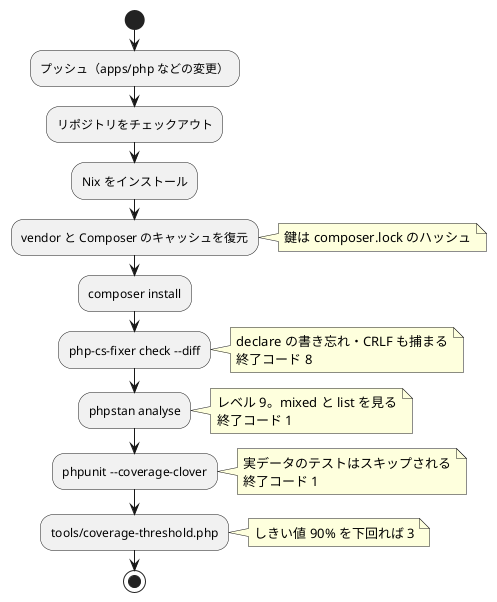

# 第 6 章: タスクランナーと CI/CD

## 6.1 はじめに

前の章で、整形・静的解析・テスト・カバレッジの道具をそろえました。道具は、**実行されなければ意味がありません**。この章では、それらを 1 つの手順にまとめ、プッシュするたびに自動で実行されるようにします。

PHP 版で使うものは次の 4 つです。

| 層 | 道具 | 受け持つこと |
|----|------|------------|
| 言語の道具 | Composer（`composer.json`） | 依存の解決・オートロード・スクリプト |
| 検査の道具 | PHP-CS-Fixer・PHPStan・PHPUnit・自作のしきい値 | 整形・静的解析・テスト・カバレッジ |
| リポジトリのタスクランナー | Gulp（`ops/scripts/`） | 学習データの配置、言語をまたいだ検査の呼び出し、Nix への切り替え |
| 環境と CI | Nix + GitHub Actions | 手元と CI で同じ道具・**同じ拡張** を使う |

Elixir 版では、Mix に「整形も警告も Credo もまとめて」という既定のタスクが無く、コマンドの並びを Gulp と CI に二重に書くことになりました。**Composer にはまとめ役があります。** `composer.json` の `scripts` に `check` を定義すれば、`composer check` の 1 語で 4 つが順に走ります。この違いが、この章の各所に効いてきます。

## 6.2 タスクランナー — Composer

### 使うコマンド

第 5 章までに出てきたものをまとめます。

| コマンド | 内容 |
|---------|------|
| `composer install` | `composer.lock` のとおりに依存を入れる |
| `composer update` | 依存を解決し直し、`composer.lock` を書き換える |
| `composer show --tree` | 依存の木を表示する |
| `composer format` | 整形されているかを検査する |
| `composer lint` | 静的解析を実行する |
| `composer test` | テストを実行する（実データのテストは外す） |
| `composer coverage` | テストとカバレッジを実行し、しきい値を判定する |
| `composer check` | 上の 3 つ（`format`・`lint`・`coverage`）を順に実行する |

`composer run-script --list` を打つと、使えるスクリプトの一覧が出ます。

```bash
composer run-script --list
```

```text
scripts:
  format   Runs the format script as defined in composer.json
  lint     Runs the lint script as defined in composer.json
  test     Runs the test script as defined in composer.json
  coverage Runs the coverage script as defined in composer.json
  check    Runs the check script as defined in composer.json
```

Elixir 版では `mix help` に、標準のタスクと依存として入れた Credo のタスクが **同じ並びで** 出てきました。Composer は違います。ここに出るのは **自分が `composer.json` に書いたものだけ** です。PHPStan を依存に入れても `composer phpstan` は生えてきません。

| | Elixir（Mix） | PHP（Composer） |
|---|---|---|
| 道具の在り処 | 依存に入れると `mix credo` として生えてくる | `vendor/bin/` に実行ファイルが置かれるだけ |
| 呼び方 | `mix credo --strict` | `php vendor/bin/phpstan analyse` か、`scripts` に名前を付ける |
| まとめ役 | **無い**（コマンドの並びを外に書く） | **`scripts` に書ける**（`composer check`） |

どちらが良いという話ではなく、**書く場所が違う** だけです。Mix は道具を名前空間に取り込み、Composer は道具を置くだけにして、呼び方はプロジェクトに決めさせます。Composer のやり方だと `composer.json` を読めば「このプロジェクトで何ができるか」が全部分かるという利点があります。

### 章の処理を実行する

各章には、その章の処理を通しで実行する `run()` があります。

```php
/** 実データでルールによる判定の正解率を表示する。 */
public static function run(?string $csvFile = null): string
{
    $people = self::loadPeople($csvFile ?? Dataset::path('KvsT.csv'));
    [$x, $t] = self::splitFeaturesAndLabels($people);
    $predictions = array_map(self::predictByRule(...), $x);

    return sprintf(
        "データ件数: %d\nルールによる判定の正解率: %.4f\n",
        count($people),
        self::accuracy($predictions, $t),
    );
}
```

呼び方は `php -r` です。

```bash
php -r 'require "vendor/autoload.php"; echo GettingStartedMl\Chapter01::run();'
```

```text
データ件数: 19
ルールによる判定の正解率: 0.7368
```

Clojure 版や Scala 版は、章の名前から関数へのマップを持つ `main` を作り、`clojure -M:run chapter03` のように名前で選んでいました。PHP 版ではその入口を作っていません。

| 言語版 | 呼び方 | 入口のコード |
|-------|-------|------------|
| Clojure 版 | `clojure -M:run chapter03` | `main` 名前空間に章名と関数のマップ（15 行ほど） |
| Elixir 版 | `mix run -e 'GettingStartedMl.Chapter03.run()'` | 無し |
| PHP 版 | `php -r 'require "vendor/autoload.php"; echo GettingStartedMl\Chapter03::run();'` | **無し** |

Elixir 版より打つ文字がさらに長くなっています。`require "vendor/autoload.php"` が要るからです。Mix はアプリケーションを起動してから式を評価しますが、`php -r` は **素の PHP を起動するだけ** なので、オートローダーを自分で読み込む必要があります。

それでも入口を書かないのは、Elixir 版と同じ理由です。章を足すたびに入口を書き換える必要がありません。第 15 章まで進むと章は 12 個になるので、その分だけ触らずに済む場所が増えます。これは記事を読みながら打つコマンドであって、利用者に配る道具ではありません。第 15 章で API を作るときには、`php -r` ではない別の入口（組み込みサーバー）が要ります。

`run()` が `echo` せずに **文字列を返している** ことも思い出してください（第 1 章）。返り値ならテストで確かめられます。表示するのは呼ぶ側の仕事です。

学習データの無い場所を指して実行すると、こうなります。

```bash
ML_DATA_DIR=/nonexistent php -r 'require "vendor/autoload.php"; echo GettingStartedMl\Chapter01::run();'
echo "EXIT=$?"
```

```text
Fatal error: Uncaught InvalidArgumentException: CSV を開けません: /nonexistent/KvsT.csv in .../apps/php/src/Chapter01.php:33
Stack trace:
#0 .../apps/php/src/Chapter01.php(157): GettingStartedMl\Chapter01::loadPeople('/nonexistent/Kv...')
#1 Command line code(1): GettingStartedMl\Chapter01::run()
#2 {main}
  thrown in .../apps/php/src/Chapter01.php on line 33
EXIT=255
```

**探したパスがそのまま表示される** ので、`ML_DATA_DIR` の指し先が間違っていることがすぐ分かります。第 1 章で失敗を例外で表すと決めたのが、この場面で親切に働きます。

スタックトレースの `'/nonexistent/Kv...'` に注目してください。PHP は引数の文字列を 15 文字で打ち切って表示します。**パスの後ろのほうが違っているときは、この表示では見分けられません。** だから例外のメッセージに全部のパスを入れておく必要があります。「トレースがあるからメッセージは短くてよい」とはなりません。

終了コードの 255 に注目してください。PHP は **キャッチされなかった例外で止まったとき 255 を返します**。第 5 章で見た PHP-CS-Fixer の 8 と同じく、「失敗は 1」ではありません。

### 環境変数を渡す

学習データの場所は、第 4 章で見たとおり環境変数で渡します。

```bash
ML_DATA_DIR=/path/to/data php vendor/bin/phpunit
```

PHP は、毎回その場でプロセスを起動するだけなので、環境変数の受け渡しに設定は要りません。Gradle のようにデーモンが常駐して前回の結果を再利用することもないので、「環境変数を変えたのにテストが再実行されない」という問題も起きません。

Composer のスクリプト経由でも同じです。

```bash
ML_DATA_DIR=/path/to/data composer test
```

Composer は子プロセスに環境をそのまま引き継ぎます。

## 6.3 Notebook について

Python 版と Kotlin 版では、この節で Notebook によるデータの探索と、出力セルを消してからコミットする仕組みを扱いました。PHP には広く使われている Notebook の仕組みがありません。本シリーズでは使わず、データの様子は各章の `run()` の出力とテストで確かめています。

PHP で対話的に試すなら `php -a`（対話シェル）があります。ただしこれは **オートローダーを読み込んだ状態で始まりません** し、複数行の定義が扱いにくいので、本シリーズでは `php -r` に 1 行書いて確かめ、分かったことをそのままテストに書き写しています。

Notebook で分かったことをテストに移す流れと、出力セルに学習データが残らないようにする仕組みは、[Python 版の 6.3 節](../python/06-task-runner-and-ci-cd.md)（nbstripout）と [Kotlin 版の 6.3 節](../kotlin/06-task-runner-and-ci-cd.md)（Gradle のタスクで出力セルを検査・削除）を参照してください。グラフによる可視化も、Python 版・Kotlin 版の各章を参照してください。

Notebook を使わない理由は、第 4 章の `.gitignore` の話と同じ筋です。実行結果を含めて保存すると **学習データの中身がリポジトリに入ります**。出力を消す仕組みを別に用意することになり、扱う道具が 1 つ増えます。本シリーズの規模では、テストと `run()` で足ります。

## 6.4 Nix の環境定義

本リポジトリの開発環境は Nix で定義しています。PHP の環境は `ops/nix/environments/php/shell.nix` です。

```nix
{ packages ? import <nixpkgs> {} }:
let
  baseShell = import ../../shells/shell.nix { inherit packages; };
  # カバレッジのために pcov を足した PHP。composer も同じ PHP から取り、
  # php 本体と composer が動く PHP の版がずれないようにする。
  phpWithPcov = packages.php.withExtensions (
    { enabled, all }: enabled ++ [ all.pcov ]
  );
in
packages.mkShell {
  inherit (baseShell) pure;
  buildInputs = baseShell.buildInputs ++ [
    phpWithPcov
    phpWithPcov.packages.composer
    packages.phpactor
  ];
  shellHook = ''
    ${baseShell.shellHook}
    echo "PHP development environment activated"
    echo "  - PHP: $(php --version | head -n 1)"
    echo "  - Composer: $(composer --version --no-interaction 2>/dev/null | head -n 1)"
  '';
}
```

入れているのは 3 つです。検査の道具（PHP-CS-Fixer・PHPStan・PHPUnit）は `require-dev` に入るので、環境に足すものがありません。Elixir 版と同じく **道具の在り処が 1 か所に寄っている** ことの効き目です。

ただし PHP 版には、ほかの言語版に無かった論点があります。**この `shell.nix` は、本シリーズで初めて「環境定義に手を入れないと始められなかった」ものです。**

```nix
  phpWithPcov = packages.php.withExtensions (
    { enabled, all }: enabled ++ [ all.pcov ]
  );
```

第 1 章で見たとおり、素の `packages.php` には xdebug も pcov も入っていません。`php.withExtensions` は「既定で有効な拡張（`enabled`）に、`all` から選んだものを足す」という書き方です。ほかの言語版では、言語を入れればテストもカバレッジも動きました。PHP では **言語とカバレッジが別売り** です。

`phpWithPcov.packages.composer` にも意味があります。拡張を足した PHP には、その PHP で動く Composer が付いてきます。ここを `packages.php83Packages.composer` のままにすると、php 本体が 8.4 で composer が 8.3 で動くという食い違いが起きます（第 1 章・第 5 章）。Clojure 版の「`java` は 25 だが Clojure は JDK 21」、Elixir 版の「`erl` は OTP 28 だが Elixir は OTP 27」と同じ形ですが、**PHP では食い違いを解消できました**。

`shellHook` で版を表示させる意味は 2 つあります。1 つは記事に載せる数値がどの版で得られたかをログから追えること、もう 1 つは **そのコマンドが本当に存在することの証明** になることです。入っていなければ、環境に入った時点でエラーが出ます。

```text
PHP development environment activated
  - PHP: PHP 8.4.16 (cli) (built: Dec 16 2025 16:03:34) (NTS)
  - Composer: Composer version 2.9.2 2025-11-19 21:57:25
```

## 6.5 Composer と Gulp の分担

本リポジトリには、言語ごとの道具とは別に、リポジトリ全体の作業を受け持つ Gulp のタスクがあります（`ops/scripts/`）。第 4 章の `data:setup` もその 1 つです。PHP の品質チェックは、Gulp の `apps:check:php` タスクから実行できます。

```javascript
  {
    name: 'php',
    nix: 'php',
    dir: path.join('apps', 'php'),
    // カバレッジに pcov が要るので、pcov のある Nix の環境でなければ切り替える
    tools: [{ cmd: 'php', version: `php -r 'exit(extension_loaded("pcov") ? 0 : 1);'` }, { cmd: 'composer', version: 'composer --version --no-interaction' }],
    setup: 'composer install --no-interaction',
    // CI（.github/workflows/php-ci.yml）と同じ順に、整形・静的解析・テスト・カバレッジを検査する
    check: 'composer check --no-interaction',
  },
```

2 つ、ほかの言語版と違うところがあります。

**1 つめは `check` が 1 語であることです。** Elixir 版の `check` には `mix format --check-formatted && mix compile --warnings-as-errors && mix credo --strict && mix test --cover` という長い並びが書かれていて、同じ並びが CI にも重複していました。PHP 版は `composer check` だけです。**検査の中身は `composer.json` にしか書かれていません。** 変えるときに直す場所が 1 つ減ります。

**2 つめは `tools` の判定です。** ほかの言語版では、`tools` に書くのは「そのコマンドがあるか」「版が足りているか」を確かめる方法でした。PHP 版はこう書かれています。

```javascript
{ cmd: 'php', version: `php -r 'exit(extension_loaded("pcov") ? 0 : 1);'` }
```

**確かめているのは版ではなく、拡張が入っているかです。** `extension_loaded('pcov')` が真なら終了コード 0、偽なら 1 を返すだけの 1 行の PHP です。これが失敗すると、Gulp は Nix の環境（`nix develop .#php`）に切り替えます。

なぜこう書いたのか。手元の PHP を見ると分かります。

```bash
which php
php --version | head -1
php -r 'echo extension_loaded("pcov") ? "pcov あり" : "pcov なし", PHP_EOL;'
```

```text
/usr/local/bin/php
PHP 8.5.7 (cli) (built: Jun  2 2026 20:59:56) (NTS)
pcov なし
```

手元には PHP 8.5.7 が入っています。**版は十分に新しい**（`composer.json` の `>=8.4` を満たす）のに、pcov が無いのでカバレッジが取れません。版だけを見る判定にしていたら、Gulp は手元の PHP を使い、カバレッジ 0% でしきい値割れになっていたでしょう。**「使えるかどうか」は版だけでは決まりません。**

Elixir 版では、Gulp が手元の Elixir 1.19.5 をそのまま使ってしまい、Nix の 1.18.4 と表示が食い違いました。PHP 版で同じことが起きないのは、拡張の有無という **より厳しい条件** で判定しているからです。結果として、`npx gulp apps:check:php` は常に Nix の中で走ります。

```bash
npx gulp apps:check:php
```

```text
PHP development environment activated
  - PHP: PHP 8.4.16 (cli) (built: Dec 16 2025 16:03:34) (NTS)
  - Composer: Composer version 2.9.2 2025-11-19 21:57:25
PHP CS Fixer 3.95.27 Adalbertus by Fabien Potencier, Dariusz Ruminski and contributors.
PHP runtime: 8.4.16
Loaded config default from ".../apps/php/.php-cs-fixer.dist.php".
Running analysis on 7 cores with 10 files per process.
Using cache file ".php-cs-fixer.cache".

Found 0 of 54 files that can be fixed in 0.654 seconds, 18.00 MB memory used
Note: Using configuration file ".../apps/php/phpstan.neon".

 [OK] No errors

PHPUnit 11.5.56 by Sebastian Bergmann and contributors.

Runtime:       PHP 8.4.16 with PCOV 1.0.11
Configuration: .../apps/php/phpunit.xml

...............................................................  63 / 205 ( 30%)
............................................................... 126 / 205 ( 61%)
............................................................... 189 / 205 ( 92%)
................                                                205 / 205 (100%)

Time: 00:17.459, Memory: 18.00 MB

OK (205 tests, 3429 assertions)

Generating code coverage report in Clover XML format ... done [00:00.013]
行カバレッジ: 98.91% (1358/1373), しきい値: 90.00%
[..] Finished 'apps:check:php' after 42 s
```

出力から読み取れることを並べます。

- **`PHP 8.4.16 with PCOV 1.0.11`** — Nix の中で走り、カバレッジドライバが効いている。この行に `with PCOV` が無ければカバレッジは取れていません
- **`Found 0 of 54 files that can be fixed`** — 整形の対象は `src`・`tests`・`tools` の 54 ファイル。章が増えればこの数も増えます
- **`OK (205 tests, 3429 assertions)`** — 表明の数がテストの数よりずっと多いのは、乱数の範囲を 1000 回確かめるような繰り返しのテストがあるからです（第 2 章）
- **`行カバレッジ: 98.91% (1358/1373)`** — しきい値 90% に対して余裕があります。数値は章が増えるたびに動きます

上の数値は、この章を書いた時点のものです。章を書き進めればファイルもテストも増えるので、**手元で打ったときに同じ数字が出るとは限りません**。一致すべきなのは、正解率のような **アルゴリズムの結果** であって、ファイルの数ではありません。

### 2 つのタスクランナーの分担

| 役割 | Composer（`apps/php`） | Gulp（リポジトリのルート） |
|------|-------------------|------------------------|
| 何を知っているか | ソース・依存・検査の道具・**検査の並び** | 言語ごとのアプリの場所・前提ツール・学習データの場所 |
| 品質チェックの中身 | **持つ**（`scripts.check`） | 持たない。`composer check` を呼ぶだけ |
| 前提ツールが無いとき | 何もできない | Nix の環境（`nix develop .#php`）に切り替える |
| 全言語をまとめて | 扱わない | `apps:check` で、学習データの確認（`data:check`）と全言語の検査を続けて実行する |

Elixir 版・Clojure 版では **検査の並びが Gulp と CI に重複** していて、片方を変えたらもう片方も変える、とコメントで結びつけていました。PHP 版では Gulp の側の重複が消えています。ただし **CI との重複は残ります**（次の節）。CI では「どこで落ちたか」を GitHub の画面で見分けたいので、4 つをステップに分けているからです。

## 6.6 4 つの検査が本当に効いていることを確かめる

設定を書いただけでは、本当に検査されているか分かりません。**わざと違反を入れて落ちることを確かめる** のが確実です。4 つを 1 つずつ壊しました。結果は次のとおりです。

| 壊したもの | コマンド | 終了コード |
|-----------|---------|----------|
| 整形（`declare` の書き忘れ・`f( int $x )`・`$x+1`） | `php vendor/bin/php-cs-fixer check --diff` | **8** |
| 型（`array $row` と値の型を書かない） | `php vendor/bin/phpstan analyse --no-progress` | **1** |
| 落ちる表明（`assertSame(2, 1 + 1 + 1)`） | `php vendor/bin/phpunit` | **1** |
| カバレッジ（しきい値を 99.9 にする） | `php tools/coverage-threshold.php build/clover.xml 99.9` | **3** |

**4 つとも違う道具で、終了コードは 8・1・1・3 です。** 3 つの値が出てきます。Elixir 版の 1・1・4・2 と、値も並びも違いますが、**「1 とは限らない」という性質は同じ** です。

整形の 8 は、第 5 章で見たとおり失敗の種類を表すビットです。カバレッジの 3 は、自作のスクリプトで決めた値です。**自分で決めた値がここに並んでいる** ことに注目してください。ほかの 3 つは道具の作者が決めた値ですが、4 つめはプロジェクトの約束です。

`&&` でつないだ 1 行や Composer のスクリプトの配列、CI のステップは「0 かどうか」で判断するので、この違いは問題になりません。しかし、たとえば「終了コードが 1 なら失敗として扱い、それ以外は成功」と書いたスクリプトがあれば、整形の失敗とカバレッジ割れを **両方とも見逃します**。値をハードコードせずに `if ! コマンド; then` や `set -e` の形で書く、というのは、こういう場面のための習慣です。

落ちるテストの表示も見ておきます。

```text
1) GettingStartedMl\Tests\ViolationTest::testわざと落ちる
Failed asserting that 3 is identical to 2.

.../apps/php/tests/ViolationTest.php:15

FAILURES!
Tests: 1, Assertions: 1, Failures: 1.
```

`Failed asserting that 3 is identical to 2.` の語順に注意してください。**先に来るのが実際の値、後が期待値です。** `assertSame($expected, $actual)` と引数は期待値が先なので、**引数の順と表示の順が逆** です。Elixir の ExUnit が `left:` と `right:` に式のまま並べたのとは違い、PHPUnit は文にして表示します。慣れるまでは読み違えやすいところです。

クラス名とメソッド名が日本語のまま出ているのは、第 4 章で見たとおり PHP の識別子が日本語を許すからです。`#[TestDox]` を付けたテストは `--testdox` を付けたときにその文言で表示されますが、失敗したときはメソッド名で出ます。**どちらの表示でも読めるように、両方を日本語で書いておく** のが本シリーズのやり方です。

これらの実験は、一時的なファイル（`src/Violation.php`・`tests/ViolationTest.php`）を置いて行い、確かめてから消しました。**壊して確かめたら、必ず元に戻します。**

## 6.7 GitHub Actions による CI

### ワークフロー設定

`.github/workflows/php-ci.yml` です。

```yaml
name: PHP CI

on:
  push:
    branches: [main]
    paths:
      - 'apps/php/**'
      - 'ops/nix/environments/php/**'
      - '.github/workflows/php-ci.yml'
  pull_request:
    paths:
      - 'apps/php/**'
      - 'ops/nix/environments/php/**'
      - '.github/workflows/php-ci.yml'

jobs:
  test:
    runs-on: ubuntu-latest
    steps:
      - uses: actions/checkout@v5

      - uses: cachix/install-nix-action@v31
        with:
          github_access_token: ${{ secrets.GITHUB_TOKEN }}

      - name: Cache Composer packages
        uses: actions/cache@v4
        with:
          path: |
            apps/php/vendor
            ~/.cache/composer
          key: ${{ runner.os }}-php-${{ hashFiles('apps/php/composer.lock') }}
          restore-keys: |
            ${{ runner.os }}-php-

      - name: Install dependencies
        run: |
          nix develop .#php --command bash -c 'cd apps/php && composer install --no-interaction --no-progress'

      - name: Check formatting
        run: |
          nix develop .#php --command bash -c 'cd apps/php && php vendor/bin/php-cs-fixer check --diff'

      - name: PHPStan
        run: |
          nix develop .#php --command bash -c 'cd apps/php && php vendor/bin/phpstan analyse --no-progress'

      # 実データのテストは学習データが無ければ data のグループごとスキップされる
      - name: Test with coverage
        run: |
          nix develop .#php --command bash -c 'cd apps/php && php vendor/bin/phpunit --coverage-clover build/clover.xml'

      # PHPUnit には最低カバレッジのしきい値の機能が無いので、clover の XML を読んで判定する
      - name: Check coverage threshold
        run: |
          nix develop .#php --command bash -c 'cd apps/php && php tools/coverage-threshold.php build/clover.xml 90'
```

### ワークフローのポイント

- **`paths` で対象を絞る** — PHP の実装・Nix の環境定義・このワークフローが変わったときだけ実行します。記事だけの変更や、ほかの言語の変更では実行されません。環境定義を入れてあるのは、PHP の版や拡張を変えたときに CI でも確かめたいからです
- **Nix で環境をそろえる** — `nix develop .#php` で、`shell.nix` に定義した環境（PHP 8.4.16・pcov 付き・Composer 2.9.2）に入ってからコマンドを実行します。**pcov が無い環境ではカバレッジが 0 になり、しきい値割れで落ちます**。GitHub の Ubuntu ランナーに入っている PHP を使わず、必ず Nix の中で走らせる理由はここにあります
- **`composer install` を独立したステップにする** — 依存の取得が失敗したのか、検査が失敗したのかを、GitHub の画面で区別できるようにします。`--no-progress` は、対話的でない環境で進捗の表示が不要だからです
- **`composer check` ではなく 4 つに分ける** — 手元では `composer check` の 1 語ですが、CI では 4 つのステップに分けました。どこで落ちたかが一目で分かるからです。順番と中身は同じです。**この重複だけは残ります**
- **`--coverage-clover` のテストはグループを外さない** — `composer test` と違い、`--exclude-group data` を付けていません。CI に学習データは無いので、実データのテストは `markTestSkipped` で飛ばされます（第 4 章）。データを置ける環境で同じ CI を動かせば、実データのテストも走ります
- **キャッシュの鍵は `composer.lock` のハッシュ** — `composer.lock` が変わらなければ、依存も変わりません（第 5 章）。Clojure 版はロックファイルが無いので `deps.edn` のハッシュを使っていましたが、PHP にはロックがあるので、本来の意味どおりの鍵が使えます
- **キャッシュするのは `vendor` と `~/.cache/composer` の 2 つ** — `vendor/` は展開した依存、`~/.cache/composer` は Composer がダウンロードした ZIP の置き場です。後者があると、`vendor/` のキャッシュが外れたときでもネットワークからの取得をやり直さずに済みます
- **学習データは置かない** — 学習データは再配布できないので CI には置きません
- **カバレッジは失敗しうる** — しきい値 90% を下回れば終了コード 3 で失敗します（第 5 章）

### `vendor` をキャッシュすることの落とし穴

`vendor/` をキャッシュに含めるのは効きますが、注意が要ります。`vendor/` には依存のソースだけでなく、**Composer が生成したオートローダー**（`vendor/autoload.php` と `vendor/composer/autoload_*.php`）も入ります。ここには `src/` のクラスとファイルの対応が焼き込まれています。

`restore-keys` で前のキャッシュが復元されると、古いオートローダーが残った状態で始まります。`composer install` を毎回走らせているので通常は作り直されますが、**`composer.json` の `autoload` を変えたのにキャッシュが効いて古い対応が残る** という筋道はありえます。第 5 章で見たとおり、オートロードの食い違いは「クラスが無い」という分かりにくい失敗になります。

もし妙な失敗が続いたら、キャッシュの鍵に `composer.json` のハッシュも混ぜるか、GitHub の画面からキャッシュを消します。**キャッシュは速さのための最適化であって、正しさの前提にしてはいけません。**

### CI パイプラインの流れ



## 6.8 三種の神器と CI

第 4〜6 章で整えたものを、ソフトウェア開発の「三種の神器」（バージョン管理・テスティング・自動化）に当てはめると次のようになります。

| 三種の神器 | 道具 | 本シリーズでの使い方 |
|-----------|------|------------------|
| バージョン管理 | Git、Conventional Commits、`.gitignore`、`.gitattributes`、`composer.lock` | 学習データ・`vendor/`・`build/`・モデル・道具のキャッシュをコミットしない。`composer.lock` はコミットする。改行は PHP-CS-Fixer と Git の 2 層で LF にそろえる |
| テスティング | PHPUnit、pcov、自作のしきい値 | 単体テストは架空の値、実データのテストは `#[Group('data')]` と `markTestSkipped` の二段構え。しきい値は自分で書く |
| 自動化 | Composer の `scripts`、PHP-CS-Fixer、PHPStan、GitHub Actions、Nix、Gulp | 環境と**拡張**の再現、品質チェックの一括実行、データの配置、CI |

### 利用可能なコマンド一覧

| コマンド | 内容 | 実行する場所 |
|---------|------|------------|
| `npx gulp data:setup` | 学習データを配置する | リポジトリのルート |
| `npx gulp data:check` | 学習データの配置を確認する | リポジトリのルート |
| `npx gulp apps:check:php` | PHP の品質チェックを実行する（pcov が無ければ Nix の中で） | リポジトリのルート |
| `composer install` | 依存を入れる | `apps/php` |
| `composer show --tree` | 依存の木を表示する | `apps/php` |
| `composer format` | 整形されているかを検査する | `apps/php` |
| `php vendor/bin/php-cs-fixer fix` | コードを整形する | `apps/php` |
| `composer lint` | 静的解析を実行する | `apps/php` |
| `composer test` | テストを実行する（実データのテストを外す） | `apps/php` |
| `composer coverage` | テストとカバレッジを実行し、しきい値を判定する | `apps/php` |
| `composer check` | 整形・静的解析・カバレッジをまとめて実行する | `apps/php` |
| `php -r 'require "vendor/autoload.php"; echo GettingStartedMl\Chapter03::run();'` | 章の処理を実行する（学習データが必要） | `apps/php` |

## 6.9 まとめ

この章では、品質チェックを自動化し、どの環境でも同じ手順で実行できるようにしました。

1. **Composer にはまとめ役がある** — `scripts` に `check` を書けば `composer check` の 1 語で 4 つが走る。Elixir 版が Gulp と CI に検査の並びを二重に書いていたのに対し、Gulp 側の重複が消える。そのかわり、依存に入れた道具が `composer phpstan` として生えてくることはない
2. **章の実行に入口を書かない** — `php -r 'require "vendor/autoload.php"; echo ...::run();'` でクラスとメソッドを直に指定する。オートローダーの読み込みが要るぶん Elixir 版より長いが、章を足しても触る場所が増えない。**キャッチされない例外で止まると終了コードは 255**
3. **Nix の環境定義に手を入れた** — 素の `packages.php` に pcov が無く、本シリーズで初めて「環境定義を直さないと始められない」言語版になった。`php.withExtensions` で拡張を足し、`phpWithPcov.packages.composer` で composer の版もそろえた
4. **Gulp の判定を拡張の有無にした** — 手元の PHP 8.5.7 は版としては十分だが pcov が無い。**「使えるかどうか」は版だけでは決まらない**。この判定のおかげで `apps:check:php` は常に Nix の中で走り、Elixir 版で起きた「手元と Nix で表示が食い違う」問題が起きない
5. **4 つとも壊して確かめた** — 終了コードは 8・1・1・3。4 つめは自分で決めた値。「0 かどうか」で判断する限り問題ないが、値をハードコードするスクリプトは整形とカバレッジの失敗を見逃す
6. **GitHub Actions** — Nix で環境をそろえ、手元と同じ検査を 4 つのステップに分けて実行する。キャッシュの鍵は `composer.lock` のハッシュにし、`vendor` と Composer のダウンロードの置き場の両方を保存する。`vendor` にはオートローダーが焼き込まれているので、キャッシュを正しさの前提にしない

第 2 部で、TDD を回し続けるための道具立てがそろいました。次の第 3 部では、回帰問題と、欠損値・カテゴリ値・外れ値を含む現実的なデータの前処理に取り組みます。第 7 章では、正規方程式を自作してから Rubix ML と突き合わせます。そこで **Rubix ML に素の線形回帰が無い** という、この言語版の性格を決めた事実に正面から向き合います。
