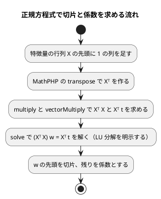

# 第 7 章: 線形回帰による数値予測

## 7.1 はじめに

第 1〜3 章では、グループを当てる **分類** を扱いました。この章からは、数値そのものを当てる **回帰** に進みます。題材は、映画の SNS での反響や主演俳優の露出度から、興行収入を予測する問題です。

この章では、最も基本的な回帰モデルである **線形回帰** を自作します。[Java 版の第 7 章](../java/07-linear-regression.md) は `double[][]` を包んだ行列クラスを作り、[Clojure 版](../clojure/07-linear-regression.md) はベクタのベクタをそのまま行列として扱い、どちらも行列の積・転置・ガウスの消去法を自分で書きました。PHP 版はそこまでしません。**MathPHP に行列と連立方程式の解法があるので、自作するのは「正規方程式を組み立てて解く手順」だけ** です（[ADR 013](../../../adr/013-php-ml-libraries.md)）。[Elixir 版](../elixir/07-linear-regression.md) が Nx で同じ立ち位置にいます。

そしてこの章には、PHP 版でいちばん説明が要る事情があります。**Rubix ML には素の線形回帰（`LinearRegression`）がありません。** あるのは L2 正則化つきの `Ridge` だけです。正則化の強さを 0 にしたリッジは最小二乗法そのものなので、それを突き合わせの相手にします。「ライブラリに無いものを、どう代用するか」を決める場面です。

そのうえで、この章には **直前の Elixir 版との対照** があります。Elixir 版では Scholar の線形回帰が実データで最小二乗解に届かず、なぜ届かないのかを突き止めるところまで進みました。PHP 版では同じことが起きるでしょうか。7.9 節で実測します。

Notebook による探索と可視化の節は設けません。散布図で外れ値を確かめる手順は [Python 版](../python/07-linear-regression.md) と [Kotlin 版の 7.13 節](../kotlin/07-linear-regression.md) を参照してください。

## 7.2 線形回帰とは

### 特徴量の重み付きの和で予測する

線形回帰は、予測値を「切片」と「特徴量ごとの係数 × 特徴量」の和で表すモデルです。この章のデータに当てはめると次の式になります。

```text
予測値 = 切片 + 係数1 × SNS1 + 係数2 × SNS2 + 係数3 × actor + 係数4 × original
```

学習とは、訓練データに対して予測値と実測値のずれが最も小さくなるように、切片と係数を決めることです。ずれの大きさには「誤差の 2 乗の合計」を使います。これを最小にする方法を **最小二乗法** と呼びます。

### 正規方程式

最小二乗法の解は、行列を使うと 1 つの式で求められます。特徴量を行列 `X`、実測値をベクトル `t`、切片と係数をまとめたベクトルを `w` とすると、誤差の 2 乗の合計を最小にする `w` は次の **正規方程式** を満たします。

```text
(Xᵀ X) w = Xᵀ t
```

`X` の先頭には、すべての値が 1 の列を足しておきます。この列にかかる係数が切片になります。



逆行列を作らずに連立方程式として解くのは、Python 版・Java 版・Clojure 版・Elixir 版と同じく、そのほうが数値計算の誤差が小さくなるためです。MathPHP にも `inverse()` はありますが、使いません。**この判断が 7.9 節で効いてきます。** Rubix ML の `Ridge` は逆に、`inverse()` を使って同じ正規方程式を解いているからです。

## 7.3 題材とデータ

この章で使うのは `cinema.csv` です。100 本の映画について、次の 6 列が記録されています。

| 列 | 内容 | 欠損値 |
|----|------|-------|
| cinema_id | 映画の ID | なし |
| SNS1 | SNS での反響の数（1 つ目の指標） | 1 件 |
| SNS2 | SNS での反響の数（2 つ目の指標） | なし |
| actor | 主演俳優のメディア露出の指標 | 1 件 |
| original | 原作の有無（0 または 1） | なし |
| sales | 興行収入 | なし |

「SNS1」「SNS2」「actor」「original」が特徴量、「sales」が正解ラベル（予測したい数値）です。`cinema_id` は映画を区別するための番号なので、特徴量には使いません。

第 2 章の `Csv::readTable` はセルを文字列のまま持ち、`Chapter02::number()` で読むときに `float` か `null` にします。列の型を推論する段階が無いので、Kotlin 版が Kotlin DataFrame の型推論で困った問題（SNS1 が `Int?` と推論され、補完した平均値が入らない）は起きません。**型がゆるい言語の、数少ない得をする場面** です。

## 7.4 TODO リストの作成

```text
TODO リスト（第 7 章）

- [ ] 残差・MAE・RMSE・決定係数を計算する
- [ ] 切片と係数を持つモデルを表す
- [ ] 計画行列（先頭が 1 の列）を作る
- [ ] 正規方程式を解いて学習する
- [ ] 外れ値を取り除く
- [ ] 外れ値の除去・分割・補完を 1 つの手順にまとめる
- [ ] Rubix ML の Ridge（正則化 0）と突き合わせる
- [ ] 実データで学習し、係数と評価指標を表示する
```

Java 版・Clojure 版の TODO リストにあった「行列の積」「行列の転置」「ガウスの消去法」の 3 項目が、この章にはありません。MathPHP が持っているからです。第 3 章で決定木を全部自作したのと、ちょうど裏返しになります。

## 7.5 評価指標を計算する

### Red: 残差から始める

回帰の評価指標は、すべて「実測値と予測値の差（残差）」から作れます。まず残差から書きます。

```php
#[TestDox('残差は実測値から予測値を引いた値')]
public function test残差は実測値から予測値を引いた値(): void
{
    $this->assertEqualsWithDelta([1.0, -2.0], Chapter07::residuals([3.0, 1.0], [2.0, 3.0]), 1e-12);
}

#[TestDox('件数が違えば残差を求められない')]
public function test件数が違えば残差を求められない(): void
{
    $this->expectException(InvalidArgumentException::class);
    $this->expectExceptionMessage('件数が違います: 2 と 1');

    Chapter07::residuals([1.0, 2.0], [1.0]);
}
```

### Green

```php
/**
 * 実測値と予測値の差を返す。件数が違えば失敗する。
 *
 * @param list<float> $t 実測値
 * @param list<float> $y 予測値
 *
 * @return list<float>
 */
public static function residuals(array $t, array $y): array
{
    if (count($t) !== count($y)) {
        throw new InvalidArgumentException(sprintf('件数が違います: %d と %d', count($t), count($y)));
    }

    return array_map(static fn (float $actual, float $predicted): float => $actual - $predicted, $t, $y);
}
```

`array_map` に配列を 2 つ渡すと、同じ位置の要素を組にして callback を呼びます。zip に相当する書き方ですが、**長さが違っても落ちず、短いほうが `null` で埋められる** ので、先に件数を確かめておく必要があります。`declare(strict_types=1)` があるので `float $actual` に `null` が来れば `TypeError` になりますが、そこで初めて気づくのでは遅いというだけの話です。

3 つの指標を続けます。

```php
/** 平均絶対誤差（MAE）。誤差の絶対値の平均。 */
public static function meanAbsoluteError(array $t, array $y): float
{
    $residuals = self::residuals($t, $y);

    return array_sum(array_map(abs(...), $residuals)) / count($residuals);
}

/** 平均二乗誤差の平方根（RMSE）。 */
public static function rootMeanSquaredError(array $t, array $y): float
{
    $residuals = self::residuals($t, $y);

    return sqrt(self::sumOfSquares($residuals) / count($residuals));
}

/** 決定係数（R²）。1 から「残差の 2 乗の合計 ÷ 平均との差の 2 乗の合計」を引いた値。 */
public static function r2Score(array $t, array $y): float
{
    $residual = self::sumOfSquares(self::residuals($t, $y));
    $mean = array_sum($t) / count($t);
    $total = self::sumOfSquares(array_map(static fn (float $v): float => $v - $mean, $t));

    if ($total === 0.0) {
        throw new InvalidArgumentException('実測値がすべて同じ値です');
    }

    return 1.0 - $residual / $total;
}
```

`abs(...)` は PHP 8.1 の **第一級callable記法** です。`'abs'` という文字列や `fn ($v) => abs($v)` と書かずに、関数そのものを値として渡せます。文字列で書くより速く、そして **PHPStan が中身を検査できます**。存在しない関数名を書いても、文字列なら実行するまで気づけません。

決定係数の分母が 0 になる場合を弾いているのは、割り算の前に確かめないと `INF` や `NAN` が静かに流れていくからです。PHP の浮動小数点の割り算は 0 除算で例外を投げません（整数の `/` とは違います）。

```php
#[TestDox('完全に当たれば決定係数は 1')]
public function test完全に当たれば決定係数は1(): void
{
    $this->assertEqualsWithDelta(1.0, Chapter07::r2Score([1.0, 2.0, 3.0], [1.0, 2.0, 3.0]), 1e-12);
}

#[TestDox('平均を答え続けると決定係数は 0')]
public function test平均を答え続けると決定係数は0(): void
{
    $this->assertEqualsWithDelta(0.0, Chapter07::r2Score([1.0, 2.0, 3.0], [2.0, 2.0, 2.0]), 1e-12);
}
```

決定係数の 0 と 1 は、定義から意味が決まっている値です。「完全に当たれば 1」「平均を答え続ければ 0」の 2 本があれば、式の形を取り違えていないことがほぼ保証されます。

## 7.6 モデルを表す

### 列名と係数を別々のリストで持つ

学習の結果は「切片」と「列ごとの係数」です。連想配列（`['SNS1' => 1.38, …]`）でも書けますし、PHP の連想配列はキーの順を保ちます。それでも **列名のリストと、同じ順に並んだ係数のリスト** に分けました。

```php
final readonly class LinearModel
{
    /**
     * @param list<string> $columns
     * @param list<float>  $coefficients
     */
    public function __construct(
        public float $intercept,
        public array $columns,
        public array $coefficients,
    ) {
        if (count($columns) !== count($coefficients)) {
            throw new InvalidArgumentException(
                sprintf('列名と係数の数が違います: %d と %d', count($columns), count($coefficients)),
            );
        }
    }
```

理由は 2 つあります。1 つは、正規方程式の解が「先頭が切片、残りが列の順の係数」という **並びのあるベクトル** で返ってくるので、そのまま受け取れること。もう 1 つは、「順がある」ことがコードの型から読み取れることです。`list<float>` は PHPStan にとって「0 から連続した整数キーの配列」を意味し、`array<string, float>` とは別の型です。**連想配列にした瞬間、順に意味があることがコードから消えます。**

`readonly class` なので、作った後は誰も書き換えられません。コンストラクタで件数の食い違いを弾いておけば、**このクラスのインスタンスは常に整合している** と後続のコードが信じられます。

### 列名で係数を読む

```php
/** 列名で係数を読む。無ければ失敗する。 */
public function coefficient(string $column): float
{
    $index = array_search($column, $this->columns, true);

    if ($index === false) {
        throw new InvalidArgumentException("係数がありません: {$column}");
    }

    return $this->coefficients[$index];
}
```

`array_search` の第 3 引数 `true` は厳密比較の指定です。省くと `==` で比べるので、`'0'` と `''` のような組み合わせで取り違えます。**PHP で比較を書くときは、常に厳密なほうを選ぶ** というのが第 1 章からの方針です。

戻り値が `false` か整数なので、`if (!$index)` と書いてはいけません。添字 0（先頭の列）が偽になってしまいます。`=== false` で書きます。

```php
/**
 * 1 行分の特徴量の予測値。係数は列名で対応させるので、特徴量の列の並び順は問わない。
 *
 * @param array<string, float> $features
 */
public function predictOne(array $features): float
{
    $sum = $this->intercept;

    foreach ($this->columns as $index => $column) {
        if (!array_key_exists($column, $features)) {
            throw new InvalidArgumentException("特徴量がありません: {$column}");
        }

        $sum += $this->coefficients[$index] * $features[$column];
    }

    return $sum;
}
```

特徴量は `array<string, float>`（連想配列）で受け取り、モデルは `list`（順のあるリスト）で持つ——この 2 つを使い分けています。特徴量は名前で引くもの、係数は並びのあるものだからです。テストで「並び順が違っても同じ値になる」ことを固定しておきます。

```php
// 列の並び順が違っても、列名で対応させるので同じ値になる。
$this->assertEqualsWithDelta(0.0, $model->predictOne(['b' => 1.0, 'a' => 1.0]), 1e-12);
```

`array_key_exists` を使い、`isset` を使っていないことにも意味があります。`isset($features[$column])` は **値が `null` のときも偽になる** ので、「キーはあるが値が `null`」と「キーが無い」を区別できません。前処理を通したあとの特徴量に `null` は入りませんが、区別できる書き方を選んでおきます。

## 7.7 正規方程式で線形回帰を学習する

### Red: 答えの分かっているデータ

まず、手で解ける 4 点を用意します。切片 1.0、`a` の係数 2.0、`b` の係数 -3.0 で誤差なく当てはまるデータです。

```php
/** @return list<array<string, float>> */
private function squareX(): array
{
    return [
        ['a' => 0.0, 'b' => 0.0],
        ['a' => 1.0, 'b' => 0.0],
        ['a' => 0.0, 'b' => 1.0],
        ['a' => 1.0, 'b' => 1.0],
    ];
}

/** @return list<float> */
private function squareT(): array
{
    return [1.0, 3.0, -2.0, 0.0];
}

#[TestDox('正規方程式で切片と係数を求める')]
public function test正規方程式で切片と係数を求める(): void
{
    $model = Chapter07::fit($this->squareX(), $this->squareT(), ['a', 'b']);

    $this->assertEqualsWithDelta(1.0, $model->intercept, 1e-9);
    $this->assertEqualsWithDelta(2.0, $model->coefficient('a'), 1e-9);
    $this->assertEqualsWithDelta(-3.0, $model->coefficient('b'), 1e-9);
}
```

このデータは、この章を通じて 3 回使います。自作の検証、Rubix ML との突き合わせ、正則化の効き方の確認です。**答えを人間が知っているデータを 1 組用意しておく** と、ライブラリを疑う場面でも足場になります。

### 計画行列

```php
/**
 * 先頭に 1 の列を足した特徴量の行列（計画行列）を作る。1 の列の係数が切片になる。
 *
 * @param list<array<string, float>> $x
 * @param list<string>               $columns
 *
 * @return list<list<float>>
 */
public static function designMatrix(array $x, array $columns): array
{
    return array_map(
        static fn (array $features): array => [1.0, ...self::featureRow($features, $columns)],
        $x,
    );
}
```

`[1.0, ...$row]` はスプレッド演算子です。PHP 8.1 から文字列キーの展開もできるようになりましたが、ここではリストを前に 1 つ伸ばすだけに使っています。`array_merge([1.0], $row)` より速く、読みやすい書き方です。

### Green: 学習

```php
public static function fit(array $x, array $t, array $columns): LinearModel
{
    if ($x === []) {
        throw new InvalidArgumentException('訓練データが空です');
    }

    if (count($x) !== count($t)) {
        throw new InvalidArgumentException(
            sprintf('特徴量と実測値の件数が違います: %d と %d', count($x), count($t)),
        );
    }

    $design = MatrixFactory::createNumeric(self::designMatrix($x, $columns));
    $transposed = $design->transpose();

    // getVector は int と float の混ざった配列を返すので、float に寄せてから使う。
    $weights = array_map(
        floatval(...),
        array_values(
            $transposed->multiply($design)
                ->solve($transposed->vectorMultiply(new Vector($t)), NumericMatrix::LU)
                ->getVector(),
        ),
    );

    return new LinearModel($weights[0], $columns, array_slice($weights, 1));
}
```

MathPHP の `solve()` は、既定では「状況に応じて解き方を選ぶ」ようになっています。2×2 なら逆行列、逆行列が計算済みならそれを使い、そうでなければ LU 分解、失敗すれば QR 分解……という順です。**便利ですが、行列の中身によって解き方が変わるということです。** 数値を他の言語版と突き合わせる本シリーズでは困るので、`NumericMatrix::LU` を明示して固定しました。

`floatval(...)` で float に寄せているのは、`getVector()` の戻り値が `array<float|int>` と宣言されているためです。PHPStan のレベル 9 は「`list<float>` を期待しているのに `array<float|int>` が来た」と正しく指摘します。**キャストで黙らせるのではなく、実際に変換する** のが筋です。

`$x === []` で空を判定しているのは、`empty($x)` を避けるためです。`empty()` は `'0'`・`0`・`'0.0'` ではない `0.0` など、驚くほど多くの値を真と見なします。配列が空かどうかを知りたいなら `=== []` が最も正確です。

## 7.8 外れ値の除去・分割・補完をまとめる

### 外れ値を取り除く

散布図を見ると、SNS2 が極端に大きいのに興行収入が小さい映画が 1 本だけあります（可視化の手順は [Python 版](../python/07-linear-regression.md) を参照）。この 1 本を外れ値として取り除きます。

```php
/** SNS2 がこの値を超え、かつ興行収入が OUTLIER_SALES 未満の映画を外れ値とする。 */
private const float OUTLIER_SNS2 = 1000.0;
private const float OUTLIER_SALES = 8500.0;

/** 外れ値かどうかを判定する。 */
public static function isOutlier(array $row): bool
{
    return self::requiredNumber($row, 'SNS2') > self::OUTLIER_SNS2
        && self::requiredNumber($row, self::TARGET) < self::OUTLIER_SALES;
}

/** 外れ値の行を除いた表を返す。列はそのまま残す。 */
public static function removeOutliers(Table $table): Table
{
    $rows = array_values(
        array_filter($table->rows, static fn (array $row): bool => !self::isOutlier($row)),
    );

    return new Table($table->columns, $rows);
}
```

`private const float OUTLIER_SNS2 = 1000.0;` の `float` は **PHP 8.3 で入った定数の型宣言** です。型を書いておくと、`= '1000'` のような書き間違いをその場で弾けます。定数に型が書けるのは、Ruby 版・Python 版には無い道具です。

`array_filter` の結果を `array_values` で包んでいるのは、**`array_filter` が元の添字を残す** からです。3 番目の行を落とすと `[0, 1, 3, 4, …]` という飛び飛びの添字の配列になり、PHPStan の `list<T>` を満たさなくなります。第 2 章でも同じ包み直しをしました。**PHP の配列は「リスト」と「連想配列」が同じ型なので、リストであり続けるには意識して保つ必要があります。**

```php
#[TestDox('外れ値は SNS2 が大きく興行収入が小さい行')]
public function test外れ値の判定(): void
{
    $table = Csv::parseTable("SNS2,sales\n1200,8000\n1200,9000\n900,8000\n");

    $this->assertCount(2, Chapter07::removeOutliers($table)->rows);
    // 列はそのまま残る。
    $this->assertSame(['SNS2', 'sales'], Chapter07::removeOutliers($table)->columns);
}
```

テストのデータは架空の値で作っています。学習データの行をコードやテストに書き写すことはしません（[第 1 章](01-machine-learning-and-first-test.md) の方針）。境界の両側（SNS2 が 1200 と 900、sales が 8000 と 9000）を並べて、`&&` の両方が効いていることを確かめています。

### 前処理を 1 つの関数にまとめる

```php
/**
 * cinema.csv を読み込み、外れ値を除き、分割してから訓練データの平均値で両方を補完する。
 *
 * @return array{xTrain: list<array<string, float>>, xTest: list<array<string, float>>, tTrain: list<float>, tTest: list<float>}
 */
public static function prepareCinema(string $path, float $testSize, int $seed): array
{
    $rows = self::removeOutliers(Chapter02::loadTable($path))->rows;
    $t = array_map(
        static fn (array $row): string => (string) self::requiredNumber($row, self::TARGET),
        $rows,
    );
    $split = Chapter02::splitTrainTest($rows, $t, $testSize, $seed);
    $means = Chapter02::columnMeans($split['xTrain'], self::FEATURE_COLUMNS);

    return [
        'xTrain' => Chapter02::fillMissing($split['xTrain'], self::FEATURE_COLUMNS, $means),
        'xTest' => Chapter02::fillMissing($split['xTest'], self::FEATURE_COLUMNS, $means),
        'tTrain' => array_map(floatval(...), $split['tTrain']),
        'tTest' => array_map(floatval(...), $split['tTest']),
    ];
}
```

順番が重要です。**外れ値を除いてから分割し、訓練データだけから平均を求めて、両方を補完します。** テストデータの平均を補完に混ぜると、テストデータの情報が訓練に漏れます（リーク）。第 2 章で立てた約束をそのまま使っています。

戻り値の型 `array{xTrain: …, xTest: …, tTrain: …, tTest: …}` は PHPStan の **配列の形（array shape）** です。実行時には何の検査もされない、ただの連想配列です。それでも、`$split['xTrian']` と打ち間違えれば PHPStan が止めてくれますし、`$split['xTrain']` の要素の型まで追いかけてくれます。**実行時に効く型と、静的解析だけが見る型の二層構造** が、PHP 版の全編を貫く形です（[第 5 章](05-package-management-and-static-analysis.md)）。

第 2 章の `splitTrainTest` は正解ラベルを `list<string>` で受け取る設計なので、数値のラベルをいったん文字列にして渡し、返ってきたものを float に戻しています。回りくどく見えますが、**第 2 章の分割を「分類でも回帰でも同じもの」として使い回す** ための代償です。分割の並びが Java 版・Elixir 版と一致するという性質は、この 1 つの関数に閉じ込めてあります。

## 7.9 Rubix ML の Ridge に置き換える

### 素の線形回帰が無い

ここが、この章でいちばん説明の要る場面です。Rubix ML の `Regressors` ディレクトリを見ると、こうなっています。

```console
$ ls vendor/rubix/ml/src/Regressors/
Adaline.php   ExtraTreeRegressor.php   GradientBoost.php   KDNeighborsRegressor.php
KNNRegressor.php   MLPRegressor.php   RadiusNeighborsRegressor.php   RegressionTree.php
Ridge.php   SVR.php
```

`LinearRegression.php` がありません。決定木もランダムフォレストも持っている Rubix ML が、いちばん基本的な線形回帰を持っていないのです。

代わりに `Ridge` があります。リッジ回帰は「誤差の 2 乗の合計」に「係数の 2 乗の合計 × 正則化の強さ」を足したものを最小にするモデルで、**正則化の強さを 0 にすれば最小二乗法そのもの** になります。正則化そのものは第 12 章で扱うので、ここでは「`Ridge(0.0)` が線形回帰である」という事実だけを使います。

```php
/**
 * Rubix ML の `Ridge` で学習し、自作と同じ形のモデルにする。
 *
 * Rubix ML は切片（bias）を自分で足すので、計画行列ではなく特徴量をそのまま渡す。
 * `l2Penalty` の既定は 1.0 なので、最小二乗にするには 0.0 を明示する。
 */
public static function rubixFit(array $x, array $t, array $columns, float $l2Penalty = 0.0): LinearModel
{
    if ($x === []) {
        throw new InvalidArgumentException('訓練データが空です');
    }

    $samples = array_map(static fn (array $f): array => self::featureRow($f, $columns), $x);
    $ridge = new Ridge($l2Penalty);
    $ridge->train(new Labeled($samples, $t));

    $bias = $ridge->bias();
    $coefficients = $ridge->coefficients();

    if ($bias === null || $coefficients === null) {
        throw new InvalidArgumentException('リッジの学習に失敗しました');
    }

    return new LinearModel($bias, $columns, array_map(floatval(...), array_values($coefficients)));
}
```

渡すのは `designMatrix()` ではなく `featureRow()` の並び、つまり **1 の列を足さない特徴量** です。Rubix ML は切片を自分で足すので、こちらで足すと切片が二重になります。Elixir 版が Scholar に対して同じ注意をしていました。

`$l2Penalty` の既定が **1.0** であることも落とし穴です。`new Ridge()` と書くと、正則化が効いた別のモデルになります。既定値が「何もしない」でないライブラリは、**引数を省かずに書く** のが安全です。

`bias()` と `coefficients()` が `null` を返しうるのは、学習前に呼ばれた場合のためです。`train()` の直後なので実際には `null` になりませんが、PHPStan のレベル 9 は「`?float` を `float` に渡している」と正しく指摘します。**型で弾かれたところに、本当に起こりうる状態が 1 つ隠れている** という指摘なので、キャストではなく判定で応えます。

### 条件のよいデータでは一致する

```php
#[TestDox('条件のよいデータなら Rubix ML のリッジと一致する')]
public function test条件のよいデータならリッジと一致する(): void
{
    $mine = Chapter07::fit($this->squareX(), $this->squareT(), ['a', 'b']);
    $theirs = Chapter07::rubixFit($this->squareX(), $this->squareT(), ['a', 'b']);

    $this->assertEqualsWithDelta($mine->intercept, $theirs->intercept, 1e-9);
    $this->assertEqualsWithDelta($mine->coefficient('a'), $theirs->coefficient('a'), 1e-9);
    $this->assertEqualsWithDelta($mine->coefficient('b'), $theirs->coefficient('b'), 1e-9);
}
```

通ります。切片 1.0、係数 2.0 と -3.0 がぴったり返ってきます。

ついでに「正則化を強めると係数が 0 に近づく」ことも固定しておきます。`Ridge(0.0)` が最小二乗だという主張の、裏側からの確認です。

```php
#[TestDox('正則化を強めるとリッジの係数は 0 に近づく')]
public function test正則化を強めるとリッジの係数は0に近づく(): void
{
    $plain = Chapter07::rubixFit($this->squareX(), $this->squareT(), ['a', 'b']);
    $penalized = Chapter07::rubixFit($this->squareX(), $this->squareT(), ['a', 'b'], 10.0);

    $this->assertLessThan(abs($plain->coefficient('a')), abs($penalized->coefficient('a')));
    $this->assertLessThan(abs($plain->coefficient('b')), abs($penalized->coefficient('b')));
}
```

### 実データでも一致する

さて、Elixir 版では実データで一致しませんでした。PHP 版はどうでしょうか。

```php
#[Group('data')]
#[TestDox('実データで自作とリッジの係数が一致する')]
public function test実データで自作とリッジの係数が一致する(): void
{
    // …（データが無ければ markTestSkipped）
    $mine = Chapter07::fit($split['xTrain'], $split['tTrain'], $columns);
    $theirs = Chapter07::rubixFit($split['xTrain'], $split['tTrain'], $columns);

    $this->assertEqualsWithDelta($mine->intercept, $theirs->intercept, 1e-6);

    foreach ($columns as $column) {
        $this->assertEqualsWithDelta($mine->coefficient($column), $theirs->coefficient($column), 1e-9);
    }
}
```

**通ります。** 実測した値を並べます。

| 列 | 自作（MathPHP の LU 分解） | Rubix ML の `Ridge(0.0)` |
|----|------------------------|------------------------|
| 切片 | 6114.5955056944 | 6114.5955056945 |
| SNS1 | 1.3803702543274086 | 1.3803702543274112 |
| SNS2 | 0.52177974764555191 | 0.52177974764555191 |
| actor | 0.29000510327204215 | 0.29000510327202567 |
| original | 208.88268148822766 | 208.88268148823408 |

有効数字 12〜13 桁まで一致しています。Elixir 版では `original` が 209 と 579 に分かれていた場所です。

残差平方和も比べておきます。最小二乗解はただ 1 つなので、**両方が解に届いていれば残差平方和も一致するはず** です。

```php
// 最小二乗解はただ 1 つなので、両方が解に届いていれば残差平方和も一致する。
$this->assertEqualsWithDelta($mineSse, $theirsSse, 1e-6);
```

| モデル | 訓練データの残差平方和 |
|--------|---------------------|
| 自作（MathPHP の LU 分解） | 11083165.678050069 |
| Rubix ML の `Ridge(0.0)` | 11083165.678050065 |

最後の 1 桁だけが違います。**同じ解に、違う道筋で届いた** ということです。

### なぜ Elixir では届かず、PHP では届いたのか

Rubix ML の `Ridge::train()` を読むと、理由がはっきりします。

```php
// vendor/rubix/ml/src/Regressors/Ridge.php
$biases = Matrix::ones($dataset->numSamples(), 1);
$x = Matrix::build($dataset->samples())->augmentLeft($biases);
$y = Vector::build($dataset->labels());
// …（正則化の対角行列 $penalties を作る。先頭＝切片の分は 0）
$xT = $x->transpose();

$coefficients = $xT->matmul($x)
    ->add($penalties)
    ->inverse()
    ->dot($xT->dot($y))
    ->asArray();
```

**自作とまったく同じことをしています。** 1 の列を先頭に足し（`augmentLeft`）、`Xᵀ X` を作り、正則化の対角行列を足して（0 なら何も足さない）、解く。違うのは最後の一手だけで、Rubix ML は `inverse()` で逆行列を作ってから掛け、自作は `solve()` で連立方程式として解きます。

一方、Elixir 版の Scholar は `Nx.LinAlg.pinv`（特異値分解による擬似逆行列）で解いていました。この 2 つの差が、そのまま結果の差になりました。

| | 解き方 | 桁の違う列が混ざったデータでの結果 |
|---|-------|------------------------------|
| 自作（PHP・Elixir・Java・Clojure） | 正規方程式を消去法・LU 分解で解く | 最小二乗解 |
| Rubix ML の `Ridge` | 正規方程式を逆行列で解く | 最小二乗解（12 桁まで一致） |
| Scholar の `LinearRegression` | 特異値分解で擬似逆行列を作る | **最小二乗解に届かない** |

教科書は「逆行列を作るより連立方程式として解くほうが誤差が小さい」と書きますし、それは正しいのですが、**この規模（5×5）・この条件の行列では、実用上の差は最後の 1 桁だけ** でした。そして SVD のほうが数値的に安定とされているのに、Elixir 版では届きませんでした。Elixir 版が突き止めたとおり、原因はアルゴリズムの理論ではなく `Nx.BinaryBackend` の SVD の実装精度だったからです。

**「どのアルゴリズムか」より「その実装がどれだけ正確か」のほうが効く場合がある。** 2 つの言語版を並べて初めて言えることです。

### 何を学んだか

Elixir 版は「ライブラリと一致しなかったので、なぜかを突き止める」章になりました。PHP 版は一致したので、代わりに次の 2 つが残りました。

1. **無いものを何で代用するかを、定義から決める** — 「`Ridge(0.0)` は最小二乗である」は、リッジ回帰の定義から出てくる事実です。そう決めたうえで、答えの分かっているデータで一致を確かめ、正則化を強めると係数が縮むことも確かめました。**代用は、それが代用として成り立つ理由と、成り立っていることを示すテストとで支えます**
2. **ライブラリのソースを読む** — `composer install` が `vendor/` にソースをそのまま置くので、読むのに何の準備も要りません。Elixir の `deps/` と同じです。「同じ正規方程式を解いている」ことを確かめられたからこそ、一致を偶然ではなく当然として書けます

## 7.10 実データで学習・評価する

### 結果を表示する

第 1〜3 章と同じく、章ごとの `run()` に結果の表示をまとめます。ほかの言語版と同じく、標準出力に書かずに **文字列を返します**（[第 1 章](01-machine-learning-and-first-test.md) の方針）。

```console
$ php -r 'require "vendor/autoload.php"; echo GettingStartedMl\Chapter07::run();'
データ件数: 100
外れ値を除いた件数: 99
訓練データ: 79 件, テストデータ: 20 件
切片: 6114.60
係数: SNS1=1.3804, SNS2=0.5218, actor=0.2900, original=208.8827
Rubix ML の切片: 6114.60, 係数: SNS1=1.3804, SNS2=0.5218, actor=0.2900, original=208.8827
テストデータの評価: R2=0.6184, MAE=302.20, RMSE=376.14
```

この出力を、テストで 1 行ずつ固定します。

```php
#[Group('data')]
#[TestDox('実データの学習と評価がほかの言語版と一致する')]
public function test実データの学習と評価が一致する(): void
{
    if (!Dataset::exists('cinema.csv')) {
        $this->markTestSkipped('学習データがありません: ' . Dataset::path('cinema.csv'));
    }

    $output = Chapter07::run();

    $this->assertStringContainsString('データ件数: 100', $output);
    $this->assertStringContainsString('外れ値を除いた件数: 99', $output);
    $this->assertStringContainsString('訓練データ: 79 件, テストデータ: 20 件', $output);
    $this->assertStringContainsString('切片: 6114.60', $output);
    $this->assertStringContainsString(
        '係数: SNS1=1.3804, SNS2=0.5218, actor=0.2900, original=208.8827',
        $output,
    );
    $this->assertStringContainsString('テストデータの評価: R2=0.6184, MAE=302.20, RMSE=376.14', $output);
}
```

実データを使うテストには `#[Group('data')]` を付け、`Dataset::exists()` が偽なら `markTestSkipped` します。`composer test` は `--exclude-group data` 付きで走るので、データを持たない読者の環境でも検査が通ります。

`sprintf('%.4f', …)` はロケールに依存しません。PHP の `printf` 系はロケールの小数点を使わないので、環境によって `6114,60` になることはありません（`number_format` は違います）。

### ほかの言語版との一致

**この章の数値は、Java 版・Scala 版・Clojure 版・Elixir 版の第 7 章とすべて一致しました。**

| 項目 | PHP 版 | Java 版・Scala 版・Clojure 版・Elixir 版 |
|------|-------|----------------------------------|
| データ件数 | 100 | 100 |
| 外れ値を除いた件数 | 99 | 99 |
| 訓練データ・テストデータ | 79 件・20 件 | 79 件・20 件 |
| 切片 | 6114.60 | 6114.60 |
| 係数 | SNS1=1.3804, SNS2=0.5218, actor=0.2900, original=208.8827 | 同じ |
| R²・MAE・RMSE | 0.6184・302.20・376.14 | 同じ |

切片は完全な精度でも 6114.5955056944 で、Elixir 版の 6114.595505694404 と 13 桁目まで一致します。

一致した理由は 2 つです。

1. **分割が同じ** — 第 2 章で `java.util.Random` と同じ 48 ビットの線形合同法を自作し、Fisher-Yates も同じ手順にそろえました。同じシードなら同じ行が同じ側に入ります
2. **倍精度で計算している** — PHP の `float` は IEEE 754 の倍精度で、JVM の `double` と同じ表現・同じ丸めです。Nx のように「既定が単精度」という罠がありません。**型を書かなくても倍精度なのは、PHP では数値の型が 1 つしかないから** です

ただし、**「同じ計算をしている」わけではありません**。Java 版・Clojure 版はガウスの消去法を自分で書き、Elixir 版は `Nx.LinAlg.solve/2` を呼び、PHP 版は MathPHP の LU 分解を呼んでいます。残差平方和の最後の 1 桁が Rubix ML と違っていたのと同じ理由で、**表示の桁（小数第 2 位・第 4 位）で一致していることを確かめただけ** です。どの桁までの一致を主張しているかは、書く側が意識する必要があります。

### 係数を読む

係数は「その特徴量が 1 増えたとき、ほかの特徴量が同じなら、予測値がどれだけ増えるか」を表します。

- `original=208.8827`: 原作がある映画は、ない映画より興行収入の予測が約 209 大きい
- `SNS1=1.3804`・`SNS2=0.5218`: SNS での反響が 1 増えるごとに、予測が約 1.38・約 0.52 大きくなる
- `actor=0.2900`: 主演俳優の露出の指標が 1 増えるごとに、予測が約 0.29 大きくなる

係数の大きさは、特徴量の単位に左右されます。この 4 列は桁が 4 つ以上違うので、係数の大小をそのまま「影響の大きさ」と読むことはできません。影響の大きさを比べるには、標準化してから学習します。標準化は第 9 章で扱います。

### 評価指標を読む

テストデータの決定係数は 0.6184 です。興行収入のばらつきのうち、約 62% をこのモデルで説明できているという意味になります。MAE は 302.20 で、平均すると約 302 の誤差で当たっています。RMSE は 376.14 で、MAE より大きくなっています。**RMSE が MAE より大きいのは、大きく外した予測がいくつかある** ことを示します。2 乗するので、大きな誤差の影響が強く出るためです。

## 7.11 品質チェック

`nix develop .#php` の中で、整形・静的解析・テストを順に実行します（第 7 章・第 8 章の分だけを走らせたところ）。リポジトリ全体の検査は `npx gulp apps:check:php` でまとめて実行します。

```console
$ vendor/bin/php-cs-fixer check --diff
Found 0 of 44 files that can be fixed in 1.527 seconds, 36.00 MB memory used
$ vendor/bin/phpstan analyse --no-progress
 [OK] No errors
$ vendor/bin/phpunit --filter 'Chapter07|Chapter08'
OK (71 tests, 181 assertions)
```

この章で書いたコードのカバレッジは次のとおりです。

| ファイル | 行カバレッジ |
|---------|------------|
| `src/Chapter07.php` | 99.0%（103 行中 102 行） |
| `src/LinearModel.php` | 100% |

`Chapter07.php` の残る 1 行は、7.9 節で触れた `bias()` が `null` を返す場合の分岐です。`train()` の直後なので実際には起こりませんが、型としては起こりうるので残してあります。**「型のために書いたが実行されない行」がカバレッジに残る** のは、`null` を許す型を持つ言語で必ず出会う小さな摩擦です。`@phpstan-ignore` で黙らせるよりは、1 行のカバレッジを諦めるほうを選びました。

### 検査に 3 回止められた

1. **`array_values` が無意味** — `array_slice($weights, 1)` の結果はすでにリストなのに `array_values()` で包んでいて、「呼んでも効果がない」と指摘されました（`arrayValues.list`）。第 2 章では逆に「`array_values()` で包み直さないと list とは限らない」と言われていたので、**どちらが必要かを PHPStan に教わりながら書く** ことになります
2. **`int` と `float` の混ざった配列** — `getVector()` の戻り値をそのまま `list<float>` のところに渡していて止まりました。`floatval(...)` で実際に変換して直しました
3. **`mixed` を float にキャストできない** — Rubix ML の `samples()` は `list<list<mixed>>` を返すので、`(float) $sample[0]` が通りませんでした。`is_numeric()` で確かめてから変換する形に書き直しました。第 8 章で Rubix ML の前処理を触るときにも同じことが起きます

どれも「動くけれど、書き手の思い込みがコードに残っている」場所でした。レベル 9 は、**ライブラリの境界で型がゆるむところを正確に突いてきます。**

## 7.12 まとめ

この章では、MathPHP の行列を使って正規方程式による線形回帰を PHP の TDD で実装しました。

1. **行列を自作しない** — MathPHP があるので、Java 版・Clojure 版が書いた行列の積・転置・ガウスの消去法が要らなかった。TODO リストの先頭 3 項目がまるごと消えた。第 3 章の決定木を全部自作したのとちょうど裏返しになる
2. **`solve()` の解き方を明示する** — MathPHP の `solve()` は既定で「行列の中身に応じて解き方を選ぶ」。数値を突き合わせる本シリーズでは `NumericMatrix::LU` を明示して固定した
3. **素の線形回帰が無いので `Ridge(0.0)` で代用した** — Rubix ML には `LinearRegression` が無い。代用は「リッジの正則化が 0 なら最小二乗である」という定義から決め、答えの分かっているデータと正則化の効き方の 2 本のテストで支えた
4. **既定値が「何もしない」でない引数は省かない** — `new Ridge()` の `l2Penalty` は 1.0。省くと別のモデルになる
5. **実データでも一致した** — 切片も係数も 12〜13 桁、残差平方和は最後の 1 桁だけの差だった。**Rubix ML が自作と同じ正規方程式を `inverse()` で解いている** ことをソースで確かめた
6. **Elixir 版との対照が立った** — Scholar は SVD で解くので最小二乗解に届かなかった。同じ「ライブラリと突き合わせる」章が、ライブラリの解き方の違いで正反対の結末になった。**アルゴリズムの理論的な安定性より、その実装の精度のほうが効く場合がある**
7. **リストであり続けるには意識が要る** — `array_filter` は添字を残す。PHP の配列は「リスト」と「連想配列」が同じ型なので、`array_values()` で包み直す判断を毎回することになる。ただし **不要な包み直しも PHPStan が指摘する**
8. **`empty()` と `isset()` を避ける** — 空の配列は `=== []`、キーの有無は `array_key_exists()`。どちらも「それ以外の値も真（偽）になる」ことがある

**TODO リスト（この章の完了時点）**:

- [x] 残差・MAE・RMSE・決定係数を計算する
- [x] 切片と係数を持つモデルを表す
- [x] 計画行列（先頭が 1 の列）を作る
- [x] 正規方程式を解いて学習する
- [x] 外れ値を取り除く
- [x] 外れ値の除去・分割・補完を 1 つの手順にまとめる
- [x] Rubix ML の Ridge（正則化 0）と突き合わせる
- [x] 実データで学習し、係数と評価指標を表示する

次の章では、欠損値や文字列の列が多いタイタニック号の乗客データを使い、より実践的な分類と前処理パイプラインを作ります。Rubix ML の前処理（`MissingDataImputer`・`OneHotEncoder`）とも突き合わせますが、**この章とは逆に「ライブラリに口が足りない」場面** に出会います。

PHP 版のほかの章は [PHP 版のトップ](index.md) から辿れます。
