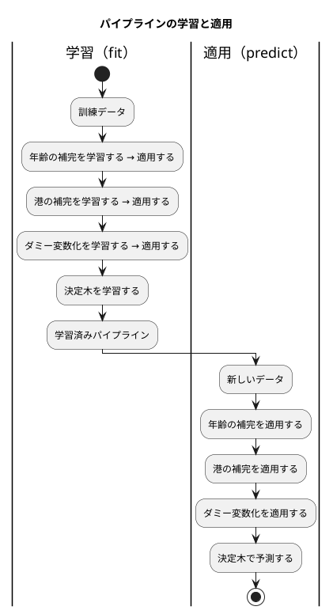

# 第 8 章: 実践的な分類と前処理パイプライン

## 8.1 はじめに

ここまでの章では、データが比較的きれいでした。アヤメのデータは数値ばかりで欠損値も数件、映画のデータも 100 行の数値表です。この章では、**実務でよく出会う形のデータ** を扱います。タイタニック号の乗客データには、文字列の列があり、欠損値が 177 件あり、正解ラベルの偏りがあります。

この章でやることは 3 つです。

1. **前処理を部品にして、順に並べる（パイプライン）** — 欠損値の補完、カテゴリのダミー変数化。訓練データで学習した値を、テストデータや新しいデータにも同じように適用する
2. **クラスの重みを付ける** — 生存者（342 人）より死亡者（549 人）が多いので、素直に学習すると「死亡」に寄る。少数のクラスに重みを付けて、見落としを減らす
3. **学習済みのパイプラインを保存して復元する** — 学習のたびに数秒待つのではなく、ファイルから読み込んで使う

第 7 章では Rubix ML に素の線形回帰が無く、`Ridge(0.0)` で代用しました。この章は逆の形で、**Rubix ML に `MissingDataImputer` も `OneHotEncoder` もあるのに、どちらもこの章で必要な口を持っていません。** 8.12 節で、何が足りないのかを実測で示します。前処理は「あるかないか」ではなく「**どこまでの細かさを扱えるか**」でライブラリの守備範囲が決まる領域です。

[Elixir 版の第 8 章](../elixir/08-classification-and-preprocessing-pipeline.md) と同じ構成で進めます。Elixir 版では決定木そのものが Scholar に無く自作でしたが、PHP 版は第 3 章で Rubix ML の `ClassificationTree` と突き合わせ済みです（ただし既定値のままでは実行ごとに結果が揺れるので、4 つのパラメータを明示して初めて比べられました）。それでも **クラスの重みだけは Rubix ML の分類器にも前処理にも口が無い** ので、この章の木は自作になります。

## 8.2 題材とデータ

### Survived.csv

`Survived.csv` は 891 人分の乗客記録で、次の 11 列を持ちます。

| 列 | 内容 | 欠損値 |
|----|------|-------|
| PassengerId | 乗客の ID | なし |
| Survived | 生存（1）か死亡（0）か | なし |
| Pclass | 客室の等級（1・2・3） | なし |
| Sex | 性別（`male` / `female`） | なし |
| Age | 年齢 | **177 件** |
| SibSp | 同乗した兄弟姉妹・配偶者の数 | なし |
| Parch | 同乗した親・子の数 | なし |
| Ticket | チケット番号 | なし |
| Fare | 運賃 | なし |
| Cabin | 客室番号 | **687 件** |
| Embarked | 乗船した港（`C` / `Q` / `S`） | **2 件** |

第 2 章の `Chapter02::countMissing()` をそのまま使って数えたところ、`Age=177 Cabin=687 Embarked=2` でした。

### 使う特徴量と、使わない列

| 列 | 使うか | 理由 |
|----|-------|------|
| PassengerId | 使わない | 乗客を区別する番号で、生死と関係がない |
| Ticket | 使わない | 文字列の識別子で、カテゴリとして扱うには種類が多すぎる |
| Cabin | 使わない | 687 件が欠損。補完しても情報がほとんど無い |
| Pclass・Sex・Age・SibSp・Parch・Fare・Embarked | 使う | 7 列を特徴量にする |

`Cabin` を「欠損が多いから捨てる」と決めるのは、実は乱暴な判断です。「客室番号が記録されていること自体が、等級の高さと相関しているかもしれない」という見方もできます。ここでは、ほかの言語版と同じ特徴量にそろえることを優先しました。

### 年齢はグループごとの中央値で補完する

`Age` の欠損 177 件をどう埋めるかが、この章のいちばん大事な判断です。全体の中央値（28 歳）で埋めるのは簡単ですが、**1 等客室の女性と 3 等客室の男性では年齢の分布が違います**。実際に訓練データから求めた中央値はこうなりました。

| グループ | 中央値 |
|---------|-------|
| 1 等・男性 | 45 |
| 2 等・女性 | 28 |
| 3 等・男性 | 25 |
| 3 等・女性 | 22 |
| （全体） | 28 |

1 等の男性と 3 等の女性で 23 歳も違います。**等級と性別のグループごとの中央値** で補完します。

## 8.3 TODO リストの作成

```text
TODO リスト（第 8 章）

- [ ] 中央値を計算する
- [ ] 前処理を「学習してから適用する」部品として表す
- [ ] 年齢をグループごとの中央値で補完する
- [ ] 乗船した港を最頻値で補完する
- [ ] カテゴリ値をダミー変数にする（基準の列を落とす）
- [ ] 重み付きのジニ不純度と、クラスの重みを計算する
- [ ] クラスの重みを付けた決定木を学習する
- [ ] 前処理と決定木をパイプラインにつなぐ
- [ ] 学習済みのパイプラインを保存して読み込む
- [ ] Rubix ML の前処理と突き合わせる
- [ ] 実データでクラスの重みの効果を確かめる
```

## 8.4 前処理をインターフェースで表す

前処理には共通の形があります。**訓練データから値を学び（fit）、その値でデータを変換する（apply）** の 2 段です。

```php
interface Step
{
    /** 訓練データから変換に必要な値を学び、学習済みの前処理を返す。 */
    public function fit(Table $x): self;

    /** 学習済みの前処理でデータを変換する。学習していなければ失敗する。 */
    public function apply(Table $x): Table;
}
```

`fit()` が `void` ではなく `self` を返すことに意味があります。**自分を書き換えず、学習済みの新しい前処理を返します。** こうすると、同じ前処理の定義を別のデータに何度でも使えますし、学習済みのものを保存して使い回すのも自然になります。Rubix ML の `Transformer` は `fit()` が `void` で自分の中に状態を持つ設計なので、ここは意図的に別の形にしました。

実装は 3 つです。

```console
$ ls src/Preprocessing/
DummyEncoder.php   GroupMedianImputer.php   MostFrequentImputer.php   Step.php
```

[Elixir 版](../elixir/08-classification-and-preprocessing-pipeline.md) は `%{type: :group_median, …}` というタグ付きのマップとパターンマッチで振り分け、**1 つのファイルに全部の節が並んでいました**。[Clojure 版](../clojure/08-classification-and-preprocessing-pipeline.md) は `defmulti` で開いた形にしました。PHP は 1 クラス 1 ファイルなので、**どんな前処理があるかは `ls` で分かる** 代わりに、全体を一望するには 4 つのファイルを開くことになります。どちらが良いという話ではなく、言語が用意した「種類の増やし方」の違いがそのまま出ます。

| 言語 | 振り分けの仕組み | どこを見れば全体が分かるか |
|------|---------------|----------------------|
| PHP | インターフェースと実装クラス | ディレクトリの一覧 |
| Elixir | 関数節のパターンマッチ | 1 つのモジュール |
| Clojure | `defmulti` / `defmethod` | 探さないと分からない（開いている） |

## 8.5 年齢をグループごとの中央値で補完する

### Red: 中央値から

```php
#[TestDox('件数が奇数なら中央値は真ん中の値')]
public function test件数が奇数なら中央値は真ん中の値(): void
{
    $this->assertSame(3.0, Chapter08::median([5.0, 1.0, 3.0]));
}

#[TestDox('件数が偶数なら中央値は真ん中の 2 つの平均')]
public function test件数が偶数なら中央値は真ん中の2つの平均(): void
{
    $this->assertSame(2.5, Chapter08::median([4.0, 1.0, 3.0, 2.0]));
}
```

### Green

```php
/**
 * 中央値。件数が偶数なら中央の 2 つの平均。
 *
 * @param list<float> $values
 */
public static function median(array $values): float
{
    if ($values === []) {
        throw new InvalidArgumentException('値がありません');
    }

    sort($values);
    $middle = intdiv(count($values), 2);

    return count($values) % 2 === 1
        ? $values[$middle]
        : ($values[$middle - 1] + $values[$middle]) / 2.0;
}
```

`sort($values)` が引数を並べ替えているように見えますが、**PHP の配列は値渡し** なので呼び出し元の配列は変わりません。`sort()` は参照渡しの引数を取る関数ですが、`$values` 自体がこの関数のローカルな写しなので安全です。ここは PHP が「参照か値か」で読み手を迷わせる場所の 1 つで、**引数の配列に破壊的な関数を使ってよいのは、その配列がローカルな写しだからだ** と分かっていないと怖くて書けません。

`intdiv()` を使っているのは、`(int) (count($values) / 2)` と書くと float を経由するからです。件数が巨大なら精度を失いますし、意図も読み取りにくくなります。

### グループごとの補完

```php
final readonly class GroupMedianImputer implements Step
{
    /**
     * @param list<string>              $by       グループを決める列
     * @param array<string, float>|null $medians  グループごとの中央値（学習前は null）
     */
    public function __construct(
        public string $column,
        public array $by,
        public ?array $medians = null,
        public ?float $overallMedian = null,
    ) {
    }
```

学習前と学習後を **同じクラスの、`null` かどうかが違うインスタンス** で表しています。`GroupMedianImputer` と `FittedGroupMedianImputer` の 2 クラスに分ける設計もありますが、クラスが倍になるので選びませんでした。代わりに `apply()` の先頭で必ず確かめます。

```php
public function apply(Table $x): Table
{
    if ($this->medians === null || $this->overallMedian === null) {
        throw new InvalidArgumentException("学習していません: {$this->column}");
    }
```

```php
#[TestDox('学習していない前処理は使えない')]
public function test学習していない前処理は使えない(): void
{
    $this->expectException(InvalidArgumentException::class);
    $this->expectExceptionMessage('学習していません: Age');

    (new GroupMedianImputer('Age', ['Pclass']))->apply($this->passengers());
}
```

グループのキーの作り方に、PHP らしい制約が出ます。

```php
/**
 * 行のグループを表すキー。グループを決める列の値をタブでつないだ文字列にする。
 *
 * PHP の配列のキーは文字列か整数しか取れないので、Elixir がリストをそのまま
 * キーにしたところを、区切り文字でつないだ文字列にする。
 */
private function groupOf(array $row): string
{
    return implode("\t", array_map(static fn (string $c): string => Chapter02::text($row, $c), $this->by));
}
```

Elixir は `["1", "female"]` というリストをそのままマップのキーにできますが、**PHP の配列のキーは文字列か整数だけ** です。値をつなぐしかありません。区切り文字にタブを選んだのは、CSV のセルにまず現れないからです。`'-'` でつなぐと、`["a-b", "c"]` と `["a", "b-c"]` が同じキーになってしまいます。**「つないだ文字列をキーにする」設計には、必ずこの衝突の可能性が付いて回る** ので、区切り文字は「元のデータに現れないこと」を根拠に選びます。

### Red と Green

架空の乗客 6 人を用意します。学習データの行は使いません。

```php
/** 架空の乗客 6 人。年齢と港に空欄がある。 */
private function passengers(): Table
{
    return Csv::parseTable(
        "Pclass,Sex,Age,Embarked,Fare\n"
        . "1,female,30,S,100\n"
        . "1,female,40,C,120\n"
        . "1,female,,S,110\n"
        . "3,male,20,S,10\n"
        . "3,male,24,,12\n"
        . "3,male,,S,8\n",
    );
}

#[TestDox('年齢はグループごとの中央値で補完する')]
public function test年齢はグループごとの中央値で補完する(): void
{
    $fitted = (new GroupMedianImputer('Age', ['Pclass', 'Sex']))->fit($this->passengers());
    $filled = $fitted->apply($this->passengers());

    // 1 等・女性は 30 と 40 なので 35、3 等・男性は 20 と 24 なので 22。
    $this->assertSame('35', $filled->rows[2]['Age']);
    $this->assertSame('22', $filled->rows[5]['Age']);
}
```

期待値が `'35'`（文字列）であることに注目してください。第 2 章の表はセルを文字列で持つので、補完した値も文字列に戻して書き込みます。ここで素直に `(string) 35.0` と書くと `'35'` になりますが、PHP 8.1 より前は `'35'`、PHP 5 系では `'35'`……と歴史的に揺れてきた場所です。今は `(string) 35.0` が `'35'`、`(string) 35.5` が `'35.5'` で安定しています。それでも明示しました。

```php
/**
 * 補完した値を、表のセル（文字列）に戻す。
 *
 * 整数で表せる値は「35」と書く。「35.0」と書くと、CSV から読んだ値と
 * 見た目が食い違ってテストが読みにくくなる。
 */
private static function asCell(float $value): string
{
    return $value === floor($value) ? (string) (int) $value : (string) $value;
}
```

### 知らないグループは全体の中央値で

テストデータに、訓練データに無かった組み合わせ（2 等の男性など）が現れることがあります。そのときは全体の中央値を使います。

```php
#[TestDox('知らないグループは全体の中央値で補完する')]
public function test知らないグループは全体の中央値で補完する(): void
{
    $fitted = (new GroupMedianImputer('Age', ['Pclass', 'Sex']))->fit($this->passengers());
    $other = Csv::parseTable("Pclass,Sex,Age,Embarked,Fare\n2,male,,S,50\n");

    // 学習に無いグループなので、全体の中央値（20, 24, 30, 40 の中央＝27）を使う。
    $this->assertSame('27', $fitted->apply($other)->rows[0]['Age']);
}
```

`$medians[$key] ?? $overall` の 1 行で書けます。Null 合体演算子は「キーが無い」と「値が `null`」の両方を拾うので、この用途にはちょうど良い道具です。

## 8.6 乗船した港を最頻値で補完する

`Embarked` の欠損は 2 件だけです。カテゴリなので平均も中央値も取れません。最も多い値で埋めます。

```php
public function fit(Table $x): self
{
    $counts = [];

    foreach ($x->rows as $row) {
        if (!Chapter02::isMissing($row, $this->column)) {
            $value = Chapter02::text($row, $this->column);
            $counts[$value] = ($counts[$value] ?? 0) + 1;
        }
    }

    if ($counts === []) {
        throw new InvalidArgumentException("値がすべて空欄です: {$this->column}");
    }

    // 値の順に並べてから、厳密な不等号で畳む。同数なら値の順で前のものが残る。
    ksort($counts, SORT_STRING);
    $best = array_key_first($counts);

    foreach ($counts as $value => $count) {
        if ($count > $counts[$best]) {
            $best = $value;
        }
    }

    return new self($this->column, (string) $best);
}
```

**同数のときの決め方が、この章でいちばん神経を使う点です。** 最頻値が 2 つ並んだとき、どちらを選ぶかで補完の結果が変わり、決定木の分割が変わり、深い木では予測がずれます。ほかの言語版と数値を突き合わせるには、**全部の言語版で同じ決め方をそろえる** 必要があります。

本シリーズの決め方は「値の順で前のもの」です。`ksort($counts, SORT_STRING)` でキーを文字列として並べ替えてから、`>`（厳密な不等号）で畳みます。等しい場合は更新しないので、先に来たもの＝値の順で前のものが残ります。

```php
#[TestDox('最頻値が同数なら値の順で前のものを選ぶ')]
public function test最頻値が同数なら値の順で前のものを選ぶ(): void
{
    // S と C が 1 件ずつ。値の順で前の C を選ぶ。
    $table = Csv::parseTable("Embarked,Fare\nS,10\nC,20\n,30\n");
    $fitted = (new MostFrequentImputer('Embarked'))->fit($table);

    $this->assertSame('C', $fitted->apply($table)->rows[2]['Embarked']);
}
```

`ksort` に `SORT_STRING` を渡しているのは、**PHP の既定の並べ替えが数値らしい文字列を数値として比べる** からです。`'10'` と `'9'` を既定の `SORT_REGULAR` で比べると `'9'` のほうが後ろに来ます。カテゴリの値が数字の文字列である場合に決め方がぶれるので、文字列として比べることを明示しました。

`array_key_first($counts)` の戻り値は `string|int|null` です。`$counts` が空でないことを直前で確かめているので `null` にはなりませんが、PHPStan は型どおりに扱うので `(string) $best` のキャストが要ります。**PHP の配列のキーは、数字の文字列を入れると勝手に整数になる** という性質があるので、このキャストは形式的なものではなく実際に必要です。`'1'` をキーにすると `1`（整数）で返ってきます。

## 8.7 カテゴリ値をダミー変数にする

決定木は数値の比較で分岐するので、`male` / `female` のような文字列はそのままでは使えません。カテゴリごとに 0 と 1 の列を作ります（ダミー変数化・ワンホットエンコーディング）。

### 基準の列を落とす

カテゴリが `female` と `male` の 2 つなら、列も 2 本作れます。ただし **その 2 本の和は必ず 1 になる** ので、片方が分かればもう片方も分かります。この冗長さは、線形回帰では致命的です（`Xᵀ X` が逆行列を持たなくなります）。そこで **先頭のカテゴリを基準にして落とします**。

```php
$unique = array_values(array_unique($values));
sort($unique, SORT_STRING);
// 先頭が基準。残りがダミー変数の列になる。
$categories[$column] = array_slice($unique, 1);
```

`Sex` からは `Sex_male` の 1 本だけが作られ、`female` は「`Sex_male` が 0」で表されます。`Embarked`（`C`・`Q`・`S`）からは `Embarked_Q` と `Embarked_S` の 2 本が作られ、`C` は「両方 0」で表されます。

```php
#[TestDox('ダミー変数化は基準の列を落とす')]
public function testダミー変数化は基準の列を落とす(): void
{
    $fitted = (new DummyEncoder(['Sex', 'Embarked']))->fit($this->passengers());
    $encoded = $fitted->apply($this->passengers());

    // female/male のうち基準の female を落とし、C/S のうち基準の C を落とす。
    $this->assertSame(['Pclass', 'Age', 'Fare', 'Sex_male', 'Embarked_S'], $encoded->columns);
    $this->assertSame('0', $encoded->rows[0]['Sex_male']);
    $this->assertSame('1', $encoded->rows[0]['Embarked_S']);
    $this->assertSame('1', $encoded->rows[3]['Sex_male']);
}
```

列の並びまで表明しているのは、**元の列が消えて末尾に新しい列が付く** という変換の形をテストで固定したいからです。実データでは次のようになります。

```text
Pclass, Age, SibSp, Parch, Fare, Sex_male, Embarked_Q, Embarked_S
```

`array_unique` は元の添字を残すので `array_values()` で包み直します。第 7 章の `array_filter` と同じ話です。そのうえで `sort($unique, SORT_STRING)` で並べ替えるのは、**「先頭を落とす」という決め方が、行の並び順に左右されてはいけない** からです。訓練データの 1 行目が男性か女性かで基準が変わってしまうと、分割のシードを変えただけで結果が変わります。

### 知らないカテゴリは全部 0

```php
#[TestDox('学習していないカテゴリはすべて 0 になる')]
public function test学習していないカテゴリはすべて0になる(): void
{
    $fitted = (new DummyEncoder(['Embarked']))->fit($this->passengers());
    $other = Csv::parseTable("Pclass,Sex,Age,Embarked,Fare\n2,male,30,Q,50\n");

    $this->assertSame('0', $fitted->apply($other)->rows[0]['Embarked_S']);
}
```

学習時に見なかったカテゴリ（このテストでは `Q`）は、**すべての列が 0** になります。基準のカテゴリと区別が付かなくなるわけですが、「知らない値が来たら落とす」より静かに壊れにくい振る舞いです。実務では「知らないカテゴリが来た件数」を数えておくべき場面ですが、この章では扱いません。

## 8.8 クラスの重みを付けた決定木を作る

### なぜ自作するのか

第 3 章で、決定木は Rubix ML の `ClassificationTree` と突き合わせました。ではこの章でも使えばよさそうですが、使いません。**クラスの重みを渡す口が無い** からです。

Rubix ML の分類器には `weights` にあたる引数がなく、前処理にも「1 件ごとの重み」という概念がありません。重みを効かせるには、少数クラスの行を複製する（オーバーサンプリング）などの回り道が要ります。それは「重み 2.0」とは別のことです（同じ行が 2 回、別の行として分割の候補になります）。

そこで、**第 3 章の決定木を「1 件ごとの重みを通す」形に書き直したもの** をこの章の実装にします。重みをすべて 1 にすれば第 3 章と同じ木になります。

### 重み付きのジニ不純度

ジニ不純度は「ラベルの割合の 2 乗の合計」を 1 から引いた値です。割合を **件数の比** ではなく **重みの合計の比** で求めれば、そのまま重み付きになります。

```php
public static function gini(array $labels, array $weights): float
{
    $total = array_sum($weights);
    $impurity = 1.0;

    foreach (self::weightSums($labels, $weights) as $weight) {
        $impurity -= ($weight / $total) ** 2;
    }

    return $impurity;
}
```

```php
#[TestDox('半々ならジニ不純度は 0.5')]
public function test半々ならジニ不純度は05(): void
{
    $this->assertEqualsWithDelta(0.5, WeightedTree::gini(['1', '0'], [1.0, 1.0]), 1e-12);
}

#[TestDox('重みを変えると不純度が変わる')]
public function test重みを変えると不純度が変わる(): void
{
    // 重み 3 対 1 なら割合は 0.75 と 0.25 で、1 - (0.5625 + 0.0625) = 0.375。
    $this->assertEqualsWithDelta(0.375, WeightedTree::gini(['1', '0'], [3.0, 1.0]), 1e-12);
}
```

`**` は PHP 5.6 からのべき乗演算子です。`pow($x, 2)` より読みやすく、`$x * $x` より意図が明確です。

### balanced の重み

```php
/**
 * クラスの件数に反比例する重み（件数 ÷ (クラスの数 × そのクラスの件数)）を 1 件ごとに求める。
 *
 * @param list<string> $t
 *
 * @return list<float>
 */
public static function balancedWeights(array $t): array
{
    $counts = array_count_values($t);

    return array_map(
        static fn (string $label): float => count($t) / (count($counts) * $counts[$label]),
        $t,
    );
}
```

`array_count_values()` は「値ごとの出現回数」を 1 行で作ります。scikit-learn の `class_weight='balanced'` と同じ式にしてあるので、**この重みを使う限り、どの言語版も同じ木になります**。

```php
#[TestDox('balanced の重みは件数に反比例する')]
public function testBalancedの重みは件数に反比例する(): void
{
    // 3 件中、1 が 1 件・0 が 2 件。クラスは 2 つなので 3/(2*1)=1.5 と 3/(2*2)=0.75。
    $this->assertEqualsWithDelta(
        [1.5, 0.75, 0.75],
        WeightedTree::balancedWeights(['1', '0', '0']),
        1e-12,
    );
}
```

重みの付け方は `match` で振り分けます。

```php
public static function weightsOf(array $t, string $classWeight): array
{
    return match ($classWeight) {
        self::NONE => array_fill(0, count($t), 1.0),
        self::BALANCED => self::balancedWeights($t),
        default => throw new InvalidArgumentException("知らない重みの付け方です: {$classWeight}"),
    };
}
```

`match` は `switch` と違って **厳密比較** で、しかも **どれにも当たらなければ例外を投げます**（`default` を書かなければ `UnhandledMatchError`）。`switch` の緩い比較とフォールスルーは PHP の古い罠の代表格なので、新しく書くところでは `match` を選びます。ここでは自分のメッセージを出したいので `default` で投げています。

### balanced で葉のラベルが変わる

```php
#[TestDox('balanced にすると少数派が選ばれるようになる')]
public function testBalancedにすると少数派が選ばれる(): void
{
    // 1 が 1 件、0 が 3 件。重み付けなしなら葉は 0、balanced なら重みが 2.0 対 0.666… で 1。
    $x = [['a' => 1.0], ['a' => 1.0], ['a' => 1.0], ['a' => 1.0]];
    $t = ['1', '0', '0', '0'];

    $none = WeightedTree::fit($x, $t, ['a'], 3, WeightedTree::NONE);
    $balanced = WeightedTree::fit($x, $t, ['a'], 3, WeightedTree::BALANCED);

    $this->assertSame(['0'], WeightedTree::predict($none, [['a' => 1.0]]));
    $this->assertSame(['1'], WeightedTree::predict($balanced, [['a' => 1.0]]));
}
```

特徴量がすべて同じなので分割できず、木は葉 1 つです。それでも **多数決の結果が重みで逆転します**。クラスの重みが何をするのかを、4 行のデータで見せられる最小の形です。

### 同点のときの決め方

ほかの言語版と数値を一致させるには、**同点のときの決め方を 3 か所でそろえる** 必要があります。

| 場面 | 決め方 | PHP での書き方 |
|------|-------|--------------|
| 最頻値が同数 | 値の順で前のもの | `ksort($counts, SORT_STRING)` してから `>` で畳む |
| 分割の不純度が同じ | 列の順で前のもの、同じ列なら境界の小さいもの | 列・境界の順にループし、`<`（厳密）で更新する |
| 葉の重みの合計が同じ | 先に現れたラベル | 連想配列はキーの挿入順を保つので、その順に `>` で畳む |

3 つ目が PHP では楽になりました。**PHP の連想配列はキーの挿入順を保つ** ので、ラベルを初めて見た順にキーが並びます。Elixir はマップの順が保証されないので `Enum.uniq/1` で並びを作り直していました。

```php
/**
 * ラベルごとの重みの合計を、ラベルが先に現れた順に返す。
 *
 * @return array<string, float>
 */
private static function weightSums(array $labels, array $weights): array
{
    $sums = [];

    foreach ($labels as $index => $label) {
        $sums[$label] = ($sums[$label] ?? 0.0) + $weights[$index];
    }

    return $sums;
}
```

ただし油断はできません。**ラベルが `'1'` と `'0'` なので、キーは整数の 1 と 0 になります。** 挿入順は保たれるので結果は変わりませんが、`$sums` から取り出した `$label` は `int` です。だから `majority()` の最後に `(string) $best` が要ります。PHP の配列のキーは「数字に見える文字列は整数になる」という変換を静かに行うので、**文字列のラベルを配列のキーにする限り、型は往復しません。**

### 木は型で表す

```php
interface TreeNode
{
    /** @param array<string, float> $features */
    public function predictOne(array $features): string;
}

final readonly class Leaf implements TreeNode { /* label */ }
final readonly class Branch implements TreeNode { /* feature, threshold, left, right */ }
```

Elixir 版はマップの鍵の有無（`:label` があるか `:split` があるか）で葉と分岐を見分けていました。PHP では型で分けます。**`instanceof` を書き落とすと PHPStan のレベル 9 が指摘してくれる** のが得です。

予測を `TreeNode` のメソッドにしたので、木をたどるコードは各クラスに分かれます。

```php
public function predictOne(array $features): string
{
    return $this->goesLeft($features)
        ? $this->left->predictOne($features)
        : $this->right->predictOne($features);
}
```

再帰が「分岐が自分の子に聞く」形になり、条件分岐が要りません。これはオブジェクト指向が素直に効く場面です。

## 8.9 前処理とモデルをパイプラインにつなぐ

### 前処理の順番と fit の順番

前処理は順に適用します。大事なのは、**2 つめ以降の前処理を、前の前処理で変換したデータで学習する** ことです。

```php
public static function fit(Table $x, array $t, int $maxDepth, string $classWeight): FittedPipeline
{
    $fitted = [];
    $prepared = $x;

    foreach (self::steps() as $step) {
        $trained = $step->fit($prepared);
        $fitted[] = $trained;
        $prepared = $trained->apply($prepared);
    }

    return new FittedPipeline(
        $fitted,
        $prepared->columns,
        WeightedTree::fit(self::toFeatures($prepared), $t, $prepared->columns, $maxDepth, $classWeight),
    );
}
```

港を補完してからでないと、ダミー変数化が空欄をカテゴリとして見てしまいます。`fit` と `apply` を交互に回すのはそのためです。



予測のときは `apply()` だけを呼びます。**新しいデータで学習し直してはいけません。** 学習し直すと、予測したいデータの統計が予測に混ざります（テストデータのリーク）。

```php
/** 学習済みの前処理を順に合成して、データを変換する。 */
public static function transform(FittedPipeline $pipeline, Table $x): Table
{
    foreach ($pipeline->steps as $step) {
        $x = $step->apply($x);
    }

    return $x;
}
```

### 前処理が済んだ表を特徴量にする

```php
public static function toFeatures(Table $x): array
{
    return array_map(
        static function (array $row) use ($x): array {
            $features = [];

            foreach ($x->columns as $column) {
                $value = Chapter02::number($row, $column);

                if ($value === null) {
                    throw new InvalidArgumentException("欠損値が残っています: {$column}");
                }

                $features[$column] = $value;
            }

            return $features;
        },
        $x->rows,
    );
}
```

**欠損値が残っていたら、静かに 0 にするのではなく失敗させます。** 前処理を書き忘れたり、順番を間違えたりしたときに、その場で分かるようにするためです。

```php
#[TestDox('欠損値が残っていれば特徴量にできない')]
public function test欠損値が残っていれば特徴量にできない(): void
{
    $this->expectException(InvalidArgumentException::class);
    $this->expectExceptionMessage('欠損値が残っています: Age');

    Chapter08::toFeatures(new Table(['Age'], [['Age' => '']]));
}
```

### 欠損値を含むデータで学習して予測する

パイプライン全体を、架空の 6 人で通します。

```php
#[TestDox('欠損値を含むデータで学習して予測できる')]
public function test欠損値を含むデータで学習して予測できる(): void
{
    $rows = $this->survivedRows();
    $pipeline = Chapter08::fit(Chapter08::featuresTable($rows), Chapter08::targetLabels($rows), 5, WeightedTree::NONE);

    $this->assertSame(
        ['1', '1', '0', '0', '0', '1'],
        Chapter08::predict($pipeline, Chapter08::featuresTable($rows)),
    );
}
```

年齢と港に空欄のある 6 行が、補完 → ダミー変数化 → 学習 → 予測を通って、正解どおりに返ってきます。この 1 本が「パイプラインがつながっている」ことの受け入れテストです。

## 8.10 モデルを保存して読み込む

### 標準の serialize で往復する

学習済みのパイプラインは、前処理（`readonly class`）と木（`readonly class`）と配列だけでできています。PHP の `serialize()` は、これをそのままバイト列にします。

```php
public static function saveModel(FittedPipeline $pipeline, string $path): void
{
    $dir = dirname($path);

    // mkdir も失敗を警告で知らせるので、@ で抑えて戻り値で判定する。
    if (!is_dir($dir) && !@mkdir($dir, 0o777, true) && !is_dir($dir)) {
        throw new InvalidArgumentException("ディレクトリを作れません: {$dir}");
    }

    file_put_contents($path, serialize(['format' => self::FORMAT_VERSION, 'pipeline' => $pipeline]));
}
```

`!is_dir($dir) && !@mkdir(...) && !is_dir($dir)` という三段構えは、PHP のよく知られた定型です。`mkdir()` は **別のプロセスが同時に同じディレクトリを作ったときにも偽を返す** ので、失敗した後にもう一度 `is_dir()` で確かめます。

形式の版（`format`）を一緒に書いているのは、後でモデルの形を変えたときに、古いファイルを黙って読まないためです。

```php
#[TestDox('形式の版が違うモデルは読み込めない')]
public function test形式の版が違うモデルは読み込めない(): void
{
    $path = $this->tempFile('.model');
    file_put_contents($path, serialize(['format' => 99, 'pipeline' => null]));

    $this->expectException(InvalidArgumentException::class);
    $this->expectExceptionMessage('対応していない形式のモデルです: 99');

    Chapter08::loadModel($path);
}
```

### allowed_classes を必ず書く

`unserialize()` は、PHP でいちばん危険な関数の 1 つです。ファイルに書かれたとおりのクラスのインスタンスを作り、そのクラスの `__wakeup()` や `__destruct()` を呼ぶからです。信頼できないファイルを読むと、それだけでコードが動きます（オブジェクトインジェクション）。

```php
$loaded = @unserialize($contents, ['allowed_classes' => [
    FittedPipeline::class,
    Branch::class,
    Leaf::class,
    GroupMedianImputer::class,
    MostFrequentImputer::class,
    DummyEncoder::class,
]]);
```

**`allowed_classes` に読み込んでよいクラスを並べます。** これを省くと、どんなクラスでも作られます。[Elixir 版](../elixir/08-classification-and-preprocessing-pipeline.md) が `:erlang.binary_to_term` に `:safe` を付け、[Clojure 版](../clojure/08-classification-and-preprocessing-pipeline.md) が `clojure.core/read-string` ではなく `clojure.edn/read-string` を使ったのと、まったく同じ用心です。**直列化の仕組みを持つ言語は、ほぼ必ず「安全に読む」ための別の入口を用意しています。** 既定が安全でないのは歴史的な事情であって、既定を使ってよいという意味ではありません。

`@` で警告を抑えているのは、読めない内容のときに `unserialize()` が **例外ではなく警告** を出すからです。

```php
// unserialize は読めない内容を例外ではなく警告で知らせるので、@ で抑えて
// 戻り値の false で判定する。PHPUnit は警告をテストの失敗として扱う設定なので、
// ここで抑えておかないと「読めないファイルを読む」テストが書けない。
```

`phpunit.xml` に `failOnWarning="true"` を書いてあるので、抑えないと「壊れたファイルを渡したら失敗する」というテスト自体が書けません。**エラーの知らせ方が例外に統一されていない** のは PHP の古い部分で、標準関数を使うたびに「これは例外か、戻り値か、警告か」を確かめることになります。

### 往復することをテストする

```php
#[TestDox('学習済みのパイプラインは保存して復元できる')]
public function test学習済みのパイプラインは保存して復元できる(): void
{
    $rows = $this->survivedRows();
    $pipeline = Chapter08::fit(Chapter08::featuresTable($rows), Chapter08::targetLabels($rows), 5, WeightedTree::BALANCED);
    $path = $this->tempFile('.model');

    Chapter08::saveModel($pipeline, $path);
    $loaded = Chapter08::loadModel($path);

    $this->assertEquals($pipeline, $loaded);
    $this->assertSame(
        Chapter08::predict($pipeline, Chapter08::featuresTable($rows)),
        Chapter08::predict($loaded, Chapter08::featuresTable($rows)),
    );
}
```

`assertEquals` を使い、`assertSame` を使っていないのが要点です。復元されたオブジェクトは **別のインスタンス** なので、`assertSame`（同一性）では通りません。`assertEquals` は再帰的に中身を比べます。第 1 章で `readonly class` の比較について書いたことが、そのまま効いてくる場面です。

それでも「中身が同じ」だけでは不十分なので、**予測の結果が同じ** ことも確かめます。保存と復元の目的は「同じ予測ができること」だからです。

実データで学習したパイプラインは 4600 バイトでした。深さ 5 の木と 3 つの前処理が、この大きさに収まります。

## 8.11 評価する

正解率だけでは、このデータの問題が見えません。全員を「死亡」と予測しても 61% 当たるからです。**見つけられた生存者の数** を一緒に見ます。

```php
/**
 * @return array{trainAccuracy: float, testAccuracy: float, foundSurvivors: int, survivors: int}
 */
public static function evaluate(FittedPipeline $pipeline, array $split): array
```

`foundSurvivors` は、機械学習の用語では **再現率（recall）の分子** です。「実際に生存した人のうち、何人を生存と予測できたか」を表します。第 11 章で適合率・再現率・F 値として正面から扱うので、ここでは人数のまま見ます。

## 8.12 Rubix ML の前処理と突き合わせる

Rubix ML には `MissingDataImputer` も `OneHotEncoder` もあります。それでもこの章の前処理を自作しました。何が足りないのかを、実測で示します。

### MissingDataImputer は列ごとに 1 つの値しか持てない

`MissingDataImputer` は、列ごとに `Strategy`（`Mean`・`Percentile`・`KMostFrequent`・`Constant` など）を 1 つ学習します。中央値そのものの Strategy は無いので、`Percentile(50.0)` を使います。

```php
$imputer = new MissingDataImputer(new Percentile(50.0));
$dataset = new Unlabeled($samples);
$imputer->fit($dataset);
$dataset->apply($imputer);
```

```php
#[TestDox('MissingDataImputer は列ごとに 1 つの値しか持てない')]
public function testMissingDataImputerは列ごとに1つの値しか持てない(): void
{
    $mine = (new GroupMedianImputer('Age', ['Pclass', 'Sex']))->fit($this->passengers());
    $theirs = Chapter08::rubixImputeAge($this->passengers());

    // 自作はグループごとに 35 と 22 を使い分けるが、Rubix ML はどちらの行も同じ値になる。
    $filled = $mine->apply($this->passengers());

    $this->assertNotSame($filled->rows[2]['Age'], $filled->rows[5]['Age']);
    $this->assertSame($theirs[2], $theirs[5]);
    $this->assertEqualsWithDelta(27.0, $theirs[2], 1e-12);
}
```

| 行 | 自作（グループ別） | Rubix ML の `MissingDataImputer` |
|----|-----------------|--------------------------------|
| 1 等・女性の欠損 | 35 | 27 |
| 3 等・男性の欠損 | 22 | 27 |

`Percentile(50.0)` の値自体は自作の `median()` と一致します（`[20, 24, 30, 40]` に対してどちらも 27）。**足りないのは「グループごとに使い分ける」という口だけ** です。`MissingDataImputer` は列ごとに Strategy を 1 つ持つ構造なので、行の別の列を見て値を変えることはできません。

Elixir 版の `Scholar.Impute.SimpleImputer` もまったく同じ制約でした。**この制約はライブラリの手抜きではなく、「列ごとの統計」という抽象を選んだことの必然** です。行をまたいでグループ化する前処理は、この抽象の外側にあります。

### OneHotEncoder は基準の列を落とさない

```php
#[TestDox('OneHotEncoder は基準の列を落とさない')]
public function testOneHotEncoderは基準の列を落とさない(): void
{
    $mine = (new DummyEncoder(['Sex']))->fit($this->passengers())->apply($this->passengers());
    $theirs = Chapter08::rubixOneHotSex($this->passengers());

    // 自作は列が 1 本（Sex_male）、Rubix ML は 2 本（female と male）になる。
    $this->assertSame(1, count(array_filter($mine->columns, static fn (string $c): bool => str_starts_with($c, 'Sex_'))));
    $this->assertCount(2, $theirs[0]);
    // 値そのものは対応する。先頭の行は female なので [1, 0]。
    $this->assertSame([1, 0], $theirs[0]);
    $this->assertSame([0, 1], $theirs[3]);
}
```

`OneHotEncoder` は全部のカテゴリを列にします。基準を落とす引数はありません。決定木なら冗長な列があっても害は小さいのですが、線形回帰では解が定まらなくなります。

カテゴリの並び順にも違いがあります。Rubix ML は `array_unique($values)` の結果をそのまま使うので **最初に現れた順** です。自作は `sort()` してから使うので **値の順** です。列が 1 本ずれるだけで、係数の意味も列名も変わります。

### 同点の決め方まで違う

`KMostFrequent` の同点の扱いを測りました。

```console
$ php -r '… $s->fit(["S","C"]); echo $s->guess();'   → S
$ php -r '… $s->fit(["C","S"]); echo $s->guess();'   → C
```

`arsort()` で件数の降順に並べているだけなので、**同数のときは先に現れたほうが残ります**。自作は値の順で前のものを選ぶので、決め方が違います。データの並び順が変われば結果が変わる、ということでもあります。

### 何が置き換えられて、何が置き換えられないのか

| この章の前処理 | Rubix ML | 置き換えられるか |
|--------------|---------|---------------|
| 列ごとの中央値の補完 | `MissingDataImputer(new Percentile(50.0))` | できる（値も一致した） |
| **グループごとの中央値の補完** | — | **できない**（列ごとに 1 値しか持てない） |
| 最頻値の補完 | `MissingDataImputer(categorical: new KMostFrequent(1))` | **同点の決め方が違う** |
| ダミー変数化（全カテゴリ） | `OneHotEncoder` | できる（ただしカテゴリの順が違う） |
| **基準の列を落とすダミー変数化** | — | **できない** |
| **クラスの重み** | — | **できない**（分類器にも前処理にも口が無い） |

第 7 章では「素の線形回帰が無い」という、**種類そのものが欠けている** 形でした。この章は「あるけれど、粒度が足りない」形です。後者のほうが気づきにくく、そして **気づかずに使うと静かに間違った結果が出ます**。`MissingDataImputer` は何のエラーも出さずに 27 で埋めてしまいます。

ライブラリを使うかどうかを決める手順は、この章でははっきりしています。

1. 自分が欲しい振る舞いを、**テストとして先に書く**
2. ライブラリに渡してみて、そのテストが通るか確かめる
3. 通らなければ、**足りないのが「口」なのか「考え方」なのかを見る**。口なら回り道で足せることもあるが、考え方（列ごとの統計、という抽象）が違うなら自作する

## 8.13 実データでクラスの重みの効果を確かめる

### 実行する

```console
$ php -r 'require "vendor/autoload.php"; echo GettingStartedMl\Chapter08::run();'
データ件数: 891（生存 342, 死亡 549）
訓練データ: 712 件, テストデータ: 179 件
classWeight=none: 訓練 0.854, テスト 0.799, 生存者 79 人中 59 人を発見
classWeight=balanced: 訓練 0.848, テスト 0.804, 生存者 79 人中 65 人を発見
保存したモデル: 読み込めました
架空の乗客の予測: 1, 0
```

深さ 5 の木で、`balanced` にすると正解率はわずかに上がり（0.799 → 0.804）、見つけた生存者は 59 人から 65 人に増えました。年齢の分からない架空の乗客 2 人（1 等客室の女性と 3 等客室の男性）は、生存・死亡と予測されました。

### ほかの言語版と数値が一致するか

分割は第 2 章で `java.util.Random` と同じ線形合同法と Fisher-Yates にそろえてあるので、Java 版・Scala 版・Clojure 版・Elixir 版とまったく同じ行が訓練データとテストデータに入ります。実測した結果は次のとおりで、**すべて一致しました**。

| 指標 | PHP 版 | Java 版・Scala 版・Clojure 版・Elixir 版 |
|------|-------|-------------------------------------|
| データ件数（生存・死亡） | 891（342・549） | 891（342・549） |
| 訓練・テストの件数 | 712・179 | 712・179 |
| 深さ 5・重み付けなしの正解率（訓練・テスト） | 0.854・0.799 | 0.854・0.799 |
| 深さ 5・balanced の正解率（訓練・テスト） | 0.848・0.804 | 0.848・0.804 |
| 深さ 5 で見つけた生存者（79 人中） | 59 人 → 65 人 | 59 人 → 65 人 |
| 深さ 2 で見つけた生存者（79 人中） | 41 人 → 68 人 | 41 人 → 68 人 |
| 架空の乗客 2 人の予測 | `1, 0` | 同じ |

学習した前処理の中身も一致しています。全体の中央値 28、グループ別の中央値（1 等・男性が 45、3 等・女性が 22）、最頻値 `S`、ダミー変数化のあとの列 `Pclass, Age, SibSp, Parch, Fare, Sex_male, Embarked_Q, Embarked_S`。

一致には、8.8 節の表に挙げた 3 つの「同点のときの決め方」がすべてそろっている必要がありました。どれか 1 つでもずれると、深い木で予測が食い違います。PHP で気をつけたのは次の 2 点です。

- **`ksort` に `SORT_STRING` を渡す** — 既定の `SORT_REGULAR` は数字に見える文字列を数値として比べる
- **配列のキーは文字列のまま残らない** — ラベル `'1'` はキーにすると整数 1 になる。順は保たれるので結果は変わらないが、取り出した値をそのまま `string` として使うことはできない

Kotlin 版は `kotlin.random.Random` を使うので分割が違い、深さ 5 では `balanced` が見落としを減らしませんでした。同じアルゴリズムでも、**1 回の分割の結果から「この設定のほうが良い」と一般化してはいけない**、ということです。

### 効果は深さによって変わる

深さを変えて測りました。

| 深さ | 重み | 訓練の正解率 | テストの正解率 | 見つけた生存者（79 人中） |
|------|-----|------------|--------------|----------------------|
| 2 | none | 0.803 | 0.765 | 41 |
| 2 | balanced | 0.754 | 0.737 | **68** |
| 3 | none | 0.824 | 0.810 | 59 |
| 3 | balanced | 0.796 | 0.771 | 69 |
| 5 | none | 0.854 | 0.799 | 59 |
| 5 | balanced | 0.848 | 0.804 | 65 |
| 8 | none | 0.903 | 0.816 | 60 |
| 8 | balanced | 0.903 | 0.827 | 58 |

深さ 2 で効果がいちばんはっきり出ます。見つけた生存者が 41 人から 68 人へ、27 人増えました。その代わりテストの正解率は 0.765 から 0.737 へ下がっています。**重みは「正解率」と「見落としの少なさ」を交換している** のが読み取れます。

浅い木は葉が大きく、多数派に引きずられやすいので、重みを変えた効果が出ます。深い木では葉が小さくなり、重みを付けなくても少数のクラスだけの葉ができるので、差が小さくなります。深さ 8 では `balanced` のほうが見つけた生存者が少なくなりました（60 → 58）。訓練の正解率が 0.903 まで上がっているのは過学習の兆候で、この深さで重みを議論しても意味がありません。

この 2 つの数（41 と 68）をテストに固定しておきます。

```php
#[Group('data')]
#[TestDox('深さ 2 では balanced にすると見つかる生存者が増える')]
public function test深さ2ではbalancedで生存者が増える(): void
{
    // …（データが無ければ markTestSkipped）
    $split = Chapter08::survivedSplit();

    $this->assertSame(41, Chapter08::evaluate(
        Chapter08::fit(Chapter08::featuresTable($split['xTrain']), $split['tTrain'], 2, WeightedTree::NONE),
        $split,
    )['foundSurvivors']);
    $this->assertSame(68, Chapter08::evaluate(
        Chapter08::fit(Chapter08::featuresTable($split['xTrain']), $split['tTrain'], 2, WeightedTree::BALANCED),
        $split,
    )['foundSurvivors']);
}
```

### 突き合わせの支えは 2 本

クラスの重みを持つ実装が Rubix ML に無いので、**重みを付けた木そのものを外部の実装と照らすことはできません**。支えは 2 本になります。

1. **重み付けなしなら、第 3 章の決定木と同じ木になる** — 重みをすべて 1 にすればジニ不純度も多数決も件数と同じになります。第 3 章で Rubix ML の `ClassificationTree` と突き合わせ済みなので、ここを通して間接的につながります
2. **実データの正解率と生存者の数が、Java 版・Scala 版・Clojure 版・Elixir 版と一致する** — Java 版の数値は Tribuo の CART と照らして検証されているので、一致することで間接的に外部の実装と照らしたことになります

言語版を横断して同じ数値を出すことに投資してきた効果が、**ライブラリに口が無い場面でいちばん効いています**。

## 8.14 品質チェック

```console
$ vendor/bin/php-cs-fixer check --diff
Found 0 of 44 files that can be fixed
$ vendor/bin/phpstan analyse --no-progress
 [OK] No errors
$ vendor/bin/phpunit --filter 'Chapter07|Chapter08'
OK (71 tests, 181 assertions)
```

この章で書いたコードのカバレッジは次のとおりです。

| ファイル | 行カバレッジ |
|---------|------------|
| `src/Chapter08.php` | 100% |
| `src/WeightedTree.php` | 100% |
| `src/Branch.php`・`src/Leaf.php`・`src/FittedPipeline.php` | 100% |
| `src/Preprocessing/*.php` | 100% |

### 検査に止められたところ

1. **`mixed` を `float` にできない** — Rubix ML の `Unlabeled::samples()` は `list<list<mixed>>` を返します。`(float) $sample[0]` が PHPStan のレベル 9 で止まり、`is_numeric()` で確かめてから変換する形に書き直しました。**ライブラリの境界で型がゆるむのは第 7 章でも同じでした**
2. **`array_values` が無意味** — `array_slice($unique, 1)` の結果はすでにリストなので、包み直しが要りませんでした
3. **PHPUnit が警告をテストの失敗にする** — `unserialize()` と `mkdir()` が警告を出すので、`@` で抑えて戻り値で判定する形に直しました。抑えずに `try`/`catch` で書こうとして、**そもそも例外ではない** ことに気づく順序でした

3 つ目は、8.10 節に書いたとおり PHP の古い部分です。**新しい書き方（例外）と古い書き方（警告と戻り値）が同じ標準ライブラリに同居している** ので、関数ごとに確かめることになります。

## 8.15 探索と可視化

年齢の分布をグループごとに描いたり、決定木を図にしたりする手順は、[Python 版の第 8 章](../python/08-classification-and-preprocessing-pipeline.md) と [Kotlin 版](../kotlin/08-classification-and-preprocessing-pipeline.md) を参照してください。PHP 版では Notebook を用意していません（[ADR 013](../../../adr/013-php-ml-libraries.md)）。

## 8.16 まとめ

この章では、タイタニック号の乗客データを題材に、前処理パイプラインとクラスの重みを付けた決定木を PHP の TDD で実装しました。

1. **前処理は「学習してから適用する」部品にする** — `fit()` が `void` ではなく学習済みの新しい前処理を返す形にした。Rubix ML の `Transformer` が自分の中に状態を持つのとは別の設計で、保存・復元が自然になる
2. **インターフェースと実装クラスで種類を増やす** — どんな前処理があるかは `ls src/Preprocessing/` で分かる。Elixir の関数節、Clojure の `defmulti` と並べると、言語が用意した「種類の増やし方」の違いがそのまま出る
3. **配列のキーは文字列か整数しか取れない** — グループを表すのに値をタブでつないだ。区切り文字は「元のデータに現れないこと」を根拠に選ぶ
4. **ラベルを配列のキーにすると型が往復しない** — `'1'` はキーにすると整数 1 になる。取り出すときに `(string)` が要る
5. **`ksort` には `SORT_STRING` を渡す** — 既定は数字に見える文字列を数値として比べる。同点の決め方がデータによってぶれる
6. **`match` を使い、`switch` を避ける** — 厳密比較で、どれにも当たらなければ例外になる
7. **`allowed_classes` を必ず書く** — `unserialize()` は既定でどんなクラスでも作る。Elixir の `:safe`、Clojure の `clojure.edn` と同じ用心
8. **警告と例外が同居している** — `unserialize()` も `mkdir()` も警告で失敗を知らせる。`@` で抑えて戻り値で判定する定型を覚えることになる
9. **Rubix ML に「あるけれど粒度が足りない」** — 第 7 章の「種類そのものが無い」より気づきにくい。`MissingDataImputer` は何のエラーも出さずに全体の中央値で埋める。**欲しい振る舞いをテストとして先に書き、ライブラリに渡して通るか確かめる** のが唯一の見分け方
10. **重みは正解率と見落としの少なさを交換する** — 深さ 2 で見つけた生存者は 41 人から 68 人に増え、テストの正解率は 0.765 から 0.737 に下がった。どちらを取るかは、問題が決める

**TODO リスト（この章の完了時点）**:

- [x] 中央値を計算する
- [x] 前処理を「学習してから適用する」部品として表す
- [x] 年齢をグループごとの中央値で補完する
- [x] 乗船した港を最頻値で補完する
- [x] カテゴリ値をダミー変数にする（基準の列を落とす）
- [x] 重み付きのジニ不純度と、クラスの重みを計算する
- [x] クラスの重みを付けた決定木を学習する
- [x] 前処理と決定木をパイプラインにつなぐ
- [x] 学習済みのパイプラインを保存して読み込む
- [x] Rubix ML の前処理と突き合わせる
- [x] 実データでクラスの重みの効果を確かめる

次の章では、特徴量そのものを作り変える **特徴量エンジニアリング** を扱います。[第 7 章の 7.10 節](07-linear-regression.md) で「係数の大小をそのまま影響の大きさと読めない」と書いた問題を、標準化として正面から扱い、Rubix ML の `ZScaleStandardizer` と突き合わせます。

PHP 版のほかの章は [PHP 版のトップ](index.md) から辿れます。
