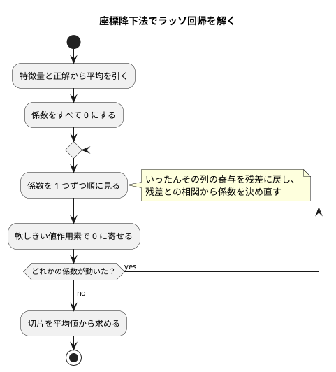

# 第 12 章: 正則化とモデル選択

## 12.1 はじめに

第 9 章で、特徴量に 2 次の項を足すと訓練データへの当てはまりが良くなることを見ました。しかし特徴量を増やしすぎると、訓練データだけに合わせ込んだモデルになり、未知のデータで当たらなくなります。**過学習** です。

この章では、過学習を抑える **正則化** を扱います。係数が大きくなりすぎることに罰則を加える手で、2 種類を自作します。

- **リッジ回帰**（L2 正則化）— 係数の 2 乗の合計に罰則をかける。第 7 章の正規方程式に 1 項足すだけで解ける
- **ラッソ回帰**（L1 正則化）— 係数の絶対値の合計に罰則をかける。**係数をちょうど 0 にする** ので、特徴量の選択にもなる

そして、罰則の強さ `alpha` をいくつ選ぶかという **モデル選択** の問題に、訓練・検証・テストの 3 分割で答えます。

PHP 版の事情も、この章ではっきりします。[ADR 013](../../../adr/013-php-ml-libraries.md) に書いたとおり、**Rubix ML にリッジ回帰（`Ridge`）はありますが、ラッソ回帰はありません。** 第 7 章では「素の線形回帰が無いので `Ridge(0.0)` で代用する」という話でしたが、今度は逆に `Ridge` が主役で、ラッソのほうに相手がいません。[Elixir 版](../elixir/12-regularization-and-model-selection.md) と同じ立ち位置です。

そのうえで、この章には **Elixir 版との強い対照** があります。Elixir 版は実データで Scholar のリッジ回帰と 5e-6 までしか合わず、その原因（特異値分解と閉形式の丸めの違い）を突き止めました。PHP 版はどうなるでしょうか。12.10 節で実測します。

Notebook による探索と可視化の節は設けません。正則化の効き方をグラフで見る手順は [Python 版](../python/12-regularization-and-model-selection.md) と [Kotlin 版](../kotlin/12-regularization-and-model-selection.md) を参照してください。

## 12.2 過学習と正則化

### 係数が大きくなりすぎる

特徴量どうしが強く相関していると、最小二乗法は「片方に大きな正の係数、もう片方に大きな負の係数」を与えて、訓練データにぴったり合わせにいきます。打ち消し合っているだけなので、少しでもデータがずれると予測が大きく外れます。

### 係数の大きさに罰則を加える

誤差の 2 乗の合計に、係数の大きさの項を足して、その合計を最小にします。

```text
リッジ回帰: ‖t - Xw‖² + alpha ‖w‖²   （係数の 2 乗の合計）
ラッソ回帰: ½‖t - Xw‖² + alpha ‖w‖₁  （係数の絶対値の合計）
```

`alpha` が 0 なら、どちらも最小二乗法に戻ります。大きくするほど係数が 0 に引き寄せられます。

**切片には罰則をかけません。** 切片は「予測の基準の高さ」であって、大きくても複雑さとは関係ないからです。そのために、特徴量と正解から先に平均を引いておきます（中心化）。

### リッジ回帰の解き方

L2 の罰則は滑らかなので、微分して 0 と置けます。第 7 章の正規方程式に単位行列の `alpha` 倍を足すだけです。

```text
(Xᵀ X + alpha I) w = Xᵀ t
```

### ラッソ回帰の解き方

L1 の罰則は原点で折れているので、同じ手は使えません。**座標降下法** を使います。係数を 1 つずつ順に動かし、そのたびに **軟しきい値作用素** で 0 のほうへ縮めます。しきい値以内なら、係数はちょうど 0 になります。



## 12.3 題材とデータ

### Boston.csv

ボストンの住宅価格のデータ（100 件）を使います。第 9 章でも使ったものです。この章で使う列は 3 つに絞ります。

| 列 | 意味 |
| :--- | :--- |
| `RM` | 1 戸あたりの平均部屋数 |
| `PTRATIO` | 生徒と教師の比率 |
| `LSTAT` | 低所得者層の割合 |
| `PRICE` | 住宅価格（正解） |

### 過学習が起きやすい状況を作る

3 列だけでは過学習しません。そこで、標準化したあとに **2 次の項** を作ります。3 列から 2 乗と交互作用を足すと 9 列になります。2 次の項は元の列と強く相関するので、正則化の効き目が見える状況になります。

### 訓練・検証・テストの 3 つに分ける

`alpha` を選ぶのにテストデータを使ってしまうと、「テストデータに合わせて選んだ」ことになり、テストが未知のデータの代わりになりません。そこで 3 つに分けます。

- **訓練データ** — モデルを学習する
- **検証データ** — `alpha` を選ぶ
- **テストデータ** — 選び終わったあと、一度だけ測る

## 12.4 TODO リストの作成

```text
- [ ] リッジ回帰を自作する
- [ ] ラッソ回帰を座標降下法で自作する
- [ ] 係数の絶対値の合計と、0 になった特徴量名を求める
- [ ] alpha ごとの実験結果を記録して、検証データで選ぶ
- [ ] z スコアで外れ値を除く
- [ ] 標準化してから 2 次の項を作り、3 つに分ける
- [ ] Rubix ML の Ridge と突き合わせる
- [ ] 実データで線形回帰とリッジ回帰を比べる
```

## 12.5 リッジ回帰を自作する

### Red: 最小二乗法と同じになるテスト

`alpha` が 0 なら第 7 章の結果と一致するはずです。これが最初のテストです。

```php
    #[TestDox('alpha が 0 のリッジ回帰は第 7 章の最小二乗法と一致する')]
    public function testAlphaが0のリッジ回帰は第7章の最小二乗法と一致する(): void
    {
        $ridge = Chapter12::ridgeFit($this->squareX(), $this->squareT(), self::COLUMNS, 0.0);
        $least = Chapter07::fit($this->squareX(), $this->squareT(), self::COLUMNS);

        $this->assertEqualsWithDelta($least->intercept, $ridge->intercept, 1e-9);
        $this->assertEqualsWithDelta($least->coefficients, $ridge->coefficients, 1e-9);
    }
```

第 7 章で使った 4 点（切片 1.0、`a` の係数 2.0、`b` の係数 -3.0 で誤差なく当てはまる）をそのまま使い回します。**答えの分かっているデータを章をまたいで持ち回れる** のは、第 2 章から前処理と乱数をそろえてきた副産物です。

反対側からも押さえます。`alpha` をうんと大きくすれば、係数は 0 に、切片は正解の平均に近づくはずです。

```php
    #[TestDox('alpha を大きくすると係数は 0 に近づき切片は正解の平均に近づく')]
    public function testAlphaを大きくすると係数は0に近づき切片は正解の平均に近づく(): void
    {
        $fitted = Chapter12::ridgeFit($this->squareX(), $this->squareT(), self::COLUMNS, 1.0e9);

        $this->assertEqualsWithDelta([0.0, 0.0], $fitted->coefficients, 1e-6);
        $this->assertEqualsWithDelta(0.5, $fitted->intercept, 1e-6);
    }
```

### Green: 中心化して解く

```php
    public static function ridgeFit(array $x, array $t, array $columns, float $alpha): LinearModel
    {
        self::requireSameSize($x, $t);

        $xMeans = self::columnMeans($x, $columns);
        $tMean = array_sum($t) / count($t);
        $centered = MatrixFactory::createNumeric(self::center($x, $columns, $xMeans));
        $transposed = $centered->transpose();
        $residuals = new Vector(array_map(static fn (float $v): float => $v - $tMean, $t));

        $penalty = MatrixFactory::identity(count($columns))->scalarMultiply($alpha);

        $coefficients = array_map(
            floatval(...),
            array_values(
                $transposed->multiply($centered)
                    ->add($penalty)
                    ->solve($transposed->vectorMultiply($residuals), NumericMatrix::LU)
                    ->getVector(),
            ),
        );

        return new LinearModel($tMean - self::dot($xMeans, $coefficients), $columns, $coefficients);
    }
```

第 7 章の `fit()` との違いは 2 つだけです。**計画行列に 1 の列を足さず、代わりに平均を引くこと**（切片に罰則をかけないため）と、**`add($penalty)` が挟まること** です。

`NumericMatrix::LU` を明示するのも第 7 章と同じです。MathPHP の `solve()` は行列の中身によって解き方を変えるので、指定しないと `alpha` によって解き方が変わりかねません。

`floatval(...)` で包んでいるのも第 7 章と同じ事情です。`getVector()` は `int` と `float` の混ざった配列を返しうるので、PHPStan レベル 9 に `list<float>` として通すには実際に変換する必要があります。

### モデルは第 7 章のものを使い回す

リッジ回帰もラッソ回帰も、返すのは「切片・列名・係数」です。第 7 章で作った `LinearModel` がそのまま使えます。

```php
final readonly class LinearModel
{
    public function __construct(
        public float $intercept,
        public array $columns,
        public array $coefficients,
    ) {
```

第 7 章の時点で「第 12 章のリッジ・ラッソでも使う」と docblock に書いていました。予言が当たったというより、**列名と係数を別々のリストで持つ形にしておけば、正則化を足しても形は変わらない** という見通しが正しかったということです。`predict()` も `coefficient()` も、1 行も書き足さずに使えます。

## 12.6 ラッソ回帰を座標降下法で自作する

### 軟しきい値作用素

```php
    public static function softThreshold(float $value, float $threshold): float
    {
        if ($value > $threshold) {
            return $value - $threshold;
        }

        if ($value < -$threshold) {
            return $value + $threshold;
        }

        return 0.0;
    }
```

Elixir 版は 3 つの関数節をガードで書き分けました。PHP には複数節の関数がないので `if` を 2 つ並べます。`match (true)` でも書けますが、ここは早期 return のほうが読みやすいと判断しました。

```php
        $this->assertSame(1.0, Chapter12::softThreshold(3.0, 2.0));
        $this->assertSame(-1.0, Chapter12::softThreshold(-3.0, 2.0));
        $this->assertSame(0.0, Chapter12::softThreshold(1.5, 2.0));
        $this->assertSame(0.0, Chapter12::softThreshold(-1.5, 2.0));
```

`assertSame` で `0.0` であることまで確かめます。**「0 に近い」ではなく「0 そのもの」** が、ラッソ回帰の値打ちだからです。

### 書き換わる変数を使ってよい

Elixir 版は「書き換わる変数を使わずに反復する」ために、`Tuple.duplicate/2` と `put_elem/3`、`Enum.reduce/3` を組み合わせて状態を持ち回りました。PHP では素直に配列を書き換えられます。

```php
        for ($iteration = 0; $iteration < self::MAX_ITERATIONS; ++$iteration) {
            $delta = 0.0;

            foreach ($columns as $index => $_column) {
                if ($norms[$index] === 0.0) {
                    continue;
                }

                $column = $features[$index];
                $old = $weights[$index];

                // いったん列の寄与を残差に戻してから、残差との相関で係数を決め直す
                foreach ($residuals as $row => $residual) {
                    $residuals[$row] = $residual + $old * $column[$row];
                }

                $weight = self::softThreshold(self::dot($column, $residuals), $alpha) / $norms[$index];

                foreach ($residuals as $row => $residual) {
                    $residuals[$row] = $residual - $weight * $column[$row];
                }

                $weights[$index] = $weight;
                $delta = max($delta, abs($weight - $old));
            }

            if ($delta < self::TOLERANCE) {
                break;
            }
        }
```

**アルゴリズムの説明とコードが 1 対 1 で並びます。** 「係数をひとつ選ぶ」「その列の寄与を残差に戻す」「相関から決め直す」「戻す」。Elixir 版は同じことを `descend/5`・`sweep/4`・`update/3` の 3 つの関数に分けて書きましたが、これは再代入を避けるための分割で、アルゴリズムの区切りではありませんでした。

どちらがよいという話ではありません。再代入を許す言語では **反復のコードが数式に近づく** 一方、`$residuals` がいつ書き換わるかを読み手が追う負担が増えます。PHP の配列は値としてコピーされる（第 2 章で確かめた性質）ので、少なくとも **呼び出し元の配列が知らぬ間に変わることはありません**。

`$norms[$index] === 0.0` で飛ばしているのは、値がすべて同じ列への備えです。中心化すると 0 だけの列になり、2 乗の合計も 0 になります。割ると落ちるので、係数を 0 のまま残します。

```php
    #[TestDox('値がすべて同じ列はラッソ回帰の係数が 0 のままになる')]
    public function test値がすべて同じ列はラッソ回帰の係数が0のままになる(): void
    {
        // 平均を引くと 0 だけの列になり、割る相手（2 乗の合計）が 0 になる。
        // 0 で割らずに飛ばすので、その列の係数は 0 のまま残る
        …
        $this->assertEqualsWithDelta(2.0, $fitted->coefficient('a'), 1e-6);
        $this->assertSame(0.0, $fitted->coefficient('b'));
    }
```

### Red: 0 になることを確かめる

ラッソ回帰の 2 本のテストは、リッジ回帰と対になっています。

```php
    #[TestDox('alpha を大きくするとラッソ回帰の係数はちょうど 0 になる')]
    public function testAlphaを大きくするとラッソ回帰の係数はちょうど0になる(): void
    {
        $fitted = Chapter12::lassoFit($this->squareX(), $this->squareT(), self::COLUMNS, 1000.0);

        // リッジ回帰は 0 に「近づく」だけだが、ラッソ回帰は 0 そのものにする
        $this->assertSame([0.0, 0.0], $fitted->coefficients);
        $this->assertEqualsWithDelta(0.5, $fitted->intercept, 1e-12);
    }
```

リッジ回帰の同じテストは `assertEqualsWithDelta(..., 1e-6)` でした。**`assertSame` と `assertEqualsWithDelta` の使い分けが、2 つの正則化の違いそのもの** になっています。

`alpha` を 1e-8 にすれば最小二乗法に近づくことも確かめました。これで、ライブラリと照らせないラッソ回帰を両側から挟めています。

## 12.7 実験結果を記録して選ぶ

`alpha` ごとの結果を `readonly class` にまとめます。

```php
final readonly class Experiment
{
    public function __construct(
        public float $alpha,
        public float $trainScore,
        public float $validationScore,
        public float $coefficientAbsSum,
    ) {
    }
}
```

選ぶところは「検証データの決定係数が最大」です。

```php
    public static function bestExperiment(array $experiments): Experiment
    {
        if ($experiments === []) {
            throw new InvalidArgumentException('実験結果が 1 件もありません');
        }

        $best = $experiments[0];

        foreach ($experiments as $experiment) {
            if ($experiment->validationScore > $best->validationScore) {
                $best = $experiment;
            }
        }

        return $best;
    }
```

`>` であって `>=` ではないので、**同じ値なら先の実験（小さい `alpha`）を選びます**。Clojure の `max-key` は同値なら後ろを返すので、Clojure 版はそこを気にする必要がありました。PHP には `max_by` にあたる関数がないので自分で書くことになり、結果として「同値のときどちらを選ぶか」を明示的に決めることになりました。**関数が無いことが、決めごとを表に出させた** 例です。

テストでもそれを固定します。

```php
        $experiments = [
            new Experiment(0.0, 0.9, 0.5, 10.0),
            new Experiment(1.0, 0.8, 0.7, 8.0),
            new Experiment(10.0, 0.7, 0.7, 5.0),
        ];

        // 同じ値なら先の実験を選ぶ
        $this->assertSame(1.0, Chapter12::bestExperiment($experiments)->alpha);
```

## 12.8 0 になった係数の特徴量名を返す

ラッソ回帰の値打ちは「どの特徴量が要らなかったか」が分かることです。

```php
    public static function zeroCoefficientNames(LinearModel $model): array
    {
        $names = [];

        foreach ($model->columns as $index => $column) {
            if ($model->coefficients[$index] === 0.0) {
                $names[] = $column;
            }
        }

        return $names;
    }
```

`LinearModel` が列名と係数を同じ順のリストで持っているので、添字で対応が付きます。Elixir 版は係数のリストと名前のリストを別々に受け取り、長さが違えば失敗する検査を書きました。PHP 版では **`LinearModel` のコンストラクタがすでに長さを検査している**（第 7 章で書きました）ので、ここでは不要です。

型と `readonly` で「不正な状態のモデルは作れない」ようにしておくと、それを使う関数の検査が減ります。**型を使うと決めた版（ADR 013）の、はっきりした見返り** です。

## 12.9 最小限の前処理

### 標準化してから 2 次の項を作る

ここでも、章をまたいだ使い回しが効きます。

```php
    private static function buildFeatures(Standardizer $scaler, array $x): array
    {
        return Chapter09::expand($scaler->transformAll($x), self::FEATURE_COLUMNS);
    }
```

- `Chapter09\Standardizer` — 第 9 章で書いた標準化。**件数 n で割る母標準偏差** を使う
- `Chapter09::expand()` — 第 9 章で書いた 2 次の項の展開。名前の付け方（`RM^2`・`RM LSTAT`）も順序も scikit-learn の `PolynomialFeatures` に合わせてある

**新しく書いた前処理はありません。** 第 9 章の 2 つの部品に列の並びを渡すだけで、9 列の特徴量ができます。

```php
        ['RM', 'PTRATIO', 'LSTAT', 'RM^2', 'RM PTRATIO', 'RM LSTAT', 'PTRATIO^2', 'PTRATIO LSTAT', 'LSTAT^2']
```

標準化の平均と標準偏差は **訓練データだけから** 求め、検証データにもテストデータにも同じ値を当てます。

```php
        $scaler = Standardizer::fit($inner['xTrain'], self::FEATURE_COLUMNS);
```

### 3 つに分けるのに、第 2 章の関数を 2 回呼ぶ

```php
        $outer = Chapter02::splitTrainTest($x, $t, $testSize, $seed);
        $inner = Chapter02::splitTrainTest($outer['xTrain'], $outer['tTrain'], $validationSize, $seed);
```

外側で訓練用とテスト用に分け、**外側の訓練用をもう一度分けます**。内側の「テストデータ」が検証データになるので、`BostonData` に詰めるときに名前を付け替えます。第 2 章の関数を作り直さずに済みました。

3 つ分の特徴量と正解、特徴量名、外れ値を除いた件数をまとめて持つので、`readonly class` にします。

```php
final readonly class BostonData
{
    public function __construct(
        public array $xTrain,
        public array $tTrain,
        public array $xValid,
        public array $tValid,
        public array $xTest,
        public array $tTest,
        public array $featureNames,
        public int $kept,
    ) {
```

第 9 章の `BostonSplit` は 2 分割の結果でした。**型を増やすか、既存の型を広げるか** の判断です。ここは増やしました。第 9 章の関数が `BostonSplit` を受け取る前提で書かれているので、広げると第 9 章のコードに `xValid` が `null` かもしれない分岐が入り込みます。

### z スコアで外れ値を除く

第 9 章は四分位範囲（IQR）で外れ値を判定しました。この章は **z スコア** です。標準偏差は **件数 n − 1 で割る標本標準偏差** を使います（標準化の n とは違うので注意が要ります）。

```php
            $stats[$column] = [$mean, sqrt($squares / (count($values) - 1))];
```

テストを書いたとき、期待どおりに動かずに 1 回 Red になりました。

```php
        // 件数が n のとき z スコアの上限は (n - 1) / sqrt(n) なので、
        // 10 件では 2.85 までしか届かず 3.0 のしきい値に当たらない
        $rows = array_fill(0, 19, ['v' => '1']);
        $rows[] = ['v' => '1000'];
```

9 個の 1 と 1 個の 100 を並べて「100 が外れ値になるはず」と書いたら、1 行も減りませんでした。値を 1000 にしても同じです。調べると、**n 件のデータの z スコアには (n − 1) / √n という上限があります**。10 件では 2.846 が最大で、どんなに極端な値を混ぜてもしきい値 3.0 には届きません。20 件にして通しました。

実装の誤りではなく **テストの前提の誤り** でしたが、この上限を知らないまま実データに使うと「しきい値 3.0 では 1 件も除かれない」ことの理由が分からなくなります。テストのコメントに残しました。

## 12.10 Rubix ML の Ridge と突き合わせる

### 尺度が同じかどうかを先に確かめる

ライブラリを替えるとき、まず読むのは **「何を最小化するか」** です。`Rubix\ML\Regressors\Ridge` のソースを読みます。

```php
        $biases = Matrix::ones($dataset->numSamples(), 1);
        $x = Matrix::build($dataset->samples())->augmentLeft($biases);
        …
        $penalties = array_fill(0, $nHat, $this->l2Penalty);
        array_unshift($penalties, 0.0);
        $penalties = Matrix::diagonal($penalties);

        $coefficients = $xT->matmul($x)
            ->add($penalties)
            ->inverse()
            ->dot($xT->dot($y))
```

**中心化はしません。** 代わりに 1 の列を左に足したうえで、**その列の罰則だけ 0 にします**（`array_unshift($penalties, 0.0)`）。中心化するのと数学的に同じで、どちらも「切片に罰則をかけない」を実現します。罰則の尺度も `alpha ‖w‖²` で自作と同じなので、件数で割る・割らないの読み替えは要りません。

違うのは **最後の一手** だけです。Rubix ML は `inverse()`、自作は MathPHP の LU 分解。第 7 章で見つけた関係とまったく同じです。

```php
    public static function rubixRidgeFit(array $x, array $t, array $columns, float $alpha): LinearModel
    {
        return Chapter07::rubixFit($x, $t, $columns, $alpha);
    }
```

第 7 章の `rubixFit()` は `l2Penalty` を引数に取れる形にしてありました（既定は 0.0）。**この章で `alpha` を渡せるように、第 7 章の時点で口を開けてあった** ことになります。新しい関数は要りませんでしたが、この章での意味（「リッジ回帰として使う」）を名前で示すために薄い別名を置きました。

### 人工データでは 1e-9 で一致する

```php
        foreach ([0.1, 1.0, 10.0, 100.0] as $alpha) {
            $mine = Chapter12::ridgeFit($this->squareX(), $this->squareT(), self::COLUMNS, $alpha);
            $theirs = Chapter12::rubixRidgeFit($this->squareX(), $this->squareT(), self::COLUMNS, $alpha);

            $this->assertEqualsWithDelta($mine->intercept, $theirs->intercept, 1e-9);
            $this->assertEqualsWithDelta($mine->coefficients, $theirs->coefficients, 1e-9);
        }
```

2 列 4 行のデータなら、4 つの `alpha` すべてで 1e-9 まで一致しました。

`Ridge` の既定値も、ここで押さえておきます。

```php
    #[TestDox('Rubix ML の Ridge の既定の alpha は 1.0 なので省くと別のモデルになる')]
```

第 7 章で刺された場所です。`new Ridge()` は `l2Penalty` が 1.0 なので、省くと最小二乗法ではなく `alpha = 1.0` のリッジ回帰になります。この章では自作の `ridgeFit(..., 1.0)` と一致することを示す形で、同じ事実を別の角度から固定しました。

### 実データでも 1e-13 で一致した — Elixir 版との分かれ道

ここが、この章でいちばん見たかったところです。9 列 47 件の、互いに強く相関する多項式特徴量で、両者はどこまで合うでしょうか。

| `alpha` | 係数の最大の差 | 切片の差 |
| :--- | :--- | :--- |
| 0.0 | 1.563e-13 | 1.776e-14 |
| 1.0 | 5.407e-14 | 2.487e-14 |
| 10.0 | 4.441e-15 | 1.421e-14 |
| 100.0 | 4.899e-15 | 3.553e-15 |

**どの `alpha` でも 1e-13 より良く一致しました。** テストの許容誤差は 1e-12 で通ります。

```php
        // 9 列の多項式特徴量は互いに強く相関するが、自作の LU 分解と Rubix ML の
        // 逆行列は 1e-12 まで一致する（Elixir 版が Scholar の特異値分解と 5e-6 しか
        // 合わなかったのと対照的）
        $this->assertEqualsWithDelta($mine->intercept, $theirs->intercept, 1e-12);
        $this->assertEqualsWithDelta($mine->coefficients, $theirs->coefficients, 1e-12);
```

[Elixir 版](../elixir/12-regularization-and-model-selection.md) は同じデータ・同じ手順で、Scholar の既定の解き方（`:svd`）と **5.06e-6 までしか合いませんでした**。`solver: :cholesky` に切り替えて初めて 1 ビットも違わなくなった、という節が立っています。

PHP 版にその節は立ちません。**Rubix ML には解き方を選ぶオプションがありませんが、その 1 つしかない解き方が、自作と同じ側だった** からです。

第 7 章でも同じことが起きました。Scholar の `pinv`（特異値分解）が最小二乗解に届かなかった場所で、Rubix ML の `inverse()` は 12〜13 桁まで一致しました。**2 つの章で 2 回、同じ理由で同じ結末になっています。**

そこから言えることは、第 7 章に書いたことの繰り返しです。**アルゴリズムの理論的な安定性より、その実装が自分の実装とどれだけ近い道を通るかのほうが、数値の一致には効きます。** 特異値分解は理論上は逆行列より安定ですが、「閉形式で解いた自作」と比べるなら、閉形式で解くライブラリのほうが近い答えを出します。

表示にも `Rubix ML のリッジ回帰との係数の最大の差` として出しています。

### ラッソ回帰は Rubix ML に無い

`Rubix\ML\Regressors` にあるのは `Ridge`・`RegressionTree`・`ExtraTreeRegressor`・`KNNRegressor`・`KDNeighborsRegressor`・`RadiusNeighborsRegressor`・`Adaline`・`MLPRegressor`・`GradientBoost`・`SVR` の 10 個で、**ラッソ回帰も Elastic Net もありません**。

そこで、12.6 節で作ったものが **そのまま最終実装** になります。第 11 章の ROC 曲線と AUC に続いて 2 度目です。ライブラリと照らせない代わりに、次の 3 つで正しさを支えました。

1. `alpha` を 0 に近づけると最小二乗法に一致する（12.6 節）
2. `alpha` を大きくすると係数がちょうど 0 になり、切片は正解の平均値になる（12.6 節）
3. 実データで 0 になった特徴量が、Java 版・Clojure 版が Tribuo で得た 3 列と一致する（12.11 節）

3 つ目が **間接的な突き合わせ** です。相手のライブラリがこの言語に無くても、他の言語版の実行結果が仕様の役を果たします。

### 正則化の強さの尺度をそろえる

3 つ目を成り立たせるには、`alpha` の尺度を読み替える必要がありました。自作のラッソが最小にするのは `½‖t - Xw‖² + alpha ‖w‖₁` で、**件数で割りません**。Tribuo の `ElasticNetCDTrainer` は、誤差の 2 乗の合計を `2n` で割った値に罰則を足します。

```text
自作の alpha = Tribuo の alpha × 訓練データの件数
```

訓練データは 47 件なので、Clojure 版・Java 版の `0.5` は `0.5 × 47 = 23.5` にあたります。

```php
    /**
     * ラッソ回帰の正則化の強さ。
     *
     * 自作の目的関数は件数で割らないので、件数で割る実装（Java 版・Clojure 版が使う
     * Tribuo の ElasticNetCDTrainer）の alpha=0.5 は訓練データ 47 件では 0.5 × 47 = 23.5 にあたる。
     */
    public const float LASSO_ALPHA = 23.5;
```

実際に `23.5` で走らせると、0 になった特徴量が **`PTRATIO^2`・`PTRATIO LSTAT`・`LSTAT^2`** の 3 列で、Clojure 版・Java 版・Elixir 版と一致しました。

**「同じ alpha」と書いてあっても、目的関数が同じとは限りません。** 12.10 節の冒頭で `Ridge` のソースを読んだのと同じ作業を、相手が別の言語のライブラリでもやる必要がある、ということです。

## 12.11 実データで比べる

### 結果を表示する

```console
$ php -r 'require "vendor/autoload.php"; echo GettingStartedMl\Chapter12::run();'
データ件数: 98（外れ値 2 件を除外）
訓練データ: 47 件, 検証データ: 21 件, テストデータ: 30 件
特徴量: RM, PTRATIO, LSTAT, RM^2, RM PTRATIO, RM LSTAT, PTRATIO^2, PTRATIO LSTAT, LSTAT^2
alpha  訓練 R²  検証 R²  係数の絶対値の合計
  0.0  0.8827  0.7272  14.187
  0.1  0.8827  0.7274  14.104
  1.0  0.8823  0.7288  13.594
 10.0  0.8681  0.7349  11.573
100.0  0.6583  0.5985  5.684
検証データで選んだ alpha: 10.0
テストデータの決定係数: 線形回帰 0.5224, リッジ回帰 0.6243
Rubix ML のリッジ回帰との係数の最大の差: 4.4e-15
ラッソ回帰（alpha=23.5）で係数が 0 になった特徴量: PTRATIO^2, PTRATIO LSTAT, LSTAT^2
```

### 結果を読む

- `alpha` を大きくするほど、係数の絶対値の合計は 14.187 から 5.684 へ小さくなりました。訓練データの決定係数は下がり続けます
- 検証データの決定係数は `alpha = 10.0` で最も高く（0.7349）、`100.0` では訓練・検証とも大きく下がりました。正則化が強すぎて学習不足になっています
- 検証データで選んだ `alpha = 10.0` のリッジ回帰は、テストデータの決定係数が 0.6243 で、線形回帰の 0.5224 を上回りました。**訓練データでは線形回帰のほうが高い（0.8827）のに、未知のデータでは正則化したモデルのほうがよく当たっています**
- ラッソ回帰は、9 列のうち `PTRATIO^2`・`PTRATIO LSTAT`・`LSTAT^2` の 3 列の係数をちょうど 0 にしました

**リッジ回帰の実行結果の数値は、Java 版・Scala 版・Clojure 版・Elixir 版の同じ節とすべて一致します。** 外れ値の除き方（`n − 1` の標準偏差で z スコア）・2 回の分割（`GettingStartedMl\Random` が `java.util.Random` と同じ線形合同法）・標準化（`n` の標準偏差）・2 次の項の順を、手順の細部までそろえたためです。ラッソ回帰が 0 にした 3 列も、12.10 節の尺度の読み替えを経て一致しました。

Kotlin 版では同じ手順でもリッジ回帰がテストで線形回帰を下回りました。分割の乱数が違い、3 つに入る行が違うからです。100 件ほどのデータでは、**分け方によって結論まで変わりうる** ことを示しています。1 回の分け方に頼らない方法として、第 11 章の交差検証を組み合わせられます。

### 実データのテスト

結論そのものも、性質としてテストに書いておきます。

```php
    #[Group('data')]
    #[TestDox('検証データで選んだリッジ回帰はテストデータで線形回帰を上回る')]
    public function test検証データで選んだリッジ回帰はテストデータで線形回帰を上回る(): void
    {
        $data = $this->boston();
        $best = Chapter12::bestExperiment(Chapter12::runRidgeExperiments($data, Chapter12::ALPHAS));

        $this->assertSame(10.0, $best->alpha);
        $this->assertGreaterThan(
            Chapter12::testScore($data, 0.0),
            Chapter12::testScore($data, $best->alpha),
        );
    }
```

0.6243 という数字ではなく、**「選んだリッジ回帰が線形回帰を上回る」という関係** を確かめています。表示の数字は別のテストで固定してあるので、二重に書く必要はありません。

ラッソ回帰が 0 にした 3 列も `assertSame` で固定しました。

```php
        $this->assertSame(
            ['PTRATIO^2', 'PTRATIO LSTAT', 'LSTAT^2'],
            Chapter12::zeroCoefficientNames($lasso),
        );
```

これが 12.10 節で述べた **間接的な突き合わせ** の実体です。このテストが緑である限り、自作のラッソ回帰は Tribuo と同じ答えを出し続けます。

## 12.12 品質チェック

| ファイル | カバレッジ |
| :--- | :--- |
| `src/Chapter12.php` | 100%（211 行） |
| `src/Chapter12/Experiment.php` | 100% |
| `src/Chapter12/BostonData.php` | 100% |

100% に届く直前、1 行だけ残っていたのが 12.6 節の `$norms[$index] === 0.0` の `continue` でした。実データでは起きない道です。**「起きないから消す」か「起きうるから残してテストする」か** の判断で、後者を選びました。値がすべて同じ列は実データで十分ありえますし、そのとき 0 で割って落ちるより、係数 0 で返すほうが親切です。テストを 1 本足して、動きを言葉にしました。

PHPStan レベル 9 に止められたのは 2 つでした。

1. **`array_fill()` の結果は `list` ではない** — 座標降下法の `$weights` は `array_fill(0, n, 0.0)` で作り、`$weights[$index] = ...` で書き換えます。PHPStan は「添字が飛んでいないとは限らない」と見るので、返す直前に `array_values()` で包み直しました。第 2 章・第 7 章に続いて 3 度目で、**そのたびに必要か不要かが違う** のが PHP の配列の面倒なところです
2. **`max()` は非空の配列を要求する** — `max(array_map(...))` は、`array_map` の結果が空かもしれないので通りません。`max([0.0, ...array_map(...)])` と書いて、最低でも 1 要素あることを型で示しました

どちらも `@phpstan-ignore` を書けば消せますが、書きませんでした。**1 つ目は実際にリストでない可能性があり、2 つ目は係数 0 個のモデルが作れてしまう** ので、どちらも指摘のほうが正しいからです。

## 12.13 可視化について

`alpha` と決定係数のグラフ、係数の軌跡（正則化パス）の描き方は [Python 版](../python/12-regularization-and-model-selection.md) と [Kotlin 版](../kotlin/12-regularization-and-model-selection.md) を参照してください。この章では 12.11 節の表が同じ役割を果たしています。

## 12.14 まとめ

この章では、リッジ回帰とラッソ回帰を PHP の TDD で実装し、検証データでモデルを選びました。

1. **リッジ回帰は第 7 章の正規方程式に 1 項足すだけ** — 中心化して `add($penalty)` を挟む。`alpha = 0` で最小二乗法に戻ることが最初のテストになった
2. **ラッソ回帰は座標降下法で書いた** — L1 の罰則は原点で折れているので、行列を解いて終わりにはできない。**再代入を許す言語では、反復のコードが数式に近づく**。Elixir 版が 3 つの関数に分けたところが、1 つのループに収まった
3. **`assertSame` と `assertEqualsWithDelta` の使い分けが、2 つの正則化の違い** — リッジは 0 に近づくだけ、ラッソは 0 そのものにする
4. **第 7 章・第 9 章の部品がそのまま使えた** — `LinearModel`・`Standardizer`・`expand()`・`splitTrainTest()`。この章で新しく書いた前処理は、外れ値の除去だけ
5. **`Ridge` は中心化せず、切片の罰則だけ 0 にしていた** — 数学的には同じ。尺度も同じなので読み替えは要らなかった
6. **実データでも 1e-13 まで一致した** — Elixir 版が Scholar と 5e-6 しか合わなかった場所で、Rubix ML は自作と同じ閉形式で解いていた。**2 つの章で 2 回、同じ理由で同じ結末になった**
7. **ラッソ回帰は Rubix ML に無いので自作が最終実装** — 両側から挟むテスト 2 本と、他言語版との間接的な突き合わせで支えた。そのために `alpha` の尺度（件数で割るかどうか）を読み替える必要があった
8. **z スコアには上限がある** — n 件のデータでは (n − 1) / √n までしか届かない。テストの前提が間違っていたことを Red が教えてくれた
9. **関数が無いことが、決めごとを表に出させた** — `max_by` が無いので自分で書くことになり、「同値ならどちらを選ぶか」を明示することになった

**TODO リスト（この章の完了時点）**:

- [x] リッジ回帰を自作する
- [x] ラッソ回帰を座標降下法で自作する（**Rubix ML に無いので自作が最終実装**）
- [x] 係数の絶対値の合計と、0 になった特徴量名を求める
- [x] alpha ごとの実験結果を記録して、検証データで選ぶ
- [x] z スコアで外れ値を除く
- [x] 標準化してから 2 次の項を作り、3 つに分ける
- [x] Rubix ML の Ridge と突き合わせる
- [x] 実データで線形回帰とリッジ回帰を比べる

次の章では、特徴量そのものを減らす主成分分析を扱います。

PHP 版のほかの章は [PHP 版のトップ](index.md) から辿れます。
