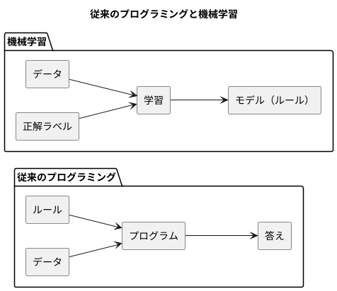
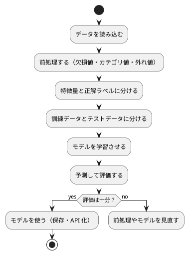

# 第 1 章: 機械学習とはじめてのテスト

## 1.1 はじめに

この章では、機械学習とは何かを確認したうえで、テスト駆動開発（TDD）で最初のプログラムを作ります。題材は「きのこの山派か、たけのこの里派か」を身長・体重・年代から判定する問題です。

この章ではまだ機械学習のアルゴリズムを使いません。人間が考えたルールで判定し、その正解率を測るところまで進みます。「ルールを人間が書く」とはどういうことかを先に体験しておくと、第 3 章で「ルールをデータから学ばせる」ことの意味がはっきりします。

## 1.2 機械学習とは

### ルールを書くか、データに学ばせるか

従来のプログラミングでは、人間が判定のルールをコードとして書きます。

```python
def predict_by_rule(features: Features) -> str:
    if features.age_group == 20:
        return "きのこ"
    return "たけのこ"
```

これはこの章で実際に作る関数です。「20 代ならきのこ派」というルールは、人間がデータを眺めて立てた仮説にすぎません。データが増えたり傾向が変わったりすれば、人間がルールを書き直す必要があります。

機械学習では、ルールそのものをデータから導きます。人間が用意するのは「特徴量（判定の手がかり）」と「正解ラベル（本当の答え）」の組です。学習アルゴリズムがその組からルールを作り、未知のデータに当てはめて予測します。



### 機械学習のワークフロー

機械学習のプログラムは、おおむね次の流れで作ります。本シリーズの各章は、この流れのどこかを深掘りする構成になっています。



この章で扱うのは「データを読み込む」「特徴量と正解ラベルに分ける」「予測して評価する」の 3 つです。「学習させる」の代わりに、人間が書いたルールで予測します。

### 分類と回帰

機械学習で予測するものは、大きく 2 種類に分かれます。

| 種類 | 予測するもの | 例 | 本シリーズの章 |
|------|------------|-----|--------------|
| 分類 | どのグループに属するか（離散値） | きのこ派かたけのこ派か、アヤメの品種 | 第 1〜3 章、第 8 章、第 10 章 |
| 回帰 | どれくらいの量か（連続値） | 映画の興行収入、住宅価格 | 第 7 章、第 9 章、第 12 章 |

この章の問題は、2 つのグループのどちらかを当てる分類です。

## 1.3 題材とデータ

### データの入手と配置

本シリーズの学習データは、書籍『スッキリわかる Python による機械学習入門』（インプレス, 2020）の配布データを使います。配布データは書籍購入者のみ利用できるため、リポジトリには含まれていません。[書籍サポートページ](https://sukkiri.jp/books/sukkiri_ml) から `sukkiri-ml-codes.zip` を入手し、リポジトリの `tmp/` に置いてから、リポジトリのルートで次を実行してください。

```bash
npx gulp data:setup
npx gulp data:check
```

`apps/data/sukkiri-ml/` に学習データが配置されます。このディレクトリは `.gitignore` の対象なので、誤ってコミットされることはありません。

### KvsT.csv

この章で使うのは `KvsT.csv` です。19 人分のデータが次の 4 列で記録されています。

| 列 | 意味 | 値 |
|----|------|-----|
| 身長 | 身長（cm） | 整数 |
| 体重 | 体重（kg） | 整数 |
| 年代 | 年代 | 10, 20, 30, 40 のいずれか |
| 派閥 | きのこの山派かたけのこの里派か | `きのこ` または `たけのこ` |

「身長」「体重」「年代」が特徴量、「派閥」が正解ラベルです。列名が日本語であることと、ファイルの先頭に BOM（バイトオーダーマーク）が付いていることに注意してください。どちらも後で問題になります。

## 1.4 TODO リストの作成

仕様をそのままコードにするには大きすぎるので、まず TODO リストに分解します。

> TODO リスト
>
> 何をテストすべきだろうか——着手する前に、必要になりそうなテストをリストに書き出しておこう。
>
> — テスト駆動開発

**TODO リスト**:

- [ ] CSV を読み込む
  - [ ] BOM 付き CSV の 1 行を人物として読み込む
  - [ ] 複数行を行の順に読み込む
- [ ] 特徴量と正解ラベルに分ける
- [ ] ルールで派閥を判定する
  - [ ] 20 代ならきのこ派と判定する
  - [ ] 20 代以外ならたけのこ派と判定する
- [ ] 正解率を計算する
- [ ] 実データで正解率を表示する

## 1.5 開発環境の準備

### プロジェクトの構成

Python の実装は `apps/python/` にあります。パッケージ管理には [uv](https://docs.astral.sh/uv/)、テスティングフレームワークには [pytest](https://docs.pytest.org/) を使います。

```text
apps/python/
├── pyproject.toml
├── tox.ini
├── lib/
│   ├── __init__.py
│   ├── dataset.py
│   └── chapter01/
│       ├── __init__.py
│       ├── __main__.py
│       └── kinoko_takenoko.py
└── test/
    ├── __init__.py
    ├── test_dataset.py
    ├── test_setup.py
    └── chapter01/
        ├── __init__.py
        └── test_kinoko_takenoko.py
```

`pyproject.toml` のうち、テストに関わる部分は次のとおりです。

```toml
[project]
name = "getting-started-ml"
version = "0.1.0"
description = "機械学習から始めるプログラミング入門（Python 版）"
requires-python = ">=3.12"
dependencies = []

[tool.pytest.ini_options]
testpaths = ["test"]
pythonpath = ["."]

[dependency-groups]
dev = [
    "pytest>=8.0",
    "pytest-cov>=6.0",
    "ruff>=0.8",
    "mypy>=1.13",
    "tox>=4.0",
]
```

依存関係をインストールします。

```bash
cd apps/python
uv sync
```

### 環境確認テスト

テスティングフレームワークが動くことを、最小のテストで確認します。

```python
# test/test_setup.py
def test_テスティングフレームワークが動作する() -> None:
    assert 1 + 1 == 2
```

```bash
uv run pytest -v
```

```text
test/test_setup.py::test_テスティングフレームワークが動作する PASSED     [100%]
============================== 1 passed in 0.10s ==============================
```

pytest ではテスト関数名に日本語を使えます。テストの一覧がそのまま仕様の一覧として読めるので、本シリーズではテスト名を日本語で書きます。

Windows のコンソールでテスト名が文字化けする場合は、環境変数 `PYTHONUTF8=1` を設定してから実行してください。

## 1.6 CSV を読み込む

### テストファースト

TODO リストの最初の項目「BOM 付き CSV の 1 行を人物として読み込む」から始めます。実装より先にテストを書きます。

> テストファースト
>
> いつテストを書くべきだろうか——それはテスト対象のコードを書く前だ。
>
> — テスト駆動開発

テストでは学習データそのものは使いません。`tmp_path`（pytest がテストごとに用意する一時ディレクトリ）に、架空の値を 1 行だけ書いた CSV を作ります。学習データに依存しないテストは速く、データを持たない環境でも動きます。

```python
# test/chapter01/test_kinoko_takenoko.py
from pathlib import Path

from lib.chapter01.kinoko_takenoko import (
    Person,
    load_people,
)


class TestLoadPeople:
    def test_BOM付きCSVを読み込んで人物のリストを返す(self, tmp_path: Path) -> None:
        csv_file = tmp_path / "kvst.csv"
        csv_file.write_text("身長,体重,年代,派閥\n165,58,30,きのこ\n", encoding="utf-8-sig")

        people = load_people(csv_file)

        assert people == [Person(height=165, weight=58, age_group=30, faction="きのこ")]
```

`encoding="utf-8-sig"` で書き込むと、ファイルの先頭に BOM が付きます。配布データと同じ形式のファイルでテストするためです。

### Red: 失敗を確認する

```bash
uv run pytest -v test/chapter01
```

```text
E   ModuleNotFoundError: No module named 'lib.chapter01.kinoko_takenoko'
=========================== short test summary info ===========================
ERROR test/chapter01/test_kinoko_takenoko.py
!!!!!!!!!!!!!!!!!!! Interrupted: 1 error during collection !!!!!!!!!!!!!!!!!!!!
============================== 1 error in 0.11s ===============================
```

モジュールがまだ無いので失敗しました。

### Green: 仮実装

人物を表す `Person` を定義し、テストが期待する値をそのまま返します。

> 仮実装を経て本実装へ
>
> 失敗するテストを書いてから、最初に行う実装はどのようなものだろうか——ベタ書きの値を返そう。
>
> — テスト駆動開発

```python
# lib/chapter01/kinoko_takenoko.py
from dataclasses import dataclass
from pathlib import Path


@dataclass(frozen=True)
class Person:
    height: int
    weight: int
    age_group: int
    faction: str


def load_people(csv_file: Path) -> list[Person]:
    return [Person(height=165, weight=58, age_group=30, faction="きのこ")]
```

`@dataclass(frozen=True)` は、フィールドを並べるだけで初期化・比較（`==`）・表示の処理を用意し、さらに生成後の変更を禁止します。テストの `assert people == [...]` が値で比較できるのはこのためです。

```text
test/chapter01/test_kinoko_takenoko.py::TestLoadPeople::test_BOM付きCSVを読み込んで人物のリストを返す PASSED [100%]
```

### 三角測量

ベタ書きの値では、ファイルの中身が変わっても同じ結果を返してしまいます。2 つ目のテストで、実装を一般化せざるを得ない状況を作ります。

> 三角測量
>
> テストから最も慎重に一般化を引き出すやり方はどのようなものだろうか——2 つ以上の例があるときだけ、一般化を行うようにしよう。
>
> — テスト駆動開発

```python
    def test_複数行のCSVを読み込んで行の順に人物のリストを返す(
        self, tmp_path: Path
    ) -> None:
        csv_file = tmp_path / "kvst.csv"
        csv_file.write_text(
            "身長,体重,年代,派閥\n161,52,20,きのこ\n183,74,50,たけのこ\n",
            encoding="utf-8-sig",
        )

        people = load_people(csv_file)

        assert people == [
            Person(height=161, weight=52, age_group=20, faction="きのこ"),
            Person(height=183, weight=74, age_group=50, faction="たけのこ"),
        ]
```

```text
E       AssertionError: assert [Person(heigh...action='きのこ')] == [Person(heigh...ction='たけのこ')]
E         
E         At index 0 diff: Person(height=165, weight=58, age_group=30, faction='きのこ') != Person(height=161, weight=52, age_group=20, faction='きのこ')
E         Right contains one more item: Person(height=183, weight=74, age_group=50, faction='たけのこ')
```

標準ライブラリの `csv.DictReader` で、ヘッダー行の列名をキーにして各行を読み込みます。CSV の値はすべて文字列として読まれるので、数値の列は `int` に変換します。

```python
import csv
from dataclasses import dataclass
from pathlib import Path


@dataclass(frozen=True)
class Person:
    height: int
    weight: int
    age_group: int
    faction: str


def load_people(csv_file: Path) -> list[Person]:
    with csv_file.open(encoding="utf-8-sig", newline="") as f:
        return [
            Person(
                height=int(row["身長"]),
                weight=int(row["体重"]),
                age_group=int(row["年代"]),
                faction=row["派閥"],
            )
            for row in csv.DictReader(f)
        ]
```

```text
============================== 3 passed in 0.09s ==============================
```

### BOM の落とし穴

`load_people` の `encoding="utf-8-sig"` を `encoding="utf-8"` にすると、テストは次のように失敗します。

```text
E           KeyError: '身長'
```

`utf-8` で読むと BOM の文字（U+FEFF）が先頭の列名に付いたまま残り、`"身長"` という列名で値を取り出せなくなるためです。`utf-8-sig` は BOM があれば取り除いて読みます。Excel などで保存された CSV にはよく BOM が付いているので、日本語の列名を持つデータでは最初に確認するべき点です。BOM 付きのファイルでテストを書いていたおかげで、この問題をテストで捕まえられました。

**TODO リスト**:

- [x] CSV を読み込む
  - [x] BOM 付き CSV の 1 行を人物として読み込む
  - [x] 複数行を行の順に読み込む
- [ ] 特徴量と正解ラベルに分ける
- [ ] ルールで派閥を判定する
  - [ ] 20 代ならきのこ派と判定する
  - [ ] 20 代以外ならたけのこ派と判定する
- [ ] 正解率を計算する
- [ ] 実データで正解率を表示する

## 1.7 特徴量と正解ラベルに分ける

機械学習では、判定の手がかりになる特徴量と、当てたい正解ラベルを分けて扱います。特徴量だけを表す `Features` を用意し、人物のリストを 2 つのリストに分けます。

```python
class TestSplitFeaturesAndLabels:
    def test_人物のリストを特徴量と正解ラベルに分ける(self) -> None:
        people = [
            Person(height=161, weight=52, age_group=20, faction="きのこ"),
            Person(height=183, weight=74, age_group=50, faction="たけのこ"),
        ]

        features, labels = split_features_and_labels(people)

        assert features == [
            Features(height=161, weight=52, age_group=20),
            Features(height=183, weight=74, age_group=50),
        ]
        assert labels == ["きのこ", "たけのこ"]
```

`Features` と `split_features_and_labels` がまだ無いので、import の時点で失敗します（Red）。やることが明らかな変換なので、仮実装を挟まずに **明白な実装** で進めます。

> 明白な実装
>
> シンプルな操作を実現するにはどうすればよいだろうか——そのまま実装しよう。
>
> — テスト駆動開発

```python
@dataclass(frozen=True)
class Features:
    height: int
    weight: int
    age_group: int


def split_features_and_labels(people: list[Person]) -> tuple[list[Features], list[str]]:
    features = [Features(p.height, p.weight, p.age_group) for p in people]
    labels = [p.faction for p in people]
    return features, labels
```

戻り値の型 `tuple[list[Features], list[str]]` は、「特徴量のリストと正解ラベルのリストの組」を返すことを表します。呼び出し側は `features, labels = ...` と 2 つの変数で受け取れます。

```text
============================== 4 passed in 0.04s ==============================
```

## 1.8 ルールで派閥を判定する

データを眺めると、20 代にきのこ派が多いように見えます。これを「20 代ならきのこ派、それ以外はたけのこ派」というルールとして実装します。

まず 20 代のテストを書きます。

```python
class TestPredictByRule:
    def test_20代ならきのこ派と判定する(self) -> None:
        features = Features(height=161, weight=52, age_group=20)

        assert predict_by_rule(features) == "きのこ"
```

仮実装で Green にします。

```python
def predict_by_rule(features: Features) -> str:
    return "きのこ"
```

三角測量として、20 代以外のテストを追加します。

```python
    def test_20代以外ならたけのこ派と判定する(self) -> None:
        features = Features(height=183, weight=74, age_group=50)

        assert predict_by_rule(features) == "たけのこ"
```

```text
test/chapter01/test_kinoko_takenoko.py::TestPredictByRule::test_20代ならきのこ派と判定する PASSED [ 50%]
test/chapter01/test_kinoko_takenoko.py::TestPredictByRule::test_20代以外ならたけのこ派と判定する FAILED [100%]
E       AssertionError: assert 'きのこ' == 'たけのこ'
```

年代で分岐させて一般化します。

```python
def predict_by_rule(features: Features) -> str:
    if features.age_group == 20:
        return "きのこ"
    return "たけのこ"
```

```text
============================== 6 passed in 0.04s ==============================
```

## 1.9 正解率を計算する

ルールがどれくらい当たるかを測るために、正解率（予測が正解ラベルと一致した割合）を計算します。

```python
class TestAccuracy:
    def test_すべての予測が正解なら正解率は1(self) -> None:
        assert accuracy(["きのこ", "たけのこ"], ["きのこ", "たけのこ"]) == 1.0
```

仮実装です。

```python
def accuracy(predictions: list[str], labels: list[str]) -> float:
    return 1.0
```

三角測量として、4 件中 3 件が正解の場合を追加します。

```python
    def test_4件中3件の予測が正解なら正解率は075(self) -> None:
        predictions = ["きのこ", "きのこ", "たけのこ", "たけのこ"]
        labels = ["きのこ", "たけのこ", "たけのこ", "たけのこ"]

        assert accuracy(predictions, labels) == 0.75
```

```text
E       AssertionError: assert 1.0 == 0.75
E        +  where 1.0 = accuracy(['きのこ', 'きのこ', 'たけのこ', 'たけのこ'], ['きのこ', 'たけのこ', 'たけのこ', 'たけのこ'])
```

予測と正解ラベルを先頭から組にして、一致した数を数えます。

```python
def accuracy(predictions: list[str], labels: list[str]) -> float:
    correct = sum(1 for p, t in zip(predictions, labels, strict=True) if p == t)
    return correct / len(labels)
```

`zip(..., strict=True)` は、2 つのリストの長さが違うと `ValueError` を送出します。予測と正解ラベルの件数がずれるのは前処理のバグなので、黙って短い方に合わせるより、その場で失敗させたほうが原因を追いやすくなります。

```text
============================== 8 passed in 0.04s ==============================
```

## 1.10 実データで正解率を表示する

### 学習データの場所を解決する

実データを読むには、学習データの場所をプログラムから知る必要があります。場所は環境変数 `ML_DATA_DIR` で指定でき、指定が無ければ `apps/data/sukkiri-ml/` を使うことにします。本シリーズのどの章からも使うので、章のパッケージではなく `lib/dataset.py` に置きます。

```python
# test/test_dataset.py
from pathlib import Path

import pytest

from lib.dataset import data_dir


class TestDataDir:
    def test_環境変数ML_DATA_DIRが指定されていればそのディレクトリを返す(
        self, monkeypatch: pytest.MonkeyPatch, tmp_path: Path
    ) -> None:
        monkeypatch.setenv("ML_DATA_DIR", str(tmp_path))

        assert data_dir() == tmp_path

    def test_環境変数が無ければappsのdataディレクトリを返す(
        self, monkeypatch: pytest.MonkeyPatch
    ) -> None:
        monkeypatch.delenv("ML_DATA_DIR", raising=False)

        apps_dir = Path(__file__).resolve().parents[2]
        assert data_dir() == apps_dir / "data" / "sukkiri-ml"
```

`monkeypatch` は、テストの間だけ環境変数などを書き換え、テストが終わると元に戻す pytest の仕組みです。

```python
# lib/dataset.py
import os
from pathlib import Path

APPS_DIR = Path(__file__).resolve().parents[2]


def data_dir() -> Path:
    env = os.environ.get("ML_DATA_DIR")
    if env:
        return Path(env)
    return APPS_DIR / "data" / "sukkiri-ml"
```

`Path(__file__).resolve().parents[2]` は、このファイル（`apps/python/lib/dataset.py`）から 2 階層上の `apps/` を指します。カレントディレクトリに依存しないので、どこからテストを実行しても同じ場所を指します。

### データが無ければスキップする

実データを使うテストは、データが配置されていない環境（CI や、まだデータを入手していない読者の環境）ではスキップします。`pytest.mark.skipif` をクラスに付けると、条件が真のときクラス内のテストがすべてスキップされます。

```python
@pytest.mark.skipif(
    not KVST_CSV.exists(),
    reason="学習データ KvsT.csv が配置されていない（gulp data:setup）",
)
class TestKvsTData:
    def test_実データから19人分を読み込む(self) -> None:
        assert len(load_people(KVST_CSV)) == 19

    def test_ルールによる判定の正解率を実データで計算する(self) -> None:
        features, labels = split_features_and_labels(load_people(KVST_CSV))

        predictions = [predict_by_rule(f) for f in features]

        assert accuracy(predictions, labels) == pytest.approx(14 / 19)
```

`KVST_CSV` はテストファイルの先頭で `data_dir() / "KvsT.csv"` として定義しています。19 人中 14 人の判定が当たりました。浮動小数点数の比較には `pytest.approx` を使います。

### 結果を表示する

最後に、`python -m lib.chapter01` で結果を表示できるようにします。表示内容もテストします。`capsys` は標準出力に書かれた内容を取り出す pytest の仕組みです。

```python
    def test_実行するとデータ件数と正解率を表示する(
        self, capsys: pytest.CaptureFixture[str]
    ) -> None:
        main()

        assert capsys.readouterr().out == (
            "データ件数: 19\nルールによる判定の正解率: 0.7368\n"
        )
```

```python
# lib/chapter01/__main__.py
from lib.chapter01.kinoko_takenoko import (
    accuracy,
    load_people,
    predict_by_rule,
    split_features_and_labels,
)
from lib.dataset import data_dir


def main() -> None:
    people = load_people(data_dir() / "KvsT.csv")
    features, labels = split_features_and_labels(people)
    predictions = [predict_by_rule(f) for f in features]
    print(f"データ件数: {len(people)}")
    print(f"ルールによる判定の正解率: {accuracy(predictions, labels):.4f}")


if __name__ == "__main__":
    main()
```

```bash
uv run python -m lib.chapter01
```

```text
データ件数: 19
ルールによる判定の正解率: 0.7368
```

データがある環境では 13 件すべてが通り、データが無い環境では実データのテスト 3 件がスキップされます。

```bash
ML_DATA_DIR=/nonexistent uv run pytest -rs
```

```text
SKIPPED [1] test\chapter01\test_kinoko_takenoko.py:91: 学習データ KvsT.csv が配置されていない（gulp data:setup）
SKIPPED [1] test\chapter01\test_kinoko_takenoko.py:94: 学習データ KvsT.csv が配置されていない（gulp data:setup）
SKIPPED [1] test\chapter01\test_kinoko_takenoko.py:101: 学習データ KvsT.csv が配置されていない（gulp data:setup）
======================== 10 passed, 3 skipped in 0.08s ========================
```

**TODO リスト**:

- [x] CSV を読み込む
  - [x] BOM 付き CSV の 1 行を人物として読み込む
  - [x] 複数行を行の順に読み込む
- [x] 特徴量と正解ラベルに分ける
- [x] ルールで派閥を判定する
  - [x] 20 代ならきのこ派と判定する
  - [x] 20 代以外ならたけのこ派と判定する
- [x] 正解率を計算する
- [x] 実データで正解率を表示する

## 1.11 リファクタリング

テストが揃ったので、動作を変えずにテストコードを整理します。CSV を読み込むテストでは、ヘッダー行と CSV の書き出しが重複していました。ヘルパー関数 `write_csv` にまとめます。

```python
HEADER = "身長,体重,年代,派閥\n"


def write_csv(tmp_path: Path, rows: str) -> Path:
    csv_file = tmp_path / "kvst.csv"
    csv_file.write_text(HEADER + rows, encoding="utf-8-sig")
    return csv_file


class TestLoadPeople:
    def test_BOM付きCSVを読み込んで人物のリストを返す(self, tmp_path: Path) -> None:
        csv_file = write_csv(tmp_path, "165,58,30,きのこ\n")

        people = load_people(csv_file)

        assert people == [Person(height=165, weight=58, age_group=30, faction="きのこ")]
```

最後に、テスト・リンター・フォーマッター・型チェックをまとめて実行します。tox の設定は第 6 章で詳しく扱います。

```bash
uv run tox -e all
```

```text
Name                               Stmts   Miss  Cover   Missing
----------------------------------------------------------------
lib\__init__.py                        0      0   100%
lib\chapter01\__init__.py              0      0   100%
lib\chapter01\__main__.py              8      0   100%
lib\chapter01\kinoko_takenoko.py      28      0   100%
lib\dataset.py                         8      0   100%
----------------------------------------------------------------
TOTAL                                 44      0   100%
============================= 13 passed in 0.13s ==============================
all: commands[1]> uv run ruff check .
All checks passed!
all: commands[2]> uv run ruff format --check .
10 files already formatted
all: commands[3]> uv run mypy lib test
Success: no issues found in 10 source files
```

<details>
<summary>この章の完成コード（lib/chapter01/kinoko_takenoko.py）</summary>

```python
import csv
from dataclasses import dataclass
from pathlib import Path


@dataclass(frozen=True)
class Person:
    height: int
    weight: int
    age_group: int
    faction: str


@dataclass(frozen=True)
class Features:
    height: int
    weight: int
    age_group: int


def load_people(csv_file: Path) -> list[Person]:
    with csv_file.open(encoding="utf-8-sig", newline="") as f:
        return [
            Person(
                height=int(row["身長"]),
                weight=int(row["体重"]),
                age_group=int(row["年代"]),
                faction=row["派閥"],
            )
            for row in csv.DictReader(f)
        ]


def split_features_and_labels(people: list[Person]) -> tuple[list[Features], list[str]]:
    features = [Features(p.height, p.weight, p.age_group) for p in people]
    labels = [p.faction for p in people]
    return features, labels


def predict_by_rule(features: Features) -> str:
    if features.age_group == 20:
        return "きのこ"
    return "たけのこ"


def accuracy(predictions: list[str], labels: list[str]) -> float:
    correct = sum(1 for p, t in zip(predictions, labels, strict=True) if p == t)
    return correct / len(labels)
```

</details>

## 1.12 まとめ

この章では、機械学習のワークフローのうち「読み込む」「特徴量と正解ラベルに分ける」「予測して評価する」を、TDD で実装しました。

1. **TODO リスト** — 仕様を小さなテストの単位に分解した
2. **テストファーストと仮実装** — 失敗するテストを書き、ベタ書きの値で Green にした
3. **三角測量** — 2 つ目の例を加えて、実装を一般化した
4. **明白な実装** — やることが明らかな変換は、そのまま実装した
5. **学習データと切り離したテスト** — 架空の値の CSV で単体テストを書き、実データのテストはデータが無ければスキップした

人間が書いた「20 代ならきのこ派」というルールの正解率は 0.7368 でした。このルールは、データを見た人間が思いついたものにすぎません。身長や体重を組み合わせれば、もっと当たるルールがあるかもしれません。それを人間の代わりにデータから探すのが機械学習です。

次の章では、欠損値を含むアヤメのデータを前処理し、訓練データとテストデータに分ける方法を学びます。
