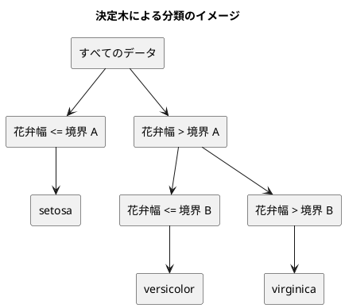

# 第 3 章: 決定木による分類と明白な実装

## 3.1 はじめに

第 1 章では「20 代ならきのこ派」というルールを人間が書き、第 2 章の Notebook では「花弁が小さければ `Iris-setosa` らしい」という傾向を目で見つけました。この章では、こうした「どの特徴量のどこで区切るか」をデータから自動で探すアルゴリズム、**決定木** を自作します。

決定木は、機械学習のアルゴリズムの中でも仕組みが読みやすく、学習した結果をそのまま「もし〜なら」のルールとして読めます。自作したあとは scikit-learn の `DecisionTreeClassifier` に同じデータを学習させ、予測が一致することをテストで確かめます。

## 3.2 決定木の仕組み

### データを 2 つに分けることを繰り返す

決定木は、データを「ある特徴量がある値以下か、より大きいか」で 2 つに分けることを繰り返します。分けた先で同じラベルばかりになったら、そこで分けるのをやめて、そのラベルを予測に使います。



### どこで分けるかをジニ不純度で決める

「よい分け方」とは、分けた後のそれぞれのグループで、ラベルがなるべく 1 種類にそろう分け方です。そろい具合を数値にしたものが **ジニ不純度** です。

ジニ不純度 = 1 − Σ（各ラベルの割合）²

| グループのラベル | 割合 | ジニ不純度 |
|----------------|------|-----------|
| setosa ×3 | setosa 1.0 | 1 − 1.0² = 0 |
| setosa ×1、virginica ×1 | 0.5、0.5 | 1 − (0.5² + 0.5²) = 0.5 |
| 3 品種 ×1 ずつ | 1/3 ずつ | 1 − 3 × (1/3)² = 2/3 |

ラベルが 1 種類にそろうと 0、混ざるほど大きくなります。分け方の候補ごとに、分けた後の左右のジニ不純度を件数で重み付けして平均し、最も小さくなる分け方を選びます。

## 3.3 TODO リストの作成

**TODO リスト**:

- [ ] ジニ不純度を計算する
- [ ] 最良の分割を探す
  - [ ] ラベルを完全に分けられる境界を見つける
  - [ ] 複数の特徴量から最良の特徴量と境界を選ぶ
  - [ ] ラベルが 1 種類なら分割しない
- [ ] 決定木を学習して予測する
  - [ ] 1 種類のラベルだけを学習したらそのラベルを予測する
  - [ ] 境界の左右で異なるラベルを予測する
- [ ] 木の深さを制限する
- [ ] 学習した木を読める形で表示する
- [ ] 実データで scikit-learn の決定木と突き合わせる

## 3.4 ジニ不純度を計算する

### 仮実装から始める

ラベルが 1 種類ならジニ不純度は 0 です。

```python
# test/chapter03/test_decision_tree.py
import pytest

from lib.chapter03.decision_tree import gini


class TestGini:
    def test_1種類のラベルだけならジニ不純度は0(self) -> None:
        assert gini(["Iris-setosa", "Iris-setosa", "Iris-setosa"]) == 0.0
```

モジュールが無いので失敗します（Red）。仮実装で 0 を返します。

```python
# lib/chapter03/decision_tree.py
from collections.abc import Sequence


def gini(labels: Sequence[str]) -> float:
    return 0.0
```

### 三角測量

```python
    def test_2種類のラベルが半分ずつならジニ不純度は05(self) -> None:
        assert gini(["Iris-setosa", "Iris-virginica"]) == 0.5
```

```text
E       AssertionError: assert 0.0 == 0.5
E        +  where 0.0 = gini(['Iris-setosa', 'Iris-virginica'])
========================= 1 failed, 1 passed in 0.13s =========================
```

2 つの例が揃ったので、定義どおりに一般化します。`collections.Counter` はラベルごとの出現回数を数える辞書です。

```python
from collections import Counter
from collections.abc import Sequence


def gini(labels: Sequence[str]) -> float:
    counts = Counter(labels)
    total = len(labels)
    return 1.0 - sum((count / total) ** 2 for count in counts.values())
```

3 品種が 1 件ずつの場合も確かめておきます。こちらは実装を変えずに通りますが、3 種類以上のラベルでも正しいことを示す仕様として残します。

```python
    def test_3種類のラベルが同じ数ならジニ不純度は3分の2(self) -> None:
        labels = ["Iris-setosa", "Iris-versicolor", "Iris-virginica"]

        assert gini(labels) == pytest.approx(2 / 3)
```

```text
============================== 3 passed in 0.03s ==============================
```

## 3.5 最良の分割を探す

### 分割を表すデータ

分割は「どの特徴量を」「どの値（境界）で」分けたか、「分けた後の不純度」の 3 つで表します。

```python
@dataclass(frozen=True)
class Split:
    feature: str
    threshold: float
    impurity: float
```

### 仮実装

花弁幅が 0.2 と 0.7 の間でラベルが入れ替わるデータです。境界は隣り合う値の中点 0.45 にします。

```python
class TestBestSplit:
    def test_ラベルを完全に分けられる境界を見つける(self) -> None:
        x = pd.DataFrame({"花弁幅": [0.1, 0.2, 0.7, 0.8]})
        t = pd.Series(["setosa", "setosa", "virginica", "virginica"])

        assert best_split(x, t) == Split(feature="花弁幅", threshold=0.45, impurity=0.0)
```

```python
def best_split(x: pd.DataFrame, t: pd.Series) -> Split | None:
    return Split(feature="花弁幅", threshold=0.45, impurity=0.0)
```

戻り値の型 `Split | None` は、「分割できないときは `None` を返す」ことを型で表しています。

### 三角測量

特徴量が 2 つあり、`花弁長さ` だけが完全に分けられる例と、そもそも分ける必要がない例を加えます。

```python
    def test_複数の特徴量から不純度が最も小さくなる特徴量と境界を選ぶ(self) -> None:
        x = pd.DataFrame(
            {
                "がく片長さ": [0.1, 0.3, 0.2, 0.4],
                "花弁長さ": [0.2, 0.1, 0.9, 0.6],
            }
        )
        t = pd.Series(["setosa", "setosa", "virginica", "virginica"])

        assert best_split(x, t) == Split(feature="花弁長さ", threshold=0.4, impurity=0.0)

    def test_ラベルが1種類なら分割しない(self) -> None:
        x = pd.DataFrame({"花弁幅": [0.1, 0.2, 0.7]})
        t = pd.Series(["setosa", "setosa", "setosa"])

        assert best_split(x, t) is None
```

```text
test/chapter03/test_decision_tree.py::TestBestSplit::test_ラベルを完全に分けられる境界を見つける PASSED [ 66%]
test/chapter03/test_decision_tree.py::TestBestSplit::test_複数の特徴量から不純度が最も小さくなる特徴量と境界を選ぶ FAILED [ 83%]
test/chapter03/test_decision_tree.py::TestBestSplit::test_ラベルが1種類なら分割しない FAILED [100%]
```

特徴量ごとに値を並べ替え、隣り合う値の間をすべて境界の候補にして、分けた後の不純度が最小になる候補を選びます。

```python
def best_split(x: pd.DataFrame, t: pd.Series) -> Split | None:
    labels = t.to_list()
    if gini(labels) == 0.0:
        return None
    best: Split | None = None
    for feature in x.columns:
        pairs = sorted(zip(x[feature].to_list(), labels, strict=True))
        values = [value for value, _ in pairs]
        sorted_labels = [label for _, label in pairs]
        for i in range(1, len(pairs)):
            if values[i] == values[i - 1]:
                continue
            left, right = sorted_labels[:i], sorted_labels[i:]
            impurity = (len(left) * gini(left) + len(right) * gini(right)) / len(pairs)
            if best is None or impurity < best.impurity:
                threshold = (values[i - 1] + values[i]) / 2
                best = Split(
                    feature=str(feature), threshold=threshold, impurity=impurity
                )
    return best
```

- `sorted(zip(値, ラベル))` で、値とラベルの組を値の順に並べ替えます
- 同じ値が続くところには境界を置けないので飛ばします
- 不純度が「より小さい」ときだけ更新するので、同じ不純度の候補が複数あれば、先に見つかった（列の順・値の順で前の）候補が残ります

### 浮動小数点数の落とし穴

ところが、今度は仮実装のときに通っていた最初のテストが失敗しました。

```text
E       AssertionError: assert Split(feature='花弁幅', threshold=0.44999999999999996, impurity=0.0) == Split(feature='花弁幅', threshold=0.45, impurity=0.0)
E         Drill down into differing attribute threshold:
E           threshold: 0.44999999999999996 != 0.45
```

`(0.2 + 0.7) / 2` は、2 進数の浮動小数点数では 0.45 ちょうどにならず 0.44999999999999996 になります。仮実装はテストと同じ `0.45` というリテラルを返していたので、この差に気づけませんでした。計算で求めた値を検証するテストだからこそ見つかった問題です。

実装は正しいので、テストの比較を `pytest.approx` に変えます。データクラスの比較では誤差を許容できないので、フィールドを取り出してタプルで比べます。

```python
    def test_ラベルを完全に分けられる境界を見つける(self) -> None:
        x = pd.DataFrame({"花弁幅": [0.1, 0.2, 0.7, 0.8]})
        t = pd.Series(["setosa", "setosa", "virginica", "virginica"])

        split = best_split(x, t)

        assert split is not None
        assert (split.feature, split.threshold, split.impurity) == (
            "花弁幅",
            pytest.approx(0.45),
            0.0,
        )
```

`assert split is not None` は、mypy に「ここから先は `split` が `None` ではない」と伝える役割も持ちます。これが無いと、`split.feature` の行で「`None` には `feature` 属性が無い」という型エラーになります。

```text
============================== 6 passed in 0.38s ==============================
```

## 3.6 決定木を学習して予測する

### 仮実装

scikit-learn と同じく、`fit` で学習し `predict` で予測する形にします。`fit` が `self` を返すと、`DecisionTree().fit(x, t)` のように作成と学習を 1 行で書けます。

```python
class TestDecisionTree:
    def test_1種類のラベルだけを学習するとそのラベルを予測する(self) -> None:
        x = pd.DataFrame({"花弁幅": [0.1, 0.2]})
        t = pd.Series(["setosa", "setosa"])

        model = DecisionTree().fit(x, t)

        assert model.predict(pd.DataFrame({"花弁幅": [0.15, 0.9]})) == [
            "setosa",
            "setosa",
        ]
```

```python
class DecisionTree:
    def __init__(self) -> None:
        self.label = ""

    def fit(self, x: pd.DataFrame, t: pd.Series) -> "DecisionTree":
        self.label = str(t.iloc[0])
        return self

    def predict(self, x: pd.DataFrame) -> list[str]:
        return [self.label] * len(x)
```

### 三角測量

```python
    def test_境界の左右で異なるラベルを予測する(self) -> None:
        x = pd.DataFrame({"花弁幅": [0.1, 0.2, 0.7, 0.8]})
        t = pd.Series(["setosa", "setosa", "virginica", "virginica"])

        model = DecisionTree().fit(x, t)

        assert model.predict(pd.DataFrame({"花弁幅": [0.15, 0.75]})) == [
            "setosa",
            "virginica",
        ]
```

```text
E       AssertionError: assert ['setosa', 'setosa'] == ['setosa', 'virginica']
E         
E         At index 1 diff: 'setosa' != 'virginica'
```

### 木を 2 種類のデータで表す

木は「葉」と「節」の 2 種類のデータでできています。

- **葉（`Leaf`）**: 予測するラベルを持つ
- **節（`Node`）**: 分割と、左右の子（葉か節）を持つ

```python
@dataclass(frozen=True)
class Leaf:
    label: str


@dataclass(frozen=True)
class Node:
    split: Split
    left: "Leaf | Node"
    right: "Leaf | Node"
```

`Node` の中で `Node` 自身を型に使うため、型を文字列 `"Leaf | Node"` で書いています（クラスの定義が終わる前は、名前をそのまま書けないためです）。

木を作る処理と予測する処理は、どちらも **再帰** で書けます。

```python
def build_tree(x: pd.DataFrame, t: pd.Series) -> Leaf | Node:
    split = best_split(x, t)
    if split is None:
        return Leaf(label=str(Counter(t.to_list()).most_common(1)[0][0]))
    goes_left = x[split.feature] <= split.threshold
    return Node(
        split=split,
        left=build_tree(x[goes_left], t[goes_left]),
        right=build_tree(x[~goes_left], t[~goes_left]),
    )


def predict_one(tree: Leaf | Node, row: pd.Series) -> str:
    if isinstance(tree, Leaf):
        return tree.label
    if row[tree.split.feature] <= tree.split.threshold:
        return predict_one(tree.left, row)
    return predict_one(tree.right, row)


class DecisionTree:
    def __init__(self) -> None:
        self.tree: Leaf | Node | None = None

    def fit(self, x: pd.DataFrame, t: pd.Series) -> "DecisionTree":
        self.tree = build_tree(x, t)
        return self

    def predict(self, x: pd.DataFrame) -> list[str]:
        if self.tree is None:
            raise ValueError("fit で学習してから predict を呼んでください")
        tree = self.tree
        return [predict_one(tree, row) for _, row in x.iterrows()]
```

- `build_tree` は、分割できなければ多数派のラベルを持つ葉を返し、分割できれば左右のデータでもう一度 `build_tree` を呼びます。`Counter.most_common(1)` は最も多いラベルとその件数の組を 1 つ返します
- `x[goes_left]` は、真偽値の `Series` で行を絞り込む pandas の書き方です。`~` で真偽を反転します
- `predict_one` は `isinstance` で葉か節かを判定し、節なら条件に従って左右どちらかの子へ進みます。mypy は `isinstance` の判定を理解し、`if` の中では `tree` を `Leaf`、その後では `Node` として扱います

```text
============================== 8 passed in 0.41s ==============================
```

## 3.7 木の深さを制限する

分割を止めずに続けると、訓練データを 1 件ずつ分け切るまで木が深くなります。訓練データを丸暗記した状態（**過学習**）になり、未知のデータで当たらなくなります。そこで深さの上限 `max_depth` を指定できるようにします。

3 品種のうち、境界の右側に versicolor 2 件と virginica 1 件が残るデータを用意します。深さ 1 に制限すると、右側は多数派の versicolor を予測するはずです。

```python
def three_species() -> tuple[pd.DataFrame, pd.Series]:
    x = pd.DataFrame({"花弁幅": [0.1, 0.2, 0.3, 0.5, 0.6, 0.9]})
    t = pd.Series(
        ["setosa", "setosa", "setosa", "versicolor", "versicolor", "virginica"]
    )
    return x, t


class TestMaxDepth:
    def test_深さを制限しなければすべての訓練データを分け切る(self) -> None:
        x, t = three_species()

        model = DecisionTree().fit(x, t)

        assert model.predict(x) == t.to_list()

    def test_深さを1に制限すると境界の先は多数派のラベルを予測する(self) -> None:
        x, t = three_species()

        model = DecisionTree(max_depth=1).fit(x, t)

        assert model.predict(pd.DataFrame({"花弁幅": [0.2, 0.95]})) == [
            "setosa",
            "versicolor",
        ]

    def test_学習する前に予測するとエラーになる(self) -> None:
        with pytest.raises(ValueError, match="fit で学習してから"):
            DecisionTree().predict(pd.DataFrame({"花弁幅": [0.1]}))
```

```text
E       TypeError: DecisionTree.__init__() got an unexpected keyword argument 'max_depth'
======================== 1 failed, 10 passed in 0.46s =========================
```

残りの深さを引数で受け取り、子を作るたびに 1 減らします。0 になったら分割せずに葉にします。`None` は「制限なし」を表します。

```python
def build_tree(x: pd.DataFrame, t: pd.Series, max_depth: int | None) -> Leaf | Node:
    split = None if max_depth == 0 else best_split(x, t)
    if split is None:
        return Leaf(label=str(Counter(t.to_list()).most_common(1)[0][0]))
    goes_left = x[split.feature] <= split.threshold
    child_depth = None if max_depth is None else max_depth - 1
    return Node(
        split=split,
        left=build_tree(x[goes_left], t[goes_left], child_depth),
        right=build_tree(x[~goes_left], t[~goes_left], child_depth),
    )
```

```python
class DecisionTree:
    def __init__(self, max_depth: int | None = None) -> None:
        self.max_depth = max_depth
        self.tree: Leaf | Node | None = None

    def fit(self, x: pd.DataFrame, t: pd.Series) -> "DecisionTree":
        self.tree = build_tree(x, t, self.max_depth)
        return self
```

```text
============================= 11 passed in 0.34s ==============================
```

## 3.8 学習した木を表示する

決定木の長所は、学習した結果を人が読めることです。木をテキストで表示する `format_tree` を作ります。

```python
class TestFormatTree:
    def test_葉だけの木はラベルを表示する(self) -> None:
        assert format_tree(Leaf(label="setosa")) == "setosa"

    def test_節は条件ごとに字下げして表示する(self) -> None:
        tree = Node(
            split=Split(feature="花弁幅", threshold=0.4, impurity=0.0),
            left=Leaf(label="setosa"),
            right=Node(
                split=Split(feature="花弁長さ", threshold=0.75, impurity=0.0),
                left=Leaf(label="versicolor"),
                right=Leaf(label="virginica"),
            ),
        )

        assert format_tree(tree) == (
            "花弁幅 <= 0.4000\n"
            "  setosa\n"
            "花弁幅 > 0.4000\n"
            "  花弁長さ <= 0.7500\n"
            "    versicolor\n"
            "  花弁長さ > 0.7500\n"
            "    virginica"
        )
```

テストの木は `Leaf` と `Node` を直接組み立てて作っています。データクラスで表したので、学習を経由せずに表示だけをテストできます。

```python
def format_tree(tree: Leaf | Node, indent: str = "") -> str:
    if isinstance(tree, Leaf):
        return f"{indent}{tree.label}"
    condition = f"{tree.split.feature} {{}} {tree.split.threshold:.4f}"
    return "\n".join(
        [
            indent + condition.format("<="),
            format_tree(tree.left, indent + "  "),
            indent + condition.format(">"),
            format_tree(tree.right, indent + "  "),
        ]
    )
```

f 文字列の中の `{{}}` は波かっこそのものを表します。`condition` は `"花弁幅 {} 0.4000"` という文字列になり、`format("<=")` で比較演算子を差し込みます。

## 3.9 実データで scikit-learn と突き合わせる

### scikit-learn の決定木と予測が一致する

第 2 章の `prepare_iris` で前処理した iris に、自作の決定木と scikit-learn の `DecisionTreeClassifier` を学習させ、テストデータの予測を比べます。`@pytest.mark.parametrize` で、深さを変えた 4 通りを 1 つのテストで確かめます。

```python
@pytest.fixture(scope="module")
def iris_split() -> TrainTestSplit:
    return prepare_iris(data_dir() / "iris.csv", test_size=0.3, seed=0)


@requires_data("iris.csv")
class TestIrisData:
    def test_深さ2の決定木はテストデータの45件中43件を正しく分類する(
        self, iris_split: TrainTestSplit
    ) -> None:
        model = DecisionTree(max_depth=2).fit(iris_split.x_train, iris_split.t_train)

        predictions = model.predict(iris_split.x_test)

        assert accuracy(predictions, iris_split.t_test.to_list()) == pytest.approx(
            43 / 45
        )

    @pytest.mark.parametrize("max_depth", [1, 2, 3, None])
    def test_scikit_learnの決定木とテストデータの予測が一致する(
        self, iris_split: TrainTestSplit, max_depth: int | None
    ) -> None:
        model = DecisionTree(max_depth=max_depth)
        library = DecisionTreeClassifier(max_depth=max_depth, random_state=0)

        model.fit(iris_split.x_train, iris_split.t_train)
        library.fit(iris_split.x_train, iris_split.t_train)

        assert model.predict(iris_split.x_test) == list(
            library.predict(iris_split.x_test)
        )
```

- `@pytest.fixture(scope="module")` は、テストファイルの中で 1 回だけ前処理を実行し、結果を各テストで共有します
- 正解率の計算には、第 1 章の `accuracy` をそのまま再利用しています

4 通りすべてで、45 件の予測が scikit-learn と一致しました。scikit-learn の決定木も、同じくジニ不純度が最小になる分割を選ぶためです。ただし、scikit-learn は特徴量を 32 ビット浮動小数点数に変換してから境界を計算するので、最初の境界は自作の 0.295 に対して 0.29499999433755875 になります。境界がデータの値のちょうど中点にあるため、予測は変わりません。

### 深さと正解率

`python -m lib.chapter03` で、深さごとの正解率と、深さ 2 の木を表示します。

```python
# lib/chapter03/__main__.py
from lib.chapter01.kinoko_takenoko import accuracy
from lib.chapter02.iris_preprocessing import prepare_iris
from lib.chapter03.decision_tree import DecisionTree, format_tree
from lib.dataset import data_dir

TEST_SIZE = 0.3
SEED = 0
MAX_DEPTHS = [1, 2, 3, 4, 5, None]
TREE_DEPTH_TO_SHOW = 2


def main() -> None:
    split = prepare_iris(data_dir() / "iris.csv", test_size=TEST_SIZE, seed=SEED)
    print("深さ\t訓練データ\tテストデータ")
    for max_depth in MAX_DEPTHS:
        model = DecisionTree(max_depth=max_depth).fit(split.x_train, split.t_train)
        train = accuracy(model.predict(split.x_train), split.t_train.to_list())
        test = accuracy(model.predict(split.x_test), split.t_test.to_list())
        depth = "制限なし" if max_depth is None else str(max_depth)
        print(f"{depth}\t{train:.4f}\t{test:.4f}")

    shallow = DecisionTree(max_depth=TREE_DEPTH_TO_SHOW)
    shallow.fit(split.x_train, split.t_train)
    if shallow.tree is not None:
        print(f"\n深さ {TREE_DEPTH_TO_SHOW} の決定木:")
        print(format_tree(shallow.tree))


if __name__ == "__main__":
    main()
```

```bash
uv run python -m lib.chapter03
```

```text
深さ	訓練データ	テストデータ
1	0.6857	0.6222
2	0.9333	0.9556
3	0.9619	0.9111
4	0.9714	0.9111
5	0.9714	0.9111
制限なし	1.0000	0.9111

深さ 2 の決定木:
花弁幅 <= 0.2950
  Iris-setosa
花弁幅 > 0.2950
  花弁幅 <= 0.6500
    Iris-versicolor
  花弁幅 > 0.6500
    Iris-virginica
```

この結果から 2 つのことが読み取れます。

- **木が深くなるほど訓練データの正解率は上がり、制限なしでは 1.0 になる**。訓練データを分け切っているからです
- **テストデータの正解率は深さ 2 の 0.9556 が最も高く、それより深くすると 0.9111 に下がる**。深い木は訓練データの細かな違いまで覚えてしまい、未知のデータでは外れやすくなります。これが過学習です

深さ 2 の木は「花弁幅が 0.295 以下なら setosa、0.65 以下なら versicolor、それより大きければ virginica」と読めます。第 2 章の Notebook で見た「花弁が小さいのが setosa」という傾向を、データから数値の境界として見つけ出しています。人間が書いた第 1 章のルールと違い、境界の値はデータが変われば学習し直すだけで更新されます。

テストの実行結果です。

```bash
uv run pytest test/chapter03
```

```text
============================= 19 passed in 3.01s ==============================
```

データが無い環境では、実データのテスト 6 件（パラメータ化した 4 件を含む）がスキップされます。

```text
======================== 11 passed, 6 skipped in 1.69s ========================
```

## 3.10 Notebook で探索する

Notebook は `apps/python/notebooks/chapter03_decision_tree_exploration.ipynb` にあります。

### 深さと正解率のグラフ

```python
rows = []
for max_depth in range(1, 8):
    model = DecisionTree(max_depth=max_depth).fit(split.x_train, split.t_train)
    rows.append(
        {
            "深さ": max_depth,
            "訓練データ": accuracy(
                model.predict(split.x_train), split.t_train.to_list()
            ),
            "テストデータ": accuracy(
                model.predict(split.x_test), split.t_test.to_list()
            ),
        }
    )
scores = pd.DataFrame(rows).set_index("深さ")
scores.plot(marker="o", title="決定木の深さと正解率")
scores.round(4)
```

```text
      訓練データ  テストデータ
深さ                
1   0.6857  0.6222
2   0.9333  0.9556
3   0.9619  0.9111
4   0.9714  0.9111
5   0.9714  0.9111
6   0.9810  0.9111
7   0.9905  0.9111
```

折れ線グラフにすると、訓練データの線が深さとともに上がり続ける一方、テストデータの線は深さ 2 で頂点になり、その後は横ばいになります。2 本の線の開きが、過学習の度合いを表しています。

### scikit-learn で木を図にする

自作の木はテキストで表示しましたが、scikit-learn の `plot_tree` を使うと、各節の不純度や件数も含めて図にできます。

```python
library = DecisionTreeClassifier(max_depth=2, random_state=0)
library.fit(split.x_train, split.t_train)
plt.figure(figsize=(10, 6))
plot_tree(
    library,
    feature_names=list(split.x_train.columns),
    class_names=list(library.classes_),
    filled=True,
);
```

図の各節には、分割の条件・ジニ不純度（gini）・件数（samples）・ラベルごとの件数（value）が描かれます。根の節の条件が `花弁幅 <= 0.295` になっており、自作の木と同じ分割であることを目で確かめられます。

### 特徴量の重要度

```python
importance = pd.Series(library.feature_importances_, index=split.x_train.columns)
importance.sort_values().plot.barh(title="特徴量の重要度（深さ 2）")
importance.round(4)
```

```text
がく片長さ    0.0
がく片幅     0.0
花弁長さ     0.0
花弁幅      1.0
dtype: float64
```

特徴量の重要度は、その特徴量による分割で不純度がどれだけ下がったかの合計を、全体が 1 になるように割合にしたものです。深さ 2 の木は花弁幅だけで分割しているので、花弁幅の重要度が 1.0 になります。重要度を自作する方法は、第 10 章のランダムフォレストで扱います。

グラフの画像は、第 2 章と同じ理由で記事に載せていません。

<details>
<summary>この章の完成コード（lib/chapter03/decision_tree.py）</summary>

```python
from collections import Counter
from collections.abc import Sequence
from dataclasses import dataclass

import pandas as pd


@dataclass(frozen=True)
class Split:
    feature: str
    threshold: float
    impurity: float


def gini(labels: Sequence[str]) -> float:
    counts = Counter(labels)
    total = len(labels)
    return 1.0 - sum((count / total) ** 2 for count in counts.values())


def best_split(x: pd.DataFrame, t: pd.Series) -> Split | None:
    labels = t.to_list()
    if gini(labels) == 0.0:
        return None
    best: Split | None = None
    for feature in x.columns:
        pairs = sorted(zip(x[feature].to_list(), labels, strict=True))
        values = [value for value, _ in pairs]
        sorted_labels = [label for _, label in pairs]
        for i in range(1, len(pairs)):
            if values[i] == values[i - 1]:
                continue
            left, right = sorted_labels[:i], sorted_labels[i:]
            impurity = (len(left) * gini(left) + len(right) * gini(right)) / len(pairs)
            if best is None or impurity < best.impurity:
                threshold = (values[i - 1] + values[i]) / 2
                best = Split(
                    feature=str(feature), threshold=threshold, impurity=impurity
                )
    return best


@dataclass(frozen=True)
class Leaf:
    label: str


@dataclass(frozen=True)
class Node:
    split: Split
    left: "Leaf | Node"
    right: "Leaf | Node"


def build_tree(x: pd.DataFrame, t: pd.Series, max_depth: int | None) -> Leaf | Node:
    split = None if max_depth == 0 else best_split(x, t)
    if split is None:
        return Leaf(label=str(Counter(t.to_list()).most_common(1)[0][0]))
    goes_left = x[split.feature] <= split.threshold
    child_depth = None if max_depth is None else max_depth - 1
    return Node(
        split=split,
        left=build_tree(x[goes_left], t[goes_left], child_depth),
        right=build_tree(x[~goes_left], t[~goes_left], child_depth),
    )


def predict_one(tree: Leaf | Node, row: pd.Series) -> str:
    if isinstance(tree, Leaf):
        return tree.label
    if row[tree.split.feature] <= tree.split.threshold:
        return predict_one(tree.left, row)
    return predict_one(tree.right, row)


def format_tree(tree: Leaf | Node, indent: str = "") -> str:
    if isinstance(tree, Leaf):
        return f"{indent}{tree.label}"
    condition = f"{tree.split.feature} {{}} {tree.split.threshold:.4f}"
    return "\n".join(
        [
            indent + condition.format("<="),
            format_tree(tree.left, indent + "  "),
            indent + condition.format(">"),
            format_tree(tree.right, indent + "  "),
        ]
    )


class DecisionTree:
    def __init__(self, max_depth: int | None = None) -> None:
        self.max_depth = max_depth
        self.tree: Leaf | Node | None = None

    def fit(self, x: pd.DataFrame, t: pd.Series) -> "DecisionTree":
        self.tree = build_tree(x, t, self.max_depth)
        return self

    def predict(self, x: pd.DataFrame) -> list[str]:
        if self.tree is None:
            raise ValueError("fit で学習してから predict を呼んでください")
        tree = self.tree
        return [predict_one(tree, row) for _, row in x.iterrows()]
```

</details>

## 3.11 まとめ

この章では、決定木を TDD で自作し、scikit-learn の決定木と予測が一致することを確かめました。

1. **明白な実装と三角測量の使い分け** — ジニ不純度は定義がはっきりしているので 2 例目で一般化し、分割の探索は複数の特徴量と分割不要の例で三角測量した
2. **浮動小数点数の誤差** — 中点の計算で 0.45 が 0.44999999999999996 になることを、テストが見つけた。仮実装のリテラルでは気づけない
3. **データクラスと再帰** — 木を `Leaf` と `Node` の 2 種類のデータで表し、学習・予測・表示を再帰で書いた
4. **ライブラリとの突き合わせ** — 同じデータを学習させ、予測が一致することをパラメータ化テストで確かめた
5. **過学習** — 深さを増やすと訓練データの正解率は上がるが、テストデータの正解率は深さ 2 を境に下がった

第 1 部では、データの読み込みから前処理、学習、評価までの基本サイクルを一通り体験しました。第 2 部では、ここまで使ってきたバージョン管理・パッケージ管理・静的解析・タスクランナー・CI を、それぞれ掘り下げます。
