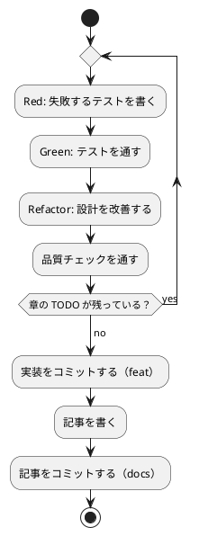

# 第 4 章: バージョン管理とデータ管理

## 4.1 はじめに

第 1 部では、TDD でデータを読み込み、前処理し、分類するプログラムを作りました。第 2 部では、そのプログラムを「変更を楽に安全にできる」状態に保つための道具立てを、バージョン管理（第 4 章）、パッケージ管理と静的解析（第 5 章）、タスクランナーと CI/CD（第 6 章）の順に整えます。

この章ではバージョン管理を扱います。機械学習のプロジェクトでは、コードに加えて **学習データ** と **学習済みモデル** というファイルが登場します。これらをコードと同じようにコミットしてよいとは限りません。この章では、Git で何を管理し、何を管理しないか、そして実験の結果を再現できるようにするには何を固定すればよいかを学びます。

## 4.2 コミットメッセージの重要性

コミット履歴は「なぜこの変更をしたのか」の記録です。機械学習のプロジェクトでは、「前処理を変えたら正解率が変わった」「乱数のシードを変えたら結果が変わった」といった変化の理由を、あとから追跡できることが特に重要になります。

コミットは次の 2 つを守ると追いやすくなります。

- **1 コミット 1 目的** — 機能追加と設定変更、実装と記事を 1 つのコミットに混ぜない
- **形式をそろえる** — 種類と対象がひと目で分かる書式でメッセージを書く

## 4.3 Conventional Commits

### フォーマット

本シリーズでは [Conventional Commits](https://www.conventionalcommits.org/ja/) の形式でコミットメッセージを書きます。

```text
<type>(<scope>): <subject>

<body>

<footer>
```

`scope` には変更の対象を書きます。本リポジトリでは、言語別の実装なら `python`、記事シリーズなら `getting-start-ml` のように書きます。

### コミットタイプ

| type | 用途 |
|------|------|
| `feat` | 新機能（章の実装など） |
| `fix` | バグ修正 |
| `test` | テストの追加・修正 |
| `refactor` | 振る舞いを変えないコードの変更 |
| `docs` | ドキュメントだけの変更（記事など） |
| `chore` | ビルドやツール、依存関係の変更 |
| `ci` | CI の設定の変更 |

### 実践例

本リポジトリの実際のコミット履歴から、Python 版の第 1 章までを抜き出します（古い順）。

```text
790f00e chore: 学習データの配置先 apps/data/ を Git の管理対象外にする
d14ea98 chore(ops): 学習データを配置・確認する gulp data タスクを追加
c61504a chore(python): uv・pytest・Ruff・mypy・tox による Python プロジェクトの雛形を追加
54fd413 feat(python): 第 1 章 きのこ派・たけのこ派をルールで判定する処理を追加
87ef610 test(python): 第 1 章のフィクスチャを配布データと重ならない架空の値にする
838e458 docs(getting-start-ml): シリーズ目次・執筆ワークフロー・Python 第 1 章を追加
93b89fd ci(python): Nix と tox で Python のテスト・リンター・型チェックを実行する
a726f43 fix(python): tox から ML_DATA_DIR をテストに引き渡す
```

`git log --oneline` で見ると、どのコミットが何のための変更かを type と scope だけで区別できます。実装（`feat`）と記事（`docs`）を分けてあるので、コードの変化だけを追いたいときは `feat` と `fix` のコミットだけを見れば済みます。

## 4.4 何をコミットし、何をコミットしないか

機械学習のプロジェクトには、コミットしてはいけないファイルが増えます。理由は大きく 3 つあります。

| 分類 | 例 | コミットしない理由 |
|------|-----|------------------|
| 再配布できないもの | 学習データ | ライセンスで利用者が限られている |
| 再生成できるもの | 仮想環境、キャッシュ、学習済みモデル、Notebook の出力 | 大きく、差分が読めず、コードとデータから作り直せる |
| 秘匿すべきもの | `.env` の認証情報 | 漏洩すると取り返しがつかない |

### 学習データ

本シリーズの学習データは、書籍『スッキリわかる Python による機械学習入門』の配布データです。配布データの利用は書籍購入者に限られており、本リポジトリは公開リポジトリなので、データをコミットすると購入者以外にも配布することになります。そこでデータは `apps/data/sukkiri-ml/` に置き、リポジトリのルートの `.gitignore` で管理対象から外しています。

```text
# 依存関係
node_modules/

# 環境変数（暗号化済みの .env.vault とテンプレートの .env.example は管理対象）
.env

# 学習データ（書籍購入者のみ利用可のため再配布しない。docs/article/getting-start-ml/outline.md を参照）
apps/data/

# ビルド成果物・一時ファイル
site/
tmp/

# IDE・エディタの個人設定
.idea/workspace.xml
.vscode/

# Claude Code の個人設定
.claude/settings.local.json

# OS
.DS_Store
Thumbs.db
```

### Python プロジェクト固有のファイル

`apps/python/.gitignore` では、仮想環境・各ツールのキャッシュ・カバレッジの結果に加えて、Notebook のチェックポイントと、学習済みモデルの保存先 `model/` を除外しています。

```text
.venv/
__pycache__/
.pytest_cache/
.mypy_cache/
.ruff_cache/
.tox/
.coverage
htmlcov/
.ipynb_checkpoints/
model/
```

学習済みモデルは、コードと学習データがあれば作り直せます。モデルのファイルをコミットするより、「どのコードとどのデータから、どの設定で作ったか」を再現できるようにしておくほうが大切です（4.6 節）。

Notebook の出力セルも同じ理由でコミットしません。出力には学習データの行やグラフが含まれることがあり、データをコミットしない方針に反するからです。出力セルを消す仕組みは第 6 章で扱います。

### 除外されていることを確かめる

`.gitignore` が意図どおりに効いているかは、`git check-ignore -v` で確認できます。どのファイルの何行目の規則で除外されたかが表示されます。

```bash
git check-ignore -v apps/data/sukkiri-ml/iris.csv apps/python/.venv tmp/sukkiri-ml-codes.zip
```

```text
.gitignore:8:apps/data/	apps/data/sukkiri-ml/iris.csv
apps/python/.gitignore:1:.venv/	apps/python/.venv
.gitignore:12:tmp/	tmp/sukkiri-ml-codes.zip
```

データを配置したあとに `git status --short` を実行し、`apps/data/` 以下のファイルが一覧に出てこないことも確かめておきます。

## 4.5 データの入手手順をコードにする

データをコミットしない代わりに、**データの入手と配置の手順** をリポジトリに残します。手順が文章だけだと、人によって置き場所がずれ、テストが「データが無い」と判断してスキップされるといった分かりにくい問題が起きます。

本リポジトリでは、配置と確認を Gulp のタスクにしています（`ops/scripts/data.js`）。

```bash
npx gulp data:help
```

```text
学習データ（スッキリわかる Python による機械学習入門 配布データ）

  gulp data:setup   配布 ZIP を展開し、apps\data\sukkiri-ml に学習データを配置する
  gulp data:check   apps\data\sukkiri-ml に学習データが揃っているか確認する
  gulp data:help    このヘルプを表示する

環境変数:
  ML_DATA_ZIP       配布 ZIP のパス（既定 tmp/sukkiri-ml-codes.zip）

配布 ZIP は書籍購入者のみ利用できます。入手先: https://sukkiri.jp/books/sukkiri_ml
学習データはリポジトリにコミットしないでください（apps/data/ は .gitignore 対象）。
```

配布 ZIP を `tmp/` に置いてから `data:setup` を実行すると、記事で使う 9 ファイルが配置されます。

```bash
npx gulp data:setup
npx gulp data:check
```

```text
学習データを apps\data\sukkiri-ml に配置しました（9 ファイル）。
```

```text
学習データは揃っています（apps\data\sukkiri-ml、9 ファイル）。
```

ファイルが足りない場合や ZIP が見つからない場合は、失敗して対処方法を表示します。データをまだ配置していない状態で `npx gulp data:check` を実行すると、次のようになります。

```text
[11:37:51] Error: 学習データが不足しています（apps\data\sukkiri-ml）: KvsT.csv, iris.csv, cinema.csv, Survived.csv, Boston.csv, Wholesale.csv, Bank.csv, bike.tsv, weather.csv
gulp data:setup で配置してください。
```

```bash
ML_DATA_ZIP=nope.zip npx gulp data:setup
```

```text
[11:37:45] Error: 配布 ZIP が見つかりません: nope.zip
https://sukkiri.jp/books/sukkiri_ml から入手し、ML_DATA_ZIP でパスを指定してください。
```

どちらのタスクも失敗時は終了コードが 0 以外になるので、ほかのスクリプトや CI から呼び出したときにも失敗を検出できます。

### プログラムからデータの場所を知る

Python の実装は、第 1 章で作った `lib/dataset.py` の `data_dir()` でデータの場所を解決します。環境変数 `ML_DATA_DIR` があればその場所を、無ければ `apps/data/sukkiri-ml/` を使います。

```python
import os
from pathlib import Path

APPS_DIR = Path(__file__).resolve().parents[2]


def data_dir() -> Path:
    env = os.environ.get("ML_DATA_DIR")
    if env:
        return Path(env)
    return APPS_DIR / "data" / "sukkiri-ml"
```

データの場所をコードに直接書かず、1 か所で解決するようにしておくと、CI や読者の環境など置き場所が違う場合にも、環境変数を 1 つ変えるだけで対応できます。

### データが無い環境でもテストを通す

コミットしないデータに依存するテストは、データの無い環境（CI や、データをまだ入手していない読者の環境）では実行できません。第 2 章からは、`test/markers.py` の `requires_data` でスキップの条件をまとめています。

```python
import pytest

from lib.dataset import data_dir


def requires_data(*file_names: str) -> pytest.MarkDecorator:
    """学習データが配置されていなければテストをスキップするマーカーを返す。"""
    missing = [name for name in file_names if not (data_dir() / name).exists()]
    return pytest.mark.skipif(
        bool(missing),
        reason=f"学習データ {', '.join(missing)} が配置されていない（gulp data:setup）",
    )
```

```python
@requires_data("iris.csv")
class TestIrisData:
    ...
```

単体テストは架空の値で作ったフィクスチャで書き、実データのテストはこのマーカーで守る、という 2 段構えにすることで、「データをコミットしない」ことと「どの環境でもテストが通る」ことを両立させています。

## 4.6 実験を再現できるようにする

機械学習の結果は、コードとデータが同じでも、次のものが違うと変わります。

| 変わる原因 | 固定する方法 | 本リポジトリでの置き場所 |
|-----------|------------|----------------------|
| 乱数（データの分割、モデルの初期値） | シードを指定する | 各章のコード（第 2 章の `seed`、ライブラリの `random_state`） |
| ライブラリのバージョン | ロックファイルを使う | `apps/python/uv.lock`（第 5 章） |
| Python のバージョン | バージョンを指定する | `apps/python/.python-version`（第 5 章） |

### 乱数のシード

第 2 章の `split_train_test` は、`np.random.default_rng(seed)` で作った乱数生成器でデータを並べ替えていました。シードを指定した乱数生成器は、何度実行しても同じ並びを返します。

同じシード 0 で 2 回、シード 1 で 1 回、シードを指定せずに 1 回、0〜9 の並べ替えを実行してみます。

```python
import numpy as np

print(np.random.default_rng(0).permutation(10))
print(np.random.default_rng(0).permutation(10))
print(np.random.default_rng(1).permutation(10))
print(np.random.default_rng().permutation(10))
```

```text
[4 6 2 7 3 5 9 0 8 1]
[4 6 2 7 3 5 9 0 8 1]
[8 4 7 0 1 2 5 9 6 3]
[5 1 2 3 8 7 4 6 9 0]
```

シードを指定した 2 回は同じ並びになり、シードを変えると並びが変わります。シードを指定しない場合は実行のたびに変わるので、上の最後の行は手元で実行すると別の並びになります。

第 2 章では、この性質を次の 2 つのテストで固定しました。テストがあるので、うっかりシードを使わない実装に変えてしまっても気付けます。

```python
    def test_同じシードなら同じ分け方になる(self) -> None:
        x, t = numbered_dataset(10)

        first = split_train_test(x, t, test_size=0.3, seed=42)
        second = split_train_test(x, t, test_size=0.3, seed=42)

        assert first.x_test.index.equals(second.x_test.index)

    def test_シードが違えば違う分け方になる(self) -> None:
        x, t = numbered_dataset(10)

        first = split_train_test(x, t, test_size=0.3, seed=0)
        second = split_train_test(x, t, test_size=0.3, seed=1)

        assert not first.x_test.index.equals(second.x_test.index)
```

記事に載せる正解率などの数値は、シードを固定した実装を実データで動かした結果です。シードを変えると数値も変わるので、数値をテストで固定するときは、どのシードで得た値かを必ずコードに残します。

## 4.7 TDD とコミットのタイミング

TDD のサイクルとコミットは、次のように対応させると履歴が読みやすくなります。



- テストが通らない状態ではコミットしない
- 実装と記事は別のコミットにする
- 設定や依存関係の変更（`chore`）、CI の変更（`ci`）も、それぞれ別のコミットにする
- 学習データ・モデル・Notebook の出力がステージングされていないことを、コミットの前に `git status` で確かめる

## 4.8 まとめ

この章では、機械学習のプロジェクトでのバージョン管理を学びました。

1. **Conventional Commits** — type と scope で、変更の種類と対象が分かるコミットメッセージを書く
2. **コミットしないものを決める** — 再配布できない学習データ、再生成できるモデルや Notebook の出力、秘匿すべき認証情報を `.gitignore` で除外する
3. **入手手順をコードにする** — データを置く場所と確認方法を Gulp タスクにし、プログラムからは `data_dir()` で場所を解決する
4. **データが無くてもテストを通す** — 実データのテストは `requires_data` でスキップする
5. **再現性** — 乱数のシード、ライブラリのバージョン、Python のバージョンを固定する

次の章では、ライブラリのバージョンと Python のバージョンを固定する uv と、コードの品質を機械的に確かめる静的解析ツールを扱います。
