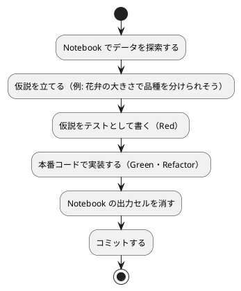
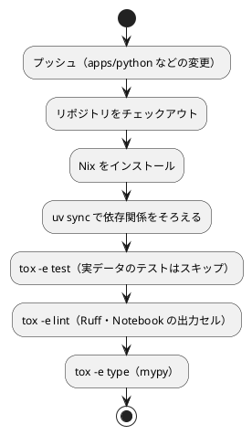

# 第 6 章: タスクランナーと CI/CD

## 6.1 はじめに

第 5 章までで、テスト（pytest）、リンターとフォーマッター（Ruff）、型チェック（mypy）、カバレッジ（pytest-cov）がそろいました。ただ、コマンドが増えると、実行し忘れや、人によって実行するコマンドが違うといった問題が起きます。

この章では、次の 3 つを整えます。

1. **タスクランナー** — tox で品質チェックのコマンドに名前を付け、1 つのコマンドで実行できるようにする
2. **Notebook の運用** — JupyterLab でデータを探索し、出力セルを消してからコミットする仕組みを作る
3. **CI/CD** — GitHub Actions で、プッシュのたびに同じ品質チェックを自動実行する

最後に、CI を作ったときに実際に起きた問題（Nix の `PYTHONPATH` と uv の仮想環境の衝突）と、その調べ方を紹介します。

## 6.2 タスクランナー — tox

### tox.ini の設定

タスクは `apps/python/tox.ini` に定義しています。

```ini
[tox]
envlist = test,lint,type
skipsdist = true

# 依存関係は uv.lock で固定した uv の仮想環境を使い、tox はタスクランナーとして使う
[testenv]
skip_install = true
allowlist_externals = uv
# 学習データの場所（未指定なら apps/data/sukkiri-ml）
passenv = ML_DATA_DIR

[testenv:test]
commands =
    uv run pytest --cov=lib --cov-report=term-missing --verbose

[testenv:lint]
commands =
    uv run ruff check .
    uv run ruff format --check .
    uv run python tools/notebooks.py verify

[testenv:format]
commands =
    uv run ruff format .
    uv run python tools/notebooks.py strip

[testenv:type]
commands =
    uv run mypy lib test tools

# Notebook を実行して動作を確認する（学習データが必要）
[testenv:notebook]
commands =
    uv run python tools/notebooks.py execute

[testenv:all]
commands =
    uv run pytest --cov=lib --cov-report=term-missing
    uv run ruff check .
    uv run ruff format --check .
    uv run python tools/notebooks.py verify
    uv run mypy lib test tools
```

### tox をタスクランナーとして使う

tox は本来、テストごとに専用の仮想環境を作り、パッケージをインストールしてテストするツールです。本シリーズでは、依存関係はすでに `uv.lock` で固定した uv の仮想環境（`.venv`）にそろっているので、tox には **コマンドに名前を付けて順に実行する役割** だけを担わせています。

| 設定 | 意味 |
|------|------|
| `skipsdist = true`・`skip_install = true` | プロジェクトをパッケージとしてビルド・インストールしない |
| `allowlist_externals = uv` | tox の仮想環境の外にある `uv` コマンドの実行を許可する |
| `commands = uv run ...` | 実際の処理は uv の仮想環境で実行する |

こうすると、ライブラリのバージョンが `uv.lock` の 1 か所で決まり、tox 用に依存関係を二重に書く必要がありません。

| タスク | 内容 | 学習データ |
|--------|------|----------|
| `test` | テストとカバレッジ | あれば実データのテストも実行、無ければスキップ |
| `lint` | Ruff の検査、フォーマットの確認、Notebook の出力セルの残存確認 | 不要 |
| `format` | Ruff の整形と、Notebook の出力セルの削除 | 不要 |
| `type` | mypy による型チェック | 不要 |
| `notebook` | すべての Notebook を実行して、エラーなく動くか確認 | 必要 |
| `all` | `test`・`lint`・`type` をまとめて実行 | あれば使う |

### タスクの実行

```bash
cd apps/python

# 品質チェックをまとめて実行する
uv run tox -e all

# 個別に実行する
uv run tox -e test
uv run tox -e lint
uv run tox -e type

# 整形する
uv run tox -e format

# Notebook の動作を確認する（学習データが必要）
uv run tox -e notebook
```

第 2 章まで実装した時点で `uv run tox -e all` を実行したときの出力の一部です。

```text
============================= 31 passed in 2.55s ==============================
All checks passed!
  all: OK (6.08=setup[0.08]+cmd[3.50,0.12,0.11,1.64,0.62] seconds)
```

最後の行の `cmd[...]` は、`all` の 5 つのコマンドそれぞれの実行時間です。テストの件数は、章が進むと増えていきます。

### 環境変数を tox に渡す

tox はタスクを実行するとき、環境変数をほとんど引き継ぎません。テストの環境を手元の設定に左右されないようにするためです。そのため、学習データの場所を指定する `ML_DATA_DIR` も、最初はテストに届いていませんでした。

データの無い環境を再現するつもりで、存在しないディレクトリを指定して実行したところ、実データのテストがスキップされずに全件が実行されてしまいました。

```bash
ML_DATA_DIR=/nonexistent uv run tox -e test
```

```text
============================= 13 passed in 0.11s ==============================
  test: OK (0.73=setup[0.06]+cmd[0.67] seconds)
```

`ML_DATA_DIR` が届かず、既定の `apps/data/sukkiri-ml/` にあるデータを読んでいたためです。`[testenv]` に `passenv = ML_DATA_DIR` を追加すると、意図どおり 3 件がスキップされるようになりました。

```text
======================== 10 passed, 3 skipped in 0.11s ========================
  test: OK (0.69=setup[0.06]+cmd[0.62] seconds)
```

CI には学習データを置かないので、この設定が無いと「CI ではデータが無いのでスキップされるはず」という前提を手元で確かめられません。

## 6.3 Notebook による探索と出力セルの削除

### JupyterLab でデータを探索する

データの傾向をつかむには、グラフを描きながら試行錯誤できる Notebook が便利です。JupyterLab は開発依存として追加済みなので、次のコマンドで起動します。

```bash
cd apps/python
uv run jupyter lab
```

Notebook は `apps/python/notebooks/` に置きます。本番コード（`lib/`）の関数を Notebook から呼び出せるように、最初のセルで親ディレクトリを import の検索パスに加えます。第 2 章の Notebook の最初のセルは次のとおりです。

```python
import sys

sys.path.append("..")

import seaborn as sns
from japanese_font import use_japanese_font

from lib.chapter02.iris_preprocessing import count_missing, load_iris, prepare_iris
from lib.dataset import data_dir

use_japanese_font();
```

Notebook で前処理を書き直すのではなく、TDD で作った `load_iris` や `prepare_iris` をそのまま使っている点が大切です。探索に使うコードとテスト済みのコードが同じなので、Notebook で見たグラフと、テストで保証している振る舞いがずれません。

### グラフで日本語を表示する

本シリーズのデータは列名が日本語なので、matplotlib の既定のフォントではグラフのラベルが表示されません。`notebooks/japanese_font.py` で、インストール済みの日本語フォントを探して設定します。

```python
"""Notebook のグラフで日本語を表示するためのフォント設定。"""

import matplotlib.pyplot as plt
from matplotlib import font_manager

CANDIDATES = ["Yu Gothic", "Hiragino Sans", "Noto Sans CJK JP", "IPAexGothic"]


def use_japanese_font() -> str | None:
    """インストール済みの日本語フォントを探して設定し、そのフォント名を返す。"""
    available = {font.name for font in font_manager.fontManager.ttflist}
    for name in CANDIDATES:
        if name in available:
            plt.rcParams["font.family"] = name
            return name
    return None
```

`plt.rcParams["font.family"]` に候補のリストをそのまま設定すると、見つからないフォントについて `findfont: Font family 'Hiragino Sans' not found.` という警告がグラフの描画のたびに大量に出ました。実際にインストールされているフォントだけを選んで設定するのはそのためです。執筆環境の Windows では Yu Gothic が選ばれました。候補にどれも無い環境では `None` を返し、フォントは変更しません。

### Notebook で分かったことをテストに移す

Notebook は探索の場所であり、そこで分かったことは Notebook に残しただけでは守られません。次の流れで、分かったことをテストと本番コードに移します。



### 出力セルを消してからコミットする

Notebook のファイル（`.ipynb`）には、コードに加えて実行結果（表・グラフの画像）が保存されます。出力を残したままコミットすると、次の問題が起きます。

- 出力に学習データの行が含まれ、データをコミットしない方針（第 4 章）に反する
- グラフの画像でファイルが大きくなり、差分が読めなくなる

そこで [nbstripout](https://github.com/kynan/nbstripout) で出力セルを消してからコミットします。`notebooks/` 以下のすべての Notebook をまとめて扱うため、`tools/notebooks.py` を用意しています。

```python
"""notebooks/ 配下の Notebook を実行・出力削除・検査する。

使い方:
    uv run python tools/notebooks.py execute  # すべて実行する（出力は保存しない）
    uv run python tools/notebooks.py strip    # 出力セルを消す
    uv run python tools/notebooks.py verify   # 出力セルが残っていたら失敗する
"""

import os
import subprocess
import sys
from pathlib import Path

NOTEBOOK_DIR = Path(__file__).resolve().parents[1] / "notebooks"


def notebooks() -> list[Path]:
    return sorted(NOTEBOOK_DIR.glob("*.ipynb"))


def run(args: list[str], cwd: Path | None = None) -> int:
    env = {**os.environ, "MPLBACKEND": "Agg"}
    return subprocess.run([sys.executable, "-m", *args], cwd=cwd, env=env).returncode


def execute() -> int:
    for notebook in notebooks():
        print(f"実行: {notebook.name}")
        code = run(
            ["nbconvert", "--to", "notebook", "--execute", "--stdout", notebook.name],
            cwd=NOTEBOOK_DIR,
        )
        if code != 0:
            return code
    return 0


def strip() -> int:
    paths = [str(p) for p in notebooks()]
    return run(["nbstripout", *paths]) if paths else 0


def verify() -> int:
    paths = [str(p) for p in notebooks()]
    return run(["nbstripout", "--verify", *paths]) if paths else 0


COMMANDS = {"execute": execute, "strip": strip, "verify": verify}

if __name__ == "__main__":
    if len(sys.argv) != 2 or sys.argv[1] not in COMMANDS:
        print(__doc__)
        sys.exit(2)
    sys.exit(COMMANDS[sys.argv[1]]())
```

| サブコマンド | 使っている機能 | tox のタスク |
|------------|--------------|------------|
| `execute` | `nbconvert --execute --stdout` で実行し、結果はファイルに保存しない | `notebook` |
| `strip` | `nbstripout` で出力セルを消す | `format` |
| `verify` | `nbstripout --verify` で、消すべき出力があれば失敗する | `lint`・`all` |

`execute` では環境変数 `MPLBACKEND=Agg` を設定し、画面の無い環境でもグラフを描画できるようにしています。

第 2 章の Notebook を実行し、出力を残したまま `tmp/nb-ch06/` に保存したファイルに `nbstripout --verify` を実行すると、出力が残っているので失敗します（終了コード 1）。

```bash
uv run nbstripout --verify ../../tmp/nb-ch06/chapter02_iris_exploration.ipynb
```

```text
Dry run: would have stripped ../../tmp/nb-ch06/chapter02_iris_exploration.ipynb
```

`nbstripout` で出力を消すと、`--verify` は終了コード 0 で通るようになります。コミットされている Notebook に対しては、`verify` は何も表示せずに成功します。

```bash
uv run python tools/notebooks.py verify
```

`execute` は Notebook ごとに名前を表示して実行します。

```text
実行: chapter02_iris_exploration.ipynb
```

`verify` を `lint` タスクに入れてあるので、出力セルを消し忘れた Notebook は CI で検出されます。一方 `execute` は学習データが必要なので、CI では実行せず、手元の `tox -e notebook` で確認します。

## 6.4 GitHub Actions による CI

### ワークフロー設定

プッシュのたびに品質チェックを自動実行するため、`.github/workflows/python-ci.yml` を用意しています。

```yaml
name: Python CI

on:
  push:
    branches: [main, develop]
    paths:
      - "apps/python/**"
      - ".github/workflows/python-ci.yml"
      - "ops/nix/environments/python/**"
      - "flake.nix"
      - "flake.lock"
  pull_request:
    branches: [main]
    paths:
      - "apps/python/**"
      - ".github/workflows/python-ci.yml"
      - "ops/nix/environments/python/**"
      - "flake.nix"
      - "flake.lock"

permissions:
  contents: read

jobs:
  test:
    runs-on: ubuntu-latest

    steps:
      - name: Checkout the repository
        uses: actions/checkout@v4

      - name: Install Nix
        uses: cachix/install-nix-action@v30
        with:
          nix_path: nixpkgs=channel:nixos-unstable

      # nix develop は PYTHONPATH に Nix の Python パッケージを追加し、uv の仮想環境の依存関係より優先されるため外す
      # 学習データは再配布できないため CI には配置しない。実データのテストはスキップされる
      - name: Run tests
        run: nix develop .#python --command bash -c "unset PYTHONPATH && cd apps/python && uv sync && uv run tox -e test"

      - name: Run lint
        run: nix develop .#python --command bash -c "unset PYTHONPATH && cd apps/python && uv run tox -e lint"

      - name: Run type check
        run: nix develop .#python --command bash -c "unset PYTHONPATH && cd apps/python && uv run tox -e type"
```

### ワークフローのポイント

- **`paths` で対象を絞る** — Python の実装・このワークフロー・Nix の環境定義が変わったときだけ実行します。記事だけの変更や、ほかの言語の変更では実行されません
- **Nix で環境をそろえる** — `nix develop .#python` で、リポジトリの `ops/nix/environments/python/shell.nix` に定義した環境（uv を含む）に入ってからコマンドを実行します
- **手元と同じコマンドを使う** — 各ステップは手元と同じ `uv run tox -e ...` を実行します。手元と CI でコマンドが違うと、どちらかが必ず古くなります
- **学習データは置かない** — 学習データは再配布できないので CI には置きません。実データのテストは `requires_data` でスキップされます

### CI パイプラインの流れ



第 1 章まで実装した時点で、CI が成功したときのログの一部です。

```text
Using CPython 3.12.12
======================== 10 passed, 3 skipped in 0.07s =========================
  test: OK (1.28=setup[0.67]+cmd[0.60] seconds)
All checks passed!
10 files already formatted
  lint: OK (0.48=setup[0.44]+cmd[0.02,0.02] seconds)
Success: no issues found in 10 source files
  type: OK (2.33=setup[0.47]+cmd[1.86] seconds)
```

CI には学習データが無いので、実データのテスト 3 件がスキップされています。

## 6.5 CI で起きた問題を調べる

CI を最初に動かしたとき、手元では通っていたテストが CI だけで失敗しました。原因の調べ方の例として、その経緯を紹介します。

### 1 回目: tox が起動しない

```text
copying path '/nix/store/gx4vpfwx6djk15h6ki9raxlxkc7c1rba-python3.13-packaging-25.0' from 'https://cache.nixos.org'...
Using CPython 3.13.11 interpreter at: /nix/store/qpsiqhxjz3xzrkwzm2xdz7xxbqp5y9k2-python3-3.13.11-env/bin/python3.13
Creating virtual environment at: .venv
 + packaging==26.3
    from packaging.pylock import Package, PylockValidationError
ModuleNotFoundError: No module named 'packaging.pylock'
##[error]Process completed with exit code 1.
```

tox が、ライブラリ `packaging` の `pylock` モジュールを見つけられずに失敗しています。ログから次のことが読み取れます。

- uv は仮想環境に `packaging==26.3`（`uv.lock` のバージョン）をインストールしている
- 一方で Nix は `packaging-25.0` を用意している
- uv は Nix が用意した Python（3.13.11）で仮想環境を作っている

`pylock` は新しい `packaging` にしか無いので、「仮想環境の 26.3 ではなく、Nix の 25.0 が読み込まれている」と推測できます。

### 2 回目: 1 つ目の仮説は外れ

最初は「Nix が用意した Python で仮想環境を作ったため、その Python に入っているパッケージが混ざった」と考えました。そこで uv が自分で管理する Python を使うように `pyproject.toml` に `python-preference = "only-managed"` を設定し、`.python-version` で 3.12 に固定しました（第 5 章）。

```text
Using CPython 3.12.12
 + packaging==26.3
    from packaging.pylock import Package, PylockValidationError
ModuleNotFoundError: No module named 'packaging.pylock'
##[error]Process completed with exit code 1.
```

Python は uv が管理する 3.12.12 に変わりましたが、同じエラーで失敗しました。仮説が外れたということです。

### 3 回目: 推測をやめて確かめる

Python を替えても古い `packaging` が読み込まれるなら、Python の外、つまり環境変数から検索パスが追加されている可能性があります。推測を重ねる代わりに、CI に `PYTHONPATH` を表示するだけのステップを一時的に追加して確かめました。

```yaml
      - name: Show Python path from Nix
        run: nix develop .#python --command bash -c 'echo "PYTHONPATH=${PYTHONPATH:-}" | tr ":" "\n"'
```

```text
PYTHONPATH=/nix/store/qzc04a3npl70cyyy6flnnrb2ig3kayxm-python3-3.13.11/lib/python3.13/site-packages
/nix/store/qpsiqhxjz3xzrkwzm2xdz7xxbqp5y9k2-python3-3.13.11-env/lib/python3.13/site-packages
```

`nix develop` が、Nix の Python のパッケージ置き場（site-packages）を `PYTHONPATH` に追加していました。`PYTHONPATH` のディレクトリは仮想環境のパッケージより先に検索されるため、どの Python で仮想環境を作っても、Nix の `packaging` 25.0 が先に読み込まれていたのです。

Nix の Python 環境は `ops/nix/environments/python/shell.nix` で、MkDocs を動かすために次のように定義されています。

```nix
    (python3.withPackages (ps: with ps; [
      uv
      mkdocs
      mkdocs-material
      pymdown-extensions
      # plantuml-markdown and others might need to be checked if available
    ]))
```

### 対処

CI の各ステップで、uv を実行する前に `unset PYTHONPATH` するようにしました（6.4 節のワークフロー）。これで CI は成功し、原因の特定に使った表示用のステップは削除しました。

1 つ目の対処（uv が管理する Python 3.12 に固定）は、この問題の解決には効きませんでしたが、手元と CI で同じ Python を使えるようになるので残しています。

読者が手元で `nix develop .#python` を使う場合も、同じ問題に当たります。その場合は、CI と同じく、`apps/python` で uv を使う前に `unset PYTHONPATH` を実行してください。

```bash
nix develop .#python
unset PYTHONPATH
cd apps/python
uv sync
uv run tox -e all
```

### この経緯から学べること

- **ログから事実と推測を分ける** — 「26.3 がインストールされた」「25.0 が用意された」は事実、「25.0 が読み込まれた」は推測でした
- **対処の結果で仮説を検証する** — 2 回目の失敗は、仮説が外れていたことを教えてくれました。対処が効かなかったら、その対処が正しかったかを疑います
- **確かめるための小さなステップを足す** — 推測を重ねる前に、環境変数を表示するだけのステップで事実を確認しました

## 6.6 三種の神器と CI

第 4〜6 章で整えたものを、ソフトウェア開発の「三種の神器」（バージョン管理・テスティング・自動化）に当てはめると次のようになります。

| 三種の神器 | 道具 | 本シリーズでの使い方 |
|-----------|------|------------------|
| バージョン管理 | Git、Conventional Commits、`.gitignore` | 学習データ・モデル・Notebook の出力をコミットしない |
| テスティング | pytest、pytest-cov | 単体テストはフィクスチャ、実データのテストは `requires_data` でスキップ可能にする |
| 自動化 | uv、Ruff、mypy、tox、GitHub Actions、Gulp | 環境の再現、品質チェックの一括実行、データの配置、CI |

### 利用可能なコマンド一覧

| コマンド | 内容 | 実行する場所 |
|---------|------|------------|
| `npx gulp data:setup` | 学習データを配置する | リポジトリのルート |
| `npx gulp data:check` | 学習データの配置を確認する | リポジトリのルート |
| `uv sync` | 依存関係をインストールする | `apps/python` |
| `uv run tox -e all` | テスト・Lint・型チェックをまとめて実行する | `apps/python` |
| `uv run tox -e format` | コードを整形し、Notebook の出力セルを消す | `apps/python` |
| `uv run tox -e notebook` | Notebook を実行して動作を確認する | `apps/python` |
| `uv run jupyter lab` | JupyterLab を起動する | `apps/python` |

## 6.7 まとめ

この章では、品質チェックを自動化し、どの環境でも同じ手順で実行できるようにしました。

1. **tox** — uv の仮想環境を使うタスクランナーとして、品質チェックに名前を付ける。必要な環境変数は `passenv` で渡す
2. **Notebook の運用** — 本番コードの関数を Notebook から使い、分かったことはテストに移す。出力セルは `tools/notebooks.py strip` で消し、`verify` を CI で検査する
3. **GitHub Actions** — Nix で環境をそろえ、手元と同じ tox のコマンドを実行する。学習データの無い CI では実データのテストがスキップされる
4. **問題の調べ方** — ログの事実と推測を分け、対処の結果で仮説を検証し、確かめるための小さなステップを足す

第 2 部で、TDD を回し続けるための道具立てがそろいました。次の第 3 部では、回帰問題と、欠損値・カテゴリ値・外れ値を含む現実的なデータの前処理に取り組みます。
