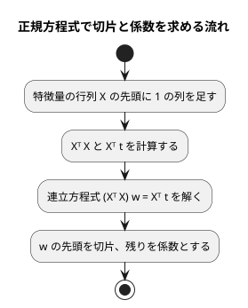

# 第 7 章: 線形回帰による数値予測

## 7.1 はじめに

第 1〜3 章では「きのこ派かたけのこ派か」「アヤメのどの品種か」という、グループを当てる **分類** を扱いました。この章からは、数値そのものを当てる **回帰** に進みます。題材は、映画の SNS での反響や主演俳優の露出度から、興行収入を予測する問題です。

この章では、最も基本的な回帰モデルである **線形回帰** を、NumPy の行列演算で自作します。次に scikit-learn の `LinearRegression` に置き換えて、同じ係数が得られることをテストで確かめます。あわせて、外れ値の除去と、回帰の評価指標（MAE・RMSE・決定係数 R²）も実装します。

## 7.2 線形回帰とは

### 特徴量の重み付きの和で予測する

線形回帰は、予測値を「切片」と「特徴量ごとの係数 × 特徴量」の和で表すモデルです。この章のデータに当てはめると次の式になります。

```text
予測値 = 切片 + 係数1 × SNS1 + 係数2 × SNS2 + 係数3 × actor + 係数4 × original
```

学習とは、訓練データに対して予測値と実測値のずれが最も小さくなるように、切片と係数を決めることです。ずれの大きさには「誤差の 2 乗の合計」を使います。これを最小にする方法を **最小二乗法** と呼びます。

### 正規方程式

最小二乗法の解は、行列を使うと 1 つの式で求められます。特徴量を行列 `X`、実測値をベクトル `t`、切片と係数をまとめたベクトルを `w` とすると、誤差の 2 乗の合計を最小にする `w` は次の **正規方程式** を満たします。

```text
(Xᵀ X) w = Xᵀ t
```

`X` の先頭には、すべての値が 1 の列を足しておきます。この列にかかる係数が切片になります。この形にしておくと、切片も係数と同じように 1 回の計算で求められます。



逆行列 `(Xᵀ X)⁻¹` を計算してから掛けても同じ結果になりますが、数値計算では逆行列を作らずに連立方程式として解くほうが誤差が小さくなります。この章では `numpy.linalg.solve` を使います。

## 7.3 題材とデータ

この章で使うのは `cinema.csv` です。100 本の映画について、次の 6 列が記録されています。

| 列 | 内容 | 値の範囲 | 欠損値 |
|----|------|---------|-------|
| cinema_id | 映画の ID | 1000〜1989 | なし |
| SNS1 | SNS での反響の数（1 つ目の指標） | 0〜1000 | 1 件 |
| SNS2 | SNS での反響の数（2 つ目の指標） | 0〜1500 | なし |
| actor | 主演俳優のメディア露出の指標 | 約 5703〜約 12665 | 1 件 |
| original | 原作の有無 | 0 または 1 | なし |
| sales | 興行収入 | 7869〜11405 | なし |

「SNS1」「SNS2」「actor」「original」が特徴量、「sales」が正解ラベル（予測したい数値）です。`cinema_id` は映画を区別するための番号なので、特徴量には使いません。

このデータには、SNS2 の値が大きいのに興行収入が低い、傾向から外れた映画が 1 本含まれています。このような **外れ値** は、最小二乗法の結果を大きく引っ張ります。誤差を 2 乗して足し合わせるので、大きく外れた 1 点の影響が大きくなるためです。

## 7.4 TODO リストの作成

**TODO リスト**:

- [ ] cinema.csv を読み込む
- [ ] 外れ値を取り除く
  - [ ] SNS2 が 1000 を超え、興行収入が 8500 未満の行を取り除く
  - [ ] 条件の片方だけを満たす行は残す
- [ ] 正規方程式で線形回帰を学習する
  - [ ] 直線上の点から切片と係数を求める
  - [ ] 複数の特徴量から切片と係数を求める
- [ ] 学習したモデルで予測する
- [ ] 評価指標を計算する
  - [ ] MAE（平均絶対誤差）
  - [ ] RMSE（平均二乗誤差の平方根）
  - [ ] R²（決定係数）
- [ ] scikit-learn と結果が一致することを確かめる
- [ ] 外れ値の除去・分割・補完をまとめる
- [ ] 実データで学習・評価して表示する

外れ値の条件「SNS2 が 1000 を超え、興行収入が 8500 未満」は、書籍『スッキリわかる Python による機械学習入門』の同じデータでの分析手順に合わせたものです。散布図で外れ値を確かめる手順は、7.12 節の Notebook で扱います。

## 7.5 データを読み込み外れ値を取り除く

### 読み込み

テストでは、架空の値を書いた CSV を `tmp_path` に作ります。

```python
HEADER = "cinema_id,SNS1,SNS2,actor,original,sales\n"


def write_csv(tmp_path: Path, rows: str) -> Path:
    csv_file = tmp_path / "cinema.csv"
    csv_file.write_text(HEADER + rows, encoding="utf-8")
    return csv_file


class TestLoadCinema:
    def test_CSVを読み込み空欄を欠損値にする(self, tmp_path: Path) -> None:
        csv_file = write_csv(tmp_path, "1,,500,9000.5,1,9500\n")

        df = load_cinema(csv_file)

        assert list(df.columns) == [
            "cinema_id",
            "SNS1",
            "SNS2",
            "actor",
            "original",
            "sales",
        ]
        assert pd.isna(df.loc[0, "SNS1"])
```

外れ値のテストもあわせて書き、まとめて Red を確認します。

```python
class TestRemoveOutliers:
    def test_SNS2が1000を超え売上が8500未満の行を取り除く(self) -> None:
        df = pd.DataFrame({"SNS2": [1200, 600], "sales": [8000, 9500]})

        assert remove_outliers(df)["SNS2"].to_list() == [600]
```

```bash
uv run pytest test/chapter07
```

```text
E   ModuleNotFoundError: No module named 'lib.chapter07.cinema_regression'
!!!!!!!!!!!!!!!!!!! Interrupted: 1 error during collection !!!!!!!!!!!!!!!!!!!!
============================== 1 error in 0.54s ===============================
```

### Green: まず片方の条件だけで取り除く

読み込みは第 2 章と同じく `pd.read_csv` で足ります。外れ値の除去は、まず最初のテストが通る最小の実装として、SNS2 の条件だけで絞り込みます。

```python
from pathlib import Path

import pandas as pd


def load_cinema(csv_file: Path) -> pd.DataFrame:
    return pd.read_csv(csv_file)


def remove_outliers(df: pd.DataFrame) -> pd.DataFrame:
    return df[df["SNS2"] <= 1000]
```

```text
============================== 2 passed in 0.37s ==============================
```

### 三角測量: 条件の片方だけを満たす行は残す

SNS2 が大きくても、興行収入も高ければ傾向どおりのデータです。2 つ目の例でこれを確かめます。

```python
    def test_条件の片方だけを満たす行は残す(self) -> None:
        df = pd.DataFrame({"SNS2": [1200, 600], "sales": [9800, 8000]})

        assert remove_outliers(df)["SNS2"].to_list() == [1200, 600]
```

```text
E       assert [600] == [1200, 600]
E         
E         At index 0 diff: 600 != 1200
E         Right contains one more item: 600
E         Use -v to get more diff
========================= 1 failed, 2 passed in 0.46s =========================
```

2 つの条件を `&` でつなぎ、外れ値に当たる行を `~`（否定）で除きます。pandas の列同士の比較は行ごとの真偽値の Series になり、`&`・`~` も行ごとに計算されます。

```python
def remove_outliers(df: pd.DataFrame) -> pd.DataFrame:
    is_outlier = (df["SNS2"] > 1000) & (df["sales"] < 8500)
    return df[~is_outlier]
```

```text
============================== 3 passed in 0.37s ==============================
```

条件に `is_outlier` という名前を付けたので、`df[~is_outlier]` が「外れ値ではない行」と読めるようになりました。

## 7.6 正規方程式で線形回帰を学習する

### 仮実装

学習結果は、切片と、列名ごとの係数の組として表します。最初のテストは、`t = 2x + 1` の直線上にある 4 点です。この点から切片 1、係数 2 が求まるはずです。

```python
class TestFitLinearRegression:
    def test_直線上の点から切片と係数を求める(self) -> None:
        x = pd.DataFrame({"x": [0.0, 1.0, 2.0, 3.0]})
        t = pd.Series([1.0, 3.0, 5.0, 7.0])

        model = fit_linear_regression(x, t)

        assert model.intercept == pytest.approx(1.0)
        assert model.coefficients == pytest.approx({"x": 2.0})
```

```text
E   ImportError: cannot import name 'fit_linear_regression' from 'lib.chapter07.cinema_regression'
```

`pytest.approx` は、浮動小数点数の計算誤差を許して比較します。辞書にも使えるので、係数を列名ごとにまとめて比べられます。

学習したモデルを表す `LinearModel` を定義し、期待値をそのまま返します。

```python
@dataclass(frozen=True)
class LinearModel:
    intercept: float
    coefficients: dict[str, float]


def fit_linear_regression(x: pd.DataFrame, t: pd.Series) -> LinearModel:
    return LinearModel(intercept=1.0, coefficients={"x": 2.0})
```

```text
============================== 4 passed in 0.33s ==============================
```

### 三角測量: 複数の特徴量

2 つ目の例は、特徴量が 2 つあり、係数に負の値を含むデータにします。`t = 3a - 2b + 5` を満たす 5 点から、切片 5、係数 3 と -2 が求まるはずです。

```python
    def test_複数の特徴量から切片と係数を求める(self) -> None:
        x = pd.DataFrame(
            {"a": [0.0, 1.0, 0.0, 2.0, 1.0], "b": [0.0, 0.0, 1.0, 1.0, 3.0]}
        )
        t = 3.0 * x["a"] - 2.0 * x["b"] + 5.0

        model = fit_linear_regression(x, t)

        assert model.intercept == pytest.approx(5.0)
        assert model.coefficients == pytest.approx({"a": 3.0, "b": -2.0})
```

```text
E       assert 1.0 == 5.0 ± 5.0e-06
E         
E         comparison failed
E         Obtained: 1.0
E         Expected: 5.0 ± 5.0e-06
========================= 1 failed, 4 passed in 0.70s =========================
```

正規方程式を実装します。

```python
def fit_linear_regression(x: pd.DataFrame, t: pd.Series) -> LinearModel:
    design = np.column_stack([np.ones(len(x)), x.to_numpy(dtype=float)])
    target = t.to_numpy(dtype=float)
    weights = np.linalg.solve(design.T @ design, design.T @ target)
    return LinearModel(
        intercept=float(weights[0]),
        coefficients={
            column: float(w) for column, w in zip(x.columns, weights[1:], strict=True)
        },
    )
```

| コード | 意味 |
|-------|------|
| `np.column_stack([np.ones(len(x)), ...])` | 特徴量の行列の先頭に、すべて 1 の列を足す（計画行列） |
| `design.T` | 転置行列 `Xᵀ` |
| `@` | 行列の積 |
| `np.linalg.solve(A, b)` | 連立方程式 `A w = b` を解く |
| `weights[0]` / `weights[1:]` | 先頭が切片、残りが特徴量の列の順の係数 |

`to_numpy(dtype=float)` で pandas の DataFrame を NumPy の配列に変換しています。pandas は列名や行のインデックスを持つ表として扱うのに向き、NumPy は行列演算に向きます。前処理までは pandas、学習の計算は NumPy と使い分け、結果の係数は再び列名と対応させて返します。

```text
============================== 5 passed in 0.39s ==============================
```

## 7.7 学習したモデルで予測する

予測は `LinearModel` のメソッドにします。係数を持つのはモデルなので、「係数を使って計算する」処理もモデルに置くのが自然です。列名で係数を対応させることも、テストで確かめておきます。

```python
class TestPredict:
    def test_切片と係数から予測値を計算する(self) -> None:
        model = LinearModel(intercept=1.0, coefficients={"a": 2.0, "b": -1.0})
        x = pd.DataFrame({"a": [1.0, 3.0], "b": [4.0, 0.5]})

        assert model.predict(x).tolist() == pytest.approx([-1.0, 6.5])

    def test_列の並び順が違っても列名で係数を対応させる(self) -> None:
        model = LinearModel(intercept=1.0, coefficients={"a": 2.0, "b": -1.0})
        x = pd.DataFrame({"b": [4.0, 0.5], "a": [1.0, 3.0]})

        assert model.predict(x).tolist() == pytest.approx([-1.0, 6.5])
```

```text
E       AttributeError: 'LinearModel' object has no attribute 'predict'
E       AttributeError: 'LinearModel' object has no attribute 'predict'
========================= 2 failed, 5 passed in 0.50s =========================
```

計算式ははっきりしているので、明白な実装で進めます。`x[list(self.coefficients)]` で係数と同じ順に列を並べ替えてから、行列の積を取ります。

```python
    def predict(self, x: pd.DataFrame) -> np.ndarray:
        features = x[list(self.coefficients)].to_numpy(dtype=float)
        weights = np.array(list(self.coefficients.values()))
        return np.asarray(self.intercept + features @ weights, dtype=float)
```

`features @ weights` は、行ごとに「特徴量 × 係数」の和を計算します。`np.asarray(..., dtype=float)` は、戻り値が浮動小数点数の配列であることを mypy に伝えるために付けています（7.13 節）。

```text
============================== 7 passed in 0.36s ==============================
```

## 7.8 評価指標を計算する

分類では「正解率」で評価しました。回帰の予測値はぴったり一致することがほとんどないため、「どれくらい外れたか」を数値にします。

| 指標 | 計算 | 読み方 |
|------|------|-------|
| MAE（平均絶対誤差） | 誤差の絶対値の平均 | 平均して実測値からどれだけ外れるか。単位は予測する値と同じ |
| RMSE（平均二乗誤差の平方根） | 誤差の 2 乗の平均の平方根 | 大きな誤差をより重く数える。単位は予測する値と同じ |
| R²（決定係数） | 1 - 誤差の 2 乗の合計 / 実測値と平均値の差の 2 乗の合計 | 1 に近いほど良い。「常に平均値を予測する」だけのモデルなら 0 |

### MAE: 仮実装と三角測量

実測値 3, 5, 7 に対して 2, 5, 9 と予測すると、誤差の絶対値は 1, 0, 2 なので MAE は 1 です。

```python
class TestMeanAbsoluteError:
    def test_誤差の絶対値の平均を求める(self) -> None:
        t = pd.Series([3.0, 5.0, 7.0])

        assert mean_absolute_error(t, np.array([2.0, 5.0, 9.0])) == pytest.approx(1.0)
```

仮実装で Green にします。

```python
def mean_absolute_error(t: pd.Series, y: np.ndarray) -> float:
    return 1.0
```

三角測量として、誤差が 2, 3, 0（平均 5/3）になる例を追加します。

```python
    def test_予測が大きく外れるほど値が大きくなる(self) -> None:
        t = pd.Series([3.0, 5.0, 7.0])

        assert mean_absolute_error(t, np.array([1.0, 8.0, 7.0])) == pytest.approx(5 / 3)
```

```text
test/chapter07/test_cinema_regression.py::TestMeanAbsoluteError::test_誤差の絶対値の平均を求める PASSED [ 50%]
test/chapter07/test_cinema_regression.py::TestMeanAbsoluteError::test_予測が大きく外れるほど値が大きくなる FAILED [100%]
E       assert 1.0 == 1.6666666666666667 ± 1.7e-06
```

NumPy の配列同士の引き算・`np.abs`・`np.mean` は要素ごとに計算されるので、ループを書かずに式どおりに書けます。

```python
def mean_absolute_error(t: pd.Series, y: np.ndarray) -> float:
    return float(np.mean(np.abs(t.to_numpy(dtype=float) - y)))
```

### RMSE と R²: 明白な実装

MAE と同じ形なので、RMSE と R² はテストを書いてから明白な実装で進めます。R² のテストでは、「すべて正解なら 1」と「誤差の 2 乗の合計 5、実測値と平均値の差の 2 乗の合計 8 なら 1 - 5/8」の 2 つを確かめます。

```python
class TestRootMeanSquaredError:
    def test_誤差の2乗の平均の平方根を求める(self) -> None:
        t = pd.Series([3.0, 5.0, 7.0])

        assert root_mean_squared_error(t, np.array([2.0, 5.0, 9.0])) == pytest.approx(
            math.sqrt(5 / 3)
        )


class TestR2Score:
    def test_予測がすべて正解なら1になる(self) -> None:
        t = pd.Series([3.0, 5.0, 7.0])

        assert r2_score(t, np.array([3.0, 5.0, 7.0])) == pytest.approx(1.0)

    def test_平均値を予測し続けるモデルより良い分だけ1に近づく(self) -> None:
        t = pd.Series([3.0, 5.0, 7.0])

        assert r2_score(t, np.array([2.0, 5.0, 9.0])) == pytest.approx(1 - 5 / 8)
```

```python
def root_mean_squared_error(t: pd.Series, y: np.ndarray) -> float:
    return float(np.sqrt(np.mean((t.to_numpy(dtype=float) - y) ** 2)))


def r2_score(t: pd.Series, y: np.ndarray) -> float:
    actual = t.to_numpy(dtype=float)
    residual = np.sum((actual - y) ** 2)
    total = np.sum((actual - actual.mean()) ** 2)
    return float(1 - residual / total)
```

```text
============================= 12 passed in 0.43s ==============================
```

R² の分母 `total` は「常に平均値を予測した場合の誤差」です。R² は、モデルがその単純な予測よりどれだけ誤差を減らせたかの割合と読めます。

## 7.9 scikit-learn に置き換える

自作の実装が scikit-learn と同じ結果になることを、学習用テストで確かめます。乱数で作った特徴量 3 列に、ノイズを加えた正解ラベルを用意します。ノイズがあるので、係数はぴったり 1.5, -0.5, 2.0 にはなりません。比べるのは、2 つの実装が同じ値を出すかどうかです。

```python
def noisy_dataset() -> tuple[pd.DataFrame, pd.Series]:
    rng = np.random.default_rng(0)
    x = pd.DataFrame(rng.uniform(0, 10, size=(30, 3)), columns=["a", "b", "c"])
    noise = rng.normal(0, 1, size=30)
    t = pd.Series(4.0 + 1.5 * x["a"] - 0.5 * x["b"] + 2.0 * x["c"] + noise)
    return x, t


class TestCompareWithScikitLearn:
    def test_LinearRegressionと同じ切片と係数になる(self) -> None:
        x, t = noisy_dataset()

        model = fit_linear_regression(x, t)
        expected = LinearRegression().fit(x, t)

        assert model.intercept == pytest.approx(expected.intercept_)
        assert list(model.coefficients.values()) == pytest.approx(expected.coef_)

    def test_評価指標がscikit_learnと一致する(self) -> None:
        x, t = noisy_dataset()
        y = fit_linear_regression(x, t).predict(x)

        assert mean_absolute_error(t, y) == pytest.approx(
            metrics.mean_absolute_error(t, y)
        )
        assert root_mean_squared_error(t, y) == pytest.approx(
            metrics.root_mean_squared_error(t, y)
        )
        assert r2_score(t, y) == pytest.approx(metrics.r2_score(t, y))
```

```text
test/chapter07/test_cinema_regression.py::TestCompareWithScikitLearn::test_LinearRegressionと同じ切片と係数になる PASSED [ 92%]
test/chapter07/test_cinema_regression.py::TestCompareWithScikitLearn::test_評価指標がscikit_learnと一致する PASSED [100%]
============================= 14 passed in 1.38s ==============================
```

scikit-learn の `LinearRegression` は、`fit` で学習し、切片を `intercept_`、係数を `coef_` に持ちます。末尾に `_` が付く属性は「学習によって決まった値」を表す scikit-learn の慣習です。評価指標は `sklearn.metrics` にそろっています。自作版とライブラリ版の違いは、書き方だけでなく責任の分け方にもあります。

| 観点 | 自作版 | scikit-learn |
|------|-------|-------------|
| 学習の呼び出し | `fit_linear_regression(x, t)` が新しい `LinearModel` を返す | `LinearRegression().fit(x, t)` がモデル自身を更新して返す |
| 学習結果 | 不変の `LinearModel`（`frozen=True`） | インスタンスの属性 `intercept_`・`coef_` |
| 係数と列の対応 | 列名をキーにした辞書 | 学習時の列の順の配列 |
| R² | `r2_score(t, y)` | `model.score(x, t)` または `metrics.r2_score(t, y)` |

## 7.10 外れ値の除去・分割・補完をまとめる

実データに対する前処理を 1 つの関数にまとめます。分割と補完には、第 2 章の `split_train_test`・`column_means`・`fill_missing` をそのまま使います。第 2 章で「訓練データの平均値で、訓練データとテストデータの両方を補完する」手順を関数にしておいたので、データが変わっても同じ手順を再利用できます。

外れ値の除去は、分割より前にデータ全体に対して行います。今回の条件はデータの取り違えのような「明らかにおかしい行」を除くためのもので、訓練データの統計量から決める値ではないからです。

```python
class TestPrepareCinema:
    def test_外れ値を除き特徴量を選んで分割し欠損値を補完する(
        self, tmp_path: Path
    ) -> None:
        csv_file = write_csv(
            tmp_path,
            "1,100,300,9000.0,0,9200\n"
            "2,,400,9500.0,1,9800\n"
            "3,300,500,,1,10100\n"
            "4,150,1200,8800.0,0,8100\n"
            "5,250,700,9900.0,1,10300\n"
            "6,120,650,9100.0,0,9400\n",
        )

        split = prepare_cinema(csv_file, test_size=0.4, seed=0)

        assert list(split.x_train.columns) == ["SNS1", "SNS2", "actor", "original"]
        assert (len(split.x_train), len(split.x_test)) == (3, 2)
        assert 8100 not in set(split.t_train) | set(split.t_test)
        assert split.x_train.isna().sum().sum() == 0
        assert split.x_test.isna().sum().sum() == 0
```

4 行目（SNS2 が 1200、興行収入が 8100）が外れ値です。残りの 5 行を 4:6 に分けると、テストデータは 5 × 0.4 = 2 行になります。

```text
E   ImportError: cannot import name 'prepare_cinema' from 'lib.chapter07.cinema_regression'
```

```python
from lib.chapter02.iris_preprocessing import (
    TrainTestSplit,
    column_means,
    fill_missing,
    split_train_test,
)

FEATURES = ["SNS1", "SNS2", "actor", "original"]
TARGET = "sales"
```

```python
def prepare_cinema(csv_file: Path, test_size: float, seed: int) -> TrainTestSplit:
    df = remove_outliers(load_cinema(csv_file))
    split = split_train_test(df[FEATURES], df[TARGET], test_size=test_size, seed=seed)
    means = column_means(split.x_train, FEATURES)
    return replace(
        split,
        x_train=fill_missing(split.x_train, means),
        x_test=fill_missing(split.x_test, means),
    )
```

`df[FEATURES]` で特徴量の列だけを選ぶので、`cinema_id` はここで取り除かれます。

```text
============================= 15 passed in 1.36s ==============================
```

## 7.11 実データで学習・評価する

### 結果を表示する

訓練データとテストデータを 8:2 に分け（シード 0）、自作の線形回帰で学習して、テストデータで評価します。

```python
# lib/chapter07/__main__.py
from lib.chapter07.cinema_regression import (
    fit_linear_regression,
    load_cinema,
    mean_absolute_error,
    prepare_cinema,
    r2_score,
    remove_outliers,
    root_mean_squared_error,
)
from lib.dataset import data_dir

TEST_SIZE = 0.2
SEED = 0


def main() -> None:
    csv_file = data_dir() / "cinema.csv"
    df = load_cinema(csv_file)
    split = prepare_cinema(csv_file, test_size=TEST_SIZE, seed=SEED)
    model = fit_linear_regression(split.x_train, split.t_train)
    y = model.predict(split.x_test)
    coefficients = ", ".join(f"{k}={v:.4f}" for k, v in model.coefficients.items())
    print(f"データ件数: {len(df)}")
    print(f"外れ値を除いた件数: {len(remove_outliers(df))}")
    print(f"訓練データ: {len(split.x_train)} 件, テストデータ: {len(split.x_test)} 件")
    print(f"切片: {model.intercept:.2f}")
    print(f"係数: {coefficients}")
    print(
        f"テストデータの評価: R2={r2_score(split.t_test, y):.4f}, "
        f"MAE={mean_absolute_error(split.t_test, y):.2f}, "
        f"RMSE={root_mean_squared_error(split.t_test, y):.2f}"
    )


if __name__ == "__main__":
    main()
```

```bash
uv run python -m lib.chapter07
```

```text
データ件数: 100
外れ値を除いた件数: 99
訓練データ: 79 件, テストデータ: 20 件
切片: 6323.61
係数: SNS1=1.2576, SNS2=0.4736, actor=0.2728, original=264.9150
テストデータの評価: R2=0.6811, MAE=311.63, RMSE=367.57
```

実データのテストでは、外れ値の件数、実データでも scikit-learn と R² が一致すること、表示内容を確かめます。第 2 章で用意した `requires_data` マーカーを使うので、データが無い環境ではスキップされます。

```python
@requires_data("cinema.csv")
class TestCinemaData:
    def test_実データから外れ値を1件取り除く(self) -> None:
        df = load_cinema(data_dir() / "cinema.csv")

        assert (len(df), len(remove_outliers(df))) == (100, 99)

    def test_実データで自作のモデルとLinearRegressionのR2が一致する(self) -> None:
        split = prepare_cinema(data_dir() / "cinema.csv", test_size=0.2, seed=0)

        model = fit_linear_regression(split.x_train, split.t_train)
        expected = LinearRegression().fit(split.x_train, split.t_train)

        assert r2_score(split.t_test, model.predict(split.x_test)) == pytest.approx(
            expected.score(split.x_test, split.t_test)
        )

    def test_実行すると学習した係数と評価指標を表示する(
        self, capsys: pytest.CaptureFixture[str]
    ) -> None:
        main()

        assert capsys.readouterr().out == (
            "データ件数: 100\n"
            "外れ値を除いた件数: 99\n"
            "訓練データ: 79 件, テストデータ: 20 件\n"
            "切片: 6323.61\n"
            "係数: SNS1=1.2576, SNS2=0.4736, actor=0.2728, original=264.9150\n"
            "テストデータの評価: R2=0.6811, MAE=311.63, RMSE=367.57\n"
        )
```

表示のテストは、先に `main` を書いてから実行結果をテストに固定したものです。Red を経ていないので、振る舞いを記録して後の変更から守るためのテストとして扱います。

### 係数を読む

係数は「ほかの特徴量を変えずに、その特徴量だけを 1 増やしたときの予測値の増え方」です。

- `original=264.9150` は、原作があると予測値が約 265 高くなることを表します
- `SNS1=1.2576` は、SNS1 が 100 増えると予測値が約 126 高くなることを表します

ただし、係数の大きさをそのまま特徴量の重要さとして比べることはできません。actor は約 5703〜約 12665、original は 0 か 1 というように、特徴量ごとに値の範囲が大きく違うからです。actor の係数 0.2728 は小さく見えますが、actor の値の幅は約 7000 あるので、予測値への影響は小さくありません。特徴量の範囲をそろえてから比べる **標準化** は、第 9 章で扱います。

### 評価指標を読む

テストデータ 20 件での MAE は 311.63、RMSE は 367.57 でした。興行収入は 7869〜11405 の範囲にあるので、平均して 300 前後外れる予測です。RMSE が MAE より大きいのは、大きく外れた予測が一部にあり、それを 2 乗で重く数えているためです。R² の 0.6811 は、常に平均値を予測する場合と比べて、誤差の 2 乗の合計を約 68% 減らせたことを表します。

## 7.12 Notebook で探索する

Python 版と Kotlin 版では、Notebook でデータとモデルの振る舞いを目で確かめます。Notebook は `apps/python/notebooks/chapter07_cinema_exploration.ipynb` にあります。グラフの画像は記事には載せません（配布データの点をそのまま描いた図になるため）。手元で Notebook を実行して確かめてください。

```bash
uv run jupyter lab notebooks/chapter07_cinema_exploration.ipynb
```

### 準備

```python
import sys

sys.path.append("..")

import matplotlib.pyplot as plt
import seaborn as sns
from japanese_font import use_japanese_font

from lib.chapter02.iris_preprocessing import (
    column_means,
    fill_missing,
    split_train_test,
)
from lib.chapter07.cinema_regression import (
    FEATURES,
    TARGET,
    fit_linear_regression,
    load_cinema,
    prepare_cinema,
    r2_score,
    remove_outliers,
)
from lib.dataset import data_dir

use_japanese_font();
```

```python
df = load_cinema(data_dir() / "cinema.csv")
df.isna().sum()
```

```text
cinema_id    0
SNS1         1
SNS2         0
actor        1
original     0
sales        0
dtype: int64
```

### 相関を見る

特徴量と興行収入の **相関係数**（-1〜1 の値で、1 に近いほど「一方が大きいともう一方も大きい」関係が強い）を、ヒートマップで確認します。

```python
corr = df[FEATURES + [TARGET]].corr()
sns.heatmap(corr, annot=True, fmt=".2f", cmap="coolwarm", vmin=-1, vmax=1);
```

```python
corr[TARGET].drop(TARGET).sort_values(ascending=False).round(3)
```

```text
actor       0.779
SNS1        0.646
SNS2        0.471
original    0.390
Name: sales, dtype: float64
```

4 つの特徴量はいずれも興行収入と正の相関があり、actor が最も強い関係にあります。ヒートマップでは、特徴量同士にも 0.08〜0.45 の相関があることが分かります。特徴量同士に相関があると、係数は「ほかの特徴量では説明できない分」だけを表すようになります。そのため、相関係数の大きさの順と係数の大きさの順は一致しません。

### 散布図で外れ値を確かめる

各特徴量と興行収入の散布図に、`remove_outliers` が取り除く行を赤で重ねます。

```python
outliers = df.drop(remove_outliers(df).index)
fig, axes = plt.subplots(1, len(FEATURES), figsize=(16, 4), sharey=True)
for ax, column in zip(axes, FEATURES, strict=True):
    ax.scatter(df[column], df[TARGET], alpha=0.6)
    ax.scatter(outliers[column], outliers[TARGET], color="red", label="外れ値")
    ax.set_xlabel(column)
axes[0].set_ylabel(TARGET)
axes[0].legend();
```

SNS2 の散布図では、SNS2 が大きいほど興行収入も高い右上がりの傾向があります。その中で赤い点だけが、SNS2 が 1000 を超えているのに興行収入が最も低い帯にあり、傾向から大きく外れています。ほかの 3 つの散布図では、この点は目立って外れてはいません。外れ値は「どの特徴量との関係で見るか」によって見え方が変わります。

### 実測値と予測値、残差

テストデータに対する予測値を、実測値と比べます。点線は「予測値 = 実測値」の線です。

```python
split = prepare_cinema(data_dir() / "cinema.csv", test_size=0.2, seed=0)
model = fit_linear_regression(split.x_train, split.t_train)
y = model.predict(split.x_test)

low, high = split.t_test.min(), split.t_test.max()
plt.scatter(split.t_test, y)
plt.plot([low, high], [low, high], color="gray", linestyle="--")
plt.xlabel("実測値")
plt.ylabel("予測値");
```

```python
residual = split.t_test.to_numpy() - y
plt.scatter(y, residual)
plt.axhline(0, color="gray", linestyle="--")
plt.xlabel("予測値")
plt.ylabel("残差（実測値 - 予測値）");
```

実測値と予測値の点は、点線に沿って右上がりに並んでいます。残差（実測値 - 予測値）のグラフでは、点が 0 の線の上下にばらつき、予測値の大小によって偏る様子は見られません。これは、線形のモデルで大きな傾向は捉えられていることを示します。一方で、残差の幅はおよそ -800〜+500 あり、1 本ずつの予測にはまだ数百のずれが残ります。

### 外れ値を除く効果を、同じテストデータで比べる

外れ値を除くと本当に予測が良くなるのでしょうか。これを比べるときは、テストデータを同じにする必要があります。`prepare_cinema` のように分割の前に行を除くと、行数が変わってシャッフルの結果も変わり、別のテストデータで比べることになってしまうからです。

そこで、データ全体を先に分割し、訓練データからだけ外れ値を除いて、同じテストデータで評価します。

```python
def evaluate(train, test):
    means = column_means(train, FEATURES)
    model = fit_linear_regression(fill_missing(train[FEATURES], means), train[TARGET])
    y = model.predict(fill_missing(test[FEATURES], means))
    return {
        "SNS2 の係数": round(model.coefficients["SNS2"], 3),
        "テストデータの R2": round(r2_score(test[TARGET], y), 4),
    }


same_split = split_train_test(df, df[TARGET], test_size=0.2, seed=0)
{
    "外れ値を残して学習": evaluate(same_split.x_train, same_split.x_test),
    "外れ値を除いて学習": evaluate(
        remove_outliers(same_split.x_train), same_split.x_test
    ),
}
```

```text
{'外れ値を残して学習': {'SNS2 の係数': 0.329, 'テストデータの R2': 0.8375},
 '外れ値を除いて学習': {'SNS2 の係数': 0.475, 'テストデータの R2': 0.8475}}
```

79 件中の 1 件を除いただけで、SNS2 の係数は 0.329 から 0.475 に変わりました。外れ値が「SNS2 が大きいのに興行収入が低い」点だったため、SNS2 の係数を小さい方へ引っ張っていたのです。最小二乗法が外れ値に引っ張られやすいことが、係数の変化として確かめられます。テストデータの R² は 0.8375 から 0.8475 に上がりましたが、その差は小さいものです。

### 分け方によって R² が変わる

最後に、シードだけを変えて `prepare_cinema` で分割し、テストデータの R² を比べます。

```python
scores = {}
for seed in range(5):
    s = prepare_cinema(data_dir() / "cinema.csv", test_size=0.2, seed=seed)
    y = fit_linear_regression(s.x_train, s.t_train).predict(s.x_test)
    scores[seed] = round(r2_score(s.t_test, y), 4)
scores
```

```text
{0: 0.6811, 1: 0.6875, 2: 0.803, 3: 0.7084, 4: 0.7283}
```

同じデータ・同じ手順でも、テストデータの R² は 0.68〜0.80 の幅で変わりました。テストデータが 20 件と少ないので、どの映画がテストデータに入るかで評価が大きく揺れるのです。前の節の比較で出た 0.01 程度の差は、この揺れよりずっと小さい値です。1 回の分割の結果だけで「外れ値を除くと予測が良くなる」とは言えません。

このことから、分け方による揺れを抑えて評価する方法が必要だと分かります。これが第 11 章で扱う **交差検証** です。

## 7.13 品質チェック

最後に、第 7 章のテスト・カバレッジ・リンター・フォーマッター・型チェックを実行します。

```bash
uv run pytest --cov=lib/chapter07 --cov-report=term-missing test/chapter07
```

```text
lib\chapter07\__init__.py                0      0   100%
lib\chapter07\__main__.py               17      0   100%
lib\chapter07\cinema_regression.py      39      0   100%
TOTAL                                   56      0   100%
============================= 18 passed in 3.21s ==============================
```

データが無い環境では、実データのテスト 3 件がスキップされます。

```text
======================== 15 passed, 3 skipped in 1.37s ========================
```

mypy は、最初に書いた `predict` の戻り値で次のエラーを報告しました。

```text
lib\chapter07\cinema_regression.py:26: error: Returning Any from function declared to return "ndarray[tuple[Any, ...], dtype[Any]]"  [no-any-return]
```

`self.intercept + features @ weights` の結果の型を、NumPy の型情報からは特定できないためです。`np.asarray(..., dtype=float)` で配列に変換して返すように直し、型チェックを通しました。

```bash
uv run ruff check lib/chapter07 test/chapter07
uv run mypy lib/chapter07 test/chapter07
```

```text
All checks passed!
Success: no issues found in 5 source files
```

<details>
<summary>この章の完成コード（lib/chapter07/cinema_regression.py）</summary>

```python
from dataclasses import dataclass, replace
from pathlib import Path

import numpy as np
import pandas as pd

from lib.chapter02.iris_preprocessing import (
    TrainTestSplit,
    column_means,
    fill_missing,
    split_train_test,
)

FEATURES = ["SNS1", "SNS2", "actor", "original"]
TARGET = "sales"


@dataclass(frozen=True)
class LinearModel:
    intercept: float
    coefficients: dict[str, float]

    def predict(self, x: pd.DataFrame) -> np.ndarray:
        features = x[list(self.coefficients)].to_numpy(dtype=float)
        weights = np.array(list(self.coefficients.values()))
        return np.asarray(self.intercept + features @ weights, dtype=float)


def load_cinema(csv_file: Path) -> pd.DataFrame:
    return pd.read_csv(csv_file)


def remove_outliers(df: pd.DataFrame) -> pd.DataFrame:
    is_outlier = (df["SNS2"] > 1000) & (df["sales"] < 8500)
    return df[~is_outlier]


def prepare_cinema(csv_file: Path, test_size: float, seed: int) -> TrainTestSplit:
    df = remove_outliers(load_cinema(csv_file))
    split = split_train_test(df[FEATURES], df[TARGET], test_size=test_size, seed=seed)
    means = column_means(split.x_train, FEATURES)
    return replace(
        split,
        x_train=fill_missing(split.x_train, means),
        x_test=fill_missing(split.x_test, means),
    )


def fit_linear_regression(x: pd.DataFrame, t: pd.Series) -> LinearModel:
    design = np.column_stack([np.ones(len(x)), x.to_numpy(dtype=float)])
    target = t.to_numpy(dtype=float)
    weights = np.linalg.solve(design.T @ design, design.T @ target)
    return LinearModel(
        intercept=float(weights[0]),
        coefficients={
            column: float(w) for column, w in zip(x.columns, weights[1:], strict=True)
        },
    )


def mean_absolute_error(t: pd.Series, y: np.ndarray) -> float:
    return float(np.mean(np.abs(t.to_numpy(dtype=float) - y)))


def root_mean_squared_error(t: pd.Series, y: np.ndarray) -> float:
    return float(np.sqrt(np.mean((t.to_numpy(dtype=float) - y) ** 2)))


def r2_score(t: pd.Series, y: np.ndarray) -> float:
    actual = t.to_numpy(dtype=float)
    residual = np.sum((actual - y) ** 2)
    total = np.sum((actual - actual.mean()) ** 2)
    return float(1 - residual / total)
```

</details>

## 7.14 まとめ

この章では、回帰問題の基本となる線形回帰を自作し、scikit-learn と突き合わせました。

1. **正規方程式** — 計画行列（先頭に 1 の列）を作り、`numpy.linalg.solve` で切片と係数を 1 回の計算で求めた
2. **pandas と NumPy の使い分け** — 列名を持つ表の前処理は pandas、行列演算は NumPy で行い、結果の係数を列名と対応させて返した
3. **回帰の評価指標** — MAE・RMSE・R² を実装し、`sklearn.metrics` と一致することを確かめた
4. **外れ値** — 条件を三角測量で固め、1 件の外れ値が係数を大きく動かすことを Notebook で確かめた
5. **前の章の再利用** — 第 2 章の分割・補完の関数を、別のデータにそのまま使えた

実データでは、テストデータの R² が 0.6811 になりました。同時に、テストデータの分け方だけで R² が 0.68〜0.80 の幅で揺れることも分かりました。

次の章では、欠損値や文字列の列が多いタイタニック号の乗客データを使い、より実践的な分類と前処理パイプラインを作ります。
