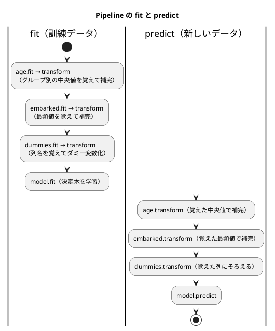

# 第 8 章: 実践的な分類と前処理パイプライン

## 8.1 はじめに

これまでの章のデータは、欠損値が少なく、特徴量もすべて数値でした。現実のデータはそうはいきません。この章で扱うタイタニック号の乗客データには、次の 3 つの難しさがあります。

- **欠損値が多い** — 年齢が 2 割近く欠けている
- **カテゴリ値がある** — 性別や乗船した港が文字列で記録されている
- **クラスが偏っている** — 生存者より死亡者のほうが多い

この章では、これらを 1 つずつ小さな部品として TDD で実装し、scikit-learn の `Pipeline` で「前処理からモデルまで」を 1 つのオブジェクトにつなぎます。最後にそのパイプラインをファイルに保存し、読み込んで予測できるようにします。保存したモデルは、第 15 章で作る機械学習 API から使います。

分類モデルには scikit-learn の決定木（`DecisionTreeClassifier`）を使います。決定木の仕組みは第 3 章で扱いました。この章の主役はモデルではなく、モデルの手前の前処理です。

## 8.2 題材とデータ

### Survived.csv

`Survived.csv` には、乗客 891 人の情報が記録されています。

| 列 | 意味 | 値 | 欠損値 |
|----|------|-----|------|
| PassengerId | 乗客の番号 | 整数 | 0 件 |
| Survived | 生存したか（正解ラベル） | 1（生存）または 0（死亡） | 0 件 |
| Pclass | 客室クラス | 1, 2, 3 | 0 件 |
| Sex | 性別 | `male` または `female` | 0 件 |
| Age | 年齢 | 小数 | 177 件 |
| SibSp | 同乗した兄弟・配偶者の数 | 整数 | 0 件 |
| Parch | 同乗した親・子の数 | 整数 | 0 件 |
| Ticket | チケット番号 | 文字列 | 0 件 |
| Fare | 運賃 | 小数 | 0 件 |
| Cabin | 客室番号 | 文字列 | 687 件 |
| Embarked | 乗船した港 | `C`・`Q`・`S` | 2 件 |

正解ラベルは生存 342 人、死亡 549 人で、死亡のほうが 1.6 倍ほど多くなっています。

### 使う特徴量と、使わない列

特徴量には `Pclass`・`Sex`・`Age`・`SibSp`・`Parch`・`Fare`・`Embarked` の 7 列を使います。`PassengerId` と `Ticket` は乗客を区別するための値で、生存との関係は期待できません。`Cabin` は 891 件中 687 件が欠けているので、今回は使いません。

### 年齢はグループごとの中央値で補完する

年齢の欠損値を全体の平均値で補完すると、1 等客室の年配の乗客も、3 等客室の若い乗客も、同じ年齢で埋まってしまいます。そこで、客室クラスと性別の組み合わせ（グループ）ごとの中央値で補完します。平均値でなく中央値を使うのは、一部の高齢の乗客に値が引っ張られにくいからです。

グループ分けに正解ラベル（`Survived`）を使ってはいけません。予測するときには、その乗客が生存したかは分からないからです。グループ分けに使えるのは、予測の時点で分かっている特徴量だけです。

## 8.3 TODO リストの作成

**TODO リスト**:

- [ ] CSV を読み込む
- [ ] 年齢の欠損値を補完する
  - [ ] 同じグループの中央値で補完する
  - [ ] グループごとに異なる中央値で補完する
  - [ ] 訓練データで求めた中央値を、別のデータの補完に使う
  - [ ] 訓練データに無いグループは、全体の中央値で補完する
- [ ] 乗船した港の欠損値を、最も多い値で補完する
- [ ] カテゴリ値を 0 と 1 の列（ダミー変数）にする
  - [ ] 訓練データと別のデータで、同じ列を作る
- [ ] 前処理とモデルを 1 つのパイプラインにつなぐ
- [ ] モデルを保存して読み込む
- [ ] 正解率と、見つけた生存者の数で評価する
- [ ] 実データで `class_weight` の効果を確かめる

## 8.4 CSV を読み込む

テストのデータは、架空の乗客 1 人分の CSV です。年齢と客室番号を空欄にしておきます。

```python
# test/chapter08/test_survived_classifier.py
HEADER = "PassengerId,Survived,Pclass,Sex,Age,SibSp,Parch,Ticket,Fare,Cabin,Embarked\n"


def write_csv(tmp_path: Path, rows: str) -> Path:
    csv_file = tmp_path / "survived.csv"
    csv_file.write_text(HEADER + rows, encoding="utf-8-sig")
    return csv_file


class TestLoadSurvived:
    def test_BOM付きCSVを読み込み空欄を欠損値にする(self, tmp_path: Path) -> None:
        csv_file = write_csv(tmp_path, "1,0,3,male,,0,0,X-1,8.5,,S\n")

        df = load_survived(csv_file)

        assert df.loc[0, "Sex"] == "male"
        assert pd.isna(df.loc[0, "Age"])
        assert pd.isna(df.loc[0, "Cabin"])
```

```bash
uv run pytest test/chapter08
```

```text
E   ModuleNotFoundError: No module named 'lib.chapter08.survived_classifier'
```

第 2 章で確かめたとおり、pandas は BOM を取り除いて読むので、`read_csv` を呼ぶだけで通ります（明白な実装）。

```python
# lib/chapter08/survived_classifier.py
def load_survived(csv_file: Path) -> pd.DataFrame:
    return pd.read_csv(csv_file)
```

```text
============================== 1 passed in 0.40s ==============================
```

## 8.5 年齢をグループごとの中央値で補完する

### scikit-learn の変換器として作る

前処理の部品は、scikit-learn の **変換器（transformer）** の約束に合わせて作ります。

| メソッド | 役割 |
|---------|------|
| `fit(x)` | データから、変換に必要な値（中央値など）を求めて覚える |
| `transform(x)` | 覚えた値を使ってデータを変換し、新しいデータを返す |

`fit` で覚えた値は、名前の末尾に `_` を付けた属性（`medians_` など）に保存するのが scikit-learn の慣習です。この約束を守ると、第 8.8 節で `Pipeline` に部品として組み込めます。

`fit` と `transform` を分けておくと、**訓練データで `fit` し、テストデータには `transform` だけを使う** という、データリークを防ぐ使い方が自然に書けます。

### Red: 最初のテスト

同じグループ（1 等客室の女性）の中に、年齢 20・30・70 の乗客と、年齢が欠けた乗客がいるデータで試します。中央値は 30 です。

```python
class TestGroupMedianImputer:
    def test_同じグループの中央値で欠損値を補完する(self) -> None:
        df = pd.DataFrame(
            {
                "Pclass": [1, 1, 1, 1],
                "Sex": ["female", "female", "female", "female"],
                "Age": [20.0, 30.0, 70.0, None],
            }
        )
        imputer = GroupMedianImputer(column="Age", by=("Pclass", "Sex"))

        filled = imputer.fit(df).transform(df)

        assert filled["Age"].to_list() == [20.0, 30.0, 70.0, 30.0]
```

```text
E   ImportError: cannot import name 'GroupMedianImputer' from 'lib.chapter08.survived_classifier'
```

### Green: 仮実装

`fit` は何もせず、`transform` は 30 で埋めるだけの仮実装にします。`BaseEstimator` と `TransformerMixin` を継承すると、`get_params` や `fit_transform` などの scikit-learn の共通メソッドが使えるようになります。

```python
from pathlib import Path
from typing import Self

import pandas as pd
from sklearn.base import BaseEstimator, TransformerMixin


def load_survived(csv_file: Path) -> pd.DataFrame:
    return pd.read_csv(csv_file)


class GroupMedianImputer(TransformerMixin, BaseEstimator):
    def __init__(self, column: str, by: tuple[str, ...]) -> None:
        self.column = column
        self.by = by

    def fit(self, x: pd.DataFrame, y: object = None) -> Self:
        return self

    def transform(self, x: pd.DataFrame) -> pd.DataFrame:
        return x.fillna({self.column: 30.0})
```

`fit` の戻り値の型 `Self` は「自分自身のクラス」を表します。`fit` が `self` を返すので、`imputer.fit(df).transform(df)` のようにメソッドをつなげて呼べます。

グループ分けの列を `list` でなく `tuple` で受け取っているのは、scikit-learn の推定器は `__init__` の引数をそのまま属性に保存し、後から書き換えないのが約束だからです。変更できない `tuple` にしておくと、その約束を型で表せます。

```text
============================== 2 passed in 1.21s ==============================
```

### 三角測量: グループごとに異なる中央値

1 等客室の女性（40・50 → 中央値 45）と、3 等客室の男性（10・20 → 中央値 15）の 2 グループで試します。

```python
    def test_グループごとに異なる中央値で補完する(self) -> None:
        df = pd.DataFrame(
            {
                "Pclass": [1, 1, 1, 3, 3, 3],
                "Sex": ["female", "female", "female", "male", "male", "male"],
                "Age": [40.0, 50.0, None, 10.0, 20.0, None],
            }
        )
        imputer = GroupMedianImputer(column="Age", by=("Pclass", "Sex"))

        filled = imputer.fit(df).transform(df)

        assert filled["Age"].to_list() == [40.0, 50.0, 45.0, 10.0, 20.0, 15.0]
```

```text
E       assert [40.0, 50.0, ...0, 20.0, 30.0] == [40.0, 50.0, ...0, 20.0, 15.0]
E         
E         At index 2 diff: 30.0 != 45.0
```

`fit` で `groupby` を使い、グループごとの中央値を求めます。`transform` では、各行の（客室クラス, 性別）の組をキーにして中央値を引き、欠損値だけを埋めます。

```python
    def fit(self, x: pd.DataFrame, y: object = None) -> Self:
        self.medians_ = x.groupby(list(self.by))[self.column].median()
        return self

    def transform(self, x: pd.DataFrame) -> pd.DataFrame:
        keys = pd.MultiIndex.from_frame(x[list(self.by)])
        medians = pd.Series(self.medians_.reindex(keys).to_numpy(), index=x.index)
        return x.assign(**{self.column: x[self.column].fillna(medians)})
```

| 式 | 意味 |
|----|------|
| `x.groupby(["Pclass", "Sex"])["Age"].median()` | （客室クラス, 性別）の組を索引とする、中央値の Series |
| `pd.MultiIndex.from_frame(...)` | 各行の（客室クラス, 性別）の組を並べた索引 |
| `self.medians_.reindex(keys)` | 各行の組に対応する中央値を、行の順に並べる |
| `x.assign(Age=...)` | `Age` 列だけを置き換えた **新しい** DataFrame を返す |

`assign` は元の DataFrame を変更しません。

```text
============================== 3 passed in 1.23s ==============================
```

### 訓練データで求めた値を別のデータに使う

データリークを防ぐための、この部品の一番大事な仕様です。訓練データ（2 等客室の男性 30・34 → 中央値 32）で `fit` し、別のデータを `transform` します。

```python
    def test_訓練データで求めた中央値を別のデータの補完に使う(self) -> None:
        train = pd.DataFrame(
            {"Pclass": [2, 2], "Sex": ["male", "male"], "Age": [30.0, 34.0]}
        )
        other = pd.DataFrame({"Pclass": [2], "Sex": ["male"], "Age": [None]})
        imputer = GroupMedianImputer(column="Age", by=("Pclass", "Sex"))

        filled = imputer.fit(train).transform(other)

        assert filled["Age"].to_list() == [32.0]
```

中央値を `fit` で覚える作りにしてあるので、このテストは追加した時点で通ります。実装を変えなくても、仕様としてテストに残しておく価値があります。

### 訓練データに無いグループ

テストデータに、訓練データには 1 人もいなかったグループの乗客が現れることがあります。そのときは全体の中央値で補完します。訓練データの年齢 30・40・20 の中央値は 30 です。

```python
    def test_訓練データに無いグループは全体の中央値で補完する(self) -> None:
        train = pd.DataFrame(
            {
                "Pclass": [1, 1, 3],
                "Sex": ["female", "female", "male"],
                "Age": [30.0, 40.0, 20.0],
            }
        )
        other = pd.DataFrame({"Pclass": [2], "Sex": ["female"], "Age": [None]})
        imputer = GroupMedianImputer(column="Age", by=("Pclass", "Sex"))

        filled = imputer.fit(train).transform(other)

        assert filled["Age"].to_list() == [30.0]
```

```text
test/chapter08/test_survived_classifier.py::TestGroupMedianImputer::test_訓練データで求めた中央値を別のデータの補完に使う PASSED [ 80%]
test/chapter08/test_survived_classifier.py::TestGroupMedianImputer::test_訓練データに無いグループは全体の中央値で補完する FAILED [100%]
E       assert [nan] == [30.0]
E         
E         At index 0 diff: nan != 30.0
```

`reindex` は、索引に無いキーを欠損値（`nan`）にします。そのため、グループの中央値で埋めたあとに、全体の中央値でもう一度埋めます。

```python
    def fit(self, x: pd.DataFrame, y: object = None) -> Self:
        self.medians_ = x.groupby(list(self.by))[self.column].median()
        self.overall_median_ = float(x[self.column].median())
        return self

    def transform(self, x: pd.DataFrame) -> pd.DataFrame:
        keys = pd.MultiIndex.from_frame(x[list(self.by)])
        medians = pd.Series(self.medians_.reindex(keys).to_numpy(), index=x.index)
        filled = x[self.column].fillna(medians).fillna(self.overall_median_)
        return x.assign(**{self.column: filled})
```

```text
============================== 5 passed in 1.14s ==============================
```

元の DataFrame を変更しないことも、テストで固定しておきます。`assign` を使っているので、このテストは追加した時点で通ります。

```python
    def test_元のデータフレームは変更しない(self) -> None:
        df = pd.DataFrame(
            {"Pclass": [1, 1], "Sex": ["male", "male"], "Age": [30.0, None]}
        )
        imputer = GroupMedianImputer(column="Age", by=("Pclass", "Sex"))

        imputer.fit(df).transform(df)

        assert df["Age"].isna().sum() == 1
```

## 8.6 乗船した港を最頻値で補完する

`Embarked` は文字列なので、中央値は使えません。訓練データで最も多い値（最頻値）で補完します。仕組みは `GroupMedianImputer` と同じなので、明白な実装で進めます。

```python
class TestMostFrequentImputer:
    def test_訓練データで最も多い値で欠損値を補完する(self) -> None:
        train = pd.DataFrame({"Embarked": ["S", "C", "S", None]})
        other = pd.DataFrame({"Embarked": [None, "Q"]})
        imputer = MostFrequentImputer(column="Embarked")

        filled = imputer.fit(train).transform(other)

        assert filled["Embarked"].to_list() == ["S", "Q"]
```

```python
class MostFrequentImputer(TransformerMixin, BaseEstimator):
    def __init__(self, column: str) -> None:
        self.column = column

    def fit(self, x: pd.DataFrame, y: object = None) -> Self:
        self.most_frequent_ = x[self.column].mode()[0]
        return self

    def transform(self, x: pd.DataFrame) -> pd.DataFrame:
        return x.assign(**{self.column: x[self.column].fillna(self.most_frequent_)})
```

`mode()` は最頻値を Series で返します（同数の値が複数あれば複数返します）。先頭の 1 つを使います。

```text
============================== 7 passed in 1.23s ==============================
```

## 8.7 カテゴリ値をダミー変数にする

### 学習用テスト: `get_dummies` の振る舞い

決定木などのモデルは、`male` のような文字列を直接扱えません。カテゴリごとに 0 と 1 の列を作る **ダミー変数** に変換します。pandas では `pd.get_dummies` で変換できます。

ただし、`get_dummies` には落とし穴があります。学習用テストで確かめます。

```python
class TestGetDummies:
    def test_get_dummiesはデータに含まれるカテゴリの列しか作らない(self) -> None:
        train = pd.DataFrame({"Embarked": ["C", "Q", "S"]})
        other = pd.DataFrame({"Embarked": ["S"]})

        assert list(pd.get_dummies(train).columns) == [
            "Embarked_C",
            "Embarked_Q",
            "Embarked_S",
        ]
        assert list(pd.get_dummies(other).columns) == ["Embarked_S"]
```

`get_dummies` は、そのデータに含まれるカテゴリの列しか作りません。訓練データとテストデータ（や、API に届いた 1 人分のデータ）で別々に変換すると、列の数が変わり、モデルに渡せなくなります。

### Red → Green: 素直な実装

まず、性別を `Sex_male` の 1 列にするテストを書きます。`male` と `female` の 2 列を作ると、片方がもう片方の裏返しになり情報が重複するので、最初のカテゴリの列を落とします（`drop_first=True`）。

```python
class TestDummyEncoder:
    def test_2値のカテゴリを最初のカテゴリを除いた0と1の列にする(self) -> None:
        df = pd.DataFrame({"Pclass": [1, 3, 2], "Sex": ["female", "male", "male"]})
        encoder = DummyEncoder(columns=("Sex",))

        encoded = encoder.fit(df).transform(df)

        assert encoded.to_dict(orient="list") == {
            "Pclass": [1, 3, 2],
            "Sex_male": [0, 1, 1],
        }
```

`get_dummies` をそのまま呼ぶだけの実装で通ります。

```python
class DummyEncoder(TransformerMixin, BaseEstimator):
    def __init__(self, columns: tuple[str, ...]) -> None:
        self.columns = columns

    def fit(self, x: pd.DataFrame, y: object = None) -> Self:
        return self

    def transform(self, x: pd.DataFrame) -> pd.DataFrame:
        return pd.get_dummies(x, columns=list(self.columns), drop_first=True, dtype=int)
```

```text
============================== 9 passed in 1.16s ==============================
```

### 三角測量: 別のデータにも同じ列を作る

学習用テストで見た落とし穴を、仕様としてテストにします。

```python
    def test_別のデータにも訓練データと同じ列を作る(self) -> None:
        train = pd.DataFrame({"Embarked": ["C", "Q", "S"]})
        other = pd.DataFrame({"Embarked": ["S", "S"]})
        encoder = DummyEncoder(columns=("Embarked",))

        encoded = encoder.fit(train).transform(other)

        assert encoded.to_dict(orient="list") == {
            "Embarked_Q": [0, 0],
            "Embarked_S": [1, 1],
        }
```

```text
E       AssertionError: assert {} == {'Embarked_Q'...ed_S': [1, 1]}
E         
E         Right contains 2 more items:
E         {'Embarked_Q': [0, 0], 'Embarked_S': [1, 1]}
```

結果は空でした。`S` しか無いデータに `drop_first=True` を使うと、唯一のカテゴリである `S` の列まで「最初のカテゴリ」として落とされてしまいます。列がずれるどころか、消えてしまうわけです。

`fit` で訓練データの列名を覚え、`transform` ではすべてのカテゴリの列を作ってから、覚えた列だけに並べ直します。`reindex` は、無い列を `fill_value` の 0 で作り、余分な列（落とすはずだった最初のカテゴリ）を捨てます。

```python
class DummyEncoder(TransformerMixin, BaseEstimator):
    def __init__(self, columns: tuple[str, ...]) -> None:
        self.columns = columns

    def fit(self, x: pd.DataFrame, y: object = None) -> Self:
        encoded = pd.get_dummies(
            x, columns=list(self.columns), drop_first=True, dtype=int
        )
        self.feature_names_ = list(encoded.columns)
        return self

    def transform(self, x: pd.DataFrame) -> pd.DataFrame:
        encoded = pd.get_dummies(x, columns=list(self.columns), dtype=int)
        return encoded.reindex(columns=self.feature_names_, fill_value=0)
```

```text
============================= 10 passed in 1.29s ==============================
```

**TODO リスト**:

- [x] CSV を読み込む
- [x] 年齢の欠損値を補完する
  - [x] 同じグループの中央値で補完する
  - [x] グループごとに異なる中央値で補完する
  - [x] 訓練データで求めた中央値を、別のデータの補完に使う
  - [x] 訓練データに無いグループは、全体の中央値で補完する
- [x] 乗船した港の欠損値を、最も多い値で補完する
- [x] カテゴリ値を 0 と 1 の列（ダミー変数）にする
  - [x] 訓練データと別のデータで、同じ列を作る
- [ ] 前処理とモデルを 1 つのパイプラインにつなぐ
- [ ] モデルを保存して読み込む
- [ ] 正解率と、見つけた生存者の数で評価する
- [ ] 実データで `class_weight` の効果を確かめる

## 8.8 前処理とモデルをパイプラインにつなぐ

### 特徴量と正解ラベルに分ける

使う特徴量の列を定数 `FEATURES` にまとめ、特徴量と `Survived` 列に分ける関数を作ります。

```python
class TestSplitFeaturesAndTarget:
    def test_特徴量の列とSurvived列に分ける(self) -> None:
        df = pd.DataFrame(
            {
                "PassengerId": [1],
                "Survived": [1],
                "Pclass": [2],
                "Sex": ["female"],
                "Age": [28.0],
                "SibSp": [0],
                "Parch": [1],
                "Ticket": ["X-2"],
                "Fare": [15.0],
                "Cabin": [None],
                "Embarked": ["C"],
            }
        )

        x, t = split_features_and_target(df)

        assert list(x.columns) == [
            "Pclass",
            "Sex",
            "Age",
            "SibSp",
            "Parch",
            "Fare",
            "Embarked",
        ]
        assert t.to_list() == [1]
```

### パイプラインで学習して予測する

テスト用に、特徴量の列を並べた DataFrame を作るヘルパーを用意します。

```python
def passengers(rows: list[tuple[object, ...]]) -> pd.DataFrame:
    return pd.DataFrame(rows, columns=FEATURES)
```

架空の乗客 8 人のデータと、予測に使う 2 人のデータです。女性が生存、男性が死亡という単純な規則にしておくと、欠損値を含む新しい乗客の予測結果を期待値として書けます。

```python
def training_data() -> tuple[pd.DataFrame, pd.Series]:
    x = passengers(
        [
            (1, "female", 30.0, 0, 0, 80.0, "C"),
            (2, "female", None, 1, 0, 20.0, "S"),
            (3, "female", 22.0, 0, 1, 9.0, None),
            (3, "female", 18.0, 0, 0, 8.0, "Q"),
            (1, "male", 45.0, 0, 0, 60.0, "S"),
            (2, "male", None, 0, 0, 13.0, "S"),
            (3, "male", 25.0, 1, 0, 7.0, "S"),
            (3, "male", 33.0, 0, 0, 8.0, None),
        ]
    )
    t = pd.Series([1, 1, 1, 1, 0, 0, 0, 0])
    return x, t


def new_passengers() -> pd.DataFrame:
    return passengers(
        [
            (2, "female", None, 0, 0, 12.0, None),
            (1, "male", None, 1, 1, 70.0, "C"),
        ]
    )


class TestBuildPipeline:
    def test_欠損値を含むデータで学習して予測できる(self) -> None:
        x, t = training_data()
        pipeline = build_pipeline(max_depth=3, class_weight=None)

        pipeline.fit(x, t)

        assert pipeline.predict(new_passengers()).tolist() == [1, 0]

    def test_class_weightをモデルに渡す(self) -> None:
        pipeline = build_pipeline(max_depth=5, class_weight="balanced")

        assert pipeline.named_steps["model"].class_weight == "balanced"
        assert pipeline.named_steps["model"].max_depth == 5
```

最初は `FEATURES` が無いので失敗します。

```text
E   ImportError: cannot import name 'FEATURES' from 'lib.chapter08.survived_classifier'
```

モジュールの先頭に、使う列の定数を置きます。

```python
FEATURES = ["Pclass", "Sex", "Age", "SibSp", "Parch", "Fare", "Embarked"]
TARGET = "Survived"
```

特徴量と正解ラベルに分ける関数は、列を選ぶだけです。

```python
def split_features_and_target(df: pd.DataFrame) -> tuple[pd.DataFrame, pd.Series]:
    return df[FEATURES], df[TARGET]
```

`Pipeline` は、名前と部品の組を並べたリストで作ります。

```python
def build_pipeline(max_depth: int, class_weight: str | None) -> Pipeline:
    return Pipeline(
        [
            ("age", GroupMedianImputer(column="Age", by=("Pclass", "Sex"))),
            ("embarked", MostFrequentImputer(column="Embarked")),
            ("dummies", DummyEncoder(columns=("Sex", "Embarked"))),
            (
                "model",
                DecisionTreeClassifier(
                    max_depth=max_depth, class_weight=class_weight, random_state=0
                ),
            ),
        ]
    )
```

```text
============================= 13 passed in 1.59s ==============================
```

`Pipeline` の `fit` と `predict` は、次のように各部品を順に呼び出します。



`fit` のときだけ各部品が値を覚え、`predict` のときは覚えた値を使うだけです。パイプラインにしておけば、テストデータに `fit` してしまう取り違えが構造上起きません。

## 8.9 モデルを保存して読み込む

学習済みのパイプラインをファイルに保存しておけば、学習をやり直さずに予測だけを行えます。scikit-learn のモデルの保存には joblib を使います。保存するのはモデル単体ではなく **パイプライン全体** です。前処理で覚えた中央値や列名も一緒に保存しないと、読み込んだ側で同じ前処理を再現できないからです。

```python
class TestSaveAndLoadModel:
    def test_保存したパイプラインを読み込むと同じ予測をする(
        self, tmp_path: Path
    ) -> None:
        x, t = training_data()
        pipeline = build_pipeline(max_depth=3, class_weight=None).fit(x, t)
        model_file = tmp_path / "model" / "survived.joblib"

        save_model(pipeline, model_file)
        loaded = load_model(model_file)

        assert loaded.predict(new_passengers()).tolist() == [1, 0]
```

```text
E   ImportError: cannot import name 'load_model' from 'lib.chapter08.survived_classifier'
```

```python
def save_model(pipeline: Pipeline, model_file: Path) -> None:
    model_file.parent.mkdir(parents=True, exist_ok=True)
    joblib.dump(pipeline, model_file)


def load_model(model_file: Path) -> Pipeline:
    pipeline: Pipeline = joblib.load(model_file)
    return pipeline
```

`joblib.load` は何が読み込まれるか分からないため、型は `Any` です。変数に `Pipeline` 型を付けてから返すことで、呼び出し側では `Pipeline` として扱えます。

保存したファイルを読み込むと、ファイルに書かれた Python オブジェクトがそのまま復元されます。信頼できないところから受け取ったモデルファイルは読み込まないでください。

```text
============================= 14 passed in 1.48s ==============================
```

## 8.10 評価する

`class_weight` の効果を比べるために、正解率に加えて「実際の生存者のうち、何人を生存と予測できたか」を数えます。死亡者が多いデータでは、全員を死亡と予測しても正解率は 6 割を超えます。正解率だけを見ていると、生存者を見落とすモデルに気付けません（評価指標は第 11 章で詳しく扱います）。

```python
class TestEvaluate:
    def test_正解率と見つけた生存者の数を求める(self) -> None:
        x, t = training_data()
        split = TrainTestSplit(
            x_train=x, x_test=new_passengers(), t_train=t, t_test=pd.Series([1, 1])
        )
        pipeline = build_pipeline(max_depth=3, class_weight=None).fit(x, t)

        evaluation = evaluate(pipeline, split)

        assert evaluation == Evaluation(
            train_accuracy=1.0, test_accuracy=0.5, found_survivors=1, survivors=2
        )
```

訓練データとテストデータの組には、第 2 章の `TrainTestSplit` を再利用します。

```text
E   ImportError: cannot import name 'Evaluation' from 'lib.chapter08.survived_classifier'
```

```python
@dataclass(frozen=True)
class Evaluation:
    train_accuracy: float
    test_accuracy: float
    found_survivors: int
    survivors: int


def evaluate(pipeline: Pipeline, split: TrainTestSplit) -> Evaluation:
    predictions = pipeline.predict(split.x_test)
    actual = split.t_test.to_numpy()
    return Evaluation(
        train_accuracy=float(pipeline.score(split.x_train, split.t_train)),
        test_accuracy=float(pipeline.score(split.x_test, split.t_test)),
        found_survivors=int(((predictions == 1) & (actual == 1)).sum()),
        survivors=int((actual == 1).sum()),
    )
```

`(predictions == 1) & (actual == 1)` は、「生存と予測し、実際に生存した」行だけが `True` の配列です。`sum()` で `True` を 1 として数えます。

```text
============================= 15 passed in 1.43s ==============================
```

## 8.11 実データで `class_weight` の効果を確かめる

### クラスの偏りと `class_weight`

決定木は、訓練データ全体での誤りが少なくなるように分割を選びます。死亡者のほうが多いデータでは、死亡者を正しく分けることが優先され、生存者の見落としが増えがちです。

`class_weight="balanced"` を指定すると、少ないクラスの 1 件を重く数えます。重みはクラスの件数に反比例するので、生存者 1 人を見落としたときの損失が大きくなり、生存者を見つけるように分割が選ばれます。

### 実行する

深さ 5 の決定木で、`class_weight` なしと `balanced` を比べ、`balanced` のパイプラインを `apps/python/model/survived.joblib` に保存します。`model/` ディレクトリは `.gitignore` の対象です。

```python
# lib/chapter08/__main__.py
from pathlib import Path

import pandas as pd

from lib.chapter02.iris_preprocessing import split_train_test
from lib.chapter08.survived_classifier import (
    FEATURES,
    MODEL_FILE,
    build_pipeline,
    evaluate,
    load_model,
    load_survived,
    save_model,
    split_features_and_target,
)
from lib.dataset import data_dir

TEST_SIZE = 0.2
SEED = 0
MAX_DEPTH = 5

NEW_PASSENGERS = pd.DataFrame(
    [
        (1, "female", None, 0, 0, 50.0, "C"),
        (3, "male", None, 0, 0, 8.0, "S"),
    ],
    columns=FEATURES,
)


def main(model_file: Path = MODEL_FILE) -> None:
    df = load_survived(data_dir() / "Survived.csv")
    x, t = split_features_and_target(df)
    split = split_train_test(x, t, test_size=TEST_SIZE, seed=SEED)
    counts = t.value_counts()
    print(f"データ件数: {len(df)}（生存 {counts[1]}, 死亡 {counts[0]}）")
    print(f"訓練データ: {len(split.x_train)} 件, テストデータ: {len(split.x_test)} 件")

    pipelines = {}
    for class_weight in [None, "balanced"]:
        pipeline = build_pipeline(max_depth=MAX_DEPTH, class_weight=class_weight)
        pipelines[class_weight] = pipeline.fit(split.x_train, split.t_train)
        result = evaluate(pipeline, split)
        print(
            f"class_weight={class_weight}: "
            f"訓練 {result.train_accuracy:.3f}, テスト {result.test_accuracy:.3f}, "
            f"生存者 {result.survivors} 人中 {result.found_survivors} 人を発見"
        )

    save_model(pipelines["balanced"], model_file)
    predictions = load_model(model_file).predict(NEW_PASSENGERS)
    print(f"保存したモデル: {model_file.name}")
    print(f"架空の乗客の予測: {predictions.tolist()}")


if __name__ == "__main__":
    main()
```

保存先の既定値 `MODEL_FILE` は、`survived_classifier.py` から見た `apps/python/model/survived.joblib` です。テストからは一時ディレクトリを渡して、本物の保存先を汚さないようにしています。

```python
MODEL_FILE = Path(__file__).resolve().parents[2] / "model" / "survived.joblib"
```

```bash
uv run python -m lib.chapter08
```

```text
データ件数: 891（生存 342, 死亡 549）
訓練データ: 712 件, テストデータ: 179 件
class_weight=None: 訓練 0.850, テスト 0.827, 生存者 69 人中 45 人を発見
class_weight=balanced: 訓練 0.840, テスト 0.838, 生存者 69 人中 51 人を発見
保存したモデル: survived.joblib
架空の乗客の予測: [1, 0]
```

`balanced` にすると、テストデータの生存者 69 人のうち見つけられた人数が 45 人から 51 人に増えました。この分割では正解率も 0.827 から 0.838 に上がっています。訓練データの正解率はわずかに下がっており、訓練データへの当てはまりより、少ないクラスを見つけることを重視した結果です。

読み込んだモデルは、年齢が欠けた架空の乗客 2 人（1 等客室の女性、3 等客室の男性）を、それぞれ生存（1）・死亡（0）と予測しました。欠損値の補完からダミー変数化まで、保存したパイプラインの中で行われています。

### 実データのテスト

実測した値をテストで固定します。

```python
@requires_data("Survived.csv")
class TestSurvivedData:
    def test_実データの件数と欠損値の数を確認する(self) -> None:
        df = load_survived(data_dir() / "Survived.csv")

        assert len(df) == 891
        assert df[["Age", "Cabin", "Embarked"]].isna().sum().to_dict() == {
            "Age": 177,
            "Cabin": 687,
            "Embarked": 2,
        }

    def test_class_weightをbalancedにすると見つけられる生存者が増える(self) -> None:
        x, t = split_features_and_target(load_survived(data_dir() / "Survived.csv"))
        split = split_train_test(x, t, test_size=0.2, seed=0)

        results = {
            class_weight: evaluate(
                build_pipeline(max_depth=5, class_weight=class_weight).fit(
                    split.x_train, split.t_train
                ),
                split,
            )
            for class_weight in [None, "balanced"]
        }

        assert results[None].found_survivors == 45
        assert results["balanced"].found_survivors == 51
        assert results["balanced"].test_accuracy == pytest.approx(0.838, abs=1e-3)

    def test_実行すると評価結果を表示してモデルを保存する(
        self, tmp_path: Path, capsys: pytest.CaptureFixture[str]
    ) -> None:
        model_file = tmp_path / "survived.joblib"

        main(model_file)

        assert model_file.exists()
        assert capsys.readouterr().out == (
            "データ件数: 891（生存 342, 死亡 549）\n"
            "訓練データ: 712 件, テストデータ: 179 件\n"
            "class_weight=None: 訓練 0.850, テスト 0.827, 生存者 69 人中 45 人を発見\n"
            "class_weight=balanced: 訓練 0.840, テスト 0.838, 生存者 69 人中 51 人を発見\n"
            "保存したモデル: survived.joblib\n"
            "架空の乗客の予測: [1, 0]\n"
        )
```

```bash
uv run pytest test/chapter08
```

```text
============================= 18 passed in 1.56s ==============================
```

データが無い環境では、実データのテスト 3 件がスキップされます。

```text
======================== 15 passed, 3 skipped in 1.35s ========================
```

**TODO リスト**:

- [x] CSV を読み込む
- [x] 年齢の欠損値を補完する
  - [x] 同じグループの中央値で補完する
  - [x] グループごとに異なる中央値で補完する
  - [x] 訓練データで求めた中央値を、別のデータの補完に使う
  - [x] 訓練データに無いグループは、全体の中央値で補完する
- [x] 乗船した港の欠損値を、最も多い値で補完する
- [x] カテゴリ値を 0 と 1 の列（ダミー変数）にする
  - [x] 訓練データと別のデータで、同じ列を作る
- [x] 前処理とモデルを 1 つのパイプラインにつなぐ
- [x] モデルを保存して読み込む
- [x] 正解率と、見つけた生存者の数で評価する
- [x] 実データで `class_weight` の効果を確かめる

## 8.12 Notebook で探索する

Notebook は `apps/python/notebooks/chapter08_survived_exploration.ipynb` にあります。

```bash
uv run jupyter lab notebooks/chapter08_survived_exploration.ipynb
```

### 準備

```python
import sys

sys.path.append("..")

import pandas as pd
import seaborn as sns
from japanese_font import use_japanese_font
from sklearn.metrics import ConfusionMatrixDisplay

from lib.chapter02.iris_preprocessing import split_train_test
from lib.chapter08.survived_classifier import (
    build_pipeline,
    load_survived,
    split_features_and_target,
)
from lib.dataset import data_dir

use_japanese_font();
```

### クラス分布

```python
df = load_survived(data_dir() / "Survived.csv")
df["Survived"].value_counts().plot.bar(title="生存（1）と死亡（0）の人数");
```

棒グラフでは、死亡（549 人）が生存（342 人）の 1.6 倍ほどの高さになります。この偏りが、第 8.11 節で `class_weight` を試した理由です。

### 性別・客室クラス別の生存率

`Survived` は 0 と 1 なので、平均値がそのまま生存率になります。`pivot_table` で客室クラスと性別の組み合わせごとに集計します。

```python
survival_rate = df.pivot_table(index="Pclass", columns="Sex", values="Survived")
survival_rate.round(3)
```

```text
Sex     female   male
Pclass               
1        0.968  0.369
2        0.921  0.157
3        0.500  0.135
```

```python
sns.barplot(data=df, x="Pclass", y="Survived", hue="Sex", errorbar=None);
```

どの客室クラスでも、女性の生存率が男性を大きく上回ります。また、同じ性別でも客室クラスが上がるほど生存率が高くなります。性別と客室クラスが生存に強く関わるので、年齢の補完でもこの 2 つでグループを作りました。

### 木の深さと正解率

`max_depth` を 1 から 10 まで変え、訓練データとテストデータの正解率を並べます。

```python
x, t = split_features_and_target(df)
split = split_train_test(x, t, test_size=0.2, seed=0)
rows = []
for class_weight in [None, "balanced"]:
    for depth in range(1, 11):
        pipeline = build_pipeline(max_depth=depth, class_weight=class_weight)
        pipeline.fit(split.x_train, split.t_train)
        rows.append(
            {
                "class_weight": str(class_weight),
                "depth": depth,
                "train": pipeline.score(split.x_train, split.t_train),
                "test": pipeline.score(split.x_test, split.t_test),
            }
        )
scores = pd.DataFrame(rows)
scores.pivot(index="depth", columns="class_weight", values=["train", "test"]).round(3)
```

```text
              train            test         
class_weight   None balanced   None balanced
depth                                       
1             0.779    0.779  0.816    0.816
2             0.792    0.779  0.810    0.816
3             0.819    0.785  0.832    0.799
4             0.829    0.838  0.821    0.849
5             0.850    0.840  0.827    0.838
6             0.857    0.831  0.799    0.788
7             0.892    0.886  0.816    0.799
8             0.914    0.874  0.804    0.793
9             0.941    0.902  0.816    0.777
10            0.952    0.928  0.799    0.782
```

```python
balanced = scores[scores["class_weight"] == "balanced"]
balanced.plot(x="depth", y=["train", "test"], title="木の深さと正解率");
```

木を深くするほど訓練データの正解率は上がり続けますが、テストデータの正解率は深さ 3〜5 あたりで頭打ちになり、深さ 6 以降は下がっていきます。訓練データに合わせすぎる **過学習** です。`main` で深さを 5 にしたのは、この表から、両方の設定でテストデータの正解率が落ち始める手前を選んだためです。

ここでの深さ選びは、テストデータの結果を見て決めています。厳密には、テストデータは最終評価だけに使い、深さのようなハイパーパラメータは訓練データの中で選ぶべきです。その方法（交差検証）は第 11 章で扱います。

### 混同行列

`balanced` のパイプラインで、テストデータの予測と実際を突き合わせた表（混同行列）を描きます。

```python
pipeline = build_pipeline(max_depth=5, class_weight="balanced")
pipeline.fit(split.x_train, split.t_train)
ConfusionMatrixDisplay.from_estimator(pipeline, split.x_test, split.t_test);
```

テストデータ 179 人の内訳は次のとおりです。

| | 死亡と予測 | 生存と予測 |
|---|---|---|
| 実際は死亡（110 人） | 99 | 11 |
| 実際は生存（69 人） | 18 | 51 |

生存者 69 人のうち 51 人を見つけ、18 人を見落としています。死亡者を生存と誤ったのは 11 人です。

### 特徴量の重要度

決定木は、どの特徴量で分割したかを重要度として持っています。パイプラインの最後の部品を除いた `pipeline[:-1]` で前処理だけを適用すると、ダミー変数化した後の列名を取り出せます。

```python
model = pipeline.named_steps["model"]
columns = pipeline[:-1].transform(split.x_train).columns
importances = pd.Series(model.feature_importances_, index=columns)
importances.sort_values(ascending=False).round(3)
```

```text
Sex_male      0.518
Age           0.174
Fare          0.168
Pclass        0.097
SibSp         0.029
Parch         0.014
Embarked_Q    0.000
Embarked_S    0.000
dtype: float64
```

重要度の半分以上を性別が占め、次いで年齢・運賃・客室クラスが続きます。生存率の集計で見た傾向と一致します。乗船した港は、深さ 5 の木では一度も分割に使われませんでした。

グラフの画像は記事に載せていません。配布データの点をそのまま描いたグラフは、データの再配布に当たるおそれがあるためです。学習データを配置して、手元の Notebook で確認してください。コミットの前には `uv run python tools/notebooks.py strip` で出力セルを消します。

<details>
<summary>この章の完成コード（lib/chapter08/survived_classifier.py）</summary>

```python
from dataclasses import dataclass
from pathlib import Path
from typing import Self

import joblib
import pandas as pd
from sklearn.base import BaseEstimator, TransformerMixin
from sklearn.pipeline import Pipeline
from sklearn.tree import DecisionTreeClassifier

from lib.chapter02.iris_preprocessing import TrainTestSplit

FEATURES = ["Pclass", "Sex", "Age", "SibSp", "Parch", "Fare", "Embarked"]
TARGET = "Survived"
MODEL_FILE = Path(__file__).resolve().parents[2] / "model" / "survived.joblib"


def load_survived(csv_file: Path) -> pd.DataFrame:
    return pd.read_csv(csv_file)


def split_features_and_target(df: pd.DataFrame) -> tuple[pd.DataFrame, pd.Series]:
    return df[FEATURES], df[TARGET]


class GroupMedianImputer(TransformerMixin, BaseEstimator):
    def __init__(self, column: str, by: tuple[str, ...]) -> None:
        self.column = column
        self.by = by

    def fit(self, x: pd.DataFrame, y: object = None) -> Self:
        self.medians_ = x.groupby(list(self.by))[self.column].median()
        self.overall_median_ = float(x[self.column].median())
        return self

    def transform(self, x: pd.DataFrame) -> pd.DataFrame:
        keys = pd.MultiIndex.from_frame(x[list(self.by)])
        medians = pd.Series(self.medians_.reindex(keys).to_numpy(), index=x.index)
        filled = x[self.column].fillna(medians).fillna(self.overall_median_)
        return x.assign(**{self.column: filled})


class MostFrequentImputer(TransformerMixin, BaseEstimator):
    def __init__(self, column: str) -> None:
        self.column = column

    def fit(self, x: pd.DataFrame, y: object = None) -> Self:
        self.most_frequent_ = x[self.column].mode()[0]
        return self

    def transform(self, x: pd.DataFrame) -> pd.DataFrame:
        return x.assign(**{self.column: x[self.column].fillna(self.most_frequent_)})


class DummyEncoder(TransformerMixin, BaseEstimator):
    def __init__(self, columns: tuple[str, ...]) -> None:
        self.columns = columns

    def fit(self, x: pd.DataFrame, y: object = None) -> Self:
        encoded = pd.get_dummies(
            x, columns=list(self.columns), drop_first=True, dtype=int
        )
        self.feature_names_ = list(encoded.columns)
        return self

    def transform(self, x: pd.DataFrame) -> pd.DataFrame:
        encoded = pd.get_dummies(x, columns=list(self.columns), dtype=int)
        return encoded.reindex(columns=self.feature_names_, fill_value=0)


def build_pipeline(max_depth: int, class_weight: str | None) -> Pipeline:
    return Pipeline(
        [
            ("age", GroupMedianImputer(column="Age", by=("Pclass", "Sex"))),
            ("embarked", MostFrequentImputer(column="Embarked")),
            ("dummies", DummyEncoder(columns=("Sex", "Embarked"))),
            (
                "model",
                DecisionTreeClassifier(
                    max_depth=max_depth, class_weight=class_weight, random_state=0
                ),
            ),
        ]
    )


def save_model(pipeline: Pipeline, model_file: Path) -> None:
    model_file.parent.mkdir(parents=True, exist_ok=True)
    joblib.dump(pipeline, model_file)


def load_model(model_file: Path) -> Pipeline:
    pipeline: Pipeline = joblib.load(model_file)
    return pipeline


@dataclass(frozen=True)
class Evaluation:
    train_accuracy: float
    test_accuracy: float
    found_survivors: int
    survivors: int


def evaluate(pipeline: Pipeline, split: TrainTestSplit) -> Evaluation:
    predictions = pipeline.predict(split.x_test)
    actual = split.t_test.to_numpy()
    return Evaluation(
        train_accuracy=float(pipeline.score(split.x_train, split.t_train)),
        test_accuracy=float(pipeline.score(split.x_test, split.t_test)),
        found_survivors=int(((predictions == 1) & (actual == 1)).sum()),
        survivors=int((actual == 1).sum()),
    )
```

</details>

## 8.13 まとめ

この章では、欠損値・カテゴリ値・クラスの偏りを含む現実的なデータで、前処理からモデルの保存までを TDD で実装しました。

1. **前処理を小さな部品に分ける** — 年齢の補完・港の補完・ダミー変数化を、それぞれテストできる変換器にした
2. **`fit` と `transform` を分ける** — 訓練データで値を覚え、テストデータには覚えた値を使うことで、データリークを構造的に防いだ
3. **学習用テストで落とし穴を先に見つける** — `get_dummies` がデータごとに違う列を作ることを確かめ、三角測量で列をそろえる実装を引き出した
4. **パイプラインにつなぐ** — 前処理とモデルを 1 つのオブジェクトにまとめ、学習・予測・保存を一括で扱えるようにした
5. **クラスの偏りに対処する** — `class_weight="balanced"` で、見つけられる生存者が 45 人から 51 人に増えることを実測した

Notebook での探索から、木を深くしすぎるとテストデータの正解率が下がる過学習も確認しました。次の章では、住宅価格のデータを使い、標準化や多項式特徴量など、特徴量そのものを作り変える方法を学びます。
