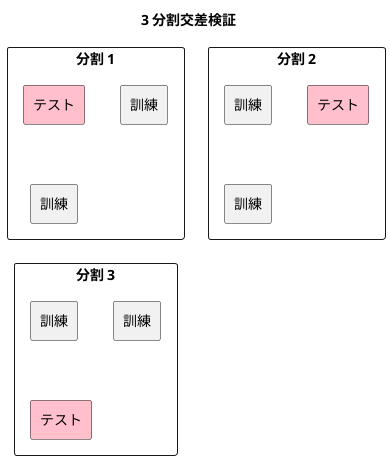

# 第 11 章: 評価指標と交差検証

## 11.1 はじめに

これまでの章では、分類モデルを正解率で、回帰モデルを決定係数や誤差で評価してきました。しかし、1 つの指標と 1 回だけの訓練・テスト分割で「良いモデル」と判断すると、見落としが生まれます。

この章では、次の 2 つを TDD で自作し、scikit-learn の結果と突き合わせます。

- **評価指標**: 分類の混同行列・適合率・再現率・F 値と、回帰の MSE・RMSE・MAE
- **K 分割交差検証**: データを K 個に分け、訓練とテストを K 回入れ替えて評価する方法

あわせて、「どの指標で評価するか」を関数として受け渡す設計を学びます。評価の手順（分割して学習し、予測して採点する）を 1 つの関数にまとめ、採点に使う関数だけを差し替えられるようにします。

## 11.2 正解率だけでは足りない理由

`Survived.csv` は 891 人分の乗客データで、生存（`Survived` が 1）が 342 人、死亡（0）が 549 人です。全員を「死亡」と予測するだけのモデルでも、正解率は 549 / 891 = 0.6162 になります。このモデルは生存者を 1 人も見つけられないのに、正解率だけを見ると 6 割当たっているように見えます。

そこで、予測の当たり外れを 4 つに分けて数える **混同行列** を使います。ここでは「生存」を正例（見つけたいほう）とします。

| | 正例と予測 | 負例と予測 |
|---|-----------|-----------|
| **実際は正例** | TP（真陽性） | FN（偽陰性） |
| **実際は負例** | FP（偽陽性） | TN（真陰性） |

混同行列から、目的に応じた指標を求めます。

| 指標 | 式 | 意味 |
|------|-----|------|
| 適合率（precision） | TP / (TP + FP) | 正例と予測したうち、本当に正例だった割合 |
| 再現率（recall） | TP / (TP + FN) | 本当の正例のうち、正例と予測できた割合 |
| F 値（F1） | 2 × 適合率 × 再現率 / (適合率 + 再現率) | 適合率と再現率の調和平均 |

回帰では、予測と正解の差（誤差）を集計します。

| 指標 | 意味 |
|------|------|
| MSE（平均二乗誤差） | 誤差の 2 乗の平均 |
| RMSE（平均二乗誤差の平方根） | MSE の平方根。正解と同じ単位になる |
| MAE（平均絶対誤差） | 誤差の絶対値の平均 |

## 11.3 TODO リストの作成

**TODO リスト**:

- [ ] 混同行列を数える
  - [ ] 正例と負例の当たり外れを数える
  - [ ] どちらのラベルを正例にするかを指定できる
- [ ] 適合率・再現率・F 値を求める
  - [ ] 分母が 0 のときは 0 にする
- [ ] MSE・RMSE・MAE を求める
- [ ] K 分割のテストデータを作る
  - [ ] ほぼ均等な件数に分ける
  - [ ] どの行もちょうど一度だけテストデータになる
  - [ ] シードで分け方が決まる
- [ ] 交差検証で分割ごとのスコアを求める
  - [ ] 評価関数を差し替えられる
- [ ] 混同行列の指標を、正解と予測から求める評価関数に変える
- [ ] scikit-learn と結果を突き合わせる
- [ ] 実データで交差検証の平均を表示する

## 11.4 混同行列を数える

### Red: 最初のテスト

評価指標は `lib/chapter11/evaluation.py` に置きます。正解と予測のリストから、正例 `1` についての混同行列を数えるテストを書きます。

```python
# test/chapter11/test_evaluation.py
from lib.chapter11.evaluation import ConfusionMatrix, confusion_matrix


class TestConfusionMatrix:
    def test_正例と負例の予測の当たり外れを数える(self) -> None:
        actual = [1, 1, 1, 0, 0]
        predicted = [1, 1, 0, 1, 0]

        assert confusion_matrix(actual, predicted, positive=1) == ConfusionMatrix(
            tp=2, fp=1, fn=1, tn=1
        )
```

```bash
uv run pytest test/chapter11
```

```text
E   ModuleNotFoundError: No module named 'lib.chapter11.evaluation'
!!!!!!!!!!!!!!!!!!! Interrupted: 1 error during collection !!!!!!!!!!!!!!!!!!!!
============================== 1 error in 0.19s ===============================
```

### Green: 仮実装

混同行列を表す `ConfusionMatrix` を定義し、期待値をそのまま返します。

```python
from dataclasses import dataclass


@dataclass(frozen=True)
class ConfusionMatrix:
    tp: int
    fp: int
    fn: int
    tn: int


def confusion_matrix(
    actual: list[int], predicted: list[int], positive: int
) -> ConfusionMatrix:
    return ConfusionMatrix(tp=2, fp=1, fn=1, tn=1)
```

```text
test/chapter11/test_evaluation.py::TestConfusionMatrix::test_正例と負例の予測の当たり外れを数える PASSED [100%]
```

### 三角測量

どちらのラベルを正例とみなすかで、数え方は変わります。`positive=0` を指定する 2 つ目のテストで一般化を促します。

```python
    def test_どちらのラベルを正例とするかで数え方が変わる(self) -> None:
        actual = [1, 1, 1, 0, 0, 0]
        predicted = [1, 0, 0, 0, 0, 1]

        assert confusion_matrix(actual, predicted, positive=0) == ConfusionMatrix(
            tp=2, fp=2, fn=1, tn=1
        )
```

```text
E       AssertionError: assert ConfusionMatr...1, fn=1, tn=1) == ConfusionMatr...2, fn=1, tn=1)
E         
E         Omitting 3 identical items, use -vv to show
E         Differing attributes:
E         ['fp']
E         
E         Drill down into differing attribute fp:
E           fp: 1 != 2
```

正解と予測を組にし、それぞれが正例かどうかの組 `(実際は正例か, 正例と予測したか)` に変換してから数えます。`(True, True)` が TP、`(False, True)` が FP です。ラベルは整数に限らず文字列でもよいので、型は `object` にします。

```python
from collections.abc import Iterable
from dataclasses import dataclass


def confusion_matrix(
    actual: Iterable[object], predicted: Iterable[object], positive: object
) -> ConfusionMatrix:
    pairs = [
        (a == positive, p == positive) for a, p in zip(actual, predicted, strict=True)
    ]
    return ConfusionMatrix(
        tp=pairs.count((True, True)),
        fp=pairs.count((False, True)),
        fn=pairs.count((True, False)),
        tn=pairs.count((False, False)),
    )
```

```text
============================== 2 passed in 0.03s ==============================
```

## 11.5 適合率・再現率・F 値

### 明白な実装

3 つの指標は定義どおりの式なので、テストをまとめて書き、明白な実装で進めます。

```python
class TestPrecisionRecallF1:
    def test_適合率は正例と予測したうち本当に正例だった割合(self) -> None:
        cm = ConfusionMatrix(tp=3, fp=1, fn=2, tn=4)

        assert precision(cm) == pytest.approx(0.75)

    def test_再現率は本当の正例のうち正例と予測できた割合(self) -> None:
        cm = ConfusionMatrix(tp=3, fp=1, fn=2, tn=4)

        assert recall(cm) == pytest.approx(0.6)

    def test_F値は適合率と再現率の調和平均(self) -> None:
        cm = ConfusionMatrix(tp=3, fp=1, fn=2, tn=4)

        assert f1_score(cm) == pytest.approx(2 * 0.75 * 0.6 / (0.75 + 0.6))
```

```text
E   ImportError: cannot import name 'f1_score' from 'lib.chapter11.evaluation' (...)
```

```python
def precision(cm: ConfusionMatrix) -> float:
    return cm.tp / (cm.tp + cm.fp)


def recall(cm: ConfusionMatrix) -> float:
    return cm.tp / (cm.tp + cm.fn)


def f1_score(cm: ConfusionMatrix) -> float:
    p, r = precision(cm), recall(cm)
    return 2 * p * r / (p + r)
```

```text
============================== 5 passed in 0.03s ==============================
```

### 分母が 0 になる場合

モデルが正例を 1 件も予測しなければ、適合率の分母 TP + FP は 0 になります。このときの振る舞いをテストで決めます。scikit-learn も既定では 0 を返す（あわせて警告を出す）ので、それに合わせて 0 にします。

```python
    def test_正例を一件も当てられなければ適合率と再現率とF値は0(self) -> None:
        cm = ConfusionMatrix(tp=0, fp=0, fn=3, tn=5)

        assert (precision(cm), recall(cm), f1_score(cm)) == (0.0, 0.0, 0.0)
```

```text
>       assert (precision(cm), recall(cm), f1_score(cm)) == (0.0, 0.0, 0.0)
>       return cm.tp / (cm.tp + cm.fp)
E       ZeroDivisionError: division by zero
```

分母が 0 なら 0 を返す `ratio` を用意し、3 つの指標から使います。F 値も適合率と再現率がともに 0 なら分母が 0 になるので、同じ関数で守れます。

```python
def ratio(numerator: float, denominator: float) -> float:
    return numerator / denominator if denominator else 0.0


def precision(cm: ConfusionMatrix) -> float:
    return ratio(cm.tp, cm.tp + cm.fp)


def recall(cm: ConfusionMatrix) -> float:
    return ratio(cm.tp, cm.tp + cm.fn)


def f1_score(cm: ConfusionMatrix) -> float:
    p, r = precision(cm), recall(cm)
    return ratio(2 * p * r, p + r)
```

```text
============================== 6 passed in 0.02s ==============================
```

**TODO リスト**:

- [x] 混同行列を数える
  - [x] 正例と負例の当たり外れを数える
  - [x] どちらのラベルを正例にするかを指定できる
- [x] 適合率・再現率・F 値を求める
  - [x] 分母が 0 のときは 0 にする
- [ ] MSE・RMSE・MAE を求める
- [ ] K 分割のテストデータを作る
- [ ] 交差検証で分割ごとのスコアを求める
- [ ] 混同行列の指標を、正解と予測から求める評価関数に変える
- [ ] scikit-learn と結果を突き合わせる
- [ ] 実データで交差検証の平均を表示する

## 11.6 回帰の評価指標

誤差 -1・0・2 の 3 件について、MSE は (1 + 0 + 4) / 3、MAE は (1 + 0 + 2) / 3 = 1 です。

```python
class TestRegressionMetrics:
    def test_誤差の2乗の平均と平方根と絶対値の平均を求める(self) -> None:
        actual = [3.0, 5.0, 8.0]
        predicted = [2.0, 5.0, 10.0]

        assert mean_squared_error(actual, predicted) == pytest.approx(5 / 3)
        assert root_mean_squared_error(actual, predicted) == pytest.approx(
            (5 / 3) ** 0.5
        )
        assert mean_absolute_error(actual, predicted) == pytest.approx(1.0)
```

```text
E   ImportError: cannot import name 'mean_absolute_error' from 'lib.chapter11.evaluation' (...)
```

NumPy の配列にして差を取り、2 乗や絶対値の平均を求めます。引数の型 `npt.ArrayLike` は、リスト・NumPy 配列・pandas の `Series` のどれでも受け取れることを表します。

```python
import numpy as np
import numpy.typing as npt


def errors(actual: npt.ArrayLike, predicted: npt.ArrayLike) -> npt.NDArray[np.float64]:
    return np.asarray(predicted, dtype=float) - np.asarray(actual, dtype=float)


def mean_squared_error(actual: npt.ArrayLike, predicted: npt.ArrayLike) -> float:
    return float(np.mean(errors(actual, predicted) ** 2))


def root_mean_squared_error(actual: npt.ArrayLike, predicted: npt.ArrayLike) -> float:
    return mean_squared_error(actual, predicted) ** 0.5


def mean_absolute_error(actual: npt.ArrayLike, predicted: npt.ArrayLike) -> float:
    return float(np.mean(np.abs(errors(actual, predicted))))
```

```text
============================== 7 passed in 0.08s ==============================
```

### 学習用テスト: 外れた予測への敏感さ

RMSE と MAE の違いを、学習用テストで確かめておきます。4 件目だけ大きく外した予測（誤差 20）を加えると、MAE は 5.75 なのに対し、RMSE は誤差を 2 乗してから平均するので約 10.06 まで増えます。

```python
    def test_大きく外れた予測があるとRMSEはMAEより大きく増える(self) -> None:
        actual = [3.0, 5.0, 8.0, 10.0]
        predicted = [2.0, 5.0, 10.0, 30.0]

        assert root_mean_squared_error(actual, predicted) == pytest.approx(101.25**0.5)
        assert mean_absolute_error(actual, predicted) == pytest.approx(5.75)
```

```text
============================== 8 passed in 0.10s ==============================
```

大きな外れを重く見たいなら RMSE、外れに引きずられずに典型的な誤差を知りたいなら MAE を使います。

## 11.7 K 分割交差検証

### なぜ分割を入れ替えるのか

第 2 章では、データを 1 回だけ訓練データとテストデータに分けました。この方法では、たまたま予測しやすい行がテストデータに集まると、評価が実力より良く出ます。K 分割交差検証では、データを K 個のグループに分け、1 つをテストデータ、残りを訓練データにして K 回評価し、その平均を見ます。どの行も一度だけテストデータになるので、分け方の偶然に左右されにくくなります。



### 仮実装と三角測量

10 件を 3 つに分けると、テストデータの件数は 4・3・3 になります（余りは先頭の分割に 1 件ずつ足します）。

```python
class TestKFold:
    def test_データをk個のテストデータにほぼ均等に分ける(self) -> None:
        folds = k_fold(n_samples=10, n_splits=3, seed=0)

        assert [len(fold.test) for fold in folds] == [4, 3, 3]
```

```text
E   ImportError: cannot import name 'k_fold' from 'lib.chapter11.evaluation' (...)
```

分割を表す `Fold` を定義し、行番号を `[4, 7]` の位置で切る仮実装にします。

```python
@dataclass(frozen=True)
class Fold:
    train: npt.NDArray[np.intp]
    test: npt.NDArray[np.intp]


def k_fold(n_samples: int, n_splits: int, seed: int) -> list[Fold]:
    tests = np.split(np.arange(n_samples), [4, 7])
    return [Fold(train=np.setdiff1d(np.arange(n_samples), t), test=t) for t in tests]
```

件数と分割数を変えたテストで、ベタ書きの切り位置を崩します。

```python
    def test_件数と分割数が変わってもほぼ均等に分ける(self) -> None:
        folds = k_fold(n_samples=7, n_splits=2, seed=0)

        assert [len(fold.test) for fold in folds] == [4, 3]
```

```text
E       assert [4, 3, 0] == [4, 3]
E         
E         Left contains one more item: 0
```

NumPy の `np.array_split` は、配列をほぼ均等な K 個に分け、余りを先頭から 1 件ずつ配ります。訓練データは、全行からテストデータを除いた行（`np.setdiff1d`）です。

```python
def k_fold(n_samples: int, n_splits: int, seed: int) -> list[Fold]:
    positions = np.arange(n_samples)
    tests = np.array_split(positions, n_splits)
    return [Fold(train=np.setdiff1d(positions, test), test=test) for test in tests]
```

```text
============================= 10 passed in 0.09s ==============================
```

### 分け方の性質をテストで固定する

交差検証として正しく使えることを、性質のテストで確かめます。

```python
    def test_どの行もちょうど一度だけテストデータになる(self) -> None:
        folds = k_fold(n_samples=10, n_splits=3, seed=0)

        tested = sorted(int(i) for fold in folds for i in fold.test)
        assert tested == list(range(10))

    def test_各分割の訓練データはテストデータ以外のすべての行(self) -> None:
        folds = k_fold(n_samples=10, n_splits=3, seed=0)

        for fold in folds:
            assert set(fold.train) & set(fold.test) == set()
            assert set(fold.train) | set(fold.test) == set(range(10))

    def test_同じシードなら同じ分け方になる(self) -> None:
        first = k_fold(n_samples=10, n_splits=3, seed=42)
        second = k_fold(n_samples=10, n_splits=3, seed=42)

        assert [f.test.tolist() for f in first] == [s.test.tolist() for s in second]

    def test_シードが違えば違う分け方になる(self) -> None:
        first = k_fold(n_samples=10, n_splits=3, seed=0)
        second = k_fold(n_samples=10, n_splits=3, seed=1)

        assert [f.test.tolist() for f in first] != [s.test.tolist() for s in second]
```

最後のテストだけが失敗します。いまの実装は先頭から順に分けているだけで、シードを使っていないからです。

```text
test/chapter11/test_evaluation.py::TestKFold::test_同じシードなら同じ分け方になる PASSED [ 92%]
test/chapter11/test_evaluation.py::TestKFold::test_シードが違えば違う分け方になる FAILED [100%]
E       assert [[0, 1, 2, 3], [4, 5, 6], [7, 8, 9]] != [[0, 1, 2, 3], [4, 5, 6], [7, 8, 9]]
```

第 2 章の `split_train_test` と同じく、シード付きの乱数生成器で行番号を並べ替えてから分けます。

```python
def k_fold(n_samples: int, n_splits: int, seed: int) -> list[Fold]:
    positions = np.random.default_rng(seed).permutation(n_samples)
    tests = np.array_split(positions, n_splits)
    return [Fold(train=np.setdiff1d(positions, test), test=test) for test in tests]
```

```text
============================= 14 passed in 0.13s ==============================
```

データが元の並び（たとえば生存者が先頭に集まっている）のまま分けると、分割ごとに正例の割合が偏ります。並べ替えはそれを避けるためにも必要です。

## 11.8 評価関数を高階関数として渡す

### 交差検証の手順を 1 つの関数にする

交差検証の手順は、どのモデル・どの指標でも同じです。

1. 分割ごとに新しいモデルを作る
2. 訓練データで学習する
3. テストデータを予測し、評価関数で採点する

変わるのは「どのモデルを作るか」と「どう採点するか」だけなので、この 2 つを **関数として引数で受け取る** 高階関数 `cross_validate` にします。テストでは、訓練データの正解の平均を常に予測するだけのテスト用モデル `MeanModel` を使い、手で計算できる小さな例にします。

```python
class MeanModel:
    """訓練データの正解の平均値を常に予測するテスト用のモデル。"""

    def fit(self, x: pd.DataFrame, t: pd.Series) -> "MeanModel":
        self.mean = float(t.mean())
        return self

    def predict(self, x: pd.DataFrame) -> list[float]:
        return [self.mean] * len(x)


class TestCrossValidate:
    x = pd.DataFrame({"feature": [10, 20, 30, 40]})
    t = pd.Series([1.0, 2.0, 3.0, 4.0])
    folds = [
        Fold(train=np.array([0, 1]), test=np.array([2, 3])),
        Fold(train=np.array([2, 3]), test=np.array([0, 1])),
    ]

    def test_分割ごとに訓練データで学習してテストデータを評価する(self) -> None:
        scores = cross_validate(
            MeanModel, self.x, self.t, self.folds, mean_absolute_error
        )

        assert scores == pytest.approx([2.0, 2.0])
```

1 つ目の分割は、正解 1・2 で学習して平均 1.5 を予測し、正解 3・4 との MAE が 2.0 になります。2 つ目の分割も同様に 2.0 です。

```text
E   ImportError: cannot import name 'cross_validate' from 'lib.chapter11.evaluation' (...)
```

モデルに求めるのは `fit` と `predict` を持つことだけです。これを `Protocol`（構造的部分型）で表します。`Protocol` を継承しなくても、同じメソッドを持つクラスなら型チェックを通ります。scikit-learn のモデルも `MeanModel` も、そのまま渡せます。評価関数の型は `Metric` という別名にします。まず仮実装です。

```python
from collections.abc import Callable, Iterable
from dataclasses import dataclass
from typing import Protocol

import numpy as np
import numpy.typing as npt
import pandas as pd


class Model(Protocol):
    def fit(self, x: pd.DataFrame, t: pd.Series) -> object: ...

    def predict(self, x: pd.DataFrame) -> npt.ArrayLike: ...


Metric = Callable[[npt.ArrayLike, npt.ArrayLike], float]


def cross_validate(
    make_model: Callable[[], Model],
    x: pd.DataFrame,
    t: pd.Series,
    folds: list[Fold],
    metric: Metric,
) -> list[float]:
    return [2.0, 2.0]
```

### 三角測量: 評価関数を差し替える

同じ分割に MSE を渡すテストを追加します。誤差は 1.5 と 2.5 なので、MSE は (2.25 + 6.25) / 2 = 4.25 です。

```python
    def test_評価関数を差し替えると別の指標で評価する(self) -> None:
        scores = cross_validate(
            MeanModel, self.x, self.t, self.folds, mean_squared_error
        )

        assert scores == pytest.approx([4.25, 4.25])
```

```text
E       assert [2.0, 2.0] == approx([4.25 ...25 ± 4.2e-06])
E         
E         comparison failed. Mismatched elements: 2 / 2:
E         Max absolute difference: 2.25
E         Max relative difference: 1.125
E         Index | Obtained | Expected      
E         0     | 2.0      | 4.25 ± 4.2e-06
E         1     | 2.0      | 4.25 ± 4.2e-06
```

受け取った `make_model` で分割ごとに新しいモデルを作り、受け取った `metric` で採点します。`x.iloc[fold.train]` は、行番号の配列で行を取り出します。

```python
def cross_validate(
    make_model: Callable[[], Model],
    x: pd.DataFrame,
    t: pd.Series,
    folds: list[Fold],
    metric: Metric,
) -> list[float]:
    scores = []
    for fold in folds:
        model = make_model()
        model.fit(x.iloc[fold.train], t.iloc[fold.train])
        scores.append(metric(t.iloc[fold.test], model.predict(x.iloc[fold.test])))
    return scores
```

```text
============================= 16 passed in 0.40s ==============================
```

`make_model` にクラス `MeanModel` そのものを渡せるのは、Python ではクラスも「呼び出すとインスタンスを返す関数」として扱えるからです。分割ごとに新しいモデルを作るのは、前の分割で学習した状態を次の分割に持ち込まないためです。

### 混同行列の指標を評価関数に変える

`cross_validate` が受け取る評価関数は「正解と予測から数値を返す関数」です。一方、`precision` などは混同行列を受け取ります。そこで、混同行列の指標と正例のラベルを受け取り、評価関数を **返す** 高階関数 `classification_metric` を作ります。あわせて正解率 `accuracy` も評価関数として用意します。

```python
class TestClassificationMetric:
    def test_正解率は正解と予測が一致した割合(self) -> None:
        assert accuracy([1, 0, 1, 0], [1, 1, 1, 0]) == pytest.approx(0.75)

    def test_混同行列から求める指標を正解と予測から求める評価関数に変える(self) -> None:
        actual = [1, 1, 1, 0, 0]
        predicted = [1, 0, 0, 1, 0]

        precision_metric = classification_metric(precision, positive=1)
        recall_metric = classification_metric(recall, positive=1)

        assert precision_metric(actual, predicted) == pytest.approx(0.5)
        assert recall_metric(actual, predicted) == pytest.approx(1 / 3)
```

```text
E   ImportError: cannot import name 'accuracy' from 'lib.chapter11.evaluation' (...)
```

内側で定義した関数 `metric` は、外側の引数 `score` と `positive` を覚えたまま返されます（クロージャ）。`np.asarray(...).tolist()` で、pandas の `Series` や NumPy 配列を普通のリストにそろえてから混同行列を数えます。

```python
Metric = Callable[[npt.ArrayLike, npt.ArrayLike], float]


def accuracy(actual: npt.ArrayLike, predicted: npt.ArrayLike) -> float:
    return float(np.mean(np.asarray(actual) == np.asarray(predicted)))


def classification_metric(
    score: Callable[[ConfusionMatrix], float], positive: object
) -> Metric:
    def metric(actual: npt.ArrayLike, predicted: npt.ArrayLike) -> float:
        cm = confusion_matrix(
            np.asarray(actual).tolist(), np.asarray(predicted).tolist(), positive
        )
        return score(cm)

    return metric
```

`Metric` の別名は `accuracy` から使うので、`cross_validate` の前からこの位置に移しました。

```text
============================= 18 passed in 0.40s ==============================
```

これで、指標を「正解と予測から数値を返す関数」という 1 つの形にそろえられました。交差検証の側は、渡された関数がどの指標なのかを知る必要がありません。

## 11.9 scikit-learn と突き合わせる

自作した指標と分割が、scikit-learn と同じ結果になることを学習用テストで確かめます。

```python
from sklearn import metrics
from sklearn.linear_model import LinearRegression
from sklearn.model_selection import KFold
from sklearn.model_selection import cross_validate as sklearn_cross_validate


class TestCompareWithScikitLearn:
    actual = [1, 0, 1, 1, 0, 1, 0, 0, 1, 1]
    predicted = [1, 0, 0, 1, 1, 1, 0, 1, 1, 0]

    def test_混同行列がscikit_learnと一致する(self) -> None:
        cm = confusion_matrix(self.actual, self.predicted, positive=1)

        [[tn, fp], [fn, tp]] = metrics.confusion_matrix(self.actual, self.predicted)
        assert cm == ConfusionMatrix(tp=tp, fp=fp, fn=fn, tn=tn)

    def test_適合率と再現率とF値がscikit_learnと一致する(self) -> None:
        cm = confusion_matrix(self.actual, self.predicted, positive=1)

        assert precision(cm) == pytest.approx(
            metrics.precision_score(self.actual, self.predicted)
        )
        assert recall(cm) == pytest.approx(
            metrics.recall_score(self.actual, self.predicted)
        )
        assert f1_score(cm) == pytest.approx(
            metrics.f1_score(self.actual, self.predicted)
        )

    def test_MSEとMAEがscikit_learnと一致する(self) -> None:
        actual = [2.5, 0.0, 2.1, 7.8]
        predicted = [3.0, -0.5, 2.0, 7.0]

        assert mean_squared_error(actual, predicted) == pytest.approx(
            metrics.mean_squared_error(actual, predicted)
        )
        assert mean_absolute_error(actual, predicted) == pytest.approx(
            metrics.mean_absolute_error(actual, predicted)
        )

    def test_分割ごとのテストデータの件数がscikit_learnのKFoldと一致する(self) -> None:
        folds = k_fold(n_samples=10, n_splits=3, seed=0)

        sklearn_folds = KFold(n_splits=3).split(np.zeros(10))
        assert [len(f.test) for f in folds] == [len(test) for _, test in sklearn_folds]

    def test_同じ分割を渡せばscikit_learnのcross_validateと同じスコアになる(
        self,
    ) -> None:
        x = pd.DataFrame({"feature": [1.0, 2.0, 3.0, 4.0, 5.0, 6.0, 7.0, 8.0, 9.0]})
        t = pd.Series([1.2, 1.9, 3.1, 4.2, 4.8, 6.3, 6.9, 8.1, 9.2])
        folds = k_fold(n_samples=9, n_splits=3, seed=0)

        scores = cross_validate(LinearRegression, x, t, folds, mean_absolute_error)

        result = sklearn_cross_validate(
            LinearRegression(),
            x,
            t,
            cv=[(fold.train, fold.test) for fold in folds],
            scoring="neg_mean_absolute_error",
        )
        assert scores == pytest.approx(list(-result["test_score"]))
```

```text
============================= 23 passed in 1.34s ==============================
```

突き合わせで分かった scikit-learn の約束事をまとめます。

- `metrics.confusion_matrix` は、ラベルの昇順に並べた 2 × 2 の配列 `[[TN, FP], [FN, TP]]` を返す。自作版はフィールド名で取り出すので、並び順を覚えなくてよい
- `KFold` と自作の `k_fold` は、テストデータの件数の配り方（余りを先頭から配る）が同じ。一方、並べ替えに使う乱数の実装が違うので、同じシードでも行の割り当ては一致しない
- `cross_validate` の `cv` には、`(訓練データの行番号, テストデータの行番号)` の組のリストを渡せる。同じ分割を渡すと、スコアは自作版と一致する
- scikit-learn の `scoring` は「大きいほど良い」にそろえるため、誤差の指標は `neg_mean_absolute_error` のように符号を反転した値で返す。比べるときは符号を戻す

## 11.10 実データで評価する

### 簡略化した前処理

交差検証にかけるには、欠損値や文字列の列を数値にしておく必要があります。前処理パイプラインは第 8 章で詳しく扱うので、この章ではそれを簡略化したものを `lib/chapter11/datasets.py` に置きます。

- `Survived.csv`: 特徴量を客室クラス（`Pclass`）・年齢（`Age`、177 件の欠損を平均値で補完）・男性かどうか（`Sex` を 0/1 に変換した `male`）の 3 列にし、`Survived` を正解ラベルにする
- `cinema.csv`（100 件）: 特徴量を `SNS1`・`SNS2`・`actor`・`original` の 4 列にして欠損値（`SNS1` と `actor` に 1 件ずつ）を平均値で補完し、興行収入 `sales` を正解ラベルにする

テストは架空の値の小さな `DataFrame` で書きます。

```python
class TestPrepareSurvived:
    def test_客室クラスと年齢と男性かどうかを特徴量にし生存を正解ラベルにする(
        self,
    ) -> None:
        df = pd.DataFrame(
            {
                "PassengerId": [1, 2],
                "Survived": [0, 1],
                "Pclass": [3, 1],
                "Sex": ["male", "female"],
                "Age": [30.0, 40.0],
                "Fare": [8.0, 60.0],
            }
        )

        x, t = prepare_survived(df)

        assert x.to_dict(orient="list") == {
            "Pclass": [3, 1],
            "Age": [30.0, 40.0],
            "male": [1, 0],
        }
        assert t.to_list() == [0, 1]

    def test_年齢の欠損値を年齢の平均値で補完する(self) -> None:
        df = pd.DataFrame(
            {
                "Survived": [0, 1, 1],
                "Pclass": [3, 1, 2],
                "Sex": ["male", "female", "female"],
                "Age": [20.0, None, 40.0],
            }
        )

        x, _ = prepare_survived(df)

        assert x["Age"].to_list() == [20.0, 30.0, 40.0]
```

欠損値補完のテストを追加した時点では、年齢をそのまま使っていたので失敗しました。

```text
E       assert [20.0, nan, 40.0] == [20.0, 30.0, 40.0]
E         
E         At index 1 diff: nan != 30.0
```

`cinema.csv` の前処理も同じ手順で作りました（テストは完成コードを参照してください）。

```python
import pandas as pd


def prepare_survived(df: pd.DataFrame) -> tuple[pd.DataFrame, pd.Series]:
    x = pd.DataFrame(
        {
            "Pclass": df["Pclass"],
            "Age": df["Age"].fillna(df["Age"].mean()),
            "male": (df["Sex"] == "male").astype(int),
        }
    )
    return x, df["Survived"]


CINEMA_FEATURES = ["SNS1", "SNS2", "actor", "original"]


def prepare_cinema(df: pd.DataFrame) -> tuple[pd.DataFrame, pd.Series]:
    x = df[CINEMA_FEATURES]
    return x.fillna(x.mean()), df["sales"]
```

ここでは平均値をデータ全体から求めてから交差検証にかけているので、テストデータの情報が補完値に少し混ざります。訓練データだけから補完値を求める正しい手順は、第 8 章の前処理パイプラインで扱います。

### 交差検証の実験

`lib/chapter11/experiments.py` で、Survived には深さ 2 の決定木、cinema には線形回帰を使い、5 分割交差検証の平均を求めます。評価指標は「名前 → 評価関数」の辞書で渡すので、指標を増やすときは辞書に 1 行足すだけです。次は Survived に関わる部分の抜粋です（全体は 11.11 節の完成コードを参照してください）。

```python
N_SPLITS = 5
SEED = 0


def make_decision_tree() -> Model:
    model: Model = DecisionTreeClassifier(max_depth=2, random_state=0)
    return model


SURVIVED_METRICS: dict[str, Metric] = {
    "正解率": accuracy,
    "適合率": classification_metric(precision, positive=1),
    "再現率": classification_metric(recall, positive=1),
    "F値": classification_metric(f1_score, positive=1),
}


def evaluate(
    make_model: Callable[[], Model],
    x: pd.DataFrame,
    t: pd.Series,
    metrics: dict[str, Metric],
) -> dict[str, float]:
    folds = k_fold(n_samples=len(x), n_splits=N_SPLITS, seed=SEED)
    return {
        name: mean(cross_validate(make_model, x, t, folds, metric))
        for name, metric in metrics.items()
    }
```

`make_decision_tree` の中で一度 `model: Model` という型注釈付きの変数に入れているのは、scikit-learn が型情報を持たず、そのまま返すと mypy が「`Any` を返している」と警告するためです。

```bash
uv run python -m lib.chapter11
```

```text
Survived（決定木、5 分割交差検証の平均）
  正解率: 0.7733
  適合率: 0.8221
  再現率: 0.5599
  F値: 0.6485
cinema（線形回帰、5 分割交差検証の平均）
  RMSE: 401.34
  MAE: 316.64
```

Survived の決定木は、正解率 0.7733 で「全員死亡」の 0.6162 を上回ります。ただし再現率は 0.5599 で、実際の生存者の半分近くを見逃しています。適合率 0.8221 は、「生存」と予測したときはよく当たることを示します。このモデルは生存と予測するのに慎重で、その代わり見逃しが多いことが、正解率だけでは見えなかった性質です。

cinema の線形回帰は RMSE が 401.34、MAE が 316.64（どちらも興行収入と同じ単位）です。RMSE が MAE より大きいのは、11.6 節で見たとおり、大きく外した予測がいくつか含まれているためです。

実データのテストでは、この値を固定するとともに、同じ分割を scikit-learn の `cross_validate` に渡したときの平均と一致することも確かめています。

```python
    def test_同じ分割ならscikit_learnのcross_validateと同じ平均になる(self) -> None:
        x, t = prepare_survived(pd.read_csv(data_dir() / "Survived.csv"))
        folds = k_fold(n_samples=len(x), n_splits=5, seed=0)

        result = sklearn_cross_validate(
            DecisionTreeClassifier(max_depth=2, random_state=0),
            x,
            t,
            cv=[(fold.train, fold.test) for fold in folds],
            scoring=["accuracy", "precision", "recall", "f1"],
        )

        scores = evaluate_survived(data_dir() / "Survived.csv")
        assert scores["正解率"] == pytest.approx(result["test_accuracy"].mean())
        assert scores["適合率"] == pytest.approx(result["test_precision"].mean())
        assert scores["再現率"] == pytest.approx(result["test_recall"].mean())
        assert scores["F値"] == pytest.approx(result["test_f1"].mean())
```

データが無い環境では、実データのテスト 4 件がスキップされます。

```bash
ML_DATA_DIR=/nonexistent uv run pytest -rs test/chapter11
```

```text
SKIPPED [1] test\chapter11\test_experiments.py:16: 学習データ Survived.csv が配置されていない（gulp data:setup）
SKIPPED [1] test\chapter11\test_experiments.py:24: 学習データ Survived.csv が配置されていない（gulp data:setup）
SKIPPED [1] test\chapter11\test_experiments.py:45: 学習データ cinema.csv が配置されていない（gulp data:setup）
SKIPPED [1] test\chapter11\test_experiments.py:53: 学習データ Survived.csv, cinema.csv が配置されていない（gulp data:setup）
======================== 26 passed, 4 skipped in 1.42s ========================
```

## 11.11 リファクタリング

11.8 節で `cross_validate` を実装した時点で型チェックを実行すると、2 か所で警告が出ました（行番号はその時点のものです）。

```bash
uv run mypy lib/chapter11 test/chapter11
```

```text
lib\chapter11\evaluation.py:51: error: Returning Any from function declared to return "ndarray[tuple[Any, ...], dtype[float64]]"  [no-any-return]
lib\chapter11\evaluation.py:59: error: Returning Any from function declared to return "float"  [no-any-return]
```

NumPy 配列どうしの `-` と、`float` の `** 0.5` は、型スタブ上の戻り値が `Any` になるためです。動作を変えずに、戻り値の型が決まる書き方に直します。

```python
import math


def errors(actual: npt.ArrayLike, predicted: npt.ArrayLike) -> npt.NDArray[np.float64]:
    return np.subtract(
        np.asarray(predicted, dtype=np.float64), np.asarray(actual, dtype=np.float64)
    )


def root_mean_squared_error(actual: npt.ArrayLike, predicted: npt.ArrayLike) -> float:
    return math.sqrt(mean_squared_error(actual, predicted))
```

最後にテストをカバレッジ付きで実行します。

```bash
uv run pytest test/chapter11 --cov=lib/chapter11 --cov-report=term-missing
```

```text
Name                           Stmts   Miss  Cover   Missing
------------------------------------------------------------
lib\chapter11\__init__.py          0      0   100%
lib\chapter11\__main__.py          9      0   100%
lib\chapter11\datasets.py          8      0   100%
lib\chapter11\evaluation.py       59      0   100%
lib\chapter11\experiments.py      27      0   100%
------------------------------------------------------------
TOTAL                            103      0   100%
============================= 30 passed in 4.32s ==============================
```

<details>
<summary>この章の完成コード（lib/chapter11/evaluation.py）</summary>

```python
import math
from collections.abc import Callable, Iterable
from dataclasses import dataclass
from typing import Protocol

import numpy as np
import numpy.typing as npt
import pandas as pd


@dataclass(frozen=True)
class ConfusionMatrix:
    tp: int
    fp: int
    fn: int
    tn: int


def confusion_matrix(
    actual: Iterable[object], predicted: Iterable[object], positive: object
) -> ConfusionMatrix:
    pairs = [
        (a == positive, p == positive) for a, p in zip(actual, predicted, strict=True)
    ]
    return ConfusionMatrix(
        tp=pairs.count((True, True)),
        fp=pairs.count((False, True)),
        fn=pairs.count((True, False)),
        tn=pairs.count((False, False)),
    )


def ratio(numerator: float, denominator: float) -> float:
    return numerator / denominator if denominator else 0.0


def precision(cm: ConfusionMatrix) -> float:
    return ratio(cm.tp, cm.tp + cm.fp)


def recall(cm: ConfusionMatrix) -> float:
    return ratio(cm.tp, cm.tp + cm.fn)


def f1_score(cm: ConfusionMatrix) -> float:
    p, r = precision(cm), recall(cm)
    return ratio(2 * p * r, p + r)


def errors(actual: npt.ArrayLike, predicted: npt.ArrayLike) -> npt.NDArray[np.float64]:
    return np.subtract(
        np.asarray(predicted, dtype=np.float64), np.asarray(actual, dtype=np.float64)
    )


def mean_squared_error(actual: npt.ArrayLike, predicted: npt.ArrayLike) -> float:
    return float(np.mean(errors(actual, predicted) ** 2))


def root_mean_squared_error(actual: npt.ArrayLike, predicted: npt.ArrayLike) -> float:
    return math.sqrt(mean_squared_error(actual, predicted))


def mean_absolute_error(actual: npt.ArrayLike, predicted: npt.ArrayLike) -> float:
    return float(np.mean(np.abs(errors(actual, predicted))))


@dataclass(frozen=True)
class Fold:
    train: npt.NDArray[np.intp]
    test: npt.NDArray[np.intp]


def k_fold(n_samples: int, n_splits: int, seed: int) -> list[Fold]:
    positions = np.random.default_rng(seed).permutation(n_samples)
    tests = np.array_split(positions, n_splits)
    return [Fold(train=np.setdiff1d(positions, test), test=test) for test in tests]


Metric = Callable[[npt.ArrayLike, npt.ArrayLike], float]


def accuracy(actual: npt.ArrayLike, predicted: npt.ArrayLike) -> float:
    return float(np.mean(np.asarray(actual) == np.asarray(predicted)))


def classification_metric(
    score: Callable[[ConfusionMatrix], float], positive: object
) -> Metric:
    def metric(actual: npt.ArrayLike, predicted: npt.ArrayLike) -> float:
        cm = confusion_matrix(
            np.asarray(actual).tolist(), np.asarray(predicted).tolist(), positive
        )
        return score(cm)

    return metric


class Model(Protocol):
    def fit(self, x: pd.DataFrame, t: pd.Series) -> object: ...

    def predict(self, x: pd.DataFrame) -> npt.ArrayLike: ...


def cross_validate(
    make_model: Callable[[], Model],
    x: pd.DataFrame,
    t: pd.Series,
    folds: list[Fold],
    metric: Metric,
) -> list[float]:
    scores = []
    for fold in folds:
        model = make_model()
        model.fit(x.iloc[fold.train], t.iloc[fold.train])
        scores.append(metric(t.iloc[fold.test], model.predict(x.iloc[fold.test])))
    return scores
```

</details>

<details>
<summary>この章の完成コード（lib/chapter11/experiments.py）</summary>

```python
from collections.abc import Callable
from pathlib import Path
from statistics import mean

import pandas as pd
from sklearn.linear_model import LinearRegression
from sklearn.tree import DecisionTreeClassifier

from lib.chapter11.datasets import prepare_cinema, prepare_survived
from lib.chapter11.evaluation import (
    Metric,
    Model,
    accuracy,
    classification_metric,
    cross_validate,
    f1_score,
    k_fold,
    mean_absolute_error,
    precision,
    recall,
    root_mean_squared_error,
)

N_SPLITS = 5
SEED = 0


def make_decision_tree() -> Model:
    model: Model = DecisionTreeClassifier(max_depth=2, random_state=0)
    return model


def make_linear_regression() -> Model:
    model: Model = LinearRegression()
    return model


SURVIVED_METRICS: dict[str, Metric] = {
    "正解率": accuracy,
    "適合率": classification_metric(precision, positive=1),
    "再現率": classification_metric(recall, positive=1),
    "F値": classification_metric(f1_score, positive=1),
}

CINEMA_METRICS: dict[str, Metric] = {
    "RMSE": root_mean_squared_error,
    "MAE": mean_absolute_error,
}


def evaluate(
    make_model: Callable[[], Model],
    x: pd.DataFrame,
    t: pd.Series,
    metrics: dict[str, Metric],
) -> dict[str, float]:
    folds = k_fold(n_samples=len(x), n_splits=N_SPLITS, seed=SEED)
    return {
        name: mean(cross_validate(make_model, x, t, folds, metric))
        for name, metric in metrics.items()
    }


def evaluate_survived(csv_file: Path) -> dict[str, float]:
    x, t = prepare_survived(pd.read_csv(csv_file))
    return evaluate(make_decision_tree, x, t, SURVIVED_METRICS)


def evaluate_cinema(csv_file: Path) -> dict[str, float]:
    x, t = prepare_cinema(pd.read_csv(csv_file))
    return evaluate(make_linear_regression, x, t, CINEMA_METRICS)
```

</details>

<details>
<summary>この章の完成コード（lib/chapter11/__main__.py）</summary>

```python
from lib.chapter11.experiments import N_SPLITS, evaluate_cinema, evaluate_survived
from lib.dataset import data_dir


def main() -> None:
    print(f"Survived（決定木、{N_SPLITS} 分割交差検証の平均）")
    for name, score in evaluate_survived(data_dir() / "Survived.csv").items():
        print(f"  {name}: {score:.4f}")
    print(f"cinema（線形回帰、{N_SPLITS} 分割交差検証の平均）")
    for name, score in evaluate_cinema(data_dir() / "cinema.csv").items():
        print(f"  {name}: {score:.2f}")


if __name__ == "__main__":
    main()
```

</details>

<details>
<summary>この章の完成コード（test/chapter11/test_datasets.py の cinema の部分）</summary>

```python
class TestPrepareCinema:
    def test_興行収入を正解ラベルにし残りの数値列の欠損値を平均値で補完する(
        self,
    ) -> None:
        df = pd.DataFrame(
            {
                "cinema_id": [101, 102, 103],
                "SNS1": [100.0, None, 300.0],
                "SNS2": [500.0, 600.0, 700.0],
                "actor": [None, 20.0, 40.0],
                "original": [0, 1, 0],
                "sales": [9000, 9500, 10000],
            }
        )

        x, t = prepare_cinema(df)

        assert x.to_dict(orient="list") == {
            "SNS1": [100.0, 200.0, 300.0],
            "SNS2": [500.0, 600.0, 700.0],
            "actor": [30.0, 20.0, 40.0],
            "original": [0, 1, 0],
        }
        assert t.to_list() == [9000, 9500, 10000]
```

</details>

## 11.12 Notebook による探索と可視化

混同行列と ROC 曲線を Notebook で描き、Survived の決定木の当たり方を目で確認します。Notebook は `apps/python/notebooks/chapter11_evaluation_exploration.ipynb` です。グラフは各自の環境で Notebook を実行して確認してください（記事には学習データから描いたグラフを載せません）。

```bash
uv run jupyter lab notebooks/chapter11_evaluation_exploration.ipynb
```

### 準備

```python
import sys

sys.path.append("..")

import matplotlib.pyplot as plt
import pandas as pd
import seaborn as sns
from japanese_font import use_japanese_font
from sklearn.metrics import roc_auc_score, roc_curve
from sklearn.tree import DecisionTreeClassifier

from lib.chapter02.iris_preprocessing import split_train_test
from lib.chapter11.datasets import prepare_survived
from lib.chapter11.evaluation import confusion_matrix, f1_score, precision, recall
from lib.dataset import data_dir

use_japanese_font();
```

### 混同行列

第 2 章の `split_train_test` で 7 : 3 に分け、テストデータ 268 件について混同行列を数えます。

```python
x, t = prepare_survived(pd.read_csv(data_dir() / "Survived.csv"))
split = split_train_test(x, t, test_size=0.3, seed=0)
model = DecisionTreeClassifier(max_depth=2, random_state=0)
model.fit(split.x_train, split.t_train)
predicted = model.predict(split.x_test)
cm = confusion_matrix(split.t_test, predicted, positive=1)
cm
```

```text
ConfusionMatrix(tp=60, fp=5, fn=51, tn=152)
```

```python
sns.heatmap(
    [[cm.tn, cm.fp], [cm.fn, cm.tp]],
    annot=True,
    fmt="d",
    xticklabels=["死亡と予測", "生存と予測"],
    yticklabels=["実際は死亡", "実際は生存"],
)
plt.title("混同行列（テストデータ）");
```

```python
{
    "適合率": round(precision(cm), 4),
    "再現率": round(recall(cm), 4),
    "F値": round(f1_score(cm), 4),
}
```

```text
{'適合率': 0.9231, '再現率': 0.5405, 'F値': 0.6818}
```

ヒートマップでは、右上の FP（死亡した人を生存と予測）が 5 件と少ない一方、左下の FN（生存した人を死亡と予測）が 51 件と目立ちます。交差検証の結果と同じく、「生存と予測したときはよく当たるが、生存者を見逃しやすい」モデルだと分かります。

### ROC 曲線

決定木は、予測のもとになる「生存である確率」も出せます（`predict_proba`）。この確率がいくつ以上なら生存と判定するか（しきい値）を動かすと、再現率（真陽性率）と、死亡した人を生存と誤る割合（偽陽性率）が一緒に変わります。その関係を描いたのが ROC 曲線です。

```python
probability = model.predict_proba(split.x_test)[:, 1]
fpr, tpr, _ = roc_curve(split.t_test, probability)
plt.plot(fpr, tpr, label="決定木（max_depth=2）")
plt.plot([0, 1], [0, 1], linestyle="--", label="でたらめな予測")
plt.xlabel("偽陽性率")
plt.ylabel("真陽性率（再現率）")
plt.title("ROC 曲線")
plt.legend();
```

曲線は点線（でたらめな予測）より左上にふくらみます。左上に近いほど、誤りを増やさずに生存者を見つけられる良いモデルです。深さ 2 の決定木は葉が最大 4 つしかないので、出力される確率も 4 種類だけです。そのため曲線はなめらかにならず、角が数か所ある折れ線になります。

曲線の下の面積（AUC）を、木の深さを変えて比べます。

```python
{
    depth: round(
        roc_auc_score(
            split.t_test,
            DecisionTreeClassifier(max_depth=depth, random_state=0)
            .fit(split.x_train, split.t_train)
            .predict_proba(split.x_test)[:, 1],
        ),
        4,
    )
    for depth in [1, 2, 4, 8]
}
```

```text
{1: 0.7882, 2: 0.82, 4: 0.8493, 8: 0.8239}
```

深さ 4 までは AUC が上がり、深さ 8 では下がりました。木を深くしすぎると訓練データに合わせすぎ（過学習）、テストデータでの判別力が落ちることを示しています。1 回の分割だけで深さを決めると分け方の偶然に左右されるので、このような比較は、この章で作った交差検証で行うのが確実です。深さなどの設定の選び方は、第 12 章で扱います。

## 11.13 まとめ

この章では、モデルを多面的に、偶然に左右されにくく評価する方法を TDD で実装しました。

1. **混同行列と適合率・再現率・F 値** — 正解率だけでは見えない、見逃しと誤検出のバランスを数値にした
2. **MSE・RMSE・MAE** — 回帰の誤差を集計し、外れた予測への敏感さの違いを学習用テストで確かめた
3. **K 分割交差検証** — 件数の配り方・行の重複のなさ・シードによる再現性を、性質のテストで固定した
4. **高階関数による評価の設計** — モデルの作り方と評価関数を引数で受け取る `cross_validate` と、評価関数を返す `classification_metric` で、手順と採点を分けた
5. **scikit-learn との突き合わせ** — 同じ分割を渡せば、自作版と scikit-learn の交差検証のスコアが一致することを確かめた

Survived の決定木は、5 分割交差検証で正解率 0.7733、適合率 0.8221、再現率 0.5599 でした。正解率だけでは分からなかった「見逃しの多さ」が、再現率と混同行列で見えるようになりました。

次の章では、正則化によって過学習を抑え、交差検証を使ってモデルの設定を選ぶ方法を学びます。
