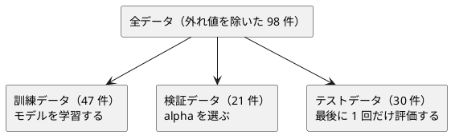

# 第 12 章: 正則化とモデル選択

## 12.1 はじめに

特徴量を増やすと、モデルは訓練データにいくらでも合わせられるようになります。その結果、訓練データでは高い精度が出るのに、未知のデータでは精度が落ちる **過学習** が起こります。

この章では、過学習を抑える **正則化** を学びます。リッジ回帰を NumPy で自作して scikit-learn の `Ridge` と突き合わせ、正則化の強さ `alpha` を検証データで選ぶ **モデル選択** を実装します。最後に、係数を 0 にして特徴量を絞り込むラッソ回帰を scikit-learn で試します。

実験の結果は、後から書き換えられない値（`frozen=True` のデータクラス）として記録します。実験を何度も回すコードでは、「どの設定でどの結果が出たか」が途中で変わらないことが大切だからです。

## 12.2 過学習と正則化

### 係数が大きくなりすぎる

線形回帰は、予測値と正解の差（誤差）の二乗和が最小になるように係数を決めます。特徴量が多いと、訓練データの細かな揺れにまで合わせようとして、係数の絶対値が大きくなりがちです。係数が大きいモデルは、入力が少し変わっただけで予測が大きく変わるので、未知のデータに弱くなります。

### 係数の大きさに罰則を加える

正則化は、誤差の二乗和に「係数の大きさ」への罰則を加えて最小化します。

| 手法 | 最小化するもの | 係数への効果 |
|------|--------------|------------|
| 線形回帰 | 誤差の二乗和 | 制約なし |
| リッジ回帰 | 誤差の二乗和 + `alpha` × 係数の二乗和 | 全体を小さく縮める |
| ラッソ回帰 | 誤差の二乗和 + `alpha` × 係数の絶対値の和 | 一部の係数をちょうど 0 にする |

`alpha` は正則化の強さです。0 なら線形回帰と同じで、大きくするほど係数は小さくなります。大きすぎると、今度は訓練データにも合わなくなります（学習不足）。ちょうどよい `alpha` はデータによって違うので、実験して選びます。

### リッジ回帰の解き方

リッジ回帰は式を変形すると、行列の計算で係数を直接求められます。特徴量の行列を `X`、正解を `t` として、それぞれから平均を引いた（中心化した）うえで、次の連立一次方程式を解きます。

```text
(Xᵀ X + alpha × I) w = Xᵀ t
```

`I` は単位行列です。切片は「正解の平均 − 特徴量の平均と係数の内積」で求めます。中心化してから解くのは、切片には罰則をかけないためです。

## 12.3 題材とデータ

### Boston.csv

この章で使うのは `Boston.csv` です。100 件の地区について、住宅価格（`PRICE`）と 13 個の特徴量が記録されています。この章ではそのうち次の 3 つを使います。

| 列 | 意味 | 欠損値 |
|----|------|--------|
| RM | 住居の平均部屋数 | なし |
| PTRATIO | 生徒と教師の比率 | なし |
| LSTAT | 低所得者の割合（%） | なし |
| PRICE | 住宅価格（正解ラベル） | なし |

学習データの入手と配置は [第 1 章](01-machine-learning-and-first-test.md) の「題材とデータ」を参照してください。

### 過学習が起きやすい状況を作る

3 つの特徴量をそれぞれ標準化（平均 0・標準偏差 1）したうえで、2 乗の列と、2 つの列の積（交互作用）の列を加えます。3 列が 9 列に増え、100 件のデータに対しては過学習が起きやすい状況になります。多項式特徴量と標準化、外れ値の扱いは [第 9 章](09-feature-engineering.md) で詳しく扱います。この章では、正則化の効果を確かめるのに必要な最小限の前処理だけを章の中に用意します。

### 訓練・検証・テストの 3 つに分ける

`alpha` をテストデータの結果で選ぶと、テストデータに合わせてモデルを選んだことになり、テストデータが「未知のデータ」ではなくなります。そこで、データを次の 3 つに分けます。



分割には [第 2 章](02-data-preprocessing-and-triangulation.md) で作った `split_train_test` を 2 回使います。1 回目で全体を訓練用とテスト用に、2 回目で訓練用をさらに訓練データと検証データに分けます。

## 12.4 TODO リストの作成

**TODO リスト**:

- [ ] リッジ回帰を自作する
  - [ ] `alpha` が 0 なら最小二乗法と同じ係数と切片になる
  - [ ] 特徴量が 2 つでも係数と切片を求める
  - [ ] `alpha` を大きくすると係数が小さくなる
  - [ ] scikit-learn の `Ridge` と同じ係数になる
  - [ ] 係数と切片から予測する
- [ ] 正則化の強さごとの実験結果を、書き換えられない値として記録する
- [ ] 検証データの決定係数が最も高い実験を選ぶ
- [ ] ラッソ回帰で 0 になった係数の特徴量名を返す
- [ ] 標準化してから 2 次の多項式特徴量を作る
- [ ] 外れ値の行を除く
- [ ] 実データを 3 つに分けて、線形回帰・リッジ回帰・ラッソ回帰を比べる

## 12.5 リッジ回帰を自作する

### Red: 最小二乗法と同じになるテスト

`alpha` が 0 のリッジ回帰は線形回帰と同じです。`t = 2x + 1` の上に並ぶ 3 点なら、係数は 2、切片は 1 になるはずです。

```python
import numpy as np
import pytest

from lib.chapter12.regularization import fit_ridge


class TestFitRidge:
    def test_alphaが0なら最小二乗法と同じ係数と切片になる(self) -> None:
        x = np.array([[1.0], [2.0], [3.0]])
        t = np.array([3.0, 5.0, 7.0])

        model = fit_ridge(x, t, alpha=0.0)

        assert model.coef == pytest.approx([2.0])
        assert model.intercept == pytest.approx(1.0)
```

```bash
uv run pytest test/chapter12
```

```text
E   ModuleNotFoundError: No module named 'lib.chapter12.regularization'
!!!!!!!!!!!!!!!!!!! Interrupted: 1 error during collection !!!!!!!!!!!!!!!!!!!!
============================== 1 error in 0.26s ===============================
```

### Green: 仮実装

学習結果を表す `RidgeModel` を定義し、期待値をそのまま返します。係数は NumPy の配列で持ちます。`NDArray[np.float64]` は「要素が 64 ビット浮動小数点数の NumPy 配列」を表す型ヒントです。

```python
from dataclasses import dataclass

import numpy as np
from numpy.typing import NDArray


@dataclass(frozen=True)
class RidgeModel:
    coef: NDArray[np.float64]
    intercept: float


def fit_ridge(
    x: NDArray[np.float64], t: NDArray[np.float64], alpha: float
) -> RidgeModel:
    return RidgeModel(coef=np.array([2.0]), intercept=1.0)
```

```text
test/chapter12/test_regularization.py::TestFitRidge::test_alphaが0なら最小二乗法と同じ係数と切片になる PASSED [100%]
============================== 1 passed in 0.09s ==============================
```

### 三角測量

特徴量が 2 つのデータで、`t = 3x₁ − x₂ + 4` を当てさせます。

```python
    def test_特徴量が2つでも係数と切片を求める(self) -> None:
        x = np.array([[1.0, 0.0], [0.0, 1.0], [1.0, 1.0], [2.0, 1.0]])
        t = 3.0 * x[:, 0] - 1.0 * x[:, 1] + 4.0

        model = fit_ridge(x, t, alpha=0.0)

        assert model.coef == pytest.approx([3.0, -1.0])
        assert model.intercept == pytest.approx(4.0)
```

```text
E       assert array([2.]) == approx([3.0 ±....0 ± 1.0e-06])
E         
E         Impossible to compare lists with different sizes.
E         Lengths: 2 and 1
========================= 1 failed, 1 passed in 0.13s =========================
```

12.2 節の式をそのまま実装します。`@` は行列の積、`np.linalg.solve(A, b)` は `A w = b` を解く関数です。逆行列を計算してから掛けるより、数値的に安定しています。

```python
def fit_ridge(
    x: NDArray[np.float64], t: NDArray[np.float64], alpha: float
) -> RidgeModel:
    x_mean = x.mean(axis=0)
    t_mean = float(t.mean())
    xc = x - x_mean
    tc = t - t_mean
    identity = np.eye(x.shape[1])
    coef = np.linalg.solve(xc.T @ xc + alpha * identity, xc.T @ tc)
    return RidgeModel(coef=coef, intercept=t_mean - float(x_mean @ coef))
```

```text
============================== 2 passed in 0.09s ==============================
```

### 正則化の効果と scikit-learn との突き合わせ

乱数で作った人工データ（特徴量 4 列、30 件）で、正則化の性質を確かめます。1 つ目は「`alpha` を大きくすると係数の絶対値の合計が小さくなる」こと、2 つ目は scikit-learn の `Ridge` と同じ係数と切片になることの **学習用テスト** です。

```python
def random_dataset() -> tuple[NDArray[np.float64], NDArray[np.float64]]:
    rng = np.random.default_rng(0)
    x = rng.normal(size=(30, 4))
    t = x @ np.array([1.5, -2.0, 0.5, 3.0]) + rng.normal(scale=0.5, size=30)
    return x, t
```

```python
    def test_alphaを大きくすると係数の絶対値の合計が小さくなる(self) -> None:
        x, t = random_dataset()

        weak = fit_ridge(x, t, alpha=0.1)
        strong = fit_ridge(x, t, alpha=100.0)

        assert np.abs(strong.coef).sum() < np.abs(weak.coef).sum()

    def test_scikit_learnのRidgeと同じ係数と切片になる(self) -> None:
        x, t = random_dataset()

        model = fit_ridge(x, t, alpha=1.0)
        expected = Ridge(alpha=1.0).fit(x, t)

        assert model.coef == pytest.approx(expected.coef_)
        assert model.intercept == pytest.approx(expected.intercept_)
```

scikit-learn の `Ridge` も、切片には罰則をかけずに中心化してから解くので、自作の結果と一致します。

### 予測する

予測は「特徴量と係数の内積 + 切片」です。

```python
class TestPredict:
    def test_係数と切片から予測値を計算する(self) -> None:
        model = RidgeModel(coef=np.array([3.0, -1.0]), intercept=4.0)

        y = predict(model, np.array([[1.0, 2.0], [0.0, 0.0]]))

        assert y == pytest.approx([5.0, 4.0])
```

```text
E   ImportError: cannot import name 'predict' from 'lib.chapter12.regularization'
```

以降の出力では、エラーメッセージの末尾に続くファイルのパスを省略しています。やることが明らかなので、明白な実装で進めます。

```python
def predict(model: RidgeModel, x: NDArray[np.float64]) -> NDArray[np.float64]:
    return x @ model.coef + model.intercept
```

```text
test/chapter12/test_regularization.py::TestFitRidge::test_alphaが0なら最小二乗法と同じ係数と切片になる PASSED [ 20%]
test/chapter12/test_regularization.py::TestFitRidge::test_特徴量が2つでも係数と切片を求める PASSED [ 40%]
test/chapter12/test_regularization.py::TestFitRidge::test_alphaを大きくすると係数の絶対値の合計が小さくなる PASSED [ 60%]
test/chapter12/test_regularization.py::TestFitRidge::test_scikit_learnのRidgeと同じ係数と切片になる PASSED [ 80%]
test/chapter12/test_regularization.py::TestPredict::test_係数と切片から予測値を計算する PASSED [100%]
============================== 5 passed in 1.34s ==============================
```

## 12.6 実験結果を記録して選ぶ

### 書き換えられない実験結果

`alpha` ごとに学習し、訓練データと検証データの決定係数（R²）、係数の絶対値の合計を記録します。決定係数は [第 7 章](07-linear-regression.md) で扱った指標で、ここでは scikit-learn の `r2_score` を使います。

```python
class TestRunRidgeExperiments:
    def test_正則化の強さごとに1件ずつ実験結果を記録する(self) -> None:
        x, t = random_dataset()

        experiments = run_ridge_experiments(
            x[:20], t[:20], x[20:], t[20:], alphas=[0.1, 1.0, 10.0]
        )

        assert [e.alpha for e in experiments] == [0.1, 1.0, 10.0]

    def test_実験結果は後から書き換えられない(self) -> None:
        x, t = random_dataset()

        experiments = run_ridge_experiments(x[:20], t[:20], x[20:], t[20:], [1.0])

        with pytest.raises(FrozenInstanceError):
            experiments[0].alpha = 2.0  # type: ignore[misc]
```

2 つ目のテストは、実験結果を書き換えようとすると `FrozenInstanceError` が送出されることを確かめます。`# type: ignore[misc]` は、mypy が「frozen なデータクラスへの代入」をエラーにするのを、このテストに限って黙らせる指定です。わざと禁止された操作をするテストなので、型チェッカーが止めてくれること自体が不変性の裏付けになります。

```text
E   ImportError: cannot import name 'run_ridge_experiments' from 'lib.chapter12.regularization'
```

実験結果を `Experiment` として定義し、`alpha` ごとに 1 件ずつ作ります。戻り値をリストではなくタプルにしているのは、呼び出し側で要素を追加・削除・並べ替えできないようにするためです。

```python
@dataclass(frozen=True)
class Experiment:
    alpha: float
    train_score: float
    validation_score: float
    coef_abs_sum: float
```

```python
def run_ridge_experiments(
    x_train: NDArray[np.float64],
    t_train: NDArray[np.float64],
    x_valid: NDArray[np.float64],
    t_valid: NDArray[np.float64],
    alphas: Sequence[float],
) -> tuple[Experiment, ...]:
    experiments = []
    for alpha in alphas:
        model = fit_ridge(x_train, t_train, alpha)
        experiments.append(
            Experiment(
                alpha=alpha,
                train_score=float(r2_score(t_train, predict(model, x_train))),
                validation_score=float(r2_score(t_valid, predict(model, x_valid))),
                coef_abs_sum=float(np.abs(model.coef).sum()),
            )
        )
    return tuple(experiments)
```

```text
============================== 7 passed in 1.38s ==============================
```

### 検証データで最もよい実験を選ぶ

テストでは、実験結果を直接作る小さなヘルパーを用意します。

```python
def experiment(alpha: float, validation_score: float) -> Experiment:
    return Experiment(
        alpha=alpha, train_score=0.9, validation_score=validation_score, coef_abs_sum=1.0
    )


class TestBestExperiment:
    def test_検証データの決定係数が最も高い実験を選ぶ(self) -> None:
        experiments = [experiment(0.1, 0.7), experiment(1.0, 0.6)]

        assert best_experiment(experiments).alpha == 0.1
```

先頭を返す仮実装で Green にします。

```python
def best_experiment(experiments: Sequence[Experiment]) -> Experiment:
    return experiments[0]
```

最もよい実験が途中にある例で三角測量します。

```python
    def test_最も高い実験が途中にあってもそれを選ぶ(self) -> None:
        experiments = [
            experiment(0.1, 0.5),
            experiment(1.0, 0.8),
            experiment(10.0, 0.6),
        ]

        assert best_experiment(experiments).alpha == 1.0
```

```text
E       assert 0.1 == 1.0
E        +  where 0.1 = Experiment(alpha=0.1, train_score=0.9, validation_score=0.5, coef_abs_sum=1.0).alpha
```

`max` に `key` を渡すと、「何で比べるか」を関数で指定できます。

```python
def best_experiment(experiments: Sequence[Experiment]) -> Experiment:
    return max(experiments, key=lambda e: e.validation_score)
```

```text
============================== 9 passed in 1.87s ==============================
```

## 12.7 ラッソ回帰で特徴量を絞り込む

ラッソ回帰は自作せず、scikit-learn の `Lasso` を使います。係数の絶対値に罰則をかけると式が微分できない点を含むため、リッジ回帰のように 1 回の行列計算では解けず、座標降下法などの反復計算が必要になるからです。ここで自作するのは、結果を読み取るための「係数が 0 になった特徴量名を返す」関数です。

```python
class TestZeroCoefficients:
    def test_0になった係数の特徴量名を返す(self) -> None:
        coef = np.array([0.0, 1.5, 0.0])

        assert zero_coefficient_names(coef, ["RM", "LSTAT", "RM^2"]) == ["RM", "RM^2"]
```

```text
E   ImportError: cannot import name 'zero_coefficient_names' from 'lib.chapter12.regularization'
```

```python
def zero_coefficient_names(
    coef: NDArray[np.float64], feature_names: Sequence[str]
) -> list[str]:
    return [name for name, c in zip(feature_names, coef, strict=True) if c == 0.0]
```

浮動小数点数を `== 0.0` で比べていますが、ラッソ回帰の係数は計算の結果「ほぼ 0」になるのではなく、ちょうど 0 に設定されるので、この比較で問題ありません。これを学習用テストで確かめます。予測に関係しない 2 列（`noise1`・`noise2`）を含む人工データで学習させると、その 2 列の係数だけが 0 になります。

```python
    def test_ラッソ回帰では予測に役立たない特徴量の係数が0になる(self) -> None:
        rng = np.random.default_rng(0)
        x = rng.normal(size=(50, 4))
        t = x @ np.array([3.0, -2.0, 0.0, 0.0]) + rng.normal(scale=0.1, size=50)
        names = ["x1", "x2", "noise1", "noise2"]

        model = Lasso(alpha=0.5).fit(x, t)

        assert zero_coefficient_names(model.coef_, names) == ["noise1", "noise2"]
```

```text
============================= 11 passed in 1.29s ==============================
```

**TODO リスト**:

- [x] リッジ回帰を自作する
  - [x] `alpha` が 0 なら最小二乗法と同じ係数と切片になる
  - [x] 特徴量が 2 つでも係数と切片を求める
  - [x] `alpha` を大きくすると係数が小さくなる
  - [x] scikit-learn の `Ridge` と同じ係数になる
  - [x] 係数と切片から予測する
- [x] 正則化の強さごとの実験結果を、書き換えられない値として記録する
- [x] 検証データの決定係数が最も高い実験を選ぶ
- [x] ラッソ回帰で 0 になった係数の特徴量名を返す
- [ ] 標準化してから 2 次の多項式特徴量を作る
- [ ] 外れ値の行を除く
- [ ] 実データを 3 つに分けて、線形回帰・リッジ回帰・ラッソ回帰を比べる

## 12.8 最小限の前処理

### 標準化と多項式特徴量

前処理は `lib/chapter12/boston_features.py` に分けます。訓練データの平均値と標準偏差で標準化し、scikit-learn の `PolynomialFeatures` で 2 次の項を加えます。1 列 `[1, 2, 3]` を標準化すると `[-1.2247…, 0, 1.2247…]` になり、その 2 乗の列が加わります。

```python
class TestPolynomialScaler:
    def test_訓練データで標準化してから2乗の列を加える(self) -> None:
        x = pd.DataFrame({"RM": [1.0, 2.0, 3.0]})

        scaler = fit_polynomial_scaler(x)

        z = 1.224744871391589
        assert transform(scaler, x).tolist() == [
            pytest.approx([-z, z**2]),
            pytest.approx([0.0, 0.0]),
            pytest.approx([z, z**2]),
        ]
```

```text
E   ModuleNotFoundError: No module named 'lib.chapter12.boston_features'
```

```python
@dataclass(frozen=True)
class PolynomialScaler:
    mean: pd.Series
    std: pd.Series
    polynomial: PolynomialFeatures


def fit_polynomial_scaler(x: pd.DataFrame) -> PolynomialScaler:
    mean = x.mean()
    std = x.std(ddof=0)
    polynomial = PolynomialFeatures(degree=2, include_bias=False)
    polynomial.fit((x - mean) / std)
    return PolynomialScaler(mean=mean, std=std, polynomial=polynomial)


def transform(scaler: PolynomialScaler, x: pd.DataFrame) -> NDArray[np.float64]:
    standardized = (x - scaler.mean) / scaler.std
    return np.asarray(scaler.polynomial.transform(standardized), dtype=np.float64)
```

`std(ddof=0)` は、データの件数 n で割る標準偏差です。pandas の `std` は既定で n − 1 で割るので、scikit-learn の `StandardScaler`（n で割る）とそろえるために明示しています。

学習（`fit_polynomial_scaler`）と変換（`transform`）を分けたのは、テストデータを「訓練データの平均値と標準偏差」で標準化するためです。テストデータ自身の平均で標準化すると、テストデータの情報が前処理に漏れてしまいます。これもテストで固定し、あわせて特徴量名を返す関数を足します。

```python
    def test_テストデータも訓練データの平均値と標準偏差で標準化する(self) -> None:
        train = pd.DataFrame({"RM": [1.0, 2.0, 3.0]})
        test = pd.DataFrame({"RM": [2.0]})

        scaler = fit_polynomial_scaler(train)

        assert transform(scaler, test).tolist() == [pytest.approx([0.0, 0.0])]

    def test_2つの特徴量から2乗と交互作用の列を作り名前を付ける(self) -> None:
        x = pd.DataFrame({"RM": [1.0, 2.0, 3.0], "LSTAT": [3.0, 1.0, 2.0]})

        scaler = fit_polynomial_scaler(x)

        assert feature_names(scaler) == ["RM", "LSTAT", "RM^2", "RM LSTAT", "LSTAT^2"]
        assert transform(scaler, x).shape == (3, 5)
```

```python
def feature_names(scaler: PolynomialScaler) -> list[str]:
    return [str(name) for name in scaler.polynomial.get_feature_names_out()]
```

```text
============================= 14 passed in 1.51s ==============================
```

### 外れ値を除く

実データの `RM`・`PTRATIO`・`LSTAT`・`PRICE` には、平均から標準偏差の 3 倍以上離れた値を持つ行が 2 件あります。件数が 100 件と少ないため、この 2 件が検証データに入るかどうかで結果が大きく揺れました。そこで、この章では単純な基準で外れ値の行を除きます。

平均から標準偏差の何倍離れているかを **z スコア** と呼びます。値が 11 個の 1.0 と 1 個の 100.0 なら、100.0 の z スコアは 3 を超えます。

```python
class TestRemoveOutliers:
    def test_平均から標準偏差の3倍より離れた値を持つ行を除く(self) -> None:
        df = pd.DataFrame({"RM": [1.0] * 11 + [100.0]})

        assert remove_outliers(df, ["RM"], threshold=3.0)["RM"].tolist() == [1.0] * 11
```

最後の行を除く仮実装で Green にしてから、2 つの例で三角測量します。

```python
def remove_outliers(
    df: pd.DataFrame, columns: list[str], threshold: float
) -> pd.DataFrame:
    return df.drop(index=df.index[-1])
```

```python
    def test_外れ値が無ければすべての行を残す(self) -> None:
        df = pd.DataFrame({"RM": [5.0, 6.0, 7.0]})

        assert len(remove_outliers(df, ["RM"], threshold=3.0)) == 3

    def test_指定した列の値だけで外れ値を判定する(self) -> None:
        df = pd.DataFrame({"RM": [1.0] * 12, "ZN": [0.0] * 11 + [100.0]})

        assert len(remove_outliers(df, ["RM"], threshold=3.0)) == 12
```

```text
E       AssertionError: assert 2 == 3
E       AssertionError: assert 11 == 12
```

列ごとの z スコアを計算し、どれか 1 列でもしきい値を超えた行を除きます。

```python
def remove_outliers(
    df: pd.DataFrame, columns: list[str], threshold: float
) -> pd.DataFrame:
    values = df[columns]
    z = (values - values.mean()) / values.std()
    return df[~(z.abs() > threshold).any(axis=1)]
```

```text
============================= 18 passed in 1.37s ==============================
```

z スコアによる判定は、外れ値そのものが平均と標準偏差を引っ張るため、外れ値が多いデータでは見逃しが起きます。より頑健な方法は第 9 章で扱います。

### 3 つに分けて特徴量を作る

ここまでの部品を `prepare_boston` にまとめます。テストでは 10 行の架空の CSV を使い、件数と列数を確かめます。10 件をテストの割合 0.3 で分けると訓練用 7 件・テスト 3 件、訓練用 7 件を検証の割合 0.3 で分けると訓練 4 件・検証 3 件です。

```python
class TestPrepareBoston:
    def test_訓練データと検証データとテストデータに分けて多項式特徴量を作る(
        self, tmp_path: Path
    ) -> None:
        rows = [f"low,6.{i},1{i}.5,{i + 3}.2,2{i}.0" for i in range(10)]
        csv_file = tmp_path / "boston.csv"
        csv_file.write_text("CRIME,RM,PTRATIO,LSTAT,PRICE\n" + "\n".join(rows) + "\n")

        dataset = prepare_boston(csv_file, test_size=0.3, validation_size=0.3, seed=0)

        assert dataset.x_train.shape == (4, 9)
        assert dataset.x_valid.shape == (3, 9)
        assert dataset.x_test.shape == (3, 9)
        assert (len(dataset.t_train), len(dataset.t_valid), len(dataset.t_test)) == (
            4,
            3,
            3,
        )
        assert dataset.feature_names[:3] == ["RM", "PTRATIO", "LSTAT"]
```

標準化の平均値と標準偏差は、訓練データ（4 件のほう）だけから求めます。

```python
def prepare_boston(
    csv_file: Path, test_size: float, validation_size: float, seed: int
) -> BostonDataset:
    df = remove_outliers(pd.read_csv(csv_file), FEATURES + [TARGET], OUTLIER_THRESHOLD)
    outer = split_train_test(df[FEATURES], df[TARGET], test_size=test_size, seed=seed)
    inner = split_train_test(
        outer.x_train, outer.t_train, test_size=validation_size, seed=seed
    )
    scaler = fit_polynomial_scaler(inner.x_train)
    return BostonDataset(
        x_train=transform(scaler, inner.x_train),
        t_train=inner.t_train.to_numpy(dtype=np.float64),
        x_valid=transform(scaler, inner.x_test),
        t_valid=inner.t_test.to_numpy(dtype=np.float64),
        x_test=transform(scaler, outer.x_test),
        t_test=outer.t_test.to_numpy(dtype=np.float64),
        feature_names=feature_names(scaler),
    )
```

## 12.9 実データで比べる

### 結果を表示する

`python -m lib.chapter12` で、次の順に結果を表示します。

1. `alpha` ごとの実験を訓練データと検証データで行う
2. 検証データで `alpha` を選ぶ
3. 線形回帰（`alpha=0`）と選んだリッジ回帰を、テストデータで 1 回だけ評価する
4. ラッソ回帰で 0 になった係数を表示する

```bash
uv run python -m lib.chapter12
```

```text
データ件数: 98（外れ値 2 件を除外）
訓練データ: 47 件, 検証データ: 21 件, テストデータ: 30 件
特徴量: RM, PTRATIO, LSTAT, RM^2, RM PTRATIO, RM LSTAT, PTRATIO^2, PTRATIO LSTAT, LSTAT^2
alpha  訓練 R²  検証 R²  係数の絶対値の合計
  0.0  0.8933  0.5865  19.504
  0.1  0.8933  0.5898  19.396
  1.0  0.8923  0.6136  18.486
 10.0  0.8567  0.6797  12.841
100.0  0.6653  0.5711  4.990
検証データで選んだ alpha: 10.0
テストデータの決定係数: 線形回帰 0.5683, リッジ回帰 0.6317
ラッソ回帰（alpha=0.5）で係数が 0 になった特徴量: RM, PTRATIO LSTAT
```

### 結果を読む

- **過学習している**: 線形回帰（`alpha=0.0`）は訓練データの R² が 0.8933 なのに、検証データでは 0.5865 です
- **正則化で検証データの精度が上がる**: `alpha` を大きくすると係数の絶対値の合計が小さくなり、訓練データの R² は少しずつ下がる一方、検証データの R² は `alpha=10.0` で 0.6797 まで上がります
- **強すぎると学習不足になる**: `alpha=100.0` では訓練データの R² も 0.6653 まで下がり、検証データの R² も下がります
- **テストデータでも改善する**: 検証データで選んだ `alpha=10.0` のリッジ回帰は、テストデータの R² が 0.6317 で、線形回帰の 0.5683 を上回りました
- **ラッソ回帰は特徴量を絞る**: `RM` と `PTRATIO LSTAT` の係数が 0 になり、9 列のうち 7 列だけで予測するモデルになりました

ただし、データが 100 件と少ないので、この結果は分け方（シード）によって変わります。実際に、外れ値を除かずにシード 0 で分けると検証データの R² が負になり、検証データで選んだ `alpha` のほうがテストデータで悪くなりました。1 回の分け方の結果だけで判断しない方法として、[第 11 章](11-evaluation-metrics-and-cross-validation.md) の交差検証があります。

### 実データのテスト

実データでも自作のリッジ回帰が scikit-learn と一致することと、表示内容をテストで固定します。データが無い環境ではスキップされます。

```python
@requires_data("Boston.csv")
class TestBostonData:
    def test_外れ値を除いて訓練データと検証データとテストデータに分ける(self) -> None:
        dataset = prepare_boston(
            data_dir() / "Boston.csv", test_size=0.3, validation_size=0.3, seed=0
        )

        assert (len(dataset.t_train), len(dataset.t_valid), len(dataset.t_test)) == (
            47,
            21,
            30,
        )

    def test_実データでも自作のリッジ回帰はscikit_learnと同じ係数になる(self) -> None:
        dataset = prepare_boston(
            data_dir() / "Boston.csv", test_size=0.3, validation_size=0.3, seed=0
        )

        model = fit_ridge(dataset.x_train, dataset.t_train, alpha=10.0)
        expected = Ridge(alpha=10.0).fit(dataset.x_train, dataset.t_train)

        assert model.coef == pytest.approx(expected.coef_)
        assert model.intercept == pytest.approx(expected.intercept_)
```

```bash
uv run pytest test/chapter12
```

```text
============================= 21 passed in 1.39s ==============================
```

データが無い環境では、実データのテスト 3 件がスキップされます。

```text
======================== 18 passed, 3 skipped in 1.88s ========================
```

## 12.10 Notebook で探索する

`notebooks/chapter12_regularization_exploration.ipynb` で、`alpha` を細かく変えたときの係数と決定係数の変化をグラフにします。Notebook の起動と使い方は [第 6 章](06-task-runner-and-ci-cd.md) を参照してください。

```python
dataset = prepare_boston(
    data_dir() / "Boston.csv", test_size=0.3, validation_size=0.3, seed=0
)
alphas = np.logspace(-2, 3, 30)
```

`np.logspace(-2, 3, 30)` は、0.01 から 1000 までを対数の目盛りで等間隔に 30 個並べます。`alpha` の効果は桁が変わるごとに現れるので、対数の目盛りで調べます。

```python
coefficients = pd.DataFrame(
    [fit_ridge(dataset.x_train, dataset.t_train, a).coef for a in alphas],
    index=alphas,
    columns=dataset.feature_names,
)
ax = coefficients.plot(logx=True, title="alpha と係数の変化")
ax.set_xlabel("alpha");
```

グラフには 9 本の係数の線が描かれます。自作のリッジ回帰で `alpha` を 0.01・10・1000 にしたときの係数を数値で見ると、次のとおりです。

| 特徴量 | alpha=0.01 | alpha=10 | alpha=1000 |
|--------|-----------|----------|------------|
| RM | -1.88 | -0.40 | 0.16 |
| PTRATIO | -2.83 | -1.77 | -0.07 |
| LSTAT | -5.19 | -3.09 | -0.20 |
| RM^2 | 2.16 | 2.17 | 0.46 |
| RM PTRATIO | -2.34 | -1.92 | -0.22 |
| RM LSTAT | 1.54 | 1.21 | -0.06 |
| PTRATIO^2 | -1.60 | -1.06 | -0.06 |
| PTRATIO LSTAT | -0.19 | -0.30 | 0.08 |
| LSTAT^2 | 1.78 | 0.91 | -0.04 |

`alpha=10` では `LSTAT` や `LSTAT^2` の係数が小さくなる一方、`RM^2` の係数はほとんど変わっていません。`alpha=1000` では、すべての係数の絶対値が 0.5 未満まで縮みます。リッジ回帰は係数を縮めますが、ラッソ回帰のようにちょうど 0 にはしません。

```python
experiments = run_ridge_experiments(
    dataset.x_train, dataset.t_train, dataset.x_valid, dataset.t_valid, alphas
)
scores = pd.DataFrame(
    {
        "訓練 R²": [e.train_score for e in experiments],
        "検証 R²": [e.validation_score for e in experiments],
    },
    index=alphas,
)
ax = scores.plot(logx=True, title="alpha と決定係数")
ax.set_xlabel("alpha");
```

訓練 R² は `alpha` を大きくするほど下がり続けますが、検証 R² は山の形になります。山の頂上は次のセルで確かめます。

```python
scores["検証 R²"].idxmax(), scores["検証 R²"].max()
```

```text
(np.float64(12.689610031679234), np.float64(0.6821593672890759))
```

5 つの候補で選んだ `alpha=10.0`（検証 R² 0.6797）の近くに、検証 R² が最も高い `alpha` がありました。候補の粗さで結果が大きく変わらないことが分かったので、本番コードの候補（`ALPHAS`）はそのままにします。

<details>
<summary>この章の完成コード（lib/chapter12/regularization.py）</summary>

```python
from collections.abc import Sequence
from dataclasses import dataclass

import numpy as np
from numpy.typing import NDArray
from sklearn.metrics import r2_score


@dataclass(frozen=True)
class RidgeModel:
    coef: NDArray[np.float64]
    intercept: float


@dataclass(frozen=True)
class Experiment:
    alpha: float
    train_score: float
    validation_score: float
    coef_abs_sum: float


def fit_ridge(
    x: NDArray[np.float64], t: NDArray[np.float64], alpha: float
) -> RidgeModel:
    x_mean = x.mean(axis=0)
    t_mean = float(t.mean())
    xc = x - x_mean
    tc = t - t_mean
    identity = np.eye(x.shape[1])
    coef = np.linalg.solve(xc.T @ xc + alpha * identity, xc.T @ tc)
    return RidgeModel(coef=coef, intercept=t_mean - float(x_mean @ coef))


def predict(model: RidgeModel, x: NDArray[np.float64]) -> NDArray[np.float64]:
    return x @ model.coef + model.intercept


def run_ridge_experiments(
    x_train: NDArray[np.float64],
    t_train: NDArray[np.float64],
    x_valid: NDArray[np.float64],
    t_valid: NDArray[np.float64],
    alphas: Sequence[float],
) -> tuple[Experiment, ...]:
    experiments = []
    for alpha in alphas:
        model = fit_ridge(x_train, t_train, alpha)
        experiments.append(
            Experiment(
                alpha=alpha,
                train_score=float(r2_score(t_train, predict(model, x_train))),
                validation_score=float(r2_score(t_valid, predict(model, x_valid))),
                coef_abs_sum=float(np.abs(model.coef).sum()),
            )
        )
    return tuple(experiments)


def best_experiment(experiments: Sequence[Experiment]) -> Experiment:
    return max(experiments, key=lambda e: e.validation_score)


def zero_coefficient_names(
    coef: NDArray[np.float64], feature_names: Sequence[str]
) -> list[str]:
    return [name for name, c in zip(feature_names, coef, strict=True) if c == 0.0]
```

</details>

<details>
<summary>この章の完成コード（lib/chapter12/boston_features.py）</summary>

```python
from dataclasses import dataclass
from pathlib import Path

import numpy as np
import pandas as pd
from numpy.typing import NDArray
from sklearn.preprocessing import PolynomialFeatures

from lib.chapter02.iris_preprocessing import split_train_test

FEATURES = ["RM", "PTRATIO", "LSTAT"]
TARGET = "PRICE"
OUTLIER_THRESHOLD = 3.0


@dataclass(frozen=True)
class PolynomialScaler:
    mean: pd.Series
    std: pd.Series
    polynomial: PolynomialFeatures


@dataclass(frozen=True)
class BostonDataset:
    x_train: NDArray[np.float64]
    t_train: NDArray[np.float64]
    x_valid: NDArray[np.float64]
    t_valid: NDArray[np.float64]
    x_test: NDArray[np.float64]
    t_test: NDArray[np.float64]
    feature_names: list[str]


def remove_outliers(
    df: pd.DataFrame, columns: list[str], threshold: float
) -> pd.DataFrame:
    values = df[columns]
    z = (values - values.mean()) / values.std()
    return df[~(z.abs() > threshold).any(axis=1)]


def fit_polynomial_scaler(x: pd.DataFrame) -> PolynomialScaler:
    mean = x.mean()
    std = x.std(ddof=0)
    polynomial = PolynomialFeatures(degree=2, include_bias=False)
    polynomial.fit((x - mean) / std)
    return PolynomialScaler(mean=mean, std=std, polynomial=polynomial)


def feature_names(scaler: PolynomialScaler) -> list[str]:
    return [str(name) for name in scaler.polynomial.get_feature_names_out()]


def transform(scaler: PolynomialScaler, x: pd.DataFrame) -> NDArray[np.float64]:
    standardized = (x - scaler.mean) / scaler.std
    return np.asarray(scaler.polynomial.transform(standardized), dtype=np.float64)


def prepare_boston(
    csv_file: Path, test_size: float, validation_size: float, seed: int
) -> BostonDataset:
    df = remove_outliers(pd.read_csv(csv_file), FEATURES + [TARGET], OUTLIER_THRESHOLD)
    outer = split_train_test(df[FEATURES], df[TARGET], test_size=test_size, seed=seed)
    inner = split_train_test(
        outer.x_train, outer.t_train, test_size=validation_size, seed=seed
    )
    scaler = fit_polynomial_scaler(inner.x_train)
    return BostonDataset(
        x_train=transform(scaler, inner.x_train),
        t_train=inner.t_train.to_numpy(dtype=np.float64),
        x_valid=transform(scaler, inner.x_test),
        t_valid=inner.t_test.to_numpy(dtype=np.float64),
        x_test=transform(scaler, outer.x_test),
        t_test=outer.t_test.to_numpy(dtype=np.float64),
        feature_names=feature_names(scaler),
    )
```

</details>

<details>
<summary>この章の完成コード（lib/chapter12/__main__.py）</summary>

```python
import pandas as pd
from sklearn.linear_model import Lasso
from sklearn.metrics import r2_score

from lib.chapter12.boston_features import (
    FEATURES,
    OUTLIER_THRESHOLD,
    TARGET,
    prepare_boston,
    remove_outliers,
)
from lib.chapter12.regularization import (
    best_experiment,
    fit_ridge,
    predict,
    run_ridge_experiments,
    zero_coefficient_names,
)
from lib.dataset import data_dir

TEST_SIZE = 0.3
VALIDATION_SIZE = 0.3
SEED = 0
ALPHAS = [0.0, 0.1, 1.0, 10.0, 100.0]
LASSO_ALPHA = 0.5


def main() -> None:
    csv_file = data_dir() / "Boston.csv"
    df = pd.read_csv(csv_file)
    kept = remove_outliers(df, FEATURES + [TARGET], OUTLIER_THRESHOLD)
    dataset = prepare_boston(csv_file, TEST_SIZE, VALIDATION_SIZE, SEED)
    print(f"データ件数: {len(kept)}（外れ値 {len(df) - len(kept)} 件を除外）")
    print(
        f"訓練データ: {len(dataset.t_train)} 件, "
        f"検証データ: {len(dataset.t_valid)} 件, "
        f"テストデータ: {len(dataset.t_test)} 件"
    )
    print(f"特徴量: {', '.join(dataset.feature_names)}")

    experiments = run_ridge_experiments(
        dataset.x_train, dataset.t_train, dataset.x_valid, dataset.t_valid, ALPHAS
    )
    print("alpha  訓練 R²  検証 R²  係数の絶対値の合計")
    for e in experiments:
        print(
            f"{e.alpha:>5}  {e.train_score:.4f}  {e.validation_score:.4f}  "
            f"{e.coef_abs_sum:.3f}"
        )
    best = best_experiment(experiments)
    print(f"検証データで選んだ alpha: {best.alpha}")

    linear = fit_ridge(dataset.x_train, dataset.t_train, alpha=0.0)
    ridge = fit_ridge(dataset.x_train, dataset.t_train, alpha=best.alpha)
    linear_score = r2_score(dataset.t_test, predict(linear, dataset.x_test))
    ridge_score = r2_score(dataset.t_test, predict(ridge, dataset.x_test))
    print(
        f"テストデータの決定係数: 線形回帰 {linear_score:.4f}, "
        f"リッジ回帰 {ridge_score:.4f}"
    )

    lasso = Lasso(alpha=LASSO_ALPHA).fit(dataset.x_train, dataset.t_train)
    zeros = ", ".join(zero_coefficient_names(lasso.coef_, dataset.feature_names))
    print(f"ラッソ回帰（alpha={LASSO_ALPHA}）で係数が 0 になった特徴量: {zeros}")


if __name__ == "__main__":
    main()
```

</details>

## 12.11 まとめ

この章では、過学習を正則化で抑え、正則化の強さをデータで選ぶ流れを実装しました。

1. **リッジ回帰の自作** — 中心化してから `(XᵀX + alpha × I) w = Xᵀt` を解き、scikit-learn の `Ridge` と係数が一致することを学習用テストで確かめた
2. **3 つへの分割** — 訓練データで学習し、検証データで `alpha` を選び、テストデータでは最後に 1 回だけ評価した
3. **書き換えられない実験結果** — `frozen=True` のデータクラスとタプルで実験結果を記録し、書き換えられないことをテストで固定した
4. **ラッソ回帰** — scikit-learn の `Lasso` で、役に立たない特徴量の係数がちょうど 0 になることを確かめた
5. **前処理の情報漏れを防ぐ** — 標準化の平均値と標準偏差を訓練データだけから求めた

実データでは、線形回帰のテストデータの R² 0.5683 に対し、検証データで `alpha=10.0` を選んだリッジ回帰は 0.6317 でした。一方で、データが少ないと 1 回の分け方で結果が揺れることも分かりました。

次の章では、たくさんの列を少数の軸に要約する主成分分析を学びます。
