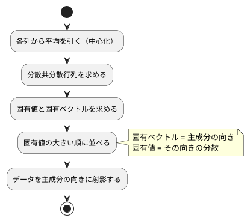

# 第 13 章: 主成分分析による次元削減

## 13.1 はじめに

ここまでの章では、正解ラベルのあるデータで予測をしてきました。この章から扱う **教師なし学習** では、正解ラベルを使わずに、データそのものの構造を調べます。

最初に扱うのは **主成分分析（PCA）** です。住宅価格のデータには 15 個もの列がありますが、列どうしは互いに関係しあっていて、実際にはもっと少ない数の「軸」で大部分を説明できることがあります。主成分分析は、データのばらつきを最もよく説明する新しい軸を探し、たくさんの列を少数の軸に要約します。

この章では、分散共分散行列と固有値分解を NumPy で組み合わせて主成分分析を自作し、scikit-learn の `PCA` と突き合わせます。その途中で、固有ベクトルの **符号** という、実装ごとに結果が食い違う落とし穴に出会います。

## 13.2 主成分分析とは

### ばらつきが最も大きい方向を探す

2 つの列が強く相関しているデータを散布図にすると、点は斜めの帯のように並びます。このとき、帯に沿った方向の 1 本の軸を取れば、2 つの列の情報をほぼ 1 つの数値で表せます。この「ばらつき（分散）が最も大きい方向」が **第 1 主成分** です。第 2 主成分は、第 1 主成分と直交する方向のうち、ばらつきが最も大きい方向です。

### 分散共分散行列の固有ベクトル

主成分は、次の手順で求められます。



**分散共分散行列** は、対角に各列の分散、それ以外に 2 列の共分散を並べた行列です。この行列の **固有ベクトル** が主成分の向き、**固有値** がその向きのデータの分散になります。

### 寄与率

各主成分の固有値を、固有値の合計で割った値を **寄与率** と呼びます。その主成分が、データ全体のばらつきのうち何割を説明しているかを表します。第 1 主成分から順に寄与率を足したものが **累積寄与率** です。「累積寄与率が 0.8 に届くまでの主成分を使う」のように、残す軸の数を決める目安に使います。

## 13.3 題材とデータ

この章では [第 12 章](12-regularization-and-model-selection.md) と同じ `Boston.csv`（100 件）を、住宅価格 `PRICE` も含めたすべての列で使います。

| 列の種類 | 列 | 注意点 |
|---------|-----|--------|
| 数値 | ZN, INDUS, CHAS, NOX, RM, AGE, DIS, RAD, TAX, PTRATIO, B, LSTAT, PRICE | NOX と RAD に欠損値が 1 件ずつある |
| カテゴリ | CRIME | `high`・`low`・`very_low` の 3 種類の文字列 |

主成分分析は数値しか扱えず、欠損値があると計算できません。また、列ごとに単位や桁（TAX は数百、NOX は 1 未満）が違うと、桁の大きい列のばらつきが主成分を支配してしまいます。そこで次の前処理をしてから主成分分析をします。

1. 欠損値を列の平均値で補完する
2. CRIME をダミー変数（`low`・`very_low` の 2 列）に置き換える
3. すべての列を平均 0・標準偏差 1 に標準化する

欠損値の補完・ダミー変数・標準化は [第 9 章](09-feature-engineering.md) で詳しく扱います。この章では、主成分分析に必要な最小限の前処理だけを章の中に用意します。

## 13.4 TODO リストの作成

**TODO リスト**:

- [ ] 分散共分散行列を求める
  - [ ] 2 列の分散と共分散を並べる
  - [ ] 3 列でも NumPy の `cov` と同じになる
- [ ] 主成分を求める
  - [ ] 完全に相関する 2 列なら第 1 主成分だけで分散をすべて説明する
  - [ ] 寄与率の大きい順に、指定した数だけ並ぶ
  - [ ] scikit-learn の `PCA` と同じ主成分になる
- [ ] データを主成分の向きに射影する
- [ ] 累積寄与率がしきい値に届く主成分の数を求める
- [ ] 主成分への影響が大きい列を求める
- [ ] Boston を前処理する（欠損値の補完・ダミー変数・標準化）
- [ ] 実データで寄与率と主成分の意味を表示する

## 13.5 分散共分散行列を求める

### Red

`[1, 3, 5]` と `[2, 6, 10]` の 2 列は、2 列目がちょうど 1 列目の 2 倍です。分散は n − 1 で割ると 4 と 16、共分散は 8 になります。

```python
import numpy as np
import pytest

from lib.chapter13.pca import covariance_matrix


class TestCovarianceMatrix:
    def test_2列の分散と共分散を並べた行列を返す(self) -> None:
        x = np.array([[1.0, 2.0], [3.0, 6.0], [5.0, 10.0]])

        assert covariance_matrix(x).tolist() == [
            pytest.approx([4.0, 8.0]),
            pytest.approx([8.0, 16.0]),
        ]
```

```bash
uv run pytest test/chapter13
```

```text
E   ModuleNotFoundError: No module named 'lib.chapter13.pca'
!!!!!!!!!!!!!!!!!!! Interrupted: 1 error during collection !!!!!!!!!!!!!!!!!!!!
```

### Green: 仮実装から三角測量へ

期待する行列をそのまま返す仮実装で Green にします。

```python
import numpy as np
from numpy.typing import NDArray


def covariance_matrix(x: NDArray[np.float64]) -> NDArray[np.float64]:
    return np.array([[4.0, 8.0], [8.0, 16.0]])
```

三角測量として、乱数で作った 3 列のデータで NumPy の `np.cov` と比べます。`rowvar=False` は「列が変数、行が観測」という並びを指定する引数です。

```python
    def test_3列でもnumpyのcovと同じ行列を返す(self) -> None:
        x = np.random.default_rng(0).normal(size=(20, 3))

        assert covariance_matrix(x) == pytest.approx(np.cov(x, rowvar=False))
```

```text
E       assert array([[ 4., ...  [ 8., 16.]]) == approx([[1.35...1 ± 5.7e-07]])
E         
E         Impossible to compare arrays with different shapes.
E         Shapes: (3, 3) and (2, 2)
========================= 1 failed, 1 passed in 0.15s =========================
```

中心化した行列 `Xc` を使うと、分散共分散行列は `Xcᵀ Xc / (n − 1)` の 1 行で書けます。

```python
def covariance_matrix(x: NDArray[np.float64]) -> NDArray[np.float64]:
    centered = x - x.mean(axis=0)
    return (centered.T @ centered) / (len(x) - 1)
```

```text
============================== 2 passed in 0.09s ==============================
```

## 13.6 主成分を求める

### 完全に相関する 2 列

先ほどの 2 列のデータは、点がすべて `(1, 2)` 方向の直線上にあります。したがって第 1 主成分は長さ 1 の `(1, 2) / √5`、寄与率は第 1 主成分が 1、第 2 主成分が 0 になるはずです。

```python
class TestFitPca:
    def test_完全に相関する2列なら第1主成分だけで分散をすべて説明する(self) -> None:
        x = np.array([[1.0, 2.0], [3.0, 6.0], [5.0, 10.0]])

        model = fit_pca(x, n_components=2)

        assert model.components[0] == pytest.approx([1 / np.sqrt(5), 2 / np.sqrt(5)])
        assert model.explained_variance_ratio == pytest.approx([1.0, 0.0])
```

期待値に 0 を含む比較では、「期待値の何倍までずれてよいか」という相対誤差が役に立ちません。`pytest.approx` は相対誤差（既定 `1e-6`）に加えて絶対誤差（既定 `1e-12`）も許容するので、浮動小数点の計算でごく小さな値が出ても 0 との比較が成り立ちます。

```text
E   ImportError: cannot import name 'fit_pca' from 'lib.chapter13.pca'
```

出力のファイルパスは省略しています。13.2 節の手順をそのまま実装します。`np.linalg.eigh` は対称行列の固有値と固有ベクトルを求める関数で、固有値を **小さい順** に返します。`np.argsort(eigenvalues)[::-1]` で大きい順の並びに直してから、先頭の `n_components` 個を取ります。

```python
@dataclass(frozen=True)
class PcaModel:
    mean: NDArray[np.float64]
    components: NDArray[np.float64]
    explained_variance: NDArray[np.float64]
    explained_variance_ratio: NDArray[np.float64]


def normalize_signs(components: NDArray[np.float64]) -> NDArray[np.float64]:
    largest = np.argmax(np.abs(components), axis=1)
    signs = np.sign(components[np.arange(len(components)), largest])
    return components * signs[:, np.newaxis]


def fit_pca(x: NDArray[np.float64], n_components: int) -> PcaModel:
    eigenvalues, eigenvectors = np.linalg.eigh(covariance_matrix(x))
    order = np.argsort(eigenvalues)[::-1][:n_components]
    return PcaModel(
        mean=x.mean(axis=0),
        components=normalize_signs(eigenvectors[:, order].T),
        explained_variance=eigenvalues[order],
        explained_variance_ratio=eigenvalues[order] / eigenvalues.sum(),
    )
```

`eigh` は固有ベクトルを **列** に並べて返すので、転置（`.T`）して「1 行が 1 つの主成分」に並べ替えています。

### 固有ベクトルの符号

固有ベクトル `v` が主成分の向きなら、逆向きの `−v` も同じ直線を表す固有ベクトルです。どちらの符号が返るかは計算方法によって決まり、決まった規則はありません。テストが期待する `(1, 2) / √5` と逆向きが返っても、主成分としては正しいのです。

そこで、各主成分の「絶対値が最大の要素が正になる」ように符号をそろえる `normalize_signs` を用意しました。`np.argmax(np.abs(components), axis=1)` で行ごとに絶対値が最大の位置を求め、その要素の符号（+1 か −1）を行全体に掛けます。

```text
============================== 3 passed in 0.09s ==============================
```

`normalize_signs` はテストより先に実装してしまったので、専用のテストを足して振る舞いを固定します。

```python
class TestNormalizeSigns:
    def test_絶対値が最大の要素が正になるように主成分の向きをそろえる(self) -> None:
        components = np.array([[0.6, -0.8], [-0.8, 0.6]])

        assert normalize_signs(components).tolist() == [
            pytest.approx([-0.6, 0.8]),
            pytest.approx([0.8, -0.6]),
        ]
```

### scikit-learn の PCA と突き合わせる

4 列の人工データを作ります。2 つの隠れた変数を 4 列に混ぜ、小さなノイズを加えたデータなので、2 つの主成分でほとんどのばらつきを説明できるはずです。

```python
def random_dataset() -> NDArray[np.float64]:
    rng = np.random.default_rng(0)
    base = rng.normal(size=(40, 2))
    mixing = np.array([[2.0, 0.5], [0.3, 1.0], [1.0, -1.0], [0.0, 0.2]])
    noise = rng.normal(scale=0.1, size=(40, 4))
    x: NDArray[np.float64] = base @ mixing.T + noise
    return x
```

`x: NDArray[np.float64] = ...` と変数に型を書いてから返しているのは、この式の型が mypy から `Any` に見えるためです。そのまま `return` すると、`pyproject.toml` の `warn_return_any = true` の設定により「`Any` を返している」（`no-any-return`）とエラーになりました。

まず、自作の `fit_pca` が寄与率の大きい順に並ぶことを確かめます。

```python
    def test_主成分は寄与率の大きい順に指定した数だけ並ぶ(self) -> None:
        x = random_dataset()

        model = fit_pca(x, n_components=3)

        ratios = model.explained_variance_ratio.tolist()
        assert len(ratios) == 3
        assert ratios == sorted(ratios, reverse=True)
```

次に、scikit-learn の `PCA` と比べる前に、符号をそろえないとどうなるかを見ておきます。`apps/python` で次のスクリプトを実行し、`eigh` の結果を大きい順に並べただけのものと、scikit-learn の `components_` を表示します。

```python
import numpy as np
from sklearn.decomposition import PCA

from lib.chapter13.pca import covariance_matrix

rng = np.random.default_rng(0)
base = rng.normal(size=(40, 2))
mixing = np.array([[2.0, 0.5], [0.3, 1.0], [1.0, -1.0], [0.0, 0.2]])
noise = rng.normal(scale=0.1, size=(40, 4))
x = base @ mixing.T + noise

eigenvalues, eigenvectors = np.linalg.eigh(covariance_matrix(x))
order = np.argsort(eigenvalues)[::-1][:3]
print(np.round(eigenvectors[:, order].T, 3))
print(np.round(PCA(n_components=3).fit(x).components_, 3))
```

```text
[[-0.919 -0.282 -0.275 -0.026]
 [-0.048 -0.602  0.79  -0.11 ]
 [-0.191  0.245  0.301  0.901]]
[[ 0.919  0.282  0.275  0.026]
 [-0.048 -0.602  0.79  -0.11 ]
 [-0.191  0.245  0.301  0.901]]
```

第 1 主成分だけ、すべての要素の符号が逆になっています。どちらも正しい主成分ですが、このまま比べるとテストは失敗します。そこで、scikit-learn の結果にも `normalize_signs` をかけてから比べます。この比較は、自作の実装が scikit-learn と同じ計算をしていることを確かめる **学習用テスト** です。

```python
    def test_scikit_learnのPCAと符号をそろえれば同じ主成分になる(self) -> None:
        x = random_dataset()

        model = fit_pca(x, n_components=3)
        expected = PCA(n_components=3).fit(x)

        assert model.components == pytest.approx(normalize_signs(expected.components_))
        assert model.explained_variance == pytest.approx(expected.explained_variance_)
        assert model.explained_variance_ratio == pytest.approx(
            expected.explained_variance_ratio_
        )
```

```text
test/chapter13/test_pca.py::TestCovarianceMatrix::test_2列の分散と共分散を並べた行列を返す PASSED [ 16%]
test/chapter13/test_pca.py::TestCovarianceMatrix::test_3列でもnumpyのcovと同じ行列を返す PASSED [ 33%]
test/chapter13/test_pca.py::TestFitPca::test_完全に相関する2列なら第1主成分だけで分散をすべて説明する PASSED [ 50%]
test/chapter13/test_pca.py::TestFitPca::test_主成分は寄与率の大きい順に指定した数だけ並ぶ PASSED [ 66%]
test/chapter13/test_pca.py::TestFitPca::test_scikit_learnのPCAと符号をそろえれば同じ主成分になる PASSED [ 83%]
test/chapter13/test_pca.py::TestNormalizeSigns::test_絶対値が最大の要素が正になるように主成分の向きをそろえる PASSED [100%]
============================== 6 passed in 1.29s ==============================
```

scikit-learn の `explained_variance_` も n − 1 で割った分散なので、自作の固有値とそのまま一致します。

## 13.7 データを主成分の向きに射影する

データを主成分の軸で表し直すには、平均を引いてから主成分の向きとの内積を取ります。平均が `(1, 2)`、主成分が `(0.6, 0.8)` のモデルに `(2, 3)` を渡すと、`(1, 1)` と `(0.6, 0.8)` の内積で 1.4 になります。

```python
class TestTransform:
    def test_平均を引いてから主成分の向きに射影する(self) -> None:
        model = PcaModel(
            mean=np.array([1.0, 2.0]),
            components=np.array([[0.6, 0.8]]),
            explained_variance=np.array([1.0]),
            explained_variance_ratio=np.array([1.0]),
        )

        assert transform(model, np.array([[2.0, 3.0], [1.0, 2.0]])).tolist() == [
            pytest.approx([1.4]),
            pytest.approx([0.0]),
        ]
```

```python
def transform(model: PcaModel, x: NDArray[np.float64]) -> NDArray[np.float64]:
    return (x - model.mean) @ model.components.T
```

## 13.8 必要な主成分の数を求める

寄与率が `[0.5, 0.25, 0.25]` のとき、累積寄与率は `[0.5, 0.75, 1.0]` です。しきい値 0.75 に届くのは 2 つ目です。

```python
class TestComponentsNeeded:
    def test_累積寄与率がしきい値に届くまでの主成分の数を返す(self) -> None:
        assert components_needed(np.array([0.5, 0.25, 0.25]), threshold=0.75) == 2
```

`transform` と一緒に import したので、まず import エラーで Red になります。`transform` は明白な実装、`components_needed` は 2 を返す仮実装で Green にします。

```python
def components_needed(ratios: NDArray[np.float64], threshold: float) -> int:
    return 2
```

```text
============================== 8 passed in 1.51s ==============================
```

しきい値を 0.8 に上げると 3 つ必要になる例で三角測量します。

```python
    def test_しきい値を上げると必要な主成分の数が増える(self) -> None:
        assert components_needed(np.array([0.5, 0.25, 0.25]), threshold=0.8) == 3
```

```text
E       assert 2 == 3
E        +  where 2 = components_needed(array([0.5 , 0.25, 0.25]), threshold=0.8)
```

`np.cumsum` で累積和を取り、`>= threshold` が初めて真になる位置を `np.argmax` で求めます。`argmax` は真偽値の配列では最初の `True` の位置を返します。位置は 0 から数えるので、個数にするには 1 を足します。

```python
def components_needed(ratios: NDArray[np.float64], threshold: float) -> int:
    cumulative = np.cumsum(ratios)
    return int(np.argmax(cumulative >= threshold)) + 1
```

```text
============================== 9 passed in 1.29s ==============================
```

テストの寄与率に `[0.5, 0.25, 0.25]` を選んだのは、2 進数で誤差なく表せる値だからです。`[0.6, 0.3, 0.1]` でしきい値 0.9 を試すと、次のようになります。

```python
import numpy as np
from lib.chapter13.pca import components_needed
print(np.cumsum([0.6, 0.3, 0.1]))
print(components_needed(np.array([0.6, 0.3, 0.1]), threshold=0.9))
```

```text
[0.6 0.9 1. ]
3
```

表示では 2 つ目が 0.9 なのに、結果は 3 です。0.6 + 0.3 は浮動小数点数では 0.8999999999999999 になり、0.9 に届かないからです。表示が丸められていても、比較は丸める前の値で行われます。テストの例を選ぶときは、このような誤差が入り込まない値を使うか、許容誤差を明示します。

## 13.9 主成分への影響が大きい列を求める

主成分の各要素は、元の列がその主成分にどれだけ強く関わるかを表します。絶対値の大きい順に列名を並べると、主成分の意味を読み取る手がかりになります。

```python
class TestTopLoadings:
    def test_係数の絶対値が大きい順に列名と係数を返す(self) -> None:
        component = np.array([0.1, -0.7, 0.5])

        assert top_loadings(component, ["ZN", "DIS", "TAX"], k=2) == [
            ("DIS", -0.7),
            ("TAX", 0.5),
        ]
```

```text
E   ImportError: cannot import name 'top_loadings' from 'lib.chapter13.pca'
```

```python
def top_loadings(
    component: NDArray[np.float64], columns: Sequence[str], k: int
) -> list[tuple[str, float]]:
    order = np.argsort(np.abs(component))[::-1][:k]
    return [(columns[i], float(component[i])) for i in order]
```

```text
============================= 12 passed in 1.27s ==============================
```

## 13.10 Boston を前処理する

前処理は `lib/chapter13/boston_standardized.py` に分けます。テストには、CRIME の 3 種類と欠損値を含む 4 行の架空のデータを使います。

```python
import pandas as pd
import pytest

from lib.chapter13.boston_standardized import standardize_boston


def boston_like() -> pd.DataFrame:
    return pd.DataFrame(
        {
            "CRIME": ["high", "low", "very_low", "low"],
            "RM": [5.0, 6.0, None, 7.0],
            "PRICE": [10.0, 20.0, 30.0, 40.0],
        }
    )


class TestStandardizeBoston:
    def test_CRIMEをダミー変数の列に置き換える(self) -> None:
        df = standardize_boston(boston_like())

        assert list(df.columns) == ["RM", "PRICE", "low", "very_low"]
```

```text
E   ModuleNotFoundError: No module named 'lib.chapter13.boston_standardized'
```

まずダミー変数だけを実装します。`pd.get_dummies` に `drop_first=True` を渡すと、最初のカテゴリ（`high`）の列を作りません。`low` も `very_low` も 0 なら `high` だと分かるので、3 列目は情報として重複するからです。`dtype=float` を指定しないと、ダミー変数の列は真偽値の型になります。

```python
import pandas as pd


def standardize_boston(df: pd.DataFrame) -> pd.DataFrame:
    dummies = pd.get_dummies(df["CRIME"], drop_first=True, dtype=float)
    return df.drop(columns=["CRIME"]).join(dummies)
```

```text
============================= 10 passed in 1.41s ==============================
```

次に、欠損値の補完と標準化を求めるテストを足します。

```python
    def test_欠損値を補完してから各列を平均0と標準偏差1にそろえる(self) -> None:
        df = standardize_boston(boston_like())

        assert df.isna().sum().sum() == 0
        assert df.mean().tolist() == pytest.approx([0.0] * 4)
        assert df.std(ddof=0).tolist() == pytest.approx([1.0] * 4)
```

```text
E       assert np.int64(1) == 0
E        +  where np.int64(1) = sum()
E        +    where sum = RM          1\nPRICE       0\nlow         0\nvery_low    0\ndtype: int64.sum
```

平均値で補完してからダミー変数を作り、すべての列を標準化します。`df.mean(numeric_only=True)` は、文字列の CRIME 列を除いて平均を計算する指定です。

```python
from pathlib import Path

import pandas as pd


def standardize_boston(df: pd.DataFrame) -> pd.DataFrame:
    filled = df.fillna(df.mean(numeric_only=True))
    dummies = pd.get_dummies(filled["CRIME"], drop_first=True, dtype=float)
    numeric = filled.drop(columns=["CRIME"]).join(dummies).astype(float)
    return (numeric - numeric.mean()) / numeric.std(ddof=0)


def load_standardized_boston(csv_file: Path) -> pd.DataFrame:
    return standardize_boston(pd.read_csv(csv_file))
```

```text
============================= 11 passed in 1.33s ==============================
```

**TODO リスト**:

- [x] 分散共分散行列を求める
  - [x] 2 列の分散と共分散を並べる
  - [x] 3 列でも NumPy の `cov` と同じになる
- [x] 主成分を求める
  - [x] 完全に相関する 2 列なら第 1 主成分だけで分散をすべて説明する
  - [x] 寄与率の大きい順に、指定した数だけ並ぶ
  - [x] scikit-learn の `PCA` と同じ主成分になる
- [x] データを主成分の向きに射影する
- [x] 累積寄与率がしきい値に届く主成分の数を求める
- [x] 主成分への影響が大きい列を求める
- [x] Boston を前処理する（欠損値の補完・ダミー変数・標準化）
- [ ] 実データで寄与率と主成分の意味を表示する

## 13.11 実データで要約する

### 結果を表示する

```python
import numpy as np

from lib.chapter13.boston_standardized import load_standardized_boston
from lib.chapter13.pca import components_needed, fit_pca, top_loadings
from lib.dataset import data_dir

THRESHOLD = 0.8
TOP_K = 3


def format_loadings(loadings: list[tuple[str, float]]) -> str:
    return ", ".join(f"{column} {value:.3f}" for column, value in loadings)


def main() -> None:
    df = load_standardized_boston(data_dir() / "Boston.csv")
    columns = list(df.columns)
    model = fit_pca(df.to_numpy(), n_components=len(columns))
    ratios = model.explained_variance_ratio
    needed = components_needed(ratios, THRESHOLD)
    print(f"データ件数: {len(df)}, 列数: {len(columns)}")
    print(
        "寄与率: "
        + ", ".join(f"PC{i + 1} {r:.4f}" for i, r in enumerate(ratios[:needed]))
    )
    cumulative = float(np.cumsum(ratios)[needed - 1])
    print(
        f"累積寄与率が {THRESHOLD} に届く主成分の数: {needed}"
        f"（累積寄与率 {cumulative:.4f}）"
    )
    for i in range(2):
        loadings = top_loadings(model.components[i], columns, k=TOP_K)
        print(f"第 {i + 1} 主成分で影響の大きい列: {format_loadings(loadings)}")


if __name__ == "__main__":
    main()
```

```bash
uv run python -m lib.chapter13
```

```text
データ件数: 100, 列数: 15
寄与率: PC1 0.4110, PC2 0.1448, PC3 0.1019, PC4 0.0645, PC5 0.0623, PC6 0.0581
累積寄与率が 0.8 に届く主成分の数: 6（累積寄与率 0.8427）
第 1 主成分で影響の大きい列: INDUS 0.359, NOX 0.350, TAX 0.328
第 2 主成分で影響の大きい列: PRICE 0.444, low 0.423, RM 0.405
```

### 結果を読む

- **第 1 主成分だけで 4 割を説明する**: 15 列のばらつきのうち 41.1% を、1 本の軸で説明できます
- **15 列を 6 本の軸に要約できる**: 累積寄与率 0.8 を目安にすると、6 つの主成分で全体の 84.3% を説明できます
- **第 1 主成分は「産業化・都市化」の軸と読める**: 非小売業の土地の割合（INDUS）、窒素酸化物の濃度（NOX）、固定資産税率（TAX）が同じ向きに強く効いています
- **第 2 主成分は「住環境のよさ」の軸と読める**: 住宅価格（PRICE）、部屋数（RM）、犯罪率が低い地区（low）が同じ向きに効いています

主成分の「意味」は計算で決まるものではなく、係数を見た人間の解釈です。符号の向きも `normalize_signs` の規則で決めたものなので、「値が大きいほど都市化している」のか「小さいほど」なのかは、係数の符号とあわせて読む必要があります。

### 実データのテスト

実データでも自作の主成分分析が scikit-learn と一致することと、表示内容をテストで固定します。符号をそろえれば、15 個すべての主成分の向きと寄与率が一致します。

```python
@requires_data("Boston.csv")
class TestBostonPcaData:
    def test_CRIMEをダミー変数にして15列の標準化済みデータにする(self) -> None:
        df = load_standardized_boston(data_dir() / "Boston.csv")

        assert df.shape == (100, 15)

    def test_実データでも自作のPCAはscikit_learnと同じ寄与率と主成分になる(
        self,
    ) -> None:
        x = load_standardized_boston(data_dir() / "Boston.csv").to_numpy()

        model = fit_pca(x, n_components=15)
        expected = PCA().fit(x)

        assert model.explained_variance_ratio == pytest.approx(
            expected.explained_variance_ratio_
        )
        assert model.components == pytest.approx(normalize_signs(expected.components_))
```

```bash
uv run pytest test/chapter13
```

```text
============================= 15 passed in 1.25s ==============================
```

データが無い環境では、実データのテスト 3 件がスキップされます。

## 13.12 Notebook で探索する

`notebooks/chapter13_pca_exploration.ipynb` で、累積寄与率と、第 1・第 2 主成分の散布図を描きます。Notebook の起動と使い方は [第 6 章](06-task-runner-and-ci-cd.md) を参照してください。散布図の色分けに CRIME を使うので、標準化の前のデータ（`raw`）も残しておきます。

```python
raw = pd.read_csv(data_dir() / "Boston.csv")
df = standardize_boston(raw)
model = fit_pca(df.to_numpy(), n_components=df.shape[1])
```

```python
cumulative = pd.Series(
    np.cumsum(model.explained_variance_ratio),
    index=range(1, df.shape[1] + 1),
)
ax = cumulative.plot(marker="o", title="主成分の数と累積寄与率")
ax.axhline(0.8, linestyle="--")
ax.set_xlabel("主成分の数");
```

累積寄与率は 1 本目で 0.411、2 本目で 0.556、3 本目で 0.658 と増え、増え方は本数が増えるほど小さくなります。0.8 の破線を超えるのは 6 本目（0.843）です。

```python
scores = pd.DataFrame(transform(model, df.to_numpy())[:, :2], columns=["PC1", "PC2"])
scores["CRIME"] = raw["CRIME"]
sns.scatterplot(data=scores, x="PC1", y="PC2", hue="CRIME");
```

15 列のデータを 2 本の軸に写した散布図を、CRIME で色分けします。色ごとの位置の違いを数値で確かめます。

```python
scores.groupby("CRIME")[["PC1", "PC2"]].mean().round(3)
```

```text
            PC1    PC2
CRIME                 
high      3.474 -0.386
low       0.409  1.590
very_low -1.942 -0.602
```

犯罪率が `high` の地区は第 1 主成分（産業化・都市化）の値が大きく、`low` の地区は第 2 主成分（住環境のよさ）の値が大きくなっています。CRIME そのものも主成分の計算に含めているので、この分かれ方は予想どおりです。一方で、2 本の軸だけで 3 種類の地区がおおまかに分かれることは、15 列の情報の多くが 2 本の軸に集約されていることを示しています。

<details>
<summary>この章の完成コード（lib/chapter13/pca.py）</summary>

```python
from collections.abc import Sequence
from dataclasses import dataclass

import numpy as np
from numpy.typing import NDArray


@dataclass(frozen=True)
class PcaModel:
    mean: NDArray[np.float64]
    components: NDArray[np.float64]
    explained_variance: NDArray[np.float64]
    explained_variance_ratio: NDArray[np.float64]


def covariance_matrix(x: NDArray[np.float64]) -> NDArray[np.float64]:
    centered = x - x.mean(axis=0)
    return (centered.T @ centered) / (len(x) - 1)


def normalize_signs(components: NDArray[np.float64]) -> NDArray[np.float64]:
    largest = np.argmax(np.abs(components), axis=1)
    signs = np.sign(components[np.arange(len(components)), largest])
    return components * signs[:, np.newaxis]


def fit_pca(x: NDArray[np.float64], n_components: int) -> PcaModel:
    eigenvalues, eigenvectors = np.linalg.eigh(covariance_matrix(x))
    order = np.argsort(eigenvalues)[::-1][:n_components]
    return PcaModel(
        mean=x.mean(axis=0),
        components=normalize_signs(eigenvectors[:, order].T),
        explained_variance=eigenvalues[order],
        explained_variance_ratio=eigenvalues[order] / eigenvalues.sum(),
    )


def transform(model: PcaModel, x: NDArray[np.float64]) -> NDArray[np.float64]:
    return (x - model.mean) @ model.components.T


def top_loadings(
    component: NDArray[np.float64], columns: Sequence[str], k: int
) -> list[tuple[str, float]]:
    order = np.argsort(np.abs(component))[::-1][:k]
    return [(columns[i], float(component[i])) for i in order]


def components_needed(ratios: NDArray[np.float64], threshold: float) -> int:
    cumulative = np.cumsum(ratios)
    return int(np.argmax(cumulative >= threshold)) + 1
```

</details>

## 13.13 まとめ

この章では、主成分分析を分散共分散行列と固有値分解から組み立てました。

1. **分散共分散行列** — 中心化した行列から `Xcᵀ Xc / (n − 1)` で求め、NumPy の `cov` と一致させた
2. **固有値分解** — `np.linalg.eigh` の結果を固有値の大きい順に並べ、主成分と寄与率を得た
3. **符号の落とし穴** — 固有ベクトルは符号が逆でも正しいため、`normalize_signs` で向きをそろえてから scikit-learn の `PCA` と突き合わせた
4. **浮動小数点の累積和** — 0.6 + 0.3 が 0.9 に届かないことを確かめ、テストの例に誤差の入らない値を選んだ
5. **次元削減と解釈** — Boston の 15 列を、累積寄与率 0.8 を目安に 6 本の軸へ要約し、第 1・第 2 主成分の意味を係数から読み取った

次の章では、同じく教師なし学習の K-means で、データを似たもの同士のグループに分けます。
