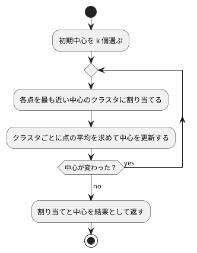

# 第 14 章: K-means によるクラスタリング

## 14.1 はじめに

これまでの章では、正解ラベル（派閥・品種・生存・価格など）が付いたデータから予測のルールを学ばせてきました。このような学習を **教師あり学習** と呼びます。

この章では、正解ラベルの無いデータから、似たもの同士のグループ（クラスタ）を見つける **クラスタリング** を扱います。正解を教えずにデータの構造を見つけるので、**教師なし学習** の一種です。代表的なアルゴリズムである **K-means** を NumPy で自作し、scikit-learn の `KMeans` と結果を突き合わせます。

題材は、卸売業者の顧客ごとの商品カテゴリ別の支出額です。「どんな買い方をする顧客のグループがあるか」を、データだけから探します。

## 14.2 K-means の仕組み

K-means は、クラスタ数 k を人間が決め、次の 2 つの手順を交互に繰り返してクラスタを作ります。

1. **割り当て**: 各点を、最も近いクラスタの中心に割り当てる
2. **更新**: クラスタごとに、割り当てられた点の平均を新しい中心にする

中心が動かなくなったら（割り当てが変わらなくなったら）終わりです。



クラスタのまとまりの良さは **SSE**（Sum of Squared Errors、誤差平方和）で測ります。各点と、その点が属するクラスタの中心との距離の 2 乗を合計した値で、小さいほど各クラスタの点が中心の近くにまとまっています。

K-means には、最初に選ぶ中心（初期中心）によって結果が変わるという性質があります。この章では、この性質もテストで確かめながら実装します。

## 14.3 題材とデータ

この章で使うのは `Wholesale.csv` です。データの入手と配置は [第 1 章](01-machine-learning-and-first-test.md) の「題材とデータ」を参照してください。440 件の顧客について、次の 8 列が記録されています。欠損値はありません。

| 列 | 意味 | 値 |
|----|------|-----|
| Channel | 販売チャネルの区分 | 1（298 件）または 2（142 件） |
| Region | 地域の区分 | 1（77 件）・2（47 件）・3（316 件） |
| Fresh | 生鮮食品の支出額 | 整数 |
| Milk | 乳製品の支出額 | 整数 |
| Grocery | 食料雑貨の支出額 | 整数 |
| Frozen | 冷凍食品の支出額 | 整数 |
| Detergents_Paper | 洗剤・紙製品の支出額 | 整数 |
| Delicassen | 惣菜の支出額 | 整数 |

Channel と Region は区分を表す番号で、大小に意味がありません。この章では支出額の 6 列だけを使って、買い方の似た顧客をまとめます。

支出額の列は、列によって桁が大きく違います。Fresh の平均は約 12,000 ですが、Delicassen の平均は約 1,500 です。距離で近さを測る K-means では、このままだと値の大きい列が距離をほぼ決めてしまいます。そこで、クラスタリングの前に列ごとに **標準化** します。

## 14.4 TODO リストの作成

**TODO リスト**:

- [ ] 支出額の列を読み込む
- [ ] 列ごとに標準化する
- [ ] 各点を最も近い中心のクラスタに割り当てる
- [ ] 割り当てた点の平均で中心を更新する
  - [ ] 点が 1 つも無いクラスタの中心はそのままにする
- [ ] SSE を計算する
- [ ] 中心が変わらなくなるまで割り当てと更新を繰り返す
- [ ] 初期中心をシードで選ぶ
- [ ] クラスタ数ごとの SSE を求める（エルボー法）
- [ ] scikit-learn の `KMeans` と突き合わせる
- [ ] クラスタごとの特徴をまとめる
- [ ] 実データでクラスタリングして結果を表示する

途中で実データを試した結果、「初期中心を変えて繰り返し、SSE が最小の結果を選ぶ」という項目を追加することになります（14.14 節）。

## 14.5 支出額の列を読み込む

テストでは、架空の値を 1 行だけ書いた CSV を作ります。

```python
from pathlib import Path

from lib.chapter14.kmeans import load_spending

HEADER = "Channel,Region,Fresh,Milk,Grocery,Frozen,Detergents_Paper,Delicassen\n"


def write_csv(tmp_path: Path, rows: str) -> Path:
    csv_file = tmp_path / "wholesale.csv"
    csv_file.write_text(HEADER + rows, encoding="utf-8")
    return csv_file


class TestLoadSpending:
    def test_ChannelとRegionを除いた支出額の列を読み込む(self, tmp_path: Path) -> None:
        csv_file = write_csv(tmp_path, "1,2,100,200,300,400,500,600\n")

        df = load_spending(csv_file)

        assert list(df.columns) == [
            "Fresh",
            "Milk",
            "Grocery",
            "Frozen",
            "Detergents_Paper",
            "Delicassen",
        ]
        assert df.iloc[0].to_list() == [100, 200, 300, 400, 500, 600]
```

```bash
uv run pytest test/chapter14
```

```text
E   ModuleNotFoundError: No module named 'lib.chapter14.kmeans'
!!!!!!!!!!!!!!!!!!! Interrupted: 1 error during collection !!!!!!!!!!!!!!!!!!!!
============================== 1 error in 0.15s ===============================
```

pandas で読み込み、区分の 2 列を `drop` で取り除きます。

```python
from pathlib import Path

import pandas as pd

NON_SPENDING_COLUMNS = ["Channel", "Region"]


def load_spending(csv_file: Path) -> pd.DataFrame:
    return pd.read_csv(csv_file).drop(columns=NON_SPENDING_COLUMNS)
```

```text
============================== 1 passed in 0.41s ===============================
```

## 14.6 列ごとに標準化する

標準化は、各列から平均を引き、標準偏差で割る変換です。変換後の各列は平均 0、標準偏差 1 になり、列の桁の違いが距離に影響しなくなります。

```python
class TestStandardize:
    def test_列ごとに平均0標準偏差1に変換する(self) -> None:
        df = pd.DataFrame({"Fresh": [10.0, 20.0, 30.0], "Milk": [5.0, 5.0, 8.0]})

        standardized = standardize(df)

        assert standardized["Fresh"].mean() == pytest.approx(0.0)
        assert standardized["Fresh"].std(ddof=0) == pytest.approx(1.0)
        assert standardized["Milk"].mean() == pytest.approx(0.0)
        assert standardized["Milk"].std(ddof=0) == pytest.approx(1.0)

    def test_scikit_learnのStandardScalerと同じ値になる(self) -> None:
        df = pd.DataFrame({"Fresh": [10.0, 20.0, 60.0], "Milk": [5.0, 9.0, 8.0]})

        standardized = standardize(df)

        expected = StandardScaler().fit_transform(df)
        assert np.allclose(standardized.to_numpy(), expected)
```

2 つ目のテストは、scikit-learn の `StandardScaler` と同じ値になることを確かめる学習用テストです。

```text
E   ImportError: cannot import name 'standardize' from 'lib.chapter14.kmeans' (...\lib\chapter14\kmeans.py)
```

変換の式をそのまま書く明白な実装で進めます。

```python
def standardize(df: pd.DataFrame) -> pd.DataFrame:
    return (df - df.mean()) / df.std(ddof=0)
```

`df - df.mean()` は、DataFrame から列ごとの平均（Series）を引く式です。pandas は列名をそろえて計算するので、ループを書かずに全列をまとめて変換できます。

`ddof=0` に注意してください。pandas の `std` は既定で `ddof=1`（標本標準偏差、n − 1 で割る）ですが、`StandardScaler` は n で割る `ddof=0` を使います。`ddof=1` のままだと学習用テストが失敗します。

```text
============================== 3 passed in 1.23s ===============================
```

## 14.7 各点を最も近い中心に割り当てる

ここからは K-means の本体です。点と中心は NumPy の 2 次元配列（行が点、列が特徴量）で表します。

まず 1 次元の例でテストを書きます。0 と 1 は中心 0 に近く、9 と 10 は中心 10 に近いので、クラスタ番号は `[0, 0, 1, 1]` です。

```python
class TestAssignClusters:
    def test_各点を最も近い中心のクラスタに割り当てる(self) -> None:
        points = np.array([[0.0], [1.0], [9.0], [10.0]])
        centers = np.array([[0.0], [10.0]])

        labels = assign_clusters(points, centers)

        assert labels.tolist() == [0, 0, 1, 1]
```

```text
E   ImportError: cannot import name 'assign_clusters' from 'lib.chapter14.kmeans' (...\lib\chapter14\kmeans.py)
```

仮実装で Green にします。

```python
def assign_clusters(points: np.ndarray, centers: np.ndarray) -> np.ndarray:
    return np.array([0, 0, 1, 1])
```

```text
test/chapter14/test_kmeans.py::TestAssignClusters::test_各点を最も近い中心のクラスタに割り当てる PASSED [100%]
============================== 4 passed in 1.23s ===============================
```

三角測量として、2 次元で、中心の並び順も変えた例を追加します。

```python
    def test_2次元の点をユークリッド距離で最も近い中心に割り当てる(self) -> None:
        points = np.array([[0.0, 0.0], [5.0, 4.0], [1.0, 0.0]])
        centers = np.array([[5.0, 5.0], [0.0, 0.0]])

        labels = assign_clusters(points, centers)

        assert labels.tolist() == [1, 0, 1]
```

```text
E       assert [0, 0, 1, 1] == [1, 0, 1]
E         
E         At index 0 diff: 0 != 1
E         Left contains one more item: 1
========================= 1 failed, 4 passed in 1.77s =========================
```

全点と全中心の距離をまとめて計算し、行ごとに最小の列の番号を選びます。

```python
def assign_clusters(points: np.ndarray, centers: np.ndarray) -> np.ndarray:
    differences = points[:, np.newaxis, :] - centers[np.newaxis, :, :]
    squared_distances = (differences**2).sum(axis=2)
    return squared_distances.argmin(axis=1)
```

ここでは NumPy の **ブロードキャスト** を使っています。点が n 個・中心が k 個・特徴量が d 列のとき、`points[:, np.newaxis, :]` は形が (n, 1, d)、`centers[np.newaxis, :, :]` は (1, k, d) になります。この 2 つを引き算すると、NumPy が長さ 1 の次元を自動で引き伸ばし、(n, k, d) の「全点 × 全中心の差」が得られます。2 乗して特徴量の方向（`axis=2`）に合計すると (n, k) の距離の 2 乗の表になり、`argmin(axis=1)` で各点に最も近い中心の番号が求まります。

最も近い中心を選ぶだけなら、平方根を取る必要はありません。距離の大小関係は 2 乗しても変わらないからです。

```text
============================== 5 passed in 1.69s ===============================
```

## 14.8 中心を更新する

割り当てた点の平均を、新しい中心にします。

```python
class TestUpdateCenters:
    def test_クラスタごとに割り当てられた点の平均を新しい中心にする(self) -> None:
        points = np.array([[0.0, 0.0], [2.0, 0.0], [10.0, 10.0], [10.0, 12.0]])
        labels = np.array([0, 0, 1, 1])
        previous = np.array([[0.0, 0.0], [0.0, 0.0]])

        centers = update_centers(points, labels, previous)

        assert centers.tolist() == [[1.0, 0.0], [10.0, 11.0]]

    def test_点が1つも割り当てられなかったクラスタは中心を変えない(self) -> None:
        points = np.array([[0.0, 0.0], [2.0, 4.0]])
        labels = np.array([0, 0])
        previous = np.array([[0.0, 0.0], [99.0, 99.0]])

        centers = update_centers(points, labels, previous)

        assert centers.tolist() == [[1.0, 2.0], [99.0, 99.0]]
```

2 つ目のテストは、どの点も割り当てられなかったクラスタの扱いです。初期中心の選び方によっては、実際に起こります。`update_centers` に前回の中心を渡しているのは、このときに中心をそのまま残すためです。

```text
E   ImportError: cannot import name 'update_centers' from 'lib.chapter14.kmeans' (...\lib\chapter14\kmeans.py)
```

まず、クラスタごとに平均を取るだけの実装を書いてみます。

```python
def update_centers(
    points: np.ndarray, labels: np.ndarray, previous_centers: np.ndarray
) -> np.ndarray:
    return np.array(
        [points[labels == k].mean(axis=0) for k in range(len(previous_centers))]
    )
```

`points[labels == k]` は、`labels == k` が `True` の行だけを取り出す **ブールインデックス** です。

```text
E       assert [[1.0, 2.0], [nan, nan]] == [[1.0, 2.0], [99.0, 99.0]]
E         
E         At index 1 diff: [nan, nan] != [99.0, 99.0]
  RuntimeWarning: Mean of empty slice
  RuntimeWarning: invalid value encountered in divide
=================== 1 failed, 6 passed, 2 warnings in 1.76s ===================
```

1 つ目のテストは通りましたが、空のクラスタの平均は `nan`（非数）になりました。NumPy は空の配列の平均を例外にせず、警告を出して `nan` を返します。`nan` の中心はどの点とも距離が計算できないので、放置するとクラスタが消えてしまいます。点があるクラスタだけ中心を更新するように直します。

```python
def update_centers(
    points: np.ndarray, labels: np.ndarray, previous_centers: np.ndarray
) -> np.ndarray:
    centers = previous_centers.copy()
    for k in range(len(previous_centers)):
        members = points[labels == k]
        if len(members) > 0:
            centers[k] = members.mean(axis=0)
    return centers
```

`previous_centers.copy()` で複製してから書き換えるので、呼び出し元の配列は変わりません。

```text
============================== 7 passed in 1.21s ===============================
```

## 14.9 SSE を計算する

```python
class TestSumOfSquaredErrors:
    def test_各点と所属するクラスタの中心との距離の2乗を合計する(self) -> None:
        points = np.array([[0.0, 0.0], [2.0, 0.0], [10.0, 10.0], [10.0, 12.0]])
        labels = np.array([0, 0, 1, 1])
        centers = np.array([[1.0, 0.0], [10.0, 11.0]])

        assert sum_of_squared_errors(points, labels, centers) == 4.0
```

4 点とも中心からの距離が 1 なので、SSE は 1 × 4 = 4 です。

```text
E   ImportError: cannot import name 'sum_of_squared_errors' from 'lib.chapter14.kmeans' (...\lib\chapter14\kmeans.py)
```

仮実装です。

```python
def sum_of_squared_errors(
    points: np.ndarray, labels: np.ndarray, centers: np.ndarray
) -> float:
    return 4.0
```

三角測量として、中心から遠い点を含む例を追加します。距離の 2 乗は 1 と 9 なので、SSE は 10 です。

```python
    def test_中心から離れた点ほど誤差が大きくなる(self) -> None:
        points = np.array([[0.0], [4.0]])
        labels = np.array([0, 0])
        centers = np.array([[1.0]])

        assert sum_of_squared_errors(points, labels, centers) == 10.0
```

```text
E       assert 4.0 == 10.0
E        +  where 4.0 = sum_of_squared_errors(array([[0.],\n       [4.]]), array([0, 0]), array([[1.]]))
========================= 1 failed, 8 passed in 2.16s =========================
```

```python
def sum_of_squared_errors(
    points: np.ndarray, labels: np.ndarray, centers: np.ndarray
) -> float:
    return float(((points - centers[labels]) ** 2).sum())
```

`centers[labels]` は、クラスタ番号の配列で中心の配列から行を取り出す **ファンシーインデックス** です。`labels` が `[0, 0, 1, 1]` なら、各点が属する中心を点と同じ並びで並べた (n, d) の配列になり、`points` とそのまま引き算できます。

```text
============================== 9 passed in 1.23s ===============================
```

## 14.10 中心が変わらなくなるまで繰り返す

割り当てと更新を組み合わせて、K-means の全体を作ります。結果はクラスタ番号・中心・SSE をまとめた `KMeansResult` で返します。

2 つのグループがはっきり分かれた 4 点を用意し、あえて同じグループの 2 点を初期中心にします。

```python
def two_groups() -> np.ndarray:
    return np.array([[0.0, 0.0], [0.0, 1.0], [10.0, 10.0], [10.0, 11.0]])


class TestKMeans:
    def test_割り当てが変わらなくなるまで割り当てと中心の更新を繰り返す(self) -> None:
        initial_centers = np.array([[0.0, 0.0], [0.0, 1.0]])

        result = kmeans(two_groups(), initial_centers)

        assert result.labels.tolist() == [0, 0, 1, 1]
        assert result.centers.tolist() == [[0.0, 0.5], [10.0, 10.5]]
        assert result.sse == 1.0
```

1 回目の割り当ては `[0, 1, 1, 1]` になりますが、中心を更新して割り当て直すと `[0, 0, 1, 1]` に落ち着きます。

```text
E   ImportError: cannot import name 'kmeans' from 'lib.chapter14.kmeans' (...\lib\chapter14\kmeans.py)
```

```python
@dataclass(frozen=True)
class KMeansResult:
    labels: np.ndarray
    centers: np.ndarray
    sse: float
```

```python
def kmeans(points: np.ndarray, initial_centers: np.ndarray) -> KMeansResult:
    centers = initial_centers.astype(float)
    while True:
        labels = assign_clusters(points, centers)
        new_centers = update_centers(points, labels, centers)
        if np.array_equal(new_centers, centers):
            break
        centers = new_centers
    return KMeansResult(
        labels=labels,
        centers=centers,
        sse=sum_of_squared_errors(points, labels, centers),
    )
```

中心が変わらなければ、次の割り当ても変わりません。そこで、更新前後の中心が完全に一致したら止めます。同じ点の集合から同じ順で平均を計算すれば同じ浮動小数点数になるので、ここでは許容誤差を設けずに `np.array_equal` で比較できます。

```text
============================= 10 passed in 1.33s ==============================
```

### 最大反復回数

`while True` は、万一収束しなかったときに止まりません。scikit-learn の `KMeans` にならって、最大反復回数を指定できるようにします。反復を 1 回で打ち切った場合、中心は 1 回だけ更新された位置になり、クラスタ番号はその中心に合わせて割り当て直したものになるはずです。

```python
    def test_最大反復回数に達したら収束していなくても打ち切る(self) -> None:
        initial_centers = np.array([[0.0, 0.0], [0.0, 1.0]])

        result = kmeans(two_groups(), initial_centers, max_iterations=1)

        assert result.centers == pytest.approx(np.array([[0.0, 0.0], [20 / 3, 22 / 3]]))
        assert result.labels.tolist() == [0, 0, 1, 1]
```

```text
E       TypeError: kmeans() got an unexpected keyword argument 'max_iterations'
======================== 1 failed, 10 passed in 1.39s =========================
```

```python
def kmeans(
    points: np.ndarray, initial_centers: np.ndarray, max_iterations: int = 300
) -> KMeansResult:
    centers = initial_centers.astype(float)
    for _ in range(max_iterations):
        labels = assign_clusters(points, centers)
        new_centers = update_centers(points, labels, centers)
        if np.array_equal(new_centers, centers):
            break
        centers = new_centers
    labels = assign_clusters(points, centers)
    return KMeansResult(
        labels=labels,
        centers=centers,
        sse=sum_of_squared_errors(points, labels, centers),
    )
```

ループを抜けたあとで、最終的な中心に対してもう一度割り当てます。打ち切ったときでも、返すクラスタ番号と中心が食い違わないようにするためです。

```text
============================= 11 passed in 1.24s ==============================
```

## 14.11 初期中心をシードで選ぶ

初期中心は、データの中から重複なく k 点を選ぶことにします。第 2 章の訓練データとテストデータの分割と同じく、シードで乱数を固定して再現できるようにします。

```python
def numbered_points(size: int) -> np.ndarray:
    return np.array([[float(i), float(i * 2)] for i in range(size)])


class TestChooseInitialCenters:
    def test_データの中から重複なくクラスタ数だけ点を選ぶ(self) -> None:
        points = numbered_points(10)

        centers = choose_initial_centers(points, n_clusters=3, seed=0)

        chosen = {tuple(center) for center in centers.tolist()}
        assert len(chosen) == 3
        assert chosen <= {tuple(point) for point in points.tolist()}
```

```text
E   ImportError: cannot import name 'choose_initial_centers' from 'lib.chapter14.kmeans' (...\lib\chapter14\kmeans.py)
```

仮実装として、先頭の k 点を返します。

```python
def choose_initial_centers(
    points: np.ndarray, n_clusters: int, seed: int
) -> np.ndarray:
    return points[:n_clusters].copy()
```

シードについてのテストを 2 つ追加します。

```python
    def test_同じシードなら同じ点を選ぶ(self) -> None:
        points = numbered_points(10)

        first = choose_initial_centers(points, n_clusters=3, seed=42)
        second = choose_initial_centers(points, n_clusters=3, seed=42)

        assert first.tolist() == second.tolist()

    def test_シードが違えば違う点を選ぶ(self) -> None:
        points = numbered_points(10)

        first = choose_initial_centers(points, n_clusters=3, seed=0)
        second = choose_initial_centers(points, n_clusters=3, seed=1)

        assert first.tolist() != second.tolist()
```

```text
test/chapter14/test_kmeans.py::TestChooseInitialCenters::test_データの中から重複なくクラスタ数だけ点を選ぶ PASSED [ 85%]
test/chapter14/test_kmeans.py::TestChooseInitialCenters::test_同じシードなら同じ点を選ぶ PASSED [ 92%]
test/chapter14/test_kmeans.py::TestChooseInitialCenters::test_シードが違えば違う点を選ぶ FAILED [100%]
E       assert [[0.0, 0.0], [1.0, 2.0], [2.0, 4.0]] != [[0.0, 0.0], [1.0, 2.0], [2.0, 4.0]]
======================== 1 failed, 13 passed in 1.53s =========================
```

先頭から選ぶ仮実装は、シードを変えても同じ点を返してしまいます。シード付きの乱数生成器で選ぶように一般化します。

```python
def choose_initial_centers(
    points: np.ndarray, n_clusters: int, seed: int
) -> np.ndarray:
    rng = np.random.default_rng(seed)
    positions = rng.choice(len(points), size=n_clusters, replace=False)
    return points[positions].copy()
```

`rng.choice(len(points), size=n_clusters, replace=False)` は、0 から件数 − 1 までの番号から、重複なく `n_clusters` 個を選びます。

```text
============================= 14 passed in 1.22s ==============================
```

## 14.12 エルボー法でクラスタ数を選ぶ

K-means では、クラスタ数 k を人間が決める必要があります。k を増やすほど各点は近い中心を持てるので、SSE は小さくなります。k を点の数と同じにすれば SSE は 0 ですが、それではグループ分けになりません。

**エルボー法** は、k を 1 から順に増やして SSE をグラフにし、減り方が急に緩やかになる k（肘のように曲がる点）を選ぶ方法です。そこから先は、k を増やしてもまとまりがあまり良くならないと考えます。

クラスタ数ごとの SSE を求める関数を作ります。前節までの 2 グループの例では、k = 1 のときの中心は全 4 点の平均 (5, 5.5) で SSE は 201、k = 2 のときは 1 です。

```python
class TestSseByClusterCount:
    def test_クラスタ数ごとにクラスタリングしたときのSSEを求める(self) -> None:
        sse = sse_by_cluster_count(two_groups(), cluster_counts=[1, 2], seed=0)

        assert sse == {1: 201.0, 2: 1.0}
```

```text
E   ImportError: cannot import name 'sse_by_cluster_count' from 'lib.chapter14.kmeans' (...\lib\chapter14\kmeans.py)
```

```python
def sse_by_cluster_count(
    points: np.ndarray, cluster_counts: list[int], seed: int
) -> dict[int, float]:
    return {
        n: kmeans(points, choose_initial_centers(points, n, seed)).sse
        for n in cluster_counts
    }
```

```text
============================= 15 passed in 1.32s ==============================
```

## 14.13 scikit-learn の KMeans と突き合わせる

自作の K-means が scikit-learn と同じ計算をしているかを、学習用テストで確かめます。K-means は初期中心で結果が変わるので、そのまま比べても一致するとは限りません。そこで、同じ初期中心を `init` に配列で渡し、試行を 1 回（`n_init=1`）、収束判定の許容誤差を 0（`tol=0.0`）にして比べます。

テストデータは、3 か所を中心とする正規分布から乱数で作った 60 点です。乱数のシードを固定しているので、毎回同じ点になります。

```python
def three_blobs() -> np.ndarray:
    rng = np.random.default_rng(123)
    return np.vstack(
        [
            rng.normal(loc=center, scale=1.0, size=(20, 2))
            for center in ([0.0, 0.0], [6.0, 6.0], [0.0, 8.0])
        ]
    )


class TestCompareWithScikitLearn:
    def test_同じ初期中心を与えるとscikit_learnのKMeansと同じ結果になる(self) -> None:
        points = three_blobs()
        initial_centers = choose_initial_centers(points, n_clusters=3, seed=0)

        result = kmeans(points, initial_centers)
        model = KMeans(n_clusters=3, init=initial_centers, n_init=1, tol=0.0)
        model.fit(points)

        assert result.labels.tolist() == model.labels_.tolist()
        assert result.centers == pytest.approx(model.cluster_centers_)
        assert result.sse == pytest.approx(model.inertia_)
```

scikit-learn では、クラスタ番号は `labels_`、中心は `cluster_centers_`、SSE は `inertia_` に入ります。テストは追加した時点で通り、クラスタ番号・中心・SSE がすべて一致しました。

```text
============================= 16 passed in 1.57s ==============================
```

## 14.14 局所解と複数回の試行

### 実データで起きたこと

ここまでの関数で、標準化した実データのエルボー法を試してみました。初期中心 1 通り（`seed=0`）で k = 1 から 10 までの SSE を求めると、k = 6 の SSE が 990.33、k = 7 の SSE が 1046.9 となり、k を増やしたのに SSE が増えてしまいました。

K-means は「今より SSE が下がる方向」にしか中心を動かさないので、初期中心によっては、最もよい分け方にたどり着く前に止まることがあります。これを **局所解** と呼びます。k = 7 の試行は局所解で止まっていたのです。これではエルボー法のグラフの曲がり方を正しく読めません。

### 局所解をテストで再現する

1 次元に 3 組の点を並べた例で確かめます。3 つのクラスタに分けるなら、0 と 1、10 と 11、20 と 21 に分けるのが最適で、SSE は 0.5 × 3 = 1.5 です。ところが、左の組から 2 点・中央の組から 1 点を初期中心にすると、0 と 1 が別々のクラスタのまま、残りの 4 点が 1 つのクラスタにまとめられて止まります。

```python
def three_pairs() -> np.ndarray:
    return np.array([[0.0], [1.0], [10.0], [11.0], [20.0], [21.0]])


class TestBestKMeans:
    def test_初期中心によっては局所解に陥る(self) -> None:
        stuck = kmeans(three_pairs(), np.array([[0.0], [1.0], [10.0]]))

        assert stuck.sse == 101.0
```

このテストは、すでにある `kmeans` の性質を確かめるテストなので、書いた時点で通りました。SSE は最適な分け方の 1.5 に対して 101 です。

### SSE が最小の結果を選ぶ

対策は、初期中心を変えて何度か実行し、SSE が最小の結果を選ぶことです。まず、初期中心の候補を受け取って最良の結果を返す関数を作ります。

```python
    def test_複数の初期中心の候補のうちSSEが最小の結果を返す(self) -> None:
        candidates = [
            np.array([[0.0], [1.0], [10.0]]),
            np.array([[0.0], [10.0], [20.0]]),
        ]

        result = best_kmeans(three_pairs(), candidates)

        assert result.sse == 1.5
        assert result.centers.tolist() == [[0.5], [10.5], [20.5]]
```

```text
E   ImportError: cannot import name 'best_kmeans' from 'lib.chapter14.kmeans' (...\lib\chapter14\kmeans.py)
```

```python
def best_kmeans(
    points: np.ndarray, initial_center_candidates: list[np.ndarray]
) -> KMeansResult:
    results = [kmeans(points, centers) for centers in initial_center_candidates]
    return min(results, key=lambda result: result.sse)
```

`min` に `key` を渡すと、その関数の戻り値（ここでは SSE）で比べて最小の要素を返します。

```text
============================= 18 passed in 1.63s ==============================
```

### エルボー法でも複数回試す

エルボー法でも、初期中心を何通りか試した最小の SSE で比べるようにします。局所解がある 3 組の点で、試行回数 `n_init` を指定するテストを書きます。

```python
    def test_初期中心を変えて繰り返し最小のSSEを使う(self) -> None:
        sse = sse_by_cluster_count(three_pairs(), cluster_counts=[3], seed=0, n_init=10)

        assert sse == {3: 1.5}
```

```text
E       TypeError: sse_by_cluster_count() got an unexpected keyword argument 'n_init'
======================== 1 failed, 18 passed in 2.38s =========================
```

シードを 1 ずつずらして初期中心の候補を `n_init` 通り作り、`best_kmeans` に渡す関数を追加します。

```python
def kmeans_with_restarts(
    points: np.ndarray, n_clusters: int, seed: int, n_init: int = 10
) -> KMeansResult:
    candidates = [
        choose_initial_centers(points, n_clusters, seed + i) for i in range(n_init)
    ]
    return best_kmeans(points, candidates)


def sse_by_cluster_count(
    points: np.ndarray, cluster_counts: list[int], seed: int, n_init: int = 10
) -> dict[int, float]:
    return {
        n: kmeans_with_restarts(points, n, seed, n_init).sse for n in cluster_counts
    }
```

`n_init` の既定値を 10 にしたので、最初のエルボー法のテストはそのまま通ります。scikit-learn の `KMeans` にも同じ名前の引数 `n_init` があり、初期中心を変えた試行を繰り返して最良の結果を採用します。

```text
============================= 19 passed in 1.46s ==============================
```

なお、初期中心を指定しない場合、scikit-learn の `KMeans` は k-means++ という方法で初期中心を選びます。データからランダムに選ぶ自作版とは初期中心が違うため、実データの SSE は少し異なります。実データを標準化して `KMeans(n_clusters=k, n_init=10, random_state=0)` で計算すると、k = 3 では 1620.30（自作版は 1610.15）、k = 5 では 1058.77（自作版は 1070.46）でした。どちらが小さくなるかは k によって変わります。

## 14.15 実データでクラスタリングする

### クラスタごとの特徴をまとめる

クラスタに分けただけでは、それぞれがどんなグループかは分かりません。クラスタごとの件数と、元の単位での平均支出額を並べる関数を作ります。クラスタの番号自体には意味がないので、件数の多い順に並べます。

```python
class TestSummarizeClusters:
    def test_クラスタごとの件数と平均を件数の多い順に並べる(self) -> None:
        df = pd.DataFrame({"Fresh": [100, 300, 1000], "Milk": [20, 40, 900]})
        labels = np.array([1, 1, 0])

        summary = summarize_clusters(df, labels)

        assert summary.index.to_list() == [1, 0]
        assert summary["件数"].to_list() == [2, 1]
        assert summary["Fresh"].to_list() == [200.0, 1000.0]
        assert summary["Milk"].to_list() == [30.0, 900.0]
```

```text
E   ImportError: cannot import name 'summarize_clusters' from 'lib.chapter14.kmeans' (...\lib\chapter14\kmeans.py)
```

```python
def summarize_clusters(df: pd.DataFrame, labels: np.ndarray) -> pd.DataFrame:
    grouped = df.groupby(labels)
    summary = grouped.mean().assign(件数=grouped.size())
    return summary[["件数", *df.columns]].sort_values("件数", ascending=False)
```

`df.groupby(labels)` のように、列名ではなく行と同じ長さの配列を渡しても、その値ごとにグループ化できます。

```text
============================= 20 passed in 1.49s ==============================
```

### 実行して結果を表示する

エルボー法の SSE と、クラスタ数 5 でのクラスタごとの特徴を表示します。

```python
# lib/chapter14/__main__.py
from lib.chapter14.kmeans import (
    kmeans_with_restarts,
    load_spending,
    sse_by_cluster_count,
    standardize,
    summarize_clusters,
)
from lib.dataset import data_dir

SEED = 0
N_INIT = 10
CLUSTER_COUNTS = list(range(1, 11))
N_CLUSTERS = 5


def main() -> None:
    df = load_spending(data_dir() / "Wholesale.csv")
    points = standardize(df).to_numpy()
    print(f"データ件数: {len(df)}（支出額 {len(df.columns)} 列）")
    print(f"クラスタ数ごとの SSE（初期中心 {N_INIT} 通りの最小値）:")
    for n, sse in sse_by_cluster_count(points, CLUSTER_COUNTS, SEED, N_INIT).items():
        print(f"  {n:>2}: {sse:.2f}")
    result = kmeans_with_restarts(points, N_CLUSTERS, SEED, N_INIT)
    print(f"クラスタ数 {N_CLUSTERS} のクラスタごとの件数と平均支出額:")
    summary = summarize_clusters(df, result.labels).round(0).astype(int)
    print(summary.to_string())


if __name__ == "__main__":
    main()
```

```bash
uv run python -m lib.chapter14
```

```text
データ件数: 440（支出額 6 列）
クラスタ数ごとの SSE（初期中心 10 通りの最小値）:
   1: 2640.00
   2: 1954.80
   3: 1610.15
   4: 1345.47
   5: 1070.46
   6: 934.77
   7: 890.83
   8: 798.85
   9: 746.01
  10: 617.64
クラスタ数 5 のクラスタごとの件数と平均支出額:
    件数  Fresh   Milk  Grocery  Frozen  Detergents_Paper  Delicassen
1  277   9203   2969     3773    2594               967         983
4   96   5509  10556    16478    1420              7199        1659
2   54  36043   5007     6118    6736              1006        2593
3   11  16911  34864    46126    3245             23008        4177
0    2  34782  30367    16898   48702               756       26776
```

### 結果を読む

k = 1 の SSE がちょうど 2640.00 になっているのは偶然ではありません。標準化した各列は平均 0・分散 1 なので、全点の平均を中心にしたときの SSE は「件数 × 列数」= 440 × 6 = 2640 になります。

SSE の減り方は、k = 4 → 5 で 275、k = 5 → 6 で 136、k = 6 → 7 で 44 と、5 を過ぎると緩やかになります。この結果から、ここではクラスタ数を 5 にしました。エルボーがはっきり 1 点に決まらないことも多く、最終的にはクラスタを解釈できるかどうかも合わせて判断します。

クラスタ数 5 の結果は、次のように読めます。

- **277 件のクラスタ**: どの支出額も全体より少なめの、最も多いグループ
- **96 件のクラスタ**: Grocery・Milk・Detergents_Paper が多めのグループ
- **54 件のクラスタ**: Fresh が突出して多いグループ
- **11 件のクラスタ**: Milk・Grocery・Detergents_Paper が非常に多いグループ
- **2 件のクラスタ**: Frozen と Delicassen が極端に多い顧客。グループというより外れ値に近い存在です

2 件だけのクラスタができたように、K-means は外れ値にも中心を 1 つ割いてしまいます。外れ値の扱いは [第 9 章](09-feature-engineering.md) で扱います。

### 実データのテスト

実データで確かめたことも、データが無ければスキップするテストとして残します。

```python
@requires_data("Wholesale.csv")
class TestWholesaleData:
    def test_実データから440件の支出額6列を読み込む(self) -> None:
        df = load_spending(data_dir() / "Wholesale.csv")

        assert df.shape == (440, 6)

    def test_標準化したデータのクラスタ数1のSSEは件数と列数の積になる(self) -> None:
        points = standardize(load_spending(data_dir() / "Wholesale.csv")).to_numpy()

        sse = sse_by_cluster_count(points, cluster_counts=[1], seed=0)

        assert sse[1] == pytest.approx(440 * 6)

    def test_クラスタ数を増やすほどSSEが小さくなる(self) -> None:
        points = standardize(load_spending(data_dir() / "Wholesale.csv")).to_numpy()

        sse = sse_by_cluster_count(points, cluster_counts=list(range(1, 11)), seed=0)

        values = list(sse.values())
        assert all(a > b for a, b in zip(values, values[1:], strict=False))
```

表示内容を固定するテスト（`test_実行するとSSEとクラスタごとの件数と平均支出額を表示する`）も同じクラスにあります。`requires_data` は、第 2 章で用意した共通のマーカーです。

```bash
uv run pytest test/chapter14
```

```text
============================= 24 passed in 2.57s ==============================
```

データが無い環境では、実データのテスト 4 件がスキップされます。

```text
======================== 20 passed, 4 skipped in 1.88s ========================
```

## 14.16 Notebook で探索する

`notebooks/chapter14_kmeans_exploration.ipynb` で、エルボー法のグラフとクラスタの特徴を目で確かめます。Notebook は `apps/python/notebooks/` で Jupyter Lab を起動して開きます。

```bash
cd apps/python
uv run jupyter lab
```

最初のセルで、この章の関数と日本語フォントの設定を読み込みます。

```python
import sys

sys.path.append("..")

import pandas as pd
import seaborn as sns
from japanese_font import use_japanese_font

from lib.chapter14.kmeans import (
    kmeans_with_restarts,
    load_spending,
    sse_by_cluster_count,
    standardize,
    summarize_clusters,
)
from lib.dataset import data_dir

use_japanese_font();
```

```python
df = load_spending(data_dir() / "Wholesale.csv")
points = standardize(df).to_numpy()
df.shape
```

```text
(440, 6)
```

### エルボー法のグラフ

```python
sse = pd.Series(sse_by_cluster_count(points, list(range(1, 11)), seed=0))
sse.plot(marker="o", title="エルボー法", xlabel="クラスタ数", ylabel="SSE");
```

横軸にクラスタ数、縦軸に SSE の折れ線グラフが描かれます。k = 1 から 5 までは急に下がり、5 を過ぎると傾きが緩やかになる様子が、前節の数値と同じ形で確認できます。

### クラスタごとの特徴

```python
result = kmeans_with_restarts(points, n_clusters=5, seed=0)
summarize_clusters(df, result.labels).round(0)
```

```text
    件数    Fresh     Milk  Grocery   Frozen  Detergents_Paper  Delicassen
1  277   9203.0   2969.0   3773.0   2594.0             967.0       983.0
4   96   5509.0  10556.0  16478.0   1420.0            7199.0      1659.0
2   54  36043.0   5007.0   6118.0   6736.0            1006.0      2593.0
3   11  16911.0  34864.0  46126.0   3245.0           23008.0      4177.0
0    2  34782.0  30367.0  16898.0  48702.0             756.0     26776.0
```

```python
centers = pd.DataFrame(result.centers, columns=df.columns)
centers.plot.bar(title="クラスタごとの中心（標準化後）");
```

標準化した中心を棒グラフにすると、各クラスタが「全体の平均から何標準偏差離れているか」を列ごとに比べられます。元の単位の平均では桁の大きい Fresh や Grocery に目が行きがちですが、標準化後の棒グラフでは、2 件のクラスタの Frozen と Delicassen が平均から 9 標準偏差ほど離れていることが一目で分かります。

```python
clustered = df.assign(クラスタ=result.labels)
sns.scatterplot(data=clustered, x="Grocery", y="Fresh", hue="クラスタ");
```

Grocery を横軸、Fresh を縦軸にしてクラスタごとに色分けすると、Fresh の多いクラスタが縦に、Grocery の多いクラスタが横に伸びて分かれて見えます。一方で、6 列を使って分けたクラスタを 2 列だけで描いているので、重なって見えるクラスタもあります。すべての列を 2 次元に要約して描く方法は、[第 13 章](13-principal-component-analysis.md) の主成分分析で扱います。

Notebook は、コミットする前に出力セルを消します。

```bash
uv run tox -e format
```

## 14.17 リファクタリング

最後に、テスト・リンター・フォーマッター・型チェックを通します。mypy は `assign_clusters` について次のエラーを出しました。

```text
lib\chapter14\kmeans.py:28: error: Returning Any from function declared to return "ndarray[tuple[Any, ...], dtype[Any]]"  [no-any-return]
```

NumPy の型情報では、配列どうしの演算結果に対する `.sum(...).argmin(...)` の戻り値が `Any` と推論されるためです。途中の変数に型を注釈し、`np.argmin` 関数を使う形に直しました。動作は変わりません。

```python
def assign_clusters(points: np.ndarray, centers: np.ndarray) -> np.ndarray:
    differences = points[:, np.newaxis, :] - centers[np.newaxis, :, :]
    squared_distances: np.ndarray = (differences**2).sum(axis=2)
    return np.argmin(squared_distances, axis=1)
```

```bash
uv run tox -e all
```

<details>
<summary>この章の完成コード（lib/chapter14/kmeans.py）</summary>

```python
from dataclasses import dataclass
from pathlib import Path

import numpy as np
import pandas as pd

NON_SPENDING_COLUMNS = ["Channel", "Region"]


@dataclass(frozen=True)
class KMeansResult:
    labels: np.ndarray
    centers: np.ndarray
    sse: float


def load_spending(csv_file: Path) -> pd.DataFrame:
    return pd.read_csv(csv_file).drop(columns=NON_SPENDING_COLUMNS)


def standardize(df: pd.DataFrame) -> pd.DataFrame:
    return (df - df.mean()) / df.std(ddof=0)


def assign_clusters(points: np.ndarray, centers: np.ndarray) -> np.ndarray:
    differences = points[:, np.newaxis, :] - centers[np.newaxis, :, :]
    squared_distances: np.ndarray = (differences**2).sum(axis=2)
    return np.argmin(squared_distances, axis=1)


def update_centers(
    points: np.ndarray, labels: np.ndarray, previous_centers: np.ndarray
) -> np.ndarray:
    centers = previous_centers.copy()
    for k in range(len(previous_centers)):
        members = points[labels == k]
        if len(members) > 0:
            centers[k] = members.mean(axis=0)
    return centers


def sum_of_squared_errors(
    points: np.ndarray, labels: np.ndarray, centers: np.ndarray
) -> float:
    return float(((points - centers[labels]) ** 2).sum())


def choose_initial_centers(
    points: np.ndarray, n_clusters: int, seed: int
) -> np.ndarray:
    rng = np.random.default_rng(seed)
    positions = rng.choice(len(points), size=n_clusters, replace=False)
    return points[positions].copy()


def kmeans(
    points: np.ndarray, initial_centers: np.ndarray, max_iterations: int = 300
) -> KMeansResult:
    centers = initial_centers.astype(float)
    for _ in range(max_iterations):
        labels = assign_clusters(points, centers)
        new_centers = update_centers(points, labels, centers)
        if np.array_equal(new_centers, centers):
            break
        centers = new_centers
    labels = assign_clusters(points, centers)
    return KMeansResult(
        labels=labels,
        centers=centers,
        sse=sum_of_squared_errors(points, labels, centers),
    )


def best_kmeans(
    points: np.ndarray, initial_center_candidates: list[np.ndarray]
) -> KMeansResult:
    results = [kmeans(points, centers) for centers in initial_center_candidates]
    return min(results, key=lambda result: result.sse)


def kmeans_with_restarts(
    points: np.ndarray, n_clusters: int, seed: int, n_init: int = 10
) -> KMeansResult:
    candidates = [
        choose_initial_centers(points, n_clusters, seed + i) for i in range(n_init)
    ]
    return best_kmeans(points, candidates)


def sse_by_cluster_count(
    points: np.ndarray, cluster_counts: list[int], seed: int, n_init: int = 10
) -> dict[int, float]:
    return {
        n: kmeans_with_restarts(points, n, seed, n_init).sse for n in cluster_counts
    }


def summarize_clusters(df: pd.DataFrame, labels: np.ndarray) -> pd.DataFrame:
    grouped = df.groupby(labels)
    summary = grouped.mean().assign(件数=grouped.size())
    return summary[["件数", *df.columns]].sort_values("件数", ascending=False)
```

</details>

## 14.18 まとめ

この章では、正解ラベルの無いデータをグループに分ける K-means を、NumPy で自作しました。

1. **標準化** — 距離で近さを測る前に、列ごとの桁の違いをそろえた。scikit-learn の `StandardScaler` と一致するには `ddof=0` が必要だった
2. **割り当てと更新の繰り返し** — ブロードキャストで全点と全中心の距離を一度に計算し、空のクラスタは中心を残して `nan` を防いだ
3. **初期中心と局所解** — 初期中心によって結果が変わることをテストで確かめ、複数回の試行から SSE が最小の結果を選んだ
4. **エルボー法** — クラスタ数ごとの SSE の減り方から、クラスタ数を 5 に決めた
5. **scikit-learn との突き合わせ** — 同じ初期中心を与えれば、クラスタ番号・中心・SSE が `KMeans` と一致することを確かめた

クラスタリングの結果には正解が無いので、「よい分け方か」は SSE だけでは決まりません。クラスタごとの特徴を読み、使い道に照らして解釈できるかどうかも合わせて判断します。

次の章では、これまでに作ったモデルを API として公開し、ほかのプログラムから使えるようにします。
