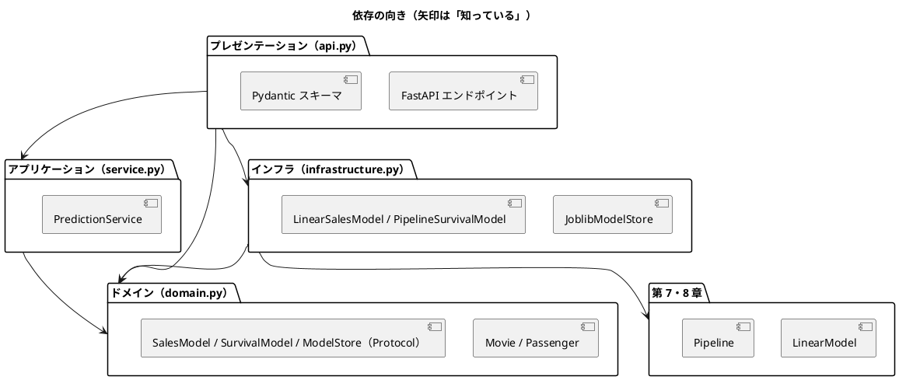

# 第 15 章: 機械学習 API とモジュール設計

## 15.1 はじめに

ここまでの章で、映画の興行収入を予測する線形回帰（第 7 章）と、乗客の生存を予測する前処理パイプライン（第 8 章）を作りました。どちらも学習と評価はできますが、使えるのは Python のコードを書ける人だけです。

最終章では、この 2 つのモデルを **HTTP API** として公開します。API にすれば、Web アプリケーションや別の言語のプログラムから、JSON を送るだけで予測を使えます。

API を作るときに問題になるのは、機械学習そのものより **周辺の設計** です。

- HTTP の処理とモデルの処理が 1 つの関数に混ざると、どちらかを変えるたびに全体を壊しやすい
- 学習済みモデルのファイルが無いと、テストが動かない
- 不正な入力やモデルの読み込み失敗を、利用者にどう伝えるか

この章では、[FastAPI](https://fastapi.tiangolo.com/) と Pydantic を使い、処理を **レイヤー（層）** に分けて、これらの問題を TDD で解いていきます。

## 15.2 レイヤードアーキテクチャ

### 4 つの層と依存の向き

API を次の 4 つの層に分けます。

| 層 | モジュール | 責務 | 知っているもの |
|----|-----------|------|--------------|
| ドメイン | `domain.py` | 入力（映画・乗客）と予測結果の型、「モデル」と「モデルの置き場」の約束（Protocol） | 何も知らない |
| アプリケーション | `service.py` | 予測のユースケース（モデルを読み込んで予測する、ヘルスチェック） | ドメイン |
| インフラ | `infrastructure.py` | joblib によるモデルの保存・読み込みと、第 7・8 章のモデルをドメインの約束に合わせるアダプター | ドメイン、第 7・8 章 |
| プレゼンテーション | `api.py` | FastAPI のエンドポイント、Pydantic による入力の検証、HTTP ステータスコード | ドメイン、アプリケーション、インフラ |



ポイントは、**アプリケーション層がインフラ層を知らない** ことです。`PredictionService` は「モデルの置き場（`ModelStore`）から読み込んで予測する」ことしか知らず、それが joblib のファイルなのか、テスト用のスタブなのかを気にしません。依存の向きを内側（ドメイン）に向けておくと、外側の実装を差し替えても内側は変わりません。

参照元の Wiki 記事は Application／Service／Domain の 3 層で、モデルの読み込みをドメイン層に置いていました。本章では、ファイルの読み込みという技術的な詳細をインフラ層に切り出し、ドメイン層を Protocol（約束）だけにしています。

### インサイドアウトで進める

TDD の進め方には、外側（API）から作る **アウトサイドイン** と、内側（ドメイン・サービス）から作る **インサイドアウト** があります。この章ではインサイドアウトを選びます。

- 予測の中身（第 7・8 章のモデル）はすでにテスト済みで、新しく決めるのは「それをどう包むか」だけ
- 内側の層は外側を知らないので、内側から作ると、各段階でスタブが最小限で済む
- API の形（URL・JSON）は、内側の型が決まってから Pydantic に写すだけになる

## 15.3 TODO リストの作成

**TODO リスト**:

- [ ] 予測サービス（アプリケーション層）
  - [ ] 映画の特徴量から興行収入を予測する
  - [ ] 生存確率が 0.5 以上なら生存、未満なら死亡と予測する
  - [ ] モデルが無ければ `ModelNotFoundError` を送出する
  - [ ] ヘルスチェックで各モデルを読み込めるかを返す
- [ ] モデルの保存と読み込み（インフラ層）
  - [ ] 保存した線形回帰モデルを読み込んで興行収入を予測する
  - [ ] 保存したパイプラインを読み込んで生存確率を予測する
  - [ ] モデルファイルが無ければ `ModelNotFoundError` を送出する
- [ ] HTTP API（プレゼンテーション層）
  - [ ] `POST /cinema/sales` で興行収入を返す
  - [ ] `POST /survived` で生存の予測と確率を返す
  - [ ] `GET /health` でモデルの状態を返す
  - [ ] 不正な入力には 422 を返す
  - [ ] モデルが無ければ 503 を返す
- [ ] 実データで学習したモデルで API を動かす

## 15.4 予測サービスを作る

### スタブで置き場を差し替える

最初のテストは「映画の特徴量から興行収入を予測する」です。本物のモデルの代わりに、`sns1` に 1000 を足すだけの **スタブ** を使います。スタブなら学習データもモデルファイルも要らず、期待値も一目で分かります。

```python
# test/chapter15/test_service.py
from lib.chapter15.domain import Movie, SalesPrediction
from lib.chapter15.service import PredictionService


class StubSalesModel:
    def predict_sales(self, movie: Movie) -> float:
        return 1000.0 + movie.sns1


class StubModelStore:
    def load_sales_model(self) -> StubSalesModel:
        return StubSalesModel()


class TestPredictSales:
    def test_映画の特徴量から興行収入を予測する(self) -> None:
        service = PredictionService(StubModelStore())

        prediction = service.predict_sales(
            Movie(sns1=200.0, sns2=500.0, actor=3000.0, original=1)
        )

        assert prediction == SalesPrediction(sales=1200.0)
```

```bash
uv run pytest test/chapter15
```

```text
E   ModuleNotFoundError: No module named 'lib.chapter15.domain'
!!!!!!!!!!!!!!!!!!! Interrupted: 1 error during collection !!!!!!!!!!!!!!!!!!!!
============================== 1 error in 0.12s ===============================
```

### Protocol で「約束」だけを書く

ドメイン層に、入力と予測結果の型、そしてモデルとモデルの置き場の **約束** を書きます。

```python
# lib/chapter15/domain.py
from dataclasses import dataclass
from typing import Protocol


@dataclass(frozen=True)
class Movie:
    sns1: float
    sns2: float
    actor: float
    original: int


@dataclass(frozen=True)
class SalesPrediction:
    sales: float


class SalesModel(Protocol):
    def predict_sales(self, movie: Movie) -> float: ...


class ModelStore(Protocol):
    def load_sales_model(self) -> SalesModel: ...
```

```python
# lib/chapter15/service.py
from lib.chapter15.domain import ModelStore, Movie, SalesPrediction


class PredictionService:
    def __init__(self, store: ModelStore) -> None:
        self.store = store

    def predict_sales(self, movie: Movie) -> SalesPrediction:
        model = self.store.load_sales_model()
        return SalesPrediction(sales=model.predict_sales(movie))
```

```text
============================== 1 passed in 0.02s ==============================
```

`typing.Protocol` は、「このメソッドを持っていれば、この型として扱ってよい」という約束を表します（構造的部分型）。テストの `StubModelStore` は `ModelStore` を継承していませんが、`load_sales_model` を持っているので、mypy は `PredictionService(StubModelStore())` を正しい呼び出しとして受け入れます。

```bash
uv run mypy lib/chapter15 test/chapter15
```

```text
Success: no issues found in 5 source files
```

継承を強制しないので、第 7・8 章のクラスにも、テストのスタブにも手を加えずに約束を満たせます。

### 生存予測・モデルが無い場合・ヘルスチェック

残りのサービスの振る舞いをテストに書きます。モデルが無い状態を表す `EmptyModelStore` も用意します。

```python
class StubSurvivalModel:
    def survival_probability(self, passenger: Passenger) -> float:
        return 0.8 if passenger.sex == "female" else 0.2


class StubModelStore:
    def load_sales_model(self) -> StubSalesModel:
        return StubSalesModel()

    def load_survival_model(self) -> StubSurvivalModel:
        return StubSurvivalModel()


class EmptyModelStore:
    def load_sales_model(self) -> StubSalesModel:
        raise ModelNotFoundError("cinema")

    def load_survival_model(self) -> StubSurvivalModel:
        raise ModelNotFoundError("survived")
```

```python
    def test_モデルが無ければModelNotFoundErrorを送出する(self) -> None:
        service = PredictionService(EmptyModelStore())

        with pytest.raises(ModelNotFoundError, match="cinema"):
            service.predict_sales(MOVIE)


class TestPredictSurvival:
    def test_生存確率が05以上なら生存と予測する(self) -> None:
        service = PredictionService(StubModelStore())

        prediction = service.predict_survival(PASSENGER)

        assert prediction == SurvivalPrediction(survived=True, probability=0.8)

    def test_生存確率が05未満なら死亡と予測する(self) -> None:
        service = PredictionService(StubModelStore())

        prediction = service.predict_survival(
            Passenger(
                pclass=3,
                sex="male",
                age=30.0,
                sib_sp=0,
                parch=0,
                fare=8.0,
                embarked="S",
            )
        )

        assert prediction == SurvivalPrediction(survived=False, probability=0.2)


class TestHealth:
    def test_モデルを読み込めればそれぞれTrueを返す(self) -> None:
        service = PredictionService(StubModelStore())

        assert service.health() == {"cinema": True, "survived": True}

    def test_モデルが無ければそれぞれFalseを返す(self) -> None:
        service = PredictionService(EmptyModelStore())

        assert service.health() == {"cinema": False, "survived": False}
```

```text
E   ImportError: cannot import name 'ModelNotFoundError' from 'lib.chapter15.domain'
```

生存予測のモデルには「0 か 1 か」ではなく **生存確率** を返させ、「0.5 以上なら生存」という判定はドメインに置きます。判定の基準は機械学習のモデルではなく、API を提供する側が決める業務のルールだからです。

```python
SURVIVAL_THRESHOLD = 0.5


@dataclass(frozen=True)
class SurvivalPrediction:
    survived: bool
    probability: float

    @classmethod
    def from_probability(cls, probability: float) -> "SurvivalPrediction":
        return cls(survived=probability >= SURVIVAL_THRESHOLD, probability=probability)
```

```python
    def predict_survival(self, passenger: Passenger) -> SurvivalPrediction:
        model = self.store.load_survival_model()
        return SurvivalPrediction.from_probability(
            model.survival_probability(passenger)
        )

    def health(self) -> dict[str, bool]:
        return {
            "cinema": self._can_load(self.store.load_sales_model),
            "survived": self._can_load(self.store.load_survival_model),
        }
```

`_can_load` は最初、引数を `object` にして `# type: ignore` で型エラーを抑えていました。テストが通ったあとのリファクタリングで、「引数なしで呼べる関数」を表す `Callable[[], object]` に直し、`type: ignore` を無くしています。

```python
    @staticmethod
    def _can_load(load: Callable[[], object]) -> bool:
        try:
            load()
        except ModelNotFoundError:
            return False
        return True
```

```text
============================== 6 passed in 0.04s ==============================
```

## 15.5 モデルを保存して読み込む

### アダプターで第 7・8 章のモデルを約束に合わせる

インフラ層では、joblib でモデルをファイルに保存・読み込みします。第 7 章の `LinearModel` は `predict(DataFrame)`、第 8 章の `Pipeline` は `predict_proba(DataFrame)` という形なので、ドメインの `predict_sales(Movie)`・`survival_probability(Passenger)` とは合いません。そこで、間を取り持つ **アダプター** を作ります。

テストでは、係数を手で決めた `LinearModel` と、架空の 8 人の乗客で学習したパイプラインを使います。どちらも学習データ無しで動きます。

```python
# test/chapter15/test_infrastructure.py
class TestSalesModel:
    def test_保存した線形回帰モデルを読み込んで興行収入を予測する(
        self, tmp_path: Path
    ) -> None:
        store = JoblibModelStore(tmp_path)
        store.save_sales_model(
            LinearModel(
                intercept=100.0,
                coefficients={"SNS1": 1.0, "SNS2": 2.0, "actor": 0.5, "original": 10.0},
            )
        )

        model = store.load_sales_model()

        movie = Movie(sns1=10.0, sns2=20.0, actor=100.0, original=1)
        assert model.predict_sales(movie) == pytest.approx(210.0)
```

期待値の 210 は、100 + 1.0 × 10 + 2.0 × 20 + 0.5 × 100 + 10.0 × 1 を手で計算した値です。

```python
class TestSurvivalModel:
    def test_保存したパイプラインを読み込んで生存確率を予測する(
        self, tmp_path: Path
    ) -> None:
        store = JoblibModelStore(tmp_path)
        x, t = fictional_passengers()
        store.save_survival_model(
            build_pipeline(max_depth=2, class_weight=None).fit(x, t)
        )

        model = store.load_survival_model()

        assert model.survival_probability(passenger("female")) == pytest.approx(1.0)
        assert model.survival_probability(passenger("male")) == pytest.approx(0.0)
```

`fictional_passengers` は、女性 4 人が生存・男性 4 人が死亡という架空のデータです。性別だけで完全に分かれるので、女性の生存確率は 1.0、男性は 0.0 になります。

```text
E   ModuleNotFoundError: No module named 'lib.chapter15.infrastructure'
```

```python
class LinearSalesModel:
    def __init__(self, model: LinearModel) -> None:
        self.model = model

    def predict_sales(self, movie: Movie) -> float:
        row = pd.DataFrame(
            [(movie.sns1, movie.sns2, movie.actor, movie.original)],
            columns=CINEMA_FEATURES,
        )
        return float(self.model.predict(row)[0])


class PipelineSurvivalModel:
    def __init__(self, pipeline: Pipeline) -> None:
        self.pipeline = pipeline

    def survival_probability(self, passenger: Passenger) -> float:
        row = pd.DataFrame(
            [
                (
                    passenger.pclass,
                    passenger.sex,
                    passenger.age,
                    passenger.sib_sp,
                    passenger.parch,
                    passenger.fare,
                    passenger.embarked,
                )
            ],
            columns=SURVIVED_FEATURES,
        )
        survived_index = list(self.pipeline.classes_).index(1)
        return float(self.pipeline.predict_proba(row)[0][survived_index])
```

- 列名は第 7・8 章の `FEATURES` をそのまま使います。列の並びを二重に管理しないためです
- `predict_proba` は正解ラベルの種類ごとの確率を並べて返します。並び順は `classes_` で決まるので、ラベル 1（生存）の位置を探してから取り出します
- 乗客の年齢・乗船港が `None` のときは、第 8 章のパイプラインが訓練データの値で補完します

### 型が無い値の扱い

`joblib.load` の戻り値には型情報がありません。最初は読み込み処理の戻り値を `object` にしていたところ、mypy が次のエラーを出しました。

```text
lib\chapter15\infrastructure.py:62: error: Argument 1 to "LinearSalesModel" has incompatible type "object"; expected "LinearModel"  [arg-type]
```

`object` は「何でもよいが、何もできない」型なので、`LinearModel` を要求する引数に渡せません。`joblib.load` が実際に返すのは型の分からない値なので、実態に合わせて `Any` にしました（パイプラインの方は、scikit-learn に型情報が無く、もともと `Any` 扱いだったためエラーになりませんでした）。

### モデルの置き場

モデルの保存と読み込みをまとめた `JoblibModelStore` です。ここでは、15.6 節で行うエラー応答の改善（例外にモデル名だけを持たせる）を反映した最終形を示します。

```python
class JoblibModelStore:
    def __init__(self, model_dir: Path) -> None:
        self.model_dir = model_dir

    def save_sales_model(self, model: LinearModel) -> None:
        self._save(model, SALES_MODEL)

    def save_survival_model(self, pipeline: Pipeline) -> None:
        self._save(pipeline, SURVIVAL_MODEL)

    def load_sales_model(self) -> LinearSalesModel:
        return LinearSalesModel(self._load(SALES_MODEL))

    def load_survival_model(self) -> PipelineSurvivalModel:
        return PipelineSurvivalModel(self._load(SURVIVAL_MODEL))

    def _model_file(self, model: str) -> Path:
        return self.model_dir / f"{model}.joblib"

    def _save(self, model_object: object, model: str) -> None:
        self.model_dir.mkdir(parents=True, exist_ok=True)
        joblib.dump(model_object, self._model_file(model))

    def _load(self, model: str) -> Any:
        model_file = self._model_file(model)
        if not model_file.exists():
            raise ModelNotFoundError(model)
        return joblib.load(model_file)
```

`JoblibModelStore` の `load_sales_model` は `LinearSalesModel` を返しますが、`ModelStore` の約束は `SalesModel` を返すことです。`LinearSalesModel` は `predict_sales` を持っているので、ここでも Protocol によって約束を満たしています。

モデルはリクエストのたびにファイルから読み込みます。学習し直したモデルをサーバーの再起動なしで使える反面、リクエストごとにファイルを読む分だけ遅くなります。アクセスが多い API では、読み込んだモデルをキャッシュする設計を検討してください。

```text
============================= 10 passed in 1.30s ==============================
```

## 15.6 FastAPI でエンドポイントを作る

### 依存性注入でサービスを差し替える

FastAPI には、エンドポイントの引数に必要な部品を渡す **依存性注入**（`Depends`）の仕組みがあります。エンドポイントは `get_service` からサービスを受け取るようにし、テストでは `app.dependency_overrides` でスタブのサービスに差し替えます。

サービスのテストで使ったスタブを API のテストでも使うので、リファクタリングとして `test/chapter15/stubs.py` に移しました。

```python
# test/chapter15/test_api.py
@pytest.fixture
def client() -> Iterator[TestClient]:
    app.dependency_overrides[get_service] = lambda: PredictionService(StubModelStore())
    yield TestClient(app)
    app.dependency_overrides.clear()


@pytest.fixture
def client_without_models() -> Iterator[TestClient]:
    app.dependency_overrides[get_service] = lambda: PredictionService(EmptyModelStore())
    yield TestClient(app)
    app.dependency_overrides.clear()


class TestCinemaSales:
    def test_映画の特徴量を送ると予測した興行収入を返す(
        self, client: TestClient
    ) -> None:
        response = client.post("/cinema/sales", json=MOVIE_JSON)

        assert response.status_code == 200
        assert response.json() == {"sales": 1200.0}
```

`TestClient` は、サーバーを起動せずに FastAPI のアプリケーションへ HTTP リクエストを送れるテスト用のクライアントです。フィクスチャの `yield` の後で差し替えを元に戻すので、ほかのテストに影響しません。

```text
E   ModuleNotFoundError: No module named 'lib.chapter15.api'
```

最小限の実装です。

```python
class MovieRequest(BaseModel):
    sns1: float
    sns2: float
    actor: float
    original: int


class SalesResponse(BaseModel):
    sales: float


def get_service() -> PredictionService:
    return PredictionService(JoblibModelStore(MODEL_DIR))


Service = Annotated[PredictionService, Depends(get_service)]

app = FastAPI(title="機械学習 API")


@app.post("/cinema/sales")
def predict_sales(request: MovieRequest, service: Service) -> SalesResponse:
    prediction = service.predict_sales(Movie(**request.model_dump()))
    return SalesResponse(sales=prediction.sales)
```

- リクエストの JSON は Pydantic の `MovieRequest` に変換され、`model_dump()` で辞書にしてからドメインの `Movie` を作ります。Pydantic のモデルをドメインに持ち込まないのは、HTTP の形とドメインの型を別々に変えられるようにするためです
- `Annotated[PredictionService, Depends(get_service)]` を `Service` という名前にしておくと、エンドポイントごとに `Depends` を書かずに済みます

```text
======================== 1 passed, 2 warnings in 1.83s ========================
```

2 件の警告は、FastAPI の `TestClient` が内部で使う Starlette と httpx の組み合わせに対する非推奨の警告で、この章のコードとは関係ありません。

### 入力の検証とエラー応答をテストに書く

残りのエンドポイントと、不正な入力・モデルが無い場合のテストを追加します。

```python
    @pytest.mark.parametrize(
        ("field", "value"),
        [("sns1", -1.0), ("actor", "多い"), ("original", 2)],
    )
    def test_特徴量が不正なら422を返す(
        self, client: TestClient, field: str, value: object
    ) -> None:
        response = client.post("/cinema/sales", json={**MOVIE_JSON, field: value})

        assert response.status_code == 422

    def test_モデルが無ければ503を返す(self, client_without_models: TestClient) -> None:
        response = client_without_models.post("/cinema/sales", json=MOVIE_JSON)

        assert response.status_code == 503
        assert response.json() == {"detail": "cinema"}
```

乗客の API（`/survived`）とヘルスチェック（`/health`）のテストも同じ形で書きました（完成コードを参照）。実行すると、12 件が失敗しました。

```text
E       assert 200 == 422
E        +  where 200 = <Response [200 OK]>.status_code
E       lib.chapter15.domain.ModelNotFoundError: cinema
E       assert 404 == 200
E        +  where 404 = <Response [404 Not Found]>.status_code
======================== 12 failed, 2 passed in 2.25s =========================
```

失敗の内容から、次のことが分かります。

- **`actor` に文字列を送るテストは、実装前から通った**。型ヒントの `float` だけで、Pydantic が数値でない値を 422 で拒否します
- **負の値や範囲外の値（`sns1` が −1、`original` が 2）は 200 で通ってしまう**。型は合っているので、値の範囲は別に指定する必要があります
- **モデルが無いと例外がそのまま外に出る**
- **まだ作っていないエンドポイントは 404**

### Pydantic で値の範囲を検証する

`Field(ge=0)` で「0 以上」、`Literal` で「決まった値のどれか」を指定します。

```python
class MovieRequest(BaseModel):
    sns1: float = Field(ge=0, description="公開後 1 か月の SNS 投稿数")
    sns2: float = Field(ge=0, description="公開後 2 か月の SNS 投稿数")
    actor: float = Field(ge=0, description="主演俳優の昨年のメディア露出度")
    original: Literal[0, 1] = Field(description="原作があれば 1")


class PassengerRequest(BaseModel):
    pclass: Literal[1, 2, 3]
    sex: Literal["male", "female"]
    age: float | None = Field(default=None, ge=0)
    sib_sp: int = Field(ge=0, description="同乗した兄弟・配偶者の数")
    parch: int = Field(ge=0, description="同乗した親・子の数")
    fare: float = Field(ge=0)
    embarked: Literal["C", "Q", "S"] | None = None
```

`age` と `embarked` は既定値を `None` にしたので、JSON で省略できます。欠損値の補完は第 8 章のパイプラインに任せます。

### ドメインの例外を HTTP のステータスコードに変換する

`ModelNotFoundError` はドメインの例外で、HTTP を知りません。HTTP のステータスコードに変換するのはプレゼンテーション層の仕事です。FastAPI の `exception_handler` で、この例外を **503 Service Unavailable**（一時的に提供できない）に変換します。

```python
@app.exception_handler(ModelNotFoundError)
def model_not_found(request: Request, error: ModelNotFoundError) -> JSONResponse:
    return JSONResponse(status_code=503, content={"detail": str(error)})


@app.get("/health")
def health(service: Service) -> HealthResponse:
    models = service.health()
    return HealthResponse(
        status="ok" if all(models.values()) else "degraded", models=models
    )
```

```text
============================= 24 passed in 1.75s ==============================
```

### 利用者に内部のパスを見せない

実際にサーバーを起動し、モデルファイルを一時的に別名にして 503 を確かめたところ、応答にサーバー内部のファイルの **絶対パス** がそのまま含まれていました（次の出力は、パスの途中を `...` で省略しています）。最初のインフラ層は、例外のメッセージにファイルのパスを入れていたためです。

```text
{"detail":"学習済みモデルが見つかりません: C:\\Users\\...\\apps\\python\\model\\cinema.joblib"}
HTTP 503
```

内部のディレクトリ構成を外部に見せると、攻撃の手がかりを与えてしまいます。テストを先に直し、例外は **モデル名だけ** を持ち、応答にはパスを含めないことを約束させます。

```python
    def test_モデルファイルが無ければModelNotFoundErrorを送出する(
        self, tmp_path: Path
    ) -> None:
        store = JoblibModelStore(tmp_path)

        with pytest.raises(ModelNotFoundError) as error:
            store.load_sales_model()

        assert error.value.model == "cinema"
        assert str(tmp_path) not in str(error.value)
```

```python
    def test_モデルが無ければ503を返す(self, client_without_models: TestClient) -> None:
        response = client_without_models.post("/cinema/sales", json=MOVIE_JSON)

        assert response.status_code == 503
        assert response.json() == {"detail": "学習済みモデル cinema が見つかりません"}
```

```text
E       AssertionError: assert {'detail': 'cinema'} == {'detail': '学...ema が見つかりません'}
E       AttributeError: 'ModelNotFoundError' object has no attribute 'model'
======================== 4 failed, 26 passed in 1.82s =========================
```

例外にモデル名を持たせ、メッセージの組み立てをドメインにまとめます。インフラ層はファイル名をモデル名から作るようにして、例外にはモデル名だけを渡します（前の節の `JoblibModelStore` が、この修正を反映した形です）。

```python
class ModelNotFoundError(Exception):
    """学習済みモデルが見つからないときに送出する。"""

    def __init__(self, model: str) -> None:
        super().__init__(f"学習済みモデル {model} が見つかりません")
        self.model = model
```

```text
============================= 30 passed in 3.75s ==============================
```

## 15.7 実データで学習したモデルで動かす

### 学習と保存

第 7・8 章と同じ条件（テストデータの割合 0.2、シード 0、決定木の深さ 5、`class_weight="balanced"`）でモデルを学習し、保存する処理を作ります。

```python
# lib/chapter15/training.py
TEST_SIZE = 0.2
SEED = 0
MAX_DEPTH = 5


def train_and_save_models(data_directory: Path, store: JoblibModelStore) -> None:
    cinema = prepare_cinema(
        data_directory / "cinema.csv", test_size=TEST_SIZE, seed=SEED
    )
    store.save_sales_model(fit_linear_regression(cinema.x_train, cinema.t_train))

    x, t = split_features_and_target(load_survived(data_directory / "Survived.csv"))
    survived = split_train_test(x, t, test_size=TEST_SIZE, seed=SEED)
    pipeline = build_pipeline(max_depth=MAX_DEPTH, class_weight="balanced")
    store.save_survival_model(pipeline.fit(survived.x_train, survived.t_train))
```

### 統合テスト

ここまでのテストは、層ごとにスタブを使って切り離していました。**統合テスト** では、実データで学習したモデルをインフラ層で読み込み、サービス・API まで本物をつないで確かめます。学習は時間がかかるので、`scope="module"` のフィクスチャで 1 回だけ行います。

```python
@pytest.fixture(scope="module")
def model_dir(tmp_path_factory: pytest.TempPathFactory) -> Path:
    directory = tmp_path_factory.mktemp("model")
    train_and_save_models(data_dir(), JoblibModelStore(directory))
    return directory


@pytest.fixture
def client(model_dir: Path) -> Iterator[TestClient]:
    store = JoblibModelStore(model_dir)
    app.dependency_overrides[get_service] = lambda: PredictionService(store)
    yield TestClient(app)
    app.dependency_overrides.clear()


@requires_data("cinema.csv", "Survived.csv")
class TestTrainedModels:
    def test_学習した線形回帰モデルで興行収入を予測する(
        self, client: TestClient
    ) -> None:
        movie = {"sns1": 200.0, "sns2": 500.0, "actor": 3000.0, "original": 1}

        response = client.post("/cinema/sales", json=movie)

        assert response.status_code == 200
        assert response.json()["sales"] == pytest.approx(7895.31, abs=0.01)
```

期待値の 7895.31 は、最初に仮の値を書いてテストを失敗させ、その失敗で表示された実測値から決めました。

```text
E       assert 7895.310057750588 == 7547.24 ± 0.01
```

仮の値のままでは意味が無いので、実測値が妥当かを第 7 章の係数（切片 6323.61、SNS1 1.2576、SNS2 0.4736、actor 0.2728、original 264.9150）で手計算して確かめました。6323.61 + 1.2576 × 200 + 0.4736 × 500 + 0.2728 × 3000 + 264.9150 × 1 ≈ 7895.25 となり、係数の丸めの範囲で一致します。このように、実装が先にある値を固定するテストは **特性テスト** と呼ばれ、以後の変更で結果が変わっていないことを守ります。

生存予測の統合テストでは、3 等客室の男性の生存確率 0.1622 を同じように実測して固定しました（完成コードを参照）。

### 学習してサーバーを起動する

`python -m lib.chapter15` で学習済みモデルを `apps/python/model/` に保存します。このディレクトリは `.gitignore` の対象です。

表示のテスト（`TestMain`）は、`main` の実装より先に書いて、モジュールが無いことによる失敗を確認してから実装しました。

```bash
uv run python -m lib.chapter15
```

```text
学習済みモデルを保存しました: cinema.joblib, survived.joblib
API の起動: uv run uvicorn lib.chapter15.api:app --port 8015
```

表示されたコマンドで API サーバーを起動します。

```bash
uv run uvicorn lib.chapter15.api:app --port 8015
```

```text
INFO:     Started server process [4664]
INFO:     Waiting for application startup.
INFO:     Application startup complete.
INFO:     Uvicorn running on http://127.0.0.1:8015 (Press CTRL+C to quit)
```

別のターミナルから `curl` でリクエストを送ります。

```bash
curl -s http://127.0.0.1:8015/health
```

```text
{"status":"ok","models":{"cinema":true,"survived":true}}
```

```bash
curl -s -X POST http://127.0.0.1:8015/cinema/sales -H "Content-Type: application/json" -d '{"sns1": 200, "sns2": 500, "actor": 3000, "original": 1}'
```

```text
{"sales":7895.310057750588}
```

```bash
curl -s -X POST http://127.0.0.1:8015/survived -H "Content-Type: application/json" -d '{"pclass": 1, "sex": "female", "sib_sp": 0, "parch": 0, "fare": 50.0}'
```

```text
{"survived":true,"probability":1.0}
```

```bash
curl -s -X POST http://127.0.0.1:8015/survived -H "Content-Type: application/json" -d '{"pclass": 3, "sex": "male", "sib_sp": 0, "parch": 0, "fare": 8.0, "embarked": "S"}'
```

```text
{"survived":false,"probability":0.16222686375321368}
```

`pclass` に 4 を送ると、Pydantic がどの項目のどこが不正かを返します。

```bash
curl -s -w "\nHTTP %{http_code}\n" -X POST http://127.0.0.1:8015/survived -H "Content-Type: application/json" -d '{"pclass": 4, "sex": "male", "sib_sp": 0, "parch": 0, "fare": 8.0}'
```

```text
{"detail":[{"type":"literal_error","loc":["body","pclass"],"msg":"Input should be 1, 2 or 3","input":4,"ctx":{"expected":"1, 2 or 3"}}]}
HTTP 422
```

`model/cinema.joblib` を一時的に別名にしてから送ると、ヘルスチェックは `degraded` になり、興行収入の予測は 503 を返します。応答に内部のパスは含まれません。

```text
{"status":"degraded","models":{"cinema":false,"survived":true}}
```

```text
{"detail":"学習済みモデル cinema が見つかりません"}
HTTP 503
```

FastAPI は型ヒントと Pydantic のスキーマから API の仕様（OpenAPI）を自動で作ります。サーバーを起動したまま、ブラウザで `http://127.0.0.1:8015/docs` を開くと、エンドポイントの一覧と入力項目の説明（`Field` の `description`）を確認し、その場でリクエストを試せます。

確認が終わったら、サーバーを起動したターミナルで Ctrl+C を押して停止します。

### テストの実行結果

```bash
uv run pytest --cov=lib/chapter15 --cov-report=term-missing test/chapter15
```

```text
Name                              Stmts   Miss  Cover   Missing
---------------------------------------------------------------
lib\chapter15\__init__.py             0      0   100%
lib\chapter15\__main__.py            10      0   100%
lib\chapter15\api.py                 49      0   100%
lib\chapter15\domain.py              39      0   100%
lib\chapter15\infrastructure.py      45      0   100%
lib\chapter15\service.py             20      0   100%
lib\chapter15\training.py            15      0   100%
---------------------------------------------------------------
TOTAL                               178      0   100%
```

```text
======================= 30 passed, 2 warnings in 1.98s ========================
```

データが無い環境では、統合テストの 5 件がスキップされます。スタブと架空のデータを使った 25 件は、学習データが無くても動きます。

```text
================== 25 passed, 5 skipped, 2 warnings in 1.85s ==================
```

`get_service` の既定の中身（`apps/python/model/` を使うこと）はテストで差し替えていたので、カバレッジが 100% になりませんでした。既定の置き場を確かめるテストを 1 件加えて埋めています。

<details>
<summary>この章の完成コード（lib/chapter15/domain.py）</summary>

```python
from dataclasses import dataclass
from typing import Protocol

SURVIVAL_THRESHOLD = 0.5


@dataclass(frozen=True)
class Movie:
    sns1: float
    sns2: float
    actor: float
    original: int


@dataclass(frozen=True)
class Passenger:
    pclass: int
    sex: str
    age: float | None
    sib_sp: int
    parch: int
    fare: float
    embarked: str | None


@dataclass(frozen=True)
class SalesPrediction:
    sales: float


@dataclass(frozen=True)
class SurvivalPrediction:
    survived: bool
    probability: float

    @classmethod
    def from_probability(cls, probability: float) -> "SurvivalPrediction":
        return cls(survived=probability >= SURVIVAL_THRESHOLD, probability=probability)


class ModelNotFoundError(Exception):
    """学習済みモデルが見つからないときに送出する。"""

    def __init__(self, model: str) -> None:
        super().__init__(f"学習済みモデル {model} が見つかりません")
        self.model = model


class SalesModel(Protocol):
    def predict_sales(self, movie: Movie) -> float: ...


class SurvivalModel(Protocol):
    def survival_probability(self, passenger: Passenger) -> float: ...


class ModelStore(Protocol):
    def load_sales_model(self) -> SalesModel: ...

    def load_survival_model(self) -> SurvivalModel: ...
```

</details>

<details>
<summary>この章の完成コード（lib/chapter15/service.py）</summary>

```python
from collections.abc import Callable

from lib.chapter15.domain import (
    ModelNotFoundError,
    ModelStore,
    Movie,
    Passenger,
    SalesPrediction,
    SurvivalPrediction,
)


class PredictionService:
    def __init__(self, store: ModelStore) -> None:
        self.store = store

    def predict_sales(self, movie: Movie) -> SalesPrediction:
        model = self.store.load_sales_model()
        return SalesPrediction(sales=model.predict_sales(movie))

    def predict_survival(self, passenger: Passenger) -> SurvivalPrediction:
        model = self.store.load_survival_model()
        return SurvivalPrediction.from_probability(
            model.survival_probability(passenger)
        )

    def health(self) -> dict[str, bool]:
        return {
            "cinema": self._can_load(self.store.load_sales_model),
            "survived": self._can_load(self.store.load_survival_model),
        }

    @staticmethod
    def _can_load(load: Callable[[], object]) -> bool:
        try:
            load()
        except ModelNotFoundError:
            return False
        return True
```

</details>

<details>
<summary>この章の完成コード（lib/chapter15/infrastructure.py）</summary>

```python
from pathlib import Path
from typing import Any

import joblib
import pandas as pd
from sklearn.pipeline import Pipeline

from lib.chapter07.cinema_regression import FEATURES as CINEMA_FEATURES
from lib.chapter07.cinema_regression import LinearModel
from lib.chapter08.survived_classifier import FEATURES as SURVIVED_FEATURES
from lib.chapter15.domain import ModelNotFoundError, Movie, Passenger

SALES_MODEL = "cinema"
SURVIVAL_MODEL = "survived"


class LinearSalesModel:
    def __init__(self, model: LinearModel) -> None:
        self.model = model

    def predict_sales(self, movie: Movie) -> float:
        row = pd.DataFrame(
            [(movie.sns1, movie.sns2, movie.actor, movie.original)],
            columns=CINEMA_FEATURES,
        )
        return float(self.model.predict(row)[0])


class PipelineSurvivalModel:
    def __init__(self, pipeline: Pipeline) -> None:
        self.pipeline = pipeline

    def survival_probability(self, passenger: Passenger) -> float:
        row = pd.DataFrame(
            [
                (
                    passenger.pclass,
                    passenger.sex,
                    passenger.age,
                    passenger.sib_sp,
                    passenger.parch,
                    passenger.fare,
                    passenger.embarked,
                )
            ],
            columns=SURVIVED_FEATURES,
        )
        survived_index = list(self.pipeline.classes_).index(1)
        return float(self.pipeline.predict_proba(row)[0][survived_index])


class JoblibModelStore:
    def __init__(self, model_dir: Path) -> None:
        self.model_dir = model_dir

    def save_sales_model(self, model: LinearModel) -> None:
        self._save(model, SALES_MODEL)

    def save_survival_model(self, pipeline: Pipeline) -> None:
        self._save(pipeline, SURVIVAL_MODEL)

    def load_sales_model(self) -> LinearSalesModel:
        return LinearSalesModel(self._load(SALES_MODEL))

    def load_survival_model(self) -> PipelineSurvivalModel:
        return PipelineSurvivalModel(self._load(SURVIVAL_MODEL))

    def _model_file(self, model: str) -> Path:
        return self.model_dir / f"{model}.joblib"

    def _save(self, model_object: object, model: str) -> None:
        self.model_dir.mkdir(parents=True, exist_ok=True)
        joblib.dump(model_object, self._model_file(model))

    def _load(self, model: str) -> Any:
        model_file = self._model_file(model)
        if not model_file.exists():
            raise ModelNotFoundError(model)
        return joblib.load(model_file)
```

</details>

<details>
<summary>この章の完成コード（lib/chapter15/api.py）</summary>

```python
from pathlib import Path
from typing import Annotated, Literal

from fastapi import Depends, FastAPI, Request
from fastapi.responses import JSONResponse
from pydantic import BaseModel, Field

from lib.chapter15.domain import ModelNotFoundError, Movie, Passenger
from lib.chapter15.infrastructure import JoblibModelStore
from lib.chapter15.service import PredictionService

MODEL_DIR = Path(__file__).resolve().parents[2] / "model"


class MovieRequest(BaseModel):
    sns1: float = Field(ge=0, description="公開後 1 か月の SNS 投稿数")
    sns2: float = Field(ge=0, description="公開後 2 か月の SNS 投稿数")
    actor: float = Field(ge=0, description="主演俳優の昨年のメディア露出度")
    original: Literal[0, 1] = Field(description="原作があれば 1")


class SalesResponse(BaseModel):
    sales: float


class PassengerRequest(BaseModel):
    pclass: Literal[1, 2, 3]
    sex: Literal["male", "female"]
    age: float | None = Field(default=None, ge=0)
    sib_sp: int = Field(ge=0, description="同乗した兄弟・配偶者の数")
    parch: int = Field(ge=0, description="同乗した親・子の数")
    fare: float = Field(ge=0)
    embarked: Literal["C", "Q", "S"] | None = None


class SurvivalResponse(BaseModel):
    survived: bool
    probability: float


class HealthResponse(BaseModel):
    status: Literal["ok", "degraded"]
    models: dict[str, bool]


def get_service() -> PredictionService:
    return PredictionService(JoblibModelStore(MODEL_DIR))


Service = Annotated[PredictionService, Depends(get_service)]

app = FastAPI(title="機械学習 API")


@app.exception_handler(ModelNotFoundError)
def model_not_found(request: Request, error: ModelNotFoundError) -> JSONResponse:
    return JSONResponse(status_code=503, content={"detail": str(error)})


@app.get("/health")
def health(service: Service) -> HealthResponse:
    models = service.health()
    return HealthResponse(
        status="ok" if all(models.values()) else "degraded", models=models
    )


@app.post("/cinema/sales")
def predict_sales(request: MovieRequest, service: Service) -> SalesResponse:
    prediction = service.predict_sales(Movie(**request.model_dump()))
    return SalesResponse(sales=prediction.sales)


@app.post("/survived")
def predict_survival(request: PassengerRequest, service: Service) -> SurvivalResponse:
    prediction = service.predict_survival(Passenger(**request.model_dump()))
    return SurvivalResponse(
        survived=prediction.survived, probability=prediction.probability
    )
```

</details>

<details>
<summary>この章の完成コード（lib/chapter15/__main__.py）</summary>

```python
from pathlib import Path

from lib.chapter15.api import MODEL_DIR
from lib.chapter15.infrastructure import (
    SALES_MODEL,
    SURVIVAL_MODEL,
    JoblibModelStore,
)
from lib.chapter15.training import train_and_save_models
from lib.dataset import data_dir

PORT = 8015


def main(model_dir: Path = MODEL_DIR) -> None:
    train_and_save_models(data_dir(), JoblibModelStore(model_dir))
    print(
        f"学習済みモデルを保存しました: {SALES_MODEL}.joblib, {SURVIVAL_MODEL}.joblib"
    )
    print(f"API の起動: uv run uvicorn lib.chapter15.api:app --port {PORT}")


if __name__ == "__main__":
    main()
```

</details>

<details>
<summary>この章のテストコード（test/chapter15/test_api.py）</summary>

```python
from collections.abc import Iterator

import pytest
from fastapi.testclient import TestClient

from lib.chapter15.api import MODEL_DIR, app, get_service
from lib.chapter15.infrastructure import JoblibModelStore
from lib.chapter15.service import PredictionService
from test.chapter15.stubs import EmptyModelStore, StubModelStore

MOVIE_JSON = {"sns1": 200.0, "sns2": 500.0, "actor": 3000.0, "original": 1}
PASSENGER_JSON = {
    "pclass": 1,
    "sex": "female",
    "age": None,
    "sib_sp": 0,
    "parch": 0,
    "fare": 50.0,
    "embarked": "C",
}


@pytest.fixture
def client() -> Iterator[TestClient]:
    app.dependency_overrides[get_service] = lambda: PredictionService(StubModelStore())
    yield TestClient(app)
    app.dependency_overrides.clear()


@pytest.fixture
def client_without_models() -> Iterator[TestClient]:
    app.dependency_overrides[get_service] = lambda: PredictionService(EmptyModelStore())
    yield TestClient(app)
    app.dependency_overrides.clear()


class TestCinemaSales:
    def test_映画の特徴量を送ると予測した興行収入を返す(
        self, client: TestClient
    ) -> None:
        response = client.post("/cinema/sales", json=MOVIE_JSON)

        assert response.status_code == 200
        assert response.json() == {"sales": 1200.0}

    @pytest.mark.parametrize(
        ("field", "value"),
        [("sns1", -1.0), ("actor", "多い"), ("original", 2)],
    )
    def test_特徴量が不正なら422を返す(
        self, client: TestClient, field: str, value: object
    ) -> None:
        response = client.post("/cinema/sales", json={**MOVIE_JSON, field: value})

        assert response.status_code == 422

    def test_モデルが無ければ503を返す(self, client_without_models: TestClient) -> None:
        response = client_without_models.post("/cinema/sales", json=MOVIE_JSON)

        assert response.status_code == 503
        assert response.json() == {"detail": "学習済みモデル cinema が見つかりません"}


class TestSurvived:
    def test_乗客の特徴量を送ると生存の予測と確率を返す(
        self, client: TestClient
    ) -> None:
        response = client.post("/survived", json=PASSENGER_JSON)

        assert response.status_code == 200
        assert response.json() == {"survived": True, "probability": 0.8}

    def test_年齢と乗船港は省略できる(self, client: TestClient) -> None:
        passenger = {
            key: value
            for key, value in PASSENGER_JSON.items()
            if key not in ("age", "embarked")
        }

        response = client.post("/survived", json=passenger)

        assert response.status_code == 200

    @pytest.mark.parametrize(
        ("field", "value"),
        [("pclass", 4), ("sex", "unknown"), ("embarked", "X"), ("fare", -5.0)],
    )
    def test_特徴量が不正なら422を返す(
        self, client: TestClient, field: str, value: object
    ) -> None:
        response = client.post("/survived", json={**PASSENGER_JSON, field: value})

        assert response.status_code == 422

    def test_モデルが無ければ503を返す(self, client_without_models: TestClient) -> None:
        response = client_without_models.post("/survived", json=PASSENGER_JSON)

        assert response.status_code == 503
        assert response.json() == {"detail": "学習済みモデル survived が見つかりません"}


class TestHealth:
    def test_すべてのモデルを読み込めればokを返す(self, client: TestClient) -> None:
        response = client.get("/health")

        assert response.status_code == 200
        assert response.json() == {
            "status": "ok",
            "models": {"cinema": True, "survived": True},
        }

    def test_読み込めないモデルがあればdegradedを返す(
        self, client_without_models: TestClient
    ) -> None:
        response = client_without_models.get("/health")

        assert response.status_code == 200
        assert response.json() == {
            "status": "degraded",
            "models": {"cinema": False, "survived": False},
        }


class TestGetService:
    def test_既定ではappsのmodelディレクトリのモデルを使う(self) -> None:
        service = get_service()

        assert isinstance(service.store, JoblibModelStore)
        assert service.store.model_dir == MODEL_DIR
        assert MODEL_DIR.parts[-3:] == ("apps", "python", "model")
```

</details>

<details>
<summary>この章のテストコード（test/chapter15/test_integration.py）</summary>

```python
from collections.abc import Iterator
from pathlib import Path

import pytest
from fastapi.testclient import TestClient

from lib.chapter15.__main__ import main
from lib.chapter15.api import app, get_service
from lib.chapter15.infrastructure import JoblibModelStore
from lib.chapter15.service import PredictionService
from lib.chapter15.training import train_and_save_models
from lib.dataset import data_dir
from test.markers import requires_data


@pytest.fixture(scope="module")
def model_dir(tmp_path_factory: pytest.TempPathFactory) -> Path:
    directory = tmp_path_factory.mktemp("model")
    train_and_save_models(data_dir(), JoblibModelStore(directory))
    return directory


@pytest.fixture
def client(model_dir: Path) -> Iterator[TestClient]:
    store = JoblibModelStore(model_dir)
    app.dependency_overrides[get_service] = lambda: PredictionService(store)
    yield TestClient(app)
    app.dependency_overrides.clear()


@requires_data("cinema.csv", "Survived.csv")
class TestTrainedModels:
    def test_学習したモデルを保存するとヘルスチェックがokになる(
        self, client: TestClient
    ) -> None:
        response = client.get("/health")

        assert response.json()["status"] == "ok"

    def test_学習した線形回帰モデルで興行収入を予測する(
        self, client: TestClient
    ) -> None:
        movie = {"sns1": 200.0, "sns2": 500.0, "actor": 3000.0, "original": 1}

        response = client.post("/cinema/sales", json=movie)

        assert response.status_code == 200
        assert response.json()["sales"] == pytest.approx(7895.31, abs=0.01)

    def test_学習したパイプラインで乗客の生存を予測する(
        self, client: TestClient
    ) -> None:
        passenger = {
            "pclass": 1,
            "sex": "female",
            "sib_sp": 0,
            "parch": 0,
            "fare": 50.0,
        }

        response = client.post("/survived", json=passenger)

        assert response.status_code == 200
        assert response.json()["survived"] is True

    def test_学習したパイプラインで死亡と生存確率を予測する(
        self, client: TestClient
    ) -> None:
        passenger = {
            "pclass": 3,
            "sex": "male",
            "sib_sp": 0,
            "parch": 0,
            "fare": 8.0,
            "embarked": "S",
        }

        response = client.post("/survived", json=passenger)

        assert response.json() == {
            "survived": False,
            "probability": pytest.approx(0.1622, abs=0.0001),
        }


@requires_data("cinema.csv", "Survived.csv")
class TestMain:
    def test_実行するとモデルを保存して起動方法を表示する(
        self, tmp_path: Path, capsys: pytest.CaptureFixture[str]
    ) -> None:
        main(model_dir=tmp_path)

        assert (tmp_path / "cinema.joblib").exists()
        assert (tmp_path / "survived.joblib").exists()
        assert capsys.readouterr().out == (
            "学習済みモデルを保存しました: cinema.joblib, survived.joblib\n"
            "API の起動: uv run uvicorn lib.chapter15.api:app --port 8015\n"
        )
```

</details>

## 15.8 まとめ

この章では、第 7・8 章のモデルを HTTP API として公開し、その周辺の設計を TDD で固めました。

1. **レイヤードアーキテクチャ** — ドメイン・アプリケーション・インフラ・プレゼンテーションに分け、依存の向きを内側に向けた
2. **Protocol による差し替え** — 継承を強制しない約束で、サービスをスタブでも本物のモデルでも動かせるようにした
3. **アダプター** — 第 7・8 章のモデルに手を加えず、ドメインの約束に合わせた
4. **入力の検証とエラーの変換** — Pydantic で値の範囲まで検証し、ドメインの例外を HTTP の 503 に変換した。応答に内部のパスを出さないこともテストで約束した
5. **テストの粒度の使い分け** — 学習データ無しで動く単体テストと、実データのモデルをつなぐ統合テストを分け、統合テストはデータが無ければスキップした

### シリーズの振り返り

第 1 章の「20 代ならきのこ派」という手書きのルールから始まり、ここまで次の順に進んできました。

| 部 | 章 | 学んだこと |
|----|----|-----------|
| 第 1 部 | 第 1〜3 章 | データを読み込み、前処理し、決定木をデータから学ばせる基本サイクル |
| 第 2 部 | 第 4〜6 章 | その過程を支えるバージョン管理・静的解析・CI |
| 第 3 部 | 第 7〜9 章 | 回帰と、現実のデータの前処理 |
| 第 4 部 | 第 10〜12 章 | 複数のモデルの比較と評価 |
| 第 5 部 | 第 13〜15 章 | 正解の無いデータの扱いと、モデルを API として届けるまで |

どの章でも、アルゴリズムはまずテストで仕様を決めて自作し、次にライブラリと突き合わせました。自作で原理を、突き合わせでライブラリの振る舞いを確かめるという進め方は、言語が変わっても同じです。

### 次の言語へ

本シリーズは、Python に続いて Kotlin と TypeScript で同じ章構成を書き起こす予定です（[執筆計画](../outline.md)）。Kotlin 版では data class と sealed interface によるモデルの表現、Kotlin Notebook による探索を、TypeScript 版では機械学習ライブラリが限られる環境での自作と、型による列スキーマの表現を扱います。同じ題材を別の言語で書くと、Python では意識しなかった型やデータ構造の違いが見えてきます。
