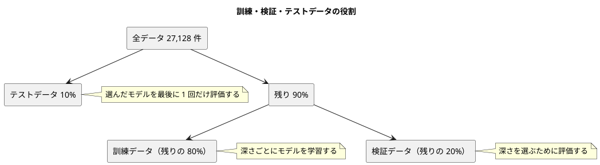

# 付録 A: 総合演習（Bank）

## A.1 はじめに

この付録は、第 1〜12 章で身につけた手法を組み合わせる総合演習です。前半の演習問題は言語に依存しないので、ほかの言語で学んでいる読者も同じ問題に取り組めます。後半は Python による解答例です。

解答例では、新しいアルゴリズムはほとんど作りません。これまでの章で作った部品を **組み合わせる** ことに集中します。

| 使う部品 | 作った章 |
|---------|---------|
| シード付きの訓練・テストデータ分割 `split_train_test` | 第 2 章 |
| グループ別の中央値で補完する `GroupMedianImputer` | 第 8 章 |
| 訓練データのカテゴリでそろえるダミー変数化 `DummyEncoder` | 第 8 章 |
| 混同行列・適合率・再現率・F 値 | 第 11 章 |

## A.2 演習問題

### 課題の背景

ある銀行が、キャンペーンで電話や資料送付による営業をしています。過去の顧客データから、どの顧客が商品を購入してくれるかを事前に予測し、営業の優先順位を付けたいと考えています。

### データ

`Bank.csv` には 27,128 件の顧客データがあります。

| 列 | 意味 | 型 |
|----|------|-----|
| id | 顧客 ID | 整数 |
| age | 年齢 | 整数 |
| job | 職業 | カテゴリ（12 種類） |
| marital | 婚姻状況 | カテゴリ（3 種類） |
| education | 学歴 | カテゴリ（4 種類） |
| default | 債務不履行の有無 | カテゴリ（yes / no） |
| amount | 口座残高 | 小数 |
| housing | 住宅ローンの有無 | カテゴリ（yes / no） |
| loan | 個人ローンの有無 | カテゴリ（yes / no） |
| contact | 連絡方法 | カテゴリ（3 種類） |
| day | 最終接触日 | 整数 |
| month | 最終接触月 | カテゴリ（12 種類） |
| duration | 最終接触時間（秒） | 小数（7,044 件が欠損） |
| campaign | キャンペーン中の接触回数 | 整数 |
| previous | キャンペーン以前の接触回数 | 整数 |
| y | 購入したか（1: 購入、0: 未購入） | 整数 |

購入した顧客は 8,683 件、購入しなかった顧客は 18,445 件で、クラスが不均衡です。

### 問題

1. **手法を選ぶ** — この課題は、分類と回帰のどちらでしょうか。
2. **データを 3 つに分ける** — データを訓練データ・検証データ・テストデータに分けてください。テストデータは全体の 10%、検証データは残りの 20% とします。テストデータは最後の評価まで一切使いません。
3. **前処理とモデルを組む** — `duration` の欠損値と、文字列のカテゴリ列を扱えるように前処理し、決定木で分類するモデルを作ってください。前処理に使う値（補完値やカテゴリの種類）は訓練データだけから求めます。
4. **検証データでモデルを選ぶ** — 決定木の深さを 1〜15 で変えて、検証データで評価し、深さを 1 つ選んでください。クラス不均衡を考えて、正解率だけでなく F 値でも比べます。
5. **テストデータで 1 回だけ評価する** — 選んだ深さで、訓練データと検証データを合わせて学習し直し、テストデータで評価してください。

### ヒント

- 問題 1: 予測したい `y` は 0 か 1 の 2 値です
- 問題 2: 訓練・テストデータへの分割を 2 回繰り返せば 3 つに分けられます
- 問題 3: `duration` は住宅ローン（`housing`）と個人ローン（`loan`）の有無で中央値が違います。第 8 章のグループ別補完が使えます。検証データやテストデータに、訓練データに無いカテゴリが現れても予測できるようにします
- 問題 4: 検証データで深さを選ぶのは、テストデータを「モデル選択に使っていない、本当に未知のデータ」として残すためです

## A.3 解答例（Python）の方針

### 問題 1

`y` は購入したかどうかの 2 値なので、**分類** です。

### 3 つのデータの役割



第 2 章ではデータを訓練とテストの 2 つに分けました。テストデータの結果を見て深さを選ぶと、テストデータに合わせてモデルを選んだことになり、テストデータはもう「未知のデータ」ではなくなります。そこで、深さを選ぶための検証データを別に用意します。

### TODO リスト

**TODO リスト**:

- [ ] データを訓練・検証・テストデータに分ける
  - [ ] テスト 10%、残りの 20% を検証データにする
  - [ ] すべての行を重複なく 3 つのどれかに入れる
- [ ] 前処理とモデルをパイプラインにまとめる
  - [ ] 欠損値と訓練データに無いカテゴリがあっても予測できる
- [ ] 正解率・適合率・再現率・F 値をまとめて求める
- [ ] 検証データの F 値が最も大きい深さを選ぶ
  - [ ] F 値が同じなら浅い木を選ぶ
- [ ] 深さごとに訓練データと検証データの指標を求める
- [ ] 訓練データと検証データを合わせて学習し直す
- [ ] 実データで深さを選び、テストデータで評価する

## A.4 データを 3 つに分ける

第 2 章の `split_train_test` を 2 回使います。1 回目でテストデータを切り出し、2 回目で残りを訓練データと検証データに分けます。

```python
# test/appendix_a/test_bank_exercise.py
def numbered_dataset(size: int) -> tuple[pd.DataFrame, pd.Series]:
    x = pd.DataFrame({"x": range(size)})
    t = pd.Series([i % 2 for i in range(size)])
    return x, t


class TestSplitThreeWay:
    def test_テスト10パーセントと残りの検証20パーセントに分ける(self) -> None:
        x, t = numbered_dataset(100)

        split = split_three_way(x, t, test_size=0.1, validation_size=0.2, seed=0)

        assert (len(split.x_train), len(split.x_valid), len(split.x_test)) == (
            72,
            18,
            10,
        )

    def test_3つのデータに重複なくすべての行を分ける(self) -> None:
        x, t = numbered_dataset(100)

        split = split_three_way(x, t, test_size=0.1, validation_size=0.2, seed=0)

        rows = [
            set(split.x_train["x"]),
            set(split.x_valid["x"]),
            set(split.x_test["x"]),
        ]
        assert set().union(*rows) == set(range(100))
        assert sum(len(r) for r in rows) == 100
```

100 件からテストデータ 10 件を切り出し、残り 90 件の 20% の 18 件を検証データ、残りの 72 件を訓練データにします。

```text
E   ModuleNotFoundError: No module named 'lib.appendix_a.bank_exercise'
```

組み合わせるだけなので、明白な実装で Green にしました。

```python
@dataclass(frozen=True)
class ThreeWaySplit:
    x_train: pd.DataFrame
    x_valid: pd.DataFrame
    x_test: pd.DataFrame
    t_train: pd.Series
    t_valid: pd.Series
    t_test: pd.Series


def split_three_way(
    x: pd.DataFrame,
    t: pd.Series,
    test_size: float,
    validation_size: float,
    seed: int,
) -> ThreeWaySplit:
    outer = split_train_test(x, t, test_size=test_size, seed=seed)
    inner = split_train_test(
        outer.x_train, outer.t_train, test_size=validation_size, seed=seed
    )
    return ThreeWaySplit(
        x_train=inner.x_train,
        x_valid=inner.x_test,
        x_test=outer.x_test,
        t_train=inner.t_train,
        t_valid=inner.t_test,
        t_test=outer.t_test,
    )
```

## A.5 前処理とモデルをパイプラインにまとめる

### テスト用の顧客データを作る

Bank のデータは列が多いので、テストごとにすべての列を書くと、何を確かめたいテストなのかが埋もれます。すべての列に既定値を持たせ、テストでは **変えたい列だけ** を書くヘルパーを用意します。

```python
DEFAULT_CUSTOMER: dict[str, object] = {
    "age": 40,
    "job": "a",
    "marital": "single",
    "education": "primary",
    "default": "no",
    "amount": 100.0,
    "housing": "no",
    "loan": "no",
    "contact": "c",
    "month": "jan",
    "duration": 300.0,
    "campaign": 1,
    "previous": 0,
}


def customers(*overrides: dict[str, object]) -> pd.DataFrame:
    return pd.DataFrame([{**DEFAULT_CUSTOMER, **override} for override in overrides])
```

`{**DEFAULT_CUSTOMER, **override}` は、既定値の辞書に上書き用の辞書を重ねた新しい辞書を作ります。後に書いた辞書の値が優先されます。

最初はすべての列の値をタプルで並べて書いていましたが、Ruff のフォーマッターが 1 つの値を 1 行に展開し、このテスト 1 つが 90 行近くになって読めなくなりました。そこでリファクタリングして、このヘルパーに置き換えています。

### パイプラインのテスト

訓練データに無い職業（`z`）・婚姻状況・月を持ち、`duration` が欠損している顧客でも予測できることを確かめます。

```python
class TestBuildPipeline:
    def test_欠損値と訓練データに無いカテゴリがあっても予測できる(self) -> None:
        x = customers(
            {"job": "a", "housing": "yes", "duration": 200.0},
            {"job": "b", "duration": None},
            {"job": "a", "housing": "yes", "loan": "yes", "duration": 400.0},
            {"job": "b", "loan": "yes", "duration": 500.0},
        )
        t = pd.Series([0, 0, 1, 1])
        unseen = customers(
            {"job": "z", "marital": "divorced", "month": "dec", "duration": None}
        )

        pipeline = build_pipeline(max_depth=2).fit(x, t)

        assert len(pipeline.predict(unseen)) == 1
```

### 第 8 章の部品を組み合わせる

第 8 章で Survived 用に作った `GroupMedianImputer` と `DummyEncoder` は、列名を引数で受け取る汎用の部品でした。Bank の列名を渡すだけで再利用できます。

```python
TARGET = "y"
UNUSED = ("id", "day")
TEST_SIZE = 0.1
VALIDATION_SIZE = 0.2
CATEGORICAL = (
    "job",
    "marital",
    "education",
    "default",
    "housing",
    "loan",
    "contact",
    "month",
)


def build_pipeline(max_depth: int) -> Pipeline:
    return Pipeline(
        [
            ("duration", GroupMedianImputer(column="duration", by=("housing", "loan"))),
            ("dummies", DummyEncoder(columns=CATEGORICAL)),
            (
                "model",
                DecisionTreeClassifier(
                    max_depth=max_depth, class_weight="balanced", random_state=0
                ),
            ),
        ]
    )
```

- `duration` は、訓練データの `housing` × `loan` ごとの中央値で補完します。補完値は `fit` のときに訓練データから求めるので、テストデータの情報は混ざりません
- `DummyEncoder` は `fit` のときの列の並びを覚えておき、`transform` で知らないカテゴリの列を落とし、足りない列を 0 で埋めます。訓練データに無いカテゴリが来ても列の数がずれません
- クラス不均衡に対応するため、第 8 章と同じく `class_weight="balanced"` を指定します
- `id` は顧客を区別するだけの番号、`day` は日付の数字で購入との関係を説明しにくいため、特徴量から外します（`UNUSED`）

書籍の解答例は、`housing` × `loan` ごとの中央値を集計して、その数値をコードに直接書いています。この解答例では、中央値を `fit` のたびに訓練データから求めるようにしました。データの分け方が変わっても、補完値が自動で追従します。

```text
============================== 3 passed in 1.50s ==============================
```

## A.6 評価指標をまとめて深さを選ぶ

### 指標をまとめる

第 11 章の評価関数を組み合わせ、4 つの指標を 1 つのデータクラスで返します。

```python
class TestScore:
    def test_正解率_適合率_再現率_F値をまとめて求める(self) -> None:
        scores = score(actual=[1, 1, 0, 0], predicted=[1, 0, 1, 0])

        assert scores == Scores(accuracy=0.5, precision=0.5, recall=0.5, f1=0.5)
```

### 深さを選ぶ

選び方のルールは、学習とは切り離してテストします。指標の結果を手で作り、「F 値が最大」「同じなら浅い木」を確かめます。

```python
def result(max_depth: int, f1: float) -> DepthResult:
    scores = Scores(accuracy=0.0, precision=0.0, recall=0.0, f1=f1)
    return DepthResult(max_depth=max_depth, train=scores, valid=scores)


class TestSelectBest:
    def test_検証データのF値が最も大きい深さを選ぶ(self) -> None:
        results = [result(1, 0.6), result(2, 0.8), result(3, 0.7)]

        assert select_best(results).max_depth == 2

    def test_F値が同じなら浅い木を選ぶ(self) -> None:
        results = [result(3, 0.8), result(2, 0.8), result(4, 0.7)]

        assert select_best(results).max_depth == 2
```

```text
E   ImportError: cannot import name 'DepthResult' from 'lib.appendix_a.bank_exercise'
```

```python
@dataclass(frozen=True)
class Scores:
    accuracy: float
    precision: float
    recall: float
    f1: float


@dataclass(frozen=True)
class DepthResult:
    max_depth: int
    train: Scores
    valid: Scores


def score(actual: npt.ArrayLike, predicted: npt.ArrayLike) -> Scores:
    cm = confusion_matrix(np.asarray(actual), np.asarray(predicted), positive=1)
    return Scores(
        accuracy=accuracy(actual, predicted),
        precision=precision(cm),
        recall=recall(cm),
        f1=f1_score(cm),
    )


def select_best(results: list[DepthResult]) -> DepthResult:
    return max(results, key=lambda r: (r.valid.f1, -r.max_depth))
```

`max` の `key` にタプル `(F 値, -深さ)` を渡すと、まず F 値で比べ、F 値が同じなら `-深さ` が大きい方、つまり浅い木が選ばれます。

```text
============================== 6 passed in 1.76s ==============================
```

## A.7 深さごとに評価し、最後に学習し直す

深さごとに訓練データで学習して検証データで評価する処理と、選んだ深さで訓練データと検証データを合わせて学習し直す処理です。テストには、12 件の架空の顧客を 3 つに分けた小さなデータを使います。

```python
def small_split() -> ThreeWaySplit:
    x = customers(
        *[
            {
                "age": 30 + i,
                "job": ["a", "b"][i % 2],
                "housing": ["yes", "no", "no"][i % 3],
                "duration": 100.0 + 50 * i,
            }
            for i in range(12)
        ]
    )
    t = pd.Series([0, 1] * 6)
    return split_three_way(x, t, test_size=0.25, validation_size=0.25, seed=0)


class TestTuneMaxDepth:
    def test_深さごとに訓練データと検証データの指標を求める(self) -> None:
        results = tune_max_depth(small_split(), max_depths=[1, 2, 3])

        assert [r.max_depth for r in results] == [1, 2, 3]


class TestFitFinal:
    def test_訓練データと検証データを合わせて学習する(self) -> None:
        split = small_split()

        pipeline = fit_final(split, max_depth=2)

        tree = pipeline.named_steps["model"].tree_
        assert tree.n_node_samples[0] == len(split.x_train) + len(split.x_valid)
```

`fit_final` のテストでは、学習した決定木の根の節に入ったデータの件数（`tree_.n_node_samples[0]`）が、訓練データと検証データの件数の合計と一致することを確かめています。

```python
def tune_max_depth(split: ThreeWaySplit, max_depths: list[int]) -> list[DepthResult]:
    results = []
    for max_depth in max_depths:
        pipeline = build_pipeline(max_depth).fit(split.x_train, split.t_train)
        results.append(
            DepthResult(
                max_depth=max_depth,
                train=score(split.t_train, pipeline.predict(split.x_train)),
                valid=score(split.t_valid, pipeline.predict(split.x_valid)),
            )
        )
    return results


def fit_final(split: ThreeWaySplit, max_depth: int) -> Pipeline:
    x = pd.concat([split.x_train, split.x_valid])
    t = pd.concat([split.t_train, split.t_valid])
    return build_pipeline(max_depth).fit(x, t)
```

深さを選んだあとは、検証データも学習に使って構いません。検証データの役割は「深さを選ぶこと」で、選び終えたあとは学習データを増やしたほうがモデルの性能が上がりやすいためです。テストデータだけは、ここでも学習に使いません。

## A.8 実データで解く

### 実行する

```python
# lib/appendix_a/__main__.py
from lib.appendix_a.bank_exercise import (
    fit_final,
    prepare_bank,
    score,
    select_best,
    tune_max_depth,
)
from lib.dataset import data_dir

SEED = 0
MAX_DEPTHS = list(range(1, 16))


def main() -> None:
    split = prepare_bank(data_dir() / "Bank.csv", seed=SEED)
    print(
        f"訓練データ: {len(split.x_train)} 件, 検証データ: {len(split.x_valid)} 件, "
        f"テストデータ: {len(split.x_test)} 件"
    )
    print("深さ\t訓練 正解率\t検証 正解率\t検証 再現率\t検証 F値")
    results = tune_max_depth(split, MAX_DEPTHS)
    for r in results:
        print(
            f"{r.max_depth}\t{r.train.accuracy:.4f}\t{r.valid.accuracy:.4f}\t"
            f"{r.valid.recall:.4f}\t{r.valid.f1:.4f}"
        )
    best = select_best(results)
    pipeline = fit_final(split, best.max_depth)
    test = score(split.t_test, pipeline.predict(split.x_test))
    print(f"\n選んだ深さ: {best.max_depth}")
    print(
        f"テストデータ: 正解率 {test.accuracy:.4f}, 適合率 {test.precision:.4f}, "
        f"再現率 {test.recall:.4f}, F値 {test.f1:.4f}"
    )


if __name__ == "__main__":
    main()
```

```bash
uv run python -m lib.appendix_a
```

```text
訓練データ: 19532 件, 検証データ: 4883 件, テストデータ: 2713 件
深さ	訓練 正解率	検証 正解率	検証 再現率	検証 F値
1	0.7478	0.7354	0.6906	0.6330
2	0.7478	0.7354	0.6906	0.6330
3	0.7511	0.7479	0.7874	0.6736
4	0.7495	0.7540	0.8803	0.7028
5	0.7719	0.7755	0.8797	0.7214
6	0.7796	0.7745	0.8760	0.7196
7	0.8290	0.8126	0.8122	0.7412
8	0.8414	0.8161	0.8301	0.7489
9	0.8594	0.8212	0.7998	0.7472
10	0.8699	0.8112	0.8140	0.7401
11	0.8911	0.8235	0.7991	0.7494
12	0.9005	0.8073	0.7979	0.7323
13	0.9205	0.8079	0.7756	0.7273
14	0.9337	0.8036	0.7663	0.7205
15	0.9457	0.8024	0.7557	0.7164

選んだ深さ: 11
テストデータ: 正解率 0.8293, 適合率 0.7088, 再現率 0.8259, F値 0.7629
```

### 結果を読む

- **過学習**: 訓練データの正解率は深さとともに上がり続け、深さ 15 では 0.9457 になります。一方、検証データの F 値は深さ 11 の 0.7494 を頂点に下がっていきます。第 3 章の iris と同じ傾向です
- **正解率と再現率の違い**: 深さ 4〜6 は検証データの再現率が 0.88 前後と高く、購入する顧客の取りこぼしは少ない代わりに、正解率は 0.75〜0.78 にとどまります。営業先の候補を広く拾いたいのか、外れを減らしたいのかで、選ぶべき深さは変わります。この解答例では両者のバランスを取る F 値で選びました
- **検証データ 1 回での比較の限界**: 選ばれた深さ 11（F 値 0.7494）と深さ 8（F 値 0.7489）の差は 0.0005 しかありません。検証データの分け方が少し変われば、選ばれる深さも入れ替わりうる差です。より確かに選ぶには、第 11 章の K 分割交差検証で深さごとの F 値を平均して比べます
- **テストデータでの評価**: 選んだ深さで学習し直したモデルは、テストデータで正解率 0.8293、F 値 0.7629 でした。テストデータはここで初めて使ったので、この値が未知のデータに対する性能の見積もりになります

### 実データのテスト

```python
@requires_data("Bank.csv")
class TestBankData:
    def test_実データを訓練_検証_テストデータに分ける(self) -> None:
        split = prepare_bank(data_dir() / "Bank.csv", seed=0)

        assert (len(split.x_train), len(split.x_valid), len(split.x_test)) == (
            19532,
            4883,
            2713,
        )
        assert "id" not in split.x_train.columns
        assert "day" not in split.x_train.columns

    def test_実行すると深さの選択とテストデータの評価を表示する(
        self, capsys: pytest.CaptureFixture[str]
    ) -> None:
        main()

        lines = capsys.readouterr().out.splitlines()
        assert lines[-2:] == [
            "選んだ深さ: 11",
            "テストデータ: 正解率 0.8293, 適合率 0.7088, 再現率 0.8259, F値 0.7629",
        ]
```

`prepare_bank` と `main` は、実データで結果を確かめながら書いたので、これらのテストは Red を経ずに通っています。実行結果を固定し、前の章の部品を変更したときに結果が変わったことに気づけるようにするためのテストです。

```bash
uv run pytest test/appendix_a
```

```text
============================= 10 passed in 6.08s ==============================
```

データが無い環境では、実データのテスト 2 件がスキップされます。

```text
======================== 8 passed, 2 skipped in 1.46s =========================
```

<details>
<summary>解答例の完成コード（lib/appendix_a/bank_exercise.py）</summary>

```python
from dataclasses import dataclass
from pathlib import Path

import numpy as np
import numpy.typing as npt
import pandas as pd
from sklearn.pipeline import Pipeline
from sklearn.tree import DecisionTreeClassifier

from lib.chapter02.iris_preprocessing import split_train_test
from lib.chapter08.survived_classifier import DummyEncoder, GroupMedianImputer
from lib.chapter11.evaluation import (
    accuracy,
    confusion_matrix,
    f1_score,
    precision,
    recall,
)

TARGET = "y"
UNUSED = ("id", "day")
TEST_SIZE = 0.1
VALIDATION_SIZE = 0.2
CATEGORICAL = (
    "job",
    "marital",
    "education",
    "default",
    "housing",
    "loan",
    "contact",
    "month",
)


def build_pipeline(max_depth: int) -> Pipeline:
    return Pipeline(
        [
            ("duration", GroupMedianImputer(column="duration", by=("housing", "loan"))),
            ("dummies", DummyEncoder(columns=CATEGORICAL)),
            (
                "model",
                DecisionTreeClassifier(
                    max_depth=max_depth, class_weight="balanced", random_state=0
                ),
            ),
        ]
    )


@dataclass(frozen=True)
class ThreeWaySplit:
    x_train: pd.DataFrame
    x_valid: pd.DataFrame
    x_test: pd.DataFrame
    t_train: pd.Series
    t_valid: pd.Series
    t_test: pd.Series


def split_three_way(
    x: pd.DataFrame,
    t: pd.Series,
    test_size: float,
    validation_size: float,
    seed: int,
) -> ThreeWaySplit:
    outer = split_train_test(x, t, test_size=test_size, seed=seed)
    inner = split_train_test(
        outer.x_train, outer.t_train, test_size=validation_size, seed=seed
    )
    return ThreeWaySplit(
        x_train=inner.x_train,
        x_valid=inner.x_test,
        x_test=outer.x_test,
        t_train=inner.t_train,
        t_valid=inner.t_test,
        t_test=outer.t_test,
    )


@dataclass(frozen=True)
class Scores:
    accuracy: float
    precision: float
    recall: float
    f1: float


@dataclass(frozen=True)
class DepthResult:
    max_depth: int
    train: Scores
    valid: Scores


def score(actual: npt.ArrayLike, predicted: npt.ArrayLike) -> Scores:
    cm = confusion_matrix(np.asarray(actual), np.asarray(predicted), positive=1)
    return Scores(
        accuracy=accuracy(actual, predicted),
        precision=precision(cm),
        recall=recall(cm),
        f1=f1_score(cm),
    )


def select_best(results: list[DepthResult]) -> DepthResult:
    return max(results, key=lambda r: (r.valid.f1, -r.max_depth))


def tune_max_depth(split: ThreeWaySplit, max_depths: list[int]) -> list[DepthResult]:
    results = []
    for max_depth in max_depths:
        pipeline = build_pipeline(max_depth).fit(split.x_train, split.t_train)
        results.append(
            DepthResult(
                max_depth=max_depth,
                train=score(split.t_train, pipeline.predict(split.x_train)),
                valid=score(split.t_valid, pipeline.predict(split.x_valid)),
            )
        )
    return results


def fit_final(split: ThreeWaySplit, max_depth: int) -> Pipeline:
    x = pd.concat([split.x_train, split.x_valid])
    t = pd.concat([split.t_train, split.t_valid])
    return build_pipeline(max_depth).fit(x, t)


def prepare_bank(csv_file: Path, seed: int) -> ThreeWaySplit:
    df = pd.read_csv(csv_file)
    x = df.drop(columns=[*UNUSED, TARGET])
    return split_three_way(
        x, df[TARGET], test_size=TEST_SIZE, validation_size=VALIDATION_SIZE, seed=seed
    )
```

</details>

## A.9 さらに取り組む課題

- **K 分割交差検証で深さを選ぶ**: 第 11 章の `k_fold` と `cross_validate` を使い、訓練データと検証データを合わせたデータで深さごとの F 値の平均を求めて、選ばれる深さが変わるか確かめてください
- **ほかのモデルと比べる**: 第 10 章のロジスティック回帰やランダムフォレストを同じ手順で評価し、決定木と比べてください。数値の列が多いモデルでは、第 9 章の標準化も必要になります
- **特徴量を作る**: `duration` と `housing` の組み合わせなど、交互作用の特徴量（第 9 章）を加えて、検証データの F 値が上がるか確かめてください。上がったかどうかは、テストデータではなく検証データで判断します

## A.10 まとめ

この付録では、これまでの章の部品を組み合わせて、1 つの分類問題を最後まで解きました。

1. **部品の再利用** — 分割（第 2 章）、補完とダミー変数化（第 8 章）、評価指標（第 11 章）を、変更せずに組み合わせた
2. **3 つのデータの役割分担** — 訓練データで学習し、検証データで深さを選び、テストデータは最後に 1 回だけ使った
3. **選び方のルールを学習と切り離してテストする** — `select_best` は手で作った指標の結果でテストした
4. **指標の選び方** — クラス不均衡のあるデータでは正解率だけでなく F 値で比べ、再現率とのバランスも読み取った
5. **検証の限界を知る** — 検証データ 1 回の比較では僅差の順位は揺らぐので、交差検証で確かめる余地を残した
