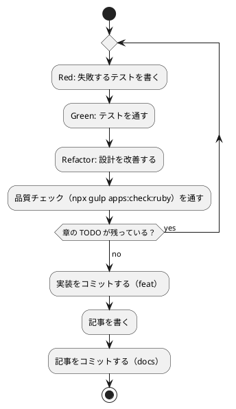

# 第 4 章: バージョン管理とデータ管理

## 4.1 はじめに

第 1 部では、TDD でデータを読み込み、前処理し、決定木で分類するプログラムを Ruby で作りました。第 2 部では、そのプログラムを「変更を楽に安全にできる」状態に保つための道具立てを、バージョン管理（第 4 章）、パッケージ管理と静的解析（第 5 章）、タスクランナーと CI/CD（第 6 章）の順に整えます。

この章ではバージョン管理を扱います。機械学習のプロジェクトでは、コードに加えて **学習データ** と **学習済みモデル** というファイルが登場します。これらをコードと同じようにコミットしてよいとは限りません。この章では、Git で何を管理し、何を管理しないか、そして実験の結果を再現できるようにするには何を固定すればよいかを学びます。

Git の使い方は言語に依存しないので、[Python 版の第 4 章](../python/04-version-control-and-data-management.md)・[Rust 版の第 4 章](../rust/04-version-control-and-data-management.md) と同じ構成で進めます。Ruby 版で注目してほしいのは次の 3 つです。

- **`.bundle/config` と `Gemfile.lock` をコミットする** — Bundler の設定と、解決済みの gem の版を両方ともリポジトリに入れます（4.4 節）
- **Minitest には `skip` がある** — Rust 版では、データが無いときに飛ばしたテストも `ok` と表示されました。Ruby 版ではスキップの件数がそのまま出ます（4.5 節）
- **乱数の並びは gem ではなく処理系が決める** — Rust 版の乱数は `rand` クレートの版に縛られていましたが、Ruby の `Random` と `Array#shuffle` は Ruby 本体の機能です。何が並びを固定しているのかが変わります（4.6 節）

## 4.2 コミットメッセージの重要性

コミット履歴は「なぜこの変更をしたのか」の記録です。機械学習のプロジェクトでは、「前処理を変えたら正解率が変わった」「ライブラリと予測が一致しない原因をテストに残した」といった変化の理由を、あとから追跡できることが特に重要になります。

コミットは次の 2 つを守ると追いやすくなります。

- **1 コミット 1 目的** — 機能追加と設定変更、実装と記事を 1 つのコミットに混ぜない
- **形式をそろえる** — 種類と対象がひと目で分かる書式でメッセージを書く

## 4.3 Conventional Commits

### フォーマット

本シリーズでは [Conventional Commits](https://www.conventionalcommits.org/ja/) の形式でコミットメッセージを書きます。

```text
<type>(<scope>): <subject>

<body>

<footer>
```

`scope` には変更の対象を書きます。本リポジトリでは、Ruby 版の実装なら `ruby`（`apps/ruby` に置いているため）、記事シリーズなら `getting-start-ml`、Nix の環境定義なら `nix`、ADR なら `adr` のように書きます。

### コミットタイプ

| type | 用途 |
|------|------|
| `feat` | 新機能（章の実装など） |
| `fix` | バグ修正 |
| `test` | テストの追加・修正 |
| `refactor` | 振る舞いを変えないコードの変更 |
| `docs` | ドキュメントだけの変更（記事など） |
| `build` | ビルドや検査の仕組みの変更（Rakefile・RuboCop の設定など） |
| `chore` | ツールや依存関係の変更 |
| `ci` | CI の設定の変更 |

### 実践例

本リポジトリの実際のコミット履歴から、Ruby 版のライブラリ選定から第 4 章の準備までを抜き出します（古い順）。

```bash
git log --oneline --reverse -- apps/ruby docs/article/getting-start-ml/ruby .github/workflows/ruby-ci.yml docs/adr/010-ruby-ml-libraries.md
```

```text
5bc9a77c docs(adr): 010 Ruby 版のライブラリの選定を提案する
d419839d feat(ruby): Ruby 版の雛形と学習データの置き場を求める処理を追加する
e1ea680c build(ruby): RuboCop と SimpleCov を rake check に組み込む
60c9dcd0 feat(ruby): 第 1 章のルールによる判定と正解率を実装する
6a5502e5 ci(ruby): Ruby CI と apps:check:ruby タスクを追加する
d7c1f7b6 docs(getting-start-ml): Ruby 版のトップと第 1 章を追加し、B50 の完了を記録する
5f95cfc7 feat(ruby): 第 2 章の表の読み込み・欠損値の補完・分割を実装する
09a41649 feat(ruby): 第 3 章の自作の決定木と Rumale との突き合わせを実装する
d127c509 test(ruby): シード 0 の並べ替えの並びをテストで固定する
```

type と scope だけで、どのコミットが何のための変更かを区別できます。ライブラリの選定（`docs(adr)`）、検査の仕組み（`build(ruby)`）、CI（`ci(ruby)`）、記事（`docs(getting-start-ml)`）が分かれているので、たとえば「実装だけを追いたい」ときは `feat(ruby)` のコミットだけを見れば済みます。

最後の `test(ruby)` は、この章のために足したテストです（4.6 節）。実装は変えずにテストだけを足したので、`feat` ではなく `test` にしています。

## 4.4 何をコミットし、何をコミットしないか

機械学習のプロジェクトには、コミットしてはいけないファイルが増えます。理由は大きく 3 つあります。

| 分類 | 例 | コミットしない理由 |
|------|-----|------------------|
| 再配布できないもの | 学習データ | ライセンスで利用者が限られている |
| 再生成できるもの | `vendor/bundle` の gem、`coverage/` の報告、学習済みモデル | 大きく、差分が読めず、コードと `Gemfile.lock` とデータから作り直せる |
| 秘匿すべきもの | `.env` の認証情報 | 漏洩すると取り返しがつかない |

### 学習データ

本シリーズの学習データは、書籍『スッキリわかる Python による機械学習入門』の配布データです。配布データの利用は書籍購入者に限られており、本リポジトリは公開されているので、データはコミットしません。ルートの `.gitignore` で、データの置き場所 `apps/data/` をまるごと除外しています。この設定は全言語版で共通です。

```text
# 学習データ（書籍購入者のみ利用可のため再配布しない。docs/article/getting-start-ml/outline.md を参照）
apps/data/
```

### Ruby プロジェクト固有のファイル

`apps/ruby/.gitignore` は 3 つです。

```text
# Bundler の gem の置き場
vendor/

# カバレッジの結果
coverage/

# 学習済みモデルの保存先（第 15 章）
model/
```

| パス | 中身 |
|------|------|
| `vendor/` | `bundle install` で入れた gem（`vendor/bundle`）。ネイティブ拡張をビルドした結果も入る |
| `coverage/` | SimpleCov の HTML の報告と、集計結果の `.resultset.json`（第 5 章） |
| `model/` | 学習済みモデルの保存先（第 15 章で使う） |

`vendor/` が必要なのは、第 1 章で `.bundle/config` に `BUNDLE_PATH: "vendor/bundle"` と書き、gem を **プロジェクトの中** に入れているからです。第 3 章までの時点で、43 個の gem が入った `vendor/bundle` は 45 MB ありました。

```bash
cd apps/ruby
du -sh vendor/bundle
```

```text
45M	vendor/bundle
```

Python 版の仮想環境（`.venv`）や Rust 版の `target/` と同じく、プロジェクトの中に置くぶん `.gitignore` に 1 行要ります。代わりに、システムの Ruby や、ほかのプロジェクトの gem と混ざりません。

| 言語版 | 依存の置き場所 | `.gitignore` に要るか |
|--------|--------------|--------------------|
| Ruby | `apps/ruby/vendor/bundle`（`.bundle/config` で指定） | 要る |
| Python | `apps/python/.venv` | 要る |
| Rust | `~/.cargo/registry`（ビルド成果物は `target/`） | `target/` だけ要る |

### .bundle/config をコミットするか

`.bundle/` は、多くの Ruby プロジェクトで `.gitignore` に入っています。Bundler が **その人の手元の設定**（たとえば `bundle config set --local without production`）を書き込む場所だからです。

本シリーズでは、`apps/ruby/.bundle/config` を **コミットしています**。中身は 1 行だけです。

```yaml
---
BUNDLE_PATH: "vendor/bundle"
```

これは個人の好みではなく「このプロジェクトでは gem をここに入れる」という取り決めで、CI のキャッシュ（第 6 章）もこの場所を前提にしています。読者がクローンした直後の `bundle install` で同じ場所に入るように、リポジトリに含めました。手元だけの設定を足したくなったら、`--local` ではなく環境変数（`BUNDLE_WITHOUT` など）で渡すと、このファイルを汚さずに済みます。

### Gemfile.lock をコミットするか

`Gemfile.lock` には、`Gemfile` に書いた gem とその依存（推移的依存）の **解決済みの版** が記録されます。第 3 章までの `apps/ruby/Gemfile.lock` には 42 個の gem が並んでいます。

```text
    rumale (2.2.0)
      numo-narray-alt (>= 0.9.10, < 0.12.0)
      rumale-clustering (~> 2.2.0)
      rumale-core (~> 2.2.0)
```

Rust 版では「ライブラリなら lock をコミットしない」という言い伝えとの兼ね合いを考えました。Ruby 版の判断はもっと単純です。本シリーズのコードは gem として公開するものではなく、**読者が手元で同じ数値を再現するためのアプリケーション** だからです。`Gemfile.lock` をコミットすると、Rumale 2.2.0・numo-narray-alt 0.11.2・RuboCop 1.91.0 といった版が固定されます。

| 言語版 | 直接の依存を書く場所 | 推移的依存まで固定する場所 |
|--------|--------------------|------------------------|
| Ruby | `Gemfile` | `Gemfile.lock`（コミットする） |
| Python | `pyproject.toml` | `uv.lock`（コミットする） |
| Rust | `Cargo.toml` | `Cargo.lock`（コミットする） |

`Gemfile.lock` には、版のほかに **プラットフォーム** も記録されます。

```text
PLATFORMS
  ruby
  x86_64-darwin-24
  x86_64-linux
```

`x86_64-darwin-24` は手元の macOS、`x86_64-linux` は CI の Ubuntu です。Linux の行は `bundle lock --add-platform x86_64-linux` で足しました。CI が動くプラットフォームを、手元の macOS と並べて lock に記録しておくためです。

学習済みモデルは、コードと学習データがあれば作り直せます。モデルのファイルをコミットするより、「どのコードとどのデータから、どの設定で作ったか」をコミットで追えるようにするほうが、再現性の面でも役に立ちます。

### 除外されていることを確かめる

`.gitignore` が意図どおりに効いているかは、`git check-ignore -v` で確認できます。どのファイルの何行目の規則で除外されたかが表示されます。

```bash
git check-ignore -v apps/data/sukkiri-ml/iris.csv apps/ruby/vendor/ apps/ruby/coverage/ apps/ruby/model/ apps/ruby/.bundle/config apps/ruby/Gemfile.lock
```

```text
.gitignore:8:apps/data/	apps/data/sukkiri-ml/iris.csv
apps/ruby/.gitignore:2:vendor/	apps/ruby/vendor/
apps/ruby/.gitignore:5:coverage/	apps/ruby/coverage/
apps/ruby/.gitignore:8:model/	apps/ruby/model/
```

コミットする `.bundle/config` と `Gemfile.lock` は、一覧に出てきません。除外されていないということです。

ディレクトリのパスは末尾に `/` を付けて指定しています。末尾が `/` の規則はディレクトリだけに当てはまるので、まだ存在しないパスを `/` なしで調べると、除外されていないように見えます。

データを配置したあとに `git status --short` を実行し、`apps/data/` 以下のファイルが一覧に出てこないことも確かめておきます。

### 改行コード

コミットするファイルの中身も、環境によって変わることがあります。Windows の Git は、既定の設定（`core.autocrlf=true`）でチェックアウトするときに改行コードを CRLF に変えます。

RuboCop ではどうなるかを確かめました。CRLF のファイルを `lib/` に置いて macOS で `bundle exec rake check` を実行すると、`Layout/EndOfLine` が指摘して検査が失敗します。

```text
lib/getting_started_ml/zzcrlf.rb:1:1: C: Layout/EndOfLine: Carriage return character detected.
# frozen_string_literal: true ...
^^^^^^^^^^^^^^^^^^^^^^^^^^^^^
```

`Layout/EndOfLine` の既定は `EnforcedStyle: native` です。RuboCop の既定の設定（`config/default.yml`）には、次の説明があります。

```yaml
  # The `native` style means that CR+LF (Carriage Return + Line Feed) is
  # enforced on Windows, and LF is enforced on other platforms. The other styles
  # mean LF and CR+LF, respectively.
  EnforcedStyle: native
```

つまり、**Windows では CRLF を、それ以外では LF を求めます**。Windows の Git が CRLF に変えてチェックアウトしても、Windows の RuboCop はそれを正しいと見なすので、検査はどちらの OS でも通ります。その代わり、同じファイルが OS によって違うバイト列になります。

Rust 版・Go 版などは、ルートの `.gitattributes` で `apps/<言語>/** text=auto eol=lf` と書き、改行コードを LF に固定しています。執筆時点では Ruby 版の行はまだありません。

```bash
git ls-files --eol apps/ruby/Gemfile apps/ruby/Gemfile.lock apps/ruby/lib/getting_started_ml/dataset.rb
```

```text
i/lf    w/lf    attr/                 	apps/ruby/Gemfile
i/lf    w/lf    attr/                 	apps/ruby/Gemfile.lock
i/lf    w/lf    attr/                 	apps/ruby/lib/getting_started_ml/dataset.rb
```

`i/` がリポジトリの中の改行コード、`w/` が作業ディレクトリの改行コード、`attr/` が当てはまった属性です。`attr/` が空なので、Windows では `core.autocrlf` の設定しだいで CRLF になります。LF に固定するなら、`.gitattributes` に行を足すのと同時に、RuboCop の `Layout/EndOfLine` を `EnforcedStyle: lf` にする必要があります。片方だけにすると、Windows で「LF でチェックアウトしたのに RuboCop が CRLF を求める」食い違いが起きます。

## 4.5 データの入手手順をコードにする

データをコミットしない代わりに、**データの入手と配置の手順** をリポジトリに残します。手順が文章だけだと、人によって置き場所がずれたり、ファイルが足りないまま実行して分かりにくいエラーになったりします。

本リポジトリでは、配置と確認を Gulp のタスクにしています（`ops/scripts/data.js`）。このタスクは言語に依存しないので、全言語版で同じものを使います。

```bash
npx gulp data:setup
npx gulp data:check
```

配布 ZIP を `tmp/` に置いてから `data:setup` を実行し、`data:check` で揃っているかを確かめます。`data:help` の表示と、失敗したときの表示は [Python 版の 4.5 節](../python/04-version-control-and-data-management.md) を参照してください。

### プログラムからデータの場所を知る

Ruby の実装は、第 1 章で作った `Dataset` モジュールでデータの場所を解決します。環境変数 `ML_DATA_DIR` があればその場所を、無ければ `../data/sukkiri-ml` を使います。

```ruby
module GettingStartedMl
  # 学習データのディレクトリを求める。
  module Dataset
    # 実データの置き場をテストや CI から差し替えるための環境変数の名前。
    ENV_NAME = "ML_DATA_DIR"

    # 既定の置き場。テストは apps/ruby で走るので、相対パスで apps/data に届く。
    DEFAULT_DIR = File.join("..", "data", "sukkiri-ml")

    # 学習データのディレクトリを返す。環境変数はテストで差し替えられるように引数で受け取る。
    def self.dir(env = ENV)
      value = env[ENV_NAME]
      value.nil? || value.empty? ? DEFAULT_DIR : value
    end
  end
end
```

引数の既定値が `ENV` なので、ふだんは `Dataset.dir` と呼ぶだけでプロセスの環境変数を読みます。テストでは `Dataset.dir({ "ML_DATA_DIR" => "/tmp/data" })` のようにハッシュを渡します。`ENV` はハッシュではありませんが、`[]` で値を引ける点が同じなので、どちらも受け取れます。型を宣言しない Ruby では、「`[]` に応えるものなら何でもよい」というダックタイピングで差し替えを書けます。Rust 版では同じことを `impl Fn(&str) -> Option<String>` という関数の引数で表していました。

`File.join` は OS ごとの区切り文字を知っているわけではなく、常に `/` でつなぎます。Ruby は Windows でも `/` 区切りのパスを受け付けるので、これで困ることはありません。

### rake test は apps/ruby で走る

`bundle exec rake test` は、`Rakefile` のあるディレクトリ（`apps/ruby`）を作業ディレクトリにしてテストを実行します。そのため `../data/sukkiri-ml` が `apps/data/sukkiri-ml` を指し、環境変数を渡さなくても実データのテストが走ります。

| 場面 | 作業ディレクトリ | 既定のパスが指す先 |
|------|----------------|------------------|
| `bundle exec rake 'run[chapter03]'`（`apps/ruby` で実行） | `apps/ruby` | `apps/data/sukkiri-ml` |
| `bundle exec rake test`（`apps/ruby` で実行） | `apps/ruby` | `apps/data/sukkiri-ml` |
| `cargo test`（Rust 版） | `apps/rust` | `apps/data/sukkiri-ml` |
| `go test ./...`（Go 版） | `apps/go/internal/chapterNN` | `apps/go/internal/data/sukkiri-ml`（届かない） |

学習データを本リポジトリの外に置いている場合や、Git の worktree で作業している場合は、`ML_DATA_DIR` で場所を渡します。

### データが無い環境でもテストを通す

コミットしないデータに依存するテストは、データの無い環境（CI や、データをまだ入手していない読者の環境）では失敗してしまいます。Minitest には **`skip`** があるので、第 1 章から実データのテストはデータが無ければスキップしています。

```ruby
  def csv_file
    path = File.join(GettingStartedMl::Dataset.dir, "KvsT.csv")
    skip "学習データ KvsT.csv が配置されていない（gulp data:setup）のでスキップする" unless File.exist?(path)

    path
  end
```

データの無い場所を `ML_DATA_DIR` に指定して実行すると、スキップしたテストが `S` で表示され、結果の行に件数が出ます。

```bash
ML_DATA_DIR=/nonexistent bundle exec rake test
```

```text
# Running:

...............................SSSSSS............S

Finished in 0.014608s, 3422.7820 runs/s, 4654.9836 assertions/s.

50 runs, 68 assertions, 0 failures, 0 errors, 7 skips

You have skipped tests. Run with --verbose for details.
```

第 3 章までのテストは 50 件で、そのうち実データのテストが 7 件（`test/kvst_data_test.rb` が 1 件、`test/iris_data_test.rb` と `test/iris_tree_test.rb` が合わせて 6 件）です。`S` の位置が実行のたびに変わるのは、Minitest がテストの順番をランダムにしているからです（`Run options: --seed` の値で順番を再現できます）。

どのテストをなぜ飛ばしたのかは、表示に従って `--verbose` を付けると分かります。

```bash
ML_DATA_DIR=/nonexistent bundle exec rake test TESTOPTS=--verbose
```

```text
  1) Skipped:
IrisDataTest#test_実データを百五件と四十五件に分けて欠損値を補完する [test/iris_data_test.rb:11]:
学習データ iris.csv が配置されていない（gulp data:setup）のでスキップする
```

| 言語版 | スキップの仕組み | データが無いときの表示 |
|--------|----------------|--------------------|
| Ruby | Minitest の `skip` | `S` と `7 skips` |
| Python | `pytest.mark.skipif` | `s` と `skipped` の件数 |
| Go | `t.Skip` | `--- SKIP` |
| Rust | **無い**（早く戻る） | `ok`（`--nocapture` で理由を見る） |

Rust 版では、飛ばしたテストと通ったテストの見分けがつかず、カバレッジの差で確かめるしかありませんでした。Ruby 版では件数がそのまま出るので、「CI で実データのテストが 7 件飛んでいる」ことを結果の行だけで確かめられます。カバレッジの差も第 5 章で測ります。

単体テストは架空の値で作ったデータで書き、実データのテストは別のファイルに分けてスキップする、という 2 段構えにすると、CI ではデータ無しでも品質チェックが回り、手元ではデータを使った確認もできます。単体テストのデータに配布データの行をそのまま写さないことも大切です。テストのコードはコミットされるので、写した行はデータの再配布になってしまいます。

## 4.6 実験を再現できるようにする

機械学習の結果は、コードとデータが同じでも、次のものが違うと変わります。

| 変わる原因 | 固定する方法 | 本リポジトリでの置き場所 |
|-----------|------------|----------------------|
| 乱数（データの分割、モデルの初期値） | シードを指定する | 各章のコード（第 2 章の `SEED`、Rumale の `random_seed:`） |
| 乱数を作るアルゴリズム | Ruby の版を固定する | Nix の環境定義（第 5 章） |
| ライブラリのバージョン | 版を記録する | `apps/ruby/Gemfile.lock`（第 5 章） |
| Ruby のバージョン | Nix の環境定義で指定する | `ops/nix/environments/ruby/shell.nix`（第 5・6 章） |

### 乱数のシード

第 2 章の `shuffle` は、シードから作った `Random` を `Array#shuffle` に渡します。

```ruby
    # シードを使って並べ替える。元の配列は変えない。
    def shuffle(items, seed)
      items.shuffle(random: Random.new(seed))
    end
```

`shuffle` は新しい配列を返し、元の配列は変えません（元の配列を並べ替えるのは `shuffle!` です）。Ruby では、破壊的なメソッドに `!` を付ける慣習がこの約束を表しています。Rust 版では同じ約束を、引数が `&[E]`（書き換えられない借用）であることで **型** が表していました。Ruby では名前の慣習とテストが表します。

第 2 章のテストでは「同じシードなら同じ並び」「シードが違えば違う並び」「要素は変わらず元の配列も変わらない」を確かめていました。この章で、Rust 版と同じく **並びそのもの** を固定するテストを足しました。まず Rust 版の並びを期待値にして、失敗させます。

```ruby
  def test_並べ替えの並びはほかの言語版と違う
    items = (0..9).to_a

    # Rust 版は [9 3 6 4 8 1 5 2 0 7]、Java 版は [4 8 9 6 3 5 2 1 7 0]、Go 版は [6 8 2 3 7 5 9 1 0 4]
    assert_equal [9, 3, 6, 4, 8, 1, 5, 2, 0, 7], C.shuffle(items, 0)
  end
```

```text
  1) Failure:
Chapter02Test#test_並べ替えの並びはほかの言語版と違う [test/chapter02_test.rb:104]:
Expected: [9, 3, 6, 4, 8, 1, 5, 2, 0, 7]
  Actual: [2, 8, 4, 9, 1, 6, 7, 3, 0, 5]
```

Ruby 版の並びは `[2, 8, 4, 9, 1, 6, 7, 3, 0, 5]` でした。これを期待値にして通します。

```ruby
    assert_equal [2, 8, 4, 9, 1, 6, 7, 3, 0, 5], C.shuffle(items, 0)
```

このテストは実装を変えずに足したテストです。実装が先にあるので厳密な意味での TDD の Red ではありませんが、「わざと違う期待値で失敗させ、実際の値を確かめてから固定する」ことで、テストが本当に並びを見ていることを確かめています。うっかりシードを使わない実装に変えてしまっても、このテストが気付きます。

### 乱数のアルゴリズムは処理系が持っている

シードを固定しても、乱数を作るアルゴリズムが変われば結果は変わります。Rust 版では、`StdRng` のアルゴリズムが `rand` クレートの版で変わってよいことになっていて、`Cargo.lock` で `rand` の版を固定することが再現性の支えでした。

Ruby の `Random`（メルセンヌ・ツイスタ MT19937）と `Array#shuffle` は、gem ではなく **Ruby 本体** の機能です。`Gemfile.lock` には載りません。並びを決めるのは処理系の版です。

手元にある 2 つの版で確かめました。

```bash
ruby -e 'p (0..9).to_a.shuffle(random: Random.new(0)); p RUBY_VERSION'
```

| Ruby の版 | 並び |
|----------|------|
| 3.3.10（Nix の環境） | `[2, 8, 4, 9, 1, 6, 7, 3, 0, 5]` |
| 2.6.10（macOS に付属） | `[2, 8, 4, 9, 1, 6, 7, 3, 0, 5]` |

2.6 と 3.3 の間で並びは変わっていませんでした。ただし、これは「この 2 つの版で同じだった」という観察です。本シリーズは Nix の環境で Ruby 3.3.10 に固定し（第 5 章）、並びをテストで固定しているので、版を上げて並びが変われば、上のテストが失敗して知らせてくれます。

一方、第 3 章の Rumale の決定木に渡した `random_seed: 0` のように、**gem の中の乱数** の使い方は gem の版で変わりえます。こちらは `Gemfile.lock` が固定します。

| 乱数の出どころ | 何が並びを固定するか |
|--------------|-------------------|
| `Random`・`Array#shuffle`（Ruby 本体） | Ruby の版（Nix の環境定義） |
| Rumale の `random_seed:`（gem） | gem の版（`Gemfile.lock`） |
| Rust 版の `StdRng`（`rand` クレート） | クレートの版（`Cargo.lock`） |

### ほかの言語版と数値が一致しない理由

同じシード 0 でも、Python 版・Rust 版・Ruby 版でテストデータに入る行は違います。乱数を作るアルゴリズムと、それを使う並べ替えの手順が言語ごとに違うためです。実際、第 3 章の深さ 2 の決定木のテストデータの正解率は、Rust 版が 0.9111（41/45）、Ruby 版が 0.9556（43/45）でした。数が違っても、決定木の作り方が間違っているわけではありません。分けられたデータが違うだけです。件数（訓練データ 105 件・テストデータ 45 件）はどの言語版でも一致します。

記事に載せる正解率などの数値は、シードと版を固定した実装を実データで動かした結果です。数値をテストで固定するときは、どのシードで得た値かを必ずコードに残します。

## 4.7 TDD とコミットのタイミング

TDD のサイクルとコミットは、次のように対応させると履歴が読みやすくなります。



- テストが通らない状態ではコミットしない
- 実装と記事は別のコミットにする
- 依存関係の追加（`chore`）、検査の仕組みの変更（`build`）、CI の変更（`ci`）も、それぞれ別のコミットにする
- 学習データ・モデル・`vendor/`・`coverage/` がステージングされていないことを、コミットの前に `git status` で確かめる
- **`Gemfile` を変えたコミットには `Gemfile.lock` も含める** — gem を足したのに lock を入れ忘れると、次の人の `bundle install` で違う版が選ばれます

## 4.8 まとめ

この章では、機械学習のプロジェクトでのバージョン管理を学びました。

1. **Conventional Commits** — type と scope で、変更の種類と対象が分かるコミットメッセージを書く。理由は本文に書く
2. **コミットしないものを決める** — 再配布できない学習データ、再生成できる `vendor/`・`coverage/`・モデルを `.gitignore` で除外する
3. **`.bundle/config` と `Gemfile.lock` はコミットする** — gem の置き場所はプロジェクトの取り決め、lock は読者が同じ数値を再現するための記録。lock には CI の Linux のプラットフォームも入れる
4. **改行コード** — RuboCop の `Layout/EndOfLine` は既定で OS ごとの改行（Windows は CRLF、それ以外は LF）を求める。LF に固定するなら `.gitattributes` と RuboCop の設定を一緒に変える
5. **入手手順をコードにする** — データを置く場所と確認方法を Gulp タスクにし、プログラムからは `Dataset.dir` で場所を解決する。`rake test` は `apps/ruby` で走るので、既定の相対パスが届く
6. **Minitest の `skip`** — データが無ければスキップし、件数が結果の行に出る。理由は `--verbose` で見る
7. **乱数の並びは処理系が決める** — `Random` と `Array#shuffle` は Ruby 本体の機能なので、`Gemfile.lock` ではなく Ruby の版が並びを固定する。並びそのものをテストで固定しておく

次の章では、依存とツールの版を固定する Bundler の仕組みと、コードの品質を機械的に確かめる RuboCop・SimpleCov を扱います。
