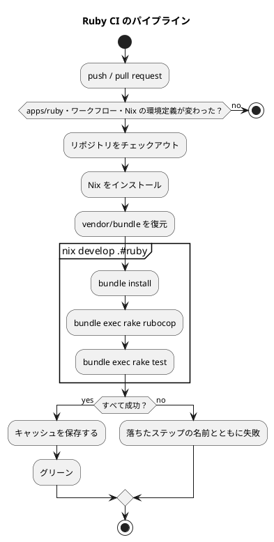

# 第 6 章: タスクランナーと CI/CD

## 6.1 はじめに

前の章で、静的解析・テスト・カバレッジの道具がそろいました。ただし、そろっているだけでは使われません。コマンドを毎回手で打つのは面倒で、打ち忘れれば検査は無かったことになります。

この章では、次の 2 つを整えます。

- **タスクランナー** — 品質チェックを 1 つのコマンドにまとめ、手元でいつでも実行できるようにする
- **CI（継続的インテグレーション）** — 同じ検査を GitHub Actions で自動的に実行し、壊れた状態が main に入らないようにする

Python 版は tox、Rust 版は cargo にタスクの置き場所が無いので Gulp に 1 行で持たせていました。Ruby には **Rake** という、Ruby で書くタスクランナーが昔からあります。この章では、Rake に何を持たせ、Gulp に何を残すかから始めます。

## 6.2 タスクランナー — Rake と Gulp

### Rakefile

`apps/ruby/Rakefile` の全文です。

```ruby
# frozen_string_literal: true

require "minitest/test_task"
require "rubocop/rake_task"

Minitest::TestTask.create(:test) do |task|
  task.libs << "lib" << "test"
  task.test_globs = ["test/**/*_test.rb"]
end

RuboCop::RakeTask.new(:rubocop)

desc "整形・静的解析・テスト（カバレッジつき）をまとめて実行する"
task check: %i[rubocop test]

task default: :check

desc "章を選んで実行する（例: rake run[chapter01]）"
task :run, [:chapter] do |_task, args|
  $LOAD_PATH.unshift File.expand_path("lib", __dir__)
  require "getting_started_ml"

  GettingStartedMl.const_get(args.fetch(:chapter).capitalize).run
end
```

| 定義 | 意味 |
|------|------|
| `Minitest::TestTask.create(:test)` | Minitest が用意するタスク。`lib` と `test` を読み込み先に足し、`test/**/*_test.rb` を実行する |
| `RuboCop::RakeTask.new(:rubocop)` | RuboCop が用意するタスク。指摘があれば失敗する |
| `task check: %i[rubocop test]` | `check` は `rubocop` と `test` に依存する。書いた順に実行される |
| `task default: :check` | 引数なしの `rake` は `check` を実行する |
| `task :run, [:chapter]` | 引数つきのタスク。章のモジュールの `run` を呼ぶ |

`Rakefile` も Ruby のコードです。Python 版の `tox.ini`（INI 形式）や、npm scripts（JSON の文字列）と違い、タスクの中身を Ruby で書けます。`check` の依存を `%i[rubocop test]` という配列で書けるのも、タスクの定義が Ruby の値だからです。

タスクの一覧は `rake -T` で見ます。`desc` を付けたタスクと、Minitest・RuboCop が用意したタスクが並びます。

```bash
bundle exec rake -T
```

```text
rake check                    # 整形・静的解析・テスト（カバレッジつき）をまとめて実行する
rake rubocop                  # Run RuboCop
rake rubocop:autocorrect      # Autocorrect RuboCop offenses (only when it's safe)
rake rubocop:autocorrect_all  # Autocorrect RuboCop offenses (safe and unsafe)
rake run[chapter]             # 章を選んで実行する（例: rake run[chapter01]）
rake test                     # Run the test suite
rake test:cmd                 # Print out the test command
rake test:fu                  # Run the test suite, filtering for 'FU' in name (focused units?)
rake test:isolated            # Show which test files fail when run in isolation
rake test:slow                # Run the test suite and report the slowest 25 tests
```

`rubocop:autocorrect` は第 5 章の `rubocop -a` に当たります。`test:slow` は遅いテストを 25 件表示します。自分で書いたタスクは 2 つだけでも、ライブラリがタスクを持ってきてくれるのが Rake の便利なところです。

### タスクの実行

```bash
bundle exec rake check
```

```text
Running RuboCop...
Inspecting 19 files
...................

19 files inspected, no offenses detected
Run options: --seed 61500

# Running:

..................................................

Finished in 0.205647s, 243.1351 runs/s, 413.3296 assertions/s.

50 runs, 85 assertions, 0 failures, 0 errors, 0 skips
Coverage report generated for Minitest to coverage/index.html
Line coverage: 207 / 220 (94.09%)
```

学習データがある状態で、RuboCop → テスト → カバレッジの順に進みます。第 1 章で見たとおり、`check` は `rubocop` が失敗するとテストまで進みません。Rust 版の `apps:check:rust` は依存のコンパイルし直しで数分かかることがありましたが、Ruby 版はコンパイルが無いので、Nix の環境に入るところを含めても、手元では 7〜15 秒ほどで終わりました。

### 章のプログラムを実行する

`rake run` は、章の名前を引数に取ります。

```bash
bundle exec rake 'run[chapter03]'
```

```text
深さ	訓練データ	テストデータ	Rumale
1	0.6762	0.6444	0.6444
2	0.9333	0.9556	0.9556
3	0.9524	0.9556	0.9556
4	0.9524	0.9556	0.9556
5	0.9714	0.9556	0.9556
制限なし	1.0000	0.9556	0.9333

深さ 2 の決定木:
花弁幅 <= 0.2950
  Iris-setosa
花弁幅 > 0.2950
  花弁幅 <= 0.6500
    Iris-versicolor
  花弁幅 > 0.6500
    Iris-virginica
```

`run[chapter03]` を単引用符で囲んでいるのは、zsh が `[ ]` をファイル名のパターンとして展開しようとするからです。bash ではそのままでも動きますが、囲んでおけばどちらのシェルでも同じです。

`chapter03` は `capitalize` で `Chapter03` になり、`GettingStartedMl.const_get` でモジュールを引きます。章が増えても `Rakefile` を直す必要はありません。引数を付けずに実行すると、`args.fetch(:chapter)` が失敗します。

```bash
bundle exec rake run
```

```text
rake aborted!
KeyError: key not found: :chapter (KeyError)
```

Rust 版は使い方を表示して終了コード 1 で終わる形にしていました。Ruby 版は `fetch` の `KeyError` で止まるだけで、使い方は `rake -T` の説明（`例: rake run[chapter01]`）に任せています。

### apps.js の Ruby の定義

リポジトリのルートからは、ほかの言語版と同じく Gulp のタスクで検査します。`ops/scripts/apps.js` の Ruby 版の定義です。

```javascript
  {
    name: 'ruby',
    nix: 'ruby',
    dir: path.join('apps', 'ruby'),
    // macOS に付属する Ruby 2.6 では動かないので、3.3 未満なら Nix の環境で実行する
    tools: [{ cmd: 'ruby', version: `ruby -e 'exit(Gem::Version.new(RUBY_VERSION) >= Gem::Version.new("3.3"))'` }],
    setup: 'bundle install',
    // CI（.github/workflows/ruby-ci.yml）と同じく、RuboCop とテスト（SimpleCov つき）を検査する
    check: 'bundle exec rake check',
  },
```

| 項目 | 意味 |
|------|------|
| `dir` | 実行する場所（`apps/ruby`） |
| `tools` | 前提になるコマンドと、それが使えるかを確かめる方法 |
| `setup` | 依存を入れる（`apps:setup:ruby`） |
| `check` | 品質チェック（`apps:check:ruby`） |

`check` は `bundle exec rake check` の 1 語です。Rust 版では 4 つのコマンドを `&&` でつないだ 1 行が `apps.js` と CI の 2 か所に書かれていましたが、Ruby 版では **検査の中身は `Rakefile` にあり、Gulp は呼ぶだけ** です。

`tools` が変わっています。ほかの言語版は `cargo --version` のように「コマンドがあるか」を確かめていましたが、macOS には Ruby 2.6 が最初から入っているので、`ruby` があるだけでは足りません。そこで、**版が 3.3 以上なら 0、未満なら 1 で終わる** 1 行を使っています（第 5 章）。`Gem::Version` で比べているのは、`"3.10" >= "3.3"` のような文字列の比較が辞書順になって誤るのを避けるためです。

### タスクの実行

```bash
npx gulp apps:check:ruby
```

```text
[20:27:11] Using gulpfile ~/path/to/getting-started-machine-learning/gulpfile.js
[20:27:11] Starting 'apps:check:ruby'...
ruby: ローカルの ruby が使えないため、nix develop .#ruby の中で実行します。

[.] nix develop .#ruby --command bash -c "cd 'apps/ruby' && bundle exec rake check"
Ruby development environment activated
  - Ruby: ruby 3.3.10 (2025-10-23 revision 343ea05002) [x86_64-darwin24]
  - Bundler: Bundler version 2.7.2
  - Solargraph: 0.57.0
Running RuboCop...
Inspecting 19 files
...................

19 files inspected, no offenses detected
Run options: --seed 43713

# Running:

............SSS...................SSSS............

Finished in 0.011341s, 4408.7823 runs/s, 5995.9439 assertions/s.

50 runs, 68 assertions, 0 failures, 0 errors, 7 skips

You have skipped tests. Run with --verbose for details.
Coverage report generated for Minitest to coverage/index.html
Line coverage: 184 / 220 (83.63%)
[20:27:18] Finished 'apps:check:ruby' after 6.91 s
```

（ファイルのパスは短くしています。この実行は `ML_DATA_DIR` にデータの無い場所を指定したので、実データのテストが 7 件スキップされています）

手元の `ruby` は macOS に付属する 2.6 なので、`tools` の判定が 1 で終わり、Gulp が `nix develop .#ruby` の中で同じコマンドを実行しています。読者は Ruby 3.3 を入れていなくても、Nix さえあれば検査を実行できます。rbenv などで 3.3 以上の Ruby を入れてあれば、Nix を使わずにそのまま実行されます。

## 6.3 Notebook について

Python 版と Kotlin 版では、この節で Notebook によるデータの探索と、出力セルを消してからコミットする仕組みを扱いました。Ruby 版では Notebook を使わず、データの様子は各章の `run` の出力とテストで確かめています。

Notebook で分かったことをテストに移す流れと、出力セルに学習データが残らないようにする仕組みは、[Python 版の 6.3 節](../python/06-task-runner-and-ci-cd.md)（nbstripout）と [Kotlin 版の 6.3 節](../kotlin/06-task-runner-and-ci-cd.md)（Gradle のタスクで出力セルを検査・削除）を参照してください。グラフによる可視化も、Python 版・Kotlin 版の各章を参照してください。

## 6.4 Rake と Gulp の分担

2 つの層は、次のように分担しています。

| 役割 | Rake（`apps/ruby`） | Gulp（リポジトリのルート） |
|------|-------------------|------------------------|
| 何を知っているか | Ruby のソース・テスト・RuboCop の設定 | 言語ごとのアプリの場所・前提ツール・学習データの場所 |
| 品質チェックの中身 | `check` に持つ（`rubocop` → `test`） | 持たない（`bundle exec rake check` を呼ぶだけ） |
| 前提ツールが無いとき | 何もしない | Nix の環境（`nix develop .#ruby`）に切り替える |
| 全言語をまとめて | 扱わない | `apps:check` で、学習データの確認（`data:check`）と全言語の検査を続けて実行する |

Java 版・TypeScript 版と同じく、「検査の中身はビルドツール側に置き、Gulp は呼ぶだけ」という分担にできました。検査を増やすときに直すのは `Rakefile` だけです。Rust 版・Go 版がビルドツールにタスクの置き場所が無いために 2 か所を直す代償を払っていたのと比べると、Rake があることの利点がはっきりします。

## 6.5 GitHub Actions による CI

### ワークフロー設定

`.github/workflows/ruby-ci.yml` の全文です。

```yaml
name: Ruby CI

on:
  push:
    branches: [main]
    paths:
      - 'apps/ruby/**'
      - 'ops/nix/environments/ruby/**'
      - '.github/workflows/ruby-ci.yml'
  pull_request:
    paths:
      - 'apps/ruby/**'
      - 'ops/nix/environments/ruby/**'
      - '.github/workflows/ruby-ci.yml'

jobs:
  test:
    runs-on: ubuntu-latest
    steps:
      - uses: actions/checkout@v5

      - uses: cachix/install-nix-action@v31
        with:
          github_access_token: ${{ secrets.GITHUB_TOKEN }}

      # gem は apps/ruby/.bundle/config の BUNDLE_PATH（vendor/bundle）に入る
      - name: Cache gems
        uses: actions/cache@v4
        with:
          path: apps/ruby/vendor/bundle
          key: ${{ runner.os }}-gems-${{ hashFiles('apps/ruby/Gemfile.lock') }}
          restore-keys: |
            ${{ runner.os }}-gems-

      - name: Install gems
        run: |
          nix develop .#ruby --command bash -c 'cd apps/ruby && bundle install'

      # RuboCop の指摘はすべてエラーにする
      - name: RuboCop
        run: |
          nix develop .#ruby --command bash -c 'cd apps/ruby && bundle exec rake rubocop'

      # 実データのテストは学習データが無ければスキップされる。カバレッジは SimpleCov が表示する
      - name: Test
        run: |
          nix develop .#ruby --command bash -c 'cd apps/ruby && bundle exec rake test'
```

### ワークフローのポイント

| 設定 | 理由 |
|------|------|
| `paths` | Ruby 版に関係のない変更（ほかの言語版・記事）では走らせない。多くの言語版が同居するリポジトリなので、この絞り込みが無いと毎回すべての CI が動く |
| `ops/nix/environments/ruby/**` を `paths` に含める | 環境定義が変われば Ruby の版も変わる。第 4 章で見たとおり、乱数の並びは Ruby の版で決まるので、ここが変わったときこそテストを走らせたい |
| Nix で環境をそろえる | 手元・CI のどちらも Ruby 3.3.10・Bundler 2.7.2 になる。GitHub が用意する Ruby の版に左右されない |
| キャッシュの対象は `apps/ruby/vendor/bundle` | 第 4 章で決めた `BUNDLE_PATH` の場所。numo-narray-alt のようなネイティブ拡張のビルド結果もここに入るので、キャッシュが効けばコンパイルを省ける |
| キャッシュのキーに `Gemfile.lock` | 依存が変わったときだけキャッシュを作り直す。`restore-keys` があるので、キーが一致しなくても古いキャッシュから始められる |
| `rake check` ではなく `rubocop` と `test` に分ける | どの検査で落ちたかが GitHub の画面でひと目で分かる。手元の `rake check` と中身は同じ |
| 学習データを置かない | 配布データは再配布できない。実データのテストはスキップされる（第 4 章） |
| シングルクォートで囲む | `bash -c '...'` の中を単引用符にすると、`$( )` や変数が外側のシェルで展開されない。Go 版が二重引用符でこの落とし穴を踏んだ（[Go 版の 6.6 節](../go/06-task-runner-and-ci-cd.md)）ので、Ruby 版でも最初から単引用符にしている |

### CI パイプラインの流れ



学習データが無いので、実データのテストはスキップされ（`7 skips`）、カバレッジは第 5 章で見た「データなし」の 83.63% になります。カバレッジは表示するだけで、下限を設けて失敗させることはしていません。データの有無で 10 ポイント動く数字に下限を設けても意味が薄いからです。

## 6.6 Nix と Bundler — RUBYLIB が Gemfile.lock を追い越す

このワークフローを書いたあとで、1 か所、思ったとおりに動いていないところが見つかりました。**Nix の環境の中では、`bundle exec` が `Gemfile.lock` と違う版の gem を読み込んでいた** のです。

### RuboCop の版表示で気付く

`rubocop -V` は、RuboCop 自身の版と、使っている構文解析の gem の版を表示します。

```bash
nix develop .#ruby --command bash -c 'cd apps/ruby && bundle exec rubocop -V'
```

```text
1.91.0 (using Parser 3.3.10.0, Prism 1.6.0, rubocop-ast 1.48.0, analyzing as Ruby 3.3, running on ruby 3.3.10) [x86_64-darwin24]
```

`Gemfile.lock` に書かれているのは、parser 3.3.12.0・prism 1.9.0・rubocop-ast 1.50.0 です。RuboCop 本体は 1.91.0 で lock と一致しているのに、構文解析の 3 つが **lock より古い版** になっています。

### 原因は RUBYLIB

Nix の環境定義は、Ruby と Bundler に加えて、エディタ向けの言語サーバー Solargraph を入れています。

```nix
  buildInputs = baseShell.buildInputs ++ (with packages; [
    ruby
    rubyPackages_3_3.solargraph
    bundler
  ]);
```

Nix は、入れた Ruby の gem を使えるようにするために、環境変数 `RUBYLIB` に gem の `lib` のディレクトリを並べます。Solargraph は RuboCop に依存しているので、`RUBYLIB` には Solargraph が使う版の rubocop-1.80.2・parser-3.3.10.0・prism-1.6.0・rubocop-ast-1.48.0 などの `lib` が入っていました。

`RUBYLIB` のディレクトリは、Ruby の `$LOAD_PATH` の **先頭に近いところ** に入ります。Bundler が `Gemfile.lock` の版の gem を `$LOAD_PATH` に足しても、`require "parser"` は先に見つかった `RUBYLIB` の側を読み込みます。Bundler が「有効にした」と記録している版と、実際に読み込まれたファイルが食い違うのです。

確かめるために、`bundle exec` の中で `require "rubocop"` したときの版を表示するスクリプトを動かしました。

| 読み込み方 | Bundler の記録（`Gem.loaded_specs`） | 実際に読み込まれた版 |
|-----------|-----------------------------------|------------------|
| `require "rubocop"` | rubocop 1.91.0 | **rubocop 1.80.2**（`RUBYLIB` の側） |
| `require "prism"` | prism 1.9.0 | **prism 1.6.0**（`RUBYLIB` の側） |
| `bundle exec rubocop`（実行ファイル） | rubocop 1.91.0 | rubocop 1.91.0。ただし parser・prism・rubocop-ast は `RUBYLIB` の側 |

`bundle exec rubocop` と `rake rubocop` で RuboCop 本体が 1.91.0 になっているのは、RuboCop の実行ファイルと `RuboCop::RakeTask` が、自分の `lib` を相対パス（`$LOAD_PATH.unshift` と `require_relative`）で読み込むからです。本体は lock の版でも、本体が `require` する構文解析の gem は `RUBYLIB` の古い版になる、という混ざった状態で検査していたことになります。

### RUBYLIB を外すと lock のとおりになる

`RUBYLIB` を外して同じことをすると、すべて `Gemfile.lock` の版になります。

```bash
nix develop .#ruby --command bash -c 'unset RUBYLIB; cd apps/ruby && bundle exec rubocop -V'
```

```text
1.91.0 (using Parser 3.3.12.0, Prism 1.9.0, rubocop-ast 1.50.0, analyzing as Ruby 3.3, running on ruby 3.3.10) [x86_64-darwin24]
```

この状態で `bundle exec rake check` を実行しても、RuboCop の指摘は 0 件、テストもすべて通りました。第 3 章までのコードでは、混ざった版でも lock の版でも結果は変わりませんでした。結果が同じだったので、それまで誰も気付かなかったのです。

CI も同じ `nix develop .#ruby` を使うので、同じ状態で検査しているはずです（CI のログでは `rubocop -V` をまだ確かめていません）。執筆時点では、環境定義の側はまだ直していません。直すなら、Nix の環境定義の `shellHook` で `RUBYLIB` を外すか、Solargraph を Ruby 版の環境から外すかのどちらかです。

### この経緯から学べること

Rust 版の 6.6 節では、Nix（パッケージマネージャー）と rustup（ツールチェーン管理）が **どちらもツールを配る** ことから、cargo-llvm-cov が LLVM を見つけられない摩擦が起きました。Ruby 版で起きたのも同じ種類の摩擦です。Nix と Bundler が **どちらも gem を配り**、Ruby はその両方を `$LOAD_PATH` から探します。

違うのは、Rust 版の摩擦は **失敗として現れた** のに対して、Ruby 版の摩擦は **何も失敗しなかった** ことです。検査はすべて通り、表示にもおかしなところはありませんでした。気付けたのは、`rubocop -V` の 1 行に lock と違う版が出ていたからです。

- `bundle exec` は「lock の版で動く」ことを約束するが、`RUBYLIB` のような環境変数はその約束の外にある
- 版がずれていても、テストが通れば気付けない。**版の表示を lock と見比べる** のがいちばん早い確かめ方になる
- 環境を 2 つの仕組みで作るときは、境界（ここでは `RUBYLIB` と `$LOAD_PATH`）に何が流れているかを最初に確かめておく

## 6.7 三種の神器と CI

第 4〜6 章で整えたものを、ソフトウェア開発の「三種の神器」（バージョン管理・テスティング・自動化）に当てはめると次のようになります。

| 三種の神器 | 道具 | 本シリーズでの使い方 |
|-----------|------|------------------|
| バージョン管理 | Git、Conventional Commits、`.gitignore` | 学習データ・`vendor/`・`coverage/`・モデルをコミットしない。`Gemfile`・`Gemfile.lock`・`.bundle/config` はコミットする |
| テスティング | Minitest、`skip`、SimpleCov | 単体テストは架空の値、実データのテストは別のファイルに分けてスキップする |
| 自動化 | Bundler、RuboCop、Rake、GitHub Actions、Nix、Gulp | 環境の再現、品質チェックの一括実行、データの配置、CI |

### 利用可能なコマンド一覧

| コマンド | 内容 | 実行する場所 |
|---------|------|------------|
| `npx gulp data:setup` | 学習データを配置する | リポジトリのルート |
| `npx gulp data:check` | 学習データの配置を確認する | リポジトリのルート |
| `npx gulp apps:setup:ruby` | 依存を入れる（`bundle install`） | リポジトリのルート |
| `npx gulp apps:check:ruby` | RuboCop とテスト（カバレッジつき）をまとめて実行する（Ruby 3.3 未満なら Nix の中で） | リポジトリのルート |
| `bundle install` | `Gemfile.lock` のとおりに gem を `vendor/bundle` に入れる | `apps/ruby` |
| `bundle exec rake check` | RuboCop → テスト（カバレッジつき）を実行する | `apps/ruby` |
| `bundle exec rake rubocop` | RuboCop だけを実行する | `apps/ruby` |
| `bundle exec rake rubocop:autocorrect` | 安全な指摘を自動で直す | `apps/ruby` |
| `bundle exec rake test` | テストを実行する | `apps/ruby` |
| `bundle exec rake test TESTOPTS=--verbose` | テストごとの結果とスキップの理由を表示する | `apps/ruby` |
| `bundle exec rake 'run[chapter03]'` | 章の処理を実行する（学習データが必要） | `apps/ruby` |
| `bundle exec rake -T` | タスクの一覧を表示する | `apps/ruby` |
| `bundle exec rubocop -V` | RuboCop と構文解析の gem の版を表示する（6.6 節） | `apps/ruby` |

## 6.8 まとめ

この章では、品質チェックを自動化し、どの環境でも同じ手順で実行できるようにしました。

1. **Rake** — `check`（`rubocop` → `test`）と `run[chapter]` を `Rakefile` に持つ。Minitest と RuboCop がタスクを用意してくれるので、自分で書くのは 2 つだけ
2. **Gulp は呼ぶだけ** — `apps:check:ruby` は `bundle exec rake check` の 1 語。検査を増やすときに直すのは `Rakefile` だけ
3. **Ruby の版で Nix に切り替える** — macOS には Ruby 2.6 があるので、コマンドの有無ではなく「3.3 以上か」を `Gem::Version` で判定する
4. **GitHub Actions** — `paths` で Ruby 版に関係する変更に絞り、Nix で Ruby 3.3.10 をそろえ、RuboCop とテストをステップに分ける。`vendor/bundle` を `Gemfile.lock` のハッシュでキャッシュする
5. **RUBYLIB が Gemfile.lock を追い越す** — Nix の環境では、Solargraph のために並んだ `RUBYLIB` が `bundle exec` の中でも先に読まれ、構文解析の gem が lock より古い版になっていた。何も失敗しないので、`rubocop -V` の表示を lock と見比べて気付く
6. **学習データの無い CI** — 実データのテストはスキップされ（`7 skips`）、カバレッジは表示だけにする

第 2 部で、TDD を回し続けるための道具立てがそろいました。次の第 3 部では、回帰問題と、欠損値・カテゴリ値・外れ値を含む現実的なデータの前処理に取り組みます。
