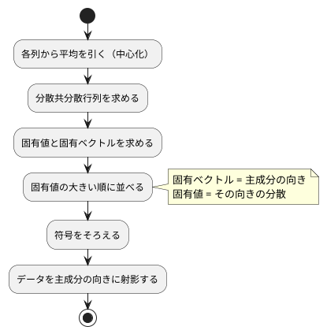

# 第 13 章: 主成分分析による次元削減

## 13.1 はじめに

ここまでの章では、正解ラベルのあるデータで予測をしてきました。この章から扱う **教師なし学習** では、正解ラベルを使わずに、データそのものの構造を調べます。

最初に扱うのは **主成分分析（PCA）** です。住宅価格のデータには 15 個もの列がありますが、列どうしは互いに関係しあっていて、実際にはもっと少ない数の「軸」で大部分を説明できることがあります。主成分分析は、データのばらつきを最もよく説明する新しい軸を探し、たくさんの列を少数の軸に要約します。

[Python 版の第 13 章](../python/13-principal-component-analysis.md) と同じ TODO リストで進め、[Rust 版](../rust/13-principal-component-analysis.md) と対比します。Ruby 版の事情は Rust 版とよく似ています。

- **Numo には固有値分解が無い**。固有値分解は `Numo::Linalg` にありますが、LAPACK（C と Fortran のライブラリ）を要求するので入れません（[ADR 010](../../../adr/010-ruby-ml-libraries.md)）。Rust 版と同じく **対称行列に限ったヤコビ法** を自作します
- **Rumale には `Decomposition::PCA` がある**。そこで、ほかの章と同じく **自作してから Rumale と突き合わせる** 構成にします

この章で拾う Ruby の論点は次の 3 つです。

- **行と列をまとめて回す**。Rust 版は借用規則のため、要素を 1 つずつ取り出してから書き戻しました。Numo は `matrix[true, p]` で列を丸ごと取り出せるので、回転を列（と行）単位の演算で書けます
- **黙って落ちる solver**。Rumale の PCA に `solver: "evd"`（固有値分解）を渡しても、`Numo::Linalg` が無ければ警告を 1 行出して別の解き方に落ちます。第 7 章の `LinearRegression` で見た「黙って別の solver に落ちる」と同じ型の落とし穴です
- **ライブラリの既定値で比べると、答えが大きくずれる**。Rumale の固定小数点法は既定の収束の判定がゆるく、実データでは主成分が符号をそろえても 1.3 ずれました。設定を変えて実測し、どこまで近づくかを確かめます

## 13.2 主成分分析とは

### ばらつきが最も大きい方向を探す

2 つの列が強く相関しているデータを散布図にすると、点は斜めの帯のように並びます。このとき、帯に沿った 1 本の軸を取れば、2 つの列の情報をほぼ 1 つの数値で表せます。この「ばらつき（分散）が最も大きい方向」が **第 1 主成分** です。第 2 主成分は、第 1 主成分と直交する方向のうち、ばらつきが最も大きい方向です。

### 分散共分散行列の固有ベクトル

主成分は、次の手順で求められます。



**分散共分散行列** は、対角に各列の分散、それ以外に 2 列の共分散を並べた行列です。この行列の **固有ベクトル** が主成分の向き、**固有値** がその向きのデータの分散になります。行列 `A` の固有ベクトル `v` と固有値 `λ` は `A v = λ v`（`A` を掛けても向きが変わらず、長さだけが `λ` 倍になる）を満たします。

### 寄与率

各主成分の固有値を、固有値の合計で割った値を **寄与率** と呼びます。その主成分がデータ全体のばらつきのうち何割を説明しているかを表します。第 1 主成分から順に足したものが **累積寄与率** で、「累積寄与率が 0.8 に届くまでの主成分を使う」のように、残す軸の数を決める目安になります。

## 13.3 題材とデータ

この章では、[第 9 章](09-feature-engineering.md) と同じ `Boston.csv`（100 件）を、住宅価格 `PRICE` も含めたすべての列で使います。学習データの入手と配置は [第 1 章](01-machine-learning-and-first-test.md) の「題材とデータ」を参照してください。

| 列の種類 | 列 | 注意点 |
|---------|-----|--------|
| 数値 | ZN, INDUS, CHAS, NOX, RM, AGE, DIS, RAD, TAX, PTRATIO, B, LSTAT, PRICE | NOX と RAD に欠損値がある |
| カテゴリ | CRIME | `high`・`low`・`very_low` の 3 種類の文字列 |

主成分分析は数値しか扱えず、欠損値があると計算できません。また、列ごとに単位や桁（TAX は数百、NOX は 1 未満）が違うと、桁の大きい列のばらつきが主成分を支配してしまいます。そこで次の前処理をしてから主成分分析をします。

1. CRIME をダミー変数（`CRIME_low`・`CRIME_very_low` の 2 列）に置き換える
2. 欠損値を列の平均値で補完する
3. すべての列を平均 0・標準偏差 1 に標準化する

前処理はすべて [第 9 章](09-feature-engineering.md) と [第 2 章](02-data-preprocessing-and-triangulation.md) の部品をそのまま組み合わせます。新しく書くのは主成分分析だけです。

この章では訓練データとテストデータに分けません。主成分分析は正解を予測するモデルではなく、手元のデータ全体の構造を要約する手法だからです。**分割も乱数も使わない** ので、第 2 章以来ずっと言語版ごとにずれていた数値が、この章では一致するはずです（13.10 節で確かめます）。

## 13.4 TODO リストの作成

**TODO リスト**:

- [ ] 分散共分散行列を求める
  - [ ] 件数から 1 を引いた数で割る
  - [ ] データが 1 件なら失敗にする
- [ ] ヤコビ法で対称行列を固有値分解する
  - [ ] 対角行列はそのまま固有値になる
  - [ ] 固有値と固有ベクトルが `A v = λ v` を満たす
  - [ ] 正方行列でなければ失敗にする
  - [ ] 収束しなければ失敗にする
- [ ] 主成分を求める
  - [ ] 完全に相関する 2 列なら第 1 主成分だけで分散をすべて説明する
  - [ ] 寄与率の大きい順に並ぶ
  - [ ] 主成分の向き（符号）をそろえる
- [ ] データを主成分の向きに射影する
- [ ] 累積寄与率がしきい値に届く主成分の数を求める
- [ ] 主成分への影響が大きい列を求める
- [ ] Boston を前処理する（ダミー変数・欠損値の補完・標準化）
- [ ] Rumale の PCA と突き合わせる
- [ ] 実データで寄与率と主成分の意味を表示する

この章のコードは `lib/getting_started_ml/chapter13/` に置きます。

| ファイル | 役割 |
|---------|------|
| `pca.rb` | 分散共分散行列、ヤコビ法、主成分分析、射影、影響の大きい列 |
| `boston.rb` | Boston の前処理（第 2 章・第 9 章の部品の組み合わせ） |
| `rumale_pca.rb` | Rumale の PCA の呼び出しと、寄与率の計算 |

行列は第 10 章と同じく Numo の `Numo::DFloat` で持ちます。失敗は、入力が間違っているもの（件数が足りない・正方行列でない・主成分の数が合わない）を `ArgumentError`、計算が終わらないものを章で定義する `NotConvergedError` にします。Rust 版は 1 つの `enum Error` に変種を並べましたが、Ruby 版は「呼んだ側の間違いか、計算の限界か」で例外のクラスを分けます。

## 13.5 分散共分散行列を求める

まず、手で計算できる小さな例をテストにします。1 列目が `1, 2, 3` なら、平均 2、偏差は `-1, 0, 1`、分散は `(1 + 0 + 1) / (3 - 1) = 1` です。件数ではなく **件数から 1 を引いた数** で割るのが不偏分散で、scikit-learn の `PCA` も Rumale の `PCA` もこちらを使います。

```ruby
def test_分散共分散行列は件数から一を引いた数で割る
  # 1 列目の分散は ((-1)^2 + 0 + 1^2) / 2 = 1
  covariance = C.covariance_matrix(matrix([[1.0, 2.0], [2.0, 4.0], [3.0, 6.0]]))

  assert_in_delta 1.0, covariance[0, 0], 1e-12
  assert_in_delta 2.0, covariance[0, 1], 1e-12
  assert_in_delta 4.0, covariance[1, 1], 1e-12
end
```

最初の実行では、`Chapter13` がまだ無いので `NameError`（`uninitialized constant GettingStartedMl::Chapter13`）で落ちました。実装は Numo の演算そのままです。

```ruby
# 列ごとの分散と、2 列ずつの共分散を並べた行列。件数から 1 を引いた数で割る。
def covariance_matrix(x)
  rows = x.shape[0]
  raise ArgumentError, "主成分分析には 2 件以上のデータが必要です（#{rows} 件）" if rows < 2

  centered = x - x.mean(axis: 0)
  centered.transpose.dot(centered) / (rows - 1)
end
```

`x - x.mean(axis: 0)` は、列ごとの平均（長さ = 列の数のベクトル）を行列の全行から引きます。第 10 章のソフトマックスで使ったブロードキャストと同じで、Rust 版が `center` という関数に切り出したループが、ここでは演算子 1 つです。

## 13.6 ヤコビ法で固有値分解する

### 対称行列に限れば自作できる

ヤコビ法は、対称行列の「対角より外の成分」を 1 つずつ回転で 0 にしていき、対角に固有値だけが残る状態へ近づける方法です。回転を掛け合わせたものが固有ベクトルになります。分散共分散行列は定義から必ず対称なので、これで十分です。

テストは 2 本立てにしました。答えがそのまま分かる対角行列と、答えを書き写さずに **定義の式** `A v = λ v` で確かめる 3 行 3 列の行列です。

```ruby
def test_対角行列の固有値はそのまま対角に並ぶ
  values, vectors = C.jacobi_eigen(matrix([[3.0, 0.0], [0.0, 1.0]]))

  assert_equal [3.0, 1.0], values
  assert_equal [[1.0, 0.0], [0.0, 1.0]], vectors.to_a
end

def test_固有値と固有ベクトルは定義の式を満たす
  values, vectors = C.jacobi_eigen(symmetric)

  values.each_with_index do |value, index|
    v = vectors[true, index]

    assert_in_delta 0.0, (symmetric.dot(v) - (v * value)).abs.max, 1e-9
  end
end
```

`vectors[true, index]` は「すべての行の index 列目」、つまり 1 本の固有ベクトルです。Numo では `true` が「その次元をすべて」を表します。

### 行と列をまとめて回す

本体は、回転を掃き出し（すべての組 `(p, q)` を 1 回ずつ回す）ごとに繰り返し、対角より外の成分が十分に小さくなったら止まります。

```ruby
# 対称行列をヤコビ法で固有値分解する。固有値の並びと、固有ベクトルを列ごとに並べた行列を返す。
# Numo には固有値分解が無い（Numo::Linalg は LAPACK を要求する）ので、対称行列の場合だけを自作する。
def jacobi_eigen(matrix, max_sweeps: MAX_SWEEPS)
  size, columns = matrix.shape
  raise ArgumentError, "正方行列ではありません: #{size} 行 #{columns} 列" unless size == columns

  work = matrix.dup
  vectors = Numo::DFloat.eye(size)
  # 行列の大きさに合わせた「これ以上は消せない」しきい値（Rust 版の教訓で、絶対値ではなく割合で比べる）
  limit = TOLERANCE * [frobenius_norm(matrix), Float::MIN].max

  max_sweeps.times do
    return [work.diagonal.to_a, vectors] if off_diagonal_norm(work) < limit

    sweep(work, vectors, limit)
  end

  raise NotConvergedError, max_sweeps
end
```

```ruby
# 対角より外の成分を 1 つずつ回して 0 に近づける。
def sweep(work, vectors, limit)
  size = work.shape[0]

  (0...size).to_a.combination(2).each do |pair|
    # すでに十分小さい成分は回さない。しきい値は収束の判定より細かくする
    next if work[*pair].abs < limit * Float::EPSILON

    rotate(work, vectors, pair)
  end
end
```

Rust 版は `for p in 0..size { for q in (p + 1)..size { ... } }` の二重ループでした。Ruby 版は `combination(2)` で「2 つの番号の組み合わせ」を直接並べます。

回転の本体が、Rust 版といちばん違うところです。

```ruby
# (p, q) の成分が 0 になるように回転し、固有ベクトルにも同じ回転をかける。
def rotate(work, vectors, pair)
  p, q = pair
  # tan(2θ) = 2 a_pq / (a_pp - a_qq) を解いて、cos と sin を求める
  theta = 0.5 * Math.atan2(2.0 * work[p, q], work[p, p] - work[q, q])
  cos = Math.cos(theta)
  sin = Math.sin(theta)

  rotate_lines(work, [true, p], [true, q], cos, sin)
  rotate_lines(work, [p, true], [q, true], cos, sin)
  rotate_lines(vectors, [true, p], [true, q], cos, sin)
end

# 2 つの列（または 2 つの行）を回転する。回転の前の値を取り出してから書き戻す。
def rotate_lines(matrix, index_p, index_q, cos, sin)
  line_p = matrix[*index_p].dup
  line_q = matrix[*index_q].dup
  matrix[*index_p] = (line_p * cos) + (line_q * sin)
  matrix[*index_q] = (line_q * cos) - (line_p * sin)
end
```

Rust 版は、借用規則のため `work[[k, p]]` と `work[[k, q]]` を 1 要素ずつ取り出して書き戻すループを 3 回書きました。Numo は `matrix[true, p]` で p 列を、`matrix[p, true]` で p 行を丸ごと取り出せるので、**添字の組を引数にすれば、列の回転と行の回転を同じメソッドで書けます**。`matrix[*index_p]` の `*` は配列を引数に展開する書き方で、`[true, p]` なら `matrix[true, p]` になります。

ここで `.dup` を忘れると壊れます。Numo の `matrix[true, p]` は **元の行列を指す view** を返すので、1 行目で p 列を書き換えると、2 行目の計算で使う `line_p` も書き換わってしまいます。試しに `line_p` の `.dup` だけを外すと、例外は出ずに 2 つのテストが落ちました。

```text
  1) Failure:
Chapter13PcaTest#test_固有値と固有ベクトルは定義の式を満たす [test/chapter13_pca_test.rb:44]:
Expected |0.0 - 0.12332183356128024| (0.12332183356128024) to be <= 1.0e-09.

  2) Failure:
Chapter13PcaTest#test_完全に相関する二列の第一主成分は四十五度の向きになる [test/chapter13_pca_test.rb:65]:
Expected |0.7071067811865475 - 0.7924223459478593| (0.08531556476131186) to be <= 1.0e-09.
```

Rust 版の記事にあった「順に代入すると、2 つ目の式が 1 つ目で書き換えた値を使う」と同じバグです。Rust は借用チェッカがその書き方を許しませんでしたが、Ruby は **黙って間違った値を計算します**。対角行列のテストは回転が起きないので通ってしまい、答えを書き写さずに定義の式で確かめるテストが、このバグを捕まえました。

収束しないことは例外にします。上限の回数をキーワード引数で差し替えられるようにしておくと、テストで確かめられます。

```ruby
def test_決めた回数で収束しなければ失敗にする
  error = assert_raises(C::NotConvergedError) { C.jacobi_eigen(symmetric, max_sweeps: 1) }

  assert_equal "1 回繰り返しても固有値分解が収束しませんでした", error.message
end
```

### 収束の判定は割合で

Rust 版は最初、対角より外の成分の大きさを **絶対値** `1e-12` と比べて、実データで「100 回繰り返しても固有値分解が収束しませんでした」に当たりました。Ruby 版は最初から、行列全体の大きさ（フロベニウスノルム）に対する **割合** で判定しています。

確かめるために、Ruby 版で絶対値 `1e-12` に差し替えて実データの分散共分散行列（フロベニウスノルムは約 7.04）を分解してみると、こちらは収束しました。Rust 版の失敗は、しきい値の決め方と回転を飛ばす条件の組み合わせによるもので、どの実装でも必ず起きるわけではないようです。ただ、比べる相手の大きさに合わせたしきい値のほうが、行列の大きさや単位が変わっても振る舞いが変わりません。割合での判定を残しました。

## 13.7 主成分を求める

### 完全に相関する 2 列

第 1 主成分が正しく求まっているかを、答えが分かる例で確かめます。2 列がまったく同じ値なら、ばらつきは `(1, 1)` の向きだけにあります。

```ruby
def test_完全に相関する二列の第一主成分は四十五度の向きになる
  # 2 列目が 1 列目と同じ値なので、ばらつきはすべて (1, 1) の向きにある
  model = C.fit(matrix([[1.0, 1.0], [2.0, 2.0], [3.0, 3.0], [4.0, 4.0]]), 2)
  root = 1.0 / Math.sqrt(2.0)

  assert_in_delta root, model.components[0, 0], 1e-9
  assert_in_delta root, model.components[0, 1], 1e-9
  assert_in_delta 1.0, model.explained_variance_ratio[0], 1e-9
  assert_in_delta 0.0, model.explained_variance_ratio[1], 1e-9
end
```

### 符号をそろえる

固有ベクトルは、符号を反転しても同じ向きを表します（`v` が固有ベクトルなら `-v` も固有ベクトル）。どちらが返るかは解き方しだいなので、ほかの言語版と同じ「絶対値が最大の要素が正になるようにそろえる」規則を決めます。

```ruby
# 固有ベクトルは符号が逆でも同じ向きを表すので、絶対値が最大の要素が正になるようにそろえる。
def normalize_signs(components)
  Numo::DFloat.cast(components.to_a.map { |row| row.max_by(&:abs).negative? ? row.map(&:-@) : row })
end
```

`row.max_by(&:abs)` が「絶対値が最大の要素（符号つき）」で、Rust 版の `fold` に当たります。`row.map(&:-@)` の `-@` は単項マイナスのメソッド名で、「全要素の符号を反転する」をブロックを書かずに表せます。この規則は、13.9 節で Rumale と突き合わせるときに効いてきます。

### 寄与率の大きい順に並べる

`fit` は、固有値分解・並べ替え・寄与率の計算をつなぐだけです。最初は並べ替えと主成分の数の検査を `fit` の中に書いていて、RuboCop の `Metrics/AbcSize` が 21.1（上限 17）で咎めました。並べ替えを `descending_order` に切り出しました。

```ruby
# 分散共分散行列を固有値分解し、寄与率の大きい順に n_components 個の主成分を求める。
def fit(x, n_components)
  values, vectors = jacobi_eigen(covariance_matrix(x))
  order = descending_order(values, n_components)
  variances = values.values_at(*order)
  total = values.sum

  PcaModel.new(mean: x.mean(axis: 0), components: normalize_signs(vectors[true, order].transpose),
               explained_variance: variances, explained_variance_ratio: variances.map { |value| value / total })
end

# 固有値の大きい順に、先頭から n_components 個の番号を返す。値が同じときは元の順を保つ。
def descending_order(values, n_components)
  unless n_components.between?(1, values.size)
    raise ArgumentError, "主成分の数は 1 以上 #{values.size} 以下にしてください: #{n_components}"
  end

  values.each_index.sort_by { |index| [-values[index], index] }.first(n_components)
end
```

`vectors[true, order]` は、番号の配列で列を選ぶ書き方です。固有ベクトルは列に並んでいるので、選んでから `transpose` で「1 行に 1 つの主成分」にします。Ruby の `sort_by` は **安定ではない** ので、固有値が同じときの順を保つために `[-値, 番号]` の組で並べます（Rust 版の `sort_by` は安定なので、この配慮が要りませんでした）。

寄与率の分母は **すべての** 固有値の合計です。上位だけを取り出しても分母は変えません。

## 13.8 射影・主成分の数・影響の大きい列・前処理

射影は「平均を引いてから主成分の向きに掛ける」だけです。

```ruby
# 平均を引いてから、データを主成分の向きに射影する。
def transform(model, x)
  (x - model.mean).dot(model.components.transpose)
end
```

累積寄与率がしきい値に届く本数は、`index` にブロックを渡して「初めて条件を満たした位置」を探します。

```ruby
# 累積寄与率がしきい値に届くまでの主成分の数。届かなければ、すべての主成分を使う。
def components_needed(ratios, threshold)
  cumulative = 0.0
  index = ratios.index { |ratio| (cumulative += ratio) >= threshold }

  index.nil? ? ratios.size : index + 1
end
```

列名と係数の組は、第 9 章の `Standardizer` と同じく `Data.define` で `Loading` という名前を付けました。`Data` は値で比べられるので、テストで `assert_equal [C::Loading.new(column: "B", value: -0.9), ...], loadings` と期待値をそのまま書けます。

前処理は第 9 章の `encode`・`categories`・`Standardizer` と第 2 章の `column_means`・`fill_missing` を組み合わせるだけです。第 9 章と違うのは、**正解の列 `PRICE` も分析の対象に含める** ことと、分割をしないことです。

```ruby
# CRIME をダミー変数にし、欠損値を列の平均値で補完してから、すべての列を標準化する。
# 正解の列 PRICE も分析の対象にするので残し、訓練データとテストデータには分けない。
def standardize_boston(table)
  crimes = table.rows.map { |row| row.text(Chapter09::BOSTON_CATEGORY) }
  encoded = Chapter09.encode(table, Chapter09::BOSTON_CATEGORY, Chapter09.categories(crimes))
  means = Chapter02.column_means(encoded.rows, encoded.columns)
  filled = Chapter02.fill_missing(encoded.rows, encoded.columns, means)

  Chapter09::Standardizer.fit(filled).transform(filled)
end
```

第 2 章・第 9 章の部品は 1 行も変えていません。

## 13.9 Rumale の PCA と突き合わせる

### 寄与率を持たない

Rumale 2.2 の `Decomposition::PCA` が学習後に持つのは、`components`（主成分）と `mean`（列ごとの平均）だけです。scikit-learn の `explained_variance_ratio_` に当たるものがありません。そこで、Rumale の主成分 `c` の向きの分散 `cᵀ Σ c` を、すべての列の分散の合計（分散共分散行列 `Σ` の対角の和）で割って寄与率を求めます。`c` が固有ベクトルなら `cᵀ Σ c` は固有値そのものなので、自作と同じ定義になります。

```ruby
# Rumale の PCA で主成分を求める。Rumale は寄与率を持たないので、主成分の向きの分散
# （c^T Σ c）をすべての列の分散の合計（Σ の対角の和）で割って求める。
# 乱数で初期値を選ぶので、シードは必ず渡す（省くと srand でプロセス全体の乱数の種が入れ替わる）。
def fit(x, n_components, seed:, max_iter: 100, tol: 1e-4)
  model = Rumale::Decomposition::PCA.new(n_components:, max_iter:, tol:, random_seed: seed).fit(x)
  components = Chapter13.normalize_signs(as_rows(model.components))

  RumalePcaResult.new(components:, explained_variance_ratio: ratios(Chapter13.covariance_matrix(x), components))
end
```

主成分を 1 つだけ求めると、Rumale は 1 行の行列ではなく 1 次元の配列を返します。`as_rows` で `expand_dims(0)` して行列にそろえます。

### 落とし穴 1: evd を指定しても固定小数点法に落ちる

Rumale 2.2.0 のソースを読むと、PCA には 2 つの解き方があります。

| solver | 解き方 | 使える条件 |
|--------|--------|-----------|
| `"evd"` | 分散共分散行列を `Numo::Linalg.eigh` で固有値分解する | `Numo::Linalg` が読み込まれていること |
| `"fpt"` | 固定小数点法（べき乗法の一種）で、主成分を 1 本ずつ求める | いつでも |

既定の `solver: "auto"` は、`Numo::Linalg` があれば `"evd"`、無ければ `"fpt"` を選びます。問題は `"evd"` を明示したときです。コンストラクタは `params[:solver]` を `"evd"` のまま残し、`fit` の中で `if @params[:solver] == 'evd' && enable_linalg?` と確かめて、`Numo::Linalg` が無ければ **`"fpt"` の分岐へ黙って進みます**。実測して、テストに記録しました。

```ruby
# solver に "evd"（固有値分解）を渡すと params には "evd" と残るが、Numo::Linalg が無いので
# fit で警告を出し、黙って固定小数点法（"fpt"）と同じ計算に落ちる
def test_Numo_Linalg_が無いとevdを指定しても固定小数点法で解く
  refute defined?(Numo::Linalg)
  evd = Rumale::Decomposition::PCA.new(n_components: 2, solver: "evd", random_seed: 0)
  fpt = Rumale::Decomposition::PCA.new(n_components: 2, solver: "fpt", random_seed: 0).fit(x)

  assert_equal "evd", evd.params[:solver]
  _, warning = capture_io { evd.fit(x) }

  assert_match "Numo::Linalg", warning
  assert_equal fpt.components, evd.components
end
```

警告は `If you want to use features that depend on Numo::Linalg, you should install and load Numo::Linalg in advance.` の 1 行だけで、例外にはなりません。**`params` を見ても、実際に使われた solver は分かりません**。第 7 章の `LinearRegression` も、`Numo::Linalg` が無いと別の solver に落ちました。Rumale では「`Numo::Linalg` が無いときの挙動」をモデルごとに確かめる必要があります。

### 落とし穴 2: 既定の収束の判定では主成分がずれる

固定小数点法は、ランダムな初期ベクトルに分散共分散行列を掛けては長さ 1 に直す、を繰り返します。止まる条件は「更新前後のベクトルの内積（向きの cos）が 1 に `tol` まで近づいたこと」で、既定は `max_iter: 100`・`tol: 1e-4` です。cos が 1 − 10⁻⁴ ということは、向きがまだ約 0.014 ラジアン（0.8 度）ずれていても止まります。

自作の小さなデータ（8 件 3 列）で比べると、既定では主成分の成分が最大 0.014 ずれました。`max_iter: 10_000`・`tol: 1e-12` にすると 1.9 × 10⁻⁶ まで近づき、寄与率は 1e-9 以内で一致しました。

```ruby
# 固定小数点法の既定（max_iter: 100・tol: 1e-4）は向きの cos が 1 に 1e-4 まで近づけば止まるので、
# 主成分は小数第 2 位でずれる
def test_Rumaleの既定では主成分が小数第二位でずれる
  gap = (C.fit(x, 3).components - C::RumalePca.fit(x, 3, seed: 0).components).abs.max

  assert_operator gap, :>, 1e-3
end

def test_繰り返しを増やして判定を厳しくすれば主成分は自作と一致する
  theirs = C::RumalePca.fit(x, 3, seed: 0, max_iter: 10_000, tol: 1e-12)

  assert_in_delta 0.0, (C.fit(x, 3).components - theirs.components).abs.max, 1e-5
end
```

実データ（100 件 15 列）では、ずれはもっと大きく出ました。15 本の主成分ごとに、自作との差の最大を設定別に測った結果です（シード 0）。

| max_iter | tol | 寄与率の差 | 主成分の差（最大） | 時間 |
|---------:|----:|----------:|------------------:|-----:|
| 100（既定） | 1e-4（既定） | 4.4e-04 | 1.3e+00（第 5・第 12 主成分） | 0.01 秒 |
| 1,000 | 1e-8 | 3.4e-08 | 3.2e-03 | 0.03 秒 |
| 10,000 | 1e-12 | 1.3e-11 | 6.3e-05 | 0.63 秒 |
| 100,000 | 1e-15 | 6.1e-13 | 4.4e-07 | 89.79 秒 |

既定で主成分が 1.3 もずれるのは、長さ 1 のベクトルどうしとしては「ほぼ別の向き」です。第 4 主成分（寄与率 0.0645）と第 5 主成分（0.0623）は固有値が近く、べき乗法の系統はこういう組の区別に時間がかかります。100 回で打ち切られると、2 つの向きが混ざったまま次の主成分に進み、後ろの主成分にもずれが伝わります。シードを 1・2 に変えても、第 5 主成分は 1.2 ずれました。

`tol: 1e-15` は 90 秒かかりました。cos を 1 に 1e-15 まで近づけるのは浮動小数点の精度の限界に近く、判定を満たせずに毎回 `max_iter` まで回るためです。寄与率だけなら `tol: 1e-8` で 3.4 × 10⁻⁸、主成分まで小数第 4 位で合わせたいなら `max_iter: 10_000`・`tol: 1e-12` が現実的な落としどころでした。

**教訓**: 答えが 1 つに決まる計算でも、ライブラリの既定値は「速さ」の側に寄せてあることがあります。自作と突き合わせて初めて、既定値でどれだけずれるかが分かりました。

### 乱数のシードは必ず渡す

固定小数点法の初期ベクトルは乱数で選ぶので、PCA もシードを取ります。第 10 章のランダムフォレストと同じく既定値が `random_seed || srand` で、省くとプロセス全体の乱数の種が入れ替わります。`srand(42)` のあとに `rand` を呼ぶ場合と、`srand(42)` のあとに `Rumale::Decomposition::PCA.new` を挟んでから `rand` を呼ぶ場合で値が変わり、`random_seed: 1` を渡した場合は変わりませんでした。`RumalePca.fit` はシードを必須のキーワード引数にしています。

## 13.10 実データで要約する

### 実行結果

```bash
bundle exec rake 'run[chapter13]'
```

```text
データ件数: 100, 列数: 15
寄与率: PC1 0.4110, PC2 0.1448, PC3 0.1019, PC4 0.0645, PC5 0.0623, PC6 0.0581
累積寄与率が 0.8 に届く主成分の数: 6（累積寄与率 0.8427）
第 1 主成分で影響の大きい列: INDUS 0.359, NOX 0.350, TAX 0.328
第 2 主成分で影響の大きい列: PRICE 0.444, CRIME_low 0.423, RM 0.405
Rumale（既定: max_iter 100, tol 0.0001）との差: 寄与率 4.4e-04, 主成分 1.3e+00
Rumale（厳しめ: max_iter 10000, tol 1.0e-12）との差: 寄与率 1.3e-11, 主成分 6.3e-05
```

### 結果を読む

- **15 列が 6 本の軸に要約できた**。累積寄与率 0.8427 で、元のばらつきの 84% を 6 本で説明できます
- **第 1 主成分は「地域の性格」** です。INDUS（非小売業の割合）・NOX（大気汚染）・TAX（税率）が同じ向きに大きく効いていて、工業地帯かどうかを表す軸になっています
- **第 2 主成分は「住宅の価値」** です。PRICE（価格）・CRIME_low（犯罪率が低い）・RM（部屋数）が同じ向きに並びます
- **Rumale とは設定しだいで一致する**。既定では主成分がずれ、厳しめの設定で寄与率は 1.3 × 10⁻¹¹ まで一致しました

### ほかの言語版との一致

寄与率 PC1 0.4110・PC2 0.1448・…・PC6 0.0581、累積寄与率 0.8427、影響の大きい列とその係数は、[Rust 版](../rust/13-principal-component-analysis.md) の出力と **表示した桁まですべて一致** しました。第 2 章以来、Ruby 版は `Random.new(0)` による分割がほかの言語版と違うため、正解率も決定係数も一致しませんでした。この章は **分割も乱数も使わない** ので、同じ前処理・同じ定義なら言語が違っても同じ数値になります。値が合わないときに「乱数のせいか、実装のバグか」を切り分けられるのは、こういう決定的な計算のときだけです。

### 実データのテスト

出力は `test/boston_pca_test.rb` で固定しています。さらに、主成分が満たすべき **性質** もテストにしました。長さ 1 で互いに直交することは、主成分の行列とその転置の積が単位行列になることと同じです。Rust 版は組ごとに内積を求めるループを書きましたが、Numo なら行列の積 1 回で確かめられます。

```ruby
# 主成分は長さ 1 で互いに直交する。値を書き写さずに確かめられる性質
def test_主成分は長さ一で互いに直交する
  components = C.fit(x, 15).components
  products = components.dot(components.transpose)

  assert_in_delta 0.0, (products - Numo::DFloat.eye(15)).abs.max, 1e-9
end
```

学習データが無い環境では、このテストは Minitest の `skip` でスキップされます。

## 13.11 Notebook による探索と可視化

Ruby 版では Notebook と可視化を扱いません。累積寄与率のグラフ、第 1・第 2 主成分の散布図、主成分への影響が大きい列の棒グラフは、[Python 版の第 13 章](../python/13-principal-component-analysis.md) と [Kotlin 版の第 13 章](../kotlin/13-principal-component-analysis.md) の「Notebook による探索と可視化」の節を参照してください。寄与率はほかの言語版と一致しているので、グラフもそのまま読み替えられます。

## 13.12 リファクタリング

TODO リストを終えてから `bundle exec rake check` をかけると、RuboCop が 4 件を指摘しました。

- **`Naming/MethodParameterName`** — `rotate(work, vectors, p, q)` の `p`・`q` が 3 文字未満で咎められました（2 件）。数式の記号なので名前は変えたくありません。組 `pair` で受け取り、メソッドの中で `p, q = pair` と分解しました。`sweep` の `combination(2)` が組を渡すので、呼ぶ側もすっきりしました
- **`Metrics/AbcSize`** — `fit` が 21.1 で上限 17 を超え、並べ替えと主成分の数の検査を `descending_order` に切り出しました
- **`Layout/LineLength`** — 切り出しと一緒に、寄与率の分母を `total` という変数にして行を短くしました

第 2 章・第 9 章の部品は変更していません。この章を足した時点で、`bundle exec rake check` は 202 件のテストがすべて通りました。

## 13.13 まとめ

この章では、主成分分析を分散共分散行列とヤコビ法から組み立て、Rumale の PCA と突き合わせました。

| 手順 | 自作したもの | 突き合わせた相手 | 落とし穴 |
|------|------------|---------------|---------|
| 分散共分散行列 | `covariance_matrix` | — | 件数から 1 を引いた数で割る |
| 固有値分解 | `jacobi_eigen`（対称行列のみ） | Rumale の固定小数点法 | 列を view で取り出したら `dup` してから書き戻す |
| 主成分 | `fit`・`normalize_signs` | Rumale の `PCA#components` | `solver: "evd"` は `Numo::Linalg` が無いと黙って `"fpt"` に落ちる。既定の `tol` では主成分がずれる |
| 寄与率 | `explained_variance_ratio` | Rumale の主成分から `cᵀ Σ c / tr Σ` で計算 | Rumale は寄与率を持たない |

Ruby らしさが出たのは次の 3 点です。

1. **行列の行と列を丸ごと扱う** — `matrix[true, p]`・`matrix[p, true]` と添字の組の展開 `matrix[*index]` で、列の回転と行の回転を同じメソッドにまとめられました。そのかわり view への書き込みは黙って元の行列を変えるので、`dup` を忘れたバグは定義の式のテストで捕まえます
2. **配列の語彙で書ける** — 組の列挙は `combination(2)`、符号の反転は `map(&:-@)`、しきい値に届く位置は `index` にブロック。ただし `sort_by` は安定ではないので、同じ値の順を保つには番号も並べ替えの鍵に入れます
3. **設定は `params` ではなく振る舞いで確かめる** — Rumale の PCA は `params[:solver]` に `"evd"` と残したまま固定小数点法で解きます。警告を捕まえ、`"fpt"` と同じ結果になることをテストに書きました

そして、言語に関係のない学びが 1 つあります。**乱数を使わない計算は、言語版をまたいで一致する**。寄与率はほかの言語版と表示した桁まで一致しました。値が一致することを確かめられる章は、実装を信頼するための足場になります。

次の章では、同じく教師なし学習の K-means で、データを似たもの同士のグループに分けます。
