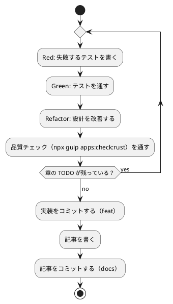

# 第 4 章: バージョン管理とデータ管理

## 4.1 はじめに

第 1 部では、TDD でデータを読み込み、前処理し、決定木で分類するプログラムを Rust で作りました。第 2 部では、そのプログラムを「変更を楽に安全にできる」状態に保つための道具立てを、バージョン管理（第 4 章）、パッケージ管理と静的解析（第 5 章）、タスクランナーと CI/CD（第 6 章）の順に整えます。

この章ではバージョン管理を扱います。機械学習のプロジェクトでは、コードに加えて **学習データ** と **学習済みモデル** というファイルが登場します。これらをコードと同じようにコミットしてよいとは限りません。この章では、Git で何を管理し、何を管理しないか、そして実験の結果を再現できるようにするには何を固定すればよいかを学びます。

Git の使い方は言語に依存しないので、[Python 版の第 4 章](../python/04-version-control-and-data-management.md)・[Java 版の第 4 章](../java/04-version-control-and-data-management.md)・[Go 版の第 4 章](../go/04-version-control-and-data-management.md) と同じ構成で進めます。Rust 版で注目してほしいのは次の 3 つです。

- **`Cargo.lock` をコミットするかどうか** — Rust には「ライブラリならコミットしない、バイナリを配るならコミットする」という言い伝えがあります。この判断をどう下したかを 4.4 節で書きます
- **`cargo test` はパッケージのルートで走る** — Go 版が `ML_DATA_DIR` を渡さないと実データのテストを走らせられなかったのに対し、Rust では既定の相対パスがテストからそのまま届きます（4.5 節）
- **標準のテストに「スキップ」が無い** — データが無いときに飛ばしたテストも `ok` と表示されます。何が起きたかを知る方法を 4.5 節で確かめます

## 4.2 コミットメッセージの重要性

コミット履歴は「なぜこの変更をしたのか」の記録です。機械学習のプロジェクトでは、「前処理を変えたら正解率が変わった」「ライブラリと予測が一致しない原因をテストに残した」といった変化の理由を、あとから追跡できることが特に重要になります。

コミットは次の 2 つを守ると追いやすくなります。

- **1 コミット 1 目的** — 機能追加と設定変更、実装と記事を 1 つのコミットに混ぜない
- **形式をそろえる** — 種類と対象がひと目で分かる書式でメッセージを書く

## 4.3 Conventional Commits

### フォーマット

本シリーズでは [Conventional Commits](https://www.conventionalcommits.org/ja/) の形式でコミットメッセージを書きます。

```text
<type>(<scope>): <subject>

<body>

<footer>
```

`scope` には変更の対象を書きます。本リポジトリでは、Rust 版の実装なら `rust`（`apps/rust` に置いているため）、記事シリーズなら `getting-start-ml`、Nix の環境定義なら `nix`、ADR なら `adr` のように書きます。

### コミットタイプ

| type | 用途 |
|------|------|
| `feat` | 新機能（章の実装など） |
| `fix` | バグ修正 |
| `test` | テストの追加・修正 |
| `refactor` | 振る舞いを変えないコードの変更 |
| `docs` | ドキュメントだけの変更（記事など） |
| `chore` | ビルドやツール、依存関係の変更 |
| `ci` | CI の設定の変更 |

### 実践例

本リポジトリの実際のコミット履歴から、Rust 版のライブラリ選定から第 3 章までを抜き出します（古い順）。

```bash
git log --oneline -- apps/rust docs/article/getting-start-ml/rust .github/workflows/rust-ci.yml docs/adr/009-rust-ml-libraries.md
```

```text
06517995 docs(adr): Rust 版のライブラリ選定を ADR 009 に決める
0dff5c2e feat(rust): Cargo プロジェクトの雛形と学習データのディレクトリを追加する
0f9f0bb5 ci(rust): Rust CI と apps:check:rust タスクを追加する
17b13ec4 feat(rust): 第 1 章のルールによる判定と正解率を追加する
6e1909d4 docs(getting-start-ml): Rust 版の第 1 章と Rust 版トップを追加する
8d1acefe feat(rust): 第 2 章の表・欠損値の補完・訓練データとテストデータへの分割を追加する
107712b3 feat(rust): 第 3 章の決定木と linfa との突き合わせを追加する
```

type と scope だけで、どのコミットが何のための変更かを区別できます。ライブラリの選定（`docs(adr)`）、プロジェクトの雛形（`feat(rust)`）、CI（`ci(rust)`）、記事（`docs(getting-start-ml)`）が分かれているので、たとえば「実装だけを追いたい」ときは `feat(rust)` のコミットだけを見れば済みます。

TypeScript 版・Java 版の履歴には、章ごとに `chore(node)`・`chore(java)` という依存関係を追加するコミットが挟まっていました。Rust 版では依存の追加が `feat` のコミットに含まれています。`Cargo.toml` に 1 行足すだけで済み、ビルドスクリプトの設定を伴わないからです。依存の追加が大きくなる章（第 7 章の linfa-linear など）では、`chore(rust)` として分けます。

## 4.4 何をコミットし、何をコミットしないか

機械学習のプロジェクトには、コミットしてはいけないファイルが増えます。理由は大きく 3 つあります。

| 分類 | 例 | コミットしない理由 |
|------|-----|------------------|
| 再配布できないもの | 学習データ | ライセンスで利用者が限られている |
| 再生成できるもの | `target/` のビルド成果物、学習済みモデル | 大きく、差分が読めず、コードと `Cargo.lock` とデータから作り直せる |
| 秘匿すべきもの | `.env` の認証情報 | 漏洩すると取り返しがつかない |

### 学習データ

本シリーズの学習データは、書籍『スッキリわかる Python による機械学習入門』の配布データです。配布データの利用は書籍購入者に限られており、本リポジトリは公開されているので、データはコミットしません。ルートの `.gitignore` で、データの置き場所 `apps/data/` をまるごと除外しています。この設定は全言語版で共通です。

```text
# 学習データ（書籍購入者のみ利用可のため再配布しない。docs/article/getting-start-ml/outline.md を参照）
apps/data/
```

### Rust プロジェクト固有のファイル

`apps/rust/.gitignore` は 2 つだけです。

```text
# Cargo のビルド成果物
target/

# 学習済みモデルの保存先（第 15 章）
model/
```

| パス | 中身 |
|------|------|
| `target/` | コンパイル結果、テストの実行ファイル、カバレッジの計測データ、`cargo build --release` の成果物 |
| `model/` | 学習済みモデルの保存先（第 15 章で使う） |

`target/` ひとつで、ほかの言語版の `node_modules/`・`build/`・`bin/`・カバレッジのプロファイルに当たるものをすべて引き受けます。Cargo はビルドに関する出力を全部ここに入れるので、除外する行が増えません。第 3 章までの実装でも、テストとカバレッジを 1 回ずつ回したあとの `target/` は 243 MB ありました。

```bash
du -sh apps/rust/target
```

```text
243M	apps/rust/target
```

一方、ダウンロードした依存のソースはプロジェクトの外にあります。

| 置き場所 | 中身 | 既定の場所 |
|---------|------|-----------|
| レジストリのキャッシュ（`CARGO_HOME/registry`） | crates.io から取得したクレートの `.crate` と展開したソース | `~/.cargo/registry` |
| ビルド成果物 | コンパイル結果・中間ファイル | プロジェクトの `target/` |

Go ではビルドの中間結果もホームディレクトリのキャッシュにありましたが、Cargo はプロジェクトごとに `target/` を作ります。そのぶん `.gitignore` に 1 行必要で、CI ではこのディレクトリもキャッシュの対象にします（第 6 章）。

### Cargo.lock をコミットするか

Rust で最も判断が要るのがこれです。`Cargo.lock` には、依存とその依存（推移的依存）の **解決済みの版とチェックサム** が記録されます。第 3 章までの `apps/rust/Cargo.lock` には 48 個のパッケージが並んでいます。

```text
[[package]]
name = "linfa"
version = "0.8.1"
source = "registry+https://github.com/rust-lang/crates.io-index"
checksum = "87b84e47ca7a9d63f5be24c104e216c8263bfada38080cbdfe1082e611a81fd3"
dependencies = [
 "approx",
 "ndarray",
 "num-traits",
 "rand",
 "sprs",
 "thiserror",
]
```

Cargo の言い伝えは「**実行ファイルを配るパッケージならコミットする、ライブラリならコミットしない**」です。理由は、ライブラリの `Cargo.lock` は使う側のビルドでは無視されるので、コミットしても利用者には効かないからです。

本シリーズのパッケージは、`src/lib.rs` を持つライブラリでありながら `src/bin/chapters.rs` という実行ファイルも持っています。そして何より、**読者が手元で同じ数値を再現できること** が目的です。`Cargo.lock` をコミットすると次の 2 つが固定されます。

1. **依存の版** — linfa 0.8.1・ndarray 0.16.1・rand 0.8.8。第 5 章で見るように、この 3 つは版が混ざると型が合わなくなります
2. **乱数の並び** — 4.6 節で見るように、`rand` の `StdRng` は版が変われば同じシードでも違う並びを返してよいことになっています

そこで、**コミットする** と決めました。`.gitignore` に `Cargo.lock` が無いのはそのためです。TypeScript 版の `package-lock.json`、Java 版の `gradle/libs.versions.toml` に当たるものだと考えると分かりやすくなります。

| 言語版 | 直接の依存を書く場所 | 推移的依存まで固定する場所 |
|--------|--------------------|------------------------|
| Rust | `Cargo.toml` | `Cargo.lock`（コミットする） |
| TypeScript | `package.json` | `package-lock.json`（コミットする） |
| Java | `gradle/libs.versions.toml` | なし（Gradle は解決のたびに決める） |
| Go | `go.mod` | `go.sum`（ハッシュのみ。版は `go.mod`） |

学習済みモデルは、コードと学習データがあれば作り直せます。モデルのファイルをコミットするより、「どのコードとどのデータから、どの設定で作ったか」をコミットで追えるようにするほうが、再現性の面でも役に立ちます。

### 除外されていることを確かめる

`.gitignore` が意図どおりに効いているかは、`git check-ignore -v` で確認できます。どのファイルの何行目の規則で除外されたかが表示されます。

```bash
git check-ignore -v apps/data/sukkiri-ml/iris.csv apps/rust/target/ apps/rust/model/
```

```text
.gitignore:8:apps/data/	apps/data/sukkiri-ml/iris.csv
apps/rust/.gitignore:2:target/	apps/rust/target/
apps/rust/.gitignore:5:model/	apps/rust/model/
```

ディレクトリのパスは末尾に `/` を付けて指定しています。末尾が `/` の規則はディレクトリだけに当てはまるので、まだ存在しないパスを `/` なしで調べると、除外されていないように見えます。

データを配置したあとに `git status --short` を実行し、`apps/data/` 以下のファイルが一覧に出てこないことも確かめておきます。

### 改行コードを固定する

コミットするファイルの中身も、環境によって変わることがあります。Windows の Git は、既定の設定（`core.autocrlf=true`）でチェックアウトするときに改行コードを CRLF に変えます。Go 版では、これが `gofmt -l` の検査を落とす原因になっていました。

Rust ではどうなるかを確かめました。CRLF の Rust ファイルを置いて `cargo fmt --check` を実行しても、**何も言われません**。rustfmt の `newline_style` の既定が `Auto` で、ファイルごとに元の改行コードを見て判断するからです。設定で `newline_style = "Unix"` にすれば Go と同じ扱いになりますが、本シリーズでは既定のままにしています。

それでも、ルートの `.gitattributes` で `apps/rust` 以下の改行コードを LF に固定しています。`text=auto` はテキストと判定したファイルだけを変換の対象にし、`eol=lf` はチェックアウトするときの改行コードを LF にします。

```text
apps/node/** text=auto eol=lf
apps/fsharp/** text=auto eol=lf
apps/csharp/** text=auto eol=lf
apps/go/** text=auto eol=lf
apps/rust/** text=auto eol=lf
```

整形の検査が通るかどうかとは別に、**同じファイルが環境によって違うバイト列になるのを避ける** ためです。改行コードが混ざると、差分が「全行変更」になってレビューできなくなり、`Cargo.lock` のような生成されるファイルでは無用な競合が起きます。

設定が効いているかは、`git ls-files --eol` で確認できます。`i/` がリポジトリの中の改行コード、`w/` が作業ディレクトリの改行コード、`attr/` が当てはまった属性です。

```bash
git ls-files --eol apps/rust/Cargo.toml apps/rust/src/dataset.rs
```

```text
i/lf    w/lf    attr/text=auto eol=lf 	apps/rust/Cargo.toml
i/lf    w/lf    attr/text=auto eol=lf 	apps/rust/src/dataset.rs
```

## 4.5 データの入手手順をコードにする

データをコミットしない代わりに、**データの入手と配置の手順** をリポジトリに残します。手順が文章だけだと、人によって置き場所がずれたり、ファイルが足りないまま実行して分かりにくいエラーになったりします。

本リポジトリでは、配置と確認を Gulp のタスクにしています（`ops/scripts/data.js`）。このタスクは言語に依存しないので、全言語版で同じものを使います。

```bash
npx gulp data:setup
npx gulp data:check
```

配布 ZIP を `tmp/` に置いてから `data:setup` を実行し、`data:check` で揃っているかを確かめます。`data:help` の表示と、失敗したときの表示は [Python 版の 4.5 節](../python/04-version-control-and-data-management.md) を参照してください。

### プログラムからデータの場所を知る

Rust の実装は、第 1 章で作った `dataset` モジュールでデータの場所を解決します。環境変数 `ML_DATA_DIR` があればその場所を、無ければ `../data/sukkiri-ml` を使います。

```rust
/// 環境変数の名前。実データの置き場をテストや CI から差し替えるために使う。
pub const DATA_DIR_ENV: &str = "ML_DATA_DIR";

/// 学習データのディレクトリを返す。`ML_DATA_DIR` が無ければ `../data/sukkiri-ml` を使う。
/// 環境変数の読み出しは、テストで差し替えられるように引数で受け取る。
pub fn from(getenv: impl Fn(&str) -> Option<String>) -> PathBuf {
    match getenv(DATA_DIR_ENV) {
        Some(value) if !value.is_empty() => PathBuf::from(value),
        _ => Path::new("..").join("data").join("sukkiri-ml"),
    }
}

/// 実行中のプロセスの環境変数から学習データのディレクトリを返す。
pub fn current() -> PathBuf {
    from(|name| std::env::var(name).ok())
}
```

`std::env::var` は `Result<String, VarError>` を返し、`.ok()` で `Option<String>` にしています。Go の `os.LookupEnv` が `(値, 見つかったか)` の 2 つを返したのに対して、Rust には `Option` があるので「無いかもしれない値」を 1 つの型で表せます。`Some(value) if !value.is_empty()` というガード付きのパターンで、「値があって、かつ空文字列でない」を 1 行で書けるのも `match` の利点です。

`Path::new("..").join("data").join("sukkiri-ml")` と書いているのは、Windows で区切り文字が `\` になるようにするためです。`PathBuf` は OS ごとの区切り文字を知っています。

### cargo test はパッケージのルートで走る

Go 版では、`go test` が **パッケージのディレクトリ** を作業ディレクトリにするため、既定の相対パス `../data/sukkiri-ml` がテストからは届かず、実データのテストを走らせるには毎回 `ML_DATA_DIR` を渡す必要がありました。

Cargo は違います。`cargo test` が起動するテストの実行ファイルの作業ディレクトリは、**そのパッケージのルート**（`Cargo.toml` があるディレクトリ、つまり `apps/rust`）です。`src/` の中でも `tests/` の中でも変わりません。そのため `../data/sukkiri-ml` が `apps/data/sukkiri-ml` を指し、環境変数を渡さなくても実データのテストが走ります。

```bash
cargo test
```

```text
test result: ok. 38 passed; 0 failed; 0 ignored; 0 measured; 0 filtered out; finished in 0.00s
...
     Running tests/kvst_data.rs (target/debug/deps/kvst_data-83e42ca267d1e5ee)

running 1 test
test 実データを読み込んで正解率を求める ... ok

test result: ok. 1 passed; 0 failed; 0 ignored; 0 measured; 0 filtered out; finished in 0.00s
```

第 3 章までのテストは、単体テスト 38 件（`src/` の中の `#[cfg(test)] mod tests`）と、実データのテスト 9 件（`tests/iris_data.rs` が 4 件、`tests/iris_tree.rs` が 4 件、`tests/kvst_data.rs` が 1 件）の計 47 件です。

| 場面 | 作業ディレクトリ | 既定のパスが指す先 |
|------|----------------|------------------|
| `cargo run --bin chapters -- chapter01`（`apps/rust` で実行） | `apps/rust` | `apps/data/sukkiri-ml` |
| `cargo test`（`apps/rust` で実行） | `apps/rust` | `apps/data/sukkiri-ml` |
| `go test ./...`（Go 版） | `apps/go/internal/chapterNN` | `apps/go/internal/data/sukkiri-ml`（届かない） |

ツールが違えば、気をつける場所も変わります。Java 版では「Gradle はタスクの入力が変わらなければテストを再実行しない」ので `ML_DATA_DIR` を入力として宣言する手当てが要りました。Cargo には結果のキャッシュが無く、`cargo test` は毎回テストを実行します（変わっていなければコンパイルを省くだけです）。

### データが無い環境でもテストを通す

コミットしないデータに依存するテストは、データの無い環境（CI や、データをまだ入手していない読者の環境）では失敗してしまいます。ほかの言語版では、テストフレームワークの「スキップ」で飛ばしていました。

| 言語版 | スキップの仕組み |
|--------|----------------|
| TypeScript | `describe.skipIf` |
| Java | `Assumptions.assumeTrue` |
| Go | `t.Skip` |
| Rust | **無い** |

Rust の標準のテストには、実行時に「このテストは条件が揃わないので飛ばす」と宣言する方法がありません。`#[ignore]` はソースに書く静的な印なので、データの有無では切り替えられません。そこで Rust 版では、**データが無ければ理由を標準エラーに出して早く戻る** 形にしました。

```rust
/// 学習データのファイルを返す。無ければ None（テストはスキップする）。
/// Rust の標準のテストには「スキップ」が無いので、早く戻って理由を表示する。
fn data_file() -> Option<PathBuf> {
    let csv_file = dataset::current().join("KvsT.csv");

    if csv_file.exists() {
        Some(csv_file)
    } else {
        eprintln!("学習データ KvsT.csv が配置されていない（gulp data:setup）のでスキップする");

        None
    }
}

#[test]
fn 実データを読み込んで正解率を求める() {
    let Some(csv_file) = data_file() else {
        return;
    };

    // 以降は実データを使った検証
}
```

`let ... else` は「パターンに合わなければ抜ける」ことだけを書ける構文です。`match` で `None` の腕に `return` を書くより短く、後続のコードで `csv_file` が `PathBuf` であることが確定します。

この形には弱点があります。**飛ばしたテストも `ok` と表示される** ことです。データの無い場所を `ML_DATA_DIR` に指定して実行しても、件数は変わりません。

```bash
ML_DATA_DIR=/nonexistent cargo test
```

```text
test result: ok. 38 passed; 0 failed; 0 ignored; 0 measured; 0 filtered out; finished in 0.01s
...
running 1 test
test 実データを読み込んで正解率を求める ... ok

test result: ok. 1 passed; 0 failed; 0 ignored; 0 measured; 0 filtered out; finished in 0.00s
```

Go 版なら `--- SKIP` と表示されたところが、`ok` のままです。何が起きたかを知るには、標準出力・標準エラーを抑制しない `--nocapture` を付けます。

```bash
ML_DATA_DIR=/nonexistent cargo test --test kvst_data -- --nocapture
```

```text
running 1 test
学習データ KvsT.csv が配置されていない（gulp data:setup）のでスキップする
test 実データを読み込んで正解率を求める ... ok

test result: ok. 1 passed; 0 failed; 0 ignored; 0 measured; 0 filtered out; finished in 0.00s
```

`--` の前は `cargo` への引数、後ろはテストの実行ファイルへの引数です。もう 1 つの見分け方が、カバレッジの差です。データの有無でカバレッジが何ポイント動くかは第 5 章で測ります。実データのテストが実際に走ったかどうかは、その差に表れます。

単体テストは架空の値で作ったデータで書き、実データのテストは `tests/` に分けて早期に戻る、という 2 段構えにすると、CI ではデータ無しでも品質チェックが回り、手元ではデータを使った確認もできます。単体テストのデータに配布データの行をそのまま写さないことも大切です。テストのコードはコミットされるので、写した行はデータの再配布になってしまいます。

## 4.6 実験を再現できるようにする

機械学習の結果は、コードとデータが同じでも、次のものが違うと変わります。

| 変わる原因 | 固定する方法 | 本リポジトリでの置き場所 |
|-----------|------------|----------------------|
| 乱数（データの分割、モデルの初期値） | シードを指定する | 各章のコード（第 2 章の `SEED`） |
| 乱数を作るアルゴリズム | `rand` の版を固定し、並べ替えも自分で書く | `Cargo.lock`、`src/chapter02/preprocessing.rs` の `shuffle` |
| ライブラリのバージョン | 版とチェックサムを記録する | `apps/rust/Cargo.lock`（第 5 章） |
| Rust のバージョン | Nix の環境定義で指定する | `ops/nix/environments/rust/shell.nix`（第 5・6 章） |

### 乱数のシード

第 2 章の `shuffle` は、シードから作った乱数生成器で Fisher-Yates の並べ替えをします。

```rust
/// シードを使って Fisher-Yates のシャッフルで並べ替える。元のスライスは変えない。
pub fn shuffle<E: Clone>(items: &[E], seed: u64) -> Vec<E> {
    let mut rng = StdRng::seed_from_u64(seed);
    let mut shuffled = items.to_vec();

    for i in (1..shuffled.len()).rev() {
        let j = next_index(&mut rng, i + 1);
        shuffled.swap(i, j);
    }

    shuffled
}
```

引数が `&[E]`（借用したスライス）で、戻り値が `Vec<E>`（所有する新しいベクタ）になっているところが Rust らしい書き方です。`items.to_vec()` で複製してから並べ替えるので、呼び出し元のデータは変わりません。「元のスライスは変えない」という約束を、コメントではなく **型** が表しています。呼び出し元が `&mut` を渡していない以上、この関数が元のデータを書き換えることはコンパイラが許しません。

並びは第 2 章のテストで固定してあります。

```rust
#[test]
fn 並べ替えの並びはほかの言語版と違う() {
    let items: Vec<usize> = (0..10).collect();

    // Java 版は [4 8 9 6 3 5 2 1 7 0]、Go 版は [6 8 2 3 7 5 9 1 0 4]
    assert_eq!(shuffle(&items, 0), vec![9, 3, 6, 4, 8, 1, 5, 2, 0, 7]);
}
```

同じシードなら同じ並びになり、シードが違えば違う並びになることも、第 2 章のテストで確かめています。テストがあるので、うっかりシードを使わない実装に変えてしまっても気付けます。

### 乱数のアルゴリズムは「版で変わってよい」ことになっている

シードを固定しても、乱数を作るアルゴリズムが変われば結果は変わります。ここで、**rand のドキュメントがはっきり言明している** ところが Rust の面白いところです。`StdRng`（`rand` 0.8.8）のドキュメントには次のように書かれています。

```text
The algorithm is deterministic but should not be considered reproducible
due to dependence on configuration and possible replacement in future
library versions. For a secure reproducible generator, we recommend use of
the [rand_chacha] crate directly.
```

「決定的ではあるが、設定への依存と将来の版での差し替えがあるので、再現可能と考えるべきではない」。つまり `StdRng::seed_from_u64(0)` が返す並びは、**rand の版が変われば変わってよい** のです。実際、`rand` 0.8.8 の `StdRng` の中身は ChaCha ブロック暗号の 12 ラウンド版（`rand_chacha::ChaCha12Rng`）です。

| 言語版 | 乱数の保証 | 根拠 |
|--------|----------|------|
| Java | 同じシードなら常に同じ数列（48 ビット線形合同法） | `java.util.Random` の仕様の一部 |
| Kotlin | 同じ版の間でのみ同じ | 標準ライブラリのドキュメント |
| Go | ドキュメントに言明が無い（手元の 1.25.5 と 1.26.5 では同じだった） | Go 版の第 4 章 |
| Rust | **再現可能と考えるべきではない**とドキュメントが明言 | `rand` 0.8.8 の `StdRng` |

では Rust 版はどうやって再現性を確保しているのかというと、**`Cargo.lock` で rand 0.8.8 に固定している** からです。4.4 節で `Cargo.lock` をコミットすると決めた理由の 2 つめが、まさにこれです。lock ファイルが無ければ、`rand = "0.8"` というキャレット要件（第 5 章）が 0.8 系の最新を選び、その版で `StdRng` が差し替えられていれば、同じコード・同じシードで違う並びになります。

より強い再現性が要るなら、rand のドキュメントが勧めるとおり `rand_chacha` を直接使い、アルゴリズムそのものをコードで指定する手があります。本シリーズがそこまでしていないのは、`Cargo.lock` で十分だからです。ただし、この選択は「**lock ファイルをコミットする**」という 4.4 節の判断に依存していることを覚えておいてください。片方だけを崩すと再現性が失われます。

### ほかの言語版と数値が一致しない理由

同じシード 0 でも、Python 版・Kotlin 版・Java 版・Go 版・Rust 版でテストデータに入る行は違います。乱数を作るアルゴリズムが NumPy・Kotlin・Java・Go の `math/rand`・ChaCha12 で違うためです。実際、第 3 章の深さ 2 の決定木がテストデータ 45 件のうち正しく分類した数は、Kotlin 版が 42 件、Java 版と Go 版が 43 件、Rust 版が 41 件でした。数が違っても、決定木の作り方が間違っているわけではありません。分けられたデータが違うだけです。

記事に載せる正解率などの数値は、シードと版を固定した実装を実データで動かした結果です。数値をテストで固定するときは、どのシードで得た値かを必ずコードに残します。

## 4.7 TDD とコミットのタイミング

TDD のサイクルとコミットは、次のように対応させると履歴が読みやすくなります。



- テストが通らない状態ではコミットしない
- 実装と記事は別のコミットにする
- 依存関係の追加（`chore`）、CI の変更（`ci`）も、それぞれ別のコミットにする
- 学習データ・モデル・`target/` がステージングされていないことを、コミットの前に `git status` で確かめる
- **`Cargo.toml` を変えたコミットには `Cargo.lock` も含める** — 依存を足したのに lock を入れ忘れると、次の人のビルドで違う版が選ばれます

## 4.8 まとめ

この章では、機械学習のプロジェクトでのバージョン管理を学びました。

1. **Conventional Commits** — type と scope で、変更の種類と対象が分かるコミットメッセージを書く。理由は本文に書く
2. **コミットしないものを決める** — 再配布できない学習データ、再生成できる `target/` とモデルを `.gitignore` で除外する。`target/` の 2 行だけで、ほかの言語版の複数の除外をまかなえる
3. **`Cargo.lock` はコミットする** — 実行ファイルを配るパッケージであり、読者が同じ数値を再現できることが目的だから。推移的依存の版とチェックサムまで固定される
4. **改行コードを固定する** — rustfmt は CRLF を指摘しないが、`.gitattributes` で `apps/rust` 以下を LF にそろえ、差分と競合を避ける
5. **入手手順をコードにする** — データを置く場所と確認方法を Gulp タスクにし、プログラムからは `dataset::current` で場所を解決する
6. **`cargo test` はパッケージのルートで走る** — 既定の相対パスがテストからそのまま届く。Go 版で必要だった `ML_DATA_DIR` が要らない
7. **標準のテストにスキップが無い** — データが無ければ早く戻る形にし、理由は `eprintln!` で残す。飛ばしても `ok` と出るので、`--nocapture` かカバレッジの差で確かめる
8. **再現性は lock ファイルに支えられている** — `StdRng` は「再現可能と考えるべきではない」とドキュメントが言う。`Cargo.lock` で rand 0.8.8 に固定してはじめて、同じ並びが保証される

次の章では、依存とツールの版を固定する Cargo の仕組みと、コードの品質を機械的に確かめる rustfmt・clippy・cargo-llvm-cov を扱います。
