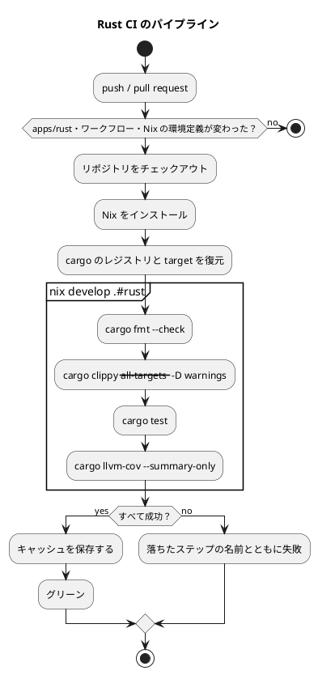

# 第 6 章: タスクランナーと CI/CD

## 6.1 はじめに

前の章で、整形・静的解析・テスト・カバレッジの道具がそろいました。ただし、そろっているだけでは使われません。4 つのコマンドを毎回手で打つのは面倒で、打ち忘れれば検査は無かったことになります。

この章では、次の 2 つを整えます。

- **タスクランナー** — 品質チェックを 1 つのコマンドにまとめ、手元でいつでも実行できるようにする
- **CI（継続的インテグレーション）** — 同じ検査を GitHub Actions で自動的に実行し、壊れた状態が main に入らないようにする

TypeScript 版は npm scripts の `check`、Java 版は Gradle の `check` にまとめていました。Rust の `cargo` には、Go と同じく **複数のコマンドをまとめたタスクを定義する場所がありません**。この章では、その穴を何で埋めるかから始めます。

## 6.2 タスクランナー — cargo と Gulp

### cargo にタスクの定義は無い

`Cargo.toml` に `scripts` に当たる項目はありません。`cargo` 自身がビルドツールでありテストランナーであり、整形も静的解析もサブコマンドとして持っているので、「コマンドを組み合わせたタスク」を書く場所が用意されていないのです。

Rust のプロジェクトがこの穴を埋める方法は、おおむね次の 3 つです。

| 方法 | 利点 | 欠点 |
|------|------|------|
| `Makefile` や `justfile` を置く | 追加の依存が要らない（just は要る）。慣習として広く使われている | Windows で素直に動かない。make はタブとスペースの区別など固有の癖がある |
| `cargo-make` を入れる | TOML でタスクを書け、cargo のサブコマンドとして呼べる | 依存が 1 つ増える |
| 既にあるタスクランナーを使う | 追加の依存が要らない | そのタスクランナーがある環境が前提になる |

本リポジトリは 3 つ目を選びました。14 言語版のサンプル実装が 1 つのリポジトリに同居していて、学習データの配置（第 4 章の `data:setup`）などを Gulp のタスクで受け持っているからです。Rust 版のためだけに `cargo-make` を足すより、既にあるところに定義を 1 つ足すほうが、読者が覚えることが少なくなります。

### apps.js の Rust の定義

`ops/scripts/apps.js` に、Rust 版の定義を足しています。

```javascript
  {
    name: 'rust',
    nix: 'rust',
    dir: path.join('apps', 'rust'),
    tools: [{ cmd: 'cargo', version: 'cargo --version' }],
    setup: 'cargo fetch',
    // CI（.github/workflows/rust-ci.yml）と同じ順に、整形・lint・テスト・カバレッジを検査する
    check:
      'cargo fmt --check && cargo clippy --all-targets -- -D warnings && cargo test && cargo llvm-cov --summary-only',
  },
```

| 項目 | 意味 |
|------|------|
| `dir` | 実行する場所（`apps/rust`） |
| `tools` | 前提になるコマンドと、それが使えるかを確かめる方法 |
| `setup` | 依存を取得する（`apps:setup:rust`）。`cargo fetch` は `Cargo.lock` のとおりにダウンロードする |
| `check` | 品質チェック（`apps:check:rust`） |

`check` は 4 つのコマンドを `&&` でつないだものです。前が成功したときだけ次に進むので、整形が崩れていればそこで止まります。Go 版の `check` が `test -z "$(gofmt -l .)"` というシェルの技を必要としたのに対し、Rust 版はすべてのコマンドが **終了コードで失敗を伝える** ので、素直に `&&` で並べられます（第 5 章）。

`tools` に書いた `cargo --version` が失敗したとき（Rust が入っていないとき）は、Gulp が `nix develop .#rust` の中で同じコマンドを実行します。読者は Rust を入れていなくても、Nix さえあれば検査を実行できます。

### タスクの実行

```bash
npx gulp apps:check:rust
```

最後まで通ると、4 つめの `cargo llvm-cov --summary-only` の表で終わります（ファイル名のパスは短くしています）。

```text
running 1 test
test 実データを読み込んで正解率を求める ... ok

test result: ok. 1 passed; 0 failed; 0 ignored; 0 measured; 0 filtered out; finished in 0.00s

Filename                       Regions  Missed Regions   Cover  Functions  Missed  Executed   Lines  Missed Lines   Cover
--------------------------------------------------------------------------------------------------------------------------
bin/chapters.rs                     41              41   0.00%          4       4     0.00%      20            20   0.00%
chapter01.rs                       258              64  75.19%         28       6    78.57%     154            30  80.52%
chapter02.rs                        37              18  51.35%          3       2    33.33%      19            10  47.37%
chapter02/main.rs                   45              45   0.00%          2       2     0.00%      20            20   0.00%
chapter02/preprocessing.rs         436              16  96.33%         29       1    96.55%     218             5  97.71%
chapter02/table.rs                 185               6  96.76%         16       0   100.00%     106             0 100.00%
chapter03/decisiontree.rs          447              13  97.09%         38       0   100.00%     246             2  99.19%
chapter03/linfatree.rs             132               7  94.70%         15       2    86.67%      66             2  96.97%
chapter03/main.rs                   95              13  86.32%          4       0   100.00%      45             1  97.78%
dataset.rs                          38               1  97.37%          8       0   100.00%      23             0 100.00%
--------------------------------------------------------------------------------------------------------------------------
TOTAL                             1714             224  86.93%        147      17    88.44%     917            90  90.19%

[22:58:14] Finished 'apps:check:rust' after 3.64 min
```

第 3 章までの全体で 3.64 分でした。整形も clippy もテストも、依存（linfa と ndarray）のコンパイルが済んでいれば数秒ですが、コンパイルし直しになると数分かかります。

手元に Rust が入っていれば、Nix を使わずにそのまま実行されます。本記事を書いている環境では、手元の cargo が 1.97.1、Nix の環境の cargo が 1.91.0 でした。`Cargo.toml` の `edition = "2024"` はどちらでも使えるので、同じコードが両方で通ります。

ただし、**数字は完全には一致しません**。上の表は手元の rustc 1.97.1 で測ったもので、リージョンの合計が 1714、カバレッジが 86.93% です。第 5 章で Nix の rustc 1.91.1 で測ったときは 1758 リージョン・85.67% でした。カバレッジの分母である「リージョン」はコンパイラがコードを分けた区間なので、**コンパイラの版が変われば分母も変わります**。カバレッジの数字を版をまたいで比べるときは、この点に気をつけてください。

| 環境 | cargo の版 | 用途 |
|------|-----------|------|
| Nix（`nix develop .#rust`） | 1.91.0（rustc 1.91.1） | CI と、ツールをそろえたいとき |
| 手元のマシン | 1.97.1 | 日常の編集 |

ただし、**手元と Nix ではコンパイラが違うので、`target/` のキャッシュは共有されません**。片方で `cargo test` を通したあと、もう片方で実行すると全部コンパイルし直します。依存に linfa を含む本シリーズでは、これが数分かかります。普段どちらか一方に決めておくと待ち時間が減ります。

### 章のプログラムを実行する

各章には `run(out: &mut impl Write) -> Result<()>` があり、`src/bin/chapters.rs` から章を選んで呼べます。

```rust
    let result = match args.get(1).map(String::as_str) {
        Some("chapter01") => chapter01::run(&mut out).map_err(|e| e.to_string()),
        Some("chapter02") => chapter02::run(&mut out).map_err(|e| e.to_string()),
        Some("chapter03") => chapter03::run(&mut out).map_err(|e| e.to_string()),
        _ => {
            let _ = writeln!(
                io::stderr(),
                "使い方: cargo run --bin chapters -- (chapter01 | chapter02 | chapter03)"
            );

            return ExitCode::FAILURE;
        }
    };
```

引数が無いか、知らない名前を渡すと、使える名前を教えて終了コード 1 で終わります。

```bash
cargo run --quiet --bin chapters
```

```text
使い方: cargo run --bin chapters -- (chapter01 | chapter02 | chapter03)
```

`--` の前は `cargo` への引数、後ろはプログラムへの引数です。`--quiet` を付けるとビルドの進捗が出ません。

学習データを配置してあれば、章の処理を実行できます。

```bash
cargo run --quiet --bin chapters -- chapter03
```

```text
深さ	訓練データ	テストデータ	linfa
1	0.7143	0.5556	0.5556
2	0.9524	0.9111	0.9111
3	0.9619	0.9111	0.9111
4	0.9714	0.9111	0.8444
5	0.9810	0.9111	0.8444
制限なし	1.0000	0.9111	0.8444

深さ 2 の決定木:
花弁幅 <= 0.2950
  Iris-setosa
花弁幅 > 0.2950
  花弁幅 <= 0.6900
    Iris-versicolor
  花弁幅 > 0.6900
    Iris-virginica
```

`main` が `ExitCode` を返し、`run` が `io::stdout().lock()` を受け取る形になっているのは、テストから同じ関数を呼んで出力を固定するためです（第 1 章）。`println!` で書いていたら、この出力はテストできませんでした。Java 版が `PrintStream` を、Go 版が `io.Writer` を受け取っていたのと同じ考え方で、Rust では `&mut impl Write` というジェネリックな引数がそれに当たります。実行時には標準出力を、テストでは `Vec<u8>` を渡します。

### リリースビルド

`cargo run` と `cargo build` は、既定で `dev` プロファイル（最適化なし・デバッグ情報あり）を使います。速さを測るときは `--release` を付けます。

```bash
cargo build --release
./target/release/chapters chapter03
```

`--release` のビルドは `target/release/`、`dev` のビルドは `target/debug/` に分かれて置かれます。どちらも `target/` の下なので、第 4 章の `.gitignore` の 1 行で除外済みです。本シリーズでは、記事に載せる数値を測るときも `dev` プロファイルのままにしています。最適化は結果の数値を変えませんし、コンパイルの待ち時間のほうが長くなるからです。第 15 章で API を動かすときだけ `--release` を使います。

## 6.3 Notebook について

Python 版と Kotlin 版では、この節で Notebook によるデータの探索と、出力セルを消してからコミットする仕組みを扱いました。Rust 版では Notebook を使わず、データの様子は各章の `run` の出力とテストで確かめています。

Notebook で分かったことをテストに移す流れと、出力セルに学習データが残らないようにする仕組みは、[Python 版の 6.3 節](../python/06-task-runner-and-ci-cd.md)（nbstripout）と [Kotlin 版の 6.3 節](../kotlin/06-task-runner-and-ci-cd.md)（Gradle のタスクで出力セルを検査・削除）を参照してください。グラフによる可視化も、Python 版・Kotlin 版の各章を参照してください。

## 6.4 cargo と Gulp の分担

2 つの層は、次のように分担しています。

| 役割 | `cargo`（`apps/rust`） | Gulp（リポジトリのルート） |
|------|----------------------|------------------------|
| 何を知っているか | Rust のソース・依存・ビルドの構成 | 言語ごとのアプリの場所・前提ツール・学習データの場所 |
| 品質チェックの中身 | 持たない（4 つのコマンドを人が並べる） | `apps.js` の `check` に 1 行で持つ |
| 前提ツールが無いとき | 何もしない | Nix の環境（`nix develop .#rust`）に切り替える |
| 全言語をまとめて | 扱わない | `apps:check` で、学習データの確認（`data:check`）と全言語の検査を続けて実行する |

Java 版・TypeScript 版では「検査の中身はビルドツール側に置き、Gulp は呼ぶだけ」と分担できました。cargo にはその置き場所が無いので、4 つのコマンドを並べた 1 行が `apps.js` と CI の 2 か所に書かれています。増やすときは 2 か所を直す必要がある、というのが Go 版と Rust 版で払っている代償です。

## 6.5 GitHub Actions による CI

### ワークフロー設定

`.github/workflows/rust-ci.yml` の全文です。

```yaml
name: Rust CI

on:
  push:
    branches: [main]
    paths:
      - 'apps/rust/**'
      - 'ops/nix/environments/rust/**'
      - '.github/workflows/rust-ci.yml'
  pull_request:
    paths:
      - 'apps/rust/**'
      - 'ops/nix/environments/rust/**'
      - '.github/workflows/rust-ci.yml'

jobs:
  test:
    runs-on: ubuntu-latest
    steps:
      - uses: actions/checkout@v5

      - uses: cachix/install-nix-action@v31
        with:
          github_access_token: ${{ secrets.GITHUB_TOKEN }}

      - name: Cache cargo
        uses: actions/cache@v4
        with:
          path: |
            ~/.cargo/registry
            ~/.cargo/git
            apps/rust/target
          key: ${{ runner.os }}-cargo-${{ hashFiles('apps/rust/Cargo.lock') }}
          restore-keys: |
            ${{ runner.os }}-cargo-

      # rustfmt は整形の差分をファイル名と行番号つきで出す
      - name: Check formatting
        run: |
          nix develop .#rust --command bash -c 'cd apps/rust && cargo fmt --check'

      # clippy の警告はすべてエラーにする
      - name: Clippy
        run: |
          nix develop .#rust --command bash -c 'cd apps/rust && cargo clippy --all-targets -- -D warnings'

      # 実データのテストは学習データが無ければスキップされる
      - name: Test
        run: |
          nix develop .#rust --command bash -c 'cd apps/rust && cargo test'

      - name: Coverage
        run: |
          nix develop .#rust --command bash -c 'cd apps/rust && cargo llvm-cov --summary-only'
```

### ワークフローのポイント

| 設定 | 理由 |
|------|------|
| `paths` | Rust 版に関係のない変更（ほかの言語版・記事）では走らせない。14 言語版が同居するリポジトリなので、この絞り込みが無いと毎回すべての CI が動く |
| `ops/nix/environments/rust/**` を `paths` に含める | 環境定義が変われば Rust のビルドも変わる。rustc や clippy の版が上がったことに、ここで気付ける |
| Nix で環境をそろえる | 手元・CI のどちらも rustc 1.91.1・clippy 0.1.91 になる。GitHub が用意する Rust の版に左右されない |
| キャッシュの対象が 3 つ | レジストリ（`~/.cargo/registry`）・git 依存（`~/.cargo/git`）・ビルド成果物（`apps/rust/target`）。第 4 章で見たとおり、Cargo は `target/` を **プロジェクトの中** に作るので、Go 版と違ってここもキャッシュの対象になる |
| キャッシュのキーに `Cargo.lock` | 依存が変わったときだけキャッシュを作り直す。`restore-keys` があるので、キーが一致しなくても古いキャッシュから始められる |
| ステップを 4 つに分ける | どの検査で落ちたかが GitHub の画面でひと目で分かる。`&&` で 1 行にまとめた Gulp のタスクとの違い |
| 学習データを置かない | 配布データは再配布できない。実データのテストは早期に戻る（第 4 章） |
| シングルクォートで囲む | `bash -c '...'` の中を単引用符にすると、`$( )` や変数が **外側のシェルで展開されない**。Go 版が二重引用符でこの落とし穴を踏んだ（[Go 版の 6.6 節](../go/06-task-runner-and-ci-cd.md)）ので、Rust 版では最初から単引用符にしている |

### CI パイプラインの流れ



学習データが無いので、実データのテストは早期に戻り、カバレッジは第 5 章で見た「データなし」の数字になります。カバレッジは表示するだけで、下限を設けて失敗させることはしていません。データの有無で 12 ポイント動く数字に下限を設けても意味が薄いからです。

## 6.6 カバレッジで気をつけたこと — Nix と LLVM

このワークフローで 1 か所だけ、素直に動かなかったところがあります。カバレッジです。

`cargo-llvm-cov` は、rustc が出力した計測データ（`.profraw`）を LLVM のツール（`llvm-cov`・`llvm-profdata`）で集計します。この 2 つは、rustup を使っている環境では `llvm-tools-preview` というコンポーネントとして入ります。`cargo-llvm-cov` は既定でそこを探しに行きます。

Nix の環境には rustup がありません。そのまま実行すると、LLVM のツールが見つからずに失敗します。そこで、Nix の環境定義（`ops/nix/environments/rust/shell.nix`）で、nixpkgs の LLVM の場所を環境変数で教えています。

```nix
  shellHook = ''
    ${baseShell.shellHook}
    # cargo-llvm-cov は rustup の llvm-tools-preview を探すので、nixpkgs の LLVM を教える
    export LLVM_COV="${packages.llvmPackages.libllvm}/bin/llvm-cov"
    export LLVM_PROFDATA="${packages.llvmPackages.libllvm}/bin/llvm-profdata"
  '';
```

`buildInputs` に `cargo-llvm-cov` と `llvmPackages.libllvm` を入れ、この 2 行で場所を渡す——これだけで、CI でも手元の Nix 環境でもカバレッジが測れるようになりました。

この手当ては、パッケージマネージャー（Nix）と言語のツールチェーン管理（rustup）が **どちらもツールを配る** ことから生じています。片方に寄せると、もう片方の前提が崩れます。同じ種類の摩擦は Java 版の Gradle ツールチェーンと Nix の JDK でも起きました。**環境を 2 つの仕組みで作るときは、境界に何が要るかを最初に確かめておく** ほうが早く済みます。

## 6.7 三種の神器と CI

第 4〜6 章で整えたものを、ソフトウェア開発の「三種の神器」（バージョン管理・テスティング・自動化）に当てはめると次のようになります。

| 三種の神器 | 道具 | 本シリーズでの使い方 |
|-----------|------|------------------|
| バージョン管理 | Git、Conventional Commits、`.gitignore`、`.gitattributes` | 学習データ・`target/`・モデルをコミットしない。`Cargo.toml` と `Cargo.lock` はコミットする |
| テスティング | 標準の `#[test]`、`#[cfg(test)] mod tests`、`tests/` の結合テスト、`cargo llvm-cov` | 単体テストは架空の値、実データのテストは `tests/` に分けて早期に戻る |
| 自動化 | `cargo`、rustfmt、clippy、cargo-llvm-cov、GitHub Actions、Nix、Gulp | 環境の再現、品質チェックの一括実行、データの配置、CI |

### 利用可能なコマンド一覧

| コマンド | 内容 | 実行する場所 |
|---------|------|------------|
| `npx gulp data:setup` | 学習データを配置する | リポジトリのルート |
| `npx gulp data:check` | 学習データの配置を確認する | リポジトリのルート |
| `npx gulp apps:setup:rust` | 依存を取得する（`cargo fetch`） | リポジトリのルート |
| `npx gulp apps:check:rust` | 整形・clippy・テスト・カバレッジをまとめて実行する（Rust が無ければ Nix の中で） | リポジトリのルート |
| `cargo fmt --check` | 整形されていない箇所を差分で表示する | `apps/rust` |
| `cargo fmt` | コードを整形する | `apps/rust` |
| `cargo clippy --all-targets -- -D warnings` | 静的解析を実行し、警告をエラーにする | `apps/rust` |
| `cargo test` | テストを実行する | `apps/rust` |
| `cargo test --test kvst_data -- --nocapture` | 結合テストを 1 つだけ、出力を抑えずに実行する | `apps/rust` |
| `cargo llvm-cov --summary-only` | カバレッジの要約を表示する | `apps/rust` |
| `cargo llvm-cov --html` | カバレッジの HTML レポートを `target/llvm-cov/html/` に出す | `apps/rust` |
| `cargo run --bin chapters -- chapter03` | 章の処理を実行する（学習データが必要） | `apps/rust` |
| `cargo build --release` | 最適化してビルドする | `apps/rust` |

Windows では、`apps:check:rust` の 4 つのコマンドはどれも cargo のサブコマンドなので、Go 版と違って PowerShell でもそのまま動きます（`&&` は PowerShell 7 以降で使えます）。

## 6.8 まとめ

この章では、品質チェックを自動化し、どの環境でも同じ手順で実行できるようにしました。

1. **cargo にタスクの定義は無い** — `Makefile`・`cargo-make`・既存のタスクランナーのどれかで埋める。本リポジトリは Gulp の `apps:check:rust` に 1 行で持たせた
2. **すべてのコマンドが終了コードで失敗を伝える** — `&&` で素直に並べられる。Go 版が必要とした `test -z "$( )"` の技が要らない
3. **GitHub Actions** — `paths` で Rust 版に関係する変更に絞り、Nix で rustc 1.91.1 をそろえ、4 つの検査をステップに分ける。レジストリと `target/` をキャッシュする
4. **`target/` はプロジェクトの中にある** — Go と違い、CI のキャッシュの対象にプロジェクト内のディレクトリが入る
5. **cargo-llvm-cov に LLVM の場所を教える** — Nix には rustup が無いので、`LLVM_COV`・`LLVM_PROFDATA` を shellHook で渡す
6. **学習データの無い CI** — 実データのテストは早期に戻り、カバレッジは表示だけにする

第 2 部で、TDD を回し続けるための道具立てがそろいました。次の第 3 部では、回帰問題と、欠損値・カテゴリ値・外れ値を含む現実的なデータの前処理に取り組みます。
