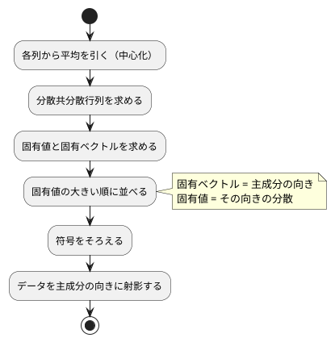

# 第 13 章: 主成分分析による次元削減

## 13.1 はじめに

ここまでの章では、正解ラベルのあるデータで予測をしてきました。この章から扱う **教師なし学習** では、正解ラベルを使わずに、データそのものの構造を調べます。

最初に扱うのは **主成分分析（PCA）** です。住宅価格のデータには 15 個もの列がありますが、列どうしは互いに関係しあっていて、実際にはもっと少ない数の「軸」で大部分を説明できることがあります。主成分分析は、データのばらつきを最もよく説明する新しい軸を探し、たくさんの列を少数の軸に要約します。

[Python 版の第 13 章](../python/13-principal-component-analysis.md) は NumPy の固有値分解で自作し、scikit-learn の `PCA` と突き合わせました。[Java 版](../java/13-principal-component-analysis.md) は Tribuo の `DenseMatrix` の固有値分解を借り、Tribuo に主成分分析のモジュールが無いためライブラリへの置き換えの節を省きました。

Rust 版は事情が違います。[ADR 009](../../../adr/009-rust-ml-libraries.md) のとおり linfa には **linfa-reduction** という次元削減のクレートがあり、`Pca` がそのまま使えます。そこで Rust 版は、ほかの章と同じく **自作してから linfa と突き合わせる** 構成にします。ただし固有値分解だけは事情があります。

- **ndarray 0.16 には固有値分解が無い**。`ndarray-linalg` は LAPACK（C と Fortran のライブラリ）を要求するので、`cargo test` だけで動く環境を保つために入れません（[ADR 009](../../../adr/009-rust-ml-libraries.md)）
- そこで **対称行列に限ったヤコビ法** を自作します。分散共分散行列は必ず対称なので、これで足ります

この章で拾う Rust の論点は次の 3 つです。

- **「解けない」を型で表す**。固有値分解は収束しないことがあります。Java なら `Optional`、Go なら `(value, error)` ですが、Rust は章の `enum Error` に `NotConverged` を足し、`?` で上へ返します
- **借用しながら書き換える**。ヤコビ法は行列の行と列を同時に回します。`work[[k, p]]` と `work[[k, q]]` を一度に借りることはできないので、値を取り出してから書き戻します
- **ライブラリの数値は「読む」のではなく「測る」**。linfa の `explained_variance_ratio()` は、条件によっては `NaN` を返します。ドキュメントではなく、テストで実測して記録します

## 13.2 主成分分析とは

### ばらつきが最も大きい方向を探す

2 つの列が強く相関しているデータを散布図にすると、点は斜めの帯のように並びます。このとき、帯に沿った 1 本の軸を取れば、2 つの列の情報をほぼ 1 つの数値で表せます。この「ばらつき（分散）が最も大きい方向」が **第 1 主成分** です。第 2 主成分は、第 1 主成分と直交する方向のうち、ばらつきが最も大きい方向です。

### 分散共分散行列の固有ベクトル

主成分は、次の手順で求められます。



**分散共分散行列** は、対角に各列の分散、それ以外に 2 列の共分散を並べた行列です。この行列の **固有ベクトル** が主成分の向き、**固有値** がその向きのデータの分散になります。行列 `A` の固有ベクトル `v` と固有値 `λ` は `A v = λ v`（`A` を掛けても向きが変わらず、長さだけが `λ` 倍になる）を満たします。

### 寄与率

各主成分の固有値を、固有値の合計で割った値を **寄与率** と呼びます。その主成分がデータ全体のばらつきのうち何割を説明しているかを表します。第 1 主成分から順に足したものが **累積寄与率** で、「累積寄与率が 0.8 に届くまでの主成分を使う」のように、残す軸の数を決める目安になります。

## 13.3 題材とデータ

この章では、[第 9 章](09-feature-engineering.md) と同じ `Boston.csv`（100 件）を、住宅価格 `PRICE` も含めたすべての列で使います。学習データの入手と配置は [第 1 章](01-machine-learning-and-first-test.md) の「題材とデータ」を参照してください。

| 列の種類 | 列 | 注意点 |
|---------|-----|--------|
| 数値 | ZN, INDUS, CHAS, NOX, RM, AGE, DIS, RAD, TAX, PTRATIO, B, LSTAT, PRICE | NOX と RAD に欠損値がある |
| カテゴリ | CRIME | `high`・`low`・`very_low` の 3 種類の文字列 |

主成分分析は数値しか扱えず、欠損値があると計算できません。また、列ごとに単位や桁（TAX は数百、NOX は 1 未満）が違うと、桁の大きい列のばらつきが主成分を支配してしまいます。そこで次の前処理をしてから主成分分析をします。

1. CRIME をダミー変数（`CRIME_low`・`CRIME_very_low` の 2 列）に置き換える
2. 欠損値を列の平均値で補完する
3. すべての列を平均 0・標準偏差 1 に標準化する

前処理はすべて [第 9 章](09-feature-engineering.md) と [第 2 章](02-data-preprocessing-and-triangulation.md) の部品をそのまま組み合わせます。新しく書くのは主成分分析だけです。

この章では訓練データとテストデータに分けません。主成分分析は正解を予測するモデルではなく、手元のデータ全体の構造を要約する手法だからです。そのため、補完の平均値も標準化の平均・標準偏差も 100 件すべてから求めます。**分割も乱数も使わない** ので、この章の数値はほかの言語版と一致するはずです（13.13 節で確かめます）。

## 13.4 TODO リストの作成

**TODO リスト**:

- [ ] 章の失敗を `enum` で表す
- [ ] 分散共分散行列を求める
  - [ ] 件数から 1 を引いた数で割る
  - [ ] データが 1 件なら失敗にする
- [ ] ヤコビ法で対称行列を固有値分解する
  - [ ] 対角行列はそのまま固有値になる
  - [ ] 収束しなければ失敗にする
- [ ] 主成分を求める
  - [ ] 完全に相関する 2 列なら第 1 主成分だけで分散をすべて説明する
  - [ ] 寄与率の大きい順に並ぶ
  - [ ] 主成分の向き（符号）をそろえる
- [ ] データを主成分の向きに射影する
- [ ] 累積寄与率がしきい値に届く主成分の数を求める
- [ ] 主成分への影響が大きい列を求める
- [ ] linfa-reduction の `Pca` と突き合わせる
- [ ] Boston を前処理する（ダミー変数・欠損値の補完・標準化）
- [ ] 実データで寄与率と主成分の意味を表示する

## 13.5 章の失敗を enum で表す

第 9 章と同じように、この章で起こりうる失敗を `enum` にします。下の層（第 9 章・第 2 章）の失敗は包んで素通しし、この章で新しく起こる失敗だけを足します。

```rust
/// 第 13 章で起こりうる失敗。第 9 章までの失敗を包み、固有値分解の失敗を足す。
#[derive(Debug)]
pub enum Error {
    /// 第 9 章までの前処理の失敗。
    Chapter09(crate::chapter09::Error),
    /// 分散を求めるにはデータが少なすぎる。
    TooFewRows(usize),
    /// 固有値分解にかけた行列が正方行列でない。
    NotSquare { rows: usize, columns: usize },
    /// 決めた回数だけ繰り返しても固有値分解が収束しない。
    NotConverged(usize),
    /// 主成分の数が列の数に合わない。
    ComponentCount { requested: usize, columns: usize },
}
```

`From` を書いておけば、第 9 章・第 2 章の関数の戻り値をそのまま `?` で返せます。

```rust
impl From<crate::chapter09::Error> for Error {
    fn from(error: crate::chapter09::Error) -> Self {
        Error::Chapter09(error)
    }
}

impl From<crate::chapter02::Error> for Error {
    fn from(error: crate::chapter02::Error) -> Self {
        Error::Chapter09(crate::chapter09::Error::Chapter02(error))
    }
}
```

Java 版は例外を投げ、Go 版は `fmt.Errorf("...: %w", err)` で包みます。Rust の `enum` が違うのは、**どの失敗が起こりうるかが型に列挙される** ことです。`match` で処理し忘れた変種があればコンパイルエラーになります。

## 13.6 分散共分散行列を求める

### Red

まず、手で計算できる小さな例をテストにします。1 列目が `1, 2, 3` なら、平均 2、偏差は `-1, 0, 1`、分散は `(1 + 0 + 1) / (3 - 1) = 1` です。件数ではなく **件数から 1 を引いた数** で割るのが不偏分散で、scikit-learn の `PCA` もこちらを使います。

```rust
#[test]
fn 分散共分散行列は件数から一を引いた数で割る() {
    // 1 列目の分散は ((-1)^2 + 0 + 1^2) / 2 = 1
    let x = array![[1.0, 2.0], [2.0, 4.0], [3.0, 6.0]];

    let covariance = covariance_matrix(&x).unwrap();

    assert!((covariance[[0, 0]] - 1.0).abs() < 1e-12);
    assert!((covariance[[0, 1]] - 2.0).abs() < 1e-12);
    assert!((covariance[[1, 1]] - 4.0).abs() < 1e-12);
}
```

### Green

中心化して転置と積をとるだけです。第 7 章では連立方程式を解く手続きだけを自作し、行列そのものは `ndarray` の `Array2` を使いました。この章でも同じ方針で、転置 `t()` と積 `dot` は `ndarray` に任せます。

```rust
/// 列ごとの分散と、2 列ずつの共分散を並べた行列。件数から 1 を引いた数で割る。
pub fn covariance_matrix(x: &Array2<f64>) -> Result<Array2<f64>> {
    if x.nrows() < 2 {
        return Err(Error::TooFewRows(x.nrows()));
    }

    let centered = center(x, &column_means(x));

    #[allow(clippy::cast_precision_loss)]
    let divisor = (x.nrows() - 1) as f64;

    Ok(centered.t().dot(&centered) / divisor)
}
```

データが 1 件しかなければ 0 で割ることになるので、失敗にします。メッセージもテストで固定します。

```rust
#[test]
fn データが一件だけなら分散を求められない() {
    assert_eq!(
        covariance_matrix(&array![[1.0, 2.0]])
            .unwrap_err()
            .to_string(),
        "主成分分析には 2 件以上のデータが必要です（1 件）"
    );
}
```

## 13.7 ヤコビ法で固有値分解する

### 対称行列に限れば自作できる

ヤコビ法は、対称行列の「対角より外の成分」を 1 つずつ回転で 0 にしていき、対角に固有値だけが残る状態へ近づける方法です。回転を掛け合わせたものが固有ベクトルになります。一般の行列の固有値分解は難しいのですが、**対称行列に限れば** この単純な繰り返しで求まります。分散共分散行列は定義から必ず対称なので、これで十分です。

```rust
#[test]
fn 対角行列の固有値はそのまま対角に並ぶ() {
    let (values, vectors) = jacobi_eigen(&array![[3.0, 0.0], [0.0, 1.0]]).unwrap();

    assert!((values[0] - 3.0).abs() < 1e-12);
    assert!((values[1] - 1.0).abs() < 1e-12);
    assert_eq!(vectors, Array2::<f64>::eye(2));
}
```

このテストは最初、コンパイルが通りませんでした。

```text
error[E0283]: type annotations needed
   --> src/chapter13/pca.rs:281:29
```

`Array2::eye(2)` だけでは要素の型が決まりません。`vectors` が `Array2<f64>` であることから推論してほしいところですが、`eye` は複数の型に対して実装されているため、`Array2::<f64>::eye(2)` と書いて型を指定します。Java や Go では起きない、型推論の限界に当たる場面です。

### 借用しながら書き換える

回転の本体は、行列の 2 つの列と 2 つの行、それに固有ベクトルの 2 つの列を同時に更新します。Rust では `work[[k, p]]` と `work[[k, q]]` の可変参照を同時に持てないので、**値を取り出してから書き戻す** 形にします。

```rust
/// (p, q) の成分が 0 になるように回転し、固有ベクトルにも同じ回転をかける。
fn rotate(work: &mut Array2<f64>, vectors: &mut Array2<f64>, p: usize, q: usize, limit: f64) {
    let apq = work[[p, q]];

    // すでに十分小さい成分は回さない。しきい値は収束の判定より細かくする
    if apq.abs() < limit * f64::EPSILON {
        return;
    }

    // tan(2θ) = 2 a_pq / (a_pp - a_qq) を解いて、cos と sin を求める
    let theta = 0.5 * (2.0 * apq).atan2(work[[p, p]] - work[[q, q]]);
    let (sin, cos) = theta.sin_cos();
    let size = work.nrows();

    for k in 0..size {
        let (kp, kq) = (work[[k, p]], work[[k, q]]);

        work[[k, p]] = cos * kp + sin * kq;
        work[[k, q]] = -sin * kp + cos * kq;
    }
    // 行と、固有ベクトルの列にも同じ回転を掛ける（略）
}
```

`(kp, kq)` とタプルで取り出してから書き戻すのは、借用規則を守るためでもあり、**回転の前の値を使う** という数式どおりの意味でもあります。順に代入すると、2 つ目の式が 1 つ目で書き換えた値を使ってしまいます。これは言語に関係のないバグですが、Rust では借用チェッカがその書き方を最初から許しません。

### 落とし穴: 絶対値で収束を判定すると止まらない

最初の実装は、対角より外の成分の 2 乗和の平方根が `1e-12` より小さくなったら終わり、としていました。単体テスト（2 行・3 行の小さな行列）はすべて通ります。ところが実データで動かすと、こうなりました。

```text
$ cargo run --bin chapters -- chapter13
100 回繰り返しても固有値分解が収束しませんでした
```

原因は、**判定を絶対値でしていた** ことです。15 列の行列では対角より外に 210 個の成分があります。1 つ 1 つが `1e-12` を下回っていても、2 乗和の平方根は `1e-11` 台になり、いつまでも判定を満たしません。行列が大きくなるほど起きやすく、小さなテストでは絶対に現れない失敗です。

直し方は、行列全体の大きさ（フロベニウスノルム）に対する **割合** で判定することです。

```rust
let mut work = matrix.clone();
let mut vectors = Array2::eye(size);
// 行列の大きさに合わせた「これ以上は消せない」しきい値
let limit = TOLERANCE * frobenius_norm(matrix).max(f64::MIN_POSITIVE);

for _ in 0..MAX_SWEEPS {
    if off_diagonal_norm(&work) < limit {
        return Ok((work.diag().to_vec(), vectors));
    }

    for p in 0..size {
        for q in (p + 1)..size {
            rotate(&mut work, &mut vectors, p, q, limit);
        }
    }
}

Err(Error::NotConverged(MAX_SWEEPS))
```

**教訓**: 数値計算のしきい値は、比べる相手の大きさに合わせる。そして、収束しないことを `Result` の `Err` として残しておくと、無限ループではなく読めるメッセージで気づけます。

## 13.8 主成分を求める

### 完全に相関する 2 列

第 1 主成分が正しく求まっているかを、答えが分かる例で確かめます。2 列がまったく同じ値なら、ばらつきは `(1, 1)` の向きだけにあります。

```rust
#[test]
fn 完全に相関する二列の第一主成分は四十五度の向きになる() {
    // 2 列目が 1 列目と同じ値なので、ばらつきはすべて (1, 1) の向きにある
    let x = array![[1.0, 1.0], [2.0, 2.0], [3.0, 3.0], [4.0, 4.0]];

    let model = fit(&x, 2).unwrap();

    let root = 1.0 / 2.0_f64.sqrt();
    assert!((model.components[[0, 0]] - root).abs() < 1e-9, "{model:?}");
    assert!((model.components[[0, 1]] - root).abs() < 1e-9, "{model:?}");
    assert!((model.explained_variance_ratio[0] - 1.0).abs() < 1e-9);
    assert!(model.explained_variance_ratio[1].abs() < 1e-9);
}
```

### 符号をそろえる

固有ベクトルは、符号を反転しても同じ向きを表します（`v` が固有ベクトルなら `-v` も固有ベクトル）。どちらが返るかは解き方しだいなので、**自分で規則を決めてそろえない限り、テストは実装や環境に依存して落ちます**。ここでは Java 版・Python 版と同じ「絶対値が最大の要素が正になるようにそろえる」を使います。

```rust
/// 固有ベクトルは符号が逆でも同じ向きを表すので、絶対値が最大の要素が正になるようにそろえる。
pub fn normalize_signs(components: &Array2<f64>) -> Array2<f64> {
    let mut normalized = components.clone();

    for mut row in normalized.rows_mut() {
        let largest = row.iter().copied().fold(0.0_f64, |largest, value| {
            if value.abs() > largest.abs() {
                value
            } else {
                largest
            }
        });

        if largest < 0.0 {
            row.map_inplace(|value| *value = -*value);
        }
    }

    normalized
}
```

この規則は、13.11 節で linfa と突き合わせるときに効いてきます。**符号をそろえずに比べると、同じ主成分なのに「値が合わない」と騒ぐことになります。**

### 寄与率の大きい順に並べる

固有値分解は固有値を大きい順には返しません。並べ替えてから、上位 `n_components` 本を取り出します。`f64` は `Ord` ではないので、第 9 章の外れ値と同じく `total_cmp` で比べます。

```rust
// 固有値の大きい順に並べ替える。値が同じときは元の順を保つ
let mut order: Vec<usize> = (0..eigenvalues.len()).collect();
order.sort_by(|left, right| eigenvalues[*right].total_cmp(&eigenvalues[*left]));
```

寄与率は「その主成分の固有値 ÷ **すべての** 固有値の合計」です。上位だけを取り出しても分母は変えません。ここは linfa と定義が違うところなので、13.11 節で改めて扱います。

## 13.9 射影・主成分の数・影響の大きい列

射影は「平均を引いてから主成分の向きに掛ける」だけです。中心化は分散共分散行列でも使うので、`center` に切り出して共有します。

```rust
/// 平均を引いてから、データを主成分の向きに射影する。
pub fn transform(model: &PcaModel, x: &Array2<f64>) -> Array2<f64> {
    center(x, &model.mean).dot(&model.components.t())
}
```

累積寄与率がしきい値に届くまでの本数と、主成分への影響が大きい列も、素直なループで書きます。列名と係数の組には `Loading` という名前を付けました。タプルのままでも動きますが、`loading.column` と読めるほうが、あとから読む人に親切です。

```rust
/// 主成分の向きに対する 1 つの列の係数。
#[derive(Debug, Clone, PartialEq)]
pub struct Loading {
    pub column: String,
    pub value: f64,
}
```

しきい値に届かない場合は、すべての主成分を返します。この境界もテストにしておきます。

```rust
#[test]
fn 累積寄与率がしきい値に届くまでの数を返す() {
    let ratios = [0.5, 0.3, 0.2];

    assert_eq!(components_needed(&ratios, 0.4), 1);
    assert_eq!(components_needed(&ratios, 0.8), 2);
    assert_eq!(components_needed(&ratios, 0.9), 3);
    // しきい値に届かなければ、すべての主成分を使う
    assert_eq!(components_needed(&ratios, 1.5), 3);
}
```

## 13.10 Boston を前処理する

前処理は、第 9 章の `dummies`・`Standardizer` と第 2 章の `column_means`・`fill_missing` を組み合わせるだけです。第 9 章と違うのは、**正解の列 `PRICE` も分析の対象に含める** ことと、分割をしないことです。

```rust
/// CRIME をダミー変数にし、欠損値を列の平均値で補完してから、すべての列を標準化する。
pub fn standardize(table: &Table) -> Result<Vec<Features>> {
    let crimes: Vec<String> = table
        .rows
        .iter()
        .map(|row| row.text(Self::CATEGORY).map(str::to_string))
        .collect::<chapter02::Result<_>>()?;

    let encoded = dummies::encode(table, Self::CATEGORY, &dummies::categories(&crimes));
    let means = column_means(&encoded.rows, &encoded.columns)?;
    let filled = fill_missing(&encoded.rows, &encoded.columns, &means)?;

    Ok(Standardizer::fit(&filled)?.transform(&filled)?)
}
```

`Vec<Features>` を `Array2<f64>` に直すのは `to_matrix` です。`from_shape_vec` は行数と列数が合わないと `Err` を返すので、そこも章の失敗に包みます。第 9 章までに作った部品を **1 行も変えずに** 組み替えられたのは、`Features` が列名と値だけを持つ小さな型だからです。

## 13.11 linfa-reduction の Pca と突き合わせる

### 使い方

`linfa-reduction` の `Pca` は、正解ラベルの無いデータセットをそのまま受け取ります。

```rust
let dataset = DatasetBase::from(records.clone());
let model = Pca::params(n_components)
    .fit(&dataset)
    .map_err(|error| Error::from(Chapter02Error::Library(error.to_string())))?;

Ok(LinfaPca {
    explained_variance_ratio: model.explained_variance_ratio().to_vec(),
    // 固有ベクトルの符号は解法によって変わるので、自作と同じ規則でそろえてから比べる
    components: normalize_signs(&model.components().to_owned()),
})
```

`Cargo.toml` に足したのは 1 行だけです。**linfa の版は 0.8 系にそろえます**。0.7 と 0.8 を混ぜると、同じ `DatasetBase` という名前でも別の型になり、コンパイルが通りません。

```toml
linfa-reduction = "0.8"
```

### 落とし穴 1: 寄与率が NaN になる

自作と同じ「完全に相関する 2 列」を linfa に渡すと、こうなりました。

```text
LinfaPca { explained_variance_ratio: [NaN], components: [[0.7071067811865476, 0.7071067811865474]], shape=[1, 2], ... }
```

主成分の向きは自作と一致しています。しかし **主成分が 1 本しか返らず、寄与率が `NaN`** です。linfa 0.8 の実装を読むと、理由は 2 つありました。

1. linfa は **打ち切り特異値分解** を使うので、ばらつきが 1 方向しか無いデータでは 2 本求めようとしても 1 本しか返らない
2. `explained_variance` は分散を「返った主成分の数 − 1」で割る。1 本だけだと 0 で割ることになり `NaN` になる

この振る舞いを、推測ではなく **テストとして記録** します。

```rust
#[test]
fn 主成分が一つしか残らないと寄与率が数値にならない() {
    // linfa 0.8 は打ち切り特異値分解を使うので、ばらつきが 1 方向しか無いデータでは
    // 2 つ求めようとしても主成分は 1 つしか返らない。さらに explained_variance は
    // 分散を「返った主成分の数 - 1」で割るので、1 つだけだと 0 で割って NaN になる
    let x = array![[1.0, 1.0], [2.0, 2.0], [3.0, 3.0], [4.0, 4.0]];

    let model = LinfaPca::fit(&x, 2).unwrap();

    assert_eq!(model.components.nrows(), 1);
    assert!(model.explained_variance_ratio[0].is_nan(), "{model:?}");
}
```

第 8 章・第 9 章でやった **学習用テスト** と同じです。ライブラリの「思っていたのと違う」振る舞いは、コメントではなくテストに書いておくと、版を上げたときに壊れて気づけます。

### 落とし穴 2: 寄与率の分母が違う

linfa の `explained_variance_ratio()` は、**選んだ主成分の分散の合計** で割ります。自作は **すべての固有値の合計** で割ります。3 本中 2 本だけ求めた場合、linfa の寄与率は 2 本で合計 1.0 になり、自作とは一致しません。

比べるときは、`n_components` に **列の数**（全部）を渡します。こうすれば分母が同じになり、割る数（`n − 1` か `n_components − 1` か）の違いも比で打ち消されます。

```rust
/// `explained_variance_ratio()` は「選んだ主成分の分散の合計」で割った値なので、
/// 自作（すべての固有値の合計で割る）と比べるときは n_components に列の数を渡す。
```

この条件をそろえたうえで小さなデータで比べると、寄与率も主成分も `1e-9` 以内で一致しました。実データでの一致は 13.12 節で確かめます。

## 13.12 実データで要約する

### 実行結果

```text
$ cargo run --bin chapters -- chapter13
データ件数: 100, 列数: 15
寄与率: PC1 0.4110, PC2 0.1448, PC3 0.1019, PC4 0.0645, PC5 0.0623, PC6 0.0581
累積寄与率が 0.8 に届く主成分の数: 6（累積寄与率 0.8427）
第 1 主成分で影響の大きい列: INDUS 0.359, NOX 0.350, TAX 0.328
第 2 主成分で影響の大きい列: PRICE 0.444, CRIME_low 0.423, RM 0.405
linfa-reduction の寄与率と主成分: 自作と 1e-9 以内で一致
```

### 結果を読む

- **15 列が 6 本の軸に要約できた**。累積寄与率 0.8427 で、元のばらつきの 84% を 6 本で説明できます
- **第 1 主成分は「地域の性格」** です。INDUS（非小売業の割合）・NOX（大気汚染）・TAX（税率）が同じ向きに大きく効いていて、工業地帯かどうかを表す軸になっています
- **第 2 主成分は「住宅の価値」** です。PRICE（価格）・CRIME_low（犯罪率が低い）・RM（部屋数）が同じ向きに並びます
- **linfa と一致した**。自作のヤコビ法と linfa の特異値分解は、まったく別の解き方をしていますが、符号をそろえれば同じ答えに着きます

### ほかの言語版との一致

寄与率 PC1 0.4110・PC2 0.1448 は、[Java 版](../java/13-principal-component-analysis.md)・Go 版と **完全に一致** しました。第 9 章や第 10 章では、乱数（訓練データとテストデータの分割）の違いで言語版ごとに値がずれましたが、この章は **分割も乱数も使わない** ので、同じ前処理・同じ定義なら同じ数値になります。

言語版をまたいで数値を突き合わせられるのは、この章のような決定的な計算のときだけです。そこを押さえておくと、値が合わないときに「乱数のせいか、実装のバグか」を切り分けられます。

### 実データのテスト

出力は `tests/boston_pca.rs` で固定しています。さらに、主成分が満たすべき **性質** もテストにしました。長さ 1 で互いに直交することは、値を書き写さずに正しさを確かめられる、数学的な受け入れ条件です。

```rust
for (left, right) in [(0, 0), (1, 1), (0, 1), (0, 2), (1, 2)] {
    let product: f64 = model
        .components
        .row(left)
        .iter()
        .zip(model.components.row(right))
        .map(|(a, b)| a * b)
        .sum();
    let expected = if left == right { 1.0 } else { 0.0 };

    assert!(
        (product - expected).abs() < 1e-9,
        "PC{} と PC{} の内積が {product}",
        left + 1,
        right + 1
    );
}
```

学習データが無い環境では、ファイルの有無を確かめて早期に戻ります（Rust の標準のテストにスキップの仕組みは無いため）。

## 13.13 Notebook による探索と可視化

Rust 版では Notebook と可視化の節を設けません。累積寄与率のグラフ、第 1・第 2 主成分の散布図、主成分への影響が大きい列の棒グラフは、[Python 版の第 13 章](../python/13-principal-component-analysis.md) と [Kotlin 版の第 13 章](../kotlin/13-principal-component-analysis.md) の「Notebook による探索と可視化」の節を参照してください。寄与率は Java 版と一致しているので、グラフもそのまま読み替えられます。

## 13.14 リファクタリング

TODO リストをすべて終えてから、`cargo fmt` と `cargo clippy --all-targets -- -D warnings` をかけました。

- **中心化の重複** — `covariance_matrix` と `transform` の中心化を `center` に切り出しました
- **組に名前を付ける** — 列名と係数のタプルを `Loading` という構造体にしました
- **`as` による変換の指摘** — 件数（`usize`）を `f64` にする行だけに `#[allow(clippy::cast_precision_loss)]` を付けました（第 9 章と同じ）
- **収束の判定を引数で渡す** — `rotate` に `limit` を渡すようにして、判定のしきい値を 1 か所で決めるようにしました

第 2 章・第 9 章の部品は変更していません。

## 13.15 まとめ

この章では、主成分分析を分散共分散行列とヤコビ法から組み立て、linfa-reduction と突き合わせました。

| 手順 | 自作したもの | 突き合わせた相手 | 落とし穴 |
|------|------------|---------------|---------|
| 分散共分散行列 | `covariance_matrix` | — | 件数から 1 を引いた数で割る |
| 固有値分解 | `jacobi_eigen`（対称行列のみ） | linfa の特異値分解 | 絶対値で収束を判定すると止まらない |
| 主成分 | `fit`・`normalize_signs` | linfa-reduction の `Pca` | 固有ベクトルの符号は解き方しだい |
| 寄与率 | `explained_variance_ratio` | 同上 | 分母が「全部」か「選んだぶん」かで変わる。linfa は `NaN` を返すことがある |

Rust らしさが出たのは次の 3 点です。

1. **収束しないことを型で表す** — `Error::NotConverged` を章の `enum` に足し、`?` で上へ返しました。無限ループではなく「100 回繰り返しても固有値分解が収束しませんでした」というメッセージで気づけます
2. **借用規則が数式どおりの書き方を強制する** — 回転の前の値をタプルで取り出してから書き戻す形にせざるをえず、結果として「更新前の値を使う」という数式の意味がコードに残りました
3. **型推論にも限界がある** — `Array2::eye(2)` は要素の型が決まらずコンパイルエラーになります。`Array2::<f64>::eye(2)` と書きます。Java の `new double[2][2]`、Go の `make([][]float64, 2)` のように、型を書く場所が違うだけとも言えます

そして、言語に関係のない学びが 1 つあります。**ライブラリの数値は読まずに測る**。linfa の `NaN` も、寄与率の分母の定義も、ドキュメントからは読み取れませんでした。学習用テストで実測して初めて、自作と正しく比べられる条件が分かりました。

次の章では、同じく教師なし学習の K-means で、データを似たもの同士のグループに分けます。
