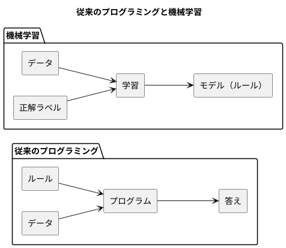
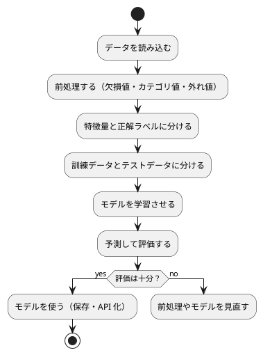

# 第 1 章: 機械学習とはじめてのテスト

## 1.1 はじめに

この章では、機械学習とは何かを確認したうえで、テスト駆動開発（TDD）で最初のプログラムを Scala で作ります。題材は「きのこの山派か、たけのこの里派か」を身長・体重・年代から判定する問題です。

この章ではまだ機械学習のアルゴリズムを使いません。人間が考えたルールで判定し、その正解率を測るところまで進みます。「ルールを人間が書く」とはどういうことかを先に体験しておくと、第 3 章で「ルールをデータから学ばせる」ことの意味がはっきりします。

[Python 版の第 1 章](../python/01-machine-learning-and-first-test.md) と同じ題材・同じ TODO リストで進めます。Scala 版は [Java 版](../java/01-machine-learning-and-first-test.md)・[Kotlin 版](../kotlin/01-machine-learning-and-first-test.md) と同じ JVM の上で書き、関数型の書き方では [F# 版](../fsharp/01-machine-learning-and-first-test.md) と対比します。同じことを Scala で書くとどうなるかに注目しながら読んでください。

## 1.2 機械学習とは

### ルールを書くか、データに学ばせるか

従来のプログラミングでは、人間が判定のルールをコードとして書きます。

```scala
def predictByRule(features: Features): String =
  if features.ageGroup == KinokoAgeGroup then "きのこ" else "たけのこ"
```

これはこの章で実際に作る関数です。「20 代ならきのこ派」というルールは、人間がデータを眺めて立てた仮説にすぎません。データが増えたり傾向が変わったりすれば、人間がルールを書き直す必要があります。

機械学習では、ルールそのものをデータから導きます。人間が用意するのは「特徴量（判定の手がかり）」と「正解ラベル（本当の答え）」の組です。学習アルゴリズムがその組からルールを作り、未知のデータに当てはめて予測します。



### 機械学習のワークフロー

機械学習のプログラムは、おおむね次の流れで作ります。本シリーズの各章は、この流れのどこかを深掘りする構成になっています。



この章で扱うのは「データを読み込む」「特徴量と正解ラベルに分ける」「予測して評価する」の 3 つです。「学習させる」の代わりに、人間が書いたルールで予測します。

### 分類と回帰

| 種類 | 予測するもの | 例 |
|------|------------|-----|
| 分類 | どのグループに属するか（離散値） | きのこ派かたけのこ派か、アヤメの品種 |
| 回帰 | どれくらいの量か（連続値） | 映画の興行収入、住宅価格 |

この章の問題は、2 つのグループのどちらかを当てる分類です。

## 1.3 題材とデータ

### データの入手と配置

本シリーズの学習データは、書籍『スッキリわかる Python による機械学習入門』（インプレス, 2020）の配布データを使います。配布データは書籍購入者のみ利用できるため、リポジトリには含まれていません。[書籍サポートページ](https://sukkiri.jp/books/sukkiri_ml) から `sukkiri-ml-codes.zip` を入手し、リポジトリの `tmp/` に置いてから、リポジトリのルートで次を実行してください。

```bash
npx gulp data:setup
npx gulp data:check
```

`apps/data/sukkiri-ml/` に学習データが配置されます。このディレクトリは `.gitignore` の対象なので、誤ってコミットされることはありません。すべての言語版が同じデータを参照します。

### KvsT.csv

この章で使うのは `KvsT.csv` です。19 人分のデータが次の 4 列で記録されています。

| 列 | 意味 | 値 |
|----|------|-----|
| 身長 | 身長（cm） | 整数 |
| 体重 | 体重（kg） | 整数 |
| 年代 | 年代 | 10, 20, 30, 40 のいずれか |
| 派閥 | きのこの山派かたけのこの里派か | `きのこ` または `たけのこ` |

「身長」「体重」「年代」が特徴量、「派閥」が正解ラベルです。列名が日本語であることと、ファイルの先頭に BOM（バイトオーダーマーク）が付いていることに注意してください。

## 1.4 TODO リストの作成

仕様をそのままコードにするには大きすぎるので、まず TODO リストに分解します。

> TODO リスト
>
> 何をテストすべきだろうか——着手する前に、必要になりそうなテストをリストに書き出しておこう。
>
> — テスト駆動開発

**TODO リスト**:

- [ ] CSV を読み込む
  - [ ] BOM 付き CSV の 1 行を人物として読み込む
  - [ ] 複数行を行の順に読み込む
- [ ] 特徴量と正解ラベルに分ける
- [ ] ルールで派閥を判定する
  - [ ] 20 代ならきのこ派と判定する
  - [ ] 20 代以外ならたけのこ派と判定する
- [ ] 正解率を計算する
- [ ] 実データで正解率を表示する

## 1.5 開発環境の準備

### プロジェクトの構成

Scala の実装は `apps/scala/` にあります。ビルドには [sbt](https://www.scala-sbt.org/)、テスティングフレームワークには [ScalaTest](https://www.scalatest.org/) を使います。

```text
apps/scala/
├── build.sbt
├── .scalafmt.conf
├── project/
│   ├── build.properties
│   └── plugins.sbt
└── src/
    ├── main/scala/machinelearning/
    │   ├── Main.scala
    │   ├── dataset/
    │   │   └── DataDir.scala
    │   └── chapter01/
    │       ├── KinokoTakenoko.scala
    │       └── Main.scala
    └── test/scala/machinelearning/
        ├── SetupSpec.scala
        ├── dataset/
        │   └── DataDirSpec.scala
        └── chapter01/
            ├── KinokoTakenokoSpec.scala
            └── KvsTDataSpec.scala
```

Java では公開するクラスごとにファイルを分け、ファイル名をクラス名と同じにする必要がありました。Scala にその制約は無いので、`KinokoTakenoko.scala` の 1 ファイルに case class と `object` をまとめます。Kotlin 版・F# 版と同じ粒度です。

ビルドの設定は `build.sbt` に書きます。

```scala
ThisBuild / scalaVersion := "3.3.6"
ThisBuild / organization := "machinelearning"

lazy val root = (project in file("."))
  .settings(
    name := "machine-learning",
    // 警告をエラーにする。使っていない値・import や、捨てている戻り値を見つける
    scalacOptions ++= Seq(
      "-deprecation",
      "-feature",
      "-unchecked",
      "-Wunused:all",
      "-Wvalue-discard",
      "-Xfatal-warnings"
    ),
    libraryDependencies ++= Seq(
      "org.scalatest" %% "scalatest" % "3.2.20" % Test
    ),
    // 学習データの場所（未指定なら ../data/sukkiri-ml）をテストに渡す
    Test / envVars := sys.env.get("ML_DATA_DIR").map("ML_DATA_DIR" -> _).toMap
  )
```

- `scalaVersion` は 3.3.6（LTS）です。Java 版の Gradle のツールチェーンと違い、JDK は環境（`nix develop .#scala` の JDK 21）のものを使います
- `libraryDependencies` の `%%` は「Scala の版に対応した成果物を選ぶ」記号です。`%` と違って、`scalatest_3` のような版付きの名前を自分で書かずに済みます
- `-Xfatal-warnings` は、コンパイラの警告をすべてエラーにします。`-Wunused:all`（使っていない値や import）と `-Wvalue-discard`（捨てている戻り値）を有効にしているので、この章の TDD でも何度か止められます。Java 版の Error Prone の `-Werror` と同じ位置づけですが、Scala ではコンパイラ本体の機能です
- `Test / envVars` で、`sbt` を実行したシェルの `ML_DATA_DIR` をテストの JVM に渡します

整形（scalafmt）とカバレッジ（scoverage）はプラグインで入れます。

```scala
// project/plugins.sbt
addSbtPlugin("org.scalameta" % "sbt-scalafmt" % "2.6.2")
addSbtPlugin("org.scoverage" % "sbt-scoverage" % "2.4.4")
```

```text
// project/build.properties
sbt.version=1.12.9
```

`project/build.properties` は、このプロジェクトが使う sbt の版を指定するファイルです。sbt-scalafmt 2.6.2 は sbt 1.12.9 以上を求めるので、手元の `sbt` コマンド（Nix の環境では 1.12.0 のランチャー）のままではプラグインの読み込みに失敗します。この 1 行を書いておけば、ランチャーが指定された版を取得して使うので、環境の sbt の版に関係なく同じビルドになります。Java 版・Kotlin 版の Gradle Wrapper に当たる仕組みです。

整形の設定は `.scalafmt.conf` に書きます。`version` と、Scala 3 の構文で読むための `runner.dialect` は省略できません。

```text
version = 3.9.4
runner.dialect = scala3
maxColumn = 100
```

### 環境確認テスト

テスティングフレームワークが動くことを、最小のテストで確認します。

```scala
// src/test/scala/machinelearning/SetupSpec.scala
package machinelearning

import org.scalatest.funsuite.AnyFunSuite

class SetupSpec extends AnyFunSuite:
  test("テスティングフレームワークが動作する") {
    assert(1 + 1 === 2)
  }
```

```bash
nix develop .#scala
cd apps/scala
sbt test
```

```text
[info] SetupSpec:
[info] - テスティングフレームワークが動作する
[info] All tests passed.
[success] Total time: 28 s
```

ScalaTest にはいくつもの記法（スタイル）がありますが、本シリーズでは最も素直な `AnyFunSuite` を使います。`test("…")` に渡す文字列がそのままテストの名前になるので、日本語の名前を書けます。Java 版は `@DisplayName` で表示名を付ける必要がありましたが、Scala ではテスト名は関数呼び出しの引数なので、特別な仕掛けは要りません。Kotlin 版のバッククォートによる関数名や、F# 版の `[<Fact>]` + 属性と同じ結果になります。

検査に使うのは、ScalaTest の `assert` です。マクロで式を分解するので、`assertEquals` のような専用の関数を使わなくても、失敗したときに「何と何が違ったか」が表示されます。`===` は ScalaTest が提供する比較で、`==` と違って型が合わない比較をコンパイル時に弾きます。

クラス本体を `:` で始めてインデントで書いているのは、Scala 3 の書き方（波かっこを省く記法）です。`.scalafmt.conf` の `runner.dialect = scala3` は、整形ツールにこの構文で読ませるための設定です。

なお、Scala 3 でも標準ライブラリの版を表示すると 2.13 系の番号が返ります。

```scala
scala.util.Properties.versionNumberString // 2.13.16
```

Scala 3 は Scala 2.13 の標準ライブラリをそのまま使うためで、環境が壊れているわけではありません。言語の版を確かめたいときは `scala -version`（`Scala code runner version 3.3.6`）を見ます。

## 1.6 CSV を読み込む

### テストファースト

TODO リストの最初の項目「BOM 付き CSV の 1 行を人物として読み込む」から始めます。実装より先にテストを書きます。

> テストファースト
>
> いつテストを書くべきだろうか——それはテスト対象のコードを書く前だ。
>
> — テスト駆動開発

テストでは学習データそのものは使いません。一時ディレクトリに、架空の値を 1 行だけ書いた CSV を作ります。

```scala
// src/test/scala/machinelearning/chapter01/KinokoTakenokoSpec.scala
package machinelearning.chapter01

import java.nio.file.{Files, Path}
import org.scalatest.funsuite.AnyFunSuite

class KinokoTakenokoSpec extends AnyFunSuite:
  test("BOM 付き CSV を読み込んで人物のリストを返す") {
    val file = Files.createTempDirectory("ml-scala-").resolve("kvst.csv")
    val csvFile: Path = Files.writeString(file, "\uFEFF身長,体重,年代,派閥\n165,58,30,きのこ\n")

    val people = KinokoTakenoko.loadPeople(csvFile)

    assert(people === Vector(Person(165, 58, 30, "きのこ")))
  }
```

- `"\uFEFF"` は BOM の文字です。配布データと同じ形式のファイルでテストするために、先頭に付けています
- ファイルの読み書きには JDK の `java.nio.file` をそのまま使います。Scala には検査例外が無いので、Java 版のような `throws IOException` の宣言は要りません
- 期待値の `Vector` は Scala の既定の列で、中身で比較されます。Java 版が AssertJ の `containsExactly` を、C# 版が専用のアサーションを使ったところを、Scala では `===` ひとつで書けます

### Red: 失敗を確認する

```text
[error] -- [E006] Not Found Error: .../KinokoTakenokoSpec.scala:11:17
[error] 11 |    val people = KinokoTakenoko.loadPeople(csvFile)
[error]    |                 ^^^^^^^^^^^^^^
[error]    |                 Not found: KinokoTakenoko
[error]    |
[error]    | longer explanation available when compiling with `-explain`
[error] one error found
[error] (Test / compileIncremental) Compilation failed
```

Java 版・Kotlin 版と同じく、テストの実行より前の **コンパイル** の段階で「`KinokoTakenoko` が存在しない」と失敗します。Scala 3 のエラーには `E006` のような番号が付き、`-explain` を付ければさらに詳しい説明が出ます。

### Green: 仮実装

> 仮実装を経て本実装へ
>
> 失敗するテストを書いてから、最初に行う実装はどのようなものだろうか——ベタ書きの値を返そう。
>
> — テスト駆動開発

```scala
// src/main/scala/machinelearning/chapter01/KinokoTakenoko.scala
package machinelearning.chapter01

import java.nio.file.Path

/** 学習データ KvsT.csv の 1 行。身長・体重・年代と、正解ラベルの派閥を持つ。 */
case class Person(height: Int, weight: Int, ageGroup: Int, faction: String)

/** きのこ派・たけのこ派の判定。 */
object KinokoTakenoko:
  def loadPeople(csvFile: Path): Vector[Person] =
    Vector(Person(165, 58, 30, "きのこ"))
```

`case class` は、宣言に並べたパラメータから、`new` を書かずに作れるコンストラクタ・読み出し用のメソッド（`person.height`）・値による比較（`equals`・`hashCode`）・表示（`toString`）・`copy` を自動で用意します。パラメータは既定で変更できません。Java の record・Kotlin の data class とほぼ同じ役割で、F# のレコードにも当たります。読み出しが `person.height()` ではなく `person.height` と書ける点と、`copy` がある点が Java の record との違いです。

関数を置く場所には `object` を使います。`object` は「ひとつだけ存在するオブジェクト」の宣言で、Java の `static` メソッドを集めたクラスに当たります。Java 版のように「インスタンスを作らせないために private なコンストラクタを書く」必要はありません。

```text
[info] KinokoTakenokoSpec:
[info] SetupSpec:
[info] - BOM 付き CSV を読み込んで人物のリストを返す
[info] - テスティングフレームワークが動作する
[info] Tests: succeeded 2, failed 0, canceled 0, ignored 0, pending 0
```

### 三角測量

> 三角測量
>
> テストから最も慎重に一般化を引き出すやり方はどのようなものだろうか——2 つ以上の例があるときだけ、一般化を行うようにしよう。
>
> — テスト駆動開発

2 行の CSV でテストを増やします。ヘッダーと書き出しはこの時点でヘルパーにまとめました。

```scala
class KinokoTakenokoSpec extends AnyFunSuite:
  private val header = "\uFEFF身長,体重,年代,派閥\n"

  private def writeCsv(rows: String): Path =
    val file = Files.createTempDirectory("ml-scala-").resolve("kvst.csv")
    Files.writeString(file, header + rows)

  test("複数行の CSV を読み込んで行の順に人物のリストを返す") {
    val people = KinokoTakenoko.loadPeople(writeCsv("161,52,20,きのこ\n183,74,50,たけのこ\n"))

    assert(people === Vector(Person(161, 52, 20, "きのこ"), Person(183, 74, 50, "たけのこ")))
  }
```

```text
[info] - 複数行の CSV を読み込んで行の順に人物のリストを返す *** FAILED ***
[info]   Vector(Person(165, 58, 30, "きのこ")) did not equal Vector(Person(161, 52, 20, "きのこ"), Person(183, 74, 50, "たけのこ")) (KinokoTakenokoSpec.scala:22)
[info]   Analysis:
[info]   Vector1(0: Person(165, 58, 30, "きのこ") -> Person(161, 52, 20, "きのこ"), 1: -> Person(183, 74, 50, "たけのこ"))
```

`case class` の `toString` と ScalaTest の差分表示（`Analysis`）のおかげで、「0 番目はこう違う」「1 番目が足りない」が一目で分かります。

ヘッダー行の列名から「何列目か」の対応表を作り、各行を `Person` に変換します。

```scala
package machinelearning.chapter01

import java.nio.charset.StandardCharsets
import java.nio.file.{Files, Path}
import scala.jdk.CollectionConverters.*

/** 学習データ KvsT.csv の 1 行。身長・体重・年代と、正解ラベルの派閥を持つ。 */
case class Person(height: Int, weight: Int, ageGroup: Int, faction: String)

/** きのこ派・たけのこ派の判定。 */
object KinokoTakenoko:
  private val Bom = "\uFEFF"

  /** BOM 付きの UTF-8 の CSV を読み込み、列名で値を取り出して人物のリストにする。 */
  def loadPeople(csvFile: Path): Vector[Person] =
    val lines = Files.readAllLines(csvFile, StandardCharsets.UTF_8).asScala.toVector
    val header = lines.head.stripPrefix(Bom).split(",").toVector
    val index = header.zipWithIndex.toMap
    lines.tail
      .filter(_.trim.nonEmpty)
      .map { line =>
        val values = line.split(",").toVector
        Person(
          height = values(index("身長")).toInt,
          weight = values(index("体重")).toInt,
          ageGroup = values(index("年代")).toInt,
          faction = values(index("派閥"))
        )
      }
```

- `Files.readAllLines` が返すのは Java の `List` です。`scala.jdk.CollectionConverters.*` を import して `.asScala.toVector` と書くと、Scala の不変な `Vector` に変換できます。JVM の Java 製ライブラリを Scala から使うときの定型で、第 3 章で Tribuo を呼ぶときにも同じ橋渡しをします
- `header.zipWithIndex.toMap` が「列名 → 列番号」の `Map` です。Kotlin 版の `withIndex().associate { … }`、Java 版の `IntStream.range(...).collect(Collectors.toMap(...))` に当たります
- `lines.head`・`lines.tail` は最初の 1 件と残りです。`stripPrefix` は「その文字列で始まっていれば取り除く」メソッドで、BOM の除去に使えます
- `_.trim.nonEmpty` の `_` は「引数をそのまま受ける」書き方で、`line => line.trim.nonEmpty` と同じです
- `Person(height = …, …)` のように引数に名前を付けて渡せるので、4 つの `Int` と `String` の並び順を取り違えにくくなります

```text
[info] - BOM 付き CSV を読み込んで人物のリストを返す
[info] - 複数行の CSV を読み込んで行の順に人物のリストを返す
[info] Tests: succeeded 3, failed 0, canceled 0, ignored 0, pending 0
```

### BOM の落とし穴

`stripPrefix(Bom)` を外すと、BOM 付きの CSV を読むテストが次のように失敗します。

```text
[info] - 複数行の CSV を読み込んで行の順に人物のリストを返す *** FAILED ***
[info]   java.util.NoSuchElementException: key not found: 身長
[info]   at scala.collection.immutable.Map$Map4.apply(Map.scala:535)
[info]   at machinelearning.chapter01.KinokoTakenoko$.loadPeople$$anonfun$2(KinokoTakenoko.scala:23)
```

`Files.readAllLines` は BOM を取り除かないので、先頭の列名に BOM の文字（U+FEFF）が付いたまま残り、`"身長"` という列名で引けなくなります。Python の `csv` モジュールや Kotlin の `readLines` と同じ落とし穴です。

失敗のしかたは言語ごとに違います。Scala の `Map` の `apply`（`index("身長")`）は、キーが無ければ「どのキーが無いか」を書いた `NoSuchElementException` を投げます。Kotlin 版の `getValue` と同じ親切さです。Java 版は `Map.get` が `null` を返し、`int` への変換のところで `NullPointerException` になったので、どの列名だったかまでは分かりませんでした。Scala でも「無いかもしれない」を扱いたいときは `index.get("身長")` と書けば `Option[Int]` が返ります。値があることを前提にしている場所では `apply` を使い、失敗したときに読めるメッセージをもらうほうが得です。

**TODO リスト**:

- [x] CSV を読み込む
  - [x] BOM 付き CSV の 1 行を人物として読み込む
  - [x] 複数行を行の順に読み込む
- [ ] 特徴量と正解ラベルに分ける
- [ ] ルールで派閥を判定する
  - [ ] 20 代ならきのこ派と判定する
  - [ ] 20 代以外ならたけのこ派と判定する
- [ ] 正解率を計算する
- [ ] 実データで正解率を表示する

## 1.7 特徴量と正解ラベルに分ける

次のテストを同じ `KinokoTakenokoSpec` に足します。

```scala
  test("人物のリストを特徴量と正解ラベルに分ける") {
    val people = Vector(Person(161, 52, 20, "きのこ"), Person(183, 74, 50, "たけのこ"))

    val (features, labels) = KinokoTakenoko.splitFeaturesAndLabels(people)

    assert(features === Vector(Features(161, 52, 20), Features(183, 74, 50)))
    assert(labels === Vector("きのこ", "たけのこ"))
  }
```

`Features` も `splitFeaturesAndLabels` もまだ無いので、1.6 節と同じく `Not found` のコンパイルエラーになります。

やることが明らかな変換なので、明白な実装で進めます。

> 明白な実装
>
> シンプルな操作を実現するにはどうすればよいだろうか——そのまま実装しよう。
>
> — テスト駆動開発

```scala
/** 判定の手がかりになる特徴量。 */
case class Features(height: Int, weight: Int, ageGroup: Int)
```

```scala
  /** 人物のリストを特徴量と正解ラベルに分ける。 */
  def splitFeaturesAndLabels(people: Vector[Person]): (Vector[Features], Vector[String]) =
    (people.map(p => Features(p.height, p.weight, p.ageGroup)), people.map(_.faction))
```

戻り値の `(Vector[Features], Vector[String])` はタプルです。Kotlin 版の `Pair` に当たりますが、`val (features, labels) = …` の形でそのまま 2 つの名前に分解できます。Java にはタプルも分解も無いので、Java 版は `FeaturesAndLabels` という record をわざわざ作りました。F# 版のタプルと分解は Scala とほぼ同じ書き味です。

タプルは「その場限りの組」に向いています。組に意味のある名前が要るようになったら（たとえば訓練データとテストデータの組）、第 2 章のように case class にします。

## 1.8 ルールで派閥を判定する

20 代のテストを書き、仮実装で Green にします。

```scala
  test("20 代ならきのこ派と判定する") {
    assert(KinokoTakenoko.predictByRule(Features(161, 52, 20)) === "きのこ")
  }
```

```scala
  def predictByRule(features: Features): String = "きのこ"
```

三角測量として、20 代以外のテストを追加します。

```scala
  test("20 代以外ならたけのこ派と判定する") {
    assert(KinokoTakenoko.predictByRule(Features(183, 74, 50)) === "たけのこ")
  }
```

```text
[info] - 20 代以外ならたけのこ派と判定する *** FAILED ***
[info]   "[き]のこ" did not equal "[たけ]のこ" (KinokoTakenokoSpec.scala:39)
[info]   Analysis:
[info]   "[き]のこ" -> "[たけ]のこ"
```

ScalaTest は文字列の違いも、一致する部分を残してかぎかっこで差分を囲って見せます。

```scala
  /** 「20 代ならきのこ派」というルールの年代 */
  private val KinokoAgeGroup = 20

  /** 人間が決めたルールで派閥を判定する。 */
  def predictByRule(features: Features): String =
    if features.ageGroup == KinokoAgeGroup then "きのこ" else "たけのこ"
```

Scala の `if` は文ではなく式で、そのまま値になります。Java 版が条件演算子 `? :` を使ったところを、Scala では `if … then … else …` と書けます（`then` は Scala 3 の書き方）。F# の `if … then … else` と同じ考え方です。

`20` は最初から名前付きの定数にしました。Kotlin 版は第 5 章で detekt の指摘を受けて定数にしましたが、Scala 版で使うコンパイラの警告には「マジックナンバー」を指摘するものがありません。指摘されるかどうかにかかわらず、ルールの意味を名前で表すために定数にしています。

## 1.9 正解率を計算する

すべて正解のテストと仮実装から始めます。

```scala
  test("すべての予測が正解なら正解率は 1") {
    assert(KinokoTakenoko.accuracy(Vector("きのこ", "たけのこ"), Vector("きのこ", "たけのこ")) === 1.0)
  }
```

```scala
  def accuracy(predictions: Vector[String], labels: Vector[String]): Double = 1.0
```

三角測量として、4 件中 3 件が正解の場合と、件数が違う場合を加えます。件数がずれるのは前処理のバグなので、黙って計算せずに例外で知らせることをテストで約束します。

```scala
  test("4 件中 3 件の予測が正解なら正解率は 0.75") {
    val predictions = Vector("きのこ", "きのこ", "たけのこ", "たけのこ")
    val labels = Vector("きのこ", "たけのこ", "たけのこ", "たけのこ")

    assert(KinokoTakenoko.accuracy(predictions, labels) === 0.75)
  }

  test("予測と正解ラベルの件数が違えばエラーになる") {
    assertThrows[IllegalArgumentException] {
      KinokoTakenoko.accuracy(Vector("きのこ"), Vector("きのこ", "たけのこ"))
    }
  }
```

```text
[info] - 4 件中 3 件の予測が正解なら正解率は 0.75 *** FAILED ***
[info]   1.0 did not equal 0.75 (KinokoTakenokoSpec.scala:50)
[info] - 予測と正解ラベルの件数が違えばエラーになる *** FAILED ***
[info]   Expected exception java.lang.IllegalArgumentException to be thrown, but no exception was thrown (KinokoTakenokoSpec.scala:54)
```

```scala
  /** 予測が正解ラベルと一致した割合を返す。 */
  def accuracy(predictions: Vector[String], labels: Vector[String]): Double =
    require(predictions.size == labels.size, "予測と正解ラベルの件数が違います")
    predictions.zip(labels).count(_ == _).toDouble / labels.size
```

- `require` は Scala の標準ライブラリの関数で、条件が偽なら `IllegalArgumentException` を投げます。Kotlin の `require` と同じで、Java 版のように `if` と `throw` を書く必要はありません
- `predictions.zip(labels)` で同じ位置の組の列を作り、`count(_ == _)` で一致する組を数えます。`_ == _` は「2 つの引数を比べる」書き方です。Java 版は `zip` が無いので `IntStream.range` で位置を回しました
- Scala の `==` は、Java の `equals` に当たる比較です。Java の `==`（同じオブジェクトかどうか）は Scala では `eq` なので、文字列の比較で Java 版のような注意は要りません
- `.toDouble` を先に書いてから割ります。整数どうしの割り算は整数の割り算になり、3 / 4 は 0 になってしまうためです

`require` の行は `Unit` を返すので、次の行の式が関数の戻り値になります。Scala の関数は最後の式が戻り値で、`return` は書きません。

## 1.10 実データで正解率を表示する

### 学習データの場所を解決する

学習データの場所は、環境変数 `ML_DATA_DIR` で指定でき、指定が無ければ `apps/data/sukkiri-ml/` を使います。環境変数を読む関数を引数で受け取るようにすると、テストでは本物の環境変数を書き換えずに済みます。

```scala
// src/test/scala/machinelearning/dataset/DataDirSpec.scala
package machinelearning.dataset

import org.scalatest.funsuite.AnyFunSuite

class DataDirSpec extends AnyFunSuite:
  test("環境変数 ML_DATA_DIR が指定されていればそのディレクトリを返す") {
    val env = Map("ML_DATA_DIR" -> "/tmp/ml-data")

    assert(DataDir.from(env.get) === "/tmp/ml-data")
  }

  test("環境変数が無ければ apps/data/sukkiri-ml を返す") {
    assert(DataDir.from(_ => None).endsWith("data/sukkiri-ml"))
  }
```

```scala
// src/main/scala/machinelearning/dataset/DataDir.scala
package machinelearning.dataset

import java.nio.file.Paths

/** 学習データのディレクトリを求める。 */
object DataDir:

  /** 環境変数 ML_DATA_DIR が無ければ apps/data/sukkiri-ml を使う。
    *
    * @param getenv
    *   環境変数を読む関数。テストでは差し替える
    */
  def from(getenv: String => Option[String]): String =
    getenv("ML_DATA_DIR").getOrElse(Paths.get("..", "data", "sukkiri-ml").toString)

  /** 実行中のプロセスの環境変数から学習データのディレクトリを求める。 */
  def current(): String = from(sys.env.get)
```

- 引数 `getenv` の型 `String => Option[String]` は「文字列を受け取り、`Option[String]` を返す関数」です。`Option` は「値があるかもしれない」ことを型で表すので、Java 版の `Function<String, String>`（`null` を返しうるかどうかが型に表れない）と違い、呼ぶ側は必ず「無い場合」を書くことになります。F# の `option`、Kotlin の null 許容型に当たります
- `getOrElse` は「値があればそれ、無ければ既定値」です。Kotlin の `?:`、Java 版の `Optional.orElse` に当たります
- テストでは `env.get`（`Map` の `get` は `Option` を返す）と `_ => None`（常に「無い」を返す関数）を渡しています。Scala の `Map#get` がそのまま `String => Option[String]` として使えるので、テスト用の偽物を書く必要がありません
- `sys.env` は環境変数の `Map` です。本物を読むときは `sys.env.get` を渡します
- 既定の `../data/sukkiri-ml` は、sbt がテストを `apps/scala/` で実行することを前提にした相対パスです

`DataDir` を先に書かずにテストを走らせると、1.6 節と同じ `Not found: DataDir` のコンパイルエラーになります。

### データが無ければスキップする

実データを使うテストは、ScalaTest の `assume` で、データが配置されていなければスキップ（ScalaTest の用語では「キャンセル」）します。

```scala
// src/test/scala/machinelearning/chapter01/KvsTDataSpec.scala
class KvsTDataSpec extends AnyFunSuite:
  private val csvFile = Paths.get(DataDir.current(), "KvsT.csv")

  /** 学習データが無ければテストを飛ばす。assume の戻り値は捨てられないので（-Wvalue-discard）そのまま返す。 */
  private def requireData(): org.scalatest.Assertion =
    assume(Files.exists(csvFile), "学習データ KvsT.csv が配置されていない（gulp data:setup）")

  test("実データから 19 人分を読み込む") {
    requireData(): Unit

    assert(KinokoTakenoko.loadPeople(csvFile).size === 19)
  }

  test("ルールによる判定の正解率を実データで計算する") {
    requireData(): Unit
    val (features, labels) =
      KinokoTakenoko.splitFeaturesAndLabels(KinokoTakenoko.loadPeople(csvFile))

    val predictions = features.map(KinokoTakenoko.predictByRule)

    assert(KinokoTakenoko.accuracy(predictions, labels) === 14.0 / 19 +- 1e-12)
  }
```

- `assume` の条件が偽なら、そのテストは失敗ではなくキャンセル扱いになります。JUnit の `assumeTrue` に当たります
- `features.map(KinokoTakenoko.predictByRule)` は、関数そのものを `map` に渡す書き方です。Java 版のメソッド参照（`KinokoTakenoko::predictByRule`）に当たりますが、Scala ではメソッド名を書くだけで関数値になります
- 浮動小数点数の比較には、`org.scalactic.Tolerance` を import したうえで `期待値 +- 許容誤差` と書きます

`requireData(): Unit` という見慣れない書き方をしているのは、`-Wvalue-discard` のためです。ヘルパーの戻り値の型を `Unit` にして中で `assume` を呼ぶと、`assume` が返す `Assertion` を捨てることになり、コンパイルが止まります。

```text
[error] -- [E175] Potential Issue Error: .../KvsTDataSpec.scala:11:4
[error] 11 |    assume(Files.exists(csvFile), "学習データ KvsT.csv が配置されていない（gulp data:setup）")
[error]    |    ^^^^^^^^^^^^^^^^^^^^^^^^^^^^^^^^^^^^^^^^^^^^^^^^^^^^^^^^^^^^^^^^^^^^^^^^^^
[error]    |discarded non-Unit value of type org.scalatest.compatible.Assertion. Add `: Unit` to discard silently.
[error] one error found
```

エラーメッセージが勧めるとおり、ヘルパーは `Assertion` をそのまま返し、呼ぶ側で `: Unit` と型を書いて「ここでは意図して捨てている」と示します。警告をエラーにする設定は、こうして「値を黙って捨てていないか」を毎回問い直させます。

### 結果を表示する

章ごとの実行は、`Main.run(print: String => Unit)` の形にします。表示の関数を引数で受け取るので、テストから出力をそのまま集められます。標準出力を差し替えるテスト用の仕掛け（Java 版の `StdoutCapture`）は要りません。

```scala
// src/main/scala/machinelearning/chapter01/Main.scala
package machinelearning.chapter01

import java.nio.file.Paths
import machinelearning.dataset.DataDir

/** 実データでルールによる判定の正解率を表示する。 */
object Main:
  def run(print: String => Unit): Unit =
    val people = KinokoTakenoko.loadPeople(Paths.get(DataDir.current(), "KvsT.csv"))
    val (features, labels) = KinokoTakenoko.splitFeaturesAndLabels(people)
    val predictions = features.map(KinokoTakenoko.predictByRule)
    print(s"データ件数: ${people.size}")
    print(f"ルールによる判定の正解率: ${KinokoTakenoko.accuracy(predictions, labels)}%.4f")
```

- `s"…"` は文字列の補間で、`${…}` に式の結果が入ります
- `f"…%.4f"` は書式付きの補間です。`String.format` と違ってロケールの指定が要らず、`f` 補間子は既定で `Locale.ROOT` 相当の書式になるので、環境によって小数点がカンマになることはありません

```scala
  test("実行するとデータ件数と正解率を表示する") {
    requireData(): Unit
    val output = Vector.newBuilder[String]

    Main.run(output += _)

    assert(output.result() === Vector("データ件数: 19", "ルールによる判定の正解率: 0.7368"))
  }
```

`Vector.newBuilder[String]` は列を組み立てる入れ物で、`output += _` がそのまま `String => Unit` の関数になります。`main` と表示のテストは、実データで出力を確かめながら書いたので、Red を経ずに通っています。出力を固定し、変更で表示が変わったことに気づけるようにするためのテストです。

章を選んで実行する入口は、`machinelearning.Main` に置きます。

```scala
// src/main/scala/machinelearning/Main.scala
package machinelearning

/** 章を選んで実行する入口。使い方: sbt "run chapter01" */
object Main:
  private val chapters: Map[String, (String => Unit) => Unit] = Map(
    "chapter01" -> machinelearning.chapter01.Main.run
  )

  def main(args: Array[String]): Unit =
    args.toList match
      case name :: Nil if chapters.contains(name) => chapters(name)(println)
      case _ =>
        Console.err.println(s"使い方: sbt \"run (${chapters.keys.toSeq.sorted.mkString(" | ")})\"")
```

`args.toList match` はパターンマッチです。`case name :: Nil if …` は「要素がちょうど 1 つで、かつその名前が対応表にある」という場合を表します。章が増えたら `chapters` に 1 行足すだけで済みます。Java 版の `runChapter` という Gradle のタスクに当たる仕組みを、言語の機能だけで書いています。

```bash
sbt "run chapter01"
```

```text
データ件数: 19
ルールによる判定の正解率: 0.7368
```

第 1 章には乱数を使う処理が無いので、Python 版・Java 版・Kotlin 版と同じ 19 件・0.7368 になります。

データが配置されていれば、テストは 14 件すべてが通ります。

```text
[info] Total number of tests run: 14
[info] Suites: completed 4, aborted 0
[info] Tests: succeeded 14, failed 0, canceled 0, ignored 0, pending 0
```

データが無い環境では、実データのテスト 3 件がキャンセルされ、ビルドは成功のままです。

```bash
ML_DATA_DIR=/nonexistent sbt test
```

```text
[info] KvsTDataSpec:
[info] - 実データから 19 人分を読み込む !!! CANCELED !!!
[info]   java.nio.file.Files.exists(KvsTDataSpec.this.csvFile) was false 学習データ KvsT.csv が配置されていない（gulp data:setup） (KvsTDataSpec.scala:13)
[info] - ルールによる判定の正解率を実データで計算する !!! CANCELED !!!
[info]   java.nio.file.Files.exists(KvsTDataSpec.this.csvFile) was false 学習データ KvsT.csv が配置されていない（gulp data:setup） (KvsTDataSpec.scala:13)
[info] - 実行するとデータ件数と正解率を表示する !!! CANCELED !!!
[info]   java.nio.file.Files.exists(KvsTDataSpec.this.csvFile) was false 学習データ KvsT.csv が配置されていない（gulp data:setup） (KvsTDataSpec.scala:13)
[info] Tests: succeeded 11, failed 0, canceled 3, ignored 0, pending 0
[info] All tests passed.
```

**TODO リスト**:

- [x] CSV を読み込む
  - [x] BOM 付き CSV の 1 行を人物として読み込む
  - [x] 複数行を行の順に読み込む
- [x] 特徴量と正解ラベルに分ける
- [x] ルールで派閥を判定する
  - [x] 20 代ならきのこ派と判定する
  - [x] 20 代以外ならたけのこ派と判定する
- [x] 正解率を計算する
- [x] 実データで正解率を表示する

## 1.11 リファクタリング

### コードスタイルと静的解析

Scala 版の検査は、整形（scalafmt）とテストを続けて実行します。

```bash
sbt "scalafmtAll; scalafmtCheckAll; test"
```

リポジトリのルートからは `npx gulp apps:check:scala` で同じことができます。

| ツール | 検査すること | 例 |
|--------|------------|-----|
| [scalafmt](https://scalameta.org/scalafmt/) | 整形 | インデント・改行の位置・1 行の長さ |
| コンパイラの警告（`-Xfatal-warnings`） | バグになりやすい書き方 | 使っていない値・import、捨てている戻り値 |
| [scoverage](https://github.com/scoverage/sbt-scoverage) | カバレッジ | `sbt coverage test coverageReport` |

`scalafmtAll` が整形の指摘を自動で直し、`scalafmtCheckAll` が直しきれていない差分を見つけます。整形・静的解析・カバレッジの設定は第 5 章で詳しく扱います。

TDD の途中で効いてくるのは、コンパイラの警告をエラーにする設定です。1.10 節の `-Wvalue-discard` のほか、仮実装に戻して失敗を確かめるときには `-Wunused:all` が働きます。本実装で使っていた `import` や `private val` を残したまま仮実装に差し替えると、「使っていない」という警告がエラーになってテストまで進めません。まだ必要の無いコードを書かない・残さないという TDD の規律を、コンパイラが後押ししてくれます。

Java 版は Error Prone・PMD・Spotless の 3 つを Gradle に組み込む必要がありましたが、Scala ではその多くがコンパイラの設定 1 行（`-Xfatal-warnings`）で済みます。そのぶん、警告をどこまで有効にするかの選択が重要になります。

<details>
<summary>この章の完成コード（src/main/scala/machinelearning/chapter01/KinokoTakenoko.scala）</summary>

```scala
package machinelearning.chapter01

import java.nio.charset.StandardCharsets
import java.nio.file.{Files, Path}
import scala.jdk.CollectionConverters.*

/** 学習データ KvsT.csv の 1 行。身長・体重・年代と、正解ラベルの派閥を持つ。 */
case class Person(height: Int, weight: Int, ageGroup: Int, faction: String)

/** 判定の手がかりになる特徴量。 */
case class Features(height: Int, weight: Int, ageGroup: Int)

/** きのこ派・たけのこ派の判定。 */
object KinokoTakenoko:
  private val Bom = "\uFEFF"

  /** 「20 代ならきのこ派」というルールの年代 */
  private val KinokoAgeGroup = 20

  /** BOM 付きの UTF-8 の CSV を読み込み、列名で値を取り出して人物のリストにする。 */
  def loadPeople(csvFile: Path): Vector[Person] =
    val lines = Files.readAllLines(csvFile, StandardCharsets.UTF_8).asScala.toVector
    val header = lines.head.stripPrefix(Bom).split(",").toVector
    val index = header.zipWithIndex.toMap
    lines.tail
      .filter(_.trim.nonEmpty)
      .map { line =>
        val values = line.split(",").toVector
        Person(
          height = values(index("身長")).toInt,
          weight = values(index("体重")).toInt,
          ageGroup = values(index("年代")).toInt,
          faction = values(index("派閥"))
        )
      }

  /** 人物のリストを特徴量と正解ラベルに分ける。 */
  def splitFeaturesAndLabels(people: Vector[Person]): (Vector[Features], Vector[String]) =
    (people.map(p => Features(p.height, p.weight, p.ageGroup)), people.map(_.faction))

  /** 人間が決めたルールで派閥を判定する。 */
  def predictByRule(features: Features): String =
    if features.ageGroup == KinokoAgeGroup then "きのこ" else "たけのこ"

  /** 予測が正解ラベルと一致した割合を返す。 */
  def accuracy(predictions: Vector[String], labels: Vector[String]): Double =
    require(predictions.size == labels.size, "予測と正解ラベルの件数が違います")
    predictions.zip(labels).count(_ == _).toDouble / labels.size
```

</details>

## 1.12 まとめ

この章では、機械学習のワークフローのうち「読み込む」「特徴量と正解ラベルに分ける」「予測して評価する」を、Scala の TDD で実装しました。

1. **コンパイルが最初の Red になる** — 存在しない `object` やメソッドは、テストの実行前にコンパイラが番号付きのエラー（`E006`）で知らせた
2. **case class と `Vector`** — 値による比較と読みやすい `toString` で、テストの期待値も失敗メッセージも簡潔になった。Java 版が record と AssertJ で書いたことが、`===` ひとつで済む
3. **タプルと分解** — 2 つの列の組はタプルで返し、`val (features, labels) = …` で受け取った。Java 版が名前付きの record を作ったところとの違い
4. **`Option` を返す関数を引数で渡す** — 環境変数を読む関数を `String => Option[String]` で受け取り、テストでは `Map#get` をそのまま渡して差し替えた
5. **学習データと切り離したテスト** — 架空の値の CSV で単体テストを書き、実データのテストは `assume` でキャンセルした。`-Wvalue-discard` のため、戻り値を捨てる場所には `: Unit` と書いて意図を示した
6. **警告をエラーにする** — `-Xfatal-warnings` で、使っていないコードや黙って捨てている値がテストの前に止められた

人間が書いた「20 代ならきのこ派」というルールの正解率は、Python 版・Java 版・Kotlin 版と同じ 0.7368 でした。次の章では、データフレームのライブラリを使わずに、case class と不変のコレクションで欠損値を含むアヤメのデータを前処理し、訓練データとテストデータに分けます。
