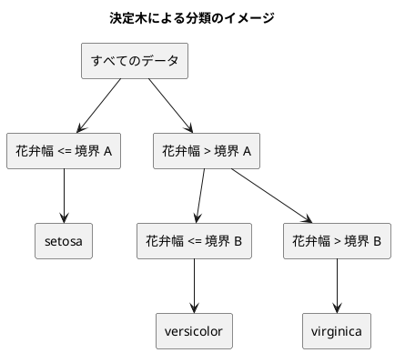

# 第 3 章: 決定木による分類と明白な実装

## 3.1 はじめに

第 1 章では「20 代ならきのこ派」というルールを人間が書き、第 2 章では欠損値を補完した特徴量 `Features` を用意しました。この章では、「どの特徴量のどこで区切るか」をデータから自動で探すアルゴリズム、**決定木** を自作します。

自作したあとは、JVM の機械学習ライブラリ [Tribuo](https://tribuo.org/) の決定木（CART）に同じデータを学習させ、予測を突き合わせます。Scala 版は [Java 版](../java/03-decision-tree-and-obvious-implementation.md)・[Kotlin 版](../kotlin/03-decision-tree-and-obvious-implementation.md) と同じ JVM・同じ Tribuo を使い、第 2 章で見たとおり Java 版と同じ乱数で分割したので、**Java 版と同じ数値が出るはず** です。それを確かめます。

Scala 版では、次の 3 点に注目してください。

- 木を **Scala 3 の `enum`** で表し、`match` の **網羅性** をコンパイラに検査させる（Java の sealed interface + record、C# の抽象レコード、F# の判別共用体に当たる）
- 分割候補の列挙を **`for` 内包表記** で書く
- Java 向けに作られた Tribuo の API（可変なオブジェクト・配列・Java の `List`）に、Scala の不変なコレクションを橋渡しする

## 3.2 決定木の仕組み

### データを 2 つに分けることを繰り返す

決定木は、データを「ある特徴量がある値以下か、より大きいか」で 2 つに分けることを繰り返します。分けた先で同じラベルばかりになったら、そこで分けるのをやめて、そのラベルを予測に使います。



### どこで分けるかをジニ不純度で決める

「よい分け方」とは、分けた後のそれぞれのグループで、ラベルがなるべく 1 種類にそろう分け方です。そろい具合を数値にしたものが **ジニ不純度** です。

ジニ不純度 = 1 − Σ（各ラベルの割合）²

| グループのラベル | 割合 | ジニ不純度 |
|----------------|------|-----------|
| setosa ×3 | setosa 1.0 | 1 − 1.0² = 0 |
| setosa ×1、virginica ×1 | 0.5、0.5 | 1 − (0.5² + 0.5²) = 0.5 |
| 3 品種 ×1 ずつ | 1/3 ずつ | 1 − 3 × (1/3)² = 2/3 |

ラベルが 1 種類にそろうと 0、混ざるほど大きくなります。分け方の候補ごとに、分けた後の左右のジニ不純度を件数で重み付けして平均し、最も小さくなる分け方を選びます。

## 3.3 TODO リストの作成

**TODO リスト**:

- [ ] ジニ不純度を計算する
- [ ] 最良の分割を探す
  - [ ] ラベルを完全に分けられる境界を見つける
  - [ ] 複数の特徴量から最良の特徴量と境界を選ぶ
  - [ ] ラベルが 1 種類なら分割しない
- [ ] 決定木を学習して予測する
  - [ ] 1 種類のラベルだけを学習したらそのラベルを予測する
  - [ ] 境界の左右で異なるラベルを予測する
- [ ] 木の深さを制限する
- [ ] 学習した木を読める形で表示する
- [ ] Tribuo の決定木と突き合わせる
  - [ ] `Features` を Tribuo のデータセットに変換する
  - [ ] 予測が一致しない場合は原因を突き止める
- [ ] 実データで深さと正解率の関係を表示する

## 3.4 ジニ不純度を計算する

### 仮実装から始める

ラベルが 1 種類ならジニ不純度は 0 です。

```scala
// src/test/scala/machinelearning/chapter03/DecisionTreeSpec.scala
class DecisionTreeSpec extends AnyFunSuite:
  test("1 種類のラベルだけならジニ不純度は 0") {
    assert(DecisionTrees.gini(Vector("setosa", "setosa", "setosa")) === 0.0)
  }
```

`DecisionTrees` がまだ無いので、第 1 章・第 2 章と同じくコンパイルが止まります（Red）。仮実装で 0 を返します。

```scala
// src/main/scala/machinelearning/chapter03/DecisionTree.scala
/** 決定木を作り、予測し、表示する関数。 */
object DecisionTrees:
  def gini(labels: Vector[String]): Double = 0.0
```

Java 版は「関数をクラスの外に置けない」ので `static` メソッドだけを持つクラスにしました。Scala でも同じく `object` に入れます。F# 版はモジュールのトップレベルの関数として書きました。

### 三角測量

2 種類のラベルが半分ずつの場合と、3 品種が 1 件ずつの場合を加えます。

```scala
  test("2 種類のラベルが半分ずつならジニ不純度は 0.5") {
    assert(DecisionTrees.gini(Vector("setosa", "virginica")) === 0.5)
  }

  test("3 種類のラベルが同じ数ならジニ不純度は 3 分の 2") {
    assert(DecisionTrees.gini(Vector("setosa", "versicolor", "virginica")) === 2.0 / 3 +- 1e-12)
  }
```

```text
[info] DecisionTreeSpec:
[info] - 1 種類のラベルだけならジニ不純度は 0
[info] - 2 種類のラベルが半分ずつならジニ不純度は 0.5 *** FAILED ***
[info]   0.0 did not equal 0.5 (DecisionTreeSpec.scala:25)
[info] - 3 種類のラベルが同じ数ならジニ不純度は 3 分の 2 *** FAILED ***
[info]   0.0 did not equal 0.6666666666666666 +- 1.0E-12 (DecisionTreeSpec.scala:29)
```

2/3 は小数で正確に表せないので、`+- 1e-12` で誤差を許容して比べます（`org.scalactic.Tolerance` を import します）。ScalaTest の失敗メッセージは、期待値・実際の値・許容誤差と、失敗した行の位置を 1 行で見せます。例が揃ったので、定義どおりに一般化します。

```scala
  /** ジニ不純度。ラベルが 1 種類なら 0 で、種類が多く均等なほど大きい。 */
  def gini(labels: Vector[String]): Double =
    val total = labels.size.toDouble
    1.0 - counts(labels).values.map(count => math.pow(count / total, 2)).sum

  /** ラベルごとの件数を、ラベルが先に現れた順に並べて返す。 */
  private def counts(labels: Vector[String]): Map[String, Int] =
    labels.foldLeft(scala.collection.immutable.ListMap.empty[String, Int]) { (acc, label) =>
      acc.updated(label, acc.getOrElse(label, 0) + 1)
    }
```

- `labels.groupBy(identity).view.mapValues(_.size)` と書けば件数は数えられますが、`Map` の順序は決まりません。3.6 節の多数決で「同数なら先に現れたラベル」を選びたいので、**入れた順を保つ** `ListMap` に `foldLeft` で積み上げています。Java 版の `LinkedHashMap`、C# 版の順序付きの辞書に当たります
- `total` を `toDouble` にしているのは、`Int` 同士の割り算が切り捨てになるためです

## 3.5 最良の分割を探す

### 分割を表す case class

分割は「どの特徴量を」「どの値（境界）で」分けたか、「分けた後の不純度」の 3 つで表します。

```scala
/** 決定木の分割。特徴量の値が境界以下なら左、境界より大きければ右へ進む。 */
case class Split(feature: String, threshold: Double, impurity: Double)
```

### テスト

テスト用の特徴量を短く作れるように、1 列だけの `Features` を並べるヘルパーを用意します。

```scala
/** テスト用の特徴量を作る。 */
object Samples:
  /** 1 列だけの特徴量を値の数だけ作る。 */
  def column(name: String, values: Double*): Vector[Features] =
    values.toVector.map(value => Features(Vector(name), Vector(value)))
```

`values: Double*` は **可変長引数** です。`column("花弁幅", 0.1, 0.2, 0.7, 0.8)` のように値をいくつでも並べて渡せ、関数の中では `Seq[Double]` として受け取ります。

```scala
  test("ラベルを完全に分けられる境界を見つける") {
    val split = DecisionTrees
      .bestSplit(
        Samples.column("花弁幅", 0.1, 0.2, 0.7, 0.8),
        Vector("setosa", "setosa", "virginica", "virginica")
      )
      .get

    assert(split.feature === "花弁幅")
    assert(split.threshold === 0.45 +- 1e-12)
    assert(split.impurity === 0.0 +- 1e-12)
  }

  test("複数の特徴量から不純度が最も小さくなる特徴量と境界を選ぶ") {
    val columns = Vector("がく片長さ", "花弁長さ")
    val x = Vector(
      Features(columns, Vector(0.1, 0.2)),
      Features(columns, Vector(0.3, 0.1)),
      Features(columns, Vector(0.2, 0.9)),
      Features(columns, Vector(0.4, 0.6))
    )

    val split = DecisionTrees.bestSplit(x, Vector("setosa", "setosa", "virginica", "virginica")).get

    assert(split.feature === "花弁長さ")
    assert(split.threshold === 0.4 +- 1e-12)
  }

  test("ラベルが 1 種類なら分割しない") {
    assert(
      DecisionTrees.bestSplit(
        Samples.column("花弁幅", 0.1, 0.2, 0.7),
        Vector("setosa", "setosa", "setosa")
      ) === None
    )
  }
```

`bestSplit` の戻り値は `Option[Split]` にします。「分割できないときは無い」を型で表す点は、Java 版の `Optional<Split>`・F# 版の `Split option`・Kotlin 版の `Split?` と同じです。テストでは `.get` で中身を取り出し、`None` なら例外でテストを失敗させます。

### 浮動小数点数の落とし穴

境界を `+- 1e-12` で比べているのには理由があります。`=== 0.45` と書くと、実装が正しくても `0.44999999999999996` と比べることになり失敗します。`(0.2 + 0.7) / 2` は 2 進数の浮動小数点数では 0.45 ちょうどにならないためです。Python 版・Java 版・Kotlin 版と同じ落とし穴です。

Kotlin 版は data class の `equals` で `Split` をまるごと比べようとして、誤差を許容できずにフィールドごとに比べる関数を作りました。Scala 版も `case class` なので `Split(...)` どうしを `===` で比べたくなりますが、同じ理由でそれはできません。`case class` の等価判定が使えるのは、第 2 章の `Features` のように **値が入力どおりで、計算で誤差が入らない** ときだけです。

### Green: for 内包表記で候補を列挙する

特徴量ごとに値を並べ替え、隣り合う値の間をすべて境界の候補にして、分けた後の不純度が最小になる候補を選びます。やり方がはっきりしているので、明白な実装で書きます。

```scala
  /** 左右の不純度の重み付き平均が最も小さくなる分割。同じ不純度なら先に見つけた分割を選ぶ。 */
  def bestSplit(x: Vector[Features], t: Vector[String]): Option[Split] =
    if gini(t) == 0.0 then None
    else
      val candidates =
        for
          feature <- x.head.columns
          sorted = x.map(_.value(feature)).zip(t).sortBy(_._1)
          i <- 1 until sorted.size
          if sorted(i)._1 != sorted(i - 1)._1
          left = sorted.take(i).map(_._2)
          right = sorted.drop(i).map(_._2)
          impurity = (left.size * gini(left) + right.size * gini(right)) / sorted.size
        yield Split(feature, (sorted(i - 1)._1 + sorted(i)._1) / 2, impurity)
      // minByOption は最初の最小値を返すので、同じ不純度なら列の順で前の分割になる
      candidates.reduceOption((best, next) => if next.impurity < best.impurity then next else best)
```

`for ... yield` は **`for` 内包表記** です。Scala の `for` は繰り返しの構文ではなく、`flatMap`・`map`・`withFilter` の呼び出しに書き換えられる式で、次の 3 種類の行を並べられます。

| 行の形 | 意味 |
|--------|------|
| `feature <- x.head.columns` | 生成器。コレクションの要素を 1 つずつ取り出す |
| `sorted = ...` | 束縛。途中の値に名前を付ける（`val` は書かない） |
| `if sorted(i)._1 != ...` | ガード。条件を満たすものだけ残す |

Java 版は同じ処理を「行の位置を並べ替えた `List` を作り、二重の `for` を回して `best` を更新する」と書きました。Scala 版は「候補の `Vector` を作ってから最小のものを選ぶ」と 2 段に分かれるので、何を列挙して何を選んでいるかが読めます。Python 版の内包表記、C# の LINQ のクエリ構文に近い書き方です。

- `x.map(_.value(feature)).zip(t).sortBy(_._1)` で、値とラベルの組を値の順に並べ替えます。Java 版は `zip` が無いので位置のリストを並べ替えました。`_._1` はタプルの 1 番目の要素です
- 同じ値が続くところには境界を置けないので、ガードで飛ばします。`Double` どうしをそのまま `!=` で比べられます（Java 版は `List<Double>` の要素だったので `equals` が必要でした）
- 最後の選び方が `minBy` ではなく `reduceOption` なのは、**候補が 1 つも無いときに `None` を返したい** からです。`minByOption(_.impurity)` でも同じ結果になりますが、「同じ不純度なら先に見つけた候補を残す」という性質を式の形で見せたかったので、`reduceOption` に「より小さいときだけ更新する」条件を書いています。この性質は 3.9 節で効いてきます

## 3.6 決定木を学習して予測する

### 仮実装

Python 版・Java 版と同じく、`fit` で学習し `predict` で予測する形にします。`fit` が自分自身を返すと、作成と学習を 1 行で書けます。

```scala
  test("1 種類のラベルだけを学習するとそのラベルを予測する") {
    val model =
      DecisionTree.unlimited().fit(Samples.column("花弁幅", 0.1, 0.2), Vector("setosa", "setosa"))

    assert(model.predict(Samples.column("花弁幅", 0.15, 0.9)) === Vector("setosa", "setosa"))
  }
```

仮実装では、最初のラベルを覚えておいて返します。

```scala
class DecisionTree:
  private var label = ""

  /** 訓練データから木を作る。 */
  def fit(x: Vector[Features], t: Vector[String]): DecisionTree =
    label = t.head
    this

  /** 特徴量ごとのラベルを予測する。 */
  def predict(x: Vector[Features]): Vector[String] = x.map(_ => label)
```

### 三角測量

```scala
  test("境界の左右で異なるラベルを予測する") {
    val model = DecisionTree
      .unlimited()
      .fit(
        Samples.column("花弁幅", 0.1, 0.2, 0.7, 0.8),
        Vector("setosa", "setosa", "virginica", "virginica")
      )

    assert(model.predict(Samples.column("花弁幅", 0.15, 0.75)) === Vector("setosa", "virginica"))
  }
```

```text
[info] - 1 種類のラベルだけを学習するとそのラベルを予測する
[info] - 境界の左右で異なるラベルを予測する *** FAILED ***
[info]   Vector("setosa", "setosa") did not equal Vector("setosa", "virginica") (DecisionTreeSpec.scala:84)
[info]   Analysis:
[info]   Vector1(1: "setosa" -> "virginica")
```

ScalaTest の `Analysis` が「1 番目の要素だけが違う」と差分を示してくれます。`Vector` と `String` の `toString` がそのまま読めるので、Java 版が AssertJ の `containsExactly` の失敗メッセージで見たものと同じ情報が、短い形で出ます。

### 木を enum で表す

木は「葉」と「節」の 2 種類のデータでできています。

- **葉（`Leaf`）**: 予測するラベルを持つ
- **節（`Node`）**: 分割と、左右の子（葉か節）を持つ

Scala 3 では、これを `enum` の 1 つの宣言で書けます。

```scala
/** 決定木。葉か節のどちらかで、ほかの実装は許さない（enum で閉じる）。 */
enum Tree:
  case Leaf(label: String)
  case Node(split: Split, left: Tree, right: Tree)
```

Scala 3 の `enum` は、Java の `enum`（定数の列挙）とは別物で、**パラメータを持つ場合（case）を並べられます**。各 `case` は `case class` と同じく値で比べられ、`Tree` を継承できるのはここに並べたものだけです。ほかの言語の対応物は次のとおりです。

| 言語 | 書き方 | 行数 |
|------|--------|------|
| Scala 3 | `enum Tree: case Leaf(...); case Node(...)` | 1 つの宣言 |
| Java | `sealed interface Tree permits Leaf, Node {}` + `record Leaf` + `record Node` | 3 ファイル |
| C# | `abstract record Tree` + `sealed record Leaf` + `sealed record Node` | 3 つの宣言 |
| Kotlin | `sealed interface Tree` + `data class Leaf` + `data class Node` | 3 つの宣言 |
| F# | `type Tree = Leaf of string | Node of Split * Tree * Tree` | 1 つの宣言 |

F# の判別共用体といちばん近い形です。`enum` の中の名前は `Tree.Leaf` なので、使う側では `import Tree.*` で短く書けるようにしています。

木を作る処理と予測する処理は、どちらも **再帰** で書けます。

```scala
  /** 深さの上限まで分割を繰り返して木を作る。maxDepth が None なら上限なし。 */
  def build(x: Vector[Features], t: Vector[String], maxDepth: Option[Int]): Tree =
    val split = if maxDepth.contains(0) then None else bestSplit(x, t)
    split match
      case None => Leaf(majority(t))
      case Some(s) =>
        val (left, right) = x.indices.toVector.partition(i => goesLeft(s, x(i)))
        val childDepth = maxDepth.map(_ - 1)
        Node(
          s,
          build(left.map(x), left.map(t), childDepth),
          build(right.map(x), right.map(t), childDepth)
        )

  /** 1 件の特徴量のラベルを予測する。 */
  def predictOne(tree: Tree, features: Features): String =
    tree match
      case Leaf(label) => label
      case Node(split, left, right) =>
        predictOne(if goesLeft(split, features) then left else right, features)

  /** 多数派のラベル。同数なら先に現れたラベルを選ぶ。 */
  private[chapter03] def majority(labels: Vector[String]): String =
    counts(labels).maxBy(_._2)._1

  private def goesLeft(split: Split, features: Features): Boolean =
    features.value(split.feature) <= split.threshold
```

- `case Leaf(label) =>` は、型で場合分けしつつ中身を取り出す **パターンマッチ** です。Java 版の `case Leaf leaf -> leaf.label()` や Kotlin 版の `is Leaf -> tree.label` と違い、フィールドが変数 `label` に直接入ります
- 深さの「上限なし」は `Option[Int]` の `None` で表します。`maxDepth.contains(0)` は「`Some(0)` のときだけ真」、`maxDepth.map(_ - 1)` は「`Some` なら 1 減らし、`None` なら `None` のまま」です。Kotlin 版の `Int?` と `maxDepth?.minus(1)` に当たります。Java 版は `int` が `null` を持てないので `-1` で表しました
- `x.indices.toVector.partition(...)` は、行の位置を左に進むものと右に進むものに 1 度で分けます。Java 版は `IntStream` を 2 回回して同じことをしました
- `left.map(x)` は「位置の `Vector` を `x` で引く」という書き方です。Scala の `Vector[A]` は `Int => A` の関数でもあるので、`map` にコレクションそのものを渡せます。Java 版の `pick` ヘルパーに当たる処理が要りません
- `majority` は `counts` が返す `ListMap` を `maxBy` で選びます。`maxBy` は最初の最大値を返すので、同数なら先に現れたラベルが残ります。この性質も 3.9 節で重要になります
- `private[chapter03]` は「このパッケージの中からだけ見える」という指定です。Java 版がパッケージプライベートにしたところに当たります

### 網羅性の検査を確かめる

`predictOne` の `match` には「それ以外」の場合がありません。`Tree` が `enum` で、場合が `Leaf` と `Node` の 2 つだけだとコンパイラが知っているので、2 つの `case` で **すべての場合を尽くしている** と判断できるからです。

試しに `case Node(...)` の行を消してコンパイルすると、次のように止まります。

```text
[error] -- [E029] Pattern Match Exhaustivity Error: .../chapter03/DecisionTree.scala:56:4
[error] 56 |    tree match
[error]    |    ^^^^
[error]    |match may not be exhaustive.
[error]    |
[error]    |It would fail on pattern case: machinelearning.chapter03.Tree.Node(_, _, _)
[error]    |
[error]    | longer explanation available when compiling with `-explain`
[error] one error found
[error] (Compile / compileIncremental) Compilation failed
```

`enum` に 3 つ目の `case` を足した場合も同じで、場合分けが漏れている `match` がすべて指摘されます。ここで大事なのは、**網羅していない `match` は既定では「警告」にすぎない** ことです。第 1 章で入れた `-Xfatal-warnings` が、その警告をエラーに格上げしています。この設定が無ければ、実行時に `MatchError` になるまで気づけません。

| 言語 | 場合分けの漏れ | 既定で |
|------|--------------|-------|
| Scala 3 | `match may not be exhaustive`（警告） | 警告。`-Xfatal-warnings` でエラー |
| Java | 「switch 式がすべての可能な入力値をカバーしていません」 | エラー |
| C# | CS8509（警告） | 警告。`TreatWarningsAsErrors` でエラー |
| F# | FS0025（警告） | 警告。`TreatWarningsAsErrors` でエラー |

`case _ =>` を書いてしまうとこの検査が効かなくなるので、`enum` の `match` には書きません。Java 版で `default` を、Kotlin 版で `else` を書かなかったのと同じ考え方です。

### DecisionTree で包む

`DecisionTree` は、学習した木を持ち、`fit` と `predict` を提供します。

```scala
/** 自作の決定木の分類器。fit で学習してから predict で予測する。 */
class DecisionTree(maxDepth: Option[Int]):
  private var tree: Option[Tree] = None

  /** 訓練データから木を作る。 */
  def fit(x: Vector[Features], t: Vector[String]): DecisionTree =
    tree = Some(DecisionTrees.build(x, t, maxDepth))
    this

  /** 学習した木。学習する前は None。 */
  def fitted: Option[Tree] = tree

  /** 特徴量ごとのラベルを予測する。 */
  def predict(x: Vector[Features]): Vector[String] =
    val fittedTree = tree.getOrElse(throw IllegalStateException("fit で学習してから predict を呼んでください"))
    x.map(DecisionTrees.predictOne(fittedTree, _))
```

```scala
  test("学習する前に予測するとエラーになる") {
    val error =
      intercept[IllegalStateException](DecisionTree.unlimited().predict(Samples.column("花弁幅", 0.1)))

    assert(error.getMessage === "fit で学習してから predict を呼んでください")
  }
```

この章でいちばん Scala らしくないのが、この `private var tree` です。`fit` して `predict` するという scikit-learn 由来の形を、ほかの言語版とそろえて残しました。F# 版は「学習の結果は木という値で、`fit` はその値を返す関数」と書き、「学習する前に予測する」という誤りをそもそも書けないようにしています。Scala でも同じように書けますが、章をまたいだ API をそろえるほうを選びました。

代わりに、可変な状態は `DecisionTree` の中に閉じ込めています。`DecisionTrees.build`・`predictOne`・`format` はすべて引数だけから結果が決まる関数で、木そのものは不変な値です。可変なのは「学習済みの木を覚えている」1 か所だけです。

### ファクトリで作り方に名前を付ける

```scala
object DecisionTree:
  /** 深さを制限しない決定木。 */
  def unlimited(): DecisionTree = DecisionTree(None)

  /** 深さの上限を指定した決定木。 */
  def withMaxDepth(maxDepth: Int): DecisionTree =
    require(maxDepth >= 0, "深さの上限は 0 以上にしてください")
    DecisionTree(Some(maxDepth))
```

Scala なら `class DecisionTree(maxDepth: Option[Int] = None)` と既定値を書けますし、`DecisionTree(Some(2))` とも呼べます。それでもコンパニオンオブジェクトにファクトリを置いたのは、Java 版・C# 版と同じ理由です。

- `DecisionTree.unlimited()` と `DecisionTree.withMaxDepth(2)` は、呼び出し側で何を作っているかが読めます。`DecisionTree(Some(2))` より、`Some` の意味を考えずに済みます
- `withMaxDepth` は負の数を受け付けないので、検査を 1 か所に置けます

なお、仮実装の段階で `maxDepth` のパラメータだけを先に足すと、`-Wunused:all` が止めます。

```text
[error] -- [E198] Unused Symbol Error: .../chapter03/DecisionTree.scala:88:19
[error] 88 |class DecisionTree(maxDepth: Option[Int]):
[error]    |                   ^^^^^^^^
[error]    |                   unused explicit parameter
[error] one error found
```

Java 版で Error Prone の `UnusedVariable` が同じ場面を止めたのと同じで、「使われないものを先に書かない」という TDD の規律を、ツールが後押ししてくれます。

## 3.7 木の深さを制限する

分割を止めずに続けると、訓練データを 1 件ずつ分け切るまで木が深くなります。訓練データを丸暗記した状態（**過学習**）になり、未知のデータで当たらなくなります。

3 品種のうち、境界の右側に versicolor 2 件と virginica 1 件が残るデータを `Samples` に用意します。

```scala
  /** 3 品種のうち、境界の右側に versicolor 2 件と virginica 1 件が残るデータ。 */
  val threeSpeciesX: Vector[Features] = column("花弁幅", 0.1, 0.2, 0.3, 0.5, 0.6, 0.9)
  val threeSpeciesT: Vector[String] =
    Vector("setosa", "setosa", "setosa", "versicolor", "versicolor", "virginica")
```

```scala
  test("深さを制限しなければすべての訓練データを分け切る") {
    val model = DecisionTree.unlimited().fit(Samples.threeSpeciesX, Samples.threeSpeciesT)

    assert(model.predict(Samples.threeSpeciesX) === Samples.threeSpeciesT)
  }

  test("深さを 1 に制限すると境界の先は多数派のラベルを予測する") {
    val model = DecisionTree.withMaxDepth(1).fit(Samples.threeSpeciesX, Samples.threeSpeciesT)

    assert(model.predict(Samples.column("花弁幅", 0.2, 0.95)) === Vector("setosa", "versicolor"))
  }
```

`Samples` をテストのクラスとは別の `object` にしたのは、ほかのテストからも使えるようにするためです。Scala では 1 つのファイルに複数のトップレベルの宣言を置けるので、`DecisionTreeSpec.scala` の中に `object Samples` を並べています。Java 版は 1 ファイル 1 公開型なので、`Samples.java` を別に作りました。

`threeSpeciesX` を `def` ではなく `val` にできるのも、値が不変だからです。Java 版は `List.of(...)` を返す `static` メソッドにしましたが、どちらにせよ変更されないなら `val` で十分です。

## 3.8 学習した木を表示する

決定木の長所は、学習した結果を人が読めることです。木をテキストで表示する `format` を作ります。

```scala
  test("葉だけの木はラベルを表示する") {
    assert(DecisionTrees.format(Leaf("setosa")) === "setosa")
  }

  test("節は条件ごとに字下げして表示する") {
    val tree = Node(
      Split("花弁幅", 0.4, 0.0),
      Leaf("setosa"),
      Node(Split("花弁長さ", 0.75, 0.0), Leaf("versicolor"), Leaf("virginica"))
    )

    assert(
      DecisionTrees.format(tree) === Vector(
        "花弁幅 <= 0.4000",
        "  setosa",
        "花弁幅 > 0.4000",
        "  花弁長さ <= 0.7500",
        "    versicolor",
        "  花弁長さ > 0.7500",
        "    virginica"
      ).mkString("\n")
    )
  }
```

期待値は、行の `Vector` を `mkString("\n")` でつなぐ形にしました。Scala にも `"""..."""` の複数行の文字列と `stripMargin` がありますが、行ごとの字下げを確かめるテストで `|` を並べると、かえって期待する字下げが読みにくくなります。Java 版のテキストブロック、Kotlin 版の `trimIndent()` に当たる場面ですが、ここは行の並びとして書くほうが素直です。

```scala
  /** 木を、条件ごとに字下げした文字列にする。 */
  def format(tree: Tree, indent: String = ""): String =
    tree match
      case Leaf(label) => indent + label
      case Node(split, left, right) =>
        val threshold = String.format(Locale.ROOT, "%.4f", split.threshold)
        Vector(
          s"$indent${split.feature} <= $threshold",
          format(left, indent + "  "),
          s"$indent${split.feature} > $threshold",
          format(right, indent + "  ")
        ).mkString("\n")
```

- 引数の **既定値** が使えるので、`format(tree)` と `format(tree, "  ")` を 1 つの定義で書けます。Java 版は公開の `format(tree)` と非公開の `format(tree, indent)` の 2 つに分けました。Kotlin 版と同じ書き方です
- `s"..."` は **文字列補間** です。`${...}` の中に式を書けます
- 第 1 章と同じく、`Locale.ROOT` で小数点がカンマにならないようにしています

## 3.9 Tribuo の決定木と突き合わせる

### Features を Tribuo のデータセットに変換する

Tribuo のデータの単位は、1 件分の特徴量（名前と値の組）と正解ラベルを持つ **事例（`Example`）** で、事例を集めたものが **データセット（`MutableDataset`）** です。第 2 章の `Features` は列名の `Vector` と値の `Vector[Double]` を持つので、`ArrayExample`（特徴量名の配列と値の配列を受け取る）に橋渡しできます。

Tribuo の決定木は `tribuo-classification-tree` にあり、すでに `build.sbt` の依存に入っています。

```scala
    libraryDependencies ++= Seq(
      "org.tribuo" % "tribuo-classification-tree" % "4.3.2",
      "org.scalatest" %% "scalatest" % "3.2.20" % Test
    )
```

`%` と `%%` の違いは、`%%` が Scala の版をアーティファクト名に付け足す（`scalatest_3`）ことです。Tribuo は Java のライブラリなので、`%` で参照します。

```scala
// src/main/scala/machinelearning/chapter03/TribuoTrees.scala
/** 特徴量を Tribuo の事例に変え、Tribuo の CART で学習・予測する。 */
object TribuoTrees:
  /** 深さを制限しないことを表す値 */
  val Unlimited: Int = Int.MaxValue

  private val labelFactory = LabelFactory()

  /** 子の節に必要な事例の重みの最小値。1 にすると、自作の木と同じく 1 件になるまで分けられる。 */
  private val MinChildWeight = 1.0f

  /** 特徴量と正解ラベルを、Tribuo のデータセットにする。 */
  def toDataset(x: Vector[Features], t: Vector[String]): MutableDataset[Label] =
    val examples = x.zip(t).map((features, label) => toExample(features, Label(label)))
    val provenance = SimpleDataSourceProvenance("features", labelFactory)
    MutableDataset(ListDataSource(examples.asJava, labelFactory, provenance))

  /** ジニ不純度で分割する CART を学習する。 */
  def train(x: Vector[Features], t: Vector[String], maxDepth: Int): Model[Label] =
    val trainer = CARTClassificationTrainer(maxDepth, MinChildWeight, 0.0f, 1.0f, GiniIndex(), 0L)
    trainer.train(toDataset(x, t))

  /** 学習したモデルで、特徴量ごとのラベルを予測する。 */
  def predict(model: Model[Label], x: Vector[Features]): Vector[String] =
    x.map(features =>
      model.predict(toExample(features, LabelFactory.UNKNOWN_LABEL)).getOutput.getLabel
    )

  private def toExample(features: Features, label: Label): Example[Label] =
    ArrayExample[Label](label, features.columns.toArray, features.values.toArray)
```

Java のライブラリを Scala から呼ぶときの要点が、この短い `object` に 4 つ詰まっています。

- **`new` を書かない** — `LabelFactory()`・`ArrayExample[Label](...)`・`MutableDataset(...)` と、Java のクラスでもコンストラクタを関数のように呼べます（Scala 3 の universal apply methods）
- **型引数を明示する** — `ArrayExample[Label](label, ...)` と `[Label]` を書いています。Java なら `new ArrayExample<>(...)` のダイヤモンド演算子で省けるところですが、Scala から Java のジェネリクスを呼ぶときは推論がうまくいかないことがあるので、Tribuo を Scala から呼べるか確かめた時点（[ADR 007](../../../adr/007-scala-ml-libraries.md)）から明示すると決めました
- **コレクションを変換する** — `ListDataSource` は Java の `List` を受け取るので、`scala.jdk.CollectionConverters.*` を import して `examples.asJava` と書きます。第 1 章で `Files.readAllLines` の結果に `.asScala` を使ったのと逆向きです
- **`Vector` を配列に戻す** — `features.columns.toArray`・`features.values.toArray` で、Tribuo が期待する `Array[String]`・`Array[Double]` にします。第 2 章で `Features` を `Vector` にしたおかげで値の比較が楽になりましたが、その代金をここで払っています。もっとも `toArray` は毎回新しい配列を作るので、Java 版が `clone()` で守ろうとした「Tribuo に書き換えられない」という性質は、そのまま満たされます

そのほかは Java 版・Kotlin 版と同じです。

- Tribuo の事例は必ずラベルを持つので、予測するときは未知を表す `LabelFactory.UNKNOWN_LABEL` を渡します
- `getOutput.getLabel` のように、引数の無い Java のメソッドは括弧なしで呼べます
- Tribuo の「深さの上限なし」は `Int.MaxValue` です。自作の `DecisionTree` の `None` とは別の約束なので、`TribuoTrees.Unlimited` という名前を付けました
- Kotlin 版は空の `MutableDataset` を作ってから 1 件ずつ `add` しました。Scala 版は Java 版と同じく、事例のリストを `ListDataSource` に包んでデータセットに渡しています。どちらもデータの出どころの記録（provenance）を付けます。Tribuo は、モデルがどのデータとどの設定で学習したかをモデル自身に記録する設計です

`CARTClassificationTrainer` の引数は Java 版・Kotlin 版と同じです。

| 引数 | 渡した値 | 意味 |
|------|---------|------|
| maxDepth | 呼び出し側で指定 | 木の深さの上限。制限なしは `Int.MaxValue` |
| minChildWeight | `1.0f` | 件数（重み）がこの値に満たない節は分割しない |
| minImpurityDecrease | `0.0f` | 分割に必要な不純度の減少量の下限 |
| fractionFeaturesInSplit | `1.0f` | 分割ごとに調べる特徴量の割合。1.0 ですべて調べる |
| impurity | `GiniIndex()` | ジニ不純度で分割を選ぶ |
| seed | `0L` | 乱数のシード |

`minChildWeight` の既定値は 5 で、件数が 5 未満の節は分割しません。自作の決定木は 1 件になるまで分け切るので、突き合わせでは `1.0f` にして条件をそろえます。

### 同点のときの選び方

Kotlin 版では、iris で予測を比べたところ深さ 3 以上で 1 件だけ一致せず、その原因が 2 つの「同点」の扱いの違いだと突き止めました（[ADR 002](../../../adr/002-kotlin-ml-libraries.md)）。Java 版は学習用テストで、同じ振る舞いが Java からでも起きることを確かめています。

- **葉の多数決が同数のとき**: 自作の `majority` は先に現れたラベルを返すので、ラベルの並び順で予測が変わります。Tribuo は並び順に依存しません
- **同じ不純度の分割候補が複数あるとき**: 自作の `bestSplit` は列の順で先の特徴量を選び、Tribuo は特徴量名の順で先のものを選びます

どちらも「どちらを選んでも不純度は同じ」場面での選び方の違いで、どちらかが間違っているわけではありません。Scala から呼んでも同じ Tribuo なので、この振る舞いは変わりません。Scala 版では、この 2 つの学習用テストを持たず、Java 版・Kotlin 版で確かめた結果を引き継いでいます。

### 実データで突き合わせる

実データのテストでは、深さを変えて自作と Tribuo の予測を比べます。

```scala
// src/test/scala/machinelearning/chapter03/IrisDataSpec.scala
class IrisDataSpec extends AnyFunSuite:
  private val csvFile = Paths.get(DataDir.current(), "iris.csv")

  private def requireData(): org.scalatest.Assertion =
    assume(Files.exists(csvFile), "学習データ iris.csv が配置されていない（gulp data:setup）")

  private def irisSplit(): TrainTestSplit[Features, String] =
    Preprocessing.prepareIris(csvFile, 0.3, 0)

  test("深さ 2 の決定木はテストデータの 45 件中 43 件を正しく分類する") {
    requireData(): Unit
    val split = irisSplit()

    val predictions =
      DecisionTree.withMaxDepth(2).fit(split.xTrain, split.tTrain).predict(split.xTest)

    assert(KinokoTakenoko.accuracy(predictions, split.tTest) === 43.0 / 45 +- 1e-12)
  }

  test("この分割ではどの深さでも Tribuo の CART とテストデータの予測が一致する") {
    requireData(): Unit
    val split = irisSplit()

    Vector(1, 2, 3, 4, 5, TribuoTrees.Unlimited).foreach { maxDepth =>
      val mine =
        (if maxDepth == TribuoTrees.Unlimited then DecisionTree.unlimited()
         else DecisionTree.withMaxDepth(maxDepth))
          .fit(split.xTrain, split.tTrain)
          .predict(split.xTest)
      val tribuo =
        TribuoTrees.predict(TribuoTrees.train(split.xTrain, split.tTrain, maxDepth), split.xTest)

      assert(mine === tribuo, s"深さ $maxDepth")
    }
  }
```

- ScalaTest の `AnyFunSuite` にはパラメータ化テストの仕組みが無いので、Java 版の `@ParameterizedTest` の代わりに `foreach` で回しています。Kotlin 版と同じやり方です。`assert(条件, 手がかり)` の 2 つ目の引数に深さを渡しているので、失敗したときにどの深さかが分かります
- 正解率の計算には、第 1 章の `KinokoTakenoko.accuracy` をそのまま再利用しています

**深さ 1〜5 と制限なしのどれでも、テストデータ 45 件の予測が Tribuo と全件一致** しました。Java 版と同じ結果です。

Kotlin 版は深さ 3 以上で 1 件ずつ一致しませんでしたが、これは Tribuo の振る舞いが変わったからではありません。第 2 章で見たとおり、Scala 版は Java 版と同じ `java.util.Random` で分けるので、訓練データとテストデータに入る行が Kotlin 版と違います。この分割では、テストデータの予測が「多数決が同数の葉」や「同じ不純度の分割候補の違いで進む先が変わる行」に当たらなかった、ということです。

テスト名に「この分割では」と付けたのはそのためです。分け方が変われば一致しなくなることもありうるので、全件一致を一般的な性質として約束しているのではなく、この分割での観察を固定しています。

## 3.10 実データで深さと正解率を表示する

### 深さと正解率

`sbt "run chapter03"` で、深さごとの正解率と、深さ 2 の木を表示します。

```scala
// src/main/scala/machinelearning/chapter03/Main.scala
/** 深さごとの正解率と、深さ 2 の決定木を表示する。 */
object Main:
  private val TestSize = 0.3
  private val Seed = 0L
  private val MaxDepths = Vector(1, 2, 3, 4, 5)
  private val TreeDepthToShow = 2

  def run(print: String => Unit): Unit =
    val split = Preprocessing.prepareIris(Paths.get(DataDir.current(), "iris.csv"), TestSize, Seed)
    print("深さ\t訓練データ\tテストデータ")
    MaxDepths.foreach(depth => print(row(depth.toString, DecisionTree.withMaxDepth(depth), split)))
    print(row("制限なし", DecisionTree.unlimited(), split))

    val shallow = DecisionTree.withMaxDepth(TreeDepthToShow).fit(split.xTrain, split.tTrain)
    print("")
    print(s"深さ $TreeDepthToShow の決定木:")
    print(DecisionTrees.format(shallow.fitted.get))

  private def row(
      label: String,
      model: DecisionTree,
      split: TrainTestSplit[Features, String]
  ): String =
    val _ = model.fit(split.xTrain, split.tTrain)
    val train = KinokoTakenoko.accuracy(model.predict(split.xTrain), split.tTrain)
    val test = KinokoTakenoko.accuracy(model.predict(split.xTest), split.tTest)
    s"$label\t${format(train)}\t${format(test)}"

  private def format(value: Double): String = String.format(Locale.ROOT, "%.4f", value)
```

`val _ = model.fit(...)` に注目してください。`fit` は自分自身を返すので、ここでは戻り値を捨てています。第 2 章と同じく、捨てていることを読む人に明示するための書き方です。

`-Wvalue-discard` がどこで止まるのかは、試してみると分かります。この `val _ =` を外しただけでは、警告も出ずに通ります。一方、同じ呼び出しを `Unit` を返すヘルパーに切り出すと止まります。

```scala
  private def train(model: DecisionTree, split: TrainTestSplit[Features, String]): Unit =
    model.fit(split.xTrain, split.tTrain)
```

```text
[error] -- [E175] Potential Issue Error: .../chapter03/Main.scala:38:13
[error] 38 |    model.fit(split.xTrain, split.tTrain)
[error]    |    ^^^^^^^^^^^^^^^^^^^^^^^^^^^^^^^^^^^^^
[error]    |discarded non-Unit value of type machinelearning.chapter03.DecisionTree. Add `: Unit` to discard silently.
```

この指摘が出るのは、非 `Unit` の式が `Unit` の期待される位置（ここではヘルパーの本体）に置かれて **値が暗黙に捨てられた** ときだけです。ブロックの途中に置いただけの式は対象外で、それも見たいときは `-Wnonunit-statement` を足します。第 2 章で `assume` が止まったのは前者、`fillMissing` が止まらなかったのは後者でした。

`fit` のように「自分自身を返して連ねられる」API を副作用のために呼ぶ場所は、`val _ =` と書いておくと、後でそこを `Unit` の関数に切り出したときにも意図がぶれません。

`machinelearning.Main` の対応表に `"chapter03"` を足すと、章を選んで実行できます。出力は第 1 章・第 2 章と同じくテストで固定しました。

```scala
  test("実行すると深さごとの正解率と深さ 2 の決定木を表示する") {
    requireData(): Unit
    val output = Vector.newBuilder[String]

    Main.run(output += _)

    assert(
      output.result() === Vector(
        "深さ\t訓練データ\tテストデータ",
        "1\t0.6762\t0.6444",
        "2\t0.9333\t0.9556",
        ...
      )
    )
  }
```

```bash
sbt "run chapter03"
```

```text
深さ	訓練データ	テストデータ
1	0.6762	0.6444
2	0.9333	0.9556
3	0.9524	0.9556
4	0.9619	0.9556
5	0.9810	0.9333
制限なし	1.0000	0.9333

深さ 2 の決定木:
花弁幅 <= 0.2950
  Iris-setosa
花弁幅 > 0.2950
  花弁幅 <= 0.6500
    Iris-versicolor
  花弁幅 > 0.6500
    Iris-virginica
```

この結果から 2 つのことが読み取れます。

- **木が深くなるほど訓練データの正解率は上がり、制限なしでは 1.0 になる**。訓練データを分け切っているからです
- **テストデータの正解率は深さ 2〜4 の 0.9556 が最も高く、深さ 5 と制限なしでは 0.9333 に下がる**。深い木は訓練データの細かな違いまで覚えてしまい、未知のデータでは外れやすくなります。これが過学習です

深さ 2 の決定木は、テストデータの 45 件中 43 件（0.9556）を正しく分類しました。木は「花弁幅が 0.295 以下なら setosa、0.65 以下なら versicolor、それより大きければ virginica」と読めます。

**この表も木も、Java 版の第 3 章とまったく同じ値です。** 深さごとの正解率 6 行、境界の 0.2950 と 0.6500、深さ 2 の正解率 43/45 のすべてが一致しました。第 2 章で乱数と手順を Java 版にそろえた結果が、章をまたいでここまで伝わっています。Kotlin 版は深さ 2 で 45 件中 42 件（0.9333）、境界は 0.275 と 0.69 でした。値は違っても、花弁幅だけで 3 品種を分けるという木の形は、どの言語でも同じです。

```bash
sbt test
```

第 1〜3 章を合わせたテストは 53 件すべて通ります。データが無い環境（`ML_DATA_DIR=/nonexistent sbt test`）では、実データのテスト 10 件（第 3 章は 3 件）がキャンセルされ、残りの 43 件が通ります。

```text
[info] IrisDataSpec:
[info] - 深さ 2 の決定木はテストデータの 45 件中 43 件を正しく分類する !!! CANCELED !!!
[info] - この分割ではどの深さでも Tribuo の CART とテストデータの予測が一致する !!! CANCELED !!!
[info] - 実行すると深さごとの正解率と深さ 2 の決定木を表示する !!! CANCELED !!!
[info] Tests: succeeded 43, failed 0, canceled 10, ignored 0, pending 0
```

**TODO リスト**:

- [x] ジニ不純度を計算する
- [x] 最良の分割を探す
  - [x] ラベルを完全に分けられる境界を見つける
  - [x] 複数の特徴量から最良の特徴量と境界を選ぶ
  - [x] ラベルが 1 種類なら分割しない
- [x] 決定木を学習して予測する
  - [x] 1 種類のラベルだけを学習したらそのラベルを予測する
  - [x] 境界の左右で異なるラベルを予測する
- [x] 木の深さを制限する
- [x] 学習した木を読める形で表示する
- [x] Tribuo の決定木と突き合わせる
  - [x] `Features` を Tribuo のデータセットに変換する
  - [x] 予測が一致しない場合は原因を突き止める
- [x] 実データで深さと正解率の関係を表示する

## 3.11 可視化について

Scala 版には Notebook の節を設けません。深さと正解率の折れ線グラフや、Tribuo の `getTopFeatures`（特徴量が分割に使われた回数）は [Kotlin 版の第 3 章](../kotlin/03-decision-tree-and-obvious-implementation.md) の「Notebook で探索する」の節を、scikit-learn による木の図は [Python 版の第 3 章](../python/03-decision-tree-and-obvious-implementation.md) を参照してください。Scala 版で深さと正解率の関係を見るには、3.10 節の表が同じ役割を果たします。

<details>
<summary>この章の完成コード（src/main/scala/machinelearning/chapter03/DecisionTree.scala）</summary>

```scala
package machinelearning.chapter03

import java.util.Locale
import machinelearning.chapter02.Features

/** 決定木の分割。特徴量の値が境界以下なら左、境界より大きければ右へ進む。 */
case class Split(feature: String, threshold: Double, impurity: Double)

/** 決定木。葉か節のどちらかで、ほかの実装は許さない（enum で閉じる）。 */
enum Tree:
  case Leaf(label: String)
  case Node(split: Split, left: Tree, right: Tree)

/** 決定木を作り、予測し、表示する関数。 */
object DecisionTrees:
  import Tree.*

  /** ジニ不純度。ラベルが 1 種類なら 0 で、種類が多く均等なほど大きい。 */
  def gini(labels: Vector[String]): Double =
    val total = labels.size.toDouble
    1.0 - counts(labels).values.map(count => math.pow(count / total, 2)).sum

  /** 左右の不純度の重み付き平均が最も小さくなる分割。同じ不純度なら先に見つけた分割を選ぶ。 */
  def bestSplit(x: Vector[Features], t: Vector[String]): Option[Split] =
    if gini(t) == 0.0 then None
    else
      val candidates =
        for
          feature <- x.head.columns
          sorted = x.map(_.value(feature)).zip(t).sortBy(_._1)
          i <- 1 until sorted.size
          if sorted(i)._1 != sorted(i - 1)._1
          left = sorted.take(i).map(_._2)
          right = sorted.drop(i).map(_._2)
          impurity = (left.size * gini(left) + right.size * gini(right)) / sorted.size
        yield Split(feature, (sorted(i - 1)._1 + sorted(i)._1) / 2, impurity)
      // minByOption は最初の最小値を返すので、同じ不純度なら列の順で前の分割になる
      candidates.reduceOption((best, next) => if next.impurity < best.impurity then next else best)

  /** 深さの上限まで分割を繰り返して木を作る。maxDepth が None なら上限なし。 */
  def build(x: Vector[Features], t: Vector[String], maxDepth: Option[Int]): Tree =
    val split = if maxDepth.contains(0) then None else bestSplit(x, t)
    split match
      case None => Leaf(majority(t))
      case Some(s) =>
        val (left, right) = x.indices.toVector.partition(i => goesLeft(s, x(i)))
        val childDepth = maxDepth.map(_ - 1)
        Node(
          s,
          build(left.map(x), left.map(t), childDepth),
          build(right.map(x), right.map(t), childDepth)
        )

  /** 1 件の特徴量のラベルを予測する。 */
  def predictOne(tree: Tree, features: Features): String =
    tree match
      case Leaf(label) => label
      case Node(split, left, right) =>
        predictOne(if goesLeft(split, features) then left else right, features)

  /** 木を、条件ごとに字下げした文字列にする。 */
  def format(tree: Tree, indent: String = ""): String =
    tree match
      case Leaf(label) => indent + label
      case Node(split, left, right) =>
        val threshold = String.format(Locale.ROOT, "%.4f", split.threshold)
        Vector(
          s"$indent${split.feature} <= $threshold",
          format(left, indent + "  "),
          s"$indent${split.feature} > $threshold",
          format(right, indent + "  ")
        ).mkString("\n")

  /** 多数派のラベル。同数なら先に現れたラベルを選ぶ。 */
  private[chapter03] def majority(labels: Vector[String]): String =
    counts(labels).maxBy(_._2)._1

  /** ラベルごとの件数を、ラベルが先に現れた順に並べて返す。 */
  private def counts(labels: Vector[String]): Map[String, Int] =
    labels.foldLeft(scala.collection.immutable.ListMap.empty[String, Int]) { (acc, label) =>
      acc.updated(label, acc.getOrElse(label, 0) + 1)
    }

  private def goesLeft(split: Split, features: Features): Boolean =
    features.value(split.feature) <= split.threshold

/** 自作の決定木の分類器。fit で学習してから predict で予測する。 */
class DecisionTree(maxDepth: Option[Int]):
  private var tree: Option[Tree] = None

  /** 訓練データから木を作る。 */
  def fit(x: Vector[Features], t: Vector[String]): DecisionTree =
    tree = Some(DecisionTrees.build(x, t, maxDepth))
    this

  /** 学習した木。学習する前は None。 */
  def fitted: Option[Tree] = tree

  /** 特徴量ごとのラベルを予測する。 */
  def predict(x: Vector[Features]): Vector[String] =
    val fittedTree = tree.getOrElse(throw IllegalStateException("fit で学習してから predict を呼んでください"))
    x.map(DecisionTrees.predictOne(fittedTree, _))

object DecisionTree:
  /** 深さを制限しない決定木。 */
  def unlimited(): DecisionTree = DecisionTree(None)

  /** 深さの上限を指定した決定木。 */
  def withMaxDepth(maxDepth: Int): DecisionTree =
    require(maxDepth >= 0, "深さの上限は 0 以上にしてください")
    DecisionTree(Some(maxDepth))
```

</details>

`TribuoTrees.scala`・`Main.scala` は、本文に載せたものが完成版です（import 文を省略しています）。

## 3.12 まとめ

この章では、決定木を自作し、Tribuo の決定木と予測を突き合わせました。

1. **`enum` で木を閉じる** — Scala 3 の `enum` は 1 つの宣言で「葉か節のどちらか」を表す。Java の sealed interface + 2 つの record、C# の抽象レコード + 2 つのレコードが、3 行になった
2. **網羅性はコンパイラに検査させる** — `case` を 1 つ消すと `match may not be exhaustive` が出る。ただし既定では警告なので、`-Xfatal-warnings` があって初めて Java の `switch` 式と同じ安全さになる
3. **`for` 内包表記で候補を列挙する** — 生成器・束縛・ガードを並べて分割候補を作り、選ぶ処理と分けた。Java 版の二重ループと `best` の更新より、何を列挙しているかが読める
4. **`Option` で「無いかもしれない」を表す** — 分割できないことを `Option[Split]`、深さの上限なしを `Option[Int]` の `None`、学習前の木を `Option[Tree]` で表した
5. **Tribuo への橋渡し** — `new` は要らないが `ArrayExample[Label]` の型引数は明示が要り、`asJava` と `toArray` で Java の API に合わせた。同点の扱いが自作と違う点は Java 版・Kotlin 版で確かめた結果を引き継いだ
6. **Java 版と完全に一致した** — 深さごとの正解率も、深さ 2 の木の境界（0.2950・0.6500）も、Tribuo との全件一致も、Java 版と同じ。第 2 章で乱数と手順をそろえた効果が章をまたいで確かめられた

深さ 2 の決定木の正解率は 45 件中 43 件（0.9556）で、テストデータの正解率は深さ 5 から下がり始めました。次の章では、ここまでのコードとデータをどう管理するか（バージョン管理とデータ管理）を扱います。
