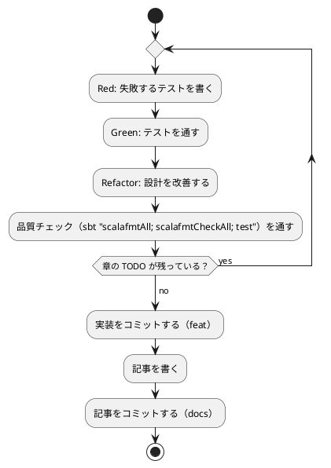

# 第 4 章: バージョン管理とデータ管理

## 4.1 はじめに

第 1 部では、TDD でデータを読み込み、前処理し、決定木で分類するプログラムを Scala で作りました。第 2 部では、そのプログラムを「変更を楽に安全にできる」状態に保つための道具立てを、バージョン管理（第 4 章）、パッケージ管理と静的解析（第 5 章）、タスクランナーと CI/CD（第 6 章）の順に整えます。

この章ではバージョン管理を扱います。機械学習のプロジェクトでは、コードに加えて **学習データ** と **学習済みモデル** というファイルが登場します。これらをコードと同じようにコミットしてよいとは限りません。この章では、Git で何を管理し、何を管理しないか、そして実験の結果を再現できるようにするには何を固定すればよいかを学びます。

Git の使い方は言語に依存しないので、[Python 版の第 4 章](../python/04-version-control-and-data-management.md)・[Java 版の第 4 章](../java/04-version-control-and-data-management.md) と同じ構成で進めます。Scala 版で注目するのは次の 2 点です。

- **sbt が作るファイルと、エディタの道具が作るファイル** を除外する。Gradle の `.gradle/`・`build/` に当たるものが、Scala では `target/` に加えて `.bsp/`・`.bloop/`・`.metals/` と増える
- **乱数は JVM の `java.util.Random`**。第 2 章で Java 版と同じ乱数・同じ手順（Fisher-Yates）にそろえたので、再現性の話は Java 版とまったく同じ土俵になる。Kotlin 版の `kotlin.random.Random` とはここが違う

## 4.2 コミットメッセージの重要性

コミット履歴は「なぜこの変更をしたのか」の記録です。機械学習のプロジェクトでは、「前処理を変えたら正解率が変わった」「ライブラリと予測が一致しない原因をテストに残した」といった変化の理由を、あとから追跡できることが特に重要になります。

コミットは次の 2 つを守ると追いやすくなります。

- **1 コミット 1 目的** — 機能追加と設定変更、実装と記事を 1 つのコミットに混ぜない
- **形式をそろえる** — 種類と対象がひと目で分かる書式でメッセージを書く

## 4.3 Conventional Commits

### フォーマット

本シリーズでは [Conventional Commits](https://www.conventionalcommits.org/ja/) の形式でコミットメッセージを書きます。

```text
<type>(<scope>): <subject>

<body>

<footer>
```

`scope` には変更の対象を書きます。本リポジトリでは、言語別の実装なら `scala`、記事シリーズなら `getting-start-ml`、ADR なら `adr`、CI の定義なら `ci` のように書きます。

### コミットタイプ

| type | 用途 |
|------|------|
| `feat` | 新機能（章の実装など） |
| `fix` | バグ修正 |
| `test` | テストの追加・修正 |
| `refactor` | 振る舞いを変えないコードの変更 |
| `docs` | ドキュメントだけの変更（記事・ADR など） |
| `build` | ビルドの設定や依存関係の変更 |
| `chore` | そのほかの雑務 |
| `ci` | CI の設定の変更 |

Kotlin 版では依存関係の変更を `chore` にしていましたが、Java 版・Scala 版では `build` を使っています。どちらも Conventional Commits が例に挙げている type です。1 つのシリーズの中で使い分けを決めておけば、どちらでも構いません。

### 実践例

本リポジトリの実際のコミット履歴から、Scala 版の雛形から第 3 章までを抜き出します（古い順）。

```text
917b1f08 docs(adr): Scala 版のライブラリを選定する ADR 007 を追加する
9d080a2a feat(scala): Scala 版の雛形（sbt・Scala 3.3.6・ScalaTest・scalafmt・scoverage）を追加する
a1af1d36 feat(scala): 第 1 章のきのこ派・たけのこ派の判定を TDD で実装する
3a1e1da1 ci(scala): Scala CI と apps:check:scala タスクを追加する
3e4a5a27 feat(scala): 第 2 章の表・欠損値の補完・訓練データとテストデータへの分割を追加する
d3708be9 feat(scala): 第 3 章の自作の決定木（enum）と Tribuo の CART との突き合わせを追加する
```

`git log --oneline` で見ると、どのコミットが何のための変更かを type と scope だけで区別できます。ライブラリの選定（`docs(adr)`）、雛形と実装（`feat(scala)`）、CI（`ci(scala)`）を分けてあるので、たとえば「Tribuo を選んだ理由がいつ決まったか」を知りたいときは ADR のコミットだけを見れば済みます。

ライブラリの選定を ADR（Architecture Decision Record）として実装より先にコミットしているのも意図的です。Scala 版では、機械学習ライブラリの第一候補だった Smile の Scala 3 向けの版がすべて GPL-3.0 だと分かって Tribuo に変えました。この「調べて、やめた」という判断は、コードには残りません。ADR に書いて実装の前にコミットしておくと、あとから「なぜ Kotlin 版・Java 版と同じ Tribuo なのか」を履歴からたどれます。

## 4.4 何をコミットし、何をコミットしないか

機械学習のプロジェクトには、コミットしてはいけないファイルが増えます。理由は大きく 3 つあります。

| 分類 | 例 | コミットしない理由 |
|------|-----|------------------|
| 再配布できないもの | 学習データ | ライセンスで利用者が限られている |
| 再生成できるもの | ビルド成果物、ビルドツールのキャッシュ、学習済みモデル | 大きく、差分が読めず、コードとデータから作り直せる |
| 秘匿すべきもの | `.env` の認証情報 | 漏洩すると取り返しがつかない |

### 学習データ

本シリーズの学習データは、書籍『スッキリわかる Python による機械学習入門』の配布データです。配布データの利用は書籍購入者に限られており、本リポジトリは公開されているので、データはコミットしません。ルートの `.gitignore` で、データの置き場所 `apps/data/` をまるごと除外しています。この設定は全言語で共通です。

```text
# 依存関係
node_modules/

# 環境変数（暗号化済みの .env.vault とテンプレートの .env.example は管理対象）
.env

# 学習データ（書籍購入者のみ利用可のため再配布しない。docs/article/getting-start-ml/outline.md を参照）
apps/data/

# ビルド成果物・一時ファイル
site/
tmp/
```

### Scala プロジェクト固有のファイル

`apps/scala/.gitignore` では、sbt が作るディレクトリ、エディタの道具（Metals・Bloop）が作るディレクトリ、学習済みモデルの保存先 `model/` を除外しています。

```text
target/
.bsp/
.bloop/
.metals/
model/
```

| パス | 中身 | ほかの言語版で対応するもの |
|------|------|------------------------|
| `target/` | コンパイル結果・テストレポート・scoverage のレポート。プロジェクトごとに作られ、`project/target/` にも作られる | Gradle の `build/` |
| `.bsp/` | Build Server Protocol の接続情報。エディタがビルドツールと話すために sbt が書き出す | （Gradle・MSBuild には無い） |
| `.bloop/` | Bloop（コンパイルサーバー）の設定 | 同上 |
| `.metals/` | Metals（Scala の language server）の作業ファイル | `.kotlin/`（Kotlin コンパイラの作業ファイル）に近い |
| `model/` | 学習済みモデルの保存先（第 8 章で使う） | Java 版・Kotlin 版と同じ |

Java 版・Kotlin 版と比べると、除外するものが 2 つ増えています。Scala は、コンパイルが重いぶん、エディタが常駐のビルドサーバー（Bloop）と language server（Metals）を使う文化があり、それらがプロジェクトの直下に作業ファイルを作るからです。どれも「エディタを開けば作り直される」ものなので、コミットしません。

逆に、**`project/` の下はコミットします**。`project/build.properties`（sbt の版）と `project/plugins.sbt`（sbt のプラグイン）は、ビルドを再現するために必要な設定そのものです。名前が似ている `project/target/` は `target/` の規則に当てはまるので除外されます。Gradle Wrapper に当たる「ビルドツールの版の固定」が、Scala では `project/build.properties` の 1 行であることは、第 5 章で詳しく扱います。

学習済みモデルは、コードと学習データがあれば作り直せます。モデルのファイルをコミットするより、「どのコードとどのデータから、どの設定で作ったか」をコミットで追えるようにするほうが、再現性の面でも役に立ちます。

### 除外されていることを確かめる

`.gitignore` が意図どおりに効いているかは、`git check-ignore -v` で確認できます。どのファイルの何行目の規則で除外されたかが表示されます。

```bash
git check-ignore -v apps/data/sukkiri-ml/iris.csv apps/scala/target/ apps/scala/.bsp/ apps/scala/.bloop/ apps/scala/.metals/ apps/scala/model/ tmp/sukkiri-ml-codes.zip
```

```text
.gitignore:8:apps/data/	apps/data/sukkiri-ml/iris.csv
apps/scala/.gitignore:1:target/	apps/scala/target/
apps/scala/.gitignore:2:.bsp/	apps/scala/.bsp/
apps/scala/.gitignore:3:.bloop/	apps/scala/.bloop/
apps/scala/.gitignore:4:.metals/	apps/scala/.metals/
apps/scala/.gitignore:5:model/	apps/scala/model/
.gitignore:12:tmp/	tmp/sukkiri-ml-codes.zip
```

ディレクトリのパスは末尾に `/` を付けて指定しています。`model/` のように末尾が `/` の規則はディレクトリだけに当てはまるので、まだ存在しないパスを `/` なしで調べると、除外されていないように見えます。

データを配置したあとに `git status --short` を実行し、`apps/data/` 以下のファイルが一覧に出てこないことも確かめておきます。

## 4.5 データの入手手順をコードにする

データをコミットしない代わりに、**データの入手と配置の手順** をリポジトリに残します。手順が文章だけだと、人によって置き場所がずれたり、ファイルが足りないまま実行して分かりにくいエラーになったりします。

本リポジトリでは、配置と確認を Gulp のタスクにしています（`ops/scripts/data.js`）。このタスクは言語に依存しないので、全言語で同じものを使います。

```bash
npx gulp data:setup
npx gulp data:check
```

配布 ZIP を `tmp/` に置いてから `data:setup` を実行し、`data:check` で揃っているかを確かめます。`data:help` の表示と、失敗したときの表示は [Python 版の 4.5 節](../python/04-version-control-and-data-management.md) と [Kotlin 版の 4.5 節](../kotlin/04-version-control-and-data-management.md) を参照してください。

### プログラムからデータの場所を知る

Scala の実装は、第 1 章で作った `DataDir` でデータの場所を解決します。環境変数 `ML_DATA_DIR` があればその場所を、無ければ `apps/data/sukkiri-ml/` を使います。

```scala
// src/main/scala/machinelearning/dataset/DataDir.scala
package machinelearning.dataset

import java.nio.file.Paths

/** 学習データのディレクトリを求める。 */
object DataDir:

  /** 環境変数 ML_DATA_DIR が無ければ apps/data/sukkiri-ml を使う。
    *
    * @param getenv
    *   環境変数を読む関数。テストでは差し替える
    */
  def from(getenv: String => Option[String]): String =
    getenv("ML_DATA_DIR").getOrElse(Paths.get("..", "data", "sukkiri-ml").toString)

  /** 実行中のプロセスの環境変数から学習データのディレクトリを求める。 */
  def current(): String = from(sys.env.get)
```

環境変数を読む関数を引数で受け取り、本番のコードからは `sys.env.get` を渡した `current()` を呼びます。テストからは架空の環境変数を渡して確かめられます。Java 版もメソッドを 2 つに分けていますが、そちらは `Function<String, String>` が `null` を返す前提で `Optional.ofNullable` に包み直していました。Scala の `sys.env` は `Map[String, String]` なので、`get` がそのまま `Option[String]` を返します。「無いかもしれない」ことが型に出ているぶん、包み直す手間が要りません。この形は F# 版の `getenv: string -> string option` と同じです。

### 環境変数を sbt のテストに渡す

`build.sbt` では、`ML_DATA_DIR` をテストに渡す設定を書いています。

```scala
    // 学習データの場所（未指定なら ../data/sukkiri-ml）をテストに渡す
    Test / envVars := sys.env.get("ML_DATA_DIR").map("ML_DATA_DIR" -> _).toMap
```

Gradle では、ここにもう 1 つ仕事がありました。Gradle はタスクの入力が変わらなければテストを再実行しないので、`ML_DATA_DIR` を変えても前回の結果が使われてしまいます。そのため Java 版・Kotlin 版では、環境変数を **テストタスクの入力として宣言** する必要がありました。

```kotlin
// Java 版・Kotlin 版の build.gradle.kts
tasks.test {
    val mlDataDir = providers.environmentVariable("ML_DATA_DIR")
    inputs.property("mlDataDir", mlDataDir.orElse(""))
    mlDataDir.orNull?.let { environment("ML_DATA_DIR", it) }
}
```

sbt の `test` は、前回から何も変わっていなくてもテストを毎回すべて実行します（変更のあったテストだけを選ぶのは `testQuick` のほうです）。実際、本章のために `sbt test` を何度か連続で実行しましたが、そのたびに 43 件のテストが走りました。そのため、Gradle の `inputs.property` に当たる宣言は要りません。ビルドツールごとに「何をしないと結果が古くなるか」が違うので、同じ問題でも書くことが変わります。

### データが無い環境でもテストを通す

コミットしないデータに依存するテストは、データの無い環境（CI や、データをまだ入手していない読者の環境）では失敗してしまいます。Scala 版では、ScalaTest の `assume` で、データが無ければテストをスキップします。

```scala
class IrisDataSpec extends AnyFunSuite:
  private val csvFile = Paths.get(DataDir.current(), "iris.csv")

  private def requireData(): org.scalatest.Assertion =
    assume(Files.exists(csvFile), "学習データ iris.csv が配置されていない（gulp data:setup）")

  test("深さ 2 の決定木はテストデータの 45 件中 43 件を正しく分類する") {
    requireData(): Unit
    // ...
  }
```

JUnit の `assumeTrue` と役割は同じですが、Scala 版には 2 つ癖があります。

- **`@BeforeEach` に当たるものを使わない**。ScalaTest の `AnyFunSuite` にも `beforeEach` はありますが、各テストの先頭で `requireData()` を呼ぶほうが、どのテストがデータを要るのかがその場で読めます
- **戻り値を捨てるときに `: Unit` と書く**。`assume` は `Assertion` を返します。本シリーズの Scala 版はコンパイラの `-Wvalue-discard` を有効にしているので、`Unit` を返す文脈で非 `Unit` の値を捨てると警告になり、`-Xfatal-warnings` でエラーになります。`requireData(): Unit` と型を書くのが、この設定での定型です（第 5 章で詳しく扱います）

データの無い場所を `ML_DATA_DIR` に指定すると、スキップされることを確かめられます。

```bash
ML_DATA_DIR=/nonexistent sbt -batch --no-colors test
```

```text
[info] IrisDataSpec:
[info] - 深さ 2 の決定木はテストデータの 45 件中 43 件を正しく分類する !!! CANCELED !!!
[info]   java.nio.file.Files.exists(IrisDataSpec.this.csvFile) was false 学習データ iris.csv が配置されていない（gulp data:setup） (IrisDataSpec.scala:14)
[info] - この分割ではどの深さでも Tribuo の CART とテストデータの予測が一致する !!! CANCELED !!!
[info]   java.nio.file.Files.exists(IrisDataSpec.this.csvFile) was false 学習データ iris.csv が配置されていない（gulp data:setup） (IrisDataSpec.scala:14)
[info] - 実行すると深さごとの正解率と深さ 2 の決定木を表示する !!! CANCELED !!!
[info]   java.nio.file.Files.exists(IrisDataSpec.this.csvFile) was false 学習データ iris.csv が配置されていない（gulp data:setup） (IrisDataSpec.scala:14)
```

```text
[info] Total number of tests run: 43
[info] Suites: completed 9, aborted 0
[info] Tests: succeeded 43, failed 0, canceled 10, ignored 0, pending 0
[info] All tests passed.
```

ScalaTest は、スキップを **CANCELED（取り消し）** と呼び、成功・失敗とは別に数えます。Gradle の `SKIPPED` と同じ意味ですが、「なぜ取り消したか」のメッセージと、`assume` が失敗した式そのものが表示されるのが便利です。最後の行が `All tests passed.` になっているとおり、取り消しはビルドを失敗させません。

単体テストは架空の値で作ったデータで書き、実データのテストは `assume` で守る、という 2 段構えにすると、CI ではデータ無しでも品質チェックが回り、手元ではデータを使った確認もできます。単体テストのデータに配布データの行をそのまま写さないことも大切です。テストのコードはコミットされるので、写した行はデータの再配布になってしまいます。

## 4.6 実験を再現できるようにする

機械学習の結果は、コードとデータが同じでも、次のものが違うと変わります。

| 変わる原因 | 固定する方法 | 本リポジトリでの置き場所 |
|-----------|------------|----------------------|
| 乱数（データの分割、モデルの初期値） | シードを指定する | 各章のコード（第 2 章の `seed`、Tribuo のトレーナーの `seed`） |
| ライブラリのバージョン | 版を 1 か所に書く | `apps/scala/build.sbt`（第 5 章） |
| Scala のバージョン | `scalaVersion` を固定する | `apps/scala/build.sbt`（`3.3.6`、第 5 章） |
| sbt のバージョン | `project/build.properties` に書く | `apps/scala/project/build.properties`（第 5 章） |
| JDK のバージョン | Nix の開発環境で固定する | `ops/nix/environments/scala/shell.nix` |

Kotlin 版の表と比べると、「Kotlin のバージョン」の行が「Scala のバージョン」に置き換わっていますが、意味が違います。Kotlin 版で Kotlin の版を固定していたのは、乱数のアルゴリズムが Kotlin の標準ライブラリにあるからでした。Scala 版で乱数を作るのは JVM の `java.util.Random` なので、Scala の版を変えても乱数列は変わりません。ここは Java 版と同じ事情です。

### 乱数のシード

第 2 章の `Preprocessing.shuffle` は、`java.util.Random(seed)` を使った Fisher-Yates の並べ替えでした。

```scala
  /** シードを使って Fisher-Yates のシャッフルで並べ替える。Java 版（Collections.shuffle）と同じ
    * 乱数・同じ手順なので、同じシードなら同じ並びになる。元のリストは変更しない。
    */
  def shuffle[A](items: Vector[A], seed: Long): Vector[A] =
    val random = Random(seed)
    val array = items.toArray[Any]
    for i <- array.length - 1 to 1 by -1 do
      val j = random.nextInt(i + 1)
      val tmp = array(i)
      array(i) = array(j)
      array(j) = tmp
    array.toVector.map(_.asInstanceOf[A])
```

同じシード 0 で 2 回、シード 1 で 1 回、シードを指定せずに 1 回、0〜9 の並べ替えを実行し、最後に Java の `Collections.shuffle` にも同じシードの `Random` を渡して比べてみます。

```scala
import java.util.Random
import scala.jdk.CollectionConverters.*

@main def run(): Unit =
  def shuffled(random: Random): Vector[Int] =
    val array = (0 until 10).toArray
    for i <- array.length - 1 to 1 by -1 do
      val j = random.nextInt(i + 1)
      val tmp = array(i)
      array(i) = array(j)
      array(j) = tmp
    array.toVector

  println(shuffled(Random(0)))
  println(shuffled(Random(0)))
  println(shuffled(Random(1)))
  println(shuffled(Random()))
  val list = new java.util.ArrayList[Integer]((0 until 10).map(Integer.valueOf).asJava)
  java.util.Collections.shuffle(list, Random(0))
  println(list)
```

`nix develop .#scala` の中で `scala-cli run --server=false Shuffle.scala` を 2 回実行した結果です（JDK 21.0.8）。

```text
Vector(4, 8, 9, 6, 3, 5, 2, 1, 7, 0)
Vector(4, 8, 9, 6, 3, 5, 2, 1, 7, 0)
Vector(6, 9, 7, 8, 4, 2, 0, 3, 1, 5)
Vector(0, 1, 5, 2, 6, 4, 8, 7, 3, 9)
[4, 8, 9, 6, 3, 5, 2, 1, 7, 0]
```

```text
Vector(4, 8, 9, 6, 3, 5, 2, 1, 7, 0)
Vector(4, 8, 9, 6, 3, 5, 2, 1, 7, 0)
Vector(6, 9, 7, 8, 4, 2, 0, 3, 1, 5)
Vector(0, 2, 3, 5, 9, 1, 8, 4, 7, 6)
[4, 8, 9, 6, 3, 5, 2, 1, 7, 0]
```

読み取れることが 3 つあります。

1. シードを指定した 3 行は、実行を繰り返しても同じ並びになり、シードを変えると並びが変わる。シードを指定しない 4 行目だけが、実行のたびに変わった
2. 自作の Fisher-Yates と `Collections.shuffle` が、同じシードで同じ並びになった（5 行目）。第 2 章で「Java 版と同じ手順にそろえた」と書いたのは、この意味です
3. この並び `[4, 8, 9, 6, 3, 5, 2, 1, 7, 0]`・`[6, 9, 7, 8, 4, 2, 0, 3, 1, 5]` は、[Java 版の第 4 章](../java/04-version-control-and-data-management.md) が JDK 17・21・25 で実測した並びと一致しています

第 2 章では、この性質を次のテストで固定しました。テストがあるので、うっかりシードを使わない実装に変えてしまっても気付けます。3 つ目のテストは、Java 版で実測した並びをそのまま期待値にしたもので、「Java 版と同じ分け方である」ことを壊したら落ちます。

```scala
  test("同じシードなら同じ分け方になる") {
    assert(
      Preprocessing.splitTrainTest(numbers, labels, 0.3, 42).tTest
        === Preprocessing.splitTrainTest(numbers, labels, 0.3, 42).tTest
    )
  }

  test("シードが違えば違う分け方になる") {
    assert(
      Preprocessing.splitTrainTest(numbers, labels, 0.3, 0).tTest
        !== Preprocessing.splitTrainTest(numbers, labels, 0.3, 1).tTest
    )
  }

  test("Java 版と同じ Fisher-Yates の並べ替えになる") {
    // Java 版（Collections.shuffle(positions, new Random(0))）で実測した並び
    assert(Preprocessing.shuffle(numbers, 0) === Vector(4, 8, 9, 6, 3, 5, 2, 1, 7, 0))
  }
```

### 仕様で決まっていること、決まっていないこと

Kotlin 版では、`kotlin.random.Random(seed)` の乱数列が同じになるのは同じ版の Kotlin の間だけで、将来の版でアルゴリズムが変わりうる、とドキュメントに書かれていました。`java.util.Random` は事情が違います。JDK 21 の API ドキュメントは次のように定めています。

> If two instances of `Random` are created with the same seed, and the same sequence of method calls is made for each, they will generate and return identical sequences of numbers. In order to guarantee this property, particular algorithms are specified for the class `Random`. Java implementations must use all the algorithms shown here for the class `Random`, for the sake of absolute portability of Java code.
>
> — [Java SE 21 API: java.util.Random](https://docs.oracle.com/en/java/javase/21/docs/api/java.base/java/util/Random.html)

`Random` のアルゴリズム（48 ビットの線形合同法）は仕様の一部で、どの Java の実装も、どの版もこれに従わなければなりません。同じシードから同じ順でメソッドを呼べば、同じ数列が返ることが保証されています。Scala 版はこのクラスをそのまま使っているので、この保証をそのまま受け取れます。Scala の標準ライブラリの `scala.util.Random` も `java.util.Random` を包んだものですが、第 2 章ではどのメソッドを何回呼ぶかを自分で書きたかったので、Java のクラスを直接使いました。

さらに、Scala 版は並べ替えの手順（Fisher-Yates のループ）も自分で書いています。Java 版が使っている `Collections.shuffle` について、API ドキュメントは「This implementation traverses the list backwards, ...」と **この実装** の説明をしているだけで、`Random` のように「すべての実装が従わなければならない」とは書いていません。Scala 版は、その手順をコードに写し取ったことで、「`Random` のどのメソッドを何回呼ぶか」を自分の側に持ってきたことになります。

分かっていることをまとめます。

| 事柄 | 根拠 | 確かさ |
|------|------|-------|
| 同じシードの `Random` は、同じ呼び出しに同じ数列を返す | `java.util.Random` の仕様 | すべての Java の実装・版で保証される |
| Scala 版の `shuffle` は、同じシードで同じ並びを返す | 上の仕様 + 手順が自前のコードにある | コードを変えない限り、JDK の版にはよらないはず |
| Scala 版の `shuffle` と Java 版の `Collections.shuffle` が同じ並びになる | JDK 21.0.8 と 25.0.2 で実行して確かめた | 手元の版では同じだった。`Collections.shuffle` の手順は仕様では保証されていない |

3 行目には注意してください。Scala 版の並べ替えが将来の JDK でも同じ結果になることは、`Random` の仕様から言えます。しかし **Java 版と一致し続ける** ことは、`Collections.shuffle` の側の実装しだいです。この記事を書いた時点では、Nix の開発環境の JDK 21.0.8 でも、手元の JDK 25.0.2（`npx gulp apps:check:scala` がローカルの sbt を見つけて使った環境）でも、第 2 章の「Java 版と同じ Fisher-Yates の並べ替えになる」テストは通りました。将来この 1 本だけが落ちたら、Scala 版のコードではなく JDK の `Collections.shuffle` が変わったと考えるのが筋です。

同じシードでも、言語が違えば分け方は変わります。乱数を作るアルゴリズムが NumPy・Kotlin・JVM で違うからです。実際、第 3 章の深さ 2 の決定木の正解数は、Kotlin 版が 45 件中 42 件、Java 版と Scala 版が 45 件中 43 件でした。Scala 版が Java 版と一致するのは、同じ乱数と同じ手順を意図してそろえたからです。記事に載せる正解率などの数値は、シードと版を固定した実装を実データで動かした結果です。数値をテストで固定するときは、どのシードで得た値かを必ずコードに残します。

## 4.7 TDD とコミットのタイミング

TDD のサイクルとコミットは、次のように対応させると履歴が読みやすくなります。



- テストが通らない状態ではコミットしない
- 実装と記事は別のコミットにする
- ビルドの設定や依存関係の変更（`build`）、CI の変更（`ci`）も、それぞれ別のコミットにする
- 学習データ・モデルがステージングされていないことを、コミットの前に `git status` で確かめる

Scala 版では、CI とタスクの追加（`3a1e1da1`）を第 1 章の実装（`a1af1d36`）の直後、第 2 章より前に入れています。これも意図的です。品質チェックの仕組みは、守るコードが少ないうちに入れるほうが、あとから全部の指摘に一度に向き合うより楽です。ウォーキングスケルトン（動く骨組み）に CI を通してから肉付けする、という順番です。

## 4.8 まとめ

この章では、機械学習のプロジェクトでのバージョン管理を学びました。

1. **Conventional Commits** — type と scope で、変更の種類と対象が分かるコミットメッセージを書く。コードに残らない判断（ライブラリをやめた理由など）は ADR にしてコミットする
2. **コミットしないものを決める** — 再配布できない学習データ、再生成できるビルド成果物・モデル、秘匿すべき認証情報を `.gitignore` で除外する。Scala では `target/` に加えて `.bsp/`・`.bloop/`・`.metals/` も除外し、`project/` の設定はコミットする
3. **入手手順をコードにする** — データを置く場所と確認方法を Gulp タスクにし、プログラムからは `DataDir.current()` で場所を解決する。`sys.env.get` が `Option` を返すので、無いかもしれないことが型に出る
4. **データが無くてもテストを通す** — 実データのテストは `assume` でスキップする。ScalaTest では CANCELED と数えられ、ビルドは成功する
5. **再現性** — `java.util.Random` の数列は仕様で保証される。Scala 版は並べ替えの手順も自前で書いたので、Java 版と同じ分け方になることをテストで固定できた

次の章では、ライブラリ・Scala・sbt の版を固定する sbt の仕組みと、コードの品質を機械的に確かめる整形・静的解析・カバレッジの道具を扱います。
