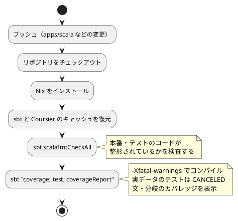

# 第 6 章: タスクランナーと CI/CD

## 6.1 はじめに

前の章で、整形・静的解析・カバレッジの道具をそろえました。道具は、**実行されなければ意味がありません**。この章では、それらを 1 つの手順にまとめ、プッシュするたびに自動で実行されるようにします。

Scala 版で使うものは次の 3 つです。

| 層 | 道具 | 受け持つこと |
|----|------|------------|
| 言語のビルドツール | sbt | コンパイル・テスト・整形・カバレッジ・章の実行 |
| リポジトリのタスクランナー | Gulp（`ops/scripts/`） | 学習データの配置、言語をまたいだ検査の呼び出し、Nix への切り替え |
| CI | GitHub Actions + Nix | プッシュのたびに、手元と同じ検査を同じ環境で実行する |

## 6.2 タスクランナー — sbt

### sbt のタスクとコマンド

sbt では、やりたいことを **タスク名** で指定します。第 5 章までに出てきたものをまとめます。

| タスク | 内容 |
|-------|------|
| `compile` | 本番のコードをコンパイルする（`-Xfatal-warnings` があるので、警告があれば止まる） |
| `test` | テストをコンパイルして実行する（`compile` も必要に応じて行われる） |
| `testOnly <クラス名>` | テストを絞って実行する |
| `testQuick` | 前回から変わったテストだけを実行する |
| `scalafmtAll` | 本番・テストのコードを整形する |
| `scalafmtCheckAll` | 整形されているかを検査する |
| `coverage` | 次のコンパイルに計測用のコードを埋め込む設定にする |
| `coverageReport` | カバレッジのレポートを作る |
| `run <章の名前>` | 章の `Main` を実行する |
| `update` | 依存を取得する |
| `Compile / dependencyTree` | 依存の木を表示する |

複数を続けて実行したいときは、セミコロンで区切って 1 つの引数にします。

```bash
sbt -batch --no-colors 'scalafmtAll; scalafmtCheckAll; test'
```

`-batch` はシェルに入らずに終了する指定、`--no-colors` は色の制御文字を出さない指定です。CI やスクリプトから呼ぶときに使います。

### sbt には check が無い

Gradle には `check` という「品質チェックをまとめるタスク」があり、Java 版・Kotlin 版はそこにプラグインの検査をぶら下げていました。sbt にはそれに当たる既定のタスクがありません。本シリーズでは、**実行するコマンドの並び** を検査の定義として扱い、次の 1 行を「Scala 版の品質チェック」と決めています。

```text
sbt -batch --no-colors 'scalafmtCheckAll; test'
```

この 1 行が、Gulp のタスク（`ops/scripts/apps.js`）と CI（`.github/workflows/scala-ci.yml`）の両方に書かれています。定義が 2 か所にあるのは弱点ですが、`build.sbt` に独自の `check` タスクを定義して「実体はどこにあるのか」を増やすより、素の sbt のコマンドをそのまま読めるほうが分かりやすいと判断しました。検査を増やすときは、この並びに足します。

なお、整形（`scalafmtAll`）は検査の側には入れていません。CI で勝手にコードを書き換えるのは避け、CI は `scalafmtCheckAll` で「整形されていない」と教えるだけにします。整形するのは手元の人間の仕事です。

### 章の Main を実行する

各章には、その章の処理を通しで実行する `Main` があります。入口は 1 つにまとめてあります。

```scala
// src/main/scala/machinelearning/Main.scala
package machinelearning

/** 章を選んで実行する入口。使い方: sbt "run chapter01" */
object Main:
  private val chapters: Map[String, (String => Unit) => Unit] = Map(
    "chapter01" -> machinelearning.chapter01.Main.run,
    "chapter02" -> machinelearning.chapter02.Main.run,
    "chapter03" -> machinelearning.chapter03.Main.run
  )

  def main(args: Array[String]): Unit =
    args.toList match
      case name :: Nil if chapters.contains(name) => chapters(name)(println)
      case _ =>
        Console.err.println(s"使い方: sbt \"run (${chapters.keys.toSeq.sorted.mkString(" | ")})\"")
```

章の名前と処理の対応を `Map` に置き、引数で選びます。値の型 `(String => Unit) => Unit` は「文字列を受け取って表示する関数を受け取り、何も返さない関数」です。各章の `Main.run` は `println` そのものではなく **表示する関数** を受け取るので、テストからは「文字列を集める関数」を渡して出力を固定できます。

```bash
sbt -batch --no-colors "run chapter03"
```

```text
[info] running machinelearning.Main chapter03
深さ	訓練データ	テストデータ
1	0.6762	0.6444
2	0.9333	0.9556
3	0.9524	0.9556
4	0.9619	0.9556
5	0.9810	0.9333
制限なし	1.0000	0.9333

深さ 2 の決定木:
花弁幅 <= 0.2950
  Iris-setosa
花弁幅 > 0.2950
  花弁幅 <= 0.6500
    Iris-versicolor
  花弁幅 > 0.6500
    Iris-virginica
```

章の名前を間違えたときや、引数を付けなかったときは使い方を表示します。

```bash
sbt -batch --no-colors run
```

```text
[info] running machinelearning.Main
使い方: sbt "run (chapter01 | chapter02 | chapter03)"
```

Java 版では、Gradle に `runChapter` という独自のタスクを定義して `-Pchapter=03` のように渡していました。sbt の `run` は引数をそのまま `main` に渡せるので、独自のタスクは要りません。そのかわり、シェルの引用符の扱いに注意が必要です（`sbt "run chapter03"` のように、`run` と引数をまとめて 1 つの引数にします）。

### 環境変数を渡す

学習データの場所は、第 4 章で見たとおり環境変数で渡します。

```bash
ML_DATA_DIR=/path/to/data sbt -batch --no-colors test
```

sbt の `test` は毎回すべてのテストを実行するので、Gradle のように「入力が変わらないから実行しない」ことはありません。環境変数を変えたら、その値で走ります。

### sbt のシェルを使うと速い

`-batch` を付けると、sbt は起動して、コマンドを実行して、終了します。この起動と設定の読み込みに、毎回数秒かかります。手元で何度も試すときは、`sbt` とだけ打ってシェルに入り、その中で `test`・`scalafmtAll`・`~test`（ファイルが変わるたびに実行）を打つほうが速く回せます。本章のコマンドを `-batch` で書いているのは、スクリプトと CI から呼ぶ形に合わせているからです。

## 6.3 Notebook について

Python 版と Kotlin 版では、この節で Notebook によるデータの探索と、出力セルを消してからコミットする仕組みを扱いました。Scala 版では Notebook を使わず、データの様子は各章の `Main` の出力とテストで確かめています。

Notebook で分かったことをテストに移す流れと、出力セルに学習データが残らないようにする仕組みは、[Python 版の 6.3 節](../python/06-task-runner-and-ci-cd.md)（nbstripout）と [Kotlin 版の 6.3 節](../kotlin/06-task-runner-and-ci-cd.md)（Gradle のタスクで出力セルを検査・削除）を参照してください。グラフによる可視化も、Python 版・Kotlin 版の各章を参照してください。

## 6.4 sbt と Gulp の分担

本リポジトリには、言語ごとのビルドツールとは別に、リポジトリ全体の作業を受け持つ Gulp のタスクがあります（`ops/scripts/`）。第 4 章の `data:setup` もその 1 つです。Scala の品質チェックは、Gulp の `apps:check:scala` タスクからも実行できます。

```javascript
  {
    name: 'scala',
    nix: 'scala',
    dir: path.join('apps', 'scala'),
    tools: [{ cmd: 'sbt', version: 'sbt --script-version' }],
    setup: 'sbt -batch --no-colors update',
    // CI（.github/workflows/scala-ci.yml）と同じ順に、整形・コンパイル・テストを検査する
    check: "sbt -batch --no-colors 'scalafmtCheckAll; test'",
  },
```

`tools` には、前提になるコマンドと、それが使えるかを確かめる方法を書きます。`sbt --script-version` が失敗したとき（sbt が入っていないとき）は、Nix の `scala` 環境（`nix develop .#scala`）の中で同じコマンドを実行します。第 5 章で見たとおり、sbt 本体の版は `project/build.properties` が決めるので、ここで確かめているのは「sbt のランチャーがあるか」だけです。

```bash
npx gulp apps:check:scala
```

```text
[12:05:54] Using gulpfile ~/IdeaProjects/getting-started-machine-learning/.claude/worktrees/agent-a8c5eeb031e965046/gulpfile.js
[12:05:54] Starting 'apps:check:scala'...

[apps/scala] sbt -batch --no-colors 'scalafmtCheckAll; test'
[info] welcome to sbt 1.12.9 (Homebrew Java 25.0.2)
...
[info] Total number of tests run: 43
[info] Suites: completed 9, aborted 0
[info] Tests: succeeded 43, failed 0, canceled 10, ignored 0, pending 0
[info] All tests passed.
[success] Total time: 49 s, completed 2026/09/20 12:07:14
[12:07:14] Finished 'apps:check:scala' after 1.34 min
```

この実行では、手元に入っていた sbt のランチャーが見つかったので、Nix を使わずにそのまま実行されました。JDK も手元の 25.0.2 です。それでも `welcome to sbt 1.12.9` と表示されているとおり、sbt 本体の版はプロジェクトの設定で決まっています。テストは 43 件が成功、学習データを置いていないので 10 件が取り消し（CANCELED）です。

2 つのタスクランナーは、次のように分担しています。

| 役割 | sbt（`apps/scala`） | Gulp（リポジトリのルート） |
|------|-------------------|------------------------|
| 何を知っているか | Scala のソース・依存・検査の設定 | 言語ごとのアプリの場所・前提ツール・学習データの場所 |
| 品質チェックの中身 | コマンドの並び（`scalafmtCheckAll; test`） | 持たない。sbt を呼ぶだけ |
| 前提ツールが無いとき | 何もできない | Nix の環境（`nix develop .#scala`）に切り替える |
| 全言語をまとめて | 扱わない | `apps:check` で、学習データの確認（`data:check`）と全言語の検査を続けて実行する |

Gulp 側に検査の中身を書かないのは、Java 版・Kotlin 版と同じ方針です。ただし Scala 版では、Gradle の `check` のような「まとめ役」がビルドツール側に無いため、コマンドの並びが Gulp の定義と CI の定義に重複します。重複を承知で、両方に同じ並びを書き、片方を変えたらもう片方も変える、とコメントで結びつけています（`ops/scripts/apps.js` の「CI（.github/workflows/scala-ci.yml）と同じ順に」）。

## 6.5 GitHub Actions による CI

### ワークフロー設定

`.github/workflows/scala-ci.yml` です。

```yaml
name: Scala CI

on:
  push:
    branches: [main, develop]
    paths:
      - "apps/scala/**"
      - ".github/workflows/scala-ci.yml"
      - "ops/nix/environments/scala/**"
      - "flake.nix"
      - "flake.lock"
  pull_request:
    branches: [main]
    paths:
      - "apps/scala/**"
      - ".github/workflows/scala-ci.yml"
      - "ops/nix/environments/scala/**"
      - "flake.nix"
      - "flake.lock"

permissions:
  contents: read

jobs:
  test:
    runs-on: ubuntu-latest

    steps:
      - name: Checkout the repository
        uses: actions/checkout@v4

      - name: Install Nix
        uses: cachix/install-nix-action@v30
        with:
          nix_path: nixpkgs=channel:nixos-unstable

      # sbt が取得する依存（Coursier のキャッシュと sbt 自身のキャッシュ）を保存する
      - name: Cache sbt and Coursier
        uses: actions/cache@v4
        with:
          path: |
            ~/.cache/coursier
            ~/.sbt
          key: ${{ runner.os }}-sbt-${{ hashFiles('apps/scala/build.sbt', 'apps/scala/project/build.properties', 'apps/scala/project/plugins.sbt') }}
          restore-keys: |
            ${{ runner.os }}-sbt-

      - name: Check formatting
        run: nix develop .#scala --command bash -c "cd apps/scala && sbt -batch --no-colors scalafmtCheckAll"

      # 学習データは再配布できないため CI には配置しない。実データのテストはスキップされる
      # 警告をエラーにする設定（-Xfatal-warnings）はコンパイルで効く
      - name: Run tests with coverage
        run: >-
          nix develop .#scala --command bash -c
          "cd apps/scala && sbt -batch --no-colors 'coverage; test; coverageReport'"
```

### ワークフローのポイント

- **`paths` で対象を絞る** — Scala の実装・このワークフロー・Nix の環境定義が変わったときだけ実行します。記事だけの変更や、ほかの言語の変更では実行されません
- **Nix で環境をそろえる** — `nix develop .#scala` で、`ops/nix/environments/scala/shell.nix` に定義した環境（Scala 3.3.6・sbt・Metals・Scala CLI）に入ってからコマンドを実行します
- **sbt の版はプロジェクトが決める** — Nix の環境に入っている sbt はランチャーです。実際に動く版は `project/build.properties` の `1.12.9` です（第 5 章）
- **2 つのキャッシュをまとめて保存する** — `~/.cache/coursier`（Coursier が取得したライブラリ）と `~/.sbt`（sbt 本体とプラグイン）を保存します。キーには、依存と版を決める 3 つのファイル（`build.sbt`・`project/build.properties`・`project/plugins.sbt`）のハッシュを使い、どれかを変えたら新しいキャッシュになるようにしています
- **手元と同じコマンドを使う** — `scalafmtCheckAll` と `'coverage; test; coverageReport'` を実行します。手元の `apps:check:scala` と順番も同じです
- **学習データは置かない** — 学習データは再配布できないので CI には置きません。実データのテストは `assume` で取り消されます
- **カバレッジは表示だけ** — `coverageReport` がログに数字を出すところまでで、下限による失敗は設けていません（第 5 章）

### CI パイプラインの流れ



### 実際のログを読む

第 1 章の実装と CI の定義を入れた時点で、CI が成功したときのログです（`gh run view --job=106006936760 --log` で取得し、時刻の列を除いています）。

キャッシュのステップです。

```text
Cache not found for input keys: Linux-sbt-2b0215fc274042cc617fa8cad3f331d81c54063c9081cdc374e797633cdf1402, Linux-sbt-
```

最初の実行なので、キーにも接頭辞にも一致するキャッシュがありません。このときは、すべてを取りに行くことになります。

整形の検査のステップです。

```text
Scala development environment activated
  - Scala: Scala code runner version 3.3.6 -- Copyright 2002-2025, LAMP/EPFL
  - sbt: sbt runner version: 1.11.7
  - Scala CLI: Scala CLI version: 1.11.0
[info] [launcher] getting org.scala-sbt sbt 1.12.9  (this may take some time)...
[info] [launcher] getting Scala 2.12.21 (for sbt)...
[info] welcome to sbt 1.12.9 (N/A Java 21.0.9)
[info] loading settings for project scala-build from plugins.sbt...
[info] loading project definition from /home/runner/work/.../apps/scala/project
[info] loading settings for project root from build.sbt...
[info] scalafmt: Checking 4 Scala sources (/home/runner/work/.../apps/scala)...
[info] scalafmt: Checking 4 Scala sources (/home/runner/work/.../apps/scala)...
[success] Total time: 2 s, completed Sep 20, 2026, 2:28:31 AM
```

ランチャー（1.11.7）が、プロジェクトの指定した sbt 1.12.9 を取りに行っているのが読み取れます。`Checking 4 Scala sources` が 2 回出るのは、本番とテストを別々に検査しているからです（第 5 章）。

テストとカバレッジのステップです。

```text
[info] KinokoTakenokoSpec:
[info] - BOM 付き CSV を読み込んで人物のリストを返す
...
[info] Total number of tests run: 11
[info] Suites: completed 4, aborted 0
[info] Tests: succeeded 11, failed 0, canceled 3, ignored 0, pending 0
[info] All tests passed.
[success] Total time: 9 s, completed Sep 20, 2026, 2:28:51 AM
[info] Written HTML coverage report [/home/runner/work/.../scoverage-report/index.html]
[info] Statement coverage.: 62.64%
[info] Branch coverage....: 40.00%
[info] Coverage reports completed
[info] All done. Coverage was stmt=[62.64%] branch=[40.00%]
```

この時点の実装は第 1 章までなので、テストは 11 件、実データのテストは 3 件が取り消されています。カバレッジが 62.64% と低いのは、取り消されたテストが通るはずだったコード（実データの読み込みと正解率の計算）が計測されないからです。第 3 章まで実装した時点で同じ条件（データなし）で計ると 66.91% でした。CI のカバレッジは、こうした事情を込みで見る数字です。

ジョブの最後に、次回のためのキャッシュが保存されます。

```text
[command]/usr/bin/tar --posix -cf cache.tzst ... --use-compress-program zstdmt
Sent 257275475 of 257275475 (100.0%), 245.8 MBs/sec
Cache saved with key: Linux-sbt-2b0215fc274042cc617fa8cad3f331d81c54063c9081cdc374e797633cdf1402
```

sbt 本体・プラグイン・Scala のコンパイラ・Tribuo と、必要なものを合わせて 245 MB ほどになりました。ジョブ全体は 1 分 31 秒です。次からはこのキャッシュが復元されるので、ダウンロードの時間が減ります。

キャッシュのキーに `build.sbt` のハッシュを入れているので、ライブラリを 1 つ足すとキーは変わります。そのときは `restore-keys` の接頭辞（`Linux-sbt-`）で前回のキャッシュが復元され、足りない分だけを取りに行きます。

## 6.6 三種の神器と CI

第 4〜6 章で整えたものを、ソフトウェア開発の「三種の神器」（バージョン管理・テスティング・自動化）に当てはめると次のようになります。

| 三種の神器 | 道具 | 本シリーズでの使い方 |
|-----------|------|------------------|
| バージョン管理 | Git、Conventional Commits、`.gitignore` | 学習データ・ビルド成果物・モデルをコミットしない。`project/` の設定はコミットする |
| テスティング | ScalaTest、scoverage | 単体テストは架空の値、実データのテストは `assume` で取り消せるようにする |
| 自動化 | sbt（タスク・`build.properties`）、scalafmt、コンパイラの警告、GitHub Actions、Nix、Gulp | 環境の再現、品質チェックの一括実行、データの配置、CI |

### 利用可能なコマンド一覧

| コマンド | 内容 | 実行する場所 |
|---------|------|------------|
| `npx gulp data:setup` | 学習データを配置する | リポジトリのルート |
| `npx gulp data:check` | 学習データの配置を確認する | リポジトリのルート |
| `npx gulp apps:check:scala` | Scala の品質チェックを実行する（sbt が無ければ Nix の中で） | リポジトリのルート |
| `sbt -batch --no-colors 'scalafmtCheckAll; test'` | 整形の検査・コンパイル・テストをまとめて実行する | `apps/scala` |
| `sbt -batch --no-colors scalafmtAll` | コードを整形する | `apps/scala` |
| `sbt -batch --no-colors 'coverage; test; coverageReport'` | カバレッジのレポートを作る | `apps/scala` |
| `sbt "run chapter03"` | 章の `Main` を実行する（学習データが必要） | `apps/scala` |
| `sbt` | sbt のシェルに入る（何度も試すときはこちらが速い） | `apps/scala` |

## 6.7 まとめ

この章では、品質チェックを自動化し、どの環境でも同じ手順で実行できるようにしました。

1. **sbt のタスク** — セミコロンで区切って並べたコマンドが、そのまま品質チェックの定義になる。Gradle の `check` に当たるまとめ役が無いぶん、並びを Gulp と CI の両方に書き、コメントで結びつける
2. **章の実行** — 入口の `Main` で章の名前と処理を `Map` に対応させ、`sbt "run chapter03"` で実行する。表示する関数を引数で受け取るので、テストから出力を固定できる
3. **sbt と Gulp の分担** — 検査の中身は sbt のコマンドに置き、Gulp は前提ツールを確かめて呼び出すだけにする。sbt が無ければ Nix の環境に切り替える
4. **GitHub Actions** — Nix で環境をそろえ、手元と同じコマンドを実行する。`~/.cache/coursier` と `~/.sbt` をキャッシュし、キーは `build.sbt`・`build.properties`・`plugins.sbt` のハッシュにする。学習データの無い CI では実データのテストが取り消され、カバレッジは表示だけにする

第 2 部で、TDD を回し続けるための道具立てがそろいました。次の第 3 部では、回帰問題と、欠損値・カテゴリ値・外れ値を含む現実的なデータの前処理に取り組みます。
