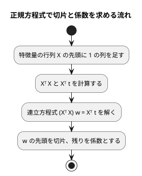

# 第 7 章: 線形回帰による数値予測

## 7.1 はじめに

第 1〜3 章では、グループを当てる **分類** を扱いました。この章からは、数値そのものを当てる **回帰** に進みます。題材は、映画の SNS での反響や主演俳優の露出度から、興行収入を予測する問題です。

この章では、最も基本的な回帰モデルである **線形回帰** を自作します。Python 版は NumPy の行列演算を使い、[Kotlin 版の第 7 章](../kotlin/07-linear-regression.md) は演算子オーバーロードで `a * b` と書ける行列の型を作りました。[Java 版](../java/07-linear-regression.md) には演算子オーバーロードが無いので `a.times(b)` になりましたが、Scala には演算子として使えるメソッド名があるので、Kotlin 版と同じく `a * b` と書けます。中身も配列ではなく `Vector[Vector[Double]]` を包んだ case class にするので、写して守る必要がありません。

次に、Tribuo の線形回帰に置き換えて結果を突き合わせます。[Python 版の第 7 章](../python/07-linear-regression.md) と同じく、外れ値の除去と回帰の評価指標（MAE・RMSE・決定係数 R²）も実装します。この章の行列と評価指標は、第 11〜13 章でも使います。

Notebook と可視化の節は設けません。散布図で外れ値を確かめる手順は [Python 版](../python/07-linear-regression.md) と [Kotlin 版の 7.13 節](../kotlin/07-linear-regression.md) を参照してください。

## 7.2 線形回帰とは

### 特徴量の重み付きの和で予測する

線形回帰は、予測値を「切片」と「特徴量ごとの係数 × 特徴量」の和で表すモデルです。この章のデータに当てはめると次の式になります。

```text
予測値 = 切片 + 係数1 × SNS1 + 係数2 × SNS2 + 係数3 × actor + 係数4 × original
```

学習とは、訓練データに対して予測値と実測値のずれが最も小さくなるように、切片と係数を決めることです。ずれの大きさには「誤差の 2 乗の合計」を使います。これを最小にする方法を **最小二乗法** と呼びます。

### 正規方程式

最小二乗法の解は、行列を使うと 1 つの式で求められます。特徴量を行列 `X`、実測値をベクトル `t`、切片と係数をまとめたベクトルを `w` とすると、誤差の 2 乗の合計を最小にする `w` は次の **正規方程式** を満たします。

```text
(Xᵀ X) w = Xᵀ t
```

`X` の先頭には、すべての値が 1 の列を足しておきます。この列にかかる係数が切片になります。



この流れに必要な行列の操作は、**積**・**転置**・**連立方程式を解く** の 3 つです。Scala の標準ライブラリにも行列の型は無く、Breeze のような線形代数のライブラリは ADR 007 で「自作の小さな不変の型を使う」と決めたので、この 3 つを持つ行列を自作します。逆行列を作らずに連立方程式として解くのは、Python 版・Kotlin 版・Java 版と同じく、そのほうが数値計算の誤差が小さくなるためです。

## 7.3 題材とデータ

この章で使うのは `cinema.csv` です。100 本の映画について、次の 6 列が記録されています。

| 列 | 内容 | 欠損値 |
|----|------|-------|
| cinema_id | 映画の ID | なし |
| SNS1 | SNS での反響の数（1 つ目の指標） | 1 件 |
| SNS2 | SNS での反響の数（2 つ目の指標） | なし |
| actor | 主演俳優のメディア露出の指標 | 1 件 |
| original | 原作の有無（0 または 1） | なし |
| sales | 興行収入 | なし |

「SNS1」「SNS2」「actor」「original」が特徴量、「sales」が正解ラベル（予測したい数値）です。`cinema_id` は映画を区別するための番号なので、特徴量には使いません。

Kotlin 版では、Kotlin DataFrame が SNS1 を `Int?`（欠損値を含む整数の列）と推論し、補完した平均値（小数）が入らないという問題が 7.11 節で起きました。Scala 版は第 2 章の `Table`・`Row` でセルを文字列のまま持ち、`Row.number` で読むときに `Option[Double]` にするので、列の型を推論する段階がありません。この問題は Java 版と同じく起きません。

このデータには、SNS2 の値が大きいのに興行収入が低い、傾向から外れた映画が 1 本含まれています。このような **外れ値** は、最小二乗法の結果を大きく引っ張ります。誤差を 2 乗して足し合わせるので、大きく外れた 1 点の影響が大きくなるためです。

## 7.4 TODO リストの作成

**TODO リスト**:

- [ ] 行列の型を作る
  - [ ] 行列の積を求める
  - [ ] 転置行列を求める
  - [ ] 連立方程式を解く
- [ ] 評価指標を計算する（MAE・RMSE・R²）
- [ ] 正規方程式で線形回帰を学習する
  - [ ] 直線上の点から切片と係数を求める
  - [ ] 複数の特徴量から切片と係数を求める
- [ ] 学習したモデルで予測する
- [ ] 外れ値を取り除く
  - [ ] SNS2 が 1000 を超え、興行収入が 8500 未満の行を取り除く
  - [ ] 条件の片方だけを満たす行は残す
- [ ] 外れ値の除去・分割・補完をまとめる
- [ ] Tribuo と結果が一致することを確かめる
- [ ] 実データで学習・評価して表示する

Java 版と同じく、CSV の読み込みは第 2 章の `Table.load` に任せ、土台になる行列の型から始めます。外れ値の条件「SNS2 が 1000 を超え、興行収入が 8500 未満」は、書籍『スッキリわかる Python による機械学習入門』の同じデータでの分析手順に合わせたものです。

## 7.5 行列の型を作る

### 行列の積: テストファースト

最初のテストは、2 行 2 列どうしの積です。

```scala
// src/test/scala/machinelearning/chapter07/MatrixSpec.scala
package machinelearning.chapter07

import org.scalatest.funsuite.AnyFunSuite

class MatrixSpec extends AnyFunSuite:
  test("行列の積を求める") {
    val a = Matrix(Vector(Vector(1.0, 2.0), Vector(3.0, 4.0)))
    val b = Matrix(Vector(Vector(5.0, 6.0), Vector(7.0, 8.0)))

    assert(a * b === Matrix(Vector(Vector(19.0, 22.0), Vector(43.0, 50.0))))
  }
```

`Matrix` がまだ無いので、コンパイルが通りません。

```console
$ sbt -batch --no-colors "testOnly machinelearning.chapter07.MatrixSpec"
[error] -- [E006] Not Found Error: …/MatrixSpec.scala:7:12
[error] 7 |    val a = Matrix(Vector(Vector(1.0, 2.0), Vector(3.0, 4.0)))
[error]   |            ^^^^^^
[error]   |            Not found: Matrix
[error] two errors found
[error] (Test / compileIncremental) Compilation failed
```

### Green: 仮実装

テストを通すだけの最小の実装から始めます。積の中身は、テストが期待する値をそのまま返します。

```scala
// src/main/scala/machinelearning/chapter07/Matrix.scala
package machinelearning.chapter07

/** 変更できない行列。 */
case class Matrix(rows: Vector[Vector[Double]]):
  /** 行列の積。 */
  def *(other: Matrix): Matrix =
    val _ = other
    Matrix(Vector(Vector(19.0, 22.0), Vector(43.0, 50.0)))
```

`val _ = other` は、引数を使っていないというコンパイラの指摘（`-Wunused:all` を `-Xfatal-warnings` でエラーにしている）を避けるための書き方です。仮実装のあいだだけ必要になります。

```console
$ sbt -batch --no-colors "testOnly machinelearning.chapter07.MatrixSpec"
[info] MatrixSpec:
[info] - 行列の積を求める
[info] All tests passed.
```

ここで、`Matrix` を `case class` にしただけで `===` の比較が成り立っていることに注目してください。Java 版は `double[][]` を `Arrays.deepEquals` で比べる `equals` を自分で書き、C# 版も同じ工夫をしました。Scala の `Vector` は値で比べられるので、case class の自動生成された `equals` がそのまま行列の等価判定になります。

### 三角測量: 行数と列数が違う行列

仮実装を本物にするために、2 つ目のテストを足します。

```scala
  test("行数と列数が違う行列の積を求める") {
    val a = Matrix(Vector(Vector(1.0, 2.0, 3.0), Vector(4.0, 5.0, 6.0)))
    val b = Matrix(Vector(Vector(1.0), Vector(0.0), Vector(2.0)))

    assert(a * b === Matrix(Vector(Vector(7.0), Vector(16.0))))
  }
```

```console
[info] - 行数と列数が違う行列の積を求める *** FAILED ***
[info]   Matrix(Vector(Vector(19.0, 22.0), Vector(43.0, 50.0))) did not equal Matrix(Vector(Vector(7.0), Vector(16.0))) (MatrixSpec.scala:17)
[info]   Analysis:
[info]   Matrix(rows: Vector1(0: Vector(19.0, 22.0) -> Vector(7.0), 1: Vector(43.0, 50.0) -> Vector(16.0)))
```

ScalaTest は case class の中身を突き合わせて `Analysis:` の行に差分を出します。どの行が食い違ったのかが、追加の設定なしに読めます。ここで本物の積に置き換えます。

```scala
  /** 行列の積。左の列数と右の行数が同じでなければならない。 */
  def *(other: Matrix): Matrix =
    require(
      columnCount == other.rowCount,
      s"左の行列の列数 $columnCount と右の行列の行数 ${other.rowCount} が違います"
    )
    Matrix(rows.map { row =>
      (0 until other.columnCount).toVector.map { j =>
        row.lazyZip(other.column(j)).map(_ * _).sum
      }
    })
```

- `lazyZip` は、2 つのコレクションを組にして 1 回の走査で処理します。`zip` と違って途中の組のコレクションを作らないので、内積のような「組にしてすぐ畳む」処理に向いています
- Kotlin 版は `zip` と `sumOf`、Java 版は添字のループで内積を書きました。浮動小数点の足し算は順序で丸め誤差が変わるので、テストは許容誤差つきで比べます（後述の 7.9 節で、Scala 版の値が Java 版と一致し Kotlin 版と末尾の桁が違うことを確かめます）

### 不変であることをテストしない

Java 版・C# 版には「作ったあとで元の配列を変えても行列は変わらない」というテストがありました。渡された配列を写さずに持つと、外から中身を書き換えられてしまうからです。

Scala 版にこのテストはありません。`Vector` は変更できないので、写す処理そのものが要らず、「写し忘れ」という失敗の余地がないためです。代わりに、行ごとの長さがそろっていることを `require` で守ります。

```scala
  require(rows.nonEmpty && rows.head.nonEmpty, "行列は 1 行 1 列以上でなければなりません")
  require(rows.forall(_.size == rows.head.size), "行によって列数が違います")
```

```scala
  test("行によって列数が違う値からは作れない") {
    val thrown =
      intercept[IllegalArgumentException](Matrix(Vector(Vector(1.0, 2.0), Vector(3.0))))

    assert(thrown.getMessage === "requirement failed: 行によって列数が違います")
  }
```

`require` が投げる例外のメッセージには、Scala が `requirement failed: ` を付けます。テストではその接頭辞も含めて突き合わせます。

### 転置と連立方程式

転置は、列を取り出して並べ直すだけです。

```scala
  /** j 列目の値。 */
  def column(j: Int): Vector[Double] = rows.map(_(j))

  /** 行と列を入れ替えた行列。 */
  def transpose: Matrix = Matrix((0 until columnCount).toVector.map(column))
```

連立方程式は、**部分ピボット選択つきのガウスの消去法** で解きます。ピボット（消去に使う対角成分）が 0 だと 0 で割ることになり、浮動小数点では例外ではなく `NaN` が伝わって、どこで壊れたのか分からなくなります。そこで消去の前に、その列の絶対値が最も大きい行を選んで入れ替えます。

```scala
  /** 正方行列 A について、A x = b を満たす列ベクトル x を部分ピボット選択つきのガウスの消去法で求める。 */
  def solve(b: Matrix): Matrix =
    require(rowCount == columnCount, s"正方行列ではありません（$rowCount 行 $columnCount 列）")
    require(b.rowCount == rowCount && b.columnCount == 1, "右辺は同じ行数の列ベクトルでなければなりません")
    val augmented = rows.lazyZip(b.column(0)).map(_ :+ _)
    Matrix.columnVector(Matrix.backSubstitute(Matrix.eliminate(augmented, 0))*)

object Matrix:
  /** 値を縦に並べた 1 列の行列（列ベクトル）を作る。 */
  def columnVector(values: Double*): Matrix = Matrix(values.toVector.map(Vector(_)))

  /** 拡大係数行列を、上三角行列になるまで前進消去する。 */
  private def eliminate(rows: Vector[Vector[Double]], pivot: Int): Vector[Vector[Double]] =
    if pivot >= rows.size then rows
    else
      val swapped = swapLargest(rows, pivot)
      val pivotRow = swapped(pivot)
      val eliminated = swapped.zipWithIndex.map { (row, i) =>
        if i <= pivot then row
        else
          val factor = row(pivot) / pivotRow(pivot)
          row.lazyZip(pivotRow).map(_ - factor * _)
      }
      eliminate(eliminated, pivot + 1)

  /** 上三角行列を、下の行から順に代入して解く。 */
  private def backSubstitute(rows: Vector[Vector[Double]]): Vector[Double] =
    val n = rows.size
    (n - 1 to 0 by -1).foldLeft(Vector.fill(n)(0.0)) { (x, i) =>
      val known = (i + 1 until n).map(j => rows(i)(j) * x(j)).sum
      x.updated(i, (rows(i)(n) - known) / rows(i)(i))
    }

  /** ピボットの列の絶対値が最も大きい行を、ピボットの行と入れ替える。 */
  private def swapLargest(rows: Vector[Vector[Double]], pivot: Int): Vector[Vector[Double]] =
    val largest = (pivot until rows.size).maxBy(i => math.abs(rows(i)(pivot)))
    rows.updated(pivot, rows(largest)).updated(largest, rows(pivot))
```

Java 版・C# 版は、拡大係数行列を可変の 2 次元配列に写し、その場で書き換えながら消去しました。Scala 版は書き換えずに、

- 前進消去を、ピボットの位置を 1 つ進めながら新しい行のベクトルを作る **再帰** で書き
- 後退代入を、解のベクトルを `updated` で作り直していく **畳み込み（`foldLeft`）** で書きます

`updated` は元の `Vector` を変えず、その位置だけ差し替えた新しい `Vector` を返します。F# 版の `List.mapi` を使った書き方に近く、「途中の状態に名前が付く」ので、消去のどの段階を見ているのかがコードから追えます。

テストは、解が分かっている連立方程式で確かめます。対角成分が 0 の場合も入れて、行の入れ替えが効いていることを残します。

```scala
  test("連立方程式の解を求める") {
    val a = Matrix(Vector(Vector(2.0, 1.0), Vector(1.0, 3.0)))

    val x = a.solve(Matrix.columnVector(3.0, 5.0)).column(0)

    assert(x(0) === 0.8 +- 1e-9)
    assert(x(1) === 1.4 +- 1e-9)
  }

  test("対角成分が 0 でも行を入れ替えて解を求める") {
    val a = Matrix(Vector(Vector(0.0, 1.0), Vector(1.0, 0.0)))

    val x = a.solve(Matrix.columnVector(2.0, 3.0)).column(0)

    assert(x === Vector(3.0, 2.0))
  }
```

3 元の連立方程式のテストでは、`A x = b` の `b` を「答えから逆算」して作ります。こうすると、解きたい答えをテストに書けます。

```scala
  test("3 元の連立方程式の解を求める") {
    val a = Matrix(Vector(Vector(4.0, 1.0, 2.0), Vector(1.0, 3.0, 0.0), Vector(2.0, 0.0, 5.0)))
    val b = a * Matrix.columnVector(1.0, -2.0, 3.0)

    val x = a.solve(b).column(0)

    assert(
      x.lazyZip(Vector(1.0, -2.0, 3.0)).forall((actual, expected) => actual === expected +- 1e-9)
    )
  }
```

## 7.6 評価指標を計算する

回帰の予測は「当たり・外れ」では測れません。どれだけ近いかを測る指標を 3 つ実装します。

| 指標 | 意味 | 読み方 |
|------|------|-------|
| MAE（平均絶対誤差） | 誤差の絶対値の平均 | 小さいほど良い。単位は正解ラベルと同じ |
| RMSE（二乗平均平方根誤差） | 誤差の 2 乗の平均の平方根 | 小さいほど良い。大きく外れた予測を重く数える |
| R²（決定係数） | 「平均値を予測し続けるモデル」より、どれだけ誤差を減らせたか | 1 に近いほど良い。0 なら平均値と同じ、負なら平均値より悪い |

テストは、手で計算できる 3 件のデータで書きます。

```scala
// src/test/scala/machinelearning/chapter07/RegressionMetricsSpec.scala（抜粋）
class RegressionMetricsSpec extends AnyFunSuite:
  private val t = Vector(3.0, 5.0, 7.0)

  test("MAE は誤差の絶対値の平均になる") {
    assert(RegressionMetrics.meanAbsoluteError(t, Vector(2.0, 5.0, 9.0)) === 1.0 +- 1e-12)
  }

  test("R² は平均値を予測し続けるモデルより良い分だけ 1 に近づく") {
    assert(RegressionMetrics.r2Score(t, Vector(2.0, 5.0, 9.0)) === 1 - 5.0 / 8 +- 1e-12)
  }
```

実装は、3 つの指標が共通して使う「残差（実測値 − 予測値）」を取り出す形にします。

```scala
// src/main/scala/machinelearning/chapter07/RegressionMetrics.scala
package machinelearning.chapter07

/** 回帰の評価指標。t は実測値、y は予測値。第 11・12 章でも使う。 */
object RegressionMetrics:

  /** 平均絶対誤差（MAE）。誤差の絶対値の平均。 */
  def meanAbsoluteError(t: Vector[Double], y: Vector[Double]): Double =
    val r = residuals(t, y)
    r.map(math.abs).sum / r.size

  /** 平均二乗誤差の平方根（RMSE）。 */
  def rootMeanSquaredError(t: Vector[Double], y: Vector[Double]): Double =
    val r = residuals(t, y)
    math.sqrt(sumOfSquares(r) / r.size)

  /** 決定係数（R²）。1 から「残差の 2 乗の合計 ÷ 平均との差の 2 乗の合計」を引いた値。 */
  def r2Score(t: Vector[Double], y: Vector[Double]): Double =
    val residual = sumOfSquares(residuals(t, y))
    val mean = t.sum / t.size
    1 - residual / sumOfSquares(t.map(_ - mean))

  /** 実測値と予測値の差。件数が違えばエラーにする。 */
  private def residuals(t: Vector[Double], y: Vector[Double]): Vector[Double] =
    require(t.size == y.size, "実測値と予測値の件数が違います")
    t.lazyZip(y).map(_ - _)

  private def sumOfSquares(values: Vector[Double]): Double = values.map(v => v * v).sum
```

Java 版は `double[]` と `IntStream` で書き、`DoubleStream.average()` が返す `OptionalDouble` を `orElseThrow()` で開けました。Scala 版は `Vector[Double]` の `sum` と `size` で平均を書けるので、空でないことを呼び出し側（`require`）で守る形にしています。

## 7.7 正規方程式で線形回帰を学習する

### 直線上の点から切片と係数を求める

最初のテストは、特徴量が 1 つで、点がすべて直線 `t = 2x + 1` の上にある場合です。

```scala
// src/test/scala/machinelearning/chapter07/LinearRegressionSpec.scala（抜粋）
  test("直線上の点から切片と係数を求める") {
    val x = Rows(Vector("x"), Vector(0.0), Vector(1.0), Vector(2.0), Vector(3.0))
    val t = Vector(1.0, 3.0, 5.0, 7.0)

    val model = LinearRegression.fit(x, t)

    assertModel(LinearModel.of(1.0, Vector("x"), Vector(2.0)), model)
  }
```

`Rows` は、列名と行ごとの値から `Vector[Features]` を作るテスト用の補助です。第 2 章の `Features` をそのまま使います。

```scala
/** テスト用の特徴量を作る。 */
object Rows:
  /** 列名と、行ごとの値から特徴量のリストを作る。 */
  def apply(columns: Vector[String], values: Vector[Double]*): Vector[Features] =
    values.toVector.map(Features(columns, _))
```

複数の特徴量のテストは、`t = 3a - 2b + 5` をそのままコードで作って確かめます。

```scala
  test("複数の特徴量から切片と係数を求める") {
    val ab = Vector(
      Vector(0.0, 0.0),
      Vector(1.0, 0.0),
      Vector(0.0, 1.0),
      Vector(2.0, 1.0),
      Vector(1.0, 3.0)
    )
    val x = Rows(Vector("a", "b"), ab*)
    val t = ab.map(row => 3 * row(0) - 2 * row(1) + 5)

    val model = LinearRegression.fit(x, t)

    assertModel(LinearModel.of(5.0, Vector("a", "b"), Vector(3.0, -2.0)), model)
  }
```

`ab*` は、`Vector` を可変長引数に展開する Scala 3 の書き方です（Scala 2 の `ab: _*` にあたります）。

### 係数の順序を型で保つ

学習したモデルは、切片と「列名つきの係数」を持ちます。ここで大事なのは **列の順が保たれること** です。Java 版は `Map.copyOf` が順序を保たないため `LinkedHashMap` に写して変更できないように包み、C# 版も同じ工夫をしました。

Scala 版は、係数を `Vector[(String, Double)]`（列名と値の組の並び）で持ちます。順序が型の性質としてそのまま残り、値でも比べられます。

```scala
// src/main/scala/machinelearning/chapter07/LinearRegression.scala
/** 学習した線形回帰のモデル。切片と、列名つきの係数を持つ。 */
case class LinearModel(intercept: Double, coefficients: Vector[(String, Double)]):

  /** 列名で係数を読む。 */
  def coefficient(column: String): Double =
    coefficients
      .collectFirst { case (name, value) if name == column => value }
      .getOrElse(throw IllegalArgumentException(s"係数がありません: $column"))

  /** 1 行分の特徴量の予測値。係数は列名で対応させるので、列の並び順は問わない。 */
  def predictOne(features: Features): Double =
    coefficients.foldLeft(intercept)((sum, c) => sum + c._2 * features.value(c._1))

  /** 行ごとの予測値。 */
  def predict(x: Vector[Features]): Vector[Double] = x.map(predictOne)

object LinearModel:
  /** 列名と、同じ順に並んだ係数からモデルを作る。 */
  def of(intercept: Double, columns: Vector[String], coefficients: Vector[Double]): LinearModel =
    require(columns.size == coefficients.size, "列名と係数の数が違います")
    LinearModel(intercept, columns.zip(coefficients))
```

予測は列名で係数を引くので、特徴量の列の並びが学習時と違っても同じ結果になります。これをテストに残します。

```scala
  test("列の並び順が違っても列名で係数を対応させる") {
    val x = Rows(Vector("b", "a"), Vector(4.0, 1.0), Vector(0.5, 3.0))

    assert(model.predict(x) === Vector(-1.0, 6.5))
  }
```

### 学習

正規方程式を、7.5 節で作った行列で解きます。

```scala
/** 正規方程式で線形回帰を学習する。 */
object LinearRegression:

  /** 先頭に 1 の列を足した特徴量の行列（計画行列）を作る。1 の列の係数が切片になる。 */
  private[chapter07] def designMatrix(x: Vector[Features]): Matrix =
    Matrix(x.map(1.0 +: _.values))

  /** (Xᵀ X) w = Xᵀ t を解いて、切片と係数を求める。列名は先頭の行の特徴量から取る。 */
  def fit(x: Vector[Features], t: Vector[Double]): LinearModel =
    require(x.nonEmpty, "訓練データが空です")
    require(x.size == t.size, "特徴量と実測値の件数が違います")
    val design = designMatrix(x)
    val transposed = design.transpose
    val weights = (transposed * design).solve(transposed * Matrix.columnVector(t*)).column(0)
    LinearModel.of(weights.head, x.head.columns, weights.tail)
```

- `1.0 +: _.values` は、`Vector` の先頭に 1 を足した新しい `Vector` です。Java 版の `System.arraycopy` にあたる処理が 1 つの演算子で書けます
- `weights.head` が切片、`weights.tail` が係数です。Java 版の `Arrays.copyOfRange(weights, 1, weights.length)` にあたります
- `private[chapter07]` は「このパッケージの中だけから見える」という指定です。計画行列は実装の途中の値ですが、テストで直接確かめたいので、パッケージの中に限って公開しています

### 第 11〜13 章から使う API

この章で作る型は、第 11 章（評価）・第 12 章（正則化）・第 13 章（主成分分析）から使います。公開する API をまとめておきます。

| 型・関数 | 用途 |
|---------|------|
| `Matrix(rows: Vector[Vector[Double]])` | 行列を作る。行ごとの長さは `require` でそろえる |
| `Matrix.columnVector(values: Double*)` | 縦に並べた 1 列の行列を作る |
| `matrix.rowCount` / `matrix.columnCount` | 行数・列数 |
| `matrix(i, j)` / `matrix.column(j)` / `matrix.rows` | 値・列・行の取り出し |
| `matrix * other` / `matrix.transpose` / `matrix.solve(b)` | 積・転置・連立方程式 |
| `LinearRegression.fit(x, t): LinearModel` | 正規方程式で学習する |
| `LinearModel(intercept, coefficients)` | 切片と `Vector[(String, Double)]` の係数 |
| `model.predict(x)` / `model.predictOne(features)` / `model.coefficient(name)` | 予測と係数の参照 |
| `RegressionMetrics.meanAbsoluteError/rootMeanSquaredError/r2Score(t, y)` | 評価指標。いずれも `Vector[Double]` を 2 つ受け取る |
| `TribuoRegression.toDataset/train/predict` | Tribuo の回帰との橋渡し |

## 7.8 外れ値の除去・分割・補完をまとめる

### 外れ値を取り除く

外れ値の条件は「SNS2 が 1000 を超え、**かつ** 興行収入が 8500 未満」です。「かつ」であることを確かめるために、条件の片方だけを満たす行が残るテストも書きます。

```scala
// src/test/scala/machinelearning/chapter07/CinemaSpec.scala（抜粋）
  test("SNS2 が 1000 を超え売上が 8500 未満の行を取り除く") {
    val rows = table("1200" -> "8000", "600" -> "9500")

    assert(sns2(Cinema.removeOutliers(rows)) === Vector("600"))
  }

  test("条件の片方だけを満たす行は残す") {
    val rows = table("1200" -> "9800", "600" -> "8000")

    assert(sns2(Cinema.removeOutliers(rows)) === Vector("1200", "600"))
  }
```

テストのデータは架空の値です。学習データの行はテストにも記事にも書きません。

### 前処理を 1 つの関数にする

第 2 章で決めた順序（**分割してから、訓練データの平均値で両方を補完する**）を守ります。テストデータの平均値が訓練に混ざると、テストデータの情報が学習に漏れる（リーク）ためです。外れ値の除去は、分割の前に行います。

```scala
// src/main/scala/machinelearning/chapter07/Cinema.scala
package machinelearning.chapter07

import java.nio.file.Path
import machinelearning.chapter02.{Features, Preprocessing, Row, Table, TrainTestSplit}

/** 映画の興行収入のデータ（cinema.csv）の前処理。 */
object Cinema:

  /** 特徴量の列 */
  val FeatureColumns: Vector[String] = Vector("SNS1", "SNS2", "actor", "original")

  /** 正解ラベルの列 */
  val Target = "sales"

  /** SNS2 がこの値を超え、かつ興行収入が OutlierSales 未満の映画を外れ値とする */
  private val OutlierSns2 = 1000.0

  private val OutlierSales = 8500.0

  /** 外れ値の行を除いた表を返す。 */
  def removeOutliers(table: Table): Table =
    table.copy(rows = table.rows.filterNot(isOutlier))

  /** 外れ値を除き、分割してから訓練データの平均値で両方の欠損値を補完する。 */
  def prepare(csvFile: Path, testSize: Double, seed: Long): TrainTestSplit[Features, Double] =
    val table = removeOutliers(Table.load(csvFile))
    val t = table.rows.map(number(_, Target))
    val split = Preprocessing.splitTrainTest(table.rows, t, testSize, seed)
    val means = Preprocessing.columnMeans(split.xTrain, FeatureColumns)
    TrainTestSplit(
      Preprocessing.fillMissing(split.xTrain, FeatureColumns, means),
      Preprocessing.fillMissing(split.xTest, FeatureColumns, means),
      split.tTrain,
      split.tTest
    )

  private def isOutlier(row: Row): Boolean =
    number(row, "SNS2") > OutlierSns2 && number(row, Target) < OutlierSales

  private def number(row: Row, column: String): Double =
    row.number(column).getOrElse(throw IllegalArgumentException(s"欠損値です: $column"))
```

- `table.copy(rows = …)` は case class の `copy` です。Java 版の `new Table(table.columns(), …)` にあたりますが、変えたい要素だけを名前で指定できます
- `Preprocessing.splitTrainTest` は第 2 章のもので、型引数を持つので正解ラベルが `String`（第 2・3 章のアヤメ）でも `Double`（この章）でも同じ関数が使えます
- 補完の結果は `Features` なので、「欠損値が残っていないか」を数えて確かめるテストは要りません。`Features` は欠損値を持てない型だからです

第 2 章の `Preprocessing.shuffle` は `java.util.Random` と Fisher-Yates で書いてあり、Java 版の `Collections.shuffle` と同じ乱数・同じ手順です。そのため、同じシード（0）と同じ割合（0.2）なら、訓練データとテストデータに分かれる行が Java 版と一致します。この章の実測値が Java 版と一致するかどうかは、7.10 節で確かめます。

## 7.9 Tribuo に置き換える

### どのトレーナーが最小二乗解になるかを確かめる

Tribuo には線形回帰のトレーナーが複数あります。Kotlin 版で調べた結果（ADR 002）と Java 版の結果（ADR 005）を、Scala でも確かめました。乱数で作った特徴量 3 列にノイズを加えた架空のデータ（`t = 4 + 1.5a - 0.5b + 2c + ノイズ`、30 件）で、使い捨てのテストを書いて最初の 1 件の予測値を比べた結果です。

| 学習方法 | 最初の 1 件の予測値 |
|---------|-------------------|
| 自作（正規方程式） | 28.884235137468824 |
| `SLMTrainer(true)` | 28.884235137468863 |
| `LARSTrainer()` | 28.884235137468863 |
| `SLMTrainer(false)` | 31.118855730190532 |
| `LinearSGDTrainer`（二乗誤差、AdaGrad 学習率 0.1、100 エポック、シード 0） | 30.3097041037859 |

- `SLMTrainer(true)` と `LARSTrainer()` は、自作と小数第 13 位まで一致しました。Tribuo の 2 つの値は Kotlin 版・Java 版と同じです
- 自作の値 28.884235137468824 は **Java 版と完全に一致** し、Kotlin 版（28.884235137468828）とは末尾の桁が違います。Scala 版の内積は `lazyZip(...).map(_ * _).sum` で左から順に足すので、Java 版の添字のループと足し算の順序が同じになるためです。テストは `+- 1e-9` の許容誤差で比べます
- `SLMTrainer(false)` は一致しません。このとき学習した重みのベクトルは大きさが 4（特徴量 3 つとバイアス）で、バイアスの位置には値がありませんでした
- `LinearSGDTrainer` は勾配降下法で少しずつ係数を近づけるトレーナーなので、この設定では最小二乗解に届いていません。値は乱数のシードで変わります。勾配降下法は第 10 章で扱います

このうち、`SLMTrainer(true)` と `LARSTrainer()` の 2 つをテストに残します。`LinearSGDTrainer` は `tribuo-regression-sgd` に入っていて、確認のあいだだけ依存に足し、テストに残さないので外しました。

### 特徴量を Tribuo のデータセットに変換する

第 3 章の `TribuoTrees` と同じく、事例（`Example`）とデータセット（`MutableDataset`）に変換するアダプターを作ります。回帰では、正解ラベルが `Label` ではなく数値を持つ `Regressor` になります。トレーナーは引数で受け取り、`SLMTrainer(true)` と `LARSTrainer()` を同じ関数で試せるようにします。

```scala
// src/main/scala/machinelearning/chapter07/TribuoRegression.scala
package machinelearning.chapter07

import machinelearning.chapter02.Features
import org.tribuo.datasource.ListDataSource
import org.tribuo.impl.ArrayExample
import org.tribuo.provenance.SimpleDataSourceProvenance
import org.tribuo.regression.{RegressionFactory, Regressor}
import org.tribuo.{Example, Model, MutableDataset, Trainer}
import scala.jdk.CollectionConverters.*

/** 特徴量を Tribuo の回帰の事例に変え、Tribuo のトレーナーで学習・予測する。 */
object TribuoRegression:
  /** 予測する数値の名前 */
  val OutputName: String = Cinema.Target

  private val regressionFactory = RegressionFactory()

  /** 特徴量と実測値を、Tribuo のデータセットにする。 */
  def toDataset(x: Vector[Features], t: Vector[Double]): MutableDataset[Regressor] =
    val examples =
      x.zip(t).map((features, value) => toExample(features, Regressor(OutputName, value)))
    val provenance = SimpleDataSourceProvenance("features", regressionFactory)
    MutableDataset(ListDataSource(examples.asJava, regressionFactory, provenance))

  /** 渡したトレーナーで学習する。 */
  def train(
      trainer: Trainer[Regressor],
      x: Vector[Features],
      t: Vector[Double]
  ): Model[Regressor] =
    trainer.train(toDataset(x, t))

  /** 学習したモデルで、特徴量ごとの数値を予測する。 */
  def predict(model: Model[Regressor], x: Vector[Features]): Vector[Double] =
    x.map(features =>
      model
        .predict(toExample(features, RegressionFactory.UNKNOWN_REGRESSOR))
        .getOutput
        .getValues()(0)
    )

  private def toExample(features: Features, output: Regressor): Example[Regressor] =
    ArrayExample[Regressor](output, features.columns.toArray, features.values.toArray)
```

- `Regressor(OutputName, value)` は、名前（`"sales"`）と数値を持つ正解ラベルです。Tribuo の回帰は複数の数値を同時に予測できるので、`getValues()` は配列を返します。この章では 1 つだけなので `(0)` で取り出します
- 予測するときは、第 3 章の `LabelFactory.UNKNOWN_LABEL` と同じく、未知を表す `RegressionFactory.UNKNOWN_REGRESSOR` を渡します
- `train` の引数の型は `Trainer[Regressor]` です。`SLMTrainer` も `LARSTrainer` もこのインターフェースを実装しているので、どちらも渡せます
- `examples.asJava` は Scala の `Vector` を Java の `List` として渡す橋渡しです（`scala.jdk.CollectionConverters`）。`ArrayExample[Regressor]` の型引数と `features.columns.toArray`・`features.values.toArray` の配列への変換も、Java 向けの API に合わせるための境界の処理です。第 3 章の `TribuoTrees` と同じ形なので、橋渡しの書き方は章をまたいでそろえられます

テストは、自作の予測と 1 件ずつ突き合わせます。

```scala
// src/test/scala/machinelearning/chapter07/TribuoRegressionSpec.scala（抜粋）
  test("SLMTrainer(true) の予測は自作の線形回帰の予測と一致する") {
    val (x, t) = noisyDataset()

    val model = TribuoRegression.train(SLMTrainer(true), x, t)

    val mine = LinearRegression.fit(x, t).predict(x)
    assert(
      TribuoRegression.predict(model, x).lazyZip(mine).forall((a, b) => a === b +- 1e-9)
    )
  }
```

`LARSTrainer` のテストは、トレーナーを `LARSTrainer()` に替えただけです。`noisyDataset` は特徴量と実測値の組を `(Vector[Features], Vector[Double])` のタプルで返し、`val (x, t) = noisyDataset()` で分解して受け取ります。Java 版は組に名前を付けた `record Noisy` を作る必要がありましたが、Scala では Kotlin 版・F# 版と同じくタプルと分解で済みます。

### 係数を突き合わせる

予測値が一致したので、係数も一致するはずです。ところが、学習したモデル（`SparseLinearModel`）の重みを取り出すと、自作の係数とは違う値でした。

| 特徴量 | 自作の係数 | `SparseLinearModel` の重み |
|--------|----------|--------------------------|
| a | 1.4967484681545709 | 0.5294490880561531 |
| b | -0.56959990171371 | -0.22329887049401564 |
| c | 1.9280374530469377 | 0.7595789924844588 |

いずれの値も Java 版と完全に一致しました。ADR 002 に記録したとおり、`SLMTrainer(true)` は学習の前に、特徴量と正解ラベルをそれぞれ「平均を引き、平均との差の 2 乗の合計の平方根で割る」形に変換します。重みは、この変換後の空間での値です。そこで、重みに「正解ラベルの変換の大きさ ÷ 特徴量の変換の大きさ」を掛けて元の単位に戻せば、自作の係数と一致するはずです。これを Scala で確かめる学習用テストにしました。

```scala
  test("Tribuo の重みは正規化した空間の値で、元の単位に戻すと自作の係数と一致する") {
    val (x, t) = noisyDataset()
    val model = TribuoRegression.train(SLMTrainer(true), x, t).asInstanceOf[SparseLinearModel]
    val weights = model.getWeights.values.iterator.next
    val model2 = LinearRegression.fit(x, t)

    columns.foreach { name =>
      val column = x.map(_.value(name))
      val weight = weights.get(model.getFeatureIDMap.getID(name))
      assert(math.abs(weight - model2.coefficient(name)) > 1e-3, s"$name の重み")
      assert(weight * centeredNorm(t) / centeredNorm(column) === model2.coefficient(name) +- 1e-9)
    }
  }

  /** 平均との差の 2 乗の合計の平方根。 */
  private def centeredNorm(values: Vector[Double]): Double =
    val mean = values.sum / values.size
    math.sqrt(values.map(v => (v - mean) * (v - mean)).sum)
```

- `asInstanceOf[SparseLinearModel]` は、`Model[Regressor]` として受け取ったモデルを、重みを取り出せる具体的な型として扱うキャストです。Kotlin の `as`、Java の `(SparseLinearModel)` にあたります。Scala では基本的に避けたい書き方ですが、Tribuo の `train` が返すのは `Model[Regressor]` なので、重みを見るにはここで降りるしかありません
- 重みのベクトルの何番目がどの特徴量かは、`getFeatureIDMap.getID(name)` で引きます。第 3 章で見たとおり Tribuo は特徴量を名前の順に並べるので、列の順の添字では引けません
- 重みそのものは自作の係数と一致しないことも確かめ、「元の単位に戻す」変換が意味を持つことをテストに残しました

### 評価指標を突き合わせる

Tribuo の `RegressionEvaluator` は、MAE・RMSE・R² をまとめて計算します。自作の評価指標と一致することも確かめます。

```scala
  test("Tribuo の評価器の MAE・RMSE・R² は自作の評価指標と一致する") {
    val (x, t) = noisyDataset()
    val model = TribuoRegression.train(SLMTrainer(true), x, t)
    val y = TribuoRegression.predict(model, x)

    val evaluation = RegressionEvaluator().evaluate(model, TribuoRegression.toDataset(x, t))

    val target = Regressor(TribuoRegression.OutputName, Double.NaN)
    assert(evaluation.mae(target) === RegressionMetrics.meanAbsoluteError(t, y) +- 1e-9)
    assert(evaluation.rmse(target) === RegressionMetrics.rootMeanSquaredError(t, y) +- 1e-9)
    assert(evaluation.r2(target) === RegressionMetrics.r2Score(t, y) +- 1e-9)
  }
```

`Regressor(OutputName, Double.NaN)` は「どの数値についての指標か」を指す鍵で、値そのものは使われません。第 3 章の分類の評価器と同じく、Tribuo は評価の結果を出力の名前で引く形になっています。

なお、`SLMTrainer` は学習のたびに `At iteration 0 Average residual …`・`Feature selected: …` を標準出力に書きます。テストの出力に混ざりますが、失敗ではありません（`java.util.logging` の設定で抑えられます）。

## 7.10 実データで学習・評価する

### 結果を表示する

第 3 章と同じく、章ごとの `Main.run(print: String => Unit)` に結果の表示をまとめ、テストから出力を固定します。

```scala
// src/main/scala/machinelearning/chapter07/Main.scala
package machinelearning.chapter07

import java.nio.file.Paths
import java.util.Locale
import machinelearning.chapter02.Table
import machinelearning.dataset.DataDir

/** 映画の興行収入を線形回帰で予測し、係数と評価指標を表示する。 */
object Main:
  private val TestSize = 0.2
  private val Seed = 0L

  def run(print: String => Unit): Unit =
    val csvFile = Paths.get(DataDir.current(), "cinema.csv")
    val table = Table.load(csvFile)
    val split = Cinema.prepare(csvFile, TestSize, Seed)
    val model = LinearRegression.fit(split.xTrain, split.tTrain)
    val y = model.predict(split.xTest)
    val coefficients =
      model.coefficients.map((name, value) => s"$name=${format(value, 4)}").mkString(", ")
    print(s"データ件数: ${table.rows.size}")
    print(s"外れ値を除いた件数: ${Cinema.removeOutliers(table).rows.size}")
    print(s"訓練データ: ${split.xTrain.size} 件, テストデータ: ${split.xTest.size} 件")
    print(s"切片: ${format(model.intercept, 2)}")
    print(s"係数: $coefficients")
    print(
      "テストデータの評価: " +
        s"R2=${format(RegressionMetrics.r2Score(split.tTest, y), 4)}, " +
        s"MAE=${format(RegressionMetrics.meanAbsoluteError(split.tTest, y), 2)}, " +
        s"RMSE=${format(RegressionMetrics.rootMeanSquaredError(split.tTest, y), 2)}"
    )

  private def format(value: Double, decimals: Int): String =
    String.format(Locale.ROOT, s"%.${decimals}f", value)
```

`String.format(Locale.ROOT, …)` で小数点の記号を環境に左右されないようにするのは、第 3 章と同じです。

`src/main/scala/machinelearning/Main.scala` の対応表に `"chapter07"` を足すと、次のように実行できます。

```console
$ sbt "run chapter07"
[info] running machinelearning.Main chapter07
データ件数: 100
外れ値を除いた件数: 99
訓練データ: 79 件, テストデータ: 20 件
切片: 6114.60
係数: SNS1=1.3804, SNS2=0.5218, actor=0.2900, original=208.8827
テストデータの評価: R2=0.6184, MAE=302.20, RMSE=376.14
```

この出力は、テストで 1 行ずつ固定します。

```scala
// src/test/scala/machinelearning/chapter07/CinemaDataSpec.scala（抜粋）
  test("実行すると学習した係数と評価指標を表示する") {
    requireData(): Unit
    val output = Vector.newBuilder[String]

    Main.run(output += _)

    assert(
      output.result() === Vector(
        "データ件数: 100",
        "外れ値を除いた件数: 99",
        "訓練データ: 79 件, テストデータ: 20 件",
        "切片: 6114.60",
        "係数: SNS1=1.3804, SNS2=0.5218, actor=0.2900, original=208.8827",
        "テストデータの評価: R2=0.6184, MAE=302.20, RMSE=376.14"
      )
    )
  }
```

`requireData(): Unit` は、ScalaTest の `assume` が返す値を捨てていることを明示する書き方です（`-Wvalue-discard` を `-Xfatal-warnings` でエラーにしているため）。学習データが無い環境では、ここでテストがスキップ（canceled）になります。

### Java 版との一致

**この章の数値は、Java 版の第 7 章とすべて一致しました。**

| 項目 | Scala 版 | Java 版 |
|------|---------|--------|
| データ件数 | 100 | 100 |
| 外れ値を除いた件数 | 99 | 99 |
| 訓練データ・テストデータ | 79 件・20 件 | 79 件・20 件 |
| 切片 | 6114.60 | 6114.60 |
| 係数 | SNS1=1.3804, SNS2=0.5218, actor=0.2900, original=208.8827 | 同じ |
| R²・MAE・RMSE | 0.6184・302.20・376.14 | 同じ |

一致した理由は 2 つあります。

1. **分割が同じ** — 第 2 章の `Preprocessing.shuffle` が `java.util.Random(seed)` と Fisher-Yates で書かれていて、Java 版の `Collections.shuffle` と同じ乱数・同じ手順だからです。同じシードなら同じ行が同じ側に入ります
2. **計算の順序が同じ** — 内積を左から順に足すので、浮動小数点の丸め誤差まで Java 版と同じになりました。7.9 節で見たとおり、架空のデータでの予測値は小数第 15 位まで一致しています

表示に使う桁（小数第 2 位・第 4 位）でまとめる前の段階で一致しているので、「たまたま丸めて同じに見える」わけではありません。

### 係数を読む

係数は「その特徴量が 1 増えたとき、ほかの特徴量が同じなら、予測値がどれだけ増えるか」を表します。

- `original=208.8827`: 原作がある映画は、ない映画より興行収入の予測が約 209 大きい
- `SNS1=1.3804`・`SNS2=0.5218`: SNS での反響が 1 増えるごとに、予測が約 1.38・約 0.52 大きくなる
- `actor=0.2900`: 主演俳優の露出の指標が 1 増えるごとに、予測が約 0.29 大きくなる

係数の大きさは、特徴量の単位に左右されます。`original` は 0 か 1 しか取らず、`actor` は数千〜1 万を超える値を取るので、係数の大小をそのまま「影響の大きさ」と読むことはできません。影響の大きさを比べるには、特徴量をそろえた尺度に変換（標準化）してから学習します。標準化は第 9 章で扱います。7.9 節で見た Tribuo の重みは、まさにこの「そろえた尺度」での値でした。

### 評価指標を読む

- `R2=0.6184`: テストデータの興行収入のばらつきのうち、約 62% をこのモデルで説明できている
- `MAE=302.20`: 予測は平均して約 302 外れている
- `RMSE=376.14`: MAE より大きいのは、大きく外れた予測が 2 乗で重く数えられるため

実データでも、自作のモデルと Tribuo の 2 つのトレーナーの R² が一致することを確かめました。

```scala
  test("実データで自作のモデルと Tribuo の SLMTrainer・LARSTrainer の R² が一致する") {
    requireData(): Unit
    val split = Cinema.prepare(csvFile, 0.2, 0)
    val mine = RegressionMetrics.r2Score(
      split.tTest,
      LinearRegression.fit(split.xTrain, split.tTrain).predict(split.xTest)
    )

    Vector[Trainer[Regressor]](SLMTrainer(true), LARSTrainer()).foreach { trainer =>
      val model = TribuoRegression.train(trainer, split.xTrain, split.tTrain)
      val tribuo =
        RegressionMetrics.r2Score(split.tTest, TribuoRegression.predict(model, split.xTest))
      assert(tribuo === mine +- 1e-9, trainer.getClass.getSimpleName)
    }
  }
```

`Vector[Trainer[Regressor]](…)` と型引数を明示しているのは、`SLMTrainer` と `LARSTrainer` の共通の親として `Trainer[Regressor]` を選ばせるためです。省くと、Scala は両者に共通するより細かい型を推論してしまいます。

## 7.11 品質チェック

`nix develop .#scala` の中で、整形・整形の検査・テストをまとめて実行します。

```console
$ sbt -batch --no-colors scalafmtAll scalafmtCheckAll test
…
[info] Total number of tests run: 86
[info] Suites: completed 16, aborted 0
[info] Tests: succeeded 86, failed 0, canceled 0, ignored 0, pending 0
[info] All tests passed.
[success] Total time: 7 s
```

第 7 章のテストの実行結果です（学習データを配置した状態）。

```text
[info] CinemaDataSpec:
[info] - 実データから外れ値を 1 件取り除く
[info] - 実データで自作のモデルと Tribuo の SLMTrainer・LARSTrainer の R² が一致する
[info] - 実行すると学習した係数と評価指標を表示する
[info] CinemaSpec:
[info] - SNS2 が 1000 を超え売上が 8500 未満の行を取り除く
[info] - 条件の片方だけを満たす行は残す
[info] - 外れ値を除き特徴量を選んで分割し欠損値を補完する
[info] LinearModelSpec:
[info] - 切片と係数から予測値を計算する
[info] - 列の並び順が違っても列名で係数を対応させる
[info] - 列名で係数を読む
[info] - 列名と係数の数が違えばモデルを作れない
[info] LinearRegressionSpec:
[info] - 直線上の点から切片と係数を求める
[info] - 複数の特徴量から切片と係数を求める
[info] - 計画行列の先頭には 1 の列が入る
[info] MatrixSpec:
[info] - 行列の積を求める
[info] - 行数と列数が違う行列の積を求める
[info] - 左の列数と右の行数が違えば積を求められない
[info] - 行によって列数が違う値からは作れない
[info] - 列ベクトルは値を縦に並べた 1 列の行列になる
[info] - 行と列を入れ替える
[info] - 連立方程式の解を求める
[info] - 3 元の連立方程式の解を求める
[info] - 対角成分が 0 でも行を入れ替えて解を求める
[info] RegressionMetricsSpec:
[info] - MAE は誤差の絶対値の平均になる
[info] - MAE は予測が大きく外れるほど大きくなる
[info] - 実測値と予測値の件数が違えばエラーになる
[info] - RMSE は誤差の 2 乗の平均の平方根になる
[info] - R² は予測がすべて正解なら 1 になる
[info] - R² は平均値を予測し続けるモデルより良い分だけ 1 に近づく
[info] TribuoRegressionSpec:
[info] - 特徴量の行を数値の正解ラベル付きの事例に変換する
[info] - SLMTrainer(true) の予測は自作の線形回帰の予測と一致する
[info] - LARSTrainer の予測も自作の線形回帰の予測と一致する
[info] - Tribuo の重みは正規化した空間の値で、元の単位に戻すと自作の係数と一致する
[info] - Tribuo の評価器の MAE・RMSE・R² は自作の評価指標と一致する
```

学習データが無い環境（`ML_DATA_DIR=/nonexistent sbt test`）では、`CinemaDataSpec` の 3 件が canceled になり、ビルドは成功します。

### コンパイラの警告に 2 回つまずいた

`-Wunused:all -Wvalue-discard -Xfatal-warnings` の設定は、この章でも 2 回止めてくれました。

1. **仮実装で引数を使っていない** — `def *(other: Matrix)` の中で `other` を使わずに定数を返したとき、`-Wunused:all` がエラーにしました。`val _ = other` で「わざと使っていない」と示して先に進みました
2. **戻り値を捨てている** — テストのブロックの最後で `assert(…)` を書くと、返ってくる `Assertion` が捨てられているとして `-Wvalue-discard` がエラーになります。エラーの本文は「`Add : Unit` to discard silently」と案内しますが、複数行にわたる式では型の指定が式全体にかからず、直りませんでした

```text
[error] 58 |      assert(split.xTrain.forall(_.values.forall(!_.isNaN))): Unit
[error]    |      ^^^^^^^^^^^^^^^^^^^^^^^^^^^^^^^^^^^^^^^^^^^^^^^^^^^^^^
[error]    |discarded non-Unit value of type org.scalatest.compatible.Assertion. Add `: Unit` to discard silently.
```

`val _ = assert(…)` に書き換えると通りました。第 3 章で使った `requireData(): Unit` の形が効くのは、呼び出しが 1 行で収まっている場合です。

## 7.12 まとめ

この章では、行列の型から作り、正規方程式による線形回帰を Scala の TDD で実装しました。

1. **不変のコレクションを包むだけで行列になる** — `Vector[Vector[Double]]` を case class で包んだので、写して守る処理も `equals` の実装も要らなかった。Java 版・C# 版が配列のために書いた「写す」「深く比べる」コードが丸ごと消えた
2. **演算子はメソッド名** — `def *(other: Matrix)` と書くだけで `a * b` になる。Kotlin 版の `operator fun times` にあたる宣言も要らない
3. **書き換えない消去法** — ガウスの消去法を、前進消去は再帰、後退代入は `foldLeft` と `updated` で書いた。可変の 2 次元配列を使う Java 版・C# 版と結果は同じで、途中の状態に名前が付く
4. **順序は型で保つ** — 係数を `Vector[(String, Double)]` にしたので、Java 版の `LinkedHashMap` のような工夫なしに列の順が残り、値でも比べられる
5. **型が前処理を保証する** — 補完の結果が `Features` なので、欠損値が残っていないことを数えて確かめる必要がなかった。Kotlin 版の「整数の列に小数は入らない」問題も、セルを文字列で持つ Scala 版では起きなかった
6. **Tribuo との突き合わせ** — `SLMTrainer(true)` と `LARSTrainer()` の予測は自作と一致し、`SparseLinearModel` の重みは正規化した空間の値で、元の単位に戻すと自作の係数と一致した。`RegressionEvaluator` の MAE・RMSE・R² も自作と一致した
7. **Java 版と数値が完全に一致した** — 分割の乱数と内積の足し算の順序がそろっているので、外れ値の件数・分割の件数・切片・係数・評価指標のすべてが Java 版と同じ値になった

この章の `Matrix`・`LinearModel`・`RegressionMetrics` は、第 11 章の評価、第 12 章の正則化、第 13 章の主成分分析でも使います。次の章では、欠損値や文字列の列が多いタイタニック号の乗客データを使い、より実践的な分類と前処理パイプラインを作ります。
