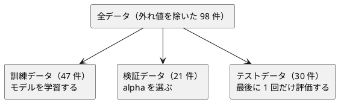

# 第 12 章: 正則化とモデル選択

## 12.1 はじめに

前の章では、1 回の分割に頼らずモデルを評価する方法を学びました。この章では、モデルそのものを「未知のデータに強くする」正則化と、複数の候補から 1 つを選ぶモデル選択を扱います。

- **リッジ回帰**（L2 正則化）を、第 7 章の `Matrix` を使って閉形式で自作する
- **ラッソ回帰**（L1 正則化）を Tribuo の `ElasticNetCDTrainer` で学習し、係数がちょうど 0 になる様子を確かめる
- 正則化の強さ `alpha` ごとに実験し、**検証データ** で 1 つを選ぶ

[Python 版の第 12 章](../python/12-regularization-and-model-selection.md) と同じ TODO リストで進め、同じ JVM・同じ Tribuo を使う [Java 版](../java/12-regularization-and-model-selection.md)・[Kotlin 版](../kotlin/12-regularization-and-model-selection.md) と、関数型の [F# 版](../fsharp/12-regularization-and-model-selection.md) を対比します。Kotlin 版は行列の足し算を **拡張関数** で足し、Java 版は `MatrixOperations` という static メソッドのクラスを作りました。Scala 版は Kotlin と同じく **拡張メソッド（`extension`）** で、第 7 章の `Matrix` を変えずに演算を足します。

## 12.2 過学習と正則化

### 係数が大きくなりすぎる

線形回帰は、予測値と正解の差（誤差）の 2 乗の合計が最小になるように係数を決めます。特徴量が多いと、訓練データの細かな揺れにまで合わせようとして、係数の絶対値が大きくなりがちです。係数が大きいモデルは、入力が少し変わっただけで予測が大きく変わるので、未知のデータに弱くなります。

### 係数の大きさに罰則を加える

正則化は、誤差の 2 乗の合計に「係数の大きさ」への罰則を加えて最小化します。

| 手法 | 最小化するもの | 係数への効果 |
|------|--------------|------------|
| 線形回帰 | 誤差の 2 乗の合計 | 制約なし |
| リッジ回帰 | 誤差の 2 乗の合計 + `alpha` × 係数の 2 乗の合計 | 全体を小さく縮める |
| ラッソ回帰 | 誤差の 2 乗の合計 + `alpha` × 係数の絶対値の合計 | 一部の係数をちょうど 0 にする |

`alpha` は正則化の強さです。0 なら線形回帰と同じで、大きくするほど係数は小さくなります。大きすぎると、今度は訓練データにも合わなくなります（学習不足）。ちょうどよい `alpha` はデータによって違うので、実験して選びます。

### リッジ回帰の解き方

リッジ回帰は、行列の計算で係数を直接求められます（閉形式）。特徴量の行列を `X`、正解を `t` として、それぞれから平均を引いた（中心化した）うえで、次の連立一次方程式を解きます。

```text
(Xᵀ X + alpha × I) w = Xᵀ t
```

`I` は単位行列です。切片は「正解の平均 − 特徴量の平均と係数の内積」で求めます。中心化してから解くのは、切片には罰則をかけないためです。第 7 章の正規方程式に `alpha × I` の項が加わっただけなので、第 7 章の `Matrix` の `*`・`transpose`・`solve` をそのまま使えます。足りないのは、行列の足し算と、数と行列の積と、単位行列です。

## 12.3 題材とデータ

### Boston.csv

この章で使うのは `Boston.csv` です。地区ごとの住宅価格（`PRICE`）と特徴量が記録されています。この章ではそのうち、住居の平均部屋数（`RM`）・生徒と教師の比率（`PTRATIO`）・低所得者の割合（`LSTAT`）の 3 つを使います。この 4 列には欠損値がありません。学習データの入手と配置は [第 1 章](01-machine-learning-and-first-test.md) を参照してください。

### 過学習が起きやすい状況を作る

3 つの特徴量をそれぞれ標準化（平均 0・標準偏差 1）したうえで、2 乗の列と、2 つの列の積（交互作用）の列を加えます。3 列が 9 列に増え、少ない件数に対しては過学習が起きやすい状況になります。多項式特徴量と標準化、外れ値の扱いは [第 9 章](09-feature-engineering.md) で扱いました。

第 9 章の `PolynomialFeatures.expand` は「渡された特徴量から 2 次の項を作る」関数、`Standardizer` は「列ごとの平均と件数で割る標準偏差で変換する」値です。この章は Kotlin 版・Java 版と同じく「標準化してから 2 次の項を作る」順なので、`Standardizer.fit` → `transform` → `expand` の順に呼ぶだけで足ります。Java 版は同じ目的で `PolynomialScaler` というクラスをこの章に作りましたが、Scala 版は第 9 章の 2 つを組み合わせるだけで済みました。

```scala
// src/main/scala/machinelearning/chapter12/Boston.scala
    val standardizer = Standardizer.fit(inner.xTrain)
    def transform(rows: Vector[Features]): Vector[Features] =
      PolynomialFeatures.expand(standardizer.transform(rows), FeatureColumns)
```

列の名前も第 9 章の `Term` が付けます（`RM^2`・`RM LSTAT`）。scikit-learn の `get_feature_names_out` と同じ形です。

### 訓練・検証・テストの 3 つに分ける

`alpha` をテストデータの結果で選ぶと、テストデータに合わせてモデルを選んだことになり、テストデータが「未知のデータ」ではなくなります。そこで、データを次の 3 つに分けます。件数は Scala 版で実測した値です。



分割には第 2 章の `Preprocessing.splitTrainTest` を 2 回使います。1 回目で全体を訓練用とテスト用に、2 回目で訓練用をさらに訓練データと検証データに分けます。

## 12.4 TODO リストの作成

**TODO リスト**:

- [ ] リッジ回帰を自作する
  - [ ] `alpha` が 0 なら最小二乗法と同じ係数と切片になる
  - [ ] 特徴量が 2 つでも係数と切片を求める
  - [ ] 行列の足し算・数と行列の積・単位行列を用意する
  - [ ] `alpha` を大きくすると係数が小さくなる
  - [ ] `alpha` が 0 なら第 7 章の線形回帰と同じ係数になる
  - [ ] 係数と切片から予測する
- [ ] 正則化の強さごとの実験結果を、書き換えられない値として記録する
- [ ] 検証データの決定係数が最も高い実験を選ぶ
- [ ] 0 になった係数の特徴量名を返す
- [ ] Tribuo の `ElasticNetCDTrainer` でラッソ回帰とリッジ回帰を表す
- [ ] 標準化してから 2 次の多項式特徴量を作る
- [ ] 外れ値の行を除く
- [ ] 実データを 3 つに分けて、線形回帰・リッジ回帰・ラッソ回帰を比べる

## 12.5 リッジ回帰を自作する

### Red: 最小二乗法と同じになるテスト

`alpha` が 0 なら、リッジ回帰は罰則の無い最小二乗法と同じ解になります。傾き 2・切片 0 の直線に乗る 3 件で確かめます。

```scala
// src/test/scala/machinelearning/chapter12/RidgeSpec.scala
  private val x = Matrix(Vector(Vector(1.0), Vector(2.0), Vector(3.0)))
  private val t = Vector(2.0, 4.0, 6.0)

  test("alpha が 0 なら最小二乗法と同じ係数と切片になる") {
    val model = Ridge.fit(x, t, 0.0)

    assert(model.coefficients.head === 2.0 +- 1e-9)
    assert(model.intercept === 0.0 +- 1e-9)
  }
```

`Ridge` も `RegularizedModel` もまだ無いので、コンパイルできないことが Red です。

### 三角測量

仮実装（期待値をそのまま返す）から一般化させるために、特徴量が 2 つのテストを足します。2 列目は 1 列目の 2 乗で、正解は `x² + x + 1` です。

```scala
  test("特徴量が 2 つでも係数と切片を求める") {
    val x2 = Matrix(Vector(Vector(1.0, 1.0), Vector(2.0, 4.0), Vector(3.0, 9.0), Vector(4.0, 16.0)))
    // 2 列目は 1 列目の 2 乗。正解は x^2 + x + 1
    val t2 = Vector(3.0, 7.0, 13.0, 21.0)

    val model = Ridge.fit(x2, t2, 0.0)

    assert(model.coefficients.head === 1.0 +- 1e-6)
    assert(model.coefficients(1) === 1.0 +- 1e-6)
    assert(model.intercept === 1.0 +- 1e-6)
  }
```

このテストは、最初に正解の値を計算し間違えて書いたために失敗しました（`x=2` の正解を 8 と書いていました）。失敗メッセージは実装ではなく期待値の誤りを指していたので、正解の列を計算し直して直しています。TDD では「テストが落ちたら実装を疑う」のが原則ですが、期待値を手で計算する種類のテストでは、計算式そのものをコメントに書いて根拠を残すのが安全でした。

### 元のクラスを変えずに演算を足す

`(Xᵀ X + alpha I)` を作るには、行列の足し算・数と行列の積・単位行列が要ります。第 7 章の `Matrix` は変えずに、この章で **拡張メソッド** として足します。

```scala
// src/main/scala/machinelearning/chapter12/Ridge.scala
object MatrixOps:

  extension (matrix: Matrix)
    /** 同じ大きさの行列の和。 */
    def +(other: Matrix): Matrix =
      require(
        matrix.rowCount == other.rowCount && matrix.columnCount == other.columnCount,
        s"${matrix.rowCount} 行 ${matrix.columnCount} 列の行列と " +
          s"${other.rowCount} 行 ${other.columnCount} 列の行列は足せません"
      )
      Matrix(matrix.rows.lazyZip(other.rows).map(_.lazyZip(_).map(_ + _)).toVector)

    /** すべての成分を scalar 倍した行列。 */
    def *(scalar: Double): Matrix = Matrix(matrix.rows.map(_.map(_ * scalar)))

    /** 列ごとの平均。 */
    def columnMeans: Vector[Double] =
      (0 until matrix.columnCount).toVector.map(j => matrix.column(j).sum / matrix.rowCount)

  /** size 行 size 列の単位行列。 */
  def identity(size: Int): Matrix =
    require(size >= 1, "単位行列の大きさは 1 以上にしてください")
    Matrix(
      (0 until size).toVector.map(i =>
        (0 until size).toVector.map(j => if i == j then 1.0 else 0.0)
      )
    )
```

- Java 版は `MatrixOperations.plus(a, b)`・`MatrixOperations.times(alpha, m)` という static メソッドで書きました。Scala は Kotlin と同じく、`a + b`・`m * alpha` と **演算子の形** で書けます。`import MatrixOps.*` を書いたファイルの中だけで有効なので、第 7 章の `Matrix` の見た目はどこからでも変わりません
- `*` は `Matrix` にすでにあります（行列の積）。引数が `Double` のときだけ拡張メソッドが選ばれるので、オーバーロードとして共存します
- `Matrix` が不変なので、Java 版のように写しを作って書き換える必要がありません。「足し算と数倍は元の行列を変えない」というテストは、Scala では型の約束をなぞるだけの確認になります

### 学習

中心化してから、第 7 章の `solve` に渡します。

```scala
  def fit(x: Matrix, t: Vector[Double], alpha: Double): RegularizedModel =
    require(x.rowCount == t.size, "特徴量と正解の件数が違います")
    val xMeans = x.columnMeans
    val tMean = t.sum / t.size
    val centered = Matrix(x.rows.map(_.lazyZip(xMeans).map(_ - _).toVector))
    val transposed = centered.transpose
    val penalized = transposed * centered + identity(xMeans.size) * alpha
    val coefficients =
      penalized.solve(transposed * Matrix.columnVector(t.map(_ - tMean)*)).column(0)
    RegularizedModel(coefficients, tMean - xMeans.lazyZip(coefficients).map(_ * _).sum)
```

`transposed * centered + identity(n) * alpha` は、`*` が `+` より優先されるので、括弧なしで数式どおりに読めます（Scala の演算子の優先順位は記号の先頭文字で決まります）。

### 正則化の効果と第 7 章との突き合わせ

`alpha` を大きくすると係数が縮むことと、`alpha = 0` なら第 7 章の線形回帰と同じになることをテストで固定します。

```scala
  test("alpha を大きくすると係数の絶対値の合計が小さくなる") {
    val sums = Vector(0.0, 1.0, 10.0, 100.0).map(Ridge.fit(x, t, _).coefficientAbsSum)

    assert(sums === sums.sorted.reverse)
  }

  test("alpha が 0 なら第 7 章の線形回帰と同じ係数と切片になる") {
    val (xr, tr) = Samples.randomDataset()
    val columns = Vector("a", "b", "c")

    val model = Ridge.fit(xr, tr, 0.0)
    val linear = LinearRegression.fit(Samples.toFeatures(xr, columns), tr)

    columns.lazyZip(model.coefficients).foreach { (column, coefficient) =>
      assert(coefficient === linear.coefficient(column) +- 1e-8, column)
    }
    assert(model.intercept === linear.intercept +- 1e-8)
  }
```

「単調に減る」ことは、`sums === sums.sorted.reverse`（降順に並べたものと等しい）で表しました。第 7 章の `LinearRegression.fit` は列名つきの `Features` を受け取るので、行列に名前を付けて渡しています。第 7 章は計画行列（1 の列を足した行列）で切片ごと解き、この章は中心化して切片を後から求める、別の解き方です。それでも 1e-8 の範囲で一致しました。

### 予測する

```scala
case class RegularizedModel(coefficients: Vector[Double], intercept: Double):

  /** 行ごとの予測値。行列の列数は係数の数と同じでなければならない。 */
  def predict(x: Matrix): Vector[Double] =
    require(
      x.columnCount == coefficients.size,
      s"特徴量の列数 ${x.columnCount} と係数の数 ${coefficients.size} が違います"
    )
    x.rows.map(row => intercept + row.lazyZip(coefficients).map(_ * _).sum)

  /** 係数の絶対値の合計。正則化が強いほど小さくなる。 */
  def coefficientAbsSum: Double = coefficients.map(math.abs).sum
```

Java 版は `List.copyOf` で係数のリストを守りましたが、`Vector` は不変なのでそのまま持てます。

## 12.6 実験結果を記録して選ぶ

### 書き換えられない実験結果

`alpha` 1 つ分の結果は、4 つの数を持つだけの値です。

```scala
case class Experiment(
    alpha: Double,
    trainScore: Double,
    validationScore: Double,
    coefficientAbsSum: Double
)
```

Java 版は record にしました。Scala の case class は record と違って `copy` を持つので、テストで「検証データの決定係数だけを変えた実験」を作るのが簡単です。この章のテストでは、`experiment(alpha, validationScore)` という小さな補助関数で読みやすくしています。

```scala
  def runRidgeExperiments(
      xTrain: Matrix,
      tTrain: Vector[Double],
      xValid: Matrix,
      tValid: Vector[Double],
      alphas: Vector[Double]
  ): Vector[Experiment] =
    alphas.map { alpha =>
      val model = Ridge.fit(xTrain, tTrain, alpha)
      Experiment(
        alpha,
        RegressionMetrics.r2Score(tTrain, model.predict(xTrain)),
        RegressionMetrics.r2Score(tValid, model.predict(xValid)),
        model.coefficientAbsSum
      )
    }
```

### 検証データで最もよい実験を選ぶ

```scala
  /** 検証データの決定係数が最も高い実験。同じ値なら先の実験を選ぶ。 */
  def bestExperiment(experiments: Vector[Experiment]): Experiment =
    require(experiments.nonEmpty, "実験結果が 1 件もありません")
    experiments.reduceLeft((best, next) =>
      if next.validationScore > best.validationScore then next else best
    )
```

`maxBy` でも書けますが、同点のときにどちらが選ばれるかが実装に委ねられます。第 3 章の `bestSplit` と同じく、「次の候補が **より大きいときだけ** 置き換える」と書けば、同点なら先の実験が残ることがコードから読めます。テストでも固定しました。

```scala
  test("検証データの決定係数が同じなら先の実験を選ぶ") {
    val experiments = Vector(experiment(0.0, 0.8), experiment(1.0, 0.8))

    assert(ModelSelection.bestExperiment(experiments).alpha === 0.0)
  }
```

## 12.7 0 になった係数の特徴量名を返す

ラッソ回帰は一部の係数をちょうど 0 にします。どの特徴量が落ちたのかを名前で返します。

```scala
  def zeroCoefficientNames(
      coefficients: Vector[Double],
      featureNames: Vector[String]
  ): Vector[String] =
    require(coefficients.size == featureNames.size, "係数と特徴量名の数が違います")
    coefficients.lazyZip(featureNames).collect { case (0.0, name) => name }.toVector
```

`collect` のパターン `case (0.0, name)` は、「係数がちょうど 0 の組だけを取り、その名前を返す」と読みます。Java 版は `IntStream.range` で添字を回し、`filter` してから `mapToObj` で名前に変えました。Scala は添字を使わず、選ぶ条件と取り出す値を 1 つのパターンで書けます。

## 12.8 Tribuo の ElasticNetCDTrainer で表す

### ElasticNetCDTrainer が最小化するもの

ラッソ回帰は、係数の絶対値に罰則をかけると式が微分できない点を含むため、リッジ回帰のように 1 回の行列計算では解けず、座標降下法などの反復計算が必要になります。Python 版・Kotlin 版・Java 版と同じく自作はせず、Tribuo の `ElasticNetCDTrainer` を使います。ラッソ回帰とリッジ回帰を混ぜた **エラスティックネット** を学習するトレーナーで、引数は `ElasticNetCDTrainer(alpha, l1Ratio, tolerance, maxIterations, randomise, seed)` です。`l1Ratio` は罰則のうちラッソ回帰（L1）の割合です。

Kotlin 版（[ADR 002](../../../adr/002-kotlin-ml-libraries.md)）で Tribuo 4.3.2 のソースを読んで確かめたとおり、`ElasticNetCDTrainer` は特徴量を中心化したうえで、次の値を最小化します（`n` は件数）。

```text
(1/2n) × 誤差の 2 乗の合計 + alpha × l1Ratio × 係数の絶対値の合計 + (alpha × (1 − l1Ratio) / 2) × 係数の 2 乗の合計
```

12.2 節のリッジ回帰（`誤差の 2 乗の合計 + λ × 係数の 2 乗の合計`）と比べると全体が `1/2n` 倍なので、リッジ回帰の `λ` は `alpha × (1 − l1Ratio) × n` に当たります。自作と同じ尺度で比べるには、`alpha` を件数 `n` で割って渡します。Scala 版でも同じ依存（Tribuo 4.3.2 の `tribuo-regression-slm`、第 7 章で追加済み）を使うので、この 2 つの約束事を Scala のテストで確かめます。

### Red: ラッソ回帰とリッジ回帰のテスト

ラッソ回帰では、予測に関係しない 2 列を含む人工データで学習させると、その 2 列の係数だけがちょうど 0 になるはずです。リッジ回帰は `l1Ratio` を 0 にすれば純粋なリッジ回帰になるはずですが、Kotlin 版で `ElasticNetCDTrainer` は `l1Ratio = 0` を受け付けず、受け付ける下限は `1e-12` でした。この境界もテストに含めます。

```scala
// src/test/scala/machinelearning/chapter12/TribuoRegularizationSpec.scala
class TribuoRegularizationSpec extends AnyFunSuite:

  test("ラッソ回帰では予測に役立たない特徴量の係数が 0 になる") {
    val (x, t) = Samples.sparseDataset()

    val model = TribuoRegularization.fitLasso(x, t, 0.5)

    assert(
      ModelSelection.zeroCoefficientNames(
        model.coefficients,
        Vector("x1", "x2", "noise1", "noise2")
      ) === Vector("noise1", "noise2")
    )
  }

  test("ElasticNetCDTrainer は l1Ratio が 0 のリッジ回帰を受け付けない") {
    val thrown = intercept[PropertyException](ElasticNetCDTrainer(0.5, 0.0))

    assert(thrown.getMessage.endsWith("L1 Ratio must be between 0 and 1. Found value 0.0"))
  }

  test("ElasticNetCDTrainer は l1Ratio の下限の 1e-12 を受け付け、1e-13 を受け付けない") {
    assert(ElasticNetCDTrainer(0.5, TribuoRegularization.MinL1Ratio) !== null)
    assert(intercept[PropertyException](ElasticNetCDTrainer(0.5, 1e-13)).getMessage.nonEmpty)
  }

  test("l1Ratio を下限まで小さくし alpha を件数で割ると自作のリッジ回帰と同じ係数と切片になる") {
    val (x, t) = Samples.randomDataset()

    val model = TribuoRegularization.fitRidge(x, t, 10.0)
    val expected = Ridge.fit(x, t, 10.0)

    expected.coefficients.lazyZip(model.coefficients).foreach { (a, b) =>
      assert(b === a +- 1e-6)
    }
    assert(model.intercept === expected.intercept +- 1e-6)
  }
```

- `PropertyException` は、Tribuo が設定の検査に使っているライブラリ OLCUT の例外です。`l1Ratio` の範囲の検査はコンストラクタの中で行われるので、学習する前に例外になります
- メッセージの先頭には設定項目の名前が付くので、末尾だけを `endsWith` で比べます。Kotlin 版は `substringAfter(", ")`、Java 版は AssertJ の `hasMessageEndingWith` で同じことをしました
- 人工データは、`java.util.Random` の `nextGaussian` で作ります。乱数の種を固定しているので、この 4 件のテストは何度走らせても同じ結果になります

### Green: 行列を Tribuo のデータセットに変換する

第 7 章の `TribuoRegression.train` は、`Vector[Features]` と正解から Tribuo のデータセットを作って学習します。この章の特徴量は行列なので、列に `x0`・`x1`… という名前を付けて `Features` に変換し、第 7 章の関数をそのまま使います。

```scala
// src/main/scala/machinelearning/chapter12/TribuoRegularization.scala
  def fitElasticNet(
      x: Matrix,
      t: Vector[Double],
      alpha: Double,
      l1Ratio: Double
  ): RegularizedModel =
    val trainer = ElasticNetCDTrainer(alpha, l1Ratio, Tolerance, MaxIterations, false, Seed)
    val model = TribuoRegression.train(trainer, toFeatures(x), t).asInstanceOf[SparseLinearModel]
    val weights = model.getWeights.values.iterator.next
    val coefficients =
      featureNames(x).map(name => weights.get(model.getFeatureIDMap.get(name).getID))
    val tMean = t.sum / t.size
    RegularizedModel(coefficients, tMean - x.columnMeans.lazyZip(coefficients).map(_ * _).sum)

  /** l1Ratio を 1 にしたラッソ回帰。 */
  def fitLasso(x: Matrix, t: Vector[Double], alpha: Double): RegularizedModel =
    fitElasticNet(x, t, alpha, 1.0)

  /** 自作のリッジ回帰と同じ alpha の尺度で、ElasticNetCDTrainer にリッジ回帰を学習させる。 */
  def fitRidge(x: Matrix, t: Vector[Double], alpha: Double): RegularizedModel =
    fitElasticNet(x, t, alpha / t.size, MinL1Ratio)
```

- Tribuo は係数を **特徴量の ID** で引く疎ベクトルで返すので、列名 → ID → 重みの順にたどります。Tribuo は特徴量の平均を引いてから学習するので、切片は特徴量と正解の平均値から自分で求めます
- `asInstanceOf[SparseLinearModel]` は Java 版のキャストと同じです。Tribuo の `Trainer` は `Model[Regressor]` を返すので、係数を読むために実際の型に落とします。型の安全を落とす操作なので、第 7 章の `TribuoRegression.train` の戻り値を変えるのではなく、この章の中だけで行います

## 12.9 外れ値を除く

`Boston.csv` には、価格や部屋数が極端な地区が含まれます。この章では Kotlin 版・Java 版と同じく、**z スコア**（平均から標準偏差いくつ分離れているか）の絶対値が 3 を超える値を 1 つでも持つ行を除きます。

```scala
  def removeOutliers(table: Table, columns: Vector[String], threshold: Double): Table =
    val stats = columns.map { column =>
      val values = table.rows.map(number(_, column))
      val mean = values.sum / values.size
      val std =
        math.sqrt(values.map(value => (value - mean) * (value - mean)).sum / (values.size - 1))
      (column, mean, std)
    }
    table.copy(rows =
      table.rows.filterNot(row =>
        stats.exists((column, mean, std) =>
          math.abs((number(row, column) - mean) / std) > threshold
        )
      )
    )
```

`filterNot` と `exists` で「どれか 1 列でも外れ値なら除く」と書けます。Java 版は二重ループとフラグ変数で同じことを書きました。標準偏差は件数から 1 を引いて割る **標本標準偏差** です（第 9 章の `Standardizer` は件数で割る母標準偏差で、目的が違います）。`table.copy(rows = …)` は case class の `copy` なので、列名はそのまま引き継がれます。

## 12.10 実データで比べる

### 結果を表示する

`Main` は、正則化の強さ `0.0`・`0.1`・`1.0`・`10.0`・`100.0` で実験し、検証データで選んだ `alpha` のリッジ回帰と線形回帰（`alpha = 0`）をテストデータで比べ、ラッソ回帰（`alpha = 0.5`）で 0 になった特徴量を表示します。

```scala
// src/main/scala/machinelearning/chapter12/Main.scala
object Main:
  private val TestSize = 0.3
  private val ValidationSize = 0.3
  private val Seed = 0L
  private val Alphas = Vector(0.0, 0.1, 1.0, 10.0, 100.0)
  private val LassoAlpha = 0.5

  // Tribuo の座標降下法が収束のたびに出す INFO のログを表示しない。
  // Logger は弱い参照で管理されるので、設定した Logger を val で持ち続ける
  private val TribuoLogger = Logger.getLogger(classOf[ElasticNetCDTrainer].getName)

  def run(print: String => Unit): Unit =
    TribuoLogger.setLevel(Level.WARNING)
    …
    val experiments =
      ModelSelection.runRidgeExperiments(data.xTrain, data.tTrain, data.xValid, data.tValid, Alphas)
    print("alpha  訓練 R²  検証 R²  係数の絶対値の合計")
    experiments.foreach(e =>
      print(
        String.format(
          Locale.ROOT,
          "%5.1f  %.4f  %.4f  %.3f",
          e.alpha,
          e.trainScore,
          e.validationScore,
          e.coefficientAbsSum
        )
      )
    )
```

- Tribuo の `ElasticNetCDTrainer` は、学習のたびに `java.util.logging` の INFO のログを出します。Kotlin 版・Java 版と同じく、その `Logger` の水準を `WARNING` に上げて表示しないようにしました。`Logger.getLogger` が返す `Logger` は弱い参照で管理され、ほかに参照が無いと回収されて設定が消えることがあるので、`val` のフィールドで持ち続けます
- 表の書式は `String.format` の `%5.1f`（幅 5、小数 1 桁）でそろえます。Scala の `Double` は `java.lang.Double` に箱詰めされて可変長引数に渡るので、Java 版と同じ書式がそのまま使えます

```console
$ sbt "run chapter12"
データ件数: 98（外れ値 2 件を除外）
訓練データ: 47 件, 検証データ: 21 件, テストデータ: 30 件
特徴量: RM, PTRATIO, LSTAT, RM^2, RM PTRATIO, RM LSTAT, PTRATIO^2, PTRATIO LSTAT, LSTAT^2
alpha  訓練 R²  検証 R²  係数の絶対値の合計
  0.0  0.8827  0.7272  14.187
  0.1  0.8827  0.7274  14.104
  1.0  0.8823  0.7288  13.594
 10.0  0.8681  0.7349  11.573
100.0  0.6583  0.5985  5.684
検証データで選んだ alpha: 10.0
テストデータの決定係数: 線形回帰 0.5224, リッジ回帰 0.6243
ラッソ回帰（alpha=0.5）で係数が 0 になった特徴量: PTRATIO^2, PTRATIO LSTAT, LSTAT^2
```

### 結果を読む

- `alpha` を大きくするほど、係数の絶対値の合計は 14.187 から 5.684 へ小さくなりました。訓練データの決定係数は下がり続けます
- 検証データの決定係数は `alpha = 10.0` で最も高く（0.7349）、`100.0` では訓練・検証とも大きく下がりました。正則化が強すぎて学習不足になっています
- 検証データで選んだ `alpha = 10.0` のリッジ回帰は、テストデータの決定係数が 0.6243 で、線形回帰の 0.5224 を上回りました。訓練データでは線形回帰のほうが高い（0.8827）のに、未知のデータでは正則化したモデルのほうがよく当たっています
- ラッソ回帰は、9 列のうち `PTRATIO^2`・`PTRATIO LSTAT`・`LSTAT^2` の 3 列の係数をちょうど 0 にしました

**この出力は、[Java 版の第 12 章](../java/12-regularization-and-model-selection.md) の実測値と 1 行残らず一致しました。** 外れ値の除外（98 件）・3 つの件数（47・21・30）・9 列の名前・5 つの `alpha` の決定係数と係数の合計・テストデータの決定係数・ラッソ回帰で 0 になった 3 列のすべてです。分割に同じ乱数（`java.util.Random` の Fisher-Yates）を使い、標準化と多項式特徴量の順も同じだからです。

Kotlin 版では、同じ手順でも検証データで選んだリッジ回帰のテストの決定係数が線形回帰より低くなりました（Kotlin 版の 12.10 節）。Kotlin 版とは分割の乱数が違い、訓練・検証・テストに入る行が違うからです。100 件ほどのデータでは、分け方によって結論まで変わりうることを示しています。1 回の分け方に頼らない方法として、[第 11 章](11-evaluation-metrics-and-cross-validation.md) の交差検証を組み合わせられます。

### 実データのテスト

実データのテストは、学習データが無ければスキップします。3 つの件数、実データでの自作のリッジ回帰と Tribuo の一致、`Main` の出力を固定します。

```scala
// src/test/scala/machinelearning/chapter12/BostonDataSpec.scala（抜粋）
  test("実データでも自作のリッジ回帰は Tribuo の ElasticNetCDTrainer と同じ係数と切片になる") {
    requireData(): Unit
    val data = dataset()

    val model = Ridge.fit(data.xTrain, data.tTrain, 10.0)
    val tribuo = TribuoRegularization.fitRidge(data.xTrain, data.tTrain, 10.0)

    model.coefficients.lazyZip(tribuo.coefficients).foreach { (a, b) =>
      assert(b === a +- 1e-6)
    }
    assert(tribuo.intercept === model.intercept +- 1e-6)
  }
```

9 列・47 件の実データでも、自作の閉形式と Tribuo の座標降下法は 1e-6 の範囲で一致しました。

## 12.11 可視化について

Scala 版では Notebook と可視化の節を設けません。`alpha` と係数・決定係数の変化のグラフや、分け方による結果の違いの探索は、[Python 版の第 12 章](../python/12-regularization-and-model-selection.md) と [Kotlin 版の第 12 章](../kotlin/12-regularization-and-model-selection.md) の Notebook の節を参照してください。

## 12.12 品質チェック

`sbt "scalafmtAll; scalafmtCheckAll; test"` で、整形・コンパイル・テストをまとめて実行しました。この章の実装で `-Xfatal-warnings` に止められた箇所はありません。

```text
BostonSpec:
- z スコアの絶対値が閾値を超える値を持つ行を除く
- 閾値より小さい z スコアの行は残す
- 外れ値を調べる列は特徴量と正解
RidgeSpec:
- alpha が 0 なら最小二乗法と同じ係数と切片になる
- 特徴量が 2 つでも係数と切片を求める
- alpha を大きくすると係数の絶対値の合計が小さくなる
- alpha が 0 なら第 7 章の線形回帰と同じ係数と切片になる
- 特徴量と正解の件数が違えばエラーになる
- 係数と切片から予測値を計算する
- 特徴量の列数と係数の数が違えばエラーになる
- 同じ大きさの行列を成分ごとに足す
- 大きさが違う行列は足せない
- 数と行列の積はすべての成分を数倍する
- 単位行列は対角成分が 1 でほかが 0
- 足し算と数倍は元の行列を変えない
ModelSelectionSpec:
- 正則化の強さごとに 1 件ずつ実験結果を記録する
- 正則化を強めると訓練データの決定係数は下がり係数の絶対値の合計も小さくなる
- 検証データの決定係数が最も高い実験を選ぶ
- 最も高い実験が途中にあってもそれを選ぶ
- 検証データの決定係数が同じなら先の実験を選ぶ
- 実験結果が 1 件も無ければエラーになる
- 0 になった係数の特徴量名を返す
- 係数と特徴量名の数が違えばエラーになる
BostonDataSpec:
- 外れ値を除いて訓練データと検証データとテストデータに分ける
- 実データでも自作のリッジ回帰は Tribuo の ElasticNetCDTrainer と同じ係数と切片になる
- 実行すると正則化の実験結果を表示する
TribuoRegularizationSpec:
- ラッソ回帰では予測に役立たない特徴量の係数が 0 になる
- ElasticNetCDTrainer は l1Ratio が 0 のリッジ回帰を受け付けない
- ElasticNetCDTrainer は l1Ratio の下限の 1e-12 を受け付け、1e-13 を受け付けない
- l1Ratio を下限まで小さくし alpha を件数で割ると自作のリッジ回帰と同じ係数と切片になる
```

学習データが無い環境（`ML_DATA_DIR=/nonexistent sbt test`）では、`BostonDataSpec` の 3 件が canceled になり、ビルドは成功します。

## 12.13 まとめ

この章では、正則化で過学習を抑え、検証データでモデルを選ぶ方法を Scala の TDD で実装しました。

1. **閉形式のリッジ回帰** — 中心化してから `(Xᵀ X + alpha I) w = Xᵀ t` を第 7 章の `solve` で解いた。`alpha = 0` なら第 7 章の線形回帰と同じ係数になることを確かめた
2. **元のクラスを変えずに演算を足す** — Java 版の static メソッドのクラスではなく、Kotlin の拡張関数と同じ `extension` で `a + b`・`m * alpha` と書けるようにした。`Matrix` が不変なので、写しを守るコードも要らない
3. **第 9 章をそのまま使えた** — Java 版がこの章に作った `PolynomialScaler` は、Scala 版では第 9 章の `Standardizer` と `PolynomialFeatures.expand` を順に呼ぶだけで済んだ。列名まで第 9 章の `Term` が付ける
4. **検証データによるモデル選択** — テストデータを最後の 1 回まで使わずに `alpha` を選んだ。Scala 版（＝ Java 版）の分割では、選んだリッジ回帰がテストデータで線形回帰を上回った
5. **Tribuo との突き合わせ** — `ElasticNetCDTrainer` は `l1Ratio = 0` を拒否し下限は `1e-12` であること、`alpha` を件数で割れば自作のリッジ回帰と一致することを、Scala 版でも確かめた。ラッソ回帰は予測に関係しない列の係数をちょうど 0 にした
6. **数値は Java 版と 1 行残らず一致した** — 乱数と手順をそろえれば、言語をまたいでも同じ結論になる

次の章では、正解ラベルを使わない教師なし学習に進み、第 7 章の `Matrix` を使って主成分分析を実装します。
